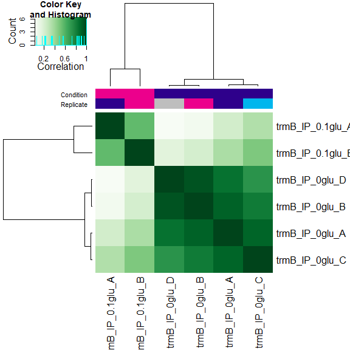
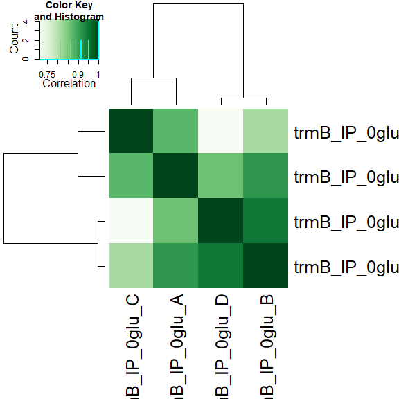
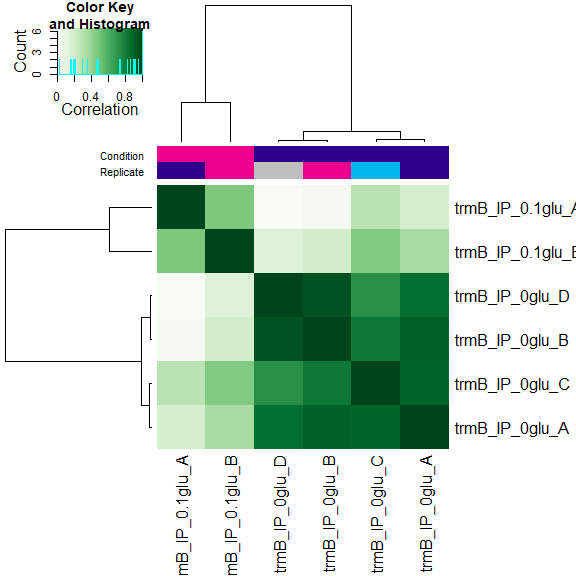
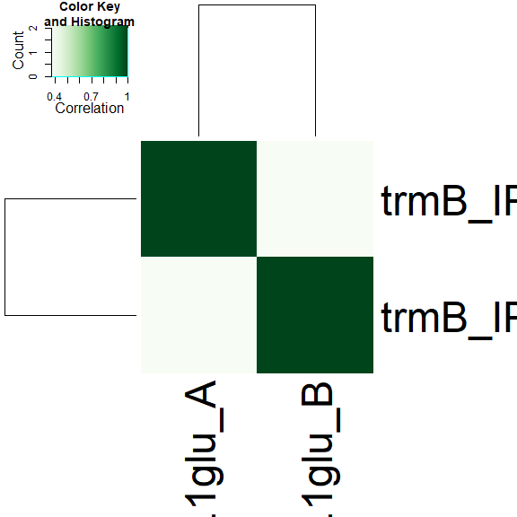
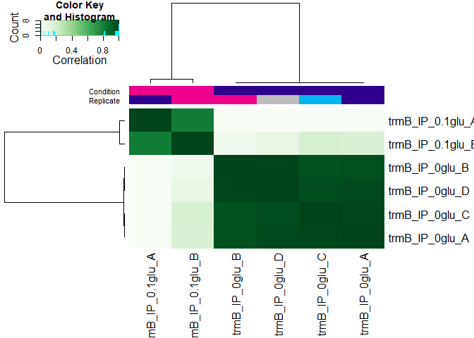
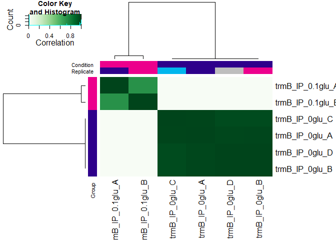
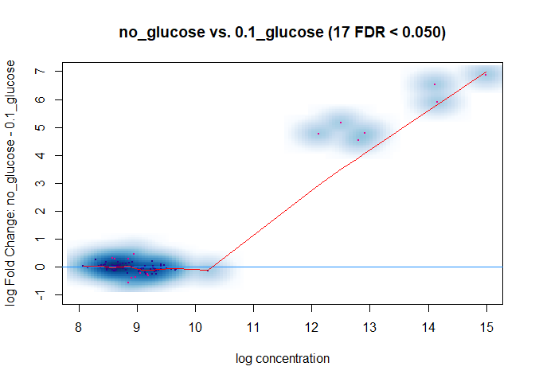
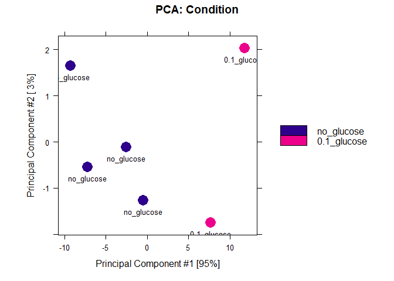
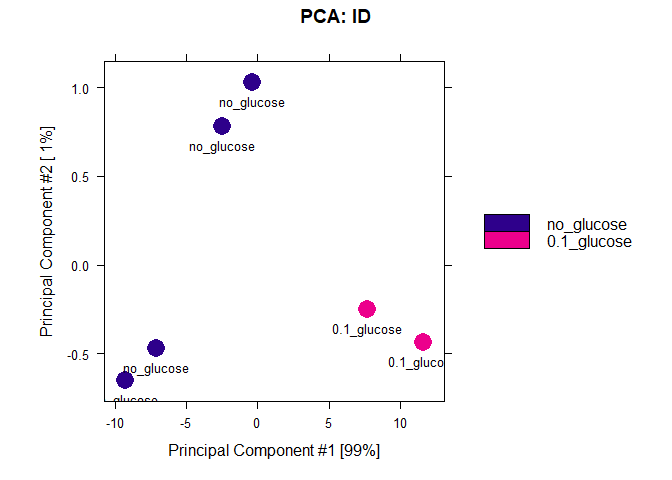
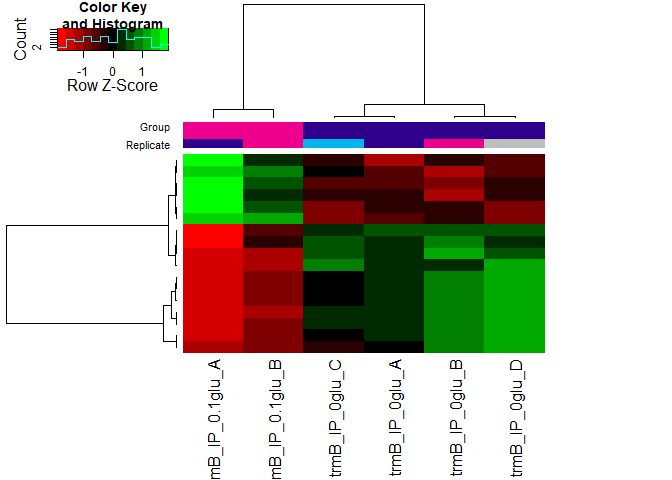

```r
# BiocManager::install(c("rtracklayer", "DiffBind"))
library(tidyverse)
library(rtracklayer)
library(DiffBind)
```

fragment sizes calculated by CHIPQC
WT_IP_0glu_A        104
WT_IP_0glu_B		    213
trmB_IP_0glu_A	    104
trmB_IP_0.1glu_A    167
trmB_IP_0glu_B	    200
trmB_IP_0.1glu_B	  103
trmB_IP_0glu_C      103
trmB_IP_0glu_D	    204	


```r
# load all tagged samples and greylist
(meta <- read_csv("01b_HCA_chip_meta.csv")[3:8, ])
```

```
## # A tibble: 6 × 10
##   SampleID Tissue Factor Condition Replicate bamReads ControlID bamControl Peaks
##   <chr>    <chr>  <chr>  <chr>         <dbl> <chr>    <chr>     <chr>      <chr>
## 1 trmB_IP… HCA    trmB   no_gluco…         1 00_sort… trmB_0gl… 00_sorted… 01a_…
## 2 trmB_IP… HCA    trmB   0.1_gluc…         1 00_sort… trmB_0.1… 00_sorted… 01a_…
## 3 trmB_IP… HCA    trmB   no_gluco…         2 00_sort… trmB_0gl… 00_sorted… 01a_…
## 4 trmB_IP… HCA    trmB   0.1_gluc…         2 00_sort… trmB_0.1… 00_sorted… 01a_…
## 5 trmB_IP… HCA    trmB   no_gluco…         3 00_sort… trmB_0gl… 00_sorted… 01a_…
## 6 trmB_IP… HCA    trmB   no_gluco…         4 00_sort… trmB_0gl… 00_sorted… 01a_…
## # ℹ 1 more variable: PeakCaller <chr>
```

```r
config <- list(
  minQCth = 30, fragmentSize = c(104, 167, 200, 103, 103, 204),
  bCorPlot = T, th = 0.05
)
grey <- import.bed("01b_greyList/WT_greyList.bed")

# create initial DBA object
trmB <- dba(sampleSheet = meta, peakFormat = "bed", minOverlap = 0.75, config = config)
```

<!-- -->

```r
# number of overlapping peaks in samples considered together or split by condition
dba.overlap(trmB, mode = DBA_OLAP_RATE)
```

```
## [1] 439 256 181 146 114  81
```

```r
dba.overlap(trmB, trmB$masks$`0.1_glucose`, mode = DBA_OLAP_RATE)
```

<!-- -->

```
## [1] 374 137
```

```r
dba.overlap(trmB, trmB$masks$no_glucose, mode = DBA_OLAP_RATE)
```

<!-- -->

```
## [1] 301 199 140 101
```
total of 439 unique peaks across all samples.  
137 are shared between both replicates with glucose. 
140 are shared between at least 3 replicates with no glucose.

Mask peaks identified in WT control samples

```r
trmB <- dba.blacklist(trmB, blacklist = FALSE, greylist = grey)
```

```
## Master greylist: 26 ranges, 44517 bases
```

```
## Removed: 116 of 1312 intervals.
```

```
## Removed: 16 merged (of 439) and -128 (of 114) consensus.
```

<!-- -->

```r
dba.overlap(trmB, mode = DBA_OLAP_RATE)
```

```
## [1] 423 242 167 132 100  66
```

```r
dba.overlap(trmB, trmB$masks$`0.1_glucose`, mode = DBA_OLAP_RATE)
```

<!-- -->

```
## [1] 358 121
```

```r
dba.overlap(trmB, trmB$masks$no_glucose, mode = DBA_OLAP_RATE)
```

<!-- -->

```
## [1] 284 181 124  87
```
total of 432 unique peaks across all samples.  
121 are shared between both replicates with glucose. 
124 are shared between at least 3 replicates with no glucose.

Calculate a binding matrix with scores based on read counts for every sample (affinity scores), rather than confidence scores for only those peaks called in a specific sample (occupancy scores).

```r
trmB <- dba.count(trmB, summits = 150, minOverlap = 0.75) # peaks must occur in 75% of replicates to be considered consensus peaks
```

```
## Computing summits...
```

```
## Warning: Fewer fragment sizes than libraries -- using mean fragment size for
## missing values
```

```
## Sample: 00_sorted_bams/4774_C5_S74_L004_R1_001_trimmed_sorted.bam104
```

```
## Sample: 00_sorted_bams/4774_D2_S51_L004_R1_001_trimmed_sorted.bam104
```

```
## Sample: 00_sorted_bams/4774_B4_S65_L004_R1_001_trimmed_sorted.bam104
```

```
## Sample: 00_sorted_bams/4774_A11_S120_L004_R1_001_trimmed_sorted.bam104
```

```
## Sample: 00_sorted_bams/4774_E7_S92_L004_R1_001_trimmed_sorted.bam104
```

```
## Sample: 00_sorted_bams/4774_E10_S116_L004_R1_001_trimmed_sorted.bam104
```

```
## Sample: 00_sorted_bams/4774_D3_S59_L004_R1_001_trimmed_sorted.bam104
```

```
## Sample: 00_sorted_bams/4774_H6_S87_L004_R1_001_trimmed_sorted.bam104
```

```
## Sample: 00_sorted_bams/4774_D12_S130_L004_R1_001_trimmed_sorted.bam104
```

```
## Sample: 00_sorted_bams/4774_E9_S108_L004_R1_001_trimmed_sorted.bam104
```

```
## Sample: 00_sorted_bams/4774_B5_S73_L004_R1_001_trimmed_sorted.bam104
```

```
## Sample: 00_sorted_bams/4774_B12_S128_L004_R1_001_trimmed_sorted.bam104
```

```
## Re-centering peaks...
```

```
## Sample: 00_sorted_bams/4774_C5_S74_L004_R1_001_trimmed_sorted.bam104
```

```
## Reads will be counted as Single-end.
```

```
## Sample: 00_sorted_bams/4774_D2_S51_L004_R1_001_trimmed_sorted.bam104
```

```
## Reads will be counted as Single-end.
```

```
## Sample: 00_sorted_bams/4774_B4_S65_L004_R1_001_trimmed_sorted.bam104
```

```
## Reads will be counted as Single-end.
```

```
## Sample: 00_sorted_bams/4774_A11_S120_L004_R1_001_trimmed_sorted.bam104
```

```
## Reads will be counted as Single-end.
```

```
## Sample: 00_sorted_bams/4774_E7_S92_L004_R1_001_trimmed_sorted.bam104
```

```
## Reads will be counted as Single-end.
```

```
## Sample: 00_sorted_bams/4774_E10_S116_L004_R1_001_trimmed_sorted.bam104
```

```
## Reads will be counted as Single-end.
```

```
## Sample: 00_sorted_bams/4774_D3_S59_L004_R1_001_trimmed_sorted.bam104
```

```
## Reads will be counted as Single-end.
```

```
## Sample: 00_sorted_bams/4774_H6_S87_L004_R1_001_trimmed_sorted.bam104
```

```
## Reads will be counted as Single-end.
```

```
## Sample: 00_sorted_bams/4774_D12_S130_L004_R1_001_trimmed_sorted.bam104
```

```
## Reads will be counted as Single-end.
```

```
## Sample: 00_sorted_bams/4774_E9_S108_L004_R1_001_trimmed_sorted.bam104
```

```
## Reads will be counted as Single-end.
```

```
## Sample: 00_sorted_bams/4774_B5_S73_L004_R1_001_trimmed_sorted.bam104
```

```
## Reads will be counted as Single-end.
```

```
## Sample: 00_sorted_bams/4774_B12_S128_L004_R1_001_trimmed_sorted.bam104
```

```
## Reads will be counted as Single-end.
```

<!-- -->

```r
trmB
```

```
## 6 Samples, 100 sites in matrix:
##                 ID Tissue Factor   Condition Replicate   Reads FRiP
## 1   trmB_IP_0glu_A    HCA   trmB  no_glucose         1 2137388 0.04
## 2 trmB_IP_0.1glu_A    HCA   trmB 0.1_glucose         1 2211753 0.05
## 3   trmB_IP_0glu_B    HCA   trmB  no_glucose         2 2173609 0.07
## 4 trmB_IP_0.1glu_B    HCA   trmB 0.1_glucose         2 2596095 0.02
## 5   trmB_IP_0glu_C    HCA   trmB  no_glucose         3 2297375 0.02
## 6   trmB_IP_0glu_D    HCA   trmB  no_glucose         4 2541819 0.17
```
100 peaks in the consensus, greylisted peakset

Normalize, set up contrasts, and execute differential binding analysis

```r
trmB <- dba.normalize(trmB, normalize = DBA_NORM_RLE, library = DBA_LIBSIZE_PEAKREADS) # DBA norm RLE has the best baseline, and identifies the most shared sites.
trmB <- dba.contrast(trmB, reorderMeta = list(Condition = "0.1_glucose"), minMembers = 2)
```

```
## Computing results names...
```

```r
trmB <- dba.analyze(trmB)
```

```
## Applying Blacklist/Greylists...
```

```
## No genome detected.
```

```
## Analyzing...
```

```
## gene-wise dispersion estimates
```

```
## mean-dispersion relationship
```

```
## final dispersion estimates
```

<!-- -->

```r
dba.plotMA(trmB, method = DBA_DESEQ2)
```

<!-- -->

```r
dba.show(trmB, bContrasts = TRUE)
```

```
##      Factor      Group Samples      Group2 Samples2 DB.DESeq2
## 1 Condition no_glucose       4 0.1_glucose        2        17
```

Visualize DBA results

```r
dba.plotHeatmap(trmB, contrast = 1)
```

<!-- -->

```r
# PCA for all sites in affinity matrix
dba.plotPCA(trmB, DBA_CONDITION, label = DBA_CONDITION)
```

<!-- -->

```r
# PCA plot using affinity data for only differential bound sites
dba.plotPCA(trmB, contrast = 1, label = DBA_CONDITION)
```

<!-- -->

```r
# binding affinity heatmap showing affinities for differential bound sites
hmap <- colorRampPalette(c("red", "black", "green"))(n = 13)
dba.plotHeatmap(trmB,
  contrast = 1,
  correlations = FALSE, scale = "row", colScheme = hmap
)
```

<!-- -->

view report, compile score, and export

```r
(trmB.DB <- dba.report(trmB, bFlip = T, bCalled = T, bCounts = T, bNormalized = F))
```

```
## GRanges object with 17 ranges and 14 metadata columns:
##         seqnames          ranges strand |      Conc Conc_0.1_glucose
##            <Rle>       <IRanges>  <Rle> | <numeric>        <numeric>
##   47 NC_015948.1 1358449-1358749      * |  14.98498          8.62388
##   20 NC_015948.1   151336-151636      * |   9.04849          9.83763
##   22 NC_015948.1   168781-169081      * |  14.10096          8.01402
##   11 NC_015944.1   133666-133966      * |  14.15206          8.76155
##   90 NC_015948.1 2701036-2701336      * |  12.07882          7.98584
##   ..         ...             ...    ... .       ...              ...
##   59 NC_015948.1 1767341-1767641      * |   8.89684          9.11504
##   66 NC_015948.1 1936884-1937184      * |   9.39303         10.10394
##    4 NC_015943.1   303594-303894      * |   8.63239          8.81698
##   24 NC_015948.1   257359-257659      * |   9.36231         10.05121
##   95 NC_015948.1 2821663-2821963      * |   9.21067          9.83605
##      Conc_no_glucose      Fold     p-value         FDR trmB_IP_0.1glu_A
##            <numeric> <numeric>   <numeric>   <numeric>        <numeric>
##   47        15.56408  -6.94020 1.18711e-11 1.18711e-09              370
##   20         8.39553   1.44209 6.14826e-10 3.07413e-08             1332
##   22        14.67883  -6.66481 1.26239e-09 4.20795e-08              217
##   11        14.72551  -5.96396 1.04096e-07 2.60241e-06              410
##   90        12.63532  -4.64948 2.00851e-07 4.01702e-06              241
##   ..             ...       ...         ...         ...              ...
##   59         8.77396  0.341080 0.000850942  0.00654571              744
##   66         8.83999  1.263952 0.001500034  0.01071453             1663
##    4         8.53041  0.286577 0.002040281  0.01360188              585
##   24         8.83526  1.215948 0.007620782  0.04652329             1603
##   95         8.75405  1.081998 0.007908960  0.04652329             1328
##      trmB_IP_0.1glu_B trmB_IP_0glu_A trmB_IP_0glu_B trmB_IP_0glu_C
##             <numeric>      <numeric>      <numeric>      <numeric>
##   47              419          17055          38193           7839
##   20              498            333            291            281
##   22              300           9526          20990           4504
##   11              458           7435          22760           3342
##   90              266           2586           5438           1489
##   ..              ...            ...            ...            ...
##   59              365            440            340            368
##   66              538            453            337            398
##    4              317            362            307            319
##   24              519            403            371            420
##   95              500            435            314            392
##      trmB_IP_0glu_D   Called1   Called2
##           <numeric> <numeric> <numeric>
##   47         130696         2         4
##   20            442         2         3
##   22          69893         1         4
##   11          74826         2         4
##   90          15936         1         4
##   ..            ...       ...       ...
##   59            603         2         4
##   66            645         2         4
##    4            491         2         4
##   24            633         2         4
##   95            586         2         4
##   -------
##   seqinfo: 3 sequences from an unspecified genome; no seqlengths
```

```r
trmB.DB$score <- trmB.DB$Fold
export.bed(trmB.DB, "02_DiffBind/02_diffbind2022.bed")
```
