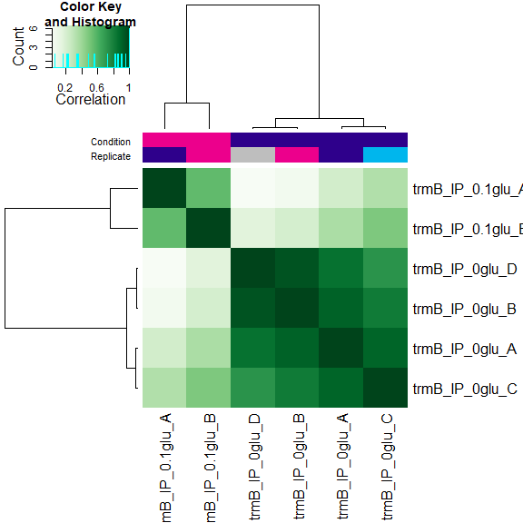

```r
# BiocManager::install(c("rtracklayer", "DiffBind"))
library(tidyverse)
library(openxlsx)
library(rtracklayer)
library(DiffBind)
```

fragment sizes calculated by CHIPQC
WT_IP_0glu_A        104
WT_IP_0glu_B		    213
trmB_IP_0glu_A	    104
trmB_IP_0.1glu_A    167
trmB_IP_0glu_B	    200
trmB_IP_0.1glu_B	  103
trmB_IP_0glu_C      103
trmB_IP_0glu_D	    204


```r
# load all tagged samples and greylist
(meta <- read_csv("01b_HCA_chip_meta.csv")[3:8, ])
```

```
## # A tibble: 6 × 10
##   SampleID Tissue Factor Condition Replicate bamReads ControlID bamControl Peaks
##   <chr>    <chr>  <chr>  <chr>         <dbl> <chr>    <chr>     <chr>      <chr>
## 1 trmB_IP… HCA    trmB   no_gluco…         1 00_sort… trmB_0gl… 00_sorted… 01a_…
## 2 trmB_IP… HCA    trmB   0.1_gluc…         1 00_sort… trmB_0.1… 00_sorted… 01a_…
## 3 trmB_IP… HCA    trmB   no_gluco…         2 00_sort… trmB_0gl… 00_sorted… 01a_…
## 4 trmB_IP… HCA    trmB   0.1_gluc…         2 00_sort… trmB_0.1… 00_sorted… 01a_…
## 5 trmB_IP… HCA    trmB   no_gluco…         3 00_sort… trmB_0gl… 00_sorted… 01a_…
## 6 trmB_IP… HCA    trmB   no_gluco…         4 00_sort… trmB_0gl… 00_sorted… 01a_…
## # ℹ 1 more variable: PeakCaller <chr>
```

```r
config <- list(
  minQCth = 30, fragmentSize = c(104, 167, 200, 103, 103, 204),
  bCorPlot = T, th = 0.05
)
grey <- import.bed("01b_greyList/WT_greyList.bed")

# create initial DBA object
trmB <- dba(sampleSheet = meta, peakFormat = "bed", minOverlap = 0.75, config = config)
```

```
## Warning: Unknown or uninitialised column: `Treatment`.
```

```
## Warning: Unknown or uninitialised column: `PeakFormat`.
```

```
## Warning: Unknown or uninitialised column: `ScoreCol`.
```

```
## Warning: Unknown or uninitialised column: `LowerBetter`.
```

```
## Warning: Unknown or uninitialised column: `Filter`.
```

```
## Warning: Unknown or uninitialised column: `Counts`.
```

```
## Warning: Unknown or uninitialised column: `Spikein`.
```

```
## Warning: Unknown or uninitialised column: `PeakFormat`.
```

```
## Warning: Unknown or uninitialised column: `ScoreCol`.
```

```
## Warning: Unknown or uninitialised column: `LowerBetter`.
```

```
## Warning: Unknown or uninitialised column: `Filter`.
```

```
## Warning: Unknown or uninitialised column: `Counts`.
```

```
## Warning: Unknown or uninitialised column: `Spikein`.
```

```
## Warning: Unknown or uninitialised column: `PeakFormat`.
```

```
## Warning: Unknown or uninitialised column: `ScoreCol`.
```

```
## Warning: Unknown or uninitialised column: `LowerBetter`.
```

```
## Warning: Unknown or uninitialised column: `Filter`.
```

```
## Warning: Unknown or uninitialised column: `Counts`.
```

```
## Warning: Unknown or uninitialised column: `Spikein`.
```

```
## Warning: Unknown or uninitialised column: `PeakFormat`.
```

```
## Warning: Unknown or uninitialised column: `ScoreCol`.
```

```
## Warning: Unknown or uninitialised column: `LowerBetter`.
```

```
## Warning: Unknown or uninitialised column: `Filter`.
```

```
## Warning: Unknown or uninitialised column: `Counts`.
```

```
## Warning: Unknown or uninitialised column: `Spikein`.
```

```
## Warning: Unknown or uninitialised column: `PeakFormat`.
```

```
## Warning: Unknown or uninitialised column: `ScoreCol`.
```

```
## Warning: Unknown or uninitialised column: `LowerBetter`.
```

```
## Warning: Unknown or uninitialised column: `Filter`.
```

```
## Warning: Unknown or uninitialised column: `Counts`.
```

```
## Warning: Unknown or uninitialised column: `Spikein`.
```

```
## Warning: Unknown or uninitialised column: `PeakFormat`.
```

```
## Warning: Unknown or uninitialised column: `ScoreCol`.
```

```
## Warning: Unknown or uninitialised column: `LowerBetter`.
```

```
## Warning: Unknown or uninitialised column: `Filter`.
```

```
## Warning: Unknown or uninitialised column: `Counts`.
```

```
## Warning: Unknown or uninitialised column: `Spikein`.
```

<!-- -->

```r
# Mask peaks identified in WT control samples
trmB <- dba.blacklist(trmB, blacklist = FALSE, greylist = grey)
```

<!-- -->

```r
plot(dba.overlap(trmB, mode = DBA_OLAP_RATE), type = "b", ylab = "# peaks", xlab = "Overlap at least this many peaksets")
```

<!-- -->

No glucose consensus peaks:

```r
meta %>% filter(Condition == "no_glucose") -> meta.noglu
config <- list(
  minQCth = 30, fragmentSize = c(104, 200, 103, 204),
  bCorPlot = T, th = 0.05
)
trmB.noglu <- dba(sampleSheet = meta.noglu, peakFormat = "bed", minOverlap = 0.75, config = config) # peaks must occur in 75% of replicates to be considered consensus peaks
```

```
## Warning: Unknown or uninitialised column: `Treatment`.
```

```
## Warning: Unknown or uninitialised column: `PeakFormat`.
```

```
## Warning: Unknown or uninitialised column: `ScoreCol`.
```

```
## Warning: Unknown or uninitialised column: `LowerBetter`.
```

```
## Warning: Unknown or uninitialised column: `Filter`.
```

```
## Warning: Unknown or uninitialised column: `Counts`.
```

```
## trmB_IP_0glu_A HCA trmB no_glucose  1 bed
```

```
## Warning: Unknown or uninitialised column: `Spikein`.
```

```
## Warning: Unknown or uninitialised column: `PeakFormat`.
```

```
## Warning: Unknown or uninitialised column: `ScoreCol`.
```

```
## Warning: Unknown or uninitialised column: `LowerBetter`.
```

```
## Warning: Unknown or uninitialised column: `Filter`.
```

```
## Warning: Unknown or uninitialised column: `Counts`.
```

```
## trmB_IP_0glu_B HCA trmB no_glucose  2 bed
```

```
## Warning: Unknown or uninitialised column: `Spikein`.
```

```
## Warning: Unknown or uninitialised column: `PeakFormat`.
```

```
## Warning: Unknown or uninitialised column: `ScoreCol`.
```

```
## Warning: Unknown or uninitialised column: `LowerBetter`.
```

```
## Warning: Unknown or uninitialised column: `Filter`.
```

```
## Warning: Unknown or uninitialised column: `Counts`.
```

```
## trmB_IP_0glu_C HCA trmB no_glucose  3 bed
```

```
## Warning: Unknown or uninitialised column: `Spikein`.
```

```
## Warning: Unknown or uninitialised column: `PeakFormat`.
```

```
## Warning: Unknown or uninitialised column: `ScoreCol`.
```

```
## Warning: Unknown or uninitialised column: `LowerBetter`.
```

```
## Warning: Unknown or uninitialised column: `Filter`.
```

```
## Warning: Unknown or uninitialised column: `Counts`.
```

```
## trmB_IP_0glu_D HCA trmB no_glucose  4 bed
```

```
## Warning: Unknown or uninitialised column: `Spikein`.
```

<!-- -->

```r
trmB.noglu <- dba.blacklist(trmB.noglu, blacklist = FALSE, greylist = grey)
```

```
## Master greylist: 26 ranges, 44517 bases
```

```
## Removed: 76 of 779 intervals.
```

```
## Removed: 17 merged (of 301) and -41 (of 140) consensus.
```

<!-- -->

```r
count.noglu <- dba.count(trmB.noglu, summits = 150, minOverlap = 0.75, score = DBA_SCORE_RPKM_MINUS) # 124 peaks across 4 samples
```

```
## Computing summits...
```

```
## Warning: Fewer fragment sizes than libraries -- using mean fragment size for
## missing values
```

```
## Sample: 00_sorted_bams/4774_C5_S74_L004_R1_001_trimmed_sorted.bam104
```

```
## Sample: 00_sorted_bams/4774_B4_S65_L004_R1_001_trimmed_sorted.bam104
```

```
## Sample: 00_sorted_bams/4774_E7_S92_L004_R1_001_trimmed_sorted.bam104
```

```
## Sample: 00_sorted_bams/4774_E10_S116_L004_R1_001_trimmed_sorted.bam104
```

```
## Sample: 00_sorted_bams/4774_D3_S59_L004_R1_001_trimmed_sorted.bam104
```

```
## Sample: 00_sorted_bams/4774_D12_S130_L004_R1_001_trimmed_sorted.bam104
```

```
## Sample: 00_sorted_bams/4774_B5_S73_L004_R1_001_trimmed_sorted.bam104
```

```
## Sample: 00_sorted_bams/4774_B12_S128_L004_R1_001_trimmed_sorted.bam104
```

```
## Re-centering peaks...
```

```
## Sample: 00_sorted_bams/4774_C5_S74_L004_R1_001_trimmed_sorted.bam104
```

```
## Reads will be counted as Single-end.
```

```
## Sample: 00_sorted_bams/4774_B4_S65_L004_R1_001_trimmed_sorted.bam104
```

```
## Reads will be counted as Single-end.
```

```
## Sample: 00_sorted_bams/4774_E7_S92_L004_R1_001_trimmed_sorted.bam104
```

```
## Reads will be counted as Single-end.
```

```
## Sample: 00_sorted_bams/4774_E10_S116_L004_R1_001_trimmed_sorted.bam104
```

```
## Reads will be counted as Single-end.
```

```
## Sample: 00_sorted_bams/4774_D3_S59_L004_R1_001_trimmed_sorted.bam104
```

```
## Reads will be counted as Single-end.
```

```
## Sample: 00_sorted_bams/4774_D12_S130_L004_R1_001_trimmed_sorted.bam104
```

```
## Reads will be counted as Single-end.
```

```
## Sample: 00_sorted_bams/4774_B5_S73_L004_R1_001_trimmed_sorted.bam104
```

```
## Reads will be counted as Single-end.
```

```
## Sample: 00_sorted_bams/4774_B12_S128_L004_R1_001_trimmed_sorted.bam104
```

```
## Reads will be counted as Single-end.
```

<!-- -->

```r
count.noglu <- dba.normalize(count.noglu, normalize = DBA_NORM_RLE, library = DBA_LIBSIZE_FULL)
as.data.frame(peak.noglu <- dba.peakset(count.noglu, bRetrieve = T))
```

```
##        seqnames   start     end width strand trmB_IP_0glu_A trmB_IP_0glu_B
## 1   NC_015943.1   84291   84591   301      *      392.52827     299.135260
## 2   NC_015943.1   87839   88139   301      *      303.95640     404.917217
## 3   NC_015943.1  135345  135645   301      *      341.36021     247.365830
## 4   NC_015943.1  145321  145621   301      *      423.01348     338.568164
## 5   NC_015943.1  150071  150371   301      *     1039.28777     597.381561
## 6   NC_015943.1  181705  182005   301      *      345.66863     235.771786
## 7   NC_015943.1  193272  193572   301      *      291.68774     262.885907
## 8   NC_015943.1  263077  263377   301      *      299.36831     166.278491
## 9   NC_015943.1  296646  296946   301      *      405.89126     186.142466
## 10  NC_015943.1  303570  303870   301      *      398.65450     242.746720
## 11  NC_015943.1  325159  325459   301      *     1201.70872    1963.600714
## 12  NC_015943.1  401096  401396   301      *      186.89748      75.428611
## 13  NC_015943.1  457576  457876   301      *      433.65078     240.285818
## 14  NC_015943.1  488648  488948   301      *      753.01292     439.446060
## 15  NC_015944.1   20819   21119   301      *     1359.77262     330.458630
## 16  NC_015944.1   37977   38277   301      *      590.01441     327.930225
## 17  NC_015944.1   41488   41788   301      *      580.99024     340.650865
## 18  NC_015944.1   56620   56920   301      *      273.52793      94.191736
## 19  NC_015944.1  122282  122582   301      *      371.96499     293.524202
## 20  NC_015944.1  133659  133959   301      *    11254.77453   34532.654610
## 21  NC_015944.1  392195  392495   301      *      418.72736     275.856012
## 22  NC_015944.1  405462  405762   301      *      989.77337     707.762795
## 23  NC_015948.1   28001   28301   301      *      143.63089       0.000000
## 24  NC_015948.1   41935   42235   301      *      116.93733      47.320453
## 25  NC_015948.1   45671   45971   301      *      188.93212     311.040001
## 26  NC_015948.1   57334   57634   301      *       50.82760       0.000000
## 27  NC_015948.1   76408   76708   301      *      169.47938       0.000000
## 28  NC_015948.1   96933   97233   301      *      184.02992      50.325865
## 29  NC_015948.1   98920   99220   301      *       23.59904       0.000000
## 30  NC_015948.1  110607  110907   301      *      130.28816       9.665467
## 31  NC_015948.1  121240  121540   301      *       59.36743       7.331210
## 32  NC_015948.1  137625  137925   301      *      157.46809      67.734852
## 33  NC_015948.1  151251  151551   301      *      179.92011      84.086479
## 34  NC_015948.1  167061  167361   301      *       76.09245      55.077534
## 35  NC_015948.1  168781  169081   301      *    14517.69745   31806.642903
## 36  NC_015948.1  228869  229169   301      *      177.55716      82.999549
## 37  NC_015948.1  257344  257644   301      *      260.87220     185.661278
## 38  NC_015948.1  359832  360132   301      *      422.91216     190.100159
## 39  NC_015948.1  393308  393608   301      *      196.32696     103.055581
## 40  NC_015948.1  416441  416741   301      *       60.85897      55.768522
## 41  NC_015948.1  469399  469699   301      *      510.21137     194.634024
## 42  NC_015948.1  522185  522485   301      *      566.94633     202.104065
## 43  NC_015948.1  529597  529897   301      *      331.13835     141.068934
## 44  NC_015948.1  589504  589804   301      *      125.14481      36.486633
## 45  NC_015948.1  691271  691571   301      *      138.72059      65.489664
## 46  NC_015948.1  696069  696369   301      *      672.61610     298.525337
## 47  NC_015948.1  772437  772737   301      *      535.63834     234.169916
## 48  NC_015948.1  774909  775209   301      *      398.02424     122.349298
## 49  NC_015948.1  787017  787317   301      *      318.99939      40.650302
## 50  NC_015948.1  832252  832552   301      *     3241.15993    7310.932924
## 51  NC_015948.1  934741  935041   301      *      546.29590     224.296382
## 52  NC_015948.1  955291  955591   301      *      363.45556     165.587503
## 53  NC_015948.1  959806  960106   301      *      566.97267    1957.542219
## 54  NC_015948.1 1006776 1007076   301      *      430.08610     207.214101
## 55  NC_015948.1 1041333 1041633   301      *      448.69377     253.457719
## 56  NC_015948.1 1076202 1076502   301      *      410.89073     180.840372
## 57  NC_015948.1 1211383 1211683   301      *     4684.78664   14841.064378
## 58  NC_015948.1 1227401 1227701   301      *      463.45103     230.812051
## 59  NC_015948.1 1263103 1263403   301      *      337.87254     203.096012
## 60  NC_015948.1 1315389 1315689   301      *     3965.90669   13644.618322
## 61  NC_015948.1 1337016 1337316   301      *      427.49011     315.146262
## 62  NC_015948.1 1342560 1342860   301      *      394.26907     195.178535
## 63  NC_015948.1 1358449 1358749   301      *    26264.76064   58121.570287
## 64  NC_015948.1 1398929 1399229   301      *      719.99251     427.465811
## 65  NC_015948.1 1440675 1440975   301      *      527.78145     254.966339
## 66  NC_015948.1 1475845 1476145   301      *      653.24037     344.097800
## 67  NC_015948.1 1557234 1557534   301      *      636.84770     322.174780
## 68  NC_015948.1 1607355 1607655   301      *      366.62101     215.096094
## 69  NC_015948.1 1636289 1636589   301      *      488.32273     211.967861
## 70  NC_015948.1 1637787 1638087   301      *      482.71124     166.048859
## 71  NC_015948.1 1648490 1648790   301      *      435.88808     309.980908
## 72  NC_015948.1 1696305 1696605   301      *      466.60027     274.248228
## 73  NC_015948.1 1714211 1714511   301      *      481.38183     341.444841
## 74  NC_015948.1 1727004 1727304   301      *      728.55058     317.666662
## 75  NC_015948.1 1767340 1767640   301      *      367.20668     186.071139
## 76  NC_015948.1 1768253 1768553   301      *      154.78090      37.504327
## 77  NC_015948.1 1820362 1820662   301      *      510.73016     256.855250
## 78  NC_015948.1 1871688 1871988   301      *      221.22298     193.848053
## 79  NC_015948.1 1872722 1873022   301      *      368.20981     231.798084
## 80  NC_015948.1 1909702 1910002   301      *      353.04726     156.359378
## 81  NC_015948.1 1930151 1930451   301      *      109.26891      58.320583
## 82  NC_015948.1 1936879 1937179   301      *      649.14474     444.011586
## 83  NC_015948.1 1944446 1944746   301      *      256.51514      95.559793
## 84  NC_015948.1 1985890 1986190   301      *      304.05367     180.777050
## 85  NC_015948.1 2020990 2021290   301      *      859.36361     446.836769
## 86  NC_015948.1 2082198 2082498   301      *     1231.59408     504.878316
## 87  NC_015948.1 2099911 2100211   301      *      287.31447     171.816132
## 88  NC_015948.1 2110323 2110623   301      *      196.41613      86.050541
## 89  NC_015948.1 2133878 2134178   301      *      130.28411      70.298742
## 90  NC_015948.1 2138184 2138484   301      *       88.48271      75.497847
## 91  NC_015948.1 2143912 2144212   301      *      446.83544     666.007463
## 92  NC_015948.1 2146809 2147109   301      *      239.52059     142.878513
## 93  NC_015948.1 2151850 2152150   301      *      260.45473      78.804219
## 94  NC_015948.1 2162298 2162598   301      *      267.78674     136.297432
## 95  NC_015948.1 2165487 2165787   301      *      424.20711     198.613641
## 96  NC_015948.1 2237448 2237748   301      *     3300.21122    7660.449724
## 97  NC_015948.1 2260197 2260497   301      *      842.41365     542.016629
## 98  NC_015948.1 2367009 2367309   301      *      204.28315      84.931949
## 99  NC_015948.1 2479372 2479672   301      *      188.37482      45.651437
## 100 NC_015948.1 2517436 2517736   301      *      151.05207     106.118401
## 101 NC_015948.1 2533829 2534129   301      *      404.51119     198.215608
## 102 NC_015948.1 2555333 2555633   301      *      334.60576      83.914255
## 103 NC_015948.1 2563447 2563747   301      *     7483.46615   13148.593755
## 104 NC_015948.1 2570068 2570368   301      *       39.55600       0.000000
## 105 NC_015948.1 2580284 2580584   301      *      249.37767     243.526777
## 106 NC_015948.1 2628613 2628913   301      *      260.03321     190.593176
## 107 NC_015948.1 2635379 2635679   301      *     3823.02765   10565.035048
## 108 NC_015948.1 2652133 2652433   301      *      533.85499     391.357021
## 109 NC_015948.1 2655055 2655355   301      *      152.48078      70.247248
## 110 NC_015948.1 2657559 2657859   301      *      746.63541     427.073692
## 111 NC_015948.1 2671954 2672254   301      *      388.59476     169.040352
## 112 NC_015948.1 2695220 2695520   301      *      235.15340     247.791344
## 113 NC_015948.1 2701072 2701372   301      *     3606.91763    7997.188475
## 114 NC_015948.1 2731930 2732230   301      *      411.78849     187.464943
## 115 NC_015948.1 2771014 2771314   301      *      346.67177     154.036949
## 116 NC_015948.1 2801098 2801398   301      *      435.47669     210.864921
## 117 NC_015948.1 2804491 2804791   301      *      420.86738     122.828395
## 118 NC_015948.1 2821663 2821963   301      *      285.55746      91.536687
## 119 NC_015948.1 2825514 2825814   301      *      102.61984       0.000000
## 120 NC_015948.1 2881043 2881343   301      *       66.45221       0.000000
## 121 NC_015948.1 2885068 2885368   301      *      120.56686      18.982663
## 122 NC_015948.1 2921013 2921313   301      *      934.06992    2672.141476
## 123 NC_015948.1 2955231 2955531   301      *      348.18154     112.883535
## 124 NC_015948.1 2973864 2974164   301      *      424.90627     194.915150
##     trmB_IP_0glu_C trmB_IP_0glu_D
## 1       298.319812      331.96689
## 2       285.572245      832.11336
## 3       274.840319      356.42205
## 4       304.554927      395.23337
## 5       687.868424     1330.69542
## 6       295.660354      323.69606
## 7       259.091576      659.20547
## 8       370.585739      637.39311
## 9       314.905515      595.20411
## 10      364.038620      595.46786
## 11      743.707126     4764.86807
## 12      273.993452      382.34908
## 13      362.354793      517.89520
## 14      538.483183      847.81911
## 15     1050.857129      909.10003
## 16      418.659022     1049.25429
## 17      412.275335      848.38383
## 18      166.446378      418.14752
## 19      262.895045      782.36076
## 20     4577.490865    97565.31831
## 21      345.902805      463.37812
## 22      645.728157     1266.70044
## 23      207.918066      295.15707
## 24       94.586549      191.38724
## 25      112.836271      687.17017
## 26        0.000000        0.00000
## 27       54.788782      274.89636
## 28      144.655664      353.34641
## 29        0.000000        0.00000
## 30       94.338927       98.15987
## 31       70.592002      124.35704
## 32      160.538123      162.77487
## 33      106.259438      295.97171
## 34       99.187361      133.56375
## 35     6342.796137    91224.70875
## 36       93.744635      314.79883
## 37      241.173665      477.57264
## 38      302.009374      599.57616
## 39      182.368455      322.26885
## 40       46.305262      115.50129
## 41      339.489400      760.72068
## 42      471.397500      828.65699
## 43      293.837857      541.41553
## 44       84.523201      100.74524
## 45      155.937311      321.12665
## 46      527.870114      964.38177
## 47      309.304310      742.94324
## 48      182.234739      436.81086
## 49       99.187361      293.32998
## 50     1428.896282    19706.85058
## 51      356.466348      544.62198
## 52      216.352062      545.55254
## 53      239.440313     5430.00361
## 54      220.110960      544.05195
## 55      234.106541      570.62878
## 56      237.464292      540.13827
## 57     2164.194174    39423.90012
## 58      334.210105      920.96443
## 59      278.817123      528.09521
## 60     1693.975352    36947.54425
## 61      342.911533      874.55334
## 62      174.177128      767.49836
## 63    11133.484366   170628.13286
## 64      474.274865     1060.78899
## 65      358.813800      901.44497
## 66      521.778619     1095.62177
## 67      480.866556      973.25985
## 68      336.587275      408.65366
## 69      440.117923      480.81950
## 70      425.815292      702.28781
## 71      370.501548      541.24325
## 72      343.713827      742.92941
## 73      383.610643      589.78240
## 74      630.415229      994.00765
## 75      241.337096      499.09892
## 76       49.771967      162.94716
## 77      351.504008      549.04295
## 78      120.472925      249.98390
## 79      411.185799      592.15400
## 80      224.786059      472.77839
## 81        8.830188      218.45648
## 82      560.719615      823.21400
## 83      131.809048      371.73005
## 84      203.871927      420.57548
## 85      720.059250     1354.40080
## 86      818.221458     1808.01601
## 87      106.358486      553.25228
## 88      119.507201      327.02588
## 89       42.714747      120.87302
## 90        9.454195       94.44614
## 91      361.597070     1875.86723
## 92      156.526651      351.44594
## 93      155.922454      395.89912
## 94      202.366387      349.15303
## 95      352.484590      533.55841
## 96     1637.378927    20898.62221
## 97      572.437074     1156.04552
## 98      221.705645      284.18602
## 99      119.185292      309.98544
## 100     125.326311      409.17690
## 101     319.100226      729.47296
## 102     168.194587      359.85289
## 103    3852.201844    35754.35178
## 104       0.000000       28.88675
## 105     171.279954      386.97849
## 106     362.424126      457.50761
## 107    1679.043761    29837.07536
## 108     497.620642     1091.53687
## 109       0.000000      207.95868
## 110     424.681183     1125.85598
## 111     339.746927      792.94576
## 112      99.033835      513.01267
## 113    1719.747821    20464.96357
## 114     367.594468      905.62984
## 115     338.365197      732.85808
## 116     360.180672      773.66240
## 117     243.006066      631.05997
## 118     257.323555      517.58997
## 119      15.238639       16.02374
## 120      29.917655       86.76023
## 121     132.512294      339.96121
## 122     433.234037     6517.60341
## 123     397.492317      762.14790
## 124     437.938851      833.09284
```

```r
dba.plotVenn(trmB.noglu, trmB.noglu$masks$no_glucose)
```

<!-- -->

0.1% glucose consensus peaks:

```r
meta %>% filter(Condition == "0.1_glucose") -> meta.glu
config <- list(
  minQCth = 30, fragmentSize = c(167, 103),
  bCorPlot = T, th = 0.05
)
trmB.glu <- dba(sampleSheet = meta.glu, peakFormat = "bed", minOverlap = 0.75, config = config) # peaks must occur in 75% of replicates to be considered consensus peaks
```

```
## Warning: Unknown or uninitialised column: `Treatment`.
```

```
## Warning: Unknown or uninitialised column: `PeakFormat`.
```

```
## Warning: Unknown or uninitialised column: `ScoreCol`.
```

```
## Warning: Unknown or uninitialised column: `LowerBetter`.
```

```
## Warning: Unknown or uninitialised column: `Filter`.
```

```
## Warning: Unknown or uninitialised column: `Counts`.
```

```
## trmB_IP_0.1glu_A HCA trmB 0.1_glucose  1 bed
```

```
## Warning: Unknown or uninitialised column: `Spikein`.
```

```
## Warning: Unknown or uninitialised column: `PeakFormat`.
```

```
## Warning: Unknown or uninitialised column: `ScoreCol`.
```

```
## Warning: Unknown or uninitialised column: `LowerBetter`.
```

```
## Warning: Unknown or uninitialised column: `Filter`.
```

```
## Warning: Unknown or uninitialised column: `Counts`.
```

```
## trmB_IP_0.1glu_B HCA trmB 0.1_glucose  2 bed
```

```
## Warning: Unknown or uninitialised column: `Spikein`.
```

<!-- -->

```r
trmB.glu <- dba.blacklist(trmB.glu, blacklist = FALSE, greylist = grey)
```

```
## Master greylist: 26 ranges, 44517 bases
```

```
## Removed: 40 of 533 intervals.
```

```
## Removed: 16 merged (of 374) and 16 (of 137) consensus.
```

<!-- -->

```r
count.glu <- dba.count(trmB.glu, summits = 150, minOverlap = 0.75, score = DBA_SCORE_RPKM_MINUS) # 121 peaks across 2 samples
```

```
## Computing summits...
```

```
## Warning: Fewer fragment sizes than libraries -- using mean fragment size for
## missing values
```

```
## Sample: 00_sorted_bams/4774_D2_S51_L004_R1_001_trimmed_sorted.bam167
```

```
## Sample: 00_sorted_bams/4774_A11_S120_L004_R1_001_trimmed_sorted.bam167
```

```
## Sample: 00_sorted_bams/4774_H6_S87_L004_R1_001_trimmed_sorted.bam167
```

```
## Sample: 00_sorted_bams/4774_E9_S108_L004_R1_001_trimmed_sorted.bam167
```

```
## Re-centering peaks...
```

```
## Sample: 00_sorted_bams/4774_D2_S51_L004_R1_001_trimmed_sorted.bam167
```

```
## Reads will be counted as Single-end.
```

```
## Sample: 00_sorted_bams/4774_A11_S120_L004_R1_001_trimmed_sorted.bam167
```

```
## Reads will be counted as Single-end.
```

```
## Sample: 00_sorted_bams/4774_H6_S87_L004_R1_001_trimmed_sorted.bam167
```

```
## Reads will be counted as Single-end.
```

```
## Sample: 00_sorted_bams/4774_E9_S108_L004_R1_001_trimmed_sorted.bam167
```

```
## Reads will be counted as Single-end.
```

<!-- -->

```r
count.glu <- dba.normalize(count.glu, normalize = DBA_NORM_RLE, library = DBA_LIBSIZE_FULL)
as.data.frame(peak.glu <- dba.peakset(count.glu, bRetrieve = T))
```

```
##        seqnames   start     end width strand trmB_IP_0.1glu_A trmB_IP_0.1glu_B
## 1   NC_015943.1  150076  150376   301      *       2280.96449        616.00226
## 2   NC_015943.1  263092  263392   301      *        928.19630        392.71710
## 3   NC_015943.1  296611  296911   301      *       1083.50357        405.02120
## 4   NC_015943.1  303620  303920   301      *        730.12098        358.82961
## 5   NC_015943.1  401083  401383   301      *        773.91158        361.05111
## 6   NC_015943.1  488641  488941   301      *       1455.96201        408.82154
## 7   NC_015944.1   20813   21113   301      *       2031.93295        510.72777
## 8   NC_015944.1   37731   38031   301      *       1896.10706        509.84694
## 9   NC_015944.1  122313  122613   301      *       1305.25625        296.43941
## 10  NC_015944.1  134268  134568   301      *        973.21044        863.71837
## 11  NC_015944.1  392193  392493   301      *        942.87519        377.90343
## 12  NC_015944.1  405465  405765   301      *       2209.65667        526.62725
## 13  NC_015948.1    2117    2417   301      *        253.52729        207.35255
## 14  NC_015948.1    3067    3367   301      *        133.40003        103.84532
## 15  NC_015948.1   41949   42249   301      *        811.71711        285.87492
## 16  NC_015948.1   57327   57627   301      *        278.35907          0.00000
## 17  NC_015948.1   76427   76727   301      *        854.79828        126.74172
## 18  NC_015948.1   84483   84783   301      *        142.92951         25.92131
## 19  NC_015948.1   91352   91652   301      *        579.85455        229.31266
## 20  NC_015948.1   96927   97227   301      *        828.86637        262.16420
## 21  NC_015948.1  110566  110866   301      *        767.20297        143.95413
## 22  NC_015948.1  113795  114095   301      *        436.59295          0.00000
## 23  NC_015948.1  121300  121600   301      *        628.89544        180.32903
## 24  NC_015948.1  143491  143791   301      *        214.35792        227.56206
## 25  NC_015948.1  151325  151625   301      *       1729.03342        463.73852
## 26  NC_015948.1  166998  167298   301      *        242.94070         87.04286
## 27  NC_015948.1  211756  212056   301      *        363.07078        293.97972
## 28  NC_015948.1  228798  229098   301      *       1090.16146        317.17526
## 29  NC_015948.1  229708  230008   301      *        232.67004        283.81403
## 30  NC_015948.1  247700  248000   301      *        849.74898          0.00000
## 31  NC_015948.1  257343  257643   301      *       2033.66852        306.86561
## 32  NC_015948.1  260793  261093   301      *        325.64186        314.81522
## 33  NC_015948.1  359835  360135   301      *       1319.07693        407.76903
## 34  NC_015948.1  388076  388376   301      *        510.83021        263.08934
## 35  NC_015948.1  391088  391388   301      *        214.48132          0.00000
## 36  NC_015948.1  416534  416834   301      *        669.77353         40.37489
## 37  NC_015948.1  469390  469690   301      *       2112.77381        420.09528
## 38  NC_015948.1  522194  522494   301      *       2969.73348        604.80062
## 39  NC_015948.1  529715  530015   301      *        922.38891        408.07366
## 40  NC_015948.1  589757  590057   301      *        581.62393          0.00000
## 41  NC_015948.1  612408  612708   301      *        365.75622        205.48006
## 42  NC_015948.1  691303  691603   301      *        807.46046        252.74081
## 43  NC_015948.1  696073  696373   301      *       2709.44047        590.26394
## 44  NC_015948.1  772433  772733   301      *       2067.11935        461.74414
## 45  NC_015948.1  787061  787361   301      *        968.53775        149.69898
## 46  NC_015948.1  810368  810668   301      *        926.20058         85.23132
## 47  NC_015948.1  852300  852600   301      *        673.14230        286.21835
## 48  NC_015948.1  934743  935043   301      *       1314.67359        387.04426
## 49  NC_015948.1  955311  955611   301      *       1697.80258        293.08231
## 50  NC_015948.1 1006797 1007097   301      *       1864.34240        426.80406
## 51  NC_015948.1 1008022 1008322   301      *        869.08648        300.02929
## 52  NC_015948.1 1041308 1041608   301      *       1785.75965        381.58198
## 53  NC_015948.1 1076194 1076494   301      *       1204.52998        282.10780
## 54  NC_015948.1 1211381 1211681   301      *        466.68910        300.57777
## 55  NC_015948.1 1227404 1227704   301      *       1613.26011        455.25691
## 56  NC_015948.1 1315416 1315716   301      *        534.08513        441.88364
## 57  NC_015948.1 1337016 1337316   301      *       1936.16995        421.06471
## 58  NC_015948.1 1342541 1342841   301      *       1395.72670        365.78774
## 59  NC_015948.1 1358440 1358740   301      *        297.54424        386.96675
## 60  NC_015948.1 1382506 1382806   301      *        958.31010        355.17330
## 61  NC_015948.1 1398946 1399246   301      *       2692.63889        484.10313
## 62  NC_015948.1 1440672 1440972   301      *       2561.07247        504.11874
## 63  NC_015948.1 1475876 1476176   301      *       1940.20797        460.53087
## 64  NC_015948.1 1557256 1557556   301      *       2513.61125        516.22336
## 65  NC_015948.1 1607466 1607766   301      *        780.49397        373.26654
## 66  NC_015948.1 1637770 1638070   301      *       2171.42100        545.14709
## 67  NC_015948.1 1648477 1648777   301      *       1215.78225        455.02421
## 68  NC_015948.1 1696287 1696587   301      *       2236.46519        368.46356
## 69  NC_015948.1 1714350 1714650   301      *       1222.49725        469.70491
## 70  NC_015948.1 1722976 1723276   301      *        641.54688        150.87896
## 71  NC_015948.1 1723941 1724241   301      *        502.48971         78.88262
## 72  NC_015948.1 1727022 1727322   301      *       2035.08665        630.27301
## 73  NC_015948.1 1767327 1767627   301      *        748.83299        135.15124
## 74  NC_015948.1 1768236 1768536   301      *        644.82680        132.59181
## 75  NC_015948.1 1816900 1817200   301      *        639.85507        261.36088
## 76  NC_015948.1 1820356 1820656   301      *       1074.97054        423.28620
## 77  NC_015948.1 1871702 1872002   301      *       1320.45562         44.57969
## 78  NC_015948.1 1872716 1873016   301      *       1451.87253        442.73675
## 79  NC_015948.1 1909696 1909996   301      *       1828.68567        466.61923
## 80  NC_015948.1 1928031 1928331   301      *        278.72084        228.86392
## 81  NC_015948.1 1930297 1930597   301      *       1062.69008        302.94330
## 82  NC_015948.1 1936849 1937149   301      *       2560.98569        705.37726
## 83  NC_015948.1 1944459 1944759   301      *       1003.12327        229.91651
## 84  NC_015948.1 1974923 1975223   301      *        814.55131        343.20712
## 85  NC_015948.1 2013870 2014170   301      *        624.59015         60.48466
## 86  NC_015948.1 2021008 2021308   301      *       3649.83684        707.33284
## 87  NC_015948.1 2082208 2082508   301      *       5999.52458       1054.76691
## 88  NC_015948.1 2088764 2089064   301      *        698.56575        363.72135
## 89  NC_015948.1 2099899 2100199   301      *       1633.24714        306.72707
## 90  NC_015948.1 2133910 2134210   301      *        846.43167          0.00000
## 91  NC_015948.1 2138208 2138508   301      *        692.23017          0.00000
## 92  NC_015948.1 2151867 2152167   301      *        957.27064        317.12539
## 93  NC_015948.1 2162326 2162626   301      *        931.42194        245.50020
## 94  NC_015948.1 2165524 2165824   301      *       1016.54688        366.37494
## 95  NC_015948.1 2260198 2260498   301      *       2950.68299        688.85179
## 96  NC_015948.1 2479352 2479652   301      *        935.52907        127.53390
## 97  NC_015948.1 2509594 2509894   301      *        514.11013         75.35926
## 98  NC_015948.1 2517502 2517802   301      *        881.52566        264.71805
## 99  NC_015948.1 2555359 2555659   301      *        875.08922        111.78952
## 100 NC_015948.1 2569697 2569997   301      *        987.18910        381.20525
## 101 NC_015948.1 2628629 2628929   301      *        823.75076        420.85973
## 102 NC_015948.1 2652136 2652436   301      *       2495.29630        550.56517
## 103 NC_015948.1 2655078 2655378   301      *        544.78668         39.02316
## 104 NC_015948.1 2657560 2657860   301      *       3049.60325        642.58269
## 105 NC_015948.1 2671940 2672240   301      *       1575.46097        524.30052
## 106 NC_015948.1 2695302 2695602   301      *        773.29737        236.23199
## 107 NC_015948.1 2731521 2731821   301      *        423.85831        172.53435
## 108 NC_015948.1 2771195 2771495   301      *       1605.22146        473.39453
## 109 NC_015948.1 2801086 2801386   301      *       2312.11851        457.84964
## 110 NC_015948.1 2821683 2821983   301      *       1575.88904        411.90182
## 111 NC_015948.1 2825525 2825825   301      *        290.13464         58.52908
## 112 NC_015948.1 2836526 2836826   301      *        208.98423          0.00000
## 113 NC_015948.1 2855407 2855707   301      *        183.25894        259.11723
## 114 NC_015948.1 2881051 2881351   301      *        416.11794         46.59063
## 115 NC_015948.1 2885055 2885355   301      *        647.63282        261.83735
## 116 NC_015948.1 2890244 2890544   301      *        212.62028         78.27877
## 117 NC_015948.1 2905792 2906092   301      *        240.30110        142.95690
## 118 NC_015948.1 2955213 2955513   301      *       2053.72391        550.23273
## 119 NC_015948.1 2982022 2982322   301      *        296.65429         51.70949
## 120 NC_015948.1 2983676 2983976   301      *         86.20328          0.00000
## 121 NC_015948.1 2992501 2992801   301      *        287.34834        328.28823
```

```r
dba.plotVenn(trmB.glu, trmB.glu$masks$`0.1_glucose`)
```

<!-- -->

Consensus peaks ignoring condition:

```r
trmB <- dba(sampleSheet = meta, peakFormat = "bed", minOverlap = 0.75, config = config)
```

```
## Warning: Unknown or uninitialised column: `Treatment`.
```

```
## Warning: Unknown or uninitialised column: `PeakFormat`.
```

```
## Warning: Unknown or uninitialised column: `ScoreCol`.
```

```
## Warning: Unknown or uninitialised column: `LowerBetter`.
```

```
## Warning: Unknown or uninitialised column: `Filter`.
```

```
## Warning: Unknown or uninitialised column: `Counts`.
```

```
## trmB_IP_0glu_A HCA trmB no_glucose  1 bed
```

```
## Warning: Unknown or uninitialised column: `Spikein`.
```

```
## Warning: Unknown or uninitialised column: `PeakFormat`.
```

```
## Warning: Unknown or uninitialised column: `ScoreCol`.
```

```
## Warning: Unknown or uninitialised column: `LowerBetter`.
```

```
## Warning: Unknown or uninitialised column: `Filter`.
```

```
## Warning: Unknown or uninitialised column: `Counts`.
```

```
## trmB_IP_0.1glu_A HCA trmB 0.1_glucose  1 bed
```

```
## Warning: Unknown or uninitialised column: `Spikein`.
```

```
## Warning: Unknown or uninitialised column: `PeakFormat`.
```

```
## Warning: Unknown or uninitialised column: `ScoreCol`.
```

```
## Warning: Unknown or uninitialised column: `LowerBetter`.
```

```
## Warning: Unknown or uninitialised column: `Filter`.
```

```
## Warning: Unknown or uninitialised column: `Counts`.
```

```
## trmB_IP_0glu_B HCA trmB no_glucose  2 bed
```

```
## Warning: Unknown or uninitialised column: `Spikein`.
```

```
## Warning: Unknown or uninitialised column: `PeakFormat`.
```

```
## Warning: Unknown or uninitialised column: `ScoreCol`.
```

```
## Warning: Unknown or uninitialised column: `LowerBetter`.
```

```
## Warning: Unknown or uninitialised column: `Filter`.
```

```
## Warning: Unknown or uninitialised column: `Counts`.
```

```
## trmB_IP_0.1glu_B HCA trmB 0.1_glucose  2 bed
```

```
## Warning: Unknown or uninitialised column: `Spikein`.
```

```
## Warning: Unknown or uninitialised column: `PeakFormat`.
```

```
## Warning: Unknown or uninitialised column: `ScoreCol`.
```

```
## Warning: Unknown or uninitialised column: `LowerBetter`.
```

```
## Warning: Unknown or uninitialised column: `Filter`.
```

```
## Warning: Unknown or uninitialised column: `Counts`.
```

```
## trmB_IP_0glu_C HCA trmB no_glucose  3 bed
```

```
## Warning: Unknown or uninitialised column: `Spikein`.
```

```
## Warning: Unknown or uninitialised column: `PeakFormat`.
```

```
## Warning: Unknown or uninitialised column: `ScoreCol`.
```

```
## Warning: Unknown or uninitialised column: `LowerBetter`.
```

```
## Warning: Unknown or uninitialised column: `Filter`.
```

```
## Warning: Unknown or uninitialised column: `Counts`.
```

```
## trmB_IP_0glu_D HCA trmB no_glucose  4 bed
```

```
## Warning: Unknown or uninitialised column: `Spikein`.
```

<!-- -->

```r
trmB <- dba.blacklist(trmB, blacklist = FALSE, greylist = grey)
```

```
## Master greylist: 26 ranges, 44517 bases
```

```
## Removed: 116 of 1312 intervals.
```

```
## Removed: 16 merged (of 439) and -128 (of 114) consensus.
```

<!-- -->

```r
counted <- dba.count(trmB, summits = 150, minOverlap = 0.75, score = DBA_SCORE_RPKM_MINUS) # 100 peaks in at least 4 of 6 samples
```

```
## Computing summits...
```

```
## Warning: Fewer fragment sizes than libraries -- using mean fragment size for
## missing values
```

```
## Sample: 00_sorted_bams/4774_C5_S74_L004_R1_001_trimmed_sorted.bam167
```

```
## Sample: 00_sorted_bams/4774_D2_S51_L004_R1_001_trimmed_sorted.bam167
```

```
## Sample: 00_sorted_bams/4774_B4_S65_L004_R1_001_trimmed_sorted.bam167
```

```
## Sample: 00_sorted_bams/4774_A11_S120_L004_R1_001_trimmed_sorted.bam167
```

```
## Sample: 00_sorted_bams/4774_E7_S92_L004_R1_001_trimmed_sorted.bam167
```

```
## Sample: 00_sorted_bams/4774_E10_S116_L004_R1_001_trimmed_sorted.bam167
```

```
## Sample: 00_sorted_bams/4774_D3_S59_L004_R1_001_trimmed_sorted.bam167
```

```
## Sample: 00_sorted_bams/4774_H6_S87_L004_R1_001_trimmed_sorted.bam167
```

```
## Sample: 00_sorted_bams/4774_D12_S130_L004_R1_001_trimmed_sorted.bam167
```

```
## Sample: 00_sorted_bams/4774_E9_S108_L004_R1_001_trimmed_sorted.bam167
```

```
## Sample: 00_sorted_bams/4774_B5_S73_L004_R1_001_trimmed_sorted.bam167
```

```
## Sample: 00_sorted_bams/4774_B12_S128_L004_R1_001_trimmed_sorted.bam167
```

```
## Re-centering peaks...
```

```
## Sample: 00_sorted_bams/4774_C5_S74_L004_R1_001_trimmed_sorted.bam167
```

```
## Reads will be counted as Single-end.
```

```
## Sample: 00_sorted_bams/4774_D2_S51_L004_R1_001_trimmed_sorted.bam167
```

```
## Reads will be counted as Single-end.
```

```
## Sample: 00_sorted_bams/4774_B4_S65_L004_R1_001_trimmed_sorted.bam167
```

```
## Reads will be counted as Single-end.
```

```
## Sample: 00_sorted_bams/4774_A11_S120_L004_R1_001_trimmed_sorted.bam167
```

```
## Reads will be counted as Single-end.
```

```
## Sample: 00_sorted_bams/4774_E7_S92_L004_R1_001_trimmed_sorted.bam167
```

```
## Reads will be counted as Single-end.
```

```
## Sample: 00_sorted_bams/4774_E10_S116_L004_R1_001_trimmed_sorted.bam167
```

```
## Reads will be counted as Single-end.
```

```
## Sample: 00_sorted_bams/4774_D3_S59_L004_R1_001_trimmed_sorted.bam167
```

```
## Reads will be counted as Single-end.
```

```
## Sample: 00_sorted_bams/4774_H6_S87_L004_R1_001_trimmed_sorted.bam167
```

```
## Reads will be counted as Single-end.
```

```
## Sample: 00_sorted_bams/4774_D12_S130_L004_R1_001_trimmed_sorted.bam167
```

```
## Reads will be counted as Single-end.
```

```
## Sample: 00_sorted_bams/4774_E9_S108_L004_R1_001_trimmed_sorted.bam167
```

```
## Reads will be counted as Single-end.
```

```
## Sample: 00_sorted_bams/4774_B5_S73_L004_R1_001_trimmed_sorted.bam167
```

```
## Reads will be counted as Single-end.
```

```
## Sample: 00_sorted_bams/4774_B12_S128_L004_R1_001_trimmed_sorted.bam167
```

```
## Reads will be counted as Single-end.
```

<!-- -->

```r
count.shared <- dba.normalize(counted, normalize = DBA_NORM_RLE, library = DBA_LIBSIZE_FULL)
as.data.frame(shared <- dba.peakset(count.shared, bRetrieve = T))
```

```
##        seqnames   start     end width strand trmB_IP_0glu_A trmB_IP_0.1glu_A
## 1   NC_015943.1  150077  150377   301      *     1041.58789       2280.96449
## 2   NC_015943.1  263088  263388   301      *      287.09965        941.39920
## 3   NC_015943.1  296635  296935   301      *      412.00533       1036.66294
## 4   NC_015943.1  303592  303892   301      *      401.32750        732.17454
## 5   NC_015943.1  401091  401391   301      *      186.52459        765.41312
## 6   NC_015943.1  457591  457891   301      *      434.35602        486.23604
## 7   NC_015943.1  488635  488935   301      *      771.66518       1460.46829
## 8   NC_015944.1   20815   21115   301      *     1370.75645       2029.75880
## 9   NC_015944.1   37907   38207   301      *      678.21340       1453.56997
## 10  NC_015944.1  122319  122619   301      *      396.97855       1306.95651
## 11  NC_015944.1  133668  133968   301      *    11268.92990        325.36894
## 12  NC_015944.1  392186  392486   301      *      409.46405        933.34853
## 13  NC_015944.1  405464  405764   301      *      989.77337       2209.65667
## 14  NC_015948.1   41936   42236   301      *      115.01009        790.01574
## 15  NC_015948.1   57326   57626   301      *       63.53197        284.52541
## 16  NC_015948.1   76424   76724   301      *      176.15074        862.94061
## 17  NC_015948.1   96931   97231   301      *      182.47557        837.91912
## 18  NC_015948.1  110584  110884   301      *      142.01776        761.90686
## 19  NC_015948.1  121282  121582   301      *       68.42403        639.41010
## 20  NC_015948.1  151293  151593   301      *      203.23137       1734.36692
## 21  NC_015948.1  167045  167345   301      *       88.46447        274.04814
## 22  NC_015948.1  168783  169083   301      *    14486.98324         74.08849
## 23  NC_015948.1  228817  229117   301      *      194.32271       1060.59350
## 24  NC_015948.1  257346  257646   301      *      262.42655       2032.99645
## 25  NC_015948.1  359847  360147   301      *      415.30656       1336.70573
## 26  NC_015948.1  391182  391482   301      *       11.76203        120.91502
## 27  NC_015948.1  416493  416793   301      *       97.56160        714.40262
## 28  NC_015948.1  469387  469687   301      *      493.44582       2106.76544
## 29  NC_015948.1  522190  522490   301      *      570.26174       2971.74967
## 30  NC_015948.1  529650  529950   301      *      386.51148        920.96157
## 31  NC_015948.1  589644  589944   301      *      120.60739        652.10454
## 32  NC_015948.1  691302  691602   301      *      142.30553        806.63043
## 33  NC_015948.1  696069  696369   301      *      672.61610       2702.44410
## 34  NC_015948.1  772428  772728   301      *      537.56558       2050.59632
## 35  NC_015948.1  787056  787356   301      *      322.37763        961.02728
## 36  NC_015948.1  934744  935044   301      *      540.61754       1322.34202
## 37  NC_015948.1  955307  955607   301      *      374.60557       1694.28430
## 38  NC_015948.1 1006792 1007092   301      *      437.04929       1859.83612
## 39  NC_015948.1 1041310 1041610   301      *      444.56977       1785.08759
## 40  NC_015948.1 1076195 1076495   301      *      415.82333       1205.36001
## 41  NC_015948.1 1211388 1211688   301      *     4684.41375        457.47838
## 42  NC_015948.1 1227403 1227703   301      *      464.46632       1614.09014
## 43  NC_015948.1 1263101 1263401   301      *      335.30289        726.78959
## 44  NC_015948.1 1315394 1315694   301      *     3974.48706        525.31093
## 45  NC_015948.1 1337017 1337317   301      *      424.00851       1941.50626
## 46  NC_015948.1 1342547 1342847   301      *      380.17652       1419.08813
## 47  NC_015948.1 1358453 1358753   301      *    26225.36271        299.91656
## 48  NC_015948.1 1398938 1399238   301      *      724.75893       2703.98357
## 49  NC_015948.1 1440681 1440981   301      *      533.62599       2523.52014
## 50  NC_015948.1 1475867 1476167   301      *      638.06971       1949.37850
## 51  NC_015948.1 1557247 1557547   301      *      651.89272       2525.58779
## 52  NC_015948.1 1607406 1607706   301      *      388.65150        766.81717
## 53  NC_015948.1 1636292 1636592   301      *      490.41614        884.17015
## 54  NC_015948.1 1637772 1638072   301      *      486.73189       2171.42100
## 55  NC_015948.1 1648480 1648780   301      *      437.17291       1209.61591
## 56  NC_015948.1 1696292 1696592   301      *      478.39269       2208.08338
## 57  NC_015948.1 1714280 1714580   301      *      515.90999       1262.38170
## 58  NC_015948.1 1727021 1727321   301      *      727.53528       2030.42241
## 59  NC_015948.1 1767330 1767630   301      *      358.41961        750.49305
## 60  NC_015948.1 1768244 1768544   301      *      155.42331        645.02496
## 61  NC_015948.1 1820360 1820660   301      *      507.72480       1070.93817
## 62  NC_015948.1 1871687 1871987   301      *      220.31104       1340.81286
## 63  NC_015948.1 1872719 1873019   301      *      370.57276       1456.41901
## 64  NC_015948.1 1909694 1909994   301      *      348.65372       1831.33373
## 65  NC_015948.1 1930307 1930607   301      *      217.26515       1056.68171
## 66  NC_015948.1 1936856 1937156   301      *      665.91029       2553.47523
## 67  NC_015948.1 1944453 1944753   301      *      251.20966       1011.50396
## 68  NC_015948.1 2021006 2021306   301      *      877.95305       3648.13658
## 69  NC_015948.1 2082215 2082515   301      *     1244.87804       6035.93095
## 70  NC_015948.1 2099897 2100197   301      *      290.58935       1632.73304
## 71  NC_015948.1 2133892 2134192   301      *      117.10350        866.63095
## 72  NC_015948.1 2138202 2138502   301      *      106.42973        703.61505
## 73  NC_015948.1 2151861 2152161   301      *      262.00908        960.90669
## 74  NC_015948.1 2162304 2162604   301      *      267.51722        941.46269
## 75  NC_015948.1 2165476 2165776   301      *      419.33734        996.30459
## 76  NC_015948.1 2260194 2260494   301      *      842.78653       2953.21327
## 77  NC_015948.1 2479362 2479662   301      *      199.35866        961.22262
## 78  NC_015948.1 2517460 2517760   301      *      156.62708        867.09640
## 79  NC_015948.1 2533823 2534123   301      *      389.23717        856.75380
## 80  NC_015948.1 2555398 2555698   301      *      333.05140        810.22065
## 81  NC_015948.1 2569699 2569999   301      *      171.15533        990.35125
## 82  NC_015948.1 2580297 2580597   301      *      241.97878        465.38236
## 83  NC_015948.1 2628620 2628920   301      *      257.02785        821.57661
## 84  NC_015948.1 2635392 2635692   301      *     3889.65820          0.00000
## 85  NC_015948.1 2652133 2652433   301      *      533.85499       2500.98874
## 86  NC_015948.1 2655082 2655382   301      *      148.08725        544.62871
## 87  NC_015948.1 2657559 2657859   301      *      746.63541       3050.78941
## 88  NC_015948.1 2671940 2672240   301      *      390.89488       1575.46097
## 89  NC_015948.1 2695205 2695505   301      *      247.56595        854.61139
## 90  NC_015948.1 2701027 2701327   301      *     3699.30750          0.00000
## 91  NC_015948.1 2731742 2732042   301      *      120.40473        879.38888
## 92  NC_015948.1 2771114 2771414   301      *      321.49203       1741.08473
## 93  NC_015948.1 2801090 2801390   301      *      439.87023       2312.79057
## 94  NC_015948.1 2804462 2804762   301      *      409.34448       2220.80394
## 95  NC_015948.1 2821676 2821976   301      *      293.26641       1576.52091
## 96  NC_015948.1 2825535 2825835   301      *       95.22095        295.62892
## 97  NC_015948.1 2881024 2881324   301      *       74.59687        453.71047
## 98  NC_015948.1 2885056 2885356   301      *      119.98727        647.63282
## 99  NC_015948.1 2955224 2955524   301      *      348.82395       2058.90226
## 100 NC_015948.1 2973856 2974156   301      *      418.75167       2211.75400
##     trmB_IP_0glu_B trmB_IP_0.1glu_B trmB_IP_0glu_C trmB_IP_0glu_D
## 1       596.658912      616.0022555   6.884280e+02     1333.98801
## 2       166.444801      390.1576680   3.841604e+02      647.89941
## 3       187.894637      381.9143317   3.315903e+02      624.00898
## 4       262.226580      363.4775750   3.683770e+02      594.11084
## 5        71.009562      369.8761450   2.717550e+02      383.55616
## 6       243.815908      286.0908854   3.606759e+02      517.84521
## 7       450.867880      413.1315774   5.500521e+02      871.34583
## 8       331.264434      512.0074884   1.048633e+03      908.47151
## 9       360.469260      387.9528234   4.744928e+02     1082.92998
## 10      318.062605      296.7773423   2.896233e+02      852.18371
## 11    34474.407086      310.6382326   4.563357e+03    97500.24494
## 12      273.355445      377.5655020   3.424510e+02      464.00665
## 13      707.762795      527.9069630   6.428359e+02     1265.39340
## 14       45.708845      276.7119495   9.458655e+01      190.70873
## 15        0.000000        0.0000000   0.000000e+00        0.00000
## 16        0.000000      131.2567298   5.733929e+01      249.66272
## 17       44.934702      266.9451282   1.468793e+02      350.05382
## 18        4.107994      126.0270612   9.777592e+01       96.07435
## 19       15.363504      177.9745749   6.780873e+01      103.27318
## 20      131.187395      411.4918683   1.622021e+02      367.67280
## 21       66.275636       80.6442947   1.024213e+02      136.17783
## 22    31794.415280      301.5471930   6.335457e+03    91236.47211
## 23      100.701491      287.7196879   8.996593e+01      339.35396
## 24      183.327021      309.6300135   2.333835e+02      474.95856
## 25      197.492959      383.6372957   2.974086e+02      601.74038
## 26        0.000000        0.0000000   0.000000e+00        0.00000
## 27       50.018992       77.7857311   7.345451e+01       95.37457
## 28      181.517441      419.2864598   3.442635e+02      749.96446
## 29      206.216240      602.3741463   4.689560e+02      829.48545
## 30      173.966336      425.9785873   3.642268e+02      587.30444
## 31       15.894096        0.2495153   3.259197e+01        0.00000
## 32       70.963982      254.8293478   1.525003e+02      294.63596
## 33      298.525337      587.7045160   5.278701e+02      964.38177
## 34      228.778753      462.8188819   2.990577e+02      731.55848
## 35       64.715521      150.9786953   1.143319e+02      314.19264
## 36      224.379537      386.3683958   3.539010e+02      536.47984
## 37      169.367058      295.6417428   2.002121e+02      540.80296
## 38      211.409432      422.4940287   2.219929e+02      552.72265
## 39      253.707184      380.3022633   2.353199e+02      581.25633
## 40      174.892870      281.2989720   2.443680e+02      542.90231
## 41    14855.459949      302.6663079   2.164085e+03    39502.75111
## 42      230.089402      457.3454425   3.348787e+02      917.67183
## 43      206.236073      241.9934109   2.775889e+02      530.13075
## 44    13612.687119      447.6894337   1.696759e+03    36971.07097
## 45      313.617809      422.8153101   3.466902e+02      878.47446
## 46      193.010588      362.7574184   1.710521e+02      760.33463
## 47    57835.026932      377.2719445   1.111557e+04   169922.48121
## 48      423.046762      478.0314187   4.834171e+02     1067.67409
## 49      244.989817      489.9698657   3.595913e+02      896.84534
## 50      324.311066      466.9294355   4.977544e+02     1069.53095
## 51      334.677616      504.5009596   4.850018e+02      956.46827
## 52      236.577590      363.3667625   3.493844e+02      422.35259
## 53      212.607355      339.6449726   4.353289e+02      482.12654
## 54      166.854663      547.7065223   4.313818e+02      716.08670
## 55      298.226468      452.4647793   3.755085e+02      531.41546
## 56      282.862607      367.8597066   3.466060e+02      745.92210
## 57      292.482852      491.7979811   3.698181e+02      652.52032
## 58      320.474103      628.9932966   6.236205e+02      988.52957
## 59      171.176638      134.8133040   2.362212e+02      498.77030
## 60       35.170070      135.1512364   5.143598e+01      155.05493
## 61      260.717960      415.3309272   3.548469e+02      547.73591
## 62      193.848053       60.5511779   1.211415e+02      247.36982
## 63      234.854990      442.7367549   4.114037e+02      594.71809
## 64      154.025121      469.1786551   2.365877e+02      482.32754
## 65      110.012772      310.0177325   9.753820e+01      336.58992
## 66      452.069626      707.4657992   5.704066e+02      851.54029
## 67       85.416961      241.6389107   1.380442e+02      370.37302
## 68      433.247003      710.3631596   7.230753e+02     1367.57117
## 69      497.792390     1058.4730935   8.314841e+02     1835.76375
## 70      181.153160      308.8156122   1.042438e+02      555.33780
## 71       73.189337        0.0000000   3.993148e+01      129.49374
## 72       71.328264        0.0000000   8.864829e-01      106.30947
## 73       71.078799      316.1836046   1.498111e+02      430.53196
## 74      138.797999      246.3699645   2.045900e+02      355.98814
## 75      192.723547      375.3329335   3.452392e+02      532.82991
## 76      545.073535      691.7491528   5.728877e+02     1159.33811
## 77       63.685999      117.4180685   1.150797e+02      306.46419
## 78      102.645719      289.7805012   1.128412e+02      391.96418
## 79      198.938257      227.0523690   3.188675e+02      726.55898
## 80       77.244105       69.9966346   1.309077e+02      309.33564
## 81      126.825755      384.7064576   8.572169e+01      420.98280
## 82      240.968801      195.1814042   1.700666e+02      389.94247
## 83      197.039608      412.4335667   3.645388e+02      462.25719
## 84    10621.837274      170.4070202   1.699057e+03    29910.84815
## 85      391.357021      558.6534011   4.976206e+02     1091.53687
## 86       69.300880       44.8178806   0.000000e+00      210.67273
## 87      427.073692      650.1280178   4.246812e+02     1125.85598
## 88      156.646418      524.3005189   3.275095e+02      786.88913
## 89      246.346046      250.9126953   1.045063e+02      514.19103
## 90     7925.460088       35.0066844   1.800591e+03    20393.18378
## 91      135.663852      275.3435688   1.377965e+02      440.02475
## 92      174.821544      519.8021631   2.703534e+02      667.68475
## 93      215.699745      451.5840236   3.582987e+02      768.73415
## 94      112.768719      520.6387102   2.488054e+02      635.73086
## 95       86.618708      411.9738321   2.516481e+02      519.32560
## 96        0.000000       66.8832272   2.792678e+01       19.51627
## 97        4.408954       81.6470190   5.610118e+01      128.32814
## 98       11.896736      264.2638148   1.318437e+02      327.36939
## 99      110.798743      551.7783622   3.959373e+02      762.24787
## 100     209.643341      555.5732125   4.426040e+02      832.26437
```

```r
shared$score <- rowMeans(as.data.frame(mcols(shared)))
```

Remove peaks in condition-specific lists that overlap with the shared list.

```r
## unique no_glu
peak.noglu.unique <- peak.noglu[-queryHits(findOverlaps(peak.noglu, shared, type = "any", minoverlap = 100)), ]
peak.noglu.unique$score <- rowMeans(as.data.frame(mcols(peak.noglu.unique)))
peak.noglu.unique <- sort(peak.noglu.unique, by = ~score, decreasing = T)
names(peak.noglu.unique) <- seq(length(peak.noglu.unique))
peak.noglu.unique <- sort(peak.noglu.unique)
as.data.frame(peak.noglu.unique)
```

```
##       seqnames   start     end width strand trmB_IP_0glu_A trmB_IP_0glu_B
## 12 NC_015943.1   84291   84591   301      *      392.52827      299.13526
## 9  NC_015943.1   87839   88139   301      *      303.95640      404.91722
## 14 NC_015943.1  135345  135645   301      *      341.36021      247.36583
## 11 NC_015943.1  145321  145621   301      *      423.01348      338.56816
## 15 NC_015943.1  181705  182005   301      *      345.66863      235.77179
## 10 NC_015943.1  193272  193572   301      *      291.68774      262.88591
## 5  NC_015943.1  325159  325459   301      *     1201.70872     1963.60071
## 8  NC_015944.1   41488   41788   301      *      580.99024      340.65087
## 18 NC_015944.1   56620   56920   301      *      273.52793       94.19174
## 23 NC_015948.1   28001   28301   301      *      143.63089        0.00000
## 13 NC_015948.1   45671   45971   301      *      188.93212      311.04000
## 26 NC_015948.1   98920   99220   301      *       23.59904        0.00000
## 24 NC_015948.1  137625  137925   301      *      157.46809       67.73485
## 20 NC_015948.1  393308  393608   301      *      196.32696      103.05558
## 16 NC_015948.1  774909  775209   301      *      398.02424      122.34930
## 3  NC_015948.1  832252  832552   301      *     3241.15993     7310.93292
## 6  NC_015948.1  959806  960106   301      *      566.97267     1957.54222
## 17 NC_015948.1 1985890 1986190   301      *      304.05367      180.77705
## 22 NC_015948.1 2110323 2110623   301      *      196.41613       86.05054
## 7  NC_015948.1 2143912 2144212   301      *      446.83544      666.00746
## 19 NC_015948.1 2146809 2147109   301      *      239.52059      142.87851
## 2  NC_015948.1 2237448 2237748   301      *     3300.21122     7660.44972
## 21 NC_015948.1 2367009 2367309   301      *      204.28315       84.93195
## 1  NC_015948.1 2563447 2563747   301      *     7483.46615    13148.59375
## 25 NC_015948.1 2570068 2570368   301      *       39.55600        0.00000
## 4  NC_015948.1 2921013 2921313   301      *      934.06992     2672.14148
##    trmB_IP_0glu_C trmB_IP_0glu_D        score
## 12       298.3198      331.96689   330.487559
## 9        285.5722      832.11336   456.639804
## 14       274.8403      356.42205   304.997102
## 11       304.5549      395.23337   365.342487
## 15       295.6604      323.69606   300.199209
## 10       259.0916      659.20547   368.217672
## 5        743.7071     4764.86807  2168.471158
## 8        412.2753      848.38383   545.575065
## 18       166.4464      418.14752   238.078390
## 23       207.9181      295.15707   161.676507
## 13       112.8363      687.17017   324.994641
## 26         0.0000        0.00000     5.899759
## 24       160.5381      162.77487   137.128984
## 20       182.3685      322.26885   201.004960
## 16       182.2347      436.81086   284.854784
## 3       1428.8963    19706.85058  7921.959928
## 6        239.4403     5430.00361  2048.489703
## 17       203.8719      420.57548   277.319533
## 22       119.5072      327.02588   182.249936
## 7        361.5971     1875.86723   837.576800
## 19       156.5267      351.44594   222.592923
## 2       1637.3789    20898.62221  8374.165521
## 21       221.7056      284.18602   198.776690
## 1       3852.2018    35754.35178 15059.653384
## 25         0.0000       28.88675    17.110688
## 4        433.2340     6517.60341  2639.262209
```

```r
## unique glu
peak.glu.unique <- peak.glu[-queryHits(findOverlaps(peak.glu, shared, type = "any", minoverlap = 100)), ]
peak.glu.unique$score <- rowMeans(as.data.frame(mcols(peak.glu.unique)))
peak.nlu.unique <- sort(peak.glu.unique, by = ~score, decreasing = T)
names(peak.glu.unique) <- seq(length(peak.glu.unique))
peak.glu.unique <- sort(peak.glu.unique)
as.data.frame(peak.glu.unique)
```

```
##       seqnames   start     end width strand trmB_IP_0.1glu_A trmB_IP_0.1glu_B
## 1  NC_015944.1  134268  134568   301      *        973.21044        863.71837
## 2  NC_015948.1    2117    2417   301      *        253.52729        207.35255
## 3  NC_015948.1    3067    3367   301      *        133.40003        103.84532
## 4  NC_015948.1   84483   84783   301      *        142.92951         25.92131
## 5  NC_015948.1   91352   91652   301      *        579.85455        229.31266
## 6  NC_015948.1  113795  114095   301      *        436.59295          0.00000
## 7  NC_015948.1  143491  143791   301      *        214.35792        227.56206
## 8  NC_015948.1  211756  212056   301      *        363.07078        293.97972
## 9  NC_015948.1  229708  230008   301      *        232.67004        283.81403
## 10 NC_015948.1  247700  248000   301      *        849.74898          0.00000
## 11 NC_015948.1  260793  261093   301      *        325.64186        314.81522
## 12 NC_015948.1  388076  388376   301      *        510.83021        263.08934
## 13 NC_015948.1  612408  612708   301      *        365.75622        205.48006
## 14 NC_015948.1  810368  810668   301      *        926.20058         85.23132
## 15 NC_015948.1  852300  852600   301      *        673.14230        286.21835
## 16 NC_015948.1 1008022 1008322   301      *        869.08648        300.02929
## 17 NC_015948.1 1382506 1382806   301      *        958.31010        355.17330
## 18 NC_015948.1 1722976 1723276   301      *        641.54688        150.87896
## 19 NC_015948.1 1723941 1724241   301      *        502.48971         78.88262
## 20 NC_015948.1 1816900 1817200   301      *        639.85507        261.36088
## 21 NC_015948.1 1928031 1928331   301      *        278.72084        228.86392
## 22 NC_015948.1 1974923 1975223   301      *        814.55131        343.20712
## 23 NC_015948.1 2013870 2014170   301      *        624.59015         60.48466
## 24 NC_015948.1 2088764 2089064   301      *        698.56575        363.72135
## 25 NC_015948.1 2509594 2509894   301      *        514.11013         75.35926
## 26 NC_015948.1 2731521 2731821   301      *        423.85831        172.53435
## 27 NC_015948.1 2836526 2836826   301      *        208.98423          0.00000
## 28 NC_015948.1 2855407 2855707   301      *        183.25894        259.11723
## 29 NC_015948.1 2890244 2890544   301      *        212.62028         78.27877
## 30 NC_015948.1 2905792 2906092   301      *        240.30110        142.95690
## 31 NC_015948.1 2982022 2982322   301      *        296.65429         51.70949
## 32 NC_015948.1 2983676 2983976   301      *         86.20328          0.00000
## 33 NC_015948.1 2992501 2992801   301      *        287.34834        328.28823
##        score
## 1  918.46441
## 2  230.43992
## 3  118.62268
## 4   84.42541
## 5  404.58361
## 6  218.29648
## 7  220.95999
## 8  328.52525
## 9  258.24204
## 10 424.87449
## 11 320.22854
## 12 386.95977
## 13 285.61814
## 14 505.71595
## 15 479.68032
## 16 584.55788
## 17 656.74170
## 18 396.21292
## 19 290.68616
## 20 450.60797
## 21 253.79238
## 22 578.87922
## 23 342.53740
## 24 531.14355
## 25 294.73470
## 26 298.19633
## 27 104.49212
## 28 221.18809
## 29 145.44953
## 30 191.62900
## 31 174.18189
## 32  43.10164
## 33 307.81829
```

Compare with affinity analysis

```r
DB <- import.bed("02_DiffBind/02_diffbind2022.bed")
DB <- DB[, 2]

peak.noglu.unique[queryHits(findOverlaps(peak.noglu.unique, DB, type = "any", minoverlap = 100)), ]
```

```
## GRanges object with 0 ranges and 5 metadata columns:
##    seqnames    ranges strand | trmB_IP_0glu_A trmB_IP_0glu_B trmB_IP_0glu_C
##       <Rle> <IRanges>  <Rle> |      <numeric>      <numeric>      <numeric>
##    trmB_IP_0glu_D     score
##         <numeric> <numeric>
##   -------
##   seqinfo: 3 sequences from an unspecified genome; no seqlengths
```

```r
peak.glu.unique[queryHits(findOverlaps(peak.glu.unique, DB, type = "any", minoverlap = 100)), ]
```

```
## GRanges object with 0 ranges and 3 metadata columns:
##    seqnames    ranges strand | trmB_IP_0.1glu_A trmB_IP_0.1glu_B     score
##       <Rle> <IRanges>  <Rle> |        <numeric>        <numeric> <numeric>
##   -------
##   seqinfo: 3 sequences from an unspecified genome; no seqlengths
```

```r
## no DB peaks are in condition-specific lists (expected)

shared[queryHits(findOverlaps(shared, DB, type = "any", minoverlap = 100)), ]
```

```
## GRanges object with 17 ranges and 7 metadata columns:
##         seqnames          ranges strand | trmB_IP_0glu_A trmB_IP_0.1glu_A
##            <Rle>       <IRanges>  <Rle> |      <numeric>        <numeric>
##    4 NC_015943.1   303592-303892      * |        401.327         732.1745
##   11 NC_015944.1   133668-133968      * |      11268.930         325.3689
##   20 NC_015948.1   151293-151593      * |        203.231        1734.3669
##   22 NC_015948.1   168783-169083      * |      14486.983          74.0885
##   24 NC_015948.1   257346-257646      * |        262.427        2032.9965
##   ..         ...             ...    ... .            ...              ...
##   66 NC_015948.1 1936856-1937156      * |        665.910         2553.475
##   79 NC_015948.1 2533823-2534123      * |        389.237          856.754
##   84 NC_015948.1 2635392-2635692      * |       3889.658            0.000
##   90 NC_015948.1 2701027-2701327      * |       3699.308            0.000
##   95 NC_015948.1 2821676-2821976      * |        293.266         1576.521
##      trmB_IP_0glu_B trmB_IP_0.1glu_B trmB_IP_0glu_C trmB_IP_0glu_D     score
##           <numeric>        <numeric>      <numeric>      <numeric> <numeric>
##    4        262.227          363.478        368.377        594.111   453.616
##   11      34474.407          310.638       4563.357      97500.245 24740.491
##   20        131.187          411.492        162.202        367.673   501.692
##   22      31794.415          301.547       6335.457      91236.472 24038.160
##   24        183.327          309.630        233.383        474.959   582.787
##   ..            ...              ...            ...            ...       ...
##   66       452.0696         707.4658        570.407        851.540   966.811
##   79       198.9383         227.0524        318.867        726.559   452.901
##   84     10621.8373         170.4070       1699.057      29910.848  7715.301
##   90      7925.4601          35.0067       1800.591      20393.184  5642.258
##   95        86.6187         411.9738        251.648        519.326   523.226
##   -------
##   seqinfo: 3 sequences from an unspecified genome; no seqlengths
```

```r
DB[queryHits(findOverlaps(DB, shared, type = "any", minoverlap = 100)), ]
```

```
## GRanges object with 17 ranges and 1 metadata column:
##           seqnames          ranges strand |     score
##              <Rle>       <IRanges>  <Rle> | <numeric>
##    [1] NC_015948.1 1358449-1358749      * |  -6.94020
##    [2] NC_015948.1   151336-151636      * |   1.44209
##    [3] NC_015948.1   168781-169081      * |  -6.66481
##    [4] NC_015944.1   133666-133966      * |  -5.96396
##    [5] NC_015948.1 2701036-2701336      * |  -4.64948
##    ...         ...             ...    ... .       ...
##   [13] NC_015948.1 1767341-1767641      * |  0.341080
##   [14] NC_015948.1 1936884-1937184      * |  1.263952
##   [15] NC_015943.1   303594-303894      * |  0.286577
##   [16] NC_015948.1   257359-257659      * |  1.215948
##   [17] NC_015948.1 2821663-2821963      * |  1.081998
##   -------
##   seqinfo: 3 sequences from an unspecified genome; no seqlengths
```

```r
# all 17 of DB calls are in the shared data set (expected)

## prepare for exporting (bed)
export.bed(peak.glu.unique, "02_DiffBind/glucose_peaks.bed") # includes score
export.bed(peak.noglu.unique, "02_DiffBind/noglucose_peaks.bed") # includes score
export.bed(shared, "02_DiffBind/trmB_shared_peaks.bed") # includes score
```
