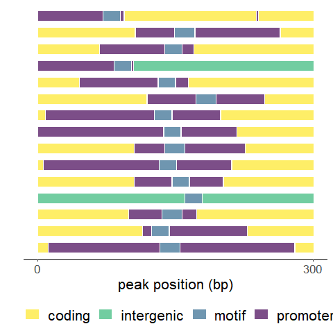

```r
library(tidyverse)
library(GenomicFeatures)
library(GGally)

gff <- makeTxDbFromGFF("../00_genome_files/genomic.gff",
  format = "gff",
  dataSource = "NCBI", organism = "Haloarcula hispanica"
)
```

```
## Warning in .extract_transcripts_from_GRanges(tx_IDX, gr, mcols0$type, mcols0$ID, : the transcript names ("tx_name" column in the TxDb object) imported
##   from the "Name" attribute are not unique
```

```r
gff_df <- read_csv("../00_genome_files/GCF_000223905.1_gff.key.csv")
genes.only <- genes(gff, columns = c("GENEID"))
genes.only$type <- rep("gene", length(genes.only))

locations <- read_csv("04c_peak_composition/04c_peak_location_consensus_motif.csv")
location2 <- read_csv("04c_peak_composition/04c_peak_location_consensus.csv")
```

Segment graph

```r
segment_data <- data.frame(
  x = locations$start,
  xend = locations$stop,
  y = locations$peak_rank,
  yend = locations$peak_rank,
  colors = locations$type
)

segment_data %>%
  ggplot() +
  geom_segment(aes(x = x, y = y, xend = xend, yend = yend, color = colors), size = 5, alpha = 0.7) +
  scale_x_continuous(name = "peak position (bp)", limits = c(0, 301), breaks = c(0, 300)) +
  scale_color_viridis_d(direction = -1) +
  labs(y = "") +
  theme_classic() +
  theme(
    text = element_text(family = "sans", size = 16, color = "black"),
    legend.title = element_blank(), legend.position = "bottom",
    legend.text = element_text(family = "sans", size = 16, color = "black"),
    axis.line.y = element_blank(), axis.ticks.y = element_blank(), axis.text.y = element_blank()
  ) -> peak.comp
```

```
## Warning: Using `size` aesthetic for lines was deprecated in ggplot2 3.4.0.
## ℹ Please use `linewidth` instead.
## This warning is displayed once every 8 hours.
## Call `lifecycle::last_lifecycle_warnings()` to see where this warning was
## generated.
```

```r
print(peak.comp)
```

<!-- -->

```r
pdf("04c_peak_composition/consensus_peak_footprint.pdf", width = 4, height = 4)
print(peak.comp)
dev.off()
```

```
## png 
##   2
```

Negative binomial test for peak location
NC_015948.1            2995271
NC_015943.1             488918
NC_015944.1             405816

```r
genome.size <- sum(2995271, 488918, 405816)
sum.all.genes <- sum(IRanges::width(reduce(genes.only)))

location2 %>%
  filter(type == "intergenic") %>%
  tally(overlap) -> sum.ig.pks
location2 %>%
  filter(type == "coding") %>%
  tally(overlap) -> sum.gene.peaks
location2 %>%
  filter(type == "promoter") %>%
  tally(overlap) -> sum.pro.pks

# get expected percentage of reads in genes based on gene density of genome
out <- data.frame(
  "no.peaks" = length(unique(location2$peak_rank)),
  "bp in peaks" = sum(location2$overlap),
  "expected in" = sum.all.genes / genome.size, # expected proportion of peaks in genes based on proportion of genes in genome
  "expected out" = 1 - (sum.all.genes / genome.size),
  "obs. in" = (sum.gene.peaks$n) / sum(location2$overlap),
  "obs. out" = (sum.pro.pks$n + sum.ig.pks$n) / sum(location2$overlap)
)

# binomial test, is the proportion of genic bps in peaks greater than we'd expect?
binom.test(sum.gene.peaks$n, out$bp.in.peaks, out$expected.in, alternative = "greater") # no
```

```
## 
## 	Exact binomial test
## 
## data:  sum.gene.peaks$n and out$bp.in.peaks
## number of successes = 2021, number of trials = 3411, p-value = 1
## alternative hypothesis: true probability of success is greater than 0.8716169
## 95 percent confidence interval:
##  0.5784547 1.0000000
## sample estimates:
## probability of success 
##              0.5924949
```

```r
binom.test(sum.gene.peaks$n, out$bp.in.peaks, out$expected.in, alternative = "less") # its much less than we'd expect
```

```
## 
## 	Exact binomial test
## 
## data:  sum.gene.peaks$n and out$bp.in.peaks
## number of successes = 2021, number of trials = 3411, p-value < 2.2e-16
## alternative hypothesis: true probability of success is less than 0.8716169
## 95 percent confidence interval:
##  0.0000000 0.6064177
## sample estimates:
## probability of success 
##              0.5924949
```

```r
# binomial test, is the proportion of bps in peaks falling outside of gene sequences greater than we'd expect?
binom.test(sum.ig.pks$n + sum.pro.pks$n, out$bp.in.peaks, out$expected.out, alternative = "greater") # yes
```

```
## 
## 	Exact binomial test
## 
## data:  sum.ig.pks$n + sum.pro.pks$n and out$bp.in.peaks
## number of successes = 1390, number of trials = 3411, p-value < 2.2e-16
## alternative hypothesis: true probability of success is greater than 0.1283831
## 95 percent confidence interval:
##  0.3935823 1.0000000
## sample estimates:
## probability of success 
##              0.4075051
```
expected 87.2% of bases in peaks to overlap genes, observed 40%
expected 12.8% of bases in peaks to overlap intergenic regions, observed 60%
