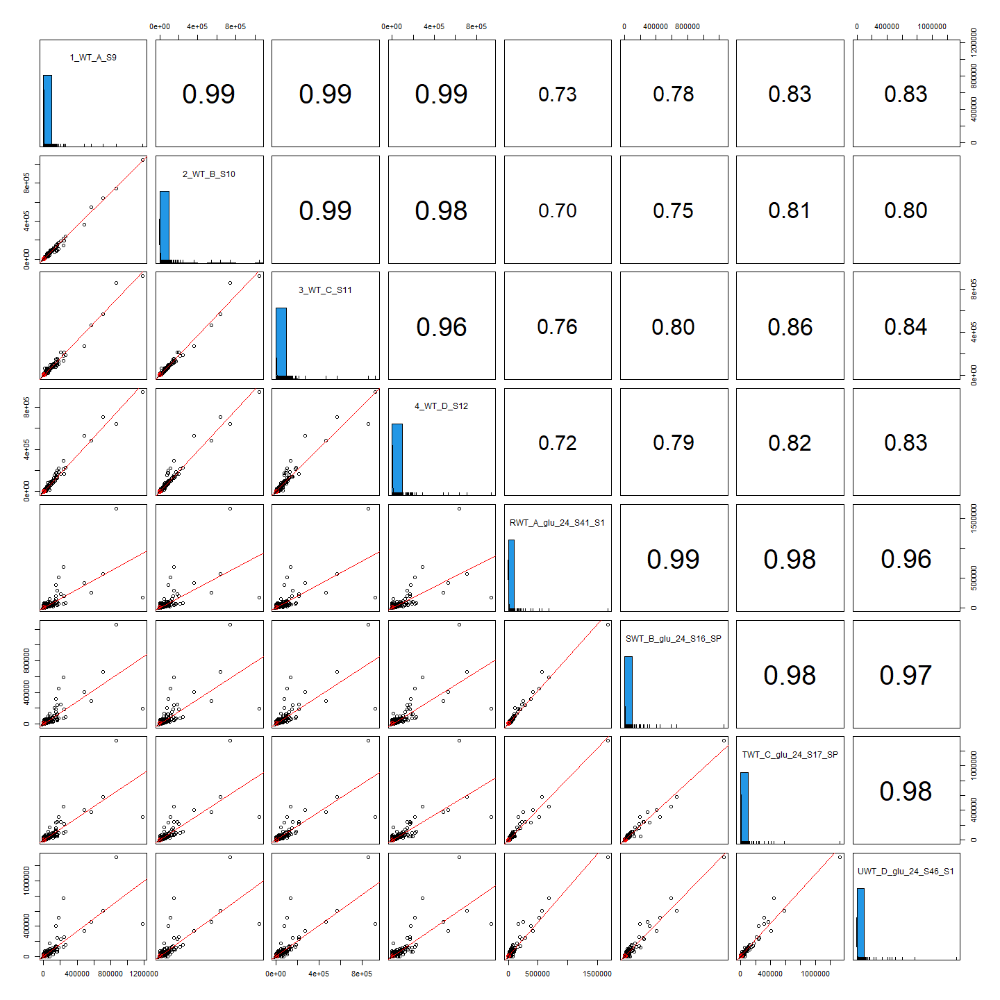

```r
# BiocManager::install("limma")
library(tidyverse)
library(ggpubr)
library(DESeq2)
library(viridis)
library(RColorBrewer)
library(pheatmap)
library(rrcov)
library(psych)
library(factoextra)
```

load gff data info for informative gene descriptions

```r
gff_df <- read_csv("../00_genome_files/GCF_000223905.1_gff.key.csv")
```

read in counts files

```r
counts_data <- read_csv("00_deseq2_input/00_combined_counts.csv") %>%
  column_to_rownames(var = "locus_tag")
counts_meta <- read_csv("00_deseq2_input/00_combined_meta.csv")

# Add group column for alternate Deseq2 design
## we expect to see DE only in WT mGlu for direct targets.
counts_meta$group <- str_c(counts_meta$genotype, counts_meta$glucose)
counts_meta$group <- str_replace(counts_meta$group, "WTmGlu", "dependent")
counts_meta$group <- str_replace(counts_meta$group, ".*Glu$", "independent")
counts_meta
## # A tibble: 32 × 11
##    sample        genotype glucose time  batch    SE_PE `counted with` sum_counts
##    <chr>         <chr>    <chr>   <chr> <chr>    <chr> <chr>               <dbl>
##  1 10_WT_B_S18   WT       mGlu    24hr  RH_SP_2… PE    featureCounts    17996178
##  2 11_WT_C_S19   WT       mGlu    24hr  RH_SP_2… PE    featureCounts    23748234
##  3 12_WT_D_S20   WT       mGlu    24hr  RH_SP_2… PE    featureCounts    12719797
##  4 13_TRMB_A_S21 trmB     mGlu    24hr  RH_SP_2… PE    featureCounts    16357575
##  5 14_TRMB_B_S22 trmB     mGlu    24hr  RH_SP_2… PE    featureCounts    15866610
##  6 15_TRMB_C_S23 trmB     mGlu    24hr  RH_SP_2… PE    featureCounts    15910207
##  7 16_TRMB_D_S24 trmB     mGlu    24hr  RH_SP_2… PE    featureCounts    18375973
##  8 17_WT_ref_S25 ref      YPC23   stat  RH_SP_2… PE    featureCounts    22686381
##  9 1_WT_A_S9     WT       pGlu    24hr  RH_SP_2… PE    featureCounts    26374459
## 10 2_WT_B_S10    WT       pGlu    24hr  RH_SP_2… PE    featureCounts    21963359
## # ℹ 22 more rows
## # ℹ 3 more variables: percent_aligned <dbl>, pyrF <lgl>, group <chr>
```

two reference samples are highly correlated 

```r
# correlation between the two "reference" sequences
ggplot(counts_data, aes(x = log10(`HCA_ref_RNA_S7_S1`), y = log10(`17_WT_ref_S25`))) +
  geom_point() +
  geom_smooth(method = lm) +
  theme_bw()
## `geom_smooth()` using formula = 'y ~ x'
## Warning: Removed 4 rows containing non-finite values (`stat_smooth()`).
```

<!-- -->

How well do sample with and without pyrF correlate? Look at correlations based on raw counts - this is without batch correction or accounting for read depth

```r
# average trmB-glu samples with and without pyrF
counts_meta %>%
  filter(genotype == "trmB" & glucose == "mGlu" & pyrF == "TRUE") -> tmp
counts_meta %>%
  filter(genotype == "trmB" & glucose == "mGlu" & pyrF == "FALSE") -> tmp2

counts_data %>%
  dplyr::select(tmp$sample) %>% # 4 samples
  rowMeans() %>%
  as.data.frame() %>%
  mutate(log10(.)) -> tmp3

counts_data %>%
  dplyr::select(tmp2$sample) %>% # 2 samples
  rowMeans() %>%
  as.data.frame() %>%
  mutate(log10(.)) -> tmp4
data.frame("log10.TrmB.samples.with.pyrF" = tmp3$`log10(.)`, "log10.TrmB.samples.without.pyrF" = tmp4$`log10(.)`) -> tmp4

# All trmB - glu samples
ggscatter(
  data = tmp4, x = "log10.TrmB.samples.with.pyrF", y = "log10.TrmB.samples.without.pyrF",
  add = "reg.line", conf.int = TRUE, color = "black", size = 0.9, alpha = 0.8,
  title = "All TrmB samples without glucose (N=6)",
  cor.coef = TRUE, cor.method = "pearson", ggtheme = theme_bw()
)
## Warning: Removed 4 rows containing non-finite values (`stat_smooth()`).
## Warning: Removed 4 rows containing non-finite values (`stat_cor()`).
```

<!-- -->

```r

# average trmB+glu samples with and without pyrF
counts_meta %>%
  filter(genotype == "trmB" & glucose == "pGlu" & pyrF == "TRUE") -> tmp
counts_meta %>%
  filter(genotype == "trmB" & glucose == "pGlu" & pyrF == "FALSE") -> tmp2

counts_data %>%
  dplyr::select(tmp$sample) %>% # 6 samples
  rowMeans() %>%
  as.data.frame() %>%
  mutate(log10(.)) -> tmp3

counts_data %>%
  dplyr::select(tmp2$sample) %>% # 2 samples
  rowMeans() %>%
  as.data.frame() %>%
  mutate(log10(.)) -> tmp4
data.frame("log10.TrmB.samples.with.pyrF" = tmp3$`log10(.)`, "log10.TrmB.samples.without.pyrF" = tmp4$`log10(.)`) -> tmp4

# All trmB + glu samples
ggscatter(
  data = tmp4, x = "log10.TrmB.samples.with.pyrF", y = "log10.TrmB.samples.without.pyrF",
  add = "reg.line", conf.int = TRUE, color = "black", size = 0.9, alpha = 0.8,
  title = "All TrmB samples with glucose (N=6)",
  cor.coef = TRUE, cor.method = "pearson", ggtheme = theme_bw()
)
## Warning: Removed 4 rows containing non-finite values (`stat_smooth()`).
## Removed 4 rows containing non-finite values (`stat_cor()`).
```

<!-- -->

```r

# average trmB-glu samples with and without pyrF
counts_meta %>%
  filter(genotype == "trmB" & glucose == "mGlu" & batch == "RH_SP_2022" & pyrF == "TRUE") -> tmp
counts_meta %>%
  filter(genotype == "trmB" & glucose == "mGlu" & batch == "RH_SP_2022" & pyrF == "FALSE") -> tmp2

counts_data %>%
  dplyr::select(tmp$sample) %>% # 2 samples
  rowMeans() %>%
  as.data.frame() %>%
  mutate(log10(.)) -> tmp3

counts_data %>%
  dplyr::select(tmp2$sample) %>% # 2 samples
  rowMeans() %>%
  as.data.frame() %>%
  mutate(log10(.)) -> tmp4
data.frame("log10.TrmB.samples.with.pyrF" = tmp3$`log10(.)`, "log10.TrmB.samples.without.pyrF" = tmp4$`log10(.)`) -> tmp4

# All trmB - glu samples
ggscatter(
  data = tmp4, x = "log10.TrmB.samples.with.pyrF", y = "log10.TrmB.samples.without.pyrF",
  add = "reg.line", conf.int = TRUE, color = "black", size = 0.9, alpha = 0.8,
  title = "AKS319 TrmB samples without glucose (N=4)",
  cor.coef = TRUE, cor.method = "pearson", ggtheme = theme_bw()
)
## Warning: Removed 5 rows containing non-finite values (`stat_smooth()`).
## Warning: Removed 5 rows containing non-finite values (`stat_cor()`).
```

<!-- -->

```r

# average trmB-glu samples with and without pyrF
counts_meta %>%
  filter(genotype == "trmB" & glucose == "pGlu" & batch == "RH_SP_2022" & pyrF == "TRUE") -> tmp
counts_meta %>%
  filter(genotype == "trmB" & glucose == "pGlu" & batch == "RH_SP_2022" & pyrF == "FALSE") -> tmp2

counts_data %>%
  dplyr::select(tmp$sample) %>% # 2 samples
  rowMeans() %>%
  as.data.frame() %>%
  mutate(log10(.)) -> tmp3

counts_data %>%
  dplyr::select(tmp2$sample) %>% # 2 samples
  rowMeans() %>%
  as.data.frame() %>%
  mutate(log10(.)) -> tmp4
data.frame("log10.TrmB.samples.with.pyrF" = tmp3$`log10(.)`, "log10.TrmB.samples.without.pyrF" = tmp4$`log10(.)`) -> tmp4

# All trmB - glu samples
ggscatter(
  data = tmp4, x = "log10.TrmB.samples.with.pyrF", y = "log10.TrmB.samples.without.pyrF",
  add = "reg.line", conf.int = TRUE, color = "black", size = 0.9, alpha = 0.8,
  title = "AKS319 TrmB samples with glucose (N=4)",
  cor.coef = TRUE, cor.method = "pearson", ggtheme = theme_bw()
)
## Warning: Removed 5 rows containing non-finite values (`stat_smooth()`).
## Removed 5 rows containing non-finite values (`stat_cor()`).
```

<!-- -->

PCA

```r
res_pca <- prcomp(t(counts_data))

groups <- as.factor(counts_meta$batch)
fviz_pca_ind(res_pca,
  col.ind = groups, # color by groups
  geom = "point",
  addEllipses = T, # Concentration ellipses
  ellipse.level = 0.95,
  legend.title = "expt batch"
)
```

<!-- -->


```r
dds_mydata <- DESeqDataSetFromMatrix(
  countData = counts_data,
  colData = counts_meta,
  design = ~ batch + group
)

# Estimate Size Factors to inspect the raw count data which is generated from various growth experiments, flowcells and bio reps.
dds_mydata <- estimateSizeFactors(dds_mydata)

mydf <- sizeFactors(dds_mydata) %>%
  as.data.frame() %>%
  rownames_to_column()

colnames(mydf)[2] <- "sizefac"

ggplot(mydf, aes(rowname, sizefac)) +
  geom_point() +
  theme(axis.text.x = element_text(face = "bold", color = "blue", angle = 90, hjust = 1))
```

<!-- -->

```r

ddsDE <- DESeq(dds_mydata, test = "Wald")

# Total number of raw counts per sample
mydf_raw_count <- colSums(counts(ddsDE)) %>%
  as.data.frame() %>%
  rownames_to_column()
colnames(mydf_raw_count)[2] <- "whole_gene_count"
ggplot(mydf_raw_count, aes(rowname, whole_gene_count)) +
  geom_point() +
  theme(axis.text.x = element_text(face = "bold", color = "blue", angle = 90, hjust = 1))
```

<!-- -->

```r

# Normalizing counts by size factor
mydf_norm_count <- colSums(counts(ddsDE, normalized = T)) %>%
  as.data.frame() %>%
  rownames_to_column()
colnames(mydf_norm_count)[2] <- "whole_gene_norm_count"

ggplot(mydf_norm_count, aes(rowname, whole_gene_norm_count)) +
  geom_point() +
  theme(axis.text.x = element_text(face = "bold", color = "blue", angle = 90, hjust = 1))
```

<!-- -->

```r

# Convert the raw count to the normalized count
normalized_counts <- as.data.frame(counts(ddsDE, normalized = T))
```
all trmB samples except for 13_TRMB_A_S21_sorted.bam, 16_TRMB_D_S24_sorted.bam, 5_TRMB_A_S13_sorted.bam, 7_TRMB_C_S15_sorted.bam reverted

#### PCA & heatmap

```r
# The variance stabilizing transformation is obtained using the vst() function.
vsd <- vst(ddsDE)
## -- note: fitType='parametric', but the dispersion trend was not well captured by the
##    function: y = a/x + b, and a local regression fit was automatically substituted.
##    specify fitType='local' or 'mean' to avoid this message next time.
assay(vsd) <- limma::removeBatchEffect(assay(vsd), vsd$batch)

sampleDists <- dist(t(assay(vsd)))
sampleDistMatrix <- as.matrix(sampleDists)
colnames(sampleDistMatrix) <- paste(vsd$genotype, vsd$glucose, sep = "-")
colors <- colorRampPalette(rev(brewer.pal(9, "Blues")))(150)

# Heatmap
pheatmap(sampleDistMatrix,
  clustering_distance_rows = sampleDists,
  clustering_distance_cols = sampleDists, col = colors
)
```

<!-- -->

```r

# Principal Components Analysis
plotPCA(vsd, intgroup = c("genotype", "glucose"), returnData = T) -> PCA
cbind(PCA, "pyrF" = counts_meta$pyrF, "experiment" = str_sub(counts_meta$batch, start = -4)) -> PCA
ggplot(data = PCA) +
  geom_point(aes(x = PC1, y = PC2, fill = group, color = pyrF), size = 7, shape = 21, stroke = 2.5) +
  scale_color_manual(values = c("grey", "black")) +
  scale_fill_viridis(discrete = T) +
  theme_bw() +
  theme(text = element_text(size = 18)) -> pca.plot
pca.plot
```

<!-- -->

#### Pairwise correlation between replicates

```r
name <- filter(counts_meta, counts_meta$genotype == "WT" & counts_meta$glucose == "mGlu")$sample
WT <- normalized_counts %>%
  dplyr::select(name)
## Warning: Using an external vector in selections was deprecated in tidyselect 1.1.0.
## ℹ Please use `all_of()` or `any_of()` instead.
##   # Was:
##   data %>% select(name)
## 
##   # Now:
##   data %>% select(all_of(name))
## 
## See <https://tidyselect.r-lib.org/reference/faq-external-vector.html>.
## This warning is displayed once every 8 hours.
## Call `lifecycle::last_lifecycle_warnings()` to see where this warning was
## generated.

pairs.panels(WT,
  scale = T, # If TRUE, scales the correlation text font
  method = "pearson", # Correlation method (also "spearman" or "kendall")
  pch = 21, # pch symbol
  lm = T, # If TRUE, plots linear fit rather than the LOESS (smoothed) fit
  cor = T, # If TRUE, reports correlations
  jiggle = F, # If TRUE, data points are jittered
  hist.col = 4, # Histograms color
  ci = F # If TRUE, adds confidence intervals
)
```

<!-- -->

```r

name <- filter(counts_meta, counts_meta$genotype == "WT" & counts_meta$glucose == "pGlu")$sample
WT <- normalized_counts %>%
  dplyr::select(name)

pairs.panels(WT,
  scale = T, method = "pearson",
  pch = 21, lm = T, cor = T,
  jiggle = F, hist.col = 4, ci = F
)
```

<!-- -->

```r

name <- filter(counts_meta, counts_meta$genotype == "trmB" & counts_meta$glucose == "mGlu")$sample
trmb <- normalized_counts %>%
  dplyr::select(name)

pairs.panels(trmb,
  scale = T, method = "pearson",
  pch = 21, lm = T, cor = T,
  jiggle = F, hist.col = 4, ci = F
)
```

<!-- -->

```r

name <- filter(counts_meta, counts_meta$genotype == "trmB" & counts_meta$glucose == "pGlu")$sample
trmb <- normalized_counts %>%
  dplyr::select(name)

pairs.panels(trmb,
  scale = T, method = "pearson",
  pch = 21, lm = T, cor = T,
  jiggle = F, hist.col = 4, ci = F
)
```

<!-- -->


```r
# remove reference samples
counts_meta <- counts_meta[-c(8, 23), ]
counts_data <- counts_data[-c(8, 23)]

# aAWT_B_noglu_24_S19_SP_sorted.bam outlier by pairwise correlation
counts_meta <- counts_meta[-c(17), ]
counts_data <- counts_data[-c(17)]

# dim check
nrow(counts_meta) == ncol(counts_data)
## [1] TRUE

dds_mydata <- DESeqDataSetFromMatrix(
  countData = counts_data,
  colData = counts_meta,
  design = ~ batch + group
)
## Warning in DESeqDataSet(se, design = design, ignoreRank): some variables in
## design formula are characters, converting to factors

# Estimate Size Factors to inspect the raw count data which is generated from various growth experiments, flowcells and bio reps.
dds_mydata <- estimateSizeFactors(dds_mydata)
ddsDE <- DESeq(dds_mydata, test = "Wald")
```

#### PCA & heatmap

```r
# The variance stabilizing transformation is obtained using the vst() function.
vsd <- vst(ddsDE)
assay(vsd) <- limma::removeBatchEffect(assay(vsd), vsd$batch)

sampleDists <- dist(t(assay(vsd)))
sampleDistMatrix <- as.matrix(sampleDists)
colnames(sampleDistMatrix) <- paste(vsd$genotype, vsd$glucose, sep = "-")
colors <- colorRampPalette(rev(brewer.pal(9, "Blues")))(150)

# Heatmap
pheatmap(sampleDistMatrix,
  clustering_distance_rows = sampleDists,
  clustering_distance_cols = sampleDists, col = colors
)
```

<!-- -->

```r

# Principal Components Analysis
plotPCA(vsd, intgroup = c("genotype", "glucose"), returnData = T) -> PCA
cbind(PCA, "pyrF" = counts_meta$pyrF, "experiment" = str_sub(counts_meta$batch, start = -4)) -> PCA
ggplot(data = PCA) +
  geom_point(aes(x = PC1, y = PC2, fill = group, color = pyrF), size = 7, shape = 21, stroke = 2.5) +
  scale_color_manual(values = c("grey", "black")) +
  scale_fill_viridis(discrete = T) +
  theme_bw() +
  theme(text = element_text(size = 18))
```

<!-- -->

#### Check that genotypes are as expected (no pyrF or trmB expression)

```r
hom <- c("HAH_RS07525", "HAH_RS10105")
names <- c("HAH_1548 TrmB", "pyrF")

for (i in 1:length(hom)) {
  d <- plotCounts(ddsDE, gene = hom[i], intgroup = c("genotype", "glucose", "batch"), returnData = T, transform = T)
  tmp <- ggplot(d, aes(x = glucose, y = count, fill = genotype)) +
    geom_boxplot(alpha = 0.8) +
    geom_point(position = position_dodge(width = 0.75), size = 2) +
    labs(title = hom[i], subtitle = names[i], y = "normalized counts") +
    theme_classic() +
    theme(text = element_text(size = 18), axis.text.x = element_text(angle = 45, hjust = 1, vjust = 1))
  print(tmp)
  #d$count <- format(d$count, scientific = F)
  #print(d)
}
```

<!-- --><!-- -->
max trmB counts are 46. max pyrF counts are 107.

### Differential Expression Analysis (no pyrF revertants)

```r
counts_meta2 <- counts_meta[counts_meta$pyrF == F, ]
counts_data2 <- counts_data[counts_meta2$sample]

dds.mydata2 <- DESeqDataSetFromMatrix(
  countData = counts_data2,
  colData = counts_meta2,
  design = ~ batch + group
)
## Warning in DESeqDataSet(se, design = design, ignoreRank): some variables in
## design formula are characters, converting to factors

## Estimate Size Factors to inspect the raw count data which is generated from various lanes and bio reps.
dds.mydata2 <- estimateSizeFactors(dds.mydata2)
ddsDE2 <- DESeq(dds.mydata2, test = "Wald")

# The variance stabilizing transformation is obtained using the vst() function.
vsd <- vst(ddsDE2)
assay(vsd) <- limma::removeBatchEffect(assay(vsd), vsd$batch)

sampleDists <- dist(t(assay(vsd)))
sampleDistMatrix <- as.matrix(sampleDists)
colnames(sampleDistMatrix) <- paste(vsd$genotype, vsd$glucose, sep = "-")
colors <- colorRampPalette(rev(brewer.pal(9, "Blues")))(150)

# Heatmap
pheatmap(sampleDistMatrix,
  clustering_distance_rows = sampleDists,
  clustering_distance_cols = sampleDists, col = colors
)
```

<!-- -->

```r

# Principal Components Analysis
plotPCA(vsd, intgroup = c("genotype", "glucose"), returnData = T) -> PCA
cbind(PCA, "pyrF" = counts_meta2$pyrF, "experiment" = str_sub(counts_meta2$batch, start = -4)) -> PCA
ggplot(data = PCA) +
  geom_point(aes(x = PC1, y = PC2, fill = group, color = pyrF), size = 7, shape = 21, stroke = 2.5) +
  scale_color_manual(values = c("grey", "black")) +
  scale_fill_viridis(discrete = T) +
  theme_bw() +
  theme(text = element_text(size = 18))
```

<!-- -->


### Save updated count matrix

```r
# outlier removed
write.csv(counts_data, "00_deseq2_input/00_data_all.csv", row.names = T)
write.csv(counts_meta, "00_deseq2_input/00_meta_all.csv", row.names = T)

# outlier removed and all revertants removed
write.csv(counts_data2, "00_deseq2_input/00_data_filtered.csv", row.names = T)
write.csv(counts_meta2, "00_deseq2_input/00_meta_filtered.csv", row.names = T)
```
