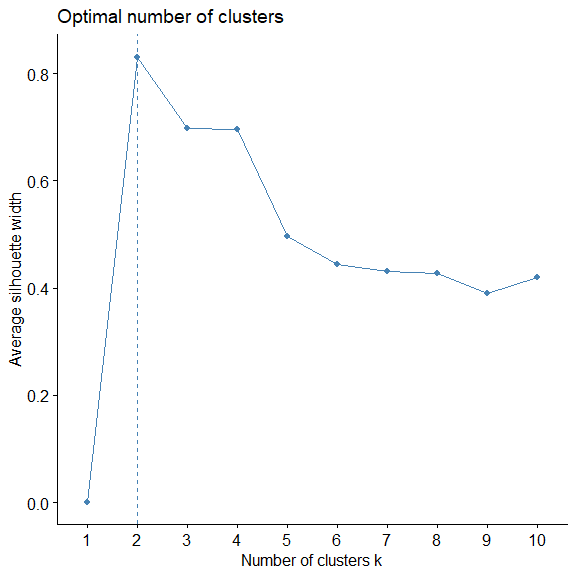
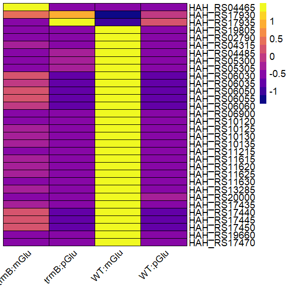
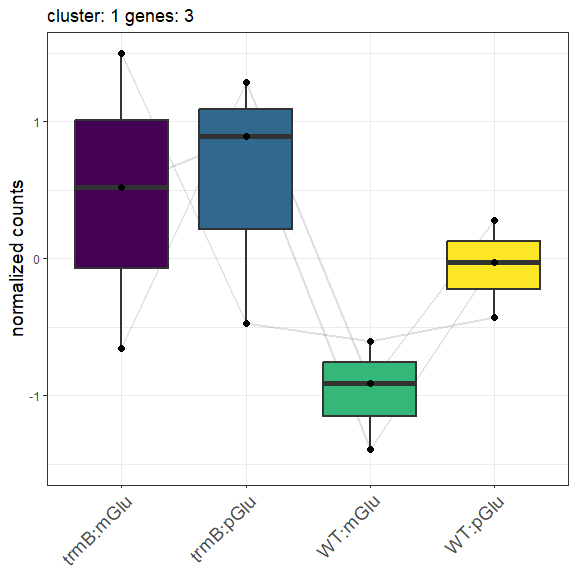
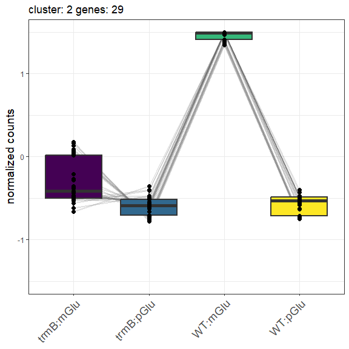

Load and parse files

```r
expression_all <- read_csv("01_deseq2_output/normalised_counts_all.csv")
genelist <- expression_all[[1]]
final <- read_csv("01_deseq2_output/group_final.csv")

# peaks
peaks <- read_csv("../ChIP-seq/04a_peak_annotation/04a_consensus_genelist.csv")
```

# Noramlized counts using all samples

```r
l <- length(genelist)

allexpr <- as.data.frame(matrix(nrow = l, ncol = 4))
for (i in (1:l)) {
  # Find the gene in the normalized count file
  j <- which(expression_all$rowname == genelist[i])
  expr <- as.numeric(vector(length = 4))

  # Get avg expression for this gene from bioreps of 4 conditions
  # mean/SD normalization of each gene for visualization.

  expr[1] <- mean(as.numeric(expression_all[j, c(5:8, 20:21)])) # trmB_noglu
  expr[2] <- mean(as.numeric(expression_all[j, c(13:16, 26:29)])) # trmB_glu
  expr[3] <- mean(as.numeric(expression_all[j, c(2:4, 17:19, 30)])) # WT_noglu
  expr[4] <- mean(as.numeric(expression_all[j, c(9:12, 22:25)])) # WT_glu

  normexpr <- BBmisc::normalize(expr, method="standardize")
  allexpr[i, ] <- normexpr
}

#allexpr <- BBmisc::normalize(allexpr, method="range", range = c(-1,1))
rownames(allexpr) <- genelist
colnames(allexpr) <- c("trmB:mGlu", "trmB:pGlu", "WT:mGlu", "WT:pGlu")
```

## cluster genes sig in both analyses

```r
allsig <- allexpr[rownames(allexpr) %in% final$locus_tag, ]
fviz_nbclust(allsig, kmeans, method = "silhouette")
```

<!-- -->

```r
# Plot heatmap
nclust <- 2
clustexpr <- kmeans(allsig, nclust)
clustexpr2 <- cbind(allsig, "cluster" = clustexpr$cluster)
clustexpr2$locus_tag <- rownames(allsig)
o <- order(clustexpr$cluster)
clustexpr2 <- clustexpr2[o, ]
pheatmap(clustexpr2[, 1:4],
  cluster_cols = FALSE, cluster_rows = FALSE,
  color = viridis(12, option = "C"), border_color = "black",
  show_rownames = T, fontsize = 14, angle_col = 45) -> maps
```

<!-- -->

```r
save_pheatmap_pdf(maps, "../figures/4C.pdf", width = 9, height = 12)
```

```
## png 
##   2
```

```r
panels <- c("D", "E")

# Line plots for each cluster.
for (i in (1:nclust)) {
  clustexpr3 <- clustexpr2[clustexpr2$cluster == i, ]
  clustexpr3 <- clustexpr3[, -5]
  clustexpr3$locus_tag <- rownames(clustexpr3)
  clustexpr3 <- melt(clustexpr3, id.vars = "locus_tag")
  clustexpr3$Conditionasnumeric <- as.numeric(clustexpr3$variable)
  k <- nrow(clustexpr3) / 4
  
  print(ggplot(clustexpr3, aes(x = fct_inorder(variable), y = value)) +
    geom_line(aes(group = locus_tag), alpha = 0.2, size = 1, color = "grey40") +
    geom_boxplot(aes(fill = variable), outlier.shape = NA, size = 1) +
    geom_point(size = 2) + labs(y = "normalized counts") +
    labs(y = "normalized counts", title = paste("cluster:", i, "genes:", k)) +
    lims(y = c(-1.5, 1.5)) +
    scale_fill_viridis(discrete = T) + theme_bw() +
    theme(
      axis.title.x = element_blank(), legend.title = element_blank(),
      axis.title.y = element_text(size = 14), legend.text = element_text(size = 14),
      axis.text.x = element_text(size = 14, angle = 45, hjust = 1), legend.position = "none"
    ))
  
  pdf(file = paste("../figures/4", panels[i],".pdf", sep = ""), width = 6, height = 6)
    print(ggplot(clustexpr3, aes(x = fct_inorder(variable), y = value)) +
    geom_line(aes(group = locus_tag), alpha = 0.2, size = 1, color = "grey40") +
    geom_boxplot(aes(fill = variable), outlier.shape = NA, size = 1) +
    geom_point(size = 2) + labs(y = "normalized counts") +
    labs(y = "normalized counts", title = paste("cluster:", i, "genes:", k)) +
    lims(y = c(-1.5, 1.5)) +
    scale_fill_viridis(discrete = T) + theme_bw() +
    theme(
      axis.title.x = element_blank(), legend.title = element_blank(),
      axis.title.y = element_text(size = 14), legend.text = element_text(size = 14),
      axis.text.x = element_text(size = 14, angle = 45, hjust = 1), legend.position = "none"
    ))
  dev.off()
}
```

```
## Warning: Using `size` aesthetic for lines was deprecated in ggplot2 3.4.0.
## ℹ Please use `linewidth` instead.
## This warning is displayed once every 8 hours.
## Call `lifecycle::last_lifecycle_warnings()` to see where this warning was
## generated.
```

<!-- --><!-- -->

```r
tmp <- left_join(clustexpr2, final, by = "locus_tag")
write_csv(tmp, "02_clustering_output/02_clustered_counts_final.csv")

# do any of these have motifs nearby?
motifs <- read_csv("../ChIP-seq/04d_motif_annotation/motifs_annotated.csv")
tmp[tmp$locus_tag %in% motifs$locus_tag, ]
```

```
##     trmB:mGlu  trmB:pGlu    WT:mGlu     WT:pGlu cluster   locus_tag
## 2   0.5199809  0.8952710 -1.3883024 -0.02694952       1 HAH_RS17930
## 3  -0.6575608  1.2876522 -0.9113082  0.28121680       1 HAH_RS17935
## 4  -0.5271799 -0.4831571  1.4997162 -0.48937923       2 HAH_RS19805
## 6  -0.2824817 -0.5736498  1.4827338 -0.62660231       2 HAH_RS04315
## 8  -0.5591112 -0.4040582  1.4965438 -0.53337443       2 HAH_RS05300
## 15 -0.5108874 -0.5031494  1.4999180 -0.48588123       2 HAH_RS06900
## 25 -0.3550739 -0.5673162  1.4923772 -0.56998699       2 HAH_RS13285
## 26 -0.6209610 -0.4751881  1.4935459 -0.39739691       2 HAH_RS20000
## 31 -0.4644902 -0.5467694  1.4991008 -0.48784116       2 HAH_RS19660
## 32 -0.5029118 -0.5169979  1.4998248 -0.47991514       2 HAH_RS17470
##    baseMean.pyr log2FoldChange.pyr old_locus_tag
## 2     9152.9260           4.724303      HAH_5129
## 3     3028.1496           2.870792      HAH_5130
## 4     4565.4436          -4.629446      HAH_0188
## 6      366.5213          -1.364268      HAH_0887
## 8      543.7459          -2.215322      HAH_1090
## 15    6837.4887          -6.580317      HAH_1419
## 25   12294.5467          -4.131576      HAH_2730
## 26    1189.3393          -2.891446      HAH_2805
## 31    2192.3951          -3.303005      HAH_5033
## 32   52723.3703          -3.433621      HAH_5034
##                                          annotation baseMean.nopyr
## 2               sugar porter family MFS transporter      6312.0127
## 3                          universal stress protein      2051.0481
## 4                              hypothetical protein      6475.9544
## 6                               cysteine synthase A       408.7243
## 8           TRAP transporter fused permease subunit       642.9462
## 15                  class 1 fructose-bisphosphatase     10194.4257
## 25 type II glyceraldehyde-3-phosphate dehydrogenase     16905.1058
## 26                             hypothetical protein      1580.8864
## 31      rubrerythrin-like domain-containing protein      2898.0885
## 32                    Glu/Leu/Phe/Val dehydrogenase     70862.6895
##    log2FoldChange.nopyr
## 2              4.519002
## 3              2.885831
## 4             -4.602994
## 6             -1.389595
## 8             -2.353739
## 15            -6.312688
## 25            -4.296230
## 26            -2.750115
## 31            -3.352621
## 32            -3.443728
```
