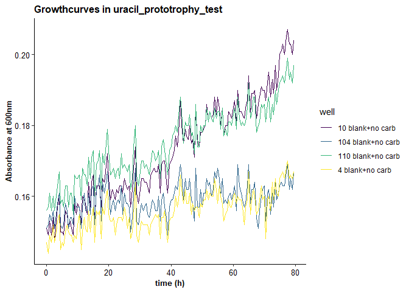
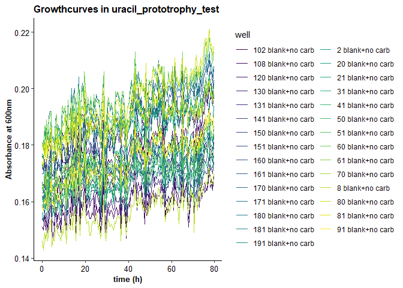
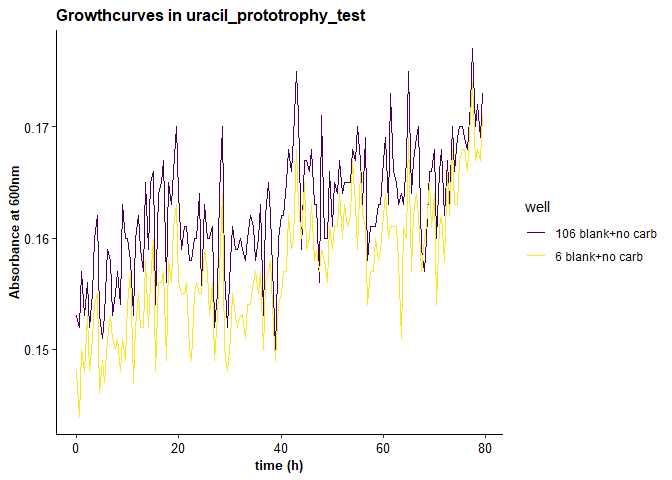
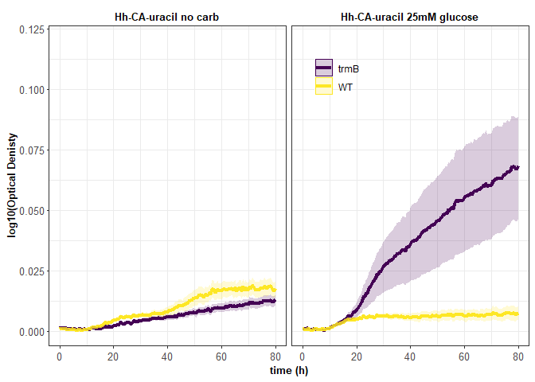
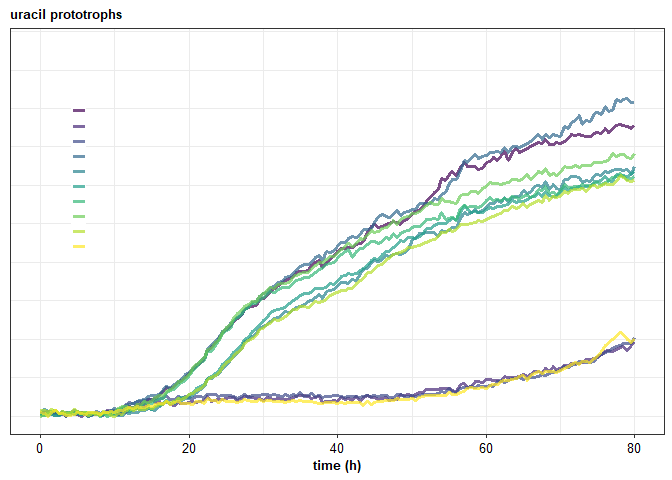

```r
# load required libraries
library(growthcurver)
library(viridis)
library(scales)
library(tidyverse)
library(factoextra)
library(cowplot)

# custom function, calculated the 95% Confidence interval
conf_int95 <- function(data) {
  n <- length(data)
  error <- qt(0.975, df = n - 1) * sd(data) / sqrt(n)
  return(error)
}
```

Load the normalized data and meta data. combine difference experiments. 

```r
expt <- "uracil_prototrophy_test"

## read in files
mt <- read.csv("20210906_hca_ura_hhca_test_meta.csv", stringsAsFactors = F)
d <- read_csv("20210906_hca_ura_hhca_test_data.csv")

unite(mt, "ID", c("strain", "condition"), sep = "+")$ID %>%
  str_replace_all(., "\\+$", "") -> ID

# remove the first 3 hours, or 6 timepoints.
dt0 <- d
dt0 <- dt0[-(1:6), ]
dt0$time <- seq(0, length.out = nrow(dt0), by = 0.5) # redo time points
dt0 <- dt0[complete.cases(dt0), ]
```


```r
unite(mt, "ID", c("strain", "condition"), sep = "+")$ID %>%
  str_replace_all(., "\\+$", "") -> ID

# Save new metafile as a different variable. This is good practice!
mt0 <- cbind("variable" = mt$well, ID, mt[-1], stringsAsFactors = F)
mt0 <- mt0 %>% arrange(variable)

# remove rows based on observation (input own row names!!)
mt0 <- mt0 %>% dplyr::slice(-c(95, 195, 99, 93, 199, 193, 30, 40, 71, 97, 121, 140, 197))
dt0 <- dt0 %>% select(!c(`95`, `195`, `99`, `93`, `199`, `193`, `30`, `40`, `71`, `97`, `121`, `140`, `197`))
```


```r
# Convert data from wide to long format
m_dt <- reshape2::melt(dt0, id = "time")
mtdt <- merge(m_dt, mt0, by = "variable")
mtdt$environment <- paste(mtdt$media, mtdt$condition)
well <- paste(mtdt$variable, mtdt$ID, sep = " ")
mtdt <- cbind(well, mtdt)
mtdt$variable <- as.numeric(mtdt$variable)

# time cutoff - this is a useful function for graphing and analysis. You might not need to look at the full length of the experiment.
t_mtdt <- mtdt[!(mtdt$time >= 80.0), ]

unique(t_mtdt$condition)
```

```
## [1] "25mM glucose" "no carb"
```

```r
unique(t_mtdt$strain)
```

```
## [1] "blank" "WT"    "trmB"
```

```r
unique(t_mtdt$media)
```

```
## [1] "Hh-CA+uracil"      "Hh-CA+uracil+5FOA" "Hh-CA-uracil"
```

remove blank outliers and plot. external wells are more prone to evaporation and crystallization. 

```r
cond <- "no carb"

filter(t_mtdt, strain == "blank" & condition == cond & media == "Hh-CA+uracil+5FOA") %>%
  ggplot(., aes(x = time, y = value, color = well)) + # if you want to know the well number, change color = well
  ggtitle(paste("Growthcurves in", expt)) +
  xlab("time (h)") +
  ylab("Absorbance at 600nm") +
  geom_line() +
  scale_color_viridis(discrete = TRUE) +
  theme_classic() +
  theme( # legend.position = 'none',
    plot.title = element_text(face = "bold", color = "#000000", size = 12, angle = 0),
    axis.title.x = element_text(face = "bold", color = "#000000", size = 10, angle = 0),
    axis.title.y = element_text(face = "bold", color = "#000000", size = 10, angle = 90),
    axis.text.y = element_text(face = "plain", color = "#000000", size = 10, angle = 0),
    axis.text.x = element_text(face = "plain", color = "#000000", size = 10, angle = 0)
  )
```

<!-- -->

```r
filter(t_mtdt, strain == "blank" & condition == cond & media == "Hh-CA+uracil") %>%
  # filter(variable >= 160 & variable <= 200) %>%
  ggplot(., aes(x = time, y = value, color = well)) + # if you want to know the well number, change color = well
  ggtitle(paste("Growthcurves in", expt)) +
  xlab("time (h)") +
  ylab("Absorbance at 600nm") +
  geom_line() +
  scale_color_viridis(discrete = TRUE) +
  theme_classic() +
  theme( # legend.position = 'none',
    plot.title = element_text(face = "bold", color = "#000000", size = 12, angle = 0),
    axis.title.x = element_text(face = "bold", color = "#000000", size = 10, angle = 0),
    axis.title.y = element_text(face = "bold", color = "#000000", size = 10, angle = 90),
    axis.text.y = element_text(face = "plain", color = "#000000", size = 10, angle = 0),
    axis.text.x = element_text(face = "plain", color = "#000000", size = 10, angle = 0)
  )
```

<!-- -->

```r
filter(t_mtdt, strain == "blank" & condition == cond & media == "Hh-CA-uracil") %>%
  ggplot(., aes(x = time, y = value, color = well)) + # if you want to know the well number, change color = well
  ggtitle(paste("Growthcurves in", expt)) +
  xlab("time (h)") +
  ylab("Absorbance at 600nm") +
  geom_line() +
  scale_color_viridis(discrete = TRUE) +
  theme_classic() +
  theme( # legend.position = 'none',
    plot.title = element_text(face = "bold", color = "#000000", size = 12, angle = 0),
    axis.title.x = element_text(face = "bold", color = "#000000", size = 10, angle = 0),
    axis.title.y = element_text(face = "bold", color = "#000000", size = 10, angle = 90),
    axis.text.y = element_text(face = "plain", color = "#000000", size = 10, angle = 0),
    axis.text.x = element_text(face = "plain", color = "#000000", size = 10, angle = 0)
  )
```

<!-- -->

average blank wells and create single column

```r
as.character(filter(mt0, strain == "blank")$variable) -> blanks
rowMeans(dt0[colnames(dt0) %in% blanks]) -> blank
dt0 <- cbind("blank" = blank, dt0[, !names(dt0) %in% blanks])

# subtract average blank from each well
d2 <- dt0[-c(1, 2)] - dt0$blank
d2$time <- dt0$time # add time column back
mins <- Rfast::colMins(as.matrix(d2), value = T) # get column minimums
d2 <- sweep(d2, 2, mins, "-") # subtract smallest value for each column
```

update long variable with corrected/zeroed values

```r
# Convert data from wide to long format
m_dt <- reshape2::melt(d2, id = "time")
mtdt <- merge(m_dt, mt0, by = "variable")
mtdt$environment <- paste(mtdt$media, mtdt$condition)
well <- paste(mtdt$variable, mtdt$ID, sep = " ")
mtdt <- cbind(well, mtdt)

# time cutoff - this is a useful function for graphing and analysis. You might not need to look at the full length of the experiment.
t_mtdt2 <- mtdt[!(mtdt$time >= 80.5), ]
```


##calculate some statistics for the data
this combines all technical and biological replicates. Note we first average over the technical replicates, then claculate the standard deviation and 95% confidence interval across the bio replciates.

```r
stats <- t_mtdt2 %>%
  group_by(ID, strain, environment, time) %>%
  summarise(
    reps = length(value),
    average = mean(value),
    CI95 = conf_int95(value)
  )

# add 1 to all values for log transformation
stats2 <- stats
stats2$average <- stats2$average + 1

stats2 %>%
  filter(environment == "Hh-CA-uracil 25mM glucose" | environment == "Hh-CA-uracil no carb") %>%
  ggplot(., aes(x = time, y = log10(average), color = strain)) +
  xlab("time (h)") +
  ylab("log10(Optical Denisty") +
  geom_line(linewidth = 1.5) +
  geom_ribbon(aes(
    ymin = log10(average - CI95), ymax = log10(average + CI95),
    fill = strain, color = NULL
  ), alpha = 0.2) +
  ylim(0,0.12)+
  scale_fill_viridis("strain", discrete = TRUE) +
  scale_color_viridis("strain", discrete = TRUE) +
  facet_grid(~ factor(environment, levels = c("Hh-CA-uracil no carb", "Hh-CA-uracil 25mM glucose"))) +
  theme_bw() +
 theme(
    axis.title.y = element_text(face = "bold", size = 10, angle = 90),
    axis.text.y = element_text(size = 10, angle = 0), 
    axis.title.x = element_text(face = "bold", size = 10),
    axis.text.x = element_text(size = 10, angle = 0),
    axis.ticks.length.y.left = unit(.05, "cm"),
    strip.text = element_text(face = "bold", color = "#000000", size = 10, angle = 0),
    strip.background = element_blank(), 
    strip.placement = "outside",
    legend.title = element_blank(), 
    legend.background = element_blank(),
    legend.position = c(0.6, 0.85)
  ) -> norm.data
plot(norm.data)
```

<!-- -->

```r
png(paste(expt, "_normcurves_plot.png", sep = ""), width = 4.7, height = 3, units = "in", res = 1200, bg = "transparent")
plot(norm.data)
dev.off()
```

```
## png 
##   2
```

```r
filter(t_mtdt2, strain == "trmB" & environment == "Hh-CA-uracil 25mM glucose") %>%
  ggplot(., aes(x = time, y = log10(value+1), color = well)) + # if you want to know the well number, change color = well
  ggtitle("uracil prototrophs") +
  xlab("time (h)") +
  geom_line(linewidth = 1.2, alpha = 0.7) + ylim(0,0.12)+
  scale_color_viridis(discrete = TRUE) +
  theme_bw() +
  theme(
    plot.title = element_text(face = "bold", color = "#000000", size = 10, angle = 0),
    axis.title.x = element_text(face = "bold", color = "#000000", size = 10, angle = 0),
    axis.title.y = element_blank(), axis.text.y = element_blank(), axis.ticks.y = element_blank(),
    axis.text.x = element_text(face = "plain", color = "#000000", size = 10, angle = 0),
    legend.title = element_blank(), 
    legend.background = element_blank(),
    legend.text = element_blank(),
    legend.spacing.y = unit(0.01, 'cm'),
    legend.key.size = unit(0.4, 'cm'),
    legend.position = c(0.11, 0.63)
  ) -> reverts
plot(reverts)
```

<!-- -->

```r
png(paste(expt, "_revertants_raw_plot.png", sep = ""), width = 2.5, height = 3, units = "in", res = 1200, bg = "transparent")
plot(reverts)
dev.off()
```

```
## png 
##   2
```
