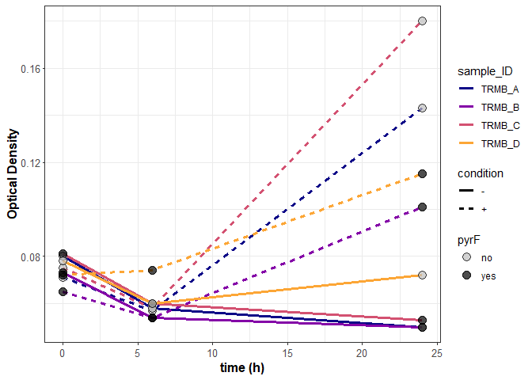

```r
library(tidyverse)
library(viridis)
ods <- read_csv("AKS319_RNA_growth_supp.csv")
```


```r
color_group <- c("grey", "black")

ods %>%
  filter(genotype == "TRMB") %>%
  ggplot() +
  geom_line(aes(x = time, y = OD, color = sample_ID, linetype = condition), linewidth = 1.2) +
  geom_point(aes(x = time, y = OD, fill = pyrF), size = 4, shape = 21, stroke = 0, alpha = 0.7) +
  scale_colour_viridis(discrete = T, option = "C", end = 0.8) +
  scale_fill_manual(values = color_group) +
  labs(y = "Optical Density", x = "time (h)") +
  theme_bw()+
  theme(
    axis.title.x = element_text(face = "bold", size = 12),
    axis.title.y = element_text(face = "bold", size = 12, angle = 90),
    axis.text.y = element_text(size = 10),
    axis.text.x = element_text(size = 10),
    axis.ticks.length.y.left = unit(.05, "cm"),
    legend.spacing.y = unit(.1, 'cm')
  )->fig

plot(fig)
```

<!-- -->

```r
png("RNA-sample_growth.png", width = 4, height = 2.8, units = "in", res = 1200, bg = "transparent")
plot(fig)
dev.off()
```

```
## png 
##   2
```

is there any difference between pyrF and no pyrF samples across time?

```r
#between -/= glucose regardless of pyrF
t.test(
  x = ods %>%
    filter(genotype == "TRMB" & condition == "+" & time == 24) %>%
    pull(OD),
  y = ods %>%
    filter(genotype == "TRMB" & condition == "-" & time == 24) %>%
    pull(OD),
  alternative = "two.sided"
)
```

```
## 
## 	Welch Two Sample t-test
## 
## data:  ods %>% filter(genotype == "TRMB" & condition == "+" & time == 24) %>% pull(OD) and ods %>% filter(genotype == "TRMB" & condition == "-" & time == 24) %>% pull(OD)
## t = 4.3096, df = 3.5497, p-value = 0.01622
## alternative hypothesis: true difference in means is not equal to 0
## 95 percent confidence interval:
##  0.02529294 0.13170706
## sample estimates:
## mean of x mean of y 
##   0.13475   0.05625
```

```r
# between +glu samples with and without pyrF
t.test(
  x = ods %>%
    filter(genotype == "TRMB" & condition == "+" & time == 24 & pyrF == "no") %>%
    pull(OD),
  y = ods %>%
    filter(genotype == "TRMB" & condition == "+" & time == 24 & pyrF == "yes") %>%
    pull(OD),
  alternative = "two.sided"
)
```

```
## 
## 	Welch Two Sample t-test
## 
## data:  ods %>% filter(genotype == "TRMB" & condition == "+" & time == 24 & pyrF == "no") %>% pull(OD) and ods %>% filter(genotype == "TRMB" & condition == "+" & time == 24 & pyrF == "yes") %>% pull(OD)
## t = 2.7047, df = 1.2806, p-value = 0.1791
## alternative hypothesis: true difference in means is not equal to 0
## 95 percent confidence interval:
##  -0.09871667  0.20571667
## sample estimates:
## mean of x mean of y 
##    0.1615    0.1080
```

```r
# between +glu samples with and without pyrF
t.test(
  x = ods %>%
    filter(genotype == "TRMB" & condition == "-" & time == 24 & pyrF == "no") %>%
    pull(OD),
  y = ods %>%
    filter(genotype == "TRMB" & condition == "-" & time == 24 & pyrF == "yes") %>%
    pull(OD),
  alternative = "two.sided"
)
```

```
## 
## 	Welch Two Sample t-test
## 
## data:  ods %>% filter(genotype == "TRMB" & condition == "-" & time == 24 & pyrF == "no") %>% pull(OD) and ods %>% filter(genotype == "TRMB" & condition == "-" & time == 24 & pyrF == "yes") %>% pull(OD)
## t = 0.85572, df = 1.0372, p-value = 0.5452
## alternative hypothesis: true difference in means is not equal to 0
## 95 percent confidence interval:
##  -0.1201567  0.1391567
## sample estimates:
## mean of x mean of y 
##    0.0610    0.0515
```
