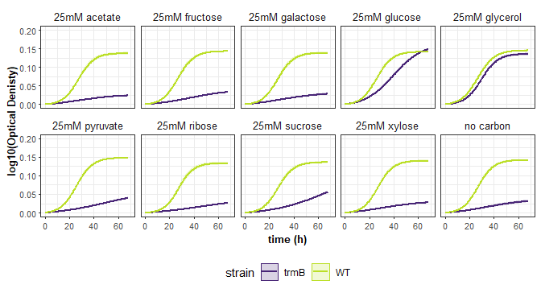
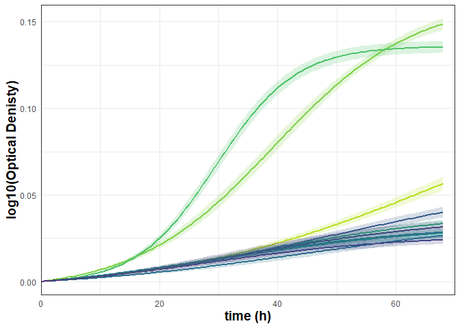
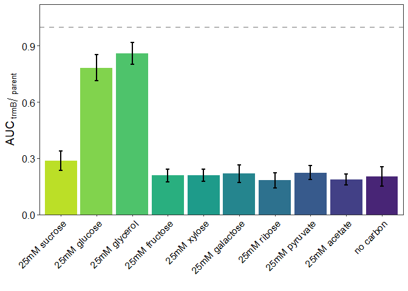

```r
# load required libraries
library(growthcurver)
library(viridis)
library(scales)
library(tidyverse)
library(factoextra)

# custom function, calculated the 95% Confidence interval
conf_int95 <- function(data) {
  n <- length(data)
  error <- qt(0.975, df = n - 1) * sd(data) / sqrt(n)
  return(error)
}
```

# Halobacterium salinarum
Load the normalized data and meta data. combine difference experiments. 

```r
expt <- "hbt_sugars"

# read in files
mt1 <- read.csv("normalized_growth_data/2021_sugar1_hbt_normalized_layout.csv", stringsAsFactors = F)
dt1 <- read.csv("normalized_growth_data/2021_sugar1_hbt_normalized_data.csv")
mt2 <- read.csv("normalized_growth_data/2021_sugar2_hbt_normalized_layout.csv", stringsAsFactors = F)
dt2 <- read.csv("normalized_growth_data/2021_sugar2_hbt_normalized_data.csv")

## set well no as column names, force conseq numbering
colnames(dt1) <- c(seq(1, ncol(dt1) - 1), "time")
mt1$variable <- seq(1, ncol(dt1) - 1)

colnames(dt2) <- c(seq(1, ncol(dt2) - 1) + max(mt1$variable), "time")
mt2$variable <- seq(1, ncol(dt2) - 1) + max(mt1$variable)

## combine meta and data frames across diff experiments
d <- inner_join(dt1, dt2, by = "time")
mt0 <- rbind(mt1, mt2)

# combine expt info with biorep info and remove expt column
mt0$biorep <- paste(mt0$biorep, mt0$expt, sep = "-")

## replace none with "no carbon" for labeling
mt0$ID <- str_replace_all(mt0$ID, "none", "no carbon")
mt0$condition <- str_replace_all(mt0$condition, "none", "no carbon")

# bioreps with at least 3 tech reps
mt0[, c(2, 3, 4, 6, 7)] %>%
  group_by(ID, biorep) %>%
  tally() %>%
  filter(n >= 3) %>%
  group_by(ID) %>%
  tally()
```

```
## # A tibble: 20 × 2
##    ID                      n
##    <chr>               <int>
##  1 WT+25mM acetate         4
##  2 WT+25mM fructose        4
##  3 WT+25mM galactose       4
##  4 WT+25mM glucose         4
##  5 WT+25mM glycerol        4
##  6 WT+25mM pyruvate        4
##  7 WT+25mM ribose          4
##  8 WT+25mM sucrose         4
##  9 WT+25mM xylose          4
## 10 WT+no carbon            4
## 11 trmB+25mM acetate       3
## 12 trmB+25mM fructose      4
## 13 trmB+25mM galactose     4
## 14 trmB+25mM glucose       4
## 15 trmB+25mM glycerol      4
## 16 trmB+25mM pyruvate      4
## 17 trmB+25mM ribose        4
## 18 trmB+25mM sucrose       4
## 19 trmB+25mM xylose        4
## 20 trmB+no carbon          3
```


```r
# Convert data from wide to long format
m_dt <- reshape2::melt(d, id = "time")
mtdt <- merge(m_dt, mt0, by = "variable")
mtdt$environment <- paste(mtdt$media, mtdt$condition)
well <- paste(mtdt$variable, mtdt$ID, sep = " ")
mtdt <- cbind(well, mtdt)

# clean
c_mtdt <- mtdt[!(mtdt$ID == ""), ]

# time cutoff - this is a usefull function for graphing and analysis. You might not need to look at the full length of the experiment.
t_mtdt <- c_mtdt[!(c_mtdt$time >= 68), ]
```

### Growth curve modeling

```r
# Create an output data frame to store the results in.
num_analyses <- length(names(d)) - 1
d_gc <- data.frame(
  sample = character(num_analyses),
  k = numeric(num_analyses),
  n0 = numeric(num_analyses),
  r = numeric(num_analyses),
  t_mid = numeric(num_analyses),
  t_gen = numeric(num_analyses),
  auc_l = numeric(num_analyses),
  auc_e = numeric(num_analyses),
  sigma = numeric(num_analyses),
  stringsAsFactors = FALSE
)

# Truncate or trim the input data to observations occurring in the first 80 hours.
trim_at_time <- 68.5

# Loop through all of the columns in the data frame. For each column, run Growthcurver.
pdf(paste("figures/", expt, "_growthcurver_fits.pdf", sep = ""), height = 8.5, width = 11)
par(mfcol = c(8, 12))
par(mar = c(0.25, 0.25, 0.25, 0.25))
y_lim_max <- max(d[, setdiff(names(d), "time")], na.rm = T) - min(d[, setdiff(names(d), "time")], na.rm = T)

n <- 1 # keeps track of the current row in the output data frame
for (col_name in names(d)) {
  # Don't process the time column.
  if (col_name != "time") {
    # Create a temporary data frame that contains just the time and current col
    d_loop <- d[c("time", col_name)]

    # Now, call Growthcurver to calculate the metrics using SummarizeGrowth
    gc_fit <- SummarizeGrowth(
      data_t = d_loop$time,
      data_n = d_loop[col_name],
      t_trim = trim_at_time,
      bg_correct = "none"
    )

    if (gc_fit$vals[[16]] == "cannot fit data") {
      d_gc$sample[n] <- col_name
      n <- n + 1
    } else {
      d_gc$sample[n] <- col_name
      d_gc[n, 2:9] <- c(
        gc_fit$vals$k,
        gc_fit$vals$n0,
        gc_fit$vals$r,
        gc_fit$vals$t_mid,
        gc_fit$vals$t_gen,
        gc_fit$vals$auc_l,
        gc_fit$vals$auc_e,
        gc_fit$vals$sigma
      )

      n <- n + 1
      # Finally, plot the raw data and the fitted curve. print some of the data points to keep the file size smaller
      n_obs <- length(gc_fit$data$t)
      idx_to_plot <- 1:20 / 20 * n_obs
      plot(gc_fit$data$t[idx_to_plot], gc_fit$data$N[idx_to_plot],
        pch = 20,
        xlim = c(0, trim_at_time),
        ylim = c(0, y_lim_max),
        cex = 0.6, xaxt = "n", yaxt = "n"
      )
      text(x = trim_at_time / 4, y = y_lim_max, labels = col_name, pos = 1)
      lines(gc_fit$data$t, predict(gc_fit$model), col = "red")
    }
  }
}
dev.off()
```

```
## png 
##   2
```

graph fitted curves:

```r
fitted_curves <- list()

n <- 1 # keeps track of the current row in the output data frame
for (col_name in names(d)) {
  if (col_name != "time") {
    d_loop <- d[c("time", col_name)]
    gc_fit <- SummarizeGrowth(
      data_t = d_loop$time,
      data_n = d_loop[col_name],
      t_trim = trim_at_time,
      bg_correct = "none"
    )
    if (gc_fit$vals[[16]] == "cannot fit data") {
      d_gc$sample[n] <- col_name
      n <- n + 1
    } else {
      fitted_curves[[n]] <- predict(gc_fit$model)
      names(fitted_curves)[n] <- col_name
      n <- n + 1
    }
  }
}

tmp <- Filter(length, fitted_curves)
fits <- as.data.frame(tmp, col.names = names(tmp))
colnames(fits) <- names(tmp)
fits <- cbind("time" = d$time[d$time < trim_at_time], fits)

# re-zero lowest value
mins <- Rfast::colMins(as.matrix(fits), value = T) # get column minimums
fits <- sweep(fits, 2, mins, "-") # subtract smallest value for each column
```


```r
# Convert data from wide to long format
m_dt <- reshape2::melt(fits, id = "time")
mtdt <- merge(m_dt, mt0, by = "variable")
well <- paste(mtdt$variable, mtdt$ID, sep = " ")
mtdt <- cbind(well, mtdt)

t_mtdt2 <- mtdt[!(mtdt$ID == ""), ]

stats2 <- t_mtdt2 %>%
  group_by(ID, strain, condition, time) %>%
  summarise(
    reps = length(value),
    average = mean(value) + 1,
    CI95 = conf_int95(value)
  )
unique(stats2$strain)
```

```
## [1] "WT"   "trmB"
```

```r
# all conditions tested.
stats2 %>%
  ggplot(., aes(x = time, y = log10(average), color = strain)) +
  xlab("time (h)") +
  ylab("log10(Optical Denisty)") +
  geom_line(linewidth = 1) +
  scale_y_continuous(limits = c(0, 0.2)) +
  scale_x_continuous(limits = c(0, 70)) +
  geom_ribbon(aes(ymin = log10(average - CI95), ymax = log10(average + CI95), fill = strain, color = NULL), alpha = 0.2) +
  scale_fill_viridis("strain", discrete = TRUE, begin = 0.1, end = 0.9) +
  scale_color_viridis("strain", discrete = TRUE, begin = 0.1, end = 0.9) +
  theme_bw() +
  facet_wrap(~condition, nrow = 2) +
  theme(
    axis.title.x = element_text(face = "bold", size = 10, angle = 0), axis.title.y = element_text(face = "bold", size = 10, angle = 90),
    axis.text.y = element_text(size = 8, angle = 0), axis.text.x = element_text(size = 8, angle = 0),
    axis.ticks.length.y.left = unit(.05, "cm"), strip.text = element_text(size = 10),
    strip.background = element_blank(), strip.placement = "outside",
    legend.position = "bottom"
  )
```

<!-- -->

insets

```r
stats2$condition <- factor(stats2$condition, levels = c("25mM sucrose", "25mM glucose", "25mM glycerol", "25mM fructose", "25mM xylose", "25mM galactose", "25mM ribose", "25mM pyruvate", "25mM acetate", "no carbon"))

stats2 %>%
  filter(strain == "trmB") %>%
  ggplot(., aes(x = time, y = log10(average), color = condition)) +
  geom_line(linewidth = 1) +
  geom_ribbon(aes(ymin = log10(average - CI95), ymax = log10(average + CI95), fill = condition, color = NULL), alpha = 0.2) +
  xlab("time (h)") +
  ylab("log10(Optical Denisty)") +
  scale_x_continuous(limits = c(0, 70), expand = c(0, 0)) +
  scale_fill_viridis("condition", discrete = TRUE, begin = 0.1, end = 0.9, direction = -1) +
  scale_color_viridis("condition", discrete = TRUE, begin = 0.1, end = 0.9, direction = -1) +
  theme_bw() +
  theme(
    axis.title.x = element_text(face = "bold", size = 14, angle = 0),
    axis.title.y = element_text(face = "bold", size = 14, angle = 90),
    # axis.text.y = element_blank(), axis.text.x = element_blank(),
    axis.ticks = element_blank(), legend.position = "none"
  ) -> inset
plot(inset)
```

<!-- -->

```r
png(paste("figures/", expt, "_inset.png", sep = ""), width = 3, height = 3, units = "in", res = 1200, bg = "transparent")
plot(inset)
dev.off()
```

```
## png 
##   2
```

```r
pdf(paste("figures/", expt, "_inset.pdf", sep = ""), width = 3, height = 3, bg = "transparent")
plot(inset)
dev.off()
```

```
## png 
##   2
```

# TrmB normalized to WT by condition
normalize trmB to WT: take average of WT bioreps. calculate ratios of individual trmB bioreps. then average and calc SD/std err.

```r
colnames(d_gc)[1] <- "variable"
merge(d_gc, mt0) -> tmp

tmp %>%
  group_by(strain, condition, biorep, ID, media) %>%
  summarise(avg_auc = mean(auc_e)) %>% # average technical replicates
  group_by(condition, biorep) %>%
  summarise(rat_auc = avg_auc[strain == "trmB"] / avg_auc[strain == "WT"]) %>%
  group_by(condition) %>% # average ratios and calc sd
  summarise(
    avg_auc = mean(rat_auc),
    auc_sd = sd(rat_auc)
  ) -> norms.hbt

# factorize for sorting
norms.hbt$condition <- factor(norms.hbt$condition)

# TrmB normalized to WT
norms.hbt %>%
  slice(8, 4, 5, 2, 9, 3, 7, 6, 1, 10) %>%
  mutate(condition = factor(condition, levels = condition)) %>%
  ggplot(aes(x = condition, y = avg_auc)) +
  xlab("") +
  ylab(expression("AUC"[" trmB" / " parent"])) +
  geom_hline(yintercept = 1, size = 1, linetype = "dashed", alpha = 0.3) +
  geom_bar(stat = "identity", aes(fill = condition)) +
  geom_errorbar(aes(ymin = avg_auc - auc_sd, ymax = avg_auc + auc_sd),
    width = .1, size = 1, position = position_dodge(.9)
  ) +
  scale_fill_viridis("x", discrete = TRUE, begin = 0.1, end = 0.9, direction = -1) +
  scale_y_continuous(limits = c(0, 1.1), expand = expansion(mult = c(0, 0.02))) +
  theme_bw() +
  theme(
    axis.title.y = element_text(face = "plain", color = "#000000", size = 14, angle = 90),
    axis.text.y = element_text(face = "plain", color = "#000000", size = 12, angle = 0),
    axis.text.x = element_text(face = "plain", color = "#000000", size = 12, angle = 45, hjust = 1),
    panel.grid.major = element_blank(), panel.grid.minor = element_blank(),
    legend.position = "none"
  ) -> figure
plot(figure)
```

<!-- -->

```r
png(paste("figures/", expt, "_AUC_plot.png", sep = ""), width = 10, height = 5, units = "in", res = 1200, bg = "transparent")
plot(figure)
dev.off()
```

```
## png 
##   2
```

```r
pdf(paste("figures/", expt, "_AUC_plot.pdf", sep = ""), width = 10, height = 5, bg = "transparent")
plot(figure)
dev.off()
```

```
## png 
##   2
```

Test for significance

```r
tmp %>%
  group_by(strain, condition, biorep, ID) %>%
  summarise(avg_auc = mean(auc_e)) -> tmp2

for (i in 1:length(unique(tmp2$condition))) {
  cond <- unique(tmp2$condition)[i]
  trmB <- paste("trmB", cond, sep = "+")
  wt <- paste("WT", cond, sep = "+")
  one <- filter(tmp2, ID == trmB)$avg_auc
  two <- filter(tmp2, ID == wt)$avg_auc
  test <- t.test(one, two, alternative = "less")
  print(paste("AUC difference in", cond, "is significant with p-value of ", round(test$p.value, digits = 5)))
}
```

```
## [1] "AUC difference in 25mM acetate is significant with p-value of  3e-05"
## [1] "AUC difference in 25mM fructose is significant with p-value of  1e-05"
## [1] "AUC difference in 25mM galactose is significant with p-value of  1e-05"
## [1] "AUC difference in 25mM glucose is significant with p-value of  8e-04"
## [1] "AUC difference in 25mM glycerol is significant with p-value of  0.00049"
## [1] "AUC difference in 25mM pyruvate is significant with p-value of  0"
## [1] "AUC difference in 25mM ribose is significant with p-value of  5e-05"
## [1] "AUC difference in 25mM sucrose is significant with p-value of  0"
## [1] "AUC difference in 25mM xylose is significant with p-value of  0"
## [1] "AUC difference in no carbon is significant with p-value of  2e-05"
```
