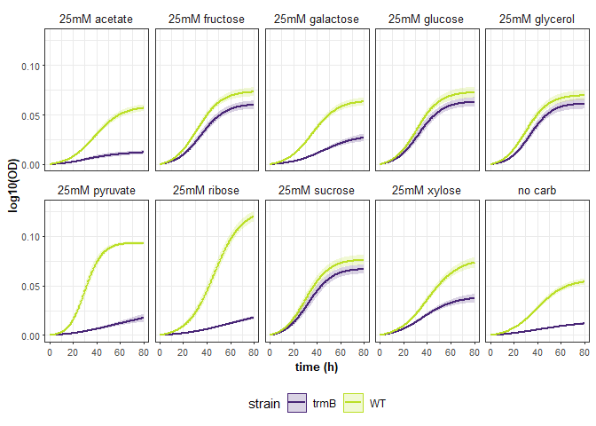

```r
# load required libraries
library(growthcurver)
library(viridis)
library(scales)
library(tidyverse)
library(factoextra)
library(ggpubr)
library(rstatix)

# custom function, calculated the 95% Confidence interval
conf_int95 <- function(data) {
  n <- length(data)
  error <- qt(0.975, df = n - 1) * sd(data) / sqrt(n)
  return(error)
}
```

# Haloarcula hispanica
Load the normalized data and meta data. combine difference experiments. 

```r
expt <- "hca_sugars"

## read in files
mt1 <- read.csv("normalized_growth_data/2020_sugar1_normalized_layout.csv", stringsAsFactors = F)
dt1 <- read.csv("normalized_growth_data/2020_sugar1_normalized_data.csv")
mt2 <- read.csv("normalized_growth_data/2020_sugar2_normalized_layout.csv", stringsAsFactors = F)
dt2 <- read.csv("normalized_growth_data/2020_sugar2_normalized_data.csv")
mt3 <- read.csv("normalized_growth_data/2021_sugar3_normalized_layout.csv", stringsAsFactors = F)
dt3 <- read.csv("normalized_growth_data/2021_sugar3_normalized_data.csv")

## set well no as column names, force conseq numbering
colnames(dt1) <- c(seq(1, ncol(dt1) - 1), "time")
mt1$variable <- seq(1, ncol(dt1) - 1)

colnames(dt2) <- c(seq(1, ncol(dt2) - 1) + max(mt1$variable), "time")
mt2$variable <- seq(1, ncol(dt2) - 1) + max(mt1$variable)

colnames(dt3) <- c(seq(1, ncol(dt3) - 1) + max(mt2$variable), "time")
mt3$variable <- seq(1, ncol(dt3) - 1) + max(mt2$variable)

## combine meta and data frames across diff experiments
d <- inner_join(dt1, dt2, by = "time")
(d <- inner_join(d, dt3, by = "time"))
```

```
##                1            2            3            4           5           6
## 1   0.0052500000 0.0042500000 3.279412e-03 0.0032500000 0.003250000 0.009191176
## 2   0.0022794118 0.0022794118 1.308824e-03 0.0012794118 0.002279412 0.005220588
## 3   0.0027058824 0.0017058824 7.352941e-04 0.0017058824 0.001705882 0.007647059
## 4   0.0011470588 0.0021470588 1.764706e-04 0.0021470588 0.001147059 0.007088235
## 5   0.0026176471 0.0026176471 6.470588e-04 0.0026176471 0.001617647 0.007558824
## 6   0.0009705882 0.0009705882 0.000000e+00 0.0009705882 0.001970588 0.006911765
## 7   0.0029117647 0.0029117647 1.941176e-03 0.0029117647 0.002911765 0.007852941
## 8   0.0000000000 0.0000000000 2.941176e-05 0.0000000000 0.000000000 0.005941176
## 9   0.0034264706 0.0044264706 2.455882e-03 0.0044264706 0.004426471 0.007367647
## 10  0.0040147059 0.0040147059 4.044118e-03 0.0040147059 0.006014706 0.008955882
## 11  0.0060588235 0.0020588235 7.088235e-03 0.0020588235 0.006058824 0.000000000
## 12  0.0014705882 0.0024705882 3.500000e-03 0.0034705882 0.003470588 0.005411765
## 13  0.0051029412 0.0081029412 8.132353e-03 0.0041029412 0.008102941 0.001044118
## 14  0.0017205882 0.0027205882 4.750000e-03 0.0027205882 0.005720588 0.006661765
## 15  0.0043235294 0.0073235294 9.352941e-03 0.0073235294 0.009323529 0.009264706
## 16  0.0006470588 0.0036470588 5.676471e-03 0.0046470588 0.006647059 0.007588235
## 17  0.0026764706 0.0036764706 7.705882e-03 0.0056764706 0.007676471 0.007617647
## 18  0.0030000000 0.0050000000 1.002941e-02 0.0070000000 0.010000000 0.007941176
## 19  0.0068823529 0.0108823529 1.391176e-02 0.0128823529 0.012882353 0.004823529
## 20  0.0017352941 0.0067352941 1.076471e-02 0.0077352941 0.010735294 0.007676471
## 21  0.0033970588 0.0083970588 1.442647e-02 0.0103970588 0.013397059 0.009338235
## 22  0.0014264706 0.0064264706 1.345588e-02 0.0094264706 0.012426471 0.010367647
## 23  0.0030882353 0.0080882353 1.711765e-02 0.0110882353 0.015088235 0.012029412
## 24  0.0040588235 0.0080588235 1.908824e-02 0.0110588235 0.016058824 0.011000000
## 25  0.0042794118 0.0122794118 2.230882e-02 0.0152794118 0.019279412 0.014220588
## 26  0.0061323529 0.0131323529 2.416176e-02 0.0171323529 0.021132353 0.017073529
## 27  0.0024852941 0.0104852941 2.451471e-02 0.0144852941 0.019485294 0.014426471
## 28  0.0050882353 0.0140882353 2.811765e-02 0.0180882353 0.023088235 0.015029412
## 29  0.0051470588 0.0161470588 2.917647e-02 0.0191470588 0.023147059 0.017088235
## 30  0.0040441176 0.0140441176 3.007353e-02 0.0190441176 0.024044118 0.017985294
## 31  0.0061911765 0.0161911765 3.322059e-02 0.0211911765 0.026191176 0.019132353
## 32  0.0008676471 0.0128676471 3.189706e-02 0.0178676471 0.025867647 0.018808824
## 33  0.0058529412 0.0178529412 3.688235e-02 0.0228529412 0.029852941 0.021794118
## 34  0.0054264706 0.0204264706 3.945588e-02 0.0244264706 0.032426471 0.025367647
## 35  0.0066764706 0.0216764706 4.070588e-02 0.0256764706 0.032676471 0.026617647
## 36  0.0023676471 0.0183676471 4.039706e-02 0.0243676471 0.031367647 0.023308824
## 37  0.0057647059 0.0237647059 4.479412e-02 0.0287647059 0.035764706 0.027705882
## 38  0.0079705882 0.0259705882 4.700000e-02 0.0299705882 0.036970588 0.030911765
## 39  0.0096617647 0.0286617647 4.969118e-02 0.0326617647 0.039661765 0.033602941
## 40  0.0103382353 0.0303382353 5.136765e-02 0.0343382353 0.040338235 0.037279412
## 41  0.0120441176 0.0320441176 6.007353e-02 0.0350441176 0.048044118 0.039985294
## 42  0.0108970588 0.0328970588 5.892647e-02 0.0358970588 0.046897059 0.040838235
## 43  0.0111470588 0.0341470588 5.917647e-02 0.0351470588 0.047147059 0.043088235
## 44  0.0130147059 0.0370147059 7.004412e-02 0.0380147059 0.056014706 0.046955882
## 45  0.0200147059 0.0470147059 7.804412e-02 0.0480147059 0.064014706 0.052955882
## 46  0.0120588235 0.0390588235 6.808824e-02 0.0400588235 0.053058824 0.047000000
## 47  0.0064117647 0.0364117647 6.344118e-02 0.0384117647 0.048411765 0.044352941
## 48  0.0084411765 0.0374411765 6.747059e-02 0.0374411765 0.051441176 0.047382353
## 49  0.0108235294 0.0428235294 6.985294e-02 0.0438235294 0.054823529 0.051764706
## 50  0.0123529412 0.0463529412 7.338235e-02 0.0463529412 0.058352941 0.057294118
## 51  0.0162500000 0.0512500000 7.827941e-02 0.0502500000 0.061250000 0.061191176
## 52  0.0143676471 0.0503676471 7.939706e-02 0.0503676471 0.062367647 0.060308824
## 53  0.0132941176 0.0522941176 7.832353e-02 0.0502941176 0.061294118 0.062235294
## 54  0.0140147059 0.0540147059 8.204412e-02 0.0530147059 0.064014706 0.064955882
## 55  0.0196911765 0.0606911765 8.772059e-02 0.0586911765 0.069691176 0.070632353
## 56  0.0157352941 0.0587352941 8.676471e-02 0.0567352941 0.068735294 0.068676471
## 57  0.0158088235 0.0608088235 8.783824e-02 0.0568088235 0.071808824 0.071750000
## 58  0.0174705882 0.0644705882 9.150000e-02 0.0604705882 0.075470588 0.074411765
## 59  0.0133529412 0.0613529412 8.838235e-02 0.0573529412 0.071352941 0.072294118
## 60  0.0116764706 0.0616764706 8.970588e-02 0.0566764706 0.071676471 0.067617647
## 61  0.0125588235 0.0695588235 9.558824e-02 0.0625588235 0.076558824 0.068500000
## 62  0.0178823529 0.0728823529 1.009118e-01 0.0658823529 0.082882353 0.073823529
## 63  0.0206764706 0.0756764706 1.047059e-01 0.0686764706 0.085676471 0.078617647
## 64  0.0194705882 0.0754705882 1.035000e-01 0.0684705882 0.085470588 0.083411765
## 65  0.0209705882 0.0789705882 1.080000e-01 0.0709705882 0.087970588 0.086911765
## 66  0.0209558824 0.0799558824 1.109853e-01 0.0709558824 0.089955882 0.087897059
## 67  0.0241470588 0.0861470588 1.131765e-01 0.0781470588 0.093147059 0.095088235
## 68  0.0229558824 0.0859558824 1.129853e-01 0.0769558824 0.093955882 0.093897059
## 69  0.0250588235 0.0900588235 1.160882e-01 0.0800588235 0.097058824 0.099000000
## 70  0.0271323529 0.0921323529 1.191618e-01 0.0821323529 0.102132353 0.102073529
## 71  0.0273382353 0.0953382353 1.203676e-01 0.0833382353 0.103338235 0.103279412
## 72  0.0212352941 0.0922352941 1.172647e-01 0.0782352941 0.095235294 0.098176471
## 73  0.0236764706 0.0966764706 1.227059e-01 0.0836764706 0.104676471 0.102617647
## 74  0.0283970588 0.1003970588 1.264265e-01 0.0863970588 0.106397059 0.107338235
## 75  0.0278235294 0.1038235294 1.288529e-01 0.0878235294 0.112823529 0.108764706
## 76  0.0289117647 0.1049117647 1.299412e-01 0.0889117647 0.113911765 0.110852941
## 77  0.0229558824 0.1009558824 1.249853e-01 0.0849558824 0.103955882 0.108897059
## 78  0.0273529412 0.1073529412 1.293824e-01 0.0913529412 0.114352941 0.113294118
## 79  0.0270294118 0.1120294118 1.310588e-01 0.0920294118 0.113029412 0.115970588
## 80  0.0296764706 0.1156764706 1.347059e-01 0.0956764706 0.116676471 0.120617647
## 81  0.0304264706 0.1184264706 1.354559e-01 0.0964264706 0.119426471 0.121367647
## 82  0.0297500000 0.1187500000 1.367794e-01 0.0967500000 0.120750000 0.123691176
## 83  0.0323235294 0.1223235294 1.393529e-01 0.1003235294 0.126323529 0.127264706
## 84  0.0333529412 0.1263529412 1.433824e-01 0.1033529412 0.127352941 0.130294118
## 85  0.0364852941 0.1324852941 1.465147e-01 0.1094852941 0.129485294 0.135426471
## 86  0.0350735294 0.1340735294 1.451029e-01 0.1090735294 0.130073529 0.133014706
## 87  0.0328676471 0.1318676471 1.448971e-01 0.1068676471 0.128867647 0.131808824
## 88  0.0459705882 0.1549705882 1.570000e-01 0.1249705882 0.141970588 0.144911765
## 89  0.0386323529 0.1446323529 1.516618e-01 0.1166323529 0.136632353 0.140573529
## 90  0.0319852941 0.1459852941 1.460147e-01 0.1129852941 0.128985294 0.134926471
## 91  0.0371764706 0.1571764706 1.522059e-01 0.1171764706 0.135176471 0.139117647
## 92  0.0354117647 0.1584117647 1.524412e-01 0.1194117647 0.141411765 0.142352941
## 93  0.0388088235 0.1618088235 1.548382e-01 0.1218088235 0.138808824 0.142750000
## 94  0.0369705882 0.1659705882 1.540000e-01 0.1209705882 0.147970588 0.145911765
## 95  0.0401323529 0.1561323529 1.601618e-01 0.1211323529 0.141132353 0.145073529
## 96  0.0401764706 0.1621764706 1.582059e-01 0.1251764706 0.141176471 0.146117647
## 97  0.0368088235 0.1668088235 1.568382e-01 0.1228088235 0.143808824 0.143750000
## 98  0.0406323529 0.1726323529 1.596618e-01 0.1266323529 0.143632353 0.146573529
## 99  0.0428235294 0.1838235294 1.628529e-01 0.1318235294 0.152823529 0.150764706
## 100 0.0422352941 0.1782352941 1.642647e-01 0.1322352941 0.148235294 0.151176471
## 101 0.0392794118 0.1682794118 1.593088e-01 0.1232794118 0.144279412 0.144220588
## 102 0.0478235294 0.1908235294 1.688529e-01 0.1378235294 0.154823529 0.152764706
## 103 0.0436323529 0.1866323529 1.646618e-01 0.1306323529 0.155632353 0.151573529
## 104 0.0487794118 0.1867794118 1.688088e-01 0.1347794118 0.162779412 0.153720588
## 105 0.0490441176 0.2020441176 1.700735e-01 0.1410441176 0.165044118 0.153985294
## 106 0.0499117647 0.1929117647 1.739412e-01 0.1389117647 0.162911765 0.155852941
## 107 0.0492058824 0.2062058824 1.722353e-01 0.1442058824 0.163205882 0.157147059
## 108 0.0488823529 0.2068823529 1.719118e-01 0.1388823529 0.162882353 0.154823529
## 109 0.0500735294 0.2160735294 1.741029e-01 0.1450735294 0.169073529 0.157014706
## 110 0.0547352941 0.2097352941 1.777647e-01 0.1467352941 0.168735294 0.164676471
## 111 0.0522941176 0.2022941176 1.713235e-01 0.1372941176 0.162294118 0.156235294
## 112 0.0494705882 0.2124705882 1.745000e-01 0.1414705882 0.167470588 0.156411765
## 113 0.0502794118 0.2002794118 1.713088e-01 0.1362794118 0.160279412 0.155220588
## 114 0.0557941176 0.2227941176 1.788235e-01 0.1477941176 0.171794118 0.157735294
## 115 0.0464558824 0.2054558824 1.724853e-01 0.1394558824 0.167455882 0.156397059
## 116 0.0512941176 0.2162941176 1.773235e-01 0.1462941176 0.173294118 0.160235294
## 117 0.0563235294 0.2373235294 1.803529e-01 0.1503235294 0.175323529 0.159264706
## 118 0.0567352941 0.2367352941 1.817647e-01 0.1517352941 0.176735294 0.161676471
## 119 0.0555588235 0.2305588235 1.825882e-01 0.1515588235 0.176558824 0.160500000
## 120 0.0579705882 0.2359705882 1.870000e-01 0.1569705882 0.183970588 0.164911765
## 121 0.0584117647 0.2284117647 1.814412e-01 0.1504117647 0.175411765 0.158352941
## 122 0.0560294118 0.2350294118 1.790588e-01 0.1490294118 0.178029412 0.158970588
## 123 0.0605588235 0.2425588235 1.865882e-01 0.1585588235 0.183558824 0.163500000
## 124 0.0617794118 0.2417794118 1.878088e-01 0.1587794118 0.187779412 0.163720588
## 125 0.0637205882 0.2497205882 1.877500e-01 0.1587205882 0.190720588 0.165661765
## 126 0.0595294118 0.2505294118 1.885588e-01 0.1585294118 0.189529412 0.163470588
## 127 0.0666617647 0.2626617647 1.946912e-01 0.1736617647 0.197661765 0.173602941
## 128 0.0571470588 0.2511470588 1.861765e-01 0.1551470588 0.185147059 0.163088235
## 129 0.0655588235 0.2535588235 1.895882e-01 0.1625588235 0.190558824 0.165500000
## 130 0.0535000000 0.2445000000 1.865294e-01 0.1555000000 0.186500000 0.162441176
## 131 0.0546323529 0.2486323529 1.886618e-01 0.1616323529 0.186632353 0.165573529
## 132 0.0626764706 0.2616764706 1.907059e-01 0.1706764706 0.195676471 0.166617647
## 133 0.0555588235 0.2495588235 1.865882e-01 0.1625588235 0.194558824 0.162500000
## 134 0.0652794118 0.2642794118 1.953088e-01 0.1712794118 0.199279412 0.168220588
## 135 0.0699264706 0.2709264706 1.949559e-01 0.1719264706 0.201926471 0.169867647
## 136 0.0668235294 0.2698235294 1.958529e-01 0.1698235294 0.200823529 0.170764706
## 137 0.0627941176 0.2687941176 1.968235e-01 0.1837941176 0.202794118 0.171735294
## 138 0.0627352941 0.2757352941 1.957647e-01 0.1747352941 0.201735294 0.170676471
## 139 0.0623823529 0.2563823529 1.934118e-01 0.1653823529 0.196382353 0.165323529
## 140 0.0632794118 0.2782794118 1.973088e-01 0.1752794118 0.203279412 0.169220588
## 141 0.0703676471 0.2753676471 1.973971e-01 0.1743676471 0.203367647 0.170308824
## 142 0.0700588235 0.2810588235 1.990882e-01 0.1780588235 0.205058824 0.169000000
## 143 0.0710882353 0.2660882353 1.991176e-01 0.1750882353 0.203088235 0.170029412
## 144 0.0683676471 0.2793676471 2.013971e-01 0.1803676471 0.209367647 0.171308824
## 145 0.0744705882 0.2834705882 2.015000e-01 0.1794705882 0.205470588 0.171411765
## 146 0.0657205882 0.2777205882 1.997500e-01 0.1797205882 0.204720588 0.169661765
## 147 0.0660882353 0.2760882353 1.971176e-01 0.1780882353 0.207088235 0.168029412
## 148 0.0646470588 0.2786470588 2.006765e-01 0.1826470588 0.211647059 0.169588235
## 149 0.0714264706 0.2794264706 2.044559e-01 0.1854264706 0.208426471 0.174367647
## 150 0.0708970588 0.2798970588 2.029265e-01 0.1848970588 0.209897059 0.168838235
## 151 0.0729705882 0.2799705882 2.040000e-01 0.1829705882 0.206970588 0.171911765
## 152 0.0725147059 0.2825147059 2.045441e-01 0.1895147059 0.214514706 0.171455882
## 153 0.0771911765 0.2871911765 2.052206e-01 0.1971911765 0.216191176 0.173132353
## 154 0.0825147059 0.2965147059 2.145441e-01 0.1875147059 0.215514706 0.181455882
## 155 0.0699411765 0.2879411765 2.069706e-01 0.1879411765 0.216941176 0.173882353
## 156 0.0705000000 0.2895000000 2.075294e-01 0.1865000000 0.211500000 0.173441176
## 157 0.0742794118 0.2922794118 2.093088e-01 0.1912794118 0.212279412 0.176220588
## 158 0.0870735294 0.2960735294 2.111029e-01 0.1930735294 0.219073529 0.176014706
## 159 0.0833235294 0.3003235294 2.123529e-01 0.1953235294 0.216323529 0.179264706
## 160 0.0810441176 0.2980441176 2.100735e-01 0.1890441176 0.214044118 0.173985294
## 161 0.0788970588 0.2998970588 2.129265e-01 0.1908970588 0.216897059 0.176838235
## 162 0.0892058824 0.3082058824 2.172353e-01 0.2032058824 0.221205882 0.183147059
## 163 0.0901911765 0.3041911765 2.132206e-01 0.1961911765 0.221191176 0.180132353
##                7            8            9           10           11
## 1   0.0031911765 0.0052500000 0.0022500000 0.0032500000 5.823529e-03
## 2   0.0022205882 0.0032794118 0.0022794118 0.0022794118 2.852941e-03
## 3   0.0016470588 0.0017058824 0.0017058824 0.0017058824 4.279412e-03
## 4   0.0020882353 0.0021470588 0.0021470588 0.0021470588 3.720588e-03
## 5   0.0025588235 0.0016176471 0.0016176471 0.0026176471 3.191176e-03
## 6   0.0019117647 0.0009705882 0.0009705882 0.0009705882 1.544118e-03
## 7   0.0028529412 0.0019117647 0.0029117647 0.0019117647 2.485294e-03
## 8   0.0009411765 0.0000000000 0.0000000000 0.0000000000 5.735294e-04
## 9   0.0043676471 0.0024264706 0.0024264706 0.0034264706 2.000000e-03
## 10  0.0059558824 0.0050147059 0.0030147059 0.0030147059 3.588235e-03
## 11  0.0000000000 0.0010588235 0.0070588235 0.0020588235 3.632353e-03
## 12  0.0034117647 0.0024705882 0.0024705882 0.0024705882 4.411765e-05
## 13  0.0080441176 0.0091029412 0.0041029412 0.0041029412 2.676471e-03
## 14  0.0046617647 0.0017205882 0.0017205882 0.0017205882 1.294118e-03
## 15  0.0082647059 0.0043235294 0.0043235294 0.0043235294 1.897059e-03
## 16  0.0065882353 0.0016470588 0.0046470588 0.0036470588 2.220588e-03
## 17  0.0076176471 0.0026764706 0.0036764706 0.0026764706 2.500000e-04
## 18  0.0099411765 0.0040000000 0.0050000000 0.0050000000 1.573529e-03
## 19  0.0148235294 0.0068823529 0.0098823529 0.0108823529 3.455882e-03
## 20  0.0086764706 0.0017352941 0.0057352941 0.0047352941 1.308824e-03
## 21  0.0133382353 0.0043970588 0.0073970588 0.0073970588 1.970588e-03
## 22  0.0123676471 0.0034264706 0.0074264706 0.0084264706 0.000000e+00
## 23  0.0150294118 0.0040882353 0.0100882353 0.0090882353 1.661765e-03
## 24  0.0160000000 0.0040588235 0.0100588235 0.0080588235 1.632353e-03
## 25  0.0192205882 0.0072794118 0.0112794118 0.0112794118 1.852941e-03
## 26  0.0210735294 0.0071323529 0.0131323529 0.0131323529 2.705882e-03
## 27  0.0184264706 0.0084852941 0.0114852941 0.0104852941 1.058824e-03
## 28  0.0240294118 0.0070882353 0.0150882353 0.0140882353 2.661765e-03
## 29  0.0240882353 0.0111470588 0.0161470588 0.0161470588 2.720588e-03
## 30  0.0239852941 0.0070441176 0.0170441176 0.0160441176 1.617647e-03
## 31  0.0281323529 0.0081911765 0.0181911765 0.0161911765 2.764706e-03
## 32  0.0288088235 0.0108676471 0.0178676471 0.0138676471 4.411765e-04
## 33  0.0327941176 0.0108529412 0.0218529412 0.0178529412 2.426471e-03
## 34  0.0343676471 0.0094264706 0.0254264706 0.0214264706 4.000000e-03
## 35  0.0356176471 0.0096764706 0.0256764706 0.0216764706 3.250000e-03
## 36  0.0373088235 0.0063676471 0.0253676471 0.0193676471 9.411765e-04
## 37  0.0417058824 0.0097647059 0.0307647059 0.0247647059 3.338235e-03
## 38  0.0429117647 0.0109705882 0.0329705882 0.0269705882 4.544118e-03
## 39  0.0456029412 0.0126617647 0.0356617647 0.0286617647 5.235294e-03
## 40  0.0462794118 0.0133382353 0.0393382353 0.0313382353 6.911765e-03
## 41  0.0489852941 0.0140441176 0.0480441176 0.0340441176 8.617647e-03
## 42  0.0498382353 0.0138970588 0.0488970588 0.0338970588 7.470588e-03
## 43  0.0500882353 0.0141470588 0.0511470588 0.0351470588 6.720588e-03
## 44  0.0579558824 0.0160147059 0.0620147059 0.0380147059 1.058824e-02
## 45  0.0679558824 0.0220147059 0.0720147059 0.0470147059 1.458824e-02
## 46  0.0570000000 0.0130588235 0.0640588235 0.0410588235 7.632353e-03
## 47  0.0543529412 0.0114117647 0.0614117647 0.0384117647 1.985294e-03
## 48  0.0593823529 0.0084411765 0.0674411765 0.0404411765 4.014706e-03
## 49  0.0627647059 0.0128235294 0.0728235294 0.0448235294 5.397059e-03
## 50  0.0662941176 0.0173529412 0.0763529412 0.0483529412 5.926471e-03
## 51  0.0691911765 0.0192500000 0.0832500000 0.0532500000 9.823529e-03
## 52  0.0703088235 0.0183676471 0.0863676471 0.0533676471 7.941176e-03
## 53  0.0692352941 0.0172941176 0.0882941176 0.0542941176 5.867647e-03
## 54  0.0729558824 0.0180147059 0.0940147059 0.0570147059 5.588235e-03
## 55  0.0776323529 0.0236911765 0.1036911765 0.0636911765 1.226471e-02
## 56  0.0766764706 0.0207352941 0.1067352941 0.0617352941 9.308824e-03
## 57  0.0807500000 0.0198088235 0.1078088235 0.0638088235 6.382353e-03
## 58  0.0834117647 0.0234705882 0.1124705882 0.0664705882 8.044118e-03
## 59  0.0802941176 0.0183529412 0.1133529412 0.0633529412 4.926471e-03
## 60  0.0816176471 0.0166764706 0.1176764706 0.0646764706 2.250000e-03
## 61  0.0895000000 0.0225588235 0.1235588235 0.0705588235 5.132353e-03
## 62  0.0938235294 0.0208823529 0.1318823529 0.0748823529 8.455882e-03
## 63  0.0986176471 0.0236764706 0.1376764706 0.0786764706 1.125000e-02
## 64  0.0964117647 0.0254705882 0.1444705882 0.0794705882 8.044118e-03
## 65  0.0999117647 0.0269705882 0.1469705882 0.0819705882 8.544118e-03
## 66  0.0998970588 0.0269558824 0.1509558824 0.0839558824 8.529412e-03
## 67  0.1070882353 0.0321470588 0.1541470588 0.0901470588 1.072059e-02
## 68  0.1058970588 0.0289558824 0.1599558824 0.0889558824 8.529412e-03
## 69  0.1100000000 0.0330588235 0.1580588235 0.0930588235 1.063235e-02
## 70  0.1130735294 0.0341323529 0.1661323529 0.0961323529 1.170588e-02
## 71  0.1152794118 0.0343382353 0.1713382353 0.0983382353 1.191176e-02
## 72  0.1071764706 0.0272352941 0.1662352941 0.0962352941 5.808824e-03
## 73  0.1146176471 0.0326764706 0.1736764706 0.0996764706 8.250000e-03
## 74  0.1193382353 0.0363970588 0.1753970588 0.1033970588 1.097059e-02
## 75  0.1207647059 0.0358235294 0.1818235294 0.1078235294 1.039706e-02
## 76  0.1218529412 0.0359117647 0.1819117647 0.1119117647 1.148529e-02
## 77  0.1168970588 0.0309558824 0.1739558824 0.1059558824 4.529412e-03
## 78  0.1232941176 0.0353529412 0.1823529412 0.1113529412 8.926471e-03
## 79  0.1249705882 0.0350294118 0.1790294118 0.1160294118 5.602941e-03
## 80  0.1266176471 0.0386764706 0.1856764706 0.1226764706 1.125000e-02
## 81  0.1303676471 0.0374264706 0.1874264706 0.1224264706 1.000000e-02
## 82  0.1316911765 0.0367500000 0.1897500000 0.1237500000 9.323529e-03
## 83  0.1332647059 0.0393235294 0.1873235294 0.1303235294 1.189706e-02
## 84  0.1382941176 0.0413529412 0.1903529412 0.1343529412 1.392647e-02
## 85  0.1394264706 0.0454852941 0.2004852941 0.1454852941 1.505882e-02
## 86  0.1380147059 0.0440735294 0.1970735294 0.1440735294 1.264706e-02
## 87  0.1378088235 0.0418676471 0.1958676471 0.1388676471 1.144118e-02
## 88  0.1509117647 0.0559705882 0.2189705882 0.1669705882 2.054412e-02
## 89  0.1465735294 0.0476323529 0.2016323529 0.1606323529 1.720588e-02
## 90  0.1409264706 0.0419852941 0.2019852941 0.1559852941 8.558824e-03
## 91  0.1451176471 0.0451764706 0.2081764706 0.1661764706 1.375000e-02
## 92  0.1453529412 0.0464117647 0.2124117647 0.1644117647 1.298529e-02
## 93  0.1487500000 0.0478088235 0.2038088235 0.1698088235 1.538235e-02
## 94  0.1479117647 0.0469705882 0.2149705882 0.1729705882 1.354412e-02
## 95  0.1490735294 0.0501323529 0.2071323529 0.1671323529 1.770588e-02
## 96  0.1521176471 0.0481764706 0.2191764706 0.1751764706 1.575000e-02
## 97  0.1477500000 0.0458088235 0.2168088235 0.1768088235 1.338235e-02
## 98  0.1515735294 0.0486323529 0.2136323529 0.1836323529 1.620588e-02
## 99  0.1547647059 0.0508235294 0.2178235294 0.1968235294 1.639706e-02
## 100 0.1571764706 0.0512352941 0.2142352941 0.1912352941 1.680882e-02
## 101 0.1472205882 0.0462794118 0.2052794118 0.1822794118 1.385294e-02
## 102 0.1577647059 0.0608235294 0.2268235294 0.2038235294 1.839706e-02
## 103 0.1535735294 0.0566323529 0.2106323529 0.1986323529 1.520588e-02
## 104 0.1567205882 0.0577794118 0.2277794118 0.2087794118 1.835294e-02
## 105 0.1569852941 0.0580441176 0.2170441176 0.2190441176 1.861765e-02
## 106 0.1598529412 0.0629117647 0.2279117647 0.2139117647 2.248529e-02
## 107 0.1621470588 0.0622058824 0.2292058824 0.2282058824 1.977941e-02
## 108 0.1578235294 0.0578823529 0.2208823529 0.2248823529 1.945588e-02
## 109 0.1610147059 0.0610735294 0.2260735294 0.2330735294 2.064706e-02
## 110 0.1666764706 0.0697352941 0.2267352941 0.2267352941 1.930882e-02
## 111 0.1562352941 0.0592941176 0.2202941176 0.2132941176 1.486765e-02
## 112 0.1574117647 0.0624705882 0.2204705882 0.2274705882 1.704412e-02
## 113 0.1562205882 0.0552794118 0.2222794118 0.2112794118 1.385294e-02
## 114 0.1627352941 0.0677941176 0.2257941176 0.2467941176 1.736765e-02
## 115 0.1593970588 0.0644558824 0.2154558824 0.2204558824 1.602941e-02
## 116 0.1602352941 0.0642941176 0.2212941176 0.2472941176 1.586765e-02
## 117 0.1612647059 0.0643235294 0.2263235294 0.2443235294 1.989706e-02
## 118 0.1636764706 0.0677352941 0.2297352941 0.2467352941 2.130882e-02
## 119 0.1635000000 0.0705588235 0.2265588235 0.2495588235 2.013235e-02
## 120 0.1679117647 0.0729705882 0.2289705882 0.2619705882 2.554412e-02
## 121 0.1613529412 0.0644117647 0.2294117647 0.2444117647 1.898529e-02
## 122 0.1599705882 0.0710294118 0.2230294118 0.2490294118 1.660294e-02
## 123 0.1645000000 0.0755588235 0.2315588235 0.2595588235 2.113235e-02
## 124 0.1667205882 0.0707794118 0.2237794118 0.2587794118 2.135294e-02
## 125 0.1686617647 0.0717205882 0.2267205882 0.2527205882 2.329412e-02
## 126 0.1644705882 0.0725294118 0.2265294118 0.2625294118 2.410294e-02
## 127 0.1776029412 0.0866617647 0.2376617647 0.2726617647 2.823529e-02
## 128 0.1640882353 0.0721470588 0.2211470588 0.2711470588 2.072059e-02
## 129 0.1695000000 0.0755588235 0.2255588235 0.2685588235 2.413235e-02
## 130 0.1634411765 0.0775000000 0.2185000000 0.2555000000 2.207353e-02
## 131 0.1665735294 0.0776323529 0.2216323529 0.2656323529 2.220588e-02
## 132 0.1686176471 0.0796764706 0.2236764706 0.2746764706 2.125000e-02
## 133 0.1645000000 0.0755588235 0.2255588235 0.2645588235 2.013235e-02
## 134 0.1712205882 0.0782794118 0.2252794118 0.2782794118 2.385294e-02
## 135 0.1728676471 0.0799264706 0.2259264706 0.2869264706 2.350000e-02
## 136 0.1717647059 0.0818235294 0.2268235294 0.2818235294 2.639706e-02
## 137 0.1747352941 0.0807941176 0.2287941176 0.2887941176 2.336765e-02
## 138 0.1736764706 0.0837352941 0.2257352941 0.2797352941 2.130882e-02
## 139 0.1663235294 0.0763823529 0.2233823529 0.2733823529 2.295588e-02
## 140 0.1732205882 0.0802794118 0.2272794118 0.2852794118 2.585294e-02
## 141 0.1743088235 0.0833676471 0.2263676471 0.3003676471 2.494118e-02
## 142 0.1720000000 0.0810588235 0.2290588235 0.3040588235 2.763235e-02
## 143 0.1750294118 0.0770882353 0.2250882353 0.2900882353 2.566176e-02
## 144 0.1753088235 0.0873676471 0.2283676471 0.3043676471 2.894118e-02
## 145 0.1754117647 0.0844705882 0.2274705882 0.2984705882 2.904412e-02
## 146 0.1746617647 0.0877205882 0.2237205882 0.2917205882 2.629412e-02
## 147 0.1710294118 0.0820882353 0.2230882353 0.2950882353 2.466176e-02
## 148 0.1745882353 0.0916470588 0.2256470588 0.3036470588 2.822059e-02
## 149 0.1783676471 0.0924264706 0.2294264706 0.3034264706 3.200000e-02
## 150 0.1738382353 0.0898970588 0.2288970588 0.3008970588 2.947059e-02
## 151 0.1759117647 0.0839705882 0.2269705882 0.3019705882 3.054412e-02
## 152 0.1774558824 0.0935147059 0.2275147059 0.3055147059 3.008824e-02
## 153 0.1771323529 0.0951911765 0.2281911765 0.3021911765 3.176471e-02
## 154 0.1874558824 0.0995147059 0.2375147059 0.3095147059 4.108824e-02
## 155 0.1788823529 0.0879411765 0.2299411765 0.3039411765 3.151471e-02
## 156 0.1784411765 0.0885000000 0.2275000000 0.3035000000 3.007353e-02
## 157 0.1812205882 0.0902794118 0.2292794118 0.3072794118 3.185294e-02
## 158 0.1800147059 0.0940735294 0.2310735294 0.3100735294 3.264706e-02
## 159 0.1832647059 0.0983235294 0.2353235294 0.3143235294 3.689706e-02
## 160 0.1789852941 0.0870441176 0.2310441176 0.3130441176 3.461765e-02
## 161 0.1838382353 0.0898970588 0.2308970588 0.3148970588 3.547059e-02
## 162 0.1901470588 0.0982058824 0.2362058824 0.3222058824 4.377941e-02
## 163 0.1851323529 0.0931911765 0.2321911765 0.3181911765 3.776471e-02
##               12           13           14           15           16
## 1   0.0052500000 0.0053676471 0.0051470588 4.250000e-03 0.0051911765
## 2   0.0032794118 0.0033970588 0.0021764706 3.279412e-03 0.0032205882
## 3   0.0027058824 0.0038235294 0.0036029412 2.705882e-03 0.0036470588
## 4   0.0031470588 0.0032647059 0.0040441176 2.147059e-03 0.0030882353
## 5   0.0026176471 0.0027352941 0.0035147059 3.617647e-03 0.0035588235
## 6   0.0009705882 0.0010882353 0.0018676471 2.970588e-03 0.0039117647
## 7   0.0029117647 0.0030294118 0.0038088235 2.911765e-03 0.0028529412
## 8   0.0000000000 0.0001176471 0.0008970588 0.000000e+00 0.0009411765
## 9   0.0024264706 0.0015441176 0.0033235294 2.426471e-03 0.0033676471
## 10  0.0050147059 0.0041323529 0.0049117647 4.014706e-03 0.0049558824
## 11  0.0020588235 0.0031764706 0.0009558824 5.882353e-05 0.0000000000
## 12  0.0014705882 0.0005882353 0.0013676471 1.470588e-03 0.0024117647
## 13  0.0031029412 0.0022205882 0.0000000000 1.029412e-04 0.0010441176
## 14  0.0027205882 0.0008382353 0.0016176471 2.720588e-03 0.0046617647
## 15  0.0053235294 0.0024411765 0.0042205882 4.323529e-03 0.0062647059
## 16  0.0036470588 0.0017647059 0.0025441176 4.647059e-03 0.0055882353
## 17  0.0036764706 0.0007941176 0.0025735294 3.676471e-03 0.0056176471
## 18  0.0060000000 0.0021176471 0.0038970588 6.000000e-03 0.0079411765
## 19  0.0068823529 0.0000000000 0.0027794118 5.882353e-03 0.0138235294
## 20  0.0067352941 0.0008529412 0.0026323529 6.735294e-03 0.0096764706
## 21  0.0083970588 0.0015147059 0.0032941176 8.397059e-03 0.0123382353
## 22  0.0094264706 0.0005441176 0.0023235294 1.042647e-02 0.0113676471
## 23  0.0110882353 0.0022058824 0.0049852941 1.008824e-02 0.0140294118
## 24  0.0100588235 0.0021764706 0.0039558824 1.005882e-02 0.0150000000
## 25  0.0122794118 0.0023970588 0.0041764706 1.227941e-02 0.0162205882
## 26  0.0151323529 0.0022500000 0.0080294118 1.613235e-02 0.0200735294
## 27  0.0134852941 0.0006029412 0.0023823529 1.248529e-02 0.0174264706
## 28  0.0150882353 0.0022058824 0.0049852941 1.608824e-02 0.0220294118
## 29  0.0181470588 0.0032647059 0.0070441176 1.714706e-02 0.0230882353
## 30  0.0180441176 0.0021617647 0.0059411765 1.904412e-02 0.0239852941
## 31  0.0181911765 0.0023088235 0.0050882353 2.019118e-02 0.0261323529
## 32  0.0168676471 0.0009852941 0.0027647059 1.886765e-02 0.0238088235
## 33  0.0208529412 0.0019705882 0.0057500000 2.185294e-02 0.0287941176
## 34  0.0264264706 0.0045441176 0.0083235294 2.742647e-02 0.0333676471
## 35  0.0276764706 0.0027941176 0.0085735294 2.867647e-02 0.0336176471
## 36  0.0243676471 0.0004852941 0.0032647059 2.536765e-02 0.0333088235
## 37  0.0287647059 0.0028823529 0.0076617647 3.176471e-02 0.0387058824
## 38  0.0309705882 0.0050882353 0.0088676471 3.397059e-02 0.0409117647
## 39  0.0336617647 0.0047794118 0.0095588235 3.566176e-02 0.0426029412
## 40  0.0373382353 0.0064558824 0.0132352941 3.833824e-02 0.0432794118
## 41  0.0400441176 0.0081617647 0.0159411765 4.104412e-02 0.0469852941
## 42  0.0408970588 0.0070147059 0.0137941176 4.189706e-02 0.0468382353
## 43  0.0411470588 0.0062647059 0.0150441176 4.314706e-02 0.0480882353
## 44  0.0430147059 0.0071323529 0.0179117647 4.601471e-02 0.0519558824
## 45  0.0520147059 0.0131323529 0.0219117647 5.401471e-02 0.0609558824
## 46  0.0480588235 0.0071764706 0.0149558824 4.905882e-02 0.0540000000
## 47  0.0434117647 0.0005294118 0.0073088235 4.741176e-02 0.0543529412
## 48  0.0464411765 0.0025588235 0.0103382353 4.944118e-02 0.0563823529
## 49  0.0518235294 0.0059411765 0.0157205882 5.382353e-02 0.0627647059
## 50  0.0543529412 0.0044705882 0.0152500000 5.935294e-02 0.0662941176
## 51  0.0592500000 0.0103676471 0.0211470588 6.325000e-02 0.0691911765
## 52  0.0583676471 0.0074852941 0.0192647059 6.336765e-02 0.0713088235
## 53  0.0592941176 0.0054117647 0.0161911765 6.429412e-02 0.0702352941
## 54  0.0610147059 0.0051323529 0.0159117647 6.801471e-02 0.0739558824
## 55  0.0676911765 0.0118088235 0.0235882353 7.369118e-02 0.0796323529
## 56  0.0657352941 0.0088529412 0.0196323529 7.173529e-02 0.0806764706
## 57  0.0668088235 0.0059264706 0.0177058824 7.480882e-02 0.0857500000
## 58  0.0694705882 0.0075882353 0.0223676471 7.847059e-02 0.0884117647
## 59  0.0663529412 0.0044705882 0.0162500000 7.535294e-02 0.0842941176
## 60  0.0676764706 0.0027941176 0.0105735294 7.767647e-02 0.0856176471
## 61  0.0725588235 0.0046764706 0.0154558824 7.955882e-02 0.0935000000
## 62  0.0758823529 0.0070000000 0.0197794118 8.388235e-02 0.0978235294
## 63  0.0786764706 0.0097941176 0.0225735294 8.667647e-02 0.1006176471
## 64  0.0784705882 0.0065882353 0.0213676471 8.747059e-02 0.1004117647
## 65  0.0809705882 0.0070882353 0.0218676471 9.397059e-02 0.1049117647
## 66  0.0829558824 0.0070735294 0.0218529412 9.495588e-02 0.1078970588
## 67  0.0881470588 0.0102647059 0.0260441176 1.021471e-01 0.1160882353
## 68  0.0879558824 0.0080735294 0.0248529412 9.995588e-02 0.1148970588
## 69  0.0920588235 0.0101764706 0.0289558824 1.030588e-01 0.1190000000
## 70  0.0951323529 0.0112500000 0.0300294118 1.061324e-01 0.1250735294
## 71  0.0983382353 0.0124558824 0.0312352941 1.083382e-01 0.1252794118
## 72  0.0952352941 0.0063529412 0.0221323529 1.042353e-01 0.1171764706
## 73  0.0986764706 0.0097941176 0.0265735294 1.096765e-01 0.1266176471
## 74  0.1033970588 0.0115147059 0.0312941176 1.153971e-01 0.1293382353
## 75  0.1058235294 0.0119411765 0.0307205882 1.198235e-01 0.1307647059
## 76  0.1079117647 0.0130294118 0.0308088235 1.219118e-01 0.1318529412
## 77  0.1029558824 0.0030735294 0.0228529412 1.189559e-01 0.1258970588
## 78  0.1083529412 0.0084705882 0.0282500000 1.233529e-01 0.1322941176
## 79  0.1100294118 0.0051470588 0.0239264706 1.260294e-01 0.1319705882
## 80  0.1146764706 0.0087941176 0.0295735294 1.286765e-01 0.1356176471
## 81  0.1164264706 0.0085441176 0.0303235294 1.314265e-01 0.1363676471
## 82  0.1177500000 0.0078676471 0.0296470588 1.327500e-01 0.1376911765
## 83  0.1193235294 0.0104411765 0.0342205882 1.363235e-01 0.1392647059
## 84  0.1223529412 0.0134705882 0.0362500000 1.393529e-01 0.1412941176
## 85  0.1274852941 0.0136029412 0.0363823529 1.434853e-01 0.1434264706
## 86  0.1250735294 0.0151911765 0.0369705882 1.420735e-01 0.1440147059
## 87  0.1228676471 0.0129852941 0.0367647059 1.388676e-01 0.1398088235
## 88  0.1379705882 0.0190882353 0.0428676471 1.579706e-01 0.1549117647
## 89  0.1316323529 0.0157500000 0.0395294118 1.496324e-01 0.1485735294
## 90  0.1259852941 0.0051029412 0.0368823529 1.439853e-01 0.1409264706
## 91  0.1301764706 0.0132941176 0.0430735294 1.471765e-01 0.1461176471
## 92  0.1304117647 0.0115294118 0.0423088235 1.494118e-01 0.1453529412
## 93  0.1338088235 0.0149264706 0.0457058824 1.508088e-01 0.1487500000
## 94  0.1339705882 0.0120882353 0.0438676471 1.529706e-01 0.1469117647
## 95  0.1361323529 0.0152500000 0.0480294118 1.531324e-01 0.1510735294
## 96  0.1371764706 0.0162941176 0.0480735294 1.541765e-01 0.1501176471
## 97  0.1358088235 0.0119264706 0.0457058824 1.528088e-01 0.1497500000
## 98  0.1386323529 0.0167500000 0.0495294118 1.556324e-01 0.1535735294
## 99  0.1408235294 0.0169411765 0.0497205882 1.598235e-01 0.1547647059
## 100 0.1432352941 0.0183529412 0.0511323529 1.592353e-01 0.1571764706
## 101 0.1372794118 0.0143970588 0.0461764706 1.522794e-01 0.1462205882
## 102 0.1468235294 0.0159411765 0.0537205882 1.628235e-01 0.1607647059
## 103 0.1426323529 0.0117500000 0.0485294118 1.596324e-01 0.1555735294
## 104 0.1467794118 0.0158970588 0.0526764706 1.627794e-01 0.1597205882
## 105 0.1450441176 0.0151617647 0.0509411765 1.620441e-01 0.1589852941
## 106 0.1489117647 0.0210294118 0.0558088235 1.639118e-01 0.1658529412
## 107 0.1482058824 0.0183235294 0.0531029412 1.662059e-01 0.1611470588
## 108 0.1478823529 0.0190000000 0.0537794118 1.648824e-01 0.1618235294
## 109 0.1500735294 0.0191911765 0.0539705882 1.660735e-01 0.1630147059
## 110 0.1547352941 0.0188529412 0.0646323529 1.737353e-01 0.1716764706
## 111 0.1472941176 0.0144117647 0.0551911765 1.642941e-01 0.1602352941
## 112 0.1484705882 0.0165882353 0.0563676471 1.644706e-01 0.1604117647
## 113 0.1472794118 0.0163970588 0.0541764706 1.642794e-01 0.1592205882
## 114 0.1507941176 0.0179117647 0.0596911765 1.657941e-01 0.1647352941
## 115 0.1464558824 0.0145735294 0.0533529412 1.634559e-01 0.1593970588
## 116 0.1502941176 0.0144117647 0.0581911765 1.642941e-01 0.1622352941
## 117 0.1533235294 0.0164411765 0.0592205882 1.633235e-01 0.1622647059
## 118 0.1547352941 0.0188529412 0.0606323529 1.677353e-01 0.1666764706
## 119 0.1555588235 0.0196764706 0.0604558824 1.685588e-01 0.1675000000
## 120 0.1589705882 0.0240882353 0.0638676471 1.719706e-01 0.1729117647
## 121 0.1534117647 0.0195294118 0.0593088235 1.654118e-01 0.1623529412
## 122 0.1520294118 0.0141470588 0.0579264706 1.650294e-01 0.1649705882
## 123 0.1585588235 0.0176764706 0.0664558824 1.705588e-01 0.1705000000
## 124 0.1587794118 0.0168970588 0.0666764706 1.707794e-01 0.1727205882
## 125 0.1607205882 0.0198382353 0.0666176471 1.717206e-01 0.1736617647
## 126 0.1595294118 0.0216470588 0.0674264706 1.685294e-01 0.1684705882
## 127 0.1686617647 0.0247794118 0.0845588235 1.796618e-01 0.1836029412
## 128 0.1581470588 0.0172647059 0.0660441176 1.691471e-01 0.1730882353
## 129 0.1615588235 0.0206764706 0.0704558824 1.715588e-01 0.1755000000
## 130 0.1575000000 0.0186176471 0.0623970588 1.695000e-01 0.1714411765
## 131 0.1606323529 0.0207500000 0.0655294118 1.706324e-01 0.1755735294
## 132 0.1626764706 0.0217941176 0.0645735294 1.726765e-01 0.1766176471
## 133 0.1595588235 0.0186764706 0.0624558824 1.695588e-01 0.1725000000
## 134 0.1652794118 0.0233970588 0.0741764706 1.722794e-01 0.1782205882
## 135 0.1659264706 0.0230441176 0.0768235294 1.739265e-01 0.1788676471
## 136 0.1668235294 0.0249411765 0.0787205882 1.738235e-01 0.1797647059
## 137 0.1677941176 0.0279117647 0.0806911765 1.767941e-01 0.1817352941
## 138 0.1677352941 0.0238529412 0.0726323529 1.747353e-01 0.1806764706
## 139 0.1643823529 0.0225000000 0.0712794118 1.683824e-01 0.1753235294
## 140 0.1682794118 0.0243970588 0.0791764706 1.742794e-01 0.1822205882
## 141 0.1693676471 0.0244852941 0.0852647059 1.763676e-01 0.1823088235
## 142 0.1710588235 0.0261764706 0.0839558824 1.740588e-01 0.1810000000
## 143 0.1690882353 0.0242058824 0.0869852941 1.750882e-01 0.1820294118
## 144 0.1713676471 0.0254852941 0.0892647059 1.763676e-01 0.1843088235
## 145 0.1724705882 0.0255882353 0.0873676471 1.774706e-01 0.1854117647
## 146 0.1697205882 0.0218382353 0.0826176471 1.737206e-01 0.1816617647
## 147 0.1690882353 0.0212058824 0.0829852941 1.730882e-01 0.1810294118
## 148 0.1716470588 0.0237647059 0.0875441176 1.746471e-01 0.1835882353
## 149 0.1764264706 0.0305441176 0.0953235294 1.804265e-01 0.1893676471
## 150 0.1738970588 0.0280147059 0.0897941176 1.758971e-01 0.1848382353
## 151 0.1749705882 0.0280882353 0.0938676471 1.779706e-01 0.1869117647
## 152 0.1755147059 0.0266323529 0.0924117647 1.775147e-01 0.1874558824
## 153 0.1771911765 0.0273088235 0.0950882353 1.791912e-01 0.1901323529
## 154 0.1865147059 0.0406323529 0.1024117647 1.895147e-01 0.1984558824
## 155 0.1789411765 0.0300588235 0.0928382353 1.809412e-01 0.1918823529
## 156 0.1775000000 0.0286176471 0.1013970588 1.805000e-01 0.1904411765
## 157 0.1792794118 0.0293970588 0.0991764706 1.812794e-01 0.1932205882
## 158 0.1810735294 0.0291911765 0.1029705882 1.830735e-01 0.1930147059
## 159 0.1843235294 0.0324411765 0.0962205882 1.853235e-01 0.1972647059
## 160 0.1810441176 0.0301617647 0.0949411765 1.800441e-01 0.1919852941
## 161 0.1828970588 0.0320147059 0.1007941176 1.838971e-01 0.1958382353
## 162 0.1902058824 0.0423235294 0.1121029412 1.902059e-01 0.2041470588
## 163 0.1861911765 0.0353088235 0.1110882353 1.861912e-01 0.1991323529
##              17           18           19           20           21
## 1   0.004250000 0.0052500000 3.279412e-03 0.0062500000 0.0043676471
## 2   0.003279412 0.0032794118 1.308824e-03 0.0032794118 0.0023970588
## 3   0.003705882 0.0027058824 1.735294e-03 0.0037058824 0.0028235294
## 4   0.003147059 0.0031470588 1.176471e-03 0.0031470588 0.0032647059
## 5   0.003617647 0.0036176471 1.647059e-03 0.0066176471 0.0027352941
## 6   0.001970588 0.0009705882 0.000000e+00 0.0009705882 0.0010882353
## 7   0.002911765 0.0029117647 1.941176e-03 0.0029117647 0.0020294118
## 8   0.000000000 0.0000000000 2.941176e-05 0.0000000000 0.0001176471
## 9   0.007426471 0.0034264706 2.455882e-03 0.0024264706 0.0025441176
## 10  0.006014706 0.0050147059 4.044118e-03 0.0040147059 0.0041323529
## 11  0.003058824 0.0070588235 1.088235e-03 0.0020588235 0.0011764706
## 12  0.003470588 0.0044705882 2.500000e-03 0.0014705882 0.0005882353
## 13  0.013102941 0.0091029412 2.132353e-03 0.0041029412 0.0032205882
## 14  0.003720588 0.0057205882 1.750000e-03 0.0027205882 0.0018382353
## 15  0.008323529 0.0083235294 5.352941e-03 0.0043235294 0.0034411765
## 16  0.005647059 0.0056470588 3.676471e-03 0.0026470588 0.0027647059
## 17  0.006676471 0.0066764706 3.705882e-03 0.0036764706 0.0017941176
## 18  0.010000000 0.0090000000 6.029412e-03 0.0060000000 0.0031176471
## 19  0.014882353 0.0128823529 9.911765e-03 0.0068823529 0.0000000000
## 20  0.009735294 0.0087352941 5.764706e-03 0.0037352941 0.0028529412
## 21  0.012397059 0.0113970588 8.426471e-03 0.0063970588 0.0045147059
## 22  0.011426471 0.0084264706 1.045588e-02 0.0054264706 0.0035441176
## 23  0.014088235 0.0130882353 1.211765e-02 0.0080882353 0.0062058824
## 24  0.016058824 0.0140588235 1.108824e-02 0.0080588235 0.0061764706
## 25  0.023279412 0.0172794118 1.430882e-02 0.0112794118 0.0083970588
## 26  0.029132353 0.0181323529 1.616176e-02 0.0141323529 0.0092500000
## 27  0.019485294 0.0144852941 1.351471e-02 0.0094852941 0.0066029412
## 28  0.024088235 0.0200882353 1.711765e-02 0.0130882353 0.0092058824
## 29  0.035147059 0.0211470588 1.817647e-02 0.0161470588 0.0112647059
## 30  0.026044118 0.0210441176 1.907353e-02 0.0170441176 0.0121617647
## 31  0.028191176 0.0231911765 2.022059e-02 0.0181911765 0.0133088235
## 32  0.025867647 0.0238676471 1.789706e-02 0.0158676471 0.0119852941
## 33  0.031852941 0.0268529412 2.088235e-02 0.0198529412 0.0139705882
## 34  0.042426471 0.0304264706 2.545588e-02 0.0244264706 0.0185441176
## 35  0.042676471 0.0306764706 2.570588e-02 0.0256764706 0.0177941176
## 36  0.041367647 0.0293676471 2.239706e-02 0.0223676471 0.0154852941
## 37  0.042764706 0.0327647059 2.779412e-02 0.0277647059 0.0188823529
## 38  0.044970588 0.0339705882 2.900000e-02 0.0309705882 0.0210882353
## 39  0.047661765 0.0356617647 3.169118e-02 0.0336617647 0.0257794118
## 40  0.051338235 0.0393382353 3.436765e-02 0.0373382353 0.0284558824
## 41  0.059044118 0.0460441176 3.707353e-02 0.0410441176 0.0301617647
## 42  0.053897059 0.0438970588 3.592647e-02 0.0408970588 0.0290147059
## 43  0.055147059 0.0441470588 3.617647e-02 0.0421470588 0.0312647059
## 44  0.067014706 0.0520147059 3.904412e-02 0.0460147059 0.0351323529
## 45  0.072014706 0.0600147059 4.604412e-02 0.0550147059 0.0401323529
## 46  0.071058824 0.0490588235 4.008824e-02 0.0490588235 0.0351764706
## 47  0.060411765 0.0464117647 3.744118e-02 0.0444117647 0.0295294118
## 48  0.070441176 0.0484411765 4.047059e-02 0.0494411765 0.0345588235
## 49  0.070823529 0.0518235294 4.385294e-02 0.0548235294 0.0389411765
## 50  0.072352941 0.0543529412 4.638235e-02 0.0583529412 0.0404705882
## 51  0.078250000 0.0582500000 5.027941e-02 0.0632500000 0.0463676471
## 52  0.081367647 0.0583676471 5.039706e-02 0.0643676471 0.0454852941
## 53  0.080294118 0.0582941176 5.032353e-02 0.0652941176 0.0434117647
## 54  0.083014706 0.0600147059 5.204412e-02 0.0680147059 0.0451323529
## 55  0.089691176 0.0666911765 5.872059e-02 0.0756911765 0.0528088235
## 56  0.088735294 0.0657352941 5.576471e-02 0.0737352941 0.0508529412
## 57  0.100808824 0.0668088235 5.683824e-02 0.0748088235 0.0499264706
## 58  0.098470588 0.0694705882 6.050000e-02 0.0784705882 0.0545882353
## 59  0.094352941 0.0673529412 5.638235e-02 0.0763529412 0.0494705882
## 60  0.094676471 0.0676764706 5.670588e-02 0.0776764706 0.0487941176
## 61  0.100558824 0.0745588235 6.158824e-02 0.0825588235 0.0486764706
## 62  0.106882353 0.0798823529 6.691176e-02 0.0878823529 0.0560000000
## 63  0.110676471 0.0806764706 6.970588e-02 0.0906764706 0.0597941176
## 64  0.111470588 0.0794705882 6.850000e-02 0.0914705882 0.0605882353
## 65  0.115970588 0.0859705882 7.100000e-02 0.0939705882 0.0640882353
## 66  0.120955882 0.0899558824 7.198529e-02 0.0949558824 0.0660735294
## 67  0.124147059 0.0951470588 7.717647e-02 0.1021470588 0.0702647059
## 68  0.121955882 0.0909558824 7.598529e-02 0.1009558824 0.0720735294
## 69  0.126058824 0.0950588235 7.908824e-02 0.1040588235 0.0761764706
## 70  0.130132353 0.1001323529 8.116176e-02 0.1081323529 0.0782500000
## 71  0.132338235 0.1023382353 8.236765e-02 0.1123382353 0.0784558824
## 72  0.127235294 0.0982352941 7.926471e-02 0.1092352941 0.0753529412
## 73  0.130676471 0.1016764706 8.170588e-02 0.1136764706 0.0787941176
## 74  0.134397059 0.0983970588 8.542647e-02 0.1153970588 0.0835147059
## 75  0.135823529 0.1118235294 8.585294e-02 0.1208235294 0.0829411765
## 76  0.136911765 0.1089117647 8.794118e-02 0.1219117647 0.0850294118
## 77  0.131955882 0.1049558824 8.598529e-02 0.1229558824 0.0810735294
## 78  0.144352941 0.1063529412 9.038235e-02 0.1263529412 0.0854705882
## 79  0.140029412 0.1110294118 9.205882e-02 0.1280294118 0.0871470588
## 80  0.141676471 0.1166764706 9.570588e-02 0.1306764706 0.0907941176
## 81  0.144426471 0.1184264706 9.845588e-02 0.1354264706 0.0935441176
## 82  0.143750000 0.1197500000 9.777941e-02 0.1367500000 0.0948676471
## 83  0.147323529 0.1213235294 1.023529e-01 0.1403235294 0.0984411765
## 84  0.150352941 0.1233529412 1.053824e-01 0.1433529412 0.1034705882
## 85  0.152485294 0.1274852941 1.095147e-01 0.1464852941 0.1066029412
## 86  0.152073529 0.1270735294 1.101029e-01 0.1440735294 0.1031911765
## 87  0.150867647 0.1228676471 1.098971e-01 0.1438676471 0.1039852941
## 88  0.163970588 0.1399705882 1.240000e-01 0.1599705882 0.1190882353
## 89  0.162632353 0.1316323529 1.196618e-01 0.1506323529 0.1147500000
## 90  0.151985294 0.1259852941 1.120147e-01 0.1459852941 0.1081029412
## 91  0.167176471 0.1281764706 1.162059e-01 0.1491764706 0.1122941176
## 92  0.165411765 0.1334117647 1.164412e-01 0.1524117647 0.1135294118
## 93  0.159808824 0.1308088235 1.208382e-01 0.1528088235 0.1149264706
## 94  0.159970588 0.1359705882 1.210000e-01 0.1549705882 0.1170882353
## 95  0.164132353 0.1281323529 1.241618e-01 0.1571323529 0.1192500000
## 96  0.164176471 0.1381764706 1.272059e-01 0.1571764706 0.1212941176
## 97  0.166808824 0.1348088235 1.248382e-01 0.1558088235 0.1199264706
## 98  0.166632353 0.1376323529 1.286618e-01 0.1586323529 0.1217500000
## 99  0.171823529 0.1418235294 1.338529e-01 0.1608235294 0.1259411765
## 100 0.169235294 0.1442352941 1.352647e-01 0.1622352941 0.1263529412
## 101 0.164279412 0.1402794118 1.313088e-01 0.1572794118 0.1173970588
## 102 0.176823529 0.1458235294 1.418529e-01 0.1668235294 0.1299411765
## 103 0.169632353 0.1436323529 1.366618e-01 0.1616323529 0.1267500000
## 104 0.174779412 0.1477794118 1.438088e-01 0.1667794118 0.1288970588
## 105 0.175044118 0.1460441176 1.430735e-01 0.1660441176 0.1281617647
## 106 0.181911765 0.1499117647 1.479412e-01 0.1669117647 0.1310294118
## 107 0.175205882 0.1482058824 1.482353e-01 0.1672058824 0.1303235294
## 108 0.175882353 0.1478823529 1.439118e-01 0.1668823529 0.1300000000
## 109 0.181073529 0.1510735294 1.491029e-01 0.1680735294 0.1311911765
## 110 0.182735294 0.1557352941 1.467647e-01 0.1767352941 0.1378529412
## 111 0.175294118 0.1512941176 1.483235e-01 0.1682941176 0.1294117647
## 112 0.178470588 0.1514705882 1.525000e-01 0.1654705882 0.1295882353
## 113 0.174279412 0.1502794118 1.403088e-01 0.1662794118 0.1293970588
## 114 0.180794118 0.1557941176 1.538235e-01 0.1667941176 0.1319117647
## 115 0.175455882 0.1484558824 1.414853e-01 0.1654558824 0.1255735294
## 116 0.179294118 0.1542941176 1.513235e-01 0.1682941176 0.1314117647
## 117 0.183323529 0.1573235294 1.583529e-01 0.1703235294 0.1354411765
## 118 0.183735294 0.1567352941 1.577647e-01 0.1707352941 0.1338529412
## 119 0.183558824 0.1575588235 1.615882e-01 0.1705588235 0.1346764706
## 120 0.188970588 0.1579705882 1.640000e-01 0.1739705882 0.1360882353
## 121 0.183411765 0.1594117647 1.544412e-01 0.1704117647 0.1325294118
## 122 0.181029412 0.1570294118 1.560588e-01 0.1680294118 0.1311470588
## 123 0.192558824 0.1645588235 1.605882e-01 0.1765588235 0.1356764706
## 124 0.189779412 0.1617794118 1.658088e-01 0.1737794118 0.1368970588
## 125 0.188720588 0.1637205882 1.647500e-01 0.1747205882 0.1378382353
## 126 0.189529412 0.1645294118 1.665588e-01 0.1725294118 0.1356470588
## 127 0.197661765 0.1736617647 1.756912e-01 0.1846617647 0.1457794118
## 128 0.189147059 0.1561470588 1.681765e-01 0.1721470588 0.1352647059
## 129 0.190558824 0.1615588235 1.705882e-01 0.1755588235 0.1386764706
## 130 0.187500000 0.1555000000 1.645294e-01 0.1725000000 0.1356176471
## 131 0.192632353 0.1566323529 1.666618e-01 0.1746323529 0.1367500000
## 132 0.191676471 0.1666764706 1.707059e-01 0.1766764706 0.1407941176
## 133 0.187558824 0.1645588235 1.695882e-01 0.1735588235 0.1376764706
## 134 0.194279412 0.1662794118 1.763088e-01 0.1742794118 0.1393970588
## 135 0.193926471 0.1629264706 1.749559e-01 0.1749264706 0.1390441176
## 136 0.195823529 0.1678235294 1.778529e-01 0.1758235294 0.1389411765
## 137 0.195794118 0.1697941176 1.758235e-01 0.1767941176 0.1419117647
## 138 0.193735294 0.1667352941 1.797647e-01 0.1747352941 0.1398529412
## 139 0.191382353 0.1663823529 1.744118e-01 0.1723823529 0.1355000000
## 140 0.195279412 0.1682794118 1.813088e-01 0.1752794118 0.1423970588
## 141 0.194367647 0.1673676471 1.813971e-01 0.1753676471 0.1394852941
## 142 0.195058824 0.1720588235 1.800882e-01 0.1750588235 0.1381764706
## 143 0.195088235 0.1650882353 1.801176e-01 0.1730882353 0.1412058824
## 144 0.195367647 0.1683676471 1.813971e-01 0.1753676471 0.1404852941
## 145 0.196470588 0.1684705882 1.875000e-01 0.1754705882 0.1405882353
## 146 0.193720588 0.1687205882 1.827500e-01 0.1717205882 0.1378382353
## 147 0.193088235 0.1650882353 1.881176e-01 0.1710882353 0.1392058824
## 148 0.194647059 0.1736470588 1.836765e-01 0.1736470588 0.1387647059
## 149 0.200426471 0.1744264706 1.924559e-01 0.1784264706 0.1435441176
## 150 0.197897059 0.1748970588 1.909265e-01 0.1748970588 0.1390147059
## 151 0.202970588 0.1729705882 1.910000e-01 0.1739705882 0.1400882353
## 152 0.196514706 0.1725147059 1.905441e-01 0.1755147059 0.1386323529
## 153 0.198191176 0.1781911765 1.922206e-01 0.1761911765 0.1403088235
## 154 0.208514706 0.1815147059 1.975441e-01 0.1855147059 0.1516323529
## 155 0.200941176 0.1749411765 1.899706e-01 0.1779411765 0.1450588235
## 156 0.198500000 0.1735000000 1.935294e-01 0.1765000000 0.1416176471
## 157 0.203279412 0.1722794118 1.913088e-01 0.1772794118 0.1413970588
## 158 0.201073529 0.1750735294 1.981029e-01 0.1780735294 0.1451911765
## 159 0.204323529 0.1783235294 1.963529e-01 0.1813235294 0.1464411765
## 160 0.202044118 0.1760441176 1.930735e-01 0.1780441176 0.1411617647
## 161 0.202897059 0.1748970588 1.939265e-01 0.1788970588 0.1440147059
## 162 0.210205882 0.1802058824 2.062353e-01 0.1852058824 0.1523235294
## 163 0.209191176 0.1791911765 1.992206e-01 0.1801911765 0.1473088235
##               22           23          24           25          26          27
## 1   0.0063676471 0.0063823529 0.005191176 0.0032500000 0.005250000 0.007250000
## 2   0.0043970588 0.0034117647 0.003220588 0.0022794118 0.004279412 0.004279412
## 3   0.0038235294 0.0038382353 0.003647059 0.0027058824 0.005705882 0.005705882
## 4   0.0042647059 0.0032794118 0.004088235 0.0021470588 0.003147059 0.004147059
## 5   0.0037352941 0.0037500000 0.003558824 0.0016176471 0.003617647 0.004617647
## 6   0.0030882353 0.0021029412 0.004911765 0.0009705882 0.003970588 0.002970588
## 7   0.0030294118 0.0030441176 0.002852941 0.0029117647 0.003911765 0.003911765
## 8   0.0021176471 0.0011323529 0.001941176 0.0000000000 0.000000000 0.000000000
## 9   0.0035441176 0.0035588235 0.004367647 0.0034264706 0.003426471 0.003426471
## 10  0.0041323529 0.0041470588 0.004955882 0.0030147059 0.005014706 0.006014706
## 11  0.0011764706 0.0001911765 0.000000000 0.0090588235 0.007058824 0.008058824
## 12  0.0025882353 0.0016029412 0.002411765 0.0054705882 0.003470588 0.005470588
## 13  0.0022205882 0.0002352941 0.003044118 0.0091029412 0.008102941 0.010102941
## 14  0.0018382353 0.0008529412 0.005661765 0.0067205882 0.003720588 0.005720588
## 15  0.0024411765 0.0024558824 0.006264706 0.0073235294 0.007323529 0.009323529
## 16  0.0027647059 0.0017794118 0.005588235 0.0086470588 0.005647059 0.006647059
## 17  0.0007941176 0.0018088235 0.006617647 0.0076764706 0.005676471 0.007676471
## 18  0.0031176471 0.0031323529 0.007941176 0.0100000000 0.008000000 0.010000000
## 19  0.0000000000 0.0020147059 0.009823529 0.0178823529 0.010882353 0.012882353
## 20  0.0018529412 0.0018676471 0.009676471 0.0117352941 0.006735294 0.008735294
## 21  0.0025147059 0.0025294118 0.014338235 0.0153970588 0.008397059 0.012397059
## 22  0.0025441176 0.0035588235 0.013367647 0.0144264706 0.008426471 0.009426471
## 23  0.0032058824 0.0042205882 0.015029412 0.0140882353 0.010088235 0.012088235
## 24  0.0021764706 0.0031911765 0.015000000 0.0170588235 0.010058824 0.012058824
## 25  0.0023970588 0.0034117647 0.017220588 0.0172794118 0.012279412 0.015279412
## 26  0.0042500000 0.0052647059 0.019073529 0.0211323529 0.013132353 0.017132353
## 27  0.0016029412 0.0026176471 0.018426471 0.0194852941 0.010485294 0.014485294
## 28  0.0022058824 0.0012205882 0.023029412 0.0240882353 0.015088235 0.019088235
## 29  0.0032647059 0.0042794118 0.024088235 0.0241470588 0.016147059 0.020147059
## 30  0.0031617647 0.0031764706 0.024985294 0.0280441176 0.016044118 0.020044118
## 31  0.0033088235 0.0033235294 0.027132353 0.0301911765 0.017191176 0.022191176
## 32  0.0009852941 0.0000000000 0.024808824 0.0298676471 0.014867647 0.017867647
## 33  0.0039705882 0.0029852941 0.029794118 0.0368529412 0.018852941 0.022852941
## 34  0.0055441176 0.0055588235 0.032367647 0.0384264706 0.021426471 0.026426471
## 35  0.0047941176 0.0048088235 0.034617647 0.0396764706 0.022676471 0.026676471
## 36  0.0004852941 0.0005000000 0.033308824 0.0413676471 0.021367647 0.028367647
## 37  0.0038823529 0.0048970588 0.039705882 0.0467647059 0.024764706 0.029764706
## 38  0.0040882353 0.0051029412 0.040911765 0.0489705882 0.026970588 0.031970588
## 39  0.0057794118 0.0057941176 0.043602941 0.0566617647 0.028661765 0.033661765
## 40  0.0084558824 0.0084705882 0.045279412 0.0563382353 0.031338235 0.035338235
## 41  0.0101617647 0.0101764706 0.047985294 0.0680441176 0.035044118 0.037044118
## 42  0.0080147059 0.0090294118 0.047838235 0.0698970588 0.034897059 0.036897059
## 43  0.0082647059 0.0082794118 0.049088235 0.0781470588 0.036147059 0.038147059
## 44  0.0121323529 0.0111470588 0.053955882 0.0830147059 0.039014706 0.042014706
## 45  0.0131323529 0.0151470588 0.062955882 0.0930147059 0.047014706 0.049014706
## 46  0.0081764706 0.0091911765 0.055000000 0.0860588235 0.041058824 0.040058824
## 47  0.0015294118 0.0035441176 0.055352941 0.0874117647 0.038411765 0.036411765
## 48  0.0045588235 0.0045735294 0.059382353 0.0954411765 0.042441176 0.041441176
## 49  0.0069411765 0.0079558824 0.062764706 0.1018235294 0.046823529 0.044823529
## 50  0.0064705882 0.0084852941 0.066294118 0.1033529412 0.049352941 0.047352941
## 51  0.0113676471 0.0123823529 0.069191176 0.1132500000 0.053250000 0.050250000
## 52  0.0094852941 0.0105000000 0.071308824 0.1203676471 0.054367647 0.051367647
## 53  0.0064117647 0.0074264706 0.070235294 0.1202941176 0.054294118 0.050294118
## 54  0.0061323529 0.0071470588 0.073955882 0.1260147059 0.058014706 0.053014706
## 55  0.0128088235 0.0148235294 0.079632353 0.1346911765 0.064691176 0.058691176
## 56  0.0088529412 0.0108676471 0.079676471 0.1357352941 0.062735294 0.055735294
## 57  0.0069264706 0.0079411765 0.083750000 0.1438088235 0.064808824 0.057808824
## 58  0.0085882353 0.0126029412 0.087411765 0.1474705882 0.067470588 0.060470588
## 59  0.0064705882 0.0074852941 0.084294118 0.1473529412 0.066352941 0.057352941
## 60  0.0037941176 0.0048088235 0.084617647 0.1466764706 0.066676471 0.057676471
## 61  0.0066764706 0.0036911765 0.090500000 0.1515588235 0.072558824 0.064558824
## 62  0.0090000000 0.0090147059 0.096823529 0.1628823529 0.076882353 0.067882353
## 63  0.0107941176 0.0108088235 0.100617647 0.1676764706 0.079676471 0.069676471
## 64  0.0075882353 0.0086029412 0.100411765 0.1684705882 0.079470588 0.068470588
## 65  0.0080882353 0.0091029412 0.102911765 0.1719705882 0.081970588 0.069970588
## 66  0.0080735294 0.0090882353 0.104897059 0.1749558824 0.083955882 0.070955882
## 67  0.0122647059 0.0122794118 0.111088235 0.1821470588 0.091147059 0.077147059
## 68  0.0090735294 0.0110882353 0.110897059 0.1819558824 0.089955882 0.074955882
## 69  0.0121764706 0.0141911765 0.116000000 0.1850588235 0.094058824 0.079058824
## 70  0.0122500000 0.0152647059 0.118073529 0.1871323529 0.096132353 0.080132353
## 71  0.0144558824 0.0154705882 0.121279412 0.1903382353 0.100338235 0.081338235
## 72  0.0063529412 0.0083676471 0.112176471 0.1862352941 0.097235294 0.080235294
## 73  0.0097941176 0.0108088235 0.119617647 0.1916764706 0.102676471 0.084676471
## 74  0.0125147059 0.0145294118 0.124338235 0.1953970588 0.104397059 0.083397059
## 75  0.0119411765 0.0139558824 0.124764706 0.1968235294 0.109823529 0.085823529
## 76  0.0120294118 0.0140441176 0.125852941 0.1979117647 0.115911765 0.090911765
## 77  0.0050735294 0.0030882353 0.119897059 0.1969558824 0.110955882 0.086955882
## 78  0.0084705882 0.0084852941 0.125294118 0.2003529412 0.117352941 0.089352941
## 79  0.0061470588 0.0061617647 0.124970588 0.2040294118 0.122029412 0.093029412
## 80  0.0097941176 0.0108088235 0.129617647 0.2076764706 0.122676471 0.093676471
## 81  0.0095441176 0.0095588235 0.129367647 0.2094264706 0.131426471 0.095426471
## 82  0.0088676471 0.0098823529 0.130691176 0.2147500000 0.128750000 0.095750000
## 83  0.0124411765 0.0124558824 0.133264706 0.2153235294 0.141323529 0.098323529
## 84  0.0134705882 0.0144852941 0.136294118 0.2163529412 0.144352941 0.101352941
## 85  0.0136029412 0.0136176471 0.138426471 0.2234852941 0.148485294 0.109485294
## 86  0.0161911765 0.0152058824 0.137014706 0.2210735294 0.146073529 0.102073529
## 87  0.0139852941 0.0150000000 0.135808824 0.2148676471 0.148867647 0.106867647
## 88  0.0190882353 0.0191029412 0.147911765 0.2309705882 0.163970588 0.120970588
## 89  0.0167500000 0.0157647059 0.143573529 0.2196323529 0.163632353 0.114632353
## 90  0.0061029412 0.0091176471 0.136926471 0.2199852941 0.154985294 0.105985294
## 91  0.0142941176 0.0153088235 0.141117647 0.2191764706 0.167176471 0.108176471
## 92  0.0125294118 0.0155441176 0.139352941 0.2264117647 0.170411765 0.110411765
## 93  0.0139264706 0.0179411765 0.142750000 0.2258088235 0.175808824 0.113808824
## 94  0.0140882353 0.0161029412 0.141911765 0.2309705882 0.176970588 0.113970588
## 95  0.0172500000 0.0202647059 0.146073529 0.2271323529 0.178132353 0.114132353
## 96  0.0162941176 0.0193088235 0.146117647 0.2331764706 0.188176471 0.118176471
## 97  0.0129264706 0.0169411765 0.143750000 0.2268088235 0.177808824 0.115808824
## 98  0.0177500000 0.0197647059 0.149573529 0.2296323529 0.192632353 0.115632353
## 99  0.0179411765 0.0209558824 0.150764706 0.2358235294 0.192823529 0.123823529
## 100 0.0183529412 0.0213676471 0.150176471 0.2402352941 0.202235294 0.123235294
## 101 0.0143970588 0.0164117647 0.142220588 0.2292794118 0.196279412 0.118279412
## 102 0.0149411765 0.0199558824 0.154764706 0.2368235294 0.207823529 0.132823529
## 103 0.0127500000 0.0157647059 0.150573529 0.2406323529 0.205632353 0.126632353
## 104 0.0168970588 0.0209117647 0.155720588 0.2387794118 0.213779412 0.131779412
## 105 0.0151617647 0.0201764706 0.154985294 0.2370441176 0.218044118 0.124044118
## 106 0.0210294118 0.0250441176 0.158852941 0.2409117647 0.225911765 0.135911765
## 107 0.0183235294 0.0213382353 0.157147059 0.2402058824 0.222205882 0.130205882
## 108 0.0190000000 0.0210147059 0.156823529 0.2398823529 0.224882353 0.126882353
## 109 0.0191911765 0.0222058824 0.158014706 0.2410735294 0.233073529 0.131073529
## 110 0.0188529412 0.0268676471 0.164676471 0.2457352941 0.229735294 0.134735294
## 111 0.0124117647 0.0174264706 0.158235294 0.2422941176 0.222294118 0.129294118
## 112 0.0165882353 0.0206029412 0.157411765 0.2384705882 0.233470588 0.133470588
## 113 0.0143970588 0.0194117647 0.156220588 0.2412794118 0.216279412 0.125279412
## 114 0.0149117647 0.0219264706 0.162735294 0.2407941176 0.241794118 0.137794118
## 115 0.0125735294 0.0175882353 0.155397059 0.2344558824 0.225455882 0.126455882
## 116 0.0134117647 0.0234264706 0.159235294 0.2392941176 0.227294118 0.133294118
## 117 0.0164411765 0.0244558824 0.159264706 0.2413235294 0.244323529 0.138323529
## 118 0.0178529412 0.0268676471 0.163676471 0.2437352941 0.246735294 0.141735294
## 119 0.0166764706 0.0256911765 0.164500000 0.2435588235 0.255558824 0.144558824
## 120 0.0230882353 0.0301029412 0.168911765 0.2469705882 0.266970588 0.148970588
## 121 0.0155294118 0.0225441176 0.160352941 0.2424117647 0.256411765 0.140411765
## 122 0.0151470588 0.0211617647 0.159970588 0.2400294118 0.260029412 0.142029412
## 123 0.0166764706 0.0286911765 0.165500000 0.2475588235 0.265558824 0.150558824
## 124 0.0158970588 0.0249117647 0.168720588 0.2457794118 0.264779412 0.148779412
## 125 0.0198382353 0.0248529412 0.168661765 0.2477205882 0.260720588 0.148720588
## 126 0.0226470588 0.0246617647 0.166470588 0.2465294118 0.270529412 0.145529412
## 127 0.0227794118 0.0347941176 0.178602941 0.2546617647 0.287661765 0.161661765
## 128 0.0152647059 0.0242794118 0.167088235 0.2431470588 0.284147059 0.153147059
## 129 0.0166764706 0.0266911765 0.172500000 0.2465588235 0.282558824 0.155558824
## 130 0.0166176471 0.0226323529 0.166441176 0.2435000000 0.275500000 0.143500000
## 131 0.0177500000 0.0257647059 0.170573529 0.2436323529 0.284632353 0.154632353
## 132 0.0177941176 0.0268088235 0.172617647 0.2466764706 0.273676471 0.154676471
## 133 0.0146764706 0.0226911765 0.168500000 0.2435588235 0.277558824 0.150558824
## 134 0.0213970588 0.0274117647 0.173220588 0.2472794118 0.281279412 0.158279412
## 135 0.0210441176 0.0270588235 0.174867647 0.2479264706 0.287926471 0.154926471
## 136 0.0229411765 0.0289558824 0.175764706 0.2488235294 0.289823529 0.155823529
## 137 0.0239117647 0.0329264706 0.177735294 0.2517941176 0.298794118 0.162794118
## 138 0.0218529412 0.0298676471 0.177676471 0.2487352941 0.294735294 0.160735294
## 139 0.0195000000 0.0255147059 0.172323529 0.2463823529 0.289382353 0.158382353
## 140 0.0233970588 0.0304117647 0.178220588 0.2492794118 0.305279412 0.158279412
## 141 0.0224852941 0.0295000000 0.177308824 0.2493676471 0.290367647 0.163367647
## 142 0.0231764706 0.0291911765 0.176000000 0.2500588235 0.295058824 0.158058824
## 143 0.0232058824 0.0282205882 0.179029412 0.2490882353 0.284088235 0.156088235
## 144 0.0234852941 0.0295000000 0.179308824 0.2503676471 0.291367647 0.162367647
## 145 0.0235882353 0.0296029412 0.182411765 0.2504705882 0.305470588 0.162470588
## 146 0.0208382353 0.0258529412 0.176661765 0.2467205882 0.306720588 0.156720588
## 147 0.0202058824 0.0262205882 0.176029412 0.2460882353 0.293088235 0.161088235
## 148 0.0237647059 0.0277794118 0.179588235 0.2486470588 0.299647059 0.164647059
## 149 0.0285441176 0.0335588235 0.185367647 0.2524264706 0.309426471 0.165426471
## 150 0.0260147059 0.0300294118 0.180838235 0.2498970588 0.302897059 0.166897059
## 151 0.0250882353 0.0291029412 0.182911765 0.2499705882 0.304970588 0.166970588
## 152 0.0246323529 0.0296470588 0.181455882 0.2505147059 0.305514706 0.168514706
## 153 0.0263088235 0.0323235294 0.185132353 0.2531911765 0.309191176 0.169191176
## 154 0.0386323529 0.0446470588 0.194455882 0.2605147059 0.319514706 0.172514706
## 155 0.0290588235 0.0360735294 0.186882353 0.2539411765 0.312941176 0.169941176
## 156 0.0266176471 0.0346323529 0.185441176 0.2505000000 0.314500000 0.165500000
## 157 0.0273970588 0.0344117647 0.187220588 0.2532794118 0.313279412 0.164279412
## 158 0.0281911765 0.0352058824 0.189014706 0.2530735294 0.316073529 0.166073529
## 159 0.0324411765 0.0394558824 0.192264706 0.2563235294 0.318323529 0.167323529
## 160 0.0291617647 0.0341764706 0.186985294 0.2530441176 0.318044118 0.168044118
## 161 0.0300147059 0.0370294118 0.190838235 0.2538970588 0.319897059 0.167897059
## 162 0.0393235294 0.0453382353 0.197147059 0.2622058824 0.329205882 0.170205882
## 163 0.0323088235 0.0393235294 0.193132353 0.2571911765 0.324191176 0.168191176
##              28          29          30          31          32           33
## 1   0.006250000 0.007250000 0.006250000 0.007250000 0.006250000 0.0042500000
## 2   0.003279412 0.005279412 0.003279412 0.004279412 0.004279412 0.0022794118
## 3   0.003705882 0.004705882 0.003705882 0.003705882 0.003705882 0.0037058824
## 4   0.003147059 0.004147059 0.003147059 0.004147059 0.003147059 0.0031470588
## 5   0.003617647 0.003617647 0.002617647 0.003617647 0.003617647 0.0036176471
## 6   0.001970588 0.001970588 0.001970588 0.001970588 0.001970588 0.0009705882
## 7   0.003911765 0.003911765 0.003911765 0.003911765 0.002911765 0.0039117647
## 8   0.000000000 0.000000000 0.000000000 0.000000000 0.000000000 0.0000000000
## 9   0.003426471 0.004426471 0.004426471 0.003426471 0.003426471 0.0024264706
## 10  0.006014706 0.005014706 0.004014706 0.006014706 0.005014706 0.0050147059
## 11  0.007058824 0.006058824 0.006058824 0.007058824 0.008058824 0.0060588235
## 12  0.003470588 0.002470588 0.003470588 0.004470588 0.004470588 0.0024705882
## 13  0.007102941 0.006102941 0.006102941 0.010102941 0.009102941 0.0061029412
## 14  0.004720588 0.002720588 0.003720588 0.005720588 0.004720588 0.0017205882
## 15  0.007323529 0.004323529 0.006323529 0.009323529 0.008323529 0.0053235294
## 16  0.006647059 0.003647059 0.004647059 0.007647059 0.006647059 0.0036470588
## 17  0.006676471 0.002676471 0.004676471 0.007676471 0.006676471 0.0036764706
## 18  0.009000000 0.005000000 0.007000000 0.009000000 0.008000000 0.0050000000
## 19  0.013882353 0.007882353 0.010882353 0.012882353 0.010882353 0.0068823529
## 20  0.008735294 0.002735294 0.006735294 0.008735294 0.007735294 0.0027352941
## 21  0.012397059 0.004397059 0.008397059 0.013397059 0.011397059 0.0053970588
## 22  0.010426471 0.003426471 0.010426471 0.008426471 0.007426471 0.0034264706
## 23  0.013088235 0.005088235 0.010088235 0.012088235 0.009088235 0.0060882353
## 24  0.013058824 0.004058824 0.009058824 0.014058824 0.012058824 0.0070588235
## 25  0.016279412 0.006279412 0.011279412 0.015279412 0.013279412 0.0092794118
## 26  0.018132353 0.007132353 0.013132353 0.017132353 0.015132353 0.0101323529
## 27  0.015485294 0.002485294 0.009485294 0.015485294 0.013485294 0.0074852941
## 28  0.019088235 0.006088235 0.013088235 0.020088235 0.018088235 0.0100882353
## 29  0.021147059 0.007147059 0.014147059 0.020147059 0.018147059 0.0111470588
## 30  0.022044118 0.006044118 0.015044118 0.021044118 0.019044118 0.0110441176
## 31  0.023191176 0.006191176 0.015191176 0.022191176 0.020191176 0.0121911765
## 32  0.020867647 0.002867647 0.013867647 0.022867647 0.020867647 0.0098676471
## 33  0.023852941 0.004852941 0.015852941 0.025852941 0.023852941 0.0128529412
## 34  0.028426471 0.007426471 0.020426471 0.028426471 0.026426471 0.0154264706
## 35  0.027676471 0.006676471 0.020676471 0.028676471 0.025676471 0.0156764706
## 36  0.026367647 0.004367647 0.018367647 0.027367647 0.025367647 0.0153676471
## 37  0.029764706 0.005764706 0.021764706 0.030764706 0.029764706 0.0177647059
## 38  0.031970588 0.007970588 0.023970588 0.031970588 0.030970588 0.0189705882
## 39  0.033661765 0.007661765 0.025661765 0.033661765 0.032661765 0.0196617647
## 40  0.035338235 0.010338235 0.027338235 0.035338235 0.033338235 0.0223382353
## 41  0.038044118 0.013044118 0.030044118 0.042044118 0.035044118 0.0240441176
## 42  0.036897059 0.010897059 0.029897059 0.039897059 0.034897059 0.0228970588
## 43  0.038147059 0.011147059 0.031147059 0.041147059 0.035147059 0.0241470588
## 44  0.040014706 0.014014706 0.034014706 0.047014706 0.041014706 0.0260147059
## 45  0.048014706 0.020014706 0.040014706 0.055014706 0.048014706 0.0350147059
## 46  0.042058824 0.011058824 0.034058824 0.044058824 0.040058824 0.0260588235
## 47  0.036411765 0.005411765 0.028411765 0.039411765 0.038411765 0.0234117647
## 48  0.040441176 0.007441176 0.031441176 0.042441176 0.043441176 0.0274411765
## 49  0.044823529 0.010823529 0.036823529 0.045823529 0.046823529 0.0298235294
## 50  0.048352941 0.010352941 0.039352941 0.048352941 0.048352941 0.0313529412
## 51  0.052250000 0.015250000 0.042250000 0.051250000 0.051250000 0.0342500000
## 52  0.051367647 0.013367647 0.042367647 0.052367647 0.052367647 0.0343676471
## 53  0.051294118 0.010294118 0.041294118 0.051294118 0.051294118 0.0332941176
## 54  0.054014706 0.011014706 0.044014706 0.054014706 0.054014706 0.0340147059
## 55  0.060691176 0.017691176 0.048691176 0.058691176 0.058691176 0.0406911765
## 56  0.058735294 0.013735294 0.046735294 0.057735294 0.057735294 0.0367352941
## 57  0.059808824 0.011808824 0.048808824 0.061808824 0.061808824 0.0368088235
## 58  0.063470588 0.014470588 0.050470588 0.064470588 0.064470588 0.0394705882
## 59  0.060352941 0.010352941 0.047352941 0.060352941 0.061352941 0.0363529412
## 60  0.061676471 0.007676471 0.043676471 0.060676471 0.060676471 0.0366764706
## 61  0.065558824 0.007558824 0.042558824 0.066558824 0.068558824 0.0425588235
## 62  0.068882353 0.011882353 0.046882353 0.070882353 0.071882353 0.0448823529
## 63  0.071676471 0.014676471 0.050676471 0.071676471 0.074676471 0.0466764706
## 64  0.070470588 0.012470588 0.050470588 0.070470588 0.073470588 0.0454705882
## 65  0.072970588 0.012970588 0.054970588 0.071970588 0.074970588 0.0469705882
## 66  0.073955882 0.012955882 0.057955882 0.074955882 0.075955882 0.0469558824
## 67  0.079147059 0.016147059 0.063147059 0.080147059 0.083147059 0.0521470588
## 68  0.078955882 0.012955882 0.060955882 0.080955882 0.081955882 0.0499558824
## 69  0.082058824 0.017058824 0.066058824 0.082058824 0.086058824 0.0530588235
## 70  0.084132353 0.017132353 0.067132353 0.084132353 0.087132353 0.0541323529
## 71  0.085338235 0.018338235 0.068338235 0.084338235 0.088338235 0.0553382353
## 72  0.081235294 0.012235294 0.062235294 0.084235294 0.080235294 0.0522352941
## 73  0.084676471 0.013676471 0.065676471 0.084676471 0.085676471 0.0536764706
## 74  0.089397059 0.017397059 0.069397059 0.091397059 0.093397059 0.0573970588
## 75  0.089823529 0.016823529 0.070823529 0.097823529 0.097823529 0.0578235294
## 76  0.092911765 0.017911765 0.071911765 0.094911765 0.095911765 0.0589117647
## 77  0.088955882 0.007955882 0.068955882 0.094955882 0.093955882 0.0559558824
## 78  0.093352941 0.014352941 0.074352941 0.094352941 0.096352941 0.0593529412
## 79  0.097029412 0.011029412 0.074029412 0.099029412 0.098029412 0.0600294118
## 80  0.097676471 0.015676471 0.078676471 0.099676471 0.099676471 0.0636764706
## 81  0.098426471 0.015426471 0.077426471 0.099426471 0.101426471 0.0634264706
## 82  0.099750000 0.014750000 0.077750000 0.100750000 0.101750000 0.0637500000
## 83  0.104323529 0.017323529 0.081323529 0.103323529 0.105323529 0.0673235294
## 84  0.106352941 0.019352941 0.084352941 0.109352941 0.113352941 0.0703529412
## 85  0.112485294 0.019485294 0.089485294 0.112485294 0.112485294 0.0714852941
## 86  0.111073529 0.020073529 0.086073529 0.106073529 0.109073529 0.0710735294
## 87  0.112867647 0.019867647 0.084867647 0.113867647 0.117867647 0.0738676471
## 88  0.126970588 0.024970588 0.102970588 0.119970588 0.118970588 0.0859705882
## 89  0.122632353 0.021632353 0.091632353 0.123632353 0.121632353 0.0806323529
## 90  0.116985294 0.013985294 0.083985294 0.115985294 0.116985294 0.0729852941
## 91  0.123176471 0.020176471 0.088176471 0.117176471 0.122176471 0.0791764706
## 92  0.120411765 0.019411765 0.091411765 0.115411765 0.116411765 0.0784117647
## 93  0.124808824 0.022808824 0.092808824 0.121808824 0.122808824 0.0788088235
## 94  0.125970588 0.021970588 0.092970588 0.121970588 0.120970588 0.0779705882
## 95  0.128132353 0.025132353 0.093132353 0.117132353 0.122132353 0.0821323529
## 96  0.129176471 0.025176471 0.095176471 0.123176471 0.127176471 0.0801764706
## 97  0.127808824 0.020808824 0.095808824 0.123808824 0.118808824 0.0778088235
## 98  0.129632353 0.025632353 0.097632353 0.122632353 0.123632353 0.0876323529
## 99  0.135823529 0.025823529 0.100823529 0.132823529 0.127823529 0.0878235294
## 100 0.138235294 0.027235294 0.101235294 0.132235294 0.131235294 0.0872352941
## 101 0.135279412 0.022279412 0.100279412 0.128279412 0.122279412 0.0862794118
## 102 0.149823529 0.023823529 0.113823529 0.138823529 0.138823529 0.0948235294
## 103 0.144632353 0.020632353 0.110632353 0.135632353 0.133632353 0.0906323529
## 104 0.150779412 0.023779412 0.112779412 0.138779412 0.138779412 0.0957794118
## 105 0.150044118 0.023044118 0.105044118 0.135044118 0.130044118 0.0940441176
## 106 0.150911765 0.028911765 0.111911765 0.138911765 0.138911765 0.0959117647
## 107 0.153205882 0.027205882 0.113205882 0.140205882 0.142205882 0.0962058824
## 108 0.151882353 0.027882353 0.106882353 0.141882353 0.137882353 0.0938823529
## 109 0.153073529 0.028073529 0.112073529 0.142073529 0.138073529 0.0950735294
## 110 0.152735294 0.028735294 0.128735294 0.148735294 0.145735294 0.1047352941
## 111 0.147294118 0.023294118 0.118294118 0.141294118 0.139294118 0.0982941176
## 112 0.155470588 0.027470588 0.114470588 0.142470588 0.142470588 0.0994705882
## 113 0.148279412 0.025279412 0.121279412 0.141279412 0.144279412 0.0952794118
## 114 0.160794118 0.029794118 0.115794118 0.143794118 0.144794118 0.1007941176
## 115 0.147455882 0.026455882 0.116455882 0.139455882 0.143455882 0.0944558824
## 116 0.152294118 0.030294118 0.123294118 0.145294118 0.146294118 0.0992941176
## 117 0.160323529 0.032323529 0.123323529 0.146323529 0.144323529 0.1043235294
## 118 0.162735294 0.033735294 0.129735294 0.150735294 0.151735294 0.1027352941
## 119 0.168558824 0.033558824 0.129558824 0.149558824 0.150558824 0.1065588235
## 120 0.169970588 0.036970588 0.130970588 0.151970588 0.154970588 0.1099705882
## 121 0.159411765 0.030411765 0.124411765 0.146411765 0.148411765 0.1044117647
## 122 0.161029412 0.029029412 0.128029412 0.149029412 0.152029412 0.1050294118
## 123 0.169558824 0.031558824 0.133558824 0.154558824 0.155558824 0.1125588235
## 124 0.168779412 0.028779412 0.134779412 0.151779412 0.156779412 0.1117794118
## 125 0.168720588 0.029720588 0.139720588 0.153720588 0.158720588 0.1147205882
## 126 0.173529412 0.031529412 0.135529412 0.151529412 0.156529412 0.1115294118
## 127 0.187661765 0.038661765 0.149661765 0.165661765 0.170661765 0.1206617647
## 128 0.177147059 0.030147059 0.136147059 0.153147059 0.159147059 0.1101470588
## 129 0.178558824 0.033558824 0.140558824 0.153558824 0.160558824 0.1135588235
## 130 0.168500000 0.031500000 0.131500000 0.152500000 0.156500000 0.1085000000
## 131 0.176632353 0.033632353 0.137632353 0.154632353 0.159632353 0.1126323529
## 132 0.179676471 0.035676471 0.142676471 0.157676471 0.162676471 0.1166764706
## 133 0.172558824 0.031558824 0.138558824 0.153558824 0.158558824 0.1115588235
## 134 0.182279412 0.037279412 0.142279412 0.159279412 0.163279412 0.1182794118
## 135 0.182926471 0.037926471 0.139926471 0.158926471 0.161926471 0.1189264706
## 136 0.180823529 0.039823529 0.141823529 0.159823529 0.165823529 0.1198235294
## 137 0.186794118 0.041794118 0.149794118 0.165794118 0.169794118 0.1197941176
## 138 0.183735294 0.038735294 0.146735294 0.162735294 0.166735294 0.1187352941
## 139 0.187382353 0.036382353 0.142382353 0.159382353 0.162382353 0.1153823529
## 140 0.185279412 0.040279412 0.149279412 0.162279412 0.170279412 0.1182794118
## 141 0.188367647 0.040367647 0.146367647 0.163367647 0.169367647 0.1183676471
## 142 0.184058824 0.042058824 0.142058824 0.159058824 0.163058824 0.1210588235
## 143 0.185088235 0.039088235 0.146088235 0.161088235 0.164088235 0.1210882353
## 144 0.189367647 0.041367647 0.149367647 0.165367647 0.170367647 0.1213676471
## 145 0.190470588 0.041470588 0.149470588 0.164470588 0.168470588 0.1244705882
## 146 0.187720588 0.038720588 0.147720588 0.163720588 0.169720588 0.1217205882
## 147 0.192088235 0.038088235 0.147088235 0.164088235 0.167088235 0.1210882353
## 148 0.195647059 0.040647059 0.150647059 0.165647059 0.169647059 0.1256470588
## 149 0.193426471 0.046426471 0.154426471 0.170426471 0.172426471 0.1304264706
## 150 0.193897059 0.044897059 0.151897059 0.167897059 0.172897059 0.1278970588
## 151 0.194970588 0.043970588 0.152970588 0.167970588 0.172970588 0.1289705882
## 152 0.201514706 0.043514706 0.156514706 0.170514706 0.173514706 0.1275147059
## 153 0.203191176 0.045191176 0.156191176 0.170191176 0.174191176 0.1271911765
## 154 0.203514706 0.059514706 0.162514706 0.175514706 0.177514706 0.1385147059
## 155 0.204941176 0.047941176 0.157941176 0.168941176 0.173941176 0.1319411765
## 156 0.202500000 0.047500000 0.156500000 0.168500000 0.175500000 0.1305000000
## 157 0.202279412 0.047279412 0.156279412 0.167279412 0.173279412 0.1302794118
## 158 0.202073529 0.049073529 0.158073529 0.166073529 0.167073529 0.1350735294
## 159 0.203323529 0.053323529 0.162323529 0.169323529 0.172323529 0.1393235294
## 160 0.198044118 0.051044118 0.156044118 0.166044118 0.168044118 0.1320441176
## 161 0.195897059 0.051897059 0.158897059 0.165897059 0.170897059 0.1318970588
## 162 0.208205882 0.063205882 0.164205882 0.170205882 0.173205882 0.1432058824
## 163 0.209191176 0.056191176 0.162191176 0.167191176 0.173191176 0.1361911765
##              34           35           36          37          38           39
## 1   0.004250000 0.0032500000 0.0006323529 0.005250000 0.004250000 0.0012500000
## 2   0.004279412 0.0022794118 0.0016617647 0.003279412 0.003279412 0.0012794118
## 3   0.003705882 0.0027058824 0.0010882353 0.003705882 0.002705882 0.0017058824
## 4   0.003147059 0.0031470588 0.0015294118 0.003147059 0.002147059 0.0021470588
## 5   0.004617647 0.0036176471 0.0000000000 0.004617647 0.002617647 0.0026176471
## 6   0.001970588 0.0009705882 0.0013529412 0.001970588 0.001970588 0.0009705882
## 7   0.003911765 0.0049117647 0.0032941176 0.003911765 0.002911765 0.0039117647
## 8   0.000000000 0.0000000000 0.0003823529 0.000000000 0.000000000 0.0000000000
## 9   0.003426471 0.0044264706 0.0028088235 0.003426471 0.002426471 0.0044264706
## 10  0.006014706 0.0050147059 0.0033970588 0.006014706 0.003014706 0.0050147059
## 11  0.007058824 0.0090588235 0.0084411765 0.007058824 0.007058824 0.0090588235
## 12  0.003470588 0.0064705882 0.0038529412 0.004470588 0.003470588 0.0064705882
## 13  0.008102941 0.0091029412 0.0084852941 0.008102941 0.006102941 0.0081029412
## 14  0.003720588 0.0057205882 0.0051029412 0.005720588 0.001720588 0.0057205882
## 15  0.008323529 0.0113235294 0.0067058824 0.009323529 0.006323529 0.0113235294
## 16  0.005647059 0.0106470588 0.0060294118 0.007647059 0.004647059 0.0116470588
## 17  0.006676471 0.0116764706 0.0060588235 0.009676471 0.005676471 0.0116764706
## 18  0.009000000 0.0130000000 0.0073823529 0.010000000 0.007000000 0.0130000000
## 19  0.012882353 0.0188823529 0.0152647059 0.014882353 0.009882353 0.0188823529
## 20  0.007735294 0.0157352941 0.0091176471 0.010735294 0.006735294 0.0147352941
## 21  0.013397059 0.0203970588 0.0127794118 0.015397059 0.009397059 0.0193970588
## 22  0.012426471 0.0214264706 0.0118088235 0.015426471 0.008426471 0.0204264706
## 23  0.012088235 0.0230882353 0.0134705882 0.015088235 0.010088235 0.0230882353
## 24  0.013058824 0.0240588235 0.0144411765 0.016058824 0.011058824 0.0250588235
## 25  0.017279412 0.0272794118 0.0166617647 0.020279412 0.013279412 0.0262794118
## 26  0.018132353 0.0291323529 0.0185147059 0.021132353 0.015132353 0.0291323529
## 27  0.017485294 0.0304852941 0.0178676471 0.021485294 0.013485294 0.0284852941
## 28  0.020088235 0.0330882353 0.0214705882 0.024088235 0.017088235 0.0330882353
## 29  0.022147059 0.0361470588 0.0225294118 0.026147059 0.017147059 0.0341470588
## 30  0.022044118 0.0370441176 0.0254264706 0.027044118 0.018044118 0.0370441176
## 31  0.024191176 0.0401911765 0.0295735294 0.029191176 0.020191176 0.0391911765
## 32  0.023867647 0.0398676471 0.0272500000 0.029867647 0.019867647 0.0388676471
## 33  0.026852941 0.0438529412 0.0342352941 0.033852941 0.022852941 0.0428529412
## 34  0.030426471 0.0494264706 0.0408088235 0.036426471 0.025426471 0.0464264706
## 35  0.030676471 0.0496764706 0.0380588235 0.036676471 0.025676471 0.0476764706
## 36  0.031367647 0.0493676471 0.0397500000 0.037367647 0.026367647 0.0473676471
## 37  0.034764706 0.0547647059 0.0441470588 0.040764706 0.027764706 0.0527647059
## 38  0.035970588 0.0579705882 0.0483529412 0.042970588 0.028970588 0.0549705882
## 39  0.038661765 0.0596617647 0.0570441176 0.044661765 0.030661765 0.0566617647
## 40  0.040338235 0.0633382353 0.0557205882 0.046338235 0.032338235 0.0593382353
## 41  0.046044118 0.0730441176 0.0674264706 0.053044118 0.039044118 0.0720441176
## 42  0.044897059 0.0728970588 0.0672794118 0.053897059 0.037897059 0.0698970588
## 43  0.046147059 0.0751470588 0.0725294118 0.056147059 0.037147059 0.0711470588
## 44  0.051014706 0.0860147059 0.0813970588 0.059014706 0.047014706 0.0840147059
## 45  0.061014706 0.0930147059 0.0903970588 0.070014706 0.054014706 0.0910147059
## 46  0.051058824 0.0840588235 0.0834411765 0.060058824 0.042058824 0.0810588235
## 47  0.047411765 0.0824117647 0.0847941176 0.056411765 0.038411765 0.0794117647
## 48  0.050441176 0.0864411765 0.0898235294 0.060441176 0.042441176 0.0834411765
## 49  0.053823529 0.0898235294 0.1002058824 0.062823529 0.043823529 0.0848235294
## 50  0.056352941 0.0923529412 0.1007352941 0.066352941 0.046352941 0.0893529412
## 51  0.059250000 0.0992500000 0.1116323529 0.070250000 0.049250000 0.0922500000
## 52  0.060367647 0.1003676471 0.1147500000 0.072367647 0.049367647 0.0943676471
## 53  0.060294118 0.1022941176 0.1186764706 0.071294118 0.047294118 0.0952941176
## 54  0.062014706 0.1080147059 0.1273970588 0.074014706 0.051014706 0.0990147059
## 55  0.067691176 0.1136911765 0.1350735294 0.079691176 0.055691176 0.1046911765
## 56  0.065735294 0.1127352941 0.1321176471 0.077735294 0.053735294 0.1047352941
## 57  0.068808824 0.1138088235 0.1381911765 0.080808824 0.057808824 0.1068088235
## 58  0.071470588 0.1174705882 0.1418529412 0.084470588 0.060470588 0.1104705882
## 59  0.069352941 0.1133529412 0.1447352941 0.083352941 0.056352941 0.1113529412
## 60  0.069676471 0.1156764706 0.1460588235 0.083676471 0.057676471 0.1116764706
## 61  0.074558824 0.1205588235 0.1529411765 0.087558824 0.063558824 0.1175588235
## 62  0.078882353 0.1248823529 0.1542647059 0.093882353 0.068882353 0.1228823529
## 63  0.081676471 0.1286764706 0.1630588235 0.096676471 0.067676471 0.1256764706
## 64  0.081470588 0.1294705882 0.1648529412 0.095470588 0.069470588 0.1304705882
## 65  0.083970588 0.1339705882 0.1683529412 0.097970588 0.068970588 0.1309705882
## 66  0.085955882 0.1369558824 0.1713382353 0.098955882 0.073955882 0.1339558824
## 67  0.091147059 0.1421470588 0.1755294118 0.105147059 0.078147059 0.1401470588
## 68  0.089955882 0.1409558824 0.1763382353 0.103955882 0.077955882 0.1369558824
## 69  0.096058824 0.1480588235 0.1764411765 0.108058824 0.079058824 0.1400588235
## 70  0.097132353 0.1481323529 0.1815147059 0.110132353 0.079132353 0.1431323529
## 71  0.100338235 0.1503382353 0.1827205882 0.112338235 0.081338235 0.1473382353
## 72  0.096235294 0.1472352941 0.1816176471 0.108235294 0.080235294 0.1422352941
## 73  0.099676471 0.1486764706 0.1850588235 0.112676471 0.078676471 0.1456764706
## 74  0.104397059 0.1523970588 0.1897794118 0.117397059 0.080397059 0.1483970588
## 75  0.105823529 0.1558235294 0.1942058824 0.120823529 0.089823529 0.1548235294
## 76  0.105911765 0.1569117647 0.1932941176 0.120911765 0.086911765 0.1559117647
## 77  0.100955882 0.1519558824 0.1913382353 0.119955882 0.088955882 0.1509558824
## 78  0.107352941 0.1603529412 0.1967352941 0.124352941 0.083352941 0.1553529412
## 79  0.107029412 0.1580294118 0.2014117647 0.127029412 0.092029412 0.1610294118
## 80  0.111676471 0.1646764706 0.2040588235 0.131676471 0.093676471 0.1626764706
## 81  0.113426471 0.1644264706 0.2038088235 0.133426471 0.095426471 0.1634264706
## 82  0.113750000 0.1657500000 0.2081323529 0.135750000 0.097750000 0.1647500000
## 83  0.116323529 0.1683235294 0.2137058824 0.136323529 0.102323529 0.1693235294
## 84  0.119352941 0.1733529412 0.2187352941 0.140352941 0.103352941 0.1723529412
## 85  0.123485294 0.1754852941 0.2218676471 0.145485294 0.106485294 0.1754852941
## 86  0.123073529 0.1770735294 0.2174558824 0.144073529 0.099073529 0.1750735294
## 87  0.120867647 0.1738676471 0.2182500000 0.144867647 0.102867647 0.1738676471
## 88  0.132970588 0.1869705882 0.2313529412 0.154970588 0.107970588 0.1839705882
## 89  0.126632353 0.1816323529 0.2250147059 0.149632353 0.109632353 0.1796323529
## 90  0.122985294 0.1749852941 0.2193676471 0.142985294 0.102985294 0.1729852941
## 91  0.125176471 0.1811764706 0.2165588235 0.145176471 0.107176471 0.1731764706
## 92  0.126411765 0.1814117647 0.2277941176 0.148411765 0.111411765 0.1734117647
## 93  0.129808824 0.1848088235 0.2261911765 0.148808824 0.112808824 0.1758088235
## 94  0.129970588 0.1849705882 0.2323529412 0.150970588 0.112970588 0.1789705882
## 95  0.131132353 0.1891323529 0.2265147059 0.149132353 0.107132353 0.1791323529
## 96  0.133176471 0.1891764706 0.2335588235 0.154176471 0.112176471 0.1791764706
## 97  0.131808824 0.1868088235 0.2241911765 0.152808824 0.112808824 0.1778088235
## 98  0.134632353 0.1916323529 0.2260147059 0.152632353 0.114632353 0.1816323529
## 99  0.136823529 0.1928235294 0.2342058824 0.158823529 0.121823529 0.1838235294
## 100 0.138235294 0.1942352941 0.2376176471 0.159235294 0.118235294 0.1852352941
## 101 0.134279412 0.1912794118 0.2286617647 0.156279412 0.120279412 0.1812794118
## 102 0.141823529 0.1988235294 0.2342058824 0.158823529 0.126823529 0.1898235294
## 103 0.140632353 0.1956323529 0.2390147059 0.161632353 0.125632353 0.1866323529
## 104 0.140779412 0.2017794118 0.2351617647 0.162779412 0.123779412 0.1887794118
## 105 0.141044118 0.2010441176 0.2354264706 0.159044118 0.125044118 0.1900441176
## 106 0.143911765 0.2039117647 0.2362941176 0.163911765 0.125911765 0.1929117647
## 107 0.142205882 0.2022058824 0.2345882353 0.163205882 0.124205882 0.1912058824
## 108 0.144882353 0.2038823529 0.2332647059 0.158882353 0.132882353 0.1928823529
## 109 0.146073529 0.2050735294 0.2374558824 0.162073529 0.129073529 0.1950735294
## 110 0.153735294 0.2097352941 0.2421176471 0.172735294 0.131735294 0.1997352941
## 111 0.142294118 0.2012941176 0.2366764706 0.166294118 0.126294118 0.1902941176
## 112 0.144470588 0.2044705882 0.2338529412 0.160470588 0.125470588 0.1934705882
## 113 0.146279412 0.2012794118 0.2346617647 0.164279412 0.130279412 0.1902794118
## 114 0.147794118 0.2067941176 0.2371764706 0.163794118 0.131794118 0.1957941176
## 115 0.144455882 0.2014558824 0.2338382353 0.165455882 0.129455882 0.1904558824
## 116 0.148294118 0.2062941176 0.2386764706 0.167294118 0.134294118 0.1942941176
## 117 0.149323529 0.2103235294 0.2387058824 0.166323529 0.135323529 0.1963235294
## 118 0.150735294 0.2097352941 0.2381176471 0.167735294 0.136735294 0.1987352941
## 119 0.150558824 0.2105588235 0.2399411765 0.165558824 0.133558824 0.2005588235
## 120 0.155970588 0.2139705882 0.2423529412 0.170970588 0.137970588 0.2029705882
## 121 0.152411765 0.2104117647 0.2387941176 0.163411765 0.134411765 0.1954117647
## 122 0.148029412 0.2050294118 0.2354117647 0.162029412 0.138029412 0.1950294118
## 123 0.158558824 0.2135588235 0.2439411765 0.169558824 0.139558824 0.2025588235
## 124 0.154779412 0.2117794118 0.2421617647 0.170779412 0.143779412 0.2037794118
## 125 0.155720588 0.2127205882 0.2441029412 0.169720588 0.145720588 0.2037205882
## 126 0.156529412 0.2125294118 0.2439117647 0.168529412 0.141529412 0.2035294118
## 127 0.166661765 0.2186617647 0.2500441176 0.179661765 0.156661765 0.2126617647
## 128 0.156147059 0.2071470588 0.2395294118 0.168147059 0.140147059 0.2011470588
## 129 0.157558824 0.2105588235 0.2419411765 0.172558824 0.143558824 0.2055588235
## 130 0.155500000 0.2055000000 0.2378823529 0.167500000 0.144500000 0.2015000000
## 131 0.159632353 0.2076323529 0.2410147059 0.171632353 0.140632353 0.2036323529
## 132 0.160676471 0.2076764706 0.2430588235 0.174676471 0.145676471 0.2066764706
## 133 0.156558824 0.2045588235 0.2399411765 0.168558824 0.144558824 0.2025588235
## 134 0.162279412 0.2102794118 0.2436617647 0.174279412 0.149279412 0.2092794118
## 135 0.162926471 0.2109264706 0.2443088235 0.174926471 0.145926471 0.2099264706
## 136 0.163823529 0.2108235294 0.2442058824 0.175823529 0.149823529 0.2108235294
## 137 0.166794118 0.2107941176 0.2471764706 0.177794118 0.157794118 0.2117941176
## 138 0.163735294 0.2087352941 0.2451176471 0.176735294 0.157735294 0.2107352941
## 139 0.162382353 0.2053823529 0.2427647059 0.171382353 0.152382353 0.2073823529
## 140 0.165279412 0.2092794118 0.2456617647 0.177279412 0.156279412 0.2132794118
## 141 0.166367647 0.2083676471 0.2457500000 0.176367647 0.157367647 0.2123676471
## 142 0.168058824 0.2100588235 0.2454411765 0.178058824 0.150058824 0.2140588235
## 143 0.166088235 0.2080882353 0.2464705882 0.178088235 0.153088235 0.2130882353
## 144 0.169367647 0.2073676471 0.2477500000 0.178367647 0.156367647 0.2133676471
## 145 0.168470588 0.2084705882 0.2478529412 0.178470588 0.155470588 0.2154705882
## 146 0.168720588 0.2047205882 0.2451029412 0.175720588 0.157720588 0.2117205882
## 147 0.166088235 0.2040882353 0.2434705882 0.176088235 0.158088235 0.2110882353
## 148 0.168647059 0.2056470588 0.2470294118 0.177647059 0.154647059 0.2136470588
## 149 0.172426471 0.2094264706 0.2508088235 0.184426471 0.161426471 0.2184264706
## 150 0.170897059 0.2078970588 0.2482794118 0.179897059 0.161897059 0.2158970588
## 151 0.171970588 0.2069705882 0.2463529412 0.179970588 0.158970588 0.2159705882
## 152 0.171514706 0.2065147059 0.2458970588 0.180514706 0.156514706 0.2185147059
## 153 0.173191176 0.2091911765 0.2485735294 0.182191176 0.157191176 0.2201911765
## 154 0.184514706 0.2175147059 0.2578970588 0.192514706 0.163514706 0.2285147059
## 155 0.175941176 0.2089411765 0.2493235294 0.183941176 0.159941176 0.2209411765
## 156 0.174500000 0.2065000000 0.2478823529 0.182500000 0.158500000 0.2185000000
## 157 0.176279412 0.2082794118 0.2496617647 0.185279412 0.158279412 0.2222794118
## 158 0.178073529 0.2080735294 0.2494558824 0.186073529 0.160073529 0.2240735294
## 159 0.181323529 0.2113235294 0.2527058824 0.188323529 0.155323529 0.2243235294
## 160 0.180044118 0.2100441176 0.2504264706 0.185044118 0.158044118 0.2210441176
## 161 0.179897059 0.2088970588 0.2502794118 0.186897059 0.154897059 0.2228970588
## 162 0.186205882 0.2142058824 0.2605882353 0.195205882 0.158205882 0.2302058824
## 163 0.181191176 0.2091911765 0.2535735294 0.190191176 0.156191176 0.2261911765
##              40           41           42           43           44          45
## 1   0.005823529 5.279412e-03 0.0035294118 5.823529e-03 0.0042500000 0.005529412
## 2   0.004852941 3.308824e-03 0.0035588235 3.852941e-03 0.0032794118 0.008558824
## 3   0.005279412 3.735294e-03 0.0039852941 3.279412e-03 0.0037058824 0.007985294
## 4   0.004720588 3.176471e-03 0.0034264706 2.720588e-03 0.0021470588 0.007426471
## 5   0.005191176 3.647059e-03 0.0028970588 2.191176e-03 0.0016176471 0.006897059
## 6   0.003544118 0.000000e+00 0.0002500000 5.441176e-04 0.0009705882 0.003250000
## 7   0.005485294 2.941176e-03 0.0031911765 2.485294e-03 0.0019117647 0.006191176
## 8   0.002573529 2.941176e-05 0.0002794118 5.735294e-04 0.0000000000 0.004279412
## 9   0.004000000 3.455882e-03 0.0027058824 3.000000e-03 0.0014264706 0.007705882
## 10  0.003588235 4.044118e-03 0.0032941176 4.588235e-03 0.0040147059 0.007294118
## 11  0.005632353 7.088235e-03 0.0073382353 6.632353e-03 0.0040588235 0.012338235
## 12  0.002044118 5.500000e-03 0.0037500000 3.044118e-03 0.0034705882 0.008750000
## 13  0.003676471 7.132353e-03 0.0053823529 4.676471e-03 0.0061029412 0.008382353
## 14  0.003294118 3.750000e-03 0.0000000000 2.294118e-03 0.0047205882 0.000000000
## 15  0.004897059 7.352941e-03 0.0016029412 3.897059e-03 0.0073235294 0.004602941
## 16  0.003220588 7.676471e-03 0.0019264706 2.220588e-03 0.0046470588 0.006926471
## 17  0.002250000 8.705882e-03 0.0019558824 3.250000e-03 0.0056764706 0.007955882
## 18  0.003573529 9.029412e-03 0.0032794118 2.573529e-03 0.0070000000 0.007279412
## 19  0.005455882 1.491176e-02 0.0111617647 8.455882e-03 0.0098823529 0.017161765
## 20  0.004308824 1.076471e-02 0.0050147059 2.308824e-03 0.0077352941 0.011014706
## 21  0.002970588 1.442647e-02 0.0086764706 2.970588e-03 0.0103970588 0.015676471
## 22  0.000000000 1.445588e-02 0.0087058824 0.000000e+00 0.0074264706 0.014705882
## 23  0.005661765 1.611765e-02 0.0083676471 1.661765e-03 0.0110882353 0.013367647
## 24  0.003632353 1.708824e-02 0.0093382353 2.632353e-03 0.0120588235 0.016338235
## 25  0.003852941 1.930882e-02 0.0105588235 2.852941e-03 0.0142794118 0.015558824
## 26  0.003705882 2.216176e-02 0.0134117647 4.705882e-03 0.0161323529 0.019411765
## 27  0.002058824 1.951471e-02 0.0107647059 5.882353e-05 0.0134852941 0.015764706
## 28  0.003661765 2.511765e-02 0.0153676471 4.661765e-03 0.0170882353 0.021367647
## 29  0.004720588 2.417647e-02 0.0144264706 2.720588e-03 0.0171470588 0.018426471
## 30  0.004617647 2.707353e-02 0.0173235294 4.617647e-03 0.0190441176 0.022323529
## 31  0.004764706 2.922059e-02 0.0194705882 4.764706e-03 0.0201911765 0.023470588
## 32  0.003441176 2.789706e-02 0.0171470588 4.411765e-04 0.0198676471 0.021147059
## 33  0.006426471 3.088235e-02 0.0201323529 3.426471e-03 0.0218529412 0.024132353
## 34  0.007000000 3.545588e-02 0.0247058824 5.000000e-03 0.0244264706 0.027705882
## 35  0.006250000 3.470588e-02 0.0259558824 5.250000e-03 0.0246764706 0.026955882
## 36  0.003941176 3.439706e-02 0.0256470588 9.411765e-04 0.0233676471 0.026647059
## 37  0.005338235 3.779412e-02 0.0300441176 3.338235e-03 0.0267647059 0.029044118
## 38  0.006544118 4.000000e-02 0.0322500000 5.544118e-03 0.0269705882 0.030250000
## 39  0.007235294 4.169118e-02 0.0349411765 5.235294e-03 0.0276617647 0.030941176
## 40  0.008911765 4.436765e-02 0.0376176471 5.911765e-03 0.0283382353 0.031617647
## 41  0.010617647 5.207353e-02 0.0503235294 8.617647e-03 0.0300441176 0.043323529
## 42  0.008470588 5.092647e-02 0.0511764706 7.470588e-03 0.0278970588 0.041176471
## 43  0.008720588 5.217647e-02 0.0534264706 7.720588e-03 0.0281470588 0.041426471
## 44  0.009588235 6.304412e-02 0.0652941176 8.588235e-03 0.0290147059 0.055294118
## 45  0.015588235 7.104412e-02 0.0732941176 1.558824e-02 0.0380147059 0.060294118
## 46  0.009632353 6.008824e-02 0.0643382353 7.632353e-03 0.0290588235 0.048338235
## 47  0.003985294 5.644118e-02 0.0616911765 4.985294e-03 0.0264117647 0.044691176
## 48  0.005014706 6.247059e-02 0.0687205882 8.014706e-03 0.0314411765 0.049720588
## 49  0.007397059 6.485294e-02 0.0741029412 9.397059e-03 0.0328235294 0.051102941
## 50  0.009926471 6.638235e-02 0.0796323529 9.926471e-03 0.0343529412 0.052632353
## 51  0.012823529 7.027941e-02 0.0815294118 1.082353e-02 0.0372500000 0.054529412
## 52  0.011941176 7.239706e-02 0.0886470588 1.094118e-02 0.0363676471 0.056647059
## 53  0.008867647 7.132353e-02 0.0865735294 7.867647e-03 0.0352941176 0.049573529
## 54  0.009588235 7.504412e-02 0.0922941176 9.588235e-03 0.0360147059 0.055294118
## 55  0.015264706 8.172059e-02 0.1019705882 1.326471e-02 0.0406911765 0.060970588
## 56  0.012308824 8.276471e-02 0.1030147059 1.030882e-02 0.0377352941 0.061014706
## 57  0.010382353 8.383824e-02 0.1080882353 9.382353e-03 0.0388088235 0.062088235
## 58  0.014044118 8.750000e-02 0.1107500000 1.104412e-02 0.0404705882 0.064750000
## 59  0.008926471 8.238235e-02 0.1116323529 6.926471e-03 0.0363529412 0.061632353
## 60  0.006250000 8.270588e-02 0.1129558824 4.250000e-03 0.0366764706 0.059955882
## 61  0.004132353 8.858824e-02 0.1218382353 2.132353e-03 0.0425588235 0.066838235
## 62  0.011455882 9.291176e-02 0.1281617647 8.455882e-03 0.0428823529 0.071161765
## 63  0.013250000 9.470588e-02 0.1339558824 1.025000e-02 0.0446764706 0.068955882
## 64  0.011044118 9.450000e-02 0.1367500000 9.044118e-03 0.0434705882 0.072750000
## 65  0.014544118 9.600000e-02 0.1402500000 1.154412e-02 0.0459705882 0.074250000
## 66  0.014529412 9.698529e-02 0.1442352941 1.152941e-02 0.0449558824 0.075235294
## 67  0.012720588 1.031765e-01 0.1504264706 1.172059e-02 0.0511470588 0.079426471
## 68  0.014529412 9.998529e-02 0.1512352941 1.152941e-02 0.0489558824 0.079235294
## 69  0.017632353 1.040882e-01 0.1563382353 1.463235e-02 0.0520588235 0.081338235
## 70  0.017705882 1.071618e-01 0.1594117647 1.470588e-02 0.0531323529 0.084411765
## 71  0.017911765 1.073676e-01 0.1616176471 1.491176e-02 0.0543382353 0.082617647
## 72  0.008808824 1.032647e-01 0.1585147059 6.808824e-03 0.0492352941 0.075514706
## 73  0.010250000 1.087059e-01 0.1619558824 1.025000e-02 0.0516764706 0.079955882
## 74  0.016970588 1.104265e-01 0.1666764706 1.397059e-02 0.0563970588 0.080676471
## 75  0.016397059 1.118529e-01 0.1681029412 1.339706e-02 0.0568235294 0.088102941
## 76  0.017485294 1.149412e-01 0.1711911765 1.348529e-02 0.0579117647 0.086191176
## 77  0.006529412 1.059853e-01 0.1662352941 7.529412e-03 0.0519558824 0.085235294
## 78  0.010926471 1.123824e-01 0.1706323529 1.092647e-02 0.0553529412 0.088632353
## 79  0.013602941 1.120588e-01 0.1703088235 1.060294e-02 0.0560294118 0.089308824
## 80  0.017250000 1.187059e-01 0.1769558824 1.325000e-02 0.0606764706 0.094955882
## 81  0.018000000 1.174559e-01 0.1777058824 1.300000e-02 0.0604264706 0.094705882
## 82  0.018323529 1.167794e-01 0.1800294118 1.232353e-02 0.0597500000 0.096029412
## 83  0.019897059 1.223529e-01 0.1856029412 1.389706e-02 0.0633235294 0.098602941
## 84  0.021926471 1.223824e-01 0.1876323529 1.592647e-02 0.0663529412 0.100632353
## 85  0.023058824 1.255147e-01 0.1897647059 1.805882e-02 0.0674852941 0.101764706
## 86  0.022647059 1.241029e-01 0.1903529412 1.664706e-02 0.0660735294 0.099352941
## 87  0.020441176 1.248971e-01 0.1881470588 1.544118e-02 0.0648676471 0.099147059
## 88  0.027544118 1.380000e-01 0.2042500000 2.454412e-02 0.0769705882 0.112250000
## 89  0.021205882 1.306618e-01 0.1949117647 1.820588e-02 0.0716323529 0.107911765
## 90  0.014558824 1.240147e-01 0.1892647059 1.255882e-02 0.0639852941 0.095264706
## 91  0.019750000 1.292059e-01 0.1944558824 1.675000e-02 0.0701764706 0.103455882
## 92  0.018985294 1.294412e-01 0.1966911765 1.598529e-02 0.0694117647 0.103691176
## 93  0.020382353 1.328382e-01 0.1980882353 1.738235e-02 0.0718088235 0.107088235
## 94  0.019544118 1.310000e-01 0.2002500000 1.554412e-02 0.0699705882 0.105250000
## 95  0.021705882 1.361618e-01 0.2024117647 1.870588e-02 0.0741323529 0.110411765
## 96  0.023750000 1.362059e-01 0.2024558824 1.775000e-02 0.0731764706 0.110455882
## 97  0.020382353 1.328382e-01 0.2020882353 1.438235e-02 0.0708088235 0.109088235
## 98  0.023205882 1.366618e-01 0.2029117647 1.720588e-02 0.0736323529 0.111911765
## 99  0.023397059 1.378529e-01 0.2091029412 1.739706e-02 0.0748235294 0.114102941
## 100 0.024808824 1.382647e-01 0.2135147059 1.880882e-02 0.0752352941 0.115514706
## 101 0.019852941 1.343088e-01 0.2095588235 1.485294e-02 0.0702794118 0.110558824
## 102 0.031397059 1.428529e-01 0.2221029412 2.339706e-02 0.0778235294 0.119102941
## 103 0.025205882 1.406618e-01 0.2179117647 1.920588e-02 0.0776323529 0.114911765
## 104 0.029352941 1.428088e-01 0.2210588235 2.235294e-02 0.0787794118 0.121058824
## 105 0.027617647 1.420735e-01 0.2223235294 1.961765e-02 0.0800441176 0.121323529
## 106 0.030485294 1.459412e-01 0.2211911765 2.348529e-02 0.0829117647 0.126191176
## 107 0.027779412 1.442353e-01 0.2254852941 2.077941e-02 0.0812058824 0.124485294
## 108 0.028455882 1.469118e-01 0.2251617647 2.045588e-02 0.0838823529 0.127161765
## 109 0.027647059 1.471029e-01 0.2273529412 2.064706e-02 0.0830735294 0.128352941
## 110 0.038308824 1.537647e-01 0.2370147059 3.030882e-02 0.0897352941 0.129014706
## 111 0.026867647 1.443235e-01 0.2265735294 1.986765e-02 0.0782941176 0.123573529
## 112 0.026044118 1.465000e-01 0.2287500000 2.104412e-02 0.0794705882 0.127750000
## 113 0.024852941 1.433088e-01 0.2255588235 1.785294e-02 0.0792794118 0.122558824
## 114 0.028367647 1.488235e-01 0.2180735294 2.136765e-02 0.0837941176 0.130073529
## 115 0.024029412 1.434853e-01 0.2187352941 1.702941e-02 0.0834558824 0.124735294
## 116 0.027867647 1.473235e-01 0.2275735294 2.086765e-02 0.0802941176 0.125573529
## 117 0.027897059 1.503529e-01 0.2306029412 2.189706e-02 0.0883235294 0.130602941
## 118 0.031308824 1.527647e-01 0.2330147059 2.330882e-02 0.0907352941 0.135014706
## 119 0.030132353 1.515882e-01 0.2298382353 2.313235e-02 0.0885588235 0.135838235
## 120 0.032544118 1.550000e-01 0.2242500000 2.654412e-02 0.0909705882 0.138250000
## 121 0.025985294 1.514412e-01 0.2316911765 1.998529e-02 0.0824117647 0.129691176
## 122 0.025602941 1.490588e-01 0.2293088235 1.860294e-02 0.0860294118 0.132308824
## 123 0.034132353 1.555882e-01 0.2358382353 2.613235e-02 0.0885588235 0.133838235
## 124 0.032352941 1.558088e-01 0.2310588235 2.435294e-02 0.0927794118 0.137058824
## 125 0.032294118 1.557500e-01 0.2360000000 2.529412e-02 0.0927205882 0.142000000
## 126 0.030102941 1.555588e-01 0.2338088235 2.410294e-02 0.0925294118 0.138808824
## 127 0.043235294 1.646912e-01 0.2409411765 3.523529e-02 0.0966617647 0.148941176
## 128 0.030720588 1.531765e-01 0.2324264706 2.372059e-02 0.0921470588 0.137426471
## 129 0.033132353 1.585882e-01 0.2248382353 2.713235e-02 0.0935588235 0.140838235
## 130 0.029073529 1.525294e-01 0.2227794118 2.207353e-02 0.0905000000 0.130779412
## 131 0.032205882 1.566618e-01 0.2249117647 2.620588e-02 0.0916323529 0.136911765
## 132 0.033250000 1.577059e-01 0.2319558824 2.425000e-02 0.0956764706 0.138955882
## 133 0.028132353 1.545882e-01 0.2258382353 2.113235e-02 0.0925588235 0.131838235
## 134 0.032852941 1.603088e-01 0.2255588235 2.485294e-02 0.0952794118 0.143558824
## 135 0.032500000 1.609559e-01 0.2252058824 2.750000e-02 0.0949264706 0.145205882
## 136 0.033397059 1.628529e-01 0.2271029412 2.739706e-02 0.0978235294 0.145102941
## 137 0.038367647 1.638235e-01 0.2310735294 2.936765e-02 0.1017941176 0.144073529
## 138 0.036308824 1.627647e-01 0.2270147059 2.730882e-02 0.0997352941 0.146014706
## 139 0.030955882 1.604118e-01 0.2236617647 2.595588e-02 0.0973823529 0.135661765
## 140 0.035852941 1.653088e-01 0.2275588235 2.785294e-02 0.0962794118 0.145558824
## 141 0.037941176 1.643971e-01 0.2286470588 2.994118e-02 0.0983676471 0.146647059
## 142 0.035632353 1.660882e-01 0.2273382353 2.763235e-02 0.1000588235 0.145338235
## 143 0.034661765 1.641176e-01 0.2253676471 2.766176e-02 0.1040882353 0.145367647
## 144 0.036941176 1.663971e-01 0.2276470588 2.894118e-02 0.1033676471 0.149647059
## 145 0.037044118 1.675000e-01 0.2297500000 3.004412e-02 0.1024705882 0.151750000
## 146 0.034294118 1.647500e-01 0.2260000000 2.629412e-02 0.1027205882 0.149000000
## 147 0.033661765 1.641176e-01 0.2263676471 2.766176e-02 0.0970882353 0.148367647
## 148 0.036220588 1.666765e-01 0.2269264706 2.822059e-02 0.1006470588 0.156926471
## 149 0.040000000 1.714559e-01 0.2327058824 3.200000e-02 0.1064264706 0.158705882
## 150 0.036470588 1.689265e-01 0.2291764706 3.247059e-02 0.1048970588 0.154176471
## 151 0.037544118 1.710000e-01 0.2302500000 3.154412e-02 0.1089705882 0.159250000
## 152 0.037088235 1.695441e-01 0.2297941176 3.308824e-02 0.1095147059 0.159794118
## 153 0.039764706 1.712206e-01 0.2304705882 3.576471e-02 0.1091911765 0.160470588
## 154 0.051088235 1.825441e-01 0.2407941176 4.608824e-02 0.1125147059 0.160794118
## 155 0.042514706 1.739706e-01 0.2322205882 3.551471e-02 0.1079411765 0.158220588
## 156 0.042073529 1.725294e-01 0.2297794118 3.707353e-02 0.1095000000 0.160779412
## 157 0.041852941 1.743088e-01 0.2325588235 3.885294e-02 0.1112794118 0.163558824
## 158 0.043647059 1.741029e-01 0.2313529412 3.464706e-02 0.1120735294 0.160352941
## 159 0.047897059 1.793529e-01 0.2346029412 3.989706e-02 0.1153235294 0.166602941
## 160 0.041617647 1.770735e-01 0.2313235294 3.661765e-02 0.1140441176 0.159323529
## 161 0.045470588 1.779265e-01 0.2331764706 3.847059e-02 0.1158970588 0.164176471
## 162 0.053779412 1.842353e-01 0.2404852941 4.277941e-02 0.1192058824 0.171485294
## 163 0.045764706 1.792206e-01 0.2334705882 3.776471e-02 0.1191911765 0.164470588
##               46          47           48           49           50
## 1   5.279412e-03 0.007250000 0.0002500000 2.794118e-04 0.0062500000
## 2   3.308824e-03 0.006279412 0.0062794118 3.088235e-04 0.0042794118
## 3   3.735294e-03 0.005705882 0.0057058824 7.352941e-04 0.0037058824
## 4   2.176471e-03 0.003147059 0.0031470588 1.764706e-04 0.0041470588
## 5   2.647059e-03 0.003617647 0.0036176471 6.470588e-04 0.0036176471
## 6   0.000000e+00 0.004970588 0.0009705882 0.000000e+00 0.0009705882
## 7   2.941176e-03 0.002911765 0.0019117647 1.941176e-03 0.0049117647
## 8   2.941176e-05 0.000000000 0.0000000000 2.941176e-05 0.0000000000
## 9   2.455882e-03 0.003426471 0.0034264706 2.455882e-03 0.0034264706
## 10  4.044118e-03 0.005014706 0.0030147059 4.044118e-03 0.0060147059
## 11  7.088235e-03 0.006058824 0.0140588235 8.088235e-03 0.0060588235
## 12  5.500000e-03 0.004470588 0.0054705882 4.500000e-03 0.0034705882
## 13  6.132353e-03 0.007102941 0.0091029412 1.113235e-02 0.0061029412
## 14  4.750000e-03 0.005720588 0.0087205882 6.750000e-03 0.0007205882
## 15  7.352941e-03 0.005323529 0.0063235294 1.035294e-02 0.0043235294
## 16  7.676471e-03 0.006647059 0.0116470588 9.676471e-03 0.0016470588
## 17  8.705882e-03 0.004676471 0.0106764706 9.705882e-03 0.0026764706
## 18  1.002941e-02 0.004000000 0.0110000000 1.202941e-02 0.0030000000
## 19  1.291176e-02 0.008882353 0.0188823529 1.991176e-02 0.0058823529
## 20  9.764706e-03 0.005735294 0.0127352941 1.476471e-02 0.0017352941
## 21  1.242647e-02 0.006397059 0.0173970588 1.742647e-02 0.0033970588
## 22  1.045588e-02 0.003426471 0.0164264706 1.745588e-02 0.0004264706
## 23  1.211765e-02 0.008088235 0.0120882353 2.011765e-02 0.0030882353
## 24  1.608824e-02 0.005058824 0.0170588235 2.108824e-02 0.0030588235
## 25  1.630882e-02 0.006279412 0.0152794118 2.430882e-02 0.0042794118
## 26  2.016176e-02 0.009132353 0.0221323529 2.616176e-02 0.0041323529
## 27  1.551471e-02 0.003485294 0.0154852941 2.551471e-02 0.0014852941
## 28  2.411765e-02 0.008088235 0.0240882353 2.911765e-02 0.0040882353
## 29  2.117647e-02 0.007147059 0.0181470588 3.117647e-02 0.0051470588
## 30  2.407353e-02 0.008044118 0.0260441176 3.307353e-02 0.0030441176
## 31  2.622059e-02 0.009191176 0.0271911765 3.522059e-02 0.0041911765
## 32  2.589706e-02 0.005867647 0.0258676471 3.389706e-02 0.0018676471
## 33  2.888235e-02 0.006852941 0.0278529412 3.788235e-02 0.0038529412
## 34  3.245588e-02 0.011426471 0.0334264706 4.245588e-02 0.0054264706
## 35  3.270588e-02 0.010676471 0.0336764706 4.370588e-02 0.0046764706
## 36  3.239706e-02 0.007367647 0.0333676471 4.339706e-02 0.0033676471
## 37  3.579412e-02 0.010764706 0.0377647059 4.779412e-02 0.0047647059
## 38  3.700000e-02 0.011970588 0.0379705882 5.000000e-02 0.0049705882
## 39  3.769118e-02 0.011661765 0.0396617647 5.169118e-02 0.0056617647
## 40  3.936765e-02 0.013338235 0.0373382353 5.736765e-02 0.0073382353
## 41  4.807353e-02 0.015044118 0.0570441176 6.407353e-02 0.0090441176
## 42  4.692647e-02 0.013897059 0.0568970588 6.292647e-02 0.0068970588
## 43  4.817647e-02 0.014147059 0.0571470588 6.517647e-02 0.0071470588
## 44  5.604412e-02 0.015014706 0.0610147059 7.404412e-02 0.0080147059
## 45  6.404412e-02 0.022014706 0.0710147059 7.904412e-02 0.0160147059
## 46  5.508824e-02 0.015058824 0.0570588235 7.108824e-02 0.0060588235
## 47  4.944118e-02 0.011411765 0.0534117647 6.644118e-02 0.0024117647
## 48  5.447059e-02 0.012441176 0.0594411765 7.247059e-02 0.0054411765
## 49  5.685294e-02 0.015823529 0.0678235294 7.585294e-02 0.0068235294
## 50  5.938235e-02 0.018352941 0.0653529412 8.038235e-02 0.0083529412
## 51  6.227941e-02 0.020250000 0.0692500000 8.227941e-02 0.0112500000
## 52  6.539706e-02 0.020367647 0.0753676471 8.439706e-02 0.0093676471
## 53  6.332353e-02 0.018294118 0.0692941176 8.332353e-02 0.0082941176
## 54  6.804412e-02 0.020014706 0.0790147059 8.704412e-02 0.0080147059
## 55  7.072059e-02 0.024691176 0.0796911765 9.172059e-02 0.0136911765
## 56  7.276471e-02 0.022735294 0.0817352941 9.276471e-02 0.0087352941
## 57  7.583824e-02 0.021808824 0.0848088235 9.283824e-02 0.0088088235
## 58  7.950000e-02 0.025470588 0.0864705882 9.550000e-02 0.0094705882
## 59  7.738235e-02 0.020352941 0.0843529412 9.138235e-02 0.0043529412
## 60  7.670588e-02 0.017676471 0.0826764706 9.170588e-02 0.0026764706
## 61  8.358824e-02 0.014558824 0.0875588235 9.958824e-02 0.0085588235
## 62  8.691176e-02 0.021882353 0.0908823529 1.019118e-01 0.0088823529
## 63  8.970588e-02 0.023676471 0.0936764706 1.057059e-01 0.0106764706
## 64  9.050000e-02 0.023470588 0.0964705882 1.065000e-01 0.0094705882
## 65  9.300000e-02 0.025970588 0.0969705882 1.090000e-01 0.0099705882
## 66  9.498529e-02 0.027955882 0.0979558824 1.109853e-01 0.0099558824
## 67  1.011765e-01 0.029147059 0.1021470588 1.171765e-01 0.0131470588
## 68  9.998529e-02 0.028955882 0.1019558824 1.169853e-01 0.0109558824
## 69  1.050882e-01 0.034058824 0.1010588235 1.180882e-01 0.0130588235
## 70  1.071618e-01 0.034132353 0.1051323529 1.231618e-01 0.0131323529
## 71  1.093676e-01 0.035338235 0.1013382353 1.253676e-01 0.0133382353
## 72  1.022647e-01 0.025235294 0.0942352941 1.212647e-01 0.0102352941
## 73  1.077059e-01 0.027676471 0.1026764706 1.237059e-01 0.0096764706
## 74  1.144265e-01 0.034397059 0.1013970588 1.264265e-01 0.0123970588
## 75  1.128529e-01 0.034823529 0.1098235294 1.308529e-01 0.0118235294
## 76  1.149412e-01 0.035911765 0.1059117647 1.299412e-01 0.0119117647
## 77  1.109853e-01 0.027955882 0.1039558824 1.269853e-01 0.0079558824
## 78  1.143824e-01 0.030352941 0.1083529412 1.273824e-01 0.0103529412
## 79  1.170588e-01 0.037029412 0.1090294118 1.310588e-01 0.0100294118
## 80  1.207059e-01 0.041676471 0.1156764706 1.317059e-01 0.0136764706
## 81  1.224559e-01 0.040426471 0.1144264706 1.344559e-01 0.0124264706
## 82  1.237794e-01 0.039750000 0.1167500000 1.347794e-01 0.0117500000
## 83  1.273529e-01 0.042323529 0.1213235294 1.383529e-01 0.0133235294
## 84  1.303824e-01 0.044352941 0.1233529412 1.413824e-01 0.0153529412
## 85  1.315147e-01 0.047485294 0.1224852941 1.465147e-01 0.0184852941
## 86  1.301029e-01 0.046073529 0.1190735294 1.441029e-01 0.0160735294
## 87  1.288971e-01 0.044867647 0.1188676471 1.438971e-01 0.0148676471
## 88  1.450000e-01 0.053970588 0.1319705882 1.570000e-01 0.0269705882
## 89  1.366618e-01 0.048632353 0.1296323529 1.496618e-01 0.0196323529
## 90  1.340147e-01 0.041985294 0.1179852941 1.440147e-01 0.0119852941
## 91  1.392059e-01 0.047176471 0.1261764706 1.502059e-01 0.0171764706
## 92  1.364412e-01 0.045411765 0.1264117647 1.504412e-01 0.0154117647
## 93  1.388382e-01 0.048808824 0.1298088235 1.528382e-01 0.0168088235
## 94  1.380000e-01 0.046970588 0.1279705882 1.530000e-01 0.0149705882
## 95  1.441618e-01 0.050132353 0.1311323529 1.561618e-01 0.0191323529
## 96  1.452059e-01 0.050176471 0.1321764706 1.582059e-01 0.0181764706
## 97  1.418382e-01 0.047808824 0.1308088235 1.558382e-01 0.0148088235
## 98  1.446618e-01 0.050632353 0.1316323529 1.606618e-01 0.0196323529
## 99  1.478529e-01 0.051823529 0.1368235294 1.618529e-01 0.0188235294
## 100 1.482647e-01 0.052235294 0.1392352941 1.612647e-01 0.0192352941
## 101 1.423088e-01 0.046279412 0.1302794118 1.593088e-01 0.0152794118
## 102 1.558529e-01 0.058823529 0.1468235294 1.668529e-01 0.0228235294
## 103 1.516618e-01 0.054632353 0.1416323529 1.636618e-01 0.0186323529
## 104 1.538088e-01 0.057779412 0.1457794118 1.678088e-01 0.0207794118
## 105 1.480735e-01 0.057044118 0.1470441176 1.670735e-01 0.0200441176
## 106 1.529412e-01 0.059911765 0.1479117647 1.709412e-01 0.0229117647
## 107 1.502353e-01 0.059205882 0.1512058824 1.702353e-01 0.0202058824
## 108 1.519118e-01 0.057882353 0.1518823529 1.709118e-01 0.0208823529
## 109 1.531029e-01 0.061073529 0.1530735294 1.741029e-01 0.0200735294
## 110 1.657647e-01 0.070735294 0.1587352941 1.757647e-01 0.0247352941
## 111 1.523235e-01 0.061294118 0.1522941176 1.703235e-01 0.0172941176
## 112 1.525000e-01 0.063470588 0.1494705882 1.745000e-01 0.0184705882
## 113 1.513088e-01 0.061279412 0.1512794118 1.703088e-01 0.0152794118
## 114 1.558235e-01 0.064794118 0.1517941176 1.758235e-01 0.0197941176
## 115 1.554853e-01 0.057455882 0.1464558824 1.704853e-01 0.0154558824
## 116 1.553235e-01 0.066294118 0.1582941176 1.773235e-01 0.0192941176
## 117 1.523529e-01 0.060323529 0.1523235294 1.793529e-01 0.0213235294
## 118 1.577647e-01 0.065735294 0.1607352941 1.807647e-01 0.0227352941
## 119 1.585882e-01 0.070558824 0.1575588235 1.805882e-01 0.0205588235
## 120 1.610000e-01 0.068970588 0.1599705882 1.840000e-01 0.0249705882
## 121 1.564412e-01 0.065411765 0.1554117647 1.794412e-01 0.0194117647
## 122 1.550588e-01 0.070029412 0.1600294118 1.780588e-01 0.0160294118
## 123 1.635882e-01 0.067558824 0.1585588235 1.855882e-01 0.0245588235
## 124 1.628088e-01 0.076779412 0.1587794118 1.848088e-01 0.0227794118
## 125 1.637500e-01 0.076720588 0.1667205882 1.867500e-01 0.0227205882
## 126 1.595588e-01 0.071529412 0.1585294118 1.865588e-01 0.0225294118
## 127 1.736912e-01 0.081661765 0.1706617647 1.936912e-01 0.0296617647
## 128 1.641765e-01 0.066147059 0.1611470588 1.841765e-01 0.0191470588
## 129 1.645882e-01 0.073558824 0.1645588235 1.865882e-01 0.0215588235
## 130 1.625294e-01 0.074500000 0.1605000000 1.835294e-01 0.0175000000
## 131 1.676618e-01 0.077632353 0.1586323529 1.876618e-01 0.0206323529
## 132 1.667059e-01 0.079676471 0.1666764706 1.887059e-01 0.0216764706
## 133 1.635882e-01 0.074558824 0.1645588235 1.845882e-01 0.0185588235
## 134 1.673088e-01 0.076279412 0.1692794118 1.903088e-01 0.0232794118
## 135 1.679559e-01 0.076926471 0.1669264706 1.919559e-01 0.0239264706
## 136 1.708529e-01 0.080823529 0.1678235294 1.938529e-01 0.0248235294
## 137 1.718235e-01 0.085794118 0.1737941176 1.938235e-01 0.0247941176
## 138 1.697647e-01 0.082735294 0.1717352941 1.927647e-01 0.0227352941
## 139 1.644118e-01 0.075382353 0.1643823529 1.914118e-01 0.0203823529
## 140 1.723088e-01 0.087279412 0.1722794118 1.943088e-01 0.0232794118
## 141 1.723971e-01 0.087367647 0.1743676471 1.963971e-01 0.0233676471
## 142 1.700882e-01 0.085058824 0.1580588235 1.970882e-01 0.0260588235
## 143 1.741176e-01 0.087088235 0.1610882353 1.951176e-01 0.0230882353
## 144 1.733971e-01 0.090367647 0.1743676471 1.973971e-01 0.0243676471
## 145 1.765000e-01 0.089470588 0.1614705882 1.995000e-01 0.0244705882
## 146 1.717500e-01 0.086720588 0.1717205882 1.957500e-01 0.0217205882
## 147 1.711176e-01 0.085088235 0.1710882353 1.951176e-01 0.0200882353
## 148 1.746765e-01 0.090647059 0.1726470588 1.976765e-01 0.0226470588
## 149 1.794559e-01 0.092426471 0.1744264706 2.024559e-01 0.0274264706
## 150 1.749265e-01 0.086897059 0.1688970588 2.009265e-01 0.0238970588
## 151 1.780000e-01 0.092970588 0.1789705882 2.010000e-01 0.0239705882
## 152 1.775441e-01 0.094514706 0.1765147059 2.005441e-01 0.0235147059
## 153 1.812206e-01 0.097191176 0.1751911765 2.022206e-01 0.0261911765
## 154 1.895441e-01 0.106514706 0.1765147059 2.115441e-01 0.0335147059
## 155 1.799706e-01 0.096941176 0.1729411765 2.039706e-01 0.0259411765
## 156 1.795294e-01 0.095500000 0.1765000000 2.035294e-01 0.0255000000
## 157 1.823088e-01 0.100279412 0.1782794118 2.053088e-01 0.0262794118
## 158 1.831029e-01 0.099073529 0.1680735294 2.061029e-01 0.0280735294
## 159 1.873529e-01 0.104323529 0.1733235294 2.083529e-01 0.0313235294
## 160 1.810735e-01 0.096044118 0.1650441176 2.070735e-01 0.0280441176
## 161 1.859265e-01 0.101897059 0.1718970588 2.079265e-01 0.0288970588
## 162 1.922353e-01 0.110205882 0.1862058824 2.132353e-01 0.0332058824
## 163 1.902206e-01 0.105191176 0.1721911765 2.092206e-01 0.0301911765
##               51           52          53           54           55          56
## 1   0.0012500000 4.279412e-03 0.004279412 0.0012500000 0.0058235294 0.005279412
## 2   0.0002794118 3.308824e-03 0.002308824 0.0022794118 0.0028529412 0.003308824
## 3   0.0007058824 3.735294e-03 0.003735294 0.0017058824 0.0032794118 0.003735294
## 4   0.0001470588 3.176471e-03 0.004176471 0.0011470588 0.0027205882 0.005176471
## 5   0.0016176471 2.647059e-03 0.004647059 0.0016176471 0.0031911765 0.005647059
## 6   0.0009705882 0.000000e+00 0.000000000 0.0009705882 0.0015441176 0.000000000
## 7   0.0029117647 3.941176e-03 0.004941176 0.0029117647 0.0044852941 0.002941176
## 8   0.0000000000 2.941176e-05 0.002029412 0.0000000000 0.0005735294 0.003029412
## 9   0.0024264706 2.455882e-03 0.005455882 0.0034264706 0.0040000000 0.006455882
## 10  0.0040147059 4.044118e-03 0.006044118 0.0040147059 0.0045882353 0.007044118
## 11  0.0080588235 6.088235e-03 0.008088235 0.0090588235 0.0046323529 0.008088235
## 12  0.0044705882 3.500000e-03 0.006500000 0.0044705882 0.0010441176 0.003500000
## 13  0.0101029412 5.132353e-03 0.009132353 0.0101029412 0.0056764706 0.009132353
## 14  0.0057205882 1.750000e-03 0.002750000 0.0057205882 0.0012941176 0.003750000
## 15  0.0083235294 7.352941e-03 0.010352941 0.0083235294 0.0048970588 0.009352941
## 16  0.0066470588 5.676471e-03 0.010676471 0.0076470588 0.0042205882 0.010676471
## 17  0.0066764706 5.705882e-03 0.009705882 0.0066764706 0.0032500000 0.013705882
## 18  0.0080000000 7.029412e-03 0.012029412 0.0080000000 0.0045735294 0.013029412
## 19  0.0158823529 9.911765e-03 0.017911765 0.0158823529 0.0064558824 0.016911765
## 20  0.0107352941 8.764706e-03 0.013764706 0.0097352941 0.0033088235 0.014764706
## 21  0.0133970588 1.042647e-02 0.016426471 0.0133970588 0.0049705882 0.018426471
## 22  0.0124264706 9.455882e-03 0.015455882 0.0124264706 0.0000000000 0.018455882
## 23  0.0150882353 1.311765e-02 0.018117647 0.0130882353 0.0026617647 0.020117647
## 24  0.0150588235 1.208824e-02 0.018088235 0.0140588235 0.0036323529 0.021088235
## 25  0.0162794118 1.430882e-02 0.020308824 0.0152794118 0.0048529412 0.021308824
## 26  0.0191323529 1.516176e-02 0.022161765 0.0171323529 0.0057058824 0.025161765
## 27  0.0184852941 1.451471e-02 0.021514706 0.0154852941 0.0030588235 0.023514706
## 28  0.0200882353 1.711765e-02 0.026117647 0.0190882353 0.0076617647 0.029117647
## 29  0.0221470588 1.917647e-02 0.027176471 0.0201470588 0.0067205882 0.029176471
## 30  0.0210441176 1.907353e-02 0.027073529 0.0210441176 0.0066176471 0.031073529
## 31  0.0221911765 2.022059e-02 0.029220588 0.0221911765 0.0067647059 0.033220588
## 32  0.0208676471 1.989706e-02 0.028897059 0.0208676471 0.0044411765 0.031897059
## 33  0.0238529412 2.188235e-02 0.031882353 0.0258529412 0.0064264706 0.035882353
## 34  0.0284264706 2.545588e-02 0.036455882 0.0294264706 0.0080000000 0.039455882
## 35  0.0286764706 2.570588e-02 0.035705882 0.0316764706 0.0072500000 0.040705882
## 36  0.0273676471 2.539706e-02 0.035397059 0.0293676471 0.0059411765 0.040397059
## 37  0.0307647059 2.779412e-02 0.038794118 0.0327647059 0.0073382353 0.043794118
## 38  0.0329705882 2.900000e-02 0.041000000 0.0359705882 0.0075441176 0.045000000
## 39  0.0346617647 3.069118e-02 0.041691176 0.0386617647 0.0072352941 0.046691176
## 40  0.0383382353 3.336765e-02 0.045367647 0.0393382353 0.0089117647 0.049367647
## 41  0.0450441176 4.107353e-02 0.054073529 0.0520441176 0.0106176471 0.061073529
## 42  0.0438970588 3.892647e-02 0.053926471 0.0508970588 0.0104705882 0.062926471
## 43  0.0451470588 4.017647e-02 0.054176471 0.0531470588 0.0097205882 0.061176471
## 44  0.0510147059 4.804412e-02 0.066044118 0.0540147059 0.0095882353 0.075044118
## 45  0.0580147059 5.604412e-02 0.071044118 0.0600147059 0.0175882353 0.078044118
## 46  0.0480588235 4.508824e-02 0.061088235 0.0500588235 0.0086323529 0.069088235
## 47  0.0434117647 4.144118e-02 0.058441176 0.0484117647 0.0059852941 0.066441176
## 48  0.0494411765 4.547059e-02 0.063470588 0.0534411765 0.0080147059 0.071470588
## 49  0.0538235294 4.785294e-02 0.064852941 0.0608235294 0.0093970588 0.073852941
## 50  0.0563529412 5.038235e-02 0.067382353 0.0583529412 0.0109264706 0.077382353
## 51  0.0602500000 5.527941e-02 0.073279412 0.0652500000 0.0128235294 0.081279412
## 52  0.0633676471 5.539706e-02 0.074397059 0.0693676471 0.0129411765 0.085397059
## 53  0.0572941176 5.532353e-02 0.071323529 0.0622941176 0.0108676471 0.081323529
## 54  0.0620147059 5.704412e-02 0.075044118 0.0700147059 0.0115882353 0.087044118
## 55  0.0716911765 6.372059e-02 0.081720588 0.0786911765 0.0152647059 0.090720588
## 56  0.0727352941 6.176471e-02 0.079764706 0.0777352941 0.0113088235 0.093764706
## 57  0.0718088235 6.283824e-02 0.083838235 0.0788088235 0.0123823529 0.097838235
## 58  0.0724705882 6.550000e-02 0.085500000 0.0784705882 0.0130441176 0.100500000
## 59  0.0663529412 6.338235e-02 0.082382353 0.0733529412 0.0079264706 0.095382353
## 60  0.0616764706 6.370588e-02 0.081705882 0.0636764706 0.0062500000 0.097705882
## 61  0.0675588235 6.958824e-02 0.089588235 0.0735588235 0.0071323529 0.103588235
## 62  0.0808823529 7.291176e-02 0.093911765 0.0788823529 0.0094558824 0.106911765
## 63  0.0826764706 7.670588e-02 0.096705882 0.0806764706 0.0102500000 0.109705882
## 64  0.0834705882 7.750000e-02 0.097500000 0.0814705882 0.0100441176 0.112500000
## 65  0.0849705882 8.000000e-02 0.101000000 0.0849705882 0.0125441176 0.115000000
## 66  0.0869558824 8.098529e-02 0.099985294 0.0839558824 0.0125294118 0.117985294
## 67  0.0881470588 8.617647e-02 0.105176471 0.0861470588 0.0157205882 0.121176471
## 68  0.0939558824 8.598529e-02 0.105985294 0.0879558824 0.0125294118 0.120985294
## 69  0.0970588235 8.908824e-02 0.109088235 0.0870588235 0.0156323529 0.123088235
## 70  0.1001323529 9.116176e-02 0.111161765 0.0891323529 0.0157058824 0.124161765
## 71  0.0993382353 9.336765e-02 0.113367647 0.0903382353 0.0159117647 0.128367647
## 72  0.0942352941 8.726471e-02 0.108264706 0.0832352941 0.0118088235 0.121264706
## 73  0.0996764706 9.170588e-02 0.110705882 0.0876764706 0.0112500000 0.125705882
## 74  0.1033970588 9.642647e-02 0.115426471 0.0893970588 0.0149705882 0.131426471
## 75  0.1068235294 9.785294e-02 0.117852941 0.0968235294 0.0153970588 0.141852941
## 76  0.1089117647 9.794118e-02 0.116941176 0.0939117647 0.0144852941 0.133941176
## 77  0.1009558824 9.398529e-02 0.112985294 0.0869558824 0.0115294118 0.132985294
## 78  0.1103529412 9.838235e-02 0.118382353 0.0963529412 0.0129264706 0.137382353
## 79  0.1070294118 1.020588e-01 0.120058824 0.0960294118 0.0136029412 0.140058824
## 80  0.1136764706 1.057059e-01 0.123705882 0.0996764706 0.0152500000 0.142705882
## 81  0.1144264706 1.064559e-01 0.126455882 0.1024264706 0.0150000000 0.146455882
## 82  0.1147500000 1.077794e-01 0.127779412 0.1037500000 0.0153235294 0.149779412
## 83  0.1213235294 1.113529e-01 0.128352941 0.1103235294 0.0168970588 0.146352941
## 84  0.1243529412 1.163824e-01 0.130382353 0.1103529412 0.0169264706 0.150382353
## 85  0.1234852941 1.185147e-01 0.134514706 0.1134852941 0.0220588235 0.151514706
## 86  0.1240735294 1.181029e-01 0.135102941 0.1110735294 0.0206470588 0.150102941
## 87  0.1198676471 1.158971e-01 0.133897059 0.1088676471 0.0174411765 0.153897059
## 88  0.1409705882 1.310000e-01 0.149000000 0.1219705882 0.0315441176 0.163000000
## 89  0.1306323529 1.216618e-01 0.143661765 0.1196323529 0.0222058824 0.154661765
## 90  0.1239852941 1.170147e-01 0.141014706 0.1099852941 0.0155588235 0.149014706
## 91  0.1271764706 1.202059e-01 0.139205882 0.1141764706 0.0177500000 0.153205882
## 92  0.1334117647 1.184412e-01 0.144441176 0.1154117647 0.0169852941 0.154441176
## 93  0.1388088235 1.208382e-01 0.148838235 0.1178088235 0.0193823529 0.160838235
## 94  0.1419705882 1.210000e-01 0.149000000 0.1159705882 0.0165441176 0.156000000
## 95  0.1371323529 1.251618e-01 0.146161765 0.1201323529 0.0197058824 0.160161765
## 96  0.1441764706 1.262059e-01 0.151205882 0.1221764706 0.0197500000 0.161205882
## 97  0.1428088235 1.228382e-01 0.153838235 0.1208088235 0.0173823529 0.161838235
## 98  0.1436323529 1.296618e-01 0.155661765 0.1246323529 0.0212058824 0.164661765
## 99  0.1458235294 1.298529e-01 0.156852941 0.1288235294 0.0213970588 0.165852941
## 100 0.1522352941 1.322647e-01 0.158264706 0.1302352941 0.0218088235 0.166264706
## 101 0.1462794118 1.283088e-01 0.151308824 0.1252794118 0.0168529412 0.160308824
## 102 0.1568235294 1.378529e-01 0.163852941 0.1388235294 0.0263970588 0.170852941
## 103 0.1526323529 1.336618e-01 0.157661765 0.1316323529 0.0212058824 0.167661765
## 104 0.1597794118 1.388088e-01 0.155808824 0.1327794118 0.0253529412 0.170808824
## 105 0.1590441176 1.360735e-01 0.154073529 0.1340441176 0.0236176471 0.170073529
## 106 0.1569117647 1.409412e-01 0.164941176 0.1339117647 0.0274852941 0.174941176
## 107 0.1592058824 1.392353e-01 0.162235294 0.1392058824 0.0227794118 0.171235294
## 108 0.1638823529 1.369118e-01 0.153911765 0.1388823529 0.0234558824 0.173911765
## 109 0.1600735294 1.391029e-01 0.157102941 0.1380735294 0.0236470588 0.177102941
## 110 0.1647352941 1.477647e-01 0.167764706 0.1437352941 0.0313088235 0.181764706
## 111 0.1612941176 1.423235e-01 0.158323529 0.1392941176 0.0228676471 0.172323529
## 112 0.1624705882 1.395000e-01 0.153500000 0.1374705882 0.0230441176 0.175500000
## 113 0.1622794118 1.373088e-01 0.159308824 0.1412794118 0.0218529412 0.173308824
## 114 0.1697941176 1.418235e-01 0.160823529 0.1447941176 0.0253676471 0.176823529
## 115 0.1614558824 1.404853e-01 0.157485294 0.1364558824 0.0210294118 0.173485294
## 116 0.1722941176 1.403235e-01 0.165323529 0.1452941176 0.0238676471 0.177323529
## 117 0.1733235294 1.433529e-01 0.164352941 0.1423235294 0.0248970588 0.177352941
## 118 0.1777352941 1.477647e-01 0.166764706 0.1477352941 0.0273088235 0.181764706
## 119 0.1765588235 1.495882e-01 0.164588235 0.1445588235 0.0261323529 0.180588235
## 120 0.1789705882 1.510000e-01 0.169000000 0.1429705882 0.0295441176 0.184000000
## 121 0.1774117647 1.454412e-01 0.164441176 0.1454117647 0.0219852941 0.176441176
## 122 0.1750294118 1.420588e-01 0.164058824 0.1470294118 0.0226029412 0.178058824
## 123 0.1825588235 1.485882e-01 0.168588235 0.1505588235 0.0281323529 0.183588235
## 124 0.1787794118 1.508088e-01 0.164808824 0.1477794118 0.0293529412 0.186808824
## 125 0.1907205882 1.507500e-01 0.166750000 0.1507205882 0.0292941176 0.183750000
## 126 0.1815294118 1.515588e-01 0.164558824 0.1405294118 0.0281029412 0.183558824
## 127 0.1966617647 1.576912e-01 0.173691176 0.1566617647 0.0392352941 0.191691176
## 128 0.1851470588 1.521765e-01 0.165176471 0.1461470588 0.0257205882 0.183176471
## 129 0.1895588235 1.515882e-01 0.166588235 0.1465588235 0.0301323529 0.187588235
## 130 0.1875000000 1.495294e-01 0.164529412 0.1485000000 0.0250735294 0.181529412
## 131 0.1836323529 1.536618e-01 0.165661765 0.1466323529 0.0302058824 0.186661765
## 132 0.1896764706 1.547059e-01 0.167705882 0.1546764706 0.0302500000 0.187705882
## 133 0.1895588235 1.515882e-01 0.163588235 0.1515588235 0.0281323529 0.183588235
## 134 0.1952794118 1.553088e-01 0.169308824 0.1582794118 0.0288529412 0.188308824
## 135 0.1849264706 1.579559e-01 0.168955882 0.1479264706 0.0295000000 0.189955882
## 136 0.1898235294 1.578529e-01 0.171852941 0.1508235294 0.0303970588 0.190852941
## 137 0.2007941176 1.588235e-01 0.173823529 0.1637941176 0.0313676471 0.190823529
## 138 0.1977352941 1.567647e-01 0.170764706 0.1617352941 0.0313088235 0.189764706
## 139 0.1953823529 1.564118e-01 0.168411765 0.1563823529 0.0299558824 0.186411765
## 140 0.1952794118 1.593088e-01 0.173308824 0.1622794118 0.0328529412 0.192308824
## 141 0.1983676471 1.593971e-01 0.172397059 0.1643676471 0.0329411765 0.193397059
## 142 0.1850588235 1.650882e-01 0.173088235 0.1560588235 0.0306323529 0.191088235
## 143 0.1950882353 1.611176e-01 0.173117647 0.1580882353 0.0336617647 0.192117647
## 144 0.1973676471 1.623971e-01 0.174397059 0.1653676471 0.0349411765 0.193397059
## 145 0.1914705882 1.625000e-01 0.174500000 0.1554705882 0.0330441176 0.193500000
## 146 0.1987205882 1.647500e-01 0.171750000 0.1607205882 0.0332941176 0.189750000
## 147 0.1980882353 1.591176e-01 0.170117647 0.1610882353 0.0296617647 0.189117647
## 148 0.1996470588 1.626765e-01 0.172676471 0.1656470588 0.0322205882 0.191676471
## 149 0.2074264706 1.674559e-01 0.177455882 0.1664264706 0.0350000000 0.195455882
## 150 0.2038970588 1.649265e-01 0.175926471 0.1608970588 0.0344705882 0.192926471
## 151 0.2029705882 1.650000e-01 0.175000000 0.1679705882 0.0355441176 0.194000000
## 152 0.2055147059 1.655441e-01 0.175544118 0.1645147059 0.0350882353 0.193544118
## 153 0.2061911765 1.682206e-01 0.179220588 0.1701911765 0.0367647059 0.196220588
## 154 0.2165147059 1.795441e-01 0.186544118 0.1735147059 0.0440882353 0.202544118
## 155 0.2069411765 1.689706e-01 0.178970588 0.1679411765 0.0375147059 0.195970588
## 156 0.2075000000 1.685294e-01 0.177529412 0.1715000000 0.0370735294 0.194529412
## 157 0.2092794118 1.713088e-01 0.180308824 0.1712794118 0.0388529412 0.196308824
## 158 0.2050735294 1.721029e-01 0.180102941 0.1670735294 0.0386470588 0.195102941
## 159 0.2113235294 1.753529e-01 0.183352941 0.1673235294 0.0438970588 0.199352941
## 160 0.2060441176 1.720735e-01 0.179073529 0.1610441176 0.0416176471 0.196073529
## 161 0.2048970588 1.729265e-01 0.180926471 0.1638970588 0.0414705882 0.195926471
## 162 0.2222058824 1.802353e-01 0.188235294 0.1822058824 0.0447794118 0.201235294
## 163 0.2101911765 1.752206e-01 0.185220588 0.1661911765 0.0427647059 0.197220588
##               57           58          59           60           61
## 1   0.0012500000 0.0002500000 0.003529412 0.0012500000 0.0002500000
## 2   0.0012794118 0.0012794118 0.003558824 0.0012794118 0.0012794118
## 3   0.0017058824 0.0017058824 0.003985294 0.0007058824 0.0017058824
## 4   0.0011470588 0.0021470588 0.004426471 0.0011470588 0.0011470588
## 5   0.0016176471 0.0016176471 0.004897059 0.0016176471 0.0016176471
## 6   0.0009705882 0.0009705882 0.003250000 0.0009705882 0.0009705882
## 7   0.0029117647 0.0029117647 0.005191176 0.0029117647 0.0029117647
## 8   0.0000000000 0.0000000000 0.002279412 0.0000000000 0.0000000000
## 9   0.0024264706 0.0024264706 0.004705882 0.0024264706 0.0024264706
## 10  0.0020147059 0.0020147059 0.003294118 0.0010147059 0.0010147059
## 11  0.0070588235 0.0060588235 0.006338235 0.0080588235 0.0070588235
## 12  0.0024705882 0.0024705882 0.002750000 0.0034705882 0.0024705882
## 13  0.0071029412 0.0061029412 0.004382353 0.0071029412 0.0061029412
## 14  0.0037205882 0.0037205882 0.000000000 0.0047205882 0.0037205882
## 15  0.0053235294 0.0053235294 0.004602941 0.0053235294 0.0033235294
## 16  0.0046470588 0.0056470588 0.004926471 0.0066470588 0.0046470588
## 17  0.0036764706 0.0056764706 0.002955882 0.0056764706 0.0026764706
## 18  0.0050000000 0.0070000000 0.003279412 0.0080000000 0.0040000000
## 19  0.0128823529 0.0138823529 0.009161765 0.0158823529 0.0108823529
## 20  0.0067352941 0.0087352941 0.004014706 0.0107352941 0.0047352941
## 21  0.0093970588 0.0123970588 0.005676471 0.0143970588 0.0083970588
## 22  0.0094264706 0.0124264706 0.003705882 0.0134264706 0.0074264706
## 23  0.0090882353 0.0130882353 0.004367647 0.0130882353 0.0060882353
## 24  0.0100588235 0.0140588235 0.004338235 0.0160588235 0.0080588235
## 25  0.0112794118 0.0162794118 0.004558824 0.0172794118 0.0082794118
## 26  0.0141323529 0.0191323529 0.006411765 0.0211323529 0.0121323529
## 27  0.0114852941 0.0174852941 0.003764706 0.0174852941 0.0084852941
## 28  0.0150882353 0.0210882353 0.006367647 0.0240882353 0.0130882353
## 29  0.0151470588 0.0221470588 0.005426471 0.0231470588 0.0111470588
## 30  0.0160441176 0.0240441176 0.006323529 0.0260441176 0.0130441176
## 31  0.0171911765 0.0261911765 0.006470588 0.0281911765 0.0141911765
## 32  0.0158676471 0.0248676471 0.004147059 0.0278676471 0.0138676471
## 33  0.0188529412 0.0288529412 0.007132353 0.0318529412 0.0158529412
## 34  0.0234264706 0.0334264706 0.009705882 0.0364264706 0.0204264706
## 35  0.0236764706 0.0336764706 0.007955882 0.0366764706 0.0196764706
## 36  0.0223676471 0.0343676471 0.006647059 0.0373676471 0.0203676471
## 37  0.0257647059 0.0377647059 0.008044118 0.0407647059 0.0227647059
## 38  0.0269705882 0.0399705882 0.008250000 0.0439705882 0.0239705882
## 39  0.0286617647 0.0426617647 0.008941176 0.0456617647 0.0256617647
## 40  0.0303382353 0.0443382353 0.009617647 0.0463382353 0.0253382353
## 41  0.0400441176 0.0560441176 0.019323529 0.0610441176 0.0420441176
## 42  0.0388970588 0.0548970588 0.015176471 0.0608970588 0.0418970588
## 43  0.0411470588 0.0571470588 0.015426471 0.0611470588 0.0421470588
## 44  0.0500147059 0.0670147059 0.025294118 0.0720147059 0.0540147059
## 45  0.0570147059 0.0740147059 0.029294118 0.0800147059 0.0580147059
## 46  0.0470588235 0.0640588235 0.017338235 0.0680588235 0.0450588235
## 47  0.0434117647 0.0594117647 0.014691176 0.0654117647 0.0444117647
## 48  0.0474411765 0.0654411765 0.016720588 0.0694411765 0.0464411765
## 49  0.0488235294 0.0678235294 0.015102941 0.0738235294 0.0508235294
## 50  0.0493529412 0.0703529412 0.015632353 0.0753529412 0.0493529412
## 51  0.0502500000 0.0722500000 0.016529412 0.0762500000 0.0522500000
## 52  0.0543676471 0.0743676471 0.016647059 0.0793676471 0.0553676471
## 53  0.0492941176 0.0722941176 0.013573529 0.0732941176 0.0472941176
## 54  0.0550147059 0.0770147059 0.015294118 0.0810147059 0.0550147059
## 55  0.0626911765 0.0826911765 0.018970588 0.0866911765 0.0606911765
## 56  0.0617352941 0.0857352941 0.017014706 0.0897352941 0.0617352941
## 57  0.0618088235 0.0828088235 0.017088235 0.0878088235 0.0618088235
## 58  0.0624705882 0.0874705882 0.018750000 0.0914705882 0.0634705882
## 59  0.0573529412 0.0833529412 0.015632353 0.0863529412 0.0543529412
## 60  0.0506764706 0.0836764706 0.014955882 0.0876764706 0.0536764706
## 61  0.0615588235 0.0895588235 0.018838235 0.0945588235 0.0605588235
## 62  0.0658823529 0.0938823529 0.021161765 0.0978823529 0.0678823529
## 63  0.0676764706 0.0986764706 0.023955882 0.1016764706 0.0706764706
## 64  0.0624705882 0.0974705882 0.020750000 0.1014705882 0.0704705882
## 65  0.0689705882 0.1009705882 0.023250000 0.1039705882 0.0719705882
## 66  0.0669558824 0.1029558824 0.023235294 0.1069558824 0.0739558824
## 67  0.0701470588 0.1071470588 0.026426471 0.1121470588 0.0761470588
## 68  0.0719558824 0.1049558824 0.024235294 0.1109558824 0.0779558824
## 69  0.0770588235 0.1090588235 0.028338235 0.1130588235 0.0780588235
## 70  0.0781323529 0.1111323529 0.027411765 0.1171323529 0.0791323529
## 71  0.0783382353 0.1123382353 0.028617647 0.1173382353 0.0803382353
## 72  0.0722352941 0.1082352941 0.022514706 0.1112352941 0.0732352941
## 73  0.0786764706 0.1136764706 0.027955882 0.1166764706 0.0806764706
## 74  0.0813970588 0.1183970588 0.029676471 0.1193970588 0.0803970588
## 75  0.0808235294 0.1198235294 0.030102941 0.1208235294 0.0858235294
## 76  0.0859117647 0.1219117647 0.032191176 0.1209117647 0.0829117647
## 77  0.0789558824 0.1169558824 0.021235294 0.1179558824 0.0769558824
## 78  0.0823529412 0.1233529412 0.030632353 0.1213529412 0.0863529412
## 79  0.0820294118 0.1240294118 0.029308824 0.1220294118 0.0840294118
## 80  0.0846764706 0.1236764706 0.033955882 0.1226764706 0.0846764706
## 81  0.0844264706 0.1254264706 0.032705882 0.1214264706 0.0864264706
## 82  0.0827500000 0.1257500000 0.034029412 0.1227500000 0.0897500000
## 83  0.0853235294 0.1293235294 0.036602941 0.1243235294 0.0933235294
## 84  0.0883529412 0.1323529412 0.038632353 0.1273529412 0.0963529412
## 85  0.0894852941 0.1344852941 0.040764706 0.1304852941 0.0944852941
## 86  0.0950735294 0.1390735294 0.040352941 0.1300735294 0.0920735294
## 87  0.0898676471 0.1328676471 0.038147059 0.1288676471 0.0928676471
## 88  0.1029705882 0.1479705882 0.046250000 0.1409705882 0.1039705882
## 89  0.0946323529 0.1386323529 0.043911765 0.1406323529 0.1016323529
## 90  0.0899852941 0.1329852941 0.037264706 0.1319852941 0.0929852941
## 91  0.0951764706 0.1381764706 0.042455882 0.1341764706 0.0961764706
## 92  0.0974117647 0.1384117647 0.041691176 0.1374117647 0.0984117647
## 93  0.0988088235 0.1418088235 0.045088235 0.1378088235 0.1018088235
## 94  0.1009705882 0.1439705882 0.045250000 0.1379705882 0.0989705882
## 95  0.1091323529 0.1461323529 0.047411765 0.1411323529 0.1041323529
## 96  0.1011764706 0.1461764706 0.047455882 0.1421764706 0.1061764706
## 97  0.0978088235 0.1438088235 0.045088235 0.1408088235 0.1058088235
## 98  0.1026323529 0.1486323529 0.049911765 0.1436323529 0.1076323529
## 99  0.1048235294 0.1498235294 0.050102941 0.1458235294 0.1098235294
## 100 0.1042352941 0.1502352941 0.050514706 0.1462352941 0.1102352941
## 101 0.1022794118 0.1452794118 0.044558824 0.1402794118 0.1012794118
## 102 0.1098235294 0.1558235294 0.054102941 0.1508235294 0.1148235294
## 103 0.1096323529 0.1516323529 0.048911765 0.1476323529 0.1136323529
## 104 0.1107794118 0.1557794118 0.054058824 0.1547794118 0.1147794118
## 105 0.1110441176 0.1560441176 0.050323529 0.1500441176 0.1180441176
## 106 0.1169117647 0.1589117647 0.056191176 0.1529117647 0.1149117647
## 107 0.1112058824 0.1582058824 0.056485294 0.1512058824 0.1172058824
## 108 0.1128823529 0.1588823529 0.056161765 0.1528823529 0.1168823529
## 109 0.1150735294 0.1600735294 0.058352941 0.1560735294 0.1170735294
## 110 0.1197352941 0.1657352941 0.062014706 0.1707352941 0.1187352941
## 111 0.1152941176 0.1592941176 0.054573529 0.1562941176 0.1142941176
## 112 0.1154705882 0.1614705882 0.057750000 0.1544705882 0.1164705882
## 113 0.1132794118 0.1582794118 0.054558824 0.1542794118 0.1152794118
## 114 0.1167941176 0.1637941176 0.060073529 0.1557941176 0.1137941176
## 115 0.1134558824 0.1604558824 0.052735294 0.1514558824 0.1134558824
## 116 0.1142941176 0.1622941176 0.060573529 0.1552941176 0.1192941176
## 117 0.1203235294 0.1663235294 0.057602941 0.1633235294 0.1213235294
## 118 0.1227352941 0.1667352941 0.059014706 0.1587352941 0.1207352941
## 119 0.1225588235 0.1675588235 0.055838235 0.1605588235 0.1235588235
## 120 0.1239705882 0.1709705882 0.061250000 0.1629705882 0.1249705882
## 121 0.1214117647 0.1664117647 0.055691176 0.1564117647 0.1214117647
## 122 0.1190294118 0.1640294118 0.052308824 0.1560294118 0.1220294118
## 123 0.1305588235 0.1715588235 0.057838235 0.1625588235 0.1265588235
## 124 0.1267794118 0.1727794118 0.060058824 0.1647794118 0.1297794118
## 125 0.1277205882 0.1727205882 0.062000000 0.1647205882 0.1327205882
## 126 0.1275294118 0.1725294118 0.058808824 0.1625294118 0.1285294118
## 127 0.1406617647 0.1806617647 0.067941176 0.1726617647 0.1436617647
## 128 0.1291470588 0.1711470588 0.056426471 0.1621470588 0.1301470588
## 129 0.1315588235 0.1745588235 0.061838235 0.1705588235 0.1315588235
## 130 0.1305000000 0.1695000000 0.056779412 0.1625000000 0.1335000000
## 131 0.1326323529 0.1726323529 0.058911765 0.1646323529 0.1356323529
## 132 0.1376764706 0.1746764706 0.059955882 0.1676764706 0.1396764706
## 133 0.1365588235 0.1725588235 0.056838235 0.1625588235 0.1385588235
## 134 0.1332794118 0.1782794118 0.066558824 0.1692794118 0.1362794118
## 135 0.1369264706 0.1779264706 0.070205882 0.1709264706 0.1319264706
## 136 0.1408235294 0.1798235294 0.068102941 0.1728235294 0.1398235294
## 137 0.1437941176 0.1807941176 0.068073529 0.1727941176 0.1457941176
## 138 0.1417352941 0.1787352941 0.068014706 0.1747352941 0.1467352941
## 139 0.1443823529 0.1773823529 0.062661765 0.1673823529 0.1413823529
## 140 0.1432794118 0.1802794118 0.068558824 0.1782794118 0.1432794118
## 141 0.1463676471 0.1803676471 0.071647059 0.1733676471 0.1483676471
## 142 0.1400588235 0.1820588235 0.068338235 0.1730588235 0.1320588235
## 143 0.1430882353 0.1810882353 0.069367647 0.1720882353 0.1430882353
## 144 0.1453676471 0.1823676471 0.071647059 0.1763676471 0.1463676471
## 145 0.1434705882 0.1844705882 0.073750000 0.1824705882 0.1384705882
## 146 0.1457205882 0.1817205882 0.070000000 0.1747205882 0.1477205882
## 147 0.1450882353 0.1810882353 0.070367647 0.1740882353 0.1480882353
## 148 0.1476470588 0.1836470588 0.072926471 0.1766470588 0.1526470588
## 149 0.1474264706 0.1884264706 0.075705882 0.1814264706 0.1514264706
## 150 0.1448970588 0.1858970588 0.074176471 0.1768970588 0.1458970588
## 151 0.1509705882 0.1859705882 0.076250000 0.1799705882 0.1519705882
## 152 0.1465147059 0.1865147059 0.075794118 0.1805147059 0.1505147059
## 153 0.1501911765 0.1881911765 0.077470588 0.1861911765 0.1551911765
## 154 0.1475147059 0.1975147059 0.088794118 0.1905147059 0.1565147059
## 155 0.1429411765 0.1899411765 0.080220588 0.1829411765 0.1529411765
## 156 0.1535000000 0.1895000000 0.079779412 0.1825000000 0.1575000000
## 157 0.1562794118 0.1912794118 0.083558824 0.1872794118 0.1562794118
## 158 0.1460735294 0.1920735294 0.083352941 0.1850735294 0.1450735294
## 159 0.1483235294 0.1973235294 0.086602941 0.1893235294 0.1503235294
## 160 0.1420441176 0.1930441176 0.082323529 0.1850441176 0.1440441176
## 161 0.1428970588 0.1948970588 0.086176471 0.1898970588 0.1478970588
## 162 0.1602058824 0.2012058824 0.091485294 0.1942058824 0.1642058824
## 163 0.1471911765 0.1961911765 0.091470588 0.1901911765 0.1501911765
##               62           63           64          65          66           67
## 1   0.0000000000 0.0005441176 0.0032500000 0.005250000 0.004250000 0.0052500000
## 2   0.0020294118 0.0035735294 0.0012794118 0.003279412 0.002279412 0.0032794118
## 3   0.0024558824 0.0000000000 0.0017058824 0.002705882 0.001705882 0.0027058824
## 4   0.0038970588 0.0014411765 0.0011470588 0.002147059 0.002147059 0.0021470588
## 5   0.0033676471 0.0039117647 0.0016176471 0.002617647 0.001617647 0.0026176471
## 6   0.0007205882 0.0032647059 0.0009705882 0.001970588 0.002970588 0.0009705882
## 7   0.0036617647 0.0052058824 0.0039117647 0.002911765 0.002911765 0.0039117647
## 8   0.0017500000 0.0022941176 0.0000000000 0.000000000 0.000000000 0.0000000000
## 9   0.0031764706 0.0047205882 0.0034264706 0.003426471 0.002426471 0.0044264706
## 10  0.0027647059 0.0023088235 0.0050147059 0.003014706 0.004014706 0.0060147059
## 11  0.0048088235 0.0113529412 0.0090588235 0.004058824 0.006058824 0.0090588235
## 12  0.0032205882 0.0057647059 0.0074705882 0.002470588 0.002470588 0.0064705882
## 13  0.0048529412 0.0093970588 0.0091029412 0.005102941 0.007102941 0.0111029412
## 14  0.0034705882 0.0070147059 0.0077205882 0.003720588 0.004720588 0.0087205882
## 15  0.0040735294 0.0056176471 0.0113235294 0.004323529 0.005323529 0.0113235294
## 16  0.0063970588 0.0079411765 0.0116470588 0.003647059 0.005647059 0.0106470588
## 17  0.0054264706 0.0059705882 0.0136764706 0.002676471 0.005676471 0.0116764706
## 18  0.0067500000 0.0082941176 0.0150000000 0.004000000 0.006000000 0.0140000000
## 19  0.0136323529 0.0161764706 0.0208823529 0.008882353 0.010882353 0.0178823529
## 20  0.0094852941 0.0100294118 0.0177352941 0.002735294 0.007735294 0.0147352941
## 21  0.0131470588 0.0136911765 0.0223970588 0.004397059 0.010397059 0.0173970588
## 22  0.0121764706 0.0127205882 0.0244264706 0.003426471 0.009426471 0.0154264706
## 23  0.0118382353 0.0113823529 0.0250882353 0.002088235 0.011088235 0.0170882353
## 24  0.0148088235 0.0143529412 0.0270588235 0.003058824 0.011058824 0.0190588235
## 25  0.0150294118 0.0135735294 0.0292794118 0.004279412 0.013279412 0.0222794118
## 26  0.0198823529 0.0184264706 0.0341323529 0.006132353 0.015132353 0.0251323529
## 27  0.0162352941 0.0127794118 0.0304852941 0.001485294 0.013485294 0.0234852941
## 28  0.0218382353 0.0193823529 0.0380882353 0.005088235 0.021088235 0.0290882353
## 29  0.0198970588 0.0164411765 0.0371470588 0.005147059 0.020147059 0.0291470588
## 30  0.0237941176 0.0213382353 0.0410441176 0.005044118 0.020044118 0.0310441176
## 31  0.0249411765 0.0234852941 0.0431911765 0.005191176 0.021191176 0.0331911765
## 32  0.0256176471 0.0221617647 0.0428676471 0.002867647 0.019867647 0.0328676471
## 33  0.0286029412 0.0251470588 0.0458529412 0.004852941 0.021852941 0.0348529412
## 34  0.0321764706 0.0307205882 0.0504264706 0.007426471 0.025426471 0.0384264706
## 35  0.0324264706 0.0309705882 0.0506764706 0.006676471 0.026676471 0.0386764706
## 36  0.0331176471 0.0316617647 0.0513676471 0.003367647 0.024367647 0.0393676471
## 37  0.0355147059 0.0360588235 0.0557647059 0.005764706 0.026764706 0.0417647059
## 38  0.0377205882 0.0382647059 0.0569705882 0.005970588 0.026970588 0.0419705882
## 39  0.0394117647 0.0399558824 0.0606617647 0.007661765 0.029661765 0.0466617647
## 40  0.0400882353 0.0396323529 0.0613382353 0.008338235 0.031338235 0.0483382353
## 41  0.0527941176 0.0553382353 0.0700441176 0.011044118 0.032044118 0.0520441176
## 42  0.0506470588 0.0551911765 0.0698970588 0.008897059 0.030897059 0.0508970588
## 43  0.0518970588 0.0584411765 0.0721470588 0.009147059 0.031147059 0.0511470588
## 44  0.0647647059 0.0683088235 0.0820147059 0.011014706 0.035014706 0.0580147059
## 45  0.0707647059 0.0743088235 0.0900147059 0.017014706 0.040014706 0.0650147059
## 46  0.0588088235 0.0643529412 0.0810588235 0.007058824 0.031058824 0.0560588235
## 47  0.0551617647 0.0607058824 0.0764117647 0.001411765 0.027411765 0.0524117647
## 48  0.0611911765 0.0677352941 0.0824411765 0.004441176 0.032441176 0.0564411765
## 49  0.0625735294 0.0681176471 0.0858235294 0.006823529 0.034823529 0.0648235294
## 50  0.0651029412 0.0706470588 0.0883529412 0.008352941 0.036352941 0.0653529412
## 51  0.0640000000 0.0705441176 0.0912500000 0.011250000 0.040250000 0.0652500000
## 52  0.0691176471 0.0766617647 0.0943676471 0.010367647 0.040367647 0.0673676471
## 53  0.0640441176 0.0705882353 0.0922941176 0.007294118 0.039294118 0.0662941176
## 54  0.0697647059 0.0773088235 0.0990147059 0.008014706 0.041014706 0.0730147059
## 55  0.0724411765 0.0839852941 0.1016911765 0.013691176 0.045691176 0.0756911765
## 56  0.0754852941 0.0900294118 0.1047352941 0.009735294 0.043735294 0.0777352941
## 57  0.0745588235 0.0871029412 0.1058088235 0.008808824 0.044808824 0.0778088235
## 58  0.0782205882 0.0887647059 0.1104705882 0.011470588 0.046470588 0.0804705882
## 59  0.0751029412 0.0846470588 0.1063529412 0.006352941 0.042352941 0.0803529412
## 60  0.0764264706 0.0859705882 0.1066764706 0.005676471 0.040676471 0.0836764706
## 61  0.0803088235 0.0928529412 0.1135588235 0.005558824 0.039558824 0.0895588235
## 62  0.0856323529 0.0961764706 0.1188823529 0.008882353 0.042882353 0.0898823529
## 63  0.0894264706 0.1009705882 0.1226764706 0.011676471 0.046676471 0.0946764706
## 64  0.0872205882 0.1007647059 0.1234705882 0.009470588 0.046470588 0.0934705882
## 65  0.0917205882 0.1062647059 0.1269705882 0.010970588 0.048970588 0.0989705882
## 66  0.0927058824 0.1072500000 0.1279558824 0.010955882 0.049955882 0.0979558824
## 67  0.0968970588 0.1124411765 0.1331470588 0.013147059 0.055147059 0.1011470588
## 68  0.0977058824 0.1152500000 0.1329558824 0.011955882 0.053955882 0.1019558824
## 69  0.0998088235 0.1163529412 0.1360588235 0.015058824 0.057058824 0.1050588235
## 70  0.1028823529 0.1204264706 0.1381323529 0.016132353 0.057132353 0.1071323529
## 71  0.1030882353 0.1266323529 0.1393382353 0.016338235 0.060338235 0.1103382353
## 72  0.0959852941 0.1155294118 0.1332352941 0.009235294 0.055235294 0.1032352941
## 73  0.1044264706 0.1269705882 0.1426764706 0.012676471 0.058676471 0.1106764706
## 74  0.1071470588 0.1286911765 0.1463970588 0.017397059 0.063397059 0.1163970588
## 75  0.1085735294 0.1331176471 0.1488235294 0.016823529 0.062823529 0.1168235294
## 76  0.1106617647 0.1382058824 0.1519117647 0.016911765 0.063911765 0.1229117647
## 77  0.1047058824 0.1312500000 0.1439558824 0.008955882 0.060955882 0.1189558824
## 78  0.1111029412 0.1406470588 0.1493529412 0.012352941 0.064352941 0.1243529412
## 79  0.1117794118 0.1413235294 0.1500294118 0.011029412 0.066029412 0.1230294118
## 80  0.1164264706 0.1509705882 0.1556764706 0.014676471 0.070676471 0.1306764706
## 81  0.1181764706 0.1507205882 0.1534264706 0.015426471 0.070426471 0.1294264706
## 82  0.1195000000 0.1550441176 0.1547500000 0.015750000 0.071750000 0.1297500000
## 83  0.1220735294 0.1636176471 0.1573235294 0.016323529 0.073323529 0.1323235294
## 84  0.1261029412 0.1656470588 0.1613529412 0.019352941 0.077352941 0.1383529412
## 85  0.1302352941 0.1717794118 0.1624852941 0.018485294 0.080485294 0.1424852941
## 86  0.1298235294 0.1733676471 0.1630735294 0.020073529 0.079073529 0.1470735294
## 87  0.1276176471 0.1751617647 0.1628676471 0.018867647 0.077867647 0.1428676471
## 88  0.1417205882 0.1842647059 0.1729705882 0.021970588 0.088970588 0.1549705882
## 89  0.1353823529 0.1879264706 0.1656323529 0.018632353 0.083632353 0.1476323529
## 90  0.1307352941 0.1792794118 0.1619852941 0.015985294 0.075985294 0.1419852941
## 91  0.1369264706 0.1934705882 0.1671764706 0.020176471 0.082176471 0.1491764706
## 92  0.1391617647 0.1927058824 0.1664117647 0.019411765 0.081411765 0.1504117647
## 93  0.1415588235 0.1971029412 0.1698088235 0.021808824 0.082808824 0.1538088235
## 94  0.1407205882 0.2062647059 0.1709705882 0.019970588 0.082970588 0.1539705882
## 95  0.1468823529 0.2104264706 0.1731323529 0.023132353 0.086132353 0.1591323529
## 96  0.1469264706 0.2134705882 0.1751764706 0.022176471 0.087176471 0.1641764706
## 97  0.1455588235 0.2121029412 0.1768088235 0.019808824 0.083808824 0.1578088235
## 98  0.1453823529 0.2199264706 0.1766323529 0.023632353 0.088632353 0.1716323529
## 99  0.1485735294 0.2261176471 0.1778235294 0.021823529 0.086823529 0.1638235294
## 100 0.1499852941 0.2215294118 0.1792352941 0.023235294 0.089235294 0.1682352941
## 101 0.1420294118 0.2105735294 0.1722794118 0.018279412 0.082279412 0.1542794118
## 102 0.1545735294 0.2291176471 0.1828235294 0.028823529 0.093823529 0.1738235294
## 103 0.1513823529 0.2369264706 0.1806323529 0.022632353 0.090632353 0.1726323529
## 104 0.1535294118 0.2380735294 0.1847794118 0.026779412 0.094779412 0.1787794118
## 105 0.1527941176 0.2463382353 0.1830441176 0.024044118 0.092044118 0.1790441176
## 106 0.1586617647 0.2342058824 0.1879117647 0.026911765 0.097911765 0.1819117647
## 107 0.1539558824 0.2535000000 0.1862058824 0.024205882 0.095205882 0.1752058824
## 108 0.1556323529 0.2491764706 0.1878823529 0.024882353 0.095882353 0.1788823529
## 109 0.1558235294 0.2523676471 0.1890735294 0.025073529 0.095073529 0.1800735294
## 110 0.1684852941 0.2620294118 0.1947352941 0.030735294 0.099735294 0.1837352941
## 111 0.1590441176 0.2595882353 0.1852941176 0.022294118 0.091294118 0.1832941176
## 112 0.1572205882 0.2567647059 0.1884705882 0.023470588 0.095470588 0.1854705882
## 113 0.1570294118 0.2635735294 0.1862794118 0.021279412 0.092279412 0.1872794118
## 114 0.1605441176 0.2690882353 0.1927941176 0.024794118 0.097794118 0.1867941176
## 115 0.1602058824 0.2687500000 0.1874558824 0.019455882 0.091455882 0.1874558824
## 116 0.1600441176 0.2795882353 0.1942941176 0.025294118 0.097294118 0.1872941176
## 117 0.1620735294 0.2786176471 0.1923235294 0.026323529 0.098323529 0.1893235294
## 118 0.1624852941 0.2860294118 0.1957352941 0.028735294 0.101735294 0.1927352941
## 119 0.1643088235 0.2838529412 0.1965588235 0.027558824 0.104558824 0.1915588235
## 120 0.1737205882 0.2822647059 0.2019705882 0.029970588 0.106970588 0.1999705882
## 121 0.1621617647 0.2807058824 0.1934117647 0.024411765 0.096411765 0.1894117647
## 122 0.1667794118 0.2793235294 0.1950294118 0.023029412 0.101029412 0.1950294118
## 123 0.1703088235 0.2858529412 0.1995588235 0.030558824 0.103558824 0.2005588235
## 124 0.1685294118 0.2830735294 0.2007794118 0.028779412 0.109779412 0.2087794118
## 125 0.1704705882 0.2860147059 0.2037205882 0.029720588 0.107720588 0.2067205882
## 126 0.1712794118 0.2838235294 0.2005294118 0.027529412 0.105529412 0.1925294118
## 127 0.1804117647 0.2929558824 0.2096617647 0.037661765 0.114661765 0.2156617647
## 128 0.1688970588 0.2834411765 0.1991470588 0.026147059 0.105147059 0.2051470588
## 129 0.1713088235 0.2908529412 0.2025588235 0.027558824 0.110558824 0.2105588235
## 130 0.1702500000 0.2867941176 0.2005000000 0.023500000 0.106500000 0.2085000000
## 131 0.1703823529 0.2919264706 0.2026323529 0.027632353 0.110632353 0.2106323529
## 132 0.1724264706 0.2949705882 0.2056764706 0.028676471 0.111676471 0.2186764706
## 133 0.1693088235 0.2928529412 0.2005588235 0.024558824 0.107558824 0.2155588235
## 134 0.1770294118 0.2965735294 0.2082794118 0.029279412 0.112279412 0.2152794118
## 135 0.1786764706 0.2982205882 0.2069264706 0.029926471 0.113926471 0.2099264706
## 136 0.1775735294 0.3011176471 0.2098235294 0.030823529 0.117823529 0.2168235294
## 137 0.1785441176 0.3050882353 0.2117941176 0.034794118 0.114794118 0.2177941176
## 138 0.1764852941 0.3050294118 0.2087352941 0.031735294 0.115735294 0.2177352941
## 139 0.1721323529 0.3036764706 0.2043823529 0.027382353 0.109382353 0.2123823529
## 140 0.1780294118 0.3085735294 0.2102794118 0.032279412 0.117279412 0.2202794118
## 141 0.1801176471 0.3116617647 0.2123676471 0.033367647 0.118367647 0.2193676471
## 142 0.1798088235 0.3113529412 0.2100588235 0.032058824 0.118058824 0.2130588235
## 143 0.1788382353 0.3133823529 0.2120882353 0.032088235 0.121088235 0.2190882353
## 144 0.1811176471 0.3176617647 0.2133676471 0.032367647 0.122367647 0.2213676471
## 145 0.1832205882 0.3197647059 0.2134705882 0.031470588 0.119470588 0.2214705882
## 146 0.1804705882 0.3200147059 0.2117205882 0.029720588 0.117720588 0.2297205882
## 147 0.1798382353 0.3203823529 0.2120882353 0.029088235 0.116088235 0.2240882353
## 148 0.1823970588 0.3229411765 0.2136470588 0.030647059 0.120647059 0.2206470588
## 149 0.1861764706 0.3297205882 0.2184264706 0.034426471 0.122426471 0.2304264706
## 150 0.1806470588 0.3261911765 0.2148970588 0.030897059 0.119897059 0.2248970588
## 151 0.1837205882 0.3312647059 0.2169705882 0.032970588 0.125970588 0.2259705882
## 152 0.1852647059 0.3328088235 0.2165147059 0.032514706 0.125514706 0.2295147059
## 153 0.1859411765 0.3354852941 0.2191911765 0.034191176 0.127191176 0.2271911765
## 154 0.1942647059 0.3458088235 0.2285147059 0.046514706 0.132514706 0.2405147059
## 155 0.1876911765 0.3392352941 0.2189411765 0.036941176 0.124941176 0.2299411765
## 156 0.1872500000 0.3417941176 0.2215000000 0.036500000 0.125500000 0.2305000000
## 157 0.1890294118 0.3435735294 0.2212794118 0.037279412 0.129279412 0.2332794118
## 158 0.1898235294 0.3453676471 0.2240735294 0.038073529 0.129073529 0.2380735294
## 159 0.1930735294 0.3516176471 0.2263235294 0.041323529 0.132323529 0.2403235294
## 160 0.1877941176 0.3473382353 0.2220441176 0.035044118 0.128044118 0.2350441176
## 161 0.1906470588 0.3521911765 0.2238970588 0.038897059 0.130897059 0.2378970588
## 162 0.1979558824 0.3605000000 0.2292058824 0.046205882 0.138205882 0.2562058824
## 163 0.1939411765 0.3574852941 0.2251911765 0.042191176 0.135191176 0.2431911765
##               68           69          70           71          72           73
## 1   0.0052500000 0.0052500000 0.005250000 0.0062500000 0.003250000 0.0039705882
## 2   0.0022794118 0.0022794118 0.003279412 0.0032794118 0.002279412 0.0000000000
## 3   0.0027058824 0.0017058824 0.002705882 0.0027058824 0.002705882 0.0014264706
## 4   0.0021470588 0.0021470588 0.003147059 0.0021470588 0.002147059 0.0028676471
## 5   0.0026176471 0.0036176471 0.003617647 0.0026176471 0.002617647 0.0023382353
## 6   0.0009705882 0.0009705882 0.003970588 0.0009705882 0.001970588 0.0006911765
## 7   0.0029117647 0.0029117647 0.003911765 0.0039117647 0.002911765 0.0036323529
## 8   0.0000000000 0.0000000000 0.000000000 0.0000000000 0.000000000 0.0007205882
## 9   0.0034264706 0.0054264706 0.004426471 0.0034264706 0.003426471 0.0051470588
## 10  0.0040147059 0.0060147059 0.005014706 0.0040147059 0.003014706 0.0067352941
## 11  0.0060588235 0.0060588235 0.009058824 0.0070588235 0.006058824 0.0097794118
## 12  0.0044705882 0.0054705882 0.006470588 0.0044705882 0.002470588 0.0061911765
## 13  0.0071029412 0.0071029412 0.009102941 0.0081029412 0.006102941 0.0108235294
## 14  0.0067205882 0.0067205882 0.008720588 0.0067205882 0.002720588 0.0084411765
## 15  0.0073235294 0.0083235294 0.010323529 0.0063235294 0.006323529 0.0130441176
## 16  0.0076470588 0.0076470588 0.010647059 0.0066470588 0.004647059 0.0123676471
## 17  0.0076764706 0.0086764706 0.011676471 0.0076764706 0.004676471 0.0143970588
## 18  0.0100000000 0.0110000000 0.013000000 0.0110000000 0.007000000 0.0167205882
## 19  0.0128823529 0.0138823529 0.017882353 0.0138823529 0.010882353 0.0216029412
## 20  0.0107352941 0.0097352941 0.017735294 0.0117352941 0.006735294 0.0184558824
## 21  0.0133970588 0.0133970588 0.021397059 0.0133970588 0.009397059 0.0221176471
## 22  0.0144264706 0.0114264706 0.021426471 0.0214264706 0.010426471 0.0221470588
## 23  0.0140882353 0.0130882353 0.022088235 0.0160882353 0.011088235 0.0248088235
## 24  0.0160588235 0.0150588235 0.023058824 0.0180588235 0.011058824 0.0277794118
## 25  0.0172794118 0.0162794118 0.024279412 0.0182794118 0.013279412 0.0330000000
## 26  0.0221323529 0.0191323529 0.028132353 0.0221323529 0.013132353 0.0358529412
## 27  0.0174852941 0.0154852941 0.026485294 0.0184852941 0.011485294 0.0342058824
## 28  0.0240882353 0.0210882353 0.033088235 0.0270882353 0.015088235 0.0398088235
## 29  0.0261470588 0.0221470588 0.033147059 0.0251470588 0.015147059 0.0418676471
## 30  0.0280441176 0.0240441176 0.036044118 0.0280441176 0.017044118 0.0447647059
## 31  0.0311911765 0.0271911765 0.039191176 0.0391911765 0.018191176 0.0469117647
## 32  0.0288676471 0.0238676471 0.038867647 0.0308676471 0.015867647 0.0485882353
## 33  0.0318529412 0.0258529412 0.040852941 0.0338529412 0.018852941 0.0525735294
## 34  0.0364264706 0.0304264706 0.045426471 0.0384264706 0.022426471 0.0581470588
## 35  0.0376764706 0.0316764706 0.046676471 0.0406764706 0.024676471 0.0603970588
## 36  0.0363676471 0.0303676471 0.048367647 0.0423676471 0.022367647 0.0600882353
## 37  0.0407647059 0.0337647059 0.052764706 0.0457647059 0.025764706 0.0654852941
## 38  0.0429705882 0.0349705882 0.052970588 0.0459705882 0.028970588 0.0666911765
## 39  0.0446617647 0.0376617647 0.056661765 0.0506617647 0.028661765 0.0713823529
## 40  0.0463382353 0.0393382353 0.057338235 0.0513382353 0.031338235 0.0750588235
## 41  0.0500441176 0.0410441176 0.062044118 0.0540441176 0.032044118 0.0817647059
## 42  0.0498970588 0.0418970588 0.062897059 0.0538970588 0.029897059 0.0816176471
## 43  0.0511470588 0.0431470588 0.064147059 0.0551470588 0.033147059 0.0828676471
## 44  0.0530147059 0.0440147059 0.070014706 0.0600147059 0.038014706 0.0947352941
## 45  0.0620147059 0.0520147059 0.076014706 0.0680147059 0.041014706 0.1037352941
## 46  0.0560588235 0.0450588235 0.068058824 0.0620588235 0.032058824 0.0947794118
## 47  0.0504117647 0.0414117647 0.065411765 0.0624117647 0.029411765 0.0921323529
## 48  0.0554411765 0.0444411765 0.069441176 0.0674411765 0.035441176 0.0981617647
## 49  0.0618235294 0.0498235294 0.074823529 0.0738235294 0.036823529 0.1005441176
## 50  0.0653529412 0.0543529412 0.079352941 0.0783529412 0.039352941 0.1040735294
## 51  0.0682500000 0.0562500000 0.081250000 0.0792500000 0.041250000 0.1089705882
## 52  0.0693676471 0.0573676471 0.083367647 0.0823676471 0.042367647 0.1110882353
## 53  0.0702941176 0.0562941176 0.083294118 0.0822941176 0.041294118 0.1130147059
## 54  0.0760147059 0.0610147059 0.092014706 0.0910147059 0.044014706 0.1177352941
## 55  0.0786911765 0.0646911765 0.092691176 0.0926911765 0.049691176 0.1214117647
## 56  0.0797352941 0.0647352941 0.097735294 0.0947352941 0.046735294 0.1254558824
## 57  0.0838088235 0.0678088235 0.099808824 0.1008088235 0.047808824 0.1265294118
## 58  0.0854705882 0.0714705882 0.105470588 0.1054705882 0.050470588 0.1321911765
## 59  0.0833529412 0.0663529412 0.102352941 0.1043529412 0.047352941 0.1280735294
## 60  0.0846764706 0.0666764706 0.108676471 0.1066764706 0.050676471 0.1283970588
## 61  0.0905588235 0.0675588235 0.111558824 0.1125588235 0.055558824 0.1352794118
## 62  0.0938823529 0.0678823529 0.113882353 0.1168823529 0.055882353 0.1446029412
## 63  0.0966764706 0.0726764706 0.120676471 0.1206764706 0.058676471 0.1473970588
## 64  0.0964705882 0.0734705882 0.119470588 0.1214705882 0.057470588 0.1471911765
## 65  0.1009705882 0.0769705882 0.122970588 0.1239705882 0.058970588 0.1506911765
## 66  0.1039558824 0.0779558824 0.124955882 0.1289558824 0.058955882 0.1526764706
## 67  0.1091470588 0.0851470588 0.129147059 0.1341470588 0.066147059 0.1608676471
## 68  0.1099558824 0.0849558824 0.128955882 0.1349558824 0.064955882 0.1586764706
## 69  0.1140588235 0.0880588235 0.134058824 0.1410588235 0.068058824 0.1637794118
## 70  0.1141323529 0.0881323529 0.136132353 0.1431323529 0.069132353 0.1688529412
## 71  0.1203382353 0.0913382353 0.141338235 0.1473382353 0.069338235 0.1710588235
## 72  0.1102352941 0.0852352941 0.128235294 0.1352352941 0.064235294 0.1649558824
## 73  0.1226764706 0.0926764706 0.140676471 0.1476764706 0.068676471 0.1723970588
## 74  0.1273970588 0.0973970588 0.145397059 0.1533970588 0.071397059 0.1741176471
## 75  0.1288235294 0.0978235294 0.147823529 0.1558235294 0.071823529 0.1765441176
## 76  0.1319117647 0.0989117647 0.148911765 0.1569117647 0.071911765 0.1766323529
## 77  0.1259558824 0.0979558824 0.143955882 0.1529558824 0.066955882 0.1736764706
## 78  0.1323529412 0.1063529412 0.148352941 0.1573529412 0.076352941 0.1780735294
## 79  0.1310294118 0.1040294118 0.155029412 0.1760294118 0.077029412 0.1777500000
## 80  0.1356764706 0.1066764706 0.150676471 0.1706764706 0.075676471 0.1803970588
## 81  0.1364264706 0.1074264706 0.154426471 0.1634264706 0.076426471 0.1801470588
## 82  0.1397500000 0.1077500000 0.152750000 0.1647500000 0.077750000 0.1814705882
## 83  0.1443235294 0.1093235294 0.156323529 0.1673235294 0.080323529 0.1850441176
## 84  0.1493529412 0.1123529412 0.158352941 0.1703529412 0.083352941 0.1890735294
## 85  0.1494852941 0.1174852941 0.160485294 0.1704852941 0.088485294 0.1922058824
## 86  0.1510735294 0.1140735294 0.159073529 0.1820735294 0.086073529 0.1917941176
## 87  0.1508676471 0.1138676471 0.155867647 0.1688676471 0.084867647 0.1925882353
## 88  0.1619705882 0.1319705882 0.180970588 0.1799705882 0.103970588 0.2086911765
## 89  0.1546323529 0.1226323529 0.165632353 0.1726323529 0.095632353 0.1973529412
## 90  0.1499852941 0.1139852941 0.162985294 0.1679852941 0.087985294 0.1937058824
## 91  0.1531764706 0.1221764706 0.161176471 0.1701764706 0.096176471 0.1998970588
## 92  0.1534117647 0.1204117647 0.160411765 0.1714117647 0.093411765 0.1971323529
## 93  0.1568088235 0.1248088235 0.165808824 0.1748088235 0.095808824 0.2025294118
## 94  0.1559705882 0.1289705882 0.159970588 0.1739705882 0.094970588 0.2026911765
## 95  0.1581323529 0.1261323529 0.162132353 0.1761323529 0.101132353 0.2048529412
## 96  0.1601764706 0.1321764706 0.174176471 0.1781764706 0.101176471 0.2058970588
## 97  0.1598088235 0.1298088235 0.162808824 0.1868088235 0.096808824 0.2055294118
## 98  0.1656323529 0.1326323529 0.166632353 0.1936323529 0.101632353 0.2083529412
## 99  0.1648235294 0.1298235294 0.163823529 0.1878235294 0.102823529 0.2095441176
## 100 0.1662352941 0.1362352941 0.164235294 0.1792352941 0.103235294 0.2109558824
## 101 0.1592794118 0.1232794118 0.156279412 0.1842794118 0.093279412 0.2070000000
## 102 0.1728235294 0.1468235294 0.175823529 0.1878235294 0.111823529 0.2165441176
## 103 0.1716323529 0.1386323529 0.169632353 0.1846323529 0.100632353 0.2113529412
## 104 0.1687794118 0.1467794118 0.170779412 0.1897794118 0.105779412 0.2155000000
## 105 0.1640441176 0.1440441176 0.170044118 0.1940441176 0.107044118 0.2157647059
## 106 0.1729117647 0.1469117647 0.183911765 0.1879117647 0.111911765 0.2216323529
## 107 0.1662058824 0.1422058824 0.170205882 0.1862058824 0.111205882 0.2169264706
## 108 0.1748823529 0.1428823529 0.170882353 0.1868823529 0.110882353 0.2206029412
## 109 0.1750735294 0.1460735294 0.173073529 0.1880735294 0.112073529 0.2217941176
## 110 0.1777352941 0.1507352941 0.180735294 0.1947352941 0.116735294 0.2274558824
## 111 0.1682941176 0.1532941176 0.168294118 0.1832941176 0.107294118 0.2170147059
## 112 0.1674705882 0.1494705882 0.171470588 0.1944705882 0.109470588 0.2181911765
## 113 0.1702794118 0.1512794118 0.169279412 0.1962794118 0.108279412 0.2160000000
## 114 0.1717941176 0.1507941176 0.173794118 0.1917941176 0.112794118 0.2225147059
## 115 0.1694558824 0.1534558824 0.171455882 0.1864558824 0.119455882 0.2161764706
## 116 0.1702941176 0.1592941176 0.175294118 0.1992941176 0.116294118 0.2220147059
## 117 0.1683235294 0.1563235294 0.173323529 0.1913235294 0.114323529 0.2230441176
## 118 0.1747352941 0.1667352941 0.184735294 0.1997352941 0.116735294 0.2244558824
## 119 0.1755588235 0.1665588235 0.185558824 0.1975588235 0.120558824 0.2262794118
## 120 0.1809705882 0.1629705882 0.182970588 0.2059705882 0.120970588 0.2296911765
## 121 0.1724117647 0.1554117647 0.173411765 0.1904117647 0.120411765 0.2271323529
## 122 0.1720294118 0.1630294118 0.178029412 0.1940294118 0.118029412 0.2207500000
## 123 0.1815588235 0.1645588235 0.181558824 0.1975588235 0.124558824 0.2272794118
## 124 0.1807794118 0.1657794118 0.183779412 0.2007794118 0.126779412 0.2285000000
## 125 0.1827205882 0.1697205882 0.186720588 0.2047205882 0.127720588 0.2284411765
## 126 0.1765294118 0.1655294118 0.178529412 0.1965294118 0.124529412 0.2272500000
## 127 0.1896617647 0.1786617647 0.191661765 0.2126617647 0.138661765 0.2343823529
## 128 0.1781470588 0.1641470588 0.180147059 0.1961470588 0.127147059 0.2248676471
## 129 0.1815588235 0.1685588235 0.185558824 0.2025588235 0.123558824 0.2272794118
## 130 0.1795000000 0.1655000000 0.182500000 0.1985000000 0.134500000 0.2222205882
## 131 0.1826323529 0.1716323529 0.187632353 0.2026323529 0.125632353 0.2253529412
## 132 0.1866764706 0.1746764706 0.188676471 0.2046764706 0.131676471 0.2283970588
## 133 0.1815588235 0.1695588235 0.186558824 0.2005588235 0.132558824 0.2232794118
## 134 0.1842794118 0.1772794118 0.189279412 0.2102794118 0.133279412 0.2280000000
## 135 0.1849264706 0.1769264706 0.190926471 0.2049264706 0.132926471 0.2276470588
## 136 0.1898235294 0.1738235294 0.193823529 0.2078235294 0.135823529 0.2305441176
## 137 0.1897941176 0.1787941176 0.194794118 0.2087941176 0.143794118 0.2295147059
## 138 0.1867352941 0.1757352941 0.192735294 0.2137352941 0.145735294 0.2274558824
## 139 0.1813823529 0.1663823529 0.185382353 0.1963823529 0.136382353 0.2241029412
## 140 0.1882794118 0.1772794118 0.195279412 0.2122794118 0.135279412 0.2270000000
## 141 0.1873676471 0.1783676471 0.196367647 0.2063676471 0.143367647 0.2260882353
## 142 0.1860588235 0.1760588235 0.191058824 0.2060588235 0.136058824 0.2267794118
## 143 0.1880882353 0.1810882353 0.199088235 0.2070882353 0.137088235 0.2258088235
## 144 0.1913676471 0.1793676471 0.196367647 0.2073676471 0.134367647 0.2270882353
## 145 0.1904705882 0.1794705882 0.197470588 0.2064705882 0.141470588 0.2281911765
## 146 0.1887205882 0.1827205882 0.196720588 0.2077205882 0.140720588 0.2254411765
## 147 0.1880882353 0.1800882353 0.197088235 0.2120882353 0.140088235 0.2228088235
## 148 0.1886470588 0.1766470588 0.197647059 0.2046470588 0.143647059 0.2253676471
## 149 0.1944264706 0.1874264706 0.203426471 0.2104264706 0.144426471 0.2281470588
## 150 0.1918970588 0.1778970588 0.194897059 0.2008970588 0.139897059 0.2256176471
## 151 0.1929705882 0.1829705882 0.198970588 0.2059705882 0.141970588 0.2266911765
## 152 0.1935147059 0.1865147059 0.201514706 0.2075147059 0.136514706 0.2262352941
## 153 0.1951911765 0.1841911765 0.204191176 0.2111911765 0.142191176 0.2269117647
## 154 0.2045147059 0.1905147059 0.218514706 0.2215147059 0.150514706 0.2362352941
## 155 0.1959411765 0.1859411765 0.202941176 0.2069411765 0.138941176 0.2286617647
## 156 0.1975000000 0.1865000000 0.205500000 0.2105000000 0.145500000 0.2262205882
## 157 0.1982794118 0.1852794118 0.206279412 0.2092794118 0.144279412 0.2270000000
## 158 0.1990735294 0.1900735294 0.208073529 0.2090735294 0.146073529 0.2277941176
## 159 0.2023235294 0.1933235294 0.213323529 0.2173235294 0.152323529 0.2310441176
## 160 0.1950441176 0.1830441176 0.202044118 0.2020441176 0.147044118 0.2277647059
## 161 0.1998970588 0.1888970588 0.206897059 0.2078970588 0.147897059 0.2296176471
## 162 0.2072058824 0.2012058824 0.215205882 0.2162058824 0.158205882 0.2339264706
## 163 0.2041911765 0.1961911765 0.216191176 0.2141911765 0.148191176 0.2279117647
##               74           75           76           77           78
## 1   5.279412e-03 0.0038235294 5.279412e-03 0.0032794118 5.279412e-03
## 2   3.308824e-03 0.0028529412 2.308824e-03 0.0003088235 3.308824e-03
## 3   3.735294e-03 0.0032794118 2.735294e-03 0.0017352941 3.735294e-03
## 4   1.176471e-03 0.0027205882 2.176471e-03 0.0011764706 3.176471e-03
## 5   2.647059e-03 0.0031911765 2.647059e-03 0.0016470588 3.647059e-03
## 6   0.000000e+00 0.0035441176 0.000000e+00 0.0000000000 0.000000e+00
## 7   2.941176e-03 0.0034852941 2.941176e-03 0.0029411765 3.941176e-03
## 8   2.941176e-05 0.0035735294 2.941176e-05 0.0010294118 2.941176e-05
## 9   2.455882e-03 0.0030000000 3.455882e-03 0.0054558824 2.455882e-03
## 10  3.044118e-03 0.0055882353 4.044118e-03 0.0060441176 3.044118e-03
## 11  5.088235e-03 0.0036323529 6.088235e-03 0.0080882353 6.088235e-03
## 12  3.500000e-03 0.0010441176 2.500000e-03 0.0055000000 1.500000e-03
## 13  7.132353e-03 0.0036764706 7.132353e-03 0.0101323529 5.132353e-03
## 14  3.750000e-03 0.0012941176 2.750000e-03 0.0077500000 1.750000e-03
## 15  4.352941e-03 0.0028970588 6.352941e-03 0.0123529412 3.352941e-03
## 16  2.676471e-03 0.0022205882 4.676471e-03 0.0106764706 3.676471e-03
## 17  1.705882e-03 0.0012500000 4.705882e-03 0.0127058824 1.705882e-03
## 18  3.029412e-03 0.0025735294 6.029412e-03 0.0150294118 3.029412e-03
## 19  8.911765e-03 0.0044558824 1.091176e-02 0.0199117647 7.911765e-03
## 20  7.647059e-04 0.0003088235 6.764706e-03 0.0167647059 7.647059e-04
## 21  6.426471e-03 0.0019705882 8.426471e-03 0.0204264706 2.426471e-03
## 22  4.558824e-04 0.0000000000 6.455882e-03 0.0234558824 4.558824e-04
## 23  3.117647e-03 0.0026617647 9.117647e-03 0.0271176471 2.117647e-03
## 24  2.088235e-03 0.0016323529 1.008824e-02 0.0270882353 2.088235e-03
## 25  4.308824e-03 0.0028529412 1.430882e-02 0.0313088235 2.308824e-03
## 26  5.161765e-03 0.0047058824 1.616176e-02 0.0341617647 4.161765e-03
## 27  1.514706e-03 0.0010588235 1.251471e-02 0.0325147059 5.147059e-04
## 28  6.117647e-03 0.0036617647 1.811765e-02 0.0381176471 4.117647e-03
## 29  8.176471e-03 0.0037205882 1.917647e-02 0.0401764706 6.176471e-03
## 30  5.073529e-03 0.0036176471 2.007353e-02 0.0420735294 6.073529e-03
## 31  7.220588e-03 0.0037647059 2.222059e-02 0.0442205882 5.220588e-03
## 32  1.897059e-03 0.0014411765 1.889706e-02 0.0428970588 8.970588e-04
## 33  3.882353e-03 0.0034264706 2.388235e-02 0.0488823529 2.882353e-03
## 34  6.455882e-03 0.0050000000 2.845588e-02 0.0524558824 4.455882e-03
## 35  7.705882e-03 0.0042500000 2.970588e-02 0.0537058824 4.705882e-03
## 36  3.397059e-03 0.0029411765 3.139706e-02 0.0563970588 4.397059e-03
## 37  5.794118e-03 0.0043382353 3.579412e-02 0.0607941176 3.794118e-03
## 38  7.000000e-03 0.0055441176 3.700000e-02 0.0620000000 4.000000e-03
## 39  7.691176e-03 0.0062352941 4.169118e-02 0.0666911765 6.691176e-03
## 40  8.367647e-03 0.0089117647 4.436765e-02 0.0683676471 8.367647e-03
## 41  9.073529e-03 0.0106176471 5.007353e-02 0.0740735294 1.007353e-02
## 42  8.926471e-03 0.0074705882 4.992647e-02 0.0719264706 8.926471e-03
## 43  8.176471e-03 0.0067205882 5.217647e-02 0.0731764706 1.017647e-02
## 44  9.044118e-03 0.0115882353 6.204412e-02 0.0830441176 1.104412e-02
## 45  1.604412e-02 0.0155882353 7.104412e-02 0.0910441176 1.704412e-02
## 46  7.088235e-03 0.0076323529 6.408824e-02 0.0820882353 7.088235e-03
## 47  2.441176e-03 0.0009852941 6.144118e-02 0.0794411765 4.411765e-04
## 48  5.470588e-03 0.0050147059 6.747059e-02 0.0834705882 7.470588e-03
## 49  6.852941e-03 0.0063970588 7.385294e-02 0.0878529412 5.852941e-03
## 50  8.382353e-03 0.0059264706 7.838235e-02 0.0913823529 1.138235e-02
## 51  1.127941e-02 0.0098235294 8.527941e-02 0.0962794118 1.327941e-02
## 52  1.039706e-02 0.0079411765 8.839706e-02 0.0973970588 1.039706e-02
## 53  9.323529e-03 0.0058676471 9.232353e-02 0.1033235294 7.323529e-03
## 54  9.044118e-03 0.0055882353 9.804412e-02 0.1080441176 1.304412e-02
## 55  1.372059e-02 0.0122647059 1.067206e-01 0.1147205882 1.472059e-02
## 56  1.176471e-02 0.0093088235 1.087647e-01 0.1167647059 1.276471e-02
## 57  9.838235e-03 0.0063823529 1.138382e-01 0.1158382353 1.183824e-02
## 58  1.150000e-02 0.0090441176 1.205000e-01 0.1255000000 1.850000e-02
## 59  6.382353e-03 0.0039264706 1.223824e-01 0.1193823529 1.238235e-02
## 60  3.705882e-03 0.0012500000 1.257059e-01 0.1197058824 7.705882e-03
## 61  3.588235e-03 0.0041323529 1.335882e-01 0.1245882353 5.588235e-03
## 62  6.911765e-03 0.0084558824 1.409118e-01 0.1309117647 1.091176e-02
## 63  1.070588e-02 0.0112500000 1.477059e-01 0.1357058824 1.370588e-02
## 64  9.500000e-03 0.0080441176 1.485000e-01 0.1365000000 1.150000e-02
## 65  1.200000e-02 0.0095441176 1.530000e-01 0.1400000000 1.400000e-02
## 66  1.198529e-02 0.0085294118 1.559853e-01 0.1409852941 1.398529e-02
## 67  1.517647e-02 0.0117205882 1.641765e-01 0.1481764706 1.617647e-02
## 68  1.198529e-02 0.0095294118 1.659853e-01 0.1479852941 1.598529e-02
## 69  1.608824e-02 0.0126323529 1.740882e-01 0.1540882353 2.008824e-02
## 70  1.716176e-02 0.0127058824 1.811618e-01 0.1561617647 2.116176e-02
## 71  1.736765e-02 0.0129117647 1.823676e-01 0.1573676471 2.036765e-02
## 72  1.026471e-02 0.0078088235 1.792647e-01 0.1492647059 1.326471e-02
## 73  1.270588e-02 0.0092500000 1.887059e-01 0.1567058824 1.570588e-02
## 74  1.642647e-02 0.0119705882 1.944265e-01 0.1614264706 1.942647e-02
## 75  1.685294e-02 0.0123970588 1.938529e-01 0.1658529412 1.985294e-02
## 76  2.294118e-02 0.0134852941 1.989412e-01 0.1659411765 1.994118e-02
## 77  9.985294e-03 0.0055294118 1.889853e-01 0.1599852941 1.098529e-02
## 78  1.538235e-02 0.0099264706 2.003824e-01 0.1653823529 1.638235e-02
## 79  1.505882e-02 0.0076029412 2.030588e-01 0.1650588235 1.405882e-02
## 80  1.770588e-02 0.0112500000 2.057059e-01 0.1687058824 1.770588e-02
## 81  1.745588e-02 0.0110000000 2.024559e-01 0.1714558824 1.845588e-02
## 82  1.777941e-02 0.0103235294 2.067794e-01 0.1727794118 1.877941e-02
## 83  1.935294e-02 0.0128970588 2.083529e-01 0.1743529412 2.035294e-02
## 84  2.138235e-02 0.0149264706 2.133824e-01 0.1773823529 2.238235e-02
## 85  2.451471e-02 0.0170588235 2.225147e-01 0.1835147059 2.351471e-02
## 86  2.310294e-02 0.0156470588 2.301029e-01 0.1791029412 2.310294e-02
## 87  2.189706e-02 0.0144411765 2.278971e-01 0.1778970588 2.189706e-02
## 88  3.100000e-02 0.0225441176 2.410000e-01 0.1920000000 3.200000e-02
## 89  2.466176e-02 0.0182058824 2.266618e-01 0.1866617647 2.466176e-02
## 90  1.901471e-02 0.0105588235 2.210147e-01 0.1800147059 2.101471e-02
## 91  2.320588e-02 0.0157500000 2.292059e-01 0.1842058824 2.820588e-02
## 92  2.144118e-02 0.0139852941 2.284412e-01 0.1844411765 3.044118e-02
## 93  2.483824e-02 0.0163823529 2.298382e-01 0.1868382353 2.783824e-02
## 94  2.300000e-02 0.0155441176 2.310000e-01 0.1870000000 2.600000e-02
## 95  2.516176e-02 0.0187058824 2.331618e-01 0.1901617647 2.916176e-02
## 96  2.520588e-02 0.0197500000 2.382059e-01 0.1912058824 2.820588e-02
## 97  2.183824e-02 0.0153823529 2.328382e-01 0.1878382353 2.483824e-02
## 98  2.566176e-02 0.0202058824 2.406618e-01 0.1926617647 2.866176e-02
## 99  2.585294e-02 0.0203970588 2.348529e-01 0.1948529412 2.985294e-02
## 100 2.726471e-02 0.0208088235 2.432647e-01 0.1952647059 2.926471e-02
## 101 2.330882e-02 0.0148529412 2.413088e-01 0.1923088235 2.630882e-02
## 102 3.385294e-02 0.0213970588 2.498529e-01 0.2008529412 4.185294e-02
## 103 2.966176e-02 0.0172058824 2.456618e-01 0.1976617647 3.166176e-02
## 104 3.380882e-02 0.0213529412 2.488088e-01 0.2008088235 4.180882e-02
## 105 3.107353e-02 0.0196176471 2.440735e-01 0.2010735294 3.307353e-02
## 106 3.594118e-02 0.0244852941 2.469412e-01 0.2029411765 3.694118e-02
## 107 3.223529e-02 0.0217794118 2.472353e-01 0.2022352941 3.423529e-02
## 108 3.291176e-02 0.0214558824 2.479118e-01 0.2039117647 3.391176e-02
## 109 3.410294e-02 0.0236470588 2.511029e-01 0.2051029412 3.610294e-02
## 110 4.176471e-02 0.0213088235 2.487647e-01 0.2107647059 4.476471e-02
## 111 3.032353e-02 0.0168676471 2.423235e-01 0.2013235294 3.432353e-02
## 112 3.250000e-02 0.0200441176 2.475000e-01 0.2055000000 3.350000e-02
## 113 2.830882e-02 0.0178529412 2.383088e-01 0.2023088235 3.330882e-02
## 114 3.382353e-02 0.0213676471 2.508235e-01 0.2068235294 3.682353e-02
## 115 2.948529e-02 0.0170294118 2.494853e-01 0.2034852941 3.148529e-02
## 116 3.332353e-02 0.0188676471 2.423235e-01 0.2063235294 3.632353e-02
## 117 3.435294e-02 0.0228970588 2.503529e-01 0.2103529412 4.435294e-02
## 118 3.576471e-02 0.0243088235 2.537647e-01 0.2107647059 3.976471e-02
## 119 3.658824e-02 0.0241323529 2.485882e-01 0.2105882353 3.958824e-02
## 120 3.900000e-02 0.0285441176 2.530000e-01 0.2170000000 4.400000e-02
## 121 3.344118e-02 0.0209852941 2.374412e-01 0.2084411765 3.744118e-02
## 122 3.205882e-02 0.0176029412 2.530588e-01 0.2090588235 3.705882e-02
## 123 3.858824e-02 0.0251323529 2.535882e-01 0.2155882353 4.658824e-02
## 124 4.080882e-02 0.0263529412 2.498088e-01 0.2178088235 4.880882e-02
## 125 4.075000e-02 0.0262941176 2.567500e-01 0.2187500000 5.075000e-02
## 126 3.855882e-02 0.0271029412 2.555588e-01 0.2165588235 4.555882e-02
## 127 5.169118e-02 0.0292352941 2.576912e-01 0.2256911765 5.769118e-02
## 128 3.917647e-02 0.0207205882 2.581765e-01 0.2161764706 4.717647e-02
## 129 4.358824e-02 0.0231323529 2.565882e-01 0.2215882353 5.158824e-02
## 130 4.152941e-02 0.0190735294 2.415294e-01 0.2155294118 4.652941e-02
## 131 4.366176e-02 0.0212058824 2.596618e-01 0.2196617647 5.066176e-02
## 132 4.570588e-02 0.0232500000 2.657059e-01 0.2217058824 5.370588e-02
## 133 4.058824e-02 0.0211323529 2.565882e-01 0.2195882353 5.158824e-02
## 134 4.930882e-02 0.0278529412 2.623088e-01 0.2243088235 5.730882e-02
## 135 5.095588e-02 0.0275000000 2.499559e-01 0.2239558824 5.695588e-02
## 136 5.185294e-02 0.0293970588 2.598529e-01 0.2268529412 5.885294e-02
## 137 5.382353e-02 0.0263676471 2.668235e-01 0.2278235294 6.282353e-02
## 138 4.876471e-02 0.0243088235 2.627647e-01 0.2257647059 5.976471e-02
## 139 4.441176e-02 0.0249558824 2.654118e-01 0.2224117647 5.641176e-02
## 140 5.330882e-02 0.0298529412 2.623088e-01 0.2283088235 6.430882e-02
## 141 5.539706e-02 0.0279411765 2.633971e-01 0.2273970588 6.539706e-02
## 142 5.608824e-02 0.0296323529 2.560882e-01 0.2280882353 6.408824e-02
## 143 4.911765e-02 0.0286617647 2.621176e-01 0.2291176471 6.611765e-02
## 144 5.239706e-02 0.0319411765 2.593971e-01 0.2313970588 6.939706e-02
## 145 5.550000e-02 0.0320441176 2.575000e-01 0.2315000000 6.750000e-02
## 146 5.175000e-02 0.0292941176 2.607500e-01 0.2297500000 5.975000e-02
## 147 5.111765e-02 0.0256617647 2.631176e-01 0.2271176471 6.011765e-02
## 148 5.267647e-02 0.0312205882 2.596765e-01 0.2316764706 6.467647e-02
## 149 6.145588e-02 0.0340000000 2.594559e-01 0.2344558824 6.845588e-02
## 150 5.692647e-02 0.0334705882 2.589265e-01 0.2309264706 6.392647e-02
## 151 6.100000e-02 0.0335441176 2.610000e-01 0.2330000000 6.800000e-02
## 152 5.454412e-02 0.0330882353 2.565441e-01 0.2335441176 7.154412e-02
## 153 6.322059e-02 0.0337647059 2.632206e-01 0.2352205882 7.022059e-02
## 154 7.154412e-02 0.0440882353 2.745441e-01 0.2445441176 8.554412e-02
## 155 6.397059e-02 0.0355147059 2.599706e-01 0.2359705882 7.597059e-02
## 156 6.652941e-02 0.0340735294 2.565294e-01 0.2355294118 7.352941e-02
## 157 6.530882e-02 0.0348529412 2.543088e-01 0.2363088235 7.830882e-02
## 158 6.810294e-02 0.0356470588 2.571029e-01 0.2381029412 7.810294e-02
## 159 6.635294e-02 0.0418970588 2.683529e-01 0.2413529412 7.335294e-02
## 160 6.207353e-02 0.0376176471 2.590735e-01 0.2380735294 6.707353e-02
## 161 6.792647e-02 0.0384705882 2.579265e-01 0.2409264706 7.692647e-02
## 162 7.623529e-02 0.0447794118 2.622353e-01 0.2482352941 8.823529e-02
## 163 7.122059e-02 0.0387647059 2.592206e-01 0.2422205882 8.322059e-02
##              79          80           81           82           83           84
## 1   0.003250000 0.003250000 3.573529e-03 4.279412e-03 0.0035147059 0.0029705882
## 2   0.001279412 0.001279412 2.602941e-03 1.308824e-03 0.0015441176 0.0000000000
## 3   0.003705882 0.002705882 3.029412e-03 1.735294e-03 0.0029705882 0.0004264706
## 4   0.002147059 0.002147059 3.470588e-03 3.176471e-03 0.0024117647 0.0018676471
## 5   0.002617647 0.002617647 2.941176e-03 3.647059e-03 0.0028823529 0.0023382353
## 6   0.001970588 0.001970588 1.294118e-03 0.000000e+00 0.0002352941 0.0006911765
## 7   0.002911765 0.003911765 3.235294e-03 3.941176e-03 0.0031764706 0.0036323529
## 8   0.000000000 0.000000000 3.235294e-04 2.941176e-05 0.0002647059 0.0007205882
## 9   0.004426471 0.003426471 2.750000e-03 5.455882e-03 0.0036911765 0.0051470588
## 10  0.003014706 0.003014706 3.338235e-03 6.044118e-03 0.0032794118 0.0057352941
## 11  0.004058824 0.007058824 6.382353e-03 8.088235e-03 0.0023235294 0.0067794118
## 12  0.001470588 0.001470588 1.794118e-03 4.500000e-03 0.0007352941 0.0051911765
## 13  0.005102941 0.007102941 6.426471e-03 9.132353e-03 0.0043676471 0.0098235294
## 14  0.002720588 0.002720588 1.044118e-03 5.750000e-03 0.0009852941 0.0064411765
## 15  0.004323529 0.006323529 2.647059e-03 1.035294e-02 0.0025882353 0.0110441176
## 16  0.003647059 0.002647059 9.705882e-04 6.676471e-03 0.0009117647 0.0093676471
## 17  0.004676471 0.003676471 0.000000e+00 7.705882e-03 0.0009411765 0.0103970588
## 18  0.006000000 0.007000000 2.323529e-03 9.029412e-03 0.0032647059 0.0137205882
## 19  0.008882353 0.010882353 6.205882e-03 1.391176e-02 0.0051470588 0.0186029412
## 20  0.004735294 0.005735294 5.882353e-05 9.764706e-03 0.0000000000 0.0154558824
## 21  0.007397059 0.008397059 2.720588e-03 1.242647e-02 0.0026617647 0.0191176471
## 22  0.011426471 0.007426471 7.500000e-04 1.445588e-02 0.0016911765 0.0231470588
## 23  0.010088235 0.009088235 2.411765e-03 1.511765e-02 0.0023529412 0.0218088235
## 24  0.010058824 0.010058824 1.382353e-03 1.508824e-02 0.0013235294 0.0227794118
## 25  0.011279412 0.012279412 2.602941e-03 1.830882e-02 0.0035441176 0.0280000000
## 26  0.015132353 0.015132353 3.455882e-03 2.016176e-02 0.0053970588 0.0308529412
## 27  0.015485294 0.011485294 1.808824e-03 1.851471e-02 0.0017500000 0.0292058824
## 28  0.016088235 0.014088235 3.411765e-03 2.311765e-02 0.0043529412 0.0338088235
## 29  0.018147059 0.016147059 3.470588e-03 2.417647e-02 0.0044117647 0.0368676471
## 30  0.019044118 0.017044118 3.367647e-03 2.507353e-02 0.0053088235 0.0387647059
## 31  0.021191176 0.019191176 3.514706e-03 2.722059e-02 0.0044558824 0.0399117647
## 32  0.018867647 0.016867647 1.191176e-03 2.589706e-02 0.0021323529 0.0415882353
## 33  0.021852941 0.020852941 3.176471e-03 2.988235e-02 0.0041176471 0.0445735294
## 34  0.026426471 0.023426471 4.750000e-03 3.445588e-02 0.0066911765 0.0501470588
## 35  0.026676471 0.024676471 4.000000e-03 3.570588e-02 0.0069411765 0.0513970588
## 36  0.025367647 0.024367647 2.691176e-03 3.739706e-02 0.0046323529 0.0510882353
## 37  0.027764706 0.027764706 4.088235e-03 4.079412e-02 0.0060294118 0.0554852941
## 38  0.028970588 0.027970588 4.294118e-03 4.200000e-02 0.0062352941 0.0566911765
## 39  0.030661765 0.030661765 5.985294e-03 4.569118e-02 0.0079264706 0.0603823529
## 40  0.031338235 0.033338235 7.661765e-03 4.836765e-02 0.0096029412 0.0640588235
## 41  0.034044118 0.034044118 1.036765e-02 5.107353e-02 0.0123088235 0.0707647059
## 42  0.031897059 0.033897059 7.220588e-03 4.992647e-02 0.0101617647 0.0696176471
## 43  0.031147059 0.034147059 7.470588e-03 5.217647e-02 0.0104117647 0.0698676471
## 44  0.036014706 0.038014706 1.233824e-02 6.004412e-02 0.0132794118 0.0797352941
## 45  0.042014706 0.046014706 1.733824e-02 6.904412e-02 0.0202794118 0.0887352941
## 46  0.033058824 0.039058824 7.382353e-03 6.008824e-02 0.0103235294 0.0807794118
## 47  0.030411765 0.038411765 1.735294e-03 5.744118e-02 0.0036764706 0.0771323529
## 48  0.033441176 0.042441176 4.764706e-03 6.247059e-02 0.0067058824 0.0831617647
## 49  0.034823529 0.043823529 7.147059e-03 6.585294e-02 0.0080882353 0.0835441176
## 50  0.036352941 0.046352941 6.676471e-03 6.838235e-02 0.0096176471 0.0870735294
## 51  0.038250000 0.049250000 1.057353e-02 7.327941e-02 0.0135147059 0.0909705882
## 52  0.038367647 0.050367647 8.691176e-03 7.439706e-02 0.0116323529 0.0920882353
## 53  0.037294118 0.049294118 6.617647e-03 7.632353e-02 0.0095588235 0.0930147059
## 54  0.039014706 0.052014706 6.338235e-03 8.004412e-02 0.0082794118 0.0947352941
## 55  0.043691176 0.058691176 1.301471e-02 8.772059e-02 0.0149558824 0.1024117647
## 56  0.041735294 0.054735294 9.058824e-03 8.576471e-02 0.0110000000 0.1024558824
## 57  0.043808824 0.056808824 6.132353e-03 8.683824e-02 0.0090735294 0.1015294118
## 58  0.046470588 0.058470588 8.794118e-03 9.150000e-02 0.0117352941 0.1061911765
## 59  0.042352941 0.055352941 3.676471e-03 9.038235e-02 0.0056176471 0.1040735294
## 60  0.041676471 0.056676471 2.000000e-03 9.270588e-02 0.0029411765 0.1053970588
## 61  0.040558824 0.062558824 3.882353e-03 9.858824e-02 0.0058235294 0.1112794118
## 62  0.044882353 0.065882353 9.205882e-03 1.049118e-01 0.0101470588 0.1166029412
## 63  0.047676471 0.069676471 1.100000e-02 1.077059e-01 0.0129411765 0.1223970588
## 64  0.049470588 0.068470588 8.794118e-03 1.085000e-01 0.0107352941 0.1211911765
## 65  0.051970588 0.069970588 1.029412e-02 1.140000e-01 0.0122352941 0.1246911765
## 66  0.051955882 0.070955882 9.279412e-03 1.159853e-01 0.0122205882 0.1266764706
## 67  0.059147059 0.074147059 1.247059e-02 1.191765e-01 0.0144117647 0.1328676471
## 68  0.057955882 0.073955882 1.027941e-02 1.189853e-01 0.0122205882 0.1296764706
## 69  0.061058824 0.077058824 1.238235e-02 1.250882e-01 0.0153235294 0.1367794118
## 70  0.062132353 0.078132353 1.345588e-02 1.311618e-01 0.0163970588 0.1388529412
## 71  0.064338235 0.080338235 1.366176e-02 1.363676e-01 0.0176029412 0.1430588235
## 72  0.059235294 0.075235294 9.558824e-03 1.332647e-01 0.0115000000 0.1369558824
## 73  0.062676471 0.079676471 1.100000e-02 1.437059e-01 0.0129411765 0.1463970588
## 74  0.065397059 0.084397059 1.372059e-02 1.504265e-01 0.0176617647 0.1521176471
## 75  0.066823529 0.083823529 1.414706e-02 1.578529e-01 0.0180882353 0.1545441176
## 76  0.067911765 0.086911765 1.523529e-02 1.579412e-01 0.0191764706 0.1556323529
## 77  0.063955882 0.079955882 7.279412e-03 1.569853e-01 0.0092205882 0.1516764706
## 78  0.068352941 0.089352941 1.267647e-02 1.663824e-01 0.0146176471 0.1580735294
## 79  0.068029412 0.086029412 9.352941e-03 1.600588e-01 0.0112941176 0.1547500000
## 80  0.070676471 0.089676471 1.300000e-02 1.707059e-01 0.0159411765 0.1613970588
## 81  0.072426471 0.091426471 1.275000e-02 1.734559e-01 0.0166911765 0.1631470588
## 82  0.072750000 0.093750000 1.307353e-02 1.787794e-01 0.0160147059 0.1624705882
## 83  0.076323529 0.096323529 1.564706e-02 1.843529e-01 0.0175882353 0.1660441176
## 84  0.078352941 0.100352941 1.667647e-02 1.933824e-01 0.0196176471 0.1660735294
## 85  0.083485294 0.106485294 1.780882e-02 1.955147e-01 0.0187500000 0.1662058824
## 86  0.082073529 0.105073529 1.739706e-02 1.971029e-01 0.0223382353 0.1667941176
## 87  0.080867647 0.099867647 1.619118e-02 2.048971e-01 0.0201323529 0.1655882353
## 88  0.091970588 0.116970588 2.329412e-02 2.130000e-01 0.0262352941 0.1796911765
## 89  0.086632353 0.111632353 1.995588e-02 2.196618e-01 0.0228970588 0.1733529412
## 90  0.079985294 0.103985294 1.330882e-02 2.090147e-01 0.0142500000 0.1707058824
## 91  0.086176471 0.114176471 1.750000e-02 2.192059e-01 0.0204411765 0.1788970588
## 92  0.083411765 0.110411765 1.673529e-02 2.254412e-01 0.0206764706 0.1791323529
## 93  0.087808824 0.113808824 1.813235e-02 2.288382e-01 0.0230735294 0.1795294118
## 94  0.086970588 0.113970588 1.829412e-02 2.320000e-01 0.0222352941 0.1786911765
## 95  0.090132353 0.118132353 2.145588e-02 2.431618e-01 0.0243970588 0.1798529412
## 96  0.090176471 0.122176471 2.050000e-02 2.432059e-01 0.0244411765 0.1788970588
## 97  0.086808824 0.116808824 1.713235e-02 2.478382e-01 0.0210735294 0.1775294118
## 98  0.091632353 0.122632353 2.195588e-02 2.446618e-01 0.0248970588 0.1833529412
## 99  0.092823529 0.119823529 2.114706e-02 2.518529e-01 0.0260882353 0.1855441176
## 100 0.092235294 0.123235294 2.355882e-02 2.552647e-01 0.0275000000 0.1889558824
## 101 0.084279412 0.110279412 1.960294e-02 2.603088e-01 0.0235441176 0.1820000000
## 102 0.095823529 0.131823529 2.314706e-02 2.588529e-01 0.0260882353 0.1915441176
## 103 0.091632353 0.125632353 1.895588e-02 2.636618e-01 0.0218970588 0.1873529412
## 104 0.098779412 0.134779412 2.310294e-02 2.748088e-01 0.0260441176 0.1905000000
## 105 0.095044118 0.130044118 2.136765e-02 2.700735e-01 0.0243088235 0.1877647059
## 106 0.101911765 0.137911765 2.623529e-02 2.749412e-01 0.0291764706 0.1926323529
## 107 0.098205882 0.136205882 2.352941e-02 2.822353e-01 0.0274705882 0.1879264706
## 108 0.099882353 0.138882353 2.420588e-02 2.879118e-01 0.0281470588 0.1896029412
## 109 0.101073529 0.132073529 2.539706e-02 2.831029e-01 0.0293382353 0.1917941176
## 110 0.106735294 0.136735294 2.405882e-02 2.897647e-01 0.0290000000 0.2024558824
## 111 0.096294118 0.134294118 2.261765e-02 2.823235e-01 0.0255588235 0.1880147059
## 112 0.099470588 0.139470588 2.479412e-02 2.885000e-01 0.0287352941 0.1921911765
## 113 0.097279412 0.134279412 2.160294e-02 2.893088e-01 0.0265441176 0.1870000000
## 114 0.102794118 0.142794118 2.611765e-02 2.918235e-01 0.0310588235 0.1925147059
## 115 0.097455882 0.136455882 2.077941e-02 2.854853e-01 0.0267205882 0.1891764706
## 116 0.102294118 0.137294118 2.361765e-02 2.993235e-01 0.0275588235 0.1940147059
## 117 0.104323529 0.140323529 2.664706e-02 3.023529e-01 0.0325882353 0.1950441176
## 118 0.104735294 0.145735294 2.805882e-02 3.007647e-01 0.0340000000 0.1974558824
## 119 0.107558824 0.145558824 2.788235e-02 3.105882e-01 0.0348235294 0.1972794118
## 120 0.110970588 0.147970588 3.329412e-02 3.090000e-01 0.0392352941 0.1996911765
## 121 0.101411765 0.138411765 2.673529e-02 3.054412e-01 0.0336764706 0.1941323529
## 122 0.103029412 0.143029412 2.535294e-02 3.090588e-01 0.0312941176 0.1937500000
## 123 0.107558824 0.146558824 3.188235e-02 3.165882e-01 0.0388235294 0.1992794118
## 124 0.110779412 0.146779412 3.110294e-02 3.058088e-01 0.0370441176 0.2005000000
## 125 0.113720588 0.150720588 3.204412e-02 3.097500e-01 0.0379852941 0.2014411765
## 126 0.110529412 0.146529412 3.285294e-02 3.145588e-01 0.0387941176 0.1992500000
## 127 0.123661765 0.154661765 3.498529e-02 3.266912e-01 0.0429264706 0.2073823529
## 128 0.107147059 0.148147059 2.847059e-02 3.141765e-01 0.0314117647 0.1968676471
## 129 0.114558824 0.149558824 3.088235e-02 3.205882e-01 0.0348235294 0.2002794118
## 130 0.110500000 0.149500000 2.782353e-02 3.265294e-01 0.0317647059 0.1972205882
## 131 0.109632353 0.150632353 2.995588e-02 3.256618e-01 0.0348970588 0.1983529412
## 132 0.117676471 0.155676471 3.100000e-02 3.387059e-01 0.0369411765 0.2003970588
## 133 0.113558824 0.152558824 2.888235e-02 3.265882e-01 0.0338235294 0.1962794118
## 134 0.120279412 0.157279412 3.360294e-02 3.373088e-01 0.0395441176 0.2020000000
## 135 0.123926471 0.157926471 3.425000e-02 3.379559e-01 0.0391911765 0.2036470588
## 136 0.124823529 0.158823529 3.614706e-02 3.438529e-01 0.0410882353 0.2045441176
## 137 0.123794118 0.160794118 3.611765e-02 3.478235e-01 0.0450588235 0.2055147059
## 138 0.121735294 0.158735294 3.505882e-02 3.417647e-01 0.0410000000 0.2034558824
## 139 0.117382353 0.156382353 3.270588e-02 3.394118e-01 0.0396470588 0.2021029412
## 140 0.125279412 0.158279412 3.660294e-02 3.453088e-01 0.0435441176 0.2040000000
## 141 0.125367647 0.162367647 3.769118e-02 3.493971e-01 0.0436323529 0.2040882353
## 142 0.122058824 0.157058824 3.838235e-02 3.510882e-01 0.0453235294 0.2047794118
## 143 0.125088235 0.159088235 3.741176e-02 3.541176e-01 0.0433529412 0.2038088235
## 144 0.124367647 0.160367647 3.869118e-02 3.553971e-01 0.0446323529 0.2060882353
## 145 0.129470588 0.158470588 3.879412e-02 3.505000e-01 0.0457352941 0.2071911765
## 146 0.123720588 0.157720588 3.604412e-02 3.527500e-01 0.0429852941 0.2054411765
## 147 0.123088235 0.162088235 3.541176e-02 3.531176e-01 0.0423529412 0.2028088235
## 148 0.127647059 0.161647059 3.797059e-02 3.526765e-01 0.0449117647 0.2063676471
## 149 0.130426471 0.166426471 4.275000e-02 3.554559e-01 0.0496911765 0.2131470588
## 150 0.123897059 0.160897059 4.222059e-02 3.509265e-01 0.0481617647 0.2076176471
## 151 0.128970588 0.167970588 4.229412e-02 3.460000e-01 0.0482352941 0.2076911765
## 152 0.128514706 0.164514706 4.083824e-02 3.475441e-01 0.0477794118 0.2082352941
## 153 0.129191176 0.165191176 4.251471e-02 3.482206e-01 0.0494558824 0.2109117647
## 154 0.139514706 0.177514706 5.483824e-02 3.685441e-01 0.0627794118 0.2202352941
## 155 0.131941176 0.170941176 4.626471e-02 3.559706e-01 0.0532058824 0.2106617647
## 156 0.133500000 0.167500000 4.482353e-02 3.545294e-01 0.0507647059 0.2092205882
## 157 0.134279412 0.167279412 4.560294e-02 3.573088e-01 0.0515441176 0.2110000000
## 158 0.134073529 0.166073529 4.539706e-02 3.581029e-01 0.0523382353 0.2127941176
## 159 0.137323529 0.175323529 5.064706e-02 3.683529e-01 0.0565882353 0.2160441176
## 160 0.135044118 0.169044118 4.736765e-02 3.660735e-01 0.0543088235 0.2117647059
## 161 0.139897059 0.173897059 4.822059e-02 3.659265e-01 0.0551617647 0.2136176471
## 162 0.143205882 0.178205882 5.652941e-02 3.752353e-01 0.0644705882 0.2189264706
## 163 0.139191176 0.170191176 5.051471e-02 3.702206e-01 0.0584558824 0.2139117647
##              85           86          87          88           89           90
## 1   0.003279412 4.279412e-03 0.002250000 0.006250000 0.0032500000 0.0022500000
## 2   0.004308824 2.308824e-03 0.001279412 0.006279412 0.0012794118 0.0012794118
## 3   0.001735294 2.735294e-03 0.001705882 0.003705882 0.0027058824 0.0017058824
## 4   0.002176471 2.176471e-03 0.002147059 0.006147059 0.0021470588 0.0011470588
## 5   0.002647059 2.647059e-03 0.001617647 0.003617647 0.0016176471 0.0006176471
## 6   0.000000000 0.000000e+00 0.001970588 0.005970588 0.0009705882 0.0009705882
## 7   0.005941176 3.941176e-03 0.002911765 0.008911765 0.0019117647 0.0029117647
## 8   0.001029412 2.941176e-05 0.000000000 0.000000000 0.0000000000 0.0000000000
## 9   0.006455882 4.455882e-03 0.002426471 0.007426471 0.0024264706 0.0024264706
## 10  0.006044118 5.044118e-03 0.003014706 0.007014706 0.0020147059 0.0030147059
## 11  0.008088235 7.088235e-03 0.005058824 0.009058824 0.0050588235 0.0040588235
## 12  0.006500000 4.500000e-03 0.002470588 0.004470588 0.0014705882 0.0024705882
## 13  0.010132353 9.132353e-03 0.007102941 0.006102941 0.0051029412 0.0051029412
## 14  0.006750000 5.750000e-03 0.003720588 0.004720588 0.0037205882 0.0037205882
## 15  0.012352941 1.035294e-02 0.007323529 0.008323529 0.0053235294 0.0063235294
## 16  0.010676471 8.676471e-03 0.005647059 0.007647059 0.0046470588 0.0046470588
## 17  0.014705882 9.705882e-03 0.006676471 0.009676471 0.0056764706 0.0056764706
## 18  0.015029412 1.202941e-02 0.009000000 0.010000000 0.0070000000 0.0090000000
## 19  0.019911765 1.791176e-02 0.013882353 0.012882353 0.0108823529 0.0118823529
## 20  0.016764706 1.276471e-02 0.010735294 0.010735294 0.0077352941 0.0077352941
## 21  0.021426471 1.742647e-02 0.015397059 0.014397059 0.0143970588 0.0113970588
## 22  0.020455882 1.545588e-02 0.015426471 0.011426471 0.0094264706 0.0104264706
## 23  0.024117647 1.911765e-02 0.017088235 0.014088235 0.0110882353 0.0120882353
## 24  0.026088235 2.108824e-02 0.017058824 0.016058824 0.0120588235 0.0140588235
## 25  0.031308824 2.530882e-02 0.018279412 0.019279412 0.0182794118 0.0172794118
## 26  0.034161765 2.716176e-02 0.022132353 0.022132353 0.0181323529 0.0211323529
## 27  0.033514706 2.851471e-02 0.020485294 0.027485294 0.0164852941 0.0164852941
## 28  0.041117647 3.311765e-02 0.024088235 0.026088235 0.0200882353 0.0210882353
## 29  0.044176471 3.417647e-02 0.026147059 0.026147059 0.0221470588 0.0221470588
## 30  0.043073529 3.607353e-02 0.027044118 0.030044118 0.0240441176 0.0230441176
## 31  0.045220588 3.822059e-02 0.028191176 0.029191176 0.0251911765 0.0251911765
## 32  0.046897059 3.889706e-02 0.028867647 0.027867647 0.0238676471 0.0218676471
## 33  0.050882353 4.188235e-02 0.031852941 0.030852941 0.0288529412 0.0248529412
## 34  0.055455882 4.745588e-02 0.036426471 0.036426471 0.0334264706 0.0274264706
## 35  0.057705882 4.870588e-02 0.036676471 0.036676471 0.0346764706 0.0276764706
## 36  0.058397059 4.839706e-02 0.036367647 0.037367647 0.0443676471 0.0263676471
## 37  0.067794118 5.279412e-02 0.040764706 0.039764706 0.0397647059 0.0287647059
## 38  0.069000000 5.400000e-02 0.041970588 0.039970588 0.0509705882 0.0299705882
## 39  0.070691176 5.669118e-02 0.043661765 0.043661765 0.0456617647 0.0316617647
## 40  0.075367647 5.836765e-02 0.047338235 0.044338235 0.0473382353 0.0323382353
## 41  0.083073529 6.807353e-02 0.054044118 0.054044118 0.0510441176 0.0340441176
## 42  0.079926471 6.592647e-02 0.050897059 0.048897059 0.0498970588 0.0318970588
## 43  0.081176471 6.717647e-02 0.052147059 0.050147059 0.0531470588 0.0321470588
## 44  0.094044118 7.804412e-02 0.060014706 0.068014706 0.0590147059 0.0350147059
## 45  0.102044118 8.604412e-02 0.068014706 0.066014706 0.0670147059 0.0420147059
## 46  0.095088235 7.708824e-02 0.061058824 0.063058824 0.0600588235 0.0350588235
## 47  0.098441176 7.444118e-02 0.057411765 0.053411765 0.0574117647 0.0324117647
## 48  0.096470588 7.947059e-02 0.062441176 0.061441176 0.0644411765 0.0364411765
## 49  0.098852941 7.985294e-02 0.062823529 0.059823529 0.0678235294 0.0388235294
## 50  0.103382353 8.138235e-02 0.065352941 0.062352941 0.0713529412 0.0403529412
## 51  0.109279412 8.627941e-02 0.068250000 0.064250000 0.0742500000 0.0422500000
## 52  0.112397059 8.739706e-02 0.070367647 0.066367647 0.0763676471 0.0423676471
## 53  0.112323529 8.732353e-02 0.069294118 0.066294118 0.0772941176 0.0402941176
## 54  0.115044118 9.004412e-02 0.072014706 0.067014706 0.0810147059 0.0420147059
## 55  0.121720588 9.572059e-02 0.077691176 0.071691176 0.0866911765 0.0476911765
## 56  0.124764706 9.576471e-02 0.076735294 0.070735294 0.0867352941 0.0447352941
## 57  0.123838235 9.683824e-02 0.077808824 0.074808824 0.0908088235 0.0448088235
## 58  0.135500000 1.005000e-01 0.082470588 0.081470588 0.0954705882 0.0464705882
## 59  0.131382353 9.938235e-02 0.079352941 0.078352941 0.0923529412 0.0433529412
## 60  0.134705882 1.007059e-01 0.079676471 0.080676471 0.0926764706 0.0436764706
## 61  0.134588235 1.055882e-01 0.085558824 0.084558824 0.0985588235 0.0495588235
## 62  0.149911765 1.099118e-01 0.091882353 0.087882353 0.1038823529 0.0508823529
## 63  0.146705882 1.147059e-01 0.094676471 0.093676471 0.1076764706 0.0536764706
## 64  0.146500000 1.145000e-01 0.093470588 0.092470588 0.1094705882 0.0524705882
## 65  0.152000000 1.190000e-01 0.096970588 0.094970588 0.1119705882 0.0539705882
## 66  0.152985294 1.209853e-01 0.098955882 0.095955882 0.1139558824 0.0549558824
## 67  0.158176471 1.261765e-01 0.099147059 0.101147059 0.1191470588 0.0591470588
## 68  0.159985294 1.239853e-01 0.100955882 0.099955882 0.1199558824 0.0569558824
## 69  0.165088235 1.300882e-01 0.104058824 0.105058824 0.1250588235 0.0610588235
## 70  0.176161765 1.321618e-01 0.110132353 0.107132353 0.1281323529 0.0621323529
## 71  0.170367647 1.363676e-01 0.110338235 0.110338235 0.1293382353 0.0633382353
## 72  0.167264706 1.292647e-01 0.104235294 0.105235294 0.1242352941 0.0572352941
## 73  0.179705882 1.387059e-01 0.111676471 0.113676471 0.1306764706 0.0616764706
## 74  0.181426471 1.444265e-01 0.117397059 0.118397059 0.1343970588 0.0653970588
## 75  0.176852941 1.468529e-01 0.119823529 0.121823529 0.1388235294 0.0658235294
## 76  0.177941176 1.489412e-01 0.124911765 0.119911765 0.1399117647 0.0669117647
## 77  0.176985294 1.449853e-01 0.118955882 0.112955882 0.1319558824 0.0599558824
## 78  0.180382353 1.533824e-01 0.125352941 0.115352941 0.1393529412 0.0653529412
## 79  0.177058824 1.500588e-01 0.124029412 0.119029412 0.1400294118 0.0650294118
## 80  0.186705882 1.547059e-01 0.129676471 0.119676471 0.1436764706 0.0696764706
## 81  0.182455882 1.564559e-01 0.127426471 0.125426471 0.1544264706 0.0684264706
## 82  0.182779412 1.557794e-01 0.126750000 0.122750000 0.1577500000 0.0687500000
## 83  0.193352941 1.593529e-01 0.132323529 0.126323529 0.1473235294 0.0713235294
## 84  0.194382353 1.613824e-01 0.134352941 0.128352941 0.1493529412 0.0733529412
## 85  0.198514706 1.625147e-01 0.136485294 0.135485294 0.1524852941 0.0754852941
## 86  0.192102941 1.631029e-01 0.140073529 0.135073529 0.1640735294 0.0750735294
## 87  0.190897059 1.618971e-01 0.140867647 0.129867647 0.1498676471 0.0738676471
## 88  0.203000000 1.770000e-01 0.148970588 0.141970588 0.1619705882 0.0849705882
## 89  0.201661765 1.716618e-01 0.145632353 0.139632353 0.1566323529 0.0796323529
## 90  0.197014706 1.670147e-01 0.139985294 0.133985294 0.1499852941 0.0719852941
## 91  0.204205882 1.742059e-01 0.146176471 0.141176471 0.1581764706 0.0781764706
## 92  0.199441176 1.744412e-01 0.147411765 0.139411765 0.1594117647 0.0784117647
## 93  0.201838235 1.768382e-01 0.148808824 0.142808824 0.1578088235 0.0798088235
## 94  0.203000000 1.770000e-01 0.148970588 0.147970588 0.1579705882 0.0789705882
## 95  0.205161765 1.771618e-01 0.149132353 0.153132353 0.1651323529 0.0841323529
## 96  0.206205882 1.802059e-01 0.152176471 0.150176471 0.1691764706 0.0821764706
## 97  0.203838235 1.778382e-01 0.148808824 0.144808824 0.1728088235 0.0798088235
## 98  0.207661765 1.816618e-01 0.153632353 0.151632353 0.1676323529 0.0846323529
## 99  0.208852941 1.818529e-01 0.153823529 0.156823529 0.1688235294 0.0878235294
## 100 0.211264706 1.852647e-01 0.160235294 0.150235294 0.1672352941 0.0872352941
## 101 0.207308824 1.803088e-01 0.151279412 0.149279412 0.1712794118 0.0782794118
## 102 0.213852941 1.928529e-01 0.161823529 0.154823529 0.1738235294 0.0878235294
## 103 0.212661765 1.866618e-01 0.159632353 0.148632353 0.1766323529 0.0846323529
## 104 0.220808824 1.928088e-01 0.163779412 0.153779412 0.1737794118 0.0887794118
## 105 0.216073529 1.900735e-01 0.161044118 0.153044118 0.1750441176 0.0880441176
## 106 0.219941176 1.969412e-01 0.168911765 0.159911765 0.1779117647 0.0919117647
## 107 0.219235294 1.912353e-01 0.161205882 0.158205882 0.1732058824 0.0902058824
## 108 0.224911765 1.969118e-01 0.166882353 0.157882353 0.1758823529 0.0888823529
## 109 0.222102941 1.991029e-01 0.168073529 0.159073529 0.1780735294 0.0930735294
## 110 0.227764706 2.037647e-01 0.171735294 0.178735294 0.1837352941 0.0977352941
## 111 0.218323529 1.963235e-01 0.164294118 0.156294118 0.1782941176 0.0872941176
## 112 0.222500000 1.965000e-01 0.165470588 0.158470588 0.1794705882 0.0894705882
## 113 0.219308824 1.943088e-01 0.163279412 0.155279412 0.1842794118 0.0882794118
## 114 0.222823529 1.988235e-01 0.169794118 0.160794118 0.1877941176 0.0927941176
## 115 0.217485294 1.934853e-01 0.163455882 0.160455882 0.1784558824 0.0904558824
## 116 0.221323529 1.993235e-01 0.170294118 0.161294118 0.1822941176 0.0922941176
## 117 0.223352941 1.993529e-01 0.170323529 0.162323529 0.1823235294 0.0933235294
## 118 0.227764706 2.037647e-01 0.171735294 0.164735294 0.1857352941 0.0967352941
## 119 0.224588235 2.015882e-01 0.174558824 0.166558824 0.1875588235 0.1005588235
## 120 0.230000000 2.080000e-01 0.177970588 0.172970588 0.1899705882 0.1039705882
## 121 0.222441176 2.024412e-01 0.172411765 0.161411765 0.1864117647 0.0964117647
## 122 0.222058824 2.000588e-01 0.171029412 0.162029412 0.1860294118 0.1000294118
## 123 0.228588235 2.065882e-01 0.176558824 0.167558824 0.1915588235 0.1015588235
## 124 0.228808824 2.028088e-01 0.173779412 0.167779412 0.1917794118 0.1067794118
## 125 0.227750000 2.057500e-01 0.174720588 0.170720588 0.1917205882 0.1107205882
## 126 0.228558824 2.035588e-01 0.171529412 0.168529412 0.1905294118 0.1045294118
## 127 0.234691176 2.146912e-01 0.186661765 0.174661765 0.2006617647 0.1146617647
## 128 0.224176471 2.041765e-01 0.171147059 0.168147059 0.1951470588 0.1021470588
## 129 0.225588235 2.075882e-01 0.173558824 0.167558824 0.1945588235 0.1085588235
## 130 0.225529412 2.045294e-01 0.175500000 0.163500000 0.1895000000 0.1005000000
## 131 0.222661765 2.066618e-01 0.171632353 0.164632353 0.1926323529 0.1016323529
## 132 0.223705882 2.087059e-01 0.173676471 0.165676471 0.1966764706 0.1096764706
## 133 0.219588235 2.035882e-01 0.170558824 0.160558824 0.1945588235 0.1055588235
## 134 0.225308824 2.083088e-01 0.175279412 0.168279412 0.1962794118 0.1112794118
## 135 0.225955882 2.089559e-01 0.176926471 0.166926471 0.1979264706 0.1109264706
## 136 0.226852941 2.118529e-01 0.177823529 0.167823529 0.2028235294 0.1108235294
## 137 0.227823529 2.138235e-01 0.179794118 0.168794118 0.2017941176 0.1137941176
## 138 0.224764706 2.117647e-01 0.177735294 0.164735294 0.2047352941 0.1127352941
## 139 0.221411765 2.094118e-01 0.175382353 0.160382353 0.1953823529 0.1063823529
## 140 0.225308824 2.143088e-01 0.179279412 0.164279412 0.2012794118 0.1132794118
## 141 0.224397059 2.143971e-01 0.181367647 0.163367647 0.1993676471 0.1153676471
## 142 0.225088235 2.130882e-01 0.181058824 0.164058824 0.1990588235 0.1150588235
## 143 0.225117647 2.141176e-01 0.179088235 0.161088235 0.2000882353 0.1120882353
## 144 0.227397059 2.133971e-01 0.181367647 0.163367647 0.1993676471 0.1163676471
## 145 0.225500000 2.175000e-01 0.183470588 0.162470588 0.2004705882 0.1194705882
## 146 0.221750000 2.127500e-01 0.179720588 0.161720588 0.1997205882 0.1157205882
## 147 0.224117647 2.131176e-01 0.179088235 0.158088235 0.1980882353 0.1150882353
## 148 0.222676471 2.156765e-01 0.182647059 0.158647059 0.2026470588 0.1166470588
## 149 0.226455882 2.194559e-01 0.185426471 0.162426471 0.2034264706 0.1204264706
## 150 0.223926471 2.169265e-01 0.184897059 0.160897059 0.1988970588 0.1168970588
## 151 0.224000000 2.190000e-01 0.184970588 0.162970588 0.2029705882 0.1209705882
## 152 0.223544118 2.175441e-01 0.184514706 0.160514706 0.2005147059 0.1225147059
## 153 0.226220588 2.212206e-01 0.187191176 0.165191176 0.2011911765 0.1251911765
## 154 0.234544118 2.285441e-01 0.198514706 0.170514706 0.2105147059 0.1305147059
## 155 0.224970588 2.219706e-01 0.188941176 0.161941176 0.2039411765 0.1249411765
## 156 0.223529412 2.195294e-01 0.186500000 0.161500000 0.2015000000 0.1225000000
## 157 0.225308824 2.213088e-01 0.189279412 0.168279412 0.2032794118 0.1252794118
## 158 0.226102941 2.221029e-01 0.190073529 0.163073529 0.2040735294 0.1270735294
## 159 0.228352941 2.253529e-01 0.192323529 0.166323529 0.2073235294 0.1303235294
## 160 0.225073529 2.240735e-01 0.189044118 0.163044118 0.2030441176 0.1270441176
## 161 0.224926471 2.249265e-01 0.190897059 0.163897059 0.2038970588 0.1328970588
## 162 0.231235294 2.302353e-01 0.198205882 0.169205882 0.2112058824 0.1392058824
## 163 0.225220588 2.252206e-01 0.193191176 0.166191176 0.2101911765 0.1371911765
##               91          92          93          94          95          96
## 1   0.0032500000 0.003250000 0.004250000 0.007250000 0.007250000 0.006250000
## 2   0.0022794118 0.002279412 0.002279412 0.005279412 0.005279412 0.005279412
## 3   0.0027058824 0.003705882 0.003705882 0.006705882 0.004705882 0.006705882
## 4   0.0021470588 0.003147059 0.003147059 0.006147059 0.004147059 0.006147059
## 5   0.0026176471 0.002617647 0.002617647 0.005617647 0.004617647 0.004617647
## 6   0.0009705882 0.001970588 0.001970588 0.002970588 0.002970588 0.001970588
## 7   0.0039117647 0.003911765 0.003911765 0.004911765 0.004911765 0.004911765
## 8   0.0000000000 0.000000000 0.000000000 0.000000000 0.000000000 0.000000000
## 9   0.0034264706 0.003426471 0.003426471 0.004426471 0.003426471 0.004426471
## 10  0.0030147059 0.004014706 0.004014706 0.005014706 0.005014706 0.004014706
## 11  0.0080588235 0.005058824 0.006058824 0.007058824 0.005058824 0.007058824
## 12  0.0034705882 0.002470588 0.002470588 0.003470588 0.002470588 0.003470588
## 13  0.0051029412 0.006102941 0.006102941 0.006102941 0.005102941 0.004102941
## 14  0.0027205882 0.003720588 0.004720588 0.002720588 0.002720588 0.001720588
## 15  0.0043235294 0.005323529 0.006323529 0.006323529 0.004323529 0.004323529
## 16  0.0066470588 0.004647059 0.005647059 0.004647059 0.002647059 0.003647059
## 17  0.0046764706 0.005676471 0.005676471 0.004676471 0.003676471 0.003676471
## 18  0.0060000000 0.007000000 0.007000000 0.005000000 0.004000000 0.004000000
## 19  0.0078823529 0.010882353 0.012882353 0.007882353 0.006882353 0.005882353
## 20  0.0057352941 0.007735294 0.007735294 0.002735294 0.001735294 0.001735294
## 21  0.0073970588 0.010397059 0.009397059 0.004397059 0.002397059 0.002397059
## 22  0.0084264706 0.008426471 0.009426471 0.002426471 0.005426471 0.001426471
## 23  0.0080882353 0.011088235 0.011088235 0.003088235 0.006088235 0.003088235
## 24  0.0080588235 0.012058824 0.012058824 0.004058824 0.005058824 0.004058824
## 25  0.0102794118 0.014279412 0.014279412 0.005279412 0.004279412 0.004279412
## 26  0.0131323529 0.017132353 0.016132353 0.005132353 0.005132353 0.007132353
## 27  0.0084852941 0.013485294 0.015485294 0.003485294 0.003485294 0.002485294
## 28  0.0130882353 0.018088235 0.018088235 0.007088235 0.010088235 0.006088235
## 29  0.0141470588 0.020147059 0.019147059 0.006147059 0.009147059 0.005147059
## 30  0.0150441176 0.021044118 0.021044118 0.006044118 0.005044118 0.005044118
## 31  0.0141911765 0.023191176 0.022191176 0.006191176 0.006191176 0.007191176
## 32  0.0128676471 0.020867647 0.020867647 0.001867647 0.001867647 0.003867647
## 33  0.0158529412 0.024852941 0.024852941 0.005852941 0.004852941 0.005852941
## 34  0.0204264706 0.029426471 0.029426471 0.008426471 0.008426471 0.007426471
## 35  0.0206764706 0.030676471 0.030676471 0.007676471 0.008676471 0.006676471
## 36  0.0183676471 0.030367647 0.030367647 0.006367647 0.007367647 0.005367647
## 37  0.0217647059 0.034764706 0.032764706 0.008764706 0.011764706 0.006764706
## 38  0.0249705882 0.036970588 0.035970588 0.008970588 0.007970588 0.006970588
## 39  0.0266617647 0.039661765 0.037661765 0.009661765 0.008661765 0.007661765
## 40  0.0283382353 0.042338235 0.040338235 0.010338235 0.009338235 0.007338235
## 41  0.0300441176 0.045044118 0.044044118 0.012044118 0.010044118 0.010044118
## 42  0.0288970588 0.044897059 0.043897059 0.008897059 0.006897059 0.006897059
## 43  0.0301470588 0.047147059 0.044147059 0.008147059 0.007147059 0.008147059
## 44  0.0330147059 0.050014706 0.049014706 0.011014706 0.011014706 0.012014706
## 45  0.0400147059 0.058014706 0.056014706 0.016014706 0.016014706 0.016014706
## 46  0.0330588235 0.052058824 0.050058824 0.007058824 0.006058824 0.007058824
## 47  0.0274117647 0.048411765 0.047411765 0.004411765 0.005411765 0.002411765
## 48  0.0344411765 0.055441176 0.052441176 0.007441176 0.009441176 0.006441176
## 49  0.0378235294 0.059823529 0.055823529 0.010823529 0.011823529 0.007823529
## 50  0.0403529412 0.063352941 0.058352941 0.011352941 0.012352941 0.009352941
## 51  0.0422500000 0.066250000 0.061250000 0.012250000 0.012250000 0.009250000
## 52  0.0423676471 0.067367647 0.061367647 0.012367647 0.012367647 0.009367647
## 53  0.0422941176 0.067294118 0.063294118 0.010294118 0.009294118 0.006294118
## 54  0.0450147059 0.071014706 0.067014706 0.012014706 0.012014706 0.009014706
## 55  0.0506911765 0.077691176 0.072691176 0.015691176 0.015691176 0.011691176
## 56  0.0477352941 0.075735294 0.070735294 0.012735294 0.012735294 0.008735294
## 57  0.0488088235 0.078808824 0.074808824 0.011808824 0.012808824 0.008808824
## 58  0.0514705882 0.081470588 0.077470588 0.013470588 0.014470588 0.009470588
## 59  0.0463529412 0.079352941 0.074352941 0.008352941 0.009352941 0.005352941
## 60  0.0466764706 0.079676471 0.074676471 0.006676471 0.005676471 0.004676471
## 61  0.0495588235 0.084558824 0.080558824 0.006558824 0.005558824 0.008558824
## 62  0.0528823529 0.088882353 0.083882353 0.009882353 0.009882353 0.010882353
## 63  0.0556764706 0.093676471 0.086676471 0.012676471 0.012676471 0.012676471
## 64  0.0554705882 0.092470588 0.085470588 0.012470588 0.014470588 0.010470588
## 65  0.0599705882 0.095970588 0.088970588 0.014970588 0.016970588 0.011970588
## 66  0.0589558824 0.095955882 0.088955882 0.013955882 0.015955882 0.010955882
## 67  0.0661470588 0.103147059 0.095147059 0.018147059 0.019147059 0.015147059
## 68  0.0629558824 0.100955882 0.093955882 0.014955882 0.015955882 0.012955882
## 69  0.0650588235 0.105058824 0.098058824 0.017058824 0.018058824 0.015058824
## 70  0.0671323529 0.108132353 0.099132353 0.017132353 0.018132353 0.015132353
## 71  0.0693382353 0.110338235 0.102338235 0.017338235 0.019338235 0.014338235
## 72  0.0642352941 0.104235294 0.096235294 0.012235294 0.013235294 0.009235294
## 73  0.0686764706 0.109676471 0.102676471 0.014676471 0.015676471 0.012676471
## 74  0.0723970588 0.114397059 0.108397059 0.017397059 0.018397059 0.015397059
## 75  0.0728235294 0.117823529 0.111823529 0.018823529 0.019823529 0.014823529
## 76  0.0739117647 0.120911765 0.114911765 0.018911765 0.020911765 0.015911765
## 77  0.0689558824 0.114955882 0.107955882 0.013955882 0.015955882 0.008955882
## 78  0.0743529412 0.123352941 0.115352941 0.017352941 0.018352941 0.014352941
## 79  0.0760294118 0.121029412 0.115029412 0.018029412 0.019029412 0.015029412
## 80  0.0796764706 0.127676471 0.121676471 0.020676471 0.021676471 0.017676471
## 81  0.0774264706 0.128426471 0.121426471 0.018426471 0.019426471 0.016426471
## 82  0.0787500000 0.126750000 0.122750000 0.018750000 0.019750000 0.016750000
## 83  0.0803235294 0.134323529 0.124323529 0.019323529 0.020323529 0.018323529
## 84  0.0853529412 0.136352941 0.129352941 0.021352941 0.022352941 0.020352941
## 85  0.0874852941 0.139485294 0.131485294 0.025485294 0.027485294 0.022485294
## 86  0.0880735294 0.140073529 0.133073529 0.024073529 0.026073529 0.020073529
## 87  0.0868676471 0.140867647 0.132867647 0.021867647 0.023867647 0.018867647
## 88  0.1009705882 0.151970588 0.143970588 0.033970588 0.034970588 0.028970588
## 89  0.0926323529 0.143632353 0.137632353 0.026632353 0.026632353 0.022632353
## 90  0.0849852941 0.138985294 0.134985294 0.020985294 0.021985294 0.015985294
## 91  0.0951764706 0.145176471 0.137176471 0.025176471 0.027176471 0.022176471
## 92  0.0944117647 0.144411765 0.137411765 0.024411765 0.025411765 0.020411765
## 93  0.0928088235 0.145808824 0.142808824 0.025808824 0.026808824 0.021808824
## 94  0.0929705882 0.145970588 0.141970588 0.024970588 0.024970588 0.020970588
## 95  0.0981323529 0.149132353 0.147132353 0.027132353 0.027132353 0.023132353
## 96  0.0991764706 0.147176471 0.149176471 0.026176471 0.026176471 0.022176471
## 97  0.0968088235 0.145808824 0.147808824 0.022808824 0.023808824 0.020808824
## 98  0.1016323529 0.152632353 0.152632353 0.026632353 0.026632353 0.022632353
## 99  0.1038235294 0.155823529 0.153823529 0.026823529 0.027823529 0.023823529
## 100 0.1042352941 0.158235294 0.156235294 0.028235294 0.029235294 0.024235294
## 101 0.0972794118 0.148279412 0.149279412 0.023279412 0.023279412 0.017279412
## 102 0.1098235294 0.161823529 0.159823529 0.032823529 0.033823529 0.026823529
## 103 0.1056323529 0.161632353 0.155632353 0.029632353 0.029632353 0.023632353
## 104 0.1097794118 0.164779412 0.159779412 0.031779412 0.032779412 0.025779412
## 105 0.1090441176 0.165044118 0.159044118 0.030044118 0.030044118 0.025044118
## 106 0.1149117647 0.167911765 0.161911765 0.033911765 0.034911765 0.027911765
## 107 0.1132058824 0.167205882 0.153205882 0.030205882 0.031205882 0.025205882
## 108 0.1128823529 0.167882353 0.160882353 0.030882353 0.031882353 0.026882353
## 109 0.1140735294 0.165073529 0.163073529 0.033073529 0.034073529 0.027073529
## 110 0.1247352941 0.167735294 0.167735294 0.039735294 0.041735294 0.032735294
## 111 0.1162941176 0.165294118 0.159294118 0.029294118 0.030294118 0.023294118
## 112 0.1154705882 0.168470588 0.160470588 0.031470588 0.031470588 0.026470588
## 113 0.1122794118 0.162279412 0.158279412 0.028279412 0.028279412 0.023279412
## 114 0.1217941176 0.166794118 0.163794118 0.033794118 0.033794118 0.027794118
## 115 0.1164558824 0.167455882 0.159455882 0.028455882 0.029455882 0.023455882
## 116 0.1182941176 0.172294118 0.164294118 0.033294118 0.034294118 0.028294118
## 117 0.1203235294 0.170323529 0.163323529 0.033323529 0.033323529 0.028323529
## 118 0.1237352941 0.172735294 0.168735294 0.035735294 0.036735294 0.031735294
## 119 0.1275588235 0.165558824 0.161558824 0.036558824 0.036558824 0.031558824
## 120 0.1319705882 0.167970588 0.171970588 0.038970588 0.039970588 0.033970588
## 121 0.1234117647 0.168411765 0.164411765 0.033411765 0.033411765 0.026411765
## 122 0.1240294118 0.169029412 0.170029412 0.034029412 0.035029412 0.028029412
## 123 0.1315588235 0.173558824 0.170558824 0.038558824 0.049558824 0.031558824
## 124 0.1337794118 0.165779412 0.165779412 0.038779412 0.046779412 0.033779412
## 125 0.1377205882 0.169720588 0.167720588 0.039720588 0.045720588 0.033720588
## 126 0.1245294118 0.165529412 0.164529412 0.038529412 0.044529412 0.031529412
## 127 0.1456617647 0.176661765 0.180661765 0.048661765 0.054661765 0.042661765
## 128 0.1351470588 0.165147059 0.171147059 0.037147059 0.041147059 0.030147059
## 129 0.1345588235 0.167558824 0.167558824 0.041558824 0.043558824 0.036558824
## 130 0.1385000000 0.164500000 0.170500000 0.039500000 0.040500000 0.030500000
## 131 0.1456323529 0.166632353 0.173632353 0.041632353 0.043632353 0.037632353
## 132 0.1396764706 0.169676471 0.176676471 0.044676471 0.044676471 0.041676471
## 133 0.1395588235 0.164558824 0.172558824 0.038558824 0.041558824 0.033558824
## 134 0.1392794118 0.169279412 0.176279412 0.046279412 0.047279412 0.039279412
## 135 0.1379264706 0.167926471 0.173926471 0.047926471 0.048926471 0.040926471
## 136 0.1398235294 0.168823529 0.174823529 0.046823529 0.047823529 0.038823529
## 137 0.1457941176 0.172794118 0.180794118 0.047794118 0.049794118 0.042794118
## 138 0.1437352941 0.171735294 0.177735294 0.047735294 0.048735294 0.039735294
## 139 0.1453823529 0.166382353 0.176382353 0.044382353 0.043382353 0.033382353
## 140 0.1392794118 0.170279412 0.178279412 0.050279412 0.048279412 0.041279412
## 141 0.1473676471 0.171367647 0.177367647 0.051367647 0.050367647 0.040367647
## 142 0.1460588235 0.173058824 0.175058824 0.049058824 0.049058824 0.041058824
## 143 0.1420882353 0.172088235 0.177088235 0.047088235 0.049088235 0.041088235
## 144 0.1443676471 0.172367647 0.178367647 0.051367647 0.054367647 0.041367647
## 145 0.1514705882 0.173470588 0.179470588 0.051470588 0.053470588 0.043470588
## 146 0.1527205882 0.169720588 0.177720588 0.050720588 0.051720588 0.040720588
## 147 0.1550882353 0.168088235 0.177088235 0.051088235 0.052088235 0.042088235
## 148 0.1506470588 0.171647059 0.177647059 0.052647059 0.052647059 0.040647059
## 149 0.1564264706 0.173426471 0.182426471 0.056426471 0.057426471 0.047426471
## 150 0.1508970588 0.170897059 0.180897059 0.051897059 0.052897059 0.039897059
## 151 0.1539705882 0.173970588 0.181970588 0.055970588 0.055970588 0.044970588
## 152 0.1485147059 0.171514706 0.182514706 0.055514706 0.055514706 0.041514706
## 153 0.1501911765 0.174191176 0.185191176 0.053191176 0.056191176 0.047191176
## 154 0.1615147059 0.183514706 0.193514706 0.067514706 0.066514706 0.057514706
## 155 0.1469411765 0.174941176 0.186941176 0.061941176 0.058941176 0.048941176
## 156 0.1545000000 0.174500000 0.183500000 0.061500000 0.057500000 0.050500000
## 157 0.1552794118 0.174279412 0.186279412 0.060279412 0.060279412 0.051279412
## 158 0.1560735294 0.176073529 0.192073529 0.065073529 0.063073529 0.049073529
## 159 0.1613235294 0.180323529 0.195323529 0.069323529 0.067323529 0.055323529
## 160 0.1540441176 0.176044118 0.187044118 0.057044118 0.058044118 0.049044118
## 161 0.1528970588 0.177897059 0.188897059 0.064897059 0.062897059 0.052897059
## 162 0.1592058824 0.182205882 0.195205882 0.071205882 0.071205882 0.059205882
## 163 0.1581911765 0.178191176 0.192191176 0.068191176 0.066191176 0.053191176
##              97          98           99          100          101         102
## 1   0.004250000 0.004250000 6.279412e-03 0.0052500000 0.0022500000 0.005250000
## 2   0.004279412 0.003279412 3.308824e-03 0.0022794118 0.0012794118 0.006279412
## 3   0.004705882 0.002705882 2.735294e-03 0.0037058824 0.0027058824 0.003705882
## 4   0.002147059 0.002147059 3.176471e-03 0.0031470588 0.0011470588 0.002147059
## 5   0.004617647 0.002617647 3.647059e-03 0.0036176471 0.0016176471 0.003617647
## 6   0.002970588 0.001970588 0.000000e+00 0.0039705882 0.0009705882 0.001970588
## 7   0.003911765 0.002911765 2.941176e-03 0.0029117647 0.0019117647 0.002911765
## 8   0.000000000 0.000000000 2.941176e-05 0.0000000000 0.0000000000 0.000000000
## 9   0.004426471 0.004426471 3.455882e-03 0.0034264706 0.0024264706 0.003426471
## 10  0.004014706 0.004014706 4.044118e-03 0.0030147059 0.0020147059 0.007014706
## 11  0.008058824 0.009058824 5.088235e-03 0.0060588235 0.0040588235 0.011058824
## 12  0.005470588 0.004470588 3.500000e-03 0.0024705882 0.0024705882 0.009470588
## 13  0.008102941 0.008102941 5.132353e-03 0.0061029412 0.0061029412 0.009102941
## 14  0.003720588 0.005720588 4.750000e-03 0.0027205882 0.0057205882 0.006720588
## 15  0.006323529 0.009323529 5.352941e-03 0.0033235294 0.0033235294 0.011323529
## 16  0.004647059 0.007647059 4.676471e-03 0.0026470588 0.0046470588 0.009647059
## 17  0.004676471 0.009676471 4.705882e-03 0.0026764706 0.0056764706 0.011676471
## 18  0.006000000 0.012000000 7.029412e-03 0.0030000000 0.0070000000 0.013000000
## 19  0.009882353 0.016882353 9.911765e-03 0.0068823529 0.0098823529 0.016882353
## 20  0.004735294 0.012735294 5.764706e-03 0.0027352941 0.0077352941 0.013735294
## 21  0.005397059 0.015397059 7.426471e-03 0.0033970588 0.0143970588 0.015397059
## 22  0.004426471 0.014426471 6.455882e-03 0.0014264706 0.0094264706 0.015426471
## 23  0.006088235 0.017088235 9.117647e-03 0.0020882353 0.0110882353 0.017088235
## 24  0.007058824 0.019058824 9.088235e-03 0.0030588235 0.0130588235 0.020058824
## 25  0.007279412 0.022279412 1.130882e-02 0.0032794118 0.0142794118 0.022279412
## 26  0.010132353 0.025132353 1.416176e-02 0.0071323529 0.0201323529 0.027132353
## 27  0.005485294 0.023485294 7.514706e-03 0.0004852941 0.0154852941 0.024485294
## 28  0.010088235 0.029088235 1.311765e-02 0.0050882353 0.0200882353 0.030088235
## 29  0.009147059 0.029147059 1.417647e-02 0.0041470588 0.0211470588 0.035147059
## 30  0.010044118 0.031044118 1.607353e-02 0.0050441176 0.0250441176 0.033044118
## 31  0.011191176 0.033191176 2.022059e-02 0.0051911765 0.0271911765 0.037191176
## 32  0.006867647 0.032867647 1.389706e-02 0.0028676471 0.0268676471 0.041867647
## 33  0.009852941 0.036852941 2.188235e-02 0.0058529412 0.0298529412 0.045852941
## 34  0.013426471 0.040426471 2.145588e-02 0.0084264706 0.0344264706 0.046426471
## 35  0.012676471 0.041676471 2.270588e-02 0.0086764706 0.0356764706 0.046676471
## 36  0.011367647 0.042367647 2.339706e-02 0.0053676471 0.0363676471 0.049367647
## 37  0.012764706 0.046764706 2.479412e-02 0.0067647059 0.0407647059 0.052764706
## 38  0.012970588 0.046970588 2.600000e-02 0.0079705882 0.0429705882 0.054970588
## 39  0.014661765 0.050661765 2.769118e-02 0.0086617647 0.0446617647 0.056661765
## 40  0.014338235 0.052338235 2.936765e-02 0.0083382353 0.0453382353 0.058338235
## 41  0.015044118 0.056044118 3.007353e-02 0.0120441176 0.0470441176 0.065044118
## 42  0.012897059 0.054897059 2.892647e-02 0.0098970588 0.0468970588 0.064897059
## 43  0.013147059 0.057147059 3.417647e-02 0.0101470588 0.0491470588 0.066147059
## 44  0.015014706 0.063014706 3.304412e-02 0.0120147059 0.0520147059 0.073014706
## 45  0.021014706 0.070014706 4.004412e-02 0.0170147059 0.0600147059 0.081014706
## 46  0.012058824 0.062058824 3.508824e-02 0.0080588235 0.0530588235 0.073058824
## 47  0.009411765 0.057411765 2.844118e-02 0.0014117647 0.0534117647 0.070411765
## 48  0.013441176 0.063441176 3.547059e-02 0.0064411765 0.0584411765 0.078441176
## 49  0.015823529 0.065823529 3.885294e-02 0.0078235294 0.0618235294 0.080823529
## 50  0.016352941 0.068352941 4.138235e-02 0.0083529412 0.0653529412 0.091352941
## 51  0.017250000 0.072250000 4.327941e-02 0.0112500000 0.0672500000 0.092250000
## 52  0.017367647 0.073367647 4.439706e-02 0.0103676471 0.0693676471 0.092367647
## 53  0.014294118 0.074294118 4.232353e-02 0.0072941176 0.0702941176 0.088294118
## 54  0.017014706 0.080014706 5.004412e-02 0.0090147059 0.0760147059 0.096014706
## 55  0.020691176 0.082691176 5.072059e-02 0.0136911765 0.0786911765 0.104691176
## 56  0.017735294 0.083735294 5.276471e-02 0.0117352941 0.0787352941 0.111735294
## 57  0.016808824 0.084808824 4.983824e-02 0.0098088235 0.0818088235 0.117808824
## 58  0.018470588 0.090470588 5.250000e-02 0.0124705882 0.0874705882 0.121470588
## 59  0.013352941 0.085352941 4.838235e-02 0.0073529412 0.0823529412 0.103352941
## 60  0.009676471 0.085676471 4.770588e-02 0.0036764706 0.0836764706 0.115676471
## 61  0.009558824 0.093558824 5.258824e-02 0.0055588235 0.0905588235 0.112558824
## 62  0.013882353 0.095882353 5.591176e-02 0.0098823529 0.0938823529 0.116882353
## 63  0.016676471 0.101676471 5.870588e-02 0.0126764706 0.0986764706 0.122676471
## 64  0.016470588 0.098470588 5.650000e-02 0.0104705882 0.0974705882 0.123470588
## 65  0.018970588 0.102970588 5.900000e-02 0.0129705882 0.1009705882 0.125970588
## 66  0.018955882 0.103955882 5.898529e-02 0.0129558824 0.1029558824 0.126955882
## 67  0.020147059 0.108147059 6.317647e-02 0.0151470588 0.1061470588 0.133147059
## 68  0.020955882 0.108955882 6.198529e-02 0.0129558824 0.1079558824 0.132955882
## 69  0.023058824 0.117058824 6.508824e-02 0.0170588235 0.1140588235 0.137058824
## 70  0.023132353 0.113132353 6.716176e-02 0.0171323529 0.1171323529 0.138132353
## 71  0.022338235 0.115338235 6.736765e-02 0.0163382353 0.1163382353 0.137338235
## 72  0.018235294 0.109235294 6.326471e-02 0.0102352941 0.1092352941 0.132235294
## 73  0.020676471 0.117676471 6.770588e-02 0.0146764706 0.1186764706 0.141676471
## 74  0.024397059 0.122397059 7.242647e-02 0.0183970588 0.1243970588 0.147397059
## 75  0.023823529 0.123823529 7.185294e-02 0.0178235294 0.1248235294 0.147823529
## 76  0.024911765 0.125911765 7.294118e-02 0.0189117647 0.1279117647 0.150911765
## 77  0.018955882 0.117955882 6.998529e-02 0.0099558824 0.1199558824 0.144955882
## 78  0.023352941 0.124352941 7.338235e-02 0.0143529412 0.1273529412 0.148352941
## 79  0.022029412 0.125029412 7.505882e-02 0.0120294118 0.1260294118 0.150029412
## 80  0.025676471 0.128676471 7.870588e-02 0.0186764706 0.1296764706 0.163676471
## 81  0.024426471 0.128426471 7.745588e-02 0.0174264706 0.1314264706 0.153426471
## 82  0.023750000 0.130750000 7.877941e-02 0.0187500000 0.1307500000 0.163750000
## 83  0.025323529 0.132323529 8.035294e-02 0.0203235294 0.1343235294 0.156323529
## 84  0.028352941 0.136352941 8.338235e-02 0.0223529412 0.1373529412 0.157352941
## 85  0.029485294 0.138485294 8.751471e-02 0.0184852941 0.1404852941 0.161485294
## 86  0.028073529 0.137073529 8.610294e-02 0.0200735294 0.1380735294 0.158073529
## 87  0.026867647 0.137867647 8.589706e-02 0.0198676471 0.1368676471 0.161867647
## 88  0.037970588 0.149970588 1.010000e-01 0.0239705882 0.1499705882 0.170970588
## 89  0.031632353 0.144632353 9.966176e-02 0.0196323529 0.1436323529 0.165632353
## 90  0.025985294 0.137985294 8.701471e-02 0.0179852941 0.1379852941 0.163985294
## 91  0.030176471 0.146176471 9.620588e-02 0.0231764706 0.1431764706 0.170176471
## 92  0.028411765 0.145411765 9.044118e-02 0.0214117647 0.1444117647 0.166411765
## 93  0.029808824 0.149808824 9.183824e-02 0.0238088235 0.1418088235 0.167808824
## 94  0.027970588 0.141970588 9.400000e-02 0.0229705882 0.1439705882 0.168970588
## 95  0.031132353 0.145132353 9.816176e-02 0.0241323529 0.1451323529 0.172132353
## 96  0.030176471 0.146176471 9.520588e-02 0.0241764706 0.1451764706 0.172176471
## 97  0.027808824 0.143808824 9.683824e-02 0.0228088235 0.1568088235 0.170808824
## 98  0.030632353 0.151632353 1.026618e-01 0.0246323529 0.1456323529 0.174632353
## 99  0.030823529 0.147823529 1.038529e-01 0.0258235294 0.1498235294 0.175823529
## 100 0.032235294 0.150235294 1.022647e-01 0.0262352941 0.1482352941 0.177235294
## 101 0.028279412 0.144279412 9.330882e-02 0.0202794118 0.1422794118 0.169279412
## 102 0.038823529 0.154823529 1.098529e-01 0.0298235294 0.1538235294 0.185823529
## 103 0.033632353 0.152632353 1.086618e-01 0.0256323529 0.1586323529 0.179632353
## 104 0.035779412 0.153779412 1.088088e-01 0.0277794118 0.1547794118 0.181779412
## 105 0.035044118 0.154044118 1.080735e-01 0.0270441176 0.1570441176 0.181044118
## 106 0.038911765 0.157911765 1.149412e-01 0.0309117647 0.1669117647 0.185911765
## 107 0.035205882 0.156205882 1.112353e-01 0.0282058824 0.1542058824 0.185205882
## 108 0.035882353 0.157882353 1.099118e-01 0.0278823529 0.1648823529 0.184882353
## 109 0.037073529 0.158073529 1.171029e-01 0.0290735294 0.1550735294 0.189073529
## 110 0.043735294 0.165735294 1.277647e-01 0.0367352941 0.1657352941 0.193735294
## 111 0.035294118 0.156294118 1.213235e-01 0.0262941176 0.1532941176 0.186294118
## 112 0.036470588 0.159470588 1.225000e-01 0.0264705882 0.1544705882 0.189470588
## 113 0.033279412 0.157279412 1.203088e-01 0.0262794118 0.1532794118 0.190279412
## 114 0.037794118 0.160794118 1.248235e-01 0.0287941176 0.1567941176 0.191794118
## 115 0.034455882 0.163455882 1.184853e-01 0.0254558824 0.1594558824 0.190455882
## 116 0.038294118 0.161294118 1.253235e-01 0.0312941176 0.1592941176 0.190294118
## 117 0.039323529 0.164323529 1.253529e-01 0.0303235294 0.1633235294 0.190323529
## 118 0.041735294 0.165735294 1.207647e-01 0.0347352941 0.1647352941 0.194735294
## 119 0.041558824 0.167558824 1.245882e-01 0.0335588235 0.1625588235 0.195558824
## 120 0.044970588 0.169970588 1.330000e-01 0.0369705882 0.1709705882 0.199970588
## 121 0.038411765 0.164411765 1.144412e-01 0.0294117647 0.1594117647 0.191411765
## 122 0.038029412 0.165029412 1.220588e-01 0.0300294118 0.1600294118 0.196029412
## 123 0.044558824 0.171558824 1.295882e-01 0.0355588235 0.1645588235 0.203558824
## 124 0.043779412 0.171779412 1.308088e-01 0.0357794118 0.1667794118 0.202779412
## 125 0.043720588 0.170720588 1.337500e-01 0.0337205882 0.1667205882 0.202720588
## 126 0.043529412 0.172529412 1.325588e-01 0.0335294118 0.1655294118 0.201529412
## 127 0.052661765 0.179661765 1.436912e-01 0.0456617647 0.1816617647 0.209661765
## 128 0.041147059 0.170147059 1.331765e-01 0.0331470588 0.1661470588 0.199147059
## 129 0.044558824 0.173558824 1.365882e-01 0.0345588235 0.1705588235 0.199558824
## 130 0.040500000 0.170500000 1.365294e-01 0.0315000000 0.1665000000 0.197500000
## 131 0.044632353 0.173632353 1.456618e-01 0.0356323529 0.1716323529 0.202632353
## 132 0.046676471 0.175676471 1.427059e-01 0.0366764706 0.1776764706 0.203676471
## 133 0.043558824 0.173558824 1.345882e-01 0.0345588235 0.1715588235 0.203558824
## 134 0.048279412 0.176279412 1.353088e-01 0.0382794118 0.1782794118 0.204279412
## 135 0.047926471 0.176926471 1.349559e-01 0.0379264706 0.1749264706 0.204926471
## 136 0.048823529 0.177823529 1.318529e-01 0.0368235294 0.1748235294 0.202823529
## 137 0.051794118 0.181794118 1.368235e-01 0.0427941176 0.1807941176 0.207794118
## 138 0.049735294 0.179735294 1.417647e-01 0.0407352941 0.1777352941 0.208735294
## 139 0.046382353 0.174382353 1.364118e-01 0.0343823529 0.1723823529 0.199382353
## 140 0.050279412 0.179279412 1.343088e-01 0.0392794118 0.1822794118 0.203279412
## 141 0.051367647 0.179367647 1.353971e-01 0.0393676471 0.1803676471 0.203367647
## 142 0.052058824 0.180058824 1.410882e-01 0.0400588235 0.1790588235 0.203058824
## 143 0.052088235 0.181088235 1.411176e-01 0.0410882353 0.1810882353 0.206088235
## 144 0.052367647 0.180367647 1.433971e-01 0.0413676471 0.1803676471 0.206367647
## 145 0.052470588 0.181470588 1.435000e-01 0.0414705882 0.1834705882 0.208470588
## 146 0.051720588 0.182720588 1.467500e-01 0.0407205882 0.1807205882 0.206720588
## 147 0.051088235 0.181088235 1.471176e-01 0.0390882353 0.1810882353 0.205088235
## 148 0.052647059 0.182647059 1.496765e-01 0.0416470588 0.1826470588 0.206647059
## 149 0.057426471 0.189426471 1.524559e-01 0.0474264706 0.1914264706 0.211426471
## 150 0.053897059 0.182897059 1.469265e-01 0.0418970588 0.1818970588 0.200897059
## 151 0.056970588 0.184970588 1.520000e-01 0.0459705882 0.1859705882 0.206970588
## 152 0.055514706 0.184514706 1.525441e-01 0.0455147059 0.1885147059 0.206514706
## 153 0.059191176 0.187191176 1.482206e-01 0.0491911765 0.1881911765 0.209191176
## 154 0.068514706 0.197514706 1.535441e-01 0.0605147059 0.1985147059 0.222514706
## 155 0.061941176 0.189941176 1.449706e-01 0.0519411765 0.1899411765 0.209941176
## 156 0.060500000 0.189500000 1.535294e-01 0.0515000000 0.1885000000 0.208500000
## 157 0.060279412 0.189279412 1.543088e-01 0.0522794118 0.1922794118 0.211279412
## 158 0.062073529 0.191073529 1.531029e-01 0.0530735294 0.1930735294 0.214073529
## 159 0.066323529 0.195323529 1.593529e-01 0.0563235294 0.1973235294 0.212323529
## 160 0.060044118 0.190044118 1.500735e-01 0.0490441176 0.1890441176 0.207044118
## 161 0.065897059 0.192897059 1.529265e-01 0.0538970588 0.1938970588 0.212897059
## 162 0.072205882 0.200205882 1.582353e-01 0.0622058824 0.2012058824 0.219205882
## 163 0.066191176 0.194191176 1.582206e-01 0.0571911765 0.1961911765 0.212191176
##             103         104          105         106          107          108
## 1   0.006250000 0.005823529 0.0022794118 0.004250000 0.0012500000 0.0012500000
## 2   0.005279412 0.003852941 0.0003088235 0.004279412 0.0012794118 0.0012794118
## 3   0.004705882 0.007279412 0.0027352941 0.003705882 0.0027058824 0.0017058824
## 4   0.004147059 0.002720588 0.0011764706 0.004147059 0.0031470588 0.0021470588
## 5   0.004617647 0.009191176 0.0026470588 0.003617647 0.0026176471 0.0026176471
## 6   0.001970588 0.003544118 0.0000000000 0.003970588 0.0009705882 0.0009705882
## 7   0.004911765 0.005485294 0.0019411765 0.003911765 0.0039117647 0.0039117647
## 8   0.000000000 0.003573529 0.0010294118 0.000000000 0.0000000000 0.0000000000
## 9   0.005426471 0.003000000 0.0014558824 0.003426471 0.0044264706 0.0034264706
## 10  0.009014706 0.002588235 0.0050441176 0.003014706 0.0040147059 0.0030147059
## 11  0.009058824 0.006632353 0.0070882353 0.006058824 0.0070588235 0.0060588235
## 12  0.012470588 0.002044118 0.0055000000 0.002470588 0.0044705882 0.0034705882
## 13  0.007102941 0.004676471 0.0071323529 0.007102941 0.0091029412 0.0061029412
## 14  0.009720588 0.001294118 0.0027500000 0.002720588 0.0047205882 0.0007205882
## 15  0.008323529 0.004897059 0.0063529412 0.005323529 0.0093235294 0.0053235294
## 16  0.010647059 0.003220588 0.0056764706 0.004647059 0.0086470588 0.0056470588
## 17  0.010676471 0.003250000 0.0067058824 0.004676471 0.0096764706 0.0066764706
## 18  0.012000000 0.003573529 0.0080294118 0.005000000 0.0110000000 0.0070000000
## 19  0.014882353 0.007455882 0.0119117647 0.010882353 0.0178823529 0.0108823529
## 20  0.013735294 0.002308824 0.0087647059 0.006735294 0.0137352941 0.0077352941
## 21  0.016397059 0.002970588 0.0124264706 0.010397059 0.0163970588 0.0123970588
## 22  0.018426471 0.000000000 0.0104558824 0.006426471 0.0204264706 0.0114264706
## 23  0.017088235 0.006661765 0.0141176471 0.009088235 0.0200882353 0.0130882353
## 24  0.024058824 0.010632353 0.0160882353 0.009058824 0.0220588235 0.0140588235
## 25  0.022279412 0.003852941 0.0203088235 0.011279412 0.0252794118 0.0152794118
## 26  0.035132353 0.010705882 0.0231617647 0.014132353 0.0291323529 0.0181323529
## 27  0.025485294 0.009058824 0.0215147059 0.012485294 0.0264852941 0.0164852941
## 28  0.034088235 0.007661765 0.0261176471 0.015088235 0.0320882353 0.0210882353
## 29  0.031147059 0.006720588 0.0261764706 0.017147059 0.0331470588 0.0211470588
## 30  0.040044118 0.007617647 0.0280735294 0.018044118 0.0360441176 0.0230441176
## 31  0.046191176 0.007764706 0.0302205882 0.020191176 0.0371911765 0.0251911765
## 32  0.038867647 0.005441176 0.0288970588 0.018867647 0.0368676471 0.0238676471
## 33  0.042852941 0.007426471 0.0328823529 0.022852941 0.0408529412 0.0278529412
## 34  0.052426471 0.009000000 0.0364558824 0.025426471 0.0454264706 0.0304264706
## 35  0.055676471 0.008250000 0.0367058824 0.027676471 0.0456764706 0.0316764706
## 36  0.047367647 0.005941176 0.0363970588 0.027367647 0.0453676471 0.0313676471
## 37  0.059764706 0.008338235 0.0407941176 0.029764706 0.0507647059 0.0367647059
## 38  0.053970588 0.008544118 0.0420000000 0.030970588 0.0519705882 0.0379705882
## 39  0.054661765 0.010235294 0.0446911765 0.038661765 0.0556617647 0.0416617647
## 40  0.055338235 0.009911765 0.0463676471 0.036338235 0.0573382353 0.0423382353
## 41  0.065044118 0.016617647 0.0530735294 0.039044118 0.0660441176 0.0500441176
## 42  0.067897059 0.009470588 0.0509264706 0.035897059 0.0638970588 0.0468970588
## 43  0.071147059 0.009720588 0.0521764706 0.037147059 0.0671470588 0.0491470588
## 44  0.077014706 0.008588235 0.0620441176 0.050014706 0.0780147059 0.0640147059
## 45  0.088014706 0.013588235 0.0680441176 0.050014706 0.0840147059 0.0690147059
## 46  0.074058824 0.006632353 0.0600882353 0.044058824 0.0740588235 0.0590588235
## 47  0.074411765 0.002985294 0.0554411765 0.041411765 0.0724117647 0.0554117647
## 48  0.077441176 0.010014706 0.0614705882 0.048441176 0.0774411765 0.0614411765
## 49  0.078823529 0.009397059 0.0618529412 0.050823529 0.0778235294 0.0638235294
## 50  0.083352941 0.009926471 0.0643823529 0.053352941 0.0793529412 0.0663529412
## 51  0.083250000 0.009823529 0.0682794118 0.055250000 0.0852500000 0.0682500000
## 52  0.089367647 0.009941176 0.0683970588 0.057367647 0.0853676471 0.0703676471
## 53  0.085294118 0.007867647 0.0683235294 0.057294118 0.0842941176 0.0692941176
## 54  0.096014706 0.009588235 0.0710441176 0.061014706 0.0890147059 0.0750147059
## 55  0.096691176 0.013264706 0.0767205882 0.065691176 0.0926911765 0.0806911765
## 56  0.100735294 0.009308824 0.0767647059 0.064735294 0.0937352941 0.0797352941
## 57  0.104808824 0.009382353 0.0768382353 0.065808824 0.0958088235 0.0808088235
## 58  0.108470588 0.010044118 0.0825000000 0.070470588 0.0984705882 0.0854705882
## 59  0.104352941 0.014926471 0.0803823529 0.068352941 0.0963529412 0.0843529412
## 60  0.104676471 0.004250000 0.0807058824 0.070676471 0.0966764706 0.0856764706
## 61  0.111558824 0.017132353 0.0855882353 0.075558824 0.1015588235 0.0925588235
## 62  0.116882353 0.019455882 0.0919117647 0.078882353 0.1148823529 0.0988823529
## 63  0.122676471 0.022250000 0.0967058824 0.092676471 0.1146764706 0.1046764706
## 64  0.119470588 0.016044118 0.0965000000 0.080470588 0.1154705882 0.1054705882
## 65  0.122970588 0.015544118 0.1000000000 0.084970588 0.1179705882 0.1069705882
## 66  0.125955882 0.009529412 0.0989852941 0.087955882 0.1189558824 0.1089558824
## 67  0.128147059 0.014720588 0.1041764706 0.093147059 0.1211470588 0.1161470588
## 68  0.129955882 0.011529412 0.1049852941 0.090955882 0.1219558824 0.1139558824
## 69  0.134058824 0.014632353 0.1080882353 0.097058824 0.1290588235 0.1210588235
## 70  0.134132353 0.015705882 0.1091617647 0.100132353 0.1301323529 0.1281323529
## 71  0.133338235 0.015911765 0.1103676471 0.100338235 0.1303382353 0.1293382353
## 72  0.135235294 0.010808824 0.1032647059 0.093235294 0.1272352941 0.1252352941
## 73  0.139676471 0.021250000 0.1097058824 0.102676471 0.1306764706 0.1346764706
## 74  0.147397059 0.022970588 0.1134264706 0.104397059 0.1353970588 0.1393970588
## 75  0.146823529 0.021397059 0.1138529412 0.104823529 0.1378235294 0.1418235294
## 76  0.155911765 0.020485294 0.1149411765 0.112911765 0.1379117647 0.1459117647
## 77  0.141955882 0.009529412 0.1089852941 0.103955882 0.1359558824 0.1399558824
## 78  0.144352941 0.012926471 0.1213823529 0.111352941 0.1403529412 0.1443529412
## 79  0.147029412 0.011602941 0.1160588235 0.108029412 0.1420294118 0.1530294118
## 80  0.148676471 0.015250000 0.1207058824 0.112676471 0.1466764706 0.1596764706
## 81  0.146426471 0.014000000 0.1244558824 0.115426471 0.1484264706 0.1634264706
## 82  0.151750000 0.013323529 0.1247794118 0.115750000 0.1467500000 0.1677500000
## 83  0.150323529 0.014897059 0.1263529412 0.118323529 0.1523235294 0.1753235294
## 84  0.159352941 0.015926471 0.1333823529 0.122352941 0.1573529412 0.1813529412
## 85  0.157485294 0.019058824 0.1355147059 0.122485294 0.1574852941 0.1814852941
## 86  0.162073529 0.016647059 0.1391029412 0.123073529 0.1570735294 0.1820735294
## 87  0.161867647 0.015441176 0.1308970588 0.122867647 0.1578676471 0.1828676471
## 88  0.166970588 0.025544118 0.1400000000 0.142970588 0.1659705882 0.1979705882
## 89  0.162632353 0.019205882 0.1346617647 0.128632353 0.1646323529 0.1986323529
## 90  0.157985294 0.012558824 0.1310147059 0.124985294 0.1609852941 0.1919852941
## 91  0.167176471 0.023750000 0.1362058824 0.133176471 0.1651764706 0.2041764706
## 92  0.168411765 0.015985294 0.1334411765 0.128411765 0.1654117647 0.1984117647
## 93  0.163808824 0.018382353 0.1348382353 0.131808824 0.1628088235 0.2118088235
## 94  0.164970588 0.016544118 0.1350000000 0.132970588 0.1659705882 0.2139705882
## 95  0.167132353 0.020705882 0.1411617647 0.136132353 0.1711323529 0.2211323529
## 96  0.174176471 0.018750000 0.1392058824 0.137176471 0.1691764706 0.2261764706
## 97  0.169808824 0.015382353 0.1368382353 0.133808824 0.1688088235 0.2258088235
## 98  0.169632353 0.019205882 0.1466617647 0.139632353 0.1686323529 0.2346323529
## 99  0.171823529 0.020397059 0.1448529412 0.141823529 0.1728235294 0.2398235294
## 100 0.175235294 0.020808824 0.1472647059 0.141235294 0.1752352941 0.2452352941
## 101 0.165279412 0.013852941 0.1383088235 0.135279412 0.1662794118 0.2332794118
## 102 0.177823529 0.023397059 0.1488529412 0.147823529 0.1758235294 0.2518235294
## 103 0.178632353 0.018205882 0.1456617647 0.142632353 0.1766323529 0.2496323529
## 104 0.177779412 0.021352941 0.1528088235 0.145779412 0.1747794118 0.2527794118
## 105 0.176044118 0.019617647 0.1490735294 0.144044118 0.1710441176 0.2550441176
## 106 0.179911765 0.024485294 0.1519411765 0.150911765 0.1779117647 0.2729117647
## 107 0.178205882 0.021779412 0.1512352941 0.152205882 0.1742058824 0.2672058824
## 108 0.179882353 0.021455882 0.1529117647 0.154882353 0.1778823529 0.2678823529
## 109 0.182073529 0.022647059 0.1561029412 0.152073529 0.1790735294 0.2720735294
## 110 0.188735294 0.027308824 0.1607647059 0.159735294 0.1837352941 0.2777352941
## 111 0.183294118 0.018867647 0.1573235294 0.156294118 0.1722941176 0.2782941176
## 112 0.181470588 0.021044118 0.1545000000 0.160470588 0.1784705882 0.2884705882
## 113 0.186279412 0.016852941 0.1543088235 0.158279412 0.1722794118 0.2772794118
## 114 0.188794118 0.021367647 0.1558235294 0.160794118 0.1767941176 0.2877941176
## 115 0.181455882 0.022029412 0.1554852941 0.161455882 0.1744558824 0.2864558824
## 116 0.184294118 0.021867647 0.1583235294 0.163294118 0.1782941176 0.2952941176
## 117 0.182323529 0.021897059 0.1633529412 0.161323529 0.1813235294 0.2963235294
## 118 0.193735294 0.023308824 0.1647647059 0.164735294 0.1817352941 0.3037352941
## 119 0.189558824 0.022132353 0.1605882353 0.163558824 0.1815588235 0.3095588235
## 120 0.192970588 0.025544118 0.1650000000 0.165970588 0.1859705882 0.3109705882
## 121 0.189411765 0.017985294 0.1604411765 0.159411765 0.1804117647 0.3074117647
## 122 0.187029412 0.017602941 0.1580588235 0.161029412 0.1790294118 0.3070294118
## 123 0.196558824 0.025132353 0.1665882353 0.165558824 0.1845588235 0.3085588235
## 124 0.192779412 0.026352941 0.1678088235 0.159779412 0.1857794118 0.3127794118
## 125 0.191720588 0.027294118 0.1677500000 0.158720588 0.1927205882 0.3137205882
## 126 0.192529412 0.024102941 0.1665588235 0.155529412 0.1845294118 0.3165294118
## 127 0.201661765 0.031235294 0.1766911765 0.163661765 0.1936617647 0.3256617647
## 128 0.191147059 0.021720588 0.1721764706 0.154147059 0.1831470588 0.3151470588
## 129 0.193558824 0.024132353 0.1695882353 0.155558824 0.1895588235 0.3145588235
## 130 0.189500000 0.023073529 0.1625294118 0.150500000 0.1815000000 0.3205000000
## 131 0.194632353 0.026205882 0.1696617647 0.156632353 0.1886323529 0.3156323529
## 132 0.202676471 0.023250000 0.1687058824 0.156676471 0.1866764706 0.3176764706
## 133 0.194558824 0.023132353 0.1655882353 0.153558824 0.1835588235 0.3175588235
## 134 0.197279412 0.026852941 0.1693088235 0.158279412 0.1882794118 0.3182794118
## 135 0.200926471 0.027500000 0.1699558824 0.157926471 0.1889264706 0.3189264706
## 136 0.201823529 0.024397059 0.1718529412 0.160823529 0.1898235294 0.3208235294
## 137 0.199794118 0.028367647 0.1768235294 0.157794118 0.1907941176 0.3247941176
## 138 0.198735294 0.023308824 0.1747647059 0.155735294 0.1907352941 0.3287352941
## 139 0.192382353 0.020955882 0.1694117647 0.152382353 0.1863823529 0.3243823529
## 140 0.194279412 0.027852941 0.1743088235 0.160279412 0.1922794118 0.3312794118
## 141 0.195367647 0.024941176 0.1763970588 0.159367647 0.1923676471 0.3333676471
## 142 0.193058824 0.023632353 0.1760882353 0.162058824 0.1920588235 0.3290588235
## 143 0.199088235 0.022661765 0.1741176471 0.156088235 0.1940882353 0.3340882353
## 144 0.199367647 0.023941176 0.1753970588 0.160367647 0.1913676471 0.3343676471
## 145 0.195470588 0.024044118 0.1745000000 0.161470588 0.1924705882 0.3314705882
## 146 0.196720588 0.022294118 0.1747500000 0.157720588 0.1917205882 0.3327205882
## 147 0.199088235 0.022661765 0.1781176471 0.156088235 0.1910882353 0.3350882353
## 148 0.195647059 0.025220588 0.1756764706 0.161647059 0.1936470588 0.3346470588
## 149 0.202426471 0.026000000 0.1794558824 0.161426471 0.1964264706 0.3414264706
## 150 0.191897059 0.023470588 0.1769264706 0.158897059 0.1928970588 0.3338970588
## 151 0.204970588 0.024544118 0.1780000000 0.158970588 0.1939705882 0.3349705882
## 152 0.204514706 0.023088235 0.1785441176 0.161514706 0.1945147059 0.3345147059
## 153 0.208191176 0.024764706 0.1832205882 0.162191176 0.1961911765 0.3381911765
## 154 0.210514706 0.034088235 0.1905441176 0.169514706 0.2065147059 0.3485147059
## 155 0.205941176 0.026514706 0.1839705882 0.161941176 0.1979411765 0.3439411765
## 156 0.204500000 0.025073529 0.1815294118 0.161500000 0.1965000000 0.3435000000
## 157 0.201279412 0.026852941 0.1813088235 0.162279412 0.2012794118 0.3452794118
## 158 0.202073529 0.027647059 0.1881029412 0.164073529 0.2000735294 0.3470735294
## 159 0.206323529 0.031897059 0.1873529412 0.166323529 0.2003235294 0.3543235294
## 160 0.199044118 0.025617647 0.1870735294 0.164044118 0.1980441176 0.3510441176
## 161 0.202897059 0.028470588 0.1859264706 0.164897059 0.1988970588 0.3548970588
## 162 0.211205882 0.034779412 0.1932352941 0.170205882 0.2052058824 0.3632058824
## 163 0.204191176 0.026764706 0.1872205882 0.164191176 0.2021911765 0.3581911765
##             109          110         111          112          113          114
## 1   0.005250000 0.0042500000 0.004250000 0.0062500000 0.0052500000 0.0009705882
## 2   0.004279412 0.0042794118 0.004279412 0.0042794118 0.0032794118 0.0000000000
## 3   0.003705882 0.0037058824 0.004705882 0.0037058824 0.0037058824 0.0014264706
## 4   0.004147059 0.0021470588 0.003147059 0.0031470588 0.0041470588 0.0018676471
## 5   0.003617647 0.0036176471 0.004617647 0.0026176471 0.0036176471 0.0023382353
## 6   0.002970588 0.0029705882 0.002970588 0.0009705882 0.0009705882 0.0006911765
## 7   0.004911765 0.0029117647 0.003911765 0.0039117647 0.0029117647 0.0026323529
## 8   0.000000000 0.0000000000 0.000000000 0.0000000000 0.0000000000 0.0007205882
## 9   0.003426471 0.0024264706 0.003426471 0.0044264706 0.0034264706 0.0041470588
## 10  0.004014706 0.0020147059 0.005014706 0.0040147059 0.0030147059 0.0037352941
## 11  0.007058824 0.0050588235 0.008058824 0.0070588235 0.0050588235 0.0077794118
## 12  0.003470588 0.0024705882 0.006470588 0.0034705882 0.0024705882 0.0051911765
## 13  0.006102941 0.0051029412 0.007102941 0.0051029412 0.0031029412 0.0078235294
## 14  0.003720588 0.0007205882 0.003720588 0.0017205882 0.0007205882 0.0054411765
## 15  0.006323529 0.0043235294 0.007323529 0.0053235294 0.0033235294 0.0080441176
## 16  0.005647059 0.0016470588 0.008647059 0.0046470588 0.0016470588 0.0083676471
## 17  0.006676471 0.0026764706 0.009676471 0.0036764706 0.0046764706 0.0083970588
## 18  0.007000000 0.0020000000 0.010000000 0.0040000000 0.0050000000 0.0097205882
## 19  0.011882353 0.0068823529 0.013882353 0.0078823529 0.0048823529 0.0176029412
## 20  0.010735294 0.0027352941 0.011735294 0.0037352941 0.0007352941 0.0124558824
## 21  0.010397059 0.0033970588 0.013397059 0.0053970588 0.0023970588 0.0161176471
## 22  0.006426471 0.0004264706 0.011426471 0.0034264706 0.0014264706 0.0171470588
## 23  0.008088235 0.0020882353 0.015088235 0.0060882353 0.0030882353 0.0188088235
## 24  0.010058824 0.0040588235 0.017058824 0.0050588235 0.0020588235 0.0197794118
## 25  0.011279412 0.0042794118 0.019279412 0.0072794118 0.0032794118 0.0210000000
## 26  0.012132353 0.0061323529 0.022132353 0.0081323529 0.0041323529 0.0238529412
## 27  0.016485294 0.0024852941 0.020485294 0.0044852941 0.0014852941 0.0222058824
## 28  0.016088235 0.0050882353 0.026088235 0.0080882353 0.0030882353 0.0258088235
## 29  0.016147059 0.0051470588 0.024147059 0.0081470588 0.0031470588 0.0288676471
## 30  0.018044118 0.0050441176 0.026044118 0.0080441176 0.0030441176 0.0297647059
## 31  0.021191176 0.0071911765 0.028191176 0.0091911765 0.0031911765 0.0319117647
## 32  0.016867647 0.0028676471 0.026867647 0.0068676471 0.0008676471 0.0305882353
## 33  0.019852941 0.0058529412 0.030852941 0.0088529412 0.0028529412 0.0335735294
## 34  0.028426471 0.0084264706 0.033426471 0.0124264706 0.0054264706 0.0381470588
## 35  0.028676471 0.0096764706 0.032676471 0.0116764706 0.0046764706 0.0393970588
## 36  0.026367647 0.0063676471 0.030367647 0.0093676471 0.0023676471 0.0400882353
## 37  0.026764706 0.0067647059 0.033764706 0.0117647059 0.0047647059 0.0434852941
## 38  0.026970588 0.0099705882 0.032970588 0.0119705882 0.0039705882 0.0456911765
## 39  0.028661765 0.0116617647 0.034661765 0.0136617647 0.0056617647 0.0483823529
## 40  0.031338235 0.0123382353 0.033338235 0.0143382353 0.0053382353 0.0510588235
## 41  0.029044118 0.0100441176 0.039044118 0.0170441176 0.0090441176 0.0587647059
## 42  0.027897059 0.0078970588 0.034897059 0.0128970588 0.0048970588 0.0566176471
## 43  0.028147059 0.0081470588 0.034147059 0.0141470588 0.0051470588 0.0588676471
## 44  0.033014706 0.0100147059 0.041014706 0.0190147059 0.0110147059 0.0677352941
## 45  0.041014706 0.0160147059 0.046014706 0.0240147059 0.0160147059 0.0737352941
## 46  0.032058824 0.0080588235 0.036058824 0.0140588235 0.0060588235 0.0647794118
## 47  0.026411765 0.0034117647 0.032411765 0.0094117647 0.0004117647 0.0601323529
## 48  0.033441176 0.0064411765 0.038441176 0.0154411765 0.0044411765 0.0691617647
## 49  0.035823529 0.0068235294 0.037823529 0.0158235294 0.0038235294 0.0675441176
## 50  0.037352941 0.0073529412 0.040352941 0.0173529412 0.0053529412 0.0710735294
## 51  0.041250000 0.0092500000 0.041250000 0.0182500000 0.0062500000 0.0729705882
## 52  0.041367647 0.0103676471 0.041367647 0.0183676471 0.0053676471 0.0740882353
## 53  0.038294118 0.0072941176 0.039294118 0.0152941176 0.0032941176 0.0720147059
## 54  0.041014706 0.0090147059 0.042014706 0.0170147059 0.0050147059 0.0757352941
## 55  0.055691176 0.0126911765 0.045691176 0.0216911765 0.0086911765 0.0824117647
## 56  0.050735294 0.0087352941 0.043735294 0.0187352941 0.0057352941 0.0814558824
## 57  0.048808824 0.0098088235 0.045808824 0.0178088235 0.0038088235 0.0805294118
## 58  0.049470588 0.0144705882 0.048470588 0.0194705882 0.0054705882 0.0861911765
## 59  0.043352941 0.0083529412 0.044352941 0.0133529412 0.0023529412 0.0820735294
## 60  0.046676471 0.0046764706 0.045676471 0.0116764706 0.0026764706 0.0823970588
## 61  0.053558824 0.0015588235 0.049558824 0.0155588235 0.0065588235 0.0872794118
## 62  0.054882353 0.0098823529 0.050882353 0.0188823529 0.0078823529 0.0936029412
## 63  0.053676471 0.0096764706 0.052676471 0.0206764706 0.0096764706 0.0973970588
## 64  0.052470588 0.0064705882 0.051470588 0.0184705882 0.0074705882 0.0961911765
## 65  0.057970588 0.0089705882 0.053970588 0.0199705882 0.0089705882 0.0996911765
## 66  0.054955882 0.0099558824 0.053955882 0.0199558824 0.0079558824 0.1006764706
## 67  0.061147059 0.0111470588 0.058147059 0.0251470588 0.0121470588 0.1068676471
## 68  0.059955882 0.0119558824 0.055955882 0.0229558824 0.0099558824 0.1066764706
## 69  0.062058824 0.0140588235 0.060058824 0.0250588235 0.0110588235 0.1107794118
## 70  0.064132353 0.0151323529 0.062132353 0.0251323529 0.0111323529 0.1128529412
## 71  0.065338235 0.0153382353 0.062338235 0.0263382353 0.0113382353 0.1140588235
## 72  0.059235294 0.0072352941 0.054235294 0.0212352941 0.0062352941 0.1099558824
## 73  0.063676471 0.0086764706 0.059676471 0.0226764706 0.0086764706 0.1133970588
## 74  0.067397059 0.0123970588 0.063397059 0.0263970588 0.0113970588 0.1181176471
## 75  0.066823529 0.0138235294 0.062823529 0.0268235294 0.0108235294 0.1205441176
## 76  0.067911765 0.0139117647 0.062911765 0.0279117647 0.0119117647 0.1216323529
## 77  0.061955882 0.0059558824 0.057955882 0.0219558824 0.0059558824 0.1166764706
## 78  0.070352941 0.0093529412 0.063352941 0.0273529412 0.0093529412 0.1230735294
## 79  0.066029412 0.0080294118 0.061029412 0.0270294118 0.0090294118 0.1217500000
## 80  0.074676471 0.0146764706 0.065676471 0.0306764706 0.0116764706 0.1283970588
## 81  0.072426471 0.0144264706 0.066426471 0.0294264706 0.0114264706 0.1281470588
## 82  0.070750000 0.0147500000 0.065750000 0.0307500000 0.0117500000 0.1304705882
## 83  0.075323529 0.0163235294 0.068323529 0.0323235294 0.0133235294 0.1330441176
## 84  0.079352941 0.0183529412 0.071352941 0.0343529412 0.0153529412 0.1390735294
## 85  0.080485294 0.0174852941 0.072485294 0.0374852941 0.0174852941 0.1412058824
## 86  0.080073529 0.0150735294 0.071073529 0.0350735294 0.0150735294 0.1427941176
## 87  0.078867647 0.0148676471 0.070867647 0.0338676471 0.0138676471 0.1415882353
## 88  0.092970588 0.0229705882 0.081970588 0.0459705882 0.0309705882 0.1556911765
## 89  0.085632353 0.0166323529 0.079632353 0.0406323529 0.0216323529 0.1483529412
## 90  0.082985294 0.0119852941 0.070985294 0.0339852941 0.0129852941 0.1417058824
## 91  0.089176471 0.0171764706 0.076176471 0.0401764706 0.0181764706 0.1488970588
## 92  0.086411765 0.0154117647 0.074411765 0.0384117647 0.0174117647 0.1501323529
## 93  0.088808824 0.0178088235 0.075808824 0.0408088235 0.0188088235 0.1525294118
## 94  0.086970588 0.0159705882 0.075970588 0.0409705882 0.0179705882 0.1536911765
## 95  0.090132353 0.0191323529 0.080132353 0.0451323529 0.0231323529 0.1588529412
## 96  0.089176471 0.0191764706 0.080176471 0.0451764706 0.0211764706 0.1588970588
## 97  0.089808824 0.0168088235 0.077808824 0.0418088235 0.0188088235 0.1565294118
## 98  0.092632353 0.0196323529 0.080632353 0.0456323529 0.0216323529 0.1603529412
## 99  0.094823529 0.0208235294 0.083823529 0.0468235294 0.0218235294 0.1605441176
## 100 0.100235294 0.0232352941 0.082235294 0.0472352941 0.0222352941 0.1629558824
## 101 0.102279412 0.0192794118 0.076279412 0.0412794118 0.0162794118 0.1600000000
## 102 0.102823529 0.0288235294 0.087823529 0.0498235294 0.0248235294 0.1675441176
## 103 0.100632353 0.0206323529 0.080632353 0.0476323529 0.0206323529 0.1643529412
## 104 0.102779412 0.0247794118 0.085779412 0.0517794118 0.0247794118 0.1675000000
## 105 0.100044118 0.0230441176 0.084044118 0.0480441176 0.0220441176 0.1657647059
## 106 0.105911765 0.0279117647 0.088911765 0.0549117647 0.0259117647 0.1696323529
## 107 0.103205882 0.0252058824 0.088205882 0.0502058824 0.0232058824 0.1689264706
## 108 0.104882353 0.0238823529 0.086882353 0.0508823529 0.0228823529 0.1716029412
## 109 0.113073529 0.0250735294 0.092073529 0.0510735294 0.0230735294 0.1687941176
## 110 0.120735294 0.0347352941 0.093735294 0.0557352941 0.0277352941 0.1754558824
## 111 0.107294118 0.0222941176 0.087294118 0.0482941176 0.0192941176 0.1700147059
## 112 0.110470588 0.0244705882 0.089470588 0.0514705882 0.0214705882 0.1661911765
## 113 0.107279412 0.0232794118 0.084279412 0.0472794118 0.0182794118 0.1690000000
## 114 0.107794118 0.0257941176 0.089794118 0.0507941176 0.0227941176 0.1745147059
## 115 0.105455882 0.0224558824 0.085455882 0.0494558824 0.0224558824 0.1701764706
## 116 0.106294118 0.0282941176 0.090294118 0.0532941176 0.0222941176 0.1760147059
## 117 0.109323529 0.0263235294 0.089323529 0.0573235294 0.0243235294 0.1780441176
## 118 0.115735294 0.0307352941 0.093735294 0.0587352941 0.0277352941 0.1824558824
## 119 0.113558824 0.0285588235 0.092558824 0.0575588235 0.0255588235 0.1742794118
## 120 0.117970588 0.0319705882 0.099970588 0.0639705882 0.0289705882 0.1826911765
## 121 0.105411765 0.0254117647 0.088411765 0.0574117647 0.0234117647 0.1801323529
## 122 0.110029412 0.0250294118 0.089029412 0.0530294118 0.0210294118 0.1757500000
## 123 0.116558824 0.0315588235 0.092558824 0.0615588235 0.0285588235 0.1842794118
## 124 0.114779412 0.0297794118 0.095779412 0.0607794118 0.0267794118 0.1795000000
## 125 0.120720588 0.0297205882 0.096720588 0.0637205882 0.0287205882 0.1814411765
## 126 0.116529412 0.0285294118 0.094529412 0.0605294118 0.0265294118 0.1802500000
## 127 0.125661765 0.0386617647 0.101661765 0.0696617647 0.0366617647 0.1923823529
## 128 0.117147059 0.0261470588 0.096147059 0.0591470588 0.0241470588 0.1828676471
## 129 0.118558824 0.0285588235 0.097558824 0.0635588235 0.0285588235 0.1832794118
## 130 0.119500000 0.0255000000 0.095500000 0.0595000000 0.0245000000 0.1812205882
## 131 0.121632353 0.0296323529 0.098632353 0.0626323529 0.0276323529 0.1833529412
## 132 0.120676471 0.0286764706 0.099676471 0.0626764706 0.0296764706 0.1863970588
## 133 0.118558824 0.0265588235 0.094558824 0.0585588235 0.0265588235 0.1832794118
## 134 0.124279412 0.0312794118 0.105279412 0.0692794118 0.0332794118 0.1880000000
## 135 0.126926471 0.0309264706 0.103926471 0.0719264706 0.0319264706 0.1876470588
## 136 0.128823529 0.0318235294 0.107823529 0.0728235294 0.0328235294 0.1905441176
## 137 0.125794118 0.0357941176 0.105794118 0.0737941176 0.0357941176 0.1895147059
## 138 0.127735294 0.0327352941 0.106735294 0.0697352941 0.0327352941 0.1934558824
## 139 0.124382353 0.0283823529 0.101382353 0.0663823529 0.0313823529 0.1891029412
## 140 0.128279412 0.0332794118 0.108279412 0.0712794118 0.0332794118 0.1920000000
## 141 0.124367647 0.0343676471 0.107367647 0.0733676471 0.0353676471 0.1920882353
## 142 0.129058824 0.0330588235 0.109058824 0.0780588235 0.0350588235 0.1927794118
## 143 0.127088235 0.0330882353 0.105088235 0.0770882353 0.0320882353 0.1908088235
## 144 0.131367647 0.0333676471 0.109367647 0.0753676471 0.0363676471 0.1930882353
## 145 0.134470588 0.0334705882 0.111470588 0.0814705882 0.0354705882 0.1941911765
## 146 0.132720588 0.0327205882 0.108720588 0.0757205882 0.0347205882 0.1954411765
## 147 0.131088235 0.0310882353 0.109088235 0.0750882353 0.0320882353 0.1928088235
## 148 0.130647059 0.0336470588 0.110647059 0.0786470588 0.0356470588 0.1943676471
## 149 0.141426471 0.0374264706 0.114426471 0.0804264706 0.0394264706 0.1981470588
## 150 0.133897059 0.0338970588 0.109897059 0.0788970588 0.0368970588 0.1956176471
## 151 0.136970588 0.0349705882 0.114970588 0.0839705882 0.0379705882 0.1966911765
## 152 0.137514706 0.0345147059 0.113514706 0.0815147059 0.0345147059 0.2012352941
## 153 0.139191176 0.0351911765 0.116191176 0.0821911765 0.0381911765 0.2009117647
## 154 0.147514706 0.0465147059 0.125514706 0.0885147059 0.0485147059 0.2102352941
## 155 0.140941176 0.0379411765 0.117941176 0.0819411765 0.0389411765 0.2026617647
## 156 0.140500000 0.0375000000 0.116500000 0.0845000000 0.0415000000 0.1992205882
## 157 0.138279412 0.0382794118 0.119279412 0.0862794118 0.0402794118 0.2030000000
## 158 0.144073529 0.0380735294 0.119073529 0.0880735294 0.0400735294 0.2027941176
## 159 0.148323529 0.0423235294 0.123323529 0.0933235294 0.0453235294 0.2050441176
## 160 0.142044118 0.0380441176 0.117044118 0.0940441176 0.0420441176 0.2037647059
## 161 0.146897059 0.0418970588 0.124897059 0.0928970588 0.0438970588 0.2046176471
## 162 0.150205882 0.0502058824 0.129205882 0.0942058824 0.0492058824 0.2109264706
## 163 0.147191176 0.0431911765 0.125191176 0.0941911765 0.0461911765 0.2049117647
##              115          116         117          118          119         120
## 1   3.279412e-03 0.0032500000 0.005250000 0.0042500000 0.0002500000 0.005838235
## 2   1.308824e-03 0.0022794118 0.003279412 0.0042794118 0.0012794118 0.004867647
## 3   2.735294e-03 0.0027058824 0.003705882 0.0027058824 0.0017058824 0.006294118
## 4   2.176471e-03 0.0031470588 0.006147059 0.0021470588 0.0001470588 0.010735294
## 5   2.647059e-03 0.0026176471 0.003617647 0.0046176471 0.0016176471 0.005205882
## 6   0.000000e+00 0.0009705882 0.001970588 0.0019705882 0.0009705882 0.005558824
## 7   2.941176e-03 0.0059117647 0.004911765 0.0009117647 0.0039117647 0.005500000
## 8   2.941176e-05 0.0000000000 0.000000000 0.0000000000 0.0000000000 0.002588235
## 9   3.455882e-03 0.0044264706 0.002426471 0.0004264706 0.0044264706 0.010014706
## 10  4.044118e-03 0.0040147059 0.006014706 0.0040147059 0.0010147059 0.004602941
## 11  6.088235e-03 0.0070588235 0.011058824 0.0060588235 0.0090588235 0.015647059
## 12  5.500000e-03 0.0044705882 0.007470588 0.0014705882 0.0044705882 0.002058824
## 13  7.132353e-03 0.0061029412 0.006102941 0.0051029412 0.0091029412 0.002691176
## 14  2.750000e-03 0.0037205882 0.003720588 0.0007205882 0.0067205882 0.006308824
## 15  8.352941e-03 0.0073235294 0.007323529 0.0043235294 0.0063235294 0.006911765
## 16  7.676471e-03 0.0076470588 0.006647059 0.0046470588 0.0076470588 0.006235294
## 17  7.705882e-03 0.0086764706 0.006676471 0.0016764706 0.0076764706 0.005264706
## 18  1.002941e-02 0.0100000000 0.012000000 0.0040000000 0.0090000000 0.002588235
## 19  1.391176e-02 0.0138823529 0.015882353 0.0078823529 0.0178823529 0.006470588
## 20  1.076471e-02 0.0117352941 0.008735294 0.0047352941 0.0117352941 0.005323529
## 21  1.542647e-02 0.0153970588 0.017397059 0.0053970588 0.0143970588 0.005985294
## 22  1.445588e-02 0.0144264706 0.008426471 0.0024264706 0.0144264706 0.003014706
## 23  1.711765e-02 0.0170882353 0.013088235 0.0040882353 0.0140882353 0.004676471
## 24  1.808824e-02 0.0210588235 0.014058824 0.0050588235 0.0170588235 0.003647059
## 25  2.130882e-02 0.0212794118 0.017279412 0.0062794118 0.0172794118 0.005867647
## 26  2.316176e-02 0.0251323529 0.018132353 0.0061323529 0.0211323529 0.004720588
## 27  2.251471e-02 0.0224852941 0.018485294 0.0044852941 0.0174852941 0.003073529
## 28  2.611765e-02 0.0320882353 0.023088235 0.0060882353 0.0230882353 0.007676471
## 29  2.817647e-02 0.0291470588 0.024147059 0.0061470588 0.0241470588 0.004735294
## 30  2.907353e-02 0.0300441176 0.029044118 0.0060441176 0.0290441176 0.004632353
## 31  3.122059e-02 0.0321911765 0.027191176 0.0061911765 0.0301911765 0.004779412
## 32  2.989706e-02 0.0318676471 0.027867647 0.0048676471 0.0298676471 0.003455882
## 33  3.388235e-02 0.0348529412 0.030852941 0.0068529412 0.0358529412 0.004441176
## 34  3.845588e-02 0.0384264706 0.035426471 0.0084264706 0.0404264706 0.007014706
## 35  3.970588e-02 0.0406764706 0.038676471 0.0086764706 0.0436764706 0.007264706
## 36  3.939706e-02 0.0393676471 0.037367647 0.0063676471 0.0443676471 0.005955882
## 37  4.379412e-02 0.0437647059 0.041764706 0.0067647059 0.0487647059 0.012352941
## 38  4.500000e-02 0.0469705882 0.042970588 0.0089705882 0.0529705882 0.006558824
## 39  4.869118e-02 0.0556617647 0.045661765 0.0106617647 0.0586617647 0.008250000
## 40  5.136765e-02 0.0513382353 0.047338235 0.0103382353 0.0593382353 0.006926471
## 41  5.807353e-02 0.0620441176 0.052044118 0.0110441176 0.0710441176 0.008632353
## 42  5.492647e-02 0.0558970588 0.050897059 0.0088970588 0.0728970588 0.006485294
## 43  5.817647e-02 0.0661470588 0.053147059 0.0091470588 0.0781470588 0.005735294
## 44  7.004412e-02 0.0700147059 0.060014706 0.0100147059 0.0890147059 0.005602941
## 45  7.704412e-02 0.0850147059 0.068014706 0.0160147059 0.0950147059 0.011602941
## 46  6.608824e-02 0.0730588235 0.060058824 0.0060588235 0.0880588235 0.005647059
## 47  6.344118e-02 0.0634117647 0.057411765 0.0024117647 0.0864117647 0.000000000
## 48  6.847059e-02 0.0694411765 0.064441176 0.0064411765 0.1004411765 0.005029412
## 49  6.985294e-02 0.0708235294 0.064823529 0.0068235294 0.1028235294 0.004411765
## 50  7.238235e-02 0.0733529412 0.069352941 0.0073529412 0.1073529412 0.006941176
## 51  7.727941e-02 0.0762500000 0.072250000 0.0092500000 0.1102500000 0.006838235
## 52  7.739706e-02 0.0783676471 0.074367647 0.0083676471 0.1163676471 0.006955882
## 53  7.832353e-02 0.0762941176 0.074294118 0.0062941176 0.1162941176 0.004882353
## 54  8.204412e-02 0.0820147059 0.079014706 0.0090147059 0.1280147059 0.006602941
## 55  8.872059e-02 0.0876911765 0.082691176 0.0126911765 0.1306911765 0.011279412
## 56  8.976471e-02 0.0877352941 0.082735294 0.0097352941 0.1387352941 0.008323529
## 57  8.883824e-02 0.0958088235 0.084808824 0.0078088235 0.1408088235 0.006397059
## 58  9.350000e-02 0.0934705882 0.090470588 0.0094705882 0.1484705882 0.008058824
## 59  8.938235e-02 0.0903529412 0.087352941 0.0053529412 0.1453529412 0.003941176
## 60  8.970588e-02 0.0896764706 0.086676471 0.0026764706 0.1446764706 0.002264706
## 61  9.458824e-02 0.0945588235 0.093558824 0.0045588235 0.1525588235 0.003147059
## 62  1.019118e-01 0.1028823529 0.098882353 0.0078823529 0.1638823529 0.012470588
## 63  1.047059e-01 0.1156764706 0.102676471 0.0106764706 0.1676764706 0.015264706
## 64  1.055000e-01 0.1064705882 0.104470588 0.0094705882 0.1714705882 0.009058824
## 65  1.090000e-01 0.1159705882 0.107970588 0.0109705882 0.1739705882 0.014558824
## 66  1.109853e-01 0.1209558824 0.110955882 0.0109558824 0.1769558824 0.011544118
## 67  1.151765e-01 0.1151470588 0.116147059 0.0141470588 0.1861470588 0.009735294
## 68  1.139853e-01 0.1139558824 0.114955882 0.0129558824 0.1849558824 0.011544118
## 69  1.200882e-01 0.1180588235 0.117058824 0.0150588235 0.1920588235 0.013647059
## 70  1.211618e-01 0.1291323529 0.118132353 0.0151323529 0.1921323529 0.013720588
## 71  1.243676e-01 0.1243382353 0.120338235 0.0163382353 0.1943382353 0.013926471
## 72  1.212647e-01 0.1242352941 0.114235294 0.0102352941 0.1872352941 0.008823529
## 73  1.257059e-01 0.1316764706 0.123676471 0.0116764706 0.1956764706 0.010264706
## 74  1.314265e-01 0.1303970588 0.127397059 0.0153970588 0.2043970588 0.012985294
## 75  1.328529e-01 0.1338235294 0.132823529 0.0148235294 0.2058235294 0.012411765
## 76  1.359412e-01 0.1449117647 0.135911765 0.0159117647 0.2109117647 0.012500000
## 77  1.309853e-01 0.1309558824 0.123955882 0.0109558824 0.2039558824 0.006544118
## 78  1.303824e-01 0.1383529412 0.144352941 0.0133529412 0.2043529412 0.008941176
## 79  1.370588e-01 0.1380294118 0.128029412 0.0120294118 0.2090294118 0.009617647
## 80  1.437059e-01 0.1416764706 0.137676471 0.0146764706 0.2166764706 0.013264706
## 81  1.364559e-01 0.1364264706 0.136426471 0.0144264706 0.2174264706 0.010014706
## 82  1.387794e-01 0.1357500000 0.134750000 0.0147500000 0.2167500000 0.011338235
## 83  1.403529e-01 0.1383235294 0.135323529 0.0163235294 0.2203235294 0.012911765
## 84  1.423824e-01 0.1413529412 0.139352941 0.0173529412 0.2273529412 0.014941176
## 85  1.505147e-01 0.1484852941 0.157485294 0.0214852941 0.2294852941 0.015073529
## 86  1.461029e-01 0.1490735294 0.151073529 0.0190735294 0.2320735294 0.013661765
## 87  1.448971e-01 0.1438676471 0.146867647 0.0168676471 0.2308676471 0.011455882
## 88  1.570000e-01 0.1639705882 0.152970588 0.0289705882 0.2409705882 0.022558824
## 89  1.526618e-01 0.1566323529 0.148632353 0.0216323529 0.2376323529 0.016220588
## 90  1.490147e-01 0.1459852941 0.149985294 0.0159852941 0.2299852941 0.009573529
## 91  1.532059e-01 0.1511764706 0.154176471 0.0201764706 0.2331764706 0.013764706
## 92  1.534412e-01 0.1514117647 0.149411765 0.0184117647 0.2434117647 0.012000000
## 93  1.578382e-01 0.1548088235 0.158808824 0.0208088235 0.2428088235 0.014397059
## 94  1.560000e-01 0.1569705882 0.153970588 0.0189705882 0.2449705882 0.012558824
## 95  1.661618e-01 0.1591323529 0.157132353 0.0231323529 0.2491323529 0.015720588
## 96  1.612059e-01 0.1641764706 0.158176471 0.0231764706 0.2541764706 0.014764706
## 97  1.588382e-01 0.1588088235 0.155808824 0.0198088235 0.2468088235 0.012397059
## 98  1.696618e-01 0.1626323529 0.159632353 0.0226323529 0.2556323529 0.015220588
## 99  1.628529e-01 0.1628235294 0.166823529 0.0218235294 0.2558235294 0.014411765
## 100 1.692647e-01 0.1652352941 0.163235294 0.0262352941 0.2542352941 0.016823529
## 101 1.613088e-01 0.1592794118 0.157279412 0.0212794118 0.2542794118 0.012867647
## 102 1.708529e-01 0.1748235294 0.169823529 0.0318235294 0.2488235294 0.020411765
## 103 1.686618e-01 0.1646323529 0.162632353 0.0246323529 0.2446323529 0.015220588
## 104 1.708088e-01 0.1687794118 0.164779412 0.0277794118 0.2557794118 0.019367647
## 105 1.690735e-01 0.1730441176 0.169044118 0.0250441176 0.2560441176 0.016632353
## 106 1.779412e-01 0.1719117647 0.167911765 0.0289117647 0.2569117647 0.020500000
## 107 1.712353e-01 0.1702058824 0.166205882 0.0262058824 0.2562058824 0.017794118
## 108 1.729118e-01 0.1698823529 0.175882353 0.0258823529 0.2578823529 0.017470588
## 109 1.781029e-01 0.1710735294 0.168073529 0.0260735294 0.2590735294 0.017661765
## 110 1.787647e-01 0.1797352941 0.173735294 0.0337352941 0.2667352941 0.023323529
## 111 1.713235e-01 0.1722941176 0.171294118 0.0242941176 0.2562941176 0.014882353
## 112 1.745000e-01 0.1714705882 0.167470588 0.0244705882 0.2584705882 0.015058824
## 113 1.713088e-01 0.1692794118 0.167279412 0.0232794118 0.2562794118 0.012867647
## 114 1.758235e-01 0.1777941176 0.171794118 0.0267941176 0.2587941176 0.016382353
## 115 1.754853e-01 0.1704558824 0.167455882 0.0224558824 0.2484558824 0.013044118
## 116 1.773235e-01 0.1762941176 0.173294118 0.0272941176 0.2572941176 0.016882353
## 117 1.833529e-01 0.1823235294 0.176323529 0.0283235294 0.2553235294 0.021911765
## 118 1.807647e-01 0.1797352941 0.175735294 0.0307352941 0.2607352941 0.024323529
## 119 1.825882e-01 0.1805588235 0.175558824 0.0295588235 0.2595588235 0.026147059
## 120 1.850000e-01 0.1819705882 0.181970588 0.0329705882 0.2639705882 0.036558824
## 121 1.794412e-01 0.1814117647 0.174411765 0.0274117647 0.2654117647 0.018000000
## 122 1.790588e-01 0.1740294118 0.173029412 0.0250294118 0.2600294118 0.013617647
## 123 1.845882e-01 0.1825588235 0.182558824 0.0315588235 0.2635588235 0.021147059
## 124 1.838088e-01 0.1807794118 0.179779412 0.0307794118 0.2647794118 0.019367647
## 125 1.877500e-01 0.1887205882 0.186720588 0.0327205882 0.2677205882 0.019308824
## 126 1.875588e-01 0.1815294118 0.180529412 0.0295294118 0.2625294118 0.020117647
## 127 1.916912e-01 0.1906617647 0.193661765 0.0396617647 0.2706617647 0.029250000
## 128 1.811765e-01 0.1791470588 0.181147059 0.0281470588 0.2611470588 0.016735294
## 129 1.865882e-01 0.1835588235 0.182558824 0.0315588235 0.2655588235 0.019147059
## 130 1.825294e-01 0.1795000000 0.179500000 0.0285000000 0.2525000000 0.016088235
## 131 1.856618e-01 0.1816323529 0.184632353 0.0306323529 0.2616323529 0.017220588
## 132 1.867059e-01 0.1866764706 0.184676471 0.0316764706 0.2626764706 0.018264706
## 133 1.855882e-01 0.1805588235 0.183558824 0.0285588235 0.2575588235 0.015147059
## 134 1.903088e-01 0.1872794118 0.189279412 0.0352794118 0.2632794118 0.020867647
## 135 1.889559e-01 0.1879264706 0.190926471 0.0349264706 0.2599264706 0.020514706
## 136 1.918529e-01 0.1878235294 0.189823529 0.0358235294 0.2618235294 0.021411765
## 137 1.928235e-01 0.1897941176 0.189794118 0.0367941176 0.2657941176 0.024382353
## 138 1.897647e-01 0.1907352941 0.188735294 0.0347352941 0.2617352941 0.021323529
## 139 1.884118e-01 0.1863823529 0.191382353 0.0323823529 0.2593823529 0.019970588
## 140 1.923088e-01 0.1892794118 0.189279412 0.0372794118 0.2632794118 0.022867647
## 141 1.923971e-01 0.1893676471 0.189367647 0.0383676471 0.2653676471 0.022955882
## 142 1.950882e-01 0.1920588235 0.191058824 0.0370588235 0.2630588235 0.023647059
## 143 1.911176e-01 0.1880882353 0.190088235 0.0350882353 0.2580882353 0.020676471
## 144 1.963971e-01 0.1903676471 0.190367647 0.0383676471 0.2633676471 0.022955882
## 145 1.945000e-01 0.1934705882 0.191470588 0.0384705882 0.2604705882 0.023058824
## 146 1.917500e-01 0.1887205882 0.195720588 0.0357205882 0.2597205882 0.019308824
## 147 1.901176e-01 0.1880882353 0.188088235 0.0360882353 0.2600882353 0.019676471
## 148 1.926765e-01 0.1896470588 0.191647059 0.0386470588 0.2606470588 0.021235294
## 149 1.974559e-01 0.1944264706 0.196426471 0.0424264706 0.2654264706 0.025014706
## 150 1.929265e-01 0.1918970588 0.190897059 0.0388970588 0.2578970588 0.022485294
## 151 1.920000e-01 0.1949705882 0.192970588 0.0399705882 0.2609705882 0.022558824
## 152 1.915441e-01 0.1925147059 0.190514706 0.0395147059 0.2595147059 0.022102941
## 153 1.942206e-01 0.1911911765 0.195191176 0.0411911765 0.2651911765 0.022779412
## 154 2.025441e-01 0.2005147059 0.206514706 0.0515147059 0.2715147059 0.034102941
## 155 1.949706e-01 0.1929411765 0.198941176 0.0429411765 0.2649411765 0.025529412
## 156 1.945294e-01 0.1955000000 0.191500000 0.0415000000 0.2605000000 0.024088235
## 157 1.943088e-01 0.1922794118 0.191279412 0.0432794118 0.2632794118 0.024867647
## 158 1.941029e-01 0.1920735294 0.196073529 0.0450735294 0.2660735294 0.024661765
## 159 1.983529e-01 0.1963235294 0.198323529 0.0493235294 0.2653235294 0.027911765
## 160 1.950735e-01 0.1970441176 0.198044118 0.0440441176 0.2640441176 0.024632353
## 161 1.949265e-01 0.1928970588 0.197897059 0.0468970588 0.2628970588 0.026485294
## 162 2.012353e-01 0.2012058824 0.208205882 0.0532058824 0.2672058824 0.032794118
## 163 1.952206e-01 0.1951911765 0.199191176 0.0471911765 0.2651911765 0.027779412
##             121         122          123          124          125         126
## 1   0.008823529 0.003823529 0.0038235294 5.279412e-03 1.279412e-03 0.004250000
## 2   0.007852941 0.001852941 0.0018529412 2.308824e-03 3.088235e-04 0.003279412
## 3   0.007279412 0.001279412 0.0032794118 2.735294e-03 7.352941e-04 0.002705882
## 4   0.007720588 0.006720588 0.0027205882 5.176471e-03 1.176471e-03 0.003147059
## 5   0.007191176 0.003191176 0.0021911765 2.647059e-03 1.647059e-03 0.004617647
## 6   0.005544118 0.008544118 0.0005441176 0.000000e+00 0.000000e+00 0.001970588
## 7   0.004485294 0.003485294 0.0024852941 4.941176e-03 1.941176e-03 0.001911765
## 8   0.007573529 0.002573529 0.0025735294 2.941176e-05 2.941176e-05 0.000000000
## 9   0.004000000 0.002000000 0.0080000000 3.455882e-03 4.558824e-04 0.001426471
## 10  0.005588235 0.004588235 0.0045882353 1.104412e-02 6.044118e-03 0.010014706
## 11  0.009632353 0.006632353 0.0046323529 5.088235e-03 5.088235e-03 0.005058824
## 12  0.006044118 0.003044118 0.0040441176 3.500000e-03 2.500000e-03 0.007470588
## 13  0.006676471 0.009676471 0.0056764706 1.213235e-02 5.132353e-03 0.004102941
## 14  0.014294118 0.007294118 0.0012941176 3.750000e-03 3.750000e-03 0.003720588
## 15  0.012897059 0.007897059 0.0048970588 1.335294e-02 5.352941e-03 0.007323529
## 16  0.007220588 0.009220588 0.0072205882 5.676471e-03 6.676471e-03 0.006647059
## 17  0.005250000 0.004250000 0.0032500000 6.705882e-03 4.705882e-03 0.006676471
## 18  0.005573529 0.004573529 0.0085735294 6.029412e-03 6.029412e-03 0.007000000
## 19  0.004455882 0.005455882 0.0064558824 9.911765e-03 8.911765e-03 0.008882353
## 20  0.004308824 0.004308824 0.0023088235 6.764706e-03 5.764706e-03 0.007735294
## 21  0.007970588 0.002970588 0.0009705882 6.426471e-03 6.426471e-03 0.008397059
## 22  0.000000000 0.000000000 0.0000000000 7.455882e-03 7.455882e-03 0.007426471
## 23  0.005661765 0.003661765 0.0026617647 1.011765e-02 9.117647e-03 0.009088235
## 24  0.005632353 0.002632353 0.0036323529 1.108824e-02 1.208824e-02 0.012058824
## 25  0.007852941 0.005852941 0.0048529412 2.130882e-02 1.230882e-02 0.013279412
## 26  0.009705882 0.007705882 0.0057058824 1.516176e-02 1.516176e-02 0.015132353
## 27  0.005058824 0.003058824 0.0040588235 1.151471e-02 1.351471e-02 0.012485294
## 28  0.007661765 0.008661765 0.0066617647 1.711765e-02 2.811765e-02 0.016088235
## 29  0.008720588 0.009720588 0.0047205882 1.617647e-02 1.717647e-02 0.016147059
## 30  0.007617647 0.007617647 0.0046176471 1.707353e-02 1.907353e-02 0.017044118
## 31  0.007764706 0.014764706 0.0057647059 1.822059e-02 1.722059e-02 0.018191176
## 32  0.004441176 0.003441176 0.0034411765 1.489706e-02 1.789706e-02 0.017867647
## 33  0.006426471 0.004426471 0.0054264706 1.788235e-02 2.088235e-02 0.020852941
## 34  0.008000000 0.007000000 0.0080000000 2.245588e-02 2.545588e-02 0.024426471
## 35  0.008250000 0.006250000 0.0072500000 2.170588e-02 2.670588e-02 0.023676471
## 36  0.005941176 0.007941176 0.0059411765 2.139706e-02 2.339706e-02 0.024367647
## 37  0.007338235 0.016338235 0.0073382353 2.579412e-02 2.579412e-02 0.025764706
## 38  0.008544118 0.006544118 0.0065441176 2.600000e-02 2.700000e-02 0.025970588
## 39  0.009235294 0.007235294 0.0072352941 2.769118e-02 2.869118e-02 0.027661765
## 40  0.009911765 0.008911765 0.0079117647 3.036765e-02 2.936765e-02 0.028338235
## 41  0.012617647 0.010617647 0.0106176471 3.207353e-02 3.707353e-02 0.031044118
## 42  0.009470588 0.009470588 0.0074705882 2.792647e-02 3.192647e-02 0.031897059
## 43  0.008720588 0.013720588 0.0067205882 2.717647e-02 3.117647e-02 0.030147059
## 44  0.008588235 0.007588235 0.0095882353 3.504412e-02 3.804412e-02 0.034014706
## 45  0.022588235 0.014588235 0.0155882353 4.104412e-02 4.404412e-02 0.040014706
## 46  0.019632353 0.007632353 0.0076323529 3.408824e-02 4.108824e-02 0.033058824
## 47  0.003985294 0.005985294 0.0019852941 2.844118e-02 3.044118e-02 0.029411765
## 48  0.017014706 0.014014706 0.0080147059 4.147059e-02 3.747059e-02 0.035441176
## 49  0.024397059 0.018397059 0.0093970588 3.585294e-02 3.985294e-02 0.036823529
## 50  0.009926471 0.010926471 0.0099264706 3.738235e-02 3.938235e-02 0.040352941
## 51  0.012823529 0.011823529 0.0098235294 4.227941e-02 4.427941e-02 0.040250000
## 52  0.018941176 0.023941176 0.0099411765 4.039706e-02 4.439706e-02 0.041367647
## 53  0.008867647 0.008867647 0.0078676471 3.732353e-02 4.532353e-02 0.040294118
## 54  0.010588235 0.009588235 0.0085882353 4.704412e-02 4.704412e-02 0.042014706
## 55  0.015264706 0.014264706 0.0132647059 4.772059e-02 4.972059e-02 0.047691176
## 56  0.011308824 0.011308824 0.0093088235 4.976471e-02 5.076471e-02 0.045735294
## 57  0.010382353 0.009382353 0.0083823529 4.183824e-02 4.783824e-02 0.047808824
## 58  0.015044118 0.011044118 0.0100441176 4.650000e-02 5.350000e-02 0.052470588
## 59  0.013926471 0.007926471 0.0059264706 4.238235e-02 4.638235e-02 0.048352941
## 60  0.005250000 0.015250000 0.0052500000 4.270588e-02 5.970588e-02 0.049676471
## 61  0.014132353 0.009132353 0.0101323529 5.758824e-02 5.158824e-02 0.052558824
## 62  0.016455882 0.011455882 0.0114558824 5.391176e-02 6.791176e-02 0.065882353
## 63  0.018250000 0.013250000 0.0132500000 5.970588e-02 6.370588e-02 0.061676471
## 64  0.014044118 0.010044118 0.0100441176 5.750000e-02 6.750000e-02 0.058470588
## 65  0.016544118 0.011544118 0.0105441176 6.000000e-02 6.800000e-02 0.060970588
## 66  0.015529412 0.011529412 0.0105294118 5.798529e-02 6.698529e-02 0.059955882
## 67  0.020720588 0.015720588 0.0157205882 6.117647e-02 7.117647e-02 0.069147059
## 68  0.021529412 0.024529412 0.0115294118 7.198529e-02 6.698529e-02 0.065955882
## 69  0.020632353 0.027632353 0.0146323529 6.608824e-02 7.608824e-02 0.068058824
## 70  0.024705882 0.024705882 0.0147058824 6.616176e-02 7.316176e-02 0.070132353
## 71  0.019911765 0.021911765 0.0139117647 6.436765e-02 6.936765e-02 0.073338235
## 72  0.010808824 0.010808824 0.0088088235 6.826471e-02 6.626471e-02 0.063235294
## 73  0.012250000 0.011250000 0.0102500000 7.370588e-02 6.770588e-02 0.068676471
## 74  0.013970588 0.013970588 0.0129705882 7.842647e-02 6.942647e-02 0.078397059
## 75  0.013397059 0.013397059 0.0113970588 8.285294e-02 7.585294e-02 0.073823529
## 76  0.013485294 0.013485294 0.0124852941 7.394118e-02 8.194118e-02 0.085911765
## 77  0.008529412 0.007529412 0.0075294118 6.698529e-02 6.998529e-02 0.086955882
## 78  0.015926471 0.009926471 0.0099264706 6.838235e-02 7.638235e-02 0.091352941
## 79  0.011602941 0.010602941 0.0106029412 6.805882e-02 7.905882e-02 0.076029412
## 80  0.014250000 0.013250000 0.0122500000 7.570588e-02 7.970588e-02 0.083676471
## 81  0.012000000 0.011000000 0.0110000000 8.645588e-02 8.545588e-02 0.085426471
## 82  0.013323529 0.011323529 0.0113235294 8.577941e-02 9.577941e-02 0.082750000
## 83  0.014897059 0.012897059 0.0128970588 9.635294e-02 8.035294e-02 0.082323529
## 84  0.015926471 0.014926471 0.0139264706 9.338235e-02 8.438235e-02 0.091352941
## 85  0.018058824 0.018058824 0.0170588235 9.651471e-02 8.751471e-02 0.093485294
## 86  0.016647059 0.016647059 0.0156470588 8.610294e-02 9.110294e-02 0.094073529
## 87  0.014441176 0.014441176 0.0134411765 9.489706e-02 9.589706e-02 0.090867647
## 88  0.026544118 0.026544118 0.0255441176 9.200000e-02 1.010000e-01 0.117970588
## 89  0.019205882 0.019205882 0.0182058824 8.866176e-02 9.766176e-02 0.102632353
## 90  0.013558824 0.012558824 0.0115588235 8.701471e-02 9.801471e-02 0.086985294
## 91  0.016750000 0.016750000 0.0157500000 9.020588e-02 9.520588e-02 0.095176471
## 92  0.014985294 0.015985294 0.0139852941 9.244118e-02 9.444118e-02 0.092411765
## 93  0.016382353 0.017382353 0.0153823529 9.083824e-02 9.783824e-02 0.098808824
## 94  0.014544118 0.016544118 0.0145441176 9.500000e-02 9.600000e-02 0.100970588
## 95  0.017705882 0.019705882 0.0177058824 9.416176e-02 1.001618e-01 0.105132353
## 96  0.016750000 0.018750000 0.0167500000 1.012059e-01 1.022059e-01 0.110176471
## 97  0.013382353 0.016382353 0.0133823529 9.983824e-02 9.783824e-02 0.114808824
## 98  0.016205882 0.019205882 0.0162058824 1.016618e-01 1.076618e-01 0.102632353
## 99  0.016397059 0.019397059 0.0163970588 1.008529e-01 1.118529e-01 0.100823529
## 100 0.017808824 0.020808824 0.0168088235 1.002647e-01 1.052647e-01 0.102235294
## 101 0.013852941 0.018852941 0.0128529412 9.530882e-02 9.730882e-02 0.095279412
## 102 0.022397059 0.021397059 0.0203970588 1.018529e-01 1.118529e-01 0.103823529
## 103 0.017205882 0.016205882 0.0162058824 9.766176e-02 1.066618e-01 0.100632353
## 104 0.019352941 0.019352941 0.0193529412 1.048088e-01 1.128088e-01 0.115779412
## 105 0.018617647 0.018617647 0.0176176471 1.050735e-01 1.100735e-01 0.123044118
## 106 0.021485294 0.021485294 0.0204852941 1.069412e-01 1.139412e-01 0.114911765
## 107 0.018779412 0.018779412 0.0187794118 1.062353e-01 1.152353e-01 0.112205882
## 108 0.018455882 0.018455882 0.0184558824 1.139118e-01 1.199118e-01 0.113882353
## 109 0.018647059 0.019647059 0.0186470588 1.071029e-01 1.131029e-01 0.122073529
## 110 0.024308824 0.023308824 0.0223088235 1.127647e-01 1.197647e-01 0.117735294
## 111 0.015867647 0.014867647 0.0138676471 1.223235e-01 1.203235e-01 0.112294118
## 112 0.017044118 0.017044118 0.0160441176 1.205000e-01 1.125000e-01 0.112470588
## 113 0.013852941 0.013852941 0.0128529412 1.073088e-01 1.233088e-01 0.121279412
## 114 0.017367647 0.018367647 0.0163676471 1.098235e-01 1.158235e-01 0.115794118
## 115 0.014029412 0.014029412 0.0130294118 1.004853e-01 1.134853e-01 0.115455882
## 116 0.017867647 0.016867647 0.0158676471 1.133235e-01 1.193235e-01 0.119294118
## 117 0.019897059 0.018897059 0.0168970588 1.153529e-01 1.133529e-01 0.116323529
## 118 0.021308824 0.020308824 0.0193088235 1.137647e-01 1.257647e-01 0.115735294
## 119 0.020132353 0.020132353 0.0191323529 1.185882e-01 1.215882e-01 0.123558824
## 120 0.023544118 0.023544118 0.0215441176 1.160000e-01 1.200000e-01 0.122970588
## 121 0.017985294 0.017985294 0.0159852941 1.114412e-01 1.174412e-01 0.114411765
## 122 0.014602941 0.014602941 0.0136029412 1.130588e-01 1.200588e-01 0.132029412
## 123 0.022132353 0.022132353 0.0201323529 1.215882e-01 1.235882e-01 0.122558824
## 124 0.020352941 0.020352941 0.0193529412 1.198088e-01 1.308088e-01 0.128779412
## 125 0.020294118 0.021294118 0.0202941176 1.217500e-01 1.307500e-01 0.130720588
## 126 0.020102941 0.020102941 0.0191029412 1.165588e-01 1.275588e-01 0.128529412
## 127 0.029235294 0.029235294 0.0282352941 1.316912e-01 1.436912e-01 0.139661765
## 128 0.017720588 0.018720588 0.0177205882 1.261765e-01 1.301765e-01 0.131147059
## 129 0.019132353 0.020132353 0.0191323529 1.225882e-01 1.315882e-01 0.130558824
## 130 0.017073529 0.017073529 0.0160735294 1.325294e-01 1.305294e-01 0.130500000
## 131 0.019205882 0.019205882 0.0182058824 1.326618e-01 1.386618e-01 0.135632353
## 132 0.019250000 0.021250000 0.0192500000 1.307059e-01 1.337059e-01 0.134676471
## 133 0.016132353 0.017132353 0.0161323529 1.285882e-01 1.275882e-01 0.127558824
## 134 0.021852941 0.021852941 0.0228529412 1.283088e-01 1.353088e-01 0.130279412
## 135 0.021500000 0.021500000 0.0215000000 1.259559e-01 1.299559e-01 0.134926471
## 136 0.022397059 0.023397059 0.0223970588 1.318529e-01 1.378529e-01 0.130823529
## 137 0.024367647 0.023367647 0.0223676471 1.448235e-01 1.378235e-01 0.136794118
## 138 0.021308824 0.021308824 0.0203088235 1.307647e-01 1.407647e-01 0.139735294
## 139 0.019955882 0.019955882 0.0189558824 1.294118e-01 1.374118e-01 0.136382353
## 140 0.022852941 0.022852941 0.0208529412 1.333088e-01 1.423088e-01 0.135279412
## 141 0.023941176 0.022941176 0.0219411765 1.303971e-01 1.453971e-01 0.136367647
## 142 0.024632353 0.023632353 0.0216323529 1.320882e-01 1.420882e-01 0.142058824
## 143 0.021661765 0.020661765 0.0196617647 1.331176e-01 1.411176e-01 0.135088235
## 144 0.022941176 0.021941176 0.0219411765 1.373971e-01 1.483971e-01 0.142367647
## 145 0.024044118 0.023044118 0.0230441176 1.365000e-01 1.475000e-01 0.144470588
## 146 0.020294118 0.020294118 0.0192941176 1.357500e-01 1.497500e-01 0.140720588
## 147 0.020661765 0.019661765 0.0176617647 1.381176e-01 1.451176e-01 0.145088235
## 148 0.022220588 0.020220588 0.0192205882 1.266765e-01 1.436765e-01 0.140647059
## 149 0.025000000 0.024000000 0.0240000000 1.394559e-01 1.494559e-01 0.151426471
## 150 0.023470588 0.021470588 0.0204705882 1.369265e-01 1.479265e-01 0.143897059
## 151 0.024544118 0.022544118 0.0215441176 1.390000e-01 1.490000e-01 0.145970588
## 152 0.024088235 0.022088235 0.0210882353 1.405441e-01 1.505441e-01 0.150514706
## 153 0.024764706 0.023764706 0.0217647059 1.412206e-01 1.492206e-01 0.144191176
## 154 0.036088235 0.033088235 0.0320882353 1.535441e-01 1.625441e-01 0.148514706
## 155 0.027514706 0.024514706 0.0235147059 1.459706e-01 1.519706e-01 0.143941176
## 156 0.026073529 0.023073529 0.0220735294 1.445294e-01 1.475294e-01 0.143500000
## 157 0.026852941 0.023852941 0.0228529412 1.473088e-01 1.493088e-01 0.148279412
## 158 0.026647059 0.024647059 0.0226470588 1.431029e-01 1.501029e-01 0.150073529
## 159 0.030897059 0.027897059 0.0278970588 1.483529e-01 1.623529e-01 0.157323529
## 160 0.026617647 0.024617647 0.0236176471 1.440735e-01 1.500735e-01 0.148044118
## 161 0.028470588 0.026470588 0.0254705882 1.479265e-01 1.549265e-01 0.155897059
## 162 0.034779412 0.031779412 0.0307794118 1.372353e-01 1.482353e-01 0.159205882
## 163 0.029764706 0.026764706 0.0257647059 1.422206e-01 1.572206e-01 0.156191176
##              127 time          128          129          130         131
## 1   0.0022500000  0.0 0.0049142857 0.0029571429 0.0009142857 0.003957143
## 2   0.0012794118  0.5 0.0031142857 0.0011571429 0.0001142857 0.003157143
## 3   0.0007058824  1.0 0.0042285714 0.0012714286 0.0012285714 0.001271429
## 4   0.0021470588  1.5 0.0065857143 0.0036285714 0.0035857143 0.005628571
## 5   0.0016176471  2.0 0.0077428571 0.0037857143 0.0047428571 0.005785714
## 6   0.0049705882  2.5 0.0079285714 0.0029714286 0.0039285714 0.004971429
## 7   0.0019117647  3.0 0.0041142857 0.0011571429 0.0011142857 0.003157143
## 8   0.0000000000  3.5 0.0065428571 0.0045857143 0.0035428571 0.005585714
## 9   0.0024264706  4.0 0.0033714286 0.0004142857 0.0003714286 0.001414286
## 10  0.0030147059  4.5 0.0036285714 0.0006714286 0.0016285714 0.003671429
## 11  0.0080588235  5.0 0.0040428571 0.0010857143 0.0010428571 0.003085714
## 12  0.0034705882  5.5 0.0037142857 0.0007571429 0.0017142857 0.003757143
## 13  0.0061029412  6.0 0.0035571429 0.0006000000 0.0005571429 0.002600000
## 14  0.0037205882  6.5 0.0022000000 0.0002428571 0.0002000000 0.001242857
## 15  0.0073235294  7.0 0.0063714286 0.0064142857 0.0053714286 0.006414286
## 16  0.0066470588  7.5 0.0000000000 0.0020428571 0.0000000000 0.003042857
## 17  0.0056764706  8.0 0.0039571429 0.0000000000 0.0009571429 0.000000000
## 18  0.0060000000  8.5 0.0045714286 0.0036142857 0.0025714286 0.005614286
## 19  0.0128823529  9.0 0.0034428571 0.0034857143 0.0034428571 0.004485714
## 20  0.0127352941  9.5 0.0019000000 0.0029428571 0.0019000000 0.003942857
## 21  0.0103970588 10.0 0.0024285714 0.0024714286 0.0024285714 0.004471429
## 22  0.0074264706 10.5 0.0026571429 0.0017000000 0.0026571429 0.003700000
## 23  0.0120882353 11.0 0.0023857143 0.0034285714 0.0043857143 0.005428571
## 24  0.0100588235 11.5 0.0026571429 0.0017000000 0.0036571429 0.004700000
## 25  0.0132794118 12.0 0.0013857143 0.0034285714 0.0053857143 0.005428571
## 26  0.0191323529 12.5 0.0047142857 0.0057571429 0.0077142857 0.008757143
## 27  0.0134852941 13.0 0.0028000000 0.0048428571 0.0078000000 0.007842857
## 28  0.0160882353 13.5 0.0064000000 0.0054428571 0.0074000000 0.007442857
## 29  0.0171470588 14.0 0.0020000000 0.0060428571 0.0090000000 0.007042857
## 30  0.0180441176 14.5 0.0055714286 0.0096142857 0.0125714286 0.011614286
## 31  0.0191911765 15.0 0.0068571429 0.0059000000 0.0148571429 0.013900000
## 32  0.0188676471 15.5 0.0013000000 0.0073428571 0.0133000000 0.010342857
## 33  0.0228529412 16.0 0.0089714286 0.0090142857 0.0169714286 0.012014286
## 34  0.0244264706 16.5 0.0045000000 0.0095428571 0.0165000000 0.014542857
## 35  0.0246764706 17.0 0.0114000000 0.0114428571 0.0234000000 0.015442857
## 36  0.0253676471 17.5 0.0021142857 0.0091571429 0.0191142857 0.015157143
## 37  0.0307647059 18.0 0.0034142857 0.0104571429 0.0204142857 0.017457143
## 38  0.0299705882 18.5 0.0009714286 0.0080142857 0.0159714286 0.014014286
## 39  0.0316617647 19.0 0.0028285714 0.0118714286 0.0188285714 0.016871429
## 40  0.0323382353 19.5 0.0017285714 0.0107714286 0.0217285714 0.017771429
## 41  0.0370441176 20.0 0.0072857143 0.0173285714 0.0252857143 0.021328571
## 42  0.0328970588 20.5 0.0062000000 0.0162428571 0.0272000000 0.022242857
## 43  0.0341470588 21.0 0.0038000000 0.0158428571 0.0258000000 0.020842857
## 44  0.0370147059 21.5 0.0110571429 0.0201000000 0.0300571429 0.025100000
## 45  0.0410147059 22.0 0.0055142857 0.0155571429 0.0265142857 0.018557143
## 46  0.0370588235 22.5 0.0068285714 0.0178714286 0.0288285714 0.019871429
## 47  0.0324117647 23.0 0.0083285714 0.0203714286 0.0303285714 0.023371429
## 48  0.0394411765 23.5 0.0078142857 0.0208571429 0.0318142857 0.023857143
## 49  0.0408235294 24.0 0.0079857143 0.0210285714 0.0329857143 0.024028571
## 50  0.0443529412 24.5 0.0124571429 0.0265000000 0.0374571429 0.028500000
## 51  0.0462500000 25.0 0.0124142857 0.0264571429 0.0374142857 0.027457143
## 52  0.0453676471 25.5 0.0075857143 0.0226285714 0.0365857143 0.025628571
## 53  0.0492941176 26.0 0.0075857143 0.0266285714 0.0405857143 0.027628571
## 54  0.0460147059 26.5 0.0051000000 0.0231428571 0.0381000000 0.024142857
## 55  0.0536911765 27.0 0.0095142857 0.0275571429 0.0425142857 0.027557143
## 56  0.0517352941 27.5 0.0078714286 0.0269142857 0.0418714286 0.026914286
## 57  0.0538088235 28.0 0.0081714286 0.0292142857 0.0421714286 0.027214286
## 58  0.0544705882 28.5 0.0077142857 0.0277571429 0.0427142857 0.026757143
## 59  0.0483529412 29.0 0.0075285714 0.0295714286 0.0445285714 0.028571429
## 60  0.0546764706 29.5 0.0099142857 0.0329571429 0.0469142857 0.030957143
## 61  0.0595588235 30.0 0.0074428571 0.0274857143 0.0484428571 0.029485714
## 62  0.0598823529 30.5 0.0108571429 0.0309000000 0.0508571429 0.031900000
## 63  0.0636764706 31.0 0.0087714286 0.0328142857 0.0517714286 0.032814286
## 64  0.0634705882 31.5 0.0133285714 0.0363714286 0.0553285714 0.033371429
## 65  0.0659705882 32.0 0.0129000000 0.0369428571 0.0559000000 0.034942857
## 66  0.0629558824 32.5 0.0140142857 0.0380571429 0.0630142857 0.039057143
## 67  0.0751470588 33.0 0.0142571429 0.0393000000 0.0622571429 0.037300000
## 68  0.0709558824 33.5 0.0121857143 0.0392285714 0.0591857143 0.034228571
## 69  0.0740588235 34.0 0.0123571429 0.0414000000 0.0623571429 0.036400000
## 70  0.0821323529 34.5 0.0076428571 0.0366857143 0.0576428571 0.032685714
## 71  0.0823382353 35.0 0.0170571429 0.0471000000 0.0740571429 0.046100000
## 72  0.0672352941 35.5 0.0096857143 0.0387285714 0.0666857143 0.037728571
## 73  0.0816764706 36.0 0.0100285714 0.0410714286 0.0700285714 0.040071429
## 74  0.0853970588 36.5 0.0082857143 0.0413285714 0.0682857143 0.037328571
## 75  0.0778235294 37.0 0.0159000000 0.0479428571 0.0739000000 0.043942857
## 76  0.0789117647 37.5 0.0185857143 0.0496285714 0.0805857143 0.052628571
## 77  0.0839558824 38.0 0.0201857143 0.0522285714 0.0831857143 0.055228571
## 78  0.0943529412 38.5 0.0161571429 0.0492000000 0.0771571429 0.045200000
## 79  0.0840294118 39.0 0.0174285714 0.0514714286 0.0804285714 0.047471429
## 80  0.0846764706 39.5 0.0131714286 0.0502142857 0.0791714286 0.045214286
## 81  0.0844264706 40.0 0.0166285714 0.0526714286 0.0796285714 0.047671429
## 82  0.0877500000 40.5 0.0173714286 0.0534142857 0.0843714286 0.048414286
## 83  0.0893235294 41.0 0.0181285714 0.0551714286 0.0841285714 0.049171429
## 84  0.0963529412 41.5 0.0179714286 0.0560142857 0.0839714286 0.050014286
## 85  0.0964852941 42.0 0.0173571429 0.0564000000 0.0833571429 0.050400000
## 86  0.1030735294 42.5 0.0173000000 0.0583428571 0.0873000000 0.051342857
## 87  0.0908676471 43.0 0.0222857143 0.0623285714 0.0872857143 0.054328571
## 88  0.1079705882 43.5 0.0193428571 0.0593857143 0.0893428571 0.052385714
## 89  0.1046323529 44.0 0.0202714286 0.0613142857 0.0882714286 0.054314286
## 90  0.0999852941 44.5 0.0193142857 0.0633571429 0.0903142857 0.056357143
## 91  0.1011764706 45.0 0.0139857143 0.0580285714 0.0879857143 0.050028571
## 92  0.0984117647 45.5 0.0155000000 0.0615428571 0.0895000000 0.052542857
## 93  0.1058088235 46.0 0.0137142857 0.0597571429 0.0887142857 0.050757143
## 94  0.1029705882 46.5 0.0235285714 0.0715714286 0.0945285714 0.060571429
## 95  0.1071323529 47.0 0.0152571429 0.0663000000 0.0932571429 0.056300000
## 96  0.1091764706 47.5 0.0182428571 0.0662857143 0.0912428571 0.056285714
## 97  0.0998088235 48.0 0.0214714286 0.0665142857 0.0914714286 0.055514286
## 98  0.1106323529 48.5 0.0197285714 0.0667714286 0.0927285714 0.056771429
## 99  0.1138235294 49.0 0.0175285714 0.0655714286 0.0885285714 0.052571429
## 100 0.1072352941 49.5 0.0190857143 0.0671285714 0.0950857143 0.058128571
## 101 0.0982794118 50.0 0.0224000000 0.0704428571 0.0964000000 0.060442857
## 102 0.1088235294 50.5 0.0212571429 0.0703000000 0.0952571429 0.060300000
## 103 0.1206323529 51.0 0.0208571429 0.0709000000 0.0958571429 0.060900000
## 104 0.1227794118 51.5 0.0158428571 0.0658857143 0.0908428571 0.054885714
## 105 0.1120441176 52.0 0.0219285714 0.0719714286 0.0959285714 0.057971429
## 106 0.1179117647 52.5 0.0185714286 0.0706142857 0.0935714286 0.056614286
## 107 0.1192058824 53.0 0.0180714286 0.0711142857 0.0930714286 0.056114286
## 108 0.1208823529 53.5 0.0221857143 0.0772285714 0.0971857143 0.062228571
## 109 0.1210735294 54.0 0.0244714286 0.0775142857 0.1004714286 0.066514286
## 110 0.1327352941 54.5 0.0243571429 0.0784000000 0.0993571429 0.060400000
## 111 0.1222941176 55.0 0.0157714286 0.0718142857 0.0917714286 0.056814286
## 112 0.1294705882 55.5 0.0217000000 0.0777428571 0.0967000000 0.059742857
## 113 0.1222794118 56.0 0.0225857143 0.0796285714 0.0995857143 0.062628571
## 114 0.1207941176 56.5 0.0243142857 0.0813571429 0.1003142857 0.063357143
## 115 0.1184558824 57.0 0.0218000000 0.0828428571 0.0988000000 0.063842857
## 116 0.1292941176 57.5 0.0218142857 0.0848571429 0.0998142857 0.061857143
## 117 0.1343235294 58.0 0.0186571429 0.0757000000 0.0946571429 0.055700000
## 118 0.1247352941 58.5 0.0187428571 0.0837857143 0.1057428571 0.062785714
## 119 0.1285588235 59.0 0.0222571429 0.0863000000 0.1002571429 0.065300000
## 120 0.1349705882 59.5 0.0256571429 0.0847000000 0.1036571429 0.064700000
## 121 0.1274117647 60.0 0.0238714286 0.0879142857 0.1018714286 0.066914286
## 122 0.1230294118 60.5 0.0269857143 0.0880285714 0.1049857143 0.068028571
## 123 0.1355588235 61.0 0.0183000000 0.0823428571 0.0963000000 0.057342857
## 124 0.1287794118 61.5 0.0242428571 0.0862857143 0.1042428571 0.066285714
## 125 0.1347205882 62.0 0.0254714286 0.0915142857 0.1054714286 0.064514286
## 126 0.1285294118 62.5 0.0221571429 0.0862000000 0.1021571429 0.062200000
## 127 0.1476617647 63.0 0.0239714286 0.0860142857 0.1049714286 0.065014286
## 128 0.1341470588 63.5 0.0283571429 0.0894000000 0.1063571429 0.062400000
## 129 0.1425588235 64.0 0.0258000000 0.0878428571 0.1048000000 0.060842857
## 130 0.1345000000 64.5 0.0297000000 0.0947428571 0.1087000000 0.066742857
## 131 0.1446323529 65.0 0.0288857143 0.0929285714 0.1078857143 0.067928571
## 132 0.1396764706 65.5 0.0287428571 0.0957857143 0.1087428571 0.069785714
## 133 0.1365588235 66.0 0.0317285714 0.0947714286 0.1117285714 0.070771429
## 134 0.1412794118 66.5 0.0311428571 0.0961857143 0.1111428571 0.067185714
## 135 0.1429264706 67.0 0.0298714286 0.0949142857 0.1098714286 0.064914286
## 136 0.1388235294 67.5 0.0341714286 0.1042142857 0.1141714286 0.074214286
## 137 0.1477941176 68.0 0.0294285714 0.0964714286 0.1084285714 0.062471429
## 138 0.1487352941 68.5 0.0290285714 0.0960714286 0.1100285714 0.071071429
## 139 0.1443823529 69.0 0.0305142857 0.0965571429 0.1105142857 0.070557143
## 140 0.1422794118 69.5 0.0310714286 0.0971142857 0.1120714286 0.065114286
## 141 0.1523676471 70.0 0.0303000000 0.0983428571 0.1113000000 0.069342857
## 142 0.1440588235 70.5 0.0316000000 0.0966428571 0.1136000000 0.071642857
## 143 0.1440882353 71.0 0.0336571429 0.0977000000 0.1136571429 0.069700000
## 144 0.1503676471 71.5 0.0321285714 0.0991714286 0.1121285714 0.072171429
## 145 0.1494705882 72.0 0.0333000000 0.0983428571 0.1133000000 0.074342857
## 146 0.1437205882 72.5 0.0302428571 0.0962857143 0.1122428571 0.072285714
## 147 0.1510882353 73.0 0.0331857143 0.1012285714 0.1151857143 0.068228571
## 148 0.1496470588 73.5 0.0370857143 0.1031285714 0.1180857143 0.074128571
## 149 0.1514264706 74.0 0.0318857143 0.0999285714 0.1178857143 0.070928571
## 150 0.1498970588 74.5 0.0332428571 0.1002857143 0.1162428571 0.073285714
## 151 0.1559705882 75.0 0.0367714286 0.1058142857 0.1207714286 0.074814286
## 152 0.1455147059 75.5 0.0393428571 0.1033857143 0.1233428571 0.079385714
## 153 0.1551911765 76.0 0.0328285714 0.0998714286 0.1168285714 0.074871429
## 154 0.1555147059 76.5 0.0336285714 0.1036714286 0.1186285714 0.075671429
## 155 0.1519411765 77.0 0.0380142857 0.1050571429 0.1210142857 0.075057143
## 156 0.1525000000 77.5 0.0325142857 0.1015571429 0.1175142857 0.072557143
## 157 0.1532794118 78.0 0.0369285714 0.1059714286 0.1209285714 0.077971429
## 158 0.1620735294 78.5 0.0351714286 0.1032142857 0.1191714286 0.075214286
## 159 0.1613235294 79.0 0.0363428571 0.1053857143 0.1213428571 0.072385714
## 160 0.1530441176 79.5 0.0355857143 0.1036285714 0.1195857143 0.072628571
## 161 0.1628970588 80.0 0.0350714286 0.1061142857 0.1200714286 0.078114286
## 162 0.1562058824 80.5 0.0350142857 0.1030571429 0.1190142857 0.082057143
## 163 0.1561911765 81.0 0.0330000000 0.1040428571 0.1170000000 0.070042857
##              132          133         134         135          136          137
## 1   0.0046857143 0.0058000000 0.010614286 0.003685714 0.0023571429 0.0115285714
## 2   0.0058857143 0.0000000000 0.004814286 0.003885714 0.0025571429 0.0117285714
## 3   0.0000000000 0.0031142857 0.003928571 0.000000000 0.0076714286 0.0158428571
## 4   0.0063571429 0.0044714286 0.009285714 0.004357143 0.0040285714 0.0132000000
## 5   0.0005142857 0.0026285714 0.009442857 0.003514286 0.0051857143 0.0133571429
## 6   0.0067000000 0.0028142857 0.008628571 0.006700000 0.0053714286 0.0135428571
## 7   0.0028857143 0.0050000000 0.007814286 0.003885714 0.0015571429 0.0107285714
## 8   0.0053142857 0.0094285714 0.010242857 0.004314286 0.0029857143 0.0121571429
## 9   0.0031428571 0.0002571429 0.007071429 0.002142857 0.0008142857 0.0099857143
## 10  0.0034000000 0.0015142857 0.006328571 0.000400000 0.0010714286 0.0092428571
## 11  0.0038142857 0.0049285714 0.006742857 0.002814286 0.0014857143 0.0096571429
## 12  0.0034857143 0.0026000000 0.007414286 0.003485714 0.0021571429 0.0093285714
## 13  0.0023285714 0.0044428571 0.005257143 0.002328571 0.0000000000 0.0091714286
## 14  0.0029714286 0.0070857143 0.005900000 0.001971429 0.0006428571 0.0088142857
## 15  0.0081428571 0.0122571429 0.009071429 0.005142857 0.0058142857 0.0129857143
## 16  0.0037714286 0.0018857143 0.005700000 0.002771429 0.0014428571 0.0046142857
## 17  0.0027285714 0.0078428571 0.003657143 0.004728571 0.0044000000 0.0085714286
## 18  0.0053428571 0.0094571429 0.007271429 0.004342857 0.0060142857 0.0061857143
## 19  0.0062142857 0.0103285714 0.006142857 0.005214286 0.0048857143 0.0040571429
## 20  0.0066714286 0.0067857143 0.008600000 0.002671429 0.0033428571 0.0025142857
## 21  0.0062000000 0.0133142857 0.007128571 0.006200000 0.0058714286 0.0070428571
## 22  0.0034285714 0.0115428571 0.004357143 0.005428571 0.0051000000 0.0022714286
## 23  0.0061571429 0.0172714286 0.006085714 0.006157143 0.0038285714 0.0020000000
## 24  0.0094285714 0.0155428571 0.004357143 0.007428571 0.0041000000 0.0002714286
## 25  0.0101571429 0.0192714286 0.005085714 0.009157143 0.0048285714 0.0000000000
## 26  0.0114857143 0.0216000000 0.003414286 0.009485714 0.0081571429 0.0043285714
## 27  0.0105714286 0.0226857143 0.005500000 0.009571429 0.0062428571 0.0024142857
## 28  0.0111714286 0.0222857143 0.004100000 0.013171429 0.0098428571 0.0010142857
## 29  0.0117714286 0.0238857143 0.004700000 0.013771429 0.0084428571 0.0016142857
## 30  0.0173428571 0.0264571429 0.007271429 0.015342857 0.0130142857 0.0051857143
## 31  0.0156285714 0.0267428571 0.004557143 0.015628571 0.0133000000 0.0044714286
## 32  0.0180714286 0.0271857143 0.000000000 0.019071429 0.0127428571 0.0039142857
## 33  0.0217428571 0.0308571429 0.005671429 0.021742857 0.0174142857 0.0065857143
## 34  0.0222714286 0.0343857143 0.005200000 0.024271429 0.0169428571 0.0051142857
## 35  0.0271714286 0.0362857143 0.007100000 0.024171429 0.0218428571 0.0080142857
## 36  0.0248857143 0.0370000000 0.004814286 0.025885714 0.0175571429 0.0047285714
## 37  0.0261857143 0.0403000000 0.004114286 0.026185714 0.0178571429 0.0040285714
## 38  0.0237428571 0.0358571429 0.004671429 0.024742857 0.0154142857 0.0035857143
## 39  0.0286000000 0.0397142857 0.004528571 0.025600000 0.0212714286 0.0064428571
## 40  0.0305000000 0.0406142857 0.004428571 0.028500000 0.0201714286 0.0053428571
## 41  0.0360571429 0.0461714286 0.005985714 0.029057143 0.0237285714 0.0079000000
## 42  0.0389714286 0.0480857143 0.005900000 0.029971429 0.0256428571 0.0088142857
## 43  0.0405714286 0.0476857143 0.005500000 0.032571429 0.0242428571 0.0074142857
## 44  0.0458285714 0.0529428571 0.007757143 0.032828571 0.0285000000 0.0106714286
## 45  0.0432857143 0.0484000000 0.004214286 0.030285714 0.0249571429 0.0051285714
## 46  0.0486000000 0.0527142857 0.006528571 0.033600000 0.0272714286 0.0074428571
## 47  0.0531000000 0.0552142857 0.006028571 0.037100000 0.0297714286 0.0089428571
## 48  0.0565857143 0.0577000000 0.006514286 0.037585714 0.0312571429 0.0084285714
## 49  0.0597571429 0.0578714286 0.006685714 0.039757143 0.0314285714 0.0086000000
## 50  0.0672285714 0.0623428571 0.010157143 0.040228571 0.0369000000 0.0120714286
## 51  0.0701857143 0.0633000000 0.009114286 0.041185714 0.0378571429 0.0120285714
## 52  0.0723571429 0.0654714286 0.009285714 0.042357143 0.0360285714 0.0092000000
## 53  0.0773571429 0.0684714286 0.008285714 0.042357143 0.0400285714 0.0112000000
## 54  0.0798714286 0.0689857143 0.006800000 0.042871429 0.0365428571 0.0077142857
## 55  0.0872857143 0.0684000000 0.009214286 0.047285714 0.0449571429 0.0141285714
## 56  0.0906428571 0.0697571429 0.009571429 0.049642857 0.0443142857 0.0124857143
## 57  0.0939428571 0.0720571429 0.003871429 0.050942857 0.0446142857 0.0117857143
## 58  0.0964857143 0.0746000000 0.006414286 0.048485714 0.0441571429 0.0093285714
## 59  0.1013000000 0.0774142857 0.006228571 0.050300000 0.0459714286 0.0091428571
## 60  0.1076857143 0.0808000000 0.008614286 0.052685714 0.0493571429 0.0115285714
## 61  0.1112142857 0.0833285714 0.006142857 0.054214286 0.0488857143 0.0090571429
## 62  0.1196285714 0.0857428571 0.009557143 0.057628571 0.0543000000 0.0134714286
## 63  0.1235428571 0.0866571429 0.009471429 0.057542857 0.0552142857 0.0143857143
## 64  0.1291000000 0.0912142857 0.011028571 0.059100000 0.0587714286 0.0149428571
## 65  0.1336714286 0.0937857143 0.011600000 0.059671429 0.0593428571 0.0145142857
## 66  0.1457857143 0.1019000000 0.013714286 0.071785714 0.0674571429 0.0196285714
## 67  0.1470285714 0.1021428571 0.013957143 0.069028571 0.0677000000 0.0188714286
## 68  0.1459571429 0.0960714286 0.012885714 0.061957143 0.0656285714 0.0148000000
## 69  0.1511285714 0.1032428571 0.014057143 0.069128571 0.0688000000 0.0159714286
## 70  0.1484142857 0.0985285714 0.009342857 0.062414286 0.0640857143 0.0102571429
## 71  0.1708285714 0.1179428571 0.015757143 0.081828571 0.0815000000 0.0216714286
## 72  0.1664571429 0.1125714286 0.010385714 0.075457143 0.0741285714 0.0133000000
## 73  0.1698000000 0.1179142857 0.011728571 0.080800000 0.0774714286 0.0146428571
## 74  0.1700571429 0.1171714286 0.007985714 0.075057143 0.0757285714 0.0129000000
## 75  0.1756714286 0.1217857143 0.014600000 0.080671429 0.0843428571 0.0185142857
## 76  0.1883571429 0.1264714286 0.016285714 0.089357143 0.0920285714 0.0262000000
## 77  0.1869571429 0.1290714286 0.020885714 0.091957143 0.0946285714 0.0278000000
## 78  0.1829285714 0.1230428571 0.013857143 0.079928571 0.0886000000 0.0187714286
## 79  0.1812000000 0.1283142857 0.018128571 0.086200000 0.0908714286 0.0200428571
## 80  0.1849428571 0.1250571429 0.012871429 0.085942857 0.0916142857 0.0167857143
## 81  0.1864000000 0.1275142857 0.016328571 0.088400000 0.0950714286 0.0182428571
## 82  0.1991428571 0.1312571429 0.017071429 0.092142857 0.1008142857 0.0189857143
## 83  0.1909000000 0.1320142857 0.018828571 0.091900000 0.0975714286 0.0197428571
## 84  0.1957428571 0.1308571429 0.018671429 0.089742857 0.1024142857 0.0195857143
## 85  0.1951285714 0.1322428571 0.018057143 0.094128571 0.1088000000 0.0199714286
## 86  0.2030714286 0.1331857143 0.017000000 0.095071429 0.1087428571 0.0199142857
## 87  0.2030571429 0.1331714286 0.021985714 0.096057143 0.1137285714 0.0229000000
## 88  0.2071142857 0.1342285714 0.020042857 0.099114286 0.1157857143 0.0199571429
## 89  0.2030428571 0.1341571429 0.020971429 0.100042857 0.1187142857 0.0218857143
## 90  0.2080857143 0.1362000000 0.022014286 0.101085714 0.1117571429 0.0229285714
## 91  0.2067571429 0.1308714286 0.014685714 0.095757143 0.1114285714 0.0166000000
## 92  0.2082714286 0.1333857143 0.017200000 0.101271429 0.1249428571 0.0201142857
## 93  0.2144857143 0.1326000000 0.017414286 0.097485714 0.1261571429 0.0173285714
## 94  0.2153000000 0.1404142857 0.021228571 0.106300000 0.1339714286 0.0291428571
## 95  0.2180285714 0.1401428571 0.014957143 0.105028571 0.1337000000 0.0238714286
## 96  0.2170142857 0.1411285714 0.018942857 0.106014286 0.1396857143 0.0218571429
## 97  0.2172428571 0.1373571429 0.020171429 0.103242857 0.1419142857 0.0230857143
## 98  0.2215000000 0.1406142857 0.019428571 0.108500000 0.1411714286 0.0223428571
## 99  0.2183000000 0.1354142857 0.019228571 0.104300000 0.1429714286 0.0201428571
## 100 0.2248571429 0.1449714286 0.019785714 0.111857143 0.1495285714 0.0227000000
## 101 0.2261714286 0.1462857143 0.026100000 0.114171429 0.1518428571 0.0250142857
## 102 0.2270285714 0.1461428571 0.023957143 0.115028571 0.1607000000 0.0248714286
## 103 0.2296285714 0.1457428571 0.023557143 0.115628571 0.1573000000 0.0244714286
## 104 0.2186142857 0.1417285714 0.016542857 0.108614286 0.1522857143 0.0194571429
## 105 0.2267000000 0.1458142857 0.020628571 0.115700000 0.1593714286 0.0235428571
## 106 0.2263428571 0.1484571429 0.022271429 0.115342857 0.1540142857 0.0221857143
## 107 0.2288428571 0.1469571429 0.017771429 0.115842857 0.1635142857 0.0246857143
## 108 0.2339571429 0.1490714286 0.021885714 0.120957143 0.1766285714 0.0268000000
## 109 0.2352428571 0.1523571429 0.023171429 0.123242857 0.1749142857 0.0290857143
## 110 0.2341285714 0.1492428571 0.025057143 0.119128571 0.1708000000 0.0289714286
## 111 0.2295428571 0.1476571429 0.020471429 0.118542857 0.1652142857 0.0183857143
## 112 0.2324714286 0.1465857143 0.022400000 0.119471429 0.1721428571 0.0273142857
## 113 0.2313571429 0.1524714286 0.021285714 0.122357143 0.1790285714 0.0302000000
## 114 0.2340857143 0.1512000000 0.021014286 0.123085714 0.1817571429 0.0279285714
## 115 0.2385714286 0.1516857143 0.018500000 0.127571429 0.1852428571 0.0264142857
## 116 0.2365857143 0.1537000000 0.021514286 0.126585714 0.1932571429 0.0284285714
## 117 0.2284285714 0.1465428571 0.019357143 0.122428571 0.1871000000 0.0212714286
## 118 0.2385142857 0.1556285714 0.025442857 0.137514286 0.1871857143 0.0263571429
## 119 0.2370285714 0.1541428571 0.024957143 0.132028571 0.1987000000 0.0298714286
## 120 0.2394285714 0.1575428571 0.028357143 0.134428571 0.2001000000 0.0292714286
## 121 0.2386428571 0.1567571429 0.026571429 0.129642857 0.2123142857 0.0314857143
## 122 0.2397571429 0.1568714286 0.027685714 0.132757143 0.2034285714 0.0336000000
## 123 0.2330714286 0.1521857143 0.021000000 0.126071429 0.1997428571 0.0219142857
## 124 0.2430142857 0.1581285714 0.025942857 0.140014286 0.2026857143 0.0308571429
## 125 0.2432428571 0.1603571429 0.029171429 0.133242857 0.2009142857 0.0310857143
## 126 0.2339285714 0.1580428571 0.024857143 0.133928571 0.2076000000 0.0297714286
## 127 0.2347428571 0.1598571429 0.024671429 0.134742857 0.2094142857 0.0305857143
## 128 0.2321285714 0.1572428571 0.023057143 0.127128571 0.2138000000 0.0299714286
## 129 0.2345714286 0.1576857143 0.024500000 0.134571429 0.2322428571 0.0324142857
## 130 0.2374714286 0.1605857143 0.026400000 0.132471429 0.2311428571 0.0343142857
## 131 0.2316571429 0.1597714286 0.024585714 0.131657143 0.2333285714 0.0355000000
## 132 0.2385142857 0.1606285714 0.026442857 0.140514286 0.2381857143 0.0363571429
## 133 0.2395000000 0.1626142857 0.028428571 0.135500000 0.2421714286 0.0363428571
## 134 0.2379142857 0.1630285714 0.027842857 0.140914286 0.2415857143 0.0377571429
## 135 0.2366428571 0.1617571429 0.026571429 0.135642857 0.2443142857 0.0314857143
## 136 0.2429428571 0.1670571429 0.031871429 0.147942857 0.2466142857 0.0417857143
## 137 0.2312000000 0.1593142857 0.024128571 0.134200000 0.2498714286 0.0330428571
## 138 0.2358000000 0.1649142857 0.027728571 0.141800000 0.2514714286 0.0366428571
## 139 0.2342857143 0.1644000000 0.027214286 0.141285714 0.2479571429 0.0401285714
## 140 0.2308428571 0.1649571429 0.025771429 0.135842857 0.2405142857 0.0376857143
## 141 0.2340714286 0.1661857143 0.028000000 0.143071429 0.2607428571 0.0369142857
## 142 0.2353714286 0.1674857143 0.029300000 0.143371429 0.2550428571 0.0392142857
## 143 0.2344285714 0.1665428571 0.028357143 0.142428571 0.2521000000 0.0382714286
## 144 0.2309000000 0.1650142857 0.025828571 0.137900000 0.2375714286 0.0367428571
## 145 0.2330714286 0.1661857143 0.027000000 0.139071429 0.2557428571 0.0369142857
## 146 0.2330142857 0.1661285714 0.026942857 0.142014286 0.2566857143 0.0368571429
## 147 0.2369571429 0.1700714286 0.029885714 0.145957143 0.2576285714 0.0398000000
## 148 0.2368571429 0.1719714286 0.030785714 0.136857143 0.2585285714 0.0397000000
## 149 0.2336571429 0.1697714286 0.027585714 0.146657143 0.2573285714 0.0375000000
## 150 0.2340142857 0.1701285714 0.026942857 0.142014286 0.2696857143 0.0388571429
## 151 0.2385428571 0.1756571429 0.033471429 0.142542857 0.2702142857 0.0373857143
## 152 0.2411142857 0.1792285714 0.036042857 0.147114286 0.2707857143 0.0409571429
## 153 0.2356000000 0.1737142857 0.028528571 0.145600000 0.2672714286 0.0384428571
## 154 0.2374000000 0.1755142857 0.029328571 0.152400000 0.2730714286 0.0432428571
## 155 0.2387857143 0.1759000000 0.032714286 0.142785714 0.2784571429 0.0446285714
## 156 0.2362857143 0.1744000000 0.029214286 0.145285714 0.2779571429 0.0411285714
## 157 0.2387000000 0.1768142857 0.030628571 0.148700000 0.2793714286 0.0435428571
## 158 0.2379428571 0.1770571429 0.030871429 0.152942857 0.2776142857 0.0407857143
## 159 0.2391142857 0.1792285714 0.034042857 0.151114286 0.2787857143 0.0439571429
## 160 0.2373571429 0.1774714286 0.031285714 0.152357143 0.2810285714 0.0412000000
## 161 0.2388428571 0.1779571429 0.030771429 0.153842857 0.2765142857 0.0416857143
## 162 0.2377857143 0.1779000000 0.030714286 0.153785714 0.2784571429 0.0436285714
## 163 0.2337714286 0.1748857143 0.026700000 0.148771429 0.2674428571 0.0346142857
##             138          139         140          141         142          143
## 1   0.002957143 0.0015428571 0.003914286 0.0017142857 0.002685714 0.0034714286
## 2   0.003157143 0.0017428571 0.003114286 0.0019142857 0.002885714 0.0056714286
## 3   0.005271429 0.0038571429 0.002228571 0.0040285714 0.000000000 0.0047857143
## 4   0.005628571 0.0032142857 0.005585714 0.0033857143 0.004357143 0.0051428571
## 5   0.006785714 0.0043714286 0.005742857 0.0035428571 0.004514286 0.0013000000
## 6   0.004971429 0.0045571429 0.005928571 0.0047285714 0.004700000 0.0074857143
## 7   0.002157143 0.0007428571 0.003114286 0.0009142857 0.002885714 0.0036714286
## 8   0.005585714 0.0041714286 0.006542857 0.0043428571 0.006314286 0.0041000000
## 9   0.001414286 0.0000000000 0.002371429 0.0001714286 0.002142857 0.0049285714
## 10  0.002671429 0.0012571429 0.003628571 0.0014285714 0.003400000 0.0041857143
## 11  0.002085714 0.0006714286 0.004042857 0.0008428571 0.003814286 0.0046000000
## 12  0.001757143 0.0003428571 0.002714286 0.0005142857 0.002485714 0.0052714286
## 13  0.001600000 0.0001857143 0.002557143 0.0003571429 0.003328571 0.0051142857
## 14  0.001242857 0.0008285714 0.002200000 0.0000000000 0.003971429 0.0057571429
## 15  0.005414286 0.0060000000 0.007371429 0.0051714286 0.008142857 0.0059285714
## 16  0.001042857 0.0006285714 0.000000000 0.0008000000 0.001771429 0.0055571429
## 17  0.000000000 0.0025857143 0.003957143 0.0007571429 0.005728571 0.0065142857
## 18  0.004614286 0.0052000000 0.006571429 0.0053714286 0.009342857 0.0001285714
## 19  0.005485714 0.0060714286 0.005442857 0.0042428571 0.009214286 0.0000000000
## 20  0.003942857 0.0055285714 0.002900000 0.0037000000 0.006671429 0.0014571429
## 21  0.004471429 0.0060571429 0.004428571 0.0042285714 0.010200000 0.0109857143
## 22  0.004700000 0.0062857143 0.005657143 0.0054571429 0.011428571 0.0122142857
## 23  0.005428571 0.0070142857 0.006385714 0.0051857143 0.013157143 0.0119428571
## 24  0.003700000 0.0062857143 0.004657143 0.0034571429 0.012428571 0.0102142857
## 25  0.005428571 0.0080142857 0.007385714 0.0061857143 0.015157143 0.0139428571
## 26  0.009757143 0.0123428571 0.009714286 0.0065142857 0.018485714 0.0132714286
## 27  0.007842857 0.0114285714 0.008800000 0.0086000000 0.019571429 0.0153571429
## 28  0.008442857 0.0120285714 0.008400000 0.0082000000 0.020171429 0.0159571429
## 29  0.009042857 0.0136285714 0.009000000 0.0098000000 0.021771429 0.0165571429
## 30  0.012614286 0.0172000000 0.011571429 0.0123714286 0.024342857 0.0151285714
## 31  0.010900000 0.0154857143 0.010857143 0.0106571429 0.024628571 0.0154142857
## 32  0.012342857 0.0189285714 0.011300000 0.0121000000 0.027071429 0.0198571429
## 33  0.014014286 0.0216000000 0.012971429 0.0137714286 0.028742857 0.0175285714
## 34  0.015542857 0.0221285714 0.013500000 0.0163000000 0.031271429 0.0210571429
## 35  0.018442857 0.0250285714 0.015400000 0.0182000000 0.032171429 0.0169571429
## 36  0.016157143 0.0237428571 0.013114286 0.0169142857 0.034885714 0.0216714286
## 37  0.018457143 0.0260428571 0.014414286 0.0192142857 0.036185714 0.0209714286
## 38  0.016014286 0.0226000000 0.011971429 0.0157714286 0.032742857 0.0195285714
## 39  0.019871429 0.0274571429 0.016828571 0.0196285714 0.036600000 0.0173857143
## 40  0.018771429 0.0293571429 0.014728571 0.0185285714 0.037500000 0.0212857143
## 41  0.025328571 0.0339142857 0.020285714 0.0230857143 0.043057143 0.0198428571
## 42  0.027242857 0.0358285714 0.020200000 0.0250000000 0.046971429 0.0207571429
## 43  0.024842857 0.0344285714 0.019800000 0.0246000000 0.045571429 0.0233571429
## 44  0.030100000 0.0396857143 0.023057143 0.0288571429 0.049828571 0.0226142857
## 45  0.023557143 0.0341428571 0.018514286 0.0233142857 0.046285714 0.0220714286
## 46  0.027871429 0.0384571429 0.022828571 0.0266285714 0.050600000 0.0243857143
## 47  0.031371429 0.0419571429 0.024328571 0.0291285714 0.055100000 0.0268857143
## 48  0.031857143 0.0434428571 0.026814286 0.0306142857 0.055585714 0.0283714286
## 49  0.032028571 0.0436142857 0.026985714 0.0307857143 0.055757143 0.0285428571
## 50  0.037500000 0.0490857143 0.033457143 0.0352571429 0.060228571 0.0300142857
## 51  0.037457143 0.0490428571 0.033414286 0.0352142857 0.061185714 0.0299714286
## 52  0.037628571 0.0492142857 0.028585714 0.0333857143 0.064357143 0.0301428571
## 53  0.040628571 0.0532142857 0.031585714 0.0373857143 0.067357143 0.0291428571
## 54  0.037142857 0.0497285714 0.028100000 0.0319000000 0.067871429 0.0306571429
## 55  0.041557143 0.0531428571 0.033514286 0.0363142857 0.069285714 0.0340714286
## 56  0.040914286 0.0535000000 0.036871429 0.0386714286 0.068642857 0.0374285714
## 57  0.042214286 0.0558000000 0.037171429 0.0419714286 0.070942857 0.0417285714
## 58  0.042757143 0.0563428571 0.034714286 0.0405142857 0.072485714 0.0352714286
## 59  0.044571429 0.0581571429 0.034528571 0.0413285714 0.075300000 0.0350857143
## 60  0.047957143 0.0615428571 0.039914286 0.0447142857 0.079685714 0.0384714286
## 61  0.047485714 0.0620714286 0.033442857 0.0392428571 0.081214286 0.0370000000
## 62  0.050900000 0.0654857143 0.039857143 0.0436571429 0.085628571 0.0404142857
## 63  0.051814286 0.0664000000 0.042771429 0.0455714286 0.087542857 0.0423285714
## 64  0.055371429 0.0709571429 0.045328571 0.0491285714 0.093100000 0.0428857143
## 65  0.055942857 0.0705285714 0.045900000 0.0497000000 0.094671429 0.0494571429
## 66  0.063057143 0.0776428571 0.047014286 0.0518142857 0.101785714 0.0525714286
## 67  0.062300000 0.0778857143 0.048257143 0.0530571429 0.103028571 0.0578142857
## 68  0.060228571 0.0738142857 0.047185714 0.0529857143 0.096957143 0.0467428571
## 69  0.063400000 0.0779857143 0.049357143 0.0561571429 0.104128571 0.0479142857
## 70  0.058685714 0.0722714286 0.043642857 0.0544428571 0.098414286 0.0482000000
## 71  0.074100000 0.0906857143 0.052057143 0.0628571429 0.116828571 0.0566142857
## 72  0.065728571 0.0823142857 0.047685714 0.0554857143 0.112457143 0.0582428571
## 73  0.069071429 0.0856571429 0.051028571 0.0588285714 0.118800000 0.0575857143
## 74  0.067328571 0.0829142857 0.052285714 0.0600857143 0.116057143 0.0498428571
## 75  0.075942857 0.0905285714 0.058900000 0.0667000000 0.122671429 0.0574571429
## 76  0.080628571 0.0982142857 0.060585714 0.0703857143 0.127357143 0.0561428571
## 77  0.084228571 0.1018142857 0.062185714 0.0749857143 0.131957143 0.0647428571
## 78  0.076200000 0.0927857143 0.059157143 0.0649571429 0.123928571 0.0587142857
## 79  0.080471429 0.0970571429 0.064428571 0.0692285714 0.131200000 0.0699857143
## 80  0.078214286 0.0958000000 0.062171429 0.0679714286 0.126942857 0.0637285714
## 81  0.079671429 0.0972571429 0.064628571 0.0714285714 0.130400000 0.0671857143
## 82  0.082414286 0.1000000000 0.065371429 0.0711714286 0.131142857 0.0569285714
## 83  0.084171429 0.1027571429 0.067128571 0.0759285714 0.134900000 0.0646857143
## 84  0.086014286 0.1046000000 0.067971429 0.0777714286 0.133742857 0.0685285714
## 85  0.088400000 0.1069857143 0.068357143 0.0791571429 0.135128571 0.0599142857
## 86  0.087342857 0.1069285714 0.069300000 0.0821000000 0.135071429 0.0698571429
## 87  0.087328571 0.1069142857 0.073285714 0.0840857143 0.133057143 0.0578428571
## 88  0.088385714 0.1079714286 0.072342857 0.0831428571 0.134114286 0.0669000000
## 89  0.089314286 0.1089000000 0.074271429 0.0860714286 0.136042857 0.0688285714
## 90  0.089357143 0.1089428571 0.076314286 0.0881142857 0.137085714 0.0698714286
## 91  0.087028571 0.1076142857 0.070985714 0.0817857143 0.131757143 0.0705428571
## 92  0.088542857 0.1101285714 0.073500000 0.0843000000 0.135271429 0.0620571429
## 93  0.089757143 0.1103428571 0.071714286 0.0845142857 0.133485714 0.0662714286
## 94  0.094571429 0.1161571429 0.082528571 0.0943285714 0.142300000 0.0730857143
## 95  0.093300000 0.1148857143 0.077257143 0.0920571429 0.141028571 0.0668142857
## 96  0.091285714 0.1118714286 0.078242857 0.0930428571 0.141014286 0.0638000000
## 97  0.092514286 0.1131000000 0.079471429 0.0922714286 0.137242857 0.0680285714
## 98  0.094771429 0.1143571429 0.079728571 0.0935285714 0.140500000 0.0722857143
## 99  0.088571429 0.1111571429 0.076528571 0.0923285714 0.135300000 0.0750857143
## 100 0.095128571 0.1157142857 0.080085714 0.0948857143 0.142857143 0.0696428571
## 101 0.096442857 0.1200285714 0.084400000 0.0982000000 0.146171429 0.0869571429
## 102 0.096300000 0.1178857143 0.084257143 0.1010571429 0.146028571 0.0718142857
## 103 0.096900000 0.1184857143 0.084857143 0.1016571429 0.145628571 0.0714142857
## 104 0.090885714 0.1134714286 0.080842857 0.0956428571 0.141614286 0.0824000000
## 105 0.095971429 0.1185571429 0.084928571 0.1027285714 0.143700000 0.0734857143
## 106 0.095614286 0.1172000000 0.085571429 0.1033714286 0.146342857 0.0841285714
## 107 0.095114286 0.1157000000 0.087071429 0.1018714286 0.144842857 0.0676285714
## 108 0.101228571 0.1208142857 0.090185714 0.1089857143 0.147957143 0.0787428571
## 109 0.100514286 0.1201000000 0.091471429 0.1132714286 0.151242857 0.0820285714
## 110 0.100400000 0.1219857143 0.088357143 0.1081571429 0.148128571 0.0849142857
## 111 0.093814286 0.1174000000 0.086771429 0.0995714286 0.145542857 0.0823285714
## 112 0.098742857 0.1203285714 0.089700000 0.1125000000 0.145471429 0.0732571429
## 113 0.098628571 0.1202142857 0.094585714 0.1103857143 0.152357143 0.0941428571
## 114 0.100357143 0.1219428571 0.095314286 0.1181142857 0.150085714 0.0638714286
## 115 0.098842857 0.1234285714 0.093800000 0.1166000000 0.151571429 0.0843571429
## 116 0.100857143 0.1244428571 0.098814286 0.1166142857 0.152585714 0.0853714286
## 117 0.096700000 0.1182857143 0.095657143 0.1104571429 0.145428571 0.0902142857
## 118 0.099785714 0.1243714286 0.099742857 0.1195428571 0.156514286 0.0973000000
## 119 0.101300000 0.1238857143 0.101257143 0.1210571429 0.155028571 0.0878142857
## 120 0.103700000 0.1262857143 0.098657143 0.1234571429 0.157428571 0.0982142857
## 121 0.102914286 0.1265000000 0.104871429 0.1226714286 0.156642857 0.0864285714
## 122 0.106028571 0.1276142857 0.106985714 0.1267857143 0.156757143 0.0915428571
## 123 0.097342857 0.1239285714 0.098300000 0.1171000000 0.152071429 0.0878571429
## 124 0.104285714 0.1288714286 0.109242857 0.1290428571 0.160014286 0.1008000000
## 125 0.105514286 0.1301000000 0.108471429 0.1232714286 0.160242857 0.0950285714
## 126 0.103200000 0.1267857143 0.106157143 0.1229571429 0.157928571 0.1057142857
## 127 0.105014286 0.1296000000 0.103971429 0.1297714286 0.160742857 0.0965285714
## 128 0.106400000 0.1269857143 0.105357143 0.1301571429 0.156128571 0.1029142857
## 129 0.104842857 0.1274285714 0.107800000 0.1256000000 0.155571429 0.1043571429
## 130 0.108742857 0.1293285714 0.109700000 0.1325000000 0.158471429 0.0862571429
## 131 0.107928571 0.1275142857 0.105885714 0.1266857143 0.157657143 0.0954428571
## 132 0.108785714 0.1283714286 0.111742857 0.1335428571 0.158514286 0.0943000000
## 133 0.110771429 0.1313571429 0.110728571 0.1355285714 0.161500000 0.0902857143
## 134 0.111185714 0.1307714286 0.113142857 0.1389428571 0.161914286 0.0937000000
## 135 0.109914286 0.1305000000 0.109871429 0.1376714286 0.162642857 0.0854285714
## 136 0.115214286 0.1348000000 0.118171429 0.1429714286 0.165942857 0.1077285714
## 137 0.108471429 0.1280571429 0.109428571 0.1372285714 0.158200000 0.0999857143
## 138 0.110071429 0.1286571429 0.112028571 0.1378285714 0.162800000 0.0945857143
## 139 0.111557143 0.1301428571 0.112514286 0.1373142857 0.163285714 0.0980714286
## 140 0.112114286 0.1297000000 0.112071429 0.1378714286 0.161842857 0.0926285714
## 141 0.112342857 0.1299285714 0.114300000 0.1421000000 0.164071429 0.0938571429
## 142 0.113642857 0.1322285714 0.113600000 0.1404000000 0.166371429 0.1011571429
## 143 0.113700000 0.1322857143 0.118657143 0.1414571429 0.166428571 0.1102142857
## 144 0.113171429 0.1297571429 0.110128571 0.1349285714 0.163900000 0.1016857143
## 145 0.114342857 0.1319285714 0.112300000 0.1371000000 0.166071429 0.1098571429
## 146 0.113285714 0.1298714286 0.113242857 0.1400428571 0.166014286 0.0928000000
## 147 0.116228571 0.1328142857 0.118185714 0.1469857143 0.167957143 0.1207428571
## 148 0.119128571 0.1357142857 0.120085714 0.1428857143 0.171857143 0.1026428571
## 149 0.114928571 0.1325142857 0.115885714 0.1446857143 0.168657143 0.0984428571
## 150 0.116285714 0.1328714286 0.115242857 0.1410428571 0.169014286 0.1188000000
## 151 0.121814286 0.1384000000 0.122771429 0.1445714286 0.175542857 0.0993285714
## 152 0.124385714 0.1409714286 0.125342857 0.1501428571 0.177114286 0.1009000000
## 153 0.118871429 0.1344571429 0.119828571 0.1506285714 0.172600000 0.1043857143
## 154 0.119671429 0.1362571429 0.121628571 0.1514285714 0.174400000 0.1131857143
## 155 0.122057143 0.1386428571 0.124014286 0.1528142857 0.176785714 0.1175714286
## 156 0.118557143 0.1341428571 0.119514286 0.1463142857 0.174285714 0.1180714286
## 157 0.120971429 0.1375571429 0.121928571 0.1527285714 0.176700000 0.1094857143
## 158 0.120214286 0.1368000000 0.120171429 0.1519714286 0.176942857 0.0987285714
## 159 0.121385714 0.1379714286 0.125342857 0.1531428571 0.178114286 0.1199000000
## 160 0.120628571 0.1362142857 0.122585714 0.1503857143 0.177357143 0.1051428571
## 161 0.120114286 0.1367000000 0.122071429 0.1518714286 0.176842857 0.1106285714
## 162 0.120057143 0.1356428571 0.123014286 0.1518142857 0.177785714 0.1245714286
## 163 0.118042857 0.1336285714 0.120000000 0.1508000000 0.174771429 0.1315571429
##              144          145         146          147         148          149
## 1   0.0012000000 0.0042000000 0.004914286 0.0029142857 0.007800000 0.0025428571
## 2   0.0024000000 0.0044000000 0.005114286 0.0041142857 0.009000000 0.0027428571
## 3   0.0035142857 0.0085142857 0.003228571 0.0042285714 0.010114286 0.0018571429
## 4   0.0018714286 0.0048714286 0.005585714 0.0035857143 0.004471429 0.0042142857
## 5   0.0040285714 0.0060285714 0.006742857 0.0057428571 0.004628571 0.0033714286
## 6   0.0032142857 0.0042142857 0.005928571 0.0049285714 0.003814286 0.0035571429
## 7   0.0004000000 0.0004000000 0.003114286 0.0021142857 0.000000000 0.0007428571
## 8   0.0038285714 0.0028285714 0.007542857 0.0045428571 0.006428571 0.0041714286
## 9   0.0006571429 0.0006571429 0.003371429 0.0013714286 0.005257143 0.0000000000
## 10  0.0009142857 0.0009142857 0.004628571 0.0006285714 0.005514286 0.0012571429
## 11  0.0003285714 0.0023285714 0.006042857 0.0020428571 0.005928571 0.0016714286
## 12  0.0000000000 0.0000000000 0.002714286 0.0017142857 0.006600000 0.0003428571
## 13  0.0008428571 0.0008428571 0.004557143 0.0015571429 0.007442857 0.0011857143
## 14  0.0004857143 0.0024857143 0.004200000 0.0002000000 0.007085714 0.0008285714
## 15  0.0056571429 0.0046571429 0.009371429 0.0053714286 0.010257143 0.0050000000
## 16  0.0042857143 0.0012857143 0.000000000 0.0000000000 0.003885714 0.0006285714
## 17  0.0032428571 0.0082428571 0.005957143 0.0029571429 0.009842857 0.0005857143
## 18  0.0048571429 0.0048571429 0.008571429 0.0035714286 0.006457143 0.0032000000
## 19  0.0057285714 0.0047285714 0.008442857 0.0044428571 0.005328571 0.0050714286
## 20  0.0061857143 0.0071857143 0.003900000 0.0029000000 0.003785714 0.0035285714
## 21  0.0077142857 0.0077142857 0.005428571 0.0024285714 0.008314286 0.0050571429
## 22  0.0069428571 0.0099428571 0.007657143 0.0036571429 0.007542857 0.0062857143
## 23  0.0076714286 0.0106714286 0.008385714 0.0033857143 0.008271429 0.0060142857
## 24  0.0059428571 0.0089428571 0.005657143 0.0016571429 0.011542857 0.0052857143
## 25  0.0086714286 0.0096714286 0.008385714 0.0033857143 0.010271429 0.0080142857
## 26  0.0130000000 0.0150000000 0.011714286 0.0057142857 0.013600000 0.0123428571
## 27  0.0130857143 0.0140857143 0.011800000 0.0058000000 0.013685714 0.0124285714
## 28  0.0126857143 0.0176857143 0.010400000 0.0044000000 0.017285714 0.0120285714
## 29  0.0162857143 0.0192857143 0.012000000 0.0060000000 0.018885714 0.0146285714
## 30  0.0208571429 0.0228571429 0.014571429 0.0095714286 0.021457143 0.0192000000
## 31  0.0181428571 0.0221428571 0.012857143 0.0068571429 0.021742857 0.0164857143
## 32  0.0195857143 0.0225857143 0.014300000 0.0073000000 0.023185714 0.0199285714
## 33  0.0262571429 0.0272571429 0.015971429 0.0089714286 0.024857143 0.0226000000
## 34  0.0257857143 0.0267857143 0.017500000 0.0095000000 0.026385714 0.0241285714
## 35  0.0316857143 0.0316857143 0.018400000 0.0114000000 0.028285714 0.0300285714
## 36  0.0284000000 0.0294000000 0.017114286 0.0091142857 0.028000000 0.0287428571
## 37  0.0297000000 0.0307000000 0.018414286 0.0104142857 0.028300000 0.0310428571
## 38  0.0272571429 0.0292571429 0.014971429 0.0079714286 0.027857143 0.0286000000
## 39  0.0311142857 0.0341142857 0.020828571 0.0118285714 0.030714286 0.0344571429
## 40  0.0330142857 0.0350142857 0.018728571 0.0107285714 0.032614286 0.0373571429
## 41  0.0385714286 0.0385714286 0.025285714 0.0152857143 0.035171429 0.0439142857
## 42  0.0404857143 0.0414857143 0.027200000 0.0162000000 0.037085714 0.0478285714
## 43  0.0390857143 0.0400857143 0.024800000 0.0158000000 0.037685714 0.0514285714
## 44  0.0443428571 0.0453428571 0.030057143 0.0190571429 0.040942857 0.0566857143
## 45  0.0398000000 0.0408000000 0.022514286 0.0125142857 0.038400000 0.0571428571
## 46  0.0431142857 0.0441142857 0.028828571 0.0168285714 0.041714286 0.0634571429
## 47  0.0456142857 0.0466142857 0.030328571 0.0183285714 0.043214286 0.0679571429
## 48  0.0471000000 0.0481000000 0.032814286 0.0198142857 0.043700000 0.0724428571
## 49  0.0472714286 0.0482714286 0.031985714 0.0199857143 0.044871429 0.0756142857
## 50  0.0537428571 0.0547428571 0.039457143 0.0254571429 0.049342857 0.0830857143
## 51  0.0547000000 0.0557000000 0.040414286 0.0254142857 0.050300000 0.0860428571
## 52  0.0518714286 0.0548714286 0.034585714 0.0205857143 0.050471429 0.0892142857
## 53  0.0568714286 0.0598714286 0.040585714 0.0245857143 0.053471429 0.0952142857
## 54  0.0533857143 0.0573857143 0.036100000 0.0201000000 0.052985714 0.0977285714
## 55  0.0598000000 0.0688000000 0.039514286 0.0255142857 0.061400000 0.1081428571
## 56  0.0591571429 0.0681571429 0.041871429 0.0278714286 0.063757143 0.1095000000
## 57  0.0604571429 0.0684571429 0.043171429 0.0291714286 0.065057143 0.1148000000
## 58  0.0600000000 0.0670000000 0.040714286 0.0257142857 0.064600000 0.1153428571
## 59  0.0618142857 0.0708142857 0.043528571 0.0265285714 0.068414286 0.1191571429
## 60  0.0652000000 0.0762000000 0.046914286 0.0309142857 0.071800000 0.1265428571
## 61  0.0667285714 0.0727285714 0.041442857 0.0254428571 0.067328571 0.1290714286
## 62  0.0701428571 0.0811428571 0.049857143 0.0308571429 0.076742857 0.1374857143
## 63  0.0710571429 0.0830571429 0.049771429 0.0337714286 0.080657143 0.1414000000
## 64  0.0746142857 0.0856142857 0.052328571 0.0353285714 0.083214286 0.1469571429
## 65  0.0751857143 0.0881857143 0.051900000 0.0359000000 0.084785714 0.1535285714
## 66  0.0823000000 0.0933000000 0.054014286 0.0370142857 0.090900000 0.1626428571
## 67  0.0825428571 0.0915428571 0.055257143 0.0382571429 0.083142857 0.1638857143
## 68  0.0784714286 0.0874714286 0.054185714 0.0371857143 0.079071429 0.1638142857
## 69  0.0816428571 0.0916428571 0.056357143 0.0393571429 0.085242857 0.1659857143
## 70  0.0769285714 0.0849285714 0.052642857 0.0326428571 0.080528571 0.1622714286
## 71  0.0943428571 0.0983428571 0.062057143 0.0420571429 0.089942857 0.1816857143
## 72  0.0889714286 0.0939714286 0.055685714 0.0356857143 0.088571429 0.1833142857
## 73  0.0913142857 0.0983142857 0.059028571 0.0390285714 0.097914286 0.1876571429
## 74  0.0905714286 0.0945714286 0.059285714 0.0412857143 0.092171429 0.1899142857
## 75  0.0981857143 0.1011857143 0.066900000 0.0479000000 0.094785714 0.1925285714
## 76  0.1038714286 0.1058714286 0.067585714 0.0485857143 0.103471429 0.2012142857
## 77  0.1074714286 0.1084714286 0.069185714 0.0511857143 0.102071429 0.2018142857
## 78  0.1024428571 0.1014428571 0.068157143 0.0491571429 0.097042857 0.1977857143
## 79  0.1047142857 0.1037142857 0.071428571 0.0524285714 0.101314286 0.1930571429
## 80  0.1024571429 0.1004571429 0.069171429 0.0501714286 0.099057143 0.2028000000
## 81  0.1039142857 0.1039142857 0.070628571 0.0526285714 0.097514286 0.2012571429
## 82  0.1056571429 0.1056571429 0.072371429 0.0533714286 0.100257143 0.2070000000
## 83  0.1084142857 0.1064142857 0.074128571 0.0551285714 0.100014286 0.2087571429
## 84  0.1062571429 0.1062571429 0.075971429 0.0559714286 0.099857143 0.2066000000
## 85  0.1066428571 0.1066428571 0.076357143 0.0563571429 0.102242857 0.2099857143
## 86  0.1065857143 0.1065857143 0.077300000 0.0573000000 0.103185714 0.2109285714
## 87  0.1095714286 0.1105714286 0.081285714 0.0612857143 0.105171429 0.2149142857
## 88  0.1086285714 0.1086285714 0.080342857 0.0593428571 0.105228571 0.2159714286
## 89  0.1105571429 0.1105571429 0.081271429 0.0612714286 0.107157143 0.2179000000
## 90  0.1106000000 0.1116000000 0.084314286 0.0633142857 0.109200000 0.2229428571
## 91  0.1052714286 0.1062714286 0.078985714 0.0569857143 0.102871429 0.2186142857
## 92  0.1087857143 0.1097857143 0.081500000 0.0605000000 0.107385714 0.2191285714
## 93  0.1070000000 0.1080000000 0.081714286 0.0587142857 0.104600000 0.2223428571
## 94  0.1188142857 0.1188142857 0.093528571 0.0705285714 0.114414286 0.2261571429
## 95  0.1125428571 0.1135428571 0.088257143 0.0642571429 0.110142857 0.2258857143
## 96  0.1115285714 0.1135285714 0.090242857 0.0642428571 0.111128571 0.2238714286
## 97  0.1137571429 0.1147571429 0.088471429 0.0664714286 0.111357143 0.2221000000
## 98  0.1130142857 0.1140142857 0.090728571 0.0657285714 0.112614286 0.2283571429
## 99  0.1118142857 0.1128142857 0.089528571 0.0645285714 0.109414286 0.2251571429
## 100 0.1153714286 0.1143714286 0.092085714 0.0670857143 0.112971429 0.2297142857
## 101 0.1176857143 0.1196857143 0.092400000 0.0714000000 0.117285714 0.2300285714
## 102 0.1175428571 0.1185428571 0.097257143 0.0722571429 0.117142857 0.2298857143
## 103 0.1171428571 0.1181428571 0.095857143 0.0688571429 0.116742857 0.2304857143
## 104 0.1141285714 0.1151285714 0.090842857 0.0678428571 0.113728571 0.2264714286
## 105 0.1212142857 0.1212142857 0.096928571 0.0719285714 0.117814286 0.2285571429
## 106 0.1178571429 0.1188571429 0.100571429 0.0735714286 0.117457143 0.2302000000
## 107 0.1153571429 0.1183571429 0.099071429 0.0720714286 0.115957143 0.2297000000
## 108 0.1194714286 0.1214714286 0.105185714 0.0761857143 0.121071429 0.2358142857
## 109 0.1237571429 0.1247571429 0.104471429 0.0784714286 0.124357143 0.2341000000
## 110 0.1236428571 0.1256428571 0.104357143 0.0773571429 0.122242857 0.2329857143
## 111 0.1160571429 0.1170571429 0.097771429 0.0717714286 0.116657143 0.2284000000
## 112 0.1209857143 0.1229857143 0.104700000 0.0747000000 0.119585714 0.2323285714
## 113 0.1228714286 0.1248714286 0.109585714 0.0795857143 0.124471429 0.2342142857
## 114 0.1246000000 0.1266000000 0.112314286 0.0833142857 0.125200000 0.2349428571
## 115 0.1230857143 0.1250857143 0.108800000 0.0808000000 0.123685714 0.2394285714
## 116 0.1241000000 0.1271000000 0.111814286 0.0828142857 0.125700000 0.2404428571
## 117 0.1209428571 0.1229428571 0.108657143 0.0786571429 0.120542857 0.2332857143
## 118 0.1230285714 0.1250285714 0.110742857 0.0817428571 0.126628571 0.2423714286
## 119 0.1245428571 0.1265428571 0.114257143 0.0852571429 0.126142857 0.2368857143
## 120 0.1289428571 0.1319428571 0.112657143 0.0826571429 0.130542857 0.2402857143
## 121 0.1271571429 0.1291571429 0.115871429 0.0888714286 0.128757143 0.2395000000
## 122 0.1302714286 0.1332714286 0.118985714 0.0909857143 0.130871429 0.2396142857
## 123 0.1215857143 0.1245857143 0.109300000 0.0843000000 0.124185714 0.2279285714
## 124 0.1295285714 0.1325285714 0.121242857 0.0902428571 0.132128571 0.2428714286
## 125 0.1297571429 0.1327571429 0.121471429 0.0934714286 0.132357143 0.2451000000
## 126 0.1274428571 0.1314428571 0.120157143 0.0921571429 0.131042857 0.2377857143
## 127 0.1292571429 0.1332571429 0.117971429 0.0909714286 0.132857143 0.2416000000
## 128 0.1326428571 0.1366428571 0.121357143 0.0913571429 0.132242857 0.2339857143
## 129 0.1300857143 0.1340857143 0.119800000 0.0918000000 0.131685714 0.2384285714
## 130 0.1349857143 0.1379857143 0.123700000 0.0947000000 0.134585714 0.2403285714
## 131 0.1331714286 0.1371714286 0.121885714 0.0918857143 0.133771429 0.2345142857
## 132 0.1350285714 0.1390285714 0.124742857 0.0987428571 0.135628571 0.2403714286
## 133 0.1380142857 0.1410142857 0.123728571 0.0987285714 0.137614286 0.2343571429
## 134 0.1364285714 0.1414285714 0.128142857 0.1001428571 0.137028571 0.2407714286
## 135 0.1361571429 0.1411571429 0.126871429 0.0968714286 0.136757143 0.2405000000
## 136 0.1414571429 0.1454571429 0.132171429 0.1061714286 0.142057143 0.2478000000
## 137 0.1357142857 0.1407142857 0.125428571 0.0994285714 0.135314286 0.2380571429
## 138 0.1363142857 0.1403142857 0.128028571 0.0990285714 0.136914286 0.2346571429
## 139 0.1378000000 0.1428000000 0.126514286 0.0995142857 0.138400000 0.2351428571
## 140 0.1393571429 0.1433571429 0.128071429 0.1000714286 0.138957143 0.2357000000
## 141 0.1385857143 0.1435857143 0.130300000 0.1033000000 0.140185714 0.2369285714
## 142 0.1408857143 0.1458857143 0.129600000 0.1006000000 0.141485714 0.2362285714
## 143 0.1399428571 0.1449428571 0.131657143 0.1056571429 0.141542857 0.2402857143
## 144 0.1394142857 0.1444142857 0.127128571 0.0991285714 0.140014286 0.2327571429
## 145 0.1415857143 0.1455857143 0.129300000 0.1013000000 0.141185714 0.2339285714
## 146 0.1395285714 0.1435285714 0.130242857 0.1012428571 0.141128571 0.2338714286
## 147 0.1414714286 0.1464714286 0.133185714 0.1071857143 0.143071429 0.2388142857
## 148 0.1463714286 0.1503714286 0.136085714 0.1080857143 0.145971429 0.2377142857
## 149 0.1411714286 0.1461714286 0.130885714 0.1038857143 0.142771429 0.2355142857
## 150 0.1425285714 0.1485285714 0.131242857 0.1042428571 0.143128571 0.2358714286
## 151 0.1470571429 0.1500571429 0.137771429 0.1097714286 0.147657143 0.2394000000
## 152 0.1486285714 0.1526285714 0.141342857 0.1143428571 0.150228571 0.2439714286
## 153 0.1431142857 0.1461142857 0.136828571 0.1088285714 0.144714286 0.2384571429
## 154 0.1439142857 0.1479142857 0.135628571 0.1096285714 0.145514286 0.2382571429
## 155 0.1483000000 0.1523000000 0.140014286 0.1120142857 0.148900000 0.2416428571
## 156 0.1438000000 0.1468000000 0.134514286 0.1085142857 0.145400000 0.2371428571
## 157 0.1482142857 0.1512142857 0.138928571 0.1109285714 0.148814286 0.2405571429
## 158 0.1464571429 0.1494571429 0.136171429 0.1101714286 0.148057143 0.2398000000
## 159 0.1476285714 0.1526285714 0.139342857 0.1133428571 0.149228571 0.2419714286
## 160 0.1468714286 0.1498714286 0.136585714 0.1105857143 0.147471429 0.2392142857
## 161 0.1473571429 0.1503571429 0.137071429 0.1100714286 0.147957143 0.2397000000
## 162 0.1463000000 0.1503000000 0.136014286 0.1100142857 0.147900000 0.2386428571
## 163 0.1442857143 0.1492857143 0.137000000 0.1100000000 0.145885714 0.2376285714
##             150          151          152          153         154          155
## 1   0.007914286 0.0026857143 0.0015428571 0.0022857143 0.010514286 0.0022000000
## 2   0.008114286 0.0028857143 0.0027428571 0.0014857143 0.010714286 0.0024000000
## 3   0.003228571 0.0000000000 0.0048571429 0.0046000000 0.012828571 0.0055142857
## 4   0.007585714 0.0043571429 0.0032142857 0.0019571429 0.009185714 0.0038714286
## 5   0.007742857 0.0035142857 0.0043714286 0.0031142857 0.009342857 0.0040285714
## 6   0.009928571 0.0057000000 0.0035571429 0.0043000000 0.014528571 0.0042142857
## 7   0.005114286 0.0008857143 0.0007428571 0.0004857143 0.011714286 0.0014000000
## 8   0.008542857 0.0043142857 0.0041714286 0.0029142857 0.010142857 0.0038285714
## 9   0.004371429 0.0011428571 0.0000000000 0.0007428571 0.005971429 0.0006571429
## 10  0.006628571 0.0024000000 0.0012571429 0.0000000000 0.009228571 0.0009142857
## 11  0.006042857 0.0018142857 0.0006714286 0.0004142857 0.007642857 0.0013285714
## 12  0.003714286 0.0014857143 0.0013428571 0.0010857143 0.006314286 0.0000000000
## 13  0.004557143 0.0013285714 0.0011857143 0.0009285714 0.006157143 0.0008428571
## 14  0.004200000 0.0019714286 0.0008285714 0.0015714286 0.005800000 0.0004857143
## 15  0.009371429 0.0041428571 0.0070000000 0.0057428571 0.008971429 0.0046571429
## 16  0.000000000 0.0017714286 0.0086285714 0.0003714286 0.003600000 0.0042857143
## 17  0.005957143 0.0017285714 0.0035857143 0.0053285714 0.008557143 0.0022428571
## 18  0.009571429 0.0033428571 0.0062000000 0.0029428571 0.007171429 0.0048571429
## 19  0.008442857 0.0042142857 0.0060714286 0.0018142857 0.005042857 0.0047285714
## 20  0.001900000 0.0036714286 0.0055285714 0.0022714286 0.004500000 0.0061857143
## 21  0.006428571 0.0052000000 0.0050571429 0.0038000000 0.007028571 0.0047142857
## 22  0.007657143 0.0054285714 0.0062857143 0.0030285714 0.002257143 0.0049428571
## 23  0.008385714 0.0061571429 0.0060142857 0.0037571429 0.003985714 0.0046714286
## 24  0.006657143 0.0044285714 0.0082857143 0.0070285714 0.006257143 0.0029428571
## 25  0.008385714 0.0071571429 0.0070142857 0.0057571429 0.003985714 0.0056714286
## 26  0.011714286 0.0084857143 0.0113428571 0.0100857143 0.004314286 0.0080000000
## 27  0.011800000 0.0095714286 0.0104285714 0.0101714286 0.001400000 0.0080857143
## 28  0.010400000 0.0101714286 0.0100285714 0.0137714286 0.000000000 0.0076857143
## 29  0.012000000 0.0107714286 0.0116285714 0.0143714286 0.000600000 0.0092857143
## 30  0.014571429 0.0133428571 0.0152000000 0.0179428571 0.004171429 0.0128571429
## 31  0.012857143 0.0126285714 0.0164857143 0.0172285714 0.005457143 0.0101428571
## 32  0.012300000 0.0130714286 0.0149285714 0.0186714286 0.004900000 0.0115857143
## 33  0.013971429 0.0167428571 0.0216000000 0.0203428571 0.006571429 0.0142571429
## 34  0.015500000 0.0182714286 0.0201285714 0.0218714286 0.005100000 0.0147857143
## 35  0.017400000 0.0201714286 0.0260285714 0.0247714286 0.010000000 0.0176857143
## 36  0.015114286 0.0198857143 0.0227428571 0.0234857143 0.006714286 0.0164000000
## 37  0.016414286 0.0221857143 0.0240428571 0.0237857143 0.007014286 0.0167000000
## 38  0.014971429 0.0197428571 0.0196000000 0.0233428571 0.005571429 0.0142571429
## 39  0.017828571 0.0216000000 0.0244571429 0.0272000000 0.006428571 0.0181142857
## 40  0.018728571 0.0245000000 0.0293571429 0.0281000000 0.009328571 0.0170142857
## 41  0.022285714 0.0270571429 0.0319142857 0.0316571429 0.007885714 0.0225714286
## 42  0.022200000 0.0299714286 0.0328285714 0.0335714286 0.008800000 0.0244857143
## 43  0.022800000 0.0325714286 0.0324285714 0.0331714286 0.008400000 0.0230857143
## 44  0.026057143 0.0338285714 0.0386857143 0.0364285714 0.009657143 0.0273428571
## 45  0.020514286 0.0322857143 0.0321428571 0.0328857143 0.005114286 0.0218000000
## 46  0.025828571 0.0346000000 0.0354571429 0.0372000000 0.007428571 0.0251142857
## 47  0.027328571 0.0371000000 0.0379571429 0.0397000000 0.007928571 0.0286142857
## 48  0.028814286 0.0385857143 0.0394428571 0.0411857143 0.007414286 0.0291000000
## 49  0.028985714 0.0407571429 0.0386142857 0.0413571429 0.006585714 0.0302714286
## 50  0.034457143 0.0432285714 0.0450857143 0.0478285714 0.011057143 0.0357428571
## 51  0.035414286 0.0431857143 0.0460428571 0.0487857143 0.010014286 0.0357000000
## 52  0.031585714 0.0463571429 0.0432142857 0.0479571429 0.006185714 0.0338714286
## 53  0.033585714 0.0473571429 0.0472142857 0.0509571429 0.009185714 0.0378714286
## 54  0.031100000 0.0468714286 0.0437285714 0.0514714286 0.004700000 0.0343857143
## 55  0.036514286 0.0472857143 0.0501428571 0.0578857143 0.007114286 0.0368000000
## 56  0.039871429 0.0496428571 0.0495000000 0.0622428571 0.005471429 0.0391571429
## 57  0.042171429 0.0519428571 0.0508000000 0.0615428571 0.006771429 0.0404571429
## 58  0.037714286 0.0524857143 0.0493428571 0.0630857143 0.005314286 0.0410000000
## 59  0.038528571 0.0543000000 0.0501571429 0.0659000000 0.007128571 0.0418142857
## 60  0.041914286 0.0576857143 0.0535428571 0.0692857143 0.009514286 0.0452000000
## 61  0.037442857 0.0622142857 0.0540714286 0.0628142857 0.007042857 0.0437285714
## 62  0.043857143 0.0636285714 0.0584857143 0.0742285714 0.010457143 0.0481428571
## 63  0.045771429 0.0625428571 0.0594000000 0.0751428571 0.010371429 0.0490571429
## 64  0.048328571 0.0691000000 0.0629571429 0.0757000000 0.010928571 0.0526142857
## 65  0.047900000 0.0686714286 0.0625285714 0.0752714286 0.010500000 0.0531857143
## 66  0.049014286 0.0777857143 0.0706428571 0.0823857143 0.012614286 0.0573000000
## 67  0.050257143 0.0760285714 0.0708857143 0.0786285714 0.011857143 0.0575428571
## 68  0.049185714 0.0699571429 0.0678142857 0.0745571429 0.009785714 0.0544714286
## 69  0.052357143 0.0771285714 0.0709857143 0.0807285714 0.012957143 0.0576428571
## 70  0.045642857 0.0734142857 0.0652714286 0.0730142857 0.004242857 0.0529285714
## 71  0.058057143 0.0918285714 0.0816857143 0.0854285714 0.015657143 0.0673428571
## 72  0.050685714 0.0844571429 0.0763142857 0.0840571429 0.012285714 0.0609714286
## 73  0.055028571 0.0948000000 0.0786571429 0.0884000000 0.011628571 0.0643142857
## 74  0.055285714 0.0860571429 0.0759142857 0.0846571429 0.008885714 0.0615714286
## 75  0.061900000 0.0936714286 0.0835285714 0.0922714286 0.014500000 0.0681857143
## 76  0.061585714 0.1023571429 0.0902142857 0.0979571429 0.015185714 0.0748714286
## 77  0.064185714 0.1069571429 0.0938142857 0.0965571429 0.019785714 0.0774714286
## 78  0.062157143 0.0959285714 0.0857857143 0.0915285714 0.012757143 0.0704428571
## 79  0.069428571 0.1062000000 0.0900571429 0.0928000000 0.015028571 0.0737142857
## 80  0.067171429 0.1029428571 0.0878000000 0.0945428571 0.011771429 0.0704571429
## 81  0.069628571 0.1074000000 0.0902571429 0.0940000000 0.013228571 0.0729142857
## 82  0.069371429 0.1071428571 0.0920000000 0.0947428571 0.012971429 0.0736571429
## 83  0.072128571 0.1079000000 0.0937571429 0.0965000000 0.014728571 0.0754142857
## 84  0.072971429 0.1087428571 0.0946000000 0.0973428571 0.013571429 0.0762571429
## 85  0.073357143 0.1111285714 0.0989857143 0.0987285714 0.013957143 0.0796428571
## 86  0.075300000 0.1090714286 0.1009285714 0.0996714286 0.014900000 0.0785857143
## 87  0.078285714 0.1080571429 0.1039142857 0.1026571429 0.017885714 0.0825714286
## 88  0.076342857 0.1121142857 0.1009714286 0.1017142857 0.014942857 0.0816285714
## 89  0.079271429 0.1150428571 0.1029000000 0.1046428571 0.016871429 0.0895571429
## 90  0.082314286 0.1150857143 0.1029428571 0.1046857143 0.016914286 0.0896000000
## 91  0.074985714 0.1097571429 0.1016142857 0.1003571429 0.010585714 0.0822714286
## 92  0.078500000 0.1142714286 0.1091285714 0.1038714286 0.014100000 0.0857857143
## 93  0.075714286 0.1114857143 0.1063428571 0.1020857143 0.011314286 0.0840000000
## 94  0.087528571 0.1173000000 0.1191571429 0.1119000000 0.022128571 0.0988142857
## 95  0.082257143 0.1180285714 0.1098857143 0.1086285714 0.016857143 0.0975428571
## 96  0.083242857 0.1180142857 0.1168714286 0.1096142857 0.015842857 0.0975285714
## 97  0.083471429 0.1112428571 0.1161000000 0.1098428571 0.017071429 0.0957571429
## 98  0.083728571 0.1185000000 0.1183571429 0.1101000000 0.015328571 0.0990142857
## 99  0.081528571 0.1093000000 0.1141571429 0.1079000000 0.012128571 0.0988142857
## 100 0.086085714 0.1178571429 0.1227142857 0.1114571429 0.014685714 0.1033714286
## 101 0.089400000 0.1231714286 0.1250285714 0.1157714286 0.018000000 0.1046857143
## 102 0.090257143 0.1220285714 0.1248857143 0.1146285714 0.015857143 0.1045428571
## 103 0.086857143 0.1186285714 0.1244857143 0.1142285714 0.014457143 0.1051428571
## 104 0.088842857 0.1166142857 0.1184714286 0.1102142857 0.010442857 0.1001285714
## 105 0.091928571 0.1177000000 0.1275571429 0.1163000000 0.015528571 0.1072142857
## 106 0.094571429 0.1213428571 0.1282000000 0.1149428571 0.013171429 0.1078571429
## 107 0.093071429 0.1188428571 0.1257000000 0.1144428571 0.012671429 0.1033571429
## 108 0.097185714 0.1249571429 0.1328142857 0.1185571429 0.015785714 0.1084714286
## 109 0.098471429 0.1272428571 0.1381000000 0.1228428571 0.019071429 0.1137571429
## 110 0.096357143 0.1211285714 0.1319857143 0.1207285714 0.016957143 0.1106428571
## 111 0.092771429 0.1185428571 0.1304000000 0.1141428571 0.009371429 0.1070571429
## 112 0.096700000 0.1184714286 0.1353285714 0.1200714286 0.014300000 0.1129857143
## 113 0.101585714 0.1253571429 0.1382142857 0.1229571429 0.017185714 0.1148714286
## 114 0.103314286 0.1220857143 0.1429428571 0.1236857143 0.018914286 0.1156000000
## 115 0.101800000 0.1235714286 0.1394285714 0.1231714286 0.016400000 0.1150857143
## 116 0.102814286 0.1255857143 0.1444428571 0.1241857143 0.016414286 0.1131000000
## 117 0.097657143 0.1174285714 0.1412857143 0.1200285714 0.012257143 0.1119428571
## 118 0.104742857 0.1315142857 0.1433714286 0.1231142857 0.014342857 0.1150285714
## 119 0.105257143 0.1260285714 0.1458857143 0.1256285714 0.018857143 0.1175428571
## 120 0.109657143 0.1294285714 0.1482857143 0.1290285714 0.020257143 0.1209428571
## 121 0.109871429 0.1276428571 0.1495000000 0.1282428571 0.018471429 0.1191571429
## 122 0.109985714 0.1257571429 0.1546142857 0.1303571429 0.021585714 0.1222714286
## 123 0.102300000 0.1220714286 0.1459285714 0.1236714286 0.011900000 0.1165857143
## 124 0.115242857 0.1310142857 0.1538714286 0.1306142857 0.020842857 0.1235285714
## 125 0.114471429 0.1322428571 0.1501000000 0.1308428571 0.022071429 0.1207571429
## 126 0.114157143 0.1299285714 0.1517857143 0.1295285714 0.017757143 0.1204428571
## 127 0.111971429 0.1307428571 0.1576000000 0.1323428571 0.022571429 0.1222571429
## 128 0.106357143 0.1231285714 0.1549857143 0.1337285714 0.020957143 0.1236428571
## 129 0.110800000 0.1235714286 0.1584285714 0.1321714286 0.019400000 0.1230857143
## 130 0.112700000 0.1234714286 0.1583285714 0.1360714286 0.022300000 0.1239857143
## 131 0.111885714 0.1236571429 0.1635142857 0.1362571429 0.021485714 0.1231714286
## 132 0.115742857 0.1245142857 0.1643714286 0.1371142857 0.023342857 0.1260285714
## 133 0.113728571 0.1265000000 0.1573571429 0.1391000000 0.023328571 0.1250142857
## 134 0.117142857 0.1259142857 0.1677714286 0.1385142857 0.025742857 0.1294285714
## 135 0.115871429 0.1256428571 0.1635000000 0.1392428571 0.021471429 0.1281571429
## 136 0.122171429 0.1309428571 0.1738000000 0.1435428571 0.029771429 0.1334571429
## 137 0.114428571 0.1222000000 0.1680571429 0.1368000000 0.019028571 0.1267142857
## 138 0.118028571 0.1288000000 0.1626571429 0.1384000000 0.018628571 0.1273142857
## 139 0.116514286 0.1272857143 0.1621428571 0.1408857143 0.021114286 0.1268000000
## 140 0.116071429 0.1248428571 0.1627000000 0.1414428571 0.019671429 0.1293571429
## 141 0.120300000 0.1280714286 0.1629285714 0.1416714286 0.021900000 0.1315857143
## 142 0.117600000 0.1303714286 0.1622285714 0.1429714286 0.022200000 0.1308857143
## 143 0.122657143 0.1304285714 0.1722857143 0.1430285714 0.023257143 0.1339428571
## 144 0.117128571 0.1269000000 0.1647571429 0.1415000000 0.021728571 0.1274142857
## 145 0.117300000 0.1280714286 0.1609285714 0.1436714286 0.021900000 0.1265857143
## 146 0.120242857 0.1290142857 0.1718714286 0.1426142857 0.019842857 0.1295285714
## 147 0.123185714 0.1309571429 0.1798142857 0.1445571429 0.023785714 0.1344714286
## 148 0.123085714 0.1338571429 0.1777142857 0.1484571429 0.023685714 0.1363714286
## 149 0.121885714 0.1316571429 0.1685142857 0.1442571429 0.022485714 0.1311714286
## 150 0.121242857 0.1300142857 0.1678714286 0.1456142857 0.020842857 0.1295285714
## 151 0.127771429 0.1375428571 0.1814000000 0.1501428571 0.026371429 0.1370571429
## 152 0.130342857 0.1401142857 0.1869714286 0.1527142857 0.025942857 0.1406285714
## 153 0.124828571 0.1346000000 0.1834571429 0.1462000000 0.022428571 0.1361142857
## 154 0.125628571 0.1364000000 0.1712571429 0.1480000000 0.023228571 0.1369142857
## 155 0.129014286 0.1377857143 0.1876428571 0.1513857143 0.024614286 0.1393000000
## 156 0.125514286 0.1352857143 0.1721428571 0.1468857143 0.022114286 0.1368000000
## 157 0.125928571 0.1367000000 0.1835571429 0.1513000000 0.025528571 0.1372142857
## 158 0.127171429 0.1379428571 0.1778000000 0.1505428571 0.022771429 0.1374571429
## 159 0.131342857 0.1401142857 0.1849714286 0.1517142857 0.025942857 0.1386285714
## 160 0.127585714 0.1383571429 0.1772142857 0.1499571429 0.023185714 0.1368714286
## 161 0.129071429 0.1378428571 0.1767000000 0.1504428571 0.026671429 0.1363571429
## 162 0.128014286 0.1387857143 0.1766428571 0.1503857143 0.022614286 0.1363000000
## 163 0.127000000 0.1337714286 0.1876285714 0.1483714286 0.021600000 0.1362857143
##              156          157         158          159          160
## 1   0.0025428571 0.0084000000 0.005257143 0.0029571429 0.0000000000
## 2   0.0017428571 0.0086000000 0.005457143 0.0021571429 0.0002000000
## 3   0.0058571429 0.0107142857 0.008571429 0.0052714286 0.0033142857
## 4   0.0032142857 0.0100714286 0.006928571 0.0046285714 0.0016714286
## 5   0.0033714286 0.0102285714 0.007085714 0.0047857143 0.0038285714
## 6   0.0035571429 0.0104142857 0.007271429 0.0059714286 0.0020142857
## 7   0.0007428571 0.0066000000 0.003457143 0.0021571429 0.0012000000
## 8   0.0031714286 0.0090285714 0.005885714 0.0035857143 0.0046285714
## 9   0.0000000000 0.0048571429 0.002714286 0.0004142857 0.0004571429
## 10  0.0012571429 0.0061142857 0.002971429 0.0016714286 0.0017142857
## 11  0.0006714286 0.0045285714 0.002385714 0.0010857143 0.0011285714
## 12  0.0003428571 0.0052000000 0.002057143 0.0017571429 0.0018000000
## 13  0.0001857143 0.0040428571 0.001900000 0.0016000000 0.0026428571
## 14  0.0008285714 0.0046857143 0.002542857 0.0012428571 0.0022857143
## 15  0.0050000000 0.0078571429 0.005714286 0.0044142857 0.0074571429
## 16  0.0016285714 0.0034857143 0.001342857 0.0020428571 0.0070857143
## 17  0.0025857143 0.0064428571 0.001300000 0.0000000000 0.0070428571
## 18  0.0062000000 0.0070571429 0.003914286 0.0046142857 0.0086571429
## 19  0.0050714286 0.0059285714 0.002785714 0.0034857143 0.0095285714
## 20  0.0055285714 0.0033857143 0.002242857 0.0049428571 0.0089857143
## 21  0.0050571429 0.0029142857 0.001771429 0.0034714286 0.0085142857
## 22  0.0062857143 0.0041428571 0.002000000 0.0047000000 0.0107428571
## 23  0.0080142857 0.0038714286 0.001728571 0.0044285714 0.0124714286
## 24  0.0062857143 0.0021428571 0.000000000 0.0077000000 0.0167428571
## 25  0.0080142857 0.0028714286 0.001728571 0.0054285714 0.0154714286
## 26  0.0123428571 0.0052000000 0.004057143 0.0077571429 0.0188000000
## 27  0.0124285714 0.0042857143 0.003142857 0.0078428571 0.0208857143
## 28  0.0130285714 0.0028857143 0.001742857 0.0074428571 0.0244857143
## 29  0.0146285714 0.0034857143 0.002342857 0.0080428571 0.0240857143
## 30  0.0192000000 0.0050571429 0.003914286 0.0106142857 0.0316571429
## 31  0.0164857143 0.0023428571 0.001200000 0.0109000000 0.0319428571
## 32  0.0199285714 0.0017857143 0.001642857 0.0123428571 0.0343857143
## 33  0.0236000000 0.0044571429 0.003314286 0.0160142857 0.0370571429
## 34  0.0241285714 0.0029857143 0.003842857 0.0165428571 0.0385857143
## 35  0.0280285714 0.0048857143 0.004742857 0.0184428571 0.0454857143
## 36  0.0257428571 0.0026000000 0.002457143 0.0181571429 0.0432000000
## 37  0.0270428571 0.0019000000 0.001757143 0.0174571429 0.0435000000
## 38  0.0246000000 0.0004571429 0.001314286 0.0140142857 0.0410571429
## 39  0.0284571429 0.0023142857 0.003171429 0.0168714286 0.0489142857
## 40  0.0303571429 0.0022142857 0.002071429 0.0177714286 0.0488142857
## 41  0.0339142857 0.0047714286 0.005628571 0.0203285714 0.0533714286
## 42  0.0368285714 0.0046857143 0.005542857 0.0212428571 0.0572857143
## 43  0.0364285714 0.0032857143 0.005142857 0.0218428571 0.0558857143
## 44  0.0406857143 0.0055428571 0.006400000 0.0231000000 0.0611428571
## 45  0.0361428571 0.0000000000 0.003857143 0.0185571429 0.0566000000
## 46  0.0404571429 0.0033142857 0.005171429 0.0228714286 0.0609142857
## 47  0.0439571429 0.0038142857 0.005671429 0.0243714286 0.0624142857
## 48  0.0444428571 0.0033000000 0.006157143 0.0238571429 0.0669000000
## 49  0.0446142857 0.0024714286 0.007328571 0.0240285714 0.0660714286
## 50  0.0500857143 0.0069428571 0.011800000 0.0275000000 0.0735428571
## 51  0.0500428571 0.0069000000 0.010757143 0.0274571429 0.0755000000
## 52  0.0492142857 0.0030714286 0.006928571 0.0266285714 0.0736714286
## 53  0.0532142857 0.0050714286 0.007928571 0.0286285714 0.0786714286
## 54  0.0507285714 0.0015857143 0.006442857 0.0251428571 0.0751857143
## 55  0.0571428571 0.0070000000 0.009857143 0.0265571429 0.0866000000
## 56  0.0565000000 0.0073571429 0.009214286 0.0269142857 0.0859571429
## 57  0.0578000000 0.0076571429 0.009514286 0.0282142857 0.0892571429
## 58  0.0563428571 0.0032000000 0.007057143 0.0277571429 0.0878000000
## 59  0.0581571429 0.0030142857 0.006871429 0.0295714286 0.0916142857
## 60  0.0605428571 0.0064000000 0.010257143 0.0319571429 0.0970000000
## 61  0.0640714286 0.0049285714 0.005785714 0.0294857143 0.0945285714
## 62  0.0694857143 0.0083428571 0.010200000 0.0339000000 0.1039428571
## 63  0.0704000000 0.0082571429 0.011114286 0.0348142857 0.1068571429
## 64  0.0719571429 0.0088142857 0.012671429 0.0373714286 0.1094142857
## 65  0.0735285714 0.0083857143 0.012242857 0.0389428571 0.1129857143
## 66  0.0826428571 0.0115000000 0.013357143 0.0460571429 0.1171000000
## 67  0.0818857143 0.0127428571 0.015600000 0.0433000000 0.1183428571
## 68  0.0768142857 0.0076714286 0.012528571 0.0392285714 0.1132714286
## 69  0.0819857143 0.0098428571 0.014700000 0.0434000000 0.1164428571
## 70  0.0772714286 0.0041285714 0.006985714 0.0366857143 0.1097285714
## 71  0.0936857143 0.0125428571 0.016400000 0.0531000000 0.1251428571
## 72  0.0903142857 0.0081714286 0.011028571 0.0467285714 0.1197714286
## 73  0.0966571429 0.0095142857 0.013371429 0.0530714286 0.1241142857
## 74  0.0919142857 0.0067714286 0.011628571 0.0463285714 0.1213714286
## 75  0.0985285714 0.0133857143 0.018242857 0.0529428571 0.1299857143
## 76  0.1032142857 0.0160714286 0.019928571 0.0576285714 0.1346714286
## 77  0.1058142857 0.0176714286 0.021528571 0.0592285714 0.1382714286
## 78  0.0997857143 0.0126428571 0.017500000 0.0502000000 0.1332428571
## 79  0.1050571429 0.0139142857 0.022771429 0.0574714286 0.1355142857
## 80  0.1028000000 0.0096571429 0.019514286 0.0522142857 0.1322571429
## 81  0.1042571429 0.0131142857 0.020971429 0.0566714286 0.1347142857
## 82  0.1040000000 0.0128571429 0.020714286 0.0564142857 0.1374571429
## 83  0.1067571429 0.0136142857 0.022471429 0.0591714286 0.1392142857
## 84  0.1066000000 0.0124571429 0.022314286 0.0590142857 0.1390571429
## 85  0.1079857143 0.0128428571 0.023700000 0.0604000000 0.1394428571
## 86  0.1089285714 0.0127857143 0.023642857 0.0603428571 0.1413857143
## 87  0.1099142857 0.0177714286 0.026628571 0.0613285714 0.1453714286
## 88  0.1099714286 0.0148285714 0.024685714 0.0613857143 0.1434285714
## 89  0.1129000000 0.0167571429 0.025614286 0.0653142857 0.1463571429
## 90  0.1129428571 0.0178000000 0.028657143 0.0653571429 0.1474000000
## 91  0.1086142857 0.0094714286 0.022328571 0.0590285714 0.1420714286
## 92  0.1111285714 0.0119857143 0.024842857 0.0635428571 0.1455857143
## 93  0.1103428571 0.0092000000 0.023057143 0.0607571429 0.1448000000
## 94  0.1191571429 0.0200142857 0.032871429 0.0675714286 0.1566142857
## 95  0.1178857143 0.0137428571 0.026600000 0.0643000000 0.1513428571
## 96  0.1168714286 0.0127285714 0.027585714 0.0652857143 0.1523285714
## 97  0.1171000000 0.0139571429 0.027814286 0.0625142857 0.1525571429
## 98  0.1153571429 0.0122142857 0.026071429 0.0647714286 0.1528142857
## 99  0.1161571429 0.0120142857 0.024871429 0.0615714286 0.1516142857
## 100 0.1187142857 0.0135714286 0.026428571 0.0651285714 0.1551714286
## 101 0.1260285714 0.0178857143 0.031742857 0.0694428571 0.1584857143
## 102 0.1218857143 0.0157428571 0.028600000 0.0673000000 0.1593428571
## 103 0.1214857143 0.0153428571 0.028200000 0.0659000000 0.1589428571
## 104 0.1184714286 0.0103285714 0.026185714 0.0628857143 0.1559285714
## 105 0.1215571429 0.0164142857 0.030271429 0.0639714286 0.1620142857
## 106 0.1262000000 0.0120571429 0.029914286 0.0676142857 0.1596571429
## 107 0.1247000000 0.0115571429 0.028414286 0.0661142857 0.1591571429
## 108 0.1238142857 0.0146714286 0.030528571 0.0672285714 0.1642714286
## 109 0.1271000000 0.0179571429 0.033814286 0.0705142857 0.1675571429
## 110 0.1249857143 0.0168428571 0.031700000 0.0664000000 0.1684428571
## 111 0.1194000000 0.0102571429 0.027114286 0.0658142857 0.1598571429
## 112 0.1243285714 0.0151857143 0.030042857 0.0647428571 0.1667857143
## 113 0.1282142857 0.0150714286 0.034928571 0.0716285714 0.1696714286
## 114 0.1279428571 0.0168000000 0.033657143 0.0663571429 0.1714000000
## 115 0.1274285714 0.0132857143 0.033142857 0.0688428571 0.1688857143
## 116 0.1284428571 0.0143000000 0.034157143 0.0698571429 0.1719000000
## 117 0.1242857143 0.0121428571 0.029000000 0.0647000000 0.1687428571
## 118 0.1293714286 0.0122285714 0.033085714 0.0727857143 0.1688285714
## 119 0.1298857143 0.0157428571 0.034600000 0.0693000000 0.1733428571
## 120 0.1342857143 0.0191428571 0.037000000 0.0727000000 0.1757428571
## 121 0.1325000000 0.0173571429 0.036214286 0.0709142857 0.1749571429
## 122 0.1336142857 0.0204714286 0.036328571 0.0750285714 0.1790714286
## 123 0.1269285714 0.0107857143 0.029642857 0.0683428571 0.1703857143
## 124 0.1348714286 0.0167285714 0.036585714 0.0752857143 0.1773285714
## 125 0.1361000000 0.0149571429 0.039814286 0.0795142857 0.1805571429
## 126 0.1337857143 0.0116428571 0.036500000 0.0752000000 0.1772428571
## 127 0.1366000000 0.0144571429 0.039314286 0.0740142857 0.1800571429
## 128 0.1359857143 0.0168428571 0.034700000 0.0674000000 0.1844428571
## 129 0.1354285714 0.0142857143 0.034142857 0.0668428571 0.1808857143
## 130 0.1383285714 0.0181857143 0.036042857 0.0677428571 0.1877857143
## 131 0.1375142857 0.0183714286 0.035228571 0.0709285714 0.1859714286
## 132 0.1383714286 0.0202285714 0.036085714 0.0687857143 0.1878285714
## 133 0.1413571429 0.0222142857 0.037071429 0.0697714286 0.1898142857
## 134 0.1407714286 0.0186285714 0.037485714 0.0701857143 0.1912285714
## 135 0.1405000000 0.0183571429 0.036214286 0.0689142857 0.1899571429
## 136 0.1458000000 0.0216571429 0.041514286 0.0752142857 0.1942571429
## 137 0.1380571429 0.0189142857 0.032771429 0.0694714286 0.1895142857
## 138 0.1406571429 0.0195142857 0.036371429 0.0700714286 0.1891142857
## 139 0.1421428571 0.0220000000 0.036857143 0.0705571429 0.1906000000
## 140 0.1417000000 0.0215571429 0.036414286 0.0691142857 0.1941571429
## 141 0.1429285714 0.0217857143 0.036642857 0.0703428571 0.1933857143
## 142 0.1442285714 0.0230857143 0.037942857 0.0716428571 0.1946857143
## 143 0.1442857143 0.0191428571 0.038000000 0.0757000000 0.1947428571
## 144 0.1427571429 0.0186142857 0.035471429 0.0741714286 0.1942142857
## 145 0.1449285714 0.0197857143 0.036642857 0.0733428571 0.1963857143
## 146 0.1438714286 0.0177285714 0.035585714 0.0702857143 0.1933285714
## 147 0.1458142857 0.0216714286 0.039528571 0.0782285714 0.1962714286
## 148 0.1487142857 0.0215714286 0.038428571 0.0751285714 0.2011714286
## 149 0.1455142857 0.0173714286 0.038228571 0.0719285714 0.1959714286
## 150 0.1468714286 0.0177285714 0.036585714 0.0732857143 0.1983285714
## 151 0.1524000000 0.0222571429 0.042114286 0.0778142857 0.2028571429
## 152 0.1549714286 0.0228285714 0.042685714 0.0853857143 0.2044285714
## 153 0.1474571429 0.0183142857 0.039171429 0.0768714286 0.1989142857
## 154 0.1492571429 0.0191142857 0.039971429 0.0816714286 0.2007142857
## 155 0.1516428571 0.0245000000 0.041357143 0.0790571429 0.2051000000
## 156 0.1481428571 0.0190000000 0.038857143 0.0805571429 0.1996000000
## 157 0.1515571429 0.0244142857 0.040271429 0.0809714286 0.2040142857
## 158 0.1508000000 0.0226571429 0.040514286 0.0752142857 0.2012571429
## 159 0.1519714286 0.0248285714 0.041685714 0.0833857143 0.2034285714
## 160 0.1512142857 0.0220714286 0.039928571 0.0756285714 0.2016714286
## 161 0.1517000000 0.0215571429 0.039414286 0.0801142857 0.2011571429
## 162 0.1506428571 0.0215000000 0.039357143 0.0820571429 0.2011000000
## 163 0.1496285714 0.0204857143 0.035342857 0.0790428571 0.2000857143
##              161         162          163          164          165
## 1   0.0015428571 0.004942857 0.0005428571 0.0044714286 0.0025428571
## 2   0.0017428571 0.006142857 0.0027428571 0.0056714286 0.0027428571
## 3   0.0058571429 0.009257143 0.0028571429 0.0077857143 0.0068571429
## 4   0.0032142857 0.007614286 0.0032142857 0.0071428571 0.0042142857
## 5   0.0043714286 0.007771429 0.0033714286 0.0053000000 0.0043714286
## 6   0.0035571429 0.007957143 0.0035571429 0.0074857143 0.0035571429
## 7   0.0007428571 0.004142857 0.0017428571 0.0036714286 0.0007428571
## 8   0.0031714286 0.006571429 0.0041714286 0.0051000000 0.0021714286
## 9   0.0000000000 0.003400000 0.0000000000 0.0039285714 0.0000000000
## 10  0.0002571429 0.003657143 0.0022571429 0.0031857143 0.0002571429
## 11  0.0016714286 0.004071429 0.0016714286 0.0036000000 0.0006714286
## 12  0.0013428571 0.002742857 0.0013428571 0.0032714286 0.0003428571
## 13  0.0011857143 0.002585714 0.0021857143 0.0041142857 0.0011857143
## 14  0.0008285714 0.003228571 0.0018285714 0.0037571429 0.0008285714
## 15  0.0060000000 0.007400000 0.0060000000 0.0059285714 0.0050000000
## 16  0.0016285714 0.004028571 0.0016285714 0.0025571429 0.0006285714
## 17  0.0055857143 0.003985714 0.0055857143 0.0045142857 0.0015857143
## 18  0.0062000000 0.005600000 0.0072000000 0.0001285714 0.0052000000
## 19  0.0060714286 0.004471429 0.0070714286 0.0000000000 0.0040714286
## 20  0.0055285714 0.004928571 0.0045285714 0.0004571429 0.0035285714
## 21  0.0050571429 0.001457143 0.0060571429 0.0019857143 0.0020571429
## 22  0.0062857143 0.002685714 0.0072857143 0.0032142857 0.0042857143
## 23  0.0070142857 0.002414286 0.0070142857 0.0039428571 0.0040142857
## 24  0.0082857143 0.003685714 0.0062857143 0.0022142857 0.0052857143
## 25  0.0090142857 0.002414286 0.0080142857 0.0039428571 0.0060142857
## 26  0.0143428571 0.004742857 0.0113428571 0.0052714286 0.0103428571
## 27  0.0134285714 0.002828571 0.0114285714 0.0053571429 0.0094285714
## 28  0.0140285714 0.005428571 0.0110285714 0.0049571429 0.0100285714
## 29  0.0156285714 0.004028571 0.0126285714 0.0055571429 0.0126285714
## 30  0.0222000000 0.004600000 0.0172000000 0.0061285714 0.0152000000
## 31  0.0194857143 0.005885714 0.0144857143 0.0034142857 0.0144857143
## 32  0.0219285714 0.003328571 0.0169285714 0.0048571429 0.0149285714
## 33  0.0266000000 0.008000000 0.0186000000 0.0055285714 0.0196000000
## 34  0.0271285714 0.004528571 0.0201285714 0.0060571429 0.0201285714
## 35  0.0330285714 0.005428571 0.0230285714 0.0059571429 0.0240285714
## 36  0.0317428571 0.002142857 0.0227428571 0.0056714286 0.0227428571
## 37  0.0340428571 0.002442857 0.0240428571 0.0049714286 0.0240428571
## 38  0.0326000000 0.000000000 0.0196000000 0.0025285714 0.0216000000
## 39  0.0414571429 0.002857143 0.0234571429 0.0043857143 0.0264571429
## 40  0.0433571429 0.001757143 0.0263571429 0.0052857143 0.0283571429
## 41  0.0489142857 0.005314286 0.0299142857 0.0058428571 0.0329142857
## 42  0.0538285714 0.005228571 0.0318285714 0.0077571429 0.0358285714
## 43  0.0544285714 0.003828571 0.0304285714 0.0073571429 0.0384285714
## 44  0.0626857143 0.008085714 0.0366857143 0.0086142857 0.0436857143
## 45  0.0611428571 0.002542857 0.0321428571 0.0040714286 0.0421428571
## 46  0.0664571429 0.003857143 0.0354571429 0.0063857143 0.0474571429
## 47  0.0709571429 0.005357143 0.0379571429 0.0078857143 0.0519571429
## 48  0.0764428571 0.005842857 0.0394428571 0.0083714286 0.0554428571
## 49  0.0786142857 0.006014286 0.0386142857 0.0075428571 0.0576142857
## 50  0.0880857143 0.010485714 0.0440857143 0.0110142857 0.0660857143
## 51  0.0920428571 0.010442857 0.0460428571 0.0099714286 0.0690428571
## 52  0.0922142857 0.005614286 0.0432142857 0.0071428571 0.0702142857
## 53  0.1002142857 0.007614286 0.0472142857 0.0091428571 0.0762142857
## 54  0.0997285714 0.005128571 0.0437285714 0.0066571429 0.0777285714
## 55  0.1121428571 0.008542857 0.0491428571 0.0140714286 0.0871428571
## 56  0.1135000000 0.007900000 0.0495000000 0.0144285714 0.0905000000
## 57  0.1168000000 0.008200000 0.0518000000 0.0137285714 0.0948000000
## 58  0.1183428571 0.004742857 0.0493428571 0.0112714286 0.0953428571
## 59  0.1241571429 0.006557143 0.0511571429 0.0110857143 0.1001571429
## 60  0.1305428571 0.007942857 0.0545428571 0.0144714286 0.1065428571
## 61  0.1330714286 0.003471429 0.0560714286 0.0100000000 0.1110714286
## 62  0.1404857143 0.007885714 0.0594857143 0.0154142857 0.1194857143
## 63  0.1464000000 0.007800000 0.0604000000 0.0153285714 0.1244000000
## 64  0.1509571429 0.010357143 0.0629571429 0.0158857143 0.1279571429
## 65  0.1515285714 0.009928571 0.0635285714 0.0154571429 0.1325285714
## 66  0.1616428571 0.012042857 0.0716428571 0.0225714286 0.1476428571
## 67  0.1658857143 0.012285714 0.0708857143 0.0228142857 0.1448857143
## 68  0.1648142857 0.010214286 0.0688142857 0.0167428571 0.1478142857
## 69  0.1669857143 0.011385714 0.0719857143 0.0209142857 0.1499857143
## 70  0.1642714286 0.004671429 0.0672714286 0.0162000000 0.1532714286
## 71  0.1776857143 0.014085714 0.0836857143 0.0296142857 0.1676857143
## 72  0.1723142857 0.007714286 0.0753142857 0.0212428571 0.1673142857
## 73  0.1806571429 0.009057143 0.0796571429 0.0295857143 0.1746571429
## 74  0.1819142857 0.007314286 0.0759142857 0.0238428571 0.1729142857
## 75  0.1905285714 0.013928571 0.0845285714 0.0294571429 0.1805285714
## 76  0.2002142857 0.016614286 0.0932142857 0.0301428571 0.1892142857
## 77  0.1998142857 0.018214286 0.0988142857 0.0317428571 0.1908142857
## 78  0.1937857143 0.015185714 0.0897857143 0.0267142857 0.1857857143
## 79  0.1920571429 0.017457143 0.0950571429 0.0299857143 0.1920571429
## 80  0.1918000000 0.013200000 0.0898000000 0.0287285714 0.1908000000
## 81  0.1982571429 0.015657143 0.0942571429 0.0271857143 0.1922571429
## 82  0.2070000000 0.015400000 0.0950000000 0.0309285714 0.1960000000
## 83  0.2067571429 0.017157143 0.0947571429 0.0306857143 0.1997571429
## 84  0.2066000000 0.017000000 0.0986000000 0.0285285714 0.2016000000
## 85  0.2119857143 0.017385714 0.0979857143 0.0319142857 0.2009857143
## 86  0.2159285714 0.018328571 0.1009285714 0.0288571429 0.2039285714
## 87  0.2169142857 0.021314286 0.0999142857 0.0318428571 0.2099142857
## 88  0.2179714286 0.018371429 0.1029714286 0.0309000000 0.2099714286
## 89  0.2219000000 0.019300000 0.1049000000 0.0308285714 0.2169000000
## 90  0.2099428571 0.020342857 0.1089428571 0.0378714286 0.2149428571
## 91  0.2206142857 0.015014286 0.1006142857 0.0295428571 0.2136142857
## 92  0.2241285714 0.017528571 0.1071285714 0.0320571429 0.2171285714
## 93  0.2183428571 0.015742857 0.1053428571 0.0282714286 0.2203428571
## 94  0.2381571429 0.024557143 0.1111571429 0.0350857143 0.2251571429
## 95  0.2318857143 0.017285714 0.1158857143 0.0388142857 0.2268857143
## 96  0.2268714286 0.019271429 0.1118714286 0.0368000000 0.2218714286
## 97  0.2291000000 0.020500000 0.1101000000 0.0340285714 0.2231000000
## 98  0.2273571429 0.018757143 0.1113571429 0.0362857143 0.2273571429
## 99  0.2341571429 0.017557143 0.1131571429 0.0330857143 0.2211571429
## 100 0.2277142857 0.018114286 0.1127142857 0.0336428571 0.2267142857
## 101 0.2350285714 0.021428571 0.1180285714 0.0409571429 0.2310285714
## 102 0.2208857143 0.020285714 0.1198857143 0.0388142857 0.2238857143
## 103 0.2334857143 0.018885714 0.1164857143 0.0384142857 0.2304857143
## 104 0.2204714286 0.015871429 0.1204714286 0.0374000000 0.2254714286
## 105 0.2325571429 0.021957143 0.1235571429 0.0394857143 0.2315571429
## 106 0.2302000000 0.019600000 0.1182000000 0.0411285714 0.2272000000
## 107 0.2367000000 0.019100000 0.1237000000 0.0386285714 0.2337000000
## 108 0.2378142857 0.021214286 0.1248142857 0.0407428571 0.2368142857
## 109 0.2291000000 0.024500000 0.1231000000 0.0400285714 0.2341000000
## 110 0.2399857143 0.023385714 0.1309857143 0.0429142857 0.2369857143
## 111 0.2364000000 0.014800000 0.1254000000 0.0383285714 0.2334000000
## 112 0.2403285714 0.020728571 0.1293285714 0.0422571429 0.2373285714
## 113 0.2372142857 0.022614286 0.1302142857 0.0421428571 0.2272142857
## 114 0.2349428571 0.024342857 0.1309428571 0.0468714286 0.2359428571
## 115 0.2454285714 0.020828571 0.1294285714 0.0413571429 0.2414285714
## 116 0.2294428571 0.021842857 0.1284428571 0.0433714286 0.2384428571
## 117 0.2372857143 0.018685714 0.1292857143 0.0442142857 0.2272857143
## 118 0.2423714286 0.018771429 0.1263714286 0.0423000000 0.2373714286
## 119 0.2318857143 0.022285714 0.1318857143 0.0468142857 0.2378857143
## 120 0.2322857143 0.024685714 0.1322857143 0.0482142857 0.2312857143
## 121 0.2305000000 0.023900000 0.1315000000 0.0434285714 0.2315000000
## 122 0.2416142857 0.027014286 0.1356142857 0.0505428571 0.2356142857
## 123 0.2249285714 0.017328571 0.1319285714 0.0488571429 0.2309285714
## 124 0.2408714286 0.025271429 0.1368714286 0.0548000000 0.2398714286
## 125 0.2381000000 0.025500000 0.1371000000 0.0460285714 0.2381000000
## 126 0.2317857143 0.022185714 0.1337857143 0.0517142857 0.2307857143
## 127 0.2416000000 0.024000000 0.1376000000 0.0515285714 0.2366000000
## 128 0.2339857143 0.028385714 0.1359857143 0.0459142857 0.2299857143
## 129 0.2334285714 0.024828571 0.1344285714 0.0393571429 0.2324285714
## 130 0.2363285714 0.028728571 0.1353285714 0.0452571429 0.2333285714
## 131 0.2335142857 0.027914286 0.1385142857 0.0494428571 0.2305142857
## 132 0.2383714286 0.027771429 0.1413714286 0.0483000000 0.2373714286
## 133 0.2383571429 0.030757143 0.1373571429 0.0442857143 0.2333571429
## 134 0.2407714286 0.030171429 0.1447714286 0.0487000000 0.2377714286
## 135 0.2405000000 0.028900000 0.1445000000 0.0484285714 0.2365000000
## 136 0.2448000000 0.033200000 0.1508000000 0.0507285714 0.2408000000
## 137 0.2420571429 0.026457143 0.1450571429 0.0529857143 0.2320571429
## 138 0.2356571429 0.027057143 0.1436571429 0.0445857143 0.2326571429
## 139 0.2371428571 0.028542857 0.1451428571 0.0480714286 0.2331428571
## 140 0.2387000000 0.029100000 0.1477000000 0.0506285714 0.2337000000
## 141 0.2399285714 0.028328571 0.1469285714 0.0458571429 0.2339285714
## 142 0.2402285714 0.029628571 0.1472285714 0.0471571429 0.2352285714
## 143 0.2412857143 0.029685714 0.1492857143 0.0532142857 0.2342857143
## 144 0.2397571429 0.027157143 0.1437571429 0.0486857143 0.2337571429
## 145 0.2409285714 0.029328571 0.1409285714 0.0498571429 0.2349285714
## 146 0.2388714286 0.027271429 0.1468714286 0.0478000000 0.2338714286
## 147 0.2438142857 0.030214286 0.1528142857 0.0517428571 0.2378142857
## 148 0.2447142857 0.032114286 0.1477142857 0.0496428571 0.2377142857
## 149 0.2415142857 0.027914286 0.1485142857 0.0514428571 0.2345142857
## 150 0.2428714286 0.029271429 0.1508714286 0.0528000000 0.2348714286
## 151 0.2464000000 0.032800000 0.1514000000 0.0513285714 0.2394000000
## 152 0.2509714286 0.034371429 0.1569714286 0.0549000000 0.2429714286
## 153 0.2454571429 0.028857143 0.1554571429 0.0533857143 0.2384571429
## 154 0.2442571429 0.030657143 0.1552571429 0.0541857143 0.2372571429
## 155 0.2496428571 0.032042857 0.1576428571 0.0495714286 0.2436428571
## 156 0.2441428571 0.029542857 0.1521428571 0.0470714286 0.2371428571
## 157 0.2475571429 0.031957143 0.1505571429 0.0504857143 0.2415571429
## 158 0.2458000000 0.031200000 0.1498000000 0.0497285714 0.2398000000
## 159 0.2489714286 0.031371429 0.1489714286 0.0439000000 0.2419714286
## 160 0.2462142857 0.030614286 0.1522142857 0.0541428571 0.2392142857
## 161 0.2447000000 0.031100000 0.1487000000 0.0546285714 0.2397000000
## 162 0.2456428571 0.031042857 0.1506428571 0.0545714286 0.2396428571
## 163 0.2466285714 0.027028571 0.1526285714 0.0525571429 0.2376285714
##              166          167         168          169          170
## 1   0.0042571429 0.0015428571 0.004914286 0.0029142857 0.0005428571
## 2   0.0054571429 0.0017428571 0.006114286 0.0031142857 0.0007428571
## 3   0.0075714286 0.0038571429 0.002228571 0.0082285714 0.0038571429
## 4   0.0059285714 0.0032142857 0.008585714 0.0055857143 0.0022142857
## 5   0.0060857143 0.0023714286 0.007742857 0.0067428571 0.0013714286
## 6   0.0062714286 0.0035571429 0.007928571 0.0059285714 0.0035571429
## 7   0.0034571429 0.0007428571 0.005114286 0.0021142857 0.0007428571
## 8   0.0058857143 0.0031714286 0.005542857 0.0025428571 0.0021714286
## 9   0.0027142857 0.0000000000 0.003371429 0.0003714286 0.0000000000
## 10  0.0029714286 0.0002571429 0.002628571 0.0026285714 0.0002571429
## 11  0.0033857143 0.0006714286 0.004042857 0.0020428571 0.0016714286
## 12  0.0020571429 0.0003428571 0.002714286 0.0007142857 0.0013428571
## 13  0.0029000000 0.0011857143 0.004557143 0.0005571429 0.0011857143
## 14  0.0025428571 0.0008285714 0.004200000 0.0012000000 0.0018285714
## 15  0.0057142857 0.0050000000 0.006371429 0.0043714286 0.0040000000
## 16  0.0023428571 0.0026285714 0.000000000 0.0000000000 0.0026285714
## 17  0.0003000000 0.0025857143 0.005957143 0.0029571429 0.0095857143
## 18  0.0039142857 0.0062000000 0.006571429 0.0045714286 0.0052000000
## 19  0.0037857143 0.0050714286 0.007442857 0.0044428571 0.0040714286
## 20  0.0062428571 0.0045285714 0.004900000 0.0009000000 0.0045285714
## 21  0.0067714286 0.0070571429 0.006428571 0.0024285714 0.0070571429
## 22  0.0030000000 0.0082857143 0.007657143 0.0036571429 0.0082857143
## 23  0.0027285714 0.0080142857 0.007385714 0.0053857143 0.0090142857
## 24  0.0000000000 0.0072857143 0.003657143 0.0036571429 0.0072857143
## 25  0.0017285714 0.0090142857 0.008385714 0.0053857143 0.0100142857
## 26  0.0040571429 0.0123428571 0.011714286 0.0097142857 0.0123428571
## 27  0.0031428571 0.0124285714 0.011800000 0.0098000000 0.0124285714
## 28  0.0017428571 0.0130285714 0.010400000 0.0094000000 0.0130285714
## 29  0.0013428571 0.0166285714 0.011000000 0.0110000000 0.0146285714
## 30  0.0039142857 0.0192000000 0.014571429 0.0145714286 0.0162000000
## 31  0.0032000000 0.0204857143 0.014857143 0.0138571429 0.0154857143
## 32  0.0016428571 0.0229285714 0.016300000 0.0143000000 0.0179285714
## 33  0.0053142857 0.0266000000 0.019971429 0.0179714286 0.0196000000
## 34  0.0038428571 0.0281285714 0.020500000 0.0175000000 0.0221285714
## 35  0.0067428571 0.0300285714 0.024400000 0.0224000000 0.0240285714
## 36  0.0034571429 0.0327428571 0.022114286 0.0201142857 0.0237428571
## 37  0.0027571429 0.0350428571 0.022414286 0.0224142857 0.0250428571
## 38  0.0003142857 0.0336000000 0.020971429 0.0209714286 0.0246000000
## 39  0.0021714286 0.0384571429 0.025828571 0.0268285714 0.0264571429
## 40  0.0020714286 0.0423571429 0.025728571 0.0277285714 0.0293571429
## 41  0.0046285714 0.0449142857 0.028285714 0.0322857143 0.0309142857
## 42  0.0055428571 0.0498285714 0.032200000 0.0352000000 0.0338285714
## 43  0.0041428571 0.0524285714 0.030800000 0.0368000000 0.0364285714
## 44  0.0074000000 0.0576857143 0.035057143 0.0420571429 0.0376857143
## 45  0.0028571429 0.0591428571 0.031514286 0.0395142857 0.0361428571
## 46  0.0041714286 0.0644571429 0.033828571 0.0448285714 0.0394571429
## 47  0.0056714286 0.0709571429 0.036328571 0.0483285714 0.0419571429
## 48  0.0051571429 0.0744428571 0.038814286 0.0528142857 0.0434428571
## 49  0.0053285714 0.0776142857 0.037985714 0.0549857143 0.0456142857
## 50  0.0098000000 0.0840857143 0.044457143 0.0634571429 0.0480857143
## 51  0.0087571429 0.0880428571 0.045414286 0.0664142857 0.0490428571
## 52  0.0039285714 0.0892142857 0.043585714 0.0675857143 0.0502142857
## 53  0.0069285714 0.0942142857 0.048585714 0.0735857143 0.0532142857
## 54  0.0044428571 0.0967285714 0.043100000 0.0731000000 0.0537285714
## 55  0.0068571429 0.1101428571 0.052514286 0.0845142857 0.0601428571
## 56  0.0082142857 0.1135000000 0.052871429 0.0868714286 0.0645000000
## 57  0.0085142857 0.1168000000 0.055171429 0.0921714286 0.0648000000
## 58  0.0050571429 0.1183428571 0.051714286 0.0927142857 0.0663428571
## 59  0.0048714286 0.1231571429 0.053528571 0.0975285714 0.0681571429
## 60  0.0072571429 0.1305428571 0.058914286 0.1039142857 0.0685428571
## 61  0.0027857143 0.1310714286 0.058442857 0.1054428571 0.0650714286
## 62  0.0082000000 0.1424857143 0.063857143 0.1138571429 0.0704857143
## 63  0.0081142857 0.1464000000 0.065771429 0.1187714286 0.0724000000
## 64  0.0096714286 0.1479571429 0.068328571 0.1233285714 0.0729571429
## 65  0.0092428571 0.1515285714 0.068900000 0.1269000000 0.0765285714
## 66  0.0103571429 0.1656428571 0.077014286 0.1380142857 0.0816428571
## 67  0.0126000000 0.1658857143 0.077257143 0.1412571429 0.0748857143
## 68  0.0085285714 0.1608142857 0.074185714 0.1411857143 0.0728142857
## 69  0.0107000000 0.1699857143 0.079357143 0.1483571429 0.0729857143
## 70  0.0039857143 0.1672714286 0.074642857 0.1426428571 0.0782714286
## 71  0.0124000000 0.1796857143 0.088057143 0.1610571429 0.0916857143
## 72  0.0080285714 0.1773142857 0.083685714 0.1546857143 0.0883142857
## 73  0.0103714286 0.1886571429 0.087028571 0.1600285714 0.0826571429
## 74  0.0076285714 0.1819142857 0.085285714 0.1592857143 0.0779142857
## 75  0.0142428571 0.1925285714 0.092900000 0.1679000000 0.0945285714
## 76  0.0159285714 0.1982142857 0.098585714 0.1815857143 0.1042142857
## 77  0.0175285714 0.2048142857 0.100185714 0.1841857143 0.1028142857
## 78  0.0135000000 0.1927857143 0.094157143 0.1761571429 0.0847857143
## 79  0.0157714286 0.1990571429 0.094428571 0.1794285714 0.0900571429
## 80  0.0105142857 0.1978000000 0.101171429 0.1781714286 0.0878000000
## 81  0.0139714286 0.1992571429 0.096628571 0.1796285714 0.0912571429
## 82  0.0147142857 0.2070000000 0.096371429 0.1873714286 0.0930000000
## 83  0.0154714286 0.2097571429 0.097128571 0.1871285714 0.0947571429
## 84  0.0163142857 0.2086000000 0.100971429 0.1889714286 0.0946000000
## 85  0.0157000000 0.2109857143 0.098357143 0.1903571429 0.0959857143
## 86  0.0146428571 0.2139285714 0.101300000 0.1953000000 0.0969285714
## 87  0.0196285714 0.2109142857 0.104285714 0.2012857143 0.0979142857
## 88  0.0176857143 0.2179714286 0.099342857 0.2033428571 0.0989714286
## 89  0.0196142857 0.2239000000 0.101271429 0.2082714286 0.1009000000
## 90  0.0196571429 0.2119428571 0.101314286 0.2013142857 0.1029428571
## 91  0.0123285714 0.2206142857 0.098985714 0.2059857143 0.0956142857
## 92  0.0168428571 0.2211285714 0.097500000 0.2085000000 0.1001285714
## 93  0.0140571429 0.2253428571 0.094714286 0.2127142857 0.0983428571
## 94  0.0198714286 0.2291571429 0.104528571 0.2175285714 0.1071571429
## 95  0.0136000000 0.2358857143 0.103257143 0.2202571429 0.1048857143
## 96  0.0195857143 0.2208714286 0.102242857 0.2152428571 0.1058714286
## 97  0.0198142857 0.2281000000 0.101471429 0.2154714286 0.1041000000
## 98  0.0200714286 0.2323571429 0.101728571 0.2207285714 0.1063571429
## 99  0.0158714286 0.2281571429 0.102528571 0.2155285714 0.1021571429
## 100 0.0184285714 0.2267142857 0.103085714 0.2190857143 0.1067142857
## 101 0.0227428571 0.2270285714 0.112400000 0.2224000000 0.1120285714
## 102 0.0206000000 0.2238857143 0.103257143 0.2192571429 0.1108857143
## 103 0.0202000000 0.2324857143 0.104857143 0.2238571429 0.1104857143
## 104 0.0161857143 0.2204714286 0.099842857 0.2168428571 0.1074714286
## 105 0.0212714286 0.2265571429 0.108928571 0.2199285714 0.1105571429
## 106 0.0209142857 0.2242000000 0.107571429 0.2195714286 0.1112000000
## 107 0.0194142857 0.2317000000 0.103071429 0.2210714286 0.1107000000
## 108 0.0215285714 0.2358142857 0.107185714 0.2231857143 0.1138142857
## 109 0.0238142857 0.2271000000 0.113471429 0.2204714286 0.1171000000
## 110 0.0227000000 0.2279857143 0.114357143 0.2293571429 0.1149857143
## 111 0.0171142857 0.2354000000 0.102771429 0.2257714286 0.1094000000
## 112 0.0210428571 0.2353285714 0.110700000 0.2247000000 0.1123285714
## 113 0.0219285714 0.2292142857 0.111585714 0.2235857143 0.1192142857
## 114 0.0236571429 0.2269428571 0.112314286 0.2263142857 0.1179428571
## 115 0.0221428571 0.2364285714 0.109800000 0.2308000000 0.1174285714
## 116 0.0221571429 0.2294428571 0.111814286 0.2248142857 0.1194428571
## 117 0.0190000000 0.2382857143 0.109657143 0.2226571429 0.1132857143
## 118 0.0230857143 0.2473714286 0.111742857 0.2297428571 0.1193714286
## 119 0.0236000000 0.2308857143 0.113257143 0.2252571429 0.1208857143
## 120 0.0270000000 0.2312857143 0.116657143 0.2256571429 0.1232857143
## 121 0.0242142857 0.2305000000 0.114871429 0.2258714286 0.1225000000
## 122 0.0263285714 0.2286142857 0.117985714 0.2289857143 0.1246142857
## 123 0.0186428571 0.2369285714 0.110300000 0.2243000000 0.1179285714
## 124 0.0255857143 0.2428714286 0.117242857 0.2342428571 0.1248714286
## 125 0.0268142857 0.2371000000 0.117471429 0.2324714286 0.1261000000
## 126 0.0245000000 0.2307857143 0.115157143 0.2321571429 0.1237857143
## 127 0.0253142857 0.2326000000 0.116971429 0.2309714286 0.1256000000
## 128 0.0257000000 0.2319857143 0.122357143 0.2333571429 0.1259857143
## 129 0.0241428571 0.2264285714 0.119800000 0.2348000000 0.1244285714
## 130 0.0270428571 0.2283285714 0.123700000 0.2277000000 0.1273285714
## 131 0.0252285714 0.2265142857 0.122885714 0.2288857143 0.1275142857
## 132 0.0260857143 0.2293714286 0.123742857 0.2367428571 0.1283714286
## 133 0.0280714286 0.2303571429 0.125728571 0.2307285714 0.1303571429
## 134 0.0284857143 0.2367714286 0.127142857 0.2381428571 0.1297714286
## 135 0.0272142857 0.2325000000 0.126871429 0.2338714286 0.1295000000
## 136 0.0315142857 0.2388000000 0.132171429 0.2361714286 0.1348000000
## 137 0.0247714286 0.2330571429 0.125428571 0.2354285714 0.1280571429
## 138 0.0263714286 0.2336571429 0.126028571 0.2290285714 0.1296571429
## 139 0.0268571429 0.2311428571 0.126514286 0.2305142857 0.1321428571
## 140 0.0254142857 0.2297000000 0.127071429 0.2310714286 0.1317000000
## 141 0.0266428571 0.2339285714 0.127300000 0.2313000000 0.1319285714
## 142 0.0279428571 0.2332285714 0.128600000 0.2316000000 0.1342285714
## 143 0.0300000000 0.2362857143 0.128657143 0.2336571429 0.1342857143
## 144 0.0274714286 0.2357571429 0.128128571 0.2301285714 0.1327571429
## 145 0.0276428571 0.2329285714 0.131300000 0.2323000000 0.1349285714
## 146 0.0265857143 0.2338714286 0.128242857 0.2302428571 0.1338714286
## 147 0.0295285714 0.2358142857 0.131185714 0.2361857143 0.1358142857
## 148 0.0314285714 0.2387142857 0.136085714 0.2370857143 0.1387142857
## 149 0.0282285714 0.2365142857 0.128885714 0.2318857143 0.1355142857
## 150 0.0275857143 0.2338714286 0.132242857 0.2332428571 0.1358714286
## 151 0.0341142857 0.2444000000 0.137771429 0.2377714286 0.1414000000
## 152 0.0366857143 0.2439714286 0.138342857 0.2423428571 0.1439714286
## 153 0.0301714286 0.2364571429 0.132828571 0.2378285714 0.1384571429
## 154 0.0299714286 0.2362571429 0.132628571 0.2356285714 0.1392571429
## 155 0.0333571429 0.2396428571 0.138014286 0.2410142857 0.1426428571
## 156 0.0298571429 0.2341428571 0.131514286 0.2345142857 0.1391428571
## 157 0.0322714286 0.2375571429 0.135928571 0.2389285714 0.1425571429
## 158 0.0315142857 0.2378000000 0.134171429 0.2361714286 0.1418000000
## 159 0.0336857143 0.2399714286 0.137342857 0.2403428571 0.1429714286
## 160 0.0319285714 0.2382142857 0.135585714 0.2405857143 0.1422142857
## 161 0.0314142857 0.2367000000 0.135071429 0.2360714286 0.1427000000
## 162 0.0313571429 0.2366428571 0.135014286 0.2380142857 0.1416428571
## 163 0.0283428571 0.2336285714 0.135000000 0.2370000000 0.1396285714
##              171          172         173          174         175          176
## 1   0.0022571429 0.0029142857 0.009014286 0.0035428571 0.009171429 0.0065285714
## 2   0.0024571429 0.0031142857 0.010214286 0.0027428571 0.009371429 0.0037285714
## 3   0.0045714286 0.0002285714 0.008328571 0.0058571429 0.005485714 0.0098428571
## 4   0.0029285714 0.0045857143 0.007685714 0.0042142857 0.006842857 0.0082000000
## 5   0.0020857143 0.0047428571 0.004842857 0.0043714286 0.000000000 0.0103571429
## 6   0.0062714286 0.0049285714 0.011028571 0.0055571429 0.011185714 0.0085428571
## 7   0.0014571429 0.0021142857 0.007214286 0.0017428571 0.005371429 0.0057285714
## 8   0.0028857143 0.0035428571 0.007642857 0.0021714286 0.002800000 0.0051571429
## 9   0.0007142857 0.0013714286 0.007471429 0.0000000000 0.005628571 0.0019857143
## 10  0.0009714286 0.0006285714 0.007728571 0.0012571429 0.006885714 0.0052428571
## 11  0.0023857143 0.0020428571 0.008142857 0.0016714286 0.007300000 0.0056571429
## 12  0.0020571429 0.0017142857 0.007814286 0.0023428571 0.007971429 0.0033285714
## 13  0.0019000000 0.0025571429 0.008657143 0.0011857143 0.008814286 0.0031714286
## 14  0.0015428571 0.0012000000 0.008300000 0.0008285714 0.008457143 0.0038142857
## 15  0.0027142857 0.0053714286 0.007471429 0.0040000000 0.004628571 0.0099857143
## 16  0.0013428571 0.0000000000 0.006100000 0.0046285714 0.009257143 0.0006142857
## 17  0.0093000000 0.0019571429 0.009057143 0.0015857143 0.014214286 0.0065714286
## 18  0.0039142857 0.0045714286 0.001671429 0.0052000000 0.003828571 0.0051857143
## 19  0.0027857143 0.0044428571 0.001542857 0.0040714286 0.002700000 0.0040571429
## 20  0.0012428571 0.0009000000 0.000000000 0.0065285714 0.006157143 0.0015142857
## 21  0.0027714286 0.0044285714 0.006528571 0.0030571429 0.012685714 0.0020428571
## 22  0.0030000000 0.0056571429 0.006757143 0.0052857143 0.013914286 0.0032714286
## 23  0.0027285714 0.0073857143 0.006485714 0.0050142857 0.012642857 0.0040000000
## 24  0.0000000000 0.0036571429 0.004757143 0.0022857143 0.011914286 0.0012714286
## 25  0.0017285714 0.0063857143 0.005485714 0.0080142857 0.013642857 0.0000000000
## 26  0.0040571429 0.0107142857 0.004814286 0.0083428571 0.011971429 0.0053285714
## 27  0.0021428571 0.0108000000 0.005900000 0.0084285714 0.016057143 0.0044142857
## 28  0.0027428571 0.0114000000 0.006500000 0.0100285714 0.017657143 0.0040142857
## 29  0.0033428571 0.0120000000 0.006100000 0.0106285714 0.018257143 0.0046142857
## 30  0.0039142857 0.0145714286 0.004671429 0.0122000000 0.012828571 0.0071857143
## 31  0.0022000000 0.0138571429 0.003957143 0.0124857143 0.015114286 0.0054714286
## 32  0.0036428571 0.0153000000 0.006400000 0.0149285714 0.021557143 0.0039142857
## 33  0.0043142857 0.0169714286 0.005071429 0.0176000000 0.019228571 0.0065857143
## 34  0.0058428571 0.0175000000 0.007600000 0.0191285714 0.025757143 0.0051142857
## 35  0.0057428571 0.0194000000 0.004500000 0.0210285714 0.019657143 0.0090142857
## 36  0.0054571429 0.0191142857 0.006214286 0.0207428571 0.027371429 0.0047285714
## 37  0.0047571429 0.0194142857 0.006514286 0.0210428571 0.029671429 0.0050285714
## 38  0.0023142857 0.0179714286 0.005071429 0.0196000000 0.028228571 0.0015857143
## 39  0.0041714286 0.0208285714 0.003928571 0.0224571429 0.026085714 0.0064428571
## 40  0.0060714286 0.0227285714 0.006828571 0.0243571429 0.033985714 0.0043428571
## 41  0.0056285714 0.0232857143 0.004385714 0.0249142857 0.030542857 0.0079000000
## 42  0.0065428571 0.0242000000 0.005300000 0.0268285714 0.031457143 0.0078142857
## 43  0.0081428571 0.0258000000 0.007900000 0.0304285714 0.041057143 0.0054142857
## 44  0.0084000000 0.0280571429 0.006157143 0.0306857143 0.036314286 0.0086714286
## 45  0.0058571429 0.0255142857 0.004614286 0.0301428571 0.039771429 0.0031285714
## 46  0.0071714286 0.0278285714 0.006928571 0.0324571429 0.045085714 0.0054428571
## 47  0.0096714286 0.0293285714 0.008428571 0.0359571429 0.047585714 0.0059428571
## 48  0.0101571429 0.0308142857 0.008914286 0.0374428571 0.049071429 0.0064285714
## 49  0.0103285714 0.0309857143 0.008085714 0.0376142857 0.053242857 0.0056000000
## 50  0.0118000000 0.0344571429 0.008557143 0.0400857143 0.050714286 0.0100714286
## 51  0.0107571429 0.0354142857 0.008514286 0.0410428571 0.052671429 0.0090285714
## 52  0.0099285714 0.0345857143 0.008685714 0.0412142857 0.059842857 0.0062000000
## 53  0.0099285714 0.0355857143 0.006685714 0.0412142857 0.053842857 0.0092000000
## 54  0.0084428571 0.0361000000 0.008200000 0.0427285714 0.057357143 0.0047142857
## 55  0.0118571429 0.0415142857 0.013614286 0.0451428571 0.056771429 0.0111285714
## 56  0.0172142857 0.0428714286 0.014971429 0.0475000000 0.072128571 0.0094857143
## 57  0.0185142857 0.0441714286 0.015271429 0.0488000000 0.072428571 0.0087857143
## 58  0.0140571429 0.0407142857 0.011814286 0.0463428571 0.069971429 0.0063285714
## 59  0.0148714286 0.0415285714 0.011628571 0.0471571429 0.073785714 0.0061428571
## 60  0.0192571429 0.0449142857 0.014014286 0.0505428571 0.077171429 0.0085285714
## 61  0.0107857143 0.0474428571 0.010542857 0.0570714286 0.065700000 0.0070571429
## 62  0.0192000000 0.0528571429 0.014957143 0.0634857143 0.078114286 0.0104714286
## 63  0.0181142857 0.0527714286 0.014871429 0.0644000000 0.077028571 0.0113857143
## 64  0.0206714286 0.0553285714 0.016428571 0.0659571429 0.081585714 0.0109428571
## 65  0.0212428571 0.0559000000 0.016000000 0.0665285714 0.084157143 0.0105142857
## 66  0.0243571429 0.0640142857 0.022114286 0.0746428571 0.088271429 0.0166285714
## 67  0.0236000000 0.0632571429 0.021357143 0.0748857143 0.086514286 0.0158714286
## 68  0.0165285714 0.0561857143 0.013285714 0.0658142857 0.075442857 0.0118000000
## 69  0.0227000000 0.0613571429 0.021457143 0.0759857143 0.090614286 0.0129714286
## 70  0.0129857143 0.0576428571 0.012742857 0.0712714286 0.078900000 0.0072571429
## 71  0.0314000000 0.0760571429 0.027157143 0.0876857143 0.093314286 0.0216714286
## 72  0.0190285714 0.0696857143 0.019785714 0.0823142857 0.096942857 0.0143000000
## 73  0.0273714286 0.0740285714 0.025128571 0.0906571429 0.101285714 0.0156428571
## 74  0.0216285714 0.0712857143 0.020385714 0.0859142857 0.098542857 0.0129000000
## 75  0.0322428571 0.0739000000 0.027000000 0.0945285714 0.101157143 0.0195142857
## 76  0.0309285714 0.0845857143 0.027685714 0.0972142857 0.107842857 0.0242000000
## 77  0.0335285714 0.0841857143 0.030285714 0.0998142857 0.108442857 0.0268000000
## 78  0.0275000000 0.0781571429 0.019257143 0.0907857143 0.099414286 0.0187714286
## 79  0.0287714286 0.0854285714 0.025528571 0.1010571429 0.110685714 0.0200428571
## 80  0.0285142857 0.0821714286 0.024271429 0.0978000000 0.110428571 0.0157857143
## 81  0.0299714286 0.0836285714 0.024728571 0.1022571429 0.108885714 0.0172428571
## 82  0.0327142857 0.0863714286 0.025471429 0.1030000000 0.110628571 0.0169857143
## 83  0.0324714286 0.0841285714 0.026228571 0.1077571429 0.114385714 0.0187428571
## 84  0.0293142857 0.0869714286 0.024071429 0.1046000000 0.112228571 0.0185857143
## 85  0.0327000000 0.0903571429 0.025457143 0.1049857143 0.109614286 0.0179714286
## 86  0.0306428571 0.0883000000 0.023400000 0.1089285714 0.114557143 0.0179142857
## 87  0.0366285714 0.0912857143 0.025385714 0.1019142857 0.103542857 0.0219000000
## 88  0.0356857143 0.0933428571 0.026442857 0.1059714286 0.117600000 0.0179571429
## 89  0.0356142857 0.0942714286 0.027371429 0.1139000000 0.111528571 0.0198857143
## 90  0.0386571429 0.0983142857 0.028414286 0.1079428571 0.110571429 0.0209285714
## 91  0.0253285714 0.0879857143 0.019085714 0.1096142857 0.115242857 0.0146000000
## 92  0.0338428571 0.0965000000 0.024600000 0.1041285714 0.115757143 0.0171142857
## 93  0.0250571429 0.0887142857 0.018814286 0.1123428571 0.118971429 0.0143285714
## 94  0.0358714286 0.0955285714 0.024628571 0.1091571429 0.112785714 0.0271428571
## 95  0.0326000000 0.0962571429 0.023357143 0.1178857143 0.124514286 0.0188714286
## 96  0.0375857143 0.0992428571 0.028342857 0.1198714286 0.123500000 0.0188571429
## 97  0.0358142857 0.0954714286 0.021571429 0.1101000000 0.115728571 0.0210857143
## 98  0.0390714286 0.1007285714 0.027828571 0.1043571429 0.111985714 0.0183428571
## 99  0.0338714286 0.0965285714 0.020628571 0.1121571429 0.113785714 0.0191428571
## 100 0.0404285714 0.1020857143 0.027185714 0.1047142857 0.120342857 0.0197000000
## 101 0.0417428571 0.1044000000 0.029500000 0.1100285714 0.119657143 0.0220142857
## 102 0.0426000000 0.1042571429 0.028357143 0.1088857143 0.115514286 0.0218714286
## 103 0.0412000000 0.1058571429 0.027957143 0.1064857143 0.120114286 0.0194714286
## 104 0.0391857143 0.1018428571 0.023942857 0.1044714286 0.121100000 0.0154571429
## 105 0.0402714286 0.1019285714 0.022028571 0.1035571429 0.110185714 0.0215428571
## 106 0.0409142857 0.1035714286 0.022671429 0.1072000000 0.123828571 0.0171857143
## 107 0.0394142857 0.1030714286 0.024171429 0.1077000000 0.121328571 0.0176857143
## 108 0.0415285714 0.1071857143 0.027285714 0.1098142857 0.117442857 0.0208000000
## 109 0.0468142857 0.1104714286 0.029571429 0.1121000000 0.118728571 0.0250857143
## 110 0.0367000000 0.1063571429 0.021457143 0.1059857143 0.111614286 0.0219714286
## 111 0.0351142857 0.1047714286 0.020871429 0.1054000000 0.119028571 0.0133857143
## 112 0.0400428571 0.1047000000 0.020800000 0.1043285714 0.106957143 0.0193142857
## 113 0.0439285714 0.1125857143 0.026685714 0.1122142857 0.120842857 0.0212000000
## 114 0.0476571429 0.1133142857 0.026414286 0.1079428571 0.112571429 0.0229285714
## 115 0.0391428571 0.1098000000 0.025900000 0.1114285714 0.118057143 0.0194142857
## 116 0.0461571429 0.1158142857 0.025914286 0.1124428571 0.119071429 0.0214285714
## 117 0.0400000000 0.1086571429 0.016757143 0.1042857143 0.108914286 0.0172714286
## 118 0.0420857143 0.1147428571 0.024842857 0.1153714286 0.122000000 0.0173571429
## 119 0.0466000000 0.1182571429 0.026357143 0.1138857143 0.118514286 0.0218714286
## 120 0.0480000000 0.1176571429 0.027757143 0.1162857143 0.122914286 0.0222714286
## 121 0.0502142857 0.1218714286 0.027971429 0.1155000000 0.120128571 0.0214857143
## 122 0.0433285714 0.1209857143 0.026085714 0.1136142857 0.117242857 0.0246000000
## 123 0.0416428571 0.1163000000 0.020400000 0.1099285714 0.114557143 0.0159142857
## 124 0.0475857143 0.1232428571 0.029342857 0.1168714286 0.122500000 0.0228571429
## 125 0.0478142857 0.1194714286 0.026571429 0.1201000000 0.122728571 0.0220857143
## 126 0.0455000000 0.1181571429 0.024257143 0.1167857143 0.122414286 0.0197714286
## 127 0.0493142857 0.1219714286 0.029071429 0.1186000000 0.123228571 0.0235857143
## 128 0.0507000000 0.1213571429 0.023457143 0.1099857143 0.110614286 0.0299714286
## 129 0.0421428571 0.1158000000 0.017900000 0.1114285714 0.113057143 0.0234142857
## 130 0.0550428571 0.1227000000 0.021800000 0.1123285714 0.112957143 0.0293142857
## 131 0.0522285714 0.1228857143 0.020985714 0.1115142857 0.112142857 0.0275000000
## 132 0.0480857143 0.1227428571 0.019842857 0.1123714286 0.113000000 0.0273571429
## 133 0.0510714286 0.1257285714 0.025828571 0.1143571429 0.114985714 0.0313428571
## 134 0.0424857143 0.1261428571 0.019242857 0.1157714286 0.115400000 0.0277571429
## 135 0.0492142857 0.1248714286 0.021971429 0.1135000000 0.114128571 0.0294857143
## 136 0.0515142857 0.1291714286 0.023271429 0.1188000000 0.118428571 0.0307857143
## 137 0.0467714286 0.1244285714 0.018528571 0.1110571429 0.110685714 0.0260428571
## 138 0.0533714286 0.1240285714 0.023128571 0.1166571429 0.117285714 0.0286428571
## 139 0.0498571429 0.1265142857 0.020614286 0.1151428571 0.114771429 0.0291285714
## 140 0.0544142857 0.1280714286 0.018171429 0.1137000000 0.112328571 0.0296857143
## 141 0.0526428571 0.1273000000 0.022400000 0.1159285714 0.114557143 0.0299142857
## 142 0.0579428571 0.1286000000 0.024700000 0.1172285714 0.116857143 0.0312142857
## 143 0.0520000000 0.1316571429 0.016757143 0.1172857143 0.116914286 0.0292714286
## 144 0.0504714286 0.1291285714 0.016228571 0.1147571429 0.113385714 0.0297428571
## 145 0.0596428571 0.1303000000 0.023400000 0.1169285714 0.115557143 0.0319142857
## 146 0.0535857143 0.1322428571 0.021342857 0.1158714286 0.115500000 0.0288571429
## 147 0.0505285714 0.1371857143 0.018285714 0.1188142857 0.117442857 0.0288000000
## 148 0.0554285714 0.1370857143 0.023185714 0.1217142857 0.119342857 0.0337000000
## 149 0.0512285714 0.1348857143 0.021985714 0.1175142857 0.117142857 0.0305000000
## 150 0.0485857143 0.1362428571 0.022342857 0.1178714286 0.115500000 0.0308571429
## 151 0.0551142857 0.1387714286 0.025871429 0.1244000000 0.122028571 0.0343857143
## 152 0.0566857143 0.1433428571 0.029442857 0.1259714286 0.123600000 0.0359571429
## 153 0.0571714286 0.1398285714 0.020928571 0.1204571429 0.118085714 0.0314428571
## 154 0.0529714286 0.1406285714 0.023728571 0.1212571429 0.118885714 0.0332428571
## 155 0.0553571429 0.1420142857 0.022114286 0.1236428571 0.121271429 0.0346285714
## 156 0.0518571429 0.1405142857 0.022614286 0.1211428571 0.117771429 0.0311285714
## 157 0.0612714286 0.1409285714 0.024028571 0.1225571429 0.120185714 0.0355428571
## 158 0.0575142857 0.1401714286 0.024271429 0.1228000000 0.121428571 0.0337857143
## 159 0.0586857143 0.1423428571 0.024442857 0.1249714286 0.122600000 0.0349571429
## 160 0.0579285714 0.1405857143 0.025685714 0.1232142857 0.120842857 0.0322000000
## 161 0.0584142857 0.1350714286 0.024171429 0.1227000000 0.120328571 0.0336857143
## 162 0.0603571429 0.1400142857 0.023114286 0.1226428571 0.119271429 0.0286285714
## 163 0.0543428571 0.1400000000 0.018100000 0.1196285714 0.116257143 0.0286142857
##             177         178         179         180         181          182
## 1   0.005914286 0.001257143 0.005914286 0.006914286 0.003800000 0.0066857143
## 2   0.005114286 0.001457143 0.006114286 0.006114286 0.004000000 0.0078857143
## 3   0.009228571 0.006571429 0.008228571 0.004228571 0.006114286 0.0000000000
## 4   0.008585714 0.003928571 0.008585714 0.008585714 0.004471429 0.0063571429
## 5   0.008742857 0.003085714 0.008742857 0.007742857 0.004628571 0.0045142857
## 6   0.008928571 0.005271429 0.008928571 0.008928571 0.005814286 0.0077000000
## 7   0.004114286 0.001457143 0.006114286 0.006114286 0.000000000 0.0038857143
## 8   0.006542857 0.003885714 0.005542857 0.007542857 0.004428571 0.0043142857
## 9   0.003371429 0.001714286 0.004371429 0.004371429 0.001257143 0.0041428571
## 10  0.005628571 0.001971429 0.005628571 0.004628571 0.003514286 0.0054000000
## 11  0.004042857 0.002385714 0.006042857 0.005042857 0.002928571 0.0048142857
## 12  0.004714286 0.002057143 0.003714286 0.004714286 0.007600000 0.0044857143
## 13  0.002557143 0.002900000 0.005557143 0.004557143 0.004442857 0.0063285714
## 14  0.003200000 0.003542857 0.004200000 0.005200000 0.004085714 0.0059714286
## 15  0.008371429 0.005714286 0.010371429 0.007371429 0.008257143 0.0071428571
## 16  0.000000000 0.001342857 0.000000000 0.000000000 0.004885714 0.0007714286
## 17  0.006957143 0.010300000 0.006957143 0.004957143 0.007842857 0.0047285714
## 18  0.008571429 0.004914286 0.008571429 0.005571429 0.010457143 0.0073428571
## 19  0.007442857 0.003785714 0.010442857 0.005442857 0.010328571 0.0072142857
## 20  0.004900000 0.001242857 0.006900000 0.001900000 0.009785714 0.0026714286
## 21  0.007428571 0.003771429 0.005428571 0.005428571 0.014314286 0.0082000000
## 22  0.006657143 0.006000000 0.008657143 0.006657143 0.013542857 0.0114285714
## 23  0.006385714 0.003728571 0.010385714 0.006385714 0.014271429 0.0121571429
## 24  0.005657143 0.000000000 0.005657143 0.001657143 0.013542857 0.0094285714
## 25  0.006385714 0.001728571 0.008385714 0.006385714 0.016271429 0.0101571429
## 26  0.010714286 0.005057143 0.014714286 0.009714286 0.020600000 0.0144857143
## 27  0.010800000 0.003142857 0.014800000 0.009800000 0.022685714 0.0165714286
## 28  0.009400000 0.001742857 0.015400000 0.010400000 0.026285714 0.0201714286
## 29  0.011000000 0.006342857 0.016000000 0.010000000 0.027885714 0.0217714286
## 30  0.012571429 0.003914286 0.018571429 0.013571429 0.031457143 0.0213428571
## 31  0.013857143 0.002200000 0.017857143 0.012857143 0.032742857 0.0236285714
## 32  0.013300000 0.003642857 0.019300000 0.013300000 0.037185714 0.0280714286
## 33  0.017971429 0.002314286 0.020971429 0.015971429 0.039857143 0.0277428571
## 34  0.015500000 0.006842857 0.021500000 0.015500000 0.044385714 0.0302714286
## 35  0.020400000 0.003742857 0.025400000 0.019400000 0.047285714 0.0301714286
## 36  0.017114286 0.003457143 0.024114286 0.017114286 0.049000000 0.0328857143
## 37  0.017414286 0.002757143 0.024414286 0.018414286 0.044300000 0.0341857143
## 38  0.014971429 0.001314286 0.022971429 0.015971429 0.042857143 0.0317428571
## 39  0.019828571 0.003171429 0.026828571 0.019828571 0.049714286 0.0336000000
## 40  0.018728571 0.004071429 0.028728571 0.019728571 0.049614286 0.0375000000
## 41  0.022285714 0.005628571 0.030285714 0.022285714 0.053171429 0.0370571429
## 42  0.023200000 0.003542857 0.033200000 0.023200000 0.057085714 0.0399714286
## 43  0.020800000 0.003142857 0.032800000 0.023800000 0.055685714 0.0415714286
## 44  0.026057143 0.005400000 0.037057143 0.026057143 0.060942857 0.0438285714
## 45  0.021514286 0.002857143 0.033514286 0.023514286 0.059400000 0.0422857143
## 46  0.023828571 0.004171429 0.035828571 0.026828571 0.061714286 0.0456000000
## 47  0.025328571 0.006671429 0.038328571 0.029328571 0.066214286 0.0491000000
## 48  0.025814286 0.006157143 0.040814286 0.029814286 0.071700000 0.0515857143
## 49  0.026985714 0.005328571 0.041985714 0.029985714 0.075871429 0.0517571429
## 50  0.032457143 0.007800000 0.046457143 0.033457143 0.077342857 0.0532285714
## 51  0.032414286 0.006757143 0.046414286 0.034414286 0.077300000 0.0541857143
## 52  0.027585714 0.005928571 0.045585714 0.032585714 0.075471429 0.0543571429
## 53  0.031585714 0.006928571 0.048585714 0.035585714 0.081471429 0.0543571429
## 54  0.027100000 0.002442857 0.046100000 0.034100000 0.078985714 0.0568714286
## 55  0.033514286 0.006857143 0.054514286 0.039514286 0.086400000 0.0632857143
## 56  0.033871429 0.011214286 0.054871429 0.040871429 0.090757143 0.0656428571
## 57  0.034171429 0.010514286 0.056171429 0.042171429 0.095057143 0.0689428571
## 58  0.030714286 0.004057143 0.054714286 0.038714286 0.092600000 0.0654857143
## 59  0.032528571 0.005871429 0.056528571 0.040528571 0.096414286 0.0673000000
## 60  0.035914286 0.009257143 0.059914286 0.043914286 0.101800000 0.0716857143
## 61  0.034442857 0.002785714 0.060442857 0.045442857 0.098328571 0.0702142857
## 62  0.037857143 0.007200000 0.066857143 0.048857143 0.109742857 0.0776285714
## 63  0.038771429 0.009114286 0.068771429 0.049771429 0.109657143 0.0785428571
## 64  0.043328571 0.010671429 0.071328571 0.052328571 0.114214286 0.0811000000
## 65  0.042900000 0.010242857 0.071900000 0.053900000 0.116785714 0.0836714286
## 66  0.048014286 0.013357143 0.080014286 0.060014286 0.122900000 0.0887857143
## 67  0.047257143 0.014600000 0.082257143 0.060257143 0.125142857 0.0910285714
## 68  0.044185714 0.008528571 0.076185714 0.056185714 0.119071429 0.0819571429
## 69  0.045357143 0.012700000 0.081357143 0.059357143 0.127242857 0.0911285714
## 70  0.041642857 0.001985714 0.076642857 0.052642857 0.119528571 0.0864142857
## 71  0.054057143 0.014400000 0.094057143 0.069057143 0.134942857 0.0988285714
## 72  0.047685714 0.008028571 0.087685714 0.062685714 0.132571429 0.0954571429
## 73  0.049028571 0.014371429 0.092028571 0.067028571 0.137914286 0.1028000000
## 74  0.047285714 0.009628571 0.090285714 0.062285714 0.134171429 0.0970571429
## 75  0.053900000 0.019242857 0.097900000 0.070900000 0.139785714 0.1036714286
## 76  0.060585714 0.019928571 0.102585714 0.076585714 0.145471429 0.1083571429
## 77  0.062185714 0.022528571 0.103185714 0.080185714 0.152071429 0.1109571429
## 78  0.056157143 0.016500000 0.096157143 0.071157143 0.141042857 0.1019285714
## 79  0.058428571 0.018771429 0.102428571 0.076428571 0.148314286 0.1112000000
## 80  0.054171429 0.013514286 0.101171429 0.072171429 0.144057143 0.1079428571
## 81  0.057628571 0.015971429 0.102628571 0.076628571 0.150514286 0.1104000000
## 82  0.059371429 0.017714286 0.104371429 0.079371429 0.150257143 0.1111428571
## 83  0.062128571 0.014471429 0.107128571 0.080128571 0.151014286 0.1159000000
## 84  0.058971429 0.016314286 0.104971429 0.078971429 0.153857143 0.1147428571
## 85  0.059357143 0.014700000 0.103357143 0.082357143 0.154242857 0.1171285714
## 86  0.062300000 0.011642857 0.107300000 0.081300000 0.153185714 0.1150714286
## 87  0.065285714 0.018628571 0.113285714 0.083285714 0.155171429 0.1150571429
## 88  0.066342857 0.012685714 0.107342857 0.083342857 0.157228571 0.1191142857
## 89  0.065271429 0.019614286 0.111271429 0.086271429 0.157157143 0.1190428571
## 90  0.067314286 0.021657143 0.113314286 0.088314286 0.161200000 0.1180857143
## 91  0.060985714 0.007328571 0.107985714 0.081985714 0.155871429 0.1197571429
## 92  0.064500000 0.015842857 0.101500000 0.087500000 0.160385714 0.1232714286
## 93  0.063714286 0.009057143 0.101714286 0.084714286 0.159600000 0.1224857143
## 94  0.075528571 0.016871429 0.109528571 0.091528571 0.169414286 0.1283000000
## 95  0.073257143 0.017600000 0.104257143 0.086257143 0.167142857 0.1280285714
## 96  0.074242857 0.019585714 0.106242857 0.090242857 0.167128571 0.1290142857
## 97  0.073471429 0.017814286 0.105471429 0.089471429 0.165357143 0.1252428571
## 98  0.071728571 0.019071429 0.105728571 0.092728571 0.169614286 0.1245000000
## 99  0.071528571 0.018871429 0.103528571 0.087528571 0.166414286 0.1253000000
## 100 0.073085714 0.019428571 0.106085714 0.094085714 0.170971429 0.1238571429
## 101 0.078400000 0.022742857 0.111400000 0.100400000 0.176285714 0.1301714286
## 102 0.078257143 0.019600000 0.109257143 0.100257143 0.175142857 0.1270285714
## 103 0.077857143 0.017200000 0.108857143 0.098857143 0.177742857 0.1276285714
## 104 0.074842857 0.010185714 0.108842857 0.095842857 0.176728571 0.1336142857
## 105 0.080928571 0.021271429 0.110928571 0.096928571 0.177814286 0.1327000000
## 106 0.078571429 0.018914286 0.109571429 0.101571429 0.179457143 0.1303428571
## 107 0.078071429 0.016414286 0.109071429 0.100071429 0.177957143 0.1358428571
## 108 0.084185714 0.020528571 0.113185714 0.102185714 0.184071429 0.1339571429
## 109 0.086471429 0.024814286 0.116471429 0.106471429 0.186357143 0.1352428571
## 110 0.085357143 0.017700000 0.114357143 0.106357143 0.184242857 0.1301285714
## 111 0.078771429 0.011114286 0.108771429 0.099771429 0.180657143 0.1285428571
## 112 0.085700000 0.016042857 0.113700000 0.103700000 0.183585714 0.1304714286
## 113 0.087585714 0.021928571 0.117585714 0.108585714 0.190471429 0.1373571429
## 114 0.089314286 0.021657143 0.117314286 0.109314286 0.188200000 0.1330857143
## 115 0.086800000 0.016142857 0.116800000 0.110800000 0.190685714 0.1375714286
## 116 0.090814286 0.019157143 0.117814286 0.106814286 0.191700000 0.1375857143
## 117 0.084657143 0.014000000 0.113657143 0.108657143 0.186542857 0.1304285714
## 118 0.084742857 0.017085714 0.116742857 0.114742857 0.193628571 0.1395142857
## 119 0.092257143 0.020600000 0.118257143 0.111257143 0.194142857 0.1380285714
## 120 0.091657143 0.021000000 0.122657143 0.115657143 0.200542857 0.1434285714
## 121 0.093871429 0.022214286 0.120871429 0.111871429 0.197757143 0.1416428571
## 122 0.098985714 0.020328571 0.123985714 0.114985714 0.198871429 0.1407571429
## 123 0.089300000 0.015642857 0.116300000 0.111300000 0.195185714 0.1380714286
## 124 0.095242857 0.023585714 0.122242857 0.120242857 0.202128571 0.1460142857
## 125 0.094471429 0.019814286 0.124471429 0.114471429 0.205357143 0.1462428571
## 126 0.093157143 0.022500000 0.122157143 0.113157143 0.202042857 0.1459285714
## 127 0.093971429 0.027314286 0.122971429 0.116971429 0.203857143 0.1457428571
## 128 0.099357143 0.023700000 0.124357143 0.115357143 0.202242857 0.1401285714
## 129 0.095800000 0.020142857 0.122800000 0.115800000 0.202685714 0.1395714286
## 130 0.104700000 0.028042857 0.126700000 0.110700000 0.205585714 0.1424714286
## 131 0.101885714 0.026228571 0.126885714 0.109885714 0.204771429 0.1416571429
## 132 0.101742857 0.025085714 0.127742857 0.116742857 0.206628571 0.1425142857
## 133 0.108728571 0.029071429 0.128728571 0.112728571 0.209614286 0.1455000000
## 134 0.105142857 0.025485714 0.130142857 0.118142857 0.210028571 0.1449142857
## 135 0.106871429 0.029214286 0.128871429 0.117871429 0.209757143 0.1446428571
## 136 0.110171429 0.026514286 0.133171429 0.125171429 0.215057143 0.1499428571
## 137 0.105428571 0.025771429 0.127428571 0.118428571 0.209314286 0.1422000000
## 138 0.107028571 0.028371429 0.127028571 0.101028571 0.211914286 0.1468000000
## 139 0.109514286 0.024857143 0.128514286 0.108514286 0.212400000 0.1462857143
## 140 0.111071429 0.028414286 0.129071429 0.110071429 0.211957143 0.1458428571
## 141 0.107300000 0.031642857 0.130300000 0.108300000 0.213185714 0.1470714286
## 142 0.108600000 0.031942857 0.131600000 0.107600000 0.214485714 0.1483714286
## 143 0.111657143 0.030000000 0.131657143 0.112657143 0.215542857 0.1494285714
## 144 0.109128571 0.028471429 0.131128571 0.107128571 0.214014286 0.1469000000
## 145 0.109300000 0.031642857 0.132300000 0.104300000 0.216185714 0.1480714286
## 146 0.110242857 0.029585714 0.131242857 0.100242857 0.215128571 0.1480142857
## 147 0.114185714 0.029528571 0.133185714 0.111185714 0.218071429 0.1509571429
## 148 0.117085714 0.033428571 0.137085714 0.112085714 0.221971429 0.1528571429
## 149 0.117885714 0.027228571 0.131885714 0.101885714 0.218771429 0.1506571429
## 150 0.118242857 0.026585714 0.133242857 0.105242857 0.218128571 0.1500142857
## 151 0.118771429 0.035114286 0.138771429 0.112771429 0.226657143 0.1555428571
## 152 0.122342857 0.031685714 0.141342857 0.114342857 0.227228571 0.1591142857
## 153 0.118828571 0.031171429 0.134828571 0.106828571 0.221714286 0.1516000000
## 154 0.119628571 0.031971429 0.137628571 0.105628571 0.222514286 0.1524000000
## 155 0.122014286 0.032357143 0.141014286 0.111014286 0.227900000 0.1557857143
## 156 0.121514286 0.027857143 0.136514286 0.103514286 0.222400000 0.1522857143
## 157 0.124928571 0.036271429 0.139928571 0.109928571 0.225814286 0.1547000000
## 158 0.122171429 0.032514286 0.138171429 0.106171429 0.225057143 0.1549428571
## 159 0.122342857 0.033685714 0.141342857 0.107342857 0.227228571 0.1561142857
## 160 0.122585714 0.033928571 0.139585714 0.105585714 0.225471429 0.1543571429
## 161 0.121071429 0.031414286 0.139071429 0.105071429 0.224957143 0.1548428571
## 162 0.122014286 0.030357143 0.139014286 0.105014286 0.225900000 0.1547857143
## 163 0.123000000 0.026342857 0.137000000 0.103000000 0.222885714 0.1527714286
##              183         184          185         186         187          188
## 1   0.0029142857 0.005914286 0.0029142857 0.001914286 0.004471429 0.0025428571
## 2   0.0041142857 0.005114286 0.0031142857 0.003114286 0.007671429 0.0047428571
## 3   0.0052285714 0.007228571 0.0052285714 0.001228571 0.007785714 0.0008571429
## 4   0.0045857143 0.004585714 0.0035857143 0.003585714 0.008142857 0.0022142857
## 5   0.0037428571 0.006742857 0.0047428571 0.002742857 0.003300000 0.0003714286
## 6   0.0049285714 0.005928571 0.0059285714 0.001928571 0.010485714 0.0055571429
## 7   0.0031142857 0.003114286 0.0021142857 0.002114286 0.005671429 0.0027428571
## 8   0.0055428571 0.003542857 0.0035428571 0.003542857 0.004100000 0.0021714286
## 9   0.0003714286 0.001371429 0.0003714286 0.001371429 0.003928571 0.0000000000
## 10  0.0036285714 0.001628571 0.0016285714 0.002628571 0.003185714 0.0002571429
## 11  0.0040428571 0.003042857 0.0020428571 0.004042857 0.004600000 0.0026714286
## 12  0.0027142857 0.001714286 0.0017142857 0.002714286 0.006271429 0.0013428571
## 13  0.0025571429 0.001557143 0.0015571429 0.003557143 0.007114286 0.0021857143
## 14  0.0012000000 0.002200000 0.0022000000 0.003200000 0.006757143 0.0028285714
## 15  0.0083714286 0.006371429 0.0053714286 0.009371429 0.003928571 0.0030000000
## 16  0.0000000000 0.000000000 0.0000000000 0.000000000 0.002557143 0.0006285714
## 17  0.0059571429 0.007957143 0.0069571429 0.007957143 0.011514286 0.0075857143
## 18  0.0085714286 0.005571429 0.0045714286 0.005571429 0.006128571 0.0042000000
## 19  0.0104428571 0.005442857 0.0034428571 0.009442857 0.004000000 0.0030714286
## 20  0.0069000000 0.003900000 0.0029000000 0.006900000 0.001457143 0.0025285714
## 21  0.0034285714 0.004428571 0.0034285714 0.010428571 0.005985714 0.0080571429
## 22  0.0046571429 0.005657143 0.0046571429 0.013657143 0.005214286 0.0082857143
## 23  0.0083857143 0.007385714 0.0053857143 0.014385714 0.006942857 0.0100142857
## 24  0.0036571429 0.004657143 0.0036571429 0.012657143 0.002214286 0.0082857143
## 25  0.0033857143 0.006385714 0.0053857143 0.015385714 0.005942857 0.0090142857
## 26  0.0107142857 0.009714286 0.0077142857 0.019714286 0.006271429 0.0133428571
## 27  0.0098000000 0.007800000 0.0068000000 0.019800000 0.007357143 0.0144285714
## 28  0.0124000000 0.007400000 0.0064000000 0.020400000 0.003957143 0.0150285714
## 29  0.0120000000 0.009000000 0.0070000000 0.021000000 0.007557143 0.0166285714
## 30  0.0195714286 0.010571429 0.0095714286 0.024571429 0.006128571 0.0172000000
## 31  0.0158571429 0.008857143 0.0078571429 0.022857143 0.003414286 0.0164857143
## 32  0.0163000000 0.009300000 0.0083000000 0.027300000 0.006857143 0.0209285714
## 33  0.0189714286 0.011971429 0.0109714286 0.027971429 0.005528571 0.0216000000
## 34  0.0215000000 0.011500000 0.0105000000 0.031500000 0.009057143 0.0251285714
## 35  0.0254000000 0.015400000 0.0124000000 0.032400000 0.002957143 0.0250285714
## 36  0.0211142857 0.012114286 0.0101142857 0.033114286 0.007671429 0.0287428571
## 37  0.0224142857 0.012414286 0.0114142857 0.032414286 0.006971429 0.0300428571
## 38  0.0209714286 0.009971429 0.0099714286 0.030971429 0.001528571 0.0286000000
## 39  0.0248285714 0.013828571 0.0128285714 0.036828571 0.003385714 0.0284571429
## 40  0.0257285714 0.013728571 0.0127285714 0.040728571 0.006285714 0.0313571429
## 41  0.0282857143 0.016285714 0.0152857143 0.041285714 0.006842857 0.0329142857
## 42  0.0312000000 0.017200000 0.0162000000 0.044200000 0.007757143 0.0348285714
## 43  0.0298000000 0.016800000 0.0158000000 0.043800000 0.007357143 0.0384285714
## 44  0.0350571429 0.020057143 0.0190571429 0.048057143 0.006614286 0.0406857143
## 45  0.0305142857 0.015514286 0.0155142857 0.045514286 0.004071429 0.0391428571
## 46  0.0338285714 0.018828571 0.0178285714 0.048828571 0.006385714 0.0424571429
## 47  0.0353285714 0.020328571 0.0203285714 0.051328571 0.007885714 0.0449571429
## 48  0.0378142857 0.020814286 0.0208142857 0.054814286 0.010371429 0.0494428571
## 49  0.0389857143 0.020985714 0.0209857143 0.054985714 0.008542857 0.0506142857
## 50  0.0444571429 0.025457143 0.0254571429 0.062457143 0.011014286 0.0530857143
## 51  0.0454142857 0.025414286 0.0254142857 0.060414286 0.008971429 0.0540428571
## 52  0.0425857143 0.023585714 0.0235857143 0.060585714 0.008142857 0.0562142857
## 53  0.0465857143 0.027585714 0.0255857143 0.063585714 0.004142857 0.0562142857
## 54  0.0441000000 0.024100000 0.0241000000 0.061100000 0.003657143 0.0587285714
## 55  0.0535142857 0.033514286 0.0335142857 0.068514286 0.007071429 0.0661428571
## 56  0.0538714286 0.031871429 0.0318714286 0.072871429 0.013428571 0.0705000000
## 57  0.0551714286 0.032171429 0.0321714286 0.072171429 0.011728571 0.0698000000
## 58  0.0517142857 0.030714286 0.0317142857 0.071714286 0.007271429 0.0703428571
## 59  0.0545285714 0.031528571 0.0335285714 0.073528571 0.008085714 0.0711571429
## 60  0.0589142857 0.034914286 0.0369142857 0.078914286 0.010471429 0.0785428571
## 61  0.0564428571 0.032442857 0.0314428571 0.074442857 0.000000000 0.0720714286
## 62  0.0628571429 0.036857143 0.0368571429 0.081857143 0.011414286 0.0824857143
## 63  0.0657714286 0.038771429 0.0377714286 0.083771429 0.011328571 0.0844000000
## 64  0.0683285714 0.039328571 0.0413285714 0.086328571 0.012885714 0.0839571429
## 65  0.0699000000 0.041900000 0.0439000000 0.089900000 0.012457143 0.0885285714
## 66  0.0750142857 0.048014286 0.0470142857 0.095014286 0.014571429 0.0926428571
## 67  0.0782571429 0.050257143 0.0502571429 0.099257143 0.017814286 0.0928857143
## 68  0.0731857143 0.044185714 0.0441857143 0.090185714 0.008742857 0.0858142857
## 69  0.0773571429 0.047357143 0.0483571429 0.098357143 0.014914286 0.0959857143
## 70  0.0726428571 0.041642857 0.0436428571 0.090642857 0.003200000 0.0962714286
## 71  0.0880571429 0.058057143 0.0570571429 0.104057143 0.018614286 0.1026857143
## 72  0.0816857143 0.050685714 0.0506857143 0.099685714 0.008242857 0.0983142857
## 73  0.0870285714 0.057028571 0.0570285714 0.103028571 0.017585714 0.1066571429
## 74  0.0842857143 0.054285714 0.0542857143 0.099285714 0.009842857 0.1019142857
## 75  0.0929000000 0.061900000 0.0609000000 0.105900000 0.017457143 0.1075285714
## 76  0.1025857143 0.063585714 0.0645857143 0.108585714 0.021142857 0.1142142857
## 77  0.0981857143 0.066185714 0.0641857143 0.111185714 0.019742857 0.1148142857
## 78  0.0941571429 0.061157143 0.0611571429 0.105157143 0.014714286 0.1067857143
## 79  0.0994285714 0.066428571 0.0664285714 0.109428571 0.020985714 0.1170571429
## 80  0.1001714286 0.062171429 0.0611714286 0.109171429 0.016728571 0.1158000000
## 81  0.0986285714 0.063628571 0.0646285714 0.109628571 0.018185714 0.1142571429
## 82  0.0993714286 0.066371429 0.0663714286 0.111371429 0.014928571 0.1160000000
## 83  0.1011285714 0.066128571 0.0691285714 0.111128571 0.015685714 0.1157571429
## 84  0.1069714286 0.066971429 0.0679714286 0.113971429 0.017528571 0.1176000000
## 85  0.1033571429 0.067357143 0.0683571429 0.113357143 0.013914286 0.1179857143
## 86  0.1053000000 0.066300000 0.0693000000 0.117300000 0.011857143 0.1199285714
## 87  0.1052857143 0.074285714 0.0732857143 0.114285714 0.017842857 0.1219142857
## 88  0.1023428571 0.072342857 0.0743428571 0.116342857 0.013900000 0.1229714286
## 89  0.1062714286 0.072271429 0.0742714286 0.118271429 0.016828571 0.1239000000
## 90  0.1113142857 0.074314286 0.0763142857 0.117314286 0.018871429 0.1249428571
## 91  0.0999857143 0.064985714 0.0679857143 0.115985714 0.007542857 0.1236142857
## 92  0.1025000000 0.072500000 0.0735000000 0.117500000 0.013057143 0.1221285714
## 93  0.0997142857 0.066714286 0.0697142857 0.115714286 0.008271429 0.1243428571
## 94  0.1075285714 0.078528571 0.0795285714 0.123528571 0.015085714 0.1281571429
## 95  0.1042571429 0.077257143 0.0792571429 0.123257143 0.014814286 0.1278857143
## 96  0.1042428571 0.078242857 0.0792428571 0.120242857 0.016800000 0.1288714286
## 97  0.1034714286 0.079471429 0.0774714286 0.123471429 0.016028571 0.1281000000
## 98  0.1017285714 0.078728571 0.0827285714 0.123728571 0.014285714 0.1283571429
## 99  0.1005285714 0.079528571 0.0785285714 0.118528571 0.012085714 0.1221571429
## 100 0.1050857143 0.082085714 0.0810857143 0.126085714 0.016642857 0.1287142857
## 101 0.1084000000 0.086400000 0.0884000000 0.130400000 0.017957143 0.1400285714
## 102 0.1082571429 0.085257143 0.0862571429 0.131257143 0.019814286 0.1338857143
## 103 0.1058571429 0.084857143 0.0858571429 0.128857143 0.013414286 0.1334857143
## 104 0.1038428571 0.080842857 0.0808428571 0.124842857 0.010400000 0.1294714286
## 105 0.1099285714 0.085928571 0.0849285714 0.130928571 0.018485714 0.1325571429
## 106 0.1065714286 0.086571429 0.0875714286 0.130571429 0.017128571 0.1372000000
## 107 0.1060714286 0.085071429 0.0870714286 0.131071429 0.017628571 0.1347000000
## 108 0.1101857143 0.090185714 0.0881857143 0.134185714 0.016742857 0.1368142857
## 109 0.1134714286 0.089471429 0.0864714286 0.132471429 0.021028571 0.1411000000
## 110 0.1123571429 0.084357143 0.0823571429 0.135357143 0.009914286 0.1359857143
## 111 0.1057714286 0.079771429 0.0807714286 0.128771429 0.012328571 0.1344000000
## 112 0.1117000000 0.083700000 0.0847000000 0.129700000 0.011257143 0.1353285714
## 113 0.1125857143 0.086585714 0.0875857143 0.137585714 0.016142857 0.1422142857
## 114 0.1153142857 0.090314286 0.0913142857 0.131314286 0.015871429 0.1429428571
## 115 0.1138000000 0.085800000 0.0898000000 0.136800000 0.013357143 0.1414285714
## 116 0.1148142857 0.086814286 0.0888142857 0.135814286 0.015371429 0.1434428571
## 117 0.1106571429 0.088657143 0.0866571429 0.135657143 0.009214286 0.1372857143
## 118 0.1107428571 0.087742857 0.0897428571 0.133742857 0.016300000 0.1453714286
## 119 0.1162571429 0.089257143 0.0922571429 0.137257143 0.014814286 0.1438857143
## 120 0.1196571429 0.092657143 0.0976571429 0.139657143 0.020214286 0.1482857143
## 121 0.1168714286 0.093871429 0.0938714286 0.136871429 0.017428571 0.1455000000
## 122 0.1189857143 0.093985714 0.0979857143 0.138985714 0.013542857 0.1466142857
## 123 0.1113000000 0.089300000 0.0893000000 0.138300000 0.009857143 0.1429285714
## 124 0.1192428571 0.099242857 0.1002428571 0.137242857 0.015800000 0.1498714286
## 125 0.1204714286 0.095471429 0.0994714286 0.147471429 0.022028571 0.1501000000
## 126 0.1171571429 0.094157143 0.0981571429 0.137157143 0.018714286 0.1467857143
## 127 0.1199714286 0.097971429 0.0999714286 0.136971429 0.017528571 0.1506000000
## 128 0.1263571429 0.100357143 0.1033571429 0.138357143 0.015914286 0.1449857143
## 129 0.1238000000 0.099800000 0.1008000000 0.136800000 0.009357143 0.1464285714
## 130 0.1257000000 0.103700000 0.1047000000 0.139700000 0.021257143 0.1473285714
## 131 0.1258857143 0.103885714 0.1048857143 0.137885714 0.012442857 0.1455142857
## 132 0.1277428571 0.105742857 0.1057428571 0.139742857 0.013300000 0.1483714286
## 133 0.1287285714 0.104728571 0.1067285714 0.141728571 0.020285714 0.1533571429
## 134 0.1291428571 0.107142857 0.1081428571 0.142142857 0.017700000 0.1537714286
## 135 0.1278714286 0.106871429 0.1078714286 0.139871429 0.016428571 0.1505000000
## 136 0.1321714286 0.109171429 0.1131714286 0.146171429 0.019728571 0.1568000000
## 137 0.1284285714 0.108428571 0.1064285714 0.141428571 0.013985714 0.1470571429
## 138 0.1280285714 0.101028571 0.1000285714 0.141028571 0.021585714 0.1506571429
## 139 0.1295142857 0.102514286 0.1035142857 0.141514286 0.016071429 0.1531428571
## 140 0.1310714286 0.106071429 0.1060714286 0.142071429 0.015628571 0.1507000000
## 141 0.1293000000 0.104300000 0.1053000000 0.144300000 0.018857143 0.1549285714
## 142 0.1306000000 0.103600000 0.1046000000 0.143600000 0.019157143 0.1532285714
## 143 0.1326571429 0.111657143 0.1106571429 0.143657143 0.015214286 0.1542857143
## 144 0.1301285714 0.106128571 0.1061285714 0.143128571 0.015685714 0.1527571429
## 145 0.1313000000 0.106300000 0.1053000000 0.143300000 0.018857143 0.1539285714
## 146 0.1292428571 0.108242857 0.1062428571 0.144242857 0.017800000 0.1528714286
## 147 0.1341857143 0.113185714 0.1121857143 0.145185714 0.020742857 0.1558142857
## 148 0.1370857143 0.113085714 0.1110857143 0.152085714 0.022642857 0.1587142857
## 149 0.1318857143 0.111885714 0.1078857143 0.142885714 0.012442857 0.1565142857
## 150 0.1342428571 0.110242857 0.1092428571 0.144242857 0.013800000 0.1558714286
## 151 0.1387714286 0.115771429 0.1087714286 0.150771429 0.024328571 0.1624000000
## 152 0.1433428571 0.120342857 0.1163428571 0.155342857 0.026900000 0.1649714286
## 153 0.1358285714 0.114828571 0.1118285714 0.147828571 0.022385714 0.1594571429
## 154 0.1366285714 0.111628571 0.1126285714 0.147628571 0.023185714 0.1612571429
## 155 0.1410142857 0.117014286 0.1140142857 0.151014286 0.018571429 0.1636428571
## 156 0.1375142857 0.112514286 0.1125142857 0.146514286 0.015071429 0.1621428571
## 157 0.1419285714 0.112928571 0.1179285714 0.151928571 0.025485714 0.1645571429
## 158 0.1381714286 0.110171429 0.1151714286 0.149171429 0.018728571 0.1628000000
## 159 0.1403428571 0.116342857 0.1143428571 0.150342857 0.019900000 0.1669714286
## 160 0.1375857143 0.112585714 0.1125857143 0.149585714 0.021142857 0.1652142857
## 161 0.1370714286 0.109071429 0.1070714286 0.149071429 0.021628571 0.1647000000
## 162 0.1400142857 0.113014286 0.1140142857 0.148014286 0.016571429 0.1636428571
## 163 0.1350000000 0.114000000 0.1130000000 0.147000000 0.010557143 0.1616285714
##             189         190          191          192          193          194
## 1   0.003171429 0.007914286 0.0005428571 0.000000e+00 1.942857e-03 0.0098000000
## 2   0.008371429 0.008114286 0.0007428571 2.000000e-04 2.142857e-03 0.0110000000
## 3   0.005485714 0.010228571 0.0038571429 3.314286e-03 6.257143e-03 0.0111142857
## 4   0.005842857 0.009585714 0.0022142857 1.671429e-03 4.614286e-03 0.0094714286
## 5   0.000000000 0.006742857 0.0043714286 4.828571e-03 5.771429e-03 0.0096285714
## 6   0.010185714 0.011928571 0.0035571429 3.014286e-03 5.957143e-03 0.0138142857
## 7   0.003371429 0.004114286 0.0007428571 2.000000e-04 3.142857e-03 0.0100000000
## 8   0.002800000 0.007542857 0.0041714286 4.628571e-03 5.571429e-03 0.0084285714
## 9   0.004628571 0.004371429 0.0000000000 1.457143e-03 2.400000e-03 0.0102571429
## 10  0.003885714 0.003628571 0.0012571429 2.714286e-03 3.657143e-03 0.0095142857
## 11  0.005300000 0.005042857 0.0016714286 3.128571e-03 3.071429e-03 0.0099285714
## 12  0.004971429 0.006714286 0.0013428571 1.800000e-03 2.742857e-03 0.0086000000
## 13  0.005814286 0.004557143 0.0011857143 1.642857e-03 2.585714e-03 0.0084428571
## 14  0.007457143 0.004200000 0.0008285714 1.285714e-03 2.228571e-03 0.0090857143
## 15  0.004628571 0.007371429 0.0060000000 8.457143e-03 6.400000e-03 0.0102571429
## 16  0.008257143 0.000000000 0.0056285714 8.571429e-05 2.857143e-05 0.0068857143
## 17  0.020214286 0.001957143 0.0065857143 5.042857e-03 6.985714e-03 0.0068428571
## 18  0.010828571 0.006571429 0.0052000000 5.657143e-03 4.600000e-03 0.0064571429
## 19  0.009700000 0.006442857 0.0050714286 5.528571e-03 3.471429e-03 0.0013285714
## 20  0.012157143 0.003900000 0.0045285714 2.985714e-03 1.928571e-03 0.0017857143
## 21  0.015685714 0.008428571 0.0030571429 3.514286e-03 2.457143e-03 0.0063142857
## 22  0.018914286 0.007657143 0.0052857143 6.742857e-03 2.685714e-03 0.0085428571
## 23  0.017642857 0.007385714 0.0050142857 6.471429e-03 3.414286e-03 0.0072714286
## 24  0.015914286 0.004657143 0.0042857143 3.742857e-03 6.857143e-04 0.0035428571
## 25  0.018642857 0.008385714 0.0060142857 7.471429e-03 2.414286e-03 0.0062714286
## 26  0.018971429 0.009714286 0.0093428571 1.080000e-02 4.742857e-03 0.0056000000
## 27  0.023057143 0.010800000 0.0084285714 8.885714e-03 3.828571e-03 0.0076857143
## 28  0.022657143 0.009400000 0.0100285714 9.485714e-03 2.428571e-03 0.0072857143
## 29  0.028257143 0.014000000 0.0096285714 9.085714e-03 3.028571e-03 0.0048857143
## 30  0.024828571 0.013571429 0.0122000000 1.165714e-02 4.600000e-03 0.0034571429
## 31  0.025114286 0.011857143 0.0094857143 1.094286e-02 1.885714e-03 0.0027428571
## 32  0.031557143 0.013300000 0.0099285714 9.385714e-03 2.328571e-03 0.0001857143
## 33  0.028228571 0.014971429 0.0116000000 1.205714e-02 4.000000e-03 0.0038571429
## 34  0.037757143 0.013500000 0.0141285714 1.158571e-02 3.528571e-03 0.0063857143
## 35  0.029657143 0.017400000 0.0180285714 1.548571e-02 5.428571e-03 0.0042857143
## 36  0.039371429 0.018114286 0.0157428571 1.220000e-02 2.142857e-03 0.0000000000
## 37  0.039671429 0.017414286 0.0140428571 1.450000e-02 2.442857e-03 0.0013000000
## 38  0.039228571 0.015971429 0.0126000000 1.105714e-02 0.000000e+00 0.0038571429
## 39  0.039085714 0.017828571 0.0154571429 1.391429e-02 2.857143e-03 0.0017142857
## 40  0.045985714 0.020728571 0.0163571429 1.481429e-02 1.757143e-03 0.0026142857
## 41  0.048542857 0.022285714 0.0209142857 1.737143e-02 4.314286e-03 0.0031714286
## 42  0.049457143 0.023200000 0.0238285714 1.828571e-02 5.228571e-03 0.0050857143
## 43  0.056057143 0.024800000 0.0224285714 1.788571e-02 3.828571e-03 0.0046857143
## 44  0.053314286 0.025057143 0.0266857143 2.214286e-02 5.085714e-03 0.0069428571
## 45  0.057771429 0.022514286 0.0211428571 1.760000e-02 1.542857e-03 0.0044000000
## 46  0.060085714 0.026828571 0.0244571429 2.091429e-02 5.857143e-03 0.0077142857
## 47  0.061585714 0.028328571 0.0269571429 2.241429e-02 5.357143e-03 0.0092142857
## 48  0.068071429 0.028814286 0.0294428571 2.590000e-02 5.842857e-03 0.0097000000
## 49  0.065242857 0.029985714 0.0286142857 2.307143e-02 5.014286e-03 0.0098714286
## 50  0.066714286 0.031457143 0.0330857143 3.054286e-02 7.485714e-03 0.0093428571
## 51  0.066671429 0.030414286 0.0320428571 2.850000e-02 8.442857e-03 0.0093000000
## 52  0.071842857 0.032585714 0.0342142857 2.467143e-02 5.614286e-03 0.0094714286
## 53  0.068842857 0.031585714 0.0362142857 2.867143e-02 6.614286e-03 0.0094714286
## 54  0.070357143 0.033100000 0.0317285714 2.518571e-02 3.128571e-03 0.0079857143
## 55  0.075771429 0.034514286 0.0351428571 3.160000e-02 9.542857e-03 0.0074000000
## 56  0.086128571 0.036871429 0.0345000000 3.495714e-02 8.900000e-03 0.0077571429
## 57  0.084428571 0.038171429 0.0368000000 3.525714e-02 8.200000e-03 0.0090571429
## 58  0.083971429 0.035714286 0.0383428571 3.080000e-02 6.742857e-03 0.0076000000
## 59  0.085785714 0.036528571 0.0401571429 3.061429e-02 5.557143e-03 0.0094142857
## 60  0.090171429 0.040914286 0.0435428571 3.600000e-02 8.942857e-03 0.0128000000
## 61  0.083700000 0.037442857 0.0370714286 3.152857e-02 6.471429e-03 0.0053285714
## 62  0.094114286 0.041857143 0.0434857143 4.094286e-02 1.088571e-02 0.0107428571
## 63  0.096028571 0.042771429 0.0464000000 3.985714e-02 1.080000e-02 0.0106571429
## 64  0.095585714 0.047328571 0.0489571429 4.141429e-02 1.235714e-02 0.0122142857
## 65  0.100157143 0.047900000 0.0475285714 4.198571e-02 1.292857e-02 0.0117857143
## 66  0.106271429 0.055014286 0.0546428571 4.410000e-02 1.504286e-02 0.0149000000
## 67  0.104514286 0.053257143 0.0528857143 4.634286e-02 1.528571e-02 0.0141428571
## 68  0.096442857 0.046185714 0.0478142857 4.327143e-02 1.021429e-02 0.0100714286
## 69  0.110614286 0.052357143 0.0579857143 4.844286e-02 1.338571e-02 0.0152428571
## 70  0.098900000 0.047642857 0.0452714286 3.972857e-02 6.671429e-03 0.0065285714
## 71  0.110314286 0.063057143 0.0586857143 5.114286e-02 1.608571e-02 0.0139428571
## 72  0.107942857 0.056685714 0.0493142857 4.577143e-02 1.071429e-02 0.0105714286
## 73  0.113285714 0.062028571 0.0526571429 4.711429e-02 1.205714e-02 0.0089142857
## 74  0.109542857 0.057285714 0.0539142857 4.637143e-02 1.031429e-02 0.0071714286
## 75  0.113157143 0.061900000 0.0605285714 5.298571e-02 1.692857e-02 0.0127857143
## 76  0.116842857 0.069585714 0.0622142857 5.867143e-02 1.861429e-02 0.0154714286
## 77  0.119442857 0.071185714 0.0648142857 5.927143e-02 2.121429e-02 0.0150714286
## 78  0.107414286 0.061157143 0.0597857143 5.624286e-02 1.518571e-02 0.0090428571
## 79  0.120685714 0.069428571 0.0680571429 5.851429e-02 1.745714e-02 0.0123142857
## 80  0.112428571 0.064171429 0.0598000000 5.425714e-02 1.220000e-02 0.0100571429
## 81  0.115885714 0.066628571 0.0642571429 5.671429e-02 1.565714e-02 0.0125142857
## 82  0.116628571 0.069371429 0.0630000000 6.045714e-02 1.640000e-02 0.0122571429
## 83  0.119385714 0.072128571 0.0697571429 6.421429e-02 1.815714e-02 0.0160142857
## 84  0.120228571 0.070971429 0.0686000000 6.105714e-02 1.800000e-02 0.0178571429
## 85  0.119614286 0.069357143 0.0709857143 6.844286e-02 1.738571e-02 0.0192428571
## 86  0.121557143 0.071300000 0.0719285714 6.538571e-02 1.632857e-02 0.0181857143
## 87  0.122542857 0.072285714 0.0779142857 7.137143e-02 2.131429e-02 0.0181714286
## 88  0.125600000 0.074342857 0.0749714286 6.642857e-02 1.937143e-02 0.0182285714
## 89  0.126528571 0.077271429 0.0779000000 7.335714e-02 2.030000e-02 0.0201571429
## 90  0.126571429 0.076314286 0.0779428571 7.540000e-02 2.034286e-02 0.0202000000
## 91  0.122242857 0.071985714 0.0736142857 6.807143e-02 1.301429e-02 0.0158714286
## 92  0.125757143 0.075500000 0.0761285714 7.458571e-02 1.652857e-02 0.0173857143
## 93  0.124971429 0.074714286 0.0743428571 6.980000e-02 1.574286e-02 0.0156000000
## 94  0.131785714 0.082528571 0.0851571429 7.561429e-02 2.155714e-02 0.0234142857
## 95  0.130514286 0.082257143 0.0818857143 7.234286e-02 1.628571e-02 0.0181428571
## 96  0.131500000 0.084242857 0.0798714286 7.432857e-02 1.727143e-02 0.0191285714
## 97  0.126728571 0.079471429 0.0791000000 7.555714e-02 1.850000e-02 0.0173571429
## 98  0.132985714 0.083728571 0.0823571429 7.581429e-02 1.675714e-02 0.0196142857
## 99  0.125785714 0.079528571 0.0781571429 7.261429e-02 1.455714e-02 0.0134142857
## 100 0.137342857 0.085085714 0.0847142857 7.817143e-02 1.711429e-02 0.0179714286
## 101 0.141657143 0.090400000 0.0860285714 8.248571e-02 2.242857e-02 0.0222857143
## 102 0.137514286 0.090257143 0.0868857143 8.234286e-02 2.028571e-02 0.0191428571
## 103 0.136114286 0.086857143 0.0874857143 7.594286e-02 1.988571e-02 0.0187428571
## 104 0.134100000 0.084842857 0.0804714286 7.492857e-02 1.287143e-02 0.0147285714
## 105 0.135185714 0.086928571 0.0895571429 8.401429e-02 1.995714e-02 0.0178142857
## 106 0.140828571 0.090571429 0.0872000000 8.165714e-02 1.560000e-02 0.0194571429
## 107 0.136328571 0.089071429 0.0887000000 8.015714e-02 1.510000e-02 0.0179571429
## 108 0.141442857 0.094185714 0.0888142857 8.927143e-02 1.921429e-02 0.0200714286
## 109 0.142728571 0.094471429 0.0931000000 9.055714e-02 2.150000e-02 0.0223571429
## 110 0.139614286 0.090357143 0.0959857143 8.744286e-02 2.138571e-02 0.0182428571
## 111 0.141028571 0.090771429 0.0914000000 8.185714e-02 1.480000e-02 0.0136571429
## 112 0.141957143 0.093700000 0.0913285714 8.478571e-02 1.972857e-02 0.0155857143
## 113 0.144842857 0.099585714 0.1002142857 8.967143e-02 2.161429e-02 0.0224714286
## 114 0.140571429 0.097314286 0.1009428571 9.040000e-02 2.234286e-02 0.0192000000
## 115 0.144057143 0.100800000 0.1024285714 8.988571e-02 1.982857e-02 0.0206857143
## 116 0.147071429 0.101814286 0.1004428571 9.290000e-02 2.184286e-02 0.0207000000
## 117 0.138914286 0.091657143 0.0962857143 8.274286e-02 1.668571e-02 0.0135428571
## 118 0.150000000 0.104742857 0.1053714286 8.782857e-02 1.877143e-02 0.0206285714
## 119 0.148514286 0.101257143 0.1018857143 9.434286e-02 2.228571e-02 0.0201428571
## 120 0.151914286 0.106657143 0.1072857143 9.574286e-02 2.568571e-02 0.0245428571
## 121 0.149128571 0.105871429 0.1065000000 9.695714e-02 2.390000e-02 0.0227571429
## 122 0.148242857 0.104985714 0.1066142857 9.507143e-02 2.601429e-02 0.0218714286
## 123 0.144557143 0.098300000 0.1039285714 8.738571e-02 1.732857e-02 0.0161857143
## 124 0.152500000 0.111242857 0.1138714286 9.732857e-02 2.427143e-02 0.0221285714
## 125 0.153728571 0.110471429 0.1201000000 9.655714e-02 2.250000e-02 0.0253571429
## 126 0.150414286 0.108157143 0.1107857143 9.524286e-02 1.818571e-02 0.0210428571
## 127 0.153228571 0.108971429 0.1146000000 9.705714e-02 2.200000e-02 0.0218571429
## 128 0.146614286 0.101357143 0.1059857143 9.844286e-02 2.338571e-02 0.0172428571
## 129 0.146057143 0.100800000 0.1094285714 9.488571e-02 2.182857e-02 0.0156857143
## 130 0.146957143 0.102700000 0.1103285714 9.878571e-02 2.572857e-02 0.0185857143
## 131 0.146142857 0.103885714 0.1125142857 9.497143e-02 2.491429e-02 0.0167714286
## 132 0.150000000 0.106742857 0.1123714286 1.038286e-01 2.677143e-02 0.0166285714
## 133 0.150985714 0.107728571 0.1143571429 1.008143e-01 2.875714e-02 0.0196142857
## 134 0.150400000 0.107142857 0.1097714286 1.032286e-01 2.717143e-02 0.0190285714
## 135 0.153128571 0.107871429 0.1145000000 9.995714e-02 2.490000e-02 0.0177571429
## 136 0.154428571 0.111171429 0.1178000000 1.092571e-01 2.820000e-02 0.0220571429
## 137 0.146685714 0.107428571 0.1130571429 1.045143e-01 2.245714e-02 0.0143142857
## 138 0.156285714 0.109028571 0.1146571429 1.001143e-01 2.405714e-02 0.0179142857
## 139 0.150771429 0.108514286 0.1151428571 1.106000e-01 2.654286e-02 0.0174000000
## 140 0.150328571 0.107071429 0.1187000000 1.081571e-01 2.610000e-02 0.0159571429
## 141 0.151557143 0.108300000 0.1169285714 1.023857e-01 2.732857e-02 0.0171857143
## 142 0.154857143 0.109600000 0.1172285714 1.076857e-01 2.862857e-02 0.0184857143
## 143 0.153914286 0.109657143 0.1212857143 1.097429e-01 2.768571e-02 0.0185428571
## 144 0.150385714 0.104128571 0.1197571429 1.052143e-01 2.615714e-02 0.0160142857
## 145 0.152557143 0.105300000 0.1169285714 1.043857e-01 2.732857e-02 0.0181857143
## 146 0.154500000 0.111242857 0.1208714286 1.023286e-01 2.627143e-02 0.0161285714
## 147 0.155442857 0.113185714 0.1248142857 1.132714e-01 3.121429e-02 0.0190714286
## 148 0.156342857 0.115085714 0.1227142857 1.141714e-01 3.211429e-02 0.0209714286
## 149 0.155142857 0.113885714 0.1235142857 1.099714e-01 2.691429e-02 0.0177714286
## 150 0.153500000 0.112242857 0.1238714286 1.103286e-01 2.827143e-02 0.0171285714
## 151 0.159028571 0.117771429 0.1264000000 1.198571e-01 3.280000e-02 0.0256571429
## 152 0.160600000 0.121342857 0.1329714286 1.234286e-01 3.437143e-02 0.0252285714
## 153 0.155085714 0.116828571 0.1274571429 1.179143e-01 2.885714e-02 0.0197142857
## 154 0.154885714 0.118628571 0.1262571429 1.177143e-01 2.965714e-02 0.0205142857
## 155 0.158271429 0.119014286 0.1256428571 1.231000e-01 3.304286e-02 0.0229000000
## 156 0.155771429 0.118514286 0.1271428571 1.186000e-01 2.954286e-02 0.0194000000
## 157 0.157185714 0.114928571 0.1245571429 1.200143e-01 3.295714e-02 0.0228142857
## 158 0.157428571 0.119171429 0.1258000000 1.232571e-01 3.220000e-02 0.0220571429
## 159 0.159600000 0.121342857 0.1289714286 1.204286e-01 3.437143e-02 0.0252285714
## 160 0.157842857 0.121585714 0.1232142857 1.196714e-01 3.161429e-02 0.0214714286
## 161 0.157328571 0.120071429 0.1257000000 1.221571e-01 3.110000e-02 0.0219571429
## 162 0.155271429 0.121014286 0.1306428571 1.211000e-01 3.104286e-02 0.0199000000
## 163 0.153257143 0.118000000 0.1276285714 1.200857e-01 2.802857e-02 0.0178857143
##             195          196         197         198         199          200
## 1   0.000800000 0.0008000000 0.000800000 0.000000000 0.002942857 0.0008000000
## 2   0.000000000 0.0000000000 0.000000000 0.001200000 0.004142857 0.0000000000
## 3   0.002114286 0.0001142857 0.003114286 0.002314286 0.008257143 0.0031142857
## 4   0.003471429 0.0014714286 0.002471429 0.003671429 0.005614286 0.0004714286
## 5   0.004628571 0.0036285714 0.001628571 0.002828571 0.005771429 0.0036285714
## 6   0.004814286 0.0028142857 0.002814286 0.004014286 0.006957143 0.0038142857
## 7   0.002000000 0.0010000000 0.000000000 0.003200000 0.003142857 0.0000000000
## 8   0.005428571 0.0054285714 0.002428571 0.005628571 0.005571429 0.0054285714
## 9   0.003257143 0.0022571429 0.001257143 0.004457143 0.003400000 0.0012571429
## 10  0.004514286 0.0045142857 0.002514286 0.005714286 0.002657143 0.0035142857
## 11  0.004928571 0.0049285714 0.006928571 0.007128571 0.004071429 0.0039285714
## 12  0.004600000 0.0046000000 0.002600000 0.007800000 0.001742857 0.0016000000
## 13  0.004442857 0.0034428571 0.002442857 0.005642857 0.001585714 0.0024428571
## 14  0.004085714 0.0040857143 0.004085714 0.004285714 0.002228571 0.0020857143
## 15  0.008257143 0.0072571429 0.005257143 0.007457143 0.005400000 0.0082571429
## 16  0.002885714 0.0018857143 0.002885714 0.006085714 0.001028571 0.0008857143
## 17  0.007842857 0.0068428571 0.006842857 0.008042857 0.001985714 0.0068428571
## 18  0.008457143 0.0064571429 0.005457143 0.007657143 0.005600000 0.0084571429
## 19  0.008328571 0.0073285714 0.006328571 0.008528571 0.004471429 0.0073285714
## 20  0.006785714 0.0037857143 0.005785714 0.006985714 0.002928571 0.0057857143
## 21  0.009314286 0.0043142857 0.007314286 0.007514286 0.003457143 0.0063142857
## 22  0.010542857 0.0085428571 0.009542857 0.010742857 0.002685714 0.0095428571
## 23  0.010271429 0.0082714286 0.010271429 0.012471429 0.002414286 0.0092714286
## 24  0.009542857 0.0065428571 0.008542857 0.009742857 0.002685714 0.0065428571
## 25  0.012271429 0.0082714286 0.013271429 0.012471429 0.001414286 0.0102714286
## 26  0.014600000 0.0116000000 0.016600000 0.014800000 0.004742857 0.0136000000
## 27  0.014685714 0.0116857143 0.018685714 0.016885714 0.002828571 0.0136857143
## 28  0.015285714 0.0122857143 0.018285714 0.017485714 0.004428571 0.0142857143
## 29  0.016885714 0.0128857143 0.019885714 0.017085714 0.003028571 0.0148857143
## 30  0.018457143 0.0144571429 0.022457143 0.018657143 0.004600000 0.0184571429
## 31  0.016742857 0.0137428571 0.021742857 0.018942857 0.002885714 0.0167428571
## 32  0.020185714 0.0141857143 0.027185714 0.022385714 0.002328571 0.0161857143
## 33  0.020857143 0.0168571429 0.027857143 0.022057143 0.004000000 0.0208571429
## 34  0.024385714 0.0173857143 0.030385714 0.024585714 0.004528571 0.0203857143
## 35  0.023285714 0.0192857143 0.033285714 0.025485714 0.006428571 0.0232857143
## 36  0.023000000 0.0180000000 0.035000000 0.027200000 0.002142857 0.0230000000
## 37  0.025300000 0.0203000000 0.036300000 0.027500000 0.002442857 0.0233000000
## 38  0.022857143 0.0178571429 0.030857143 0.028057143 0.000000000 0.0218571429
## 39  0.026714286 0.0217142857 0.033714286 0.026914286 0.001857143 0.0277142857
## 40  0.028614286 0.0226142857 0.039614286 0.031814286 0.001757143 0.0276142857
## 41  0.033171429 0.0241714286 0.040171429 0.031371429 0.003314286 0.0331714286
## 42  0.034085714 0.0260857143 0.042085714 0.034285714 0.005228571 0.0350857143
## 43  0.035685714 0.0286857143 0.050685714 0.040885714 0.003828571 0.0356857143
## 44  0.038942857 0.0309428571 0.051942857 0.038142857 0.009085714 0.0399428571
## 45  0.035400000 0.0274000000 0.050400000 0.041600000 0.003542857 0.0354000000
## 46  0.038714286 0.0317142857 0.054714286 0.050914286 0.005857143 0.0407142857
## 47  0.043214286 0.0332142857 0.056214286 0.054414286 0.006357143 0.0442142857
## 48  0.043700000 0.0377000000 0.058700000 0.053900000 0.007842857 0.0467000000
## 49  0.045871429 0.0368714286 0.059871429 0.051071429 0.007014286 0.0488714286
## 50  0.048342857 0.0403428571 0.058342857 0.049542857 0.010485714 0.0533428571
## 51  0.048300000 0.0413000000 0.057300000 0.051500000 0.009442857 0.0553000000
## 52  0.048471429 0.0384714286 0.061471429 0.055671429 0.006614286 0.0534714286
## 53  0.051471429 0.0394714286 0.061471429 0.053671429 0.010614286 0.0584714286
## 54  0.049985714 0.0389857143 0.066985714 0.060185714 0.005128571 0.0549857143
## 55  0.052400000 0.0434000000 0.065400000 0.058600000 0.008542857 0.0604000000
## 56  0.055757143 0.0467571429 0.069757143 0.060957143 0.007900000 0.0637571429
## 57  0.059057143 0.0500571429 0.072057143 0.066257143 0.009200000 0.0670571429
## 58  0.060600000 0.0476000000 0.071600000 0.071800000 0.007742857 0.0676000000
## 59  0.063414286 0.0464142857 0.070414286 0.071614286 0.007557143 0.0684142857
## 60  0.066800000 0.0528000000 0.075800000 0.073000000 0.009942857 0.0758000000
## 61  0.054328571 0.0463285714 0.082328571 0.065528571 0.006471429 0.0693285714
## 62  0.062742857 0.0537428571 0.088742857 0.073942857 0.009885714 0.0747428571
## 63  0.067657143 0.0566571429 0.089657143 0.075857143 0.009800000 0.0796571429
## 64  0.071214286 0.0612142857 0.092214286 0.078414286 0.012357143 0.0822142857
## 65  0.071785714 0.0587857143 0.093785714 0.080985714 0.010928571 0.0847857143
## 66  0.071900000 0.0609000000 0.105900000 0.086100000 0.012042857 0.0899000000
## 67  0.076142857 0.0621428571 0.107142857 0.092342857 0.012285714 0.0931428571
## 68  0.072071429 0.0590714286 0.093071429 0.081271429 0.009214286 0.0920714286
## 69  0.082242857 0.0662428571 0.109242857 0.096442857 0.011385714 0.0962428571
## 70  0.071528571 0.0575285714 0.102528571 0.082728571 0.006671429 0.0925285714
## 71  0.079942857 0.0649428571 0.117942857 0.097142857 0.014085714 0.1029428571
## 72  0.077571429 0.0635714286 0.111571429 0.093771429 0.006714286 0.1005714286
## 73  0.086914286 0.0689142857 0.121914286 0.098114286 0.010057143 0.1089142857
## 74  0.086171429 0.0671714286 0.118171429 0.094371429 0.008314286 0.1061714286
## 75  0.091785714 0.0757857143 0.123785714 0.106985714 0.014928571 0.1167857143
## 76  0.092471429 0.0734714286 0.127471429 0.105671429 0.017614286 0.1204714286
## 77  0.095071429 0.0760714286 0.133071429 0.116271429 0.017214286 0.1300714286
## 78  0.091042857 0.0740428571 0.116042857 0.107242857 0.012185714 0.1240428571
## 79  0.099314286 0.0813142857 0.129314286 0.105514286 0.015457143 0.1303142857
## 80  0.090057143 0.0790571429 0.127057143 0.099257143 0.011200000 0.1280571429
## 81  0.097514286 0.0845142857 0.130514286 0.109714286 0.013657143 0.1345142857
## 82  0.100257143 0.0812571429 0.131257143 0.121457143 0.014400000 0.1372571429
## 83  0.101014286 0.0840142857 0.134014286 0.118214286 0.015157143 0.1390142857
## 84  0.102857143 0.0848571429 0.132857143 0.120057143 0.015000000 0.1418571429
## 85  0.105242857 0.0912428571 0.138242857 0.116442857 0.015385714 0.1442428571
## 86  0.107185714 0.0951857143 0.141185714 0.115385714 0.016328571 0.1481857143
## 87  0.108171429 0.0911714286 0.132171429 0.119371429 0.019314286 0.1501714286
## 88  0.107228571 0.0952285714 0.143228571 0.132428571 0.017371429 0.1512285714
## 89  0.115157143 0.0991571429 0.146157143 0.129357143 0.019300000 0.1581571429
## 90  0.111200000 0.1012000000 0.143200000 0.127400000 0.019342857 0.1602000000
## 91  0.109871429 0.0958714286 0.142871429 0.127071429 0.013014286 0.1588714286
## 92  0.111385714 0.0973857143 0.141385714 0.122585714 0.015528571 0.1623857143
## 93  0.115600000 0.0966000000 0.142600000 0.124800000 0.012742857 0.1626000000
## 94  0.119414286 0.1014142857 0.140414286 0.128614286 0.019557143 0.1744142857
## 95  0.120142857 0.1021428571 0.145142857 0.131342857 0.014285714 0.1691428571
## 96  0.117128571 0.1091285714 0.145128571 0.131328571 0.014271429 0.1761285714
## 97  0.116357143 0.0993571429 0.136357143 0.120557143 0.016500000 0.1803571429
## 98  0.119614286 0.1066142857 0.150614286 0.132814286 0.016757143 0.1846142857
## 99  0.114414286 0.0964142857 0.151414286 0.122614286 0.014557143 0.1814142857
## 100 0.126971429 0.1029714286 0.150971429 0.136171429 0.017114286 0.1959714286
## 101 0.125285714 0.1072857143 0.152285714 0.146485714 0.022428571 0.1952857143
## 102 0.130142857 0.1031428571 0.152142857 0.145342857 0.019285714 0.2091428571
## 103 0.126742857 0.1057428571 0.152742857 0.137942857 0.018885714 0.1997428571
## 104 0.122728571 0.1027285714 0.147728571 0.137928571 0.015871429 0.1987285714
## 105 0.131814286 0.1068142857 0.147814286 0.140014286 0.019957143 0.2048142857
## 106 0.131457143 0.1104571429 0.158457143 0.150657143 0.018600000 0.1974571429
## 107 0.124957143 0.1089571429 0.159957143 0.144157143 0.018100000 0.2039571429
## 108 0.128071429 0.1080714286 0.157071429 0.154271429 0.020214286 0.2160714286
## 109 0.146357143 0.1103571429 0.154357143 0.151557143 0.022500000 0.2283571429
## 110 0.137242857 0.1102428571 0.154242857 0.143442857 0.021385714 0.2242428571
## 111 0.133657143 0.1086571429 0.157657143 0.150857143 0.013800000 0.2086571429
## 112 0.130585714 0.1075857143 0.144585714 0.145785714 0.018728571 0.2235857143
## 113 0.144471429 0.1224714286 0.159471429 0.158671429 0.021614286 0.2174714286
## 114 0.142200000 0.1132000000 0.147200000 0.150400000 0.021342857 0.2262000000
## 115 0.142685714 0.1206857143 0.163685714 0.163885714 0.019828571 0.2276857143
## 116 0.143700000 0.1237000000 0.164700000 0.163900000 0.020842857 0.2317000000
## 117 0.139542857 0.1145428571 0.149542857 0.152742857 0.015685714 0.2325428571
## 118 0.146628571 0.1236285714 0.162628571 0.174828571 0.019771429 0.2386285714
## 119 0.148142857 0.1241428571 0.158142857 0.175342857 0.020285714 0.2361428571
## 120 0.152542857 0.1335428571 0.163542857 0.176742857 0.023685714 0.2505428571
## 121 0.149757143 0.1317571429 0.161757143 0.163957143 0.021900000 0.2417571429
## 122 0.150871429 0.1258714286 0.155871429 0.168071429 0.024014286 0.2468714286
## 123 0.145185714 0.1281857143 0.157185714 0.171385714 0.016328571 0.2491857143
## 124 0.155128571 0.1391285714 0.166128571 0.183328571 0.023271429 0.2591285714
## 125 0.163357143 0.1403571429 0.172357143 0.178557143 0.025500000 0.2653571429
## 126 0.155042857 0.1350428571 0.164042857 0.180242857 0.021185714 0.2640428571
## 127 0.156857143 0.1358571429 0.163857143 0.181057143 0.023000000 0.2698571429
## 128 0.142242857 0.1182428571 0.151242857 0.154442857 0.023385714 0.2722428571
## 129 0.145685714 0.1286857143 0.151685714 0.163885714 0.020828571 0.2696857143
## 130 0.147585714 0.1275857143 0.149585714 0.160785714 0.023728571 0.2725857143
## 131 0.148771429 0.1267714286 0.146771429 0.164971429 0.022914286 0.2777714286
## 132 0.148628571 0.1296285714 0.154628571 0.168828571 0.022771429 0.2776285714
## 133 0.149614286 0.1306142857 0.151614286 0.169814286 0.024757143 0.2726142857
## 134 0.153028571 0.1300285714 0.154028571 0.173228571 0.025171429 0.2890285714
## 135 0.151757143 0.1307571429 0.149757143 0.170957143 0.023900000 0.2777571429
## 136 0.159057143 0.1320571429 0.155057143 0.175257143 0.028200000 0.2920571429
## 137 0.152314286 0.1253142857 0.151314286 0.168514286 0.021457143 0.2903142857
## 138 0.155914286 0.1359142857 0.153914286 0.175114286 0.023057143 0.2819142857
## 139 0.154400000 0.1294000000 0.152400000 0.170600000 0.023542857 0.2844000000
## 140 0.154957143 0.1339571429 0.150957143 0.174157143 0.023100000 0.2889571429
## 141 0.156185714 0.1351857143 0.152185714 0.176385714 0.023328571 0.2881857143
## 142 0.155485714 0.1354857143 0.154485714 0.172685714 0.024628571 0.2854857143
## 143 0.158542857 0.1375428571 0.160542857 0.173742857 0.025685714 0.3065428571
## 144 0.156014286 0.1360142857 0.156014286 0.170214286 0.023157143 0.3150142857
## 145 0.155185714 0.1361857143 0.154185714 0.171385714 0.024328571 0.2831857143
## 146 0.158128571 0.1361285714 0.153128571 0.174328571 0.023271429 0.2961285714
## 147 0.161071429 0.1400714286 0.158071429 0.181271429 0.025214286 0.3100714286
## 148 0.160971429 0.1409714286 0.159971429 0.188171429 0.028114286 0.3099714286
## 149 0.159771429 0.1387714286 0.156771429 0.188971429 0.023914286 0.3037714286
## 150 0.154128571 0.1371285714 0.157128571 0.177328571 0.024271429 0.3011285714
## 151 0.163657143 0.1426571429 0.168657143 0.182857143 0.029800000 0.3056571429
## 152 0.165228571 0.1472285714 0.165228571 0.190428571 0.032371429 0.3102285714
## 153 0.159714286 0.1407142857 0.159714286 0.188914286 0.025857143 0.3237142857
## 154 0.161514286 0.1425142857 0.161514286 0.186714286 0.026657143 0.3255142857
## 155 0.163900000 0.1449000000 0.163900000 0.201100000 0.029042857 0.3289000000
## 156 0.160400000 0.1414000000 0.160400000 0.191600000 0.025542857 0.3114000000
## 157 0.156814286 0.1348142857 0.161814286 0.195014286 0.028957143 0.3158142857
## 158 0.159057143 0.1410571429 0.162057143 0.193257143 0.028200000 0.3150571429
## 159 0.165228571 0.1442285714 0.165228571 0.195428571 0.029371429 0.3272285714
## 160 0.158471429 0.1424714286 0.162471429 0.187671429 0.027614286 0.3174714286
## 161 0.159957143 0.1429571429 0.162957143 0.194157143 0.027100000 0.3179571429
## 162 0.161900000 0.1439000000 0.162900000 0.196100000 0.027042857 0.3229000000
## 163 0.162885714 0.1408857143 0.159885714 0.196085714 0.023028571 0.3278857143
##              201         202         203          204         205          206
## 1   0.0008000000 0.005985714 0.002914286 0.0060142857 0.005014286 0.0002571429
## 2   0.0020000000 0.005185714 0.005114286 0.0082142857 0.009214286 0.0024571429
## 3   0.0021142857 0.006300000 0.006228571 0.0063285714 0.004328571 0.0065714286
## 4   0.0014714286 0.005657143 0.005585714 0.0056857143 0.004685714 0.0049285714
## 5   0.0016285714 0.007814286 0.005742857 0.0038428571 0.001842857 0.0050857143
## 6   0.0028142857 0.000000000 0.005928571 0.0080285714 0.010028571 0.0062714286
## 7   0.0000000000 0.006185714 0.003114286 0.0042142857 0.005214286 0.0024571429
## 8   0.0024285714 0.009614286 0.004542857 0.0056428571 0.003642857 0.0048857143
## 9   0.0002571429 0.005442857 0.001371429 0.0044714286 0.004471429 0.0027142857
## 10  0.0005142857 0.007700000 0.005628571 0.0047285714 0.004728571 0.0029714286
## 11  0.0019285714 0.008114286 0.003042857 0.0051428571 0.005142857 0.0033857143
## 12  0.0006000000 0.007785714 0.001714286 0.0008142857 0.001814286 0.0010571429
## 13  0.0014428571 0.007628571 0.003557143 0.0046571429 0.003657143 0.0009000000
## 14  0.0030857143 0.008271429 0.002200000 0.0003000000 0.004300000 0.0015428571
## 15  0.0072571429 0.013442857 0.007371429 0.0074714286 0.004471429 0.0047142857
## 16  0.0038857143 0.008071429 0.000000000 0.0011000000 0.004100000 0.0013428571
## 17  0.0088428571 0.015028571 0.005957143 0.0030571429 0.004057143 0.0053000000
## 18  0.0084571429 0.015642857 0.006571429 0.0026714286 0.002671429 0.0039142857
## 19  0.0093285714 0.015514286 0.006442857 0.0025428571 0.001542857 0.0037857143
## 20  0.0067857143 0.013971429 0.003900000 0.0000000000 0.000000000 0.0022428571
## 21  0.0093142857 0.015500000 0.002428571 0.0045285714 0.004528571 0.0007714286
## 22  0.0115428571 0.018728571 0.004657143 0.0057571429 0.005757143 0.0020000000
## 23  0.0132714286 0.019457143 0.005385714 0.0054857143 0.006485714 0.0027285714
## 24  0.0115428571 0.018728571 0.004657143 0.0037571429 0.003757143 0.0000000000
## 25  0.0152714286 0.021457143 0.005385714 0.0054857143 0.005485714 0.0017285714
## 26  0.0206000000 0.025785714 0.008714286 0.0058142857 0.003814286 0.0040571429
## 27  0.0206857143 0.025871429 0.007800000 0.0049000000 0.004900000 0.0031428571
## 28  0.0212857143 0.027471429 0.008400000 0.0055000000 0.007500000 0.0027428571
## 29  0.0238857143 0.030071429 0.010000000 0.0061000000 0.009100000 0.0033428571
## 30  0.0274571429 0.032642857 0.014571429 0.0056714286 0.006671429 0.0039142857
## 31  0.0277428571 0.031928571 0.008857143 0.0039571429 0.005957143 0.0012000000
## 32  0.0291857143 0.035371429 0.014300000 0.0044000000 0.009400000 0.0016428571
## 33  0.0308571429 0.037042857 0.011971429 0.0070714286 0.008071429 0.0033142857
## 34  0.0333857143 0.038571429 0.011500000 0.0076000000 0.009600000 0.0028428571
## 35  0.0342857143 0.040471429 0.014400000 0.0075000000 0.006500000 0.0037428571
## 36  0.0350000000 0.042185714 0.014114286 0.0082142857 0.009214286 0.0014571429
## 37  0.0373000000 0.044485714 0.012414286 0.0075142857 0.008514286 0.0027571429
## 38  0.0368571429 0.041042857 0.009971429 0.0040714286 0.007071429 0.0003142857
## 39  0.0387142857 0.046900000 0.014828571 0.0059285714 0.006928571 0.0021714286
## 40  0.0416142857 0.048800000 0.018728571 0.0068285714 0.009828571 0.0010714286
## 41  0.0441714286 0.052357143 0.016285714 0.0073857143 0.008385714 0.0036285714
## 42  0.0460857143 0.057271429 0.018200000 0.0083000000 0.009300000 0.0045428571
## 43  0.0476857143 0.055871429 0.018800000 0.0089000000 0.010900000 0.0031428571
## 44  0.0499428571 0.061128571 0.020057143 0.0091571429 0.010157143 0.0054000000
## 45  0.0484000000 0.057585714 0.015514286 0.0076142857 0.009614286 0.0028571429
## 46  0.0527142857 0.060900000 0.020828571 0.0089285714 0.011928571 0.0041714286
## 47  0.0552142857 0.065400000 0.027328571 0.0094285714 0.012428571 0.0046714286
## 48  0.0567000000 0.066885714 0.023814286 0.0099142857 0.012914286 0.0051571429
## 49  0.0568714286 0.068057143 0.025985714 0.0090857143 0.012085714 0.0043285714
## 50  0.0603428571 0.071528571 0.028457143 0.0105571429 0.012557143 0.0068000000
## 51  0.0623000000 0.073485714 0.028414286 0.0105142857 0.012514286 0.0067571429
## 52  0.0644714286 0.073657143 0.027585714 0.0106857143 0.013685714 0.0059285714
## 53  0.0654714286 0.077657143 0.025585714 0.0106857143 0.011685714 0.0059285714
## 54  0.0649857143 0.077171429 0.023100000 0.0072000000 0.010200000 0.0044428571
## 55  0.0744000000 0.077585714 0.030514286 0.0086142857 0.010614286 0.0078571429
## 56  0.0767571429 0.079942857 0.032871429 0.0109714286 0.010971429 0.0092142857
## 57  0.0830571429 0.081242857 0.032171429 0.0112714286 0.012271429 0.0075142857
## 58  0.0866000000 0.084785714 0.029714286 0.0098142857 0.010814286 0.0070571429
## 59  0.0914142857 0.085600000 0.029528571 0.0096285714 0.011628571 0.0068714286
## 60  0.0938000000 0.093985714 0.031914286 0.0120142857 0.013014286 0.0082571429
## 61  0.0943285714 0.093514286 0.034442857 0.0045428571 0.008542857 0.0037857143
## 62  0.0997428571 0.097928571 0.036857143 0.0089571429 0.012957143 0.0082000000
## 63  0.1016571429 0.098842857 0.036771429 0.0108714286 0.013871429 0.0081142857
## 64  0.1062142857 0.101400000 0.038328571 0.0124285714 0.015428571 0.0096714286
## 65  0.1067857143 0.104971429 0.040900000 0.0130000000 0.015000000 0.0112428571
## 66  0.1139000000 0.112085714 0.041014286 0.0131142857 0.021114286 0.0123571429
## 67  0.1141428571 0.114328571 0.043257143 0.0133571429 0.018357143 0.0136000000
## 68  0.1060714286 0.111257143 0.042185714 0.0102857143 0.013285714 0.0095285714
## 69  0.1152428571 0.121428571 0.046357143 0.0144571429 0.017457143 0.0137000000
## 70  0.1085285714 0.115714286 0.041642857 0.0077428571 0.010742857 0.0069857143
## 71  0.1199428571 0.129128571 0.047057143 0.0151571429 0.022157143 0.0124000000
## 72  0.1145714286 0.123757143 0.049685714 0.0097857143 0.012785714 0.0080285714
## 73  0.1239142857 0.136100000 0.047028571 0.0131285714 0.019128571 0.0113714286
## 74  0.1161714286 0.130357143 0.043285714 0.0113857143 0.016385714 0.0086285714
## 75  0.1247857143 0.137971429 0.053900000 0.0180000000 0.021000000 0.0132428571
## 76  0.1254714286 0.142657143 0.052585714 0.0166857143 0.024685714 0.0149285714
## 77  0.1290714286 0.145257143 0.055185714 0.0182857143 0.029285714 0.0165285714
## 78  0.1190428571 0.135228571 0.055157143 0.0132571429 0.018257143 0.0125000000
## 79  0.1253142857 0.143500000 0.061428571 0.0185285714 0.023528571 0.0167714286
## 80  0.1230571429 0.141242857 0.054171429 0.0142714286 0.020271429 0.0135142857
## 81  0.1285142857 0.149700000 0.058628571 0.0167285714 0.023728571 0.0159714286
## 82  0.1232571429 0.149442857 0.058371429 0.0164714286 0.021471429 0.0157142857
## 83  0.1240142857 0.152200000 0.059128571 0.0172285714 0.024228571 0.0164714286
## 84  0.1218571429 0.151042857 0.060971429 0.0170714286 0.024071429 0.0163142857
## 85  0.1232428571 0.154428571 0.063357143 0.0174571429 0.025457143 0.0167000000
## 86  0.1231857143 0.155371429 0.065300000 0.0194000000 0.028400000 0.0196428571
## 87  0.1211714286 0.150357143 0.069285714 0.0213857143 0.028385714 0.0206285714
## 88  0.1232285714 0.158414286 0.069342857 0.0204428571 0.029442857 0.0206857143
## 89  0.1271571429 0.157342857 0.070271429 0.0223714286 0.031371429 0.0216142857
## 90  0.1262000000 0.162385714 0.073314286 0.0224142857 0.031414286 0.0236571429
## 91  0.1198714286 0.160057143 0.064985714 0.0180857143 0.028085714 0.0203285714
## 92  0.1213857143 0.165571429 0.070500000 0.0206000000 0.030600000 0.0178428571
## 93  0.1216000000 0.162785714 0.062714286 0.0208142857 0.029814286 0.0170571429
## 94  0.1274142857 0.172600000 0.070528571 0.0216285714 0.035628571 0.0208714286
## 95  0.1271428571 0.172328571 0.066257143 0.0183571429 0.033357143 0.0166000000
## 96  0.1281285714 0.170314286 0.072242857 0.0203428571 0.033342857 0.0185857143
## 97  0.1233571429 0.167542857 0.075471429 0.0195714286 0.030571429 0.0188142857
## 98  0.1256142857 0.170800000 0.072728571 0.0208285714 0.032828571 0.0190714286
## 99  0.1224142857 0.171600000 0.077528571 0.0176285714 0.027628571 0.0168714286
## 100 0.1299714286 0.172157143 0.077085714 0.0221857143 0.033185714 0.0204285714
## 101 0.1362857143 0.178471429 0.086400000 0.0275000000 0.038500000 0.0257428571
## 102 0.1301428571 0.178328571 0.079257143 0.0253571429 0.036357143 0.0236000000
## 103 0.1297428571 0.178928571 0.078857143 0.0239571429 0.035957143 0.0222000000
## 104 0.1297285714 0.180914286 0.075842857 0.0219428571 0.032942857 0.0221857143
## 105 0.1288142857 0.179000000 0.080928571 0.0250285714 0.035028571 0.0242714286
## 106 0.1294571429 0.185642857 0.078571429 0.0246714286 0.036671429 0.0239142857
## 107 0.1299571429 0.185142857 0.076071429 0.0231714286 0.036171429 0.0234142857
## 108 0.1330714286 0.168257143 0.082185714 0.0272857143 0.040285714 0.0265285714
## 109 0.1353571429 0.186542857 0.089471429 0.0295714286 0.041571429 0.0278142857
## 110 0.1312428571 0.166428571 0.091357143 0.0254571429 0.037457143 0.0247000000
## 111 0.1276571429 0.190842857 0.079771429 0.0218714286 0.035871429 0.0211142857
## 112 0.1295857143 0.164771429 0.083700000 0.0248000000 0.037800000 0.0240428571
## 113 0.1354714286 0.171657143 0.088585714 0.0286857143 0.043685714 0.0289285714
## 114 0.1332000000 0.169385714 0.091314286 0.0274142857 0.039414286 0.0256571429
## 115 0.1346857143 0.169871429 0.087800000 0.0269000000 0.040900000 0.0261428571
## 116 0.1367000000 0.170885714 0.097814286 0.0279142857 0.042914286 0.0251571429
## 117 0.1295428571 0.183728571 0.089657143 0.0217571429 0.034757143 0.0200000000
## 118 0.1386285714 0.175814286 0.098742857 0.0298428571 0.048842857 0.0300857143
## 119 0.1371428571 0.172328571 0.090257143 0.0273571429 0.042357143 0.0256000000
## 120 0.1405428571 0.177728571 0.093657143 0.0307571429 0.046757143 0.0290000000
## 121 0.1377571429 0.175942857 0.091871429 0.0289714286 0.044971429 0.0262142857
## 122 0.1408714286 0.177057143 0.097985714 0.0310857143 0.045085714 0.0283285714
## 123 0.1351857143 0.175371429 0.088300000 0.0234000000 0.040400000 0.0216428571
## 124 0.1431285714 0.179314286 0.093242857 0.0313428571 0.046342857 0.0285857143
## 125 0.1463571429 0.204542857 0.096471429 0.0345714286 0.050571429 0.0318142857
## 126 0.1410428571 0.189228571 0.090157143 0.0312571429 0.045257143 0.0265000000
## 127 0.1418571429 0.181042857 0.101971429 0.0310714286 0.049071429 0.0273142857
## 128 0.1352428571 0.176428571 0.102357143 0.0274571429 0.037457143 0.0227000000
## 129 0.1346857143 0.173871429 0.103800000 0.0239000000 0.031900000 0.0201428571
## 130 0.1365857143 0.178771429 0.106700000 0.0268000000 0.038800000 0.0230428571
## 131 0.1347714286 0.176957143 0.096885714 0.0269857143 0.033985714 0.0212285714
## 132 0.1376285714 0.178814286 0.110742857 0.0268428571 0.033842857 0.0220857143
## 133 0.1386142857 0.181800000 0.110728571 0.0298285714 0.040828571 0.0230714286
## 134 0.1400285714 0.182214286 0.098142857 0.0312428571 0.038242857 0.0254857143
## 135 0.1387571429 0.181942857 0.097871429 0.0299714286 0.038971429 0.0232142857
## 136 0.1440571429 0.187242857 0.107171429 0.0352714286 0.041271429 0.0295142857
## 137 0.1373142857 0.185500000 0.099428571 0.0275285714 0.034528571 0.0207714286
## 138 0.1409142857 0.183100000 0.103028571 0.0321285714 0.043128571 0.0253714286
## 139 0.1394000000 0.184585714 0.108514286 0.0306142857 0.039614286 0.0238571429
## 140 0.1409571429 0.184142857 0.106071429 0.0291714286 0.037171429 0.0214142857
## 141 0.1411857143 0.185371429 0.106300000 0.0314000000 0.044400000 0.0236428571
## 142 0.1424857143 0.187671429 0.117600000 0.0347000000 0.045700000 0.0249428571
## 143 0.1445428571 0.198728571 0.113657143 0.0357571429 0.043757143 0.0260000000
## 144 0.1420142857 0.189200000 0.105128571 0.0302285714 0.039228571 0.0224714286
## 145 0.1451857143 0.189371429 0.108300000 0.0344000000 0.041400000 0.0236428571
## 146 0.1421285714 0.188314286 0.112242857 0.0313428571 0.042342857 0.0235857143
## 147 0.1460714286 0.197257143 0.118185714 0.0362857143 0.045285714 0.0265285714
## 148 0.1479714286 0.194157143 0.113085714 0.0361857143 0.043185714 0.0264285714
## 149 0.1437714286 0.189957143 0.109885714 0.0349857143 0.034985714 0.0242285714
## 150 0.1471285714 0.191314286 0.110242857 0.0333428571 0.039342857 0.0225857143
## 151 0.1506571429 0.197842857 0.122771429 0.0398714286 0.047871429 0.0291142857
## 152 0.1532285714 0.200414286 0.117342857 0.0404428571 0.044442857 0.0316857143
## 153 0.1477142857 0.193900000 0.117828571 0.0359285714 0.045928571 0.0261714286
## 154 0.1475142857 0.195700000 0.119628571 0.0387285714 0.044728571 0.0269714286
## 155 0.1519000000 0.203085714 0.114014286 0.0411142857 0.044114286 0.0273571429
## 156 0.1474000000 0.196585714 0.115514286 0.0366142857 0.044614286 0.0268571429
## 157 0.1518142857 0.199000000 0.120928571 0.0430285714 0.048028571 0.0282714286
## 158 0.1500571429 0.199242857 0.118171429 0.0412714286 0.046271429 0.0285142857
## 159 0.1542285714 0.208414286 0.123342857 0.0434428571 0.050442857 0.0286857143
## 160 0.1514714286 0.201657143 0.119585714 0.0416857143 0.051685714 0.0269285714
## 161 0.1509571429 0.200142857 0.122071429 0.0421714286 0.050171429 0.0274142857
## 162 0.1509000000 0.200085714 0.122014286 0.0431142857 0.044114286 0.0273571429
## 163 0.1478857143 0.200071429 0.116000000 0.0361000000 0.041100000 0.0223428571
##              207         208          209          210          211
## 1   0.0017142857 0.003914286 0.0015428571 3.942857e-03 0.0028000000
## 2   0.0029142857 0.003114286 0.0007428571 5.142857e-03 0.0050000000
## 3   0.0070285714 0.003228571 0.0018571429 7.257143e-03 0.0011142857
## 4   0.0033857143 0.004585714 0.0012142857 5.614286e-03 0.0024714286
## 5   0.0055428571 0.005742857 0.0033714286 5.771429e-03 0.0016285714
## 6   0.0057285714 0.005928571 0.0025571429 7.957143e-03 0.0048142857
## 7   0.0019142857 0.003114286 0.0017428571 3.142857e-03 0.0000000000
## 8   0.0043428571 0.006542857 0.0041714286 6.571429e-03 0.0014285714
## 9   0.0011714286 0.002371429 0.0000000000 2.400000e-03 0.0002571429
## 10  0.0014285714 0.003628571 0.0032571429 2.657143e-03 0.0005142857
## 11  0.0018428571 0.004042857 0.0026714286 3.071429e-03 0.0009285714
## 12  0.0015142857 0.003714286 0.0023428571 1.742857e-03 0.0006000000
## 13  0.0003571429 0.002557143 0.0021857143 5.857143e-04 0.0004428571
## 14  0.0000000000 0.002200000 0.0038285714 1.228571e-03 0.0020857143
## 15  0.0051714286 0.007371429 0.0090000000 5.400000e-03 0.0052571429
## 16  0.0008000000 0.000000000 0.0026285714 2.857143e-05 0.0028857143
## 17  0.0057571429 0.005957143 0.0095857143 2.985714e-03 0.0028428571
## 18  0.0043714286 0.007571429 0.0102000000 4.600000e-03 0.0024571429
## 19  0.0032428571 0.007442857 0.0100714286 4.471429e-03 0.0013285714
## 20  0.0017000000 0.003900000 0.0095285714 1.928571e-03 0.0057857143
## 21  0.0012285714 0.004428571 0.0090571429 1.457143e-03 0.0083142857
## 22  0.0014571429 0.007657143 0.0132857143 2.685714e-03 0.0105428571
## 23  0.0021857143 0.006385714 0.0140142857 2.414286e-03 0.0102714286
## 24  0.0004571429 0.005657143 0.0142857143 1.685714e-03 0.0115428571
## 25  0.0021857143 0.007385714 0.0160142857 2.414286e-03 0.0122714286
## 26  0.0055142857 0.010714286 0.0213428571 4.742857e-03 0.0146000000
## 27  0.0036000000 0.009800000 0.0204285714 3.828571e-03 0.0146857143
## 28  0.0032000000 0.009400000 0.0220285714 2.428571e-03 0.0182857143
## 29  0.0038000000 0.010000000 0.0236285714 3.028571e-03 0.0208857143
## 30  0.0053714286 0.012571429 0.0272000000 4.600000e-03 0.0224571429
## 31  0.0026571429 0.010857143 0.0264857143 2.885714e-03 0.0247428571
## 32  0.0031000000 0.011300000 0.0299285714 2.328571e-03 0.0301857143
## 33  0.0047714286 0.013971429 0.0306000000 4.000000e-03 0.0288571429
## 34  0.0063000000 0.014500000 0.0351285714 5.528571e-03 0.0313857143
## 35  0.0062000000 0.016400000 0.0350285714 5.428571e-03 0.0332857143
## 36  0.0039142857 0.014114286 0.0367428571 3.142857e-03 0.0340000000
## 37  0.0042142857 0.016414286 0.0390428571 3.442857e-03 0.0353000000
## 38  0.0017714286 0.012971429 0.0356000000 0.000000e+00 0.0368571429
## 39  0.0036285714 0.016828571 0.0424571429 2.857143e-03 0.0387142857
## 40  0.0025285714 0.016728571 0.0433571429 1.757143e-03 0.0436142857
## 41  0.0050857143 0.020285714 0.0479142857 5.314286e-03 0.0441714286
## 42  0.0060000000 0.020200000 0.0518285714 5.228571e-03 0.0460857143
## 43  0.0056000000 0.020800000 0.0514285714 3.828571e-03 0.0486857143
## 44  0.0068571429 0.022057143 0.0556857143 5.085714e-03 0.0509428571
## 45  0.0033142857 0.019514286 0.0511428571 1.542857e-03 0.0524000000
## 46  0.0066285714 0.022828571 0.0554571429 5.857143e-03 0.0567142857
## 47  0.0061285714 0.022328571 0.0579571429 5.357143e-03 0.0562142857
## 48  0.0076142857 0.026814286 0.0604428571 6.842857e-03 0.0627000000
## 49  0.0077857143 0.023985714 0.0606142857 5.014286e-03 0.0608714286
## 50  0.0112571429 0.030457143 0.0670857143 1.048571e-02 0.0653428571
## 51  0.0132142857 0.030414286 0.0670428571 9.442857e-03 0.0663000000
## 52  0.0083857143 0.026585714 0.0672142857 4.614286e-03 0.0684714286
## 53  0.0133857143 0.032585714 0.0712142857 6.614286e-03 0.0694714286
## 54  0.0069000000 0.028100000 0.0687285714 2.128571e-03 0.0709857143
## 55  0.0123142857 0.034514286 0.0731428571 9.542857e-03 0.0794000000
## 56  0.0126714286 0.033871429 0.0745000000 8.900000e-03 0.0827571429
## 57  0.0129714286 0.035171429 0.0758000000 9.200000e-03 0.0890571429
## 58  0.0115142857 0.033714286 0.0793428571 4.742857e-03 0.0886000000
## 59  0.0113285714 0.033528571 0.0801571429 4.557143e-03 0.0944142857
## 60  0.0127142857 0.041914286 0.0845428571 7.942857e-03 0.0988000000
## 61  0.0082428571 0.032442857 0.0840714286 4.471429e-03 0.1023285714
## 62  0.0126571429 0.039857143 0.0914857143 8.885714e-03 0.1027428571
## 63  0.0135714286 0.041771429 0.0924000000 9.800000e-03 0.1056571429
## 64  0.0161285714 0.044328571 0.0949571429 1.035714e-02 0.1132142857
## 65  0.0157000000 0.043900000 0.0975285714 1.092857e-02 0.1147857143
## 66  0.0168142857 0.049014286 0.1016428571 1.404286e-02 0.1239000000
## 67  0.0170571429 0.048257143 0.1068857143 1.428571e-02 0.1201428571
## 68  0.0149857143 0.045185714 0.1028142857 9.214286e-03 0.1140714286
## 69  0.0181571429 0.050357143 0.1099857143 1.138571e-02 0.1172428571
## 70  0.0114428571 0.041642857 0.1022714286 4.671429e-03 0.1175285714
## 71  0.0198571429 0.052057143 0.1176857143 1.408571e-02 0.1279428571
## 72  0.0134857143 0.048685714 0.1133142857 8.714286e-03 0.1175714286
## 73  0.0158285714 0.052028571 0.1256571429 1.105714e-02 0.1279142857
## 74  0.0140857143 0.050285714 0.1219142857 7.314286e-03 0.1191714286
## 75  0.0207000000 0.055900000 0.1325285714 1.492857e-02 0.1217857143
## 76  0.0243857143 0.066585714 0.1312142857 1.661429e-02 0.1284714286
## 77  0.0239857143 0.062185714 0.1368142857 1.821429e-02 0.1310714286
## 78  0.0209571429 0.060157143 0.1277857143 1.318571e-02 0.1210428571
## 79  0.0222285714 0.063428571 0.1330571429 1.445714e-02 0.1273142857
## 80  0.0189714286 0.063171429 0.1288000000 1.020000e-02 0.1270571429
## 81  0.0214285714 0.059628571 0.1352571429 1.365714e-02 0.1325142857
## 82  0.0211714286 0.061371429 0.1360000000 1.340000e-02 0.1322571429
## 83  0.0229285714 0.062128571 0.1397571429 1.515714e-02 0.1280142857
## 84  0.0227714286 0.063971429 0.1456000000 1.600000e-02 0.1288571429
## 85  0.0231571429 0.068357143 0.1449857143 1.538571e-02 0.1302428571
## 86  0.0241000000 0.067300000 0.1409285714 1.432857e-02 0.1351857143
## 87  0.0270857143 0.072285714 0.1439142857 2.031429e-02 0.1321714286
## 88  0.0251428571 0.068342857 0.1459714286 1.737143e-02 0.1332285714
## 89  0.0260714286 0.072271429 0.1499000000 1.830000e-02 0.1361571429
## 90  0.0271142857 0.074314286 0.1539428571 1.834286e-02 0.1342000000
## 91  0.0227857143 0.070985714 0.1536142857 9.014286e-03 0.1308714286
## 92  0.0253000000 0.075500000 0.1491285714 1.252857e-02 0.1343857143
## 93  0.0235142857 0.065714286 0.1513428571 9.742857e-03 0.1326000000
## 94  0.0343285714 0.073528571 0.1581571429 2.155714e-02 0.1394142857
## 95  0.0280571429 0.073257143 0.1588857143 1.428571e-02 0.1381428571
## 96  0.0280428571 0.073242857 0.1648714286 1.427143e-02 0.1441285714
## 97  0.0292714286 0.075471429 0.1661000000 1.550000e-02 0.1373571429
## 98  0.0275285714 0.077728571 0.1623571429 1.375714e-02 0.1406142857
## 99  0.0253285714 0.072528571 0.1671571429 1.355714e-02 0.1364142857
## 100 0.0268857143 0.075085714 0.1577142857 1.511429e-02 0.1409714286
## 101 0.0312000000 0.079400000 0.1670285714 2.042857e-02 0.1482857143
## 102 0.0290571429 0.080257143 0.1648857143 1.728571e-02 0.1441428571
## 103 0.0286571429 0.081857143 0.1694857143 1.688571e-02 0.1447428571
## 104 0.0256428571 0.077842857 0.1744714286 1.087143e-02 0.1417285714
## 105 0.0317285714 0.082928571 0.1725571429 1.795714e-02 0.1458142857
## 106 0.0283714286 0.080571429 0.1762000000 1.360000e-02 0.1464571429
## 107 0.0278714286 0.085071429 0.1707000000 1.210000e-02 0.1479571429
## 108 0.0319857143 0.086185714 0.1578142857 1.621429e-02 0.1500714286
## 109 0.0342714286 0.091471429 0.1621000000 1.850000e-02 0.1533571429
## 110 0.0331571429 0.089357143 0.1799857143 1.838571e-02 0.1502428571
## 111 0.0265714286 0.079771429 0.1754000000 8.800000e-03 0.1526571429
## 112 0.0305000000 0.086700000 0.1583285714 1.572857e-02 0.1505857143
## 113 0.0333857143 0.091585714 0.1632142857 1.661429e-02 0.1564714286
## 114 0.0341142857 0.093314286 0.1629428571 1.834286e-02 0.1582000000
## 115 0.0326000000 0.089800000 0.1644285714 1.482857e-02 0.1576857143
## 116 0.0346142857 0.091814286 0.1644428571 1.584286e-02 0.1597000000
## 117 0.0294571429 0.089657143 0.1842857143 1.268571e-02 0.1535428571
## 118 0.0345428571 0.092742857 0.1663714286 1.477143e-02 0.1596285714
## 119 0.0350571429 0.092257143 0.1668857143 1.728571e-02 0.1581428571
## 120 0.0384571429 0.097657143 0.1702857143 2.068571e-02 0.1615428571
## 121 0.0376714286 0.093871429 0.1695000000 1.890000e-02 0.1617571429
## 122 0.0387857143 0.097985714 0.1716142857 2.201429e-02 0.1618714286
## 123 0.0331000000 0.094300000 0.1769285714 1.032857e-02 0.1571857143
## 124 0.0410428571 0.102242857 0.1728714286 1.727143e-02 0.1641285714
## 125 0.0432714286 0.102471429 0.1941000000 1.850000e-02 0.1673571429
## 126 0.0389571429 0.099157143 0.1937857143 1.318571e-02 0.1630428571
## 127 0.0397714286 0.098971429 0.1746000000 1.500000e-02 0.1648571429
## 128 0.0391571429 0.112357143 0.1759857143 1.838571e-02 0.1622428571
## 129 0.0356000000 0.099800000 0.1734285714 1.482857e-02 0.1606857143
## 130 0.0395000000 0.102700000 0.1773285714 1.972857e-02 0.1615857143
## 131 0.0376857143 0.102885714 0.1765142857 1.891429e-02 0.1607714286
## 132 0.0385428571 0.102742857 0.1783714286 1.977143e-02 0.1656285714
## 133 0.0405285714 0.110728571 0.1803571429 2.175714e-02 0.1646142857
## 134 0.0399428571 0.107142857 0.1827714286 1.917143e-02 0.1660285714
## 135 0.0396714286 0.102871429 0.1815000000 1.790000e-02 0.1657571429
## 136 0.0439714286 0.115171429 0.1858000000 2.120000e-02 0.1700571429
## 137 0.0382285714 0.104428571 0.1810571429 1.645714e-02 0.1693142857
## 138 0.0398285714 0.112028571 0.1816571429 1.805714e-02 0.1639142857
## 139 0.0393142857 0.112514286 0.1841428571 2.054286e-02 0.1654000000
## 140 0.0388714286 0.109071429 0.1857000000 2.010000e-02 0.1669571429
## 141 0.0401000000 0.104300000 0.1859285714 2.132857e-02 0.1681857143
## 142 0.0414000000 0.113600000 0.1882285714 2.262857e-02 0.1684857143
## 143 0.0404571429 0.115657143 0.1902857143 1.968571e-02 0.1705428571
## 144 0.0379285714 0.111128571 0.1887571429 1.815714e-02 0.1700142857
## 145 0.0411000000 0.110300000 0.1899285714 2.032857e-02 0.1711857143
## 146 0.0380428571 0.111242857 0.1878714286 1.927143e-02 0.1681285714
## 147 0.0399857143 0.114185714 0.1918142857 2.121429e-02 0.1790714286
## 148 0.0428857143 0.120085714 0.1957142857 2.211429e-02 0.1749714286
## 149 0.0396857143 0.114885714 0.1905142857 1.691429e-02 0.1717714286
## 150 0.0400428571 0.110242857 0.1918714286 1.827143e-02 0.1711285714
## 151 0.0445714286 0.120771429 0.1994000000 2.180000e-02 0.1786571429
## 152 0.0461428571 0.125342857 0.2019714286 2.437143e-02 0.1802285714
## 153 0.0406285714 0.116828571 0.1944571429 1.785714e-02 0.1747142857
## 154 0.0424285714 0.119628571 0.1962571429 1.965714e-02 0.1755142857
## 155 0.0438142857 0.124014286 0.2036428571 2.304286e-02 0.1789000000
## 156 0.0403142857 0.117514286 0.1961428571 1.954286e-02 0.1744000000
## 157 0.0447285714 0.123928571 0.2005571429 2.395714e-02 0.1798142857
## 158 0.0429714286 0.122171429 0.1998000000 2.220000e-02 0.1760571429
## 159 0.0431428571 0.123342857 0.2029714286 2.237143e-02 0.1802285714
## 160 0.0433857143 0.123585714 0.2012142857 2.061429e-02 0.1764714286
## 161 0.0428714286 0.123071429 0.2007000000 2.010000e-02 0.1749571429
## 162 0.0418142857 0.119014286 0.2006428571 2.104286e-02 0.1749000000
## 163 0.0408000000 0.119000000 0.1996285714 1.802857e-02 0.1748857143
##              212          213          214         215          216
## 1   0.0015428571 0.0039142857 0.0005428571 0.002914286 0.0000000000
## 2   0.0017428571 0.0041142857 0.0027428571 0.004114286 0.0012000000
## 3   0.0048571429 0.0072285714 0.0048571429 0.006228571 0.0023142857
## 4   0.0022142857 0.0045857143 0.0022142857 0.004585714 0.0006714286
## 5   0.0033714286 0.0057428571 0.0023714286 0.004742857 0.0038285714
## 6   0.0035571429 0.0059285714 0.0035571429 0.004928571 0.0040142857
## 7   0.0007428571 0.0021142857 0.0017428571 0.003114286 0.0002000000
## 8   0.0031714286 0.0055428571 0.0041714286 0.004542857 0.0056285714
## 9   0.0000000000 0.0013714286 0.0000000000 0.001371429 0.0024571429
## 10  0.0012571429 0.0016285714 0.0002571429 0.001628571 0.0047142857
## 11  0.0016714286 0.0020428571 0.0026714286 0.002042857 0.0041285714
## 12  0.0003428571 0.0017142857 0.0013428571 0.001714286 0.0028000000
## 13  0.0011857143 0.0005571429 0.0011857143 0.002557143 0.0036428571
## 14  0.0008285714 0.0002000000 0.0008285714 0.001200000 0.0042857143
## 15  0.0060000000 0.0053714286 0.0050000000 0.004371429 0.0084571429
## 16  0.0006285714 0.0000000000 0.0046285714 0.000000000 0.0040857143
## 17  0.0035857143 0.0059571429 0.0065857143 0.001957143 0.0090428571
## 18  0.0072000000 0.0055714286 0.0052000000 0.004571429 0.0106571429
## 19  0.0080714286 0.0044428571 0.0050714286 0.003442857 0.0105285714
## 20  0.0075285714 0.0039000000 0.0075285714 0.001900000 0.0079857143
## 21  0.0070571429 0.0014285714 0.0070571429 0.003428571 0.0085142857
## 22  0.0092857143 0.0036571429 0.0052857143 0.002657143 0.0107428571
## 23  0.0100142857 0.0033857143 0.0060142857 0.001385714 0.0114714286
## 24  0.0102857143 0.0026571429 0.0082857143 0.002657143 0.0107428571
## 25  0.0130142857 0.0043857143 0.0070142857 0.001385714 0.0124714286
## 26  0.0163428571 0.0077142857 0.0093428571 0.003714286 0.0158000000
## 27  0.0164285714 0.0068000000 0.0094285714 0.002800000 0.0158857143
## 28  0.0180285714 0.0074000000 0.0100285714 0.005400000 0.0154857143
## 29  0.0186285714 0.0080000000 0.0106285714 0.003000000 0.0170857143
## 30  0.0232000000 0.0105714286 0.0122000000 0.004571429 0.0196571429
## 31  0.0214857143 0.0088571429 0.0144857143 0.003857143 0.0179428571
## 32  0.0249285714 0.0113000000 0.0139285714 0.003300000 0.0183857143
## 33  0.0266000000 0.0119714286 0.0176000000 0.006971429 0.0220571429
## 34  0.0301285714 0.0145000000 0.0221285714 0.005500000 0.0245857143
## 35  0.0310285714 0.0134000000 0.0220285714 0.008400000 0.0254857143
## 36  0.0317428571 0.0131142857 0.0217428571 0.007114286 0.0252000000
## 37  0.0340428571 0.0144142857 0.0210428571 0.006414286 0.0265000000
## 38  0.0316000000 0.0119714286 0.0206000000 0.001971429 0.0240571429
## 39  0.0364571429 0.0148285714 0.0244571429 0.003828571 0.0289142857
## 40  0.0383571429 0.0157285714 0.0233571429 0.002728571 0.0308142857
## 41  0.0419142857 0.0192857143 0.0259142857 0.005285714 0.0363714286
## 42  0.0448285714 0.0212000000 0.0288285714 0.008200000 0.0382857143
## 43  0.0434285714 0.0208000000 0.0294285714 0.006800000 0.0398857143
## 44  0.0486857143 0.0250571429 0.0316857143 0.009057143 0.0441428571
## 45  0.0451428571 0.0195142857 0.0311428571 0.005514286 0.0406000000
## 46  0.0484571429 0.0248285714 0.0344571429 0.008828571 0.0449142857
## 47  0.0509571429 0.0263285714 0.0369571429 0.008328571 0.0484142857
## 48  0.0514428571 0.0278142857 0.0404428571 0.008814286 0.0509000000
## 49  0.0546142857 0.0289857143 0.0386142857 0.007985714 0.0510714286
## 50  0.0590857143 0.0344571429 0.0450857143 0.014457143 0.0575428571
## 51  0.0590428571 0.0354142857 0.0450428571 0.010414286 0.0575000000
## 52  0.0612142857 0.0325857143 0.0442142857 0.006585714 0.0566714286
## 53  0.0632142857 0.0345857143 0.0452142857 0.010585714 0.0626714286
## 54  0.0607285714 0.0321000000 0.0457285714 0.008100000 0.0611857143
## 55  0.0621428571 0.0395142857 0.0491428571 0.008514286 0.0636000000
## 56  0.0665000000 0.0418714286 0.0515000000 0.007871429 0.0659571429
## 57  0.0688000000 0.0441714286 0.0518000000 0.009171429 0.0682571429
## 58  0.0713428571 0.0397142857 0.0513428571 0.006714286 0.0728000000
## 59  0.0721571429 0.0425285714 0.0531571429 0.008528571 0.0736142857
## 60  0.0765428571 0.0469142857 0.0605428571 0.010914286 0.0780000000
## 61  0.0650714286 0.0394428571 0.0570714286 0.003442857 0.0755285714
## 62  0.0724857143 0.0468571429 0.0614857143 0.007857143 0.0819428571
## 63  0.0774000000 0.0507714286 0.0634000000 0.009771429 0.0838571429
## 64  0.0799571429 0.0513285714 0.0679571429 0.011328571 0.0864142857
## 65  0.0835285714 0.0529000000 0.0695285714 0.011900000 0.0899857143
## 66  0.0896428571 0.0540142857 0.0806428571 0.012014286 0.1001000000
## 67  0.0888857143 0.0572571429 0.0788857143 0.011257143 0.0983428571
## 68  0.0848142857 0.0541857143 0.0748142857 0.009185714 0.0962714286
## 69  0.0899857143 0.0593571429 0.0809857143 0.012357143 0.1024428571
## 70  0.0892714286 0.0496428571 0.0752714286 0.005642857 0.1017285714
## 71  0.0986857143 0.0580571429 0.0896857143 0.014057143 0.1111428571
## 72  0.0963142857 0.0556857143 0.0863142857 0.005685714 0.1107714286
## 73  0.1046571429 0.0610285714 0.0976571429 0.010028571 0.1151142857
## 74  0.1009142857 0.0612857143 0.0919142857 0.008285714 0.1133714286
## 75  0.1085285714 0.0679000000 0.0975285714 0.014900000 0.1239857143
## 76  0.1152142857 0.0695857143 0.1032142857 0.017585714 0.1306714286
## 77  0.1208142857 0.0701857143 0.1058142857 0.017185714 0.1332714286
## 78  0.1187857143 0.0681571429 0.0997857143 0.012157143 0.1262428571
## 79  0.1230571429 0.0734285714 0.1070571429 0.015428571 0.1325142857
## 80  0.1208000000 0.0721714286 0.1038000000 0.011171429 0.1292571429
## 81  0.1262571429 0.0756285714 0.1092571429 0.013628571 0.1367142857
## 82  0.1300000000 0.0743714286 0.1090000000 0.014371429 0.1354571429
## 83  0.1337571429 0.0791285714 0.1137571429 0.015128571 0.1432142857
## 84  0.1326000000 0.0789714286 0.1166000000 0.014971429 0.1420571429
## 85  0.1339857143 0.0813571429 0.1219857143 0.015357143 0.1474428571
## 86  0.1319285714 0.0823000000 0.1209285714 0.016300000 0.1513857143
## 87  0.1349142857 0.0862857143 0.1249142857 0.019285714 0.1573714286
## 88  0.1369714286 0.0843428571 0.1269714286 0.016342857 0.1564285714
## 89  0.1369000000 0.0882714286 0.1299000000 0.018271429 0.1623571429
## 90  0.1399428571 0.0913142857 0.1369428571 0.018314286 0.1684000000
## 91  0.1336142857 0.0889857143 0.1396142857 0.012985714 0.1630714286
## 92  0.1371285714 0.0965000000 0.1411285714 0.014500000 0.1675857143
## 93  0.1363428571 0.0877142857 0.1423428571 0.012714286 0.1668000000
## 94  0.1431571429 0.0985285714 0.1481571429 0.021528571 0.1806142857
## 95  0.1418857143 0.0922571429 0.1488857143 0.014257143 0.1793428571
## 96  0.1418714286 0.0952428571 0.1568714286 0.016242857 0.1883285714
## 97  0.1391000000 0.0934714286 0.1511000000 0.017471429 0.1955571429
## 98  0.1433571429 0.0937285714 0.1643571429 0.015728571 0.1968142857
## 99  0.1371571429 0.0885285714 0.1581571429 0.013528571 0.1916142857
## 100 0.1427142857 0.0990857143 0.1717142857 0.015085714 0.1911714286
## 101 0.1470285714 0.1064000000 0.1770285714 0.019400000 0.2004857143
## 102 0.1448857143 0.1082571429 0.1768857143 0.017257143 0.2073428571
## 103 0.1444857143 0.1018571429 0.1684857143 0.016857143 0.2049428571
## 104 0.1404714286 0.0958428571 0.1714714286 0.013842857 0.2109285714
## 105 0.1435571429 0.1029285714 0.1755571429 0.017928571 0.2300142857
## 106 0.1432000000 0.1005714286 0.1792000000 0.015571429 0.2176571429
## 107 0.1447000000 0.1030714286 0.1807000000 0.014071429 0.2221571429
## 108 0.1468142857 0.1071857143 0.1948142857 0.017185714 0.2222714286
## 109 0.1501000000 0.1104714286 0.1961000000 0.019471429 0.2255571429
## 110 0.1449857143 0.1113571429 0.1909857143 0.020357143 0.2304428571
## 111 0.1434000000 0.1017714286 0.1944000000 0.012771429 0.2288571429
## 112 0.1453285714 0.1047000000 0.2023285714 0.015700000 0.2377857143
## 113 0.1502142857 0.1105857143 0.2112142857 0.019585714 0.2346714286
## 114 0.1459428571 0.1103142857 0.2089428571 0.019314286 0.2534000000
## 115 0.1494285714 0.1108000000 0.2164285714 0.017800000 0.2598857143
## 116 0.1494428571 0.1118142857 0.2174428571 0.018814286 0.2499000000
## 117 0.1442857143 0.1046571429 0.2142857143 0.013657143 0.2557428571
## 118 0.1543714286 0.1217428571 0.2303714286 0.017742857 0.2718285714
## 119 0.1508857143 0.1172571429 0.2178857143 0.018257143 0.2493428571
## 120 0.1552857143 0.1246571429 0.2332857143 0.021657143 0.2747428571
## 121 0.1425000000 0.1198714286 0.2245000000 0.018871429 0.2569571429
## 122 0.1436142857 0.1199857143 0.2326142857 0.020985714 0.2830714286
## 123 0.1409285714 0.1183000000 0.2299285714 0.013300000 0.2743857143
## 124 0.1468714286 0.1222428571 0.2438714286 0.020242857 0.2853285714
## 125 0.1511000000 0.1234714286 0.2441000000 0.022471429 0.2815571429
## 126 0.1477857143 0.1241571429 0.2447857143 0.019157143 0.2892428571
## 127 0.1476000000 0.1219714286 0.2496000000 0.020971429 0.2870571429
## 128 0.1409857143 0.1143571429 0.2449857143 0.021357143 0.2894428571
## 129 0.1384285714 0.1088000000 0.2424285714 0.018800000 0.2858857143
## 130 0.1413285714 0.1087000000 0.2483285714 0.021700000 0.2827857143
## 131 0.1395142857 0.1048857143 0.2485142857 0.019885714 0.2799714286
## 132 0.1413714286 0.1137428571 0.2513714286 0.020742857 0.2908285714
## 133 0.1443571429 0.1107285714 0.2593571429 0.022728571 0.2848142857
## 134 0.1447714286 0.1181428571 0.2597714286 0.023142857 0.2952285714
## 135 0.1435000000 0.1178714286 0.2585000000 0.021871429 0.2979571429
## 136 0.1478000000 0.1231714286 0.2638000000 0.025171429 0.2982571429
## 137 0.1420571429 0.1164285714 0.2560571429 0.018428571 0.3025142857
## 138 0.1446571429 0.1170285714 0.2706571429 0.020028571 0.2961142857
## 139 0.1461428571 0.1145142857 0.2681428571 0.020514286 0.2936000000
## 140 0.1457000000 0.1130714286 0.2657000000 0.020071429 0.3071571429
## 141 0.1459285714 0.1143000000 0.2729285714 0.020300000 0.3053857143
## 142 0.1472285714 0.1166000000 0.2732285714 0.021600000 0.2976857143
## 143 0.1482857143 0.1216571429 0.2782857143 0.022657143 0.3137428571
## 144 0.1467571429 0.1181285714 0.2777571429 0.020128571 0.3212142857
## 145 0.1479285714 0.1113000000 0.2709285714 0.021300000 0.3053857143
## 146 0.1478714286 0.1152428571 0.2738714286 0.019242857 0.3113285714
## 147 0.1508142857 0.1211857143 0.2938142857 0.023185714 0.3232714286
## 148 0.1527142857 0.1200857143 0.2847142857 0.025085714 0.3221714286
## 149 0.1495142857 0.1068857143 0.2915142857 0.019885714 0.3109714286
## 150 0.1498714286 0.1162428571 0.2848714286 0.020242857 0.3223285714
## 151 0.1544000000 0.1147714286 0.2814000000 0.025771429 0.3148571429
## 152 0.1559714286 0.1193428571 0.2939714286 0.028342857 0.3314285714
## 153 0.1524571429 0.1138285714 0.2934571429 0.021828571 0.3249142857
## 154 0.1532571429 0.1136285714 0.2862571429 0.022628571 0.3197142857
## 155 0.1566428571 0.1160142857 0.2846428571 0.026014286 0.3301000000
## 156 0.1531428571 0.1125142857 0.2831428571 0.021514286 0.3216000000
## 157 0.1555571429 0.1159285714 0.2835571429 0.024928571 0.3290142857
## 158 0.1548000000 0.1121714286 0.2898000000 0.023171429 0.3282571429
## 159 0.1569714286 0.1143428571 0.2939714286 0.026342857 0.3354285714
## 160 0.1562142857 0.1115857143 0.2972142857 0.022585714 0.3306714286
## 161 0.1567000000 0.1110714286 0.2917000000 0.023071429 0.3291571429
## 162 0.1566428571 0.1110142857 0.2956428571 0.022014286 0.3331000000
## 163 0.1526285714 0.1080000000 0.3156285714 0.021000000 0.3360857143
##              217          218         219          220         221         222
## 1   0.0029142857 0.0015428571 0.004914286 0.0044714286 0.004985714 0.006171429
## 2   0.0031142857 0.0007428571 0.005114286 0.0076714286 0.004185714 0.010371429
## 3   0.0052285714 0.0038571429 0.008228571 0.0037857143 0.001300000 0.001485714
## 4   0.0035857143 0.0012142857 0.005585714 0.0031428571 0.003657143 0.003842857
## 5   0.0047428571 0.0013714286 0.005742857 0.0003000000 0.006814286 0.000000000
## 6   0.0049285714 0.0025571429 0.005928571 0.0054857143 0.000000000 0.008185714
## 7   0.0021142857 0.0007428571 0.003114286 0.0016714286 0.006185714 0.005371429
## 8   0.0045428571 0.0031714286 0.005542857 0.0021000000 0.007614286 0.003800000
## 9   0.0013714286 0.0000000000 0.002371429 0.0029285714 0.005442857 0.005628571
## 10  0.0016285714 0.0002571429 0.002628571 0.0031857143 0.006700000 0.005885714
## 11  0.0020428571 0.0006714286 0.003042857 0.0046000000 0.007114286 0.005300000
## 12  0.0007142857 0.0003428571 0.001714286 0.0032714286 0.005785714 0.004971429
## 13  0.0005571429 0.0011857143 0.001557143 0.0031142857 0.005628571 0.004814286
## 14  0.0022000000 0.0008285714 0.002200000 0.0047571429 0.008271429 0.004457143
## 15  0.0053714286 0.0060000000 0.006371429 0.0059285714 0.011442857 0.005628571
## 16  0.0000000000 0.0006285714 0.000000000 0.0035571429 0.005071429 0.004257143
## 17  0.0069571429 0.0035857143 0.005957143 0.0025142857 0.011028571 0.003214286
## 18  0.0055714286 0.0082000000 0.005571429 0.0061285714 0.012642857 0.002828571
## 19  0.0054428571 0.0080714286 0.005442857 0.0000000000 0.011514286 0.001700000
## 20  0.0039000000 0.0075285714 0.003900000 0.0004571429 0.010971429 0.001157143
## 21  0.0044285714 0.0070571429 0.002428571 0.0089857143 0.010500000 0.007685714
## 22  0.0066571429 0.0092857143 0.004657143 0.0112142857 0.012728571 0.008914286
## 23  0.0063857143 0.0100142857 0.004385714 0.0119428571 0.014457143 0.010642857
## 24  0.0056571429 0.0092857143 0.002657143 0.0092142857 0.012728571 0.006914286
## 25  0.0073857143 0.0120142857 0.005385714 0.0119428571 0.015457143 0.009642857
## 26  0.0117142857 0.0163428571 0.008714286 0.0132714286 0.019785714 0.010971429
## 27  0.0108000000 0.0174285714 0.006800000 0.0123571429 0.017871429 0.013057143
## 28  0.0114000000 0.0170285714 0.007400000 0.0169571429 0.020471429 0.015657143
## 29  0.0130000000 0.0196285714 0.008000000 0.0175571429 0.020071429 0.016257143
## 30  0.0155714286 0.0242000000 0.012571429 0.0201285714 0.024642857 0.016828571
## 31  0.0138571429 0.0214857143 0.008857143 0.0184142857 0.022928571 0.017114286
## 32  0.0153000000 0.0259285714 0.010300000 0.0218571429 0.024371429 0.021557143
## 33  0.0179714286 0.0276000000 0.011971429 0.0215285714 0.026042857 0.021228571
## 34  0.0205000000 0.0301285714 0.013500000 0.0230571429 0.028571429 0.024757143
## 35  0.0204000000 0.0310285714 0.014400000 0.0209571429 0.027471429 0.020657143
## 36  0.0201142857 0.0327428571 0.013114286 0.0226714286 0.028185714 0.026371429
## 37  0.0234142857 0.0350428571 0.015414286 0.0229714286 0.030485714 0.027671429
## 38  0.0209714286 0.0306000000 0.010971429 0.0205285714 0.026042857 0.026228571
## 39  0.0238285714 0.0354571429 0.015828571 0.0223857143 0.029900000 0.027085714
## 40  0.0257285714 0.0373571429 0.015728571 0.0242857143 0.031800000 0.030985714
## 41  0.0312857143 0.0419142857 0.021285714 0.0238428571 0.036357143 0.031542857
## 42  0.0332000000 0.0448285714 0.021200000 0.0247571429 0.037271429 0.033457143
## 43  0.0328000000 0.0444285714 0.021800000 0.0263571429 0.036871429 0.037057143
## 44  0.0360571429 0.0476857143 0.025057143 0.0256142857 0.042128571 0.035314286
## 45  0.0325142857 0.0431428571 0.019514286 0.0260714286 0.036585714 0.035771429
## 46  0.0368285714 0.0484571429 0.024828571 0.0283857143 0.042900000 0.040085714
## 47  0.0393285714 0.0519571429 0.026328571 0.0298857143 0.043400000 0.041585714
## 48  0.0408142857 0.0534428571 0.028814286 0.0303714286 0.046885714 0.044071429
## 49  0.0419857143 0.0526142857 0.029985714 0.0305428571 0.048057143 0.045242857
## 50  0.0494571429 0.0590857143 0.035457143 0.0320142857 0.051528571 0.047714286
## 51  0.0484142857 0.0590428571 0.035414286 0.0329714286 0.052485714 0.048671429
## 52  0.0465857143 0.0592142857 0.032585714 0.0321428571 0.048657143 0.048842857
## 53  0.0505857143 0.0642142857 0.035585714 0.0331428571 0.053657143 0.048842857
## 54  0.0461000000 0.0627285714 0.033100000 0.0326571429 0.051171429 0.051357143
## 55  0.0515142857 0.0631428571 0.037514286 0.0420714286 0.057585714 0.057771429
## 56  0.0558714286 0.0655000000 0.040871429 0.0434285714 0.059942857 0.060128571
## 57  0.0581714286 0.0668000000 0.042171429 0.0447285714 0.061242857 0.059428571
## 58  0.0587142857 0.0693428571 0.039714286 0.0422714286 0.057785714 0.057971429
## 59  0.0605285714 0.0711571429 0.041528571 0.0440857143 0.059600000 0.058785714
## 60  0.0649142857 0.0745428571 0.044914286 0.0464714286 0.065985714 0.064171429
## 61  0.0534428571 0.0770714286 0.039442857 0.0450000000 0.058514286 0.068700000
## 62  0.0608571429 0.0814857143 0.045857143 0.0504142857 0.063928571 0.070114286
## 63  0.0627714286 0.0794000000 0.049771429 0.0503285714 0.068842857 0.073028571
## 64  0.0653285714 0.0829571429 0.051328571 0.0518857143 0.072400000 0.074585714
## 65  0.0709000000 0.0855285714 0.051900000 0.0534571429 0.072971429 0.077157143
## 66  0.0730142857 0.0916428571 0.054014286 0.0605714286 0.076085714 0.091271429
## 67  0.0772571429 0.0948857143 0.057257143 0.0608142857 0.077328571 0.090514286
## 68  0.0761857143 0.0908142857 0.055185714 0.0527428571 0.077257143 0.085442857
## 69  0.0803571429 0.0969857143 0.060357143 0.0589142857 0.083428571 0.092614286
## 70  0.0766428571 0.0902714286 0.047642857 0.0522000000 0.077714286 0.085900000
## 71  0.0860571429 0.1046857143 0.059057143 0.0636142857 0.082128571 0.100314286
## 72  0.0846857143 0.1003142857 0.053685714 0.0592428571 0.082757143 0.091942857
## 73  0.0910285714 0.1076571429 0.063028571 0.0665857143 0.091100000 0.106285714
## 74  0.0882857143 0.1049142857 0.062285714 0.0608428571 0.085357143 0.095542857
## 75  0.0979000000 0.1125285714 0.068900000 0.0664571429 0.096971429 0.103157143
## 76  0.1025857143 0.1192142857 0.069585714 0.0701428571 0.092657143 0.107842857
## 77  0.1071857143 0.1198142857 0.070185714 0.0717428571 0.092257143 0.115442857
## 78  0.1031571429 0.1157857143 0.068157143 0.0627142857 0.095228571 0.102414286
## 79  0.1104285714 0.1200571429 0.071428571 0.0679857143 0.102500000 0.113685714
## 80  0.1061714286 0.1178000000 0.068171429 0.0637285714 0.102242857 0.107428571
## 81  0.1126285714 0.1232571429 0.071628571 0.0681857143 0.099700000 0.114885714
## 82  0.1133714286 0.1230000000 0.073371429 0.0699285714 0.100442857 0.114628571
## 83  0.1171285714 0.1267571429 0.076128571 0.0696857143 0.102200000 0.118385714
## 84  0.1179714286 0.1256000000 0.075971429 0.0705285714 0.105042857 0.120228571
## 85  0.1233571429 0.1289857143 0.079357143 0.0709142857 0.105428571 0.121614286
## 86  0.1233000000 0.1269285714 0.082300000 0.0718571429 0.108371429 0.121557143
## 87  0.1212857143 0.1289142857 0.084285714 0.0718428571 0.115357143 0.121542857
## 88  0.1223428571 0.1309714286 0.083342857 0.0749000000 0.115414286 0.125600000
## 89  0.1252714286 0.1339000000 0.085271429 0.0738285714 0.118342857 0.128528571
## 90  0.1243142857 0.1349428571 0.089314286 0.0768714286 0.130385714 0.129571429
## 91  0.1169857143 0.1296142857 0.081985714 0.0695428571 0.118057143 0.122242857
## 92  0.1195000000 0.1311285714 0.085500000 0.0770571429 0.122571429 0.128757143
## 93  0.1187142857 0.1283428571 0.082714286 0.0692714286 0.119785714 0.124971429
## 94  0.1255285714 0.1341571429 0.093528571 0.0770857143 0.128600000 0.129785714
## 95  0.1222571429 0.1318857143 0.087257143 0.0768142857 0.131328571 0.133514286
## 96  0.1232428571 0.1358714286 0.089242857 0.0858000000 0.131314286 0.134500000
## 97  0.1254714286 0.1321000000 0.088471429 0.0810285714 0.125542857 0.130728571
## 98  0.1287285714 0.1293571429 0.087728571 0.0782857143 0.128800000 0.133985714
## 99  0.1225285714 0.1301571429 0.088528571 0.0770857143 0.128600000 0.124785714
## 100 0.1220857143 0.1297142857 0.091085714 0.0846428571 0.137157143 0.133342857
## 101 0.1284000000 0.1390285714 0.097400000 0.0899571429 0.143471429 0.137657143
## 102 0.1232571429 0.1328857143 0.096257143 0.0878142857 0.153328571 0.136514286
## 103 0.1208571429 0.1364857143 0.097857143 0.0814142857 0.139928571 0.135114286
## 104 0.1238428571 0.1284714286 0.094842857 0.0824000000 0.139914286 0.136100000
## 105 0.1179285714 0.1355571429 0.096928571 0.0904857143 0.139000000 0.138185714
## 106 0.1285714286 0.1362000000 0.097571429 0.0911285714 0.140642857 0.139828571
## 107 0.1210714286 0.1367000000 0.099071429 0.0896285714 0.136142857 0.140328571
## 108 0.1211857143 0.1348142857 0.102185714 0.0937428571 0.143257143 0.146442857
## 109 0.1224714286 0.1361000000 0.109471429 0.0970285714 0.148542857 0.148728571
## 110 0.1223571429 0.1329857143 0.102357143 0.0909142857 0.149428571 0.146614286
## 111 0.1177714286 0.1354000000 0.098771429 0.0883285714 0.148842857 0.140028571
## 112 0.1177000000 0.1303285714 0.100700000 0.0892571429 0.141771429 0.141957143
## 113 0.1275857143 0.1362142857 0.107585714 0.0981428571 0.149657143 0.149842857
## 114 0.1243142857 0.1349428571 0.109314286 0.0978714286 0.152385714 0.144571429
## 115 0.1228000000 0.1354285714 0.107800000 0.1023571429 0.147871429 0.147057143
## 116 0.1258142857 0.1364428571 0.114814286 0.1023714286 0.160885714 0.148071429
## 117 0.1206571429 0.1342857143 0.106657143 0.0962142857 0.151728571 0.140914286
## 118 0.1287428571 0.1383714286 0.117742857 0.1103000000 0.159814286 0.161000000
## 119 0.1232571429 0.1368857143 0.113257143 0.1038142857 0.164328571 0.149514286
## 120 0.1306571429 0.1392857143 0.120657143 0.1082142857 0.166728571 0.151914286
## 121 0.1268714286 0.1375000000 0.117871429 0.1074285714 0.167942857 0.147128571
## 122 0.1279857143 0.1396142857 0.115985714 0.1065428571 0.159057143 0.146242857
## 123 0.1193000000 0.1349285714 0.117300000 0.1038571429 0.164371429 0.144557143
## 124 0.1262428571 0.1398714286 0.123242857 0.1108000000 0.173314286 0.148500000
## 125 0.1294714286 0.1431000000 0.118471429 0.1120285714 0.170542857 0.151728571
## 126 0.1251571429 0.1407857143 0.122157143 0.1117142857 0.167228571 0.146414286
## 127 0.1269714286 0.1416000000 0.120971429 0.1175285714 0.176042857 0.147228571
## 128 0.1243571429 0.1399857143 0.107357143 0.1099142857 0.174428571 0.130614286
## 129 0.1218000000 0.1374285714 0.114800000 0.1053571429 0.157871429 0.132057143
## 130 0.1227000000 0.1403285714 0.115700000 0.1082571429 0.173771429 0.125957143
## 131 0.1218857143 0.1395142857 0.110885714 0.1084428571 0.165957143 0.126142857
## 132 0.1237428571 0.1403714286 0.109742857 0.1103000000 0.166814286 0.130000000
## 133 0.1247285714 0.1433571429 0.115728571 0.1122857143 0.170800000 0.127985714
## 134 0.1261428571 0.1437714286 0.114142857 0.1117000000 0.174214286 0.130400000
## 135 0.1258714286 0.1435000000 0.110871429 0.1134285714 0.162942857 0.128128571
## 136 0.1311714286 0.1478000000 0.117171429 0.1187285714 0.165242857 0.132428571
## 137 0.1244285714 0.1410571429 0.111428571 0.1079857143 0.171500000 0.125685714
## 138 0.1240285714 0.1436571429 0.112028571 0.1195857143 0.162100000 0.127285714
## 139 0.1255142857 0.1441428571 0.114514286 0.1190714286 0.163585714 0.125771429
## 140 0.1280714286 0.1447000000 0.113071429 0.1166285714 0.161142857 0.125328571
## 141 0.1283000000 0.1449285714 0.115300000 0.1208571429 0.169371429 0.126557143
## 142 0.1276000000 0.1472285714 0.115600000 0.1231571429 0.167671429 0.126857143
## 143 0.1296571429 0.1472857143 0.118657143 0.1202142857 0.171728571 0.126914286
## 144 0.1281285714 0.1457571429 0.117128571 0.1156857143 0.182200000 0.123385714
## 145 0.1283000000 0.1469285714 0.111300000 0.1288571429 0.177371429 0.126557143
## 146 0.1262428571 0.1468714286 0.113242857 0.1278000000 0.181314286 0.123500000
## 147 0.1321857143 0.1498142857 0.123185714 0.1307428571 0.178257143 0.121442857
## 148 0.1350857143 0.1517142857 0.117085714 0.1296428571 0.199157143 0.121342857
## 149 0.1288857143 0.1475142857 0.115885714 0.1324428571 0.190957143 0.119142857
## 150 0.1302428571 0.1478714286 0.116242857 0.1348000000 0.188314286 0.120500000
## 151 0.1387714286 0.1554000000 0.114771429 0.1393285714 0.193842857 0.125028571
## 152 0.1413428571 0.1579714286 0.119342857 0.1399000000 0.205414286 0.126600000
## 153 0.1348285714 0.1514571429 0.113828571 0.1353857143 0.196900000 0.121085714
## 154 0.1356285714 0.1532571429 0.115628571 0.1421857143 0.198700000 0.122885714
## 155 0.1390142857 0.1576428571 0.118014286 0.1435714286 0.201085714 0.123271429
## 156 0.1335142857 0.1521428571 0.113514286 0.1410714286 0.194585714 0.120771429
## 157 0.1409285714 0.1565571429 0.116928571 0.1444857143 0.200000000 0.123185714
## 158 0.1371714286 0.1538000000 0.111171429 0.1427285714 0.203242857 0.122428571
## 159 0.1413428571 0.1569714286 0.116342857 0.1429000000 0.203414286 0.124600000
## 160 0.1365857143 0.1562142857 0.110585714 0.1451428571 0.200657143 0.122842857
## 161 0.1360714286 0.1557000000 0.110071429 0.1486285714 0.203142857 0.123328571
## 162 0.1370142857 0.1556428571 0.110014286 0.1445714286 0.202085714 0.123271429
## 163 0.1390000000 0.1546285714 0.108000000 0.1375571429 0.205071429 0.128257143
##              223         224         225         226         227         228
## 1   0.0008000000 0.003914286 0.010014286 0.007328571 0.003985714 0.009014286
## 2   0.0000000000 0.004114286 0.009214286 0.006528571 0.004185714 0.010214286
## 3   0.0071142857 0.003228571 0.009328571 0.003642857 0.004300000 0.008328571
## 4   0.0024714286 0.002585714 0.006685714 0.000000000 0.005657143 0.007685714
## 5   0.0026285714 0.001742857 0.007842857 0.007157143 0.001814286 0.005842857
## 6   0.0028142857 0.006928571 0.012028571 0.010342857 0.000000000 0.012028571
## 7   0.0010000000 0.004114286 0.009214286 0.007528571 0.002185714 0.008214286
## 8   0.0024285714 0.004542857 0.008642857 0.009957143 0.008614286 0.006642857
## 9   0.0002571429 0.003371429 0.007471429 0.007785714 0.004442857 0.007471429
## 10  0.0005142857 0.003628571 0.006728571 0.012042857 0.009700000 0.006728571
## 11  0.0019285714 0.005042857 0.007142857 0.013457143 0.008114286 0.008142857
## 12  0.0016000000 0.006714286 0.005814286 0.012128571 0.009785714 0.007814286
## 13  0.0004428571 0.004557143 0.006657143 0.011971429 0.009628571 0.007657143
## 14  0.0020857143 0.005200000 0.006300000 0.013614286 0.011271429 0.006300000
## 15  0.0062571429 0.008371429 0.008471429 0.018785714 0.015442857 0.006471429
## 16  0.0018857143 0.000000000 0.003100000 0.013414286 0.011071429 0.004100000
## 17  0.0028428571 0.006957143 0.007057143 0.018371429 0.014028571 0.006057143
## 18  0.0064571429 0.003571429 0.003671429 0.020985714 0.017642857 0.001671429
## 19  0.0053285714 0.005442857 0.002542857 0.021857143 0.018514286 0.002542857
## 20  0.0047857143 0.004900000 0.000000000 0.020314286 0.016971429 0.000000000
## 21  0.0073142857 0.009428571 0.004528571 0.021842857 0.018500000 0.005528571
## 22  0.0055428571 0.013657143 0.005757143 0.025071429 0.021728571 0.006757143
## 23  0.0062714286 0.014385714 0.006485714 0.025800000 0.023457143 0.007485714
## 24  0.0075428571 0.013657143 0.003757143 0.026071429 0.024728571 0.004757143
## 25  0.0072714286 0.010385714 0.005485714 0.028800000 0.025457143 0.005485714
## 26  0.0106000000 0.016714286 0.006814286 0.034128571 0.029785714 0.005814286
## 27  0.0106857143 0.015800000 0.005900000 0.036214286 0.030871429 0.006900000
## 28  0.0132857143 0.023400000 0.005500000 0.035814286 0.030471429 0.005500000
## 29  0.0118857143 0.026000000 0.005100000 0.037414286 0.034071429 0.005100000
## 30  0.0144571429 0.026571429 0.005671429 0.041985714 0.038642857 0.005671429
## 31  0.0157428571 0.029857143 0.004957143 0.040271429 0.035928571 0.004957143
## 32  0.0161857143 0.030300000 0.005400000 0.044714286 0.040371429 0.009400000
## 33  0.0188571429 0.030971429 0.007071429 0.048385714 0.044042857 0.006071429
## 34  0.0193857143 0.033500000 0.006600000 0.050914286 0.046571429 0.009600000
## 35  0.0222857143 0.035400000 0.008500000 0.053814286 0.047471429 0.007500000
## 36  0.0210000000 0.036114286 0.007214286 0.057528571 0.048185714 0.008214286
## 37  0.0213000000 0.037414286 0.007514286 0.058828571 0.053485714 0.008514286
## 38  0.0188571429 0.036971429 0.003071429 0.055385714 0.047042857 0.005071429
## 39  0.0227142857 0.039828571 0.005928571 0.061242857 0.054900000 0.005928571
## 40  0.0246142857 0.042728571 0.006828571 0.064142857 0.055800000 0.008828571
## 41  0.0271714286 0.045285714 0.007385714 0.067700000 0.060357143 0.006385714
## 42  0.0290857143 0.047200000 0.007300000 0.069614286 0.060271429 0.007300000
## 43  0.0306857143 0.050800000 0.007900000 0.074214286 0.066871429 0.009900000
## 44  0.0329428571 0.052057143 0.009157143 0.078471429 0.068128571 0.009157143
## 45  0.0304000000 0.051514286 0.005614286 0.078928571 0.065585714 0.007614286
## 46  0.0347142857 0.055828571 0.007928571 0.082242857 0.077900000 0.009928571
## 47  0.0362142857 0.061328571 0.008428571 0.083742857 0.074400000 0.010428571
## 48  0.0377000000 0.061814286 0.008914286 0.087228571 0.078885714 0.011914286
## 49  0.0378714286 0.062985714 0.008085714 0.088400000 0.078057143 0.011085714
## 50  0.0413428571 0.066457143 0.010557143 0.094871429 0.081528571 0.010557143
## 51  0.0423000000 0.067414286 0.009514286 0.093828571 0.081485714 0.009514286
## 52  0.0424714286 0.068585714 0.007685714 0.096000000 0.087657143 0.010685714
## 53  0.0454714286 0.076585714 0.008685714 0.103000000 0.089657143 0.009685714
## 54  0.0429857143 0.072100000 0.005200000 0.099514286 0.087171429 0.009200000
## 55  0.0494000000 0.082514286 0.006614286 0.106928571 0.090585714 0.006614286
## 56  0.0507571429 0.086871429 0.006971429 0.109285714 0.095942857 0.008971429
## 57  0.0520571429 0.086171429 0.007271429 0.108585714 0.093242857 0.010271429
## 58  0.0516000000 0.094714286 0.007814286 0.114128571 0.100785714 0.010814286
## 59  0.0524142857 0.092528571 0.006628571 0.114942857 0.104600000 0.009628571
## 60  0.0558000000 0.094914286 0.009014286 0.121328571 0.107985714 0.011014286
## 61  0.0563285714 0.093442857 0.004542857 0.122857143 0.104514286 0.005542857
## 62  0.0607428571 0.098857143 0.008957143 0.130271429 0.111928571 0.009957143
## 63  0.0626571429 0.100771429 0.008871429 0.133185714 0.114842857 0.010871429
## 64  0.0652142857 0.108328571 0.010428571 0.139742857 0.109400000 0.012428571
## 65  0.0667857143 0.110900000 0.010000000 0.144314286 0.111971429 0.013000000
## 66  0.0779000000 0.117014286 0.013114286 0.149428571 0.124085714 0.014114286
## 67  0.0771428571 0.117257143 0.012357143 0.163671429 0.124328571 0.014357143
## 68  0.0720714286 0.115185714 0.008285714 0.150600000 0.119257143 0.008285714
## 69  0.0792428571 0.122357143 0.011457143 0.159771429 0.127428571 0.014457143
## 70  0.0735285714 0.107642857 0.003742857 0.148057143 0.118714286 0.006742857
## 71  0.0869428571 0.121057143 0.014157143 0.166471429 0.137128571 0.016157143
## 72  0.0835714286 0.113685714 0.006785714 0.164100000 0.136757143 0.007785714
## 73  0.0889142857 0.121028571 0.008128571 0.169442857 0.145100000 0.014128571
## 74  0.0871714286 0.116285714 0.008385714 0.164700000 0.140357143 0.011385714
## 75  0.0947857143 0.118900000 0.014000000 0.168314286 0.152971429 0.016000000
## 76  0.0994714286 0.125585714 0.015685714 0.176000000 0.145657143 0.017685714
## 77  0.1030714286 0.124185714 0.018285714 0.179600000 0.151257143 0.019285714
## 78  0.0970428571 0.115157143 0.012257143 0.170571429 0.151228571 0.012257143
## 79  0.1013142857 0.121428571 0.014528571 0.178842857 0.151500000 0.017528571
## 80  0.0990571429 0.123171429 0.010271429 0.176585714 0.147242857 0.014271429
## 81  0.1035142857 0.124628571 0.012728571 0.181042857 0.154700000 0.016728571
## 82  0.1062571429 0.128371429 0.013471429 0.180785714 0.152442857 0.016471429
## 83  0.1080142857 0.126128571 0.014228571 0.183542857 0.159200000 0.018228571
## 84  0.1098571429 0.124971429 0.014071429 0.183385714 0.161042857 0.019071429
## 85  0.1132428571 0.128357143 0.014457143 0.177771429 0.160428571 0.019457143
## 86  0.1161857143 0.126300000 0.016400000 0.184714286 0.160371429 0.021400000
## 87  0.1191714286 0.133285714 0.018385714 0.185700000 0.158357143 0.020385714
## 88  0.1202285714 0.133342857 0.016442857 0.185757143 0.161414286 0.021442857
## 89  0.1251571429 0.131271429 0.017371429 0.187685714 0.164342857 0.023371429
## 90  0.1302000000 0.131314286 0.017414286 0.189728571 0.166385714 0.023414286
## 91  0.1258714286 0.126985714 0.012085714 0.182400000 0.160057143 0.019085714
## 92  0.1283857143 0.130500000 0.014600000 0.182914286 0.164571429 0.021600000
## 93  0.1296000000 0.129714286 0.012814286 0.182128571 0.166785714 0.019814286
## 94  0.1404142857 0.137528571 0.022628571 0.187942857 0.174600000 0.025628571
## 95  0.1431428571 0.134257143 0.016357143 0.189671429 0.173328571 0.023357143
## 96  0.1431285714 0.136242857 0.016342857 0.191657143 0.175314286 0.023342857
## 97  0.1423571429 0.134471429 0.015571429 0.187885714 0.170542857 0.020571429
## 98  0.1536142857 0.139728571 0.014828571 0.192142857 0.174800000 0.021828571
## 99  0.1454142857 0.136528571 0.011628571 0.186942857 0.161600000 0.016628571
## 100 0.1549714286 0.139085714 0.015185714 0.195500000 0.176157143 0.022185714
## 101 0.1652857143 0.143400000 0.017500000 0.198814286 0.179471429 0.024500000
## 102 0.1631428571 0.141257143 0.015357143 0.192671429 0.177328571 0.022357143
## 103 0.1587428571 0.142857143 0.014957143 0.193271429 0.175928571 0.020957143
## 104 0.1637285714 0.138842857 0.010942857 0.196257143 0.173914286 0.017942857
## 105 0.1698142857 0.141928571 0.015028571 0.199342857 0.176000000 0.020028571
## 106 0.1714571429 0.146571429 0.013671429 0.196985714 0.166642857 0.020671429
## 107 0.1769571429 0.143071429 0.013171429 0.197485714 0.171142857 0.020171429
## 108 0.1820714286 0.148185714 0.015285714 0.200600000 0.180257143 0.023285714
## 109 0.1913571429 0.150471429 0.018571429 0.204885714 0.186542857 0.025571429
## 110 0.1872428571 0.149357143 0.016457143 0.200771429 0.180428571 0.021457143
## 111 0.1846571429 0.142771429 0.008871429 0.202185714 0.170842857 0.017871429
## 112 0.1875857143 0.146700000 0.012800000 0.201114286 0.177771429 0.019800000
## 113 0.1934714286 0.151585714 0.016685714 0.209000000 0.185657143 0.026685714
## 114 0.1942000000 0.149314286 0.015414286 0.203728571 0.177385714 0.022414286
## 115 0.2006857143 0.150800000 0.014900000 0.208214286 0.183871429 0.023900000
## 116 0.2037000000 0.153814286 0.015914286 0.210228571 0.179885714 0.026914286
## 117 0.1965428571 0.150657143 0.010757143 0.205071429 0.176728571 0.018757143
## 118 0.2136285714 0.153742857 0.013842857 0.213157143 0.185814286 0.026842857
## 119 0.2071428571 0.154257143 0.015357143 0.212671429 0.184328571 0.026357143
## 120 0.2275428571 0.156657143 0.017757143 0.215071429 0.187728571 0.026757143
## 121 0.2147571429 0.155871429 0.016971429 0.214285714 0.184942857 0.026971429
## 122 0.2308714286 0.159985714 0.018085714 0.214400000 0.187057143 0.027085714
## 123 0.2201857143 0.153300000 0.012400000 0.213714286 0.182371429 0.023400000
## 124 0.2301285714 0.164242857 0.018342857 0.219657143 0.189314286 0.029342857
## 125 0.2333571429 0.165471429 0.021571429 0.223885714 0.189542857 0.032571429
## 126 0.2310428571 0.159157143 0.017257143 0.218571429 0.186228571 0.028257143
## 127 0.2388571429 0.163971429 0.019071429 0.222385714 0.190042857 0.030071429
## 128 0.2342428571 0.160357143 0.019457143 0.217771429 0.183428571 0.025457143
## 129 0.2286857143 0.160800000 0.016900000 0.217214286 0.181871429 0.022900000
## 130 0.2425857143 0.162700000 0.018800000 0.220114286 0.183771429 0.025800000
## 131 0.2457714286 0.159885714 0.017985714 0.218300000 0.181957143 0.023985714
## 132 0.2446285714 0.161742857 0.018842857 0.220157143 0.182814286 0.024842857
## 133 0.2496142857 0.163728571 0.020828571 0.223142857 0.178800000 0.027828571
## 134 0.2510285714 0.166142857 0.021242857 0.223557143 0.182214286 0.027242857
## 135 0.2587571429 0.163871429 0.019971429 0.223285714 0.182942857 0.026971429
## 136 0.2510571429 0.170171429 0.024271429 0.228585714 0.187242857 0.031271429
## 137 0.2563142857 0.164428571 0.017528571 0.223842857 0.181500000 0.024528571
## 138 0.2559142857 0.165028571 0.018128571 0.224442857 0.174100000 0.028128571
## 139 0.2594000000 0.169514286 0.019614286 0.226928571 0.174585714 0.026614286
## 140 0.2549571429 0.168071429 0.019171429 0.226485714 0.176142857 0.026171429
## 141 0.2731857143 0.167300000 0.019400000 0.226714286 0.175371429 0.027400000
## 142 0.2704857143 0.167600000 0.020700000 0.229014286 0.177671429 0.029700000
## 143 0.2745428571 0.170657143 0.020757143 0.231071429 0.178728571 0.028757143
## 144 0.2760142857 0.169128571 0.018228571 0.229542857 0.178200000 0.027228571
## 145 0.2791857143 0.167300000 0.020400000 0.230714286 0.183371429 0.028400000
## 146 0.2771285714 0.168242857 0.018342857 0.230657143 0.177314286 0.027342857
## 147 0.2810714286 0.171185714 0.021285714 0.234600000 0.182257143 0.030285714
## 148 0.2859714286 0.174085714 0.024185714 0.237500000 0.184157143 0.032185714
## 149 0.2857714286 0.170885714 0.018985714 0.232300000 0.179957143 0.027985714
## 150 0.2921285714 0.170242857 0.019342857 0.233657143 0.180314286 0.026342857
## 151 0.2656571429 0.177771429 0.022871429 0.240185714 0.185842857 0.030871429
## 152 0.2832285714 0.180342857 0.025442857 0.241757143 0.187414286 0.034442857
## 153 0.2807142857 0.171828571 0.020928571 0.237242857 0.187900000 0.027928571
## 154 0.2835142857 0.173628571 0.022728571 0.238042857 0.185700000 0.030728571
## 155 0.2879000000 0.178014286 0.023114286 0.241428571 0.187085714 0.032114286
## 156 0.2834000000 0.172514286 0.019614286 0.237928571 0.183585714 0.029614286
## 157 0.2918142857 0.176928571 0.022028571 0.241342857 0.188000000 0.033028571
## 158 0.2920571429 0.173171429 0.021271429 0.239585714 0.188242857 0.031271429
## 159 0.2942285714 0.179342857 0.025442857 0.241757143 0.189414286 0.033442857
## 160 0.2944714286 0.172585714 0.022685714 0.240000000 0.187657143 0.032685714
## 161 0.2949571429 0.174071429 0.021171429 0.238485714 0.188142857 0.032171429
## 162 0.2949000000 0.175014286 0.020114286 0.238428571 0.185085714 0.030114286
## 163 0.3018857143 0.173000000 0.018100000 0.237414286 0.192071429 0.029100000
##             229          230         231          232         233          234
## 1   0.007328571 0.000000e+00 0.000800000 0.0019857143 0.007014286 0.0013285714
## 2   0.007528571 2.000000e-04 0.001000000 0.0011857143 0.008214286 0.0025285714
## 3   0.005642857 4.314286e-03 0.005114286 0.0063000000 0.008328571 0.0006428571
## 4   0.000000000 3.671429e-03 0.003471429 0.0046571429 0.008685714 0.0000000000
## 5   0.003157143 1.828571e-03 0.004628571 0.0048142857 0.007842857 0.0001571429
## 6   0.001342857 6.014286e-03 0.006814286 0.0000000000 0.011028571 0.0033428571
## 7   0.008528571 2.200000e-03 0.000000000 0.0011857143 0.007214286 0.0005285714
## 8   0.010957143 2.628571e-03 0.004428571 0.0056142857 0.008642857 0.0029571429
## 9   0.008785714 4.571429e-04 0.001257143 0.0004428571 0.008471429 0.0017857143
## 10  0.012042857 3.714286e-03 0.001514286 0.0017000000 0.007728571 0.0020428571
## 11  0.012457143 3.128571e-03 0.003928571 0.0031142857 0.009142857 0.0044571429
## 12  0.010128571 4.800000e-03 0.003600000 0.0037857143 0.007814286 0.0031285714
## 13  0.009971429 1.642857e-03 0.003442857 0.0036285714 0.007657143 0.0039714286
## 14  0.013614286 2.285714e-03 0.003085714 0.0052714286 0.007300000 0.0036142857
## 15  0.017785714 4.457143e-03 0.009257143 0.0084428571 0.009471429 0.0067857143
## 16  0.013414286 3.085714e-03 0.005885714 0.0090714286 0.002100000 0.0004142857
## 17  0.017371429 4.285714e-05 0.006842857 0.0090285714 0.008057143 0.0063714286
## 18  0.019985714 5.657143e-03 0.011457143 0.0096428571 0.004671429 0.0039857143
## 19  0.020857143 3.528571e-03 0.012328571 0.0095142857 0.004542857 0.0038571429
## 20  0.019314286 1.985714e-03 0.011785714 0.0109714286 0.000000000 0.0013142857
## 21  0.019842857 9.514286e-03 0.014314286 0.0085000000 0.003528571 0.0048428571
## 22  0.023071429 6.742857e-03 0.012542857 0.0097285714 0.003757143 0.0080714286
## 23  0.026800000 6.471429e-03 0.015271429 0.0124571429 0.005485714 0.0098000000
## 24  0.027071429 1.174286e-02 0.018542857 0.0107285714 0.006757143 0.0100714286
## 25  0.027800000 9.471429e-03 0.018271429 0.0124571429 0.008485714 0.0138000000
## 26  0.032128571 8.800000e-03 0.021600000 0.0167857143 0.008814286 0.0151285714
## 27  0.035214286 1.088571e-02 0.022685714 0.0148714286 0.008900000 0.0142142857
## 28  0.033814286 1.348571e-02 0.023285714 0.0164714286 0.009500000 0.0158142857
## 29  0.036414286 1.308571e-02 0.024885714 0.0170714286 0.008100000 0.0174142857
## 30  0.038985714 1.365714e-02 0.029457143 0.0186428571 0.008671429 0.0169857143
## 31  0.038271429 1.394286e-02 0.031742857 0.0179285714 0.005957143 0.0152714286
## 32  0.043714286 1.738571e-02 0.033185714 0.0173714286 0.008400000 0.0177142857
## 33  0.045385714 1.805714e-02 0.036857143 0.0220428571 0.008071429 0.0183857143
## 34  0.049914286 2.158571e-02 0.038385714 0.0225714286 0.009600000 0.0199142857
## 35  0.048814286 2.148571e-02 0.041285714 0.0264714286 0.007500000 0.0188142857
## 36  0.052528571 2.420000e-02 0.041000000 0.0241857143 0.008214286 0.0205285714
## 37  0.055828571 2.450000e-02 0.041300000 0.0264857143 0.007514286 0.0198285714
## 38  0.052385714 2.205714e-02 0.041857143 0.0230428571 0.005071429 0.0173857143
## 39  0.055242857 2.091429e-02 0.046714286 0.0249000000 0.006928571 0.0192428571
## 40  0.058142857 2.481429e-02 0.048614286 0.0258000000 0.007828571 0.0201428571
## 41  0.061700000 2.337143e-02 0.050171429 0.0293571429 0.008385714 0.0217000000
## 42  0.061614286 2.428571e-02 0.053085714 0.0332714286 0.009300000 0.0236142857
## 43  0.065214286 2.688571e-02 0.055685714 0.0338714286 0.010900000 0.0252142857
## 44  0.066471429 2.614286e-02 0.057942857 0.0361285714 0.010157143 0.0254714286
## 45  0.066928571 2.660000e-02 0.059400000 0.0325857143 0.007614286 0.0219285714
## 46  0.072242857 3.091429e-02 0.060714286 0.0349000000 0.008928571 0.0232428571
## 47  0.074742857 3.241429e-02 0.063214286 0.0384000000 0.009428571 0.0247428571
## 48  0.077228571 3.190000e-02 0.061700000 0.0398857143 0.009914286 0.0262285714
## 49  0.076400000 3.307143e-02 0.068871429 0.0390571429 0.009085714 0.0264000000
## 50  0.079871429 3.254286e-02 0.068342857 0.0435285714 0.009557143 0.0278714286
## 51  0.079828571 3.150000e-02 0.070300000 0.0434857143 0.008514286 0.0278285714
## 52  0.084000000 3.367143e-02 0.072471429 0.0446571429 0.008685714 0.0280000000
## 53  0.087000000 3.267143e-02 0.073471429 0.0466571429 0.007685714 0.0290000000
## 54  0.087514286 3.418571e-02 0.071985714 0.0441714286 0.005200000 0.0275142857
## 55  0.087928571 2.960000e-02 0.078400000 0.0475857143 0.010614286 0.0359285714
## 56  0.091285714 3.495714e-02 0.081757143 0.0489428571 0.010971429 0.0362857143
## 57  0.094585714 3.525714e-02 0.083057143 0.0482428571 0.010271429 0.0385857143
## 58  0.096128571 3.680000e-02 0.087600000 0.0497857143 0.007814286 0.0371285714
## 59  0.097942857 3.461429e-02 0.088414286 0.0526000000 0.007628571 0.0369428571
## 60  0.103328571 3.700000e-02 0.085800000 0.0559857143 0.011014286 0.0403285714
## 61  0.106857143 3.352857e-02 0.088328571 0.0555142857 0.009542857 0.0368571429
## 62  0.111271429 3.794286e-02 0.098742857 0.0579285714 0.012957143 0.0432714286
## 63  0.111185714 3.985714e-02 0.097657143 0.0578428571 0.011871429 0.0421857143
## 64  0.115742857 4.141429e-02 0.100214286 0.0594000000 0.012428571 0.0447428571
## 65  0.119314286 4.298571e-02 0.100785714 0.0609714286 0.013000000 0.0443142857
## 66  0.129428571 5.310000e-02 0.106900000 0.0710857143 0.020114286 0.0504285714
## 67  0.131671429 5.034286e-02 0.110142857 0.0673285714 0.017357143 0.0496714286
## 68  0.121600000 4.227143e-02 0.105071429 0.0662571429 0.010285714 0.0416000000
## 69  0.133771429 5.344286e-02 0.116242857 0.0704285714 0.014457143 0.0497714286
## 70  0.126057143 4.472857e-02 0.108528571 0.0617142857 0.006742857 0.0390571429
## 71  0.138471429 5.714286e-02 0.117942857 0.0741285714 0.019157143 0.0524714286
## 72  0.138100000 5.277143e-02 0.115571429 0.0707571429 0.013785714 0.0461000000
## 73  0.148442857 6.011429e-02 0.125914286 0.0741000000 0.020128571 0.0554428571
## 74  0.146700000 5.537143e-02 0.122171429 0.0703571429 0.013385714 0.0477000000
## 75  0.154314286 5.898571e-02 0.124785714 0.0779714286 0.019000000 0.0543142857
## 76  0.152000000 6.267143e-02 0.127471429 0.0826571429 0.022685714 0.0590000000
## 77  0.155600000 6.627143e-02 0.135071429 0.0842571429 0.025285714 0.0616000000
## 78  0.146571429 5.724286e-02 0.125042857 0.0802285714 0.015257143 0.0515714286
## 79  0.158842857 6.651429e-02 0.128314286 0.0825000000 0.019528571 0.0578428571
## 80  0.156585714 6.325714e-02 0.134057143 0.0772428571 0.016271429 0.0525857143
## 81  0.163042857 6.871429e-02 0.132514286 0.0817000000 0.018728571 0.0590428571
## 82  0.160785714 6.745714e-02 0.131257143 0.0814428571 0.018471429 0.0557857143
## 83  0.162542857 7.021429e-02 0.134014286 0.0842000000 0.019228571 0.0575428571
## 84  0.165385714 7.105714e-02 0.132857143 0.0860428571 0.019071429 0.0573857143
## 85  0.165771429 7.244286e-02 0.134242857 0.0864285714 0.020457143 0.0597714286
## 86  0.168714286 7.138571e-02 0.132185714 0.0893714286 0.020400000 0.0597142857
## 87  0.165700000 6.937143e-02 0.135171429 0.0933571429 0.021385714 0.0587000000
## 88  0.170757143 7.342857e-02 0.139228571 0.0904142857 0.021442857 0.0627571429
## 89  0.172685714 7.635714e-02 0.139157143 0.0963428571 0.022371429 0.0636857143
## 90  0.173728571 7.740000e-02 0.142200000 0.0983857143 0.022414286 0.0637285714
## 91  0.166400000 7.207143e-02 0.135871429 0.0930571429 0.017085714 0.0584000000
## 92  0.173914286 7.558571e-02 0.140385714 0.0965714286 0.020600000 0.0619142857
## 93  0.170128571 7.380000e-02 0.140600000 0.0907857143 0.019814286 0.0601285714
## 94  0.176942857 7.361429e-02 0.150414286 0.1066000000 0.026628571 0.0639428571
## 95  0.174671429 7.634286e-02 0.146142857 0.1013285714 0.023357143 0.0666714286
## 96  0.178657143 7.732857e-02 0.147128571 0.1003142857 0.023342857 0.0656571429
## 97  0.173885714 7.055714e-02 0.146357143 0.0985428571 0.020571429 0.0648857143
## 98  0.170142857 7.681429e-02 0.146614286 0.0988000000 0.022828571 0.0701428571
## 99  0.165942857 6.361429e-02 0.141414286 0.0986000000 0.017628571 0.0639428571
## 100 0.171500000 7.517143e-02 0.150971429 0.1041571429 0.022185714 0.0675000000
## 101 0.182814286 7.748571e-02 0.155285714 0.1084714286 0.025500000 0.0708142857
## 102 0.171671429 7.434286e-02 0.153142857 0.1083285714 0.023357143 0.0676714286
## 103 0.179271429 7.294286e-02 0.151742857 0.1069285714 0.021957143 0.0692714286
## 104 0.164257143 6.792857e-02 0.148728571 0.0999142857 0.017942857 0.0662571429
## 105 0.175342857 6.901429e-02 0.152814286 0.1050000000 0.020028571 0.0703428571
## 106 0.178985714 7.365714e-02 0.157457143 0.1086428571 0.020671429 0.0709857143
## 107 0.181485714 7.315714e-02 0.155957143 0.1091428571 0.020171429 0.0684857143
## 108 0.183600000 7.627143e-02 0.159071429 0.1132571429 0.022285714 0.0756000000
## 109 0.181885714 7.855714e-02 0.158357143 0.1175428571 0.025571429 0.0778857143
## 110 0.181771429 7.044286e-02 0.159242857 0.1164285714 0.021457143 0.0717714286
## 111 0.181185714 7.085714e-02 0.150657143 0.1098428571 0.016871429 0.0681857143
## 112 0.180114286 6.878571e-02 0.158585714 0.1127714286 0.017800000 0.0741142857
## 113 0.191000000 7.867143e-02 0.164471429 0.1166571429 0.022685714 0.0740000000
## 114 0.183728571 7.140000e-02 0.159200000 0.1183857143 0.020414286 0.0807285714
## 115 0.188214286 7.688571e-02 0.161685714 0.1158714286 0.021900000 0.0772142857
## 116 0.192228571 7.990000e-02 0.161700000 0.1228857143 0.021914286 0.0782285714
## 117 0.182071429 6.574286e-02 0.160542857 0.1167285714 0.015757143 0.0740714286
## 118 0.196157143 8.282857e-02 0.164628571 0.1188142857 0.023842857 0.0891571429
## 119 0.190671429 7.634286e-02 0.165142857 0.1233285714 0.021357143 0.0816714286
## 120 0.194071429 7.774286e-02 0.168542857 0.1257285714 0.025757143 0.0930714286
## 121 0.193285714 7.895714e-02 0.166757143 0.1279428571 0.022971429 0.0842857143
## 122 0.191400000 7.607143e-02 0.168871429 0.1270571429 0.023085714 0.0904000000
## 123 0.190714286 7.438571e-02 0.164185714 0.1243714286 0.017400000 0.0807142857
## 124 0.195657143 7.732857e-02 0.170128571 0.1343142857 0.022342857 0.0856571429
## 125 0.200885714 8.255714e-02 0.159357143 0.1315428571 0.026571429 0.0888857143
## 126 0.197571429 7.724286e-02 0.171042857 0.1302285714 0.021257143 0.0835714286
## 127 0.183385714 8.005714e-02 0.175857143 0.1330428571 0.026071429 0.0913857143
## 128 0.174771429 6.444286e-02 0.174242857 0.1244285714 0.018457143 0.0817714286
## 129 0.176214286 6.588571e-02 0.170685714 0.1268714286 0.014900000 0.0762142857
## 130 0.178114286 6.578571e-02 0.172585714 0.1257714286 0.017800000 0.0801142857
## 131 0.176300000 6.397143e-02 0.174771429 0.1309571429 0.015985714 0.0793000000
## 132 0.178157143 6.382857e-02 0.176628571 0.1288142857 0.016842857 0.0801571429
## 133 0.181142857 6.681429e-02 0.178614286 0.1328000000 0.019828571 0.0851428571
## 134 0.182557143 6.522857e-02 0.180028571 0.1302142857 0.018242857 0.0835571429
## 135 0.180285714 6.595714e-02 0.178757143 0.1349428571 0.016971429 0.0852857143
## 136 0.186585714 6.825714e-02 0.183057143 0.1402428571 0.021271429 0.0855857143
## 137 0.180842857 6.251429e-02 0.172314286 0.1345000000 0.015528571 0.0778428571
## 138 0.183442857 6.811429e-02 0.180914286 0.1381000000 0.017128571 0.0884428571
## 139 0.183928571 6.660000e-02 0.181400000 0.1385857143 0.017614286 0.0869285714
## 140 0.184485714 6.615714e-02 0.182957143 0.1411428571 0.015171429 0.0844857143
## 141 0.185714286 6.638571e-02 0.184185714 0.1453714286 0.017400000 0.0897142857
## 142 0.187014286 6.968571e-02 0.162485714 0.1446714286 0.018700000 0.0980142857
## 143 0.189071429 6.674286e-02 0.179542857 0.1417285714 0.019757143 0.0890714286
## 144 0.187542857 6.521429e-02 0.177014286 0.1442000000 0.017228571 0.0845428571
## 145 0.188714286 6.738571e-02 0.163185714 0.1463714286 0.017400000 0.0917142857
## 146 0.187657143 6.632857e-02 0.161128571 0.1493142857 0.016342857 0.0976571429
## 147 0.191600000 6.927143e-02 0.176071429 0.1482571429 0.019285714 0.0926000000
## 148 0.193500000 6.817143e-02 0.177971429 0.1541571429 0.020185714 0.0905000000
## 149 0.192300000 6.497143e-02 0.163771429 0.1519571429 0.016985714 0.0923000000
## 150 0.190657143 6.532857e-02 0.166128571 0.1533142857 0.015342857 0.0946571429
## 151 0.196185714 6.885714e-02 0.177657143 0.1558428571 0.019871429 0.0961857143
## 152 0.199757143 7.142857e-02 0.182228571 0.1614142857 0.023442857 0.0997571429
## 153 0.194242857 6.691429e-02 0.178714286 0.1559000000 0.017928571 0.0982428571
## 154 0.196042857 6.971429e-02 0.181514286 0.1557000000 0.019728571 0.1060428571
## 155 0.199428571 6.910000e-02 0.184900000 0.1610857143 0.021114286 0.1034285714
## 156 0.195928571 6.760000e-02 0.184400000 0.1575857143 0.017614286 0.1029285714
## 157 0.198342857 7.001429e-02 0.185814286 0.1590000000 0.020028571 0.1023428571
## 158 0.197585714 6.825714e-02 0.169057143 0.1582428571 0.020271429 0.1095857143
## 159 0.200757143 7.142857e-02 0.175228571 0.1594142857 0.020442857 0.1037571429
## 160 0.203000000 6.867143e-02 0.169471429 0.1586571429 0.019685714 0.1060000000
## 161 0.200485714 7.015714e-02 0.167957143 0.1551428571 0.019171429 0.1104857143
## 162 0.198428571 6.910000e-02 0.168900000 0.1590857143 0.018114286 0.1064285714
## 163 0.198414286 6.508571e-02 0.179885714 0.1480714286 0.016100000 0.1134142857
##              235         236          237          238          239
## 1   0.0000000000 0.012014286 0.0008000000 0.0049142857 1.285714e-03
## 2   0.0002000000 0.015214286 0.0020000000 0.0041142857 2.485714e-03
## 3   0.0073142857 0.010328571 0.0051142857 0.0072285714 3.600000e-03
## 4   0.0036714286 0.011685714 0.0014714286 0.0065857143 3.957143e-03
## 5   0.0038285714 0.008842857 0.0026285714 0.0107428571 4.114286e-03
## 6   0.0060142857 0.016028571 0.0028142857 0.0099285714 4.300000e-03
## 7   0.0012000000 0.011214286 0.0000000000 0.0041142857 4.857143e-04
## 8   0.0036285714 0.012642857 0.0024285714 0.0065428571 1.914286e-03
## 9   0.0004571429 0.010471429 0.0002571429 0.0023714286 7.428571e-04
## 10  0.0007142857 0.008728571 0.0005142857 0.0026285714 0.000000e+00
## 11  0.0021285714 0.011142857 0.0009285714 0.0040428571 4.142857e-04
## 12  0.0008000000 0.009814286 0.0016000000 0.0037142857 8.571429e-05
## 13  0.0006428571 0.010657143 0.0014428571 0.0015571429 9.285714e-04
## 14  0.0002857143 0.010300000 0.0030857143 0.0012000000 2.571429e-03
## 15  0.0054571429 0.011471429 0.0072571429 0.0103714286 8.742857e-03
## 16  0.0010857143 0.003100000 0.0028857143 0.0000000000 1.371429e-03
## 17  0.0010428571 0.010057143 0.0028428571 0.0049571429 5.328571e-03
## 18  0.0066571429 0.005671429 0.0084571429 0.0045714286 6.942857e-03
## 19  0.0055285714 0.004542857 0.0073285714 0.0024428571 6.814286e-03
## 20  0.0039857143 0.000000000 0.0057857143 0.0019000000 8.271429e-03
## 21  0.0085142857 0.007528571 0.0123142857 0.0034285714 8.800000e-03
## 22  0.0057428571 0.009757143 0.0095428571 0.0016571429 9.028571e-03
## 23  0.0074714286 0.010485714 0.0112714286 0.0023857143 1.175714e-02
## 24  0.0087428571 0.010757143 0.0125428571 0.0016571429 1.402857e-02
## 25  0.0084714286 0.005485714 0.0132714286 0.0013857143 1.275714e-02
## 26  0.0108000000 0.003814286 0.0166000000 0.0037142857 1.708571e-02
## 27  0.0108857143 0.002900000 0.0166857143 0.0058000000 1.717143e-02
## 28  0.0134857143 0.012500000 0.0182857143 0.0054000000 1.977143e-02
## 29  0.0140857143 0.011100000 0.0198857143 0.0030000000 2.037143e-02
## 30  0.0166571429 0.010671429 0.0244571429 0.0035714286 2.494286e-02
## 31  0.0179428571 0.008957143 0.0247428571 0.0058571429 2.422857e-02
## 32  0.0193857143 0.013400000 0.0291857143 0.0023000000 2.767143e-02
## 33  0.0220571429 0.011071429 0.0308571429 0.0069714286 2.834286e-02
## 34  0.0235857143 0.012600000 0.0323857143 0.0055000000 3.087143e-02
## 35  0.0254857143 0.009500000 0.0352857143 0.0074000000 3.577143e-02
## 36  0.0262000000 0.013214286 0.0360000000 0.0011142857 3.248571e-02
## 37  0.0265000000 0.012514286 0.0363000000 0.0014142857 3.278571e-02
## 38  0.0250571429 0.010071429 0.0348571429 0.0009714286 3.134286e-02
## 39  0.0289142857 0.009928571 0.0377142857 0.0048285714 4.320000e-02
## 40  0.0298142857 0.012828571 0.0406142857 0.0047285714 3.810000e-02
## 41  0.0333714286 0.011385714 0.0451714286 0.0072857143 4.065714e-02
## 42  0.0352857143 0.012300000 0.0460857143 0.0072000000 4.257143e-02
## 43  0.0388857143 0.014900000 0.0476857143 0.0058000000 5.017143e-02
## 44  0.0391428571 0.013157143 0.0499428571 0.0090571429 4.742857e-02
## 45  0.0366000000 0.011614286 0.0494000000 0.0025142857 4.888571e-02
## 46  0.0409142857 0.011928571 0.0537142857 0.0058285714 5.120000e-02
## 47  0.0414142857 0.012428571 0.0552142857 0.0073285714 5.070000e-02
## 48  0.0439000000 0.012914286 0.0577000000 0.0068142857 5.318571e-02
## 49  0.0440714286 0.012085714 0.0578714286 0.0069857143 5.535714e-02
## 50  0.0475428571 0.011557143 0.0593428571 0.0104571429 5.982857e-02
## 51  0.0475000000 0.010514286 0.0593000000 0.0084142857 5.978571e-02
## 52  0.0496714286 0.011685714 0.0624714286 0.0055857143 5.895714e-02
## 53  0.0516714286 0.010685714 0.0634714286 0.0085857143 6.295714e-02
## 54  0.0481857143 0.009200000 0.0629857143 0.0041000000 5.947143e-02
## 55  0.0556000000 0.012614286 0.0684000000 0.0085142857 7.288571e-02
## 56  0.0579571429 0.013971429 0.0707571429 0.0078714286 7.224286e-02
## 57  0.0572571429 0.013271429 0.0740571429 0.0081714286 7.354286e-02
## 58  0.0558000000 0.011814286 0.0736000000 0.0067142857 7.508571e-02
## 59  0.0586142857 0.010628571 0.0744142857 0.0065285714 7.690000e-02
## 60  0.0610000000 0.013014286 0.0768000000 0.0089142857 7.828571e-02
## 61  0.0665285714 0.010542857 0.0803285714 0.0034428571 7.781429e-02
## 62  0.0719428571 0.014957143 0.0827428571 0.0078571429 8.622857e-02
## 63  0.0718571429 0.014871429 0.0816571429 0.0087714286 9.214286e-02
## 64  0.0744142857 0.015428571 0.0852142857 0.0103285714 9.970000e-02
## 65  0.0759857143 0.015000000 0.0897857143 0.0099000000 9.827143e-02
## 66  0.0841000000 0.022114286 0.0989000000 0.0120142857 9.938571e-02
## 67  0.0873428571 0.019357143 0.0991428571 0.0122571429 1.036286e-01
## 68  0.0782714286 0.011285714 0.0910714286 0.0091857143 9.655714e-02
## 69  0.0854428571 0.016457143 0.1022428571 0.0113571429 1.037286e-01
## 70  0.0787285714 0.008742857 0.0925285714 0.0036428571 9.401429e-02
## 71  0.0941428571 0.021157143 0.1079428571 0.0130571429 1.114286e-01
## 72  0.0907714286 0.016785714 0.1035714286 0.0046857143 1.040571e-01
## 73  0.1021142857 0.023128571 0.1119142857 0.0080285714 1.194000e-01
## 74  0.0973714286 0.015385714 0.1081714286 0.0072857143 1.126571e-01
## 75  0.1069857143 0.020000000 0.1147857143 0.0139000000 1.272714e-01
## 76  0.1066714286 0.024685714 0.1174714286 0.0155857143 1.189571e-01
## 77  0.1092714286 0.026285714 0.1220714286 0.0171857143 1.245571e-01
## 78  0.1022428571 0.015257143 0.1200428571 0.0121571429 1.155286e-01
## 79  0.1085142857 0.019528571 0.1223142857 0.0124285714 1.208000e-01
## 80  0.1062571429 0.016271429 0.1200571429 0.0091714286 1.165429e-01
## 81  0.1097142857 0.017728571 0.1245142857 0.0116285714 1.200000e-01
## 82  0.1094571429 0.017471429 0.1262571429 0.0113714286 1.237429e-01
## 83  0.1122142857 0.018228571 0.1270142857 0.0131285714 1.225000e-01
## 84  0.1120571429 0.018071429 0.1328571429 0.0129714286 1.253429e-01
## 85  0.1124428571 0.018457143 0.1292428571 0.0123571429 1.247286e-01
## 86  0.1113857143 0.018400000 0.1291857143 0.0143000000 1.286714e-01
## 87  0.1113714286 0.019385714 0.1291714286 0.0172857143 1.316571e-01
## 88  0.1164285714 0.020442857 0.1342285714 0.0143428571 1.367143e-01
## 89  0.1183571429 0.021371429 0.1341571429 0.0162714286 1.316429e-01
## 90  0.1214000000 0.022414286 0.1342000000 0.0163142857 1.326857e-01
## 91  0.1140714286 0.019085714 0.1308714286 0.0119857143 1.263571e-01
## 92  0.1075857143 0.022600000 0.1353857143 0.0135000000 1.278714e-01
## 93  0.1158000000 0.019814286 0.1376000000 0.0117142857 1.270857e-01
## 94  0.1186142857 0.026628571 0.1404142857 0.0215285714 1.439000e-01
## 95  0.1203428571 0.025357143 0.1461428571 0.0142571429 1.366286e-01
## 96  0.1103285714 0.024342857 0.1431285714 0.0142428571 1.376143e-01
## 97  0.1065571429 0.020571429 0.1393571429 0.0154714286 1.408429e-01
## 98  0.1098142857 0.022828571 0.1416142857 0.0137285714 1.351000e-01
## 99  0.1036142857 0.017628571 0.1314142857 0.0115285714 1.379000e-01
## 100 0.1081714286 0.022185714 0.1399714286 0.0130857143 1.414571e-01
## 101 0.1134857143 0.026500000 0.1492857143 0.0164000000 1.487714e-01
## 102 0.1123428571 0.024357143 0.1491428571 0.0152571429 1.446286e-01
## 103 0.1099428571 0.022957143 0.1467428571 0.0138571429 1.432286e-01
## 104 0.1089285714 0.019942857 0.1417285714 0.0108428571 1.402143e-01
## 105 0.1110142857 0.021028571 0.1458142857 0.0159285714 1.453000e-01
## 106 0.1126571429 0.022671429 0.1474571429 0.0125714286 1.439429e-01
## 107 0.1161571429 0.023171429 0.1489571429 0.0120714286 1.454429e-01
## 108 0.1132714286 0.025285714 0.1430714286 0.0151857143 1.425571e-01
## 109 0.1185571429 0.027571429 0.1543571429 0.0174714286 1.478429e-01
## 110 0.1164428571 0.022457143 0.1432428571 0.0183571429 1.497286e-01
## 111 0.1108571429 0.020871429 0.1456571429 0.0097714286 1.451429e-01
## 112 0.1107857143 0.020800000 0.1355857143 0.0137000000 1.440714e-01
## 113 0.1166714286 0.025685714 0.1444714286 0.0165857143 1.489571e-01
## 114 0.1144000000 0.024414286 0.1492000000 0.0163142857 1.536857e-01
## 115 0.1158857143 0.024900000 0.1526857143 0.0138000000 1.471714e-01
## 116 0.1159000000 0.025914286 0.1517000000 0.0148142857 1.511857e-01
## 117 0.1127428571 0.018757143 0.1445428571 0.0116571429 1.470286e-01
## 118 0.1178285714 0.028842857 0.1586285714 0.0137428571 1.511143e-01
## 119 0.1173428571 0.025357143 0.1531428571 0.0152571429 1.526286e-01
## 120 0.1217428571 0.028757143 0.1585428571 0.0176571429 1.550286e-01
## 121 0.1199571429 0.027971429 0.1547571429 0.0158714286 1.542429e-01
## 122 0.1180714286 0.025085714 0.1428714286 0.0189857143 1.573571e-01
## 123 0.1183857143 0.020400000 0.1401857143 0.0103000000 1.506714e-01
## 124 0.1233285714 0.027342857 0.1451285714 0.0172428571 1.626143e-01
## 125 0.1235571429 0.032571429 0.1523571429 0.0194714286 1.588429e-01
## 126 0.1232428571 0.028257143 0.1490428571 0.0161571429 1.575286e-01
## 127 0.1220571429 0.031071429 0.1558571429 0.0179714286 1.613429e-01
## 128 0.1214428571 0.019457143 0.1442428571 0.0213571429 1.607286e-01
## 129 0.1208857143 0.016900000 0.1386857143 0.0168000000 1.591714e-01
## 130 0.1217857143 0.017800000 0.1385857143 0.0207000000 1.630714e-01
## 131 0.1189714286 0.016985714 0.1377714286 0.0188857143 1.622571e-01
## 132 0.1218285714 0.017842857 0.1376285714 0.0197428571 1.631143e-01
## 133 0.1238142857 0.019828571 0.1396142857 0.0217285714 1.671000e-01
## 134 0.1272285714 0.019242857 0.1420285714 0.0211428571 1.665143e-01
## 135 0.1249571429 0.018971429 0.1407571429 0.0198714286 1.702429e-01
## 136 0.1282571429 0.022271429 0.1450571429 0.0241714286 1.715429e-01
## 137 0.1225142857 0.014528571 0.1383142857 0.0184285714 1.658000e-01
## 138 0.1221142857 0.019128571 0.1429142857 0.0180285714 1.654000e-01
## 139 0.1226000000 0.018614286 0.1434000000 0.0195142857 1.668857e-01
## 140 0.1241571429 0.017171429 0.1419571429 0.0200714286 1.714429e-01
## 141 0.1253857143 0.018400000 0.1431857143 0.0193000000 1.676714e-01
## 142 0.1246857143 0.019700000 0.1464857143 0.0206000000 1.709714e-01
## 143 0.1287428571 0.019757143 0.1455428571 0.0206571429 1.710286e-01
## 144 0.1272142857 0.017228571 0.1440142857 0.0191285714 1.705000e-01
## 145 0.1253857143 0.017400000 0.1451857143 0.0213000000 1.736714e-01
## 146 0.1253285714 0.016342857 0.1451285714 0.0182428571 1.706143e-01
## 147 0.1302714286 0.020285714 0.1470714286 0.0211857143 1.745571e-01
## 148 0.1321714286 0.021185714 0.1489714286 0.0240857143 1.784571e-01
## 149 0.1269714286 0.016985714 0.1467714286 0.0188857143 1.722571e-01
## 150 0.1283285714 0.016342857 0.1451285714 0.0202428571 1.756143e-01
## 151 0.1358571429 0.021871429 0.1516571429 0.0237714286 1.791429e-01
## 152 0.1384285714 0.022442857 0.1542285714 0.0273428571 1.827143e-01
## 153 0.1319142857 0.018928571 0.1477142857 0.0208285714 1.762000e-01
## 154 0.1317142857 0.022728571 0.1495142857 0.0216285714 1.790000e-01
## 155 0.1361000000 0.022114286 0.1509000000 0.0250142857 1.813857e-01
## 156 0.1316000000 0.019614286 0.1484000000 0.0205142857 1.778857e-01
## 157 0.1370142857 0.022028571 0.1498142857 0.0239285714 1.823000e-01
## 158 0.1332571429 0.021271429 0.1500571429 0.0221714286 1.795429e-01
## 159 0.1374285714 0.022442857 0.1522285714 0.0233428571 1.827143e-01
## 160 0.1326714286 0.020685714 0.1494714286 0.0215857143 1.799571e-01
## 161 0.1331571429 0.021171429 0.1499571429 0.0210714286 1.794429e-01
## 162 0.1331000000 0.020114286 0.1499000000 0.0210142857 1.803857e-01
## 163 0.1350857143 0.017100000 0.1468857143 0.0190000000 1.793714e-01
##              240          241          242         243          244
## 1   0.0025428571 0.0000000000 0.0015428571 0.002685714 0.0032000000
## 2   0.0037428571 0.0012000000 0.0017428571 0.003885714 0.0054000000
## 3   0.0058571429 0.0043142857 0.0068571429 0.000000000 0.0015142857
## 4   0.0052142857 0.0046714286 0.0032142857 0.004357143 0.0058714286
## 5   0.0053714286 0.0028285714 0.0043714286 0.002514286 0.0040285714
## 6   0.0065571429 0.0070142857 0.0075571429 0.007700000 0.0092142857
## 7   0.0027428571 0.0012000000 0.0007428571 0.002885714 0.0054000000
## 8   0.0021714286 0.0026285714 0.0031714286 0.003314286 0.0058285714
## 9   0.0000000000 0.0004571429 0.0000000000 0.002142857 0.0026571429
## 10  0.0022571429 0.0027142857 0.0022571429 0.002400000 0.0019142857
## 11  0.0036714286 0.0021285714 0.0016714286 0.004814286 0.0043285714
## 12  0.0003428571 0.0028000000 0.0023428571 0.002485714 0.0030000000
## 13  0.0011857143 0.0006428571 0.0001857143 0.001328571 0.0008428571
## 14  0.0008285714 0.0012857143 0.0018285714 0.002971429 0.0014857143
## 15  0.0050000000 0.0064571429 0.0060000000 0.008142857 0.0066571429
## 16  0.0006285714 0.0030857143 0.0016285714 0.002771429 0.0002857143
## 17  0.0045857143 0.0070428571 0.0035857143 0.004728571 0.0022428571
## 18  0.0052000000 0.0066571429 0.0062000000 0.007342857 0.0038571429
## 19  0.0080714286 0.0055285714 0.0040714286 0.005214286 0.0017285714
## 20  0.0055285714 0.0059857143 0.0035285714 0.003671429 0.0011857143
## 21  0.0050571429 0.0055142857 0.0110571429 0.006200000 0.0037142857
## 22  0.0072857143 0.0057428571 0.0052857143 0.006428571 0.0009428571
## 23  0.0090142857 0.0064714286 0.0070142857 0.008157143 0.0006714286
## 24  0.0082857143 0.0097428571 0.0092857143 0.005428571 0.0029428571
## 25  0.0090142857 0.0094714286 0.0070142857 0.008157143 0.0026714286
## 26  0.0143428571 0.0158000000 0.0123428571 0.010485714 0.0000000000
## 27  0.0144285714 0.0138857143 0.0104285714 0.010571429 0.0030857143
## 28  0.0170285714 0.0164857143 0.0130285714 0.014171429 0.0046857143
## 29  0.0186285714 0.0170857143 0.0106285714 0.013771429 0.0022857143
## 30  0.0212000000 0.0196571429 0.0142000000 0.016342857 0.0038571429
## 31  0.0204857143 0.0199428571 0.0134857143 0.014628571 0.0011428571
## 32  0.0229285714 0.0203857143 0.0179285714 0.019071429 0.0025857143
## 33  0.0236000000 0.0230571429 0.0186000000 0.017742857 0.0032571429
## 34  0.0251285714 0.0255857143 0.0211285714 0.019271429 0.0027857143
## 35  0.0280285714 0.0274857143 0.0200285714 0.019171429 0.0036857143
## 36  0.0267428571 0.0262000000 0.0207428571 0.019885714 0.0034000000
## 37  0.0280428571 0.0265000000 0.0200428571 0.020185714 0.0027000000
## 38  0.0266000000 0.0250571429 0.0206000000 0.018742857 0.0002571429
## 39  0.0304571429 0.0299142857 0.0214571429 0.020600000 0.0021142857
## 40  0.0323571429 0.0308142857 0.0223571429 0.023500000 0.0030142857
## 41  0.0349142857 0.0343714286 0.0269142857 0.025057143 0.0035714286
## 42  0.0368285714 0.0352857143 0.0288285714 0.024971429 0.0044857143
## 43  0.0394285714 0.0378857143 0.0294285714 0.027571429 0.0050857143
## 44  0.0416857143 0.0401428571 0.0286857143 0.027828571 0.0043428571
## 45  0.0371428571 0.0376000000 0.0271428571 0.026285714 0.0008000000
## 46  0.0414571429 0.0429142857 0.0334571429 0.030600000 0.0041142857
## 47  0.0429571429 0.0444142857 0.0339571429 0.031100000 0.0056142857
## 48  0.0454428571 0.0459000000 0.0344428571 0.032585714 0.0051000000
## 49  0.0466142857 0.0480714286 0.0356142857 0.032757143 0.0052714286
## 50  0.0500857143 0.0515428571 0.0370857143 0.035228571 0.0067428571
## 51  0.0510428571 0.0515000000 0.0370428571 0.036185714 0.0057000000
## 52  0.0502142857 0.0546714286 0.0372142857 0.036357143 0.0038714286
## 53  0.0532142857 0.0566714286 0.0422142857 0.036357143 0.0058714286
## 54  0.0527285714 0.0561857143 0.0407285714 0.035871429 0.0033857143
## 55  0.0591428571 0.0636000000 0.0441428571 0.041285714 0.0048000000
## 56  0.0615000000 0.0639571429 0.0445000000 0.042642857 0.0061571429
## 57  0.0638000000 0.0642571429 0.0438000000 0.042942857 0.0054571429
## 58  0.0613428571 0.0658000000 0.0473428571 0.041485714 0.0040000000
## 59  0.0631571429 0.0666142857 0.0491571429 0.043300000 0.0048142857
## 60  0.0645428571 0.0690000000 0.0465428571 0.045685714 0.0072000000
## 61  0.0670714286 0.0705285714 0.0500714286 0.048214286 0.0017285714
## 62  0.0724857143 0.0769428571 0.0504857143 0.051628571 0.0061428571
## 63  0.0734000000 0.0798571429 0.0534000000 0.050542857 0.0070571429
## 64  0.0799571429 0.0824142857 0.0529571429 0.053100000 0.0076142857
## 65  0.0785285714 0.0849857143 0.0545285714 0.053671429 0.0071857143
## 66  0.0876428571 0.0911000000 0.0646428571 0.062785714 0.0113000000
## 67  0.0878857143 0.0943428571 0.0618857143 0.061028571 0.0105428571
## 68  0.0888142857 0.0902714286 0.0568142857 0.055957143 0.0054714286
## 69  0.0899857143 0.0954428571 0.0629857143 0.063128571 0.0096428571
## 70  0.0802714286 0.0887285714 0.0592714286 0.057414286 0.0029285714
## 71  0.0976857143 0.1071428571 0.0686857143 0.069828571 0.0123428571
## 72  0.0883142857 0.1047714286 0.0623142857 0.063457143 0.0039714286
## 73  0.0956571429 0.1181142857 0.0716571429 0.070800000 0.0093142857
## 74  0.0959142857 0.1103714286 0.0669142857 0.065057143 0.0075714286
## 75  0.0975285714 0.1199857143 0.0755285714 0.071671429 0.0131857143
## 76  0.1022142857 0.1256714286 0.0812142857 0.079357143 0.0138714286
## 77  0.1078142857 0.1332714286 0.0838142857 0.082957143 0.0144714286
## 78  0.0987857143 0.1302428571 0.0747857143 0.072928571 0.0084428571
## 79  0.1040571429 0.1315142857 0.0780571429 0.079200000 0.0147142857
## 80  0.1008000000 0.1282571429 0.0758000000 0.074942857 0.0104571429
## 81  0.1062571429 0.1347142857 0.0792571429 0.078400000 0.0129142857
## 82  0.1050000000 0.1384571429 0.0810000000 0.078142857 0.0136571429
## 83  0.1077571429 0.1392142857 0.0827571429 0.082900000 0.0144142857
## 84  0.1076000000 0.1410571429 0.0806000000 0.080742857 0.0142571429
## 85  0.1089857143 0.1454428571 0.0829857143 0.085128571 0.0146428571
## 86  0.1089285714 0.1473857143 0.0859285714 0.086071429 0.0185857143
## 87  0.1149142857 0.1543714286 0.0929142857 0.086057143 0.0175714286
## 88  0.1099714286 0.1564285714 0.0869714286 0.088114286 0.0176285714
## 89  0.1139000000 0.1573571429 0.0919000000 0.096042857 0.0195571429
## 90  0.1159428571 0.1604000000 0.0949428571 0.097085714 0.0206000000
## 91  0.1106142857 0.1520714286 0.0936142857 0.095757143 0.0182714286
## 92  0.1121285714 0.1695857143 0.0931285714 0.095271429 0.0187857143
## 93  0.1143428571 0.1638000000 0.0873428571 0.090485714 0.0160000000
## 94  0.1211571429 0.1686142857 0.1011571429 0.101300000 0.0238142857
## 95  0.1158857143 0.1703428571 0.0938857143 0.102028571 0.0205428571
## 96  0.1198714286 0.1753285714 0.0988714286 0.100014286 0.0195285714
## 97  0.1181000000 0.1695571429 0.1031000000 0.099242857 0.0167571429
## 98  0.1193571429 0.1768142857 0.0993571429 0.102500000 0.0180142857
## 99  0.1181571429 0.1746142857 0.0921571429 0.096300000 0.0118142857
## 100 0.1227142857 0.1861714286 0.1017142857 0.105857143 0.0183714286
## 101 0.1280285714 0.1924857143 0.1100285714 0.111171429 0.0216857143
## 102 0.1238857143 0.1963428571 0.1108857143 0.108028571 0.0195428571
## 103 0.1254857143 0.1969428571 0.1054857143 0.103628571 0.0181428571
## 104 0.1214714286 0.1919285714 0.1024714286 0.106614286 0.0141285714
## 105 0.1265571429 0.1990142857 0.1075571429 0.102700000 0.0172142857
## 106 0.1262000000 0.2046571429 0.1032000000 0.110342857 0.0168571429
## 107 0.1267000000 0.2051571429 0.1067000000 0.108842857 0.0153571429
## 108 0.1278142857 0.2132714286 0.1168142857 0.110957143 0.0194714286
## 109 0.1351000000 0.2275571429 0.1111000000 0.118242857 0.0207571429
## 110 0.1319857143 0.2214428571 0.1129857143 0.104128571 0.0176428571
## 111 0.1264000000 0.2218571429 0.1134000000 0.107542857 0.0140571429
## 112 0.1193285714 0.2287857143 0.1183285714 0.103471429 0.0139857143
## 113 0.1332142857 0.2396714286 0.1142142857 0.109357143 0.0198714286
## 114 0.1239428571 0.2334000000 0.1139428571 0.112085714 0.0166000000
## 115 0.1324285714 0.2398857143 0.1144285714 0.112571429 0.0180857143
## 116 0.1324428571 0.2429000000 0.1134428571 0.116585714 0.0191000000
## 117 0.1312857143 0.2417428571 0.1112857143 0.117428571 0.0139428571
## 118 0.1343714286 0.2568285714 0.1243714286 0.117514286 0.0230285714
## 119 0.1358857143 0.2573428571 0.1188857143 0.115028571 0.0205428571
## 120 0.1362857143 0.2627428571 0.1222857143 0.121428571 0.0239428571
## 121 0.1385000000 0.2579571429 0.1225000000 0.117642857 0.0211571429
## 122 0.1406142857 0.2620714286 0.1246142857 0.122757143 0.0212714286
## 123 0.1329285714 0.2643857143 0.1189285714 0.118071429 0.0155857143
## 124 0.1398714286 0.2693285714 0.1168714286 0.126014286 0.0225285714
## 125 0.1431000000 0.2725571429 0.1281000000 0.127242857 0.0267571429
## 126 0.1377857143 0.2732428571 0.1247857143 0.118928571 0.0224428571
## 127 0.1416000000 0.2670571429 0.1296000000 0.125742857 0.0262571429
## 128 0.1439857143 0.2704428571 0.1279857143 0.116128571 0.0186428571
## 129 0.1414285714 0.2728857143 0.1244285714 0.118571429 0.0160857143
## 130 0.1453285714 0.2707857143 0.1263285714 0.120471429 0.0179857143
## 131 0.1455142857 0.2709714286 0.1265142857 0.121657143 0.0171714286
## 132 0.1463714286 0.2808285714 0.1203714286 0.117514286 0.0180285714
## 133 0.1473571429 0.2768142857 0.1273571429 0.123500000 0.0200142857
## 134 0.1477714286 0.2842285714 0.1337714286 0.126914286 0.0204285714
## 135 0.1325000000 0.2839571429 0.1265000000 0.125642857 0.0201571429
## 136 0.1378000000 0.2932571429 0.1348000000 0.129942857 0.0234571429
## 137 0.1310571429 0.2985142857 0.1310571429 0.122200000 0.0147142857
## 138 0.1326571429 0.2901142857 0.1336571429 0.125800000 0.0193142857
## 139 0.1331428571 0.2906000000 0.1321428571 0.126285714 0.0198000000
## 140 0.1347000000 0.3071571429 0.1297000000 0.127842857 0.0173571429
## 141 0.1339285714 0.2963857143 0.1359285714 0.129071429 0.0185857143
## 142 0.1352285714 0.2896857143 0.1322285714 0.128371429 0.0208857143
## 143 0.1382857143 0.3127428571 0.1372857143 0.125428571 0.0179428571
## 144 0.1347571429 0.3112142857 0.1367571429 0.124900000 0.0154142857
## 145 0.1369285714 0.2903857143 0.1309285714 0.129071429 0.0175857143
## 146 0.1338714286 0.2933285714 0.1318714286 0.129014286 0.0175285714
## 147 0.1398142857 0.3032714286 0.1368142857 0.121957143 0.0194714286
## 148 0.1517142857 0.3021714286 0.1267142857 0.128857143 0.0193714286
## 149 0.1385142857 0.2979714286 0.1345142857 0.131657143 0.0171714286
## 150 0.1368714286 0.3033285714 0.1338714286 0.135014286 0.0175285714
## 151 0.1514000000 0.2868571429 0.1304000000 0.124542857 0.0230571429
## 152 0.1529714286 0.3084285714 0.1459714286 0.139114286 0.0236285714
## 153 0.1484571429 0.3059142857 0.1454571429 0.135600000 0.0201142857
## 154 0.1482571429 0.3087142857 0.1422571429 0.137400000 0.0219142857
## 155 0.1436428571 0.3191000000 0.1486428571 0.138785714 0.0213000000
## 156 0.1381428571 0.3176000000 0.1441428571 0.136285714 0.0188000000
## 157 0.1435571429 0.3200142857 0.1475571429 0.141700000 0.0202142857
## 158 0.1408000000 0.3122571429 0.1468000000 0.139942857 0.0194571429
## 159 0.1419714286 0.3234285714 0.1489714286 0.130114286 0.0226285714
## 160 0.1422142857 0.3156714286 0.1432142857 0.134357143 0.0198714286
## 161 0.1407000000 0.3141571429 0.1447000000 0.136842857 0.0203571429
## 162 0.1406428571 0.3171000000 0.1446428571 0.136785714 0.0193000000
## 163 0.1396285714 0.3210857143 0.1426285714 0.137771429 0.0152857143
##              245         246          247         248         249          250
## 1   0.0033571429 0.000800000 0.0062571429 0.000000000 0.004914286 0.0001714286
## 2   0.0035571429 0.000000000 0.0054571429 0.001200000 0.005114286 0.0013714286
## 3   0.0056714286 0.005114286 0.0035714286 0.006314286 0.001228571 0.0044857143
## 4   0.0030285714 0.002471429 0.0069285714 0.004671429 0.006585714 0.0048428571
## 5   0.0011857143 0.002628571 0.0090857143 0.002828571 0.005742857 0.0000000000
## 6   0.0053714286 0.004814286 0.0092714286 0.008014286 0.009928571 0.0091857143
## 7   0.0015571429 0.001000000 0.0064571429 0.003200000 0.006114286 0.0043714286
## 8   0.0029857143 0.003428571 0.0078857143 0.005628571 0.006542857 0.0058000000
## 9   0.0008142857 0.002257143 0.0057142857 0.006457143 0.007371429 0.0086285714
## 10  0.0020714286 0.002514286 0.0049714286 0.005714286 0.006628571 0.0078857143
## 11  0.0014857143 0.002928571 0.0063857143 0.005128571 0.007042857 0.0073000000
## 12  0.0031571429 0.002600000 0.0050571429 0.004800000 0.006714286 0.0069714286
## 13  0.0000000000 0.002442857 0.0049000000 0.004642857 0.006557143 0.0068142857
## 14  0.0026428571 0.003085714 0.0045428571 0.005285714 0.007200000 0.0074571429
## 15  0.0048142857 0.005257143 0.0067142857 0.005457143 0.008371429 0.0076285714
## 16  0.0034428571 0.002885714 0.0003428571 0.007085714 0.000000000 0.0122571429
## 17  0.0044000000 0.009842857 0.0063000000 0.015042857 0.007957143 0.0212142857
## 18  0.0040142857 0.006457143 0.0049142857 0.007657143 0.005571429 0.0118285714
## 19  0.0048857143 0.005328571 0.0057857143 0.006528571 0.005442857 0.0117000000
## 20  0.0053428571 0.005785714 0.0012428571 0.005985714 0.001900000 0.0141571429
## 21  0.0038714286 0.004314286 0.0017714286 0.006514286 0.004428571 0.0156857143
## 22  0.0041000000 0.007542857 0.0050000000 0.007742857 0.006657143 0.0189142857
## 23  0.0048285714 0.008271429 0.0047285714 0.008471429 0.007385714 0.0206428571
## 24  0.0161000000 0.007542857 0.0000000000 0.005742857 0.005657143 0.0189142857
## 25  0.0098285714 0.010271429 0.0017285714 0.007471429 0.006385714 0.0216428571
## 26  0.0081571429 0.011600000 0.0040571429 0.005800000 0.007714286 0.0219714286
## 27  0.0082428571 0.011685714 0.0061428571 0.007885714 0.006800000 0.0240571429
## 28  0.0138428571 0.013285714 0.0037428571 0.007485714 0.008400000 0.0266571429
## 29  0.0094428571 0.014885714 0.0043428571 0.007085714 0.008000000 0.0262571429
## 30  0.0120142857 0.015457143 0.0059142857 0.006657143 0.007571429 0.0248285714
## 31  0.0113000000 0.013742857 0.0042000000 0.002942857 0.005857143 0.0241142857
## 32  0.0127428571 0.017185714 0.0046428571 0.007385714 0.008300000 0.0315571429
## 33  0.0154142857 0.017857143 0.0053142857 0.004057143 0.006971429 0.0282285714
## 34  0.0139428571 0.019385714 0.0048428571 0.006585714 0.008500000 0.0337571429
## 35  0.0148428571 0.021285714 0.0077428571 0.005485714 0.008400000 0.0306571429
## 36  0.0145571429 0.021000000 0.0054571429 0.006200000 0.008114286 0.0373714286
## 37  0.0178571429 0.021300000 0.0037571429 0.005500000 0.006414286 0.0356714286
## 38  0.0174142857 0.022857143 0.0013142857 0.003057143 0.006971429 0.0362285714
## 39  0.0182714286 0.024714286 0.0041714286 0.003914286 0.006828571 0.0370857143
## 40  0.0191714286 0.025614286 0.0040714286 0.005814286 0.007728571 0.0419857143
## 41  0.0227285714 0.028171429 0.0056285714 0.004371429 0.008285714 0.0405428571
## 42  0.0226428571 0.030085714 0.0055428571 0.005285714 0.008200000 0.0424571429
## 43  0.0252428571 0.032685714 0.0051428571 0.007885714 0.009800000 0.0500571429
## 44  0.0275000000 0.033942857 0.0074000000 0.006142857 0.010057143 0.0463142857
## 45  0.0229571429 0.031400000 0.0028571429 0.003600000 0.007514286 0.0477714286
## 46  0.0282714286 0.034714286 0.0051714286 0.006914286 0.008828571 0.0520857143
## 47  0.0297714286 0.037214286 0.0056714286 0.006414286 0.009328571 0.0525857143
## 48  0.0322571429 0.039700000 0.0061571429 0.008900000 0.010814286 0.0570714286
## 49  0.0314285714 0.038871429 0.0043285714 0.006071429 0.008985714 0.0552428571
## 50  0.0329000000 0.044342857 0.0078000000 0.006542857 0.011457143 0.0557142857
## 51  0.0328571429 0.045300000 0.0067571429 0.005500000 0.010414286 0.0556714286
## 52  0.0370285714 0.045471429 0.0059285714 0.006671429 0.009585714 0.0598428571
## 53  0.0360285714 0.048471429 0.0079285714 0.006671429 0.011585714 0.0628428571
## 54  0.0355428571 0.047985714 0.0034428571 0.006185714 0.008100000 0.0633571429
## 55  0.0349571429 0.054400000 0.0088571429 0.008600000 0.014514286 0.0677714286
## 56  0.0373142857 0.055757143 0.0082142857 0.010957143 0.013871429 0.0711285714
## 57  0.0396142857 0.056057143 0.0075142857 0.009257143 0.013171429 0.0704285714
## 58  0.0451571429 0.055600000 0.0050571429 0.005800000 0.010714286 0.0689714286
## 59  0.0439714286 0.055414286 0.0048714286 0.005614286 0.010528571 0.0687857143
## 60  0.0473571429 0.061800000 0.0072571429 0.009000000 0.012914286 0.0761714286
## 61  0.0398857143 0.056328571 0.0047857143 0.003528571 0.010442857 0.0707000000
## 62  0.0473000000 0.064742857 0.0082000000 0.010942857 0.014857143 0.0801142857
## 63  0.0482142857 0.064657143 0.0081142857 0.009857143 0.014771429 0.0800285714
## 64  0.0507714286 0.067214286 0.0096714286 0.010414286 0.015328571 0.0815857143
## 65  0.0513428571 0.070785714 0.0092428571 0.011985714 0.015900000 0.0851571429
## 66  0.0654571429 0.078900000 0.0143571429 0.016100000 0.023014286 0.0892714286
## 67  0.0557000000 0.074142857 0.0126000000 0.013342857 0.020257143 0.0885142857
## 68  0.0506285714 0.070071429 0.0095285714 0.008271429 0.015185714 0.0854428571
## 69  0.0608000000 0.077242857 0.0117000000 0.012442857 0.020357143 0.0896142857
## 70  0.0530857143 0.074528571 0.0039857143 0.003728571 0.011642857 0.0749000000
## 71  0.0635000000 0.086942857 0.0164000000 0.018142857 0.027057143 0.0853142857
## 72  0.0541285714 0.080571429 0.0100285714 0.008771429 0.018685714 0.0799428571
## 73  0.0614714286 0.079914286 0.0123714286 0.013114286 0.023028571 0.0852857143
## 74  0.0597285714 0.077171429 0.0086285714 0.007371429 0.017285714 0.0795428571
## 75  0.0623428571 0.085785714 0.0152428571 0.013985714 0.024900000 0.0861571429
## 76  0.0710285714 0.088471429 0.0189285714 0.019671429 0.029585714 0.0918428571
## 77  0.0706285714 0.094071429 0.0225285714 0.022271429 0.032185714 0.0974428571
## 78  0.0676000000 0.091042857 0.0145000000 0.012242857 0.021157143 0.0844142857
## 79  0.0748714286 0.094314286 0.0147714286 0.014514286 0.025428571 0.0876857143
## 80  0.0686142857 0.090057143 0.0125142857 0.012257143 0.022171429 0.0864285714
## 81  0.0690714286 0.094514286 0.0139714286 0.014714286 0.025628571 0.0898857143
## 82  0.0738142857 0.094257143 0.0147142857 0.014457143 0.024371429 0.0916285714
## 83  0.0755714286 0.096014286 0.0154714286 0.014214286 0.025128571 0.0923857143
## 84  0.0734142857 0.096857143 0.0143142857 0.012057143 0.023971429 0.0902285714
## 85  0.0788000000 0.098242857 0.0147000000 0.012442857 0.024357143 0.0926142857
## 86  0.0827428571 0.099185714 0.0156428571 0.012385714 0.024300000 0.0935571429
## 87  0.0847285714 0.104171429 0.0176285714 0.013371429 0.025285714 0.0925428571
## 88  0.0857857143 0.100228571 0.0156857143 0.011428571 0.024342857 0.0936000000
## 89  0.0897142857 0.105157143 0.0176142857 0.013357143 0.026271429 0.0965285714
## 90  0.0907571429 0.104200000 0.0176571429 0.014400000 0.027314286 0.0975714286
## 91  0.0874285714 0.098871429 0.0113285714 0.007071429 0.019985714 0.0922428571
## 92  0.0929428571 0.104385714 0.0148428571 0.011585714 0.024500000 0.0967571429
## 93  0.0851571429 0.101600000 0.0130571429 0.008800000 0.021714286 0.0949714286
## 94  0.0959714286 0.114414286 0.0238714286 0.018614286 0.029528571 0.1037857143
## 95  0.0947000000 0.111142857 0.0176000000 0.014342857 0.028257143 0.1005142857
## 96  0.0966857143 0.112128571 0.0175857143 0.014328571 0.027242857 0.1015000000
## 97  0.0909142857 0.112357143 0.0178142857 0.013557143 0.025471429 0.1007285714
## 98  0.0951714286 0.112614286 0.0170714286 0.011814286 0.026728571 0.1009857143
## 99  0.0889714286 0.107414286 0.0138714286 0.007614286 0.020528571 0.0947857143
## 100 0.0935285714 0.111971429 0.0164285714 0.012171429 0.026085714 0.1043428571
## 101 0.1028428571 0.117285714 0.0197428571 0.015485714 0.029400000 0.1046571429
## 102 0.0967000000 0.115142857 0.0176000000 0.014342857 0.027257143 0.1025142857
## 103 0.0973000000 0.115742857 0.0172000000 0.015942857 0.026857143 0.1031142857
## 104 0.0962857143 0.097728571 0.0131857143 0.008928571 0.021842857 0.1011000000
## 105 0.0943714286 0.116814286 0.0182714286 0.012014286 0.024928571 0.1031857143
## 106 0.1050142857 0.114457143 0.0159142857 0.011657143 0.023571429 0.1048285714
## 107 0.0985142857 0.110957143 0.0144142857 0.013157143 0.025071429 0.1043285714
## 108 0.0996285714 0.113071429 0.0175285714 0.014271429 0.027185714 0.1064428571
## 109 0.1049142857 0.120357143 0.0218142857 0.017557143 0.030471429 0.1097285714
## 110 0.0988000000 0.118242857 0.0187000000 0.016442857 0.025357143 0.1066142857
## 111 0.1022142857 0.108657143 0.0111142857 0.007857143 0.020771429 0.1020285714
## 112 0.1001428571 0.115585714 0.0150428571 0.009785714 0.022700000 0.1039571429
## 113 0.1040285714 0.115471429 0.0179285714 0.017671429 0.026585714 0.1108428571
## 114 0.1017571429 0.119200000 0.0186571429 0.012400000 0.026314286 0.1075714286
## 115 0.1092428571 0.117685714 0.0171428571 0.011885714 0.026800000 0.1090571429
## 116 0.1112571429 0.117700000 0.0181571429 0.014900000 0.027814286 0.1100714286
## 117 0.1031000000 0.113542857 0.0130000000 0.008742857 0.021657143 0.1059142857
## 118 0.1151857143 0.116628571 0.0160857143 0.013828571 0.026742857 0.1110000000
## 119 0.1147000000 0.120142857 0.0186000000 0.016342857 0.028257143 0.1135142857
## 120 0.1191000000 0.123542857 0.0220000000 0.019742857 0.032657143 0.1179142857
## 121 0.1143142857 0.120757143 0.0202142857 0.017957143 0.031871429 0.1141285714
## 122 0.1134285714 0.123871429 0.0213285714 0.018071429 0.030985714 0.1152428571
## 123 0.1117428571 0.118185714 0.0136428571 0.012385714 0.023300000 0.1115571429
## 124 0.1176857143 0.126128571 0.0215857143 0.023328571 0.033242857 0.1195000000
## 125 0.1219142857 0.127357143 0.0238142857 0.019557143 0.031471429 0.1217285714
## 126 0.1186000000 0.123042857 0.0185000000 0.017242857 0.027157143 0.1174142857
## 127 0.1254142857 0.121857143 0.0203142857 0.015057143 0.030971429 0.1182285714
## 128 0.1078000000 0.123242857 0.0207000000 0.013442857 0.028357143 0.1156142857
## 129 0.1122428571 0.125685714 0.0171428571 0.008885714 0.024800000 0.1130571429
## 130 0.1131428571 0.114585714 0.0200428571 0.010785714 0.031700000 0.1159571429
## 131 0.1153285714 0.116771429 0.0192285714 0.011971429 0.030885714 0.1151428571
## 132 0.1121857143 0.122628571 0.0190857143 0.010828571 0.026742857 0.1170000000
## 133 0.1211714286 0.120614286 0.0220714286 0.014814286 0.028728571 0.1179857143
## 134 0.1215857143 0.125028571 0.0214857143 0.013228571 0.029142857 0.1194000000
## 135 0.1183142857 0.123757143 0.0202142857 0.012957143 0.026871429 0.1181285714
## 136 0.1156142857 0.128057143 0.0235142857 0.015257143 0.032171429 0.1234285714
## 137 0.1138714286 0.118314286 0.0177714286 0.012514286 0.026428571 0.1176857143
## 138 0.1194714286 0.115914286 0.0183714286 0.011114286 0.026028571 0.1182857143
## 139 0.1179571429 0.116400000 0.0198571429 0.012600000 0.029514286 0.1197714286
## 140 0.1135142857 0.111957143 0.0194142857 0.016157143 0.029071429 0.1213285714
## 141 0.1207428571 0.114185714 0.0196428571 0.015385714 0.030300000 0.1215571429
## 142 0.1210428571 0.116485714 0.0219428571 0.013685714 0.031600000 0.1218571429
## 143 0.1161000000 0.119542857 0.0210000000 0.015742857 0.031657143 0.1239142857
## 144 0.1215714286 0.116014286 0.0184714286 0.015214286 0.029128571 0.1213857143
## 145 0.1277428571 0.117185714 0.0206428571 0.019385714 0.032300000 0.1235571429
## 146 0.1266857143 0.116128571 0.0185857143 0.015328571 0.030242857 0.1215000000
## 147 0.1276285714 0.119071429 0.0205285714 0.024271429 0.033185714 0.1254428571
## 148 0.1175285714 0.122971429 0.0234285714 0.023171429 0.035085714 0.1293428571
## 149 0.1263285714 0.116771429 0.0182285714 0.011971429 0.030885714 0.1261428571
## 150 0.1266857143 0.122128571 0.0195857143 0.013328571 0.031242857 0.1265000000
## 151 0.1232142857 0.123657143 0.0221142857 0.017857143 0.033771429 0.1300285714
## 152 0.1357857143 0.120228571 0.0256857143 0.017428571 0.031342857 0.1346000000
## 153 0.1322714286 0.116714286 0.0191714286 0.014914286 0.030828571 0.1280857143
## 154 0.1340714286 0.115514286 0.0209714286 0.022714286 0.033628571 0.1288857143
## 155 0.1304571429 0.119900000 0.0233571429 0.025100000 0.035014286 0.1322714286
## 156 0.1319571429 0.114400000 0.0188571429 0.013600000 0.031514286 0.1287714286
## 157 0.1363714286 0.120814286 0.0232714286 0.024014286 0.033928571 0.1321857143
## 158 0.1376142857 0.117057143 0.0195142857 0.015257143 0.034171429 0.1314285714
## 159 0.1367857143 0.120228571 0.0206857143 0.023428571 0.032342857 0.1336000000
## 160 0.1370285714 0.117471429 0.0219285714 0.018671429 0.032585714 0.1318428571
## 161 0.1375142857 0.118957143 0.0194142857 0.018157143 0.034071429 0.1313285714
## 162 0.1374571429 0.115900000 0.0223571429 0.020100000 0.031014286 0.1312714286
## 163 0.1324428571 0.115885714 0.0193428571 0.018085714 0.032000000 0.1302571429
##              251         252         253         254          255          256
## 1   0.0039142857 0.000800000 0.015685714 0.002647887 0.0011971831 0.0046478873
## 2   0.0041142857 0.001000000 0.015885714 0.003070423 0.0026197183 0.0050704225
## 3   0.0002285714 0.004114286 0.000000000 0.004788732 0.0043380282 0.0067887324
## 4   0.0055857143 0.004471429 0.017357143 0.004971831 0.0035211268 0.0039718310
## 5   0.0027428571 0.001628571 0.013514286 0.006408451 0.0029577465 0.0044084507
## 6   0.0069285714 0.006814286 0.018700000 0.003746479 0.0012957746 0.0027464789
## 7   0.0041142857 0.000000000 0.019885714 0.003845070 0.0003943662 0.0008450704
## 8   0.0045428571 0.001428571 0.014314286 0.006591549 0.0061408451 0.0055915493
## 9   0.0093714286 0.001257143 0.015142857 0.003985915 0.0025352113 0.0049859155
## 10  0.0066285714 0.001514286 0.015400000 0.002436620 0.0009859155 0.0034366197
## 11  0.0060428571 0.001928571 0.015814286 0.004732394 0.0032816901 0.0037323944
## 12  0.0077142857 0.003600000 0.019485714 0.002450704 0.0000000000 0.0024507042
## 13  0.0065571429 0.001442857 0.014328571 0.004267606 0.0028169014 0.0022676056
## 14  0.0092000000 0.003085714 0.015971429 0.004957746 0.0075070423 0.0049577465
## 15  0.0063714286 0.009257143 0.018142857 0.001887324 0.0034366197 0.0038873239
## 16  0.0000000000 0.004885714 0.013771429 0.001028169 0.0005774648 0.0010281690
## 17  0.0089571429 0.007842857 0.012728571 0.002000000 0.0045492958 0.0000000000
## 18  0.0045714286 0.008457143 0.013342857 0.005126761 0.0056760563 0.0021267606
## 19  0.0054428571 0.008328571 0.018214286 0.007267606 0.0078169014 0.0052676056
## 20  0.0019000000 0.007785714 0.003671429 0.003563380 0.0061126761 0.0015633803
## 21  0.0074285714 0.015314286 0.014200000 0.004971831 0.0065211268 0.0049718310
## 22  0.0116571429 0.012542857 0.013428571 0.004225352 0.0067746479 0.0052253521
## 23  0.0123857143 0.016271429 0.014157143 0.005971831 0.0085211268 0.0029718310
## 24  0.0116571429 0.013542857 0.011428571 0.008211268 0.0097605634 0.0062112676
## 25  0.0123857143 0.017271429 0.013157143 0.004126761 0.0076760563 0.0051267606
## 26  0.0117142857 0.019600000 0.011485714 0.003619718 0.0071690141 0.0036197183
## 27  0.0138000000 0.021685714 0.014571429 0.005281690 0.0088309859 0.0062816901
## 28  0.0164000000 0.025285714 0.022171429 0.002619718 0.0061690141 0.0036197183
## 29  0.0150000000 0.024885714 0.013771429 0.002267606 0.0078169014 0.0042676056
## 30  0.0145714286 0.029457143 0.013342857 0.003394366 0.0079436620 0.0053943662
## 31  0.0138571429 0.029742857 0.010628571 0.010816901 0.0163661972 0.0128169014
## 32  0.0183000000 0.035185714 0.014071429 0.006676056 0.0152253521 0.0086760563
## 33  0.0169714286 0.033857143 0.012742857 0.005422535 0.0159718310 0.0074225352
## 34  0.0195000000 0.038385714 0.014271429 0.005746479 0.0172957746 0.0067464789
## 35  0.0184000000 0.039285714 0.014171429 0.006183099 0.0167323944 0.0071830986
## 36  0.0211142857 0.041000000 0.015885714 0.002436620 0.0129859155 0.0064366197
## 37  0.0204142857 0.041300000 0.014185714 0.004309859 0.0178591549 0.0083098592
## 38  0.0209714286 0.039857143 0.011742857 0.003338028 0.0188873239 0.0073380282
## 39  0.0208285714 0.041714286 0.018600000 0.006140845 0.0206901408 0.0101408451
## 40  0.0247285714 0.046614286 0.016500000 0.007746479 0.0242957746 0.0127464789
## 41  0.0222857143 0.047171429 0.016057143 0.004830986 0.0243802817 0.0118309859
## 42  0.0242000000 0.051085714 0.013971429 0.006633803 0.0251830986 0.0136338028
## 43  0.0278000000 0.054685714 0.016571429 0.007098592 0.0256478873 0.0160985915
## 44  0.0260571429 0.053942857 0.015828571 0.002126761 0.0236760563 0.0101267606
## 45  0.0265142857 0.055400000 0.013285714 0.010732394 0.0332816901 0.0197323944
## 46  0.0288285714 0.058714286 0.016600000 0.008014085 0.0285633803 0.0150140845
## 47  0.0303285714 0.060214286 0.017100000 0.006830986 0.0313802817 0.0178309859
## 48  0.0328142857 0.062700000 0.017585714 0.008394366 0.0319436620 0.0193943662
## 49  0.0309857143 0.062871429 0.015757143 0.007436620 0.0339859155 0.0204366197
## 50  0.0334571429 0.065342857 0.017228571 0.000000000 0.0245492958 0.0100000000
## 51  0.0324142857 0.066300000 0.015185714 0.008253521 0.0358028169 0.0232535211
## 52  0.0355857143 0.069471429 0.017357143 0.011253521 0.0388028169 0.0262535211
## 53  0.0365857143 0.071471429 0.017357143 0.013422535 0.0389718310 0.0284225352
## 54  0.0381000000 0.070985714 0.016871429 0.011633803 0.0401830986 0.0276338028
## 55  0.0405142857 0.079400000 0.022285714 0.009915493 0.0414647887 0.0289154930
## 56  0.0418714286 0.086757143 0.018642857 0.010000000 0.0445492958 0.0320000000
## 57  0.0441714286 0.086057143 0.017942857 0.016098592 0.0476478873 0.0320985915
## 58  0.0397142857 0.085600000 0.015485714 0.017084507 0.0486338028 0.0410845070
## 59  0.0405285714 0.090414286 0.015300000 0.013774648 0.0473239437 0.0387746479
## 60  0.0449142857 0.097800000 0.017685714 0.019633803 0.0551830986 0.0466338028
## 61  0.0424428571 0.099328571 0.012214286 0.021323944 0.0578732394 0.0483239437
## 62  0.0508571429 0.110742857 0.018628571 0.014042254 0.0535915493 0.0430422535
## 63  0.0507714286 0.111657143 0.018542857 0.015760563 0.0613098592 0.0467605634
## 64  0.0513285714 0.115214286 0.020100000 0.013845070 0.0593943662 0.0468450704
## 65  0.0529000000 0.110785714 0.021671429 0.015098592 0.0646478873 0.0490985915
## 66  0.0580142857 0.115900000 0.027785714 0.016366197 0.0709154930 0.0553661972
## 67  0.0592571429 0.114142857 0.022028571 0.016887324 0.0644366197 0.0548873239
## 68  0.0551857143 0.111071429 0.019957143 0.017591549 0.0731408451 0.0575915493
## 69  0.0613571429 0.119242857 0.025128571 0.013507042 0.0730563380 0.0555070423
## 70  0.0506428571 0.107528571 0.017414286 0.017070423 0.0706197183 0.0580704225
## 71  0.0690571429 0.122942857 0.036828571 0.017000000 0.0755492958 0.0620000000
## 72  0.0646857143 0.118571429 0.017457143 0.019619718 0.0771690141 0.0646197183
## 73  0.0720285714 0.122914286 0.022800000 0.021056338 0.0816056338 0.0660563380
## 74  0.0672857143 0.118171429 0.018057143 0.021112676 0.0796619718 0.0681126761
## 75  0.0739000000 0.127785714 0.023671429 0.018366197 0.0769154930 0.0693661972
## 76  0.0785857143 0.133471429 0.027357143 0.012901408 0.0794507042 0.0639014085
## 77  0.0841857143 0.140071429 0.029957143 0.017309859 0.0808591549 0.0703098592
## 78  0.0701571429 0.128042857 0.019928571 0.012633803 0.0751830986 0.0696338028
## 79  0.0784285714 0.135314286 0.027200000 0.016014085 0.0865633803 0.0740140845
## 80  0.0751714286 0.133057143 0.024942857 0.017281690 0.0888309859 0.0752816901
## 81  0.0816285714 0.141514286 0.026400000 0.016394366 0.0889436620 0.0763943662
## 82  0.0793714286 0.136257143 0.026142857 0.015197183 0.0827464789 0.0761971831
## 83  0.0811285714 0.140014286 0.026900000 0.017239437 0.0857887324 0.0782394366
## 84  0.0809714286 0.143857143 0.025742857 0.020690141 0.1062394366 0.0836901408
## 85  0.0833571429 0.147242857 0.026128571 0.019394366 0.1159436620 0.0833943662
## 86  0.0823000000 0.147185714 0.030071429 0.020816901 0.1063661972 0.0868169014
## 87  0.0812857143 0.145171429 0.028057143 0.020816901 0.1153661972 0.0888169014
## 88  0.0833428571 0.152228571 0.028114286 0.020112676 0.1066619718 0.0891126761
## 89  0.0862714286 0.158157143 0.029042857 0.020028169 0.1235774648 0.0900281690
## 90  0.0873142857 0.163200000 0.031085714 0.019253521 0.1068028169 0.0912535211
## 91  0.0819857143 0.156871429 0.026757143 0.020394366 0.1199436620 0.0933943662
## 92  0.0885000000 0.160385714 0.029271429 0.022112676 0.1126619718 0.0951126761
## 93  0.0877142857 0.165600000 0.028485714 0.024211268 0.1257605634 0.0992112676
## 94  0.0965285714 0.149414286 0.035300000 0.023211268 0.1057605634 0.1002112676
## 95  0.0962571429 0.151142857 0.032028571 0.023225352 0.1317746479 0.1012253521
## 96  0.0962428571 0.150128571 0.033014286 0.022507042 0.1130563380 0.1015070423
## 97  0.0954714286 0.157357143 0.030242857 0.022661972 0.1352112676 0.1046619718
## 98  0.0977285714 0.150614286 0.030500000 0.022450704 0.1150000000 0.1054507042
## 99  0.0975285714 0.143414286 0.024300000 0.020591549 0.1111408451 0.1045915493
## 100 0.1000857143 0.155971429 0.030857143 0.030563380 0.1221126761 0.1165633803
## 101 0.1044000000 0.165285714 0.034171429 0.023014085 0.1155633803 0.1090140845
## 102 0.1042571429 0.153142857 0.031028571 0.023802817 0.1173521127 0.1108028169
## 103 0.1028571429 0.160742857 0.030628571 0.025042254 0.1225915493 0.1140422535
## 104 0.1028428571 0.161728571 0.028614286 0.021915493 0.1184647887 0.1139154930
## 105 0.1039285714 0.163814286 0.028700000 0.026845070 0.1263943662 0.1178450704
## 106 0.1035714286 0.165457143 0.030342857 0.024676056 0.1352253521 0.1166760563
## 107 0.1040714286 0.168957143 0.026842857 0.024492958 0.1370422535 0.1194929577
## 108 0.1061857143 0.159071429 0.029957143 0.024366197 0.1269154930 0.1193661972
## 109 0.1164714286 0.163357143 0.033242857 0.025253521 0.1308028169 0.1222535211
## 110 0.1093571429 0.157242857 0.029128571 0.025450704 0.1430000000 0.1224507042
## 111 0.1107714286 0.171657143 0.024542857 0.029309859 0.1338591549 0.1273098592
## 112 0.1067000000 0.155585714 0.025471429 0.027521127 0.1320704225 0.1265211268
## 113 0.1185857143 0.170471429 0.030357143 0.028718310 0.1482676056 0.1287183099
## 114 0.1103142857 0.160200000 0.028085714 0.027577465 0.1481267606 0.1315774648
## 115 0.1128000000 0.162685714 0.029571429 0.025309859 0.1348591549 0.1273098592
## 116 0.1158142857 0.163700000 0.030585714 0.028126761 0.1516760563 0.1311267606
## 117 0.1046571429 0.175542857 0.023428571 0.026521127 0.1400704225 0.1295211268
## 118 0.1187428571 0.167628571 0.032514286 0.027239437 0.1507887324 0.1332394366
## 119 0.1182571429 0.167142857 0.031028571 0.029197183 0.1497464789 0.1331971831
## 120 0.1306571429 0.173542857 0.036428571 0.027676056 0.1402253521 0.1336760563
## 121 0.1158714286 0.170757143 0.033642857 0.030154930 0.1507042254 0.1371549296
## 122 0.1219857143 0.170871429 0.032757143 0.031183099 0.1577323944 0.1381830986
## 123 0.1223000000 0.168185714 0.028071429 0.032549296 0.1540985915 0.1395492958
## 124 0.1302428571 0.175128571 0.037014286 0.032492958 0.1500422535 0.1404929577
## 125 0.1314714286 0.175357143 0.037242857 0.030521127 0.1520704225 0.1405211268
## 126 0.1211571429 0.173042857 0.031928571 0.035366197 0.1549154930 0.1453661972
## 127 0.1239714286 0.175857143 0.033742857 0.029492958 0.1490422535 0.1404929577
## 128 0.1123571429 0.170242857 0.027128571 0.032183099 0.1557323944 0.1441830986
## 129 0.1178000000 0.169685714 0.024571429 0.034183099 0.1597323944 0.1481830986
## 130 0.1207000000 0.172585714 0.025471429 0.032352113 0.1659014085 0.1433521127
## 131 0.1208857143 0.171771429 0.024657143 0.037985915 0.1705352113 0.1489859155
## 132 0.1207428571 0.174628571 0.025514286 0.036098592 0.1566478873 0.1480985915
## 133 0.1217285714 0.175614286 0.027500000 0.031746479 0.1552957746 0.1467464789
## 134 0.1261428571 0.178028571 0.028914286 0.031915493 0.1584647887 0.1449154930
## 135 0.1298714286 0.176757143 0.026642857 0.035492958 0.1580422535 0.1484929577
## 136 0.1361714286 0.181057143 0.031942857 0.036661972 0.1612112676 0.1496619718
## 137 0.1194285714 0.175314286 0.024200000 0.033577465 0.1681267606 0.1485774648
## 138 0.1310285714 0.177914286 0.026800000 0.033154930 0.1697042254 0.1481549296
## 139 0.1205142857 0.179400000 0.027285714 0.034169014 0.1597183099 0.1491690141
## 140 0.1310714286 0.179957143 0.025842857 0.040169014 0.1677183099 0.1551690141
## 141 0.1333000000 0.181185714 0.027071429 0.038605634 0.1661549296 0.1546056338
## 142 0.1266000000 0.182485714 0.028371429 0.037788732 0.1653380282 0.1547887324
## 143 0.1346571429 0.183542857 0.028428571 0.037000000 0.1745492958 0.1540000000
## 144 0.1271285714 0.182014286 0.024900000 0.040661972 0.1682112676 0.1576619718
## 145 0.1283000000 0.183185714 0.026071429 0.042000000 0.1765492958 0.1600000000
## 146 0.1352428571 0.183128571 0.025014286 0.037239437 0.1667887324 0.1562394366
## 147 0.1281857143 0.187071429 0.030957143 0.039239437 0.1687887324 0.1572394366
## 148 0.1350857143 0.189971429 0.029857143 0.040281690 0.1718309859 0.1582816901
## 149 0.1398857143 0.185771429 0.026657143 0.034309859 0.1668591549 0.1543098592
## 150 0.1322428571 0.186128571 0.025014286 0.043366197 0.1749154930 0.1613661972
## 151 0.1297714286 0.193657143 0.042542857 0.040549296 0.1690985915 0.1585492958
## 152 0.1393428571 0.195228571 0.033114286 0.042507042 0.1740563380 0.1615070423
## 153 0.1468285714 0.188714286 0.027600000 0.041732394 0.1722816901 0.1617323944
## 154 0.1446285714 0.190514286 0.029400000 0.039281690 0.1738309859 0.1602816901
## 155 0.1550142857 0.192900000 0.029785714 0.040338028 0.1728873239 0.1613380282
## 156 0.1475142857 0.190400000 0.027285714 0.038098592 0.1716478873 0.1590985915
## 157 0.1489285714 0.193814286 0.030700000 0.038112676 0.1726619718 0.1591126761
## 158 0.1451714286 0.194057143 0.028942857 0.039394366 0.1739436620 0.1613943662
## 159 0.1563428571 0.196228571 0.032114286 0.039929577 0.1734788732 0.1629295775
## 160 0.1495857143 0.194471429 0.030357143 0.040521127 0.1720704225 0.1615211268
## 161 0.1510714286 0.194957143 0.028842857 0.041507042 0.1740563380 0.1625070423
## 162 0.1510142857 0.194900000 0.026785714 0.041084507 0.1726338028 0.1620845070
## 163 0.1350000000 0.192885714 0.025771429 0.040521127 0.1740704225 0.1625211268
##              257          258          259          260         261
## 1   0.0005774648 0.0018028169 0.0036197183 0.0032112676 0.003211268
## 2   0.0000000000 0.0022253521 0.0030422535 0.0016338028 0.002633803
## 3   0.0027183099 0.0039436620 0.0037605634 0.0033521127 0.003352113
## 4   0.0019014085 0.0031267606 0.0049436620 0.0045352113 0.005535211
## 5   0.0013380282 0.0015633803 0.0023802817 0.0009718310 0.004971831
## 6   0.0006760563 0.0029014085 0.0017183099 0.0013098592 0.002309859
## 7   0.0007746479 0.0000000000 0.0008169014 0.0044084507 0.004408451
## 8   0.0055211268 0.0037464789 0.0035633803 0.0061549296 0.007154930
## 9   0.0019154930 0.0031408451 0.0039577465 0.0015492958 0.002549296
## 10  0.0013661972 0.0005915493 0.0014084507 0.0000000000 0.000000000
## 11  0.0046619718 0.0058873239 0.0017042254 0.0012957746 0.007295775
## 12  0.0013802817 0.0036056338 0.0014225352 0.0010140845 0.006014085
## 13  0.0021971831 0.0054225352 0.0012394366 0.0018309859 0.006830986
## 14  0.0038873239 0.0061126761 0.0029295775 0.0025211268 0.003521127
## 15  0.0028169014 0.0040422535 0.0038591549 0.0024507042 0.005450704
## 16  0.0009577465 0.0011830986 0.0000000000 0.0015915493 0.009591549
## 17  0.0029295775 0.0041549296 0.0029718310 0.0025633803 0.005563380
## 18  0.0040563380 0.0072816901 0.0030985915 0.0036901408 0.008690141
## 19  0.0061971831 0.0094225352 0.0072394366 0.0048309859 0.008830986
## 20  0.0034929577 0.0067183099 0.0055352113 0.0021267606 0.009126761
## 21  0.0049014085 0.0081267606 0.0069436620 0.0035352113 0.008535211
## 22  0.0051549296 0.0083802817 0.0061971831 0.0027887324 0.008788732
## 23  0.0059014085 0.0101267606 0.0049436620 0.0005352113 0.010535211
## 24  0.0081408451 0.0123661972 0.0101830986 0.0077746479 0.013774648
## 25  0.0050563380 0.0102816901 0.0070985915 0.0026901408 0.010690141
## 26  0.0035492958 0.0097746479 0.0065915493 0.0011830986 0.010183099
## 27  0.0052112676 0.0124366197 0.0092535211 0.0038450704 0.013845070
## 28  0.0025492958 0.0097746479 0.0055915493 0.0021830986 0.014183099
## 29  0.0021971831 0.0124225352 0.0072394366 0.0028309859 0.015830986
## 30  0.0053239437 0.0125492958 0.0093661972 0.0029577465 0.015957746
## 31  0.0117464789 0.0209718310 0.0167887324 0.0093802817 0.023380282
## 32  0.0066056338 0.0188309859 0.0136478873 0.0052394366 0.023239437
## 33  0.0053521127 0.0215774648 0.0133943662 0.0049859155 0.023985915
## 34  0.0056760563 0.0219014085 0.0147183099 0.0043098592 0.027309859
## 35  0.0071126761 0.0223380282 0.0151549296 0.0047464789 0.030746479
## 36  0.0033661972 0.0175915493 0.0134084507 0.0020000000 0.024000000
## 37  0.0052394366 0.0224647887 0.0162816901 0.0038732394 0.027873239
## 38  0.0052676056 0.0234929577 0.0163098592 0.0029014085 0.028901408
## 39  0.0070704225 0.0272957746 0.0201126761 0.0047042254 0.031704225
## 40  0.0096760563 0.0309014085 0.0257183099 0.0073098592 0.034309859
## 41  0.0077605634 0.0309859155 0.0228028169 0.0053943662 0.036394366
## 42  0.0095633803 0.0327887324 0.0256056338 0.0061971831 0.036197183
## 43  0.0130281690 0.0352535211 0.0310704225 0.0066619718 0.037661972
## 44  0.0060563380 0.0322816901 0.0230985915 0.0026901408 0.036690141
## 45  0.0146619718 0.0428873239 0.0347042254 0.0102957746 0.045295775
## 46  0.0119436620 0.0391690141 0.0339859155 0.0085774648 0.040577465
## 47  0.0117605634 0.0429859155 0.0358028169 0.0063943662 0.043394366
## 48  0.0133239437 0.0445492958 0.0383661972 0.0069577465 0.043957746
## 49  0.0153661972 0.0475915493 0.0414084507 0.0080000000 0.047000000
## 50  0.0089295775 0.0391549296 0.0329718310 0.0015633803 0.036563380
## 51  0.0181830986 0.0524084507 0.0452253521 0.0088169014 0.049816901
## 52  0.0211830986 0.0584084507 0.0492253521 0.0128169014 0.055816901
## 53  0.0213521127 0.0595774648 0.0503943662 0.0129859155 0.054985915
## 54  0.0215633803 0.0617887324 0.0526056338 0.0121971831 0.055197183
## 55  0.0208450704 0.0640704225 0.0528873239 0.0124788732 0.056478873
## 56  0.0249295775 0.0701549296 0.0569718310 0.0105633803 0.059563380
## 57  0.0230281690 0.0742535211 0.0610704225 0.0156619718 0.061661972
## 58  0.0270140845 0.0772394366 0.0620563380 0.0176478873 0.063647887
## 59  0.0237042254 0.0779295775 0.0607464789 0.0143380282 0.060338028
## 60  0.0305633803 0.0877887324 0.0686056338 0.0201971831 0.070197183
## 61  0.0312535211 0.0934788732 0.0712957746 0.0208873239 0.074887324
## 62  0.0249718310 0.0881971831 0.0660140845 0.0136056338 0.064605634
## 63  0.0296901408 0.0999154930 0.0757323944 0.0193239437 0.077323944
## 64  0.0277746479 0.1000000000 0.0748169014 0.0164084507 0.072408451
## 65  0.0300281690 0.1072535211 0.0790704225 0.0186619718 0.082661972
## 66  0.0332957746 0.1165211268 0.0843380282 0.0199295775 0.084929577
## 67  0.0298169014 0.1150422535 0.0798591549 0.0174507042 0.083450704
## 68  0.0325211268 0.1197464789 0.0855633803 0.0191549296 0.078154930
## 69  0.0304366197 0.1246619718 0.0854788732 0.0150704225 0.086070423
## 70  0.0330000000 0.1282253521 0.0880422535 0.0176338028 0.092633803
## 71  0.0349295775 0.1321549296 0.0909718310 0.0175633803 0.091563380
## 72  0.0345492958 0.1387746479 0.0935915493 0.0201830986 0.084183099
## 73  0.0349859155 0.1472112676 0.0960281690 0.0206197183 0.094619718
## 74  0.0360422535 0.1482676056 0.0990845070 0.0216760563 0.099676056
## 75  0.0352957746 0.1495211268 0.0993380282 0.0209295775 0.098929577
## 76  0.0318309859 0.1470563380 0.0968732394 0.0174647887 0.096464789
## 77  0.0342394366 0.1554647887 0.1022816901 0.0218732394 0.102873239
## 78  0.0325633803 0.1587887324 0.1016056338 0.0181971831 0.096197183
## 79  0.0359436620 0.1651690141 0.1039859155 0.0215774648 0.109577465
## 80  0.0372112676 0.1744366197 0.1072535211 0.0218450704 0.110845070
## 81  0.0383239437 0.1805492958 0.1113661972 0.0239577465 0.109957746
## 82  0.0351267606 0.1723521127 0.1081690141 0.0187605634 0.114760563
## 83  0.0371690141 0.1783943662 0.1122112676 0.0208028169 0.092802817
## 84  0.0416197183 0.1918450704 0.1176619718 0.0242535211 0.119253521
## 85  0.0403239437 0.1955492958 0.1173661972 0.0229577465 0.124957746
## 86  0.0407464789 0.1939718310 0.1177887324 0.0223802817 0.126380282
## 87  0.0427464789 0.1999718310 0.1237887324 0.0243802817 0.130380282
## 88  0.0430422535 0.1972676056 0.1240845070 0.0236760563 0.135676056
## 89  0.0419577465 0.2071830986 0.1260000000 0.0235915493 0.133591549
## 90  0.0421830986 0.2004084507 0.1242253521 0.0228169014 0.125816901
## 91  0.0443239437 0.2115492958 0.1283661972 0.0239577465 0.131957746
## 92  0.0440422535 0.1952676056 0.1290845070 0.0236760563 0.134676056
## 93  0.0471408451 0.2163661972 0.1341830986 0.0267746479 0.151774648
## 94  0.0471408451 0.1993661972 0.1351830986 0.0287746479 0.110774648
## 95  0.0481549296 0.2213802817 0.1341971831 0.0247887324 0.152788732
## 96  0.0464366197 0.2076619718 0.1354788732 0.0250704225 0.146070423
## 97  0.0495915493 0.2128169014 0.1416338028 0.0272253521 0.168225352
## 98  0.0473802817 0.2036056338 0.1394225352 0.0250140845 0.148014085
## 99  0.0455211268 0.2037464789 0.1365633803 0.0231549296 0.121154930
## 100 0.0534929577 0.2117183099 0.1455352113 0.0311267606 0.118126761
## 101 0.0459436620 0.2101690141 0.1379859155 0.0235774648 0.110577465
## 102 0.0477323944 0.2209577465 0.1427746479 0.0243661972 0.117366197
## 103 0.0489718310 0.2131971831 0.1460140845 0.0256056338 0.145605634
## 104 0.0468450704 0.2150704225 0.1418873239 0.0234788732 0.118478873
## 105 0.0507746479 0.2150000000 0.1468169014 0.0264084507 0.131408451
## 106 0.0496056338 0.2198309859 0.1486478873 0.0252394366 0.159239437
## 107 0.0524225352 0.2206478873 0.1504647887 0.0270563380 0.155056338
## 108 0.0512957746 0.2175211268 0.1513380282 0.0249295775 0.155929577
## 109 0.0521830986 0.2194084507 0.1512253521 0.0258169014 0.139816901
## 110 0.0533802817 0.2276056338 0.1524225352 0.0270140845 0.163014085
## 111 0.0542394366 0.2224647887 0.1542816901 0.0298732394 0.135873239
## 112 0.0544507042 0.2256760563 0.1554929577 0.0280845070 0.168084507
## 113 0.0566478873 0.2338732394 0.1576901408 0.0302816901 0.173281690
## 114 0.0565070423 0.2277323944 0.1585492958 0.0281408451 0.157140845
## 115 0.0502394366 0.2274647887 0.1542816901 0.0248732394 0.143873239
## 116 0.0540563380 0.2282816901 0.1580985915 0.0286901408 0.158690141
## 117 0.0514507042 0.2266760563 0.1564929577 0.0270845070 0.142084507
## 118 0.0531690141 0.2283943662 0.1612112676 0.0278028169 0.152802817
## 119 0.0581267606 0.2353521127 0.1611690141 0.0307605634 0.164760563
## 120 0.0556056338 0.2338309859 0.1606478873 0.0292394366 0.150239437
## 121 0.0580845070 0.2363098592 0.1631267606 0.0307183099 0.166718310
## 122 0.0591126761 0.2383380282 0.1661549296 0.0307464789 0.165746479
## 123 0.0574788732 0.2397042254 0.1645211268 0.0301126761 0.168112676
## 124 0.0584225352 0.2406478873 0.1684647887 0.0320563380 0.163056338
## 125 0.0584507042 0.2396760563 0.1684929577 0.0300845070 0.161084507
## 126 0.0642957746 0.2485211268 0.1753380282 0.0379295775 0.173929577
## 127 0.0564225352 0.2416478873 0.1674647887 0.0290563380 0.162056338
## 128 0.0601126761 0.2443380282 0.1701549296 0.0317464789 0.154746479
## 129 0.0611126761 0.2463380282 0.1721549296 0.0337464789 0.158746479
## 130 0.0632816901 0.2445070423 0.1713239437 0.0319154930 0.182915493
## 131 0.0659154930 0.2491408451 0.1729577465 0.0355492958 0.181549296
## 132 0.0630281690 0.2492535211 0.1740704225 0.0336619718 0.177661972
## 133 0.0576760563 0.2459014085 0.1707183099 0.0313098592 0.156309859
## 134 0.0578450704 0.2460704225 0.1718873239 0.0284788732 0.157478873
## 135 0.0644225352 0.2506478873 0.1754647887 0.0320563380 0.164056338
## 136 0.0645915493 0.2498169014 0.1736338028 0.0292253521 0.169225352
## 137 0.0635070423 0.2497323944 0.1755492958 0.0321408451 0.178140845
## 138 0.0610845070 0.2493098592 0.1741267606 0.0297183099 0.160718310
## 139 0.0620985915 0.2493239437 0.1751408451 0.0317323944 0.160732394
## 140 0.0650985915 0.2553239437 0.1781408451 0.0347323944 0.167732394
## 141 0.0635352113 0.2547605634 0.1785774648 0.0331690141 0.181169014
## 142 0.0647183099 0.2539436620 0.1797605634 0.0323521127 0.169352113
## 143 0.0639295775 0.2531549296 0.1779718310 0.0305633803 0.170563380
## 144 0.0695915493 0.2578169014 0.1826338028 0.0372253521 0.181225352
## 145 0.0689295775 0.2601549296 0.1819718310 0.0345633803 0.165563380
## 146 0.0621690141 0.2553943662 0.1782112676 0.0298028169 0.175802817
## 147 0.0651690141 0.2583943662 0.1812112676 0.0348028169 0.184802817
## 148 0.0662112676 0.2594366197 0.1832535211 0.0328450704 0.175845070
## 149 0.0602394366 0.2544647887 0.1782816901 0.0288732394 0.170873239
## 150 0.0672957746 0.2625211268 0.1853380282 0.0369295775 0.176929577
## 151 0.0654788732 0.2607042254 0.1835211268 0.0351126761 0.184112676
## 152 0.0704366197 0.2636619718 0.1874788732 0.0390704225 0.187070423
## 153 0.0686619718 0.2618873239 0.1877042254 0.0352957746 0.192295775
## 154 0.0682112676 0.2614366197 0.1862535211 0.0338450704 0.173845070
## 155 0.0662676056 0.2614929577 0.1853098592 0.0339014085 0.175901408
## 156 0.0680281690 0.2602535211 0.1840704225 0.0316619718 0.181661972
## 157 0.0650422535 0.2612676056 0.1860845070 0.0366760563 0.186676056
## 158 0.0673239437 0.2625492958 0.1873661972 0.0349577465 0.178957746
## 159 0.0678591549 0.2630845070 0.1879014085 0.0344929577 0.184492958
## 160 0.0664507042 0.2636760563 0.1854929577 0.0320845070 0.191084507
## 161 0.0674366197 0.2636619718 0.1884788732 0.0340704225 0.181070423
## 162 0.0680140845 0.2622394366 0.1870563380 0.0326478873 0.187647887
## 163 0.0694507042 0.2626760563 0.1874929577 0.0340845070 0.184084507
##              262         263         264         265         266          267
## 1   0.0011971831 0.010647887 0.004619718 0.003802817 0.004619718 0.0000000000
## 2   0.0036197183 0.012070423 0.006042254 0.004225352 0.004042254 0.0004225352
## 3   0.0053380282 0.012788732 0.006760563 0.005943662 0.004760563 0.0021408451
## 4   0.0015211268 0.008971831 0.002943662 0.001126761 0.001943662 0.0023239437
## 5   0.0029577465 0.011408451 0.005380282 0.005563380 0.006380282 0.0037605634
## 6   0.0022957746 0.011746479 0.004718310 0.003901408 0.005718310 0.0050985915
## 7   0.0003943662 0.008845070 0.001816901 0.000000000 0.001816901 0.0021971831
## 8   0.0041408451 0.012591549 0.006563380 0.005746479 0.006563380 0.0069436620
## 9   0.0015352113 0.009985915 0.002957746 0.001140845 0.002957746 0.0033380282
## 10  0.0009859155 0.009436620 0.002408451 0.002591549 0.002408451 0.0057887324
## 11  0.0022816901 0.011732394 0.005704225 0.004887324 0.004704225 0.0060845070
## 12  0.0000000000 0.011450704 0.004422535 0.003605634 0.003422535 0.0048028169
## 13  0.0018169014 0.010267606 0.004239437 0.004422535 0.003239437 0.0066197183
## 14  0.0055070423 0.013957746 0.006929577 0.007112676 0.006929577 0.0093098592
## 15  0.0014366197 0.010887324 0.003859155 0.004042254 0.002859155 0.0052394366
## 16  0.0025774648 0.008028169 0.000000000 0.001183099 0.000000000 0.0023802817
## 17  0.0025492958 0.011000000 0.003971831 0.005154930 0.003971831 0.0063521127
## 18  0.0026760563 0.012126761 0.003098592 0.005281690 0.004098592 0.0074788732
## 19  0.0038169014 0.012267606 0.006239437 0.008422535 0.006239437 0.0096197183
## 20  0.0041126761 0.011563380 0.005535211 0.007718310 0.005535211 0.0079154930
## 21  0.0025211268 0.010971831 0.004943662 0.008126761 0.004943662 0.0083239437
## 22  0.0027746479 0.010225352 0.004197183 0.008380282 0.005197183 0.0095774648
## 23  0.0055211268 0.011971831 0.004943662 0.012126761 0.006943662 0.0113239437
## 24  0.0107605634 0.013211268 0.006183099 0.013366197 0.009183099 0.0135633803
## 25  0.0046760563 0.010126761 0.004098592 0.011281690 0.005098592 0.0104788732
## 26  0.0031690141 0.009619718 0.002591549 0.010774648 0.003591549 0.0109718310
## 27  0.0048309859 0.011281690 0.005253521 0.015436620 0.006253521 0.0126338028
## 28  0.0021690141 0.008619718 0.002591549 0.011774648 0.002591549 0.0099718310
## 29  0.0048169014 0.008267606 0.002239437 0.014422535 0.004239437 0.0126197183
## 30  0.0049436620 0.010394366 0.004366197 0.015549296 0.006366197 0.0137464789
## 31  0.0123661972 0.016816901 0.011788732 0.025971831 0.012788732 0.0221690141
## 32  0.0112253521 0.011676056 0.006647887 0.022830986 0.008647887 0.0180281690
## 33  0.0109718310 0.010422535 0.005394366 0.025577465 0.007394366 0.0197746479
## 34  0.0122957746 0.009746479 0.006718310 0.027901408 0.008718310 0.0220985915
## 35  0.0117323944 0.010183099 0.006154930 0.028338028 0.008154930 0.0235352113
## 36  0.0069859155 0.007436620 0.004408451 0.026591549 0.005408451 0.0197887324
## 37  0.0118591549 0.009309859 0.006281690 0.030464789 0.007281690 0.0206619718
## 38  0.0128873239 0.007338028 0.005309859 0.031492958 0.006309859 0.0226901408
## 39  0.0146901408 0.009140845 0.008112676 0.035295775 0.011112676 0.0264929577
## 40  0.0182957746 0.011746479 0.010718310 0.039901408 0.011718310 0.0300985915
## 41  0.0183802817 0.009830986 0.008802817 0.039985915 0.010802817 0.0301830986
## 42  0.0191830986 0.010633803 0.011605634 0.042788732 0.012605634 0.0319859155
## 43  0.0206478873 0.011098592 0.013070423 0.045253521 0.016070423 0.0334507042
## 44  0.0166760563 0.006126761 0.008098592 0.043281690 0.008098592 0.0294788732
## 45  0.0262816901 0.014732394 0.018704225 0.054887324 0.019704225 0.0410845070
## 46  0.0215633803 0.009014085 0.013985915 0.051169014 0.014985915 0.0343661972
## 47  0.0243802817 0.010830986 0.016802817 0.054985915 0.014802817 0.0381830986
## 48  0.0249436620 0.011394366 0.017366197 0.057549296 0.018366197 0.0407464789
## 49  0.0259859155 0.010436620 0.019408451 0.059591549 0.017408451 0.0407887324
## 50  0.0175492958 0.000000000 0.008971831 0.052154930 0.009971831 0.0333521127
## 51  0.0288028169 0.011253521 0.022225352 0.065408451 0.022225352 0.0456056338
## 52  0.0308028169 0.014253521 0.026225352 0.069408451 0.024225352 0.0516056338
## 53  0.0309718310 0.014422535 0.028394366 0.071577465 0.023394366 0.0557746479
## 54  0.0321830986 0.013633803 0.028605634 0.072788732 0.023605634 0.0509859155
## 55  0.0324647887 0.010915493 0.027887324 0.074070423 0.023887324 0.0452676056
## 56  0.0355492958 0.013000000 0.030971831 0.079154930 0.026971831 0.0483521127
## 57  0.0386478873 0.013098592 0.033070423 0.083253521 0.029070423 0.0504507042
## 58  0.0396338028 0.013084507 0.036056338 0.085239437 0.030056338 0.0534366197
## 59  0.0383239437 0.009774648 0.037746479 0.084929577 0.027746479 0.0521267606
## 60  0.0461830986 0.015633803 0.045605634 0.093788732 0.035605634 0.0609859155
## 61  0.0478732394 0.015323944 0.048295775 0.096478873 0.036295775 0.0656760563
## 62  0.0445915493 0.012042254 0.043014085 0.091197183 0.031014085 0.0483943662
## 63  0.0533098592 0.016760563 0.047732394 0.100915493 0.037732394 0.0631126761
## 64  0.0513943662 0.015845070 0.047816901 0.100000000 0.036816901 0.0561971831
## 65  0.0576478873 0.017098592 0.053070423 0.106253521 0.039070423 0.0654507042
## 66  0.0609154930 0.019366197 0.056338028 0.111521127 0.043338028 0.0697183099
## 67  0.0594366197 0.015887324 0.053859155 0.109042254 0.039859155 0.0612394366
## 68  0.0651408451 0.019591549 0.056563380 0.112746479 0.043563380 0.0679436620
## 69  0.0660563380 0.017507042 0.056478873 0.113661972 0.041478873 0.0728591549
## 70  0.0676197183 0.020070423 0.060042254 0.116225352 0.044042254 0.0784225352
## 71  0.0705492958 0.020000000 0.061971831 0.121154930 0.047971831 0.0683521127
## 72  0.0741690141 0.020619718 0.065591549 0.123774648 0.048591549 0.0759718310
## 73  0.0806056338 0.022056338 0.066028169 0.126211268 0.049028169 0.0804084507
## 74  0.0826619718 0.023112676 0.068084507 0.130267606 0.051084507 0.0794647887
## 75  0.0829154930 0.019366197 0.070338028 0.128521127 0.050338028 0.0817183099
## 76  0.0854507042 0.016901408 0.067873239 0.126056338 0.046873239 0.0782535211
## 77  0.0818591549 0.018309859 0.071281690 0.130464789 0.050281690 0.0796619718
## 78  0.0831830986 0.015633803 0.070605634 0.130788732 0.048605634 0.0749859155
## 79  0.0885633803 0.017014085 0.074985915 0.135169014 0.051985915 0.0843661972
## 80  0.0988309859 0.019281690 0.077253521 0.138436620 0.053253521 0.0826338028
## 81  0.0999436620 0.018394366 0.078366197 0.139549296 0.055366197 0.0817464789
## 82  0.0967464789 0.017197183 0.077169014 0.138352113 0.054169014 0.0775492958
## 83  0.0917887324 0.019239437 0.081211268 0.143394366 0.056211268 0.0775915493
## 84  0.1102394366 0.022690141 0.085661972 0.148845070 0.065661972 0.0930422535
## 85  0.1139436620 0.021394366 0.086366197 0.152549296 0.067366197 0.0987464789
## 86  0.1193661972 0.023816901 0.088788732 0.149971831 0.067788732 0.0951690141
## 87  0.1203661972 0.022816901 0.090788732 0.153971831 0.075788732 0.0971690141
## 88  0.1236619718 0.022112676 0.091084507 0.154267606 0.069084507 0.1014647887
## 89  0.1255774648 0.022028169 0.093000000 0.157183099 0.071000000 0.1003802817
## 90  0.1268028169 0.021253521 0.094225352 0.157408451 0.070225352 0.0986056338
## 91  0.1349436620 0.022394366 0.097366197 0.162549296 0.078366197 0.1047464789
## 92  0.1376619718 0.024112676 0.099084507 0.160267606 0.069084507 0.0994647887
## 93  0.1437605634 0.025211268 0.103183099 0.165366197 0.085183099 0.1025633803
## 94  0.1397605634 0.020211268 0.104183099 0.164366197 0.072183099 0.0985633803
## 95  0.1507746479 0.020225352 0.105197183 0.167380282 0.087197183 0.1115774648
## 96  0.1540563380 0.022507042 0.106478873 0.167661972 0.079478873 0.1108591549
## 97  0.1602112676 0.022661972 0.108633803 0.169816901 0.088633803 0.1160140845
## 98  0.1650000000 0.023450704 0.109422535 0.169605634 0.082422535 0.1088028169
## 99  0.1631408451 0.021591549 0.108563380 0.167746479 0.079563380 0.1139436620
## 100 0.1411126761 0.031563380 0.119535211 0.176718310 0.084535211 0.1069154930
## 101 0.1615633803 0.023014085 0.112985915 0.170169014 0.078985915 0.1053661972
## 102 0.1633521127 0.023802817 0.115774648 0.172957746 0.083774648 0.1151549296
## 103 0.1665915493 0.025042254 0.118014085 0.175197183 0.083014085 0.1113943662
## 104 0.1544647887 0.022915493 0.116887324 0.175070423 0.082887324 0.1102676056
## 105 0.1723943662 0.027845070 0.122816901 0.179000000 0.092816901 0.1171971831
## 106 0.1702253521 0.025676056 0.121647887 0.178830986 0.083647887 0.1120281690
## 107 0.1850422535 0.025492958 0.123464789 0.181647887 0.098464789 0.1218450704
## 108 0.1849154930 0.025366197 0.125338028 0.180521127 0.099338028 0.1187183099
## 109 0.1908028169 0.026253521 0.126225352 0.182408451 0.091225352 0.1186056338
## 110 0.1970000000 0.026450704 0.128422535 0.184605634 0.100422535 0.1248028169
## 111 0.2018591549 0.031309859 0.132281690 0.187464789 0.093281690 0.1216619718
## 112 0.2110704225 0.029521127 0.131492958 0.188676056 0.098492958 0.1258732394
## 113 0.2212676056 0.029718310 0.135690141 0.190873239 0.111690141 0.1300704225
## 114 0.2141267606 0.028577465 0.133549296 0.189732394 0.101549296 0.1279295775
## 115 0.2228591549 0.026309859 0.132281690 0.187464789 0.092281690 0.1256619718
## 116 0.2336760563 0.029126761 0.137098592 0.191281690 0.094098592 0.1294788732
## 117 0.2160704225 0.027521127 0.135492958 0.187676056 0.096492958 0.1268732394
## 118 0.2377887324 0.028239437 0.137211268 0.188394366 0.096211268 0.1305915493
## 119 0.2587464789 0.029197183 0.140169014 0.191352113 0.116169014 0.1365492958
## 120 0.2422253521 0.028676056 0.139647887 0.190830986 0.112647887 0.1340281690
## 121 0.2647042254 0.031154930 0.143126761 0.194309859 0.117126761 0.1395070423
## 122 0.2727323944 0.032183099 0.144154930 0.196338028 0.120154930 0.1405352113
## 123 0.2720985915 0.034549296 0.145521127 0.196704225 0.114521127 0.1419014085
## 124 0.2730422535 0.034492958 0.146464789 0.197647887 0.109464789 0.1428450704
## 125 0.2870704225 0.032521127 0.147492958 0.198676056 0.110492958 0.1388732394
## 126 0.2689154930 0.036366197 0.153338028 0.201521127 0.114338028 0.1477183099
## 127 0.2520422535 0.032492958 0.146464789 0.196647887 0.103464789 0.1408450704
## 128 0.3087323944 0.035183099 0.150154930 0.199338028 0.104154930 0.1395352113
## 129 0.2907323944 0.036183099 0.152154930 0.202338028 0.123154930 0.1435352113
## 130 0.3339014085 0.035352113 0.150323944 0.199507042 0.122323944 0.1487042254
## 131 0.3085352113 0.040985915 0.154957746 0.204140845 0.129957746 0.1533380282
## 132 0.2926478873 0.039098592 0.155070423 0.204253521 0.117070423 0.1514507042
## 133 0.2342957746 0.034746479 0.151718310 0.199901408 0.118718310 0.1470985915
## 134 0.2284647887 0.033915493 0.151887324 0.200070423 0.104887324 0.1472676056
## 135 0.2760422535 0.036492958 0.154464789 0.203647887 0.122464789 0.1538450704
## 136 0.2792112676 0.038661972 0.156633803 0.204816901 0.119633803 0.1540140845
## 137 0.2861267606 0.035577465 0.155549296 0.203732394 0.114549296 0.1549295775
## 138 0.2367042254 0.035154930 0.155126761 0.202309859 0.116126761 0.1545070423
## 139 0.2377183099 0.035169014 0.156140845 0.204323944 0.115140845 0.1565211268
## 140 0.2717183099 0.042169014 0.162140845 0.209323944 0.129140845 0.1625211268
## 141 0.2581549296 0.040605634 0.160577465 0.208760563 0.112577465 0.1619577465
## 142 0.2543380282 0.039788732 0.160760563 0.207943662 0.112760563 0.1621408451
## 143 0.2535492958 0.038000000 0.159971831 0.206154930 0.110971831 0.1613521127
## 144 0.2612112676 0.042661972 0.164633803 0.211816901 0.123633803 0.1670140845
## 145 0.2585492958 0.045000000 0.164971831 0.212154930 0.121971831 0.1693521127
## 146 0.2597887324 0.040239437 0.161211268 0.207394366 0.111211268 0.1655915493
## 147 0.2617887324 0.043239437 0.164211268 0.210394366 0.117211268 0.1695915493
## 148 0.2618309859 0.042281690 0.165253521 0.211436620 0.117253521 0.1696338028
## 149 0.2558591549 0.037309859 0.160281690 0.206464789 0.114281690 0.1676619718
## 150 0.2679154930 0.045366197 0.168338028 0.213521127 0.120338028 0.1757183099
## 151 0.2680985915 0.042549296 0.166521127 0.211704225 0.117521127 0.1749014085
## 152 0.2720563380 0.042507042 0.168478873 0.212661972 0.125478873 0.1758591549
## 153 0.2742816901 0.042732394 0.167704225 0.212887324 0.118704225 0.1760845070
## 154 0.2768309859 0.042281690 0.167253521 0.211436620 0.118253521 0.1756338028
## 155 0.2808873239 0.042338028 0.168309859 0.212492958 0.120309859 0.1766901408
## 156 0.2806478873 0.042098592 0.166070423 0.210253521 0.127070423 0.1764507042
## 157 0.2816619718 0.039112676 0.166084507 0.210267606 0.118084507 0.1764647887
## 158 0.2889436620 0.041394366 0.168366197 0.212549296 0.122366197 0.1807464789
## 159 0.2914788732 0.042929577 0.168901408 0.213084507 0.132901408 0.1802816901
## 160 0.2940704225 0.042521127 0.167492958 0.211676056 0.122492958 0.1808732394
## 161 0.2990563380 0.042507042 0.169478873 0.212661972 0.126478873 0.1818591549
## 162 0.2996338028 0.042084507 0.168056338 0.212239437 0.131056338 0.1814366197
## 163 0.3030704225 0.042521127 0.169492958 0.212676056 0.128492958 0.1828732394
##              268          269          270          271         272
## 1   0.0026197183 0.0018591549 0.0026760563 0.0036197183 0.005619718
## 2   0.0020422535 0.0002816901 0.0030985915 0.0040422535 0.006042254
## 3   0.0027605634 0.0000000000 0.0048169014 0.0047605634 0.006760563
## 4   0.0009436620 0.0021830986 0.0000000000 0.0009436620 0.002943662
## 5   0.0023802817 0.0046197183 0.0024366197 0.0053802817 0.006380282
## 6   0.0037183099 0.0049577465 0.0017746479 0.0027183099 0.004718310
## 7   0.0008169014 0.0030563380 0.0008732394 0.0008169014 0.002816901
## 8   0.0055633803 0.0068028169 0.0036197183 0.0035633803 0.007563380
## 9   0.0019577465 0.0011971831 0.0030140845 0.0029577465 0.003957746
## 10  0.0004084507 0.0026478873 0.0014647887 0.0024084507 0.002408451
## 11  0.0047042254 0.0059436620 0.0047605634 0.0027042254 0.007704225
## 12  0.0034225352 0.0056619718 0.0044788732 0.0014225352 0.004422535
## 13  0.0052394366 0.0064788732 0.0062957746 0.0012394366 0.007239437
## 14  0.0069295775 0.0091690141 0.0089859155 0.0039295775 0.007929577
## 15  0.0028591549 0.0040985915 0.0039154930 0.0038591549 0.003859155
## 16  0.0000000000 0.0042394366 0.0010563380 0.0000000000 0.000000000
## 17  0.0039718310 0.0062112676 0.0050281690 0.0009718310 0.003971831
## 18  0.0050985915 0.0073380282 0.0071549296 0.0010985915 0.005098592
## 19  0.0052394366 0.0064788732 0.0092957746 0.0042394366 0.007239437
## 20  0.0055352113 0.0067746479 0.0095915493 0.0055352113 0.008535211
## 21  0.0049436620 0.0061830986 0.0080000000 0.0039436620 0.006943662
## 22  0.0051971831 0.0054366197 0.0092535211 0.0041971831 0.006197183
## 23  0.0069436620 0.0081830986 0.0120000000 0.0019436620 0.007943662
## 24  0.0101830986 0.0104225352 0.0132394366 0.0041830986 0.010183099
## 25  0.0060985915 0.0053380282 0.0121549296 0.0050985915 0.008098592
## 26  0.0055915493 0.0048309859 0.0116478873 0.0025915493 0.005591549
## 27  0.0072535211 0.0054929577 0.0153098592 0.0042535211 0.007253521
## 28  0.0055915493 0.0028309859 0.0126478873 0.0025915493 0.004591549
## 29  0.0062394366 0.0074788732 0.0172957746 0.0022394366 0.006239437
## 30  0.0083661972 0.0056056338 0.0174225352 0.0043661972 0.006366197
## 31  0.0147887324 0.0110281690 0.0268450704 0.0117887324 0.013788732
## 32  0.0116478873 0.0068873239 0.0267042254 0.0066478873 0.009647887
## 33  0.0113943662 0.0066338028 0.0284507042 0.0043943662 0.008394366
## 34  0.0137183099 0.0069577465 0.0307746479 0.0047183099 0.009718310
## 35  0.0131549296 0.0073943662 0.0302112676 0.0041549296 0.009154930
## 36  0.0114084507 0.0036478873 0.0324647887 0.0064084507 0.009408451
## 37  0.0142816901 0.0055211268 0.0333380282 0.0052816901 0.009281690
## 38  0.0153098592 0.0045492958 0.0353661972 0.0043098592 0.008309859
## 39  0.0211126761 0.0063521127 0.0391690141 0.0071126761 0.011112676
## 40  0.0257183099 0.0119577465 0.0437746479 0.0087183099 0.014718310
## 41  0.0258028169 0.0080422535 0.0448591549 0.0068028169 0.012802817
## 42  0.0246056338 0.0088450704 0.0476619718 0.0086056338 0.014605634
## 43  0.0290704225 0.0093098592 0.0511267606 0.0100704225 0.018070423
## 44  0.0240985915 0.0083380282 0.0471549296 0.0050985915 0.014098592
## 45  0.0347042254 0.0149436620 0.0597605634 0.0137042254 0.022704225
## 46  0.0319859155 0.0132253521 0.0550422535 0.0089859155 0.017985915
## 47  0.0338028169 0.0120422535 0.0588591549 0.0118028169 0.017802817
## 48  0.0373661972 0.0126056338 0.0624225352 0.0123661972 0.020366197
## 49  0.0394084507 0.0136478873 0.0634647887 0.0134084507 0.019408451
## 50  0.0329718310 0.0082112676 0.0700281690 0.0159718310 0.025971831
## 51  0.0452253521 0.0194647887 0.0692816901 0.0152253521 0.025225352
## 52  0.0482253521 0.0204647887 0.0732816901 0.0182253521 0.027225352
## 53  0.0493943662 0.0206338028 0.0754507042 0.0213943662 0.026394366
## 54  0.0506056338 0.0228450704 0.0776619718 0.0186056338 0.028605634
## 55  0.0518873239 0.0221267606 0.0779436620 0.0178873239 0.027887324
## 56  0.0559718310 0.0242112676 0.0820281690 0.0209718310 0.029971831
## 57  0.0600704225 0.0263098592 0.0861267606 0.0230704225 0.033070423
## 58  0.0610563380 0.0272957746 0.0881126761 0.0240563380 0.033056338
## 59  0.0597464789 0.0239859155 0.0928028169 0.0277464789 0.035746479
## 60  0.0676056338 0.0308450704 0.0956619718 0.0296056338 0.038605634
## 61  0.0702957746 0.0315352113 0.0983521127 0.0312957746 0.039295775
## 62  0.0650140845 0.0242535211 0.0950704225 0.0310140845 0.034014085
## 63  0.0747323944 0.0309718310 0.1047887324 0.0357323944 0.040732394
## 64  0.0738169014 0.0280563380 0.1018732394 0.0348169014 0.038816901
## 65  0.0790704225 0.0293098592 0.1081267606 0.0390704225 0.044070423
## 66  0.0843380282 0.0355774648 0.1133943662 0.0443380282 0.045338028
## 67  0.0808591549 0.0290985915 0.1119154930 0.0428591549 0.042859155
## 68  0.0855633803 0.0328028169 0.1146197183 0.0435633803 0.045563380
## 69  0.0854788732 0.0297183099 0.1165352113 0.0464788732 0.045478873
## 70  0.0900422535 0.0322816901 0.1190985915 0.0510422535 0.048042254
## 71  0.0939718310 0.0342112676 0.1210281690 0.0509718310 0.049971831
## 72  0.0965915493 0.0338309859 0.1246478873 0.0555915493 0.051591549
## 73  0.0980281690 0.0342676056 0.1260845070 0.0580281690 0.052028169
## 74  0.1000845070 0.0353239437 0.1311408451 0.0600845070 0.055084507
## 75  0.1033380282 0.0385774648 0.1293943662 0.0583380282 0.053338028
## 76  0.0998732394 0.0331126761 0.1259295775 0.0548732394 0.051873239
## 77  0.1062816901 0.0375211268 0.1293380282 0.0612816901 0.053281690
## 78  0.1036056338 0.0338450704 0.1296619718 0.0596056338 0.051605634
## 79  0.1079859155 0.0372253521 0.1340422535 0.0649859155 0.057985915
## 80  0.1122535211 0.0384929577 0.1413098592 0.0672535211 0.063253521
## 81  0.1133661972 0.0406056338 0.1374225352 0.0673661972 0.056366197
## 82  0.1121690141 0.0364084507 0.1372253521 0.0691690141 0.058169014
## 83  0.1172112676 0.0404507042 0.1422676056 0.0722112676 0.060211268
## 84  0.1226619718 0.0429014085 0.1487183099 0.0776619718 0.071661972
## 85  0.1223661972 0.0426056338 0.1514225352 0.0783661972 0.070366197
## 86  0.1217887324 0.0400281690 0.1548450704 0.0817887324 0.075788732
## 87  0.1277887324 0.0450281690 0.1548450704 0.0827887324 0.073788732
## 88  0.1260845070 0.0453239437 0.1531408451 0.0830845070 0.074084507
## 89  0.1270000000 0.0442394366 0.1560563380 0.0840000000 0.077000000
## 90  0.1282253521 0.0434647887 0.1562816901 0.0852253521 0.076225352
## 91  0.1333661972 0.0466056338 0.1624225352 0.0883661972 0.079366197
## 92  0.1320845070 0.0463239437 0.1611408451 0.0910845070 0.079084507
## 93  0.1391830986 0.0494225352 0.1682394366 0.0941830986 0.085183099
## 94  0.1381830986 0.0534225352 0.1642394366 0.0951830986 0.084183099
## 95  0.1401971831 0.0504366197 0.1662535211 0.0961971831 0.087197183
## 96  0.1404788732 0.0517183099 0.1665352113 0.0974788732 0.089478873
## 97  0.1446338028 0.0538732394 0.1706901408 0.0986338028 0.094633803
## 98  0.1434225352 0.0506619718 0.1694788732 0.0994225352 0.088422535
## 99  0.1405633803 0.0488028169 0.1666197183 0.0995633803 0.082563380
## 100 0.1495352113 0.0557746479 0.1765915493 0.1115352113 0.092535211
## 101 0.1429859155 0.0482253521 0.1700422535 0.1049859155 0.081985915
## 102 0.1467746479 0.0510140845 0.1718309859 0.1057746479 0.088774648
## 103 0.1490140845 0.0522535211 0.1760704225 0.1080140845 0.090014085
## 104 0.1468873239 0.0501267606 0.1739436620 0.1068873239 0.088887324
## 105 0.1498169014 0.0510563380 0.1798732394 0.1128169014 0.099816901
## 106 0.1526478873 0.0538873239 0.1777042254 0.1116478873 0.091647887
## 107 0.1554647887 0.0557042254 0.1835211268 0.1124647887 0.106464789
## 108 0.1553380282 0.0545774648 0.1813943662 0.1133380282 0.107338028
## 109 0.1572253521 0.0564647887 0.1852816901 0.1152253521 0.103225352
## 110 0.1574225352 0.0556619718 0.1874788732 0.1164225352 0.108422535
## 111 0.1602816901 0.0575211268 0.1903380282 0.1212816901 0.103281690
## 112 0.1604929577 0.0587323944 0.1905492958 0.1204929577 0.107492958
## 113 0.1646901408 0.0599295775 0.1917464789 0.1236901408 0.113690141
## 114 0.1625492958 0.0587887324 0.1916056338 0.1225492958 0.117549296
## 115 0.1612816901 0.0545211268 0.1873380282 0.1202816901 0.110281690
## 116 0.1650985915 0.0613380282 0.1951549296 0.1240985915 0.111098592
## 117 0.1644929577 0.0567323944 0.1905492958 0.1224929577 0.107492958
## 118 0.1652112676 0.0604507042 0.1942676056 0.1252112676 0.110211268
## 119 0.1691690141 0.0634084507 0.1982253521 0.1271690141 0.127169014
## 120 0.1676478873 0.0618873239 0.1947042254 0.1266478873 0.121647887
## 121 0.1691267606 0.0623661972 0.1971830986 0.1291267606 0.126126761
## 122 0.1711549296 0.0663943662 0.1982112676 0.1301549296 0.130154930
## 123 0.1695211268 0.0637605634 0.2005774648 0.1325211268 0.130521127
## 124 0.1734647887 0.0667042254 0.2015211268 0.1334647887 0.131464789
## 125 0.1734929577 0.0657323944 0.2015492958 0.1324929577 0.137492958
## 126 0.1803380282 0.0765774648 0.2053943662 0.1373380282 0.124338028
## 127 0.1734647887 0.0677042254 0.2005211268 0.1314647887 0.121464789
## 128 0.1761549296 0.0653943662 0.2042112676 0.1351549296 0.128154930
## 129 0.1771549296 0.0693943662 0.2062112676 0.1381549296 0.135154930
## 130 0.1773239437 0.0705633803 0.2043802817 0.1363239437 0.136323944
## 131 0.1779577465 0.0691971831 0.2100140845 0.1419577465 0.138957746
## 132 0.1810704225 0.0723098592 0.2091267606 0.1400704225 0.140070423
## 133 0.1767183099 0.0669577465 0.2057746479 0.1367183099 0.129718310
## 134 0.1768873239 0.0651267606 0.2059436620 0.1368873239 0.125887324
## 135 0.1814647887 0.0707042254 0.2095211268 0.1404647887 0.129464789
## 136 0.1796338028 0.0628732394 0.2126901408 0.1416338028 0.137633803
## 137 0.1815492958 0.0727887324 0.2096056338 0.1405492958 0.130549296
## 138 0.1801267606 0.0633661972 0.2091830986 0.1381267606 0.118126761
## 139 0.1811408451 0.0643802817 0.2111971831 0.1401408451 0.122140845
## 140 0.1841408451 0.0693802817 0.2171971831 0.1471408451 0.136140845
## 141 0.1855774648 0.0658169014 0.2166338028 0.1455774648 0.123577465
## 142 0.1847605634 0.0670000000 0.2158169014 0.1447605634 0.118760563
## 143 0.1839718310 0.0662112676 0.2150281690 0.1439718310 0.127971831
## 144 0.1896338028 0.0728732394 0.2196901408 0.1486338028 0.132633803
## 145 0.1879718310 0.0682112676 0.2220281690 0.1499718310 0.121971831
## 146 0.1842112676 0.0664507042 0.2182676056 0.1462112676 0.131211268
## 147 0.1882112676 0.0734507042 0.2202676056 0.1472112676 0.135211268
## 148 0.1882535211 0.0704929577 0.2213098592 0.1502535211 0.135253521
## 149 0.1842816901 0.0685211268 0.2153380282 0.1442816901 0.121281690
## 150 0.1933380282 0.0725774648 0.2233943662 0.1513380282 0.129338028
## 151 0.1915211268 0.0707605634 0.2205774648 0.1495211268 0.129521127
## 152 0.1934788732 0.0747183099 0.2225352113 0.1504788732 0.133478873
## 153 0.1937042254 0.0739436620 0.2237605634 0.1517042254 0.125704225
## 154 0.1912535211 0.0714929577 0.2223098592 0.1502535211 0.125253521
## 155 0.1923098592 0.0705492958 0.2233661972 0.1513098592 0.129309859
## 156 0.1910704225 0.0713098592 0.2221267606 0.1490704225 0.126070423
## 157 0.1920845070 0.0793239437 0.2211408451 0.1480845070 0.126084507
## 158 0.1933661972 0.0726056338 0.2244225352 0.1513661972 0.129366197
## 159 0.1939014085 0.0771408451 0.2239577465 0.1519014085 0.133901408
## 160 0.1914929577 0.0727323944 0.2245492958 0.1524929577 0.132492958
## 161 0.1934788732 0.0727183099 0.2245352113 0.1524788732 0.130478873
## 162 0.1940563380 0.0762957746 0.2241126761 0.1510563380 0.137056338
## 163 0.1934929577 0.0747323944 0.2265492958 0.1524929577 0.135492958
##              273          274         275         276          277         278
## 1   3.676056e-03 2.676056e-03 0.004619718 0.004619718 0.0008028169 0.003619718
## 2   2.098592e-03 3.098592e-03 0.003042254 0.003042254 0.0022253521 0.006042254
## 3   4.816901e-03 3.816901e-03 0.003760563 0.004760563 0.0019436620 0.006760563
## 4   0.000000e+00 0.000000e+00 0.001943662 0.002943662 0.0001267606 0.002943662
## 5   4.436620e-03 1.436620e-03 0.005380282 0.006380282 0.0025633803 0.005380282
## 6   1.774648e-03 1.774648e-03 0.003718310 0.003718310 0.0019014085 0.004718310
## 7   8.732394e-04 8.732394e-04 0.001816901 0.001816901 0.0000000000 0.001816901
## 8   5.619718e-03 2.619718e-03 0.006563380 0.006563380 0.0037464789 0.006563380
## 9   2.014085e-03 3.014085e-03 0.003957746 0.002957746 0.0041408451 0.003957746
## 10  4.647887e-04 1.464789e-03 0.004408451 0.001408451 0.0015915493 0.004408451
## 11  3.760563e-03 4.760563e-03 0.005704225 0.006704225 0.0028873239 0.006704225
## 12  2.478873e-03 3.478873e-03 0.004422535 0.003422535 0.0016056338 0.004422535
## 13  4.295775e-03 5.295775e-03 0.006239437 0.006239437 0.0024225352 0.006239437
## 14  7.985915e-03 3.985915e-03 0.007929577 0.006929577 0.0051126761 0.007929577
## 15  2.915493e-03 4.915493e-03 0.002859155 0.003859155 0.0010422535 0.003859155
## 16  5.633803e-05 5.633803e-05 0.000000000 0.000000000 0.0011830986 0.000000000
## 17  4.028169e-03 2.028169e-03 0.003971831 0.004971831 0.0021549296 0.003971831
## 18  5.154930e-03 3.154930e-03 0.005098592 0.004098592 0.0022816901 0.003098592
## 19  6.295775e-03 4.295775e-03 0.006239437 0.006239437 0.0034225352 0.005239437
## 20  7.591549e-03 6.591549e-03 0.007535211 0.006535211 0.0057183099 0.006535211
## 21  6.000000e-03 6.000000e-03 0.005943662 0.004943662 0.0031267606 0.004943662
## 22  7.253521e-03 5.253521e-03 0.005197183 0.005197183 0.0033802817 0.003197183
## 23  9.000000e-03 4.000000e-03 0.007943662 0.007943662 0.0041267606 0.004943662
## 24  1.023944e-02 3.239437e-03 0.009183099 0.008183099 0.0093661972 0.007183099
## 25  8.154930e-03 5.154930e-03 0.007098592 0.006098592 0.0052816901 0.005098592
## 26  8.647887e-03 3.647887e-03 0.004591549 0.004591549 0.0027746479 0.002591549
## 27  9.309859e-03 5.309859e-03 0.007253521 0.006253521 0.0034366197 0.004253521
## 28  5.647887e-03 2.647887e-03 0.004591549 0.003591549 0.0007746479 0.002591549
## 29  9.295775e-03 3.295775e-03 0.006239437 0.004239437 0.0034225352 0.002239437
## 30  9.422535e-03 4.422535e-03 0.007366197 0.005366197 0.0045492958 0.003366197
## 31  1.684507e-02 1.284507e-02 0.014788732 0.012788732 0.0099718310 0.009788732
## 32  1.270423e-02 6.704225e-03 0.009647887 0.007647887 0.0068309859 0.005647887
## 33  1.145070e-02 5.450704e-03 0.008394366 0.006394366 0.0075774648 0.004394366
## 34  1.677465e-02 6.774648e-03 0.010718310 0.008718310 0.0089014085 0.004718310
## 35  1.721127e-02 5.211268e-03 0.014154930 0.007154930 0.0093380282 0.004154930
## 36  1.546479e-02 6.464789e-03 0.010408451 0.008408451 0.0095915493 0.004408451
## 37  1.433803e-02 5.338028e-03 0.011281690 0.007281690 0.0104647887 0.003281690
## 38  1.536620e-02 4.366197e-03 0.010309859 0.006309859 0.0104929577 0.002309859
## 39  2.016901e-02 7.169014e-03 0.017112676 0.010112676 0.0132957746 0.005112676
## 40  2.377465e-02 9.774648e-03 0.020718310 0.016718310 0.0179014085 0.008718310
## 41  2.285915e-02 8.859155e-03 0.019802817 0.011802817 0.0169859155 0.007802817
## 42  2.466197e-02 1.066197e-02 0.020605634 0.013605634 0.0177887324 0.008605634
## 43  2.612676e-02 1.212676e-02 0.023070423 0.017070423 0.0192535211 0.009070423
## 44  2.315493e-02 6.154930e-03 0.019098592 0.013098592 0.0162816901 0.005098592
## 45  3.276056e-02 1.576056e-02 0.028704225 0.022704225 0.0258873239 0.014704225
## 46  2.804225e-02 1.104225e-02 0.024985915 0.017985915 0.0201690141 0.011985915
## 47  3.085915e-02 1.385915e-02 0.027802817 0.016802817 0.0229859155 0.011802817
## 48  3.142254e-02 1.442254e-02 0.028366197 0.018366197 0.0235492958 0.012366197
## 49  3.246479e-02 1.546479e-02 0.029408451 0.020408451 0.0235915493 0.013408451
## 50  3.702817e-02 1.802817e-02 0.034971831 0.024971831 0.0271549296 0.016971831
## 51  3.528169e-02 1.828169e-02 0.033225352 0.023225352 0.0254084507 0.016225352
## 52  3.728169e-02 2.228169e-02 0.036225352 0.026225352 0.0274084507 0.021225352
## 53  3.745070e-02 2.445070e-02 0.036394366 0.024394366 0.0285774648 0.022394366
## 54  3.766197e-02 2.166197e-02 0.038605634 0.025605634 0.0287887324 0.023605634
## 55  3.894366e-02 2.094366e-02 0.038887324 0.025887324 0.0290704225 0.020887324
## 56  4.102817e-02 2.502817e-02 0.042971831 0.026971831 0.0321549296 0.023971831
## 57  4.412676e-02 2.712676e-02 0.047070423 0.030070423 0.0342535211 0.030070423
## 58  4.511268e-02 2.811268e-02 0.049056338 0.030056338 0.0352394366 0.028056338
## 59  4.880282e-02 3.180282e-02 0.053746479 0.033746479 0.0389295775 0.030746479
## 60  5.066197e-02 3.566197e-02 0.056605634 0.034605634 0.0407887324 0.037605634
## 61  5.235211e-02 3.635211e-02 0.060295775 0.036295775 0.0414788732 0.040295775
## 62  4.707042e-02 3.507042e-02 0.057014085 0.030014085 0.0361971831 0.035014085
## 63  5.778873e-02 4.278873e-02 0.066732394 0.037732394 0.0449154930 0.039732394
## 64  5.487324e-02 3.987324e-02 0.066816901 0.034816901 0.0410000000 0.039816901
## 65  6.012676e-02 4.512676e-02 0.074070423 0.039070423 0.0482535211 0.045070423
## 66  6.539437e-02 4.839437e-02 0.079338028 0.042338028 0.0505211268 0.047338028
## 67  6.291549e-02 4.691549e-02 0.076859155 0.038859155 0.0450422535 0.046859155
## 68  6.561972e-02 4.861972e-02 0.084563380 0.042563380 0.0487464789 0.048563380
## 69  6.753521e-02 4.953521e-02 0.086478873 0.041478873 0.0496619718 0.048478873
## 70  7.109859e-02 5.409859e-02 0.091042254 0.044042254 0.0512253521 0.053042254
## 71  7.602817e-02 5.402817e-02 0.096971831 0.045971831 0.0531549296 0.054971831
## 72  8.064789e-02 5.864789e-02 0.100591549 0.046591549 0.0527746479 0.058591549
## 73  8.008451e-02 6.008451e-02 0.107028169 0.048028169 0.0592112676 0.059028169
## 74  8.414085e-02 6.214085e-02 0.111084507 0.050084507 0.0562676056 0.061084507
## 75  8.339437e-02 5.939437e-02 0.114338028 0.052338028 0.0575211268 0.061338028
## 76  8.192958e-02 5.792958e-02 0.115873239 0.047873239 0.0560563380 0.059873239
## 77  8.233803e-02 6.433803e-02 0.122281690 0.054281690 0.0604647887 0.063281690
## 78  7.866197e-02 6.166197e-02 0.117605634 0.048605634 0.0527887324 0.061605634
## 79  8.204225e-02 6.604225e-02 0.128985915 0.054985915 0.0581690141 0.066985915
## 80  9.130986e-02 6.830986e-02 0.137253521 0.057253521 0.0554366197 0.068253521
## 81  8.942254e-02 6.942254e-02 0.141366197 0.055366197 0.0655492958 0.069366197
## 82  8.522535e-02 6.922535e-02 0.140169014 0.054169014 0.0643521127 0.069169014
## 83  8.826761e-02 7.226761e-02 0.146211268 0.059211268 0.0683943662 0.072211268
## 84  1.037183e-01 7.671831e-02 0.154661972 0.067661972 0.0738450704 0.076661972
## 85  9.842254e-02 7.742254e-02 0.159366197 0.068366197 0.0755492958 0.077366197
## 86  9.984507e-02 7.984507e-02 0.160788732 0.066788732 0.0759718310 0.079788732
## 87  1.098451e-01 8.184507e-02 0.170788732 0.072788732 0.0789718310 0.081788732
## 88  9.814085e-02 8.214085e-02 0.164084507 0.068084507 0.0772676056 0.082084507
## 89  1.000563e-01 8.305634e-02 0.168000000 0.070000000 0.0791830986 0.083000000
## 90  1.082817e-01 8.428169e-02 0.177225352 0.068225352 0.0824084507 0.084225352
## 91  1.214225e-01 8.642254e-02 0.183366197 0.077366197 0.0845492958 0.087366197
## 92  1.111408e-01 8.914085e-02 0.183084507 0.069084507 0.0892676056 0.089084507
## 93  1.292394e-01 9.323944e-02 0.191183099 0.083183099 0.0893661972 0.094183099
## 94  1.192394e-01 9.523944e-02 0.187183099 0.082183099 0.0913661972 0.095183099
## 95  1.292535e-01 9.425352e-02 0.188197183 0.083197183 0.0903802817 0.096197183
## 96  1.145352e-01 9.653521e-02 0.191478873 0.075478873 0.0956619718 0.097478873
## 97  1.296901e-01 9.669014e-02 0.198633803 0.085633803 0.0948169014 0.098633803
## 98  1.244789e-01 9.847887e-02 0.204422535 0.085422535 0.0976056338 0.100422535
## 99  1.236197e-01 9.861972e-02 0.198563380 0.073563380 0.1017464789 0.099563380
## 100 1.485915e-01 1.095915e-01 0.200535211 0.088535211 0.1037183099 0.110535211
## 101 1.290423e-01 1.030423e-01 0.205985915 0.079985915 0.1041690141 0.103985915
## 102 1.178310e-01 1.058310e-01 0.197774648 0.077774648 0.1069577465 0.106774648
## 103 1.250704e-01 1.070704e-01 0.209014085 0.083014085 0.1091971831 0.109014085
## 104 1.169437e-01 1.059437e-01 0.202887324 0.080887324 0.1120704225 0.106887324
## 105 1.228732e-01 1.118732e-01 0.206816901 0.091816901 0.1120000000 0.113816901
## 106 1.177042e-01 1.107042e-01 0.201647887 0.083647887 0.1128309859 0.111647887
## 107 1.315211e-01 1.125211e-01 0.216464789 0.095464789 0.1176478873 0.114464789
## 108 1.283944e-01 1.133944e-01 0.207338028 0.095338028 0.1155211268 0.114338028
## 109 1.262817e-01 1.142817e-01 0.221225352 0.093225352 0.1204084507 0.116225352
## 110 1.324789e-01 1.164789e-01 0.222422535 0.096422535 0.1226056338 0.118422535
## 111 1.273380e-01 1.213380e-01 0.218281690 0.095281690 0.1284647887 0.121281690
## 112 1.285493e-01 1.205493e-01 0.223492958 0.095492958 0.1336760563 0.122492958
## 113 1.347465e-01 1.217465e-01 0.225690141 0.098690141 0.1368732394 0.124690141
## 114 1.396056e-01 1.216056e-01 0.223549296 0.101549296 0.1247323944 0.126549296
## 115 1.353380e-01 1.203380e-01 0.214281690 0.093281690 0.1324647887 0.124281690
## 116 1.401549e-01 1.241549e-01 0.226098592 0.105098592 0.1292816901 0.127098592
## 117 1.345493e-01 1.235493e-01 0.221492958 0.095492958 0.1376760563 0.125492958
## 118 1.302676e-01 1.252676e-01 0.232211268 0.092211268 0.1393943662 0.129211268
## 119 1.412254e-01 1.282254e-01 0.229169014 0.103169014 0.1443521127 0.129169014
## 120 1.307042e-01 1.277042e-01 0.225647887 0.101647887 0.1448309859 0.128647887
## 121 1.461831e-01 1.301831e-01 0.233126761 0.109126761 0.1423098592 0.134126761
## 122 1.442113e-01 1.312113e-01 0.234154930 0.107154930 0.1483380282 0.135154930
## 123 1.515775e-01 1.335775e-01 0.233521127 0.110521127 0.1517042254 0.139521127
## 124 1.585211e-01 1.345211e-01 0.235464789 0.117464789 0.1516478873 0.138464789
## 125 1.445493e-01 1.335493e-01 0.232492958 0.110492958 0.1526760563 0.137492958
## 126 1.483944e-01 1.403944e-01 0.242338028 0.109338028 0.1685211268 0.140338028
## 127 1.365211e-01 1.345211e-01 0.229464789 0.100464789 0.1626478873 0.137464789
## 128 1.422113e-01 1.372113e-01 0.229154930 0.109154930 0.1603380282 0.142154930
## 129 1.502113e-01 1.402113e-01 0.233154930 0.118154930 0.1693380282 0.142154930
## 130 1.523803e-01 1.383803e-01 0.245323944 0.114323944 0.1715070423 0.144323944
## 131 1.600141e-01 1.430141e-01 0.240957746 0.126957746 0.1751408451 0.146957746
## 132 1.571268e-01 1.421268e-01 0.232070423 0.112070423 0.1692535211 0.148070423
## 133 1.497746e-01 1.387746e-01 0.229718310 0.114718310 0.1789014085 0.141718310
## 134 1.369437e-01 1.379437e-01 0.223887324 0.117887324 0.1720704225 0.143887324
## 135 1.535211e-01 1.435211e-01 0.230464789 0.124464789 0.1786478873 0.145464789
## 136 1.666901e-01 1.416901e-01 0.231633803 0.128633803 0.1908169014 0.146633803
## 137 1.536056e-01 1.426056e-01 0.232549296 0.114549296 0.1867323944 0.146549296
## 138 1.581831e-01 1.411831e-01 0.230126761 0.122126761 0.1993098592 0.143126761
## 139 1.591972e-01 1.421972e-01 0.230140845 0.112140845 0.1973239437 0.145140845
## 140 1.711972e-01 1.481972e-01 0.237140845 0.125140845 0.1993239437 0.151140845
## 141 1.586338e-01 1.476338e-01 0.236577465 0.120577465 0.2107605634 0.150577465
## 142 1.498169e-01 1.468169e-01 0.235760563 0.105760563 0.2019436620 0.150760563
## 143 1.530282e-01 1.460282e-01 0.234971831 0.118971831 0.2031549296 0.148971831
## 144 1.626901e-01 1.496901e-01 0.239633803 0.123633803 0.2148169014 0.152633803
## 145 1.540282e-01 1.510282e-01 0.239971831 0.117971831 0.2041549296 0.153971831
## 146 1.642676e-01 1.472676e-01 0.236211268 0.119211268 0.2173943662 0.149211268
## 147 1.692676e-01 1.492676e-01 0.239211268 0.121211268 0.2123943662 0.152211268
## 148 1.703099e-01 1.503099e-01 0.240253521 0.132253521 0.2024366197 0.153253521
## 149 1.613380e-01 1.463380e-01 0.236281690 0.116281690 0.1924647887 0.149281690
## 150 1.593944e-01 1.533944e-01 0.243338028 0.120338028 0.2235211268 0.156338028
## 151 1.645775e-01 1.505775e-01 0.240521127 0.122521127 0.1937042254 0.154521127
## 152 1.725352e-01 1.535352e-01 0.243478873 0.123478873 0.2146619718 0.156478873
## 153 1.697606e-01 1.537606e-01 0.242704225 0.128704225 0.2058873239 0.156704225
## 154 1.543099e-01 1.523099e-01 0.241253521 0.115253521 0.1914366197 0.155253521
## 155 1.683662e-01 1.533662e-01 0.242309859 0.122309859 0.2074929577 0.155309859
## 156 1.651268e-01 1.511268e-01 0.241070423 0.120070423 0.2092535211 0.154070423
## 157 1.651408e-01 1.511408e-01 0.241084507 0.124084507 0.2212676056 0.153084507
## 158 1.684225e-01 1.534225e-01 0.242366197 0.128366197 0.2215492958 0.155366197
## 159 1.669577e-01 1.539577e-01 0.243901408 0.134901408 0.2230845070 0.155901408
## 160 1.705493e-01 1.535493e-01 0.242492958 0.135492958 0.1976760563 0.156492958
## 161 1.535352e-01 1.535352e-01 0.243478873 0.121478873 0.1846619718 0.156478873
## 162 1.661127e-01 1.531127e-01 0.242056338 0.130056338 0.1822394366 0.156056338
## 163 1.625493e-01 1.545493e-01 0.244492958 0.124492958 0.1756760563 0.156492958
##             279          280          281         282          283          284
## 1   0.005619718 0.0028028169 0.0026197183 0.002619718 6.760563e-04 0.0000000000
## 2   0.007042254 0.0052253521 0.0040422535 0.003042254 1.098592e-03 0.0034225352
## 3   0.008760563 0.0059436620 0.0057605634 0.004760563 1.816901e-03 0.0041408451
## 4   0.002943662 0.0011267606 0.0009436620 0.001943662 0.000000e+00 0.0003239437
## 5   0.006380282 0.0055633803 0.0043802817 0.005380282 4.436620e-03 0.0027605634
## 6   0.005718310 0.0029014085 0.0027183099 0.003718310 3.774648e-03 0.0020985915
## 7   0.002816901 0.0000000000 0.0008169014 0.001816901 8.732394e-04 0.0001971831
## 8   0.007563380 0.0057464789 0.0045633803 0.006563380 6.619718e-03 0.0049436620
## 9   0.003957746 0.0031408451 0.0019577465 0.002957746 2.014085e-03 0.0033380282
## 10  0.005408451 0.0035915493 0.0034084507 0.002408451 4.464789e-03 0.0027887324
## 11  0.007704225 0.0048873239 0.0047042254 0.005704225 6.760563e-03 0.0030845070
## 12  0.004422535 0.0026056338 0.0034225352 0.004422535 5.478873e-03 0.0018028169
## 13  0.007239437 0.0054225352 0.0052394366 0.006239437 7.295775e-03 0.0026197183
## 14  0.008929577 0.0081126761 0.0079295775 0.007929577 8.985915e-03 0.0053098592
## 15  0.004859155 0.0040422535 0.0028591549 0.003859155 3.915493e-03 0.0012394366
## 16  0.000000000 0.0001830986 0.0000000000 0.000000000 5.633803e-05 0.0013802817
## 17  0.003971831 0.0051549296 0.0049718310 0.003971831 7.028169e-03 0.0013521127
## 18  0.004098592 0.0062816901 0.0070985915 0.006098592 1.115493e-02 0.0024788732
## 19  0.005239437 0.0074225352 0.0062394366 0.005239437 1.229577e-02 0.0036197183
## 20  0.008535211 0.0087183099 0.0085352113 0.007535211 1.659155e-02 0.0039154930
## 21  0.005943662 0.0071267606 0.0079436620 0.004943662 1.500000e-02 0.0033239437
## 22  0.005197183 0.0073802817 0.0081971831 0.005197183 1.425352e-02 0.0035774648
## 23  0.005943662 0.0091267606 0.0099436620 0.006943662 1.600000e-02 0.0053239437
## 24  0.007183099 0.0123661972 0.0131830986 0.010183099 1.823944e-02 0.0105633803
## 25  0.004098592 0.0092816901 0.0120985915 0.006098592 1.615493e-02 0.0054788732
## 26  0.003591549 0.0097746479 0.0115915493 0.004591549 1.364789e-02 0.0029718310
## 27  0.004253521 0.0114366197 0.0142535211 0.005253521 1.330986e-02 0.0056338028
## 28  0.001591549 0.0087746479 0.0115915493 0.003591549 1.264789e-02 0.0029718310
## 29  0.002239437 0.0124225352 0.0162394366 0.004239437 1.329577e-02 0.0056197183
## 30  0.004366197 0.0125492958 0.0183661972 0.006366197 1.542254e-02 0.0067464789
## 31  0.010788732 0.0199718310 0.0247887324 0.011788732 1.984507e-02 0.0131690141
## 32  0.005647887 0.0198309859 0.0256478873 0.007647887 1.570423e-02 0.0140281690
## 33  0.004394366 0.0205774648 0.0243943662 0.006394366 1.545070e-02 0.0147746479
## 34  0.004718310 0.0209014085 0.0287183099 0.007718310 1.777465e-02 0.0150985915
## 35  0.003154930 0.0213380282 0.0301549296 0.007154930 1.621127e-02 0.0155352113
## 36  0.003408451 0.0225915493 0.0314084507 0.007408451 1.446479e-02 0.0127887324
## 37  0.003281690 0.0224647887 0.0332816901 0.005281690 1.233803e-02 0.0176619718
## 38  0.001309859 0.0234929577 0.0353098592 0.004309859 1.136620e-02 0.0156901408
## 39  0.004112676 0.0262957746 0.0391126761 0.007112676 1.316901e-02 0.0204929577
## 40  0.005718310 0.0299014085 0.0437183099 0.009718310 1.677465e-02 0.0250985915
## 41  0.004802817 0.0309859155 0.0448028169 0.007802817 1.485915e-02 0.0251830986
## 42  0.004605634 0.0317887324 0.0476056338 0.008605634 1.566197e-02 0.0269859155
## 43  0.006070423 0.0342535211 0.0510704225 0.009070423 1.912676e-02 0.0284507042
## 44  0.001098592 0.0302816901 0.0490985915 0.005098592 1.415493e-02 0.0254788732
## 45  0.009704225 0.0408873239 0.0597042254 0.013704225 2.476056e-02 0.0360845070
## 46  0.004985915 0.0361690141 0.0569859155 0.011985915 1.904225e-02 0.0323661972
## 47  0.005802817 0.0399859155 0.0598028169 0.009802817 2.185915e-02 0.0351830986
## 48  0.005366197 0.0415492958 0.0623661972 0.010366197 2.342254e-02 0.0377464789
## 49  0.006408451 0.0435915493 0.0644084507 0.010408451 2.546479e-02 0.0387887324
## 50  0.008971831 0.0481549296 0.0689718310 0.012971831 2.702817e-02 0.0433521127
## 51  0.007225352 0.0474084507 0.0692253521 0.011225352 2.828169e-02 0.0426056338
## 52  0.009225352 0.0494084507 0.0742253521 0.014225352 3.028169e-02 0.0456056338
## 53  0.010394366 0.0515774648 0.0753943662 0.015394366 3.045070e-02 0.0477746479
## 54  0.007605634 0.0527887324 0.0756056338 0.012605634 2.666197e-02 0.0479859155
## 55  0.007887324 0.0520704225 0.0788873239 0.013887324 2.794366e-02 0.0502676056
## 56  0.007971831 0.0551549296 0.0829718310 0.013971831 3.002817e-02 0.0533521127
## 57  0.009070423 0.0582535211 0.0870704225 0.015070423 3.112676e-02 0.0574507042
## 58  0.009056338 0.0602394366 0.0880563380 0.014056338 3.311268e-02 0.0584366197
## 59  0.010746479 0.0619295775 0.0927464789 0.016746479 3.580282e-02 0.0631267606
## 60  0.011605634 0.0667887324 0.0966056338 0.021605634 3.666197e-02 0.0659859155
## 61  0.012295775 0.0704788732 0.1002957746 0.023295775 3.835211e-02 0.0686760563
## 62  0.009014085 0.0651971831 0.0950140845 0.016014085 3.007042e-02 0.0643943662
## 63  0.014732394 0.0739154930 0.1057323944 0.020732394 3.778873e-02 0.0721126761
## 64  0.012816901 0.0730000000 0.1028169014 0.017816901 3.087324e-02 0.0711971831
## 65  0.014070423 0.0802535211 0.1110704225 0.022070423 3.812676e-02 0.0774507042
## 66  0.014338028 0.0855211268 0.1173380282 0.024338028 4.339437e-02 0.0807183099
## 67  0.011859155 0.0820422535 0.1118591549 0.020859155 3.791549e-02 0.0792394366
## 68  0.014563380 0.0867464789 0.1165633803 0.021563380 4.161972e-02 0.0829436620
## 69  0.013478873 0.0886619718 0.1184788732 0.020478873 4.053521e-02 0.0828591549
## 70  0.015042254 0.0922253521 0.1220422535 0.023042254 4.109859e-02 0.0864225352
## 71  0.013971831 0.0901549296 0.1229718310 0.021971831 4.102817e-02 0.0883521127
## 72  0.015591549 0.1027746479 0.1275915493 0.025591549 4.364789e-02 0.0909718310
## 73  0.017028169 0.1042112676 0.1310281690 0.026028169 4.408451e-02 0.0944084507
## 74  0.018084507 0.0942676056 0.1350845070 0.027084507 4.514085e-02 0.0964647887
## 75  0.014338028 0.1025211268 0.1333380282 0.026338028 4.739437e-02 0.0937183099
## 76  0.011873239 0.1010563380 0.1288732394 0.024873239 4.292958e-02 0.0922535211
## 77  0.013281690 0.1074647887 0.1342816901 0.028281690 4.633803e-02 0.0966619718
## 78  0.010605634 0.1047887324 0.1346056338 0.025605634 4.266197e-02 0.0959859155
## 79  0.012985915 0.1131690141 0.1389859155 0.028985915 4.704225e-02 0.1003661972
## 80  0.014253521 0.1014366197 0.1462535211 0.030253521 4.730986e-02 0.1026338028
## 81  0.013366197 0.1125492958 0.1453661972 0.031366197 5.242254e-02 0.1057464789
## 82  0.012169014 0.1073521127 0.1441690141 0.027169014 4.522535e-02 0.1055492958
## 83  0.014211268 0.1103943662 0.1482112676 0.029211268 4.926761e-02 0.1105915493
## 84  0.017661972 0.1268450704 0.1566619718 0.032661972 5.371831e-02 0.1150422535
## 85  0.017366197 0.1265492958 0.1583661972 0.031366197 5.042254e-02 0.1167464789
## 86  0.017788732 0.1329718310 0.1597887324 0.032788732 5.084507e-02 0.1181690141
## 87  0.017788732 0.1299718310 0.1657887324 0.033788732 5.384507e-02 0.1221690141
## 88  0.017084507 0.1282676056 0.1620845070 0.033084507 5.514085e-02 0.1194647887
## 89  0.016000000 0.1301830986 0.1630000000 0.032000000 5.405634e-02 0.1233802817
## 90  0.016225352 0.1304084507 0.1652253521 0.032225352 5.228169e-02 0.1256056338
## 91  0.016366197 0.1315492958 0.1713661972 0.034366197 5.542254e-02 0.1307464789
## 92  0.018084507 0.1402676056 0.1680845070 0.035084507 5.514085e-02 0.1294647887
## 93  0.019183099 0.1423661972 0.1781830986 0.038183099 6.023944e-02 0.1365633803
## 94  0.016183099 0.1543661972 0.1771830986 0.043183099 7.023944e-02 0.1345633803
## 95  0.014197183 0.1533802817 0.1771971831 0.038197183 6.325352e-02 0.1365774648
## 96  0.016478873 0.1496619718 0.1784788732 0.039478873 6.153521e-02 0.1358591549
## 97  0.016633803 0.1658169014 0.1866338028 0.039633803 6.569014e-02 0.1400140845
## 98  0.016422535 0.1506056338 0.1784225352 0.039422535 6.247887e-02 0.1388028169
## 99  0.016563380 0.1447464789 0.1765633803 0.039563380 5.661972e-02 0.1369436620
## 100 0.025535211 0.1607183099 0.1855352113 0.049535211 6.459155e-02 0.1489154930
## 101 0.016985915 0.1431690141 0.1789859155 0.039985915 5.604225e-02 0.1403661972
## 102 0.017774648 0.1449577465 0.1827746479 0.042774648 5.883099e-02 0.1431549296
## 103 0.019014085 0.1391971831 0.1850140845 0.043014085 5.907042e-02 0.1453943662
## 104 0.015887324 0.1370704225 0.1838873239 0.040887324 5.994366e-02 0.1452676056
## 105 0.020816901 0.1540000000 0.1898169014 0.044816901 6.187324e-02 0.1541971831
## 106 0.018647887 0.1388309859 0.1876478873 0.044647887 6.470423e-02 0.1500281690
## 107 0.018464789 0.1456478873 0.1924647887 0.046464789 6.652113e-02 0.1528450704
## 108 0.018338028 0.1465211268 0.1923380282 0.046338028 6.539437e-02 0.1537183099
## 109 0.019225352 0.1434084507 0.1942253521 0.046225352 6.328169e-02 0.1556056338
## 110 0.019422535 0.1506056338 0.1964225352 0.048422535 6.747887e-02 0.1568028169
## 111 0.023281690 0.1474647887 0.1982816901 0.053281690 6.333803e-02 0.1586619718
## 112 0.021492958 0.1416760563 0.1984929577 0.048492958 6.654930e-02 0.1588732394
## 113 0.021690141 0.1518732394 0.2006901408 0.050690141 7.174648e-02 0.1620704225
## 114 0.020549296 0.1527323944 0.2005492958 0.053549296 6.560563e-02 0.1629295775
## 115 0.017281690 0.1514647887 0.1992816901 0.048281690 6.133803e-02 0.1576619718
## 116 0.021098592 0.1512816901 0.2030985915 0.055098592 7.215493e-02 0.1634788732
## 117 0.018492958 0.1456760563 0.2024929577 0.052492958 6.254930e-02 0.1638732394
## 118 0.019211268 0.1523943662 0.2052112676 0.052211268 6.426761e-02 0.1665915493
## 119 0.021169014 0.1573521127 0.2051690141 0.055169014 7.422535e-02 0.1685492958
## 120 0.020647887 0.1518309859 0.2056478873 0.054647887 7.370423e-02 0.1670281690
## 121 0.022126761 0.1683098592 0.2081267606 0.058126761 7.418310e-02 0.1705070423
## 122 0.022154930 0.1613380282 0.2091549296 0.056154930 7.821127e-02 0.1695352113
## 123 0.023521127 0.1757042254 0.2075211268 0.059521127 7.457746e-02 0.1739014085
## 124 0.024464789 0.1856478873 0.2094647887 0.062464789 7.852113e-02 0.1738450704
## 125 0.023492958 0.1716760563 0.2094929577 0.061492958 7.454930e-02 0.1728732394
## 126 0.027338028 0.1725211268 0.2163380282 0.063338028 8.739437e-02 0.1787183099
## 127 0.020464789 0.1606478873 0.2094647887 0.057464789 7.952113e-02 0.1728450704
## 128 0.024154930 0.1773380282 0.2121549296 0.062154930 8.021127e-02 0.1755352113
## 129 0.027154930 0.1823380282 0.2141549296 0.064154930 8.021127e-02 0.1775352113
## 130 0.022323944 0.1795070423 0.2123239437 0.060323944 8.038028e-02 0.1757042254
## 131 0.028957746 0.1861408451 0.2159577465 0.072957746 7.901408e-02 0.1823380282
## 132 0.028070423 0.1922535211 0.2170704225 0.072070423 8.212676e-02 0.1794507042
## 133 0.024718310 0.1849014085 0.2137183099 0.061718310 7.577465e-02 0.1770985915
## 134 0.022887324 0.1620704225 0.2128873239 0.061887324 7.594366e-02 0.1772676056
## 135 0.027464789 0.1796478873 0.2164647887 0.068464789 7.952113e-02 0.1808450704
## 136 0.025633803 0.1838169014 0.2156338028 0.058633803 7.469014e-02 0.1830140845
## 137 0.023549296 0.1767323944 0.2165492958 0.062549296 8.060563e-02 0.1799295775
## 138 0.023126761 0.1813098592 0.2161267606 0.060126761 7.418310e-02 0.1805070423
## 139 0.022140845 0.1773239437 0.2161408451 0.063140845 8.019718e-02 0.1805211268
## 140 0.030140845 0.1963239437 0.2211408451 0.068140845 8.119718e-02 0.1875211268
## 141 0.027577465 0.1847605634 0.2215774648 0.066577465 8.163380e-02 0.1859577465
## 142 0.025760563 0.1809436620 0.2207605634 0.061760563 7.181690e-02 0.1861408451
## 143 0.023971831 0.1801549296 0.2189718310 0.066971831 8.102817e-02 0.1833521127
## 144 0.028633803 0.1898169014 0.2246338028 0.072633803 8.569014e-02 0.1890140845
## 145 0.028971831 0.1701549296 0.2249718310 0.064971831 7.302817e-02 0.1913521127
## 146 0.028211268 0.1863943662 0.2212112676 0.067211268 6.826761e-02 0.1875915493
## 147 0.029211268 0.1873943662 0.2242112676 0.072211268 8.426761e-02 0.1885915493
## 148 0.030253521 0.1894366197 0.2242535211 0.071253521 7.830986e-02 0.1896338028
## 149 0.024281690 0.1834647887 0.2212816901 0.068281690 7.333803e-02 0.1846619718
## 150 0.030338028 0.1815211268 0.2283380282 0.065338028 7.639437e-02 0.1917183099
## 151 0.026521127 0.1897042254 0.2255211268 0.068521127 8.157746e-02 0.1899014085
## 152 0.030478873 0.1926619718 0.2284788732 0.076478873 8.753521e-02 0.1908591549
## 153 0.027704225 0.1918873239 0.2277042254 0.074704225 8.476056e-02 0.1920845070
## 154 0.025253521 0.1844366197 0.2262535211 0.070253521 8.930986e-02 0.1906338028
## 155 0.026309859 0.1914929577 0.2263098592 0.070309859 8.336620e-02 0.1916901408
## 156 0.026070423 0.1852535211 0.2260704225 0.071070423 8.112676e-02 0.1904507042
## 157 0.026084507 0.1852676056 0.2260845070 0.067084507 8.814085e-02 0.1884647887
## 158 0.027366197 0.1875492958 0.2283661972 0.070366197 8.542254e-02 0.1917464789
## 159 0.030901408 0.1900845070 0.2279014085 0.073901408 8.395775e-02 0.1922816901
## 160 0.028492958 0.1896760563 0.2274929577 0.070492958 8.454930e-02 0.1928732394
## 161 0.026478873 0.1796619718 0.2284788732 0.071478873 8.953521e-02 0.1928591549
## 162 0.024056338 0.1812394366 0.2280563380 0.067056338 8.511268e-02 0.1924366197
## 163 0.027492958 0.1806760563 0.2284929577 0.067492958 8.354930e-02 0.1938732394
##             285          286         287          288          289          290
## 1   0.003619718 0.0026197183 0.002619718 1.676056e-03 0.0028028169 0.0046197183
## 2   0.005042254 0.0050422535 0.005042254 3.098592e-03 0.0052253521 0.0060422535
## 3   0.005760563 0.0047605634 0.005760563 3.816901e-03 0.0039436620 0.0077605634
## 4   0.002943662 0.0019436620 0.001943662 0.000000e+00 0.0001267606 0.0019436620
## 5   0.004380282 0.0053802817 0.005380282 2.436620e-03 0.0045633803 0.0063802817
## 6   0.004718310 0.0047183099 0.003718310 1.774648e-03 0.0029014085 0.0047183099
## 7   0.001816901 0.0018169014 0.001816901 8.732394e-04 0.0000000000 0.0028169014
## 8   0.006563380 0.0075633803 0.006563380 5.619718e-03 0.0047464789 0.0075633803
## 9   0.003957746 0.0029577465 0.004957746 1.014085e-03 0.0021408451 0.0019577465
## 10  0.004408451 0.0034084507 0.005408451 2.464789e-03 0.0035915493 0.0014084507
## 11  0.004704225 0.0057042254 0.004704225 2.760563e-03 0.0048873239 0.0067042254
## 12  0.003422535 0.0034225352 0.003422535 1.478873e-03 0.0026056338 0.0054225352
## 13  0.005239437 0.0052394366 0.005239437 5.295775e-03 0.0054225352 0.0062394366
## 14  0.007929577 0.0079295775 0.007929577 5.985915e-03 0.0071126761 0.0089295775
## 15  0.002859155 0.0028591549 0.002859155 1.915493e-03 0.0020422535 0.0038591549
## 16  0.000000000 0.0000000000 0.000000000 5.633803e-05 0.0001830986 0.0000000000
## 17  0.003971831 0.0039718310 0.003971831 3.028169e-03 0.0041549296 0.0049718310
## 18  0.005098592 0.0040985915 0.005098592 4.154930e-03 0.0052816901 0.0050985915
## 19  0.005239437 0.0052394366 0.006239437 4.295775e-03 0.0064225352 0.0042394366
## 20  0.007535211 0.0055352113 0.007535211 5.591549e-03 0.0087183099 0.0075352113
## 21  0.004943662 0.0039436620 0.006943662 4.000000e-03 0.0071267606 0.0049436620
## 22  0.005197183 0.0031971831 0.006197183 3.253521e-03 0.0073802817 0.0041971831
## 23  0.006943662 0.0059436620 0.007943662 6.000000e-03 0.0101267606 0.0059436620
## 24  0.008183099 0.0071830986 0.010183099 8.239437e-03 0.0133661972 0.0071830986
## 25  0.006098592 0.0040985915 0.007098592 5.154930e-03 0.0102816901 0.0050985915
## 26  0.004591549 0.0015915493 0.005591549 2.647887e-03 0.0097746479 0.0015915493
## 27  0.006253521 0.0032535211 0.007253521 4.309859e-03 0.0134366197 0.0042535211
## 28  0.003591549 0.0005915493 0.004591549 1.647887e-03 0.0087746479 0.0015915493
## 29  0.007239437 0.0022394366 0.008239437 2.295775e-03 0.0124225352 0.0012394366
## 30  0.006366197 0.0033661972 0.007366197 4.422535e-03 0.0135492958 0.0033661972
## 31  0.013788732 0.0097887324 0.014788732 9.845070e-03 0.0199718310 0.0097887324
## 32  0.010647887 0.0046478873 0.010647887 5.704225e-03 0.0198309859 0.0046478873
## 33  0.009394366 0.0033943662 0.010394366 4.450704e-03 0.0205774648 0.0033943662
## 34  0.014718310 0.0047183099 0.015718310 5.774648e-03 0.0219014085 0.0047183099
## 35  0.015154930 0.0041549296 0.015154930 5.211268e-03 0.0223380282 0.0031549296
## 36  0.013408451 0.0034084507 0.013408451 4.464789e-03 0.0215915493 0.0034084507
## 37  0.016281690 0.0022816901 0.016281690 4.338028e-03 0.0224647887 0.0022816901
## 38  0.013309859 0.0013098592 0.017309859 2.366197e-03 0.0224929577 0.0003098592
## 39  0.018112676 0.0041126761 0.019112676 5.169014e-03 0.0252957746 0.0031126761
## 40  0.021718310 0.0067183099 0.023718310 6.774648e-03 0.0299014085 0.0047183099
## 41  0.021802817 0.0048028169 0.022802817 4.859155e-03 0.0309859155 0.0038028169
## 42  0.022605634 0.0056056338 0.024605634 6.661972e-03 0.0317887324 0.0046056338
## 43  0.024070423 0.0070704225 0.025070423 7.126761e-03 0.0342535211 0.0050704225
## 44  0.021098592 0.0040985915 0.021098592 5.154930e-03 0.0322816901 0.0010985915
## 45  0.030704225 0.0137042254 0.031704225 1.076056e-02 0.0418873239 0.0097042254
## 46  0.026985915 0.0099859155 0.026985915 8.042254e-03 0.0381690141 0.0039859155
## 47  0.029802817 0.0068028169 0.029802817 7.859155e-03 0.0419859155 0.0058028169
## 48  0.030366197 0.0073661972 0.030366197 7.422535e-03 0.0435492958 0.0063661972
## 49  0.031408451 0.0084084507 0.030408451 8.464789e-03 0.0475915493 0.0074084507
## 50  0.035971831 0.0149718310 0.034971831 1.002817e-02 0.0511549296 0.0089718310
## 51  0.035225352 0.0112253521 0.033225352 8.281690e-03 0.0514084507 0.0072253521
## 52  0.037225352 0.0132253521 0.036225352 1.228169e-02 0.0574084507 0.0102253521
## 53  0.039394366 0.0123943662 0.037394366 1.245070e-02 0.0595774648 0.0093943662
## 54  0.040605634 0.0136056338 0.037605634 1.266197e-02 0.0597887324 0.0076056338
## 55  0.043887324 0.0128873239 0.039887324 8.943662e-03 0.0640704225 0.0058873239
## 56  0.046971831 0.0149718310 0.041971831 1.102817e-02 0.0691549296 0.0089718310
## 57  0.050070423 0.0170704225 0.044070423 1.212676e-02 0.0712535211 0.0090704225
## 58  0.052056338 0.0170563380 0.045056338 1.111268e-02 0.0742394366 0.0100563380
## 59  0.056746479 0.0187464789 0.048746479 1.280282e-02 0.0789295775 0.0117464789
## 60  0.060605634 0.0206056338 0.050605634 1.666197e-02 0.0837887324 0.0126056338
## 61  0.062295775 0.0202957746 0.051295775 2.035211e-02 0.0884788732 0.0132957746
## 62  0.060014085 0.0150140845 0.047014085 1.407042e-02 0.0871971831 0.0050140845
## 63  0.069732394 0.0197323944 0.055732394 1.778873e-02 0.0969154930 0.0137323944
## 64  0.068816901 0.0178169014 0.054816901 1.387324e-02 0.1000000000 0.0088169014
## 65  0.076070423 0.0210704225 0.061070423 1.812676e-02 0.1102535211 0.0140704225
## 66  0.081338028 0.0233380282 0.064338028 2.039437e-02 0.1195211268 0.0163380282
## 67  0.077859155 0.0188591549 0.054859155 1.791549e-02 0.1140422535 0.0118591549
## 68  0.084563380 0.0215633803 0.061563380 1.761972e-02 0.1197464789 0.0115633803
## 69  0.087478873 0.0204788732 0.062478873 1.653521e-02 0.1246619718 0.0124788732
## 70  0.094042254 0.0220422535 0.065042254 2.009859e-02 0.1342253521 0.0150422535
## 71  0.094971831 0.0229718310 0.067971831 1.902817e-02 0.1371549296 0.0139718310
## 72  0.102591549 0.0235915493 0.070591549 2.264789e-02 0.1447746479 0.0175915493
## 73  0.105028169 0.0240281690 0.075028169 2.308451e-02 0.1482112676 0.0190281690
## 74  0.111084507 0.0250845070 0.073084507 2.314085e-02 0.1512676056 0.0200845070
## 75  0.109338028 0.0233380282 0.074338028 2.139437e-02 0.1565211268 0.0143380282
## 76  0.108873239 0.0198732394 0.070873239 1.892958e-02 0.1580563380 0.0108732394
## 77  0.114281690 0.0222816901 0.076281690 2.333803e-02 0.1664647887 0.0142816901
## 78  0.115605634 0.0186056338 0.071605634 1.966197e-02 0.1667887324 0.0106056338
## 79  0.124985915 0.0229859155 0.075985915 2.304225e-02 0.1751690141 0.0149859155
## 80  0.125253521 0.0222535211 0.077253521 2.330986e-02 0.1744366197 0.0182535211
## 81  0.133366197 0.0223661972 0.084366197 2.442254e-02 0.1865492958 0.0183661972
## 82  0.137169014 0.0211690141 0.080169014 2.122535e-02 0.1783521127 0.0121690141
## 83  0.143211268 0.0222112676 0.083211268 2.326761e-02 0.1843943662 0.0152112676
## 84  0.148661972 0.0256619718 0.088661972 2.671831e-02 0.1988450704 0.0196619718
## 85  0.151366197 0.0253661972 0.091366197 2.542254e-02 0.1975492958 0.0193661972
## 86  0.155788732 0.0257887324 0.091788732 2.684507e-02 0.2039718310 0.0197887324
## 87  0.161788732 0.0247887324 0.092788732 2.684507e-02 0.2159718310 0.0207887324
## 88  0.161084507 0.0250845070 0.099084507 2.614085e-02 0.2152676056 0.0200845070
## 89  0.168000000 0.0260000000 0.098000000 2.605634e-02 0.2201830986 0.0200000000
## 90  0.169225352 0.0242253521 0.098225352 2.528169e-02 0.2144084507 0.0192253521
## 91  0.176366197 0.0243661972 0.098366197 2.742254e-02 0.2225492958 0.0203661972
## 92  0.177084507 0.0260845070 0.103084507 2.814085e-02 0.2352676056 0.0200845070
## 93  0.183183099 0.0281830986 0.104183099 3.023944e-02 0.2423661972 0.0221830986
## 94  0.185183099 0.0261830986 0.108183099 3.123944e-02 0.2383661972 0.0171830986
## 95  0.187197183 0.0261971831 0.112197183 2.925352e-02 0.2463802817 0.0181971831
## 96  0.190478873 0.0274788732 0.113478873 3.053521e-02 0.2516619718 0.0184788732
## 97  0.197633803 0.0276338028 0.108633803 3.069014e-02 0.2508169014 0.0196338028
## 98  0.198422535 0.0274225352 0.107422535 3.047887e-02 0.2336056338 0.0194225352
## 99  0.190563380 0.0225633803 0.112563380 2.861972e-02 0.2317464789 0.0165633803
## 100 0.204535211 0.0305352113 0.117535211 3.959155e-02 0.2297183099 0.0255352113
## 101 0.183985915 0.0239859155 0.111985915 3.204225e-02 0.2121690141 0.0179859155
## 102 0.197774648 0.0267746479 0.114774648 3.283099e-02 0.2549577465 0.0217746479
## 103 0.192014085 0.0290140845 0.116014085 3.407042e-02 0.2271971831 0.0240140845
## 104 0.196887324 0.0248873239 0.115887324 3.394366e-02 0.2520704225 0.0198873239
## 105 0.212816901 0.0288169014 0.123816901 3.787324e-02 0.2530000000 0.0248169014
## 106 0.200647887 0.0256478873 0.120647887 3.470423e-02 0.2378309859 0.0236478873
## 107 0.212464789 0.0284647887 0.123464789 3.652113e-02 0.2496478873 0.0234647887
## 108 0.209338028 0.0283380282 0.123338028 3.539437e-02 0.2555211268 0.0233380282
## 109 0.217225352 0.0282253521 0.121225352 3.628169e-02 0.2344084507 0.0242253521
## 110 0.218422535 0.0284225352 0.124422535 3.647887e-02 0.2556056338 0.0244225352
## 111 0.223281690 0.0312816901 0.133281690 4.233803e-02 0.2564647887 0.0282816901
## 112 0.214492958 0.0284929577 0.133492958 4.054930e-02 0.2436760563 0.0274929577
## 113 0.225690141 0.0326901408 0.136690141 4.174648e-02 0.2448732394 0.0276901408
## 114 0.216549296 0.0275492958 0.127549296 3.960563e-02 0.2477323944 0.0275492958
## 115 0.227281690 0.0262816901 0.128281690 3.533803e-02 0.2524647887 0.0252816901
## 116 0.218098592 0.0300985915 0.128098592 4.015493e-02 0.2492816901 0.0270985915
## 117 0.229492958 0.0264929577 0.131492958 4.054930e-02 0.2456760563 0.0244929577
## 118 0.232211268 0.0262112676 0.132211268 4.226761e-02 0.2463943662 0.0282112676
## 119 0.225169014 0.0281690141 0.136169014 4.222535e-02 0.2453521127 0.0281690141
## 120 0.234647887 0.0276478873 0.134647887 4.270423e-02 0.2398309859 0.0276478873
## 121 0.227126761 0.0291267606 0.138126761 4.518310e-02 0.2393098592 0.0311267606
## 122 0.237154930 0.0291549296 0.139154930 4.521127e-02 0.2393380282 0.0321549296
## 123 0.236521127 0.0305211268 0.144521127 4.857746e-02 0.2387042254 0.0325211268
## 124 0.237464789 0.0304647887 0.144464789 5.052113e-02 0.2396478873 0.0314647887
## 125 0.231492958 0.0294929577 0.141492958 4.954930e-02 0.2386760563 0.0304929577
## 126 0.236338028 0.0343380282 0.148338028 5.339437e-02 0.2465211268 0.0383380282
## 127 0.226464789 0.0264647887 0.139464789 4.752113e-02 0.2396478873 0.0324647887
## 128 0.226154930 0.0321549296 0.152154930 5.121127e-02 0.2423380282 0.0331549296
## 129 0.240154930 0.0331549296 0.155154930 5.421127e-02 0.2443380282 0.0371549296
## 130 0.229323944 0.0313239437 0.147323944 5.038028e-02 0.2435070423 0.0353239437
## 131 0.246957746 0.0379577465 0.159957746 5.701408e-02 0.2481408451 0.0379577465
## 132 0.237070423 0.0310704225 0.159070423 5.712676e-02 0.2472535211 0.0370704225
## 133 0.242718310 0.0287183099 0.151718310 5.377465e-02 0.2449014085 0.0377183099
## 134 0.239887324 0.0278873239 0.142887324 5.094366e-02 0.2450704225 0.0338873239
## 135 0.235464789 0.0304647887 0.156464789 5.352113e-02 0.2476478873 0.0364647887
## 136 0.236633803 0.0316338028 0.161633803 5.369014e-02 0.2488169014 0.0366338028
## 137 0.231549296 0.0295492958 0.148549296 5.160563e-02 0.2487323944 0.0385492958
## 138 0.232126761 0.0281267606 0.159126761 5.318310e-02 0.2473098592 0.0351267606
## 139 0.230140845 0.0301408451 0.155140845 5.119718e-02 0.2473239437 0.0361408451
## 140 0.242140845 0.0361408451 0.168140845 5.919718e-02 0.2533239437 0.0401408451
## 141 0.230577465 0.0335774648 0.158577465 5.963380e-02 0.2517605634 0.0385774648
## 142 0.235760563 0.0337605634 0.149760563 5.281690e-02 0.2519436620 0.0397605634
## 143 0.228971831 0.0309718310 0.161971831 5.602817e-02 0.2501549296 0.0369718310
## 144 0.234633803 0.0356338028 0.172633803 5.869014e-02 0.2548169014 0.0406338028
## 145 0.240971831 0.0339718310 0.160971831 5.402817e-02 0.2571549296 0.0419718310
## 146 0.236211268 0.0322112676 0.167211268 5.526761e-02 0.2523943662 0.0372112676
## 147 0.235211268 0.0352112676 0.160211268 5.826761e-02 0.2553943662 0.0402112676
## 148 0.236253521 0.0332535211 0.170253521 5.830986e-02 0.2554366197 0.0392535211
## 149 0.233281690 0.0302816901 0.157281690 5.433803e-02 0.2514647887 0.0382816901
## 150 0.241338028 0.0313380282 0.152338028 5.639437e-02 0.2595211268 0.0473380282
## 151 0.238521127 0.0345211268 0.156521127 5.557746e-02 0.2567042254 0.0405211268
## 152 0.238478873 0.0344788732 0.167478873 6.153521e-02 0.2586619718 0.0424788732
## 153 0.238704225 0.0347042254 0.169704225 6.076056e-02 0.2578873239 0.0417042254
## 154 0.237253521 0.0322535211 0.157253521 5.830986e-02 0.2564366197 0.0402535211
## 155 0.238309859 0.0333098592 0.168309859 5.836620e-02 0.2574929577 0.0403098592
## 156 0.238070423 0.0340704225 0.156070423 5.512676e-02 0.2562535211 0.0390704225
## 157 0.236084507 0.0270845070 0.162084507 5.514085e-02 0.2572676056 0.0400845070
## 158 0.238366197 0.0303661972 0.154366197 5.742254e-02 0.2585492958 0.0403661972
## 159 0.239901408 0.0319014085 0.169901408 5.895775e-02 0.2590845070 0.0409014085
## 160 0.240492958 0.0354929577 0.177492958 5.854930e-02 0.2586760563 0.0404929577
## 161 0.239478873 0.0334788732 0.142478873 6.153521e-02 0.2586619718 0.0454788732
## 162 0.239056338 0.0320563380 0.152056338 5.311268e-02 0.2582394366 0.0440563380
## 163 0.239492958 0.0334929577 0.153492958 5.654930e-02 0.2596760563 0.0404929577
##             291         292         293          294          295          296
## 1   0.006619718 0.001028169 0.001802817 0.0010281690 2.816901e-05 0.0018028169
## 2   0.008042254 0.004450704 0.005225352 0.0034507042 2.450704e-03 0.0042253521
## 3   0.009760563 0.005169014 0.003943662 0.0041690141 3.169014e-03 0.0049436620
## 4   0.002943662 0.001352113 0.002126761 0.0003521127 3.521127e-04 0.0001267606
## 5   0.006380282 0.002788732 0.004563380 0.0027887324 1.788732e-03 0.0035633803
## 6   0.005718310 0.004126761 0.002901408 0.0021267606 1.126761e-03 0.0029014085
## 7   0.002816901 0.001225352 0.000000000 0.0012253521 2.253521e-04 0.0000000000
## 8   0.007563380 0.005971831 0.004746479 0.0049718310 3.971831e-03 0.0047464789
## 9   0.005957746 0.005366197 0.005140845 0.0023661972 1.366197e-03 0.0021408451
## 10  0.005408451 0.002816901 0.003591549 0.0028169014 1.816901e-03 0.0025915493
## 11  0.005704225 0.004112676 0.003887324 0.0051126761 4.112676e-03 0.0038873239
## 12  0.004422535 0.002830986 0.001605634 0.0028309859 8.309859e-04 0.0026056338
## 13  0.006239437 0.004647887 0.003422535 0.0036478873 3.647887e-03 0.0044225352
## 14  0.007929577 0.005338028 0.006112676 0.0053380282 4.338028e-03 0.0061126761
## 15  0.002859155 0.004267606 0.002042254 0.0022676056 1.267606e-03 0.0020422535
## 16  0.000000000 0.002408451 0.003183099 0.0004084507 1.408451e-03 0.0001830986
## 17  0.004971831 0.003380282 0.002154930 0.0023802817 1.380282e-03 0.0031549296
## 18  0.007098592 0.001507042 0.004281690 0.0025070423 1.507042e-03 0.0052816901
## 19  0.006239437 0.003647887 0.004422535 0.0026478873 2.647887e-03 0.0054225352
## 20  0.007535211 0.005943662 0.006718310 0.0059436620 4.943662e-03 0.0077183099
## 21  0.005943662 0.002352113 0.009126761 0.0023521127 2.352113e-03 0.0061267606
## 22  0.005197183 0.001605634 0.006380282 0.0016056338 2.605634e-03 0.0053802817
## 23  0.008943662 0.004352113 0.011126761 0.0053521127 4.352113e-03 0.0091267606
## 24  0.010183099 0.007591549 0.011366197 0.0045915493 6.591549e-03 0.0143661972
## 25  0.007098592 0.003507042 0.011281690 0.0025070423 3.507042e-03 0.0092816901
## 26  0.004591549 0.000000000 0.010774648 0.0000000000 1.000000e-03 0.0077746479
## 27  0.007253521 0.003661972 0.013436620 0.0016619718 2.661972e-03 0.0094366197
## 28  0.005591549 0.000000000 0.010774648 0.0000000000 0.000000e+00 0.0077746479
## 29  0.006239437 0.002647887 0.013422535 0.0016478873 4.647887e-03 0.0114225352
## 30  0.008366197 0.002774648 0.014549296 0.0027746479 1.774648e-03 0.0125492958
## 31  0.014788732 0.007197183 0.021971831 0.0081971831 8.197183e-03 0.0189718310
## 32  0.010647887 0.004056338 0.018830986 0.0040563380 4.056338e-03 0.0198309859
## 33  0.010394366 0.002802817 0.019577465 0.0028028169 2.802817e-03 0.0195774648
## 34  0.012718310 0.008126761 0.021901408 0.0051267606 5.126761e-03 0.0219014085
## 35  0.013154930 0.006563380 0.022338028 0.0045633803 4.563380e-03 0.0223380282
## 36  0.013408451 0.005816901 0.023591549 0.0038169014 4.816901e-03 0.0235915493
## 37  0.012281690 0.004690141 0.023464789 0.0026901408 2.690141e-03 0.0244647887
## 38  0.012309859 0.002718310 0.022492958 0.0007183099 1.718310e-03 0.0254929577
## 39  0.017112676 0.004521127 0.025295775 0.0045211268 3.521127e-03 0.0282957746
## 40  0.019718310 0.009126761 0.028901408 0.0091267606 9.126761e-03 0.0329014085
## 41  0.018802817 0.009211268 0.029985915 0.0062112676 7.211268e-03 0.0339859155
## 42  0.021605634 0.007014085 0.031788732 0.0070140845 7.014085e-03 0.0347887324
## 43  0.023070423 0.010478873 0.033253521 0.0074788732 7.478873e-03 0.0372535211
## 44  0.019098592 0.006507042 0.030281690 0.0075070423 6.507042e-03 0.0352816901
## 45  0.029704225 0.015112676 0.041887324 0.0141126761 1.411268e-02 0.0458873239
## 46  0.022985915 0.013394366 0.036169014 0.0113943662 1.139437e-02 0.0411690141
## 47  0.026802817 0.012211268 0.041985915 0.0102112676 1.221127e-02 0.0449859155
## 48  0.028366197 0.014774648 0.043549296 0.0107746479 1.177465e-02 0.0455492958
## 49  0.030408451 0.017816901 0.045591549 0.0128169014 1.281690e-02 0.0475915493
## 50  0.033971831 0.021380282 0.052154930 0.0193802817 1.838028e-02 0.0521549296
## 51  0.032225352 0.020633803 0.049408451 0.0156338028 1.763380e-02 0.0524084507
## 52  0.036225352 0.022633803 0.055408451 0.0196338028 1.763380e-02 0.0564084507
## 53  0.036394366 0.022802817 0.057577465 0.0208028169 1.780282e-02 0.0565774648
## 54  0.037605634 0.024014085 0.056788732 0.0220140845 1.901408e-02 0.0577887324
## 55  0.038887324 0.026295775 0.060070423 0.0212957746 1.929577e-02 0.0610704225
## 56  0.042971831 0.028380282 0.065154930 0.0253802817 2.138028e-02 0.0641549296
## 57  0.046070423 0.031478873 0.068253521 0.0284788732 2.447887e-02 0.0682535211
## 58  0.048056338 0.032464789 0.071239437 0.0304647887 2.446479e-02 0.0692394366
## 59  0.051746479 0.036154930 0.076929577 0.0341549296 2.715493e-02 0.0739295775
## 60  0.054605634 0.039014085 0.080788732 0.0370140845 2.901408e-02 0.0767887324
## 61  0.057295775 0.041704225 0.084478873 0.0387042254 2.970423e-02 0.0784788732
## 62  0.053014085 0.036422535 0.080197183 0.0334225352 2.442254e-02 0.0721971831
## 63  0.066732394 0.045140845 0.092915493 0.0401408451 3.114085e-02 0.0829154930
## 64  0.066816901 0.043225352 0.092000000 0.0382253521 2.922535e-02 0.0810000000
## 65  0.070070423 0.049478873 0.100253521 0.0434788732 3.247887e-02 0.0862535211
## 66  0.076338028 0.051746479 0.106521127 0.0477464789 3.474648e-02 0.0925211268
## 67  0.071859155 0.051267606 0.105042254 0.0442676056 3.126761e-02 0.0880422535
## 68  0.079563380 0.053971831 0.111746479 0.0489718310 3.397183e-02 0.0917464789
## 69  0.087478873 0.054887324 0.113661972 0.0478873239 3.288732e-02 0.0906619718
## 70  0.085042254 0.057450704 0.120225352 0.0504507042 3.445070e-02 0.0952253521
## 71  0.088971831 0.061380282 0.125154930 0.0543802817 3.638028e-02 0.0991549296
## 72  0.101591549 0.063000000 0.130774648 0.0560000000 3.700000e-02 0.1007746479
## 73  0.104028169 0.065436620 0.135211268 0.0574366197 3.743662e-02 0.1032112676
## 74  0.105084507 0.068492958 0.139267606 0.0594929577 3.849296e-02 0.1052676056
## 75  0.106338028 0.068746479 0.141521127 0.0587464789 3.874648e-02 0.1045211268
## 76  0.102873239 0.067281690 0.141056338 0.0562816901 3.528169e-02 0.1040563380
## 77  0.113281690 0.069690141 0.146464789 0.0596901408 3.769014e-02 0.1094647887
## 78  0.111605634 0.069014085 0.147788732 0.0580140845 3.601408e-02 0.1077887324
## 79  0.117985915 0.075394366 0.155169014 0.0623943662 3.939437e-02 0.1121690141
## 80  0.126253521 0.078661972 0.159436620 0.0646619718 3.966197e-02 0.1144366197
## 81  0.139366197 0.077774648 0.165549296 0.0657746479 4.077465e-02 0.1195492958
## 82  0.129169014 0.081577465 0.164352113 0.0645774648 4.157746e-02 0.1163521127
## 83  0.135211268 0.083619718 0.178394366 0.0686197183 4.261972e-02 0.1203943662
## 84  0.155661972 0.088070423 0.181845070 0.0720704225 4.507042e-02 0.1258450704
## 85  0.151366197 0.089774648 0.190549296 0.0737746479 4.677465e-02 0.1275492958
## 86  0.165788732 0.092197183 0.190971831 0.0751971831 4.519718e-02 0.1269718310
## 87  0.161788732 0.093197183 0.194971831 0.0771971831 4.719718e-02 0.1329718310
## 88  0.156084507 0.094492958 0.196267606 0.0784929577 4.949296e-02 0.1342676056
## 89  0.166000000 0.097408451 0.197183099 0.0784084507 5.040845e-02 0.1351830986
## 90  0.161225352 0.098633803 0.199408451 0.0796338028 4.963380e-02 0.1374084507
## 91  0.171366197 0.099774648 0.205549296 0.0827746479 5.077465e-02 0.1395492958
## 92  0.170084507 0.103492958 0.207267606 0.0854929577 5.249296e-02 0.1422676056
## 93  0.181183099 0.106591549 0.211366197 0.0885915493 5.459155e-02 0.1453661972
## 94  0.177183099 0.108591549 0.212366197 0.0905915493 5.559155e-02 0.1433661972
## 95  0.186197183 0.109605634 0.214380282 0.0916056338 5.360563e-02 0.1483802817
## 96  0.191478873 0.108887324 0.214661972 0.0938873239 5.688732e-02 0.1486619718
## 97  0.197633803 0.110042254 0.219816901 0.0950422535 5.604225e-02 0.1498169014
## 98  0.184422535 0.111830986 0.217605634 0.0958309859 5.583099e-02 0.1526056338
## 99  0.201563380 0.112971831 0.213746479 0.0959718310 5.297183e-02 0.1507464789
## 100 0.194535211 0.120943662 0.226718310 0.1039436620 6.094366e-02 0.1587183099
## 101 0.187985915 0.116394366 0.217169014 0.0983943662 5.139437e-02 0.1501690141
## 102 0.210774648 0.121183099 0.241957746 0.1011830986 5.818310e-02 0.1559577465
## 103 0.204014085 0.122422535 0.219197183 0.1034225352 6.042254e-02 0.1571971831
## 104 0.201887324 0.119295775 0.242070423 0.1032957746 5.729577e-02 0.1560704225
## 105 0.219816901 0.125225352 0.245000000 0.1062253521 6.022535e-02 0.1570000000
## 106 0.226647887 0.125056338 0.233830986 0.1070563380 5.905634e-02 0.1588309859
## 107 0.220464789 0.126873239 0.240647887 0.1098732394 6.287324e-02 0.1646478873
## 108 0.236338028 0.128746479 0.243521127 0.1107464789 6.374648e-02 0.1655211268
## 109 0.208225352 0.130633803 0.244408451 0.1136338028 6.163380e-02 0.1694084507
## 110 0.235422535 0.131830986 0.249605634 0.1138309859 6.183099e-02 0.1686056338
## 111 0.232281690 0.132690141 0.255464789 0.1176901408 6.869014e-02 0.1734647887
## 112 0.221492958 0.129901408 0.251676056 0.1169014085 6.490141e-02 0.1736760563
## 113 0.217690141 0.137098592 0.244873239 0.1200985915 6.709859e-02 0.1748732394
## 114 0.218549296 0.135957746 0.240732394 0.1209577465 6.395775e-02 0.1737323944
## 115 0.211281690 0.131690141 0.249464789 0.1176901408 6.669014e-02 0.1734647887
## 116 0.210098592 0.137507042 0.234281690 0.1235070423 6.350704e-02 0.1742816901
## 117 0.219492958 0.136901408 0.245676056 0.1259014085 6.690141e-02 0.1776760563
## 118 0.223211268 0.140619718 0.245394366 0.1266197183 6.461972e-02 0.1803943662
## 119 0.221169014 0.142577465 0.241352113 0.1305774648 6.957746e-02 0.1823521127
## 120 0.224647887 0.143056338 0.237830986 0.1280563380 6.705634e-02 0.1798309859
## 121 0.226126761 0.144535211 0.237309859 0.1295352113 7.253521e-02 0.1813098592
## 122 0.226154930 0.143563380 0.237338028 0.1305633803 6.556338e-02 0.1823380282
## 123 0.227521127 0.150929577 0.239704225 0.1379295775 6.892958e-02 0.1837042254
## 124 0.226464789 0.148873239 0.240647887 0.1358732394 6.987324e-02 0.1866478873
## 125 0.226492958 0.146901408 0.240676056 0.1389014085 6.690141e-02 0.1856760563
## 126 0.236338028 0.156746479 0.245521127 0.1457464789 7.574648e-02 0.1945211268
## 127 0.226464789 0.147873239 0.239647887 0.1418732394 6.787324e-02 0.1856478873
## 128 0.220154930 0.149563380 0.242338028 0.1405633803 7.056338e-02 0.1883380282
## 129 0.222154930 0.153563380 0.244338028 0.1415633803 7.156338e-02 0.1923380282
## 130 0.227323944 0.149732394 0.242507042 0.1467323944 7.073239e-02 0.1895070423
## 131 0.218957746 0.156366197 0.248140845 0.1493661972 7.236620e-02 0.1941408451
## 132 0.225070423 0.151478873 0.246253521 0.1474788732 7.047887e-02 0.1932535211
## 133 0.218718310 0.149126761 0.243901408 0.1401267606 6.812676e-02 0.1889014085
## 134 0.217887324 0.152295775 0.244070423 0.1462957746 7.029577e-02 0.1910704225
## 135 0.220464789 0.151873239 0.245647887 0.1418732394 6.887324e-02 0.1926478873
## 136 0.226633803 0.155042254 0.247816901 0.1430422535 6.904225e-02 0.1908169014
## 137 0.228549296 0.152957746 0.246732394 0.1449577465 7.095775e-02 0.1927323944
## 138 0.215126761 0.151535211 0.246309859 0.1365352113 6.853521e-02 0.1913098592
## 139 0.229140845 0.152549296 0.245323944 0.1425492958 6.654930e-02 0.1923239437
## 140 0.227140845 0.159549296 0.252323944 0.1475492958 7.254930e-02 0.1953239437
## 141 0.221577465 0.157985915 0.249760563 0.1439859155 7.098592e-02 0.1957605634
## 142 0.226760563 0.161169014 0.250943662 0.1521690141 7.116901e-02 0.1979436620
## 143 0.217971831 0.157380282 0.248154930 0.1413802817 6.938028e-02 0.1941549296
## 144 0.221633803 0.162042254 0.253816901 0.1450422535 7.304225e-02 0.1998169014
## 145 0.220971831 0.163380282 0.256154930 0.1443802817 7.338028e-02 0.2001549296
## 146 0.218211268 0.160619718 0.251394366 0.1396197183 6.961972e-02 0.1953943662
## 147 0.223211268 0.161619718 0.253394366 0.1446197183 7.261972e-02 0.2003943662
## 148 0.221253521 0.162661972 0.253436620 0.1446619718 7.166197e-02 0.1994366197
## 149 0.218281690 0.158690141 0.250464789 0.1416901408 6.969014e-02 0.1984647887
## 150 0.224338028 0.165746479 0.257521127 0.1477464789 7.574648e-02 0.2055211268
## 151 0.224521127 0.162929577 0.255704225 0.1489295775 7.292958e-02 0.2037042254
## 152 0.227478873 0.162887324 0.254661972 0.1468873239 7.288732e-02 0.2036619718
## 153 0.225704225 0.165112676 0.255887324 0.1481126761 7.311268e-02 0.2038873239
## 154 0.222253521 0.164661972 0.255436620 0.1466619718 6.966197e-02 0.2034366197
## 155 0.223309859 0.163718310 0.255492958 0.1467183099 6.871831e-02 0.2044929577
## 156 0.223070423 0.162478873 0.255253521 0.1474788732 6.847887e-02 0.2012535211
## 157 0.226084507 0.162492958 0.253267606 0.1444929577 6.749296e-02 0.2022676056
## 158 0.225366197 0.164774648 0.256549296 0.1477746479 6.777465e-02 0.2045492958
## 159 0.225901408 0.165309859 0.257084507 0.1493098592 6.830986e-02 0.2050845070
## 160 0.225492958 0.164901408 0.257676056 0.1489014085 6.690141e-02 0.2026760563
## 161 0.227478873 0.166887324 0.257661972 0.1478873239 6.688732e-02 0.2046619718
## 162 0.227056338 0.167464789 0.257239437 0.1494647887 6.646479e-02 0.2052394366
## 163 0.227492958 0.165901408 0.257676056 0.1489014085 6.690141e-02 0.2056760563
##              297         298          299          300          301
## 1   0.0013098592 0.002619718 2.816901e-05 0.0020281690 0.0010281690
## 2   0.0047323944 0.004042254 2.450704e-03 0.0044507042 0.0034507042
## 3   0.0024507042 0.005760563 3.169014e-03 0.0041690141 0.0031690141
## 4   0.0006338028 0.001943662 3.521127e-04 0.0053521127 0.0003521127
## 5   0.0030704225 0.004380282 2.788732e-03 0.0047887324 0.0017887324
## 6   0.0014084507 0.003718310 2.126761e-03 0.0041267606 0.0031267606
## 7   0.0015070423 0.001816901 1.225352e-03 0.0042253521 0.0012253521
## 8   0.0052535211 0.006563380 4.971831e-03 0.0059718310 0.0059718310
## 9   0.0006478873 0.004957746 3.661972e-04 0.0033661972 0.0033661972
## 10  0.0020985915 0.004408451 8.169014e-04 0.0038169014 0.0028169014
## 11  0.0033943662 0.005704225 3.112676e-03 0.0041126761 0.0041126761
## 12  0.0031126761 0.003422535 2.830986e-03 0.0028309859 0.0038309859
## 13  0.0049295775 0.005239437 4.647887e-03 0.0026478873 0.0026478873
## 14  0.0046197183 0.006929577 4.338028e-03 0.0053380282 0.0053380282
## 15  0.0015492958 0.002859155 1.267606e-03 0.0012676056 0.0012676056
## 16  0.0006901408 0.000000000 4.084507e-04 0.0014084507 0.0014084507
## 17  0.0026619718 0.003971831 3.380282e-03 0.0023802817 0.0013802817
## 18  0.0027887324 0.004098592 3.507042e-03 0.0025070423 0.0025070423
## 19  0.0029295775 0.005239437 2.647887e-03 0.0026478873 0.0026478873
## 20  0.0052253521 0.005535211 5.943662e-03 0.0039436620 0.0029436620
## 21  0.0036338028 0.003943662 3.352113e-03 0.0023521127 0.0023521127
## 22  0.0018873239 0.003197183 1.605634e-03 0.0016056338 0.0026056338
## 23  0.0056338028 0.005943662 5.352113e-03 0.0043521127 0.0033521127
## 24  0.0058732394 0.007183099 7.591549e-03 0.0085915493 0.0085915493
## 25  0.0037887324 0.005098592 3.507042e-03 0.0035070423 0.0035070423
## 26  0.0012816901 0.002591549 1.000000e-03 0.0010000000 0.0010000000
## 27  0.0019436620 0.003253521 1.661972e-03 0.0016619718 0.0016619718
## 28  0.0002816901 0.001591549 0.000000e+00 0.0000000000 0.0000000000
## 29  0.0009295775 0.001239437 1.647887e-03 0.0026478873 0.0036478873
## 30  0.0030563380 0.003366197 2.774648e-03 0.0017746479 0.0027746479
## 31  0.0074788732 0.008788732 7.197183e-03 0.0081971831 0.0091971831
## 32  0.0033380282 0.005647887 4.056338e-03 0.0030563380 0.0050563380
## 33  0.0010845070 0.005394366 3.802817e-03 0.0018028169 0.0038028169
## 34  0.0034084507 0.006718310 4.126761e-03 0.0051267606 0.0061267606
## 35  0.0078450704 0.006154930 4.563380e-03 0.0025633803 0.0055633803
## 36  0.0030985915 0.006408451 3.816901e-03 0.0028169014 0.0048169014
## 37  0.0009718310 0.005281690 2.690141e-03 0.0046901408 0.0066901408
## 38  0.0000000000 0.004309859 1.718310e-03 0.0007183099 0.0067183099
## 39  0.0028028169 0.007112676 3.521127e-03 0.0025211268 0.0105211268
## 40  0.0044084507 0.010718310 7.126761e-03 0.0081267606 0.0131267606
## 41  0.0034929577 0.008802817 6.211268e-03 0.0082112676 0.0122112676
## 42  0.0032957746 0.009605634 7.014085e-03 0.0100140845 0.0130140845
## 43  0.0037605634 0.011070423 7.478873e-03 0.0104788732 0.0144788732
## 44  0.0057887324 0.008098592 4.507042e-03 0.0055070423 0.0095070423
## 45  0.0093943662 0.017704225 1.411268e-02 0.0151126761 0.0191126761
## 46  0.0086760563 0.016985915 1.339437e-02 0.0093943662 0.0133943662
## 47  0.0054929577 0.015802817 1.121127e-02 0.0112112676 0.0152112676
## 48  0.0050563380 0.016366197 1.177465e-02 0.0117746479 0.0157746479
## 49  0.0050985915 0.018408451 1.281690e-02 0.0118169014 0.0158169014
## 50  0.0106619718 0.024971831 1.538028e-02 0.0163802817 0.0193802817
## 51  0.0079154930 0.021225352 1.463380e-02 0.0136338028 0.0166338028
## 52  0.0109154930 0.026225352 1.963380e-02 0.0136338028 0.0166338028
## 53  0.0100845070 0.027394366 1.980282e-02 0.0138028169 0.0158028169
## 54  0.0112957746 0.027605634 2.001408e-02 0.0140140845 0.0160140845
## 55  0.0095774648 0.028887324 2.229577e-02 0.0132957746 0.0162957746
## 56  0.0116619718 0.031971831 2.338028e-02 0.0143802817 0.0183802817
## 57  0.0137605634 0.034070423 2.747887e-02 0.0164788732 0.0194788732
## 58  0.0147464789 0.038056338 3.046479e-02 0.0154647887 0.0194647887
## 59  0.0174366197 0.041746479 3.415493e-02 0.0181549296 0.0221549296
## 60  0.0182957746 0.045605634 3.701408e-02 0.0190140845 0.0240140845
## 61  0.0189859155 0.048295775 3.970423e-02 0.0197042254 0.0237042254
## 62  0.0117042254 0.041014085 3.142254e-02 0.0144225352 0.0184225352
## 63  0.0164225352 0.047732394 3.914085e-02 0.0211408451 0.0251408451
## 64  0.0145070423 0.044816901 3.622535e-02 0.0172253521 0.0212253521
## 65  0.0177605634 0.051070423 4.347887e-02 0.0204788732 0.0254788732
## 66  0.0200281690 0.059338028 5.274648e-02 0.0217464789 0.0267464789
## 67  0.0145492958 0.054859155 4.826761e-02 0.0182676056 0.0222676056
## 68  0.0182535211 0.060563380 5.397183e-02 0.0209718310 0.0249718310
## 69  0.0141690141 0.058478873 4.988732e-02 0.0188873239 0.0238873239
## 70  0.0157323944 0.062042254 5.445070e-02 0.0214507042 0.0254507042
## 71  0.0156619718 0.063971831 6.038028e-02 0.0213802817 0.0253802817
## 72  0.0172816901 0.065591549 6.000000e-02 0.0220000000 0.0270000000
## 73  0.0177183099 0.068028169 6.243662e-02 0.0224366197 0.0264366197
## 74  0.0187746479 0.069084507 6.549296e-02 0.0234929577 0.0284929577
## 75  0.0210281690 0.075338028 7.074648e-02 0.0197464789 0.0247464789
## 76  0.0145633803 0.071873239 6.828169e-02 0.0152816901 0.0202816901
## 77  0.0189718310 0.076281690 7.269014e-02 0.0176901408 0.0216901408
## 78  0.0142957746 0.074605634 7.101408e-02 0.0140140845 0.0180140845
## 79  0.0176760563 0.078985915 7.439437e-02 0.0173943662 0.0223943662
## 80  0.0179436620 0.081253521 7.766197e-02 0.0176619718 0.0216619718
## 81  0.0200563380 0.084366197 8.177465e-02 0.0167746479 0.0217746479
## 82  0.0158591549 0.082169014 7.957746e-02 0.0155774648 0.0195774648
## 83  0.0179014085 0.086211268 8.261972e-02 0.0176197183 0.0216197183
## 84  0.0203521127 0.089661972 8.607042e-02 0.0200704225 0.0250704225
## 85  0.0200563380 0.092366197 8.777465e-02 0.0197746479 0.0247746479
## 86  0.0184788732 0.091788732 8.619718e-02 0.0211971831 0.0251971831
## 87  0.0214788732 0.096788732 9.219718e-02 0.0201971831 0.0251971831
## 88  0.0207746479 0.098084507 9.449296e-02 0.0204929577 0.0234929577
## 89  0.0196901408 0.097000000 9.340845e-02 0.0184084507 0.0234084507
## 90  0.0189154930 0.101225352 9.563380e-02 0.0176338028 0.0226338028
## 91  0.0200563380 0.102366197 9.777465e-02 0.0197746479 0.0247746479
## 92  0.0207746479 0.107084507 1.014930e-01 0.0194929577 0.0244929577
## 93  0.0228732394 0.110183099 1.045915e-01 0.0215915493 0.0275915493
## 94  0.0248732394 0.115183099 1.135915e-01 0.0195915493 0.0245915493
## 95  0.0218873239 0.114197183 1.126056e-01 0.0196056338 0.0266056338
## 96  0.0211690141 0.115478873 1.118873e-01 0.0198873239 0.0258873239
## 97  0.0223239437 0.117633803 1.150423e-01 0.0190422535 0.0260422535
## 98  0.0221126761 0.118422535 1.138310e-01 0.0198309859 0.0258309859
## 99  0.0222535211 0.119563380 1.139718e-01 0.0179718310 0.0239718310
## 100 0.0302253521 0.125535211 1.219437e-01 0.0259436620 0.0319436620
## 101 0.0226760563 0.117985915 1.143944e-01 0.0193943662 0.0253943662
## 102 0.0224647887 0.123774648 1.191831e-01 0.0201830986 0.0281830986
## 103 0.0237042254 0.124014085 1.214225e-01 0.0214225352 0.0294225352
## 104 0.0225774648 0.123887324 1.192958e-01 0.0182957746 0.0242957746
## 105 0.0235070423 0.127816901 1.192254e-01 0.0232253521 0.0312253521
## 106 0.0243380282 0.128647887 1.240563e-01 0.0210563380 0.0290563380
## 107 0.0231549296 0.132464789 1.268732e-01 0.0218732394 0.0298732394
## 108 0.0220281690 0.134338028 1.277465e-01 0.0227464789 0.0307464789
## 109 0.0229154930 0.138225352 1.326338e-01 0.0216338028 0.0296338028
## 110 0.0221126761 0.136422535 1.308310e-01 0.0228309859 0.0318309859
## 111 0.0289718310 0.141281690 1.346901e-01 0.0236901408 0.0326901408
## 112 0.0261830986 0.141492958 1.359014e-01 0.0229014085 0.0329014085
## 113 0.0263802817 0.143690141 1.370986e-01 0.0240985915 0.0340985915
## 114 0.0242394366 0.143549296 1.379577e-01 0.0239577465 0.0349577465
## 115 0.0219718310 0.144281690 1.336901e-01 0.0196901408 0.0306901408
## 116 0.0257887324 0.147098592 1.405070e-01 0.0235070423 0.0365070423
## 117 0.0251830986 0.147492958 1.369014e-01 0.0229014085 0.0329014085
## 118 0.0249014085 0.149211268 1.436197e-01 0.0226197183 0.0336197183
## 119 0.0278591549 0.152169014 1.455775e-01 0.0245774648 0.0355774648
## 120 0.0273380282 0.151647887 1.430563e-01 0.0210563380 0.0320563380
## 121 0.0278169014 0.154126761 1.405352e-01 0.0255352113 0.0385352113
## 122 0.0298450704 0.155154930 1.435634e-01 0.0245633803 0.0365633803
## 123 0.0292112676 0.152521127 1.449296e-01 0.0279295775 0.0409295775
## 124 0.0321549296 0.159464789 1.468732e-01 0.0258732394 0.0408732394
## 125 0.0311830986 0.160492958 1.469014e-01 0.0239014085 0.0379014085
## 126 0.0370281690 0.169338028 1.587465e-01 0.0287464789 0.0427464789
## 127 0.0291549296 0.160464789 1.538732e-01 0.0208732394 0.0318732394
## 128 0.0338450704 0.159154930 1.485634e-01 0.0255633803 0.0385633803
## 129 0.0368450704 0.161154930 1.535634e-01 0.0295633803 0.0415633803
## 130 0.0330140845 0.162323944 1.577324e-01 0.0257323944 0.0367323944
## 131 0.0336478873 0.163957746 1.523662e-01 0.0333661972 0.0443661972
## 132 0.0367605634 0.165070423 1.564789e-01 0.0284788732 0.0424788732
## 133 0.0314084507 0.159718310 1.501268e-01 0.0271267606 0.0341267606
## 134 0.0315774648 0.161887324 1.512958e-01 0.0222957746 0.0332957746
## 135 0.0301549296 0.162464789 1.518732e-01 0.0298732394 0.0418732394
## 136 0.0303239437 0.159633803 1.510423e-01 0.0320422535 0.0430422535
## 137 0.0322394366 0.165549296 1.569577e-01 0.0259577465 0.0369577465
## 138 0.0308169014 0.157126761 1.485352e-01 0.0275352113 0.0415352113
## 139 0.0328309859 0.160140845 1.495493e-01 0.0275492958 0.0415492958
## 140 0.0338309859 0.159140845 1.505493e-01 0.0365492958 0.0495492958
## 141 0.0362676056 0.164577465 1.539859e-01 0.0309859155 0.0449859155
## 142 0.0324507042 0.166760563 1.601690e-01 0.0261690141 0.0421690141
## 143 0.0336619718 0.160971831 1.523803e-01 0.0253802817 0.0393802817
## 144 0.0393239437 0.165633803 1.540423e-01 0.0330422535 0.0470422535
## 145 0.0366619718 0.164971831 1.513803e-01 0.0373802817 0.0493802817
## 146 0.0309014085 0.161211268 1.476197e-01 0.0326197183 0.0466197183
## 147 0.0369014085 0.166211268 1.556197e-01 0.0316197183 0.0466197183
## 148 0.0339436620 0.164253521 1.516620e-01 0.0316619718 0.0466619718
## 149 0.0329718310 0.165281690 1.526901e-01 0.0286901408 0.0436901408
## 150 0.0360281690 0.171338028 1.607465e-01 0.0357464789 0.0477464789
## 151 0.0372112676 0.171521127 1.589296e-01 0.0319295775 0.0479295775
## 152 0.0371690141 0.169478873 1.568873e-01 0.0308873239 0.0458873239
## 153 0.0383943662 0.170704225 1.581127e-01 0.0291126761 0.0421126761
## 154 0.0359436620 0.169253521 1.556620e-01 0.0306619718 0.0466619718
## 155 0.0360000000 0.170309859 1.567183e-01 0.0337183099 0.0487183099
## 156 0.0337605634 0.169070423 1.564789e-01 0.0314788732 0.0444788732
## 157 0.0307746479 0.168084507 1.564930e-01 0.0304929577 0.0464929577
## 158 0.0360563380 0.172366197 1.577746e-01 0.0337746479 0.0487746479
## 159 0.0365915493 0.170901408 1.583099e-01 0.0333098592 0.0483098592
## 160 0.0321830986 0.167492958 1.529014e-01 0.0359014085 0.0519014085
## 161 0.0361690141 0.171478873 1.558873e-01 0.0338873239 0.0488873239
## 162 0.0357464789 0.171056338 1.574648e-01 0.0324647887 0.0474647887
## 163 0.0361830986 0.171492958 1.559014e-01 0.0329014085 0.0489014085
##              302          303          304          305          306
## 1   0.0017605634 0.0000000000 2.816901e-05 0.0008028169 0.0000000000
## 2   0.0031830986 0.0034225352 1.450704e-03 0.0032253521 0.0034225352
## 3   0.0039014085 0.0011408451 3.169014e-03 0.0039436620 0.0031408451
## 4   0.0020845070 0.0053239437 3.521127e-04 0.0001267606 0.0003239437
## 5   0.0025211268 0.0017605634 2.788732e-03 0.0025633803 0.0017605634
## 6   0.0018591549 0.0020985915 2.126761e-03 0.0019014085 0.0020985915
## 7   0.0019577465 0.0041971831 2.225352e-03 0.0000000000 0.0001971831
## 8   0.0047042254 0.0049436620 4.971831e-03 0.0047464789 0.0039436620
## 9   0.0040985915 0.0023380282 1.366197e-03 0.0021408451 0.0013380282
## 10  0.0025492958 0.0027887324 1.816901e-03 0.0015915493 0.0017887324
## 11  0.0048450704 0.0030845070 3.112676e-03 0.0038873239 0.0020845070
## 12  0.0035633803 0.0018028169 1.830986e-03 0.0016056338 0.0018028169
## 13  0.0043802817 0.0016197183 1.647887e-03 0.0024225352 0.0026197183
## 14  0.0050704225 0.0053098592 5.338028e-03 0.0051126761 0.0063098592
## 15  0.0000000000 0.0002394366 2.676056e-04 0.0010422535 0.0022394366
## 16  0.0001408451 0.0023802817 2.408451e-03 0.0021830986 0.0043802817
## 17  0.0031126761 0.0023521127 1.380282e-03 0.0021549296 0.0033521127
## 18  0.0032394366 0.0024788732 2.507042e-03 0.0032816901 0.0054788732
## 19  0.0023802817 0.0026197183 2.647887e-03 0.0044225352 0.0056197183
## 20  0.0036760563 0.0039154930 2.943662e-03 0.0047183099 0.0079154930
## 21  0.0040845070 0.0033239437 3.352113e-03 0.0031267606 0.0093239437
## 22  0.0023380282 0.0025774648 1.605634e-03 0.0033802817 0.0085774648
## 23  0.0050845070 0.0043239437 3.352113e-03 0.0061267606 0.0133239437
## 24  0.0063239437 0.0085633803 9.591549e-03 0.0083661972 0.0135633803
## 25  0.0042394366 0.0024788732 3.507042e-03 0.0052816901 0.0154788732
## 26  0.0017323944 0.0009718310 1.000000e-03 0.0037746479 0.0149718310
## 27  0.0033943662 0.0016338028 2.661972e-03 0.0054366197 0.0176338028
## 28  0.0027323944 0.0009718310 0.000000e+00 0.0047746479 0.0169718310
## 29  0.0053802817 0.0036197183 4.647887e-03 0.0074225352 0.0206197183
## 30  0.0035070423 0.0017464789 1.774648e-03 0.0065492958 0.0227464789
## 31  0.0129295775 0.0081690141 8.197183e-03 0.0129718310 0.0301690141
## 32  0.0097887324 0.0040281690 4.056338e-03 0.0138309859 0.0270281690
## 33  0.0095352113 0.0037746479 3.802817e-03 0.0115774648 0.0287746479
## 34  0.0118591549 0.0050985915 7.126761e-03 0.0149014085 0.0320985915
## 35  0.0112957746 0.0045352113 4.563380e-03 0.0153380282 0.0335352113
## 36  0.0095492958 0.0047887324 3.816901e-03 0.0165915493 0.0347887324
## 37  0.0094225352 0.0066619718 6.690141e-03 0.0174647887 0.0356619718
## 38  0.0094507042 0.0036901408 3.718310e-03 0.0184929577 0.0356901408
## 39  0.0122535211 0.0094929577 5.521127e-03 0.0202957746 0.0384929577
## 40  0.0158591549 0.0130985915 1.112676e-02 0.0259014085 0.0440985915
## 41  0.0159436620 0.0111830986 8.211268e-03 0.0259859155 0.0461830986
## 42  0.0167464789 0.0139859155 9.014085e-03 0.0277887324 0.0479859155
## 43  0.0172112676 0.0164507042 1.547887e-02 0.0302535211 0.0504507042
## 44  0.0122394366 0.0114788732 9.507042e-03 0.0262816901 0.0494788732
## 45  0.0228450704 0.0220845070 2.111268e-02 0.0378873239 0.0610845070
## 46  0.0171267606 0.0173661972 1.539437e-02 0.0331690141 0.0583661972
## 47  0.0189436620 0.0191830986 1.821127e-02 0.0359859155 0.0611830986
## 48  0.0195070423 0.0207464789 1.977465e-02 0.0375492958 0.0627464789
## 49  0.0205492958 0.0227887324 2.181690e-02 0.0385915493 0.0657887324
## 50  0.0241126761 0.0273521127 2.638028e-02 0.0431549296 0.0693521127
## 51  0.0213661972 0.0256056338 2.563380e-02 0.0424084507 0.0706056338
## 52  0.0233661972 0.0276056338 2.763380e-02 0.0474084507 0.0756056338
## 53  0.0235352113 0.0287746479 2.780282e-02 0.0495774648 0.0767746479
## 54  0.0237464789 0.0299859155 2.901408e-02 0.0497887324 0.0769859155
## 55  0.0240281690 0.0302676056 2.929577e-02 0.0510704225 0.0802676056
## 56  0.0271126761 0.0343521127 3.338028e-02 0.0551549296 0.0863521127
## 57  0.0282112676 0.0364507042 3.547887e-02 0.0582535211 0.0874507042
## 58  0.0291971831 0.0384366197 3.746479e-02 0.0602394366 0.0884366197
## 59  0.0318873239 0.0421267606 4.115493e-02 0.0639295775 0.0941267606
## 60  0.0337464789 0.0459859155 4.401408e-02 0.0677887324 0.0969859155
## 61  0.0344366197 0.0476760563 4.770423e-02 0.0704788732 0.0996760563
## 62  0.0291549296 0.0433943662 4.242254e-02 0.0641971831 0.0913943662
## 63  0.0358732394 0.0521126761 5.214085e-02 0.0739154930 0.1031126761
## 64  0.0339577465 0.0501971831 5.022535e-02 0.0720000000 0.1011971831
## 65  0.0382112676 0.0554507042 5.647887e-02 0.0792535211 0.1084507042
## 66  0.0394788732 0.0587183099 5.974648e-02 0.0835211268 0.1137183099
## 67  0.0370000000 0.0572394366 5.726761e-02 0.0790422535 0.1102394366
## 68  0.0397042254 0.0619436620 6.197183e-02 0.0837464789 0.1139436620
## 69  0.0386197183 0.0628591549 6.288732e-02 0.0836619718 0.1138591549
## 70  0.0411830986 0.0664225352 6.645070e-02 0.0892253521 0.1194225352
## 71  0.0421126761 0.0693521127 6.938028e-02 0.0901549296 0.1203521127
## 72  0.0437323944 0.0719718310 7.200000e-02 0.0937746479 0.1239718310
## 73  0.0451690141 0.0754084507 7.443662e-02 0.0972112676 0.1274084507
## 74  0.0492253521 0.0774647887 7.749296e-02 0.0982676056 0.1284647887
## 75  0.0454788732 0.0787183099 7.874648e-02 0.0995211268 0.1307183099
## 76  0.0400140845 0.0772535211 7.528169e-02 0.0970563380 0.1282535211
## 77  0.0434225352 0.0816619718 8.169014e-02 0.1024647887 0.1346619718
## 78  0.0407464789 0.0809859155 8.001408e-02 0.1007887324 0.1329859155
## 79  0.0481267606 0.0863661972 8.539437e-02 0.1061690141 0.1373661972
## 80  0.0533943662 0.0886338028 8.766197e-02 0.1094366197 0.1416338028
## 81  0.0525070423 0.0917464789 8.977465e-02 0.1125492958 0.1437464789
## 82  0.0503098592 0.0915492958 9.057746e-02 0.1093521127 0.1425492958
## 83  0.0523521127 0.0965915493 9.661972e-02 0.1173943662 0.1505915493
## 84  0.0628028169 0.1010422535 1.010704e-01 0.1208450704 0.1550422535
## 85  0.0625070423 0.1037464789 1.017746e-01 0.1215492958 0.1557464789
## 86  0.0659295775 0.1041690141 1.031972e-01 0.1209718310 0.1541690141
## 87  0.0689295775 0.1061690141 1.051972e-01 0.1249718310 0.1601690141
## 88  0.0632253521 0.1084647887 1.074930e-01 0.1262676056 0.1604647887
## 89  0.0671408451 0.1093802817 1.094085e-01 0.1261830986 0.1613802817
## 90  0.0703661972 0.1106056338 1.116338e-01 0.1294084507 0.1636056338
## 91  0.0745070423 0.1147464789 1.147746e-01 0.1335492958 0.1667464789
## 92  0.0752253521 0.1154647887 1.144930e-01 0.1332676056 0.1674647887
## 93  0.0803239437 0.1195633803 1.185915e-01 0.1383661972 0.1735633803
## 94  0.0793239437 0.1205633803 1.195915e-01 0.1403661972 0.1755633803
## 95  0.0803380282 0.1225774648 1.206056e-01 0.1433802817 0.1775774648
## 96  0.0826197183 0.1228591549 1.228873e-01 0.1436619718 0.1778591549
## 97  0.0847746479 0.1240140845 1.230423e-01 0.1458169014 0.1800140845
## 98  0.0865633803 0.1258028169 1.288310e-01 0.1456056338 0.1778028169
## 99  0.0847042254 0.1249436620 1.239718e-01 0.1487464789 0.1789436620
## 100 0.0926760563 0.1359154930 1.349437e-01 0.1537183099 0.1849154930
## 101 0.0881267606 0.1293661972 1.273944e-01 0.1461690141 0.1773661972
## 102 0.0899154930 0.1341549296 1.321831e-01 0.1519577465 0.1841549296
## 103 0.0931549296 0.1363943662 1.324225e-01 0.1551971831 0.1843943662
## 104 0.0900281690 0.1362676056 1.312958e-01 0.1530704225 0.1852676056
## 105 0.0949577465 0.1421971831 1.392254e-01 0.1570000000 0.1881971831
## 106 0.0967887324 0.1400281690 1.380563e-01 0.1578309859 0.1880281690
## 107 0.0996056338 0.1428450704 1.398732e-01 0.1616478873 0.1918450704
## 108 0.0994788732 0.1467183099 1.437465e-01 0.1625211268 0.1917183099
## 109 0.1023661972 0.1476056338 1.436338e-01 0.1664084507 0.1966056338
## 110 0.1035633803 0.1498028169 1.468310e-01 0.1636056338 0.1968028169
## 111 0.1074225352 0.1546619718 1.536901e-01 0.1684647887 0.2006619718
## 112 0.1096338028 0.1538732394 1.509014e-01 0.1696760563 0.1988732394
## 113 0.1098309859 0.1560704225 1.540986e-01 0.1738732394 0.2010704225
## 114 0.1106901408 0.1539295775 1.549577e-01 0.1717323944 0.2009295775
## 115 0.1074225352 0.1536619718 1.556901e-01 0.1694647887 0.1986619718
## 116 0.1112394366 0.1534788732 1.545070e-01 0.1702816901 0.2024788732
## 117 0.1076338028 0.1578732394 1.579014e-01 0.1736760563 0.2048732394
## 118 0.1093521127 0.1605915493 1.566197e-01 0.1733943662 0.2065915493
## 119 0.1133098592 0.1605492958 1.615775e-01 0.1783521127 0.2065492958
## 120 0.1137887324 0.1600281690 1.620563e-01 0.1768309859 0.2060281690
## 121 0.1182676056 0.1595070423 1.635352e-01 0.1793098592 0.2085070423
## 122 0.1192957746 0.1605352113 1.635634e-01 0.1803380282 0.2085352113
## 123 0.1176619718 0.1639014085 1.709296e-01 0.1817042254 0.2089014085
## 124 0.1206056338 0.1648450704 1.718732e-01 0.1826478873 0.2128450704
## 125 0.1206338028 0.1628732394 1.689014e-01 0.1826760563 0.2128732394
## 126 0.1224788732 0.1697183099 1.777465e-01 0.1895211268 0.2187183099
## 127 0.1156056338 0.1638450704 1.698732e-01 0.1836478873 0.2118450704
## 128 0.1182957746 0.1665352113 1.685634e-01 0.1843380282 0.2165352113
## 129 0.1222957746 0.1695352113 1.735634e-01 0.1853380282 0.2175352113
## 130 0.1184647887 0.1677042254 1.737324e-01 0.1845070423 0.2157042254
## 131 0.1220985915 0.1743380282 1.793662e-01 0.1871408451 0.2193380282
## 132 0.1232112676 0.1714507042 1.734789e-01 0.1882535211 0.2204507042
## 133 0.1188591549 0.1700985915 1.731268e-01 0.1869014085 0.2180985915
## 134 0.1150281690 0.1692676056 1.732958e-01 0.1870704225 0.2162676056
## 135 0.1226056338 0.1718450704 1.698732e-01 0.1896478873 0.2198450704
## 136 0.1257746479 0.1730140845 1.750423e-01 0.1888169014 0.2190140845
## 137 0.1166901408 0.1729295775 1.759577e-01 0.1907323944 0.2209295775
## 138 0.1212676056 0.1725070423 1.685352e-01 0.1903098592 0.2205070423
## 139 0.1242816901 0.1725211268 1.695493e-01 0.1903239437 0.2215211268
## 140 0.1292816901 0.1785211268 1.795493e-01 0.1943239437 0.2235211268
## 141 0.1247183099 0.1759577465 1.739859e-01 0.1927605634 0.2239577465
## 142 0.1229014085 0.1771408451 1.761690e-01 0.1929436620 0.2231408451
## 143 0.1221126761 0.1743521127 1.703803e-01 0.1911549296 0.2213521127
## 144 0.1297746479 0.1790140845 1.750423e-01 0.1958169014 0.2270140845
## 145 0.1261126761 0.1823521127 1.773803e-01 0.1971549296 0.2273521127
## 146 0.1253521127 0.1785915493 1.736197e-01 0.1933943662 0.2225915493
## 147 0.1293521127 0.1805915493 1.756197e-01 0.1953943662 0.2255915493
## 148 0.1303943662 0.1816338028 1.756620e-01 0.1954366197 0.2266338028
## 149 0.1194225352 0.1776619718 1.736901e-01 0.1944647887 0.2256619718
## 150 0.1264788732 0.1847183099 1.797465e-01 0.2015211268 0.2327183099
## 151 0.1286619718 0.1829014085 1.789296e-01 0.1987042254 0.2289014085
## 152 0.1316197183 0.1838591549 1.788873e-01 0.1986619718 0.2308591549
## 153 0.1298450704 0.1850845070 1.801127e-01 0.1998873239 0.2310845070
## 154 0.1283943662 0.1836338028 1.786620e-01 0.1984366197 0.2296338028
## 155 0.1314507042 0.1836901408 1.797183e-01 0.1984929577 0.2306901408
## 156 0.1262112676 0.1824507042 1.784789e-01 0.1972535211 0.2284507042
## 157 0.1282253521 0.1824647887 1.764930e-01 0.1982676056 0.2294647887
## 158 0.1315070423 0.1857464789 1.797746e-01 0.1995492958 0.2307464789
## 159 0.1230422535 0.1862816901 1.803099e-01 0.2000845070 0.2312816901
## 160 0.1326338028 0.1858732394 1.799014e-01 0.1996760563 0.2298732394
## 161 0.1226197183 0.1868591549 1.788873e-01 0.1996619718 0.2308591549
## 162 0.1261971831 0.1864366197 1.804648e-01 0.2002394366 0.2314366197
## 163 0.1196338028 0.1878732394 1.799014e-01 0.2006760563 0.2318732394
##              307          308          309          310         311
## 1   0.0010281690 0.0007605634 1.802817e-03 0.0000000000 0.002676056
## 2   0.0034507042 0.0021830986 3.225352e-03 0.0024225352 0.004098592
## 3   0.0041690141 0.0039014085 3.943662e-03 0.0051408451 0.004816901
## 4   0.0033521127 0.0020845070 2.126761e-03 0.0003239437 0.000000000
## 5   0.0017887324 0.0015211268 2.563380e-03 0.0027605634 0.003436620
## 6   0.0051267606 0.0048591549 3.901408e-03 0.0030985915 0.004774648
## 7   0.0022253521 0.0009577465 0.000000e+00 0.0001971831 0.002873239
## 8   0.0039718310 0.0037042254 4.746479e-03 0.0049436620 0.007619718
## 9   0.0033661972 0.0050985915 1.140845e-03 0.0013380282 0.002014085
## 10  0.0018169014 0.0025492958 1.591549e-03 0.0027887324 0.003464789
## 11  0.0051126761 0.0038450704 3.887324e-03 0.0050845070 0.006760563
## 12  0.0038309859 0.0035633803 2.605634e-03 0.0028028169 0.005478873
## 13  0.0046478873 0.0043802817 4.422535e-03 0.0046197183 0.006295775
## 14  0.0043380282 0.0050704225 4.112676e-03 0.0073098592 0.006985915
## 15  0.0002676056 0.0000000000 4.225352e-05 0.0032394366 0.001915493
## 16  0.0014084507 0.0001408451 1.183099e-03 0.0023802817 0.002056338
## 17  0.0033802817 0.0041126761 4.154930e-03 0.0053521127 0.006028169
## 18  0.0025070423 0.0052394366 6.281690e-03 0.0064788732 0.006154930
## 19  0.0026478873 0.0043802817 5.422535e-03 0.0056197183 0.004295775
## 20  0.0029436620 0.0066760563 8.718310e-03 0.0079154930 0.006591549
## 21  0.0043521127 0.0070845070 1.012676e-02 0.0083239437 0.006000000
## 22  0.0026056338 0.0063380282 6.380282e-03 0.0065774648 0.004253521
## 23  0.0043521127 0.0100845070 1.012676e-02 0.0093239437 0.004000000
## 24  0.0075915493 0.0103239437 1.036620e-02 0.0095633803 0.002239437
## 25  0.0035070423 0.0082394366 1.028169e-02 0.0094788732 0.005154930
## 26  0.0000000000 0.0077323944 8.774648e-03 0.0079718310 0.003647887
## 27  0.0016619718 0.0103943662 1.043662e-02 0.0096338028 0.006309859
## 28  0.0010000000 0.0087323944 8.774648e-03 0.0079718310 0.004647887
## 29  0.0026478873 0.0113802817 1.142254e-02 0.0096197183 0.006295775
## 30  0.0017746479 0.0125070423 1.254930e-02 0.0117464789 0.007422535
## 31  0.0081971831 0.0199295775 1.997183e-02 0.0171690141 0.011845070
## 32  0.0040563380 0.0147887324 1.583099e-02 0.0140281690 0.009704225
## 33  0.0048028169 0.0165352113 1.657746e-02 0.0147746479 0.005450704
## 34  0.0041267606 0.0178591549 1.790141e-02 0.0170985915 0.008774648
## 35  0.0025633803 0.0182957746 1.833803e-02 0.0175352113 0.008211268
## 36  0.0048169014 0.0175492958 1.759155e-02 0.0167887324 0.006464789
## 37  0.0066901408 0.0174225352 1.746479e-02 0.0166619718 0.007338028
## 38  0.0057183099 0.0174507042 1.649296e-02 0.0166901408 0.007366197
## 39  0.0095211268 0.0192535211 1.929577e-02 0.0184929577 0.009169014
## 40  0.0111267606 0.0218591549 2.190141e-02 0.0220985915 0.012774648
## 41  0.0102112676 0.0229436620 2.298592e-02 0.0231830986 0.011859155
## 42  0.0140140845 0.0247464789 2.378873e-02 0.0249859155 0.010661972
## 43  0.0154788732 0.0252112676 2.425352e-02 0.0254507042 0.012126761
## 44  0.0115070423 0.0212394366 2.028169e-02 0.0224788732 0.008154930
## 45  0.0211126761 0.0318450704 3.188732e-02 0.0330845070 0.017760563
## 46  0.0163943662 0.0251267606 2.516901e-02 0.0273661972 0.012042254
## 47  0.0192112676 0.0279436620 2.798592e-02 0.0301830986 0.012859155
## 48  0.0207746479 0.0295070423 2.854930e-02 0.0317464789 0.012422535
## 49  0.0218169014 0.0295492958 2.959155e-02 0.0337887324 0.012464789
## 50  0.0263802817 0.0331126761 3.315493e-02 0.0373521127 0.016028169
## 51  0.0246338028 0.0323661972 3.140845e-02 0.0366056338 0.014281690
## 52  0.0256338028 0.0373661972 3.640845e-02 0.0406056338 0.016281690
## 53  0.0278028169 0.0355352113 3.757746e-02 0.0417746479 0.015450704
## 54  0.0290140845 0.0347464789 3.578873e-02 0.0419859155 0.014661972
## 55  0.0292957746 0.0360281690 3.607042e-02 0.0442676056 0.014943662
## 56  0.0323802817 0.0381126761 3.815493e-02 0.0473521127 0.016028169
## 57  0.0364788732 0.0412112676 4.525352e-02 0.0504507042 0.018126761
## 58  0.0374647887 0.0461971831 4.523944e-02 0.0524366197 0.018112676
## 59  0.0411549296 0.0448873239 4.992958e-02 0.0561267606 0.019802817
## 60  0.0450140845 0.0507464789 5.178873e-02 0.0589859155 0.021661972
## 61  0.0457042254 0.0524366197 5.447887e-02 0.0606760563 0.021352113
## 62  0.0424225352 0.0421549296 4.219718e-02 0.0573943662 0.015070423
## 63  0.0511408451 0.0558732394 5.591549e-02 0.0651126761 0.022788732
## 64  0.0492253521 0.0519577465 5.400000e-02 0.0641971831 0.018873239
## 65  0.0544788732 0.0562112676 6.025352e-02 0.0694507042 0.023126761
## 66  0.0577464789 0.0604788732 6.452113e-02 0.0727183099 0.026394366
## 67  0.0562676056 0.0570000000 6.004225e-02 0.0692394366 0.020915493
## 68  0.0609718310 0.0627042254 6.474648e-02 0.0739436620 0.022619718
## 69  0.0608873239 0.0636197183 6.366197e-02 0.0748591549 0.019535211
## 70  0.0654507042 0.0691830986 6.822535e-02 0.0794225352 0.024098592
## 71  0.0683802817 0.0681126761 6.915493e-02 0.0793521127 0.023028169
## 72  0.0710000000 0.0727323944 7.277465e-02 0.0829718310 0.024647887
## 73  0.0744366197 0.0741690141 7.521127e-02 0.0864084507 0.025084507
## 74  0.0764929577 0.0772253521 7.826761e-02 0.0874647887 0.025140845
## 75  0.0757464789 0.0754788732 7.752113e-02 0.0847183099 0.022394366
## 76  0.0742816901 0.0730140845 7.405634e-02 0.0852535211 0.018929577
## 77  0.0786901408 0.0774225352 7.946479e-02 0.0896619718 0.021338028
## 78  0.0770140845 0.0747464789 7.678873e-02 0.0849859155 0.016661972
## 79  0.0833943662 0.0801267606 8.216901e-02 0.0893661972 0.020042254
## 80  0.0856619718 0.0833943662 8.643662e-02 0.0926338028 0.022309859
## 81  0.0867746479 0.0865070423 9.154930e-02 0.0957464789 0.023422535
## 82  0.0885774648 0.0863098592 8.935211e-02 0.0905492958 0.020225352
## 83  0.0926197183 0.0883521127 9.439437e-02 0.0965915493 0.022267606
## 84  0.0970704225 0.0938028169 9.884507e-02 0.1040422535 0.025718310
## 85  0.0987746479 0.0975070423 1.015493e-01 0.1047464789 0.025422535
## 86  0.1011971831 0.0989295775 1.059718e-01 0.1061690141 0.022845070
## 87  0.1021971831 0.1029295775 1.079718e-01 0.1091690141 0.024845070
## 88  0.1034929577 0.1012253521 1.112676e-01 0.1094647887 0.023140845
## 89  0.1054084507 0.1041408451 1.131831e-01 0.1103802817 0.024056338
## 90  0.1056338028 0.1063661972 1.154085e-01 0.1126056338 0.023281690
## 91  0.1097746479 0.1115070423 1.175493e-01 0.1147464789 0.024422535
## 92  0.1114929577 0.1122253521 1.202676e-01 0.1164647887 0.025140845
## 93  0.1145915493 0.1173239437 1.253662e-01 0.1215633803 0.028239437
## 94  0.1145915493 0.1163239437 1.243662e-01 0.1205633803 0.028239437
## 95  0.1166056338 0.1183380282 1.273803e-01 0.1235774648 0.027253521
## 96  0.1178873239 0.1216197183 1.306620e-01 0.1258591549 0.026535211
## 97  0.1190422535 0.1217746479 1.348169e-01 0.1260140845 0.027690141
## 98  0.1208309859 0.1265633803 1.356056e-01 0.1248028169 0.028478873
## 99  0.1209718310 0.1227042254 1.367465e-01 0.1259436620 0.026619718
## 100 0.1309436620 0.1316760563 1.457183e-01 0.1339154930 0.033591549
## 101 0.1253943662 0.1261267606 1.401690e-01 0.1293661972 0.025042254
## 102 0.1301830986 0.1309154930 1.419577e-01 0.1301549296 0.024830986
## 103 0.1314225352 0.1321549296 1.431972e-01 0.1323943662 0.028070423
## 104 0.1322957746 0.1290281690 1.420704e-01 0.1302676056 0.023943662
## 105 0.1392253521 0.1379577465 1.460000e-01 0.1371971831 0.027873239
## 106 0.1330563380 0.1377887324 1.458310e-01 0.1330281690 0.028704225
## 107 0.1358732394 0.1376056338 1.506479e-01 0.1358450704 0.028521127
## 108 0.1417464789 0.1394788732 1.525211e-01 0.1387183099 0.028394366
## 109 0.1426338028 0.1413661972 1.524085e-01 0.1386056338 0.029281690
## 110 0.1458309859 0.1445633803 1.546056e-01 0.1408028169 0.028478873
## 111 0.1486901408 0.1484225352 1.574648e-01 0.1436619718 0.031338028
## 112 0.1479014085 0.1486338028 1.606761e-01 0.1418732394 0.032549296
## 113 0.1510985915 0.1498309859 1.618732e-01 0.1440704225 0.031746479
## 114 0.1499577465 0.1516901408 1.607324e-01 0.1429295775 0.033605634
## 115 0.1496901408 0.1474225352 1.534648e-01 0.1416619718 0.029338028
## 116 0.1495070423 0.1512394366 1.602817e-01 0.1434788732 0.034154930
## 117 0.1519014085 0.1486338028 1.566761e-01 0.1428732394 0.029549296
## 118 0.1556197183 0.1463521127 1.553944e-01 0.1455915493 0.029267606
## 119 0.1575774648 0.1493098592 1.553521e-01 0.1465492958 0.032225352
## 120 0.1580563380 0.1457887324 1.508310e-01 0.1460281690 0.031704225
## 121 0.1565352113 0.1532676056 1.593099e-01 0.1485070423 0.034183099
## 122 0.1555633803 0.1532957746 1.563380e-01 0.1485352113 0.039211268
## 123 0.1609295775 0.1526619718 1.607042e-01 0.1509014085 0.037577465
## 124 0.1608732394 0.1516056338 1.636479e-01 0.1528450704 0.039521127
## 125 0.1589014085 0.1536338028 1.566761e-01 0.1508732394 0.039549296
## 126 0.1667464789 0.1574788732 1.655211e-01 0.1587183099 0.043394366
## 127 0.1618732394 0.1456056338 1.506479e-01 0.1518450704 0.036521127
## 128 0.1615633803 0.1512957746 1.643380e-01 0.1555352113 0.038211268
## 129 0.1635633803 0.1552957746 1.723380e-01 0.1585352113 0.043211268
## 130 0.1627323944 0.1494647887 1.615070e-01 0.1567042254 0.040380282
## 131 0.1683661972 0.1550985915 1.731408e-01 0.1603380282 0.041014085
## 132 0.1664788732 0.1522112676 1.702535e-01 0.1594507042 0.040126761
## 133 0.1631267606 0.1528591549 1.699014e-01 0.1560985915 0.036774648
## 134 0.1642957746 0.1460281690 1.620704e-01 0.1562676056 0.035943662
## 135 0.1658732394 0.1476056338 1.716479e-01 0.1588450704 0.037521127
## 136 0.1680422535 0.1517746479 1.738169e-01 0.1600140845 0.038690141
## 137 0.1659577465 0.1466901408 1.687324e-01 0.1589295775 0.037605634
## 138 0.1665352113 0.1552676056 1.753099e-01 0.1585070423 0.035183099
## 139 0.1675492958 0.1542816901 1.723239e-01 0.1575211268 0.039197183
## 140 0.1755492958 0.1602816901 1.673239e-01 0.1645211268 0.041197183
## 141 0.1709859155 0.1557183099 1.647606e-01 0.1619577465 0.044633803
## 142 0.1721690141 0.1569014085 1.649437e-01 0.1631408451 0.039816901
## 143 0.1693802817 0.1481126761 1.521549e-01 0.1593521127 0.039028169
## 144 0.1750422535 0.1557746479 1.498169e-01 0.1650140845 0.045690141
## 145 0.1773802817 0.1621126761 1.551549e-01 0.1673521127 0.043028169
## 146 0.1736197183 0.1673521127 1.703944e-01 0.1625915493 0.038267606
## 147 0.1746197183 0.1603521127 1.613944e-01 0.1635915493 0.046267606
## 148 0.1746619718 0.1583943662 1.684366e-01 0.1636338028 0.042309859
## 149 0.1716901408 0.1544225352 1.644648e-01 0.1606619718 0.037338028
## 150 0.1797464789 0.1604788732 1.645211e-01 0.1677183099 0.044394366
## 151 0.1759295775 0.1606619718 1.657042e-01 0.1649014085 0.046577465
## 152 0.1768873239 0.1666197183 1.736620e-01 0.1658591549 0.047535211
## 153 0.1771126761 0.1608450704 1.738873e-01 0.1660845070 0.047760563
## 154 0.1766619718 0.1583943662 1.604366e-01 0.1646338028 0.043309859
## 155 0.1777183099 0.1594507042 1.614930e-01 0.1646901408 0.046366197
## 156 0.1764788732 0.1552112676 1.582535e-01 0.1644507042 0.041126761
## 157 0.1754929577 0.1612253521 1.602676e-01 0.1634647887 0.045140845
## 158 0.1777746479 0.1565070423 1.575493e-01 0.1647464789 0.046422535
## 159 0.1783098592 0.1550422535 1.650845e-01 0.1652816901 0.044957746
## 160 0.1789014085 0.1706338028 1.696761e-01 0.1658732394 0.044549296
## 161 0.1788873239 0.1446197183 1.586620e-01 0.1648591549 0.044535211
## 162 0.1784647887 0.1481971831 1.622394e-01 0.1644366197 0.043112676
## 163 0.1799014085 0.1486338028 1.616761e-01 0.1658732394 0.044549296
##              312          313          314         315         316         317
## 1   0.0008028169 0.0017605634 0.0000000000 0.003619718 0.005619718 0.004619718
## 2   0.0022253521 0.0001830986 0.0014225352 0.005042254 0.006042254 0.006042254
## 3   0.0019436620 0.0019014085 0.0001408451 0.005760563 0.005760563 0.005760563
## 4   0.0011267606 0.0030845070 0.0053239437 0.000943662 0.001943662 0.000943662
## 5   0.0015633803 0.0025211268 0.0047605634 0.004380282 0.005380282 0.005380282
## 6   0.0029014085 0.0008591549 0.0030985915 0.002718310 0.003718310 0.004718310
## 7   0.0000000000 0.0019577465 0.0011971831 0.001816901 0.001816901 0.002816901
## 8   0.0057464789 0.0057042254 0.0059436620 0.004563380 0.006563380 0.007563380
## 9   0.0001408451 0.0010985915 0.0043380282 0.006957746 0.007957746 0.006957746
## 10  0.0015915493 0.0015492958 0.0027887324 0.003408451 0.005408451 0.005408451
## 11  0.0048873239 0.0058450704 0.0060845070 0.004704225 0.006704225 0.006704225
## 12  0.0036056338 0.0055633803 0.0058028169 0.001422535 0.003422535 0.003422535
## 13  0.0054225352 0.0063802817 0.0066197183 0.003239437 0.005239437 0.006239437
## 14  0.0051126761 0.0030704225 0.0063098592 0.005929577 0.007929577 0.008929577
## 15  0.0010422535 0.0000000000 0.0012394366 0.001859155 0.002859155 0.003859155
## 16  0.0011830986 0.0031408451 0.0043802817 0.000000000 0.000000000 0.000000000
## 17  0.0061549296 0.0031126761 0.0053521127 0.002971831 0.002971831 0.003971831
## 18  0.0072816901 0.0032394366 0.0064788732 0.004098592 0.005098592 0.006098592
## 19  0.0074225352 0.0013802817 0.0056197183 0.005239437 0.005239437 0.006239437
## 20  0.0107183099 0.0036760563 0.0069154930 0.006535211 0.006535211 0.006535211
## 21  0.0111267606 0.0030845070 0.0083239437 0.005943662 0.005943662 0.005943662
## 22  0.0083802817 0.0003380282 0.0045774648 0.005197183 0.005197183 0.005197183
## 23  0.0121267606 0.0030845070 0.0083239437 0.007943662 0.006943662 0.006943662
## 24  0.0133661972 0.0063239437 0.0105633803 0.009183099 0.009183099 0.008183099
## 25  0.0132816901 0.0022394366 0.0084788732 0.007098592 0.006098592 0.006098592
## 26  0.0127746479 0.0007323944 0.0069718310 0.005591549 0.004591549 0.003591549
## 27  0.0144366197 0.0013943662 0.0106338028 0.008253521 0.006253521 0.005253521
## 28  0.0137746479 0.0017323944 0.0089718310 0.005591549 0.003591549 0.002591549
## 29  0.0164225352 0.0023802817 0.0116197183 0.008239437 0.005239437 0.003239437
## 30  0.0195492958 0.0015070423 0.0127464789 0.008366197 0.006366197 0.004366197
## 31  0.0259718310 0.0069295775 0.0201690141 0.016788732 0.012788732 0.011788732
## 32  0.0238309859 0.0037887324 0.0170281690 0.016647887 0.008647887 0.006647887
## 33  0.0255774648 0.0065352113 0.0167746479 0.014394366 0.007394366 0.006394366
## 34  0.0279014085 0.0038591549 0.0200985915 0.017718310 0.009718310 0.006718310
## 35  0.0293380282 0.0022957746 0.0215352113 0.017154930 0.009154930 0.005154930
## 36  0.0305915493 0.0035492958 0.0207887324 0.015408451 0.008408451 0.005408451
## 37  0.0314647887 0.0064225352 0.0196619718 0.018281690 0.007281690 0.004281690
## 38  0.0324929577 0.0024507042 0.0186901408 0.019309859 0.007309859 0.003309859
## 39  0.0362957746 0.0052535211 0.0204929577 0.021112676 0.010112676 0.005112676
## 40  0.0399014085 0.0088591549 0.0240985915 0.024718310 0.016718310 0.007718310
## 41  0.0429859155 0.0089436620 0.0251830986 0.024802817 0.011802817 0.005802817
## 42  0.0437887324 0.0077464789 0.0249859155 0.026605634 0.012605634 0.006605634
## 43  0.0462535211 0.0102112676 0.0264507042 0.027070423 0.016070423 0.008070423
## 44  0.0472816901 0.0062394366 0.0254788732 0.024098592 0.012098592 0.002098592
## 45  0.0568873239 0.0138450704 0.0340845070 0.033704225 0.022704225 0.010704225
## 46  0.0531690141 0.0111267606 0.0283661972 0.028985915 0.016985915 0.005985915
## 47  0.0569859155 0.0129436620 0.0311830986 0.030802817 0.017802817 0.007802817
## 48  0.0585492958 0.0135070423 0.0297464789 0.032366197 0.019366197 0.007366197
## 49  0.0605915493 0.0145492958 0.0317887324 0.033408451 0.020408451 0.009408451
## 50  0.0661549296 0.0191126761 0.0343521127 0.036971831 0.024971831 0.010971831
## 51  0.0684084507 0.0183661972 0.0356056338 0.035225352 0.024225352 0.009225352
## 52  0.0734084507 0.0203661972 0.0406056338 0.037225352 0.025225352 0.013225352
## 53  0.0735774648 0.0195352113 0.0397746479 0.037394366 0.024394366 0.013394366
## 54  0.0757887324 0.0217464789 0.0369859155 0.037605634 0.026605634 0.009605634
## 55  0.0780704225 0.0210281690 0.0392676056 0.038887324 0.025887324 0.008887324
## 56  0.0821549296 0.0241126761 0.0413521127 0.040971831 0.027971831 0.010971831
## 57  0.0862535211 0.0262112676 0.0444507042 0.044070423 0.030070423 0.011070423
## 58  0.0882394366 0.0291971831 0.0444366197 0.044056338 0.030056338 0.011056338
## 59  0.0929295775 0.0308873239 0.0461267606 0.048746479 0.033746479 0.015746479
## 60  0.0967887324 0.0327464789 0.0499859155 0.050605634 0.035605634 0.018605634
## 61  0.1004788732 0.0354366197 0.0526760563 0.051295775 0.036295775 0.019295775
## 62  0.0921971831 0.0281549296 0.0403943662 0.046014085 0.030014085 0.011014085
## 63  0.1049154930 0.0368732394 0.0561126761 0.054732394 0.037732394 0.017732394
## 64  0.1040000000 0.0359577465 0.0491971831 0.051816901 0.035816901 0.014816901
## 65  0.1112535211 0.0412112676 0.0544507042 0.057070423 0.040070423 0.017070423
## 66  0.1185211268 0.0454788732 0.0617183099 0.060338028 0.043338028 0.018338028
## 67  0.1140422535 0.0420000000 0.0532394366 0.058859155 0.038859155 0.015859155
## 68  0.1187464789 0.0467042254 0.0559436620 0.062563380 0.041563380 0.016563380
## 69  0.1176619718 0.0456197183 0.0548591549 0.063478873 0.042478873 0.016478873
## 70  0.1252253521 0.0491830986 0.0584225352 0.068042254 0.044042254 0.019042254
## 71  0.1271549296 0.0521126761 0.0583521127 0.066971831 0.045971831 0.019971831
## 72  0.1317746479 0.0547323944 0.0589718310 0.070591549 0.047591549 0.021591549
## 73  0.1352112676 0.0571690141 0.0634084507 0.071028169 0.048028169 0.022028169
## 74  0.1382676056 0.0592253521 0.0684647887 0.077084507 0.049084507 0.023084507
## 75  0.1385211268 0.0614788732 0.0667183099 0.076338028 0.049338028 0.023338028
## 76  0.1340563380 0.0580140845 0.0612535211 0.073873239 0.045873239 0.019873239
## 77  0.1414647887 0.0634225352 0.0676619718 0.077281690 0.049281690 0.021281690
## 78  0.1407887324 0.0617464789 0.0599859155 0.072605634 0.046605634 0.017605634
## 79  0.1451690141 0.0661267606 0.0673661972 0.081985915 0.052985915 0.020985915
## 80  0.1504366197 0.0693943662 0.0706338028 0.084253521 0.055253521 0.021253521
## 81  0.1525492958 0.0725070423 0.0747464789 0.088366197 0.056366197 0.021366197
## 82  0.1493521127 0.0713098592 0.0695492958 0.083169014 0.056169014 0.019169014
## 83  0.1553943662 0.0753521127 0.0685915493 0.084211268 0.056211268 0.022211268
## 84  0.1598450704 0.0798028169 0.0760422535 0.093661972 0.061661972 0.024661972
## 85  0.1605492958 0.0825070423 0.0727464789 0.089366197 0.060366197 0.024366197
## 86  0.1619718310 0.0819295775 0.0711690141 0.095788732 0.066788732 0.024788732
## 87  0.1669718310 0.0859295775 0.0791690141 0.099788732 0.065788732 0.024788732
## 88  0.1672676056 0.0872253521 0.0764647887 0.097084507 0.067084507 0.024084507
## 89  0.1681830986 0.0881408451 0.0763802817 0.099000000 0.068000000 0.024000000
## 90  0.1714084507 0.0893661972 0.0766056338 0.105225352 0.070225352 0.023225352
## 91  0.1705492958 0.0925070423 0.0807464789 0.109366197 0.074366197 0.025366197
## 92  0.1762676056 0.0942253521 0.0794647887 0.109084507 0.073084507 0.026084507
## 93  0.1793661972 0.0993239437 0.0865633803 0.114183099 0.078183099 0.029183099
## 94  0.1763661972 0.1033239437 0.0895633803 0.114183099 0.080183099 0.028183099
## 95  0.1773802817 0.1023380282 0.0885774648 0.116197183 0.081197183 0.026197183
## 96  0.1796619718 0.1016197183 0.0898591549 0.117478873 0.083478873 0.027478873
## 97  0.1798169014 0.1067746479 0.0910140845 0.125633803 0.087633803 0.027633803
## 98  0.1826056338 0.1075633803 0.0908028169 0.123422535 0.086422535 0.027422535
## 99  0.1817464789 0.1047042254 0.0939436620 0.117563380 0.082563380 0.024563380
## 100 0.1917183099 0.1146760563 0.0999154930 0.132535211 0.096535211 0.036535211
## 101 0.1851690141 0.1071267606 0.0953661972 0.125985915 0.089985915 0.028985915
## 102 0.1879577465 0.1109154930 0.0931549296 0.126774648 0.091774648 0.028774648
## 103 0.1901971831 0.1151549296 0.0953943662 0.129014085 0.093014085 0.030014085
## 104 0.1890704225 0.1120281690 0.0932676056 0.128887324 0.092887324 0.028887324
## 105 0.1920000000 0.1159577465 0.0971971831 0.133816901 0.097816901 0.031816901
## 106 0.1938309859 0.1157887324 0.0970281690 0.137647887 0.099647887 0.031647887
## 107 0.1956478873 0.1196056338 0.0988450704 0.138464789 0.099464789 0.031464789
## 108 0.1965211268 0.1214788732 0.1017183099 0.141338028 0.101338028 0.031338028
## 109 0.1984084507 0.1243661972 0.1026056338 0.141225352 0.100225352 0.032225352
## 110 0.2006056338 0.1245633803 0.1048028169 0.144422535 0.103422535 0.031422535
## 111 0.2034647887 0.1284225352 0.1026619718 0.148281690 0.109281690 0.036281690
## 112 0.2036760563 0.1296338028 0.1068732394 0.150492958 0.110492958 0.035492958
## 113 0.2058732394 0.1328309859 0.1090704225 0.152690141 0.111690141 0.036690141
## 114 0.2057323944 0.1326901408 0.1109295775 0.152549296 0.110549296 0.035549296
## 115 0.2034647887 0.1284225352 0.1076619718 0.151281690 0.111281690 0.032281690
## 116 0.2072816901 0.1312394366 0.1124788732 0.150098592 0.114098592 0.036098592
## 117 0.2056760563 0.1326338028 0.1088732394 0.148492958 0.113492958 0.033492958
## 118 0.2073943662 0.1333521127 0.1105915493 0.147211268 0.112211268 0.035211268
## 119 0.2093521127 0.1373098592 0.1145492958 0.148169014 0.114169014 0.036169014
## 120 0.2088309859 0.1387887324 0.1120281690 0.145647887 0.111647887 0.036647887
## 121 0.2123098592 0.1352676056 0.1185070423 0.150126761 0.116126761 0.038126761
## 122 0.2133380282 0.1372957746 0.1195352113 0.149154930 0.115154930 0.038154930
## 123 0.2137042254 0.1416619718 0.1179014085 0.152521127 0.122521127 0.040521127
## 124 0.2166478873 0.1426056338 0.1208450704 0.153464789 0.122464789 0.040464789
## 125 0.2166760563 0.1416338028 0.1218732394 0.152492958 0.122492958 0.039492958
## 126 0.2235211268 0.1544788732 0.1307183099 0.158338028 0.130338028 0.045338028
## 127 0.2166478873 0.1456056338 0.1228450704 0.149464789 0.120464789 0.038464789
## 128 0.2203380282 0.1442957746 0.1245352113 0.154154930 0.124154930 0.042154930
## 129 0.2223380282 0.1432957746 0.1295352113 0.162154930 0.133154930 0.046154930
## 130 0.2205070423 0.1464647887 0.1277042254 0.156323944 0.127323944 0.043323944
## 131 0.2231408451 0.1460985915 0.1283380282 0.163957746 0.133957746 0.045957746
## 132 0.2242535211 0.1472112676 0.1284507042 0.163070423 0.134070423 0.048070423
## 133 0.2219014085 0.1458591549 0.1260985915 0.159718310 0.131718310 0.044718310
## 134 0.2210704225 0.1450281690 0.1232676056 0.167887324 0.130887324 0.041887324
## 135 0.2246478873 0.1456056338 0.1168450704 0.168464789 0.138464789 0.046464789
## 136 0.2238169014 0.1427746479 0.1180140845 0.166633803 0.136633803 0.046633803
## 137 0.2247323944 0.1496901408 0.1209295775 0.162549296 0.133549296 0.046549296
## 138 0.2233098592 0.1452676056 0.1175070423 0.169126761 0.133126761 0.045126761
## 139 0.2253239437 0.1462816901 0.1265211268 0.164140845 0.133140845 0.044140845
## 140 0.2273239437 0.1512816901 0.1215211268 0.174140845 0.145140845 0.049140845
## 141 0.2277605634 0.1487183099 0.1209577465 0.169577465 0.138577465 0.048577465
## 142 0.2269436620 0.1509014085 0.1261408451 0.171760563 0.139760563 0.049760563
## 143 0.2251549296 0.1471126761 0.1213521127 0.168971831 0.136971831 0.048971831
## 144 0.2308169014 0.1517746479 0.1290140845 0.176633803 0.145633803 0.052633803
## 145 0.2311549296 0.1531126761 0.1243521127 0.181971831 0.145971831 0.053971831
## 146 0.2263943662 0.1493521127 0.1205915493 0.177211268 0.139211268 0.044211268
## 147 0.2293943662 0.1523521127 0.1275915493 0.177211268 0.139211268 0.051211268
## 148 0.2294366197 0.1503943662 0.1216338028 0.173253521 0.140253521 0.050253521
## 149 0.2274647887 0.1494225352 0.1266619718 0.148281690 0.114281690 0.046281690
## 150 0.2345211268 0.1574788732 0.1357183099 0.150338028 0.123338028 0.053338028
## 151 0.2327042254 0.1556619718 0.1309014085 0.160521127 0.127521127 0.053521127
## 152 0.2346619718 0.1576197183 0.1318591549 0.156478873 0.129478873 0.055478873
## 153 0.2338873239 0.1558450704 0.1290845070 0.161704225 0.131704225 0.054704225
## 154 0.2324366197 0.1543943662 0.1276338028 0.160253521 0.128253521 0.051253521
## 155 0.2324929577 0.1534507042 0.1276901408 0.157309859 0.126309859 0.052309859
## 156 0.2312535211 0.1522112676 0.1224507042 0.157070423 0.124070423 0.050070423
## 157 0.2322676056 0.1552253521 0.1254647887 0.152084507 0.136084507 0.046084507
## 158 0.2335492958 0.1545070423 0.1307464789 0.150366197 0.130366197 0.053366197
## 159 0.2330845070 0.1540422535 0.1272816901 0.156901408 0.129901408 0.051901408
## 160 0.2326760563 0.1536338028 0.1368732394 0.164492958 0.130492958 0.047492958
## 161 0.2336619718 0.1546197183 0.1298591549 0.156478873 0.131478873 0.051478873
## 162 0.2332394366 0.1551971831 0.1324366197 0.161056338 0.128056338 0.051056338
## 163 0.2336760563 0.1566338028 0.1268732394 0.163492958 0.130492958 0.053492958
##             318          319          320          321          322
## 1   0.005619718 2.676056e-03 0.0036197183 0.0026760563 0.0006760563
## 2   0.007042254 4.098592e-03 0.0040422535 0.0040985915 0.0020985915
## 3   0.006760563 4.816901e-03 0.0047605634 0.0048169014 0.0028169014
## 4   0.001943662 0.000000e+00 0.0009436620 0.0000000000 0.0000000000
## 5   0.006380282 3.436620e-03 0.0043802817 0.0034366197 0.0034366197
## 6   0.004718310 1.774648e-03 0.0037183099 0.0027746479 0.0027746479
## 7   0.002816901 8.732394e-04 0.0008169014 0.0008732394 0.0008732394
## 8   0.006563380 5.619718e-03 0.0055633803 0.0056197183 0.0046197183
## 9   0.005957746 6.014085e-03 0.0059577465 0.0060140845 0.0060140845
## 10  0.004408451 4.464789e-03 0.0044084507 0.0044647887 0.0014647887
## 11  0.006704225 4.760563e-03 0.0047042254 0.0047605634 0.0037605634
## 12  0.003422535 2.478873e-03 0.0014225352 0.0024788732 0.0014788732
## 13  0.005239437 4.295775e-03 0.0042394366 0.0042957746 0.0032957746
## 14  0.007929577 5.985915e-03 0.0059295775 0.0069859155 0.0039859155
## 15  0.003859155 1.915493e-03 0.0028591549 0.0029154930 0.0009154930
## 16  0.000000000 5.633803e-05 0.0000000000 0.0010563380 0.0010563380
## 17  0.003971831 3.028169e-03 0.0039718310 0.0040281690 0.0020281690
## 18  0.005098592 5.154930e-03 0.0050985915 0.0071549296 0.0031549296
## 19  0.006239437 5.295775e-03 0.0062394366 0.0072957746 0.0042957746
## 20  0.007535211 6.591549e-03 0.0075352113 0.0095915493 0.0055915493
## 21  0.004943662 5.000000e-03 0.0059436620 0.0080000000 0.0040000000
## 22  0.005197183 5.253521e-03 0.0051971831 0.0082535211 0.0042535211
## 23  0.006943662 8.000000e-03 0.0079436620 0.0120000000 0.0070000000
## 24  0.008183099 9.239437e-03 0.0101830986 0.0152394366 0.0092394366
## 25  0.006098592 6.154930e-03 0.0070985915 0.0131549296 0.0061549296
## 26  0.003591549 4.647887e-03 0.0045915493 0.0116478873 0.0036478873
## 27  0.005253521 7.309859e-03 0.0072535211 0.0143098592 0.0053098592
## 28  0.002591549 4.647887e-03 0.0045915493 0.0136478873 0.0026478873
## 29  0.003239437 5.295775e-03 0.0052394366 0.0172957746 0.0062957746
## 30  0.004366197 7.422535e-03 0.0083661972 0.0204225352 0.0064225352
## 31  0.011788732 1.384507e-02 0.0147887324 0.0268450704 0.0118450704
## 32  0.006647887 1.070423e-02 0.0106478873 0.0277042254 0.0107042254
## 33  0.005394366 1.045070e-02 0.0103943662 0.0304507042 0.0124507042
## 34  0.005718310 1.477465e-02 0.0127183099 0.0317746479 0.0127746479
## 35  0.005154930 1.521127e-02 0.0151549296 0.0352112676 0.0122112676
## 36  0.004408451 1.146479e-02 0.0124084507 0.0344647887 0.0134647887
## 37  0.004281690 1.233803e-02 0.0122816901 0.0353380282 0.0153380282
## 38  0.002309859 1.436620e-02 0.0133098592 0.0363661972 0.0143661972
## 39  0.005112676 1.816901e-02 0.0181126761 0.0401690141 0.0171690141
## 40  0.006718310 2.177465e-02 0.0227183099 0.0457746479 0.0227746479
## 41  0.006802817 2.285915e-02 0.0198028169 0.0478591549 0.0238591549
## 42  0.006605634 2.266197e-02 0.0216056338 0.0486619718 0.0216619718
## 43  0.007070423 2.412676e-02 0.0240704225 0.0531267606 0.0251267606
## 44  0.003098592 2.115493e-02 0.0210985915 0.0511549296 0.0231549296
## 45  0.011704225 3.176056e-02 0.0307042254 0.0617605634 0.0327605634
## 46  0.005985915 2.604225e-02 0.0269859155 0.0580422535 0.0280422535
## 47  0.006802817 2.885915e-02 0.0298028169 0.0618591549 0.0308591549
## 48  0.007366197 2.842254e-02 0.0293661972 0.0614225352 0.0284225352
## 49  0.008408451 3.046479e-02 0.0314084507 0.0654647887 0.0314647887
## 50  0.009971831 3.402817e-02 0.0339718310 0.0680281690 0.0320281690
## 51  0.009225352 3.328169e-02 0.0332253521 0.0692816901 0.0332816901
## 52  0.012225352 3.528169e-02 0.0352253521 0.0732816901 0.0362816901
## 53  0.012394366 3.645070e-02 0.0363943662 0.0754507042 0.0364507042
## 54  0.009605634 3.766197e-02 0.0376056338 0.0756619718 0.0366619718
## 55  0.008887324 3.894366e-02 0.0388873239 0.0779436620 0.0379436620
## 56  0.009971831 4.202817e-02 0.0419718310 0.0830281690 0.0420281690
## 57  0.011070423 4.512676e-02 0.0440704225 0.0861267606 0.0451267606
## 58  0.010056338 4.511268e-02 0.0450563380 0.0871126761 0.0441126761
## 59  0.012746479 4.980282e-02 0.0487464789 0.0908028169 0.0478028169
## 60  0.017605634 5.266197e-02 0.0516056338 0.0936619718 0.0496619718
## 61  0.018295775 5.335211e-02 0.0532957746 0.0963521127 0.0513521127
## 62  0.012014085 4.707042e-02 0.0460140845 0.0890704225 0.0400704225
## 63  0.017732394 5.578873e-02 0.0567323944 0.1007887324 0.0537887324
## 64  0.013816901 5.387324e-02 0.0568169014 0.1008732394 0.0508732394
## 65  0.016070423 6.012676e-02 0.0620704225 0.1061267606 0.0581267606
## 66  0.017338028 6.539437e-02 0.0653380282 0.1123943662 0.0633943662
## 67  0.013859155 6.191549e-02 0.0598591549 0.1079154930 0.0559154930
## 68  0.016563380 6.461972e-02 0.0645633803 0.1116197183 0.0586197183
## 69  0.015478873 6.753521e-02 0.0664788732 0.1125352113 0.0595352113
## 70  0.018042254 6.709859e-02 0.0690422535 0.1170985915 0.0630985915
## 71  0.017971831 6.602817e-02 0.0729718310 0.1180281690 0.0650281690
## 72  0.019591549 7.164789e-02 0.0755915493 0.1226478873 0.0656478873
## 73  0.020028169 7.208451e-02 0.0780281690 0.1230845070 0.0640845070
## 74  0.020084507 8.114085e-02 0.0840845070 0.1261408451 0.0681408451
## 75  0.021338028 8.639437e-02 0.0883380282 0.1353943662 0.0773943662
## 76  0.017873239 8.092958e-02 0.0868732394 0.1339295775 0.0759295775
## 77  0.020281690 8.633803e-02 0.0892816901 0.1373380282 0.0813380282
## 78  0.016605634 7.966197e-02 0.0826056338 0.1346619718 0.0766619718
## 79  0.019985915 8.104225e-02 0.0909859155 0.1400422535 0.0830422535
## 80  0.020253521 8.730986e-02 0.0962535211 0.1453098592 0.0843098592
## 81  0.020366197 9.642254e-02 0.0993661972 0.1484225352 0.0894225352
## 82  0.017169014 8.522535e-02 0.0871690141 0.1452253521 0.0842253521
## 83  0.019211268 8.626761e-02 0.0922112676 0.1492676056 0.0882676056
## 84  0.021661972 9.171831e-02 0.1056619718 0.1557183099 0.0917183099
## 85  0.021366197 9.342254e-02 0.1053661972 0.1564225352 0.0944225352
## 86  0.020788732 9.084507e-02 0.1047887324 0.1518450704 0.0838450704
## 87  0.021788732 9.984507e-02 0.1137887324 0.1598450704 0.0928450704
## 88  0.021084507 1.001408e-01 0.1130845070 0.1581408451 0.0941408451
## 89  0.021000000 9.905634e-02 0.1130000000 0.1600563380 0.0950563380
## 90  0.020225352 1.012817e-01 0.1172253521 0.1622816901 0.0972816901
## 91  0.022366197 1.124225e-01 0.1173661972 0.1674225352 0.1004225352
## 92  0.022084507 1.161408e-01 0.1220845070 0.1691408451 0.0981408451
## 93  0.025183099 1.202394e-01 0.1301830986 0.1762394366 0.1072394366
## 94  0.025183099 1.222394e-01 0.1311830986 0.1772394366 0.1072394366
## 95  0.024197183 1.202535e-01 0.1271971831 0.1792535211 0.1112535211
## 96  0.023478873 1.165352e-01 0.1294788732 0.1775352113 0.1105352113
## 97  0.023633803 1.286901e-01 0.1316338028 0.1816901408 0.1146901408
## 98  0.023422535 1.224789e-01 0.1374225352 0.1804788732 0.1134788732
## 99  0.021563380 1.166197e-01 0.1165633803 0.1796197183 0.1076197183
## 100 0.031535211 1.355915e-01 0.1465352113 0.1895915493 0.1185915493
## 101 0.024985915 1.210423e-01 0.1239859155 0.1800422535 0.1160422535
## 102 0.024774648 1.248310e-01 0.1407746479 0.1878309859 0.1218309859
## 103 0.026014085 1.290704e-01 0.1320140845 0.1890704225 0.1230704225
## 104 0.024887324 1.299437e-01 0.1418873239 0.1879436620 0.1229436620
## 105 0.026816901 1.368732e-01 0.1458169014 0.1948732394 0.1208732394
## 106 0.026647887 1.377042e-01 0.1516478873 0.1967042254 0.1327042254
## 107 0.026464789 1.395211e-01 0.1554647887 0.2015211268 0.1345211268
## 108 0.026338028 1.363944e-01 0.1513380282 0.2013943662 0.1393943662
## 109 0.026225352 1.352817e-01 0.1482253521 0.2012816901 0.1392816901
## 110 0.026422535 1.374789e-01 0.1564225352 0.2014788732 0.1394788732
## 111 0.031281690 1.443380e-01 0.1612816901 0.2043380282 0.1423380282
## 112 0.030492958 1.445493e-01 0.1644929577 0.2065492958 0.1465492958
## 113 0.031690141 1.477465e-01 0.1686901408 0.2087464789 0.1497464789
## 114 0.031549296 1.446056e-01 0.1655492958 0.2116056338 0.1546056338
## 115 0.026281690 1.573380e-01 0.1492816901 0.2083380282 0.1443380282
## 116 0.030098592 1.511549e-01 0.1600985915 0.2111549296 0.1481549296
## 117 0.028492958 1.535493e-01 0.1524929577 0.2035492958 0.1465492958
## 118 0.029211268 1.452676e-01 0.1652112676 0.2102676056 0.1492676056
## 119 0.030169014 1.472254e-01 0.1671690141 0.2182253521 0.1532253521
## 120 0.028647887 1.467042e-01 0.1686478873 0.2167042254 0.1557042254
## 121 0.031126761 1.491831e-01 0.1701267606 0.2171830986 0.1601830986
## 122 0.031154930 1.482113e-01 0.1731549296 0.2222112676 0.1582112676
## 123 0.030521127 1.535775e-01 0.1665211268 0.2165774648 0.1515774648
## 124 0.033464789 1.565211e-01 0.1764647887 0.2255211268 0.1635211268
## 125 0.032492958 1.525493e-01 0.1734929577 0.2255492958 0.1655492958
## 126 0.039338028 1.643944e-01 0.1843380282 0.2313943662 0.1743943662
## 127 0.030464789 1.575211e-01 0.1664647887 0.2255211268 0.1665211268
## 128 0.034154930 1.602113e-01 0.1711549296 0.2282112676 0.1722112676
## 129 0.037154930 1.682113e-01 0.1811549296 0.2292112676 0.1752112676
## 130 0.035323944 1.633803e-01 0.1773239437 0.2313802817 0.1763802817
## 131 0.037957746 1.750141e-01 0.1779577465 0.2240140845 0.1720140845
## 132 0.039070423 1.761268e-01 0.1820704225 0.2301267606 0.1791267606
## 133 0.036718310 1.757746e-01 0.1837183099 0.2297746479 0.1767746479
## 134 0.032887324 1.709437e-01 0.1788873239 0.2249436620 0.1769436620
## 135 0.037464789 1.825211e-01 0.1874647887 0.2285211268 0.1855211268
## 136 0.034633803 1.746901e-01 0.1836338028 0.2246901408 0.1806901408
## 137 0.036549296 1.746056e-01 0.1825492958 0.2346056338 0.1866056338
## 138 0.036126761 1.721831e-01 0.1781267606 0.2251830986 0.1881830986
## 139 0.034140845 1.731972e-01 0.1781408451 0.2291971831 0.1911971831
## 140 0.037140845 1.871972e-01 0.1881408451 0.2251971831 0.1871971831
## 141 0.038577465 1.796338e-01 0.1815774648 0.2276338028 0.1896338028
## 142 0.037760563 1.798169e-01 0.1807605634 0.2288169014 0.1938169014
## 143 0.036971831 1.810282e-01 0.1839718310 0.2260281690 0.1930281690
## 144 0.039633803 1.886901e-01 0.1916338028 0.2296901408 0.1986901408
## 145 0.037971831 1.870282e-01 0.1889718310 0.2270281690 0.1940281690
## 146 0.031211268 1.822676e-01 0.1802112676 0.2232676056 0.1902676056
## 147 0.037211268 1.852676e-01 0.1792112676 0.2292676056 0.2002676056
## 148 0.035253521 1.853099e-01 0.1852535211 0.2253098592 0.1973098592
## 149 0.033281690 1.543380e-01 0.1762816901 0.2283380282 0.1993380282
## 150 0.042338028 1.713944e-01 0.1883380282 0.2353943662 0.2063943662
## 151 0.038521127 1.675775e-01 0.1855211268 0.2335774648 0.2075774648
## 152 0.043478873 1.655352e-01 0.1784788732 0.2345352113 0.2145352113
## 153 0.039704225 1.687606e-01 0.1837042254 0.2337605634 0.2107605634
## 154 0.039253521 1.663099e-01 0.1792535211 0.2333098592 0.2173098592
## 155 0.039309859 1.673662e-01 0.1793098592 0.2323661972 0.2163661972
## 156 0.038070423 1.651268e-01 0.1680704225 0.2321267606 0.2051267606
## 157 0.038084507 1.701408e-01 0.1810845070 0.2331408451 0.2171408451
## 158 0.040366197 1.674225e-01 0.1803661972 0.2344225352 0.2134225352
## 159 0.041901408 1.709577e-01 0.1769014085 0.2349577465 0.2149577465
## 160 0.035492958 1.745493e-01 0.1804929577 0.2305492958 0.2165492958
## 161 0.036478873 1.775352e-01 0.1834788732 0.2345352113 0.2255352113
## 162 0.039056338 1.781127e-01 0.1860563380 0.2341126761 0.2241126761
## 163 0.040492958 1.765493e-01 0.1794929577 0.2345492958 0.2135492958
##              323         324         325         326          327          328
## 1   0.0056197183 0.002619718 0.004619718 0.004619718 0.0028028169 0.0036760563
## 2   0.0070422535 0.006042254 0.007042254 0.007042254 0.0042253521 0.0050985915
## 3   0.0057605634 0.004760563 0.004760563 0.004760563 0.0029436620 0.0028169014
## 4   0.0029436620 0.001943662 0.000943662 0.000943662 0.0001267606 0.0000000000
## 5   0.0043802817 0.004380282 0.005380282 0.005380282 0.0035633803 0.0044366197
## 6   0.0037183099 0.003718310 0.004718310 0.003718310 0.0019014085 0.0047746479
## 7   0.0018169014 0.001816901 0.001816901 0.001816901 0.0000000000 0.0008732394
## 8   0.0065633803 0.005563380 0.007563380 0.006563380 0.0047464789 0.0076197183
## 9   0.0089577465 0.007957746 0.006957746 0.006957746 0.0041408451 0.0040140845
## 10  0.0054084507 0.005408451 0.004408451 0.005408451 0.0015915493 0.0034647887
## 11  0.0047042254 0.004704225 0.005704225 0.005704225 0.0048873239 0.0067605634
## 12  0.0024225352 0.001422535 0.003422535 0.003422535 0.0016056338 0.0034788732
## 13  0.0042394366 0.004239437 0.005239437 0.005239437 0.0044225352 0.0062957746
## 14  0.0069295775 0.006929577 0.008929577 0.007929577 0.0071126761 0.0099859155
## 15  0.0028591549 0.001859155 0.003859155 0.002859155 0.0030422535 0.0049154930
## 16  0.0000000000 0.000000000 0.000000000 0.000000000 0.0001830986 0.0010563380
## 17  0.0029718310 0.002971831 0.003971831 0.004971831 0.0031549296 0.0060281690
## 18  0.0030985915 0.004098592 0.005098592 0.005098592 0.0052816901 0.0061549296
## 19  0.0052394366 0.005239437 0.006239437 0.006239437 0.0064225352 0.0072957746
## 20  0.0055352113 0.005535211 0.007535211 0.007535211 0.0077183099 0.0085915493
## 21  0.0029436620 0.004943662 0.004943662 0.006943662 0.0061267606 0.0070000000
## 22  0.0031971831 0.004197183 0.005197183 0.006197183 0.0063802817 0.0062535211
## 23  0.0059436620 0.005943662 0.006943662 0.008943662 0.0091267606 0.0080000000
## 24  0.0071830986 0.007183099 0.006183099 0.011183099 0.0103661972 0.0082394366
## 25  0.0050985915 0.004098592 0.004098592 0.008098592 0.0082816901 0.0061549296
## 26  0.0025915493 0.002591549 0.002591549 0.006591549 0.0087746479 0.0046478873
## 27  0.0042535211 0.004253521 0.005253521 0.009253521 0.0094366197 0.0053098592
## 28  0.0005915493 0.001591549 0.002591549 0.006591549 0.0077746479 0.0036478873
## 29  0.0032394366 0.003239437 0.002239437 0.008239437 0.0104225352 0.0052957746
## 30  0.0033661972 0.003366197 0.005366197 0.010366197 0.0105492958 0.0054225352
## 31  0.0107887324 0.011788732 0.011788732 0.017788732 0.0169718310 0.0128450704
## 32  0.0056478873 0.006647887 0.006647887 0.013647887 0.0138309859 0.0077042254
## 33  0.0053943662 0.005394366 0.006394366 0.014394366 0.0135774648 0.0074507042
## 34  0.0087183099 0.007718310 0.007718310 0.016718310 0.0179014085 0.0087746479
## 35  0.0061549296 0.006154930 0.006154930 0.017154930 0.0173380282 0.0072112676
## 36  0.0054084507 0.006408451 0.006408451 0.017408451 0.0165915493 0.0074647887
## 37  0.0052816901 0.005281690 0.005281690 0.018281690 0.0164647887 0.0063380282
## 38  0.0043098592 0.005309859 0.005309859 0.018309859 0.0194929577 0.0043661972
## 39  0.0071126761 0.007112676 0.007112676 0.026112676 0.0212957746 0.0071690141
## 40  0.0127183099 0.011718310 0.009718310 0.029718310 0.0249014085 0.0087746479
## 41  0.0128028169 0.008802817 0.008802817 0.027802817 0.0259859155 0.0078591549
## 42  0.0096056338 0.009605634 0.010605634 0.031605634 0.0267887324 0.0076619718
## 43  0.0130704225 0.011070423 0.011070423 0.034070423 0.0282535211 0.0091267606
## 44  0.0090985915 0.011098592 0.007098592 0.031098592 0.0242816901 0.0041549296
## 45  0.0177042254 0.018704225 0.015704225 0.041704225 0.0338873239 0.0117605634
## 46  0.0109859155 0.012985915 0.010985915 0.036985915 0.0291690141 0.0070422535
## 47  0.0128028169 0.012802817 0.012802817 0.040802817 0.0319859155 0.0078591549
## 48  0.0143661972 0.013366197 0.013366197 0.043366197 0.0325492958 0.0084225352
## 49  0.0154084507 0.017408451 0.015408451 0.045408451 0.0335915493 0.0094647887
## 50  0.0169718310 0.021971831 0.017971831 0.049971831 0.0371549296 0.0110281690
## 51  0.0152253521 0.021225352 0.017225352 0.050225352 0.0364084507 0.0092816901
## 52  0.0162253521 0.022225352 0.021225352 0.052225352 0.0384084507 0.0142816901
## 53  0.0153943662 0.022394366 0.024394366 0.053394366 0.0375774648 0.0144507042
## 54  0.0166056338 0.023605634 0.020605634 0.055605634 0.0397887324 0.0106619718
## 55  0.0158873239 0.022887324 0.020887324 0.055887324 0.0400704225 0.0099436620
## 56  0.0169718310 0.024971831 0.023971831 0.059971831 0.0421549296 0.0110281690
## 57  0.0180704225 0.028070423 0.026070423 0.063070423 0.0452535211 0.0121267606
## 58  0.0180563380 0.029056338 0.027056338 0.064056338 0.0462394366 0.0111126761
## 59  0.0197464789 0.031746479 0.031746479 0.067746479 0.0499295775 0.0138028169
## 60  0.0216056338 0.034605634 0.036605634 0.071605634 0.0517887324 0.0176619718
## 61  0.0202957746 0.035295775 0.035295775 0.072295775 0.0524788732 0.0153521127
## 62  0.0150140845 0.030014085 0.032014085 0.068014085 0.0481971831 0.0130704225
## 63  0.0217323944 0.035732394 0.041732394 0.077732394 0.0569154930 0.0187887324
## 64  0.0188169014 0.034816901 0.037816901 0.075816901 0.0540000000 0.0128732394
## 65  0.0220704225 0.039070423 0.045070423 0.083070423 0.0592535211 0.0181267606
## 66  0.0243380282 0.044338028 0.049338028 0.084338028 0.0635211268 0.0193943662
## 67  0.0198591549 0.041859155 0.046859155 0.081859155 0.0580422535 0.0169154930
## 68  0.0225633803 0.044563380 0.050563380 0.086563380 0.0657464789 0.0156197183
## 69  0.0214788732 0.044478873 0.052478873 0.087478873 0.0666619718 0.0155352113
## 70  0.0230422535 0.046042254 0.056042254 0.091042254 0.0712253521 0.0190985915
## 71  0.0239718310 0.048971831 0.056971831 0.092971831 0.0731549296 0.0180281690
## 72  0.0245915493 0.052591549 0.060591549 0.095591549 0.0767746479 0.0176478873
## 73  0.0250281690 0.053028169 0.063028169 0.097028169 0.0802112676 0.0190845070
## 74  0.0260845070 0.055084507 0.066084507 0.101084507 0.0852676056 0.0221408451
## 75  0.0253380282 0.056338028 0.068338028 0.102338028 0.0865211268 0.0223943662
## 76  0.0218732394 0.053873239 0.065873239 0.100873239 0.0830563380 0.0169295775
## 77  0.0232816901 0.057281690 0.070281690 0.103281690 0.0864647887 0.0203380282
## 78  0.0196056338 0.056605634 0.067605634 0.102605634 0.0817887324 0.0166619718
## 79  0.0229859155 0.060985915 0.072985915 0.107985915 0.0881690141 0.0200422535
## 80  0.0232535211 0.064253521 0.075253521 0.110253521 0.0914366197 0.0213098592
## 81  0.0243661972 0.064366197 0.078366197 0.111366197 0.0935492958 0.0214225352
## 82  0.0221690141 0.064169014 0.077169014 0.111169014 0.0913521127 0.0192253521
## 83  0.0242112676 0.070211268 0.080211268 0.115211268 0.0923943662 0.0212676056
## 84  0.0266619718 0.072661972 0.085661972 0.119661972 0.1068450704 0.0247183099
## 85  0.0263661972 0.073366197 0.086366197 0.120366197 0.1085492958 0.0234225352
## 86  0.0267887324 0.076788732 0.087788732 0.121788732 0.1089718310 0.0248450704
## 87  0.0287887324 0.079788732 0.090788732 0.126788732 0.1149718310 0.0258450704
## 88  0.0260845070 0.083084507 0.091084507 0.126084507 0.1162676056 0.0251408451
## 89  0.0260000000 0.086000000 0.092000000 0.126000000 0.1181830986 0.0240563380
## 90  0.0252253521 0.089225352 0.093225352 0.127225352 0.1174084507 0.0232816901
## 91  0.0263661972 0.094366197 0.095366197 0.133366197 0.1185492958 0.0244225352
## 92  0.0260845070 0.095084507 0.098084507 0.134084507 0.1232676056 0.0261408451
## 93  0.0301830986 0.101183099 0.101183099 0.140183099 0.1253661972 0.0292394366
## 94  0.0301830986 0.104183099 0.103183099 0.144183099 0.1353661972 0.0232394366
## 95  0.0291971831 0.106197183 0.103197183 0.142197183 0.1353802817 0.0232535211
## 96  0.0294788732 0.108478873 0.104478873 0.143478873 0.1386619718 0.0255352113
## 97  0.0306338028 0.112633803 0.106633803 0.148633803 0.1318169014 0.0256901408
## 98  0.0294225352 0.119422535 0.107422535 0.147422535 0.1366056338 0.0264788732
## 99  0.0285633803 0.114563380 0.106563380 0.149563380 0.1377464789 0.0246197183
## 100 0.0375352113 0.127535211 0.118535211 0.157535211 0.1517183099 0.0335915493
## 101 0.0299859155 0.125985915 0.113985915 0.150985915 0.1451690141 0.0270422535
## 102 0.0317746479 0.130774648 0.115774648 0.155774648 0.1519577465 0.0298309859
## 103 0.0320140845 0.132014085 0.118014085 0.159014085 0.1551971831 0.0300704225
## 104 0.0328873239 0.133887324 0.118887324 0.157887324 0.1520704225 0.0299436620
## 105 0.0348169014 0.141816901 0.123816901 0.160816901 0.1580000000 0.0338732394
## 106 0.0346478873 0.152647887 0.123647887 0.163647887 0.1658309859 0.0327042254
## 107 0.0364647887 0.157464789 0.123464789 0.167464789 0.1646478873 0.0325211268
## 108 0.0383380282 0.160338028 0.125338028 0.169338028 0.1665211268 0.0323943662
## 109 0.0372253521 0.163225352 0.127225352 0.171225352 0.1694084507 0.0332816901
## 110 0.0354225352 0.170422535 0.129422535 0.170422535 0.1696056338 0.0334788732
## 111 0.0412816901 0.176281690 0.133281690 0.175281690 0.1744647887 0.0383380282
## 112 0.0404929577 0.184492958 0.134492958 0.176492958 0.1726760563 0.0385492958
## 113 0.0406901408 0.189690141 0.134690141 0.177690141 0.1688732394 0.0377464789
## 114 0.0395492958 0.194549296 0.135549296 0.179549296 0.1697323944 0.0366056338
## 115 0.0352816901 0.183281690 0.133281690 0.176281690 0.1664647887 0.0333380282
## 116 0.0410985915 0.194098592 0.137098592 0.180098592 0.1722816901 0.0361549296
## 117 0.0394929577 0.195492958 0.136492958 0.179492958 0.1756760563 0.0345492958
## 118 0.0402112676 0.201211268 0.138211268 0.182211268 0.1733943662 0.0352676056
## 119 0.0401690141 0.209169014 0.141169014 0.181169014 0.1743521127 0.0372253521
## 120 0.0376478873 0.219647887 0.140647887 0.183647887 0.1708309859 0.0367042254
## 121 0.0391267606 0.225126761 0.144126761 0.185126761 0.1773098592 0.0381830986
## 122 0.0441549296 0.232154930 0.146154930 0.189154930 0.1783380282 0.0392112676
## 123 0.0435211268 0.237521127 0.146521127 0.187521127 0.1747042254 0.0395774648
## 124 0.0464647887 0.244464789 0.148464789 0.193464789 0.1816478873 0.0425211268
## 125 0.0454929577 0.247492958 0.150492958 0.192492958 0.1806760563 0.0415492958
## 126 0.0523380282 0.263338028 0.156338028 0.200338028 0.1885211268 0.0513943662
## 127 0.0414647887 0.255464789 0.149464789 0.191464789 0.1876478873 0.0425211268
## 128 0.0421549296 0.266154930 0.151154930 0.194154930 0.1893380282 0.0452112676
## 129 0.0501549296 0.272154930 0.155154930 0.196154930 0.1883380282 0.0472112676
## 130 0.0443239437 0.274323944 0.154323944 0.194323944 0.1825070423 0.0443802817
## 131 0.0499577465 0.277957746 0.154957746 0.195957746 0.1861408451 0.0490140845
## 132 0.0500704225 0.285070423 0.159070423 0.195070423 0.1942535211 0.0491267606
## 133 0.0487183099 0.284718310 0.157718310 0.190718310 0.1889014085 0.0477746479
## 134 0.0438873239 0.281887324 0.153887324 0.196887324 0.1760704225 0.0459436620
## 135 0.0504647887 0.298464789 0.159464789 0.196464789 0.1936478873 0.0485211268
## 136 0.0476338028 0.300633803 0.157633803 0.192633803 0.1898169014 0.0446901408
## 137 0.0485492958 0.304549296 0.161549296 0.197549296 0.1947323944 0.0476056338
## 138 0.0431267606 0.302126761 0.158126761 0.201126761 0.1733098592 0.0471830986
## 139 0.0431408451 0.307140845 0.161140845 0.199140845 0.1743239437 0.0471971831
## 140 0.0501408451 0.318140845 0.163140845 0.203140845 0.1833239437 0.0491971831
## 141 0.0525774648 0.322577465 0.161577465 0.200577465 0.1867605634 0.0516338028
## 142 0.0517605634 0.327760563 0.159760563 0.207760563 0.1739436620 0.0518169014
## 143 0.0499718310 0.328971831 0.157971831 0.202971831 0.1791549296 0.0490281690
## 144 0.0536338028 0.331633803 0.161633803 0.202633803 0.1828169014 0.0536901408
## 145 0.0569718310 0.346971831 0.162971831 0.201971831 0.1861549296 0.0530281690
## 146 0.0532112676 0.347211268 0.159211268 0.202211268 0.1803943662 0.0492676056
## 147 0.0542112676 0.343211268 0.163211268 0.203211268 0.1723943662 0.0512676056
## 148 0.0542535211 0.346253521 0.162253521 0.204253521 0.1824366197 0.0513098592
## 149 0.0482816901 0.344281690 0.162281690 0.203281690 0.1724647887 0.0503380282
## 150 0.0593380282 0.361338028 0.172338028 0.207338028 0.1825211268 0.0563943662
## 151 0.0585211268 0.352521127 0.164521127 0.206521127 0.1877042254 0.0545774648
## 152 0.0584788732 0.351478873 0.168478873 0.209478873 0.1926619718 0.0585352113
## 153 0.0627042254 0.364704225 0.166704225 0.208704225 0.1938873239 0.0547605634
## 154 0.0532535211 0.350253521 0.169253521 0.207253521 0.1814366197 0.0533098592
## 155 0.0553098592 0.353309859 0.166309859 0.207309859 0.1904929577 0.0523661972
## 156 0.0540704225 0.351070423 0.164070423 0.206070423 0.1852535211 0.0491267606
## 157 0.0520845070 0.355084507 0.167084507 0.208084507 0.1832676056 0.0541408451
## 158 0.0583661972 0.352366197 0.167366197 0.208366197 0.1915492958 0.0534225352
## 159 0.0529014085 0.344901408 0.166901408 0.207901408 0.1910845070 0.0549577465
## 160 0.0574929577 0.345492958 0.166492958 0.206492958 0.1856760563 0.0515492958
## 161 0.0554788732 0.343478873 0.171478873 0.208478873 0.1776619718 0.0525352113
## 162 0.0530563380 0.338056338 0.170056338 0.208056338 0.1732394366 0.0521126761
## 163 0.0584929577 0.342492958 0.171492958 0.208492958 0.1756760563 0.0555492958
##             329          330         331         332         333         334
## 1   0.005676056 0.0016197183 0.003619718 0.004619718 0.005619718 0.005619718
## 2   0.007098592 0.0040422535 0.006042254 0.005042254 0.007042254 0.008042254
## 3   0.003816901 0.0027605634 0.004760563 0.004760563 0.005760563 0.005760563
## 4   0.000000000 0.0009436620 0.001943662 0.001943662 0.000943662 0.001943662
## 5   0.004436620 0.0013802817 0.004380282 0.004380282 0.005380282 0.006380282
## 6   0.004774648 0.0017183099 0.003718310 0.003718310 0.004718310 0.004718310
## 7   0.003873239 0.0008169014 0.002816901 0.001816901 0.001816901 0.002816901
## 8   0.007619718 0.0045633803 0.007563380 0.005563380 0.006563380 0.007563380
## 9   0.004014085 0.0049577465 0.007957746 0.006957746 0.006957746 0.006957746
## 10  0.004464789 0.0034084507 0.005408451 0.004408451 0.004408451 0.004408451
## 11  0.006760563 0.0037042254 0.006704225 0.005704225 0.005704225 0.005704225
## 12  0.006478873 0.0014225352 0.003422535 0.003422535 0.004422535 0.004422535
## 13  0.007295775 0.0012394366 0.005239437 0.005239437 0.006239437 0.006239437
## 14  0.010985915 0.0049295775 0.007929577 0.007929577 0.008929577 0.008929577
## 15  0.005915493 0.0018591549 0.003859155 0.002859155 0.003859155 0.004859155
## 16  0.001056338 0.0000000000 0.000000000 0.000000000 0.000000000 0.000000000
## 17  0.006028169 0.0029718310 0.003971831 0.003971831 0.004971831 0.004971831
## 18  0.006154930 0.0020985915 0.006098592 0.005098592 0.006098592 0.005098592
## 19  0.007295775 0.0032394366 0.006239437 0.005239437 0.007239437 0.007239437
## 20  0.008591549 0.0045352113 0.007535211 0.006535211 0.008535211 0.007535211
## 21  0.007000000 0.0029436620 0.005943662 0.004943662 0.006943662 0.005943662
## 22  0.006253521 0.0021971831 0.005197183 0.005197183 0.006197183 0.005197183
## 23  0.009000000 0.0039436620 0.007943662 0.006943662 0.009943662 0.007943662
## 24  0.011239437 0.0051830986 0.009183099 0.009183099 0.011183099 0.008183099
## 25  0.007154930 0.0040985915 0.006098592 0.006098592 0.008098592 0.006098592
## 26  0.004647887 0.0015915493 0.003591549 0.004591549 0.006591549 0.003591549
## 27  0.007309859 0.0032535211 0.006253521 0.006253521 0.009253521 0.005253521
## 28  0.004647887 0.0005915493 0.003591549 0.003591549 0.006591549 0.002591549
## 29  0.005295775 0.0022394366 0.004239437 0.004239437 0.009239437 0.004239437
## 30  0.007422535 0.0033661972 0.005366197 0.005366197 0.010366197 0.005366197
## 31  0.012845070 0.0087887324 0.012788732 0.012788732 0.017788732 0.012788732
## 32  0.011704225 0.0056478873 0.008647887 0.008647887 0.013647887 0.007647887
## 33  0.009450704 0.0053943662 0.007394366 0.007394366 0.013394366 0.006394366
## 34  0.010774648 0.0057183099 0.008718310 0.008718310 0.016718310 0.007718310
## 35  0.009211268 0.0071549296 0.007154930 0.008154930 0.016154930 0.007154930
## 36  0.009464789 0.0054084507 0.007408451 0.008408451 0.016408451 0.006408451
## 37  0.008338028 0.0042816901 0.006281690 0.007281690 0.016281690 0.005281690
## 38  0.007366197 0.0033098592 0.005309859 0.007309859 0.016309859 0.004309859
## 39  0.009169014 0.0051126761 0.007112676 0.009112676 0.021112676 0.007112676
## 40  0.011774648 0.0097183099 0.009718310 0.015718310 0.028718310 0.009718310
## 41  0.009859155 0.0068028169 0.008802817 0.010802817 0.025802817 0.007802817
## 42  0.010661972 0.0066056338 0.009605634 0.011605634 0.028605634 0.008605634
## 43  0.011126761 0.0080704225 0.010070423 0.016070423 0.032070423 0.010070423
## 44  0.007154930 0.0090985915 0.005098592 0.012098592 0.027098592 0.005098592
## 45  0.014760563 0.0157042254 0.013704225 0.021704225 0.038704225 0.012704225
## 46  0.010042254 0.0109859155 0.009985915 0.015985915 0.033985915 0.007985915
## 47  0.010859155 0.0128028169 0.009802817 0.016802817 0.037802817 0.009802817
## 48  0.011422535 0.0133661972 0.010366197 0.019366197 0.040366197 0.010366197
## 49  0.011464789 0.0144084507 0.011408451 0.019408451 0.043408451 0.010408451
## 50  0.013028169 0.0169718310 0.013971831 0.023971831 0.047971831 0.011971831
## 51  0.012281690 0.0162253521 0.012225352 0.023225352 0.047225352 0.011225352
## 52  0.016281690 0.0182253521 0.017225352 0.024225352 0.049225352 0.016225352
## 53  0.016450704 0.0183943662 0.017394366 0.024394366 0.050394366 0.015394366
## 54  0.012661972 0.0176056338 0.016605634 0.026605634 0.052605634 0.012605634
## 55  0.011943662 0.0158873239 0.013887324 0.024887324 0.051887324 0.011887324
## 56  0.014028169 0.0179718310 0.013971831 0.026971831 0.055971831 0.012971831
## 57  0.015126761 0.0190704225 0.015070423 0.029070423 0.059070423 0.014070423
## 58  0.015112676 0.0190563380 0.014056338 0.031056338 0.060056338 0.016056338
## 59  0.016802817 0.0217464789 0.017746479 0.032746479 0.063746479 0.019746479
## 60  0.017661972 0.0236056338 0.021605634 0.035605634 0.066605634 0.021605634
## 61  0.018352113 0.0232957746 0.024295775 0.036295775 0.067295775 0.021295775
## 62  0.013070423 0.0160140845 0.018014085 0.031014085 0.063014085 0.014014085
## 63  0.020788732 0.0257323944 0.022732394 0.036732394 0.071732394 0.018732394
## 64  0.016873239 0.0228169014 0.018816901 0.036816901 0.070816901 0.016816901
## 65  0.020126761 0.0250704225 0.022070423 0.040070423 0.075070423 0.021070423
## 66  0.024394366 0.0293380282 0.023338028 0.043338028 0.078338028 0.021338028
## 67  0.018915493 0.0238591549 0.022859155 0.039859155 0.076859155 0.018859155
## 68  0.022619718 0.0275633803 0.022563380 0.042563380 0.079563380 0.018563380
## 69  0.020535211 0.0244788732 0.022478873 0.041478873 0.080478873 0.017478873
## 70  0.023098592 0.0280422535 0.025042254 0.044042254 0.083042254 0.020042254
## 71  0.023028169 0.0309718310 0.026971831 0.045971831 0.085971831 0.021971831
## 72  0.024647887 0.0315915493 0.028591549 0.048591549 0.089591549 0.023591549
## 73  0.026084507 0.0300281690 0.028028169 0.048028169 0.089028169 0.023028169
## 74  0.027140845 0.0330845070 0.029084507 0.049084507 0.092084507 0.024084507
## 75  0.028394366 0.0413380282 0.029338028 0.050338028 0.093338028 0.025338028
## 76  0.026929577 0.0368732394 0.025873239 0.046873239 0.091873239 0.020873239
## 77  0.029338028 0.0382816901 0.028281690 0.050281690 0.095281690 0.023281690
## 78  0.024661972 0.0336056338 0.024605634 0.047605634 0.093605634 0.018605634
## 79  0.028042254 0.0379859155 0.027985915 0.051985915 0.097985915 0.021985915
## 80  0.029309859 0.0402535211 0.029253521 0.053253521 0.101253521 0.022253521
## 81  0.030422535 0.0473661972 0.028366197 0.054366197 0.101366197 0.022366197
## 82  0.028225352 0.0371690141 0.026169014 0.054169014 0.100169014 0.020169014
## 83  0.030267606 0.0412112676 0.029211268 0.057211268 0.104211268 0.021211268
## 84  0.033718310 0.0426619718 0.032661972 0.059661972 0.108661972 0.024661972
## 85  0.032422535 0.0423661972 0.031366197 0.059366197 0.109366197 0.023366197
## 86  0.032845070 0.0397887324 0.032788732 0.062788732 0.112788732 0.023788732
## 87  0.034845070 0.0457887324 0.033788732 0.063788732 0.112788732 0.024788732
## 88  0.034140845 0.0440845070 0.033084507 0.063084507 0.114084507 0.023084507
## 89  0.033056338 0.0440000000 0.033000000 0.068000000 0.116000000 0.023000000
## 90  0.033281690 0.0432253521 0.032225352 0.068225352 0.116225352 0.022225352
## 91  0.034422535 0.0423661972 0.034366197 0.073366197 0.119366197 0.023366197
## 92  0.036140845 0.0410845070 0.035084507 0.074084507 0.121084507 0.025084507
## 93  0.040239437 0.0461830986 0.038183099 0.078183099 0.125183099 0.027183099
## 94  0.043239437 0.0521830986 0.036183099 0.080183099 0.126183099 0.026183099
## 95  0.036253521 0.0451971831 0.037197183 0.080197183 0.128197183 0.025197183
## 96  0.037535211 0.0484788732 0.037478873 0.078478873 0.128478873 0.024478873
## 97  0.038690141 0.0486338028 0.037633803 0.082633803 0.131633803 0.024633803
## 98  0.038478873 0.0484225352 0.038422535 0.083422535 0.132422535 0.025422535
## 99  0.037619718 0.0435633803 0.037563380 0.083563380 0.134563380 0.022563380
## 100 0.048591549 0.0525352113 0.048535211 0.094535211 0.144535211 0.034535211
## 101 0.044042254 0.0429859155 0.041985915 0.087985915 0.136985915 0.027985915
## 102 0.044830986 0.0487746479 0.043774648 0.091774648 0.139774648 0.027774648
## 103 0.045070423 0.0480140845 0.044014085 0.096014085 0.145014085 0.029014085
## 104 0.043943662 0.0468873239 0.042887324 0.094887324 0.141887324 0.026887324
## 105 0.046873239 0.0488169014 0.047816901 0.099816901 0.148816901 0.030816901
## 106 0.048704225 0.0526478873 0.046647887 0.100647887 0.146647887 0.028647887
## 107 0.048521127 0.0514647887 0.047464789 0.098464789 0.151464789 0.028464789
## 108 0.048394366 0.0523380282 0.047338028 0.098338028 0.152338028 0.028338028
## 109 0.049281690 0.0532253521 0.046225352 0.098225352 0.155225352 0.029225352
## 110 0.049478873 0.0494225352 0.048422535 0.100422535 0.154422535 0.028422535
## 111 0.055338028 0.0542816901 0.054281690 0.107281690 0.158281690 0.033281690
## 112 0.055549296 0.0544929577 0.051492958 0.106492958 0.159492958 0.032492958
## 113 0.055746479 0.0536901408 0.052690141 0.107690141 0.162690141 0.033690141
## 114 0.054605634 0.0545492958 0.054549296 0.107549296 0.163549296 0.032549296
## 115 0.056338028 0.0442816901 0.050281690 0.108281690 0.159281690 0.028281690
## 116 0.058154930 0.0510985915 0.051098592 0.108098592 0.164098592 0.031098592
## 117 0.053549296 0.0494929577 0.053492958 0.109492958 0.160492958 0.029492958
## 118 0.055267606 0.0502112676 0.055211268 0.113211268 0.162211268 0.030211268
## 119 0.057225352 0.0481690141 0.054169014 0.110169014 0.167169014 0.032169014
## 120 0.054704225 0.0506478873 0.054647887 0.112647887 0.166647887 0.030647887
## 121 0.060183099 0.0491267606 0.059126761 0.117126761 0.169126761 0.032126761
## 122 0.059211268 0.0541549296 0.056154930 0.116154930 0.175154930 0.033154930
## 123 0.059577465 0.0445211268 0.061521127 0.120521127 0.171521127 0.034521127
## 124 0.061521127 0.0534647887 0.062464789 0.122464789 0.173464789 0.036464789
## 125 0.061549296 0.0504929577 0.064492958 0.123492958 0.176492958 0.035492958
## 126 0.068394366 0.0633380282 0.071338028 0.125338028 0.180338028 0.040338028
## 127 0.064521127 0.0504647887 0.059464789 0.118464789 0.176464789 0.032464789
## 128 0.066211268 0.0531549296 0.061154930 0.126154930 0.178154930 0.035154930
## 129 0.065211268 0.0531549296 0.067154930 0.126154930 0.180154930 0.037154930
## 130 0.063380282 0.0513239437 0.067323944 0.128323944 0.178323944 0.034323944
## 131 0.066014085 0.0469577465 0.065957746 0.137957746 0.179957746 0.038957746
## 132 0.067126761 0.0540704225 0.071070423 0.143070423 0.187070423 0.037070423
## 133 0.065774648 0.0507183099 0.066718310 0.140718310 0.182718310 0.035718310
## 134 0.064943662 0.0488873239 0.065887324 0.139887324 0.179887324 0.035887324
## 135 0.069521127 0.0514647887 0.071464789 0.145464789 0.186464789 0.037464789
## 136 0.060690141 0.0386338028 0.065633803 0.144633803 0.185633803 0.036633803
## 137 0.067605634 0.0505492958 0.070549296 0.144549296 0.187549296 0.035549296
## 138 0.066183099 0.0471267606 0.066126761 0.146126761 0.182126761 0.034126761
## 139 0.067197183 0.0511408451 0.062140845 0.148140845 0.183140845 0.037140845
## 140 0.064197183 0.0461408451 0.063140845 0.149140845 0.188140845 0.039140845
## 141 0.069633803 0.0475774648 0.071577465 0.152577465 0.186577465 0.041577465
## 142 0.066816901 0.0497605634 0.071760563 0.151760563 0.183760563 0.040760563
## 143 0.066028169 0.0469718310 0.065971831 0.150971831 0.182971831 0.036971831
## 144 0.069690141 0.0506338028 0.074633803 0.156633803 0.187633803 0.041633803
## 145 0.068028169 0.0469718310 0.064971831 0.146971831 0.192971831 0.039971831
## 146 0.060267606 0.0372112676 0.072211268 0.150211268 0.192211268 0.038211268
## 147 0.068267606 0.0462112676 0.072211268 0.150211268 0.189211268 0.041211268
## 148 0.065309859 0.0462535211 0.073253521 0.154253521 0.188253521 0.040253521
## 149 0.069338028 0.0462816901 0.067281690 0.142281690 0.190281690 0.037281690
## 150 0.071394366 0.0503380282 0.073338028 0.147338028 0.195338028 0.043338028
## 151 0.070577465 0.0495211268 0.074521127 0.150521127 0.195521127 0.043521127
## 152 0.073535211 0.0544788732 0.079478873 0.155478873 0.195478873 0.042478873
## 153 0.069760563 0.0467042254 0.077704225 0.155704225 0.196704225 0.044704225
## 154 0.069309859 0.0452535211 0.076253521 0.156253521 0.194253521 0.042253521
## 155 0.063366197 0.0463098592 0.076309859 0.156309859 0.195309859 0.042309859
## 156 0.066126761 0.0450704225 0.075070423 0.154070423 0.193070423 0.041070423
## 157 0.070140845 0.0510845070 0.075084507 0.151084507 0.194084507 0.039084507
## 158 0.068422535 0.0483661972 0.077366197 0.158366197 0.197366197 0.041366197
## 159 0.066957746 0.0499014085 0.074901408 0.158901408 0.196901408 0.041901408
## 160 0.064549296 0.0404929577 0.074492958 0.148492958 0.195492958 0.041492958
## 161 0.068535211 0.0404788732 0.074478873 0.154478873 0.196478873 0.039478873
## 162 0.069112676 0.0440563380 0.076056338 0.160056338 0.197056338 0.041056338
## 163 0.070549296 0.0454929577 0.078492958 0.161492958 0.197492958 0.041492958
##             335          336         337          338         339         340
## 1   0.005619718 0.0056760563 0.005619718 0.0028028169 0.005619718 0.004619718
## 2   0.006042254 0.0060985915 0.006042254 0.0042253521 0.007042254 0.005042254
## 3   0.005760563 0.0068169014 0.005760563 0.0039436620 0.006760563 0.006760563
## 4   0.000943662 0.0000000000 0.001943662 0.0001267606 0.003943662 0.000943662
## 5   0.004380282 0.0044366197 0.005380282 0.0035633803 0.004380282 0.004380282
## 6   0.004718310 0.0037746479 0.004718310 0.0029014085 0.003718310 0.003718310
## 7   0.001816901 0.0018732394 0.001816901 0.0000000000 0.002816901 0.001816901
## 8   0.006563380 0.0066197183 0.006563380 0.0047464789 0.007563380 0.006563380
## 9   0.005957746 0.0060140845 0.005957746 0.0061408451 0.008957746 0.006957746
## 10  0.002408451 0.0054647887 0.004408451 0.0035915493 0.005408451 0.005408451
## 11  0.004704225 0.0057605634 0.005704225 0.0058873239 0.005704225 0.006704225
## 12  0.004422535 0.0054788732 0.003422535 0.0026056338 0.003422535 0.002422535
## 13  0.005239437 0.0002957746 0.005239437 0.0034225352 0.005239437 0.004239437
## 14  0.007929577 0.0099859155 0.007929577 0.0061126761 0.007929577 0.007929577
## 15  0.004859155 0.0049154930 0.002859155 0.0020422535 0.002859155 0.002859155
## 16  0.000000000 0.0020563380 0.000000000 0.0001830986 0.000000000 0.000000000
## 17  0.004971831 0.0070281690 0.002971831 0.0041549296 0.002971831 0.002971831
## 18  0.005098592 0.0081549296 0.004098592 0.0052816901 0.004098592 0.005098592
## 19  0.007239437 0.0092957746 0.005239437 0.0064225352 0.005239437 0.006239437
## 20  0.007535211 0.0115915493 0.006535211 0.0087183099 0.005535211 0.007535211
## 21  0.005943662 0.0100000000 0.003943662 0.0061267606 0.004943662 0.005943662
## 22  0.006197183 0.0092535211 0.005197183 0.0063802817 0.005197183 0.005197183
## 23  0.006943662 0.0130000000 0.006943662 0.0091267606 0.005943662 0.007943662
## 24  0.008183099 0.0152394366 0.007183099 0.0123661972 0.009183099 0.009183099
## 25  0.006098592 0.0141549296 0.004098592 0.0082816901 0.006098592 0.006098592
## 26  0.004591549 0.0126478873 0.003591549 0.0067746479 0.003591549 0.004591549
## 27  0.006253521 0.0153098592 0.004253521 0.0084366197 0.005253521 0.006253521
## 28  0.003591549 0.0136478873 0.002591549 0.0067746479 0.002591549 0.003591549
## 29  0.004239437 0.0162957746 0.002239437 0.0094225352 0.004239437 0.004239437
## 30  0.006366197 0.0184225352 0.004366197 0.0095492958 0.004366197 0.005366197
## 31  0.012788732 0.0268450704 0.011788732 0.0159718310 0.010788732 0.013788732
## 32  0.008647887 0.0227042254 0.006647887 0.0138309859 0.007647887 0.008647887
## 33  0.007394366 0.0234507042 0.006394366 0.0155774648 0.005394366 0.007394366
## 34  0.008718310 0.0267746479 0.007718310 0.0159014085 0.007718310 0.009718310
## 35  0.007154930 0.0312112676 0.006154930 0.0153380282 0.010154930 0.009154930
## 36  0.007408451 0.0314647887 0.007408451 0.0155915493 0.006408451 0.008408451
## 37  0.007281690 0.0313380282 0.007281690 0.0144647887 0.005281690 0.007281690
## 38  0.006309859 0.0353661972 0.006309859 0.0174929577 0.004309859 0.007309859
## 39  0.008112676 0.0401690141 0.009112676 0.0192957746 0.007112676 0.009112676
## 40  0.010718310 0.0457746479 0.011718310 0.0229014085 0.010718310 0.015718310
## 41  0.009802817 0.0448591549 0.010802817 0.0239859155 0.007802817 0.011802817
## 42  0.010605634 0.0486619718 0.011605634 0.0247887324 0.008605634 0.012605634
## 43  0.011070423 0.0521267606 0.013070423 0.0252535211 0.010070423 0.015070423
## 44  0.007098592 0.0501549296 0.010098592 0.0222816901 0.008098592 0.012098592
## 45  0.016704225 0.0617605634 0.018704225 0.0318873239 0.014704225 0.021704225
## 46  0.010985915 0.0580422535 0.013985915 0.0271690141 0.010985915 0.015985915
## 47  0.013802817 0.0628591549 0.016802817 0.0299859155 0.012802817 0.017802817
## 48  0.014366197 0.0644225352 0.017366197 0.0305492958 0.015366197 0.020366197
## 49  0.016408451 0.0674647887 0.019408451 0.0315915493 0.014408451 0.020408451
## 50  0.017971831 0.0720281690 0.022971831 0.0351549296 0.017971831 0.024971831
## 51  0.018225352 0.0732816901 0.023225352 0.0344084507 0.016225352 0.024225352
## 52  0.021225352 0.0762816901 0.028225352 0.0364084507 0.016225352 0.025225352
## 53  0.025394366 0.0784507042 0.029394366 0.0365774648 0.016394366 0.026394366
## 54  0.021605634 0.0816619718 0.028605634 0.0377887324 0.016605634 0.027605634
## 55  0.021887324 0.0819436620 0.030887324 0.0380704225 0.014887324 0.026887324
## 56  0.023971831 0.0870281690 0.031971831 0.0411549296 0.016971831 0.028971831
## 57  0.027070423 0.0911267606 0.038070423 0.0442535211 0.018070423 0.031070423
## 58  0.028056338 0.0921126761 0.040056338 0.0452394366 0.018056338 0.032056338
## 59  0.035746479 0.0978028169 0.043746479 0.0489295775 0.019746479 0.034746479
## 60  0.038605634 0.1026619718 0.047605634 0.0527887324 0.021605634 0.036605634
## 61  0.037295775 0.1053521127 0.050295775 0.0524788732 0.021295775 0.038295775
## 62  0.036014085 0.1010704225 0.045014085 0.0481971831 0.016014085 0.032014085
## 63  0.042732394 0.1107887324 0.051732394 0.0569154930 0.021732394 0.039732394
## 64  0.038816901 0.1108732394 0.048816901 0.0560000000 0.018816901 0.037816901
## 65  0.046070423 0.1181267606 0.056070423 0.0602535211 0.022070423 0.043070423
## 66  0.050338028 0.1213943662 0.063338028 0.0655211268 0.024338028 0.046338028
## 67  0.049859155 0.1189154930 0.059859155 0.0620422535 0.018859155 0.043859155
## 68  0.051563380 0.1226197183 0.065563380 0.0667464789 0.022563380 0.047563380
## 69  0.053478873 0.1245352113 0.065478873 0.0666619718 0.020478873 0.047478873
## 70  0.059042254 0.1310985915 0.068042254 0.0712253521 0.022042254 0.050042254
## 71  0.058971831 0.1320281690 0.071971831 0.0761549296 0.022971831 0.051971831
## 72  0.064591549 0.1356478873 0.074591549 0.0797746479 0.023591549 0.055591549
## 73  0.066028169 0.1380845070 0.076028169 0.0792112676 0.023028169 0.055028169
## 74  0.070084507 0.1411408451 0.079084507 0.0872676056 0.024084507 0.058084507
## 75  0.071338028 0.1463943662 0.084338028 0.0915211268 0.024338028 0.059338028
## 76  0.069873239 0.1449295775 0.082873239 0.0910563380 0.019873239 0.056873239
## 77  0.073281690 0.1483380282 0.086281690 0.0944647887 0.022281690 0.060281690
## 78  0.072605634 0.1466619718 0.083605634 0.0937887324 0.018605634 0.058605634
## 79  0.076985915 0.1510422535 0.087985915 0.0991690141 0.021985915 0.063985915
## 80  0.080253521 0.1563098592 0.091253521 0.1024366197 0.023253521 0.067253521
## 81  0.082366197 0.1604225352 0.094366197 0.1145492958 0.022366197 0.067366197
## 82  0.082169014 0.1582253521 0.092169014 0.1053521127 0.021169014 0.067169014
## 83  0.086211268 0.1622676056 0.096211268 0.1093943662 0.023211268 0.072211268
## 84  0.091661972 0.1667183099 0.099661972 0.1188450704 0.025661972 0.074661972
## 85  0.091366197 0.1704225352 0.100366197 0.1215492958 0.025366197 0.076366197
## 86  0.094788732 0.1708450704 0.101788732 0.1219718310 0.025788732 0.080788732
## 87  0.096788732 0.1768450704 0.106788732 0.1299718310 0.026788732 0.082788732
## 88  0.098084507 0.1771408451 0.107084507 0.1312676056 0.025084507 0.083084507
## 89  0.099000000 0.1800563380 0.108000000 0.1301830986 0.025000000 0.087000000
## 90  0.100225352 0.1802816901 0.109225352 0.1374084507 0.023225352 0.092225352
## 91  0.102366197 0.1804225352 0.112366197 0.1465492958 0.024366197 0.096366197
## 92  0.106084507 0.1851408451 0.115084507 0.1482676056 0.024084507 0.100084507
## 93  0.109183099 0.1892394366 0.119183099 0.1573661972 0.027183099 0.105183099
## 94  0.112183099 0.1892394366 0.124183099 0.1603661972 0.026183099 0.108183099
## 95  0.110197183 0.1902535211 0.122197183 0.1603802817 0.025197183 0.112197183
## 96  0.111478873 0.1925352113 0.123478873 0.1636619718 0.025478873 0.113478873
## 97  0.112633803 0.1946901408 0.126633803 0.1738169014 0.024633803 0.116633803
## 98  0.114422535 0.1944788732 0.126422535 0.1786056338 0.025422535 0.117422535
## 99  0.114563380 0.1946197183 0.126563380 0.1747464789 0.022563380 0.119563380
## 100 0.126535211 0.2005915493 0.137535211 0.1847183099 0.033535211 0.133535211
## 101 0.121985915 0.1950422535 0.132985915 0.1821690141 0.026985915 0.132985915
## 102 0.123774648 0.2008309859 0.135774648 0.1899577465 0.027774648 0.136774648
## 103 0.126014085 0.2030704225 0.138014085 0.1981971831 0.029014085 0.144014085
## 104 0.125887324 0.2039436620 0.136887324 0.1990704225 0.027887324 0.142887324
## 105 0.129816901 0.2058732394 0.140816901 0.2070000000 0.030816901 0.151816901
## 106 0.129647887 0.2067042254 0.142647887 0.2188309859 0.030647887 0.157647887
## 107 0.131464789 0.2105211268 0.143464789 0.2286478873 0.030464789 0.163464789
## 108 0.133338028 0.2113943662 0.145338028 0.2345211268 0.031338028 0.167338028
## 109 0.135225352 0.2132816901 0.147225352 0.2414084507 0.032225352 0.173225352
## 110 0.135422535 0.2134788732 0.146422535 0.2496056338 0.031422535 0.178422535
## 111 0.140281690 0.2163380282 0.150281690 0.2494647887 0.035281690 0.185281690
## 112 0.141492958 0.2225492958 0.152492958 0.2596760563 0.034492958 0.192492958
## 113 0.142690141 0.2247464789 0.155690141 0.2718732394 0.036690141 0.198690141
## 114 0.142549296 0.2246056338 0.155549296 0.2737323944 0.035549296 0.201549296
## 115 0.139281690 0.2193380282 0.149281690 0.2714647887 0.029281690 0.199281690
## 116 0.143098592 0.2221549296 0.153098592 0.2722816901 0.036098592 0.209098592
## 117 0.142492958 0.2215492958 0.151492958 0.2726760563 0.033492958 0.213492958
## 118 0.144211268 0.2232676056 0.154211268 0.2763943662 0.033211268 0.219211268
## 119 0.148169014 0.2262253521 0.158169014 0.2893521127 0.036169014 0.223169014
## 120 0.145647887 0.2247042254 0.156647887 0.2998309859 0.033647887 0.228647887
## 121 0.151126761 0.2281830986 0.160126761 0.3053098592 0.037126761 0.237126761
## 122 0.153154930 0.2282112676 0.165154930 0.3123380282 0.036154930 0.243154930
## 123 0.154521127 0.2275774648 0.163521127 0.3187042254 0.034521127 0.243521127
## 124 0.155464789 0.2325211268 0.168464789 0.3256478873 0.037464789 0.254464789
## 125 0.157492958 0.2315492958 0.169492958 0.3206760563 0.038492958 0.257492958
## 126 0.165338028 0.2413943662 0.177338028 0.3465211268 0.041338028 0.273338028
## 127 0.157464789 0.2345211268 0.166464789 0.3266478873 0.034464789 0.266464789
## 128 0.160154930 0.2352112676 0.173154930 0.3413380282 0.037154930 0.275154930
## 129 0.163154930 0.2372112676 0.174154930 0.3513380282 0.040154930 0.280154930
## 130 0.162323944 0.2383802817 0.171323944 0.3555070423 0.034323944 0.284323944
## 131 0.163957746 0.2410140845 0.172957746 0.3601408451 0.038957746 0.290957746
## 132 0.168070423 0.2411267606 0.175070423 0.3462535211 0.038070423 0.298070423
## 133 0.165718310 0.2417746479 0.171718310 0.3509014085 0.034718310 0.295718310
## 134 0.161887324 0.2399436620 0.167887324 0.3450704225 0.036887324 0.297887324
## 135 0.170464789 0.2435211268 0.173464789 0.3556478873 0.038464789 0.309464789
## 136 0.165633803 0.2386901408 0.172633803 0.3178169014 0.038633803 0.306633803
## 137 0.168549296 0.2446056338 0.174549296 0.3467323944 0.037549296 0.309549296
## 138 0.169126761 0.2401830986 0.173126761 0.3453098592 0.036126761 0.311126761
## 139 0.169140845 0.2451971831 0.174140845 0.3573239437 0.040140845 0.323140845
## 140 0.172140845 0.2461971831 0.175140845 0.3553239437 0.043140845 0.318140845
## 141 0.170577465 0.2466338028 0.175577465 0.3597605634 0.040577465 0.327577465
## 142 0.166760563 0.2458169014 0.173760563 0.3529436620 0.041760563 0.331760563
## 143 0.167971831 0.2440281690 0.172971831 0.3591549296 0.038971831 0.334971831
## 144 0.168633803 0.2476901408 0.177633803 0.3668169014 0.044633803 0.343633803
## 145 0.170971831 0.2490281690 0.177971831 0.3681549296 0.042971831 0.344971831
## 146 0.169211268 0.2452676056 0.175211268 0.3323943662 0.038211268 0.341211268
## 147 0.171211268 0.2472676056 0.178211268 0.3413943662 0.043211268 0.347211268
## 148 0.169253521 0.2463098592 0.178253521 0.3574366197 0.042253521 0.346253521
## 149 0.170281690 0.2443380282 0.176281690 0.3214647887 0.038281690 0.337281690
## 150 0.173338028 0.2503943662 0.180338028 0.3085211268 0.043338028 0.355338028
## 151 0.173521127 0.2485774648 0.183521127 0.3257042254 0.042521127 0.352521127
## 152 0.176478873 0.2505352113 0.184478873 0.3316619718 0.046478873 0.357478873
## 153 0.175704225 0.2487605634 0.184704225 0.3328873239 0.046704225 0.351704225
## 154 0.174253521 0.2483098592 0.182253521 0.3384366197 0.045253521 0.348253521
## 155 0.174309859 0.2483661972 0.181309859 0.3174929577 0.045309859 0.345309859
## 156 0.174070423 0.2461267606 0.182070423 0.3182535211 0.042070423 0.337070423
## 157 0.175084507 0.2471408451 0.180084507 0.3342676056 0.043084507 0.332084507
## 158 0.175366197 0.2484225352 0.183366197 0.3195492958 0.044366197 0.333366197
## 159 0.175901408 0.2499577465 0.182901408 0.3250845070 0.044901408 0.329901408
## 160 0.175492958 0.2485492958 0.181492958 0.3286760563 0.042492958 0.320492958
## 161 0.175478873 0.2495352113 0.182478873 0.3246619718 0.044478873 0.322478873
## 162 0.177056338 0.2491126761 0.184056338 0.3252394366 0.045056338 0.312056338
## 163 0.177492958 0.2505492958 0.183492958 0.3256760563 0.044492958 0.315492958
##             341          342         343          344          345          346
## 1   0.006619718 0.0028028169 0.005619718 0.0008028169 0.0016760563 0.0026197183
## 2   0.008042254 0.0042253521 0.007042254 0.0032253521 0.0020985915 0.0040422535
## 3   0.007760563 0.0039436620 0.006760563 0.0019436620 0.0018169014 0.0047605634
## 4   0.002943662 0.0001267606 0.003943662 0.0001267606 0.0000000000 0.0019436620
## 5   0.006380282 0.0025633803 0.005380282 0.0015633803 0.0024366197 0.0023802817
## 6   0.005718310 0.0029014085 0.005718310 0.0019014085 0.0007746479 0.0027183099
## 7   0.002816901 0.0000000000 0.002816901 0.0000000000 0.0008732394 0.0008169014
## 8   0.006563380 0.0047464789 0.006563380 0.0047464789 0.0056197183 0.0045633803
## 9   0.006957746 0.0031408451 0.005957746 0.0031408451 0.0040140845 0.0029577465
## 10  0.005408451 0.0025915493 0.004408451 0.0015915493 0.0024647887 0.0014084507
## 11  0.005704225 0.0028873239 0.004704225 0.0078873239 0.0017605634 0.0027042254
## 12  0.004422535 0.0026056338 0.003422535 0.0056056338 0.0034788732 0.0014225352
## 13  0.004239437 0.0064225352 0.004239437 0.0084225352 0.0052957746 0.0022394366
## 14  0.006929577 0.0101126761 0.007929577 0.0111126761 0.0089859155 0.0079295775
## 15  0.005859155 0.0050422535 0.004859155 0.0060422535 0.0039154930 0.0038591549
## 16  0.000000000 0.0021830986 0.000000000 0.0031830986 0.0010563380 0.0000000000
## 17  0.004971831 0.0061549296 0.004971831 0.0071549296 0.0050281690 0.0019718310
## 18  0.006098592 0.0082816901 0.005098592 0.0082816901 0.0061549296 0.0050985915
## 19  0.007239437 0.0094225352 0.007239437 0.0084225352 0.0062957746 0.0062394366
## 20  0.007535211 0.0107183099 0.007535211 0.0107183099 0.0075915493 0.0055352113
## 21  0.006943662 0.0101267606 0.006943662 0.0081267606 0.0060000000 0.0039436620
## 22  0.007197183 0.0103802817 0.006197183 0.0073802817 0.0062535211 0.0041971831
## 23  0.008943662 0.0141267606 0.008943662 0.0101267606 0.0090000000 0.0069436620
## 24  0.007183099 0.0173661972 0.007183099 0.0113661972 0.0122394366 0.0071830986
## 25  0.008098592 0.0142816901 0.008098592 0.0082816901 0.0081549296 0.0060985915
## 26  0.005591549 0.0147746479 0.005591549 0.0057746479 0.0056478873 0.0035915493
## 27  0.008253521 0.0174366197 0.008253521 0.0074366197 0.0083098592 0.0052535211
## 28  0.005591549 0.0147746479 0.005591549 0.0047746479 0.0056478873 0.0025915493
## 29  0.003239437 0.0184225352 0.005239437 0.0074225352 0.0072957746 0.0032394366
## 30  0.008366197 0.0195492958 0.008366197 0.0075492958 0.0084225352 0.0053661972
## 31  0.015788732 0.0299718310 0.014788732 0.0139718310 0.0158450704 0.0117887324
## 32  0.011647887 0.0288309859 0.010647887 0.0098309859 0.0117042254 0.0086478873
## 33  0.010394366 0.0275774648 0.010394366 0.0095774648 0.0114507042 0.0083943662
## 34  0.011718310 0.0329014085 0.011718310 0.0109014085 0.0137746479 0.0087183099
## 35  0.010154930 0.0333380282 0.011154930 0.0093380282 0.0132112676 0.0081549296
## 36  0.012408451 0.0355915493 0.011408451 0.0095915493 0.0124647887 0.0084084507
## 37  0.011281690 0.0374647887 0.010281690 0.0084647887 0.0123380282 0.0082816901
## 38  0.010309859 0.0384929577 0.010309859 0.0074929577 0.0123661972 0.0073098592
## 39  0.013112676 0.0422957746 0.013112676 0.0102957746 0.0201690141 0.0101126761
## 40  0.016718310 0.0469014085 0.015718310 0.0119014085 0.0237746479 0.0137183099
## 41  0.014802817 0.0499859155 0.015802817 0.0119859155 0.0208591549 0.0118028169
## 42  0.016605634 0.0517887324 0.016605634 0.0117887324 0.0246619718 0.0116056338
## 43  0.018070423 0.0552535211 0.018070423 0.0122535211 0.0261267606 0.0130704225
## 44  0.014098592 0.0542816901 0.014098592 0.0102816901 0.0231549296 0.0110985915
## 45  0.023704225 0.0638873239 0.023704225 0.0178873239 0.0327605634 0.0187042254
## 46  0.017985915 0.0611690141 0.018985915 0.0131690141 0.0270422535 0.0159859155
## 47  0.020802817 0.0659859155 0.021802817 0.0149859155 0.0298591549 0.0168028169
## 48  0.022366197 0.0675492958 0.022366197 0.0145492958 0.0304225352 0.0173661972
## 49  0.024408451 0.0715915493 0.024408451 0.0165915493 0.0314647887 0.0184084507
## 50  0.026971831 0.0741549296 0.027971831 0.0241549296 0.0350281690 0.0249718310
## 51  0.027225352 0.0754084507 0.027225352 0.0244084507 0.0332816901 0.0212253521
## 52  0.033225352 0.0794084507 0.033225352 0.0264084507 0.0342816901 0.0262253521
## 53  0.035394366 0.0815774648 0.034394366 0.0255774648 0.0354507042 0.0263943662
## 54  0.032605634 0.0827887324 0.032605634 0.0267887324 0.0366619718 0.0276056338
## 55  0.032887324 0.0860704225 0.033887324 0.0260704225 0.0359436620 0.0278873239
## 56  0.037971831 0.0901549296 0.038971831 0.0271549296 0.0380281690 0.0289718310
## 57  0.039070423 0.0922535211 0.041070423 0.0312535211 0.0411267606 0.0340704225
## 58  0.043056338 0.0962394366 0.045056338 0.0302394366 0.0411126761 0.0360563380
## 59  0.048746479 0.1009295775 0.049746479 0.0339295775 0.0448028169 0.0397464789
## 60  0.052605634 0.1047887324 0.053605634 0.0357887324 0.0466619718 0.0426056338
## 61  0.055295775 0.1074788732 0.056295775 0.0364788732 0.0473521127 0.0442957746
## 62  0.048014085 0.1041971831 0.052014085 0.0291971831 0.0420704225 0.0390140845
## 63  0.055732394 0.1129154930 0.056732394 0.0339154930 0.0507887324 0.0467323944
## 64  0.055816901 0.1130000000 0.056816901 0.0320000000 0.0488732394 0.0428169014
## 65  0.061070423 0.1182535211 0.064070423 0.0362535211 0.0541267606 0.0500704225
## 66  0.064338028 0.1225211268 0.069338028 0.0395211268 0.0553943662 0.0573380282
## 67  0.065859155 0.1210422535 0.068859155 0.0350422535 0.0529154930 0.0528591549
## 68  0.066563380 0.1247464789 0.072563380 0.0387464789 0.0556197183 0.0585633803
## 69  0.069478873 0.1266619718 0.073478873 0.0356619718 0.0565352113 0.0574788732
## 70  0.074042254 0.1312253521 0.078042254 0.0372253521 0.0600985915 0.0610422535
## 71  0.075971831 0.1331549296 0.081971831 0.0401549296 0.0600281690 0.0639718310
## 72  0.079591549 0.1377746479 0.086591549 0.0407746479 0.0626478873 0.0675915493
## 73  0.081028169 0.1402112676 0.087028169 0.0402112676 0.0630845070 0.0690281690
## 74  0.085084507 0.1442676056 0.091084507 0.0422676056 0.0651408451 0.0710845070
## 75  0.087338028 0.1465211268 0.094338028 0.0445211268 0.0713943662 0.0783380282
## 76  0.085873239 0.1450563380 0.093873239 0.0420563380 0.0669295775 0.0768732394
## 77  0.090281690 0.1494647887 0.097281690 0.0434647887 0.0733380282 0.0812816901
## 78  0.088605634 0.1477887324 0.095605634 0.0397887324 0.0706619718 0.0786056338
## 79  0.092985915 0.1531690141 0.100985915 0.0431690141 0.0720422535 0.0819859155
## 80  0.095253521 0.1594366197 0.105253521 0.0444366197 0.0763098592 0.0852535211
## 81  0.098366197 0.1625492958 0.108366197 0.0455492958 0.0814225352 0.0903661972
## 82  0.098169014 0.1603521127 0.106169014 0.0433521127 0.0792253521 0.0871690141
## 83  0.101211268 0.1643943662 0.110211268 0.0453943662 0.0742676056 0.0902112676
## 84  0.106661972 0.1698450704 0.114661972 0.0478450704 0.0827183099 0.0946619718
## 85  0.107366197 0.1705492958 0.116366197 0.0475492958 0.0814225352 0.0963661972
## 86  0.109788732 0.1729718310 0.119788732 0.0469718310 0.0798450704 0.0957887324
## 87  0.112788732 0.1779718310 0.122788732 0.0509718310 0.0878450704 0.1017887324
## 88  0.114084507 0.1792676056 0.124084507 0.0502676056 0.0911408451 0.1010845070
## 89  0.114000000 0.1801830986 0.126000000 0.0501830986 0.0930563380 0.1020000000
## 90  0.116225352 0.1824084507 0.126225352 0.0504084507 0.0942816901 0.1022253521
## 91  0.118366197 0.1815492958 0.132366197 0.0515492958 0.0964225352 0.1063661972
## 92  0.121084507 0.1862676056 0.132084507 0.0522676056 0.0971408451 0.1070845070
## 93  0.126183099 0.1903661972 0.137183099 0.0553661972 0.1042394366 0.1111830986
## 94  0.129183099 0.1903661972 0.141183099 0.0603661972 0.1062394366 0.1201830986
## 95  0.128197183 0.1903802817 0.141197183 0.0553802817 0.1062535211 0.1151971831
## 96  0.130478873 0.1926619718 0.141478873 0.0556619718 0.1105352113 0.1164788732
## 97  0.131633803 0.1938169014 0.143633803 0.0568169014 0.1136901408 0.1196338028
## 98  0.133422535 0.1956056338 0.145422535 0.0576056338 0.1174788732 0.1214225352
## 99  0.132563380 0.1967464789 0.144563380 0.0547464789 0.1136197183 0.1195633803
## 100 0.144535211 0.2017183099 0.156535211 0.0647183099 0.1275915493 0.1305352113
## 101 0.139985915 0.1951690141 0.150985915 0.0601690141 0.1230422535 0.1259859155
## 102 0.141774648 0.2009577465 0.153774648 0.0609577465 0.1238309859 0.1287746479
## 103 0.144014085 0.2021971831 0.158014085 0.0621971831 0.1280704225 0.1310140845
## 104 0.143887324 0.2030704225 0.156887324 0.0620704225 0.1289436620 0.1308873239
## 105 0.147816901 0.2060000000 0.162816901 0.0650000000 0.1318732394 0.1358169014
## 106 0.149647887 0.2068309859 0.162647887 0.0658309859 0.1397042254 0.1376478873
## 107 0.150464789 0.2116478873 0.164464789 0.0656478873 0.1385211268 0.1384647887
## 108 0.151338028 0.2145211268 0.167338028 0.0665211268 0.1413943662 0.1393380282
## 109 0.153225352 0.2164084507 0.170225352 0.0664084507 0.1442816901 0.1412253521
## 110 0.153422535 0.2166056338 0.170422535 0.0656056338 0.1484788732 0.1404225352
## 111 0.158281690 0.2204647887 0.175281690 0.0694647887 0.1483380282 0.1432816901
## 112 0.160492958 0.2206760563 0.176492958 0.0686760563 0.1535492958 0.1454929577
## 113 0.161690141 0.2228732394 0.178690141 0.0688732394 0.1537464789 0.1456901408
## 114 0.163549296 0.2227323944 0.177549296 0.0697323944 0.1556056338 0.1485492958
## 115 0.159281690 0.2194647887 0.174281690 0.0664647887 0.1513380282 0.1412816901
## 116 0.165098592 0.2232816901 0.180098592 0.0682816901 0.1581549296 0.1460985915
## 117 0.163492958 0.2186760563 0.179492958 0.0686760563 0.1585492958 0.1454929577
## 118 0.165211268 0.2253943662 0.182211268 0.0703943662 0.1612676056 0.1502112676
## 119 0.167169014 0.2273521127 0.186169014 0.0733521127 0.1652253521 0.1521690141
## 120 0.167647887 0.2258309859 0.182647887 0.0708309859 0.1687042254 0.1506478873
## 121 0.170126761 0.2293098592 0.188126761 0.0733098592 0.1721830986 0.1531267606
## 122 0.174154930 0.2283380282 0.191154930 0.0743380282 0.1732112676 0.1561549296
## 123 0.172521127 0.2287042254 0.189521127 0.0737042254 0.1725774648 0.1525211268
## 124 0.178464789 0.2326478873 0.196464789 0.0776478873 0.1765211268 0.1594647887
## 125 0.180492958 0.2326760563 0.197492958 0.0776760563 0.1765492958 0.1614929577
## 126 0.185338028 0.2425211268 0.201338028 0.0835211268 0.1873943662 0.1673380282
## 127 0.180464789 0.2346478873 0.194464789 0.0746478873 0.1815211268 0.1594647887
## 128 0.183154930 0.2373380282 0.200154930 0.0783380282 0.1852112676 0.1621549296
## 129 0.183154930 0.2393380282 0.199154930 0.0803380282 0.1882112676 0.1641549296
## 130 0.183323944 0.2375070423 0.199323944 0.0775070423 0.1903802817 0.1633239437
## 131 0.182957746 0.2411408451 0.195957746 0.0821408451 0.1920140845 0.1609577465
## 132 0.186070423 0.2422535211 0.203070423 0.0822535211 0.1941267606 0.1650704225
## 133 0.181718310 0.2389014085 0.199718310 0.0759014085 0.1937746479 0.1637183099
## 134 0.180887324 0.2390704225 0.196887324 0.0790704225 0.1899436620 0.1648873239
## 135 0.182464789 0.2406478873 0.202464789 0.0836478873 0.1995211268 0.1664647887
## 136 0.182633803 0.2408169014 0.200633803 0.0788169014 0.1936901408 0.1636338028
## 137 0.185549296 0.2427323944 0.202549296 0.0837323944 0.1976056338 0.1685492958
## 138 0.183126761 0.2413098592 0.196126761 0.0803098592 0.1981830986 0.1661267606
## 139 0.185140845 0.2423239437 0.201140845 0.0813239437 0.2031971831 0.1721408451
## 140 0.187140845 0.2463239437 0.204140845 0.0783239437 0.2051971831 0.1691408451
## 141 0.185577465 0.2457605634 0.204577465 0.0857605634 0.2046338028 0.1745774648
## 142 0.187760563 0.2449436620 0.203760563 0.0849436620 0.2048169014 0.1717605634
## 143 0.187971831 0.2441549296 0.201971831 0.0841549296 0.2070281690 0.1719718310
## 144 0.193633803 0.2488169014 0.203633803 0.0858169014 0.2126901408 0.1766338028
## 145 0.192971831 0.2501549296 0.201971831 0.0851549296 0.2110281690 0.1719718310
## 146 0.186211268 0.2443943662 0.200211268 0.0833943662 0.2092676056 0.1712112676
## 147 0.191211268 0.2463943662 0.203211268 0.0863943662 0.2152676056 0.1742112676
## 148 0.192253521 0.2454366197 0.203253521 0.0854366197 0.2123098592 0.1722535211
## 149 0.186281690 0.2444647887 0.197281690 0.0844647887 0.2113380282 0.1682816901
## 150 0.193338028 0.2495211268 0.202338028 0.0935211268 0.2223943662 0.1733380282
## 151 0.192521127 0.2487042254 0.204521127 0.0887042254 0.2195774648 0.1775211268
## 152 0.195478873 0.2486619718 0.206478873 0.0936619718 0.2225352113 0.1784788732
## 153 0.194704225 0.2488873239 0.205704225 0.0908873239 0.2217605634 0.1767042254
## 154 0.193253521 0.2484366197 0.204253521 0.0884366197 0.2203098592 0.1742535211
## 155 0.194309859 0.2484929577 0.204309859 0.0894929577 0.2183661972 0.1753098592
## 156 0.193070423 0.2472535211 0.203070423 0.0892535211 0.2201267606 0.1750704225
## 157 0.194084507 0.2482676056 0.203084507 0.0912676056 0.2211408451 0.1740845070
## 158 0.194366197 0.2505492958 0.204366197 0.0925492958 0.2234225352 0.1743661972
## 159 0.194901408 0.2510845070 0.204901408 0.0890845070 0.2199577465 0.1759014085
## 160 0.194492958 0.2506760563 0.204492958 0.0916760563 0.2215492958 0.1734929577
## 161 0.195478873 0.2516619718 0.205478873 0.0866619718 0.2275352113 0.1774788732
## 162 0.194056338 0.2522394366 0.204056338 0.0942394366 0.2251126761 0.1750563380
## 163 0.195492958 0.2526760563 0.205492958 0.0946760563 0.2265492958 0.1774929577
##              347         348          349          350          351
## 1   0.0008028169 0.004619718 2.676056e-03 0.0016760563 0.0039014085
## 2   0.0022253521 0.005042254 4.098592e-03 0.0040985915 0.0043239437
## 3   0.0039436620 0.005760563 4.816901e-03 0.0028169014 0.0050422535
## 4   0.0021267606 0.000943662 0.000000e+00 0.0000000000 0.0012253521
## 5   0.0025633803 0.002380282 1.436620e-03 0.0004366197 0.0016619718
## 6   0.0019014085 0.003718310 1.774648e-03 0.0007746479 0.0000000000
## 7   0.0000000000 0.002816901 1.873239e-03 0.0008732394 0.0040985915
## 8   0.0067464789 0.005563380 3.619718e-03 0.0036197183 0.0048450704
## 9   0.0081408451 0.005957746 5.014085e-03 0.0030140845 0.0052394366
## 10  0.0015915493 0.004408451 2.464789e-03 0.0014647887 0.0026901408
## 11  0.0048873239 0.004704225 7.760563e-03 0.0037605634 0.0069859155
## 12  0.0036056338 0.002422535 1.478873e-03 0.0004788732 0.0007042254
## 13  0.0044225352 0.003239437 4.295775e-03 0.0002957746 0.0055211268
## 14  0.0091126761 0.004929577 6.985915e-03 0.0089859155 0.0092112676
## 15  0.0040422535 0.003859155 3.915493e-03 0.0049154930 0.0061408451
## 16  0.0021830986 0.000000000 5.633803e-05 0.0010563380 0.0032816901
## 17  0.0051549296 0.002971831 2.028169e-03 0.0040281690 0.0052535211
## 18  0.0072816901 0.004098592 3.154930e-03 0.0071549296 0.0083802817
## 19  0.0084225352 0.005239437 6.295775e-03 0.0082957746 0.0095211268
## 20  0.0097183099 0.005535211 6.591549e-03 0.0095915493 0.0098169014
## 21  0.0091267606 0.003943662 6.000000e-03 0.0080000000 0.0102253521
## 22  0.0093802817 0.004197183 5.253521e-03 0.0082535211 0.0084788732
## 23  0.0111267606 0.006943662 8.000000e-03 0.0110000000 0.0122253521
## 24  0.0133661972 0.008183099 9.239437e-03 0.0132394366 0.0144647887
## 25  0.0102816901 0.007098592 7.154930e-03 0.0101549296 0.0113802817
## 26  0.0087746479 0.005591549 4.647887e-03 0.0086478873 0.0098732394
## 27  0.0114366197 0.007253521 7.309859e-03 0.0113098592 0.0125352113
## 28  0.0097746479 0.005591549 5.647887e-03 0.0096478873 0.0098732394
## 29  0.0114225352 0.004239437 6.295775e-03 0.0102957746 0.0125211268
## 30  0.0125492958 0.007366197 6.422535e-03 0.0124225352 0.0136478873
## 31  0.0209718310 0.013788732 1.384507e-02 0.0198450704 0.0210704225
## 32  0.0198309859 0.010647887 8.704225e-03 0.0157042254 0.0189295775
## 33  0.0175774648 0.010394366 8.450704e-03 0.0174507042 0.0186760563
## 34  0.0209014085 0.011718310 1.077465e-02 0.0197746479 0.0230000000
## 35  0.0203380282 0.008154930 9.211268e-03 0.0192112676 0.0224366197
## 36  0.0205915493 0.010408451 8.464789e-03 0.0194647887 0.0206901408
## 37  0.0224647887 0.009281690 8.338028e-03 0.0203380282 0.0255633803
## 38  0.0224929577 0.008309859 7.366197e-03 0.0243661972 0.0265915493
## 39  0.0242957746 0.011112676 9.169014e-03 0.0281690141 0.0283943662
## 40  0.0279014085 0.014718310 1.377465e-02 0.0317746479 0.0330000000
## 41  0.0289859155 0.012802817 1.085915e-02 0.0338591549 0.0350845070
## 42  0.0297887324 0.013605634 1.166197e-02 0.0336619718 0.0348873239
## 43  0.0312535211 0.016070423 1.212676e-02 0.0361267606 0.0363521127
## 44  0.0272816901 0.011098592 1.015493e-02 0.0341549296 0.0343802817
## 45  0.0358873239 0.020704225 1.876056e-02 0.0437605634 0.0439859155
## 46  0.0311690141 0.015985915 1.404225e-02 0.0390422535 0.0402676056
## 47  0.0339859155 0.016802817 1.285915e-02 0.0428591549 0.0440845070
## 48  0.0345492958 0.018366197 1.342254e-02 0.0434225352 0.0436478873
## 49  0.0365915493 0.019408451 1.946479e-02 0.0464647887 0.0466901408
## 50  0.0391549296 0.021971831 2.102817e-02 0.0500281690 0.0502535211
## 51  0.0384084507 0.021225352 2.028169e-02 0.0502816901 0.0505070423
## 52  0.0394084507 0.024225352 2.028169e-02 0.0532816901 0.0535070423
## 53  0.0395774648 0.027394366 2.045070e-02 0.0544507042 0.0546760563
## 54  0.0417887324 0.028605634 2.066197e-02 0.0576619718 0.0558873239
## 55  0.0420704225 0.026887324 1.894366e-02 0.0579436620 0.0581690141
## 56  0.0451549296 0.026971831 2.202817e-02 0.0620281690 0.0612535211
## 57  0.0482535211 0.031070423 2.312676e-02 0.0651267606 0.0643521127
## 58  0.0492394366 0.032056338 2.211268e-02 0.0671126761 0.0663380282
## 59  0.0529295775 0.035746479 2.480282e-02 0.0698028169 0.0700281690
## 60  0.0557887324 0.042605634 2.566197e-02 0.0736619718 0.0738873239
## 61  0.0564788732 0.045295775 2.535211e-02 0.0753521127 0.0755774648
## 62  0.0521971831 0.041014085 1.907042e-02 0.0710704225 0.0712957746
## 63  0.0619154930 0.046732394 2.578873e-02 0.0797887324 0.0810140845
## 64  0.0590000000 0.045816901 2.287324e-02 0.0788732394 0.0800985915
## 65  0.0662535211 0.050070423 2.612676e-02 0.0861267606 0.0853521127
## 66  0.0685211268 0.055338028 2.839437e-02 0.0893943662 0.0896197183
## 67  0.0670422535 0.054859155 2.391549e-02 0.0869154930 0.0861408451
## 68  0.0707464789 0.055563380 2.661972e-02 0.0906197183 0.0908450704
## 69  0.0706619718 0.057478873 2.653521e-02 0.0915352113 0.0907605634
## 70  0.0752253521 0.063042254 2.709859e-02 0.0960985915 0.0963239437
## 71  0.0761549296 0.066971831 2.802817e-02 0.0980281690 0.0962535211
## 72  0.0817746479 0.069591549 2.864789e-02 0.1036478873 0.0998732394
## 73  0.0802112676 0.071028169 2.808451e-02 0.1020845070 0.1013098592
## 74  0.0882676056 0.075084507 2.914085e-02 0.1071408451 0.1043661972
## 75  0.0905211268 0.077338028 2.939437e-02 0.1093943662 0.1096197183
## 76  0.0900563380 0.075873239 2.592958e-02 0.1069295775 0.1081549296
## 77  0.0934647887 0.080281690 2.833803e-02 0.1113380282 0.1105633803
## 78  0.0917887324 0.079605634 2.566197e-02 0.1096619718 0.1088873239
## 79  0.0981690141 0.083985915 2.804225e-02 0.1140422535 0.1132676056
## 80  0.1014366197 0.086253521 2.930986e-02 0.1173098592 0.1165352113
## 81  0.1065492958 0.089366197 2.842254e-02 0.1224225352 0.1196478873
## 82  0.1033521127 0.088169014 2.722535e-02 0.1192253521 0.1174507042
## 83  0.1073943662 0.091211268 2.926761e-02 0.1232676056 0.1224929577
## 84  0.1148450704 0.096661972 3.171831e-02 0.1277183099 0.1249436620
## 85  0.1175492958 0.097366197 3.142254e-02 0.1294225352 0.1266478873
## 86  0.1199718310 0.100788732 3.084507e-02 0.1298450704 0.1260704225
## 87  0.1259718310 0.102788732 3.184507e-02 0.1358450704 0.1330704225
## 88  0.1282676056 0.103084507 3.114085e-02 0.1341408451 0.1313661972
## 89  0.1321830986 0.104000000 3.105634e-02 0.1360563380 0.1362816901
## 90  0.1344084507 0.106225352 3.028169e-02 0.1352816901 0.1365070423
## 91  0.1425492958 0.110366197 3.142254e-02 0.1404225352 0.1406478873
## 92  0.1442676056 0.110084507 3.214085e-02 0.1421408451 0.1403661972
## 93  0.1523661972 0.115183099 3.423944e-02 0.1482394366 0.1484647887
## 94  0.1553661972 0.115183099 3.423944e-02 0.1492394366 0.1474647887
## 95  0.1593802817 0.116197183 3.325352e-02 0.1482535211 0.1454788732
## 96  0.1636619718 0.118478873 3.253521e-02 0.1535352113 0.1497605634
## 97  0.1698169014 0.117633803 3.269014e-02 0.1526901408 0.1519154930
## 98  0.1796056338 0.122422535 3.347887e-02 0.1554788732 0.1517042254
## 99  0.1737464789 0.120563380 2.961972e-02 0.1546197183 0.1508450704
## 100 0.1887183099 0.132535211 3.959155e-02 0.1635915493 0.1628169014
## 101 0.1871690141 0.126985915 3.204225e-02 0.1560422535 0.1532676056
## 102 0.1919577465 0.128774648 3.383099e-02 0.1628309859 0.1590563380
## 103 0.2011971831 0.132014085 3.407042e-02 0.1640704225 0.1622957746
## 104 0.2030704225 0.130887324 3.294366e-02 0.1659436620 0.1611690141
## 105 0.2110000000 0.135816901 3.487324e-02 0.1668732394 0.1630985915
## 106 0.2248309859 0.136647887 3.570423e-02 0.1707042254 0.1659295775
## 107 0.2306478873 0.137464789 3.552113e-02 0.1745211268 0.1687464789
## 108 0.2375211268 0.138338028 3.439437e-02 0.1763943662 0.1706197183
## 109 0.2464084507 0.140225352 3.528169e-02 0.1772816901 0.1725070423
## 110 0.2556056338 0.140422535 3.647887e-02 0.1784788732 0.1737042254
## 111 0.2624647887 0.145281690 3.933803e-02 0.1823380282 0.1785633803
## 112 0.2736760563 0.145492958 3.854930e-02 0.1835492958 0.1797746479
## 113 0.2838732394 0.145690141 3.774648e-02 0.1847464789 0.1799718310
## 114 0.2917323944 0.148549296 3.860563e-02 0.1886056338 0.1818309859
## 115 0.2924647887 0.144281690 3.333803e-02 0.1873380282 0.1805633803
## 116 0.3032816901 0.150098592 3.615493e-02 0.1911549296 0.1833802817
## 117 0.3086760563 0.147492958 3.654930e-02 0.1925492958 0.1837746479
## 118 0.3133943662 0.149211268 3.726761e-02 0.1972676056 0.1854929577
## 119 0.3243521127 0.152169014 3.822535e-02 0.1972253521 0.1844507042
## 120 0.3308309859 0.151647887 3.770423e-02 0.1957042254 0.1889295775
## 121 0.3393098592 0.154126761 3.918310e-02 0.1991830986 0.1884084507
## 122 0.3473380282 0.157154930 3.721127e-02 0.2042112676 0.1944366197
## 123 0.3527042254 0.157521127 3.857746e-02 0.1975774648 0.1878028169
## 124 0.3646478873 0.161464789 3.952113e-02 0.2065211268 0.1957464789
## 125 0.3716760563 0.160492958 4.054930e-02 0.2085492958 0.1977746479
## 126 0.3845211268 0.169338028 4.539437e-02 0.2163943662 0.2066197183
## 127 0.3786478873 0.164464789 3.952113e-02 0.2075211268 0.1897464789
## 128 0.3863380282 0.166154930 4.221127e-02 0.2102112676 0.1984366197
## 129 0.3843380282 0.166154930 4.221127e-02 0.2052112676 0.2044366197
## 130 0.3855070423 0.166323944 4.038028e-02 0.2103802817 0.2026056338
## 131 0.3901408451 0.165957746 4.301408e-02 0.2140140845 0.1892394366
## 132 0.3922535211 0.172070423 4.012676e-02 0.2151267606 0.2043521127
## 133 0.3989014085 0.168718310 3.877465e-02 0.2117746479 0.2030000000
## 134 0.3850704225 0.167887324 3.694366e-02 0.2089436620 0.2011690141
## 135 0.3936478873 0.171464789 3.852113e-02 0.2105211268 0.2057464789
## 136 0.3938169014 0.170633803 3.869014e-02 0.2096901408 0.1989154930
## 137 0.3947323944 0.171549296 3.860563e-02 0.2116056338 0.2048309859
## 138 0.3723098592 0.164126761 4.018310e-02 0.2021830986 0.1964084507
## 139 0.3933239437 0.170140845 3.919718e-02 0.2101971831 0.2074225352
## 140 0.3893239437 0.172140845 4.119718e-02 0.2131971831 0.2074225352
## 141 0.3887605634 0.173577465 4.163380e-02 0.2126338028 0.2078591549
## 142 0.3959436620 0.171760563 3.781690e-02 0.2118169014 0.2020422535
## 143 0.3941549296 0.172971831 3.702817e-02 0.2080281690 0.2042535211
## 144 0.3808169014 0.178633803 4.569014e-02 0.2126901408 0.2069154930
## 145 0.3871549296 0.175971831 4.402817e-02 0.2070281690 0.2022535211
## 146 0.3803943662 0.170211268 3.826761e-02 0.2042676056 0.2004929577
## 147 0.3613943662 0.177211268 4.126761e-02 0.2132676056 0.2044929577
## 148 0.3774366197 0.177253521 4.030986e-02 0.2123098592 0.2035352113
## 149 0.3014647887 0.170281690 3.733803e-02 0.2063380282 0.1905633803
## 150 0.2955211268 0.177338028 4.439437e-02 0.2153943662 0.2006197183
## 151 0.3057042254 0.179521127 4.157746e-02 0.2125774648 0.2008028169
## 152 0.3086619718 0.177478873 4.353521e-02 0.2125352113 0.2017605634
## 153 0.3078873239 0.179704225 4.376056e-02 0.2127605634 0.2019859155
## 154 0.3054366197 0.178253521 4.130986e-02 0.2133098592 0.1995352113
## 155 0.3084929577 0.179309859 4.136620e-02 0.2103661972 0.1995915493
## 156 0.3102535211 0.177070423 3.912676e-02 0.2101267606 0.1973521127
## 157 0.3122676056 0.177084507 3.814085e-02 0.2101408451 0.1983661972
## 158 0.3085492958 0.180366197 4.242254e-02 0.2104225352 0.2006478873
## 159 0.3080845070 0.181901408 4.395775e-02 0.2119577465 0.2001830986
## 160 0.3116760563 0.180492958 4.154930e-02 0.2105492958 0.1987746479
## 161 0.3106619718 0.180478873 4.153521e-02 0.2115352113 0.1997605634
## 162 0.3072394366 0.180056338 4.211268e-02 0.2081126761 0.1993380282
## 163 0.3106760563 0.182492958 4.554930e-02 0.2115492958 0.2017746479
##              352          353         354         355          356         357
## 1   0.0026197183 0.0031971831 0.001211268 0.002760563 0.0032112676 0.003239437
## 2   0.0030422535 0.0036197183 0.001633803 0.003183099 0.0006338028 0.001661972
## 3   0.0037605634 0.0053380282 0.003352113 0.001901408 0.0023521127 0.003380282
## 4   0.0009436620 0.0015211268 0.003535211 0.004084507 0.0025352113 0.002563380
## 5   0.0013802817 0.0029577465 0.003971831 0.001521127 0.0009718310 0.000000000
## 6   0.0007183099 0.0012957746 0.004309859 0.006859155 0.0053098592 0.005338028
## 7   0.0008169014 0.0023943662 0.002408451 0.001957746 0.0024084507 0.002436620
## 8   0.0035633803 0.0051408451 0.006154930 0.004704225 0.0031549296 0.004183099
## 9   0.0039577465 0.0035352113 0.005549296 0.002098592 0.0035492958 0.002577465
## 10  0.0024084507 0.0019859155 0.000000000 0.002549296 0.0000000000 0.003028169
## 11  0.0027042254 0.0022816901 0.006295775 0.004845070 0.0042957746 0.005323944
## 12  0.0024225352 0.0000000000 0.005014085 0.004563380 0.0050140845 0.004042254
## 13  0.0012394366 0.0008169014 0.006830986 0.003380282 0.0038309859 0.003859155
## 14  0.0049295775 0.0085070423 0.007521127 0.003070423 0.0065211268 0.006549296
## 15  0.0038591549 0.0054366197 0.004450704 0.000000000 0.0014507042 0.002478873
## 16  0.0000000000 0.0015774648 0.004591549 0.001140845 0.0065915493 0.005619718
## 17  0.0019718310 0.0045492958 0.005563380 0.005112676 0.0025633803 0.003591549
## 18  0.0050985915 0.0056760563 0.006690141 0.005239437 0.0026901408 0.003718310
## 19  0.0062394366 0.0088169014 0.006830986 0.004380282 0.0048309859 0.004859155
## 20  0.0055352113 0.0081126761 0.009126761 0.005676056 0.0071267606 0.005154930
## 21  0.0069436620 0.0085211268 0.007535211 0.004084507 0.0055352113 0.004563380
## 22  0.0051971831 0.0077746479 0.005788732 0.004338028 0.0047887324 0.002816901
## 23  0.0079436620 0.0105211268 0.009535211 0.007084507 0.0085352113 0.006563380
## 24  0.0101830986 0.0117605634 0.011774648 0.010323944 0.0107746479 0.008802817
## 25  0.0060985915 0.0106760563 0.007690141 0.006239437 0.0076901408 0.004718310
## 26  0.0045915493 0.0091690141 0.005183099 0.003732394 0.0051830986 0.002211268
## 27  0.0062535211 0.0108309859 0.006845070 0.006394366 0.0068450704 0.004873239
## 28  0.0045915493 0.0091690141 0.004183099 0.004732394 0.0051830986 0.002211268
## 29  0.0042394366 0.0108169014 0.007830986 0.006380282 0.0078309859 0.005859155
## 30  0.0063661972 0.0129436620 0.006957746 0.007507042 0.0089577465 0.003985915
## 31  0.0117887324 0.0203661972 0.012380282 0.013929577 0.0153802817 0.009408451
## 32  0.0086478873 0.0172253521 0.011239437 0.013788732 0.0142394366 0.006267606
## 33  0.0083943662 0.0179718310 0.010985915 0.015535211 0.0129859155 0.006014085
## 34  0.0097183099 0.0202957746 0.011309859 0.016859155 0.0163098592 0.011338028
## 35  0.0091549296 0.0197323944 0.009746479 0.017295775 0.0157464789 0.006774648
## 36  0.0084084507 0.0199859155 0.011000000 0.017549296 0.0170000000 0.006028169
## 37  0.0072816901 0.0218591549 0.010873239 0.018422535 0.0178732394 0.006901408
## 38  0.0063098592 0.0248873239 0.008901408 0.017450704 0.0169014085 0.003929577
## 39  0.0081126761 0.0276901408 0.014704225 0.020253521 0.0197042254 0.006732394
## 40  0.0107183099 0.0322957746 0.018309859 0.023859155 0.0233098592 0.010338028
## 41  0.0098028169 0.0343802817 0.018394366 0.025943662 0.0243943662 0.009422535
## 42  0.0086056338 0.0351830986 0.018197183 0.026746479 0.0241971831 0.012225352
## 43  0.0090704225 0.0366478873 0.019661972 0.029211268 0.0256619718 0.014690141
## 44  0.0060985915 0.0346760563 0.016690141 0.027239437 0.0226901408 0.009718310
## 45  0.0147042254 0.0442816901 0.026295775 0.036845070 0.0312957746 0.019323944
## 46  0.0099859155 0.0405633803 0.021577465 0.032126761 0.0265774648 0.012605634
## 47  0.0108028169 0.0443802817 0.024394366 0.034943662 0.0293943662 0.014422535
## 48  0.0093661972 0.0449436620 0.022957746 0.035507042 0.0289577465 0.014985915
## 49  0.0114084507 0.0479859155 0.025000000 0.037549296 0.0300000000 0.016028169
## 50  0.0119718310 0.0515492958 0.027563380 0.041112676 0.0335633803 0.017591549
## 51  0.0122253521 0.0508028169 0.027816901 0.040366197 0.0318169014 0.015845070
## 52  0.0152253521 0.0538028169 0.029816901 0.043366197 0.0348169014 0.016845070
## 53  0.0153943662 0.0539718310 0.027985915 0.044535211 0.0339859155 0.016014085
## 54  0.0136056338 0.0571830986 0.029197183 0.045746479 0.0351971831 0.017225352
## 55  0.0118873239 0.0594647887 0.028478873 0.047028169 0.0364788732 0.016507042
## 56  0.0129718310 0.0625492958 0.030563380 0.051112676 0.0385633803 0.017591549
## 57  0.0150704225 0.0656478873 0.032661972 0.053211268 0.0396619718 0.018690141
## 58  0.0130563380 0.0666338028 0.031647887 0.055197183 0.0406478873 0.017676056
## 59  0.0167464789 0.0703239437 0.034338028 0.058887324 0.0433380282 0.020366197
## 60  0.0176056338 0.0741830986 0.036197183 0.061746479 0.0461971831 0.022225352
## 61  0.0212957746 0.0758732394 0.034887324 0.063436620 0.0468873239 0.021915493
## 62  0.0140140845 0.0705915493 0.028605634 0.060154930 0.0416056338 0.015633803
## 63  0.0197323944 0.0823098592 0.038323944 0.067873239 0.0493239437 0.023352113
## 64  0.0158169014 0.0803943662 0.035408451 0.065957746 0.0464084507 0.019436620
## 65  0.0190704225 0.0856478873 0.038661972 0.071211268 0.0516619718 0.023690141
## 66  0.0203380282 0.0909154930 0.041929577 0.074478873 0.0539295775 0.024957746
## 67  0.0188591549 0.0864366197 0.036450704 0.072000000 0.0514507042 0.020478873
## 68  0.0195633803 0.0901408451 0.040154930 0.075704225 0.0531549296 0.024183099
## 69  0.0184788732 0.0920563380 0.039070423 0.077619718 0.0540704225 0.023098592
## 70  0.0210422535 0.0956197183 0.040633803 0.081183099 0.0566338028 0.025661972
## 71  0.0199718310 0.0975492958 0.042563380 0.081112676 0.0575633803 0.025591549
## 72  0.0225915493 0.1021690141 0.043183099 0.083732394 0.0621830986 0.027211268
## 73  0.0230281690 0.1016056338 0.042619718 0.086169014 0.0596197183 0.026647887
## 74  0.0230845070 0.1036619718 0.043676056 0.089225352 0.0656760563 0.027704225
## 75  0.0273380282 0.1129154930 0.052929577 0.088478873 0.0669295775 0.028957746
## 76  0.0228732394 0.1124507042 0.049464789 0.086014085 0.0644647887 0.025492958
## 77  0.0262816901 0.1158591549 0.052873239 0.089422535 0.0678732394 0.027901408
## 78  0.0216056338 0.1111830986 0.049197183 0.087746479 0.0641971831 0.023225352
## 79  0.0249859155 0.1165633803 0.051577465 0.093126761 0.0685774648 0.025605634
## 80  0.0262535211 0.1218309859 0.054845070 0.096394366 0.0718450704 0.026873239
## 81  0.0253661972 0.1239436620 0.056957746 0.097507042 0.0749577465 0.028985915
## 82  0.0231690141 0.1207464789 0.053760563 0.095309859 0.0717605634 0.024788732
## 83  0.0262112676 0.1237887324 0.056802817 0.100352113 0.0748028169 0.026830986
## 84  0.0286619718 0.1272394366 0.058253521 0.102802817 0.0792535211 0.029281690
## 85  0.0273661972 0.1289436620 0.056957746 0.106507042 0.0789577465 0.027985915
## 86  0.0267887324 0.1253661972 0.049380282 0.106929577 0.0813802817 0.028408451
## 87  0.0287887324 0.1353661972 0.058380282 0.109929577 0.0853802817 0.030408451
## 88  0.0270845070 0.1346619718 0.056676056 0.108225352 0.0846760563 0.028704225
## 89  0.0270000000 0.1365774648 0.057591549 0.112140845 0.0845915493 0.027619718
## 90  0.0262253521 0.1368028169 0.056816901 0.109366197 0.0868169014 0.026845070
## 91  0.0273661972 0.1419436620 0.058957746 0.112507042 0.0899577465 0.028985915
## 92  0.0280845070 0.1386619718 0.057676056 0.115225352 0.0916760563 0.028704225
## 93  0.0311830986 0.1467605634 0.063774648 0.122323944 0.0967746479 0.031802817
## 94  0.0311830986 0.1457605634 0.064774648 0.118323944 0.0967746479 0.031802817
## 95  0.0291971831 0.1467746479 0.060788732 0.121338028 0.0977887324 0.028816901
## 96  0.0294788732 0.1500563380 0.061070423 0.120619718 0.0990704225 0.030098592
## 97  0.0296338028 0.1512112676 0.063225352 0.122774648 0.1012253521 0.031253521
## 98  0.0304225352 0.1530000000 0.065014085 0.125563380 0.1030140845 0.030042254
## 99  0.0275633803 0.1481408451 0.057154930 0.125704225 0.0981549296 0.027183099
## 100 0.0385352113 0.1571126761 0.067126761 0.134676056 0.1101267606 0.037154930
## 101 0.0319859155 0.1495633803 0.058577465 0.128126761 0.1025774648 0.028605634
## 102 0.0317746479 0.1553521127 0.065366197 0.128915493 0.1053661972 0.030394366
## 103 0.0320140845 0.1585915493 0.063605634 0.133154930 0.1086056338 0.031633803
## 104 0.0318873239 0.1594647887 0.066478873 0.136028169 0.1094788732 0.030507042
## 105 0.0338169014 0.1583943662 0.062408451 0.138957746 0.1124084507 0.032436620
## 106 0.0336478873 0.1622253521 0.067239437 0.136788732 0.1162394366 0.033267606
## 107 0.0334647887 0.1660422535 0.069056338 0.137605634 0.1130563380 0.033084507
## 108 0.0333380282 0.1679154930 0.070929577 0.142478873 0.1179295775 0.032957746
## 109 0.0342253521 0.1698028169 0.071816901 0.141366197 0.1158169014 0.033845070
## 110 0.0334225352 0.1690000000 0.071014085 0.144563380 0.1200140845 0.034042254
## 111 0.0392816901 0.1738591549 0.072873239 0.149422535 0.1218732394 0.036901408
## 112 0.0384929577 0.1760704225 0.076084507 0.147633803 0.1240845070 0.035112676
## 113 0.0386901408 0.1772676056 0.076281690 0.147830986 0.1262816901 0.036309859
## 114 0.0385492958 0.1791267606 0.076140845 0.151690141 0.1311408451 0.035169014
## 115 0.0342816901 0.1778591549 0.067873239 0.150422535 0.1228732394 0.029901408
## 116 0.0380985915 0.1806760563 0.072690141 0.154239437 0.1266901408 0.035718310
## 117 0.0354929577 0.1820704225 0.071084507 0.150633803 0.1250845070 0.032112676
## 118 0.0382112676 0.1877887324 0.075802817 0.151352113 0.1278028169 0.032830986
## 119 0.0391690141 0.1877464789 0.077760563 0.157309859 0.1287605634 0.033788732
## 120 0.0376478873 0.1832253521 0.075239437 0.149788732 0.1312394366 0.033267606
## 121 0.0401267606 0.1877042254 0.077718310 0.160267606 0.1357183099 0.034746479
## 122 0.0411549296 0.1917323944 0.080746479 0.161295775 0.1347464789 0.033774648
## 123 0.0395211268 0.1880985915 0.074112676 0.161661972 0.1341126761 0.033140845
## 124 0.0434647887 0.1980422535 0.082056338 0.163605634 0.1350563380 0.037084507
## 125 0.0434929577 0.1990704225 0.081084507 0.161633803 0.1370845070 0.036112676
## 126 0.0493380282 0.2039154930 0.091929577 0.169478873 0.1429295775 0.040957746
## 127 0.0404647887 0.1950422535 0.081056338 0.161605634 0.1390563380 0.034084507
## 128 0.0451549296 0.2007323944 0.083746479 0.165295775 0.1427464789 0.037774648
## 129 0.0461549296 0.1997323944 0.083746479 0.170295775 0.1437464789 0.039774648
## 130 0.0443239437 0.2039014085 0.082915493 0.169464789 0.1409154930 0.036943662
## 131 0.0479577465 0.1995352113 0.078549296 0.165098592 0.1435492958 0.036577465
## 132 0.0480704225 0.2046478873 0.085661972 0.169211268 0.1486619718 0.036690141
## 133 0.0457183099 0.2042957746 0.079309859 0.165859155 0.1423098592 0.034338028
## 134 0.0448873239 0.1894647887 0.073478873 0.165028169 0.1434788732 0.032507042
## 135 0.0484647887 0.1990422535 0.082056338 0.169605634 0.1480563380 0.036084507
## 136 0.0436338028 0.1952112676 0.076225352 0.168774648 0.1522253521 0.033253521
## 137 0.0455492958 0.1991267606 0.079140845 0.170690141 0.1511408451 0.035169014
## 138 0.0451267606 0.1867042254 0.081718310 0.164267606 0.1497183099 0.032746479
## 139 0.0461408451 0.1977183099 0.080732394 0.167281690 0.1507323944 0.033760563
## 140 0.0481408451 0.1987183099 0.078732394 0.176281690 0.1547323944 0.034760563
## 141 0.0485774648 0.2011549296 0.080169014 0.170718310 0.1491690141 0.033197183
## 142 0.0467605634 0.2003380282 0.082352113 0.173901408 0.1533521127 0.032380282
## 143 0.0449718310 0.1995492958 0.080563380 0.173112676 0.1505633803 0.031591549
## 144 0.0506338028 0.2032112676 0.074225352 0.179774648 0.1562253521 0.036253521
## 145 0.0499718310 0.1975492958 0.078563380 0.176112676 0.1555633803 0.032591549
## 146 0.0462112676 0.1937887324 0.073802817 0.174352113 0.1528028169 0.031830986
## 147 0.0502112676 0.2017887324 0.078802817 0.175352113 0.1498028169 0.032830986
## 148 0.0482535211 0.1978309859 0.076845070 0.177394366 0.1538450704 0.035873239
## 149 0.0472816901 0.1958591549 0.080873239 0.173422535 0.1508732394 0.028901408
## 150 0.0523380282 0.2019154930 0.084929577 0.173478873 0.1569295775 0.036957746
## 151 0.0515211268 0.2010985915 0.086112676 0.176661972 0.1551126761 0.034140845
## 152 0.0534788732 0.2030563380 0.083070423 0.179619718 0.1580704225 0.039098592
## 153 0.0547042254 0.2022816901 0.083295775 0.179845070 0.1522957746 0.033323944
## 154 0.0502535211 0.2008309859 0.084845070 0.177394366 0.1568450704 0.030873239
## 155 0.0493098592 0.1998873239 0.081901408 0.176450704 0.1599014085 0.032929577
## 156 0.0500704225 0.1996478873 0.076661972 0.177211268 0.1556619718 0.030690141
## 157 0.0510845070 0.2006619718 0.083676056 0.175225352 0.1506760563 0.031704225
## 158 0.0503661972 0.1999436620 0.082957746 0.177507042 0.1539577465 0.033985915
## 159 0.0549014085 0.2014788732 0.080492958 0.176042254 0.1494929577 0.030521127
## 160 0.0514929577 0.1990704225 0.081084507 0.174633803 0.1630845070 0.032112676
## 161 0.0514788732 0.2000563380 0.082070423 0.174619718 0.1610704225 0.032098592
## 162 0.0520563380 0.1966338028 0.083647887 0.173197183 0.1606478873 0.030676056
## 163 0.0544929577 0.2000704225 0.086084507 0.176633803 0.1610845070 0.034112676
##              358          359          360          361         362
## 1   0.0002394366 0.0021971831 0.0002394366 0.0012394366 0.003760563
## 2   0.0006619718 0.0036197183 0.0016619718 0.0036619718 0.002183099
## 3   0.0023802817 0.0043380282 0.0013802817 0.0023802817 0.002901408
## 4   0.0025633803 0.0045211268 0.0035633803 0.0045633803 0.006084507
## 5   0.0000000000 0.0019577465 0.0000000000 0.0000000000 0.001521127
## 6   0.0053380282 0.0022957746 0.0043380282 0.0003380282 0.004859155
## 7   0.0034366197 0.0053943662 0.0044366197 0.0034366197 0.004957746
## 8   0.0071830986 0.0041408451 0.0031830986 0.0041830986 0.002704225
## 9   0.0065774648 0.0055352113 0.0025774648 0.0045774648 0.003098592
## 10  0.0040281690 0.0029859155 0.0020281690 0.0010281690 0.001549296
## 11  0.0073239437 0.0052816901 0.0063239437 0.0033239437 0.005845070
## 12  0.0080422535 0.0000000000 0.0030422535 0.0030422535 0.004563380
## 13  0.0068591549 0.0008169014 0.0058591549 0.0018591549 0.001380282
## 14  0.0085492958 0.0035070423 0.0045492958 0.0105492958 0.007070423
## 15  0.0054788732 0.0044366197 0.0024788732 0.0074788732 0.000000000
## 16  0.0096197183 0.0035774648 0.0056197183 0.0106197183 0.005140845
## 17  0.0055915493 0.0045492958 0.0035915493 0.0095915493 0.004112676
## 18  0.0087183099 0.0026760563 0.0057183099 0.0117183099 0.006239437
## 19  0.0078591549 0.0068169014 0.0058591549 0.0118591549 0.005380282
## 20  0.0101549296 0.0081126761 0.0061549296 0.0161549296 0.006676056
## 21  0.0075633803 0.0065211268 0.0065633803 0.0135633803 0.006084507
## 22  0.0068169014 0.0047746479 0.0038169014 0.0128169014 0.003338028
## 23  0.0105633803 0.0085211268 0.0055633803 0.0185633803 0.008084507
## 24  0.0128028169 0.0107605634 0.0098028169 0.0228028169 0.009323944
## 25  0.0097183099 0.0076760563 0.0067183099 0.0197183099 0.007239437
## 26  0.0062112676 0.0051690141 0.0032112676 0.0202112676 0.003732394
## 27  0.0088732394 0.0068309859 0.0048732394 0.0248732394 0.005394366
## 28  0.0062112676 0.0051690141 0.0022112676 0.0222112676 0.004732394
## 29  0.0088591549 0.0068169014 0.0078591549 0.0248591549 0.007380282
## 30  0.0089859155 0.0069436620 0.0049859155 0.0279859155 0.006507042
## 31  0.0144084507 0.0133661972 0.0104084507 0.0354084507 0.011929577
## 32  0.0102676056 0.0092253521 0.0082676056 0.0322676056 0.009788732
## 33  0.0100140845 0.0089718310 0.0080140845 0.0350140845 0.009535211
## 34  0.0123380282 0.0122957746 0.0123380282 0.0383380282 0.011859155
## 35  0.0097746479 0.0107323944 0.0097746479 0.0397746479 0.011295775
## 36  0.0100281690 0.0099859155 0.0080281690 0.0400281690 0.010549296
## 37  0.0089014085 0.0098591549 0.0079014085 0.0399014085 0.011422535
## 38  0.0089295775 0.0098873239 0.0059295775 0.0409295775 0.008450704
## 39  0.0157323944 0.0126901408 0.0077323944 0.0447323944 0.013253521
## 40  0.0173380282 0.0172957746 0.0123380282 0.0483380282 0.016859155
## 41  0.0164225352 0.0153802817 0.0114225352 0.0524225352 0.015943662
## 42  0.0182253521 0.0171830986 0.0102253521 0.0532253521 0.015746479
## 43  0.0196901408 0.0206478873 0.0156901408 0.0556901408 0.017211268
## 44  0.0157183099 0.0186760563 0.0107183099 0.0547183099 0.017239437
## 45  0.0243239437 0.0272816901 0.0203239437 0.0643239437 0.024845070
## 46  0.0186056338 0.0235633803 0.0136056338 0.0616056338 0.022126761
## 47  0.0214225352 0.0263802817 0.0164225352 0.0654225352 0.024943662
## 48  0.0209859155 0.0279436620 0.0159859155 0.0659859155 0.026507042
## 49  0.0230281690 0.0289859155 0.0160281690 0.0700281690 0.027549296
## 50  0.0265915493 0.0325492958 0.0195915493 0.0725915493 0.032112676
## 51  0.0248450704 0.0318028169 0.0178450704 0.0748450704 0.031366197
## 52  0.0258450704 0.0348028169 0.0198450704 0.0808450704 0.034366197
## 53  0.0260140845 0.0339718310 0.0180140845 0.0810140845 0.034535211
## 54  0.0272253521 0.0361830986 0.0192253521 0.0822253521 0.035746479
## 55  0.0265070423 0.0364647887 0.0185070423 0.0845070423 0.036028169
## 56  0.0285915493 0.0395492958 0.0195915493 0.0885915493 0.039112676
## 57  0.0296901408 0.0416478873 0.0206901408 0.0916901408 0.042211268
## 58  0.0296760563 0.0436338028 0.0206760563 0.0936760563 0.043197183
## 59  0.0323661972 0.0463239437 0.0223661972 0.0983661972 0.046887324
## 60  0.0342253521 0.0491830986 0.0242253521 0.1012253521 0.048746479
## 61  0.0339154930 0.0508732394 0.0239154930 0.1039154930 0.052436620
## 62  0.0266338028 0.0465915493 0.0176338028 0.0986338028 0.046154930
## 63  0.0343521127 0.0543098592 0.0253521127 0.1093521127 0.055873239
## 64  0.0314366197 0.0533943662 0.0234366197 0.1084366197 0.055957746
## 65  0.0356901408 0.0586478873 0.0256901408 0.1156901408 0.059211268
## 66  0.0369577465 0.0619154930 0.0289577465 0.1209577465 0.065478873
## 67  0.0324788732 0.0594366197 0.0244788732 0.1184788732 0.062000000
## 68  0.0351830986 0.0631408451 0.0271830986 0.1221830986 0.065704225
## 69  0.0350985915 0.0640563380 0.0240985915 0.1230985915 0.065619718
## 70  0.0366619718 0.0686197183 0.0276619718 0.1296619718 0.070183099
## 71  0.0365915493 0.0695492958 0.0285915493 0.1305915493 0.072112676
## 72  0.0382112676 0.0731690141 0.0302112676 0.1352112676 0.075732394
## 73  0.0386478873 0.0746056338 0.0306478873 0.1366478873 0.078169014
## 74  0.0387042254 0.0766619718 0.0317042254 0.1427042254 0.080225352
## 75  0.0399577465 0.0799154930 0.0359577465 0.1479577465 0.087478873
## 76  0.0364929577 0.0774507042 0.0324929577 0.1444929577 0.085014085
## 77  0.0399014085 0.0818591549 0.0359014085 0.1519014085 0.089422535
## 78  0.0362253521 0.0791830986 0.0312253521 0.1462253521 0.087746479
## 79  0.0396056338 0.0845633803 0.0346056338 0.1536056338 0.093126761
## 80  0.0408732394 0.0878309859 0.0358732394 0.1598732394 0.096394366
## 81  0.0419859155 0.0899436620 0.0389859155 0.1659859155 0.100507042
## 82  0.0387887324 0.0887464789 0.0327887324 0.1577887324 0.099309859
## 83  0.0418309859 0.0937887324 0.0358309859 0.1608309859 0.103352113
## 84  0.0442816901 0.0952394366 0.0372816901 0.1692816901 0.104802817
## 85  0.0439859155 0.0979436620 0.0359859155 0.1659859155 0.108507042
## 86  0.0444084507 0.1003661972 0.0344084507 0.1684084507 0.108929577
## 87  0.0454084507 0.1023661972 0.0384084507 0.1784084507 0.113929577
## 88  0.0447042254 0.1036619718 0.0377042254 0.1777042254 0.115225352
## 89  0.0446197183 0.1055774648 0.0366197183 0.1796197183 0.116140845
## 90  0.0448450704 0.1058028169 0.0368450704 0.1808450704 0.117366197
## 91  0.0469859155 0.1099436620 0.0379859155 0.1829859155 0.121507042
## 92  0.0467042254 0.1106619718 0.0367042254 0.1857042254 0.122225352
## 93  0.0498028169 0.1167605634 0.0408028169 0.1928028169 0.128323944
## 94  0.0498028169 0.1197605634 0.0428028169 0.1908028169 0.134323944
## 95  0.0488169014 0.1177746479 0.0388169014 0.1888169014 0.131338028
## 96  0.0500985915 0.1200563380 0.0380985915 0.1950985915 0.132619718
## 97  0.0512535211 0.1212112676 0.0392535211 0.1972535211 0.135774648
## 98  0.0510422535 0.1240000000 0.0410422535 0.1950422535 0.138563380
## 99  0.0491830986 0.1231408451 0.0361830986 0.1941830986 0.135704225
## 100 0.0591549296 0.1331126761 0.0471549296 0.2071549296 0.145676056
## 101 0.0516056338 0.1265633803 0.0386056338 0.1906056338 0.139126761
## 102 0.0523943662 0.1283521127 0.0393943662 0.1983943662 0.139915493
## 103 0.0546338028 0.1305915493 0.0416338028 0.2036338028 0.144154930
## 104 0.0525070423 0.1314647887 0.0385070423 0.2025070423 0.144028169
## 105 0.0564366197 0.1343943662 0.0404366197 0.2004366197 0.146957746
## 106 0.0562676056 0.1362253521 0.0422676056 0.2072676056 0.148788732
## 107 0.0570845070 0.1380422535 0.0440845070 0.2100845070 0.153605634
## 108 0.0579577465 0.1409154930 0.0439577465 0.2139577465 0.154478873
## 109 0.0598450704 0.1418028169 0.0448450704 0.2138450704 0.156366197
## 110 0.0600422535 0.1420000000 0.0450422535 0.2170422535 0.155563380
## 111 0.0649014085 0.1478591549 0.0479014085 0.2199014085 0.160422535
## 112 0.0641126761 0.1480704225 0.0441126761 0.2181126761 0.160633803
## 113 0.0653098592 0.1472676056 0.0463098592 0.2203098592 0.162830986
## 114 0.0641690141 0.1511267606 0.0451690141 0.2241690141 0.164690141
## 115 0.0579014085 0.1448591549 0.0389014085 0.2149014085 0.153422535
## 116 0.0667183099 0.1526760563 0.0447183099 0.2247183099 0.165239437
## 117 0.0651126761 0.1510704225 0.0431126761 0.2221126761 0.165633803
## 118 0.0648309859 0.1527887324 0.0448309859 0.2258309859 0.168352113
## 119 0.0647887324 0.1537464789 0.0447887324 0.2277887324 0.168309859
## 120 0.0622676056 0.1542253521 0.0422676056 0.2302676056 0.168788732
## 121 0.0647464789 0.1567042254 0.0437464789 0.2307464789 0.168267606
## 122 0.0637746479 0.1617323944 0.0437746479 0.2327746479 0.174295775
## 123 0.0651408451 0.1630985915 0.0391408451 0.2301408451 0.172661972
## 124 0.0690845070 0.1700422535 0.0460845070 0.2360845070 0.180605634
## 125 0.0691126761 0.1700704225 0.0461126761 0.2371126761 0.182633803
## 126 0.0739577465 0.1749154930 0.0519577465 0.2459577465 0.187478873
## 127 0.0700845070 0.1690422535 0.0420845070 0.2380845070 0.180605634
## 128 0.0717746479 0.1717323944 0.0467746479 0.2407746479 0.185295775
## 129 0.0727746479 0.1717323944 0.0457746479 0.2407746479 0.183295775
## 130 0.0699436620 0.1749014085 0.0429436620 0.2409436620 0.189464789
## 131 0.0725774648 0.1755352113 0.0455774648 0.2405774648 0.189098592
## 132 0.0756901408 0.1766478873 0.0456901408 0.2436901408 0.190211268
## 133 0.0723380282 0.1742957746 0.0423380282 0.2433380282 0.185859155
## 134 0.0705070423 0.1714647887 0.0395070423 0.2395070423 0.188028169
## 135 0.0740845070 0.1740422535 0.0430845070 0.2430845070 0.190605634
## 136 0.0712535211 0.1732112676 0.0362535211 0.2392535211 0.186774648
## 137 0.0741690141 0.1741267606 0.0401690141 0.2411690141 0.191690141
## 138 0.0737464789 0.1707042254 0.0397464789 0.2267464789 0.175267606
## 139 0.0747605634 0.1747183099 0.0427605634 0.2397605634 0.186281690
## 140 0.0717605634 0.1777183099 0.0387605634 0.2377605634 0.184281690
## 141 0.0751971831 0.1771549296 0.0411971831 0.2381971831 0.185718310
## 142 0.0743802817 0.1733380282 0.0393802817 0.2373802817 0.183901408
## 143 0.0715915493 0.1735492958 0.0415915493 0.2335915493 0.183112676
## 144 0.0782535211 0.1792112676 0.0432535211 0.2402535211 0.188774648
## 145 0.0775915493 0.1765492958 0.0395915493 0.2245915493 0.184112676
## 146 0.0728309859 0.1727887324 0.0378309859 0.2298309859 0.176352113
## 147 0.0748309859 0.1747887324 0.0398309859 0.2338309859 0.187352113
## 148 0.0778732394 0.1748309859 0.0358732394 0.2298732394 0.184394366
## 149 0.0719014085 0.1678591549 0.0349014085 0.2299014085 0.178422535
## 150 0.0799577465 0.1779154930 0.0439577465 0.2369577465 0.187478873
## 151 0.0771408451 0.1770985915 0.0431408451 0.2321408451 0.186661972
## 152 0.0830985915 0.1810563380 0.0470985915 0.2370985915 0.192619718
## 153 0.0793239437 0.1782816901 0.0403239437 0.2353239437 0.188845070
## 154 0.0798732394 0.1758309859 0.0378732394 0.2328732394 0.186394366
## 155 0.0789295775 0.1768873239 0.0399295775 0.2329295775 0.186450704
## 156 0.0766901408 0.1746478873 0.0356901408 0.2306901408 0.185211268
## 157 0.0777042254 0.1766619718 0.0397042254 0.2307042254 0.188225352
## 158 0.0789859155 0.1769436620 0.0399859155 0.2319859155 0.187507042
## 159 0.0795211268 0.1784788732 0.0345211268 0.2305211268 0.184042254
## 160 0.0801126761 0.1780704225 0.0351126761 0.2281126761 0.185633803
## 161 0.0790985915 0.1780563380 0.0410985915 0.2300985915 0.186619718
## 162 0.0806760563 0.1756338028 0.0366760563 0.2286760563 0.183197183
## 163 0.0821126761 0.1770704225 0.0371126761 0.2301126761 0.185633803
##              363          364          365          366          367
## 1   0.0020281690 0.0015774648 0.0015774648 0.0007605634 0.0007605634
## 2   0.0044507042 0.0000000000 0.0000000000 0.0011830986 0.0031830986
## 3   0.0051690141 0.0027183099 0.0027183099 0.0029014085 0.0029014085
## 4   0.0053521127 0.0039014085 0.0039014085 0.0050845070 0.0060845070
## 5   0.0037887324 0.0023380282 0.0023380282 0.0025211268 0.0025211268
## 6   0.0041267606 0.0056760563 0.0046760563 0.0038591549 0.0038591549
## 7   0.0052253521 0.0037746479 0.0037746479 0.0039577465 0.0029577465
## 8   0.0039718310 0.0035211268 0.0035211268 0.0047042254 0.0047042254
## 9   0.0063661972 0.0049154930 0.0049154930 0.0060985915 0.0070985915
## 10  0.0048169014 0.0023661972 0.0043661972 0.0045492958 0.0045492958
## 11  0.0061126761 0.0056619718 0.0056619718 0.0058450704 0.0048450704
## 12  0.0048309859 0.0033802817 0.0043802817 0.0035633803 0.0025633803
## 13  0.0046478873 0.0041971831 0.0041971831 0.0033802817 0.0033802817
## 14  0.0053380282 0.0048873239 0.0058873239 0.0050704225 0.0050704225
## 15  0.0002676056 0.0008169014 0.0008169014 0.0000000000 0.0000000000
## 16  0.0024084507 0.0019577465 0.0029577465 0.0021408451 0.0021408451
## 17  0.0023802817 0.0049295775 0.0059295775 0.0041126761 0.0031126761
## 18  0.0035070423 0.0050563380 0.0070563380 0.0042394366 0.0032394366
## 19  0.0026478873 0.0051971831 0.0061971831 0.0023802817 0.0023802817
## 20  0.0039436620 0.0074929577 0.0094929577 0.0046760563 0.0046760563
## 21  0.0033521127 0.0079014085 0.0099014085 0.0050845070 0.0040845070
## 22  0.0016056338 0.0071549296 0.0101549296 0.0023380282 0.0023380282
## 23  0.0043521127 0.0139014085 0.0149014085 0.0070845070 0.0060845070
## 24  0.0055915493 0.0151408451 0.0171408451 0.0093239437 0.0093239437
## 25  0.0025070423 0.0150563380 0.0150563380 0.0072394366 0.0072394366
## 26  0.0000000000 0.0135492958 0.0135492958 0.0057323944 0.0057323944
## 27  0.0026619718 0.0172112676 0.0172112676 0.0083943662 0.0083943662
## 28  0.0000000000 0.0165492958 0.0175492958 0.0057323944 0.0057323944
## 29  0.0026478873 0.0191971831 0.0201971831 0.0073802817 0.0073802817
## 30  0.0027746479 0.0213239437 0.0223239437 0.0095070423 0.0095070423
## 31  0.0081971831 0.0297464789 0.0317464789 0.0169295775 0.0159295775
## 32  0.0040563380 0.0256056338 0.0256056338 0.0117887324 0.0117887324
## 33  0.0048028169 0.0283521127 0.0273521127 0.0115352113 0.0125352113
## 34  0.0051267606 0.0306760563 0.0296760563 0.0128591549 0.0138591549
## 35  0.0035633803 0.0311126761 0.0301126761 0.0122957746 0.0132957746
## 36  0.0038169014 0.0323661972 0.0303661972 0.0125492958 0.0135492958
## 37  0.0046901408 0.0332394366 0.0312394366 0.0124225352 0.0134225352
## 38  0.0077183099 0.0332676056 0.0312676056 0.0104507042 0.0124507042
## 39  0.0095211268 0.0370704225 0.0350704225 0.0132535211 0.0152535211
## 40  0.0121267606 0.0406760563 0.0386760563 0.0178591549 0.0178591549
## 41  0.0122112676 0.0427605634 0.0407605634 0.0189436620 0.0199436620
## 42  0.0130140845 0.0455633803 0.0425633803 0.0187464789 0.0187464789
## 43  0.0134788732 0.0480281690 0.0440281690 0.0192112676 0.0202112676
## 44  0.0075070423 0.0440563380 0.0400563380 0.0142394366 0.0162394366
## 45  0.0171126761 0.0556619718 0.0516619718 0.0238450704 0.0248450704
## 46  0.0113943662 0.0519436620 0.0469436620 0.0181267606 0.0201267606
## 47  0.0132112676 0.0567605634 0.0507605634 0.0199436620 0.0219436620
## 48  0.0137746479 0.0593239437 0.0533239437 0.0205070423 0.0215070423
## 49  0.0138169014 0.0613661972 0.0563661972 0.0215492958 0.0225492958
## 50  0.0163802817 0.0659295775 0.0599295775 0.0241126761 0.0261126761
## 51  0.0136338028 0.0661830986 0.0601830986 0.0223661972 0.0243661972
## 52  0.0136338028 0.0701830986 0.0631830986 0.0233661972 0.0253661972
## 53  0.0138028169 0.0713521127 0.0643521127 0.0235352113 0.0265352113
## 54  0.0140140845 0.0735633803 0.0665633803 0.0247464789 0.0267464789
## 55  0.0142957746 0.0748450704 0.0668450704 0.0250281690 0.0270281690
## 56  0.0153802817 0.0799295775 0.0709295775 0.0271126761 0.0301126761
## 57  0.0174788732 0.0830281690 0.0740281690 0.0282112676 0.0312112676
## 58  0.0164647887 0.0850140845 0.0760140845 0.0291971831 0.0311971831
## 59  0.0181549296 0.0887042254 0.0797042254 0.0318873239 0.0348873239
## 60  0.0200140845 0.0925633803 0.0825633803 0.0347464789 0.0367464789
## 61  0.0197042254 0.0952535211 0.0842535211 0.0344366197 0.0364366197
## 62  0.0144225352 0.0919718310 0.0799718310 0.0301549296 0.0321549296
## 63  0.0201408451 0.0996901408 0.0886901408 0.0368732394 0.0378732394
## 64  0.0172253521 0.0987746479 0.0867746479 0.0349577465 0.0369577465
## 65  0.0204788732 0.1060281690 0.0930281690 0.0392112676 0.0412112676
## 66  0.0217464789 0.1092957746 0.0952957746 0.0414788732 0.0434788732
## 67  0.0182676056 0.1078169014 0.0958169014 0.0390000000 0.0400000000
## 68  0.0209718310 0.1125211268 0.0975211268 0.0427042254 0.0437042254
## 69  0.0198873239 0.1154366197 0.1004366197 0.0426197183 0.0426197183
## 70  0.0224507042 0.1190000000 0.1040000000 0.0461830986 0.0461830986
## 71  0.0213802817 0.1209295775 0.1049295775 0.0461126761 0.0471126761
## 72  0.0230000000 0.1235492958 0.1065492958 0.0497323944 0.0517323944
## 73  0.0224366197 0.1269859155 0.1089859155 0.0501690141 0.0481690141
## 74  0.0234929577 0.1330422535 0.1140422535 0.0532253521 0.0542253521
## 75  0.0237464789 0.1342957746 0.1162957746 0.0564788732 0.0564788732
## 76  0.0192816901 0.1308309859 0.1128309859 0.0530140845 0.0560140845
## 77  0.0216901408 0.1352394366 0.1172394366 0.0564225352 0.0584225352
## 78  0.0170140845 0.1325633803 0.1155633803 0.0527464789 0.0547464789
## 79  0.0203943662 0.1389436620 0.1189436620 0.0591267606 0.0591267606
## 80  0.0206619718 0.1432112676 0.1222112676 0.0643943662 0.0623943662
## 81  0.0207746479 0.1473239437 0.1273239437 0.0635070423 0.0685070423
## 82  0.0185774648 0.1461267606 0.1261267606 0.0643098592 0.0603098592
## 83  0.0206197183 0.1491690141 0.1261690141 0.0653521127 0.0653521127
## 84  0.0230704225 0.1556197183 0.1346197183 0.0718028169 0.0668028169
## 85  0.0217746479 0.1563239437 0.1363239437 0.0695070423 0.0695070423
## 86  0.0231971831 0.1597464789 0.1387464789 0.0719295775 0.0709295775
## 87  0.0231971831 0.1627464789 0.1427464789 0.0799295775 0.0719295775
## 88  0.0214929577 0.1600422535 0.1350422535 0.0802253521 0.0732253521
## 89  0.0214084507 0.1639577465 0.1379577465 0.0841408451 0.0731408451
## 90  0.0196338028 0.1681830986 0.1461830986 0.0833661972 0.0733661972
## 91  0.0217746479 0.1683239437 0.1453239437 0.0885070423 0.0795070423
## 92  0.0214929577 0.1720422535 0.1490422535 0.0872253521 0.0762253521
## 93  0.0245915493 0.1751408451 0.1571408451 0.0933239437 0.0823239437
## 94  0.0225915493 0.1771408451 0.1561408451 0.0953239437 0.0843239437
## 95  0.0226056338 0.1771549296 0.1561549296 0.0943380282 0.0823380282
## 96  0.0218873239 0.1784366197 0.1534366197 0.0966197183 0.0826197183
## 97  0.0220422535 0.1815915493 0.1565915493 0.1007746479 0.0867746479
## 98  0.0228309859 0.1863802817 0.1633802817 0.1055633803 0.0895633803
## 99  0.0209718310 0.1895211268 0.1595211268 0.0987042254 0.0827042254
## 100 0.0309436620 0.1904929577 0.1634929577 0.1116760563 0.0926760563
## 101 0.0223943662 0.1909436620 0.1639436620 0.1071267606 0.0861267606
## 102 0.0241830986 0.1927323944 0.1647323944 0.1119154930 0.0889154930
## 103 0.0244225352 0.1989718310 0.1679718310 0.1151549296 0.0911549296
## 104 0.0222957746 0.1988450704 0.1668450704 0.1160281690 0.0920281690
## 105 0.0262253521 0.2007746479 0.1727746479 0.1219577465 0.0969577465
## 106 0.0250563380 0.2006056338 0.1686056338 0.1307887324 0.0987887324
## 107 0.0258732394 0.2044225352 0.1714225352 0.1326056338 0.1006056338
## 108 0.0247464789 0.2072957746 0.1752957746 0.1374788732 0.1004788732
## 109 0.0256338028 0.2101830986 0.1771830986 0.1433661972 0.1023661972
## 110 0.0258309859 0.2093802817 0.1783802817 0.1485633803 0.1055633803
## 111 0.0296901408 0.2172394366 0.1822394366 0.1564225352 0.1074225352
## 112 0.0279014085 0.2094507042 0.1814507042 0.1606338028 0.1096338028
## 113 0.0280985915 0.2136478873 0.1836478873 0.1668309859 0.1128309859
## 114 0.0279577465 0.2125070423 0.1825070423 0.1706901408 0.1126901408
## 115 0.0236901408 0.2142394366 0.1802394366 0.1654225352 0.1104225352
## 116 0.0275070423 0.2120563380 0.1850563380 0.1762394366 0.1122394366
## 117 0.0259014085 0.2154507042 0.1814507042 0.1796338028 0.1096338028
## 118 0.0266197183 0.2161690141 0.1831690141 0.1843521127 0.1123521127
## 119 0.0275774648 0.2161267606 0.1861267606 0.1903098592 0.1143098592
## 120 0.0270563380 0.2176056338 0.1866056338 0.1967887324 0.1167887324
## 121 0.0275352113 0.2190845070 0.1880845070 0.2012676056 0.1202676056
## 122 0.0275633803 0.2171126761 0.1891126761 0.2092957746 0.1212957746
## 123 0.0319295775 0.2224788732 0.1924788732 0.2126619718 0.1196619718
## 124 0.0318732394 0.2234225352 0.1924225352 0.2216056338 0.1266056338
## 125 0.0299014085 0.2224507042 0.1924507042 0.2256338028 0.1256338028
## 126 0.0327464789 0.2272957746 0.1982957746 0.2384788732 0.1354788732
## 127 0.0268732394 0.2214225352 0.1904225352 0.2386056338 0.1236056338
## 128 0.0315633803 0.2271126761 0.1951126761 0.2492957746 0.1272957746
## 129 0.0325633803 0.2261126761 0.1971126761 0.2552957746 0.1332957746
## 130 0.0307323944 0.2252816901 0.1902816901 0.2604647887 0.1284647887
## 131 0.0323661972 0.2299154930 0.2009154930 0.2640985915 0.1290985915
## 132 0.0304788732 0.2280281690 0.1950281690 0.2712112676 0.1352112676
## 133 0.0261267606 0.2236760563 0.1906760563 0.2758591549 0.1278591549
## 134 0.0262957746 0.2258450704 0.1928450704 0.2770281690 0.1270281690
## 135 0.0288732394 0.2254225352 0.1954225352 0.2876056338 0.1366056338
## 136 0.0310422535 0.2245915493 0.1965915493 0.2997746479 0.1357746479
## 137 0.0279577465 0.2245070423 0.1945070423 0.3026901408 0.1356901408
## 138 0.0285352113 0.2240845070 0.1920845070 0.2982676056 0.1342676056
## 139 0.0305492958 0.2250985915 0.1920985915 0.2972816901 0.1342816901
## 140 0.0325492958 0.2310985915 0.1980985915 0.3072816901 0.1372816901
## 141 0.0309859155 0.2285352113 0.1965352113 0.2907183099 0.1367183099
## 142 0.0311690141 0.2297183099 0.1957183099 0.2839014085 0.1339014085
## 143 0.0283802817 0.2249295775 0.1939295775 0.2941126761 0.1351126761
## 144 0.0320422535 0.2305915493 0.1985915493 0.3087746479 0.1427746479
## 145 0.0333802817 0.2309295775 0.1959295775 0.3061126761 0.1391126761
## 146 0.0286197183 0.2271690141 0.1951690141 0.3063521127 0.1343521127
## 147 0.0316197183 0.2301690141 0.1981690141 0.2743521127 0.1393521127
## 148 0.0326619718 0.2292112676 0.1982112676 0.3043943662 0.1403943662
## 149 0.0266901408 0.2262394366 0.1922394366 0.2634225352 0.1314225352
## 150 0.0337464789 0.2322957746 0.1992957746 0.2614788732 0.1404788732
## 151 0.0299295775 0.2314788732 0.1974788732 0.2546619718 0.1416619718
## 152 0.0328873239 0.2324366197 0.1984366197 0.2746197183 0.1446197183
## 153 0.0321126761 0.2326619718 0.1986619718 0.2558450704 0.1418450704
## 154 0.0306619718 0.2312112676 0.1972112676 0.2673943662 0.1393943662
## 155 0.0307183099 0.2322676056 0.1972676056 0.2754507042 0.1434507042
## 156 0.0284788732 0.2310281690 0.1960281690 0.2672112676 0.1352112676
## 157 0.0284929577 0.2300422535 0.1950422535 0.2512253521 0.1372253521
## 158 0.0307746479 0.2323239437 0.1973239437 0.2675070423 0.1435070423
## 159 0.0313098592 0.2328591549 0.1978591549 0.2780422535 0.1390422535
## 160 0.0299014085 0.2324507042 0.1964507042 0.2846338028 0.1406338028
## 161 0.0298873239 0.2334366197 0.1974366197 0.2686197183 0.1396197183
## 162 0.0294647887 0.2320140845 0.1960140845 0.2741971831 0.1411971831
## 163 0.0319014085 0.2334507042 0.1974507042 0.2726338028 0.1426338028
##              368          369          370         371          372
## 1   0.0005774648 0.0002394366 0.0017605634 0.004028169 0.0010281690
## 2   0.0000000000 0.0006619718 0.0041830986 0.003450704 0.0024507042
## 3   0.0037183099 0.0013802817 0.0029014085 0.005169014 0.0041690141
## 4   0.0059014085 0.0045633803 0.0070845070 0.004352113 0.0033521127
## 5   0.0043380282 0.0000000000 0.0035211268 0.003788732 0.0027887324
## 6   0.0066760563 0.0053380282 0.0038591549 0.006126761 0.0051267606
## 7   0.0047746479 0.0054366197 0.0049577465 0.004225352 0.0022253521
## 8   0.0055211268 0.0031830986 0.0047042254 0.005971831 0.0059718310
## 9   0.0079154930 0.0035774648 0.0030985915 0.007366197 0.0063661972
## 10  0.0053661972 0.0030281690 0.0055492958 0.005816901 0.0038169014
## 11  0.0066619718 0.0033239437 0.0058450704 0.006112676 0.0041126761
## 12  0.0033802817 0.0040422535 0.0025633803 0.004830986 0.0028309859
## 13  0.0071971831 0.0018591549 0.0043802817 0.005647887 0.0026478873
## 14  0.0078873239 0.0025492958 0.0040704225 0.006338028 0.0053380282
## 15  0.0028169014 0.0004788732 0.0000000000 0.001267606 0.0002676056
## 16  0.0049577465 0.0056197183 0.0001408451 0.003408451 0.0004084507
## 17  0.0079295775 0.0015915493 0.0051126761 0.002380282 0.0023802817
## 18  0.0080563380 0.0027183099 0.0042394366 0.003507042 0.0025070423
## 19  0.0071971831 0.0018591549 0.0023802817 0.001647887 0.0016478873
## 20  0.0114929577 0.0051549296 0.0056760563 0.003943662 0.0029436620
## 21  0.0099014085 0.0025633803 0.0050845070 0.004352113 0.0023521127
## 22  0.0091549296 0.0008169014 0.0033380282 0.001605634 0.0006056338
## 23  0.0149014085 0.0045633803 0.0080845070 0.005352113 0.0033521127
## 24  0.0171408451 0.0108028169 0.0103239437 0.007591549 0.0055915493
## 25  0.0160563380 0.0027183099 0.0062394366 0.003507042 0.0035070423
## 26  0.0145492958 0.0002112676 0.0027323944 0.001000000 0.0010000000
## 27  0.0172112676 0.0028732394 0.0063943662 0.003661972 0.0036619718
## 28  0.0165492958 0.0002112676 0.0047323944 0.000000000 0.0000000000
## 29  0.0181971831 0.0038591549 0.0063802817 0.001647887 0.0016478873
## 30  0.0203239437 0.0029859155 0.0065070423 0.001774648 0.0017746479
## 31  0.0277464789 0.0084084507 0.0109295775 0.008197183 0.0111971831
## 32  0.0246056338 0.0062676056 0.0097887324 0.005056338 0.0060563380
## 33  0.0253521127 0.0080140845 0.0115352113 0.004802817 0.0058028169
## 34  0.0276760563 0.0073380282 0.0118591549 0.005126761 0.0071267606
## 35  0.0281126761 0.0067746479 0.0112957746 0.004563380 0.0065633803
## 36  0.0273661972 0.0060281690 0.0105492958 0.004816901 0.0068169014
## 37  0.0272394366 0.0089014085 0.0104225352 0.004690141 0.0066901408
## 38  0.0272676056 0.0089295775 0.0104507042 0.003718310 0.0047183099
## 39  0.0300704225 0.0107323944 0.0122535211 0.009521127 0.0065211268
## 40  0.0336760563 0.0133380282 0.0168591549 0.011126761 0.0101267606
## 41  0.0347605634 0.0144225352 0.0179436620 0.009211268 0.0112112676
## 42  0.0345633803 0.0142253521 0.0167464789 0.009014085 0.0100140845
## 43  0.0370281690 0.0146901408 0.0182112676 0.010478873 0.0114788732
## 44  0.0330563380 0.0107183099 0.0172394366 0.007507042 0.0065070423
## 45  0.0436619718 0.0193239437 0.0248450704 0.017112676 0.0161126761
## 46  0.0379436620 0.0136056338 0.0191267606 0.012394366 0.0103943662
## 47  0.0417605634 0.0154225352 0.0209436620 0.015211268 0.0112112676
## 48  0.0423239437 0.0139859155 0.0195070423 0.015774648 0.0117746479
## 49  0.0433661972 0.0150281690 0.0215492958 0.016816901 0.0118169014
## 50  0.0469295775 0.0175915493 0.0231126761 0.021380282 0.0143802817
## 51  0.0461830986 0.0158450704 0.0223661972 0.018633803 0.0116338028
## 52  0.0501830986 0.0168450704 0.0253661972 0.018633803 0.0126338028
## 53  0.0503521127 0.0160140845 0.0245352113 0.018802817 0.0128028169
## 54  0.0505633803 0.0162253521 0.0247464789 0.022014085 0.0130140845
## 55  0.0508450704 0.0165070423 0.0250281690 0.022295775 0.0132957746
## 56  0.0539295775 0.0175915493 0.0271126761 0.024380282 0.0143802817
## 57  0.0570281690 0.0196901408 0.0292112676 0.027478873 0.0144788732
## 58  0.0580140845 0.0196760563 0.0301971831 0.027464789 0.0154647887
## 59  0.0607042254 0.0213661972 0.0318873239 0.031154930 0.0181549296
## 60  0.0665633803 0.0232253521 0.0347464789 0.033014085 0.0190140845
## 61  0.0672535211 0.0229154930 0.0354366197 0.034704225 0.0187042254
## 62  0.0629718310 0.0156338028 0.0291549296 0.031422535 0.0134225352
## 63  0.0706901408 0.0233521127 0.0358732394 0.038140845 0.0191408451
## 64  0.0687746479 0.0204366197 0.0359577465 0.037225352 0.0162253521
## 65  0.0750281690 0.0236901408 0.0392112676 0.041478873 0.0204788732
## 66  0.0782957746 0.0259577465 0.0434788732 0.044746479 0.0207464789
## 67  0.0758169014 0.0214788732 0.0390000000 0.042267606 0.0182676056
## 68  0.0785211268 0.0241830986 0.0427042254 0.047971831 0.0199718310
## 69  0.0804366197 0.0230985915 0.0416197183 0.047887324 0.0178873239
## 70  0.0790000000 0.0256619718 0.0451830986 0.051450704 0.0204507042
## 71  0.0839295775 0.0255915493 0.0451126761 0.054380282 0.0203802817
## 72  0.0875492958 0.0272112676 0.0497323944 0.056000000 0.0210000000
## 73  0.0909859155 0.0266478873 0.0471690141 0.057436620 0.0204366197
## 74  0.0940422535 0.0277042254 0.0512253521 0.060492958 0.0234929577
## 75  0.0982957746 0.0329577465 0.0624788732 0.062746479 0.0227464789
## 76  0.0968309859 0.0294929577 0.0590140845 0.060281690 0.0172816901
## 77  0.1002394366 0.0309014085 0.0614225352 0.065690141 0.0206901408
## 78  0.0975633803 0.0262253521 0.0577464789 0.063014085 0.0150140845
## 79  0.1039436620 0.0286056338 0.0601267606 0.068394366 0.0193943662
## 80  0.1092112676 0.0318732394 0.0643943662 0.070661972 0.0206619718
## 81  0.1193239437 0.0359859155 0.0745070423 0.070774648 0.0197746479
## 82  0.1081267606 0.0287887324 0.0633098592 0.071577465 0.0185774648
## 83  0.1121690141 0.0298309859 0.0673521127 0.075619718 0.0176197183
## 84  0.1176197183 0.0332816901 0.0678028169 0.080070423 0.0220704225
## 85  0.1213239437 0.0319859155 0.0685070423 0.081774648 0.0207746479
## 86  0.1227464789 0.0294084507 0.0649295775 0.084197183 0.0211971831
## 87  0.1277464789 0.0334084507 0.0739295775 0.085197183 0.0211971831
## 88  0.1290422535 0.0317042254 0.0722253521 0.085492958 0.0224929577
## 89  0.1309577465 0.0316197183 0.0731408451 0.088408451 0.0214084507
## 90  0.1311830986 0.0318450704 0.0733661972 0.087633803 0.0206338028
## 91  0.1353239437 0.0319859155 0.0775070423 0.091774648 0.0217746479
## 92  0.1370422535 0.0317042254 0.0752253521 0.093492958 0.0214929577
## 93  0.1421408451 0.0348028169 0.0843239437 0.097591549 0.0235915493
## 94  0.1461408451 0.0378028169 0.0843239437 0.097591549 0.0205915493
## 95  0.1441549296 0.0338169014 0.0793380282 0.098605634 0.0206056338
## 96  0.1434366197 0.0330985915 0.0796197183 0.100887324 0.0218873239
## 97  0.1535915493 0.0362535211 0.0847746479 0.100042254 0.0210422535
## 98  0.1503802817 0.0340422535 0.0855633803 0.102830986 0.0198309859
## 99  0.1405211268 0.0331830986 0.0797042254 0.100971831 0.0159718310
## 100 0.1554929577 0.0421549296 0.0876760563 0.111943662 0.0249436620
## 101 0.1459436620 0.0326056338 0.0801267606 0.106394366 0.0183943662
## 102 0.1487323944 0.0353943662 0.0829154930 0.110183099 0.0211830986
## 103 0.1539718310 0.0376338028 0.0841549296 0.111422535 0.0204225352
## 104 0.1428450704 0.0335070423 0.0820281690 0.112295775 0.0182957746
## 105 0.1477746479 0.0354366197 0.0849577465 0.116225352 0.0242253521
## 106 0.1556056338 0.0372676056 0.0917887324 0.116056338 0.0210563380
## 107 0.1534225352 0.0370845070 0.0926056338 0.117873239 0.0218732394
## 108 0.1572957746 0.0379577465 0.0914788732 0.118746479 0.0217464789
## 109 0.1561830986 0.0408450704 0.0953661972 0.121633803 0.0236338028
## 110 0.1573802817 0.0400422535 0.0965633803 0.120830986 0.0208309859
## 111 0.1612394366 0.0419014085 0.0994225352 0.127690141 0.0246901408
## 112 0.1634507042 0.0411126761 0.0996338028 0.126901408 0.0239014085
## 113 0.1646478873 0.0433098592 0.1038309859 0.127098592 0.0250985915
## 114 0.1625070423 0.0411690141 0.1016901408 0.128957746 0.0259577465
## 115 0.1572394366 0.0359014085 0.0954225352 0.129690141 0.0186901408
## 116 0.1630563380 0.0377183099 0.1002394366 0.135507042 0.0245070423
## 117 0.1614507042 0.0361126761 0.0996338028 0.128901408 0.0209014085
## 118 0.1691690141 0.0388309859 0.1013521127 0.132619718 0.0226197183
## 119 0.1691267606 0.0417887324 0.1043098592 0.135577465 0.0215774648
## 120 0.1706056338 0.0392676056 0.1067887324 0.130056338 0.0220563380
## 121 0.1730845070 0.0407464789 0.1092676056 0.137535211 0.0225352113
## 122 0.1751126761 0.0417746479 0.1132957746 0.138563380 0.0235633803
## 123 0.1744788732 0.0391408451 0.1056619718 0.139929577 0.0229295775
## 124 0.1794225352 0.0420845070 0.1136056338 0.143873239 0.0258732394
## 125 0.1784507042 0.0431126761 0.1146338028 0.142901408 0.0249014085
## 126 0.1852957746 0.0489577465 0.1244788732 0.147746479 0.0287464789
## 127 0.1804225352 0.0410845070 0.1116056338 0.140873239 0.0218732394
## 128 0.1871126761 0.0447746479 0.1162957746 0.145563380 0.0255633803
## 129 0.1861126761 0.0427746479 0.1142957746 0.146563380 0.0265633803
## 130 0.1852816901 0.0449436620 0.1164647887 0.140732394 0.0247323944
## 131 0.1859154930 0.0415774648 0.1140985915 0.147366197 0.0273661972
## 132 0.1900281690 0.0466901408 0.1172112676 0.151478873 0.0274788732
## 133 0.1876760563 0.0403380282 0.1158591549 0.145126761 0.0241267606
## 134 0.1838450704 0.0385070423 0.1120281690 0.149295775 0.0242957746
## 135 0.1924225352 0.0430845070 0.1206056338 0.149873239 0.0268732394
## 136 0.1955915493 0.0422535211 0.1117746479 0.150042254 0.0270422535
## 137 0.1985070423 0.0431690141 0.1206901408 0.148957746 0.0249577465
## 138 0.1880845070 0.0427464789 0.1152676056 0.148535211 0.0215352113
## 139 0.1760985915 0.0447605634 0.1202816901 0.152549296 0.0205492958
## 140 0.1880985915 0.0427605634 0.1212816901 0.153549296 0.0285492958
## 141 0.1885352113 0.0451971831 0.1207183099 0.157985915 0.0259859155
## 142 0.1817183099 0.0483802817 0.1189014085 0.154169014 0.0271690141
## 143 0.1789295775 0.0405915493 0.1211126761 0.155380282 0.0233802817
## 144 0.1885915493 0.0452535211 0.1227746479 0.160042254 0.0290422535
## 145 0.1859295775 0.0455915493 0.1241126761 0.152380282 0.0293802817
## 146 0.1801690141 0.0398309859 0.1173521127 0.154619718 0.0246197183
## 147 0.1881690141 0.0468309859 0.1233521127 0.157619718 0.0266197183
## 148 0.1952112676 0.0428732394 0.1203943662 0.157661972 0.0266619718
## 149 0.1752394366 0.0429014085 0.1184225352 0.151690141 0.0236901408
## 150 0.1872957746 0.0499577465 0.1214788732 0.153746479 0.0317464789
## 151 0.1854788732 0.0481408451 0.1246619718 0.156929577 0.0279295775
## 152 0.1954366197 0.0520985915 0.1276197183 0.157887324 0.0298873239
## 153 0.1966619718 0.0473239437 0.1238450704 0.158112676 0.0271126761
## 154 0.2002112676 0.0458732394 0.1223943662 0.156661972 0.0246619718
## 155 0.1992676056 0.0489295775 0.1274507042 0.155718310 0.0237183099
## 156 0.1990281690 0.0456901408 0.1192112676 0.155478873 0.0244788732
## 157 0.1990422535 0.0437042254 0.1242253521 0.154492958 0.0214929577
## 158 0.1993239437 0.0469859155 0.1225070423 0.157774648 0.0227746479
## 159 0.2028591549 0.0455211268 0.1240422535 0.154309859 0.0233098592
## 160 0.1894507042 0.0461126761 0.1216338028 0.151901408 0.0279014085
## 161 0.1924366197 0.0470985915 0.1256197183 0.157887324 0.0278873239
## 162 0.1920140845 0.0436760563 0.1221971831 0.155464789 0.0244647887
## 163 0.2054507042 0.0461126761 0.1226338028 0.155901408 0.0279014085
##              373          374          375          376         377
## 1   0.0027605634 0.0017605634 0.0017605634 0.0007605634 0.001760563
## 2   0.0031830986 0.0011830986 0.0021830986 0.0011830986 0.002183099
## 3   0.0049014085 0.0039014085 0.0029014085 0.0019014085 0.003901408
## 4   0.0020845070 0.0020845070 0.0020845070 0.0020845070 0.006084507
## 5   0.0025211268 0.0035211268 0.0035211268 0.0025211268 0.004521127
## 6   0.0048591549 0.0038591549 0.0038591549 0.0038591549 0.002859155
## 7   0.0019577465 0.0009577465 0.0019577465 0.0019577465 0.003957746
## 8   0.0067042254 0.0057042254 0.0067042254 0.0057042254 0.005704225
## 9   0.0050985915 0.0040985915 0.0030985915 0.0040985915 0.005098592
## 10  0.0035492958 0.0035492958 0.0025492958 0.0025492958 0.004549296
## 11  0.0038450704 0.0028450704 0.0038450704 0.0038450704 0.003845070
## 12  0.0025633803 0.0015633803 0.0015633803 0.0015633803 0.003563380
## 13  0.0033802817 0.0033802817 0.0043802817 0.0033802817 0.004380282
## 14  0.0050704225 0.0050704225 0.0040704225 0.0040704225 0.005070423
## 15  0.0000000000 0.0000000000 0.0000000000 0.0000000000 0.000000000
## 16  0.0011408451 0.0011408451 0.0001408451 0.0001408451 0.003140845
## 17  0.0041126761 0.0031126761 0.0031126761 0.0041126761 0.005112676
## 18  0.0032394366 0.0042394366 0.0042394366 0.0052394366 0.004239437
## 19  0.0013802817 0.0033802817 0.0033802817 0.0063802817 0.003380282
## 20  0.0026760563 0.0046760563 0.0046760563 0.0076760563 0.005676056
## 21  0.0030845070 0.0060845070 0.0050845070 0.0080845070 0.006084507
## 22  0.0003380282 0.0033380282 0.0013380282 0.0063380282 0.003338028
## 23  0.0050845070 0.0060845070 0.0040845070 0.0090845070 0.007084507
## 24  0.0053239437 0.0013239437 0.0013239437 0.0093239437 0.010323944
## 25  0.0042394366 0.0042394366 0.0042394366 0.0102394366 0.007239437
## 26  0.0027323944 0.0037323944 0.0017323944 0.0087323944 0.006732394
## 27  0.0043943662 0.0053943662 0.0033943662 0.0103943662 0.009394366
## 28  0.0017323944 0.0037323944 0.0017323944 0.0097323944 0.007732394
## 29  0.0033802817 0.0053802817 0.0033802817 0.0123802817 0.009380282
## 30  0.0015070423 0.0055070423 0.0025070423 0.0135070423 0.012507042
## 31  0.0089295775 0.0129295775 0.0099295775 0.0199295775 0.019929577
## 32  0.0067887324 0.0077887324 0.0057887324 0.0167887324 0.015788732
## 33  0.0065352113 0.0065352113 0.0055352113 0.0185352113 0.017535211
## 34  0.0068591549 0.0078591549 0.0048591549 0.0218591549 0.018859155
## 35  0.0062957746 0.0062957746 0.0032957746 0.0212957746 0.020295775
## 36  0.0065492958 0.0075492958 0.0055492958 0.0205492958 0.020549296
## 37  0.0064225352 0.0064225352 0.0054225352 0.0204225352 0.021422535
## 38  0.0044507042 0.0044507042 0.0034507042 0.0214507042 0.020450704
## 39  0.0062535211 0.0062535211 0.0052535211 0.0232535211 0.023253521
## 40  0.0098591549 0.0098591549 0.0098591549 0.0258591549 0.027859155
## 41  0.0109436620 0.0109436620 0.0099436620 0.0279436620 0.030943662
## 42  0.0097464789 0.0097464789 0.0097464789 0.0277464789 0.030746479
## 43  0.0102112676 0.0102112676 0.0102112676 0.0292112676 0.032211268
## 44  0.0052394366 0.0052394366 0.0062394366 0.0252394366 0.029239437
## 45  0.0148450704 0.0148450704 0.0158450704 0.0348450704 0.039845070
## 46  0.0091267606 0.0101267606 0.0101267606 0.0291267606 0.035126761
## 47  0.0099436620 0.0099436620 0.0119436620 0.0309436620 0.036943662
## 48  0.0105070423 0.0105070423 0.0115070423 0.0315070423 0.037507042
## 49  0.0105492958 0.0115492958 0.0125492958 0.0325492958 0.040549296
## 50  0.0131126761 0.0131126761 0.0161126761 0.0361126761 0.045112676
## 51  0.0113661972 0.0113661972 0.0143661972 0.0363661972 0.044366197
## 52  0.0103661972 0.0113661972 0.0153661972 0.0373661972 0.046366197
## 53  0.0115352113 0.0125352113 0.0165352113 0.0395352113 0.048535211
## 54  0.0117464789 0.0117464789 0.0177464789 0.0387464789 0.049746479
## 55  0.0110281690 0.0120281690 0.0180281690 0.0390281690 0.050028169
## 56  0.0121126761 0.0131126761 0.0201126761 0.0431126761 0.055112676
## 57  0.0132112676 0.0142112676 0.0222112676 0.0442112676 0.056211268
## 58  0.0131971831 0.0141971831 0.0221971831 0.0441971831 0.057197183
## 59  0.0158873239 0.0168873239 0.0268873239 0.0488873239 0.062887324
## 60  0.0167464789 0.0187464789 0.0287464789 0.0527464789 0.064746479
## 61  0.0174366197 0.0184366197 0.0304366197 0.0534366197 0.066436620
## 62  0.0111549296 0.0131549296 0.0261549296 0.0471549296 0.061154930
## 63  0.0168732394 0.0188732394 0.0328732394 0.0548732394 0.069873239
## 64  0.0139577465 0.0159577465 0.0309577465 0.0529577465 0.067957746
## 65  0.0172112676 0.0192112676 0.0362112676 0.0592112676 0.073211268
## 66  0.0174788732 0.0204788732 0.0384788732 0.0624788732 0.078478873
## 67  0.0150000000 0.0170000000 0.0360000000 0.0590000000 0.075000000
## 68  0.0177042254 0.0197042254 0.0397042254 0.0607042254 0.078704225
## 69  0.0166197183 0.0186197183 0.0396197183 0.0596197183 0.077619718
## 70  0.0191830986 0.0211830986 0.0441830986 0.0701830986 0.084183099
## 71  0.0181126761 0.0211126761 0.0451126761 0.0641126761 0.084112676
## 72  0.0187323944 0.0227323944 0.0477323944 0.0677323944 0.086732394
## 73  0.0181690141 0.0221690141 0.0481690141 0.0711690141 0.090169014
## 74  0.0202253521 0.0232253521 0.0512253521 0.0732253521 0.092225352
## 75  0.0194788732 0.0244788732 0.0554788732 0.0774788732 0.097478873
## 76  0.0160140845 0.0200140845 0.0520140845 0.0750140845 0.094014085
## 77  0.0184225352 0.0234225352 0.0574225352 0.0834225352 0.100422535
## 78  0.0137464789 0.0187464789 0.0537464789 0.0757464789 0.095746479
## 79  0.0161267606 0.0221267606 0.0581267606 0.0841267606 0.102126761
## 80  0.0173943662 0.0233943662 0.0603943662 0.0873943662 0.104394366
## 81  0.0165070423 0.0235070423 0.0635070423 0.0935070423 0.108507042
## 82  0.0143098592 0.0213098592 0.0613098592 0.0863098592 0.103309859
## 83  0.0163521127 0.0233521127 0.0653521127 0.0933521127 0.108352113
## 84  0.0198028169 0.0268028169 0.0708028169 0.0998028169 0.115802817
## 85  0.0185070423 0.0255070423 0.0715070423 0.1015070423 0.113507042
## 86  0.0189295775 0.0259295775 0.0709295775 0.1029295775 0.112929577
## 87  0.0219295775 0.0279295775 0.0769295775 0.1099295775 0.119929577
## 88  0.0182253521 0.0272253521 0.0762253521 0.1112253521 0.121225352
## 89  0.0181408451 0.0271408451 0.0791408451 0.1171408451 0.125140845
## 90  0.0173661972 0.0263661972 0.0783661972 0.1163661972 0.123366197
## 91  0.0185070423 0.0285070423 0.0815070423 0.1205070423 0.124507042
## 92  0.0202253521 0.0292253521 0.0822253521 0.1202253521 0.127225352
## 93  0.0233239437 0.0313239437 0.0873239437 0.1273239437 0.131323944
## 94  0.0213239437 0.0323239437 0.0893239437 0.1343239437 0.132323944
## 95  0.0193380282 0.0293380282 0.0873380282 0.1293380282 0.136338028
## 96  0.0186197183 0.0316197183 0.0896197183 0.1336197183 0.135619718
## 97  0.0197746479 0.0317746479 0.0877746479 0.1357746479 0.135774648
## 98  0.0185633803 0.0305633803 0.0905633803 0.1385633803 0.136563380
## 99  0.0177042254 0.0297042254 0.0867042254 0.1347042254 0.133704225
## 100 0.0266760563 0.0376760563 0.0986760563 0.1466760563 0.143676056
## 101 0.0181267606 0.0301267606 0.0931267606 0.1461267606 0.137126761
## 102 0.0199154930 0.0319154930 0.0959154930 0.1489154930 0.142915493
## 103 0.0211549296 0.0331549296 0.0981549296 0.1571549296 0.145154930
## 104 0.0200281690 0.0330281690 0.0980281690 0.1520281690 0.146028169
## 105 0.0229577465 0.0369577465 0.1009577465 0.1559577465 0.146957746
## 106 0.0227887324 0.0367887324 0.1017887324 0.1657887324 0.149788732
## 107 0.0236056338 0.0366056338 0.1036056338 0.1686056338 0.150605634
## 108 0.0234788732 0.0364788732 0.1054788732 0.1704788732 0.153478873
## 109 0.0243661972 0.0383661972 0.1083661972 0.1743661972 0.155366197
## 110 0.0225633803 0.0365633803 0.1085633803 0.1765633803 0.160563380
## 111 0.0264225352 0.0414225352 0.1114225352 0.1784225352 0.162422535
## 112 0.0246338028 0.0406338028 0.1126338028 0.1856338028 0.161633803
## 113 0.0268309859 0.0418309859 0.1148309859 0.1898309859 0.167830986
## 114 0.0246901408 0.0426901408 0.1146901408 0.1926901408 0.168690141
## 115 0.0234225352 0.0374225352 0.1124225352 0.1844225352 0.162422535
## 116 0.0272394366 0.0422394366 0.1162394366 0.1932394366 0.163239437
## 117 0.0236338028 0.0396338028 0.1176338028 0.1936338028 0.169633803
## 118 0.0263521127 0.0403521127 0.1193521127 0.2003521127 0.172352113
## 119 0.0283098592 0.0443098592 0.1233098592 0.2013098592 0.172309859
## 120 0.0247887324 0.0427887324 0.1147887324 0.2047887324 0.173788732
## 121 0.0282676056 0.0422676056 0.1242676056 0.2102676056 0.176267606
## 122 0.0272957746 0.0442957746 0.1272957746 0.2112957746 0.179295775
## 123 0.0296619718 0.0466619718 0.1246619718 0.2106619718 0.175661972
## 124 0.0306056338 0.0476056338 0.1306056338 0.2176056338 0.182605634
## 125 0.0296338028 0.0466338028 0.1276338028 0.2196338028 0.184633803
## 126 0.0314788732 0.0524788732 0.1364788732 0.2294788732 0.187478873
## 127 0.0266056338 0.0436056338 0.1266056338 0.2236056338 0.185605634
## 128 0.0272957746 0.0492957746 0.1322957746 0.2282957746 0.188295775
## 129 0.0302957746 0.0502957746 0.1292957746 0.2322957746 0.181295775
## 130 0.0304647887 0.0484647887 0.1334647887 0.2314647887 0.187464789
## 131 0.0320985915 0.0520985915 0.1250985915 0.2310985915 0.192098592
## 132 0.0332112676 0.0532112676 0.1332112676 0.2392112676 0.192211268
## 133 0.0268591549 0.0498591549 0.1308591549 0.2388591549 0.187859155
## 134 0.0280281690 0.0460281690 0.1310281690 0.2420281690 0.186028169
## 135 0.0286056338 0.0506056338 0.1326056338 0.2426056338 0.187605634
## 136 0.0307746479 0.0507746479 0.1327746479 0.2417746479 0.186774648
## 137 0.0266901408 0.0506901408 0.1346901408 0.2466901408 0.189690141
## 138 0.0282676056 0.0482676056 0.1252676056 0.2472676056 0.180267606
## 139 0.0272816901 0.0482816901 0.1322816901 0.2482816901 0.184281690
## 140 0.0332816901 0.0532816901 0.1362816901 0.2512816901 0.187281690
## 141 0.0307183099 0.0527183099 0.1337183099 0.2477183099 0.186718310
## 142 0.0319014085 0.0519014085 0.1349014085 0.2419014085 0.188901408
## 143 0.0301126761 0.0491126761 0.1341126761 0.2481126761 0.184112676
## 144 0.0327746479 0.0547746479 0.1387746479 0.2467746479 0.189774648
## 145 0.0381126761 0.0551126761 0.1371126761 0.2421126761 0.185112676
## 146 0.0283521127 0.0503521127 0.1293521127 0.2353521127 0.184352113
## 147 0.0323521127 0.0533521127 0.1363521127 0.2313521127 0.189352113
## 148 0.0363943662 0.0543943662 0.1373943662 0.2413943662 0.189394366
## 149 0.0284225352 0.0524225352 0.1294225352 0.2024225352 0.186422535
## 150 0.0344788732 0.0534788732 0.1394788732 0.2154788732 0.192478873
## 151 0.0296619718 0.0526619718 0.1376619718 0.2166619718 0.190661972
## 152 0.0356197183 0.0566197183 0.1396197183 0.2096197183 0.192619718
## 153 0.0338450704 0.0488450704 0.1398450704 0.2148450704 0.191845070
## 154 0.0313943662 0.0523943662 0.1373943662 0.2183943662 0.189394366
## 155 0.0364507042 0.0524507042 0.1374507042 0.2114507042 0.188450704
## 156 0.0332112676 0.0522112676 0.1372112676 0.2162112676 0.190211268
## 157 0.0292253521 0.0492253521 0.1372253521 0.2132253521 0.189225352
## 158 0.0325070423 0.0535070423 0.1345070423 0.2215070423 0.189507042
## 159 0.0330422535 0.0540422535 0.1340422535 0.2140422535 0.189042254
## 160 0.0326338028 0.0546338028 0.1366338028 0.1956338028 0.189633803
## 161 0.0346197183 0.0536197183 0.1376197183 0.1996197183 0.189619718
## 162 0.0311971831 0.0521971831 0.1331971831 0.2091971831 0.186197183
## 163 0.0346338028 0.0536338028 0.1346338028 0.2026338028 0.188633803
##              378
## 1   2.816901e-05
## 2   3.450704e-03
## 3   1.169014e-03
## 4   8.352113e-03
## 5   3.788732e-03
## 6   3.126761e-03
## 7   6.225352e-03
## 8   4.971831e-03
## 9   3.366197e-03
## 10  4.816901e-03
## 11  7.112676e-03
## 12  3.830986e-03
## 13  3.647887e-03
## 14  3.338028e-03
## 15  2.676056e-04
## 16  4.408451e-03
## 17  5.380282e-03
## 18  3.507042e-03
## 19  1.647887e-03
## 20  3.943662e-03
## 21  4.352113e-03
## 22  1.605634e-03
## 23  5.352113e-03
## 24  6.591549e-03
## 25  2.507042e-03
## 26  0.000000e+00
## 27  1.661972e-03
## 28  1.000000e-03
## 29  1.647887e-03
## 30  1.774648e-03
## 31  6.197183e-03
## 32  5.056338e-03
## 33  6.802817e-03
## 34  4.126761e-03
## 35  1.563380e-03
## 36  4.816901e-03
## 37  3.690141e-03
## 38  1.718310e-03
## 39  6.521127e-03
## 40  9.126761e-03
## 41  1.021127e-02
## 42  8.014085e-03
## 43  1.047887e-02
## 44  5.507042e-03
## 45  1.411268e-02
## 46  9.394366e-03
## 47  1.121127e-02
## 48  1.077465e-02
## 49  1.081690e-02
## 50  1.438028e-02
## 51  1.163380e-02
## 52  1.163380e-02
## 53  1.180282e-02
## 54  1.201408e-02
## 55  1.129577e-02
## 56  1.338028e-02
## 57  1.447887e-02
## 58  1.446479e-02
## 59  1.615493e-02
## 60  1.801408e-02
## 61  1.770423e-02
## 62  1.142254e-02
## 63  1.914085e-02
## 64  1.622535e-02
## 65  1.847887e-02
## 66  2.274648e-02
## 67  1.526761e-02
## 68  1.997183e-02
## 69  1.688732e-02
## 70  1.945070e-02
## 71  2.038028e-02
## 72  2.100000e-02
## 73  1.943662e-02
## 74  2.149296e-02
## 75  2.774648e-02
## 76  2.228169e-02
## 77  2.769014e-02
## 78  2.201408e-02
## 79  2.539437e-02
## 80  2.566197e-02
## 81  2.777465e-02
## 82  2.357746e-02
## 83  2.561972e-02
## 84  3.007042e-02
## 85  2.777465e-02
## 86  2.419718e-02
## 87  3.019718e-02
## 88  2.849296e-02
## 89  2.940845e-02
## 90  2.763380e-02
## 91  2.877465e-02
## 92  2.849296e-02
## 93  3.259155e-02
## 94  3.859155e-02
## 95  3.160563e-02
## 96  3.288732e-02
## 97  3.104225e-02
## 98  2.983099e-02
## 99  2.697183e-02
## 100 3.494366e-02
## 101 2.839437e-02
## 102 3.018310e-02
## 103 3.042254e-02
## 104 2.929577e-02
## 105 3.022535e-02
## 106 3.205634e-02
## 107 2.987324e-02
## 108 3.174648e-02
## 109 3.363380e-02
## 110 3.183099e-02
## 111 3.569014e-02
## 112 3.290141e-02
## 113 3.609859e-02
## 114 3.395775e-02
## 115 2.569014e-02
## 116 3.050704e-02
## 117 2.890141e-02
## 118 3.261972e-02
## 119 3.457746e-02
## 120 3.105634e-02
## 121 3.453521e-02
## 122 3.656338e-02
## 123 2.992958e-02
## 124 3.687324e-02
## 125 3.490141e-02
## 126 4.274648e-02
## 127 3.187324e-02
## 128 3.556338e-02
## 129 3.556338e-02
## 130 3.373239e-02
## 131 3.436620e-02
## 132 3.347887e-02
## 133 3.212676e-02
## 134 3.229577e-02
## 135 3.187324e-02
## 136 2.704225e-02
## 137 3.195775e-02
## 138 2.953521e-02
## 139 3.154930e-02
## 140 2.954930e-02
## 141 3.098592e-02
## 142 2.916901e-02
## 143 2.638028e-02
## 144 3.304225e-02
## 145 3.038028e-02
## 146 2.461972e-02
## 147 3.061972e-02
## 148 2.766197e-02
## 149 2.769014e-02
## 150 3.274648e-02
## 151 3.092958e-02
## 152 3.388732e-02
## 153 3.111268e-02
## 154 2.866197e-02
## 155 2.971831e-02
## 156 2.747887e-02
## 157 2.949296e-02
## 158 2.677465e-02
## 159 2.630986e-02
## 160 2.490141e-02
## 161 2.588732e-02
## 162 2.446479e-02
## 163 2.690141e-02
```

```r
mt0 <- rbind(mt1, mt2, mt3)

# combine expt info with biorep info and remove expt column
mt0$biorep <- paste(mt0$biorep, mt0$expt, sep = "-")
# mt0 <- mt0[-8]

## replace none with "no carb" for labeling
mt0$ID <- str_replace_all(mt0$ID, "none", "no carb")
mt0$condition <- str_replace_all(mt0$condition, "none", "no carb")
mt0
```

```
##     variable                  ID strain media      condition        biorep
## 1          1 trmB+25mM galactose   trmB  HhCa 25mM galactose 2-2020_sugar1
## 2          2      WT+25mM ribose     WT  HhCa    25mM ribose 1-2020_sugar1
## 3          3    WT+25mM fructose     WT  HhCa  25mM fructose 2-2020_sugar1
## 4          4      WT+25mM xylose     WT  HhCa    25mM xylose 1-2020_sugar1
## 5          5      WT+25mM xylose     WT  HhCa    25mM xylose 2-2020_sugar1
## 6          6  trmB+25mM glycerol   trmB  HhCa  25mM glycerol 1-2020_sugar1
## 7          7    WT+25mM glycerol     WT  HhCa  25mM glycerol 1-2020_sugar1
## 8          8 trmB+25mM galactose   trmB  HhCa 25mM galactose 1-2020_sugar1
## 9          9    WT+25mM pyruvate     WT  HhCa  25mM pyruvate 1-2020_sugar1
## 10        10      WT+25mM ribose     WT  HhCa    25mM ribose 1-2020_sugar1
## 11        11        trmB+no carb   trmB  HhCa        no carb 1-2020_sugar1
## 12        12  trmB+25mM fructose   trmB  HhCa  25mM fructose 1-2020_sugar1
## 13        13   trmB+25mM acetate   trmB  HhCa   25mM acetate 1-2020_sugar1
## 14        14 trmB+25mM galactose   trmB  HhCa 25mM galactose 2-2020_sugar1
## 15        15  trmB+25mM glycerol   trmB  HhCa  25mM glycerol 2-2020_sugar1
## 16        16   trmB+25mM glucose   trmB  HhCa   25mM glucose 1-2020_sugar1
## 17        17   trmB+25mM sucrose   trmB  HhCa   25mM sucrose 2-2020_sugar1
## 18        18   WT+25mM galactose     WT  HhCa 25mM galactose 2-2020_sugar1
## 19        19      WT+25mM xylose     WT  HhCa    25mM xylose 1-2020_sugar1
## 20        20  trmB+25mM glycerol   trmB  HhCa  25mM glycerol 1-2020_sugar1
## 21        21  trmB+25mM glycerol   trmB  HhCa  25mM glycerol 2-2020_sugar1
## 22        22   trmB+25mM acetate   trmB  HhCa   25mM acetate 2-2020_sugar1
## 23        23   trmB+25mM acetate   trmB  HhCa   25mM acetate 2-2020_sugar1
## 24        24   trmB+25mM glucose   trmB  HhCa   25mM glucose 1-2020_sugar1
## 25        25    WT+25mM pyruvate     WT  HhCa  25mM pyruvate 2-2020_sugar1
## 26        26      WT+25mM ribose     WT  HhCa    25mM ribose 1-2020_sugar1
## 27        27          WT+no carb     WT  HhCa        no carb 2-2020_sugar1
## 28        28      WT+25mM xylose     WT  HhCa    25mM xylose 1-2020_sugar1
## 29        29    trmB+25mM ribose   trmB  HhCa    25mM ribose 2-2020_sugar1
## 30        30          WT+no carb     WT  HhCa        no carb 1-2020_sugar1
## 31        31     WT+25mM acetate     WT  HhCa   25mM acetate 2-2020_sugar1
## 32        32   WT+25mM galactose     WT  HhCa 25mM galactose 1-2020_sugar1
## 33        33          WT+no carb     WT  HhCa        no carb 1-2020_sugar1
## 34        34  trmB+25mM fructose   trmB  HhCa  25mM fructose 2-2020_sugar1
## 35        35     WT+25mM sucrose     WT  HhCa   25mM sucrose 2-2020_sugar1
## 36        36    WT+25mM pyruvate     WT  HhCa  25mM pyruvate 2-2020_sugar1
## 37        37    WT+25mM glycerol     WT  HhCa  25mM glycerol 1-2020_sugar1
## 38        38     WT+25mM acetate     WT  HhCa   25mM acetate 2-2020_sugar1
## 39        39    WT+25mM glycerol     WT  HhCa  25mM glycerol 2-2020_sugar1
## 40        40        trmB+no carb   trmB  HhCa        no carb 1-2020_sugar1
## 41        41   trmB+25mM glucose   trmB  HhCa   25mM glucose 2-2020_sugar1
## 42        42    WT+25mM pyruvate     WT  HhCa  25mM pyruvate 1-2020_sugar1
## 43        43        trmB+no carb   trmB  HhCa        no carb 2-2020_sugar1
## 44        44    trmB+25mM xylose   trmB  HhCa    25mM xylose 1-2020_sugar1
## 45        45          WT+no carb     WT  HhCa        no carb 2-2020_sugar1
## 46        46  trmB+25mM fructose   trmB  HhCa  25mM fructose 2-2020_sugar1
## 47        47 trmB+25mM galactose   trmB  HhCa 25mM galactose 1-2020_sugar1
## 48        48   WT+25mM galactose     WT  HhCa 25mM galactose 2-2020_sugar1
## 49        49     WT+25mM glucose     WT  HhCa   25mM glucose 2-2020_sugar1
## 50        50   trmB+25mM acetate   trmB  HhCa   25mM acetate 1-2020_sugar1
## 51        51      WT+25mM xylose     WT  HhCa    25mM xylose 2-2020_sugar1
## 52        52  trmB+25mM fructose   trmB  HhCa  25mM fructose 1-2020_sugar1
## 53        53    WT+25mM glycerol     WT  HhCa  25mM glycerol 1-2020_sugar1
## 54        54   WT+25mM galactose     WT  HhCa 25mM galactose 2-2020_sugar1
## 55        55        trmB+no carb   trmB  HhCa        no carb 2-2020_sugar1
## 56        56     WT+25mM sucrose     WT  HhCa   25mM sucrose 1-2020_sugar1
## 57        57     WT+25mM acetate     WT  HhCa   25mM acetate 2-2020_sugar1
## 58        58     WT+25mM glucose     WT  HhCa   25mM glucose 1-2020_sugar1
## 59        59 trmB+25mM galactose   trmB  HhCa 25mM galactose 1-2020_sugar1
## 60        60   trmB+25mM glucose   trmB  HhCa   25mM glucose 2-2020_sugar1
## 61        61   WT+25mM galactose     WT  HhCa 25mM galactose 1-2020_sugar1
## 62        62    WT+25mM fructose     WT  HhCa  25mM fructose 1-2020_sugar1
## 63        63      WT+25mM ribose     WT  HhCa    25mM ribose 2-2020_sugar1
## 64        64     WT+25mM glucose     WT  HhCa   25mM glucose 2-2020_sugar1
## 65        65   trmB+25mM acetate   trmB  HhCa   25mM acetate 2-2020_sugar1
## 66        66    trmB+25mM xylose   trmB  HhCa    25mM xylose 1-2020_sugar1
## 67        67      WT+25mM xylose     WT  HhCa    25mM xylose 2-2020_sugar1
## 68        68  trmB+25mM fructose   trmB  HhCa  25mM fructose 2-2020_sugar1
## 69        69          WT+no carb     WT  HhCa        no carb 2-2020_sugar1
## 70        70   trmB+25mM glucose   trmB  HhCa   25mM glucose 2-2020_sugar1
## 71        71   trmB+25mM sucrose   trmB  HhCa   25mM sucrose 1-2020_sugar1
## 72        72     WT+25mM acetate     WT  HhCa   25mM acetate 1-2020_sugar1
## 73        73     WT+25mM sucrose     WT  HhCa   25mM sucrose 2-2020_sugar1
## 74        74  trmB+25mM pyruvate   trmB  HhCa  25mM pyruvate 2-2020_sugar1
## 75        75        trmB+no carb   trmB  HhCa        no carb 1-2020_sugar1
## 76        76    WT+25mM pyruvate     WT  HhCa  25mM pyruvate 1-2020_sugar1
## 77        77     WT+25mM glucose     WT  HhCa   25mM glucose 2-2020_sugar1
## 78        78  trmB+25mM pyruvate   trmB  HhCa  25mM pyruvate 2-2020_sugar1
## 79        79    trmB+25mM xylose   trmB  HhCa    25mM xylose 1-2020_sugar1
## 80        80   WT+25mM galactose     WT  HhCa 25mM galactose 1-2020_sugar1
## 81        81    trmB+25mM ribose   trmB  HhCa    25mM ribose 1-2020_sugar1
## 82        82      WT+25mM ribose     WT  HhCa    25mM ribose 2-2020_sugar1
## 83        83    trmB+25mM ribose   trmB  HhCa    25mM ribose 2-2020_sugar1
## 84        84    WT+25mM glycerol     WT  HhCa  25mM glycerol 2-2020_sugar1
## 85        85     WT+25mM sucrose     WT  HhCa   25mM sucrose 2-2020_sugar1
## 86        86    WT+25mM fructose     WT  HhCa  25mM fructose 2-2020_sugar1
## 87        87    WT+25mM fructose     WT  HhCa  25mM fructose 1-2020_sugar1
## 88        88    WT+25mM fructose     WT  HhCa  25mM fructose 1-2020_sugar1
## 89        89   trmB+25mM sucrose   trmB  HhCa   25mM sucrose 1-2020_sugar1
## 90        90    trmB+25mM xylose   trmB  HhCa    25mM xylose 2-2020_sugar1
## 91        91     WT+25mM acetate     WT  HhCa   25mM acetate 1-2020_sugar1
## 92        92  trmB+25mM glycerol   trmB  HhCa  25mM glycerol 2-2020_sugar1
## 93        93  trmB+25mM fructose   trmB  HhCa  25mM fructose 1-2020_sugar1
## 94        94  trmB+25mM pyruvate   trmB  HhCa  25mM pyruvate 2-2020_sugar1
## 95        95  trmB+25mM pyruvate   trmB  HhCa  25mM pyruvate 1-2020_sugar1
## 96        96  trmB+25mM pyruvate   trmB  HhCa  25mM pyruvate 1-2020_sugar1
## 97        97    trmB+25mM ribose   trmB  HhCa    25mM ribose 2-2020_sugar1
## 98        98     WT+25mM glucose     WT  HhCa   25mM glucose 1-2020_sugar1
## 99        99     WT+25mM acetate     WT  HhCa   25mM acetate 1-2020_sugar1
## 100      100    trmB+25mM ribose   trmB  HhCa    25mM ribose 1-2020_sugar1
## 101      101   trmB+25mM glucose   trmB  HhCa   25mM glucose 1-2020_sugar1
## 102      102   trmB+25mM sucrose   trmB  HhCa   25mM sucrose 2-2020_sugar1
## 103      103   trmB+25mM sucrose   trmB  HhCa   25mM sucrose 2-2020_sugar1
## 104      104   trmB+25mM acetate   trmB  HhCa   25mM acetate 1-2020_sugar1
## 105      105     WT+25mM glucose     WT  HhCa   25mM glucose 1-2020_sugar1
## 106      106  trmB+25mM glycerol   trmB  HhCa  25mM glycerol 1-2020_sugar1
## 107      107    WT+25mM glycerol     WT  HhCa  25mM glycerol 2-2020_sugar1
## 108      108      WT+25mM ribose     WT  HhCa    25mM ribose 2-2020_sugar1
## 109      109          WT+no carb     WT  HhCa        no carb 1-2020_sugar1
## 110      110        trmB+no carb   trmB  HhCa        no carb 2-2020_sugar1
## 111      111    trmB+25mM xylose   trmB  HhCa    25mM xylose 2-2020_sugar1
## 112      112 trmB+25mM galactose   trmB  HhCa 25mM galactose 2-2020_sugar1
## 113      113  trmB+25mM pyruvate   trmB  HhCa  25mM pyruvate 1-2020_sugar1
## 114      114    WT+25mM fructose     WT  HhCa  25mM fructose 2-2020_sugar1
## 115      115     WT+25mM sucrose     WT  HhCa   25mM sucrose 1-2020_sugar1
## 116      116     WT+25mM sucrose     WT  HhCa   25mM sucrose 1-2020_sugar1
## 117      117   trmB+25mM sucrose   trmB  HhCa   25mM sucrose 1-2020_sugar1
## 118      118    trmB+25mM ribose   trmB  HhCa    25mM ribose 1-2020_sugar1
## 119      119    WT+25mM pyruvate     WT  HhCa  25mM pyruvate 2-2020_sugar1
## 120      120        trmB+no carb   trmB  HhCa        no carb 3-2020_sugar1
## 121      121        trmB+no carb   trmB  HhCa        no carb 3-2020_sugar1
## 122      122        trmB+no carb   trmB  HhCa        no carb 3-2020_sugar1
## 123      123        trmB+no carb   trmB  HhCa        no carb 3-2020_sugar1
## 124      124          WT+no carb     WT  HhCa        no carb 3-2020_sugar1
## 125      125          WT+no carb     WT  HhCa        no carb 3-2020_sugar1
## 126      126          WT+no carb     WT  HhCa        no carb 3-2020_sugar1
## 127      127          WT+no carb     WT  HhCa        no carb 3-2020_sugar1
## 128      128    trmB+25mM ribose   trmB  HhCa    25mM ribose 1-2020_sugar2
## 129      129          WT+no carb     WT  HhCa        no carb 2-2020_sugar2
## 130      130  trmB+25mM fructose   trmB  HhCa  25mM fructose 1-2020_sugar2
## 131      131    trmB+25mM xylose   trmB  HhCa    25mM xylose 1-2020_sugar2
## 132      132    WT+25mM pyruvate     WT  HhCa  25mM pyruvate 2-2020_sugar2
## 133      133     WT+25mM glucose     WT  HhCa   25mM glucose 1-2020_sugar2
## 134      134        trmB+no carb   trmB  HhCa        no carb 1-2020_sugar2
## 135      135      WT+25mM xylose     WT  HhCa    25mM xylose 2-2020_sugar2
## 136      136      WT+25mM ribose     WT  HhCa    25mM ribose 2-2020_sugar2
## 137      137    trmB+25mM ribose   trmB  HhCa    25mM ribose 2-2020_sugar2
## 138      138  trmB+25mM fructose   trmB  HhCa  25mM fructose 1-2020_sugar2
## 139      139    WT+25mM glycerol     WT  HhCa  25mM glycerol 2-2020_sugar2
## 140      140          WT+no carb     WT  HhCa        no carb 1-2020_sugar2
## 141      141      WT+25mM xylose     WT  HhCa    25mM xylose 2-2020_sugar2
## 142      142     WT+25mM glucose     WT  HhCa   25mM glucose 1-2020_sugar2
## 143      143    trmB+25mM xylose   trmB  HhCa    25mM xylose 2-2020_sugar2
## 144      144     WT+25mM glucose     WT  HhCa   25mM glucose 2-2020_sugar2
## 145      145   trmB+25mM glucose   trmB  HhCa   25mM glucose 2-2020_sugar2
## 146      146     WT+25mM acetate     WT  HhCa   25mM acetate 1-2020_sugar2
## 147      147          WT+no carb     WT  HhCa        no carb 2-2020_sugar2
## 148      148  trmB+25mM fructose   trmB  HhCa  25mM fructose 2-2020_sugar2
## 149      149    WT+25mM pyruvate     WT  HhCa  25mM pyruvate 1-2020_sugar2
## 150      150          WT+no carb     WT  HhCa        no carb 1-2020_sugar2
## 151      151     WT+25mM sucrose     WT  HhCa   25mM sucrose 2-2020_sugar2
## 152      152      WT+25mM xylose     WT  HhCa    25mM xylose 1-2020_sugar2
## 153      153  trmB+25mM fructose   trmB  HhCa  25mM fructose 2-2020_sugar2
## 154      154        trmB+no carb   trmB  HhCa        no carb 2-2020_sugar2
## 155      155   WT+25mM galactose     WT  HhCa 25mM galactose 2-2020_sugar2
## 156      156    WT+25mM fructose     WT  HhCa  25mM fructose 2-2020_sugar2
## 157      157        trmB+no carb   trmB  HhCa        no carb 1-2020_sugar2
## 158      158 trmB+25mM galactose   trmB  HhCa 25mM galactose 1-2020_sugar2
## 159      159    trmB+25mM xylose   trmB  HhCa    25mM xylose 1-2020_sugar2
## 160      160     WT+25mM sucrose     WT  HhCa   25mM sucrose 1-2020_sugar2
## 161      161    WT+25mM pyruvate     WT  HhCa  25mM pyruvate 1-2020_sugar2
## 162      162   trmB+25mM acetate   trmB  HhCa   25mM acetate 1-2020_sugar2
## 163      163   WT+25mM galactose     WT  HhCa 25mM galactose 1-2020_sugar2
## 164      164 trmB+25mM galactose   trmB  HhCa 25mM galactose 2-2020_sugar2
## 165      165    WT+25mM pyruvate     WT  HhCa  25mM pyruvate 2-2020_sugar2
## 166      166    trmB+25mM ribose   trmB  HhCa    25mM ribose 1-2020_sugar2
## 167      167    WT+25mM pyruvate     WT  HhCa  25mM pyruvate 1-2020_sugar2
## 168      168   trmB+25mM sucrose   trmB  HhCa   25mM sucrose 1-2020_sugar2
## 169      169    WT+25mM pyruvate     WT  HhCa  25mM pyruvate 2-2020_sugar2
## 170      170  trmB+25mM fructose   trmB  HhCa  25mM fructose 2-2020_sugar2
## 171      171 trmB+25mM galactose   trmB  HhCa 25mM galactose 2-2020_sugar2
## 172      172   WT+25mM galactose     WT  HhCa 25mM galactose 2-2020_sugar2
## 173      173        trmB+no carb   trmB  HhCa        no carb 2-2020_sugar2
## 174      174  trmB+25mM fructose   trmB  HhCa  25mM fructose 1-2020_sugar2
## 175      175  trmB+25mM glycerol   trmB  HhCa  25mM glycerol 2-2020_sugar2
## 176      176        trmB+no carb   trmB  HhCa        no carb 3-2020_sugar2
## 177      177          WT+no carb     WT  HhCa        no carb 3-2020_sugar2
## 178      178  trmB+25mM pyruvate   trmB  HhCa  25mM pyruvate 2-2020_sugar2
## 179      179   trmB+25mM sucrose   trmB  HhCa   25mM sucrose 1-2020_sugar2
## 180      180  trmB+25mM glycerol   trmB  HhCa  25mM glycerol 1-2020_sugar2
## 181      181     WT+25mM sucrose     WT  HhCa   25mM sucrose 1-2020_sugar2
## 182      182    WT+25mM fructose     WT  HhCa  25mM fructose 2-2020_sugar2
## 183      183   trmB+25mM sucrose   trmB  HhCa   25mM sucrose 1-2020_sugar2
## 184      184     WT+25mM acetate     WT  HhCa   25mM acetate 2-2020_sugar2
## 185      185     WT+25mM acetate     WT  HhCa   25mM acetate 2-2020_sugar2
## 186      186    WT+25mM glycerol     WT  HhCa  25mM glycerol 1-2020_sugar2
## 187      187  trmB+25mM pyruvate   trmB  HhCa  25mM pyruvate 2-2020_sugar2
## 188      188     WT+25mM sucrose     WT  HhCa   25mM sucrose 2-2020_sugar2
## 189      189   trmB+25mM sucrose   trmB  HhCa   25mM sucrose 2-2020_sugar2
## 190      190          WT+no carb     WT  HhCa        no carb 3-2020_sugar2
## 191      191     WT+25mM acetate     WT  HhCa   25mM acetate 2-2020_sugar2
## 192      192          WT+no carb     WT  HhCa        no carb 3-2020_sugar2
## 193      193    trmB+25mM ribose   trmB  HhCa    25mM ribose 1-2020_sugar2
## 194      194        trmB+no carb   trmB  HhCa        no carb 2-2020_sugar2
## 195      195   WT+25mM galactose     WT  HhCa 25mM galactose 1-2020_sugar2
## 196      196   WT+25mM galactose     WT  HhCa 25mM galactose 1-2020_sugar2
## 197      197    WT+25mM fructose     WT  HhCa  25mM fructose 2-2020_sugar2
## 198      198      WT+25mM xylose     WT  HhCa    25mM xylose 1-2020_sugar2
## 199      199  trmB+25mM pyruvate   trmB  HhCa  25mM pyruvate 1-2020_sugar2
## 200      200      WT+25mM ribose     WT  HhCa    25mM ribose 1-2020_sugar2
## 201      201   trmB+25mM glucose   trmB  HhCa   25mM glucose 2-2020_sugar2
## 202      202    WT+25mM fructose     WT  HhCa  25mM fructose 1-2020_sugar2
## 203      203          WT+no carb     WT  HhCa        no carb 2-2020_sugar2
## 204      204    trmB+25mM ribose   trmB  HhCa    25mM ribose 2-2020_sugar2
## 205      205 trmB+25mM galactose   trmB  HhCa 25mM galactose 2-2020_sugar2
## 206      206   trmB+25mM acetate   trmB  HhCa   25mM acetate 1-2020_sugar2
## 207      207 trmB+25mM galactose   trmB  HhCa 25mM galactose 1-2020_sugar2
## 208      208          WT+no carb     WT  HhCa        no carb 3-2020_sugar2
## 209      209    WT+25mM fructose     WT  HhCa  25mM fructose 1-2020_sugar2
## 210      210        trmB+no carb   trmB  HhCa        no carb 3-2020_sugar2
## 211      211   trmB+25mM sucrose   trmB  HhCa   25mM sucrose 2-2020_sugar2
## 212      212     WT+25mM glucose     WT  HhCa   25mM glucose 2-2020_sugar2
## 213      213  trmB+25mM glycerol   trmB  HhCa  25mM glycerol 1-2020_sugar2
## 214      214      WT+25mM ribose     WT  HhCa    25mM ribose 2-2020_sugar2
## 215      215        trmB+no carb   trmB  HhCa        no carb 3-2020_sugar2
## 216      216      WT+25mM ribose     WT  HhCa    25mM ribose 1-2020_sugar2
## 217      217   trmB+25mM glucose   trmB  HhCa   25mM glucose 1-2020_sugar2
## 218      218     WT+25mM glucose     WT  HhCa   25mM glucose 2-2020_sugar2
## 219      219  trmB+25mM glycerol   trmB  HhCa  25mM glycerol 1-2020_sugar2
## 220      220    trmB+25mM xylose   trmB  HhCa    25mM xylose 2-2020_sugar2
## 221      221      WT+25mM xylose     WT  HhCa    25mM xylose 1-2020_sugar2
## 222      222  trmB+25mM glycerol   trmB  HhCa  25mM glycerol 2-2020_sugar2
## 223      223      WT+25mM ribose     WT  HhCa    25mM ribose 2-2020_sugar2
## 224      224   trmB+25mM sucrose   trmB  HhCa   25mM sucrose 2-2020_sugar2
## 225      225   trmB+25mM acetate   trmB  HhCa   25mM acetate 2-2020_sugar2
## 226      226     WT+25mM sucrose     WT  HhCa   25mM sucrose 1-2020_sugar2
## 227      227    WT+25mM glycerol     WT  HhCa  25mM glycerol 1-2020_sugar2
## 228      228    trmB+25mM ribose   trmB  HhCa    25mM ribose 2-2020_sugar2
## 229      229     WT+25mM glucose     WT  HhCa   25mM glucose 1-2020_sugar2
## 230      230    trmB+25mM xylose   trmB  HhCa    25mM xylose 1-2020_sugar2
## 231      231    WT+25mM glycerol     WT  HhCa  25mM glycerol 1-2020_sugar2
## 232      232     WT+25mM acetate     WT  HhCa   25mM acetate 1-2020_sugar2
## 233      233   trmB+25mM acetate   trmB  HhCa   25mM acetate 2-2020_sugar2
## 234      234    trmB+25mM xylose   trmB  HhCa    25mM xylose 2-2020_sugar2
## 235      235   trmB+25mM glucose   trmB  HhCa   25mM glucose 1-2020_sugar2
## 236      236   trmB+25mM acetate   trmB  HhCa   25mM acetate 2-2020_sugar2
## 237      237    WT+25mM glycerol     WT  HhCa  25mM glycerol 2-2020_sugar2
## 238      238        trmB+no carb   trmB  HhCa        no carb 1-2020_sugar2
## 239      239     WT+25mM sucrose     WT  HhCa   25mM sucrose 2-2020_sugar2
## 240      240    WT+25mM glycerol     WT  HhCa  25mM glycerol 2-2020_sugar2
## 241      241      WT+25mM ribose     WT  HhCa    25mM ribose 1-2020_sugar2
## 242      242     WT+25mM acetate     WT  HhCa   25mM acetate 1-2020_sugar2
## 243      243   WT+25mM galactose     WT  HhCa 25mM galactose 2-2020_sugar2
## 244      244  trmB+25mM pyruvate   trmB  HhCa  25mM pyruvate 1-2020_sugar2
## 245      245          WT+no carb     WT  HhCa        no carb 1-2020_sugar2
## 246      246  trmB+25mM glycerol   trmB  HhCa  25mM glycerol 2-2020_sugar2
## 247      247   trmB+25mM acetate   trmB  HhCa   25mM acetate 1-2020_sugar2
## 248      248  trmB+25mM pyruvate   trmB  HhCa  25mM pyruvate 2-2020_sugar2
## 249      249 trmB+25mM galactose   trmB  HhCa 25mM galactose 1-2020_sugar2
## 250      250   trmB+25mM glucose   trmB  HhCa   25mM glucose 2-2020_sugar2
## 251      251      WT+25mM xylose     WT  HhCa    25mM xylose 2-2020_sugar2
## 252      252    WT+25mM fructose     WT  HhCa  25mM fructose 1-2020_sugar2
## 253      253        trmB+no carb   trmB  HhCa        no carb 3-2020_sugar2
## 254      254    trmB+25mM ribose   trmB  HhCa    25mM ribose 1-2021_sugar3
## 255      255          WT+no carb     WT  HhCa        no carb 2-2021_sugar3
## 256      256  trmB+25mM fructose   trmB  HhCa  25mM fructose 1-2021_sugar3
## 257      257    trmB+25mM xylose   trmB  HhCa    25mM xylose 1-2021_sugar3
## 258      258    WT+25mM pyruvate     WT  HhCa  25mM pyruvate 2-2021_sugar3
## 259      259     WT+25mM glucose     WT  HhCa   25mM glucose 1-2021_sugar3
## 260      260        trmB+no carb   trmB  HhCa        no carb 1-2021_sugar3
## 261      261      WT+25mM xylose     WT  HhCa    25mM xylose 2-2021_sugar3
## 262      262      WT+25mM ribose     WT  HhCa    25mM ribose 2-2021_sugar3
## 263      263    trmB+25mM ribose   trmB  HhCa    25mM ribose 2-2021_sugar3
## 264      264  trmB+25mM fructose   trmB  HhCa  25mM fructose 1-2021_sugar3
## 265      265    WT+25mM glycerol     WT  HhCa  25mM glycerol 2-2021_sugar3
## 266      266          WT+no carb     WT  HhCa        no carb 1-2021_sugar3
## 267      267      WT+25mM xylose     WT  HhCa    25mM xylose 2-2021_sugar3
## 268      268     WT+25mM glucose     WT  HhCa   25mM glucose 1-2021_sugar3
## 269      269    trmB+25mM xylose   trmB  HhCa    25mM xylose 2-2021_sugar3
## 270      270     WT+25mM glucose     WT  HhCa   25mM glucose 2-2021_sugar3
## 271      271   trmB+25mM glucose   trmB  HhCa   25mM glucose 2-2021_sugar3
## 272      272     WT+25mM acetate     WT  HhCa   25mM acetate 1-2021_sugar3
## 273      273          WT+no carb     WT  HhCa        no carb 2-2021_sugar3
## 274      274  trmB+25mM fructose   trmB  HhCa  25mM fructose 2-2021_sugar3
## 275      275    WT+25mM pyruvate     WT  HhCa  25mM pyruvate 1-2021_sugar3
## 276      276          WT+no carb     WT  HhCa        no carb 1-2021_sugar3
## 277      277      WT+25mM xylose     WT  HhCa    25mM xylose 1-2021_sugar3
## 278      278  trmB+25mM fructose   trmB  HhCa  25mM fructose 2-2021_sugar3
## 279      279        trmB+no carb   trmB  HhCa        no carb 2-2021_sugar3
## 280      280   WT+25mM galactose     WT  HhCa 25mM galactose 2-2021_sugar3
## 281      281    WT+25mM fructose     WT  HhCa  25mM fructose 2-2021_sugar3
## 282      282 trmB+25mM galactose   trmB  HhCa 25mM galactose 1-2021_sugar3
## 283      283    trmB+25mM xylose   trmB  HhCa    25mM xylose 1-2021_sugar3
## 284      284     WT+25mM sucrose     WT  HhCa   25mM sucrose 1-2021_sugar3
## 285      285    WT+25mM pyruvate     WT  HhCa  25mM pyruvate 1-2021_sugar3
## 286      286   trmB+25mM acetate   trmB  HhCa   25mM acetate 1-2021_sugar3
## 287      287   WT+25mM galactose     WT  HhCa 25mM galactose 1-2021_sugar3
## 288      288 trmB+25mM galactose   trmB  HhCa 25mM galactose 2-2021_sugar3
## 289      289    WT+25mM pyruvate     WT  HhCa  25mM pyruvate 2-2021_sugar3
## 290      290    trmB+25mM ribose   trmB  HhCa    25mM ribose 1-2021_sugar3
## 291      291    WT+25mM pyruvate     WT  HhCa  25mM pyruvate 1-2021_sugar3
## 292      292   trmB+25mM sucrose   trmB  HhCa   25mM sucrose 1-2021_sugar3
## 293      293    WT+25mM pyruvate     WT  HhCa  25mM pyruvate 2-2021_sugar3
## 294      294  trmB+25mM fructose   trmB  HhCa  25mM fructose 2-2021_sugar3
## 295      295 trmB+25mM galactose   trmB  HhCa 25mM galactose 2-2021_sugar3
## 296      296   WT+25mM galactose     WT  HhCa 25mM galactose 2-2021_sugar3
## 297      297        trmB+no carb   trmB  HhCa        no carb 2-2021_sugar3
## 298      298  trmB+25mM fructose   trmB  HhCa  25mM fructose 1-2021_sugar3
## 299      299  trmB+25mM glycerol   trmB  HhCa  25mM glycerol 2-2021_sugar3
## 300      300        trmB+no carb   trmB  HhCa        no carb 1-2021_sugar3
## 301      301  trmB+25mM pyruvate   trmB  HhCa  25mM pyruvate 1-2021_sugar3
## 302      302          WT+no carb     WT  HhCa        no carb 1-2021_sugar3
## 303      303   trmB+25mM sucrose   trmB  HhCa   25mM sucrose 1-2021_sugar3
## 304      304  trmB+25mM glycerol   trmB  HhCa  25mM glycerol 1-2021_sugar3
## 305      305     WT+25mM sucrose     WT  HhCa   25mM sucrose 1-2021_sugar3
## 306      306    WT+25mM fructose     WT  HhCa  25mM fructose 2-2021_sugar3
## 307      307   trmB+25mM sucrose   trmB  HhCa   25mM sucrose 1-2021_sugar3
## 308      308     WT+25mM acetate     WT  HhCa   25mM acetate 2-2021_sugar3
## 309      309     WT+25mM acetate     WT  HhCa   25mM acetate 2-2021_sugar3
## 310      310    WT+25mM glycerol     WT  HhCa  25mM glycerol 1-2021_sugar3
## 311      311  trmB+25mM pyruvate   trmB  HhCa  25mM pyruvate 2-2021_sugar3
## 312      312     WT+25mM sucrose     WT  HhCa   25mM sucrose 2-2021_sugar3
## 313      313   trmB+25mM sucrose   trmB  HhCa   25mM sucrose 2-2021_sugar3
## 314      314          WT+no carb     WT  HhCa        no carb 1-2021_sugar3
## 315      315     WT+25mM acetate     WT  HhCa   25mM acetate 2-2021_sugar3
## 316      316          WT+no carb     WT  HhCa        no carb 1-2021_sugar3
## 317      317    trmB+25mM ribose   trmB  HhCa    25mM ribose 1-2021_sugar3
## 318      318        trmB+no carb   trmB  HhCa        no carb 2-2021_sugar3
## 319      319   WT+25mM galactose     WT  HhCa 25mM galactose 1-2021_sugar3
## 320      320   WT+25mM galactose     WT  HhCa 25mM galactose 1-2021_sugar3
## 321      321    WT+25mM fructose     WT  HhCa  25mM fructose 2-2021_sugar3
## 322      322      WT+25mM xylose     WT  HhCa    25mM xylose 1-2021_sugar3
## 323      323  trmB+25mM pyruvate   trmB  HhCa  25mM pyruvate 1-2021_sugar3
## 324      324      WT+25mM ribose     WT  HhCa    25mM ribose 1-2021_sugar3
## 325      325   trmB+25mM glucose   trmB  HhCa   25mM glucose 2-2021_sugar3
## 326      326    WT+25mM fructose     WT  HhCa  25mM fructose 1-2021_sugar3
## 327      327          WT+no carb     WT  HhCa        no carb 2-2021_sugar3
## 328      328    trmB+25mM ribose   trmB  HhCa    25mM ribose 2-2021_sugar3
## 329      329 trmB+25mM galactose   trmB  HhCa 25mM galactose 2-2021_sugar3
## 330      330   trmB+25mM acetate   trmB  HhCa   25mM acetate 1-2021_sugar3
## 331      331 trmB+25mM galactose   trmB  HhCa 25mM galactose 1-2021_sugar3
## 332      332          WT+no carb     WT  HhCa        no carb 1-2021_sugar3
## 333      333    WT+25mM fructose     WT  HhCa  25mM fructose 1-2021_sugar3
## 334      334        trmB+no carb   trmB  HhCa        no carb 1-2021_sugar3
## 335      335   trmB+25mM sucrose   trmB  HhCa   25mM sucrose 2-2021_sugar3
## 336      336     WT+25mM glucose     WT  HhCa   25mM glucose 2-2021_sugar3
## 337      337  trmB+25mM glycerol   trmB  HhCa  25mM glycerol 1-2021_sugar3
## 338      338      WT+25mM ribose     WT  HhCa    25mM ribose 2-2021_sugar3
## 339      339        trmB+no carb   trmB  HhCa        no carb 1-2021_sugar3
## 340      340      WT+25mM ribose     WT  HhCa    25mM ribose 1-2021_sugar3
## 341      341   trmB+25mM glucose   trmB  HhCa   25mM glucose 1-2021_sugar3
## 342      342     WT+25mM glucose     WT  HhCa   25mM glucose 2-2021_sugar3
## 343      343  trmB+25mM glycerol   trmB  HhCa  25mM glycerol 1-2021_sugar3
## 344      344    trmB+25mM xylose   trmB  HhCa    25mM xylose 2-2021_sugar3
## 345      345      WT+25mM xylose     WT  HhCa    25mM xylose 1-2021_sugar3
## 346      346  trmB+25mM glycerol   trmB  HhCa  25mM glycerol 2-2021_sugar3
## 347      347      WT+25mM ribose     WT  HhCa    25mM ribose 2-2021_sugar3
## 348      348   trmB+25mM sucrose   trmB  HhCa   25mM sucrose 2-2021_sugar3
## 349      349   trmB+25mM acetate   trmB  HhCa   25mM acetate 2-2021_sugar3
## 350      350     WT+25mM sucrose     WT  HhCa   25mM sucrose 1-2021_sugar3
## 351      351    WT+25mM glycerol     WT  HhCa  25mM glycerol 1-2021_sugar3
## 352      352    trmB+25mM ribose   trmB  HhCa    25mM ribose 2-2021_sugar3
## 353      353     WT+25mM glucose     WT  HhCa   25mM glucose 1-2021_sugar3
## 354      354    trmB+25mM xylose   trmB  HhCa    25mM xylose 1-2021_sugar3
## 355      355    WT+25mM glycerol     WT  HhCa  25mM glycerol 1-2021_sugar3
## 356      356     WT+25mM acetate     WT  HhCa   25mM acetate 1-2021_sugar3
## 357      357   trmB+25mM acetate   trmB  HhCa   25mM acetate 2-2021_sugar3
## 358      358    trmB+25mM xylose   trmB  HhCa    25mM xylose 2-2021_sugar3
## 359      359   trmB+25mM glucose   trmB  HhCa   25mM glucose 1-2021_sugar3
## 360      360   trmB+25mM acetate   trmB  HhCa   25mM acetate 2-2021_sugar3
## 361      361    WT+25mM glycerol     WT  HhCa  25mM glycerol 2-2021_sugar3
## 362      362   trmB+25mM glucose   trmB  HhCa   25mM glucose 1-2021_sugar3
## 363      363        trmB+no carb   trmB  HhCa        no carb 1-2021_sugar3
## 364      364     WT+25mM sucrose     WT  HhCa   25mM sucrose 2-2021_sugar3
## 365      365    WT+25mM glycerol     WT  HhCa  25mM glycerol 2-2021_sugar3
## 366      366      WT+25mM ribose     WT  HhCa    25mM ribose 1-2021_sugar3
## 367      367     WT+25mM acetate     WT  HhCa   25mM acetate 1-2021_sugar3
## 368      368   WT+25mM galactose     WT  HhCa 25mM galactose 2-2021_sugar3
## 369      369  trmB+25mM pyruvate   trmB  HhCa  25mM pyruvate 1-2021_sugar3
## 370      370          WT+no carb     WT  HhCa        no carb 1-2021_sugar3
## 371      371  trmB+25mM glycerol   trmB  HhCa  25mM glycerol 2-2021_sugar3
## 372      372   trmB+25mM acetate   trmB  HhCa   25mM acetate 1-2021_sugar3
## 373      373  trmB+25mM pyruvate   trmB  HhCa  25mM pyruvate 2-2021_sugar3
## 374      374 trmB+25mM galactose   trmB  HhCa 25mM galactose 1-2021_sugar3
## 375      375   trmB+25mM glucose   trmB  HhCa   25mM glucose 2-2021_sugar3
## 376      376      WT+25mM xylose     WT  HhCa    25mM xylose 2-2021_sugar3
## 377      377    WT+25mM fructose     WT  HhCa  25mM fructose 1-2021_sugar3
## 378      378        trmB+no carb   trmB  HhCa        no carb 2-2021_sugar3
##     techrep        expt
## 1         2 2020_sugar1
## 2         1 2020_sugar1
## 3         1 2020_sugar1
## 4         2 2020_sugar1
## 5         3 2020_sugar1
## 6         2 2020_sugar1
## 7         2 2020_sugar1
## 8         3 2020_sugar1
## 9         1 2020_sugar1
## 10        3 2020_sugar1
## 11        2 2020_sugar1
## 12        2 2020_sugar1
## 13        2 2020_sugar1
## 14        1 2020_sugar1
## 15        1 2020_sugar1
## 16        2 2020_sugar1
## 17        3 2020_sugar1
## 18        3 2020_sugar1
## 19        3 2020_sugar1
## 20        3 2020_sugar1
## 21        3 2020_sugar1
## 22        2 2020_sugar1
## 23        1 2020_sugar1
## 24        1 2020_sugar1
## 25        3 2020_sugar1
## 26        2 2020_sugar1
## 27        3 2020_sugar1
## 28        1 2020_sugar1
## 29        2 2020_sugar1
## 30        1 2020_sugar1
## 31        1 2020_sugar1
## 32        3 2020_sugar1
## 33        2 2020_sugar1
## 34        1 2020_sugar1
## 35        1 2020_sugar1
## 36        1 2020_sugar1
## 37        1 2020_sugar1
## 38        2 2020_sugar1
## 39        1 2020_sugar1
## 40        3 2020_sugar1
## 41        1 2020_sugar1
## 42        3 2020_sugar1
## 43        2 2020_sugar1
## 44        3 2020_sugar1
## 45        1 2020_sugar1
## 46        3 2020_sugar1
## 47        1 2020_sugar1
## 48        2 2020_sugar1
## 49        2 2020_sugar1
## 50        3 2020_sugar1
## 51        2 2020_sugar1
## 52        3 2020_sugar1
## 53        3 2020_sugar1
## 54        1 2020_sugar1
## 55        3 2020_sugar1
## 56        2 2020_sugar1
## 57        3 2020_sugar1
## 58        2 2020_sugar1
## 59        2 2020_sugar1
## 60        2 2020_sugar1
## 61        1 2020_sugar1
## 62        3 2020_sugar1
## 63        2 2020_sugar1
## 64        1 2020_sugar1
## 65        3 2020_sugar1
## 66        2 2020_sugar1
## 67        1 2020_sugar1
## 68        2 2020_sugar1
## 69        2 2020_sugar1
## 70        3 2020_sugar1
## 71        2 2020_sugar1
## 72        2 2020_sugar1
## 73        3 2020_sugar1
## 74        1 2020_sugar1
## 75        1 2020_sugar1
## 76        2 2020_sugar1
## 77        3 2020_sugar1
## 78        3 2020_sugar1
## 79        1 2020_sugar1
## 80        2 2020_sugar1
## 81        2 2020_sugar1
## 82        3 2020_sugar1
## 83        3 2020_sugar1
## 84        2 2020_sugar1
## 85        2 2020_sugar1
## 86        2 2020_sugar1
## 87        2 2020_sugar1
## 88        1 2020_sugar1
## 89        3 2020_sugar1
## 90        2 2020_sugar1
## 91        3 2020_sugar1
## 92        2 2020_sugar1
## 93        1 2020_sugar1
## 94        2 2020_sugar1
## 95        3 2020_sugar1
## 96        1 2020_sugar1
## 97        1 2020_sugar1
## 98        3 2020_sugar1
## 99        1 2020_sugar1
## 100       1 2020_sugar1
## 101       3 2020_sugar1
## 102       2 2020_sugar1
## 103       1 2020_sugar1
## 104       1 2020_sugar1
## 105       1 2020_sugar1
## 106       1 2020_sugar1
## 107       3 2020_sugar1
## 108       1 2020_sugar1
## 109       3 2020_sugar1
## 110       1 2020_sugar1
## 111       1 2020_sugar1
## 112       3 2020_sugar1
## 113       2 2020_sugar1
## 114       3 2020_sugar1
## 115       1 2020_sugar1
## 116       3 2020_sugar1
## 117       1 2020_sugar1
## 118       3 2020_sugar1
## 119       2 2020_sugar1
## 120       1 2020_sugar1
## 121       2 2020_sugar1
## 122       3 2020_sugar1
## 123       4 2020_sugar1
## 124       1 2020_sugar1
## 125       2 2020_sugar1
## 126       3 2020_sugar1
## 127       4 2020_sugar1
## 128       3 2020_sugar2
## 129       1 2020_sugar2
## 130       2 2020_sugar2
## 131       2 2020_sugar2
## 132       1 2020_sugar2
## 133       1 2020_sugar2
## 134       3 2020_sugar2
## 135       2 2020_sugar2
## 136       2 2020_sugar2
## 137       2 2020_sugar2
## 138       3 2020_sugar2
## 139       2 2020_sugar2
## 140       2 2020_sugar2
## 141       1 2020_sugar2
## 142       2 2020_sugar2
## 143       1 2020_sugar2
## 144       1 2020_sugar2
## 145       1 2020_sugar2
## 146       1 2020_sugar2
## 147       3 2020_sugar2
## 148       3 2020_sugar2
## 149       2 2020_sugar2
## 150       3 2020_sugar2
## 151       1 2020_sugar2
## 152       1 2020_sugar2
## 153       2 2020_sugar2
## 154       3 2020_sugar2
## 155       1 2020_sugar2
## 156       2 2020_sugar2
## 157       2 2020_sugar2
## 158       3 2020_sugar2
## 159       1 2020_sugar2
## 160       1 2020_sugar2
## 161       1 2020_sugar2
## 162       1 2020_sugar2
## 163       2 2020_sugar2
## 164       1 2020_sugar2
## 165       2 2020_sugar2
## 166       2 2020_sugar2
## 167       3 2020_sugar2
## 168       3 2020_sugar2
## 169       3 2020_sugar2
## 170       1 2020_sugar2
## 171       2 2020_sugar2
## 172       3 2020_sugar2
## 173       1 2020_sugar2
## 174       1 2020_sugar2
## 175       1 2020_sugar2
## 176       1 2020_sugar2
## 177       4 2020_sugar2
## 178       2 2020_sugar2
## 179       1 2020_sugar2
## 180       1 2020_sugar2
## 181       2 2020_sugar2
## 182       1 2020_sugar2
## 183       2 2020_sugar2
## 184       2 2020_sugar2
## 185       1 2020_sugar2
## 186       2 2020_sugar2
## 187       3 2020_sugar2
## 188       3 2020_sugar2
## 189       1 2020_sugar2
## 190       2 2020_sugar2
## 191       3 2020_sugar2
## 192       3 2020_sugar2
## 193       1 2020_sugar2
## 194       2 2020_sugar2
## 195       3 2020_sugar2
## 196       1 2020_sugar2
## 197       3 2020_sugar2
## 198       2 2020_sugar2
## 199       1 2020_sugar2
## 200       1 2020_sugar2
## 201       3 2020_sugar2
## 202       3 2020_sugar2
## 203       2 2020_sugar2
## 204       3 2020_sugar2
## 205       3 2020_sugar2
## 206       2 2020_sugar2
## 207       1 2020_sugar2
## 208       1 2020_sugar2
## 209       1 2020_sugar2
## 210       4 2020_sugar2
## 211       3 2020_sugar2
## 212       3 2020_sugar2
## 213       3 2020_sugar2
## 214       1 2020_sugar2
## 215       2 2020_sugar2
## 216       2 2020_sugar2
## 217       1 2020_sugar2
## 218       2 2020_sugar2
## 219       2 2020_sugar2
## 220       2 2020_sugar2
## 221       3 2020_sugar2
## 222       3 2020_sugar2
## 223       3 2020_sugar2
## 224       2 2020_sugar2
## 225       1 2020_sugar2
## 226       3 2020_sugar2
## 227       1 2020_sugar2
## 228       1 2020_sugar2
## 229       3 2020_sugar2
## 230       3 2020_sugar2
## 231       3 2020_sugar2
## 232       3 2020_sugar2
## 233       2 2020_sugar2
## 234       3 2020_sugar2
## 235       3 2020_sugar2
## 236       3 2020_sugar2
## 237       3 2020_sugar2
## 238       1 2020_sugar2
## 239       2 2020_sugar2
## 240       1 2020_sugar2
## 241       3 2020_sugar2
## 242       2 2020_sugar2
## 243       2 2020_sugar2
## 244       2 2020_sugar2
## 245       1 2020_sugar2
## 246       2 2020_sugar2
## 247       3 2020_sugar2
## 248       1 2020_sugar2
## 249       2 2020_sugar2
## 250       2 2020_sugar2
## 251       3 2020_sugar2
## 252       2 2020_sugar2
## 253       3 2020_sugar2
## 254       3 2021_sugar3
## 255       1 2021_sugar3
## 256       2 2021_sugar3
## 257       2 2021_sugar3
## 258       1 2021_sugar3
## 259       1 2021_sugar3
## 260       3 2021_sugar3
## 261       2 2021_sugar3
## 262       2 2021_sugar3
## 263       2 2021_sugar3
## 264       3 2021_sugar3
## 265       2 2021_sugar3
## 266       2 2021_sugar3
## 267       1 2021_sugar3
## 268       2 2021_sugar3
## 269       1 2021_sugar3
## 270       1 2021_sugar3
## 271       1 2021_sugar3
## 272       1 2021_sugar3
## 273       3 2021_sugar3
## 274       3 2021_sugar3
## 275       2 2021_sugar3
## 276       3 2021_sugar3
## 277       1 2021_sugar3
## 278       2 2021_sugar3
## 279       3 2021_sugar3
## 280       1 2021_sugar3
## 281       2 2021_sugar3
## 282       3 2021_sugar3
## 283       1 2021_sugar3
## 284       1 2021_sugar3
## 285       1 2021_sugar3
## 286       1 2021_sugar3
## 287       2 2021_sugar3
## 288       1 2021_sugar3
## 289       2 2021_sugar3
## 290       2 2021_sugar3
## 291       3 2021_sugar3
## 292       3 2021_sugar3
## 293       3 2021_sugar3
## 294       1 2021_sugar3
## 295       2 2021_sugar3
## 296       3 2021_sugar3
## 297       1 2021_sugar3
## 298       1 2021_sugar3
## 299       1 2021_sugar3
## 300       4 2021_sugar3
## 301       3 2021_sugar3
## 302       4 2021_sugar3
## 303       1 2021_sugar3
## 304       1 2021_sugar3
## 305       2 2021_sugar3
## 306       1 2021_sugar3
## 307       2 2021_sugar3
## 308       2 2021_sugar3
## 309       1 2021_sugar3
## 310       2 2021_sugar3
## 311       3 2021_sugar3
## 312       3 2021_sugar3
## 313       1 2021_sugar3
## 314       5 2021_sugar3
## 315       3 2021_sugar3
## 316       6 2021_sugar3
## 317       1 2021_sugar3
## 318       2 2021_sugar3
## 319       3 2021_sugar3
## 320       1 2021_sugar3
## 321       3 2021_sugar3
## 322       2 2021_sugar3
## 323       1 2021_sugar3
## 324       1 2021_sugar3
## 325       3 2021_sugar3
## 326       3 2021_sugar3
## 327       2 2021_sugar3
## 328       3 2021_sugar3
## 329       3 2021_sugar3
## 330       2 2021_sugar3
## 331       1 2021_sugar3
## 332       7 2021_sugar3
## 333       1 2021_sugar3
## 334       5 2021_sugar3
## 335       3 2021_sugar3
## 336       3 2021_sugar3
## 337       3 2021_sugar3
## 338       1 2021_sugar3
## 339       6 2021_sugar3
## 340       2 2021_sugar3
## 341       1 2021_sugar3
## 342       2 2021_sugar3
## 343       2 2021_sugar3
## 344       2 2021_sugar3
## 345       3 2021_sugar3
## 346       3 2021_sugar3
## 347       3 2021_sugar3
## 348       2 2021_sugar3
## 349       1 2021_sugar3
## 350       3 2021_sugar3
## 351       1 2021_sugar3
## 352       1 2021_sugar3
## 353       3 2021_sugar3
## 354       3 2021_sugar3
## 355       3 2021_sugar3
## 356       3 2021_sugar3
## 357       2 2021_sugar3
## 358       3 2021_sugar3
## 359       3 2021_sugar3
## 360       3 2021_sugar3
## 361       3 2021_sugar3
## 362       2 2021_sugar3
## 363       1 2021_sugar3
## 364       2 2021_sugar3
## 365       1 2021_sugar3
## 366       3 2021_sugar3
## 367       2 2021_sugar3
## 368       2 2021_sugar3
## 369       2 2021_sugar3
## 370       1 2021_sugar3
## 371       2 2021_sugar3
## 372       3 2021_sugar3
## 373       1 2021_sugar3
## 374       2 2021_sugar3
## 375       2 2021_sugar3
## 376       3 2021_sugar3
## 377       2 2021_sugar3
## 378       8 2021_sugar3
```

```r
# bioreps with at least 3 tech reps
mt0[, c(2, 3, 4, 6, 7)] %>%
  group_by(ID, biorep) %>%
  tally() %>%
  filter(n >= 3) %>%
  group_by(ID) %>%
  tally()
```

```
## # A tibble: 20  2
##    ID                      n
##    <chr>               <int>
##  1 WT+25mM acetate         6
##  2 WT+25mM fructose        6
##  3 WT+25mM galactose       6
##  4 WT+25mM glucose         6
##  5 WT+25mM glycerol        6
##  6 WT+25mM pyruvate        6
##  7 WT+25mM ribose          6
##  8 WT+25mM sucrose         5
##  9 WT+25mM xylose          6
## 10 WT+no carb              8
## 11 trmB+25mM acetate       6
## 12 trmB+25mM fructose      6
## 13 trmB+25mM galactose     6
## 14 trmB+25mM glucose       5
## 15 trmB+25mM glycerol      6
## 16 trmB+25mM pyruvate      4
## 17 trmB+25mM ribose        6
## 18 trmB+25mM sucrose       6
## 19 trmB+25mM xylose        5
## 20 trmB+no carb            8
```

### Growth curve modeling

```r
# Create an output data frame to store the results in.
num_analyses <- length(names(d)) - 1
d_gc <- data.frame(
  sample = character(num_analyses),
  k = numeric(num_analyses),
  n0 = numeric(num_analyses),
  r = numeric(num_analyses),
  t_mid = numeric(num_analyses),
  t_gen = numeric(num_analyses),
  auc_l = numeric(num_analyses),
  auc_e = numeric(num_analyses),
  sigma = numeric(num_analyses),
  stringsAsFactors = FALSE
)

# Truncate or trim the input data to observations occurring in the first 80 hours.
trim_at_time <- 80.5

# Loop through all of the columns in the data frame. For each column, run Growthcurver.
pdf(paste("figures/", expt, "_growthcurver_fits.pdf", sep = ""), height = 8.5, width = 11)
par(mfcol = c(8, 12))
par(mar = c(0.25, 0.25, 0.25, 0.25))
y_lim_max <- max(d[, setdiff(names(d), "time")], na.rm = T) - min(d[, setdiff(names(d), "time")], na.rm = T)

n <- 1 # keeps track of the current row in the output data frame
for (col_name in names(d)) {

  # Don't process the time column.
  if (col_name != "time") {

    # Create a temporary data frame that contains just the time and current col
    d_loop <- d[c("time", col_name)]
    
    # Now, call Growthcurver to calculate the metrics using SummarizeGrowth
    gc_fit <- SummarizeGrowth(
      data_t = d_loop$time,
      data_n = d_loop[col_name],
      t_trim = trim_at_time,
      bg_correct = "none"
    )

    if (gc_fit$vals[[16]] == "cannot fit data") {
      d_gc$sample[n] <- col_name
      n <- n + 1
    } else {
      d_gc$sample[n] <- col_name
      d_gc[n, 2:9] <- c(
        gc_fit$vals$k,
        gc_fit$vals$n0,
        gc_fit$vals$r,
        gc_fit$vals$t_mid,
        gc_fit$vals$t_gen,
        gc_fit$vals$auc_l,
        gc_fit$vals$auc_e,
        gc_fit$vals$sigma
      )

      n <- n + 1
      # Finally, plot the raw data and the fitted curve. print some of the data points to keep the file size smaller
      n_obs <- length(gc_fit$data$t)
      idx_to_plot <- 1:20 / 20 * n_obs
      plot(gc_fit$data$t[idx_to_plot], gc_fit$data$N[idx_to_plot],
        pch = 20,
        xlim = c(0, trim_at_time),
        ylim = c(0, y_lim_max),
        cex = 0.6, xaxt = "n", yaxt = "n"
      )
      text(x = trim_at_time / 4, y = y_lim_max, labels = col_name, pos = 1)
      lines(gc_fit$data$t, predict(gc_fit$model), col = "red")
    }
  }
}
dev.off()
```

```
## png 
##   2
```

```r
d_gc
```

```
##     sample          k           n0          r     t_mid     t_gen      auc_l
## 1        1 0.08404494 0.0026325015 0.07030695  48.80874  9.858872  2.7477542
## 2        2 0.30777646 0.0063622758 0.08471933  45.53978  8.181689 10.8672633
## 3        3 0.20188247 0.0101193025 0.09237423  31.84672  7.503686  9.7341379
## 4        4 0.19275606 0.0079077713 0.07867781  40.05817  8.809945  7.7924169
## 5        5 0.21814699 0.0099691526 0.07952971  38.21084  8.715576  9.1903086
## 6        6 0.17176579 0.0047505699 0.11162480  31.89094  6.209616  8.3129720
## 7        7 0.17394088 0.0064791873 0.10935150  29.74042  6.338708  8.7749508
## 8        8 0.10156417 0.0034877387 0.06972428  47.85268  9.941260  3.4072523
## 9        9 0.22657710 0.0023287695 0.15871359  28.77771  4.367283 11.7047257
## 10      10 0.32307522 0.0060808848 0.08765271  45.10680  7.907881 11.5266755
## 11      11 0.06029812 0.0023145487 0.04307961  74.76728 16.089915  1.0988861
## 12      12 0.17236439 0.0057637650 0.10089101  33.34299  6.870257  8.0846871
## 13      13 0.04900552 0.0020793117 0.04513350  69.05159 15.357711  1.0218945
## 14      14 0.12713265 0.0039888231 0.05793079  59.20611 11.965092  3.1981441
## 15      15 0.17649289 0.0040202291 0.12090863  31.08876  5.732818  8.6908051
## 16      16 0.18066225 0.0062087813 0.11123109  29.98886  6.231596  9.0745419
## 17      17 0.19515312 0.0075613379 0.10853662  29.58651  6.386298  9.8720197
## 18      18 0.17178536 0.0064604750 0.09935429  32.63281  6.976520  8.1714120
## 19      19 0.19725906 0.0072849426 0.08104239  40.23917  8.552897  7.9416562
## 20      20 0.17637060 0.0033089782 0.12863007  30.76270  5.388687  8.7485096
## 21      21 0.14231095 0.0028276474 0.11614395  33.56610  5.968001  6.6598637
## 22      22 0.05995477 0.0031076476 0.03507837  82.85732 19.759960  1.0245280
## 23      23 0.04678079 0.0024194241 0.04974413  58.47604 13.934252  1.2516203
## 24      24 0.17729542 0.0070701236 0.10541445  30.17845  6.575447  8.8616723
## 25      25 0.24628172 0.0043733565 0.14951808  26.83975  4.635875 13.1865655
## 26      26 0.32820718 0.0062175448 0.08797845  44.86490  7.878602 11.7831754
## 27      27 0.16985763 0.0078666946 0.08151203  37.10989  8.503619  7.3311109
## 28      28 0.20634188 0.0081749282 0.07857860  40.57133  8.821068  8.2443405
## 29      29 0.10391492 0.0041438570 0.03901973  81.52931 17.764020  1.6846290
## 30      30 0.16500641 0.0067789164 0.07512553  41.93271  9.226520  6.3896558
## 31      31 0.16952736 0.0070674474 0.08870643  35.34053  7.813945  7.6088685
## 32      32 0.17369669 0.0068449688 0.08866243  36.01967  7.817823  7.6849162
## 33      33 0.13507168 0.0051975459 0.07790165  41.31337  8.897722  5.3049852
## 34      34 0.17089294 0.0076876130 0.09255749  33.01082  7.488829  8.0532130
## 35      35 0.21005164 0.0084395682 0.11664142  27.20658  5.942547 11.1241138
## 36      36 0.24315922 0.0041049092 0.15033920  27.03558  4.610555 12.9733520
## 37      37 0.17894639 0.0070567603 0.10610003  30.09298  6.532959  8.9602999
## 38      38 0.15970217 0.0070120405 0.08604860  35.80281  8.055299  7.0941353
## 39      39 0.21098482 0.0094571442 0.10839422  28.22250  6.394687 10.9472175
## 40      40 0.05140620 0.0028796194 0.05365214  52.64382 12.919284  1.5706841
## 41      41 0.16573521 0.0087188811 0.09663685  29.91466  7.172701  8.3039596
## 42      42 0.22925710 0.0034384573 0.14104189  29.66997  4.914477 11.6298316
## 43      43 0.06001978 0.0030307515 0.04186363  70.08585 16.557264  1.2658002
## 44      44 0.11273687 0.0076302317 0.06825713  38.42613 10.154942  4.7184523
## 45      45 0.15860052 0.0095922951 0.07709010  35.58228  8.991390  7.0591197
## 46      46 0.17411777 0.0069473269 0.10139033  31.37042  6.836423  8.4961582
## 47      47 0.11630596 0.0045096682 0.06090910  52.70895 11.380027  3.4792904
## 48      48 0.17163432 0.0094136075 0.09099594  31.28493  7.617342  8.3618905
## 49      49 0.19856278 0.0111886316 0.09118211  30.90748  7.601789  9.7444685
## 50      50 0.02891117 0.0022766704 0.05894323  41.72647 11.759572  1.1282769
## 51      51 0.20945043 0.0086468659 0.08311588  37.84030  8.339528  8.9005178
## 52      52 0.16506591 0.0065163687 0.09435103  33.82846  7.346472  7.6546893
## 53      53 0.17467278 0.0076151732 0.10372263  29.77360  6.682699  8.7941680
## 54      54 0.16514391 0.0092055083 0.08458884  33.45192  8.194310  7.6938796
## 55      55 0.05593480 0.0036692242 0.04333714  61.29518 15.994300  1.4528475
## 56      56 0.19070252 0.0085061898 0.10581970  28.95766  6.550266  9.7547166
## 57      57 0.14973168 0.0084277508 0.07755072  36.35535  8.937985  6.5599391
## 58      58 0.18336720 0.0085182771 0.09659487  31.28229  7.175818  8.9508998
## 59      59 0.08676715 0.0035873240 0.06695739  46.94924 10.352064  2.9866787
## 60      60 0.17455600 0.0091519902 0.09796819  29.54448  7.075227  8.8106956
## 61      61 0.14928088 0.0076925209 0.08177255  35.61923  8.476527  6.6491833
## 62      62 0.18425149 0.0081991996 0.09270359  33.08118  7.477026  8.6708664
## 63      63 0.34953621 0.0096461154 0.08340838  42.70634  8.310282 13.2684173
## 64      64 0.21224364 0.0120681657 0.09616036  29.20770  7.208242 10.7731107
## 65      65 0.04230626 0.0025664614 0.05600507  48.92102 12.376507  1.4076859
## 66      66 0.12961745 0.0074874702 0.07251853  38.49850  9.558207  5.4208135
## 67      67 0.23668579 0.0112695794 0.07925056  37.80215  8.746275 10.0598915
## 68      68 0.18985732 0.0065611435 0.10768607  30.92265  6.436739  9.3590625
## 69      69 0.18937624 0.0085686776 0.08210319  37.14009  8.442390  8.1692186
## 70      70 0.19238996 0.0086142754 0.11004963  27.80832  6.298496 10.0625591
## 71      71 0.20436424 0.0055748662 0.12465018  28.67206  5.560739 10.5489945
## 72      72 0.14860625 0.0069478112 0.07828017  38.51540  8.854697  6.2179481
## 73      73 0.22699748 0.0094376373 0.11896295  26.37601  5.826580 12.2080278
## 74      74 0.11435487 0.0027328938 0.05060629  73.30625 13.696859  1.9601945
## 75      75 0.06180407 0.0026001483 0.04367565  71.55977 15.870336  1.2231002
## 76      76 0.25678535 0.0028316330 0.15110443  29.75623  4.587206 13.0122075
## 77      77 0.22666820 0.0111978209 0.10363856  28.53286  6.688121 11.6784880
## 78      78 0.12334186 0.0025781613 0.05474804  70.26296 12.660676  2.2326526
## 79      79 0.13545282 0.0072816538 0.07399736  38.75826  9.367188  5.6344385
## 80      80 0.16915046 0.0065930961 0.08590610  37.30827  8.068661  7.2752138
## 81      81 0.08025159 0.0023881598 0.04800247  72.58862 14.439823  1.4557228
## 82      82 0.36720991 0.0080797257 0.09292763  40.83099  7.459000 14.5767560
## 83      83 0.08432913 0.0028447202 0.04910321  68.32439 14.116127  1.7204629
## 84      84 0.20540739 0.0089728866 0.11045526  27.94001  6.275366 10.7187367
## 85      85 0.22547869 0.0085397260 0.12410610  26.06550  5.585118 12.2057879
## 86      86 0.21637032 0.0099041745 0.10017694  30.31816  6.919229 10.7707787
## 87      87 0.18394888 0.0074561194 0.10119354  31.26924  6.849718  8.9931574
## 88      88 0.16730932 0.0062341977 0.11066038  29.38559  6.263734  8.4997792
## 89      89 0.19851571 0.0065542269 0.11061703  30.53042  6.266189  9.8666156
## 90      90 0.12831359 0.0091007799 0.06698096  38.40719 10.348422  5.3711244
## 91      91 0.16067867 0.0067226110 0.07674896  40.79782  9.031356  6.3869628
## 92      92 0.17359183 0.0048170235 0.11706444  30.37993  5.921074  8.6628964
## 93      93 0.18188164 0.0061913903 0.10179697  32.86505  6.809114  8.6159872
## 94      94 0.12707019 0.0039079406 0.04299322  80.25665 16.122243  1.9718345
## 95      95 0.09403008 0.0035170027 0.04870042  66.69111 14.232879  2.0210957
## 96      96 0.08931120 0.0031760595 0.04491836  73.47277 15.431266  1.6446562
## 97      97 0.09377444 0.0055250482 0.04276995  64.78556 16.206407  2.2449514
## 98      98 0.18228808 0.0095304565 0.09531550  30.39796  7.272135  9.0463689
## 99      99 0.15629926 0.0068764099 0.07743406  39.75877  8.951450  6.3613076
## 100    100 0.07877954 0.0031759958 0.04733210  66.97107 14.644335  1.7019771
## 101    101 0.17973500 0.0069839955 0.10452891  30.69228  6.631153  8.8934445
## 102    102 0.20475751 0.0094845627 0.10634920  28.44152  6.517653 10.5756229
## 103    103 0.19791593 0.0096011328 0.10617041  28.03261  6.528629 10.2985195
## 104    104 0.02867610 0.0037020012 0.05533658  34.49735 12.526021  1.2866718
## 105    105 0.17732054 0.0085505444 0.09557931  31.20489  7.252063  8.6659514
## 106    106 0.16268663 0.0043468764 0.11436039  31.43821  6.061077  7.9483655
## 107    107 0.19182339 0.0085761857 0.10856764  28.20221  6.384473  9.9571598
## 108    108 0.35518389 0.0071978764 0.09367258  41.40354  7.399681 13.9049248
## 109    109 0.14421461 0.0075621738 0.07327399  39.49945  9.459663  5.9020993
## 110    110 0.05085593 0.0025670203 0.05155723  56.91648 13.444230  1.4043641
## 111    111 0.12118040 0.0106651297 0.06290755  37.16842 11.018505  5.1956654
## 112    112 0.11479616 0.0044489298 0.05482199  58.57081 12.643598  2.9848619
## 113    113 0.05714348 0.0018477342 0.05457300  62.27870 12.701283  1.3364105
## 114    114 0.19760234 0.0095820231 0.09196749  32.36645  7.536872  9.4300331
## 115    115 0.19211368 0.0079908669 0.10438172  30.05606  6.640503  9.6222641
## 116    116 0.18934914 0.0082660187 0.10526838  29.32318  6.584572  9.6182081
## 117    117 0.19034465 0.0073798010 0.10499673  30.57759  6.601608  9.4403449
## 118    118 0.06322324 0.0029855519 0.04820990  62.32151 14.377693  1.5422876
## 119    119 0.26203831 0.0046549489 0.14540557  27.59616  4.766992 13.8313528
## 120    120 0.03741847 0.0038028997 0.03690182  59.05469 18.783551  1.0727921
## 121    121 0.03910738 0.0067135038 0.02787837  56.45410 24.863260  1.2556856
## 122    122 0.02526510 0.0043625499 0.05061093  30.95802 13.695603  1.1961616
## 123    123 0.02602599 0.0032389500 0.04950191  39.41147 14.002434  1.0641313
## 124    124 0.14432001 0.0069828658 0.07883058  37.78964  8.792872  6.1352549
## 125    125 0.15354248 0.0076220340 0.07718622  38.24540  8.980193  6.4614179
## 126    126 0.14767324 0.0064849757 0.08313220  37.05671  8.337890  6.3829821
## 127    127 0.15544188 0.0072649087 0.08156106  36.97048  8.498506  6.7290445
## 128    128 0.05135157 0.0029893454 0.04594592  60.58568 15.086154  1.3320761
## 129    129 0.10654392 0.0033384310 0.08279490  41.44242  8.371859  4.1701197
## 130    130 0.11264615 0.0032083952 0.10882966  32.43220  6.369102  5.3902639
## 131    131 0.07256228 0.0037156210 0.08780749  33.24700  7.893941  3.3982841
## 132    132 0.23622830 0.0017837380 0.15936529  30.61211  4.349424 11.7742182
## 133    133 0.16654040 0.0063579408 0.10781286  29.92787  6.429170  8.3687828
## 134    134 0.03845713 0.0032898969 0.04859994  48.75024 14.262306  1.3035134
## 135    135 0.14696408 0.0052892488 0.09119458  36.05322  7.600750  6.5007552
## 136    136 0.30595962 0.0056942916 0.07814941  50.73874  8.869513  9.3971548
## 137    137 0.07067837 0.0046673835 0.03898819  67.94937 17.778390  1.6299530
## 138    138 0.11323031 0.0031818678 0.10888701  32.54247  6.365747  5.4062026
## 139    139 0.13184593 0.0036252379 0.11619991  30.68706  5.965127  6.5394691
## 140    140 0.12461635 0.0044915381 0.08104259  40.55073  8.552875  4.9810983
## 141    141 0.15546788 0.0050733966 0.07954960  42.60551  8.713396  5.9201587
## 142    142 0.16471985 0.0052521108 0.11454724  29.79741  6.051191  8.3094376
## 143    143 0.11160412 0.0062106534 0.07325646  38.65099  9.461925  4.6527121
## 144    144 0.13818670 0.0051320545 0.10608686  30.68480  6.533770  6.8410867
## 145    145 0.14143114 0.0061419321 0.10279298  30.08255  6.743137  7.0772119
## 146    146 0.14207010 0.0057684373 0.07812569  40.47925  8.872206  5.6884427
## 147    147 0.11558593 0.0036269515 0.07752104  44.24270  8.941407  4.2304066
## 148    148 0.14045410 0.0063319917 0.09804477  31.14022  7.069701  6.8779880
## 149    149 0.23718841 0.0017720073 0.17038933  28.69454  4.068020 12.2774207
## 150    150 0.13005534 0.0051103137 0.08025062  39.83287  8.637281  5.2848478
## 151    151 0.13000644 0.0020519021 0.13549759  30.50171  5.115568  6.4859311
## 152    152 0.18357094 0.0064847168 0.08098779  40.83564  8.558663  7.2891763
## 153    153 0.14305557 0.0056733197 0.09595400  33.21376  7.223745  6.7201014
## 154    154 0.06494641 0.0051960458 0.02521305  96.86561 27.491606  1.0936772
## 155    155 0.13695064 0.0038794410 0.09256638  38.19090  7.488109  5.7809145
## 156    156 0.14328142 0.0046115968 0.10707583  31.78608  6.473423  6.9432664
## 157    157 0.03305365 0.0032067183 0.03728761  59.82776 18.589211  0.9298941
## 158    158 0.04031059 0.0008696242 0.09416611  40.50819  7.360898  1.6125534
## 159    159 0.07463412 0.0023385595 0.11143178  30.79218  6.220373  3.6912041
## 160    160 0.19330458 0.0092096222 0.09605472  31.18226  7.216170  9.4526662
## 161    161 0.23976561 0.0024606113 0.15949205  28.64680  4.345967 12.4174921
## 162    162 0.03715161 0.0021418253 0.05738114  48.69142 12.079704  1.2400496
## 163    163 0.14985553 0.0048729084 0.09586235  35.39370  7.230651  6.7283238
## 164    164 0.05205593 0.0012566210 0.09501924  38.93376  7.294809  2.1608346
## 165    165 0.23629742 0.0012566612 0.17151996  30.49966  4.041204 11.8078644
## 166    166 0.03616359 0.0016793481 0.06214341  48.63101 11.153994  1.2000579
## 167    167 0.23443780 0.0018538180 0.17074046  28.30029  4.059654 12.2268701
## 168    168 0.12631182 0.0040761482 0.10984706  30.95940  6.310112  6.2248141
## 169    169 0.23245685 0.0015883504 0.16026458  31.06833  4.325018 11.4813122
## 170    170 0.13332161 0.0055776421 0.09930420  31.53202  6.980039  6.4814514
## 171    171 0.05600681 0.0016610520 0.08666406  40.24639  7.998092  2.2544646
## 172    172 0.13486218 0.0043602925 0.09352462  36.34175  7.411387  5.9308950
## 173    173 0.02451703 0.0009629035 0.12764272  25.04728  5.430370  1.3520021
## 174    174 0.11667006 0.0014158280 0.15002593  29.32444  4.620183  5.9615212
## 175    175 0.11873635 0.0021371766 0.15315351  26.11273  4.525833  6.4438511
## 176    176 0.04601888 0.0035401082 0.04356679  57.03535 15.909989  1.3198797
## 177    177 0.13127768 0.0064200492 0.06611689  44.88639 10.483662  4.7557780
## 178    178 0.04571778 0.0024610717 0.04768599  60.11315 14.535656  1.1865722
## 179    179 0.12953636 0.0041149148 0.11292483  30.25961  6.138129  6.4748612
## 180    180 0.11279555 0.0026840644 0.11212197  33.12608  6.182081  5.3242907
## 181    181 0.21710134 0.0099525336 0.09401889  32.28724  7.372425 10.3833841
## 182    182 0.14854146 0.0053850699 0.10793023  30.39285  6.422178  7.3983206
## 183    183 0.12884606 0.0038960256 0.11105497  31.22739  6.241478  6.3178241
## 184    184 0.11249140 0.0034623365 0.08971631  38.45088  7.725988  4.7194720
## 185    185 0.11095669 0.0029273653 0.09543822  37.80770  7.262784  4.7255105
## 186    186 0.14323691 0.0055391997 0.11210275  28.66309  6.183142  7.3783870
## 187    187 0.02057033 0.0038113169 0.05081669  29.14321 13.640149  1.0022069
## 188    188 0.15342625 0.0043834431 0.11487643  30.69732  6.033850  7.6066921
## 189    189 0.15217263 0.0070743695 0.10921484  27.66046  6.346639  7.9787390
## 190    190 0.11783705 0.0046174538 0.08572771  37.32149  8.085451  5.0666004
## 191    191 0.12954267 0.0048322460 0.08015140  40.55678  8.647973  5.1773872
## 192    192 0.11930357 0.0043814969 0.07922027  41.23773  8.749619  4.6934697
## 193    193 0.03655287 0.0022595797 0.05486499  49.57206 12.633687  1.2001006
## 194    194 0.02374184 0.0040113169 0.04870161  32.71037 14.232532  1.0897666
## 195    195 0.16219137 0.0057881277 0.09272292  35.55355  7.475468  7.2532489
## 196    196 0.14186822 0.0048286806 0.09054342  36.95129  7.655412  6.1540082
## 197    197 0.15908568 0.0033525326 0.13372844  28.70315  5.183244  8.2159659
## 198    198 0.18677610 0.0071813924 0.08895867  36.18770  7.791789  8.2345219
## 199    199 0.03060345 0.0020883497 0.05890089  44.38065 11.768026  1.1271370
## 200    200 0.33677817 0.0076871438 0.08116705  46.28461  8.539761 11.6776207
## 201    201 0.13970715 0.0031784428 0.14710864  25.56032  4.711805  7.6539040
## 202    202 0.19067113 0.0067423806 0.11181389  29.56820  6.199115  9.6555574
## 203    203 0.12243301 0.0044686997 0.07699538  42.51274  9.002452  4.6749060
## 204    204 0.05303532 0.0033158010 0.04712282  57.46045 14.709375  1.4766805
## 205    205 0.04704475 0.0018619257 0.08210293  38.84278  8.442417  1.9550557
## 206    206 0.02673563 0.0004680743 0.10989576  36.64802  6.307315  1.1700694
## 207    207 0.04450059 0.0014851095 0.08101307  41.54974  8.555992  1.7375900
## 208    208 0.12479915 0.0052063142 0.07508785  41.74072  9.231149  4.8544323
## 209    209 0.18933009 0.0063816283 0.10668460  31.45516  6.497162  9.2342684
## 210    210 0.02128210 0.0017338792 0.06895477  35.13206 10.052201  0.9525242
## 211    211 0.16553144 0.0052027912 0.12086376  28.36277  5.734946  8.5891227
## 212    212 0.15073768 0.0032988668 0.13043835  29.13126  5.313983  7.7190535
## 213    213 0.11824195 0.0021995195 0.11446089  34.64692  6.055755  5.4077760
## 214    214 0.31391391 0.0057771882 0.08309698  47.85525  8.341424 10.4201865
## 215    215 0.02494962 0.0023091834 0.06003636  38.02435 11.545456  1.0506320
## 216    216 0.34692268 0.0075820351 0.08357440  45.48310  8.293774 12.2731021
## 217    217 0.13022246 0.0017652181 0.14457622  29.65441  4.794338  6.6095230
## 218    218 0.14559032 0.0036714507 0.12828963  28.48764  5.402987  7.5449456
## 219    219 0.11822594 0.0027689325 0.10582180  35.25206  6.550136  5.3322678
## 220    220 0.15150454 0.0084896646 0.06235521  45.29051 11.116107  5.4506995
## 221    221 0.19794861 0.0084736912 0.07817700  39.74686  8.866382  8.0588139
## 222    222 0.13519511 0.0016220817 0.15279598  28.86815  4.536423  6.9700247
## 223    223 0.32316028 0.0065260862 0.07732573  50.20244  8.963992 10.0890338
## 224    224 0.16506162 0.0068269159 0.10946045  28.71545  6.332398  8.4891446
## 225    225 0.04098056 0.0049800574 0.02762838  71.59635 25.088228  1.0295786
## 226    226 0.22691100 0.0108649174 0.10562114  28.30828  6.562580 11.7461175
## 227    227 0.18473617 0.0070378940 0.12051086  26.79242  5.751740  9.8645572
## 228    228 0.03801571 0.0039706505 0.04704739  45.67214 14.732958  1.3783151
## 229    229 0.19143156 0.0077581391 0.11633272  27.20143  5.958316 10.1382847
## 230    230 0.07241710 0.0018311188 0.13877628  26.31505  4.994709  3.9108355
## 231    231 0.17419497 0.0073479202 0.10645194  29.33399  6.511363  8.8493759
## 232    232 0.16019928 0.0083679592 0.07206311  40.21975  9.618613  6.4523622
## 233    233 0.02107711 0.0033790538 0.07734407  21.40900  8.961866  1.2006580
## 234    234 0.10066665 0.0061443428 0.07216873  37.87380  9.604536  4.2660958
## 235    235 0.12452071 0.0023645679 0.13969693  28.23759  4.961793  6.4912646
## 236    236 0.02307721 0.0063050976 0.05932150  16.49249 11.684587  1.3616001
## 237    237 0.14854160 0.0035798624 0.13245215  27.94326  5.233189  7.7805656
## 238    238 0.02980131 0.0030463572 0.04178889  51.99404 16.586878  0.9618245
## 239    239 0.16997214 0.0065235228 0.10297259  31.28098  6.731375  8.3116177
## 240    240 0.14046962 0.0042231647 0.11430467  30.39141  6.064032  7.0052140
## 241    241 0.33291958 0.0071783653 0.08372302  45.56729  8.279051 11.7510364
## 242    242 0.14164575 0.0052529031 0.08664448  37.58761  7.999900  6.0557972
## 243    243 0.13292445 0.0041855927 0.09511042  36.02274  7.287815  5.8875868
## 244    244 0.02037401 0.0003580400 0.11658584  34.51226  5.945381  0.9346746
## 245    245 0.12952726 0.0042648625 0.09032538  37.42028  7.673892  5.5609759
## 246    246 0.12030397 0.0026126554 0.12866475  29.59395  5.387234  6.1050068
## 247    247 0.02263651 0.0022645548 0.06366235  34.50675 10.887866  1.0221799
## 248    248 0.02105059 0.0043628031 0.03742136  35.85018 18.522770  0.9062051
## 249    249 0.03235336 0.0029391568 0.07478981  30.79771  9.267936  1.5772230
## 250    250 0.12247173 0.0092540422 0.09121922  27.45312  7.598697  6.4018434
## 251    251 0.14374132 0.0057318392 0.08141934  39.07285  8.513299  5.9424696
## 252    252 0.18105901 0.0063425475 0.11285683  29.38133  6.141827  9.2032895
## 253    253 0.03248382 0.0102667978 0.04803658  16.06991 14.429570  1.8659898
## 254    254 0.04989040 0.0030928685 0.05339403  50.88081 12.981735  1.5926764
## 255    255 0.17469556 0.0043357433 0.09347030  39.27472  7.415695  7.1941266
## 256    256 0.16261381 0.0026822419 0.09796212  41.73137  7.075665  6.3135099
## 257    257 0.06706271 0.0024353407 0.08787337  37.30995  7.888023  2.8851759
## 258    258 0.25251021 0.0027928952 0.12981898  34.61166  5.339336 11.5706662
## 259    259 0.18220803 0.0041355577 0.10364354  36.30297  6.687799  8.0306154
## 260    260 0.03376090 0.0015276637 0.08950537  34.06789  7.744197  1.5559894
## 261    261 0.17884298 0.0059116215 0.09566691  35.28885  7.245423  8.0474314
## 262    262 0.29343336 0.0018573901 0.10895228  46.40681  6.361934 10.0518151
## 263    263 0.13703850 0.0074365830 0.02715900 105.23423 25.521825  1.8005982
## 264    264 0.16907377 0.0024558027 0.10041628  41.99767  6.902737  6.5199858
## 265    265 0.20816189 0.0057288618 0.10779614  33.07069  6.430167  9.8306754
## 266    266 0.12574388 0.0021758632 0.09718294  41.56456  7.132395  4.9023948
## 267    267 0.18780985 0.0087252427 0.06916789  43.68556 10.021228  6.9898004
## 268    268 0.18824297 0.0038633981 0.10565712  36.58485  6.560345  8.2468982
## 269    269 0.07443327 0.0027356324 0.08404627  38.86068  8.247210  3.0925455
## 270    270 0.21843096 0.0076869819 0.09750721  33.95765  7.108676 10.1098602
## 271    271 0.15043985 0.0013986483 0.11091692  42.09201  6.249246  5.7844417
## 272    272 0.13774317 0.0024478207 0.09650470  41.57582  7.182522  5.3689177
## 273    273 0.16390397 0.0037169921 0.09895127  38.03314  7.004935  6.9470932
## 274    274 0.15446024 0.0019908147 0.10218888  42.45492  6.783000  5.8875035
## 275    275 0.23983804 0.0011210095 0.14201396  37.75016  4.880838 10.2490208
## 276    276 0.12981289 0.0028983643 0.08872322  42.59727  7.812467  4.9370440
## 277    277 0.24850155 0.0041021539 0.07567927  54.00807  9.159009  6.9435015
## 278    278 0.15784897 0.0018787117 0.10333213  42.76578  6.707954  5.9686555
## 279    279 0.03417678 0.0031083922 0.04954169  46.46763 13.991189  1.2145819
## 280    280 0.18502992 0.0048422679 0.10113301  35.76098  6.853817  8.2492635
## 281    281 0.22306767 0.0065167922 0.10447472  33.53388  6.634592 10.4290503
## 282    282 0.08003016 0.0025244155 0.07164197  47.79799  9.675155  2.6837985
## 283    283 0.08640279 0.0053907927 0.07407997  36.58080  9.356742  3.7638178
## 284    284 0.19054428 0.0041527416 0.10087763  37.70985  6.871168  8.1368377
## 285    285 0.24051356 0.0014737616 0.13357774  38.09626  5.189092 10.1938413
## 286    286 0.03197740 0.0014644700 0.10132785  29.96863  6.840639  1.6029473
## 287    287 0.16814445 0.0044544718 0.08858083  40.68674  7.825024  6.6984189
## 288    288 0.06768783 0.0020623853 0.06976073  49.59954  9.936065  2.1679028
## 289    289 0.25370141 0.0011886677 0.15914386  33.67160  4.355475 11.8738685
## 290    290 0.05585822 0.0023576317 0.05497594  56.78912 12.608191  1.5247413
## 291    291 0.22843975 0.0008123386 0.15053431  37.43697  4.604579  9.8342224
## 292    292 0.16352569 0.0016274632 0.11237457  40.93404  6.168185  6.4724556
## 293    293 0.25359465 0.0019054251 0.13914269  35.09699  4.981557 11.5034998
## 294    294 0.15210625 0.0016341942 0.10578299  42.75382  6.552539  5.7521792
## 295    295 0.07166837 0.0011950152 0.11277896  36.15103  6.146068  3.1719935
## 296    296 0.20308194 0.0056291317 0.09708122  36.64503  7.139869  8.8767579
## 297    297 0.03813876 0.0020461695 0.06868535  41.78647 10.091630  1.4834431
## 298    298 0.17098507 0.0018408068 0.11094945  40.74421  6.247415  6.7995675
## 299    299 0.15691093 0.0010004225 0.12547515  40.23793  5.524179  6.3175351
## 300    300 0.03332514 0.0032997741 0.05987506  36.87994 11.576560  1.4350365
## 301    301 0.05474749 0.0042645965 0.05372592  45.99804 12.901542  1.9545644
## 302    302 0.13393208 0.0019427422 0.09844809  42.85122  7.040738  5.0555157
## 303    303 0.18295979 0.0019762393 0.11143431  40.53698  6.220231  7.3127970
## 304    304 0.18039878 0.0017275738 0.11503404  40.32571  6.025583  7.2476564
## 305    305 0.19880073 0.0040078031 0.10289826  37.74305  6.736238  8.4843508
## 306    306 0.22802875 0.0074385945 0.09879935  34.30817  7.015706 10.4804529
## 307    307 0.17736278 0.0019494400 0.11082107  40.60241  6.254651  7.0777753
## 308    308 0.16202486 0.0025543301 0.10912241  37.88469  6.352015  6.8952699
## 309    309 0.17011254 0.0020851982 0.11622644  37.76475  5.963765  7.2619075
## 310    310 0.16550656 0.0036889899 0.10279211  36.78412  6.743194  7.2168724
## 311    311 0.05203773 0.0044756736 0.05231122  45.17918 13.250448  1.8941381
## 312    312 0.22920536 0.0061970926 0.10581431  33.86242  6.550600 10.6457318
## 313    313 0.15511831 0.0011776600 0.11708564  41.61943  5.920002  6.0348853
## 314    314 0.13423824 0.0052700787 0.08293475  38.55465  8.357741  5.6150179
## 315    315 0.16995457 0.0031137465 0.10170864  39.14332  6.815028  7.0225747
## 316    316 0.14267408 0.0022751291 0.09434954  43.69339  7.346588  5.2732563
## 317    317 0.06406151 0.0029878657 0.05788653  52.12821 11.974239  1.9604653
## 318    318 0.04421265 0.0028516686 0.06051060  44.19777 11.454970  1.6333258
## 319    319 0.18076882 0.0035241976 0.09678357  40.48082  7.161827  7.2358836
## 320    320 0.18752061 0.0027585517 0.10613494  39.61337  6.530811  7.6637967
## 321    321 0.23519474 0.0071894769 0.09887967  34.95916  7.010007 10.6633198
## 322    322 0.23319750 0.0058022464 0.07481544  49.03325  9.264761  7.5422236
## 323    323 0.06829421 0.0039598488 0.05503359  50.65793 12.594984  2.1834620
## 324    324 0.41690754 0.0017103863 0.09455049  58.08573  7.330974  9.8267238
## 325    325 0.16896933 0.0017889313 0.10682103  42.47717  6.488864  6.4348639
## 326    326 0.21082560 0.0052319964 0.09525044  38.54164  7.277102  8.8305843
## 327    327 0.19198270 0.0024585437 0.11064526  39.26917  6.264590  7.9112654
## 328    328 0.07060355 0.0031652620 0.05536909  55.24701 12.518666  2.0059722
## 329    329 0.07732315 0.0024645959 0.07457696  45.77248  9.294388  2.7266676
## 330    330 0.04989420 0.0004681467 0.15006904  31.04872  4.618855  2.4643967
## 331    331 0.08856459 0.0030020986 0.06625455  50.56159 10.461880  2.7776939
## 332    332 0.17256598 0.0034100438 0.07917092  49.31224  8.755072  5.5155678
## 333    333 0.19916523 0.0056708575 0.08920622  39.57020  7.770167  8.1445200
## 334    334 0.04648705 0.0038429224 0.05692455  42.27801 12.176596  1.7941754
## 335    335 0.17636225 0.0017908467 0.10879856  42.09288  6.370922  6.7816652
## 336    336 0.24783081 0.0069443700 0.10308810  34.40159  6.723833 11.3769459
## 337    337 0.18177939 0.0020084641 0.11182143  40.19188  6.198697  7.3269545
## 338    338 0.36528730 0.0015635999 0.11410534  47.75766  6.074625 12.0220767
## 339    339 0.04868905 0.0041153968 0.05682112  41.92821 12.198761  1.8931084
## 340    340 0.39137320 0.0014578607 0.10043375  55.64822  6.901536 10.0203956
## 341    341 0.19591118 0.0027665247 0.10469364  40.55497  6.620719  7.8274195
## 342    342 0.24798439 0.0074831393 0.10193750  34.04118  6.799727 11.4677753
## 343    343 0.20781262 0.0022819263 0.11258880  39.97356  6.156449  8.4206819
## 344    344 0.09376314 0.0041307378 0.07454524  41.28045  9.298342  3.6865167
## 345    345 0.24672993 0.0046825111 0.07911209  49.86974  8.761583  7.7625043
## 346    346 0.17616521 0.0019345686 0.11005702  40.89240  6.298073  6.9801492
## 347    347 0.37616945 0.0008865567 0.12744970  47.45473  5.438594 12.4670862
## 348    348 0.17974717 0.0021120321 0.10768727  41.15697  6.436668  7.0760246
## 349    349 0.04100701 0.0028369955 0.09028502  28.78999  7.677323  2.0921532
## 350    350 0.21862135 0.0051089935 0.09823103  37.99912  7.056296  9.2729344
## 351    351 0.20759651 0.0052308412 0.09885131  36.97983  7.012018  9.0092883
## 352    352 0.05793977 0.0032210666 0.06224978  45.50206 11.134934  2.0743470
## 353    353 0.20471009 0.0051002862 0.10025146  36.57870  6.914085  8.9644535
## 354    354 0.08337663 0.0033205099 0.09246294  34.42038  7.496487  3.8179541
## 355    355 0.17961998 0.0046233974 0.09462429  38.40067  7.325256  7.5473962
## 356    356 0.16480232 0.0043847367 0.08455560  42.57141  8.197532  6.2754938
## 357    357 0.03445069 0.0016510196 0.11110352  26.90307  6.238751  1.8320262
## 358    358 0.08467241 0.0051967016 0.06733784  40.50364 10.293577  3.3892673
## 359    359 0.18291165 0.0029811272 0.10076189  40.69266  6.879061  7.2839850
## 360    360 0.04260390 0.0013295188 0.12325097  27.87341  5.623868  2.2316655
## 361    361 0.23968586 0.0070773558 0.10535876  33.14823  6.578923 11.2968110
## 362    362 0.19108359 0.0022789777 0.11103682  39.77947  6.242498  7.7789878
## 363    363 0.03058073 0.0024622862 0.08388160  29.03301  8.263399  1.5481251
## 364    364 0.23375416 0.0060057796 0.10474308  34.70892  6.617594 10.6641261
## 365    365 0.20062595 0.0060235866 0.10131467  34.30180  6.841528  9.2264727
## 366    366 0.32007331 0.0010679598 0.10527389  54.13933  6.584227  8.6110604
## 367    367 0.15006623 0.0033451929 0.08546763  44.23907  8.110055  5.4793919
## 368    368 0.19693798 0.0056986254 0.09349362  37.57797  7.413844  8.4288709
## 369    369 0.04563774 0.0023208269 0.08920768  32.80681  7.770039  2.1571213
## 370    370 0.12757183 0.0028989333 0.09149217  41.11117  7.576027  5.0303018
## 371    371 0.15933772 0.0016043767 0.10826610  42.37865  6.402255  6.0828213
## 372    372 0.02482496 0.0015239546 0.10887384  25.04906  6.366517  1.3626657
## 373    373 0.03677141 0.0031337310 0.05744401  41.31715 12.066484  1.4478852
## 374    374 0.06036425 0.0024622596 0.06895612  45.79249 10.052004  2.1351427
## 375    375 0.13967414 0.0011917309 0.11234692  42.32725  6.169703  5.3380389
## 376    376 0.24467117 0.0026830003 0.10107411  44.54111  6.857811  8.8344822
## 377    377 0.19569665 0.0046892314 0.09651893  38.40743  7.181464  8.2227820
## 378    378 0.03191421 0.0006579867 0.13265367  29.10428  5.225239  1.6355051
##          auc_e       sigma
## 1    2.6930809 0.003503228
## 2   10.6505809 0.005973223
## 3    9.5504338 0.006913836
## 4    7.6355809 0.005715169
## 5    9.0120809 0.006124742
## 6    8.2033750 0.003785490
## 7    8.6376250 0.004739214
## 8    3.3438309 0.003529415
## 9   11.5508309 0.004792247
## 10  11.3010809 0.006464777
## 11   1.0754632 0.002668886
## 12   7.9365809 0.005290527
## 13   1.0007426 0.002744971
## 14   3.1213456 0.004308367
## 15   8.5615809 0.003964119
## 16   8.9181250 0.006683431
## 17   9.7103309 0.005840040
## 18   8.0405809 0.004621473
## 19   7.7836838 0.005089050
## 20   8.6263309 0.003554235
## 21   6.5624926 0.003630802
## 22   1.0044926 0.002913412
## 23   1.2299191 0.003057572
## 24   8.7048750 0.006429678
## 25  13.0038309 0.005464942
## 26  11.5678309 0.005688962
## 27   7.2033309 0.004799831
## 28   8.0950809 0.004936666
## 29   1.6538309 0.002946283
## 30   6.2678309 0.004668526
## 31   7.4883309 0.004001147
## 32   7.5508309 0.004513245
## 33   5.2010809 0.003974660
## 34   7.9110809 0.005291817
## 35  10.9630809 0.005362606
## 36  12.7871691 0.005491861
## 37   8.8265809 0.004592076
## 38   6.9638309 0.004918130
## 39  10.7675809 0.006834384
## 40   1.5464632 0.003229943
## 41   8.1526838 0.006535923
## 42  11.4479338 0.006188025
## 43   1.2407132 0.003020891
## 44   4.6295809 0.004262430
## 45   6.9326838 0.005968114
## 46   8.3521838 0.005495331
## 47   3.4108309 0.003755766
## 48   8.2145809 0.006921970
## 49   9.5644338 0.007137441
## 50   1.1143309 0.002727862
## 51   8.7330809 0.005911171
## 52   7.5156838 0.005235729
## 53   8.6621838 0.004787906
## 54   7.5488309 0.006787731
## 55   1.4274632 0.002816469
## 56   9.6011838 0.005457521
## 57   6.4230809 0.006649706
## 58   8.7763309 0.007055993
## 59   2.9306838 0.004065843
## 60   8.6373309 0.008145391
## 61   6.5020809 0.007526114
## 62   8.5123309 0.006001683
## 63  13.0111103 0.007893132
## 64  10.5858309 0.007423515
## 65   1.3865809 0.002885263
## 66   5.3208309 0.004573885
## 67   9.8783309 0.005936709
## 68   9.2143309 0.005128245
## 69   8.0235809 0.005023876
## 70   9.9070809 0.007637931
## 71  10.4020809 0.005663617
## 72   6.0998309 0.004783335
## 73  12.0307279 0.005509690
## 74   1.9201838 0.003373976
## 75   1.1992132 0.002966578
## 76  12.8416838 0.005287616
## 77  11.4799338 0.007677400
## 78   2.1864338 0.003756681
## 79   5.5253309 0.004969113
## 80   7.1383309 0.004803233
## 81   1.4257132 0.002739624
## 82  14.3289338 0.005655521
## 83   1.6842574 0.003066709
## 84  10.5554779 0.005502502
## 85  12.0359338 0.005328454
## 86  10.5931838 0.005972297
## 87   8.8463309 0.004971502
## 88   8.3960809 0.004760235
## 89   9.6928309 0.006016615
## 90   5.2643309 0.005249881
## 91   6.2595809 0.004881484
## 92   8.5363309 0.004070311
## 93   8.4723309 0.004726126
## 94   1.9345809 0.002972585
## 95   1.9845809 0.003233338
## 96   1.6158309 0.002904377
## 97   2.2050809 0.002997327
## 98   8.8883309 0.006273659
## 99   6.2396838 0.004977679
## 100  1.6683309 0.003138049
## 101  8.7270809 0.007210729
## 102 10.4005809 0.006811660
## 103 10.1388309 0.006201265
## 104  1.2717132 0.003169071
## 105  8.5074338 0.006263118
## 106  7.8353309 0.004467150
## 107  9.8020809 0.005557551
## 108 13.6735809 0.005742167
## 109  5.7915809 0.004866698
## 110  1.3850809 0.003049381
## 111  5.1033309 0.005128571
## 112  2.9253309 0.003429428
## 113  1.3128309 0.003074745
## 114  9.2662279 0.005911772
## 115  9.4629338 0.005346677
## 116  9.4600809 0.006246690
## 117  9.2848309 0.005846002
## 118  1.5168309 0.002941769
## 119 13.6393309 0.005339964
## 120  1.0618897 0.003404675
## 121  1.2399632 0.003723740
## 122  1.1812132 0.003649528
## 123  1.0499632 0.002688929
## 124  6.0216838 0.005779914
## 125  6.3289338 0.006025986
## 126  6.2645809 0.005727041
## 127  6.6008309 0.005542275
## 128  1.3117321 0.002787028
## 129  4.0804107 0.003425335
## 130  5.2899821 0.004664433
## 131  3.3426607 0.003471963
## 132 11.6384464 0.003830974
## 133  8.2365893 0.005645173
## 134  1.2937321 0.002769546
## 135  6.3804464 0.004580429
## 136  9.1841607 0.005896832
## 137  1.6128750 0.003686658
## 138  5.3149107 0.004511898
## 139  6.4352679 0.003749507
## 140  4.8872321 0.003585729
## 141  5.7932321 0.004345765
## 142  8.1794464 0.005868066
## 143  4.5690536 0.006213481
## 144  6.7130893 0.005831811
## 145  6.9420893 0.006712207
## 146  5.5857321 0.003644770
## 147  4.1399821 0.003586123
## 148  6.7590893 0.005755182
## 149 12.1197679 0.003800598
## 150  5.1989821 0.003405360
## 151  6.4021964 0.004125572
## 152  7.1397679 0.005403331
## 153  6.5734464 0.006431142
## 154  1.0812321 0.003033403
## 155  5.6740893 0.003583539
## 156  6.8162679 0.005297349
## 157  0.9218393 0.003056867
## 158  1.6071607 0.002502411
## 159  3.6449107 0.003497024
## 160  9.2643393 0.008113923
## 161 12.2492679 0.004924837
## 162  1.2310179 0.002685946
## 163  6.6055179 0.004436318
## 164  2.1448036 0.003029275
## 165 11.6712679 0.003292580
## 166  1.1899107 0.002417332
## 167 12.0782679 0.004045658
## 168  6.1232321 0.006091413
## 169 11.3329821 0.004084386
## 170  6.3470179 0.006362016
## 171  2.2131607 0.003537511
## 172  5.8142321 0.005091682
## 173  1.3794821 0.004022854
## 174  5.9067679 0.004453314
## 175  6.4055536 0.004376772
## 176  1.3006250 0.003354861
## 177  4.6659821 0.003926470
## 178  1.1666607 0.003316673
## 179  6.3869821 0.005758517
## 180  5.2732321 0.004332138
## 181 10.1858393 0.007809590
## 182  7.2864464 0.004353965
## 183  6.2112321 0.006354812
## 184  4.6354821 0.004378524
## 185  4.6382321 0.004168218
## 186  7.2589821 0.004592533
## 187  0.9930536 0.003606966
## 188  7.4695179 0.005540242
## 189  7.8578036 0.005128209
## 190  4.9902321 0.003791972
## 191  5.0702679 0.004312155
## 192  4.5940893 0.004499519
## 193  1.1807679 0.002819532
## 194  1.0855893 0.003488048
## 195  7.1328393 0.004359334
## 196  6.0430893 0.004562696
## 197  8.1145893 0.005045578
## 198  8.0785893 0.007240164
## 199  1.1150179 0.002357200
## 200 11.4163393 0.007249367
## 201  7.5545893 0.005789538
## 202  9.5389464 0.006009890
## 203  4.5854821 0.004216481
## 204  1.4547321 0.002549986
## 205  1.9474821 0.003596376
## 206  1.1779107 0.002522505
## 207  1.7149821 0.002404494
## 208  4.7574821 0.004279372
## 209  9.0822679 0.006636149
## 210  0.9455179 0.002825141
## 211  8.4275893 0.007857786
## 212  7.6272679 0.004900816
## 213  5.3409821 0.004210188
## 214 10.2072679 0.005151037
## 215  1.0377321 0.002381291
## 216 12.0318393 0.006345825
## 217  6.5469821 0.004914943
## 218  7.4365179 0.004920111
## 219  5.2604821 0.003975272
## 220  5.3268036 0.006202600
## 221  7.9124464 0.006588378
## 222  6.9355536 0.007894611
## 223  9.8675893 0.005549542
## 224  8.3337321 0.007734049
## 225  1.0184821 0.002619344
## 226 11.5736250 0.007953471
## 227  9.7504464 0.004423917
## 228  1.3664821 0.002733945
## 229 10.0296250 0.005556121
## 230  3.8845893 0.005184945
## 231  8.7083393 0.006110517
## 232  6.3201964 0.005618348
## 233  1.2007321 0.003398544
## 234  4.1776250 0.005209111
## 235  6.4103393 0.005477484
## 236  1.3544821 0.003880281
## 237  7.6853393 0.004817181
## 238  0.9512321 0.002676305
## 239  8.1544464 0.007073041
## 240  6.8985179 0.004796429
## 241 11.5130893 0.006863453
## 242  5.9402679 0.004711277
## 243  5.7919464 0.003968393
## 244  0.9523393 0.002818927
## 245  5.4566607 0.004804434
## 246  6.0315893 0.003482099
## 247  1.0199107 0.002788444
## 248  0.8980893 0.003359064
## 249  1.5669821 0.003070347
## 250  6.2965536 0.006088627
## 251  5.8369821 0.005412860
## 252  9.0505893 0.006963359
## 253  1.8531964 0.004184525
## 254  1.5685035 0.002638669
## 255  7.0574472 0.006070662
## 256  6.1887535 0.003998496
## 257  2.8303697 0.003101849
## 258 11.3986479 0.006920774
## 259  7.8692500 0.005084476
## 260  1.5335739 0.002539484
## 261  7.9133239 0.009268358
## 262  9.9216972 0.014619306
## 263  1.7817535 0.002805493
## 264  6.3937500 0.004204629
## 265  9.6558979 0.005207521
## 266  4.8325000 0.004978900
## 267  6.8364225 0.006292965
## 268  8.0832500 0.005061480
## 269  3.0469049 0.003291135
## 270  9.9095070 0.006696507
## 271  5.6787500 0.003293983
## 272  5.3127500 0.005236803
## 273  6.8280070 0.006375747
## 274  5.7742570 0.003361477
## 275 10.1487500 0.003848045
## 276  4.8572500 0.004507246
## 277  6.7986479 0.006791251
## 278  5.8642500 0.003654926
## 279  1.2032500 0.002445604
## 280  8.1058979 0.007773899
## 281 10.2370000 0.005670321
## 282  2.6507500 0.002715328
## 283  3.7097570 0.004097507
## 284  7.9701725 0.004800567
## 285 10.0870000 0.004098907
## 286  1.5912500 0.002657668
## 287  6.5830000 0.005187542
## 288  2.1345070 0.002446793
## 289 11.7921479 0.006792963
## 290  1.5077500 0.002637690
## 291  9.7937500 0.006243320
## 292  6.3521761 0.003736612
## 293 11.3916479 0.004714724
## 294  5.6424261 0.004150988
## 295  3.1244261 0.002737644
## 296  8.7063979 0.004772477
## 297  1.4574613 0.002765504
## 298  6.6847500 0.003840945
## 299  6.2091761 0.003749011
## 300  1.4086761 0.003426317
## 301  1.9131761 0.003831983
## 302  4.9985176 0.003437224
## 303  7.1681725 0.003804342
## 304  7.1084261 0.004056651
## 305  8.3163979 0.004340172
## 306 10.2816725 0.005654123
## 307  6.9421761 0.003701273
## 308  6.8237676 0.003925081
## 309  7.2038979 0.005074196
## 310  7.0971725 0.003256139
## 311  1.8630070 0.002966964
## 312 10.4483979 0.005516925
## 313  5.9330176 0.002937199
## 314  5.5209225 0.004248225
## 315  6.9362500 0.005439639
## 316  5.2190000 0.004783270
## 317  1.9357500 0.002593603
## 318  1.6167500 0.002424682
## 319  7.1117570 0.005981815
## 320  7.5540000 0.004907815
## 321 10.4750070 0.005500922
## 322  7.3567570 0.005540637
## 323  2.1465000 0.003037869
## 324  9.6902500 0.006363468
## 325  6.3292500 0.003639912
## 326  8.6695000 0.004522016
## 327  7.8343979 0.005267708
## 328  1.9827570 0.002424943
## 329  2.7127570 0.002811233
## 330  2.4602500 0.003452109
## 331  2.7422500 0.002782314
## 332  5.4170000 0.003810421
## 333  7.9897500 0.004702200
## 334  1.7710000 0.002503000
## 335  6.6760000 0.003669422
## 336 11.1745070 0.005531872
## 337  7.2012500 0.004141835
## 338 11.9831479 0.014474084
## 339  1.8647500 0.002650230
## 340  9.9530000 0.008623383
## 341  7.7047500 0.003685660
## 342 11.2588979 0.005616114
## 343  8.2990000 0.003657127
## 344  3.6236479 0.003261158
## 345  7.6170070 0.003507802
## 346  6.8592500 0.003413224
## 347 12.6161479 0.027420862
## 348  6.9600000 0.003497370
## 349  2.0642570 0.002374484
## 350  9.1090070 0.005055550
## 351  8.8655352 0.004568127
## 352  2.0402500 0.002200525
## 353  8.8064472 0.005081688
## 354  3.7670739 0.003344524
## 355  7.4007676 0.004458826
## 356  6.1648239 0.003137822
## 357  1.8178275 0.002318386
## 358  3.3358275 0.002881809
## 359  7.1641972 0.003556577
## 360  2.2218275 0.002967177
## 361 11.1333275 0.005478975
## 362  7.6640176 0.003787590
## 363  1.5291761 0.002587500
## 364 10.4891197 0.004223594
## 365  9.0831197 0.003843827
## 366  8.6427676 0.015109456
## 367  5.3945176 0.002993855
## 368  8.3091197 0.004791091
## 369  2.1233275 0.002701652
## 370  4.9502676 0.003558118
## 371  5.9851761 0.003203339
## 372  1.3489261 0.002514886
## 373  1.4247676 0.002444365
## 374  2.1062676 0.002188265
## 375  5.2557676 0.002963804
## 376  8.7800176 0.011069587
## 377  8.0817676 0.004337541
## 378  1.6421761 0.003062269
```

graph fitted curves:

```r
fitted_curves <- list()

n <- 1 # keeps track of the current row in the output data frame
for (col_name in names(d)) {
  if (col_name != "time") {
    d_loop <- d[c("time", col_name)]
    gc_fit <- SummarizeGrowth(
      data_t = d_loop$time,
      data_n = d_loop[col_name],
      t_trim = trim_at_time,
      bg_correct = "none"
    )
    if (gc_fit$vals[[16]] == "cannot fit data") {
      d_gc$sample[n] <- col_name
      n <- n + 1
    } else {
      fitted_curves[[n]] <- predict(gc_fit$model)
      names(fitted_curves)[n] <- col_name
      n <- n + 1
    }
  }
}

tmp <- Filter(length, fitted_curves)
fits <- as.data.frame(tmp, col.names = names(tmp))
colnames(fits) <- names(tmp)
fits <- cbind("time" = d$time[d$time < trim_at_time], fits)

# re-zero lowest value
mins <- Rfast::colMins(as.matrix(fits), value = T) # get column minimums
fits <- sweep(fits, 2, mins, "-") # subtract smallest value for each column

# Convert data from wide to long format
m_dt <- reshape2::melt(fits, id = "time")
mtdt <- merge(m_dt, mt0, by = "variable")
well <- paste(mtdt$variable, mtdt$ID, sep = " ")
mtdt <- cbind(well, mtdt)

t_mtdt2 <- mtdt[!(mtdt$ID == ""), ]

stats2 <- t_mtdt2 %>%
  group_by(ID, strain, condition, time) %>%
  summarise(
    reps = length(value),
    average = mean(value) + 1,
    CI95 = conf_int95(value)
  )
unique(stats2$strain)
```

```
## [1] "WT"   "trmB"
```

```r
# all conditions tested.
stats2 %>%
  ggplot(., aes(x = time, y = log10(average), color = strain)) +
  xlab("time (h)") +
  ylab("log10(OD)") +
  geom_line(size = 1) +
  scale_y_continuous(limits = c(0, 0.13)) +
  scale_x_continuous(limits = c(0, 80)) +
  geom_ribbon(aes(ymin = log10(average - CI95), ymax = log10(average + CI95), fill = strain, color = NULL), alpha = 0.2) +
  scale_fill_viridis("strain", discrete = TRUE, begin = 0.1, end = 0.9) +
  scale_color_viridis("strain", discrete = TRUE, begin = 0.1, end = 0.9) +
  theme_bw() +
  facet_wrap(~condition, nrow = 2) +
  theme(
    axis.title.x = element_text(face = "bold", size = 10, angle = 0), axis.title.y = element_text(face = "bold", size = 10, angle = 90),
    axis.text.y = element_text(size = 8, angle = 0), axis.text.x = element_text(size = 8, angle = 0),
    axis.ticks.length.y.left = unit(.05, "cm"), strip.text = element_text(size = 10),
    strip.background = element_blank(), strip.placement = "outside",
    legend.position = "bottom"
  ) -> curves
```

```
## Warning: Using `size` aesthetic for lines was deprecated in ggplot2 3.4.0.
##  Please use `linewidth` instead.
## This warning is displayed once every 8 hours.
## Call `lifecycle::last_lifecycle_warnings()` to see where this warning was
## generated.
```

```r
plot(curves)
```

<!-- -->

```r
png(paste("figures/", expt, "_curves_supp.png", sep = ""), width = 6, height = 4, units = "in", res = 1200, bg = "transparent")
plot(curves)
dev.off()
```

```
## png 
##   2
```

```r
pdf(paste("figures/", expt, "_curves_supp.pdf", sep = ""), width = 6, height = 4, bg = "transparent")
plot(curves)
dev.off()
```

```
## png 
##   2
```

insets

```r
stats2$condition <- factor(stats2$condition, levels = c("25mM sucrose", "25mM glucose", "25mM glycerol", "25mM fructose", "25mM xylose", "25mM galactose", "25mM ribose", "25mM pyruvate", "25mM acetate", "no carb"))

stats2 %>%
  filter(strain == "trmB") %>%
  ggplot(., aes(x = time, y = log10(average), color = condition)) +
  geom_line(size = 1) +
  geom_ribbon(aes(ymin = log10(average - CI95), ymax = log10(average + CI95), fill = condition, color = NULL), alpha = 0.2) +
  xlab("time (h)") +
  ylab("log10(Optical Denisty)") +
  scale_x_continuous(limits = c(0, 80), expand = c(0, 0)) +
  scale_fill_viridis("condition", discrete = TRUE, begin = 0.1, end = 0.9, direction = -1) +
  scale_color_viridis("condition", discrete = TRUE, begin = 0.1, end = 0.9, direction = -1) +
  theme_bw() +
  theme(
    axis.title.x = element_text(face = "bold", size = 14, angle = 0),
    axis.title.y = element_text(face = "bold", size = 14, angle = 90),
    axis.ticks = element_blank(), legend.position = "none"
  ) -> inset
plot(inset)
```

<!-- -->

```r
png(paste("figures/", expt, "_inset.png", sep = ""), width = 3, height = 3, units = "in", res = 1200, bg = "transparent")
plot(inset)
dev.off()
```

```
## png 
##   2
```

```r
pdf(paste("figures/", expt, "_inset.pdf", sep = ""), width = 3, height = 3, bg = "transparent")
plot(inset)
dev.off()
```

```
## png 
##   2
```

# TrmB normalized to WT by condition
take average of WT bioreps. calculate ratios of individual trmB bioreps. then average and calc SD/std err.

```r
colnames(d_gc)[1] <- "variable"
merge(d_gc, mt0) -> tmp

tmp %>%
  group_by(strain, condition, biorep, ID, media) %>%
  summarise(avg_auc = mean(auc_e)) %>% # average technical replicates
  group_by(condition, biorep) %>%
  summarise(rat_auc = avg_auc[strain == "trmB"] / avg_auc[strain == "WT"]) %>%
  group_by(condition) %>% # average ratios and calc sd
  summarise(
    avg_auc = mean(rat_auc),
    auc_sd = sd(rat_auc)
  ) -> norms.hca

# factorize for sorting
norms.hca$condition <- factor(norms.hca$condition)

# TrmB parameters normalized to WT (by condition)
norms.hca %>%
  slice(8, 4, 5, 2, 9, 3, 7, 6, 1, 10) %>%
  mutate(condition = factor(condition, levels = condition)) %>%
  ggplot(aes(x = condition, y = avg_auc)) +
  xlab("") +
  ylab(expression("AUC"[" trmB" / " parent"])) +
  geom_hline(yintercept = 1, size = 1, linetype = "dashed", alpha = 0.3) +
  geom_bar(stat = "identity", aes(fill = condition)) +
  geom_errorbar(aes(ymin = avg_auc - auc_sd, ymax = avg_auc + auc_sd),
    width = .1, size = 1, position = position_dodge(.9)
  ) +
  scale_fill_viridis("x", discrete = TRUE, begin = 0.1, end = 0.9, direction = -1) +
  scale_y_continuous(limits = c(0, 1.1), expand = expansion(mult = c(0, 0.02))) +
  theme_bw() +
  theme(
    axis.title.y = element_text(face = "plain", color = "#000000", size = 14, angle = 90),
    axis.text.y = element_text(face = "plain", color = "#000000", size = 12, angle = 0),
    axis.text.x = element_text(face = "plain", color = "#000000", size = 12, angle = 45, hjust = 1),
    panel.grid.major = element_blank(), panel.grid.minor = element_blank(),
    legend.position = "none"
  ) -> figure
plot(figure)
```

<!-- -->

```r
png(paste("figures/", expt, "_AUC_plot.png", sep = ""), width = 10, height = 5, units = "in", res = 1200, bg = "transparent")
plot(figure)
dev.off()
```

```
## png 
##   2
```

```r
pdf(paste("figures/", expt, "_AUC_plot.pdf", sep = ""), width = 10, height = 5, bg = "transparent")
plot(figure)
dev.off()
```

```
## png 
##   2
```

```r
# Testing for significance 
tmp %>%
  group_by(strain, condition, biorep, ID) %>%
  summarise(avg_auc = mean(auc_e)) -> tmp2

for (i in 1:length(unique(tmp2$condition))) {
  cond <- unique(tmp2$condition)[i]
  trmB <- paste("trmB", cond, sep = "+")
  wt <- paste("WT", cond, sep = "+")
  one <- filter(tmp2, ID == trmB)$avg_auc
  two <- filter(tmp2, ID == wt)$avg_auc
  test <- t.test(one, two, alternative = "less")
  print(paste("AUC difference in", cond, "is significant with p-value of ", round(test$p.value, digits = 8)))
}
```

```
## [1] "AUC difference in 25mM acetate is significant with p-value of  2.34e-06"
## [1] "AUC difference in 25mM fructose is significant with p-value of  0.00428081"
## [1] "AUC difference in 25mM galactose is significant with p-value of  2.51e-06"
## [1] "AUC difference in 25mM glucose is significant with p-value of  0.02600961"
## [1] "AUC difference in 25mM glycerol is significant with p-value of  0.01399986"
## [1] "AUC difference in 25mM pyruvate is significant with p-value of  6e-08"
## [1] "AUC difference in 25mM ribose is significant with p-value of  7.32e-06"
## [1] "AUC difference in 25mM sucrose is significant with p-value of  0.05066543"
## [1] "AUC difference in 25mM xylose is significant with p-value of  6.015e-05"
## [1] "AUC difference in no carb is significant with p-value of  4.18e-06"
```

## comparing conditions by strain

```r
# average no sugar
tmp %>%
  filter(strain == "WT" & condition == "no carb") %>%
  group_by(strain, condition) %>%
  summarise(avg_auc = mean(auc_e)) -> wt.nocarb
tmp %>%
  filter(strain == "trmB" & condition == "no carb") %>%
  group_by(strain, condition) %>%
  summarise(avg_auc = mean(auc_e)) -> trmb.nocarb

# split wt and trmB
tmp %>%
  filter(strain == "WT") %>%
  group_by(strain, condition, biorep) %>%
  summarise(
    auc = mean(auc_e),
    auc.rat = auc / wt.nocarb$avg_auc
  ) %>% # take ratio
  group_by(strain, condition) %>%
  summarise(
    avg.auc.rat = mean(auc.rat),
    sd.auc.rat = sd(auc.rat)
  ) -> reps.wt

tmp %>%
  filter(strain == "trmB") %>%
  group_by(strain, condition, biorep) %>%
  summarise(
    auc = mean(auc_e),
    auc.rat = auc / trmb.nocarb$avg_auc
  ) %>% # take ratio
  group_by(strain, condition) %>%
  summarise(
    avg.auc.rat = mean(auc.rat),
    sd.auc.rat = sd(auc.rat)
  ) -> reps.t

# combine into single DF
rbind(reps.t, reps.wt) -> test

# graph with facets
test %>%
  arrange(desc(avg.auc.rat)) %>%
  mutate(condition = factor(condition, levels = condition)) %>%
  ggplot(aes(x = condition, y = avg.auc.rat, fill = strain)) +
  ylab(expression("AUC" / "AUC"[" average no carb"])) +
  xlab("") +
  geom_hline(yintercept = 1, size = 0.5, linetype = "dashed") +
  geom_bar(stat = "identity", alpha = 0.8, position = "dodge") +
  geom_errorbar(aes(ymin = avg.auc.rat - sd.auc.rat, ymax = avg.auc.rat + sd.auc.rat),
    width = .15, size = .7, position = position_dodge(.9)
  ) +
  facet_wrap(~strain, nrow = 2) +
  scale_fill_viridis("strain", discrete = TRUE, begin = 0.1, end = 0.9) +
  scale_y_continuous(limits = c(0,8), expand = expansion(mult = c(0, 0.02))) +
  theme_bw() +
  theme(
    axis.title.y = element_text(face = "bold", color = "#000000", size = 10, angle = 90),
    axis.text.y = element_text(face = "plain", color = "#000000", size = 10, angle = 0),
    axis.text.x = element_text(face = "plain", color = "#000000", size = 10, angle = 45, hjust = 1),
    panel.grid.major = element_blank(), panel.grid.minor = element_blank(),
    strip.text = element_text(face = "bold", size = 12), strip.background = element_blank(), strip.placement = "outside",
    legend.position = "none"
  ) -> no.carb.AUC

plot(no.carb.AUC)
```

<!-- -->

```r
png(paste("figures/", expt, "_AUCs_supp.png", sep = ""), width = 4, height = 6, units = "in", res = 1200, bg = "transparent")
plot(no.carb.AUC)
dev.off()
```

```
## png 
##   2
```

```r
pdf(paste("figures/", expt, "_AUCs_supp.pdf", sep = ""), width = 4, height = 6, bg = "transparent")
plot(no.carb.AUC)
dev.off()
```

```
## png 
##   2
```


```r
# Testing for significance 
tmp %>%
  filter(strain == "WT") %>%
  group_by(strain, condition, biorep) %>%
  summarise(
    auc = mean(auc_e)
  ) -> tmp2
```

```
## `summarise()` has grouped output by 'strain', 'condition'. You can override
## using the `.groups` argument.
```

```r
for (i in 1:9) {
  cond <- unique(tmp2$condition)[i]
  one <- filter(tmp2, condition == cond)$auc
  two <- filter(tmp2, condition == "no carb")$auc
  test <- t.test(one, two, alternative = "two.sided")
  print(paste("AUC difference in", cond, "is significant with p-value of ", round(test$p.value, digits = 10)))
}
```

```
## [1] "AUC difference in 25mM acetate is significant with p-value of  0.5406210155"
## [1] "AUC difference in 25mM fructose is significant with p-value of  0.00021249"
## [1] "AUC difference in 25mM galactose is significant with p-value of  0.0284573449"
## [1] "AUC difference in 25mM glucose is significant with p-value of  0.0007455685"
## [1] "AUC difference in 25mM glycerol is significant with p-value of  0.0010260187"
## [1] "AUC difference in 25mM pyruvate is significant with p-value of  3.842e-07"
## [1] "AUC difference in 25mM ribose is significant with p-value of  4.49534e-05"
## [1] "AUC difference in 25mM sucrose is significant with p-value of  0.0006142463"
## [1] "AUC difference in 25mM xylose is significant with p-value of  0.0075080376"
```

```r
tmp %>%
  filter(strain == "trmB") %>%
  group_by(strain, condition, biorep) %>%
  summarise(
    auc = mean(auc_e)
  ) -> tmp2
```

```
## `summarise()` has grouped output by 'strain', 'condition'. You can override
## using the `.groups` argument.
```

```r
for (i in 1:9) {
  cond <- unique(tmp2$condition)[i]
  one <- filter(tmp2, condition == cond)$auc
  two <- filter(tmp2, condition == "no carb")$auc
  test <- t.test(one, two, alternative = "two.sided")
  print(paste("AUC difference in", cond, "is significant with p-value of ", round(test$p.value, digits = 10)))
}
```

```
## [1] "AUC difference in 25mM acetate is significant with p-value of  0.5148344947"
## [1] "AUC difference in 25mM fructose is significant with p-value of  8.31383e-05"
## [1] "AUC difference in 25mM galactose is significant with p-value of  0.0027970953"
## [1] "AUC difference in 25mM glucose is significant with p-value of  6.39478e-05"
## [1] "AUC difference in 25mM glycerol is significant with p-value of  4.71607e-05"
## [1] "AUC difference in 25mM pyruvate is significant with p-value of  0.2175093351"
## [1] "AUC difference in 25mM ribose is significant with p-value of  0.0315374535"
## [1] "AUC difference in 25mM sucrose is significant with p-value of  0.0001881377"
## [1] "AUC difference in 25mM xylose is significant with p-value of  0.0003298068"
```
