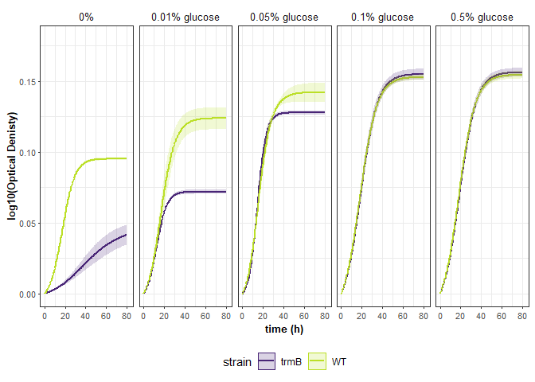

```r
# load required libraries
library(growthcurver)
library(viridis)
library(scales)
library(tidyverse)
library(factoextra)

# custom function, calculated the 95% Confidence interval
conf_int95 <- function(data) {
  n <- length(data)
  error <- qt(0.95, df = n - 1) * sd(data) / sqrt(n)
  return(error)
}
```

Load the normalized data and meta data. combine difference experiments. 

```r
expt <- "glu_titration"

# read in files
mt1 <- read.csv("normalized_growth_data/2017_normalized_layout.csv", stringsAsFactors = F)
dt1 <- read.csv("normalized_growth_data/2017_normalized_data.csv")

## set well no as column names, force conseq numbering
colnames(dt1) <- c(seq(1, ncol(dt1) - 1), "time")
mt1$variable <- seq(1, ncol(dt1) - 1)

## combine meta and data frames across diff experiments
d <- dt1
mt0 <- mt1

# combine expt info with biorep info and remove expt column
mt0$biorep <- paste(mt0$biorep, mt0$expt, sep = "-")
# mt0 <- mt0[-8]

## replace none with "no carbon" for labeling
mt0$ID <- str_replace_all(mt0$ID, "none", "no carbon")
mt0$condition <- str_replace_all(mt0$condition, "none", "no carbon")

# bioreps with at least 3 tech reps
mt0[, c(2, 3, 4, 6, 7)] %>%
  group_by(ID, biorep) %>%
  tally() %>%
  filter(n >= 2) %>%
  group_by(ID) %>%
  tally()
```

```
## # A tibble: 14 × 2
##    ID                     n
##    <chr>              <int>
##  1 WT+0%                  3
##  2 WT+0.01% glucose       3
##  3 WT+0.05% glucose       3
##  4 WT+0.1% glucose        3
##  5 WT+0.5% glucose        3
##  6 WT+1% glucose          3
##  7 WT+2% glucose          3
##  8 trmB+0%                3
##  9 trmB+0.01% glucose     3
## 10 trmB+0.05% glucose     3
## 11 trmB+0.1% glucose      3
## 12 trmB+0.5% glucose      3
## 13 trmB+1% glucose        3
## 14 trmB+2% glucose        3
```

Growth curve modeling

```r
# Create an output data frame to store the results in.
num_analyses <- length(names(d)) - 1
d_gc <- data.frame(
  sample = character(num_analyses),
  k = numeric(num_analyses),
  n0 = numeric(num_analyses),
  r = numeric(num_analyses),
  t_mid = numeric(num_analyses),
  t_gen = numeric(num_analyses),
  auc_l = numeric(num_analyses),
  auc_e = numeric(num_analyses),
  sigma = numeric(num_analyses),
  stringsAsFactors = FALSE
)

# Truncate or trim the input data to observations occurring in the first 80 hours.
trim_at_time <- 80.5

# Now, loop through all of the columns in the data frame. For each column, run Growthcurver.
# First, create a plot for each of the wells in the 96-well plate.
pdf(paste("figures/", expt, "_growthcurver_fits.pdf", sep = ""), height = 8.5, width = 11)
par(mfcol = c(8, 12))
par(mar = c(0.25, 0.25, 0.25, 0.25))
y_lim_max <- max(d[, setdiff(names(d), "time")], na.rm = T) - min(d[, setdiff(names(d), "time")], na.rm = T)

n <- 1 # keeps track of the current row in the output data frame
for (col_name in names(d)) {
  # Don't process the time column.
  if (col_name != "time") {
    # Create a temporary data frame that contains just the time and current col
    d_loop <- d[c("time", col_name)]

    # Now, call Growthcurver to calculate the metrics using SummarizeGrowth
    gc_fit <- SummarizeGrowth(
      data_t = d_loop$time,
      data_n = d_loop[col_name],
      t_trim = trim_at_time,
      bg_correct = "none"
    )

    if (gc_fit$vals[[16]] == "cannot fit data") {
      d_gc$sample[n] <- col_name
      n <- n + 1
    } else {
      d_gc$sample[n] <- col_name
      d_gc[n, 2:9] <- c(
        gc_fit$vals$k,
        gc_fit$vals$n0,
        gc_fit$vals$r,
        gc_fit$vals$t_mid,
        gc_fit$vals$t_gen,
        gc_fit$vals$auc_l,
        gc_fit$vals$auc_e,
        gc_fit$vals$sigma
      )

      n <- n + 1
      # Finally, plot the raw data and the fitted curve. print some of the data points to keep the file size smaller
      n_obs <- length(gc_fit$data$t)
      idx_to_plot <- 1:20 / 20 * n_obs
      plot(gc_fit$data$t[idx_to_plot], gc_fit$data$N[idx_to_plot],
        pch = 20,
        xlim = c(0, trim_at_time),
        ylim = c(0, y_lim_max),
        cex = 0.6, xaxt = "n", yaxt = "n"
      )
      text(x = trim_at_time / 4, y = y_lim_max, labels = col_name, pos = 1)
      lines(gc_fit$data$t, predict(gc_fit$model), col = "red")
    }
  }
}
dev.off()
```

```
## png 
##   2
```

```r
d_gc
```

```
##     sample          k          n0          r    t_mid     t_gen     auc_l
## 1        1 0.15552076 0.010202827 0.07709894 34.45260  8.990360  7.081565
## 2        2 0.14978284 0.013866081 0.03805793 59.97691 18.212952  4.175459
## 3        3 0.15720879 0.014812013 0.03601727 62.83594 19.244857  4.199216
## 4        4 0.25224745 0.011642228 0.16809262 18.01696  4.123603 15.690318
## 5        5 0.25591523 0.012080353 0.17654490 17.02066  3.926181 16.175255
## 6        6 0.26278673 0.011827056 0.16809753 18.17339  4.123482 16.306658
## 7        7 0.15548532 0.010041556 0.07614740 35.10372  9.102703  6.985521
## 8        8 0.12751156 0.011754724 0.04487715 50.96662 15.445437  4.160547
## 9        9 0.08525142 0.009874970 0.05794866 35.07400 11.961401  3.793673
## 10      10 0.19084238 0.011891106 0.20608468 13.15635  3.363410 12.792447
## 11      11 0.20621614 0.013493129 0.18948526 14.03314  3.658053 13.632897
## 12      12 0.18604182 0.010939788 0.21446398 12.92973  3.231998 12.518325
## 13      13 0.32839958 0.021284278 0.13875817 19.23674  4.995361 19.960723
## 14      14 0.36842772 0.025661547 0.13659247 18.97656  5.074564 22.472813
## 15      15 0.36516340 0.023846899 0.13374358 19.89745  5.182658 21.946266
## 16      16 0.19225316 0.012360469 0.20650218 12.96769  3.356609 12.921433
## 17      17 0.39392151 0.013580971 0.20691644 16.10504  3.349889 25.299770
## 18      18 0.38236743 0.015682825 0.20765879 15.17844  3.337914 24.899726
## 19      19 0.36615845 0.015746675 0.19401561 15.99088  3.572636 23.537609
## 20      20 0.34376544 0.009596671 0.22698879 15.64055  3.053663 22.253558
## 21      21 0.34903580 0.005319888 0.28327281 14.71501  2.446925 22.942391
## 22      22 0.35874819 0.011968739 0.21257364 15.83635  3.260739 23.140704
## 23      23 0.18586007 0.011151990 0.21227038 12.96223  3.265398 12.498395
## 24      24 0.20230072 0.013543382 0.18899030 13.94021  3.667634 13.390924
## 25      25 0.35569605 0.011490766 0.21970966 15.47358  3.154833 23.076479
## 26      26 0.35276002 0.005711617 0.27775581 14.78623  2.495527 23.160458
## 27      27 0.34262353 0.008720997 0.23930971 15.23179  2.896444 22.325510
## 28      28 0.48161392 0.038279432 0.11169721 21.92903  6.205591 27.857709
## 29      29 0.45560988 0.030425691 0.14426451 18.28055  4.804697 28.129919
## 30      30 0.43901888 0.034163547 0.12147428 20.35304  5.706123 26.115291
## 31      31 0.44646311 0.037819034 0.11781202 20.20195  5.883501 26.588543
## 32      32 0.46369325 0.038074061 0.12533248 19.26086  5.530467 28.080907
## 33      33 0.45563810 0.038038284 0.11967508 20.02030  5.791909 27.227692
## 34      34 0.45188802 0.034136625 0.12275815 20.40203  5.646445 26.870708
## 35      35 0.47506058 0.031003704 0.13587141 19.59092  5.101494 28.700422
## 36      36 0.47805318 0.039901411 0.11108545 21.57036  6.239765 27.802597
## 37      37 0.44949047 0.034911905 0.12066396 20.50682  5.744442 26.667849
## 38      38 0.47792278 0.031320661 0.13433631 19.78162  5.159790 28.778574
## 39      39 0.48865801 0.038831056 0.11133797 22.00186  6.225614 28.228686
## 40      40 0.45452917 0.033228052 0.12787890 19.86218  5.420340 27.293356
## 41      41 0.47336706 0.036612481 0.12808131 19.35475  5.411775 28.648099
## 42      42 0.46749784 0.032275409 0.13051108 19.93357  5.311022 28.059746
## 43      43 0.49073076 0.041263289 0.11024941 21.66080  6.287083 28.490031
## 44      44 0.47754914 0.029921254 0.13698816 19.74910  5.059906 28.786821
## 45      45 0.45118337 0.033867918 0.12296322 20.42378  5.637028 26.821344
## 46      46 0.47634027 0.040165441 0.11110240 21.46701  6.238814 27.748191
## 47      47 0.46475128 0.029940115 0.13757332 19.44936  5.038384 28.149168
## 48      48 0.43157179 0.032486987 0.12740747 19.68750  5.440397 25.981330
## 49      49 0.44879789 0.028394288 0.13922567 19.35726  4.978587 27.230700
## 50      50 0.47104065 0.040248454 0.10952877 21.64321  6.328449 27.346631
## 51      51 0.43631403 0.032193800 0.12596650 20.08422  5.502631 26.096474
## 52      52 0.46897064 0.030248474 0.13600118 19.66469  5.096626 28.300945
## 53      53 0.48334026 0.040770618 0.11083412 21.51536  6.253915 28.131662
## 54      54 0.46131188 0.032265358 0.12989323 19.92075  5.336284 27.689770
## 55      55 0.46503996 0.036640660 0.12783327 19.23519  5.422275 28.193478
## 56      56 0.43637803 0.035027689 0.12495964 19.51587  5.546968 26.321644
## 57      57 0.42528233 0.030128931 0.13167387 19.54669  5.264121 25.686097
## 58      58 0.43465828 0.033865782 0.12797338 19.30901  5.416339 26.323012
## 59      59 0.45310084 0.034306850 0.13187441 18.97285  5.256116 27.608506
## 60      60 0.44884558 0.029783488 0.13627946 19.40179  5.086219 27.198325
## 61      61 0.47067241 0.039980795 0.11006560 21.59615  6.297583 27.351343
## 62      62 0.45907651 0.028414635 0.14087142 19.29716  4.920424 27.889153
## 63      63 0.42741146 0.031005883 0.12880520 19.78384  5.381360 25.702219
## 64      64 0.25446668 0.013272460 0.15406949 18.82210  4.498926 15.606620
## 65      65 0.43099665 0.033596316 0.13021501 18.97268  5.323097 26.250548
## 66      66 0.44854244 0.033371067 0.13825432 18.23453  5.013566 27.678474
## 67      67 0.44563659 0.029045855 0.14063510 18.93715  4.928693 27.221636
## 68      68 0.42544100 0.032899845 0.13156401 18.84386  5.268517 25.971755
## 69      69 0.44977089 0.033880637 0.13675409 18.33640  5.068566 27.702469
## 70      70 0.44916364 0.028875620 0.14290986 18.73868  4.850240 27.532557
## 71      71 0.46478522 0.029625653 0.14162544 18.97309  4.894228 28.381190
## 72      72 0.48158136 0.041983367 0.11217036 20.93768  6.179415 28.297873
## 73      73 0.46161720 0.032855601 0.13221935 19.42816  5.242404 27.935118
## 74      74 0.46989657 0.037908332 0.12842072 18.94731  5.397471 28.616970
## 75      75 0.44453526 0.036322197 0.12544368 19.28643  5.525565 26.911165
## 76      76 0.44215947 0.032976368 0.12896901 19.52695  5.374525 26.695399
## 77      77 0.45928183 0.028405890 0.14414481 18.86453  4.808686 28.105071
## 78      78 0.46845434 0.039453549 0.11490152 20.76852  6.032533 27.627036
## 79      79 0.47414323 0.031105262 0.13841306 19.19095  5.007816 28.837538
## 80      80 0.43636563 0.033406427 0.12744622 19.53834  5.438743 26.330322
## 81      81 0.43686421 0.036472231 0.12310372 19.46239  5.630595 26.357707
## 82      82 0.47128344 0.038306144 0.12569334 19.29358  5.514590 28.529420
## 83      83 0.46268673 0.033153509 0.12995528 19.71102  5.333736 27.862860
## 84      84 0.44919545 0.037141958 0.12073950 19.93056  5.740849 26.888910
## 85      85 0.47383715 0.037557932 0.12789509 19.17507  5.419654 28.753527
## 86      86 0.46533675 0.032044711 0.13375169 19.47101  5.182343 28.151794
## 87      87 0.48514831 0.040877862 0.11104457 21.48547  6.242063 28.252463
## 88      88 0.47672173 0.036859901 0.12454483 19.90718  5.565443 28.579910
## 89      89 0.48178367 0.040828976 0.12298113 19.34890  5.636208 29.116811
## 90      90 0.45470276 0.039664546 0.11603350 20.23478  5.973681 27.048683
## 91      91 0.46690690 0.034701807 0.12871364 19.59473  5.385188 28.158372
## 92      92 0.46854661 0.038412668 0.12515101 19.30236  5.538487 28.355469
## 93      93 0.45514711 0.038254217 0.12067286 19.79381  5.744019 27.301603
## 94      94 0.45657127 0.035293942 0.12461407 19.89807  5.562351 27.376250
## 95      95 0.45997198 0.039878161 0.11637585 20.23314  5.956109 27.366180
## 96      96 0.48285304 0.040967382 0.12227922 19.44954  5.668561 29.130557
## 97      97 0.47105734 0.036358058 0.12331689 20.12083  5.620862 28.137445
## 98      98 0.45189224 0.039546166 0.11547346 20.30245  6.002653 26.848160
## 99      99 0.47198411 0.040364902 0.12103378 19.57787  5.726890 28.408095
## 100    100 0.36126882 0.014297519 0.20449065 15.59561  3.389628 23.376597
## 101    101 0.38043082 0.013955541 0.20642446 15.83172  3.357873 24.532932
## 102    102 0.38559568 0.017989350 0.19819907 15.22324  3.497227 25.077491
## 103    103 0.37961133 0.017802834 0.18845848 15.98101  3.677984 24.395396
## 104    104 0.39351492 0.014742523 0.20309318 15.98379  3.412952 25.314109
## 105    105 0.38221935 0.016767187 0.20398986 15.10718  3.397949 24.910351
## 106    106 0.35635433 0.026558388 0.12657380 19.90245  5.476229 21.377458
## 107    107 0.35503268 0.025220557 0.13469025 19.08723  5.146231 21.609982
## 108    108 0.35612996 0.024278527 0.13116486 19.93747  5.284550 21.377385
## 109    109 0.18969042 0.012622630 0.20459439 12.90867  3.387909 12.757584
## 110    110 0.19908417 0.015156567 0.18442614 13.53446  3.758400 13.246304
## 111    111 0.18451808 0.012753702 0.20796450 12.50359  3.333007 12.483020
## 112    112 0.25936832 0.013656162 0.15677131 18.43430  4.421391 16.008488
## 113    113 0.26234373 0.013940222 0.16599767 17.35130  4.175644 16.480417
## 114    114 0.25416357 0.012497668 0.15950511 18.57003  4.345611 15.660080
## 115    115 0.07253542 0.009013969 0.07603434 25.68053  9.116238  3.864417
## 116    116 0.13535255 0.010007752 0.05978546 42.27965 11.593909  5.218739
## 117    117 0.13284174 0.007661910 0.06788666 41.14932 10.210360  5.242015
## 118    118 0.26230587 0.012994882 0.15978616 18.48812  4.337968 16.182751
## 119    119 0.26307252 0.013746767 0.16482271 17.58227  4.205411 16.466315
## 120    120 0.25451609 0.013647468 0.15964634 17.98161  4.341767 15.824148
##         auc_e       sigma
## 1    6.984090 0.002867783
## 2    4.107451 0.006249132
## 3    4.133201 0.005697283
## 4   15.518201 0.004617387
## 5   16.000701 0.004916672
## 6   16.125340 0.004975537
## 7    6.884590 0.002971956
## 8    4.103090 0.006181616
## 9    3.735791 0.007371943
## 10  12.664701 0.005701897
## 11  13.491451 0.005576859
## 12  12.395451 0.005335610
## 13  19.714451 0.008943301
## 14  22.193951 0.011123803
## 15  21.663701 0.011124749
## 16  12.794541 0.005641898
## 17  25.015451 0.010382454
## 18  24.617951 0.012134164
## 19  23.257701 0.011945462
## 20  22.027201 0.006643250
## 21  22.761951 0.006035921
## 22  22.890701 0.007352923
## 23  12.374451 0.005249019
## 24  13.248201 0.005920979
## 25  22.843451 0.005972730
## 26  22.972701 0.004020483
## 27  22.107201 0.006041967
## 28  27.422201 0.021588154
## 29  27.738090 0.018984514
## 30  25.706701 0.022209731
## 31  26.176701 0.023017664
## 32  27.668451 0.022038439
## 33  26.811951 0.022736413
## 34  26.453951 0.021846064
## 35  28.270951 0.021641291
## 36  27.366201 0.022664259
## 37  26.252951 0.022136201
## 38  28.335951 0.022550251
## 39  27.787701 0.021693683
## 40  26.869291 0.022589627
## 41  28.219951 0.022437006
## 42  27.624701 0.022631294
## 43  28.045701 0.022984959
## 44  28.347451 0.021831832
## 45  26.405201 0.021712556
## 46  27.315951 0.022447679
## 47  27.718791 0.022158640
## 48  25.577291 0.022356305
## 49  26.818951 0.021327429
## 50  26.919701 0.022165252
## 51  25.688451 0.021811920
## 52  27.867951 0.021998624
## 53  27.694951 0.022463087
## 54  27.259201 0.022462322
## 55  27.769201 0.022775734
## 56  25.914201 0.022775732
## 57  25.292701 0.020870929
## 58  25.922201 0.022124387
## 59  27.194451 0.022448689
## 60  26.784701 0.021758304
## 61  26.924451 0.022038947
## 62  27.470951 0.021250040
## 63  25.307201 0.020957744
## 64  15.414090 0.006733939
## 65  25.857701 0.021681035
## 66  27.278701 0.021493321
## 67  26.815201 0.021405466
## 68  25.580451 0.021703916
## 69  27.301201 0.021694332
## 70  27.127701 0.021111098
## 71  27.960451 0.021582550
## 72  27.864951 0.022744455
## 73  27.509951 0.022596306
## 74  28.190451 0.023230274
## 75  26.500951 0.023091135
## 76  26.285951 0.022280837
## 77  27.690951 0.021242225
## 78  27.204951 0.021929307
## 79  28.404951 0.022366556
## 80  25.924951 0.022379779
## 81  25.955451 0.022699760
## 82  28.107201 0.022528306
## 83  27.438951 0.022257604
## 84  26.474701 0.022751464
## 85  28.327451 0.022499229
## 86  27.721451 0.022429169
## 87  27.823201 0.021552317
## 88  28.141201 0.023471930
## 89  28.688701 0.022965053
## 90  26.633951 0.023010180
## 91  27.732201 0.022652828
## 92  27.937451 0.022227690
## 93  26.889951 0.022412437
## 94  26.966701 0.021354026
## 95  26.949451 0.022762944
## 96  28.702951 0.022785863
## 97  27.703451 0.023060627
## 98  26.436951 0.022718218
## 99  27.992701 0.022109881
## 100 23.136951 0.006842420
## 101 24.264451 0.009532874
## 102 24.801451 0.011131611
## 103 24.108451 0.011818070
## 104 25.035451 0.010283311
## 105 24.636201 0.011276469
## 106 21.104201 0.010897435
## 107 21.349201 0.009790055
## 108 21.109451 0.009917733
## 109 12.630451 0.005842090
## 110 13.111451 0.005547840
## 111 12.361701 0.005497221
## 112 15.825201 0.005471082
## 113 16.291201 0.005926055
## 114 15.470701 0.005855860
## 115  3.816201 0.004564792
## 116  5.150701 0.005080716
## 117  5.156791 0.002628838
## 118 15.990451 0.005910725
## 119 16.275201 0.006052907
## 120 15.648451 0.005207722
```

graph fitted curves:

```r
fitted_curves <- list()

n <- 1 # keeps track of the current row in the output data frame
for (col_name in names(d)) {
  if (col_name != "time") {
    d_loop <- d[c("time", col_name)]
    gc_fit <- SummarizeGrowth(
      data_t = d_loop$time,
      data_n = d_loop[col_name],
      t_trim = trim_at_time,
      bg_correct = "none"
    )
    if (gc_fit$vals[[16]] == "cannot fit data") {
      d_gc$sample[n] <- col_name
      n <- n + 1
    } else {
      fitted_curves[[n]] <- predict(gc_fit$model)
      names(fitted_curves)[n] <- col_name
      n <- n + 1
    }
  }
}

tmp <- Filter(length, fitted_curves)
fits <- as.data.frame(tmp, col.names = names(tmp))
colnames(fits) <- names(tmp)
fits <- cbind("time" = d$time[d$time < trim_at_time], fits)

# re-zero lowest value
mins <- Rfast::colMins(as.matrix(fits), value = T) # get column minimums
fits <- sweep(fits, 2, mins, "-") # subtract smallest value for each column

# Convert data from wide to long format
m_dt <- reshape2::melt(fits, id = "time")
mtdt <- merge(m_dt, mt0, by = "variable")
well <- paste(mtdt$variable, mtdt$ID, sep = " ")
mtdt <- cbind(well, mtdt)

t_mtdt2 <- mtdt[!(mtdt$ID == ""), ]

stats2 <- t_mtdt2 %>%
  group_by(ID, strain, condition, time) %>%
  summarise(
    reps = length(value),
    average = mean(value) + 1,
    CI95 = conf_int95(value)
  )
```


```r
stats2 %>%
  filter(condition != "1% glucose" & condition != "2% glucose") %>%
  ggplot(., aes(x = time, y = log10(average), color = strain)) +
  xlab("time (h)") +
  ylab("log10(Optical Denisty)") +
  geom_line(size = 1) +
  scale_y_continuous(limits = c(0, 0.18)) +
  scale_x_continuous(limits = c(0, 82)) +
  geom_ribbon(aes(ymin = log10(average - CI95), ymax = log10(average + CI95), fill = strain, color = NULL), alpha = 0.2) +
  scale_fill_viridis("strain", discrete = TRUE, begin = 0.1, end = 0.9) +
  scale_color_viridis("strain", discrete = TRUE, begin = 0.1, end = 0.9) +
  theme_bw() +
  facet_wrap(~condition, nrow = 1) +
  theme(
    axis.title.x = element_text(face = "bold", size = 10, angle = 0), axis.title.y = element_text(face = "bold", size = 10, angle = 90),
    axis.text.y = element_text(size = 8, angle = 0), axis.text.x = element_text(size = 8, angle = 0),
    axis.ticks.length.y.left = unit(.05, "cm"), strip.text = element_text(size = 10),
    strip.background = element_blank(), strip.placement = "outside", legend.position = "bottom"
  ) -> fitted.data
```

```
## Warning: Using `size` aesthetic for lines was deprecated in ggplot2 3.4.0.
## ℹ Please use `linewidth` instead.
## This warning is displayed once every 8 hours.
## Call `lifecycle::last_lifecycle_warnings()` to see where this warning was
## generated.
```

```r
plot(fitted.data)
```

<!-- -->

```r
pdf(paste("figures/", expt, "_fitcurves_plot.pdf", sep = ""), width = 10, height = 3, bg = "transparent")
plot(fitted.data)
dev.off()
```

```
## png 
##   2
```

calculate fold changes

```r
colnames(d_gc)[1] <- "variable"
(merge(d_gc, mt0) -> tmp)
```

```
##     variable          k          n0          r    t_mid     t_gen     auc_l
## 1          1 0.15552076 0.010202827 0.07709894 34.45260  8.990360  7.081565
## 2         10 0.19084238 0.011891106 0.20608468 13.15635  3.363410 12.792447
## 3        100 0.36126882 0.014297519 0.20449065 15.59561  3.389628 23.376597
## 4        101 0.38043082 0.013955541 0.20642446 15.83172  3.357873 24.532932
## 5        102 0.38559568 0.017989350 0.19819907 15.22324  3.497227 25.077491
## 6        103 0.37961133 0.017802834 0.18845848 15.98101  3.677984 24.395396
## 7        104 0.39351492 0.014742523 0.20309318 15.98379  3.412952 25.314109
## 8        105 0.38221935 0.016767187 0.20398986 15.10718  3.397949 24.910351
## 9        106 0.35635433 0.026558388 0.12657380 19.90245  5.476229 21.377458
## 10       107 0.35503268 0.025220557 0.13469025 19.08723  5.146231 21.609982
## 11       108 0.35612996 0.024278527 0.13116486 19.93747  5.284550 21.377385
## 12       109 0.18969042 0.012622630 0.20459439 12.90867  3.387909 12.757584
## 13        11 0.20621614 0.013493129 0.18948526 14.03314  3.658053 13.632897
## 14       110 0.19908417 0.015156567 0.18442614 13.53446  3.758400 13.246304
## 15       111 0.18451808 0.012753702 0.20796450 12.50359  3.333007 12.483020
## 16       112 0.25936832 0.013656162 0.15677131 18.43430  4.421391 16.008488
## 17       113 0.26234373 0.013940222 0.16599767 17.35130  4.175644 16.480417
## 18       114 0.25416357 0.012497668 0.15950511 18.57003  4.345611 15.660080
## 19       115 0.07253542 0.009013969 0.07603434 25.68053  9.116238  3.864417
## 20       116 0.13535255 0.010007752 0.05978546 42.27965 11.593909  5.218739
## 21       117 0.13284174 0.007661910 0.06788666 41.14932 10.210360  5.242015
## 22       118 0.26230587 0.012994882 0.15978616 18.48812  4.337968 16.182751
## 23       119 0.26307252 0.013746767 0.16482271 17.58227  4.205411 16.466315
## 24        12 0.18604182 0.010939788 0.21446398 12.92973  3.231998 12.518325
## 25       120 0.25451609 0.013647468 0.15964634 17.98161  4.341767 15.824148
## 26        13 0.32839958 0.021284278 0.13875817 19.23674  4.995361 19.960723
## 27        14 0.36842772 0.025661547 0.13659247 18.97656  5.074564 22.472813
## 28        15 0.36516340 0.023846899 0.13374358 19.89745  5.182658 21.946266
## 29        16 0.19225316 0.012360469 0.20650218 12.96769  3.356609 12.921433
## 30        17 0.39392151 0.013580971 0.20691644 16.10504  3.349889 25.299770
## 31        18 0.38236743 0.015682825 0.20765879 15.17844  3.337914 24.899726
## 32        19 0.36615845 0.015746675 0.19401561 15.99088  3.572636 23.537609
## 33         2 0.14978284 0.013866081 0.03805793 59.97691 18.212952  4.175459
## 34        20 0.34376544 0.009596671 0.22698879 15.64055  3.053663 22.253558
## 35        21 0.34903580 0.005319888 0.28327281 14.71501  2.446925 22.942391
## 36        22 0.35874819 0.011968739 0.21257364 15.83635  3.260739 23.140704
## 37        23 0.18586007 0.011151990 0.21227038 12.96223  3.265398 12.498395
## 38        24 0.20230072 0.013543382 0.18899030 13.94021  3.667634 13.390924
## 39        25 0.35569605 0.011490766 0.21970966 15.47358  3.154833 23.076479
## 40        26 0.35276002 0.005711617 0.27775581 14.78623  2.495527 23.160458
## 41        27 0.34262353 0.008720997 0.23930971 15.23179  2.896444 22.325510
## 42        28 0.48161392 0.038279432 0.11169721 21.92903  6.205591 27.857709
## 43        29 0.45560988 0.030425691 0.14426451 18.28055  4.804697 28.129919
## 44         3 0.15720879 0.014812013 0.03601727 62.83594 19.244857  4.199216
## 45        30 0.43901888 0.034163547 0.12147428 20.35304  5.706123 26.115291
## 46        31 0.44646311 0.037819034 0.11781202 20.20195  5.883501 26.588543
## 47        32 0.46369325 0.038074061 0.12533248 19.26086  5.530467 28.080907
## 48        33 0.45563810 0.038038284 0.11967508 20.02030  5.791909 27.227692
## 49        34 0.45188802 0.034136625 0.12275815 20.40203  5.646445 26.870708
## 50        35 0.47506058 0.031003704 0.13587141 19.59092  5.101494 28.700422
## 51        36 0.47805318 0.039901411 0.11108545 21.57036  6.239765 27.802597
## 52        37 0.44949047 0.034911905 0.12066396 20.50682  5.744442 26.667849
## 53        38 0.47792278 0.031320661 0.13433631 19.78162  5.159790 28.778574
## 54        39 0.48865801 0.038831056 0.11133797 22.00186  6.225614 28.228686
## 55         4 0.25224745 0.011642228 0.16809262 18.01696  4.123603 15.690318
## 56        40 0.45452917 0.033228052 0.12787890 19.86218  5.420340 27.293356
## 57        41 0.47336706 0.036612481 0.12808131 19.35475  5.411775 28.648099
## 58        42 0.46749784 0.032275409 0.13051108 19.93357  5.311022 28.059746
## 59        43 0.49073076 0.041263289 0.11024941 21.66080  6.287083 28.490031
## 60        44 0.47754914 0.029921254 0.13698816 19.74910  5.059906 28.786821
## 61        45 0.45118337 0.033867918 0.12296322 20.42378  5.637028 26.821344
## 62        46 0.47634027 0.040165441 0.11110240 21.46701  6.238814 27.748191
## 63        47 0.46475128 0.029940115 0.13757332 19.44936  5.038384 28.149168
## 64        48 0.43157179 0.032486987 0.12740747 19.68750  5.440397 25.981330
## 65        49 0.44879789 0.028394288 0.13922567 19.35726  4.978587 27.230700
## 66         5 0.25591523 0.012080353 0.17654490 17.02066  3.926181 16.175255
## 67        50 0.47104065 0.040248454 0.10952877 21.64321  6.328449 27.346631
## 68        51 0.43631403 0.032193800 0.12596650 20.08422  5.502631 26.096474
## 69        52 0.46897064 0.030248474 0.13600118 19.66469  5.096626 28.300945
## 70        53 0.48334026 0.040770618 0.11083412 21.51536  6.253915 28.131662
## 71        54 0.46131188 0.032265358 0.12989323 19.92075  5.336284 27.689770
## 72        55 0.46503996 0.036640660 0.12783327 19.23519  5.422275 28.193478
## 73        56 0.43637803 0.035027689 0.12495964 19.51587  5.546968 26.321644
## 74        57 0.42528233 0.030128931 0.13167387 19.54669  5.264121 25.686097
## 75        58 0.43465828 0.033865782 0.12797338 19.30901  5.416339 26.323012
## 76        59 0.45310084 0.034306850 0.13187441 18.97285  5.256116 27.608506
## 77         6 0.26278673 0.011827056 0.16809753 18.17339  4.123482 16.306658
## 78        60 0.44884558 0.029783488 0.13627946 19.40179  5.086219 27.198325
## 79        61 0.47067241 0.039980795 0.11006560 21.59615  6.297583 27.351343
## 80        62 0.45907651 0.028414635 0.14087142 19.29716  4.920424 27.889153
## 81        63 0.42741146 0.031005883 0.12880520 19.78384  5.381360 25.702219
## 82        64 0.25446668 0.013272460 0.15406949 18.82210  4.498926 15.606620
## 83        65 0.43099665 0.033596316 0.13021501 18.97268  5.323097 26.250548
## 84        66 0.44854244 0.033371067 0.13825432 18.23453  5.013566 27.678474
## 85        67 0.44563659 0.029045855 0.14063510 18.93715  4.928693 27.221636
## 86        68 0.42544100 0.032899845 0.13156401 18.84386  5.268517 25.971755
## 87        69 0.44977089 0.033880637 0.13675409 18.33640  5.068566 27.702469
## 88         7 0.15548532 0.010041556 0.07614740 35.10372  9.102703  6.985521
## 89        70 0.44916364 0.028875620 0.14290986 18.73868  4.850240 27.532557
## 90        71 0.46478522 0.029625653 0.14162544 18.97309  4.894228 28.381190
## 91        72 0.48158136 0.041983367 0.11217036 20.93768  6.179415 28.297873
## 92        73 0.46161720 0.032855601 0.13221935 19.42816  5.242404 27.935118
## 93        74 0.46989657 0.037908332 0.12842072 18.94731  5.397471 28.616970
## 94        75 0.44453526 0.036322197 0.12544368 19.28643  5.525565 26.911165
## 95        76 0.44215947 0.032976368 0.12896901 19.52695  5.374525 26.695399
## 96        77 0.45928183 0.028405890 0.14414481 18.86453  4.808686 28.105071
## 97        78 0.46845434 0.039453549 0.11490152 20.76852  6.032533 27.627036
## 98        79 0.47414323 0.031105262 0.13841306 19.19095  5.007816 28.837538
## 99         8 0.12751156 0.011754724 0.04487715 50.96662 15.445437  4.160547
## 100       80 0.43636563 0.033406427 0.12744622 19.53834  5.438743 26.330322
## 101       81 0.43686421 0.036472231 0.12310372 19.46239  5.630595 26.357707
## 102       82 0.47128344 0.038306144 0.12569334 19.29358  5.514590 28.529420
## 103       83 0.46268673 0.033153509 0.12995528 19.71102  5.333736 27.862860
## 104       84 0.44919545 0.037141958 0.12073950 19.93056  5.740849 26.888910
## 105       85 0.47383715 0.037557932 0.12789509 19.17507  5.419654 28.753527
## 106       86 0.46533675 0.032044711 0.13375169 19.47101  5.182343 28.151794
## 107       87 0.48514831 0.040877862 0.11104457 21.48547  6.242063 28.252463
## 108       88 0.47672173 0.036859901 0.12454483 19.90718  5.565443 28.579910
## 109       89 0.48178367 0.040828976 0.12298113 19.34890  5.636208 29.116811
## 110        9 0.08525142 0.009874970 0.05794866 35.07400 11.961401  3.793673
## 111       90 0.45470276 0.039664546 0.11603350 20.23478  5.973681 27.048683
## 112       91 0.46690690 0.034701807 0.12871364 19.59473  5.385188 28.158372
## 113       92 0.46854661 0.038412668 0.12515101 19.30236  5.538487 28.355469
## 114       93 0.45514711 0.038254217 0.12067286 19.79381  5.744019 27.301603
## 115       94 0.45657127 0.035293942 0.12461407 19.89807  5.562351 27.376250
## 116       95 0.45997198 0.039878161 0.11637585 20.23314  5.956109 27.366180
## 117       96 0.48285304 0.040967382 0.12227922 19.44954  5.668561 29.130557
## 118       97 0.47105734 0.036358058 0.12331689 20.12083  5.620862 28.137445
## 119       98 0.45189224 0.039546166 0.11547346 20.30245  6.002653 26.848160
## 120       99 0.47198411 0.040364902 0.12103378 19.57787  5.726890 28.408095
##         auc_e       sigma                 ID strain biorep media     condition
## 1    6.984090 0.002867783            trmB+0%   trmB 1-2017  HhCa            0%
## 2   12.664701 0.005701897 trmB+0.01% glucose   trmB 1-2017  HhCa 0.01% glucose
## 3   23.136951 0.006842420 trmB+0.05% glucose   trmB 1-2017  HhCa 0.05% glucose
## 4   24.264451 0.009532874   WT+0.05% glucose     WT 3-2017  HhCa 0.05% glucose
## 5   24.801451 0.011131611   WT+0.05% glucose     WT 2-2017  HhCa 0.05% glucose
## 6   24.108451 0.011818070   WT+0.05% glucose     WT 1-2017  HhCa 0.05% glucose
## 7   25.035451 0.010283311   WT+0.01% glucose     WT 3-2017  HhCa 0.01% glucose
## 8   24.636201 0.011276469   WT+0.01% glucose     WT 2-2017  HhCa 0.01% glucose
## 9   21.104201 0.010897435   WT+0.01% glucose     WT 1-2017  HhCa 0.01% glucose
## 10  21.349201 0.009790055   WT+0.01% glucose     WT 2-2017  HhCa 0.01% glucose
## 11  21.109451 0.009917733   WT+0.01% glucose     WT 3-2017  HhCa 0.01% glucose
## 12  12.630451 0.005842090 trmB+0.01% glucose   trmB 1-2017  HhCa 0.01% glucose
## 13  13.491451 0.005576859 trmB+0.01% glucose   trmB 2-2017  HhCa 0.01% glucose
## 14  13.111451 0.005547840 trmB+0.01% glucose   trmB 2-2017  HhCa 0.01% glucose
## 15  12.361701 0.005497221 trmB+0.01% glucose   trmB 3-2017  HhCa 0.01% glucose
## 16  15.825201 0.005471082   WT+0.01% glucose     WT 1-2017  HhCa 0.01% glucose
## 17  16.291201 0.005926055              WT+0%     WT 2-2017  HhCa            0%
## 18  15.470701 0.005855860              WT+0%     WT 1-2017  HhCa            0%
## 19   3.816201 0.004564792            trmB+0%   trmB 3-2017  HhCa            0%
## 20   5.150701 0.005080716            trmB+0%   trmB 2-2017  HhCa            0%
## 21   5.156791 0.002628838            trmB+0%   trmB 1-2017  HhCa            0%
## 22  15.990451 0.005910725              WT+0%     WT 3-2017  HhCa            0%
## 23  16.275201 0.006052907              WT+0%     WT 2-2017  HhCa            0%
## 24  12.395451 0.005335610 trmB+0.01% glucose   trmB 3-2017  HhCa 0.01% glucose
## 25  15.648451 0.005207722              WT+0%     WT 1-2017  HhCa            0%
## 26  19.714451 0.008943301   WT+0.01% glucose     WT 1-2017  HhCa 0.01% glucose
## 27  22.193951 0.011123803   WT+0.01% glucose     WT 2-2017  HhCa 0.01% glucose
## 28  21.663701 0.011124749   WT+0.01% glucose     WT 3-2017  HhCa 0.01% glucose
## 29  12.794541 0.005641898 trmB+0.01% glucose   trmB 1-2017  HhCa 0.01% glucose
## 30  25.015451 0.010382454   WT+0.05% glucose     WT 3-2017  HhCa 0.05% glucose
## 31  24.617951 0.012134164   WT+0.05% glucose     WT 2-2017  HhCa 0.05% glucose
## 32  23.257701 0.011945462   WT+0.05% glucose     WT 1-2017  HhCa 0.05% glucose
## 33   4.107451 0.006249132            trmB+0%   trmB 2-2017  HhCa            0%
## 34  22.027201 0.006643250 trmB+0.05% glucose   trmB 3-2017  HhCa 0.05% glucose
## 35  22.761951 0.006035921 trmB+0.05% glucose   trmB 2-2017  HhCa 0.05% glucose
## 36  22.890701 0.007352923 trmB+0.05% glucose   trmB 1-2017  HhCa 0.05% glucose
## 37  12.374451 0.005249019 trmB+0.01% glucose   trmB 3-2017  HhCa 0.01% glucose
## 38  13.248201 0.005920979 trmB+0.01% glucose   trmB 2-2017  HhCa 0.01% glucose
## 39  22.843451 0.005972730 trmB+0.05% glucose   trmB 1-2017  HhCa 0.05% glucose
## 40  22.972701 0.004020483 trmB+0.05% glucose   trmB 2-2017  HhCa 0.05% glucose
## 41  22.107201 0.006041967 trmB+0.05% glucose   trmB 3-2017  HhCa 0.05% glucose
## 42  27.422201 0.021588154  trmB+0.1% glucose   trmB 1-2017  HhCa  0.1% glucose
## 43  27.738090 0.018984514  trmB+0.1% glucose   trmB 2-2017  HhCa  0.1% glucose
## 44   4.133201 0.005697283            trmB+0%   trmB 3-2017  HhCa            0%
## 45  25.706701 0.022209731  trmB+0.1% glucose   trmB 3-2017  HhCa  0.1% glucose
## 46  26.176701 0.023017664    WT+0.1% glucose     WT 1-2017  HhCa  0.1% glucose
## 47  27.668451 0.022038439    WT+0.1% glucose     WT 2-2017  HhCa  0.1% glucose
## 48  26.811951 0.022736413    WT+0.5% glucose     WT 1-2017  HhCa  0.5% glucose
## 49  26.453951 0.021846064  trmB+0.5% glucose   trmB 3-2017  HhCa  0.5% glucose
## 50  28.270951 0.021641291  trmB+0.5% glucose   trmB 2-2017  HhCa  0.5% glucose
## 51  27.366201 0.022664259  trmB+0.5% glucose   trmB 1-2017  HhCa  0.5% glucose
## 52  26.252951 0.022136201  trmB+0.1% glucose   trmB 3-2017  HhCa  0.1% glucose
## 53  28.335951 0.022550251  trmB+0.1% glucose   trmB 2-2017  HhCa  0.1% glucose
## 54  27.787701 0.021693683  trmB+0.1% glucose   trmB 1-2017  HhCa  0.1% glucose
## 55  15.518201 0.004617387              WT+0%     WT 1-2017  HhCa            0%
## 56  26.869291 0.022589627    WT+0.1% glucose     WT 3-2017  HhCa  0.1% glucose
## 57  28.219951 0.022437006    WT+0.5% glucose     WT 2-2017  HhCa  0.5% glucose
## 58  27.624701 0.022631294    WT+0.5% glucose     WT 3-2017  HhCa  0.5% glucose
## 59  28.045701 0.022984959  trmB+0.5% glucose   trmB 1-2017  HhCa  0.5% glucose
## 60  28.347451 0.021831832  trmB+0.5% glucose   trmB 2-2017  HhCa  0.5% glucose
## 61  26.405201 0.021712556  trmB+0.5% glucose   trmB 3-2017  HhCa  0.5% glucose
## 62  27.315951 0.022447679    trmB+1% glucose   trmB 1-2017  HhCa    1% glucose
## 63  27.718791 0.022158640    trmB+1% glucose   trmB 2-2017  HhCa    1% glucose
## 64  25.577291 0.022356305    trmB+1% glucose   trmB 3-2017  HhCa    1% glucose
## 65  26.818951 0.021327429    trmB+2% glucose   trmB 2-2017  HhCa    2% glucose
## 66  16.000701 0.004916672              WT+0%     WT 2-2017  HhCa            0%
## 67  26.919701 0.022165252    trmB+2% glucose   trmB 1-2017  HhCa    2% glucose
## 68  25.688451 0.021811920    trmB+1% glucose   trmB 3-2017  HhCa    1% glucose
## 69  27.867951 0.021998624    trmB+1% glucose   trmB 2-2017  HhCa    1% glucose
## 70  27.694951 0.022463087    trmB+1% glucose   trmB 1-2017  HhCa    1% glucose
## 71  27.259201 0.022462322      WT+1% glucose     WT 3-2017  HhCa    1% glucose
## 72  27.769201 0.022775734      WT+1% glucose     WT 2-2017  HhCa    1% glucose
## 73  25.914201 0.022775732      WT+1% glucose     WT 1-2017  HhCa    1% glucose
## 74  25.292701 0.020870929    trmB+2% glucose   trmB 3-2017  HhCa    2% glucose
## 75  25.922201 0.022124387      WT+2% glucose     WT 1-2017  HhCa    2% glucose
## 76  27.194451 0.022448689      WT+2% glucose     WT 2-2017  HhCa    2% glucose
## 77  16.125340 0.004975537              WT+0%     WT 3-2017  HhCa            0%
## 78  26.784701 0.021758304      WT+2% glucose     WT 3-2017  HhCa    2% glucose
## 79  26.924451 0.022038947    trmB+2% glucose   trmB 1-2017  HhCa    2% glucose
## 80  27.470951 0.021250040    trmB+2% glucose   trmB 2-2017  HhCa    2% glucose
## 81  25.307201 0.020957744    trmB+2% glucose   trmB 3-2017  HhCa    2% glucose
## 82  15.414090 0.006733939              WT+0%     WT 1-2017  HhCa            0%
## 83  25.857701 0.021681035      WT+2% glucose     WT 1-2017  HhCa    2% glucose
## 84  27.278701 0.021493321      WT+2% glucose     WT 2-2017  HhCa    2% glucose
## 85  26.815201 0.021405466      WT+2% glucose     WT 3-2017  HhCa    2% glucose
## 86  25.580451 0.021703916      WT+2% glucose     WT 1-2017  HhCa    2% glucose
## 87  27.301201 0.021694332      WT+2% glucose     WT 2-2017  HhCa    2% glucose
## 88   6.884590 0.002971956            trmB+0%   trmB 1-2017  HhCa            0%
## 89  27.127701 0.021111098      WT+2% glucose     WT 3-2017  HhCa    2% glucose
## 90  27.960451 0.021582550    trmB+2% glucose   trmB 2-2017  HhCa    2% glucose
## 91  27.864951 0.022744455    trmB+2% glucose   trmB 1-2017  HhCa    2% glucose
## 92  27.509951 0.022596306      WT+1% glucose     WT 3-2017  HhCa    1% glucose
## 93  28.190451 0.023230274      WT+1% glucose     WT 2-2017  HhCa    1% glucose
## 94  26.500951 0.023091135      WT+1% glucose     WT 1-2017  HhCa    1% glucose
## 95  26.285951 0.022280837    trmB+1% glucose   trmB 3-2017  HhCa    1% glucose
## 96  27.690951 0.021242225    trmB+1% glucose   trmB 2-2017  HhCa    1% glucose
## 97  27.204951 0.021929307    trmB+1% glucose   trmB 1-2017  HhCa    1% glucose
## 98  28.404951 0.022366556  trmB+0.5% glucose   trmB 2-2017  HhCa  0.5% glucose
## 99   4.103090 0.006181616            trmB+0%   trmB 2-2017  HhCa            0%
## 100 25.924951 0.022379779  trmB+0.5% glucose   trmB 3-2017  HhCa  0.5% glucose
## 101 25.955451 0.022699760    WT+0.5% glucose     WT 1-2017  HhCa  0.5% glucose
## 102 28.107201 0.022528306    WT+0.5% glucose     WT 2-2017  HhCa  0.5% glucose
## 103 27.438951 0.022257604    WT+0.5% glucose     WT 3-2017  HhCa  0.5% glucose
## 104 26.474701 0.022751464      WT+1% glucose     WT 1-2017  HhCa    1% glucose
## 105 28.327451 0.022499229      WT+1% glucose     WT 2-2017  HhCa    1% glucose
## 106 27.721451 0.022429169      WT+1% glucose     WT 3-2017  HhCa    1% glucose
## 107 27.823201 0.021552317  trmB+0.5% glucose   trmB 1-2017  HhCa  0.5% glucose
## 108 28.141201 0.023471930    WT+0.5% glucose     WT 3-2017  HhCa  0.5% glucose
## 109 28.688701 0.022965053    WT+0.5% glucose     WT 2-2017  HhCa  0.5% glucose
## 110  3.735791 0.007371943            trmB+0%   trmB 3-2017  HhCa            0%
## 111 26.633951 0.023010180    WT+0.5% glucose     WT 1-2017  HhCa  0.5% glucose
## 112 27.732201 0.022652828    WT+0.1% glucose     WT 3-2017  HhCa  0.1% glucose
## 113 27.937451 0.022227690    WT+0.1% glucose     WT 2-2017  HhCa  0.1% glucose
## 114 26.889951 0.022412437    WT+0.1% glucose     WT 1-2017  HhCa  0.1% glucose
## 115 26.966701 0.021354026  trmB+0.1% glucose   trmB 3-2017  HhCa  0.1% glucose
## 116 26.949451 0.022762944   WT+0.05% glucose     WT 1-2017  HhCa 0.05% glucose
## 117 28.702951 0.022785863   WT+0.05% glucose     WT 2-2017  HhCa 0.05% glucose
## 118 27.703451 0.023060627   WT+0.05% glucose     WT 3-2017  HhCa 0.05% glucose
## 119 26.436951 0.022718218    WT+0.1% glucose     WT 1-2017  HhCa  0.1% glucose
## 120 27.992701 0.022109881    WT+0.1% glucose     WT 2-2017  HhCa  0.1% glucose
##     techrep expt
## 1         1 2017
## 2         1 2017
## 3         3 2017
## 4         3 2017
## 5         3 2017
## 6         3 2017
## 7         2 2017
## 8         2 2017
## 9         3 2017
## 10        3 2017
## 11        3 2017
## 12        3 2017
## 13        1 2017
## 14        3 2017
## 15        3 2017
## 16        3 2017
## 17        2 2017
## 18        2 2017
## 19        3 2017
## 20        3 2017
## 21        3 2017
## 22        3 2017
## 23        3 2017
## 24        1 2017
## 25        3 2017
## 26        1 2017
## 27        1 2017
## 28        1 2017
## 29        2 2017
## 30        1 2017
## 31        1 2017
## 32        1 2017
## 33        1 2017
## 34        1 2017
## 35        1 2017
## 36        1 2017
## 37        2 2017
## 38        2 2017
## 39        2 2017
## 40        2 2017
## 41        2 2017
## 42        1 2017
## 43        1 2017
## 44        1 2017
## 45        1 2017
## 46        1 2017
## 47        1 2017
## 48        1 2017
## 49        1 2017
## 50        1 2017
## 51        1 2017
## 52        2 2017
## 53        2 2017
## 54        2 2017
## 55        1 2017
## 56        1 2017
## 57        1 2017
## 58        1 2017
## 59        2 2017
## 60        2 2017
## 61        2 2017
## 62        1 2017
## 63        1 2017
## 64        1 2017
## 65        1 2017
## 66        1 2017
## 67        1 2017
## 68        2 2017
## 69        2 2017
## 70        2 2017
## 71        1 2017
## 72        1 2017
## 73        1 2017
## 74        1 2017
## 75        1 2017
## 76        1 2017
## 77        1 2017
## 78        1 2017
## 79        2 2017
## 80        2 2017
## 81        2 2017
## 82        1 2017
## 83        2 2017
## 84        2 2017
## 85        2 2017
## 86        3 2017
## 87        3 2017
## 88        2 2017
## 89        3 2017
## 90        3 2017
## 91        3 2017
## 92        2 2017
## 93        2 2017
## 94        2 2017
## 95        3 2017
## 96        3 2017
## 97        3 2017
## 98        3 2017
## 99        2 2017
## 100       3 2017
## 101       2 2017
## 102       2 2017
## 103       2 2017
## 104       3 2017
## 105       3 2017
## 106       3 2017
## 107       3 2017
## 108       3 2017
## 109       3 2017
## 110       2 2017
## 111       3 2017
## 112       2 2017
## 113       2 2017
## 114       2 2017
## 115       3 2017
## 116       2 2017
## 117       2 2017
## 118       2 2017
## 119       3 2017
## 120       3 2017
```

```r
tmp %>%
  group_by(strain, condition, ID, media) %>%
  summarise(avg_auc = mean(auc_e)) %>%
  group_by(condition) %>%
  summarise(fold_change = avg_auc[strain == "trmB"] / avg_auc[strain == "WT"])
```

```
## `summarise()` has grouped output by 'strain', 'condition', 'ID'. You can
## override using the `.groups` argument.
```

```
## # A tibble: 7 × 2
##   condition     fold_change
##   <chr>               <dbl>
## 1 0%                  0.309
## 2 0.01% glucose       0.597
## 3 0.05% glucose       0.890
## 4 0.1% glucose        0.999
## 5 0.5% glucose        0.998
## 6 1% glucose          0.989
## 7 2% glucose          1.01
```

```r
# Test for significance
tmp %>%
  group_by(strain, condition, biorep, ID) %>%
  summarise(avg_auc = mean(auc_e)) -> tmp2
```

```
## `summarise()` has grouped output by 'strain', 'condition', 'biorep'. You can
## override using the `.groups` argument.
```

```r
for (i in 1:length(unique(tmp2$condition))) {
  cond <- unique(tmp2$condition)[i]
  trmB <- paste("trmB", cond, sep = "+")
  wt <- paste("WT", cond, sep = "+")
  one <- filter(tmp2, ID == trmB)$avg_auc
  two <- filter(tmp2, ID == wt)$avg_auc
  test <- t.test(one, two, alternative = "less", paired = T)
  if (test$p.value <= 0.05) {
    print(paste("AUC difference in", cond, "is significant with p-value of ", round(test$p.value, digits = 5)))
  }
}
```

```
## [1] "AUC difference in 0% is significant with p-value of  0.00355"
## [1] "AUC difference in 0.01% glucose is significant with p-value of  0.01"
## [1] "AUC difference in 0.05% glucose is significant with p-value of  0.01673"
```
