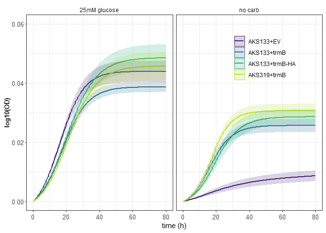

```r
# load required libraries
library(tidyverse)
library(viridis)
library(growthcurver)
library(scales)
library(ggpubr)
library(rstatix)

# custom function, calculated the 95% Confidence interval
conf_int95 <- function(data) {
  n <- length(data)
  error <- qt(0.975, df = n - 1) * sd(data) / sqrt(n)
  return(error)
}
```


```r
expt <- "trmB_complement"

# set path to files
data <- "raw_growth_data/20230109_hca_trmB_complementation1_data.csv"
meta <- "raw_growth_data/20230109_hca_trmB_complementation1_meta.csv"

## read in files
mt <- read.csv(meta, stringsAsFactors = F)
mt$expt <- rep(expt, nrow(mt))
dt <- read.csv(data)

# set well no as column names
colnames(dt) <- c("time", seq(1, ncol(dt) - 1))

# trim the first 3 hours of the experiment (reduce noise)
dt0 <- dt
dt0 <- dt0[-(1:6), ] ## remove the first 3 hours, or 6 timepoints.
dt0$time <- seq(0, length.out = nrow(dt0), by = 0.5) # redo time points
dt0 <- dt0[complete.cases(dt0), ]
dt0
```

```
##      time     1     2     3     4     5     6     7     8     9    10    11
## 7     0.0 0.312 0.318 0.316 0.321 0.283 0.278 0.287 0.290 0.284 0.289 0.287
## 8     0.5 0.301 0.310 0.306 0.316 0.283 0.273 0.278 0.284 0.282 0.286 0.284
## 9     1.0 0.302 0.315 0.308 0.318 0.280 0.271 0.282 0.286 0.283 0.285 0.282
## 10    1.5 0.293 0.305 0.295 0.312 0.270 0.267 0.277 0.279 0.271 0.277 0.276
## 11    2.0 0.305 0.310 0.305 0.318 0.284 0.278 0.280 0.294 0.280 0.290 0.283
## 12    2.5 0.300 0.314 0.306 0.318 0.282 0.278 0.285 0.289 0.284 0.290 0.282
## 13    3.0 0.312 0.325 0.312 0.326 0.288 0.281 0.289 0.295 0.299 0.297 0.292
## 14    3.5 0.297 0.306 0.295 0.314 0.277 0.271 0.276 0.283 0.274 0.285 0.278
## 15    4.0 0.300 0.310 0.299 0.316 0.278 0.273 0.282 0.293 0.282 0.290 0.286
## 16    4.5 0.307 0.322 0.309 0.325 0.290 0.280 0.292 0.303 0.291 0.298 0.295
## 17    5.0 0.301 0.308 0.298 0.318 0.278 0.276 0.282 0.290 0.280 0.284 0.282
## 18    5.5 0.303 0.310 0.300 0.321 0.281 0.275 0.284 0.289 0.282 0.287 0.284
## 19    6.0 0.309 0.311 0.305 0.324 0.285 0.282 0.290 0.304 0.288 0.290 0.285
## 20    6.5 0.313 0.316 0.306 0.325 0.289 0.285 0.292 0.301 0.291 0.296 0.293
## 21    7.0 0.303 0.310 0.300 0.322 0.284 0.281 0.287 0.295 0.285 0.295 0.289
## 22    7.5 0.307 0.316 0.304 0.324 0.286 0.282 0.293 0.303 0.289 0.293 0.286
## 23    8.0 0.302 0.308 0.301 0.318 0.279 0.278 0.285 0.293 0.287 0.289 0.283
## 24    8.5 0.298 0.304 0.297 0.318 0.277 0.274 0.284 0.292 0.285 0.285 0.283
## 25    9.0 0.302 0.308 0.301 0.318 0.283 0.278 0.285 0.295 0.284 0.287 0.283
## 26    9.5 0.304 0.310 0.301 0.319 0.282 0.278 0.287 0.295 0.285 0.290 0.284
## 27   10.0 0.307 0.315 0.302 0.327 0.287 0.283 0.292 0.299 0.291 0.292 0.287
## 28   10.5 0.307 0.314 0.304 0.324 0.285 0.281 0.296 0.296 0.287 0.294 0.290
## 29   11.0 0.305 0.313 0.301 0.322 0.286 0.283 0.290 0.297 0.291 0.291 0.290
## 30   11.5 0.305 0.311 0.303 0.323 0.289 0.284 0.290 0.296 0.289 0.295 0.291
## 31   12.0 0.307 0.312 0.303 0.326 0.287 0.285 0.291 0.299 0.292 0.292 0.286
## 32   12.5 0.308 0.313 0.304 0.327 0.287 0.284 0.293 0.301 0.291 0.298 0.297
## 33   13.0 0.311 0.311 0.304 0.324 0.290 0.287 0.295 0.302 0.293 0.302 0.293
## 34   13.5 0.306 0.309 0.308 0.322 0.290 0.284 0.290 0.299 0.292 0.296 0.290
## 35   14.0 0.285 0.293 0.284 0.309 0.271 0.266 0.272 0.280 0.271 0.278 0.270
## 36   14.5 0.286 0.291 0.286 0.306 0.270 0.264 0.276 0.283 0.271 0.279 0.271
## 37   15.0 0.285 0.288 0.282 0.303 0.268 0.265 0.270 0.280 0.271 0.277 0.270
## 38   15.5 0.287 0.290 0.284 0.306 0.268 0.264 0.272 0.283 0.271 0.281 0.271
## 39   16.0 0.289 0.294 0.286 0.308 0.273 0.266 0.274 0.286 0.276 0.282 0.274
## 40   16.5 0.280 0.286 0.285 0.304 0.264 0.261 0.266 0.275 0.267 0.273 0.266
## 41   17.0 0.292 0.294 0.289 0.312 0.274 0.268 0.279 0.294 0.278 0.284 0.272
## 42   17.5 0.286 0.290 0.282 0.304 0.269 0.264 0.271 0.284 0.272 0.278 0.269
## 43   18.0 0.294 0.300 0.292 0.316 0.280 0.274 0.282 0.294 0.283 0.289 0.283
## 44   18.5 0.297 0.301 0.295 0.313 0.285 0.275 0.283 0.295 0.285 0.293 0.282
## 45   19.0 0.290 0.294 0.285 0.307 0.273 0.268 0.276 0.284 0.275 0.281 0.271
## 46   19.5 0.278 0.284 0.278 0.298 0.265 0.260 0.267 0.276 0.268 0.273 0.264
## 47   20.0 0.280 0.284 0.279 0.297 0.266 0.260 0.269 0.282 0.269 0.275 0.264
## 48   20.5 0.292 0.295 0.290 0.308 0.279 0.273 0.281 0.293 0.283 0.286 0.277
## 49   21.0 0.286 0.291 0.285 0.305 0.274 0.269 0.276 0.287 0.276 0.283 0.271
## 50   21.5 0.281 0.284 0.276 0.298 0.265 0.261 0.269 0.275 0.268 0.276 0.267
## 51   22.0 0.289 0.290 0.285 0.304 0.273 0.269 0.275 0.290 0.277 0.286 0.276
## 52   22.5 0.287 0.290 0.286 0.305 0.274 0.269 0.276 0.284 0.277 0.282 0.272
## 53   23.0 0.287 0.290 0.284 0.306 0.272 0.270 0.275 0.287 0.276 0.282 0.272
## 54   23.5 0.300 0.302 0.296 0.316 0.287 0.281 0.289 0.297 0.281 0.290 0.281
## 55   24.0 0.288 0.293 0.286 0.306 0.275 0.271 0.278 0.286 0.280 0.284 0.275
## 56   24.5 0.287 0.291 0.286 0.307 0.275 0.267 0.275 0.286 0.276 0.284 0.274
## 57   25.0 0.296 0.299 0.291 0.315 0.281 0.275 0.286 0.294 0.287 0.293 0.281
## 58   25.5 0.291 0.295 0.289 0.312 0.279 0.273 0.281 0.289 0.282 0.285 0.276
## 59   26.0 0.292 0.293 0.286 0.304 0.276 0.270 0.279 0.291 0.282 0.297 0.283
## 60   26.5 0.294 0.296 0.290 0.313 0.281 0.275 0.281 0.291 0.283 0.294 0.284
## 61   27.0 0.291 0.292 0.289 0.308 0.279 0.274 0.280 0.296 0.285 0.292 0.275
## 62   27.5 0.297 0.296 0.292 0.311 0.283 0.277 0.289 0.295 0.288 0.298 0.285
## 63   28.0 0.295 0.296 0.290 0.310 0.282 0.275 0.284 0.294 0.284 0.290 0.277
## 64   28.5 0.284 0.290 0.283 0.302 0.272 0.267 0.273 0.281 0.275 0.280 0.270
## 65   29.0 0.295 0.296 0.294 0.311 0.286 0.279 0.286 0.298 0.288 0.299 0.284
## 66   29.5 0.310 0.303 0.301 0.315 0.290 0.282 0.291 0.304 0.294 0.303 0.289
## 67   30.0 0.304 0.301 0.294 0.312 0.284 0.279 0.284 0.298 0.287 0.294 0.278
## 68   30.5 0.299 0.300 0.295 0.313 0.284 0.277 0.285 0.299 0.291 0.299 0.283
## 69   31.0 0.300 0.301 0.296 0.314 0.287 0.279 0.285 0.298 0.288 0.300 0.284
## 70   31.5 0.292 0.295 0.290 0.305 0.279 0.273 0.280 0.294 0.282 0.294 0.279
## 71   32.0 0.298 0.296 0.291 0.309 0.281 0.274 0.280 0.291 0.282 0.291 0.277
## 72   32.5 0.297 0.302 0.295 0.314 0.287 0.278 0.288 0.297 0.288 0.300 0.283
## 73   33.0 0.292 0.295 0.290 0.307 0.280 0.274 0.280 0.289 0.283 0.289 0.278
## 74   33.5 0.289 0.289 0.285 0.303 0.276 0.269 0.276 0.287 0.277 0.288 0.273
## 75   34.0 0.290 0.292 0.284 0.304 0.275 0.268 0.274 0.282 0.278 0.285 0.273
## 76   34.5 0.306 0.304 0.297 0.315 0.292 0.283 0.291 0.303 0.288 0.294 0.277
## 77   35.0 0.298 0.294 0.288 0.304 0.281 0.274 0.280 0.293 0.283 0.295 0.277
## 78   35.5 0.303 0.300 0.293 0.309 0.286 0.278 0.287 0.298 0.287 0.297 0.282
## 79   36.0 0.301 0.299 0.293 0.308 0.286 0.277 0.284 0.297 0.290 0.296 0.277
## 80   36.5 0.297 0.299 0.296 0.309 0.286 0.280 0.287 0.298 0.290 0.303 0.280
## 81   37.0 0.307 0.299 0.295 0.309 0.286 0.279 0.285 0.293 0.287 0.293 0.280
## 82   37.5 0.311 0.305 0.303 0.315 0.295 0.287 0.295 0.307 0.302 0.312 0.291
## 83   38.0 0.300 0.297 0.294 0.307 0.286 0.277 0.282 0.292 0.287 0.295 0.280
## 84   38.5 0.301 0.299 0.294 0.308 0.288 0.280 0.286 0.292 0.290 0.295 0.283
## 85   39.0 0.310 0.304 0.301 0.311 0.293 0.284 0.293 0.305 0.298 0.307 0.285
## 86   39.5 0.309 0.306 0.301 0.314 0.295 0.286 0.294 0.303 0.299 0.309 0.290
## 87   40.0 0.311 0.301 0.297 0.319 0.289 0.281 0.288 0.294 0.289 0.298 0.287
## 88   40.5 0.314 0.303 0.301 0.309 0.293 0.285 0.290 0.298 0.296 0.301 0.289
## 89   41.0 0.302 0.298 0.295 0.305 0.289 0.280 0.286 0.293 0.289 0.295 0.281
## 90   41.5 0.315 0.307 0.307 0.313 0.297 0.286 0.296 0.307 0.302 0.314 0.291
## 91   42.0 0.321 0.310 0.307 0.315 0.297 0.288 0.297 0.306 0.302 0.317 0.292
## 92   42.5 0.320 0.305 0.302 0.313 0.295 0.285 0.295 0.308 0.302 0.306 0.290
## 93   43.0 0.323 0.305 0.305 0.314 0.294 0.284 0.292 0.305 0.296 0.309 0.288
## 94   43.5 0.321 0.315 0.313 0.322 0.303 0.293 0.301 0.310 0.302 0.315 0.299
## 95   44.0 0.322 0.311 0.308 0.317 0.302 0.294 0.303 0.317 0.304 0.322 0.298
## 96   44.5 0.319 0.303 0.300 0.306 0.293 0.283 0.289 0.298 0.295 0.303 0.286
## 97   45.0 0.319 0.306 0.304 0.312 0.295 0.285 0.290 0.305 0.298 0.307 0.289
## 98   45.5 0.330 0.318 0.312 0.322 0.309 0.295 0.305 0.317 0.310 0.322 0.299
## 99   46.0 0.327 0.316 0.312 0.319 0.305 0.299 0.303 0.315 0.308 0.313 0.298
## 100  46.5 0.331 0.315 0.314 0.318 0.306 0.298 0.305 0.320 0.314 0.317 0.300
## 101  47.0 0.321 0.308 0.306 0.313 0.299 0.290 0.298 0.307 0.304 0.308 0.290
## 102  47.5 0.323 0.305 0.304 0.312 0.297 0.288 0.299 0.312 0.308 0.313 0.291
## 103  48.0 0.329 0.315 0.312 0.323 0.307 0.299 0.308 0.319 0.312 0.313 0.299
## 104  48.5 0.326 0.313 0.311 0.317 0.306 0.298 0.304 0.315 0.308 0.318 0.297
## 105  49.0 0.320 0.310 0.310 0.317 0.305 0.295 0.307 0.320 0.312 0.316 0.297
## 106  49.5 0.332 0.311 0.310 0.319 0.306 0.295 0.302 0.321 0.314 0.321 0.300
## 107  50.0 0.333 0.314 0.314 0.319 0.307 0.297 0.305 0.319 0.314 0.328 0.303
## 108  50.5 0.326 0.312 0.313 0.319 0.306 0.296 0.305 0.316 0.305 0.317 0.300
## 109  51.0 0.329 0.314 0.313 0.321 0.307 0.297 0.307 0.317 0.307 0.316 0.299
## 110  51.5 0.329 0.314 0.313 0.319 0.308 0.298 0.304 0.319 0.304 0.311 0.300
## 111  52.0 0.326 0.312 0.313 0.320 0.305 0.296 0.304 0.316 0.306 0.319 0.299
## 112  52.5 0.323 0.307 0.306 0.310 0.300 0.291 0.297 0.313 0.301 0.311 0.291
## 113  53.0 0.331 0.318 0.318 0.322 0.307 0.297 0.303 0.318 0.307 0.316 0.301
## 114  53.5 0.334 0.320 0.319 0.324 0.314 0.302 0.309 0.324 0.310 0.316 0.303
## 115  54.0 0.324 0.313 0.312 0.319 0.308 0.299 0.306 0.322 0.309 0.327 0.300
## 116  54.5 0.334 0.313 0.311 0.316 0.306 0.300 0.304 0.313 0.308 0.324 0.296
## 117  55.0 0.334 0.316 0.316 0.321 0.312 0.303 0.311 0.321 0.310 0.322 0.301
## 118  55.5 0.334 0.318 0.317 0.319 0.308 0.297 0.303 0.324 0.308 0.322 0.299
## 119  56.0 0.332 0.318 0.316 0.326 0.312 0.305 0.315 0.330 0.309 0.312 0.295
## 120  56.5 0.337 0.316 0.316 0.325 0.312 0.303 0.312 0.318 0.314 0.327 0.301
## 121  57.0 0.328 0.312 0.310 0.317 0.309 0.298 0.307 0.322 0.308 0.317 0.301
## 122  57.5 0.323 0.308 0.307 0.313 0.303 0.292 0.303 0.307 0.306 0.321 0.294
## 123  58.0 0.326 0.311 0.312 0.317 0.306 0.299 0.303 0.321 0.305 0.317 0.302
## 124  58.5 0.322 0.311 0.308 0.313 0.301 0.290 0.299 0.316 0.303 0.314 0.289
## 125  59.0 0.329 0.309 0.308 0.312 0.305 0.296 0.303 0.320 0.310 0.326 0.295
## 126  59.5 0.333 0.313 0.310 0.314 0.309 0.296 0.300 0.325 0.310 0.330 0.295
## 127  60.0 0.319 0.302 0.300 0.303 0.296 0.286 0.292 0.303 0.302 0.309 0.285
## 128  60.5 0.318 0.309 0.307 0.313 0.302 0.292 0.300 0.317 0.304 0.306 0.291
## 129  61.0 0.320 0.304 0.302 0.305 0.299 0.288 0.295 0.308 0.296 0.311 0.289
## 130  61.5 0.329 0.316 0.313 0.316 0.309 0.298 0.304 0.318 0.307 0.333 0.300
## 131  62.0 0.335 0.323 0.322 0.325 0.315 0.304 0.311 0.328 0.315 0.325 0.302
## 132  62.5 0.324 0.313 0.314 0.317 0.306 0.295 0.300 0.316 0.311 0.317 0.302
## 133  63.0 0.330 0.312 0.312 0.314 0.309 0.297 0.303 0.323 0.314 0.318 0.297
## 134  63.5 0.320 0.308 0.308 0.311 0.306 0.297 0.303 0.323 0.305 0.315 0.299
## 135  64.0 0.325 0.313 0.313 0.317 0.310 0.298 0.311 0.322 0.313 0.315 0.297
## 136  64.5 0.327 0.317 0.316 0.320 0.312 0.300 0.307 0.319 0.316 0.321 0.302
## 137  65.0 0.331 0.315 0.316 0.319 0.314 0.303 0.309 0.328 0.315 0.327 0.304
## 138  65.5 0.324 0.303 0.306 0.308 0.305 0.292 0.297 0.320 0.303 0.313 0.295
## 139  66.0 0.312 0.301 0.305 0.310 0.299 0.288 0.295 0.308 0.297 0.311 0.297
## 140  66.5 0.327 0.316 0.323 0.329 0.321 0.306 0.313 0.328 0.320 0.326 0.310
## 141  67.0 0.327 0.311 0.314 0.314 0.310 0.300 0.306 0.320 0.319 0.319 0.301
## 142  67.5 0.322 0.305 0.312 0.313 0.306 0.296 0.303 0.317 0.312 0.315 0.299
## 143  68.0 0.332 0.313 0.317 0.318 0.316 0.304 0.313 0.328 0.319 0.328 0.305
## 144  68.5 0.342 0.321 0.325 0.324 0.322 0.308 0.316 0.332 0.320 0.327 0.313
## 145  69.0 0.328 0.314 0.323 0.321 0.316 0.304 0.311 0.328 0.319 0.327 0.306
## 146  69.5 0.329 0.311 0.314 0.317 0.309 0.299 0.305 0.318 0.308 0.320 0.302
## 147  70.0 0.332 0.316 0.319 0.321 0.315 0.305 0.311 0.324 0.315 0.327 0.304
## 148  70.5 0.324 0.314 0.318 0.321 0.311 0.302 0.308 0.323 0.319 0.328 0.307
## 149  71.0 0.322 0.310 0.311 0.311 0.309 0.298 0.302 0.318 0.315 0.318 0.298
## 150  71.5 0.330 0.314 0.315 0.314 0.310 0.299 0.303 0.321 0.312 0.326 0.300
## 151  72.0 0.330 0.319 0.327 0.320 0.321 0.309 0.307 0.332 0.323 0.325 0.307
## 152  72.5 0.330 0.318 0.322 0.324 0.316 0.303 0.310 0.329 0.321 0.332 0.311
## 153  73.0 0.326 0.322 0.320 0.324 0.315 0.300 0.304 0.323 0.317 0.325 0.314
## 154  73.5 0.331 0.323 0.326 0.322 0.324 0.311 0.314 0.334 0.323 0.330 0.314
## 155  74.0 0.333 0.324 0.328 0.324 0.318 0.312 0.315 0.329 0.324 0.324 0.303
## 156  74.5 0.323 0.315 0.318 0.312 0.310 0.299 0.306 0.322 0.312 0.332 0.309
## 157  75.0 0.324 0.313 0.319 0.317 0.314 0.305 0.308 0.328 0.315 0.328 0.303
## 158  75.5 0.324 0.322 0.321 0.322 0.316 0.307 0.312 0.329 0.324 0.320 0.305
## 159  76.0 0.320 0.317 0.315 0.313 0.312 0.303 0.307 0.327 0.317 0.326 0.300
## 160  76.5 0.323 0.309 0.313 0.315 0.310 0.302 0.304 0.318 0.311 0.320 0.302
## 161  77.0 0.328 0.320 0.315 0.312 0.310 0.300 0.303 0.319 0.314 0.313 0.300
## 162  77.5 0.320 0.309 0.310 0.306 0.303 0.295 0.297 0.315 0.308 0.314 0.295
## 163  78.0 0.322 0.314 0.315 0.320 0.310 0.300 0.301 0.317 0.308 0.313 0.304
## 164  78.5 0.317 0.307 0.309 0.306 0.302 0.292 0.296 0.312 0.307 0.318 0.295
## 165  79.0 0.325 0.320 0.315 0.308 0.304 0.295 0.303 0.317 0.314 0.315 0.294
## 166  79.5 0.324 0.314 0.321 0.320 0.310 0.303 0.306 0.326 0.316 0.321 0.304
## 167  80.0 0.321 0.313 0.315 0.315 0.309 0.301 0.300 0.311 0.315 0.329 0.307
## 168  80.5 0.317 0.308 0.315 0.316 0.308 0.296 0.304 0.318 0.313 0.315 0.298
## 169  81.0 0.321 0.313 0.314 0.307 0.303 0.295 0.298 0.308 0.306 0.318 0.297
## 170  81.5 0.314 0.309 0.308 0.305 0.302 0.294 0.300 0.317 0.308 0.314 0.292
## 171  82.0 0.321 0.310 0.315 0.312 0.308 0.298 0.303 0.301 0.315 0.318 0.306
## 172  82.5 0.328 0.320 0.326 0.320 0.316 0.305 0.311 0.292 0.320 0.326 0.309
## 173  83.0 0.337 0.331 0.336 0.331 0.329 0.320 0.323 0.312 0.331 0.339 0.320
## 174  83.5 0.328 0.322 0.327 0.322 0.315 0.307 0.311 0.302 0.319 0.328 0.309
## 175  84.0 0.325 0.317 0.322 0.312 0.311 0.304 0.305 0.302 0.317 0.323 0.305
## 176  84.5 0.320 0.313 0.316 0.308 0.306 0.298 0.305 0.296 0.316 0.318 0.300
## 177  85.0 0.319 0.312 0.318 0.309 0.308 0.302 0.304 0.297 0.318 0.321 0.300
## 178  85.5 0.318 0.318 0.319 0.309 0.308 0.302 0.301 0.297 0.313 0.312 0.299
## 179  86.0 0.313 0.312 0.306 0.305 0.302 0.292 0.293 0.285 0.306 0.314 0.292
## 180  86.5 0.318 0.312 0.314 0.313 0.309 0.299 0.302 0.298 0.317 0.320 0.304
## 181  87.0 0.328 0.326 0.324 0.317 0.315 0.309 0.312 0.311 0.320 0.322 0.306
## 182  87.5 0.315 0.310 0.319 0.315 0.306 0.295 0.299 0.290 0.310 0.314 0.302
## 183  88.0 0.336 0.331 0.333 0.325 0.324 0.314 0.319 0.324 0.332 0.334 0.314
## 184  88.5 0.332 0.324 0.328 0.322 0.326 0.315 0.318 0.306 0.325 0.332 0.315
## 185  89.0 0.329 0.327 0.331 0.324 0.323 0.311 0.318 0.305 0.329 0.328 0.315
## 186  89.5 0.323 0.325 0.323 0.318 0.316 0.304 0.310 0.309 0.322 0.323 0.308
## 187  90.0 0.322 0.317 0.321 0.310 0.311 0.299 0.304 0.305 0.316 0.324 0.300
## 188  90.5 0.316 0.318 0.322 0.308 0.305 0.299 0.296 0.301 0.305 0.318 0.291
## 189  91.0 0.322 0.318 0.323 0.312 0.312 0.301 0.299 0.303 0.313 0.329 0.302
## 190  91.5 0.324 0.318 0.318 0.308 0.306 0.298 0.305 0.297 0.315 0.324 0.295
## 191  92.0 0.307 0.298 0.304 0.299 0.300 0.292 0.292 0.290 0.299 0.305 0.292
## 192  92.5 0.312 0.301 0.306 0.306 0.304 0.293 0.299 0.293 0.304 0.307 0.295
## 193  93.0 0.321 0.311 0.317 0.305 0.304 0.300 0.299 0.298 0.308 0.316 0.294
## 194  93.5 0.323 0.316 0.321 0.315 0.316 0.302 0.306 0.303 0.315 0.324 0.304
## 195  94.0 0.322 0.314 0.321 0.315 0.314 0.301 0.311 0.302 0.320 0.319 0.301
## 196  94.5 0.318 0.307 0.312 0.301 0.306 0.296 0.302 0.285 0.311 0.315 0.295
## 197  95.0 0.318 0.313 0.317 0.306 0.309 0.298 0.302 0.299 0.308 0.318 0.298
## 198  95.5 0.309 0.299 0.307 0.296 0.297 0.290 0.290 0.287 0.297 0.306 0.285
## 199  96.0 0.322 0.312 0.314 0.305 0.309 0.298 0.298 0.291 0.307 0.312 0.297
## 200  96.5 0.327 0.317 0.319 0.314 0.310 0.302 0.304 0.302 0.315 0.324 0.304
## 201  97.0 0.331 0.321 0.325 0.317 0.324 0.310 0.315 0.311 0.318 0.337 0.309
## 202  97.5 0.321 0.325 0.326 0.314 0.315 0.307 0.310 0.308 0.318 0.331 0.312
## 203  98.0 0.331 0.324 0.323 0.314 0.315 0.308 0.309 0.315 0.316 0.322 0.302
## 204  98.5 0.329 0.321 0.324 0.310 0.307 0.301 0.302 0.304 0.313 0.324 0.301
## 205  99.0 0.326 0.325 0.335 0.321 0.321 0.312 0.315 0.316 0.319 0.328 0.322
## 206  99.5 0.325 0.311 0.319 0.313 0.313 0.305 0.306 0.307 0.311 0.318 0.302
## 207 100.0 0.326 0.317 0.322 0.310 0.309 0.305 0.303 0.305 0.310 0.319 0.299
## 208 100.5 0.322 0.306 0.314 0.301 0.302 0.298 0.294 0.299 0.304 0.317 0.292
## 209 101.0 0.320 0.305 0.311 0.301 0.305 0.297 0.298 0.295 0.303 0.311 0.297
## 210 101.5 0.326 0.309 0.316 0.304 0.304 0.298 0.298 0.300 0.311 0.317 0.297
## 211 102.0 0.323 0.317 0.317 0.315 0.312 0.305 0.306 0.305 0.313 0.327 0.303
## 212 102.5 0.322 0.307 0.319 0.305 0.309 0.304 0.301 0.303 0.310 0.325 0.300
## 213 103.0 0.335 0.325 0.328 0.315 0.319 0.315 0.319 0.308 0.322 0.330 0.305
## 214 103.5 0.338 0.326 0.330 0.320 0.320 0.313 0.319 0.316 0.328 0.343 0.315
## 215 104.0 0.335 0.322 0.330 0.317 0.318 0.308 0.314 0.311 0.320 0.328 0.308
## 216 104.5 0.334 0.324 0.328 0.315 0.317 0.307 0.317 0.314 0.316 0.328 0.305
## 217 105.0 0.331 0.308 0.319 0.289 0.311 0.301 0.302 0.304 0.308 0.322 0.298
##        12    13    14    15    16    17    18    19    20    21    22    23
## 7   0.306 0.283 0.289 0.303 0.309 0.295 0.291 0.297 0.287 0.296 0.275 0.280
## 8   0.309 0.285 0.290 0.305 0.312 0.297 0.290 0.296 0.282 0.292 0.274 0.273
## 9   0.305 0.278 0.288 0.303 0.310 0.296 0.288 0.296 0.278 0.288 0.272 0.274
## 10  0.298 0.282 0.287 0.301 0.309 0.293 0.284 0.291 0.274 0.285 0.267 0.268
## 11  0.306 0.280 0.292 0.309 0.318 0.300 0.291 0.300 0.285 0.289 0.275 0.276
## 12  0.305 0.278 0.291 0.309 0.326 0.298 0.291 0.300 0.282 0.291 0.276 0.276
## 13  0.319 0.291 0.305 0.320 0.337 0.311 0.302 0.311 0.293 0.298 0.291 0.285
## 14  0.303 0.275 0.289 0.310 0.311 0.297 0.287 0.293 0.281 0.281 0.278 0.284
## 15  0.310 0.282 0.295 0.313 0.316 0.300 0.293 0.297 0.285 0.291 0.276 0.281
## 16  0.314 0.289 0.303 0.321 0.322 0.309 0.299 0.304 0.291 0.294 0.281 0.284
## 17  0.306 0.278 0.296 0.313 0.315 0.301 0.292 0.295 0.282 0.287 0.277 0.276
## 18  0.309 0.283 0.299 0.318 0.317 0.306 0.299 0.300 0.283 0.293 0.278 0.280
## 19  0.322 0.286 0.302 0.320 0.319 0.308 0.301 0.304 0.286 0.289 0.279 0.283
## 20  0.318 0.291 0.306 0.323 0.319 0.311 0.308 0.309 0.293 0.299 0.290 0.287
## 21  0.317 0.289 0.308 0.326 0.327 0.319 0.306 0.307 0.291 0.293 0.294 0.286
## 22  0.316 0.290 0.309 0.325 0.329 0.317 0.308 0.304 0.290 0.294 0.285 0.284
## 23  0.317 0.286 0.304 0.318 0.320 0.308 0.306 0.303 0.289 0.290 0.283 0.281
## 24  0.312 0.284 0.307 0.321 0.317 0.309 0.307 0.300 0.283 0.285 0.284 0.284
## 25  0.322 0.288 0.310 0.327 0.324 0.318 0.315 0.303 0.287 0.288 0.288 0.282
## 26  0.326 0.293 0.314 0.328 0.326 0.320 0.311 0.302 0.290 0.290 0.288 0.292
## 27  0.326 0.302 0.318 0.334 0.331 0.323 0.321 0.313 0.293 0.292 0.290 0.289
## 28  0.327 0.297 0.321 0.335 0.334 0.323 0.316 0.314 0.292 0.294 0.291 0.291
## 29  0.330 0.296 0.322 0.335 0.334 0.323 0.321 0.310 0.292 0.293 0.294 0.291
## 30  0.331 0.302 0.330 0.341 0.336 0.329 0.326 0.315 0.294 0.299 0.304 0.295
## 31  0.332 0.303 0.327 0.339 0.333 0.325 0.325 0.312 0.293 0.291 0.296 0.294
## 32  0.354 0.311 0.338 0.350 0.344 0.340 0.333 0.324 0.299 0.301 0.307 0.304
## 33  0.341 0.304 0.331 0.342 0.337 0.334 0.329 0.324 0.298 0.298 0.306 0.310
## 34  0.345 0.306 0.333 0.343 0.339 0.334 0.335 0.320 0.295 0.295 0.297 0.305
## 35  0.326 0.292 0.321 0.336 0.327 0.323 0.314 0.308 0.281 0.276 0.285 0.288
## 36  0.325 0.295 0.322 0.334 0.330 0.326 0.319 0.306 0.278 0.277 0.285 0.290
## 37  0.327 0.291 0.319 0.330 0.324 0.321 0.315 0.307 0.279 0.276 0.285 0.289
## 38  0.331 0.295 0.328 0.343 0.339 0.331 0.322 0.307 0.282 0.279 0.290 0.290
## 39  0.335 0.296 0.334 0.342 0.336 0.342 0.324 0.313 0.282 0.280 0.294 0.292
## 40  0.333 0.291 0.325 0.335 0.329 0.332 0.320 0.305 0.273 0.270 0.286 0.290
## 41  0.342 0.307 0.337 0.347 0.340 0.343 0.326 0.312 0.283 0.279 0.296 0.301
## 42  0.338 0.303 0.336 0.344 0.340 0.339 0.326 0.309 0.278 0.273 0.292 0.300
## 43  0.349 0.311 0.347 0.356 0.348 0.351 0.339 0.319 0.289 0.284 0.303 0.308
## 44  0.350 0.314 0.345 0.354 0.347 0.347 0.339 0.324 0.291 0.290 0.310 0.314
## 45  0.340 0.304 0.340 0.348 0.342 0.339 0.328 0.312 0.280 0.277 0.297 0.304
## 46  0.333 0.295 0.336 0.339 0.337 0.333 0.330 0.305 0.272 0.270 0.290 0.302
## 47  0.337 0.293 0.338 0.340 0.337 0.333 0.324 0.305 0.272 0.270 0.292 0.294
## 48  0.345 0.306 0.353 0.352 0.353 0.349 0.341 0.319 0.285 0.281 0.314 0.314
## 49  0.347 0.309 0.357 0.354 0.350 0.346 0.335 0.316 0.282 0.277 0.308 0.310
## 50  0.343 0.296 0.348 0.341 0.345 0.340 0.334 0.316 0.276 0.272 0.305 0.305
## 51  0.349 0.308 0.359 0.350 0.360 0.349 0.347 0.323 0.287 0.283 0.310 0.314
## 52  0.348 0.306 0.363 0.353 0.357 0.352 0.342 0.320 0.280 0.280 0.306 0.313
## 53  0.349 0.305 0.363 0.352 0.360 0.353 0.346 0.322 0.283 0.278 0.309 0.313
## 54  0.357 0.315 0.373 0.359 0.365 0.358 0.358 0.330 0.291 0.287 0.326 0.326
## 55  0.354 0.319 0.374 0.360 0.368 0.359 0.352 0.327 0.286 0.281 0.316 0.324
## 56  0.351 0.316 0.373 0.358 0.366 0.356 0.348 0.324 0.283 0.278 0.316 0.318
## 57  0.358 0.323 0.382 0.367 0.377 0.366 0.357 0.334 0.293 0.286 0.328 0.327
## 58  0.356 0.320 0.379 0.364 0.375 0.363 0.353 0.330 0.285 0.282 0.322 0.326
## 59  0.361 0.329 0.386 0.370 0.389 0.371 0.362 0.334 0.294 0.287 0.327 0.330
## 60  0.360 0.328 0.382 0.366 0.381 0.366 0.366 0.335 0.293 0.287 0.336 0.331
## 61  0.354 0.325 0.377 0.361 0.379 0.366 0.362 0.339 0.289 0.281 0.329 0.333
## 62  0.360 0.333 0.386 0.367 0.384 0.370 0.369 0.337 0.296 0.287 0.332 0.335
## 63  0.358 0.331 0.388 0.369 0.386 0.370 0.361 0.334 0.291 0.284 0.328 0.330
## 64  0.351 0.329 0.381 0.364 0.380 0.362 0.360 0.328 0.281 0.275 0.318 0.322
## 65  0.369 0.339 0.392 0.375 0.387 0.377 0.375 0.346 0.298 0.292 0.336 0.337
## 66  0.369 0.340 0.395 0.378 0.390 0.377 0.378 0.342 0.301 0.292 0.339 0.339
## 67  0.360 0.337 0.395 0.380 0.394 0.376 0.367 0.333 0.250 0.284 0.329 0.332
## 68  0.366 0.339 0.400 0.384 0.395 0.383 0.376 0.341 0.258 0.288 0.337 0.341
## 69  0.366 0.340 0.402 0.388 0.402 0.381 0.377 0.339 0.262 0.291 0.337 0.341
## 70  0.363 0.338 0.394 0.375 0.388 0.378 0.376 0.337 0.255 0.289 0.332 0.342
## 71  0.360 0.337 0.399 0.380 0.396 0.376 0.370 0.337 0.256 0.283 0.330 0.341
## 72  0.363 0.345 0.402 0.382 0.396 0.381 0.386 0.346 0.261 0.288 0.338 0.346
## 73  0.355 0.335 0.398 0.379 0.393 0.375 0.372 0.336 0.253 0.280 0.329 0.339
## 74  0.354 0.335 0.398 0.380 0.391 0.375 0.372 0.334 0.254 0.278 0.329 0.337
## 75  0.352 0.333 0.397 0.379 0.391 0.375 0.374 0.333 0.254 0.277 0.326 0.338
## 76  0.359 0.343 0.400 0.381 0.395 0.381 0.376 0.337 0.260 0.284 0.337 0.345
## 77  0.359 0.341 0.406 0.387 0.396 0.381 0.382 0.337 0.261 0.285 0.335 0.339
## 78  0.361 0.342 0.405 0.385 0.396 0.381 0.384 0.343 0.263 0.287 0.342 0.348
## 79  0.360 0.340 0.405 0.384 0.395 0.381 0.385 0.343 0.261 0.287 0.341 0.343
## 80  0.361 0.346 0.413 0.393 0.404 0.387 0.382 0.343 0.266 0.288 0.341 0.346
## 81  0.362 0.342 0.410 0.391 0.400 0.388 0.388 0.340 0.267 0.285 0.346 0.345
## 82  0.373 0.355 0.421 0.399 0.411 0.395 0.398 0.357 0.280 0.298 0.353 0.356
## 83  0.360 0.340 0.414 0.392 0.401 0.388 0.386 0.342 0.266 0.287 0.338 0.347
## 84  0.367 0.348 0.415 0.393 0.405 0.388 0.394 0.347 0.271 0.291 0.344 0.350
## 85  0.372 0.348 0.418 0.396 0.403 0.393 0.401 0.355 0.275 0.294 0.350 0.356
## 86  0.373 0.350 0.421 0.400 0.407 0.393 0.401 0.353 0.277 0.296 0.349 0.355
## 87  0.373 0.351 0.424 0.404 0.405 0.394 0.393 0.351 0.276 0.295 0.345 0.355
## 88  0.373 0.354 0.421 0.399 0.409 0.392 0.396 0.350 0.276 0.295 0.346 0.354
## 89  0.369 0.350 0.418 0.398 0.408 0.389 0.397 0.349 0.273 0.290 0.345 0.350
## 90  0.380 0.357 0.429 0.407 0.413 0.399 0.404 0.356 0.283 0.300 0.352 0.358
## 91  0.377 0.360 0.429 0.407 0.413 0.399 0.410 0.357 0.282 0.299 0.352 0.363
## 92  0.376 0.356 0.433 0.419 0.416 0.402 0.403 0.356 0.282 0.297 0.351 0.363
## 93  0.370 0.352 0.425 0.402 0.405 0.393 0.399 0.352 0.269 0.293 0.348 0.357
## 94  0.381 0.362 0.440 0.422 0.416 0.408 0.410 0.361 0.281 0.308 0.356 0.364
## 95  0.385 0.365 0.438 0.421 0.419 0.407 0.419 0.363 0.281 0.306 0.360 0.367
## 96  0.373 0.354 0.427 0.409 0.404 0.399 0.406 0.351 0.273 0.294 0.348 0.353
## 97  0.374 0.356 0.432 0.413 0.408 0.402 0.403 0.352 0.274 0.294 0.352 0.361
## 98  0.383 0.368 0.441 0.426 0.419 0.409 0.413 0.369 0.289 0.307 0.366 0.372
## 99  0.383 0.367 0.444 0.430 0.422 0.411 0.417 0.366 0.291 0.306 0.363 0.368
## 100 0.384 0.369 0.443 0.426 0.421 0.409 0.418 0.367 0.294 0.308 0.365 0.373
## 101 0.378 0.363 0.433 0.416 0.412 0.402 0.410 0.361 0.287 0.298 0.359 0.366
## 102 0.374 0.359 0.437 0.415 0.412 0.403 0.409 0.357 0.275 0.298 0.353 0.364
## 103 0.383 0.367 0.443 0.421 0.417 0.413 0.421 0.369 0.288 0.307 0.367 0.373
## 104 0.383 0.365 0.444 0.421 0.416 0.411 0.419 0.368 0.286 0.305 0.364 0.371
## 105 0.381 0.365 0.441 0.419 0.418 0.409 0.420 0.369 0.285 0.305 0.359 0.373
## 106 0.388 0.367 0.445 0.423 0.417 0.414 0.422 0.372 0.289 0.309 0.365 0.370
## 107 0.390 0.370 0.447 0.431 0.418 0.417 0.423 0.372 0.291 0.309 0.363 0.372
## 108 0.387 0.365 0.441 0.427 0.414 0.412 0.420 0.369 0.287 0.306 0.363 0.371
## 109 0.390 0.367 0.443 0.430 0.422 0.414 0.423 0.371 0.288 0.307 0.366 0.375
## 110 0.391 0.368 0.442 0.429 0.420 0.412 0.422 0.370 0.287 0.307 0.362 0.371
## 111 0.386 0.365 0.442 0.425 0.418 0.409 0.419 0.369 0.284 0.306 0.361 0.370
## 112 0.384 0.359 0.437 0.420 0.415 0.406 0.413 0.363 0.281 0.299 0.357 0.367
## 113 0.388 0.365 0.447 0.431 0.421 0.412 0.421 0.366 0.284 0.311 0.363 0.373
## 114 0.398 0.373 0.455 0.439 0.436 0.419 0.429 0.378 0.292 0.313 0.371 0.382
## 115 0.393 0.368 0.448 0.425 0.422 0.414 0.426 0.376 0.290 0.307 0.369 0.378
## 116 0.386 0.364 0.444 0.426 0.420 0.414 0.420 0.370 0.287 0.302 0.361 0.371
## 117 0.392 0.371 0.451 0.427 0.427 0.417 0.429 0.375 0.294 0.309 0.371 0.380
## 118 0.389 0.373 0.448 0.433 0.428 0.414 0.424 0.374 0.291 0.306 0.368 0.384
## 119 0.388 0.366 0.441 0.419 0.426 0.413 0.423 0.374 0.289 0.305 0.368 0.374
## 120 0.395 0.373 0.452 0.435 0.430 0.422 0.437 0.377 0.298 0.309 0.371 0.385
## 121 0.395 0.371 0.449 0.428 0.428 0.419 0.428 0.373 0.299 0.307 0.366 0.382
## 122 0.389 0.364 0.442 0.427 0.425 0.412 0.422 0.366 0.289 0.300 0.362 0.370
## 123 0.401 0.373 0.450 0.436 0.429 0.422 0.428 0.378 0.299 0.310 0.372 0.386
## 124 0.384 0.361 0.439 0.424 0.419 0.407 0.416 0.362 0.285 0.301 0.360 0.365
## 125 0.387 0.371 0.442 0.427 0.417 0.411 0.422 0.368 0.291 0.301 0.361 0.376
## 126 0.394 0.367 0.446 0.428 0.418 0.413 0.422 0.368 0.291 0.301 0.362 0.379
## 127 0.382 0.359 0.436 0.419 0.404 0.402 0.416 0.360 0.282 0.295 0.359 0.364
## 128 0.388 0.366 0.445 0.428 0.420 0.408 0.420 0.363 0.288 0.299 0.365 0.368
## 129 0.384 0.360 0.437 0.424 0.412 0.405 0.418 0.361 0.287 0.298 0.360 0.368
## 130 0.394 0.375 0.453 0.439 0.419 0.420 0.428 0.374 0.297 0.307 0.368 0.378
## 131 0.396 0.381 0.449 0.438 0.419 0.420 0.430 0.375 0.298 0.312 0.370 0.381
## 132 0.386 0.368 0.448 0.431 0.412 0.414 0.422 0.369 0.292 0.304 0.360 0.366
## 133 0.388 0.369 0.449 0.438 0.413 0.414 0.432 0.373 0.301 0.305 0.363 0.365
## 134 0.384 0.368 0.444 0.426 0.408 0.415 0.426 0.370 0.303 0.304 0.360 0.365
## 135 0.387 0.371 0.445 0.436 0.410 0.415 0.425 0.371 0.296 0.304 0.365 0.367
## 136 0.390 0.372 0.452 0.432 0.413 0.416 0.432 0.374 0.297 0.309 0.369 0.370
## 137 0.391 0.377 0.449 0.438 0.413 0.420 0.431 0.377 0.299 0.311 0.368 0.374
## 138 0.378 0.370 0.446 0.431 0.406 0.411 0.419 0.370 0.288 0.301 0.362 0.362
## 139 0.371 0.367 0.440 0.432 0.400 0.407 0.418 0.364 0.286 0.300 0.353 0.357
## 140 0.391 0.381 0.454 0.437 0.420 0.419 0.438 0.381 0.304 0.320 0.370 0.377
## 141 0.383 0.382 0.450 0.435 0.412 0.420 0.434 0.379 0.297 0.309 0.367 0.369
## 142 0.378 0.374 0.446 0.438 0.403 0.413 0.425 0.371 0.288 0.304 0.359 0.362
## 143 0.392 0.378 0.452 0.437 0.413 0.423 0.433 0.379 0.300 0.313 0.372 0.375
## 144 0.395 0.388 0.460 0.449 0.417 0.427 0.437 0.385 0.302 0.315 0.380 0.378
## 145 0.393 0.383 0.451 0.444 0.414 0.421 0.433 0.379 0.298 0.313 0.375 0.375
## 146 0.389 0.381 0.453 0.437 0.413 0.417 0.427 0.374 0.291 0.306 0.367 0.368
## 147 0.388 0.377 0.454 0.441 0.416 0.420 0.431 0.378 0.295 0.310 0.370 0.374
## 148 0.387 0.384 0.453 0.440 0.421 0.419 0.429 0.375 0.295 0.310 0.372 0.371
## 149 0.387 0.374 0.444 0.430 0.411 0.414 0.425 0.374 0.292 0.306 0.369 0.368
## 150 0.384 0.377 0.450 0.440 0.415 0.417 0.428 0.373 0.292 0.309 0.365 0.369
## 151 0.386 0.386 0.452 0.441 0.416 0.418 0.433 0.377 0.297 0.310 0.372 0.373
## 152 0.385 0.380 0.455 0.447 0.423 0.423 0.432 0.377 0.297 0.313 0.374 0.374
## 153 0.382 0.379 0.455 0.446 0.414 0.422 0.433 0.378 0.296 0.311 0.375 0.373
## 154 0.391 0.391 0.459 0.446 0.411 0.425 0.439 0.382 0.304 0.318 0.381 0.383
## 155 0.385 0.378 0.456 0.444 0.410 0.421 0.432 0.377 0.296 0.310 0.369 0.372
## 156 0.386 0.380 0.456 0.444 0.419 0.422 0.434 0.380 0.300 0.315 0.377 0.376
## 157 0.385 0.377 0.449 0.441 0.415 0.417 0.433 0.378 0.297 0.312 0.375 0.375
## 158 0.391 0.385 0.452 0.438 0.417 0.422 0.435 0.381 0.298 0.312 0.375 0.384
## 159 0.383 0.379 0.449 0.435 0.412 0.415 0.429 0.376 0.293 0.307 0.370 0.373
## 160 0.383 0.375 0.445 0.431 0.410 0.416 0.428 0.375 0.292 0.306 0.369 0.372
## 161 0.385 0.379 0.450 0.440 0.415 0.419 0.429 0.377 0.293 0.305 0.365 0.373
## 162 0.378 0.372 0.445 0.433 0.408 0.414 0.423 0.370 0.286 0.301 0.366 0.367
## 163 0.383 0.374 0.447 0.440 0.412 0.411 0.427 0.372 0.292 0.307 0.366 0.370
## 164 0.381 0.371 0.437 0.424 0.406 0.410 0.420 0.371 0.286 0.299 0.363 0.367
## 165 0.386 0.371 0.439 0.428 0.406 0.411 0.421 0.371 0.289 0.300 0.364 0.370
## 166 0.392 0.385 0.449 0.440 0.411 0.418 0.428 0.378 0.290 0.309 0.378 0.375
## 167 0.395 0.381 0.449 0.438 0.417 0.419 0.429 0.379 0.289 0.309 0.376 0.376
## 168 0.384 0.376 0.442 0.431 0.410 0.408 0.422 0.372 0.285 0.303 0.366 0.368
## 169 0.384 0.383 0.445 0.436 0.412 0.410 0.422 0.374 0.278 0.303 0.367 0.370
## 170 0.378 0.377 0.441 0.432 0.408 0.412 0.422 0.368 0.276 0.299 0.370 0.366
## 171 0.383 0.383 0.446 0.434 0.407 0.415 0.424 0.375 0.277 0.311 0.374 0.372
## 172 0.391 0.384 0.452 0.441 0.410 0.417 0.430 0.381 0.283 0.313 0.381 0.376
## 173 0.405 0.403 0.462 0.451 0.428 0.432 0.448 0.393 0.293 0.328 0.394 0.390
## 174 0.389 0.390 0.452 0.439 0.410 0.415 0.430 0.380 0.282 0.316 0.388 0.374
## 175 0.390 0.395 0.457 0.448 0.413 0.421 0.432 0.382 0.285 0.309 0.390 0.375
## 176 0.383 0.387 0.444 0.434 0.406 0.413 0.426 0.375 0.282 0.304 0.377 0.370
## 177 0.390 0.383 0.445 0.437 0.413 0.414 0.428 0.375 0.281 0.307 0.373 0.371
## 178 0.390 0.378 0.443 0.434 0.410 0.411 0.426 0.376 0.280 0.307 0.375 0.370
## 179 0.385 0.377 0.441 0.436 0.404 0.402 0.418 0.368 0.270 0.298 0.370 0.363
## 180 0.392 0.382 0.449 0.439 0.412 0.410 0.425 0.379 0.275 0.311 0.367 0.369
## 181 0.398 0.390 0.449 0.441 0.415 0.416 0.431 0.385 0.282 0.312 0.380 0.375
## 182 0.380 0.378 0.443 0.437 0.405 0.402 0.417 0.369 0.270 0.300 0.369 0.366
## 183 0.403 0.394 0.455 0.443 0.430 0.422 0.444 0.393 0.289 0.322 0.391 0.385
## 184 0.395 0.392 0.451 0.444 0.427 0.423 0.436 0.391 0.291 0.317 0.391 0.379
## 185 0.402 0.396 0.457 0.450 0.417 0.424 0.440 0.393 0.297 0.321 0.397 0.388
## 186 0.390 0.384 0.444 0.437 0.403 0.411 0.428 0.380 0.289 0.312 0.379 0.371
## 187 0.386 0.390 0.440 0.437 0.395 0.409 0.424 0.379 0.283 0.307 0.383 0.368
## 188 0.380 0.377 0.435 0.431 0.385 0.400 0.420 0.370 0.275 0.297 0.370 0.360
## 189 0.387 0.382 0.436 0.434 0.389 0.408 0.426 0.375 0.275 0.305 0.387 0.367
## 190 0.385 0.375 0.431 0.425 0.383 0.405 0.418 0.369 0.269 0.300 0.370 0.361
## 191 0.374 0.371 0.429 0.428 0.379 0.399 0.412 0.364 0.264 0.294 0.367 0.357
## 192 0.378 0.374 0.430 0.426 0.385 0.401 0.421 0.369 0.272 0.299 0.381 0.363
## 193 0.383 0.377 0.435 0.432 0.386 0.407 0.423 0.372 0.279 0.302 0.373 0.366
## 194 0.389 0.380 0.437 0.435 0.395 0.408 0.431 0.378 0.278 0.307 0.383 0.369
## 195 0.391 0.384 0.437 0.434 0.394 0.410 0.425 0.378 0.285 0.308 0.391 0.371
## 196 0.384 0.378 0.430 0.427 0.391 0.403 0.421 0.372 0.280 0.300 0.379 0.363
## 197 0.385 0.377 0.431 0.434 0.397 0.406 0.432 0.377 0.278 0.304 0.387 0.367
## 198 0.375 0.369 0.421 0.419 0.384 0.393 0.416 0.362 0.266 0.292 0.373 0.355
## 199 0.387 0.377 0.429 0.430 0.398 0.406 0.428 0.374 0.280 0.305 0.385 0.366
## 200 0.393 0.384 0.437 0.438 0.402 0.412 0.437 0.380 0.286 0.310 0.392 0.372
## 201 0.400 0.392 0.440 0.440 0.409 0.419 0.440 0.386 0.293 0.315 0.401 0.379
## 202 0.396 0.389 0.434 0.435 0.401 0.412 0.437 0.383 0.292 0.313 0.400 0.375
## 203 0.395 0.391 0.431 0.436 0.401 0.410 0.427 0.379 0.287 0.305 0.392 0.369
## 204 0.390 0.390 0.430 0.432 0.398 0.408 0.426 0.378 0.283 0.304 0.387 0.375
## 205 0.400 0.396 0.438 0.440 0.401 0.418 0.432 0.385 0.289 0.312 0.402 0.377
## 206 0.389 0.390 0.435 0.434 0.393 0.415 0.421 0.378 0.285 0.303 0.393 0.369
## 207 0.386 0.382 0.436 0.438 0.394 0.408 0.421 0.378 0.282 0.302 0.397 0.368
## 208 0.382 0.381 0.431 0.429 0.389 0.402 0.411 0.371 0.275 0.297 0.385 0.360
## 209 0.384 0.385 0.431 0.428 0.387 0.406 0.417 0.374 0.279 0.300 0.386 0.365
## 210 0.386 0.381 0.436 0.430 0.388 0.407 0.418 0.376 0.280 0.300 0.390 0.368
## 211 0.389 0.387 0.439 0.438 0.395 0.410 0.421 0.378 0.282 0.304 0.393 0.372
## 212 0.386 0.382 0.437 0.431 0.389 0.410 0.417 0.376 0.280 0.302 0.394 0.368
## 213 0.396 0.392 0.446 0.445 0.403 0.412 0.427 0.384 0.289 0.309 0.403 0.376
## 214 0.399 0.395 0.450 0.449 0.403 0.425 0.432 0.392 0.292 0.318 0.406 0.381
## 215 0.397 0.391 0.448 0.445 0.400 0.416 0.427 0.388 0.290 0.313 0.406 0.378
## 216 0.390 0.390 0.443 0.437 0.401 0.411 0.423 0.386 0.285 0.309 0.403 0.374
## 217 0.385 0.384 0.440 0.432 0.396 0.406 0.421 0.380 0.281 0.303 0.395 0.370
##        24    25    26    27    28    29    30    31    32    33    34    35
## 7   0.284 0.293 0.298 0.291 0.286 0.280 0.289 0.297 0.282 0.276 0.287 0.291
## 8   0.282 0.291 0.300 0.289 0.286 0.280 0.286 0.285 0.281 0.276 0.281 0.280
## 9   0.281 0.291 0.296 0.287 0.286 0.278 0.282 0.288 0.288 0.275 0.282 0.278
## 10  0.282 0.287 0.293 0.286 0.283 0.276 0.278 0.280 0.279 0.270 0.275 0.275
## 11  0.300 0.295 0.303 0.300 0.293 0.284 0.285 0.291 0.283 0.276 0.283 0.283
## 12  0.283 0.300 0.301 0.293 0.288 0.285 0.286 0.292 0.285 0.281 0.282 0.283
## 13  0.292 0.305 0.311 0.303 0.296 0.296 0.293 0.296 0.291 0.286 0.290 0.293
## 14  0.289 0.293 0.298 0.289 0.283 0.283 0.279 0.290 0.276 0.274 0.279 0.286
## 15  0.285 0.301 0.305 0.295 0.292 0.290 0.286 0.299 0.283 0.287 0.285 0.286
## 16  0.293 0.307 0.314 0.301 0.294 0.297 0.288 0.295 0.286 0.289 0.289 0.291
## 17  0.279 0.300 0.304 0.292 0.287 0.289 0.281 0.284 0.278 0.285 0.280 0.281
## 18  0.283 0.307 0.310 0.296 0.290 0.296 0.284 0.289 0.286 0.288 0.282 0.286
## 19  0.285 0.311 0.311 0.300 0.294 0.300 0.284 0.290 0.285 0.295 0.284 0.288
## 20  0.289 0.317 0.315 0.307 0.298 0.307 0.292 0.297 0.287 0.300 0.288 0.292
## 21  0.289 0.319 0.315 0.304 0.299 0.309 0.287 0.291 0.290 0.300 0.293 0.291
## 22  0.287 0.319 0.314 0.306 0.299 0.307 0.288 0.295 0.283 0.300 0.286 0.290
## 23  0.285 0.320 0.307 0.299 0.294 0.303 0.284 0.289 0.278 0.297 0.280 0.287
## 24  0.281 0.319 0.307 0.299 0.296 0.303 0.280 0.285 0.284 0.295 0.278 0.284
## 25  0.285 0.322 0.314 0.301 0.297 0.308 0.282 0.291 0.288 0.301 0.285 0.294
## 26  0.289 0.323 0.311 0.307 0.297 0.308 0.287 0.289 0.281 0.303 0.286 0.291
## 27  0.289 0.329 0.318 0.306 0.302 0.314 0.286 0.293 0.288 0.309 0.288 0.292
## 28  0.291 0.335 0.324 0.308 0.303 0.317 0.286 0.298 0.285 0.310 0.287 0.294
## 29  0.288 0.334 0.317 0.309 0.306 0.317 0.289 0.293 0.284 0.312 0.287 0.302
## 30  0.292 0.337 0.329 0.313 0.309 0.322 0.288 0.295 0.291 0.323 0.296 0.299
## 31  0.290 0.343 0.319 0.312 0.308 0.320 0.286 0.296 0.289 0.319 0.287 0.298
## 32  0.297 0.346 0.330 0.322 0.319 0.333 0.293 0.302 0.294 0.324 0.294 0.306
## 33  0.293 0.343 0.323 0.318 0.313 0.331 0.290 0.296 0.299 0.322 0.292 0.304
## 34  0.290 0.342 0.324 0.317 0.311 0.331 0.288 0.293 0.283 0.321 0.289 0.301
## 35  0.276 0.328 0.310 0.309 0.300 0.314 0.271 0.276 0.267 0.305 0.280 0.289
## 36  0.273 0.329 0.311 0.305 0.300 0.312 0.268 0.274 0.266 0.307 0.273 0.294
## 37  0.271 0.330 0.311 0.300 0.298 0.310 0.267 0.276 0.265 0.308 0.271 0.291
## 38  0.273 0.333 0.318 0.308 0.304 0.314 0.270 0.277 0.269 0.310 0.276 0.289
## 39  0.276 0.337 0.322 0.308 0.309 0.317 0.272 0.279 0.274 0.312 0.276 0.306
## 40  0.274 0.331 0.317 0.301 0.300 0.311 0.264 0.271 0.264 0.305 0.267 0.284
## 41  0.276 0.342 0.324 0.312 0.310 0.322 0.272 0.276 0.274 0.321 0.279 0.300
## 42  0.276 0.337 0.320 0.309 0.309 0.319 0.267 0.273 0.268 0.317 0.277 0.293
## 43  0.287 0.350 0.332 0.322 0.320 0.334 0.278 0.282 0.278 0.330 0.282 0.305
## 44  0.288 0.353 0.335 0.320 0.321 0.338 0.280 0.286 0.281 0.338 0.283 0.308
## 45  0.278 0.346 0.330 0.315 0.313 0.329 0.270 0.278 0.275 0.327 0.274 0.300
## 46  0.272 0.341 0.324 0.309 0.307 0.323 0.264 0.270 0.266 0.321 0.269 0.294
## 47  0.269 0.342 0.326 0.306 0.309 0.323 0.261 0.268 0.264 0.319 0.267 0.295
## 48  0.285 0.357 0.346 0.327 0.328 0.338 0.274 0.282 0.274 0.340 0.286 0.310
## 49  0.282 0.354 0.343 0.317 0.325 0.334 0.270 0.278 0.271 0.332 0.278 0.310
## 50  0.275 0.350 0.335 0.312 0.314 0.331 0.266 0.274 0.273 0.328 0.277 0.304
## 51  0.280 0.359 0.345 0.326 0.323 0.339 0.274 0.279 0.271 0.338 0.278 0.312
## 52  0.279 0.359 0.347 0.327 0.326 0.338 0.270 0.277 0.272 0.335 0.277 0.314
## 53  0.281 0.360 0.347 0.331 0.327 0.338 0.272 0.277 0.268 0.339 0.276 0.316
## 54  0.292 0.370 0.354 0.338 0.335 0.348 0.280 0.288 0.279 0.349 0.285 0.321
## 55  0.282 0.368 0.352 0.339 0.336 0.346 0.275 0.280 0.277 0.348 0.283 0.321
## 56  0.284 0.366 0.347 0.339 0.334 0.343 0.271 0.278 0.270 0.344 0.280 0.317
## 57  0.290 0.377 0.354 0.347 0.343 0.351 0.280 0.287 0.280 0.350 0.287 0.325
## 58  0.287 0.372 0.351 0.345 0.342 0.349 0.276 0.284 0.277 0.347 0.285 0.325
## 59  0.296 0.381 0.356 0.352 0.351 0.354 0.283 0.287 0.282 0.353 0.287 0.332
## 60  0.292 0.379 0.357 0.355 0.349 0.355 0.281 0.288 0.280 0.355 0.286 0.334
## 61  0.287 0.374 0.350 0.344 0.349 0.352 0.278 0.279 0.275 0.351 0.281 0.329
## 62  0.291 0.382 0.357 0.350 0.354 0.358 0.283 0.285 0.286 0.356 0.285 0.334
## 63  0.293 0.379 0.356 0.351 0.354 0.355 0.278 0.286 0.282 0.354 0.283 0.333
## 64  0.281 0.372 0.348 0.342 0.349 0.348 0.270 0.276 0.275 0.347 0.275 0.325
## 65  0.295 0.386 0.360 0.355 0.361 0.364 0.287 0.289 0.289 0.362 0.290 0.340
## 66  0.296 0.392 0.364 0.357 0.364 0.364 0.284 0.290 0.295 0.367 0.295 0.342
## 67  0.291 0.383 0.361 0.352 0.362 0.357 0.276 0.285 0.287 0.360 0.282 0.331
## 68  0.295 0.388 0.367 0.358 0.367 0.362 0.281 0.287 0.290 0.362 0.290 0.337
## 69  0.298 0.390 0.368 0.359 0.369 0.363 0.280 0.287 0.294 0.364 0.291 0.336
## 70  0.297 0.390 0.363 0.353 0.365 0.360 0.279 0.285 0.295 0.362 0.288 0.336
## 71  0.291 0.388 0.366 0.353 0.366 0.360 0.275 0.283 0.291 0.362 0.290 0.337
## 72  0.295 0.394 0.369 0.358 0.367 0.367 0.283 0.290 0.298 0.367 0.295 0.340
## 73  0.289 0.388 0.363 0.352 0.362 0.360 0.275 0.279 0.290 0.361 0.286 0.332
## 74  0.288 0.387 0.362 0.351 0.363 0.357 0.271 0.281 0.286 0.359 0.282 0.330
## 75  0.289 0.384 0.362 0.351 0.361 0.356 0.271 0.276 0.283 0.358 0.283 0.329
## 76  0.292 0.391 0.366 0.355 0.361 0.364 0.279 0.282 0.288 0.371 0.287 0.340
## 77  0.293 0.392 0.369 0.359 0.368 0.363 0.280 0.281 0.283 0.366 0.289 0.340
## 78  0.296 0.394 0.369 0.358 0.367 0.367 0.280 0.286 0.290 0.370 0.288 0.341
## 79  0.292 0.392 0.367 0.357 0.365 0.367 0.279 0.283 0.286 0.368 0.285 0.341
## 80  0.295 0.394 0.371 0.362 0.371 0.367 0.281 0.287 0.288 0.371 0.287 0.341
## 81  0.301 0.392 0.371 0.362 0.369 0.368 0.278 0.284 0.287 0.375 0.287 0.341
## 82  0.306 0.405 0.381 0.373 0.378 0.380 0.291 0.294 0.296 0.381 0.296 0.357
## 83  0.296 0.394 0.372 0.365 0.371 0.367 0.279 0.288 0.288 0.373 0.287 0.342
## 84  0.301 0.397 0.372 0.370 0.373 0.374 0.285 0.289 0.289 0.374 0.291 0.346
## 85  0.305 0.400 0.374 0.367 0.380 0.375 0.288 0.293 0.291 0.377 0.295 0.349
## 86  0.307 0.402 0.376 0.374 0.375 0.378 0.288 0.292 0.296 0.380 0.298 0.354
## 87  0.306 0.401 0.379 0.369 0.373 0.376 0.287 0.292 0.292 0.378 0.297 0.351
## 88  0.305 0.401 0.378 0.368 0.375 0.377 0.285 0.290 0.293 0.379 0.296 0.352
## 89  0.305 0.398 0.375 0.365 0.372 0.372 0.283 0.288 0.288 0.375 0.294 0.347
## 90  0.311 0.408 0.386 0.374 0.383 0.383 0.292 0.296 0.300 0.386 0.309 0.356
## 91  0.317 0.407 0.385 0.374 0.382 0.382 0.289 0.296 0.297 0.387 0.305 0.354
## 92  0.310 0.410 0.387 0.378 0.383 0.382 0.290 0.297 0.299 0.391 0.307 0.358
## 93  0.313 0.402 0.381 0.369 0.378 0.378 0.286 0.291 0.293 0.380 0.300 0.349
## 94  0.318 0.413 0.393 0.383 0.391 0.388 0.296 0.301 0.302 0.390 0.311 0.362
## 95  0.324 0.416 0.393 0.383 0.392 0.391 0.298 0.304 0.307 0.393 0.312 0.362
## 96  0.310 0.405 0.383 0.372 0.380 0.380 0.287 0.292 0.294 0.382 0.301 0.351
## 97  0.311 0.408 0.388 0.376 0.384 0.380 0.287 0.293 0.296 0.383 0.302 0.352
## 98  0.320 0.419 0.402 0.385 0.392 0.393 0.300 0.302 0.305 0.395 0.312 0.364
## 99  0.321 0.418 0.395 0.389 0.390 0.392 0.301 0.303 0.311 0.399 0.313 0.365
## 100 0.318 0.419 0.399 0.386 0.386 0.396 0.302 0.304 0.306 0.396 0.315 0.368
## 101 0.311 0.409 0.392 0.377 0.376 0.384 0.292 0.296 0.302 0.387 0.305 0.356
## 102 0.311 0.406 0.384 0.377 0.373 0.382 0.291 0.291 0.301 0.385 0.305 0.354
## 103 0.317 0.415 0.390 0.383 0.381 0.391 0.302 0.304 0.307 0.394 0.311 0.372
## 104 0.315 0.414 0.395 0.381 0.382 0.391 0.303 0.302 0.305 0.394 0.311 0.362
## 105 0.315 0.414 0.389 0.381 0.383 0.391 0.301 0.302 0.305 0.393 0.312 0.363
## 106 0.318 0.417 0.392 0.388 0.389 0.394 0.305 0.303 0.312 0.397 0.316 0.365
## 107 0.320 0.419 0.395 0.386 0.391 0.396 0.306 0.304 0.312 0.398 0.315 0.367
## 108 0.316 0.419 0.392 0.383 0.390 0.391 0.300 0.301 0.306 0.393 0.313 0.367
## 109 0.318 0.417 0.399 0.385 0.390 0.394 0.303 0.304 0.305 0.396 0.315 0.368
## 110 0.317 0.418 0.392 0.386 0.391 0.394 0.303 0.302 0.304 0.395 0.314 0.365
## 111 0.315 0.416 0.391 0.383 0.385 0.389 0.298 0.299 0.305 0.394 0.314 0.364
## 112 0.310 0.410 0.387 0.378 0.386 0.385 0.294 0.295 0.297 0.387 0.307 0.359
## 113 0.315 0.419 0.396 0.386 0.391 0.389 0.296 0.298 0.304 0.393 0.314 0.364
## 114 0.323 0.426 0.405 0.394 0.398 0.399 0.307 0.308 0.313 0.401 0.322 0.373
## 115 0.320 0.419 0.399 0.388 0.396 0.396 0.305 0.305 0.313 0.399 0.317 0.369
## 116 0.315 0.416 0.397 0.384 0.393 0.391 0.302 0.298 0.307 0.393 0.312 0.366
## 117 0.320 0.419 0.397 0.390 0.400 0.396 0.306 0.306 0.310 0.398 0.318 0.369
## 118 0.317 0.417 0.400 0.387 0.392 0.393 0.303 0.300 0.306 0.396 0.317 0.370
## 119 0.314 0.419 0.394 0.390 0.392 0.392 0.303 0.299 0.305 0.394 0.313 0.368
## 120 0.323 0.425 0.404 0.395 0.399 0.398 0.309 0.306 0.316 0.402 0.320 0.374
## 121 0.319 0.421 0.400 0.389 0.393 0.395 0.305 0.304 0.310 0.397 0.317 0.371
## 122 0.311 0.413 0.399 0.386 0.385 0.388 0.298 0.296 0.304 0.392 0.314 0.364
## 123 0.321 0.421 0.403 0.393 0.397 0.398 0.309 0.306 0.317 0.401 0.319 0.374
## 124 0.309 0.408 0.393 0.380 0.380 0.384 0.295 0.292 0.299 0.388 0.304 0.361
## 125 0.314 0.413 0.395 0.389 0.384 0.389 0.300 0.299 0.309 0.394 0.308 0.365
## 126 0.313 0.414 0.403 0.386 0.381 0.390 0.300 0.298 0.307 0.394 0.309 0.369
## 127 0.305 0.407 0.390 0.382 0.369 0.382 0.290 0.288 0.295 0.385 0.300 0.359
## 128 0.310 0.412 0.404 0.392 0.376 0.387 0.295 0.294 0.304 0.391 0.305 0.367
## 129 0.309 0.410 0.394 0.385 0.373 0.385 0.293 0.295 0.304 0.388 0.302 0.362
## 130 0.318 0.419 0.401 0.395 0.388 0.394 0.302 0.302 0.310 0.403 0.313 0.371
## 131 0.321 0.422 0.396 0.394 0.389 0.397 0.309 0.304 0.317 0.400 0.315 0.372
## 132 0.314 0.416 0.394 0.395 0.383 0.391 0.300 0.299 0.309 0.395 0.309 0.367
## 133 0.320 0.417 0.397 0.397 0.384 0.393 0.302 0.301 0.313 0.396 0.313 0.370
## 134 0.314 0.416 0.391 0.388 0.380 0.391 0.302 0.299 0.306 0.397 0.310 0.367
## 135 0.315 0.417 0.388 0.393 0.380 0.392 0.304 0.300 0.306 0.396 0.310 0.368
## 136 0.318 0.421 0.390 0.396 0.387 0.395 0.306 0.303 0.311 0.399 0.314 0.372
## 137 0.325 0.422 0.392 0.395 0.387 0.397 0.309 0.306 0.315 0.401 0.316 0.374
## 138 0.317 0.414 0.386 0.390 0.379 0.390 0.299 0.298 0.309 0.393 0.311 0.366
## 139 0.311 0.409 0.380 0.386 0.375 0.384 0.293 0.292 0.302 0.388 0.307 0.362
## 140 0.327 0.423 0.391 0.400 0.389 0.401 0.312 0.308 0.319 0.405 0.328 0.380
## 141 0.325 0.420 0.385 0.395 0.386 0.397 0.309 0.304 0.317 0.400 0.321 0.374
## 142 0.316 0.413 0.379 0.393 0.379 0.389 0.299 0.296 0.305 0.393 0.311 0.367
## 143 0.325 0.425 0.386 0.399 0.387 0.400 0.312 0.309 0.319 0.403 0.322 0.381
## 144 0.331 0.428 0.392 0.406 0.392 0.403 0.314 0.312 0.318 0.406 0.325 0.382
## 145 0.326 0.425 0.384 0.401 0.390 0.399 0.310 0.307 0.320 0.404 0.322 0.383
## 146 0.323 0.421 0.383 0.398 0.384 0.395 0.305 0.301 0.314 0.397 0.319 0.372
## 147 0.325 0.424 0.387 0.401 0.388 0.398 0.309 0.307 0.315 0.401 0.321 0.376
## 148 0.327 0.423 0.386 0.400 0.387 0.396 0.305 0.304 0.317 0.400 0.324 0.375
## 149 0.318 0.418 0.380 0.395 0.383 0.392 0.303 0.301 0.311 0.398 0.317 0.372
## 150 0.320 0.419 0.388 0.398 0.384 0.394 0.303 0.302 0.317 0.399 0.320 0.374
## 151 0.324 0.420 0.383 0.403 0.385 0.397 0.311 0.304 0.315 0.401 0.323 0.379
## 152 0.327 0.425 0.391 0.403 0.387 0.397 0.308 0.307 0.320 0.402 0.325 0.379
## 153 0.326 0.422 0.390 0.408 0.387 0.397 0.307 0.305 0.317 0.401 0.323 0.378
## 154 0.329 0.426 0.391 0.405 0.389 0.401 0.313 0.310 0.320 0.406 0.329 0.383
## 155 0.325 0.421 0.390 0.406 0.383 0.395 0.306 0.305 0.314 0.401 0.322 0.377
## 156 0.329 0.422 0.391 0.405 0.392 0.396 0.308 0.306 0.318 0.407 0.325 0.378
## 157 0.327 0.419 0.387 0.398 0.385 0.396 0.306 0.303 0.314 0.399 0.321 0.377
## 158 0.328 0.424 0.394 0.407 0.391 0.399 0.311 0.308 0.321 0.403 0.324 0.379
## 159 0.323 0.419 0.390 0.401 0.381 0.393 0.304 0.302 0.312 0.403 0.320 0.374
## 160 0.322 0.419 0.395 0.399 0.381 0.393 0.303 0.301 0.309 0.396 0.320 0.374
## 161 0.323 0.420 0.394 0.405 0.387 0.395 0.304 0.303 0.317 0.398 0.321 0.375
## 162 0.320 0.413 0.395 0.398 0.379 0.387 0.297 0.297 0.311 0.394 0.315 0.373
## 163 0.325 0.418 0.401 0.405 0.382 0.390 0.302 0.300 0.313 0.394 0.319 0.376
## 164 0.319 0.413 0.390 0.394 0.380 0.384 0.297 0.293 0.308 0.391 0.317 0.368
## 165 0.318 0.413 0.390 0.401 0.379 0.387 0.300 0.296 0.311 0.392 0.318 0.370
## 166 0.328 0.422 0.404 0.404 0.384 0.395 0.305 0.305 0.318 0.401 0.323 0.380
## 167 0.328 0.420 0.401 0.402 0.386 0.394 0.305 0.303 0.315 0.401 0.324 0.378
## 168 0.325 0.416 0.394 0.396 0.377 0.388 0.301 0.298 0.312 0.395 0.316 0.376
## 169 0.324 0.416 0.391 0.403 0.383 0.390 0.301 0.299 0.317 0.397 0.317 0.374
## 170 0.324 0.411 0.384 0.398 0.380 0.387 0.297 0.296 0.312 0.392 0.312 0.371
## 171 0.326 0.416 0.394 0.399 0.385 0.392 0.304 0.301 0.318 0.398 0.318 0.376
## 172 0.333 0.421 0.401 0.410 0.386 0.396 0.311 0.306 0.321 0.402 0.324 0.381
## 173 0.344 0.436 0.414 0.417 0.402 0.409 0.323 0.319 0.333 0.413 0.337 0.398
## 174 0.331 0.419 0.392 0.403 0.386 0.394 0.309 0.306 0.318 0.400 0.326 0.383
## 175 0.330 0.424 0.405 0.411 0.393 0.397 0.309 0.307 0.321 0.403 0.327 0.387
## 176 0.324 0.415 0.389 0.400 0.381 0.391 0.303 0.300 0.314 0.396 0.320 0.376
## 177 0.327 0.416 0.394 0.401 0.386 0.392 0.305 0.303 0.316 0.398 0.321 0.377
## 178 0.323 0.415 0.388 0.398 0.380 0.390 0.306 0.301 0.319 0.396 0.319 0.376
## 179 0.317 0.411 0.392 0.395 0.376 0.383 0.295 0.294 0.311 0.389 0.312 0.373
## 180 0.323 0.415 0.392 0.405 0.384 0.389 0.303 0.304 0.312 0.395 0.319 0.376
## 181 0.331 0.426 0.403 0.406 0.387 0.397 0.309 0.308 0.325 0.402 0.325 0.383
## 182 0.320 0.412 0.390 0.402 0.379 0.383 0.300 0.293 0.311 0.389 0.313 0.375
## 183 0.343 0.430 0.410 0.412 0.395 0.405 0.320 0.317 0.335 0.410 0.334 0.394
## 184 0.337 0.423 0.403 0.411 0.391 0.400 0.316 0.315 0.324 0.407 0.331 0.390
## 185 0.344 0.430 0.415 0.419 0.397 0.405 0.320 0.317 0.332 0.411 0.335 0.396
## 186 0.330 0.421 0.396 0.403 0.386 0.394 0.309 0.306 0.322 0.404 0.324 0.384
## 187 0.327 0.415 0.389 0.402 0.386 0.390 0.305 0.303 0.315 0.396 0.321 0.380
## 188 0.318 0.410 0.390 0.396 0.377 0.383 0.296 0.294 0.306 0.389 0.313 0.371
## 189 0.324 0.416 0.395 0.399 0.381 0.389 0.303 0.300 0.310 0.394 0.319 0.375
## 190 0.318 0.410 0.389 0.395 0.378 0.383 0.299 0.295 0.308 0.389 0.314 0.375
## 191 0.314 0.407 0.384 0.392 0.373 0.379 0.294 0.290 0.306 0.384 0.311 0.367
## 192 0.318 0.411 0.382 0.393 0.375 0.383 0.302 0.295 0.305 0.388 0.316 0.370
## 193 0.322 0.411 0.389 0.400 0.380 0.386 0.303 0.296 0.312 0.390 0.318 0.378
## 194 0.326 0.416 0.393 0.408 0.384 0.392 0.307 0.302 0.316 0.395 0.322 0.382
## 195 0.329 0.419 0.390 0.404 0.387 0.393 0.309 0.304 0.319 0.398 0.326 0.380
## 196 0.323 0.409 0.387 0.396 0.383 0.385 0.299 0.301 0.312 0.391 0.319 0.378
## 197 0.324 0.414 0.388 0.403 0.383 0.387 0.307 0.300 0.315 0.394 0.320 0.375
## 198 0.312 0.400 0.383 0.389 0.372 0.376 0.292 0.289 0.301 0.382 0.310 0.364
## 199 0.323 0.412 0.390 0.402 0.387 0.387 0.305 0.299 0.312 0.393 0.321 0.379
## 200 0.329 0.417 0.399 0.406 0.392 0.394 0.309 0.305 0.316 0.399 0.327 0.385
## 201 0.335 0.422 0.401 0.411 0.393 0.399 0.319 0.313 0.325 0.404 0.332 0.391
## 202 0.330 0.417 0.392 0.410 0.389 0.393 0.311 0.306 0.320 0.398 0.328 0.385
## 203 0.329 0.413 0.394 0.404 0.388 0.391 0.312 0.304 0.316 0.396 0.324 0.379
## 204 0.326 0.413 0.392 0.402 0.389 0.388 0.306 0.303 0.314 0.394 0.324 0.380
## 205 0.335 0.422 0.403 0.411 0.396 0.397 0.314 0.312 0.324 0.402 0.331 0.389
## 206 0.329 0.415 0.397 0.405 0.390 0.389 0.306 0.306 0.316 0.395 0.323 0.379
## 207 0.329 0.412 0.399 0.405 0.386 0.388 0.306 0.305 0.314 0.395 0.322 0.382
## 208 0.319 0.407 0.386 0.398 0.379 0.380 0.297 0.295 0.307 0.386 0.315 0.372
## 209 0.323 0.407 0.393 0.400 0.380 0.383 0.301 0.300 0.315 0.390 0.318 0.374
## 210 0.326 0.410 0.387 0.401 0.382 0.385 0.304 0.301 0.315 0.393 0.322 0.376
## 211 0.328 0.412 0.397 0.411 0.390 0.387 0.309 0.302 0.320 0.394 0.322 0.382
## 212 0.325 0.413 0.391 0.401 0.385 0.385 0.304 0.300 0.317 0.392 0.324 0.379
## 213 0.336 0.418 0.404 0.412 0.394 0.395 0.314 0.308 0.325 0.400 0.332 0.386
## 214 0.339 0.422 0.413 0.417 0.399 0.400 0.320 0.318 0.328 0.405 0.336 0.392
## 215 0.338 0.419 0.399 0.413 0.395 0.396 0.316 0.311 0.328 0.403 0.335 0.388
## 216 0.332 0.414 0.402 0.410 0.390 0.392 0.313 0.313 0.323 0.398 0.328 0.387
## 217 0.329 0.410 0.397 0.405 0.385 0.386 0.307 0.301 0.318 0.393 0.324 0.379
##        36    37    38    39    40    41    42    43    44    45    46    47
## 7   0.272 0.296 0.279 0.296 0.297 0.295 0.286 0.285 0.275 0.275 0.279 0.279
## 8   0.272 0.297 0.278 0.295 0.294 0.288 0.289 0.284 0.274 0.275 0.278 0.282
## 9   0.267 0.295 0.276 0.293 0.293 0.288 0.284 0.282 0.273 0.274 0.279 0.277
## 10  0.264 0.292 0.273 0.292 0.290 0.286 0.286 0.279 0.270 0.269 0.273 0.281
## 11  0.271 0.300 0.282 0.298 0.303 0.290 0.296 0.286 0.278 0.277 0.283 0.282
## 12  0.270 0.299 0.281 0.297 0.295 0.298 0.298 0.287 0.279 0.274 0.281 0.282
## 13  0.276 0.308 0.289 0.306 0.302 0.296 0.299 0.297 0.288 0.283 0.290 0.294
## 14  0.262 0.296 0.278 0.294 0.288 0.290 0.294 0.284 0.275 0.270 0.278 0.281
## 15  0.271 0.303 0.291 0.299 0.297 0.297 0.295 0.291 0.282 0.276 0.285 0.288
## 16  0.272 0.307 0.290 0.305 0.300 0.294 0.299 0.297 0.286 0.278 0.289 0.292
## 17  0.263 0.298 0.285 0.297 0.295 0.290 0.292 0.289 0.279 0.271 0.282 0.284
## 18  0.270 0.304 0.290 0.300 0.299 0.290 0.299 0.295 0.286 0.275 0.289 0.291
## 19  0.273 0.309 0.293 0.304 0.298 0.295 0.300 0.298 0.288 0.279 0.293 0.294
## 20  0.277 0.314 0.296 0.307 0.303 0.301 0.308 0.304 0.294 0.282 0.299 0.304
## 21  0.273 0.313 0.299 0.309 0.302 0.297 0.308 0.306 0.295 0.281 0.303 0.304
## 22  0.271 0.313 0.296 0.308 0.301 0.293 0.307 0.306 0.293 0.278 0.300 0.299
## 23  0.266 0.310 0.294 0.301 0.296 0.294 0.306 0.303 0.290 0.274 0.298 0.300
## 24  0.263 0.310 0.292 0.301 0.300 0.287 0.303 0.301 0.290 0.273 0.300 0.296
## 25  0.267 0.315 0.297 0.305 0.298 0.291 0.310 0.308 0.298 0.276 0.304 0.307
## 26  0.267 0.316 0.300 0.304 0.296 0.295 0.312 0.310 0.297 0.276 0.306 0.307
## 27  0.270 0.322 0.304 0.309 0.299 0.293 0.318 0.317 0.304 0.280 0.317 0.311
## 28  0.270 0.321 0.306 0.309 0.299 0.295 0.317 0.316 0.305 0.280 0.317 0.315
## 29  0.269 0.322 0.308 0.309 0.302 0.297 0.319 0.314 0.307 0.283 0.319 0.322
## 30  0.273 0.326 0.313 0.313 0.302 0.297 0.322 0.320 0.312 0.284 0.328 0.325
## 31  0.270 0.325 0.311 0.309 0.302 0.293 0.322 0.317 0.311 0.283 0.331 0.324
## 32  0.276 0.332 0.321 0.317 0.310 0.302 0.331 0.326 0.320 0.290 0.335 0.335
## 33  0.276 0.331 0.318 0.310 0.303 0.302 0.335 0.325 0.319 0.291 0.339 0.332
## 34  0.272 0.330 0.319 0.309 0.303 0.296 0.327 0.323 0.320 0.283 0.339 0.337
## 35  0.257 0.318 0.307 0.296 0.285 0.278 0.312 0.308 0.308 0.269 0.324 0.323
## 36  0.258 0.318 0.308 0.296 0.286 0.276 0.312 0.311 0.307 0.269 0.327 0.322
## 37  0.254 0.318 0.306 0.292 0.281 0.276 0.312 0.306 0.312 0.266 0.325 0.321
## 38  0.258 0.323 0.312 0.297 0.287 0.278 0.317 0.309 0.314 0.275 0.329 0.329
## 39  0.259 0.321 0.315 0.300 0.287 0.284 0.324 0.311 0.316 0.274 0.334 0.333
## 40  0.251 0.317 0.306 0.290 0.277 0.275 0.316 0.304 0.315 0.264 0.327 0.324
## 41  0.260 0.327 0.317 0.298 0.285 0.280 0.325 0.315 0.321 0.275 0.340 0.336
## 42  0.256 0.322 0.314 0.299 0.281 0.276 0.322 0.313 0.323 0.269 0.336 0.331
## 43  0.266 0.333 0.324 0.310 0.294 0.286 0.334 0.326 0.332 0.281 0.348 0.341
## 44  0.269 0.337 0.326 0.313 0.297 0.291 0.341 0.328 0.333 0.282 0.354 0.346
## 45  0.256 0.328 0.320 0.299 0.286 0.280 0.329 0.320 0.327 0.273 0.340 0.338
## 46  0.249 0.321 0.313 0.292 0.279 0.273 0.323 0.314 0.322 0.268 0.336 0.336
## 47  0.248 0.324 0.315 0.290 0.277 0.271 0.322 0.316 0.324 0.266 0.337 0.332
## 48  0.262 0.331 0.331 0.302 0.291 0.284 0.338 0.331 0.339 0.277 0.355 0.349
## 49  0.257 0.326 0.329 0.303 0.285 0.280 0.338 0.328 0.339 0.275 0.349 0.344
## 50  0.253 0.321 0.327 0.294 0.280 0.275 0.330 0.324 0.336 0.268 0.347 0.345
## 51  0.259 0.330 0.336 0.299 0.287 0.286 0.344 0.333 0.346 0.279 0.353 0.352
## 52  0.258 0.328 0.338 0.299 0.283 0.282 0.337 0.329 0.345 0.277 0.355 0.351
## 53  0.260 0.330 0.338 0.298 0.285 0.280 0.340 0.334 0.347 0.275 0.363 0.357
## 54  0.268 0.339 0.348 0.305 0.293 0.289 0.349 0.342 0.356 0.283 0.367 0.364
## 55  0.266 0.335 0.345 0.309 0.292 0.283 0.352 0.340 0.354 0.281 0.366 0.363
## 56  0.259 0.334 0.343 0.305 0.287 0.281 0.343 0.338 0.351 0.277 0.363 0.360
## 57  0.267 0.341 0.352 0.312 0.296 0.291 0.357 0.347 0.359 0.285 0.373 0.368
## 58  0.263 0.339 0.350 0.309 0.289 0.286 0.350 0.346 0.357 0.283 0.372 0.367
## 59  0.269 0.344 0.356 0.317 0.296 0.290 0.356 0.350 0.364 0.288 0.377 0.372
## 60  0.268 0.344 0.356 0.315 0.295 0.290 0.356 0.352 0.369 0.289 0.384 0.374
## 61  0.262 0.340 0.351 0.309 0.298 0.285 0.353 0.347 0.360 0.281 0.377 0.371
## 62  0.268 0.344 0.357 0.313 0.302 0.292 0.365 0.354 0.366 0.289 0.381 0.379
## 63  0.266 0.342 0.357 0.314 0.299 0.285 0.356 0.352 0.365 0.286 0.382 0.375
## 64  0.257 0.336 0.349 0.306 0.281 0.278 0.349 0.344 0.362 0.276 0.374 0.365
## 65  0.271 0.351 0.363 0.316 0.309 0.294 0.366 0.359 0.375 0.288 0.386 0.384
## 66  0.271 0.352 0.365 0.317 0.300 0.293 0.368 0.361 0.374 0.291 0.388 0.386
## 67  0.264 0.345 0.361 0.312 0.290 0.287 0.358 0.355 0.368 0.283 0.385 0.381
## 68  0.269 0.350 0.366 0.317 0.300 0.291 0.364 0.361 0.374 0.289 0.386 0.385
## 69  0.269 0.351 0.369 0.318 0.302 0.292 0.365 0.361 0.376 0.291 0.388 0.384
## 70  0.270 0.350 0.363 0.312 0.294 0.291 0.365 0.361 0.378 0.285 0.389 0.382
## 71  0.267 0.347 0.364 0.316 0.290 0.285 0.361 0.359 0.372 0.286 0.388 0.383
## 72  0.270 0.355 0.369 0.319 0.299 0.292 0.368 0.366 0.386 0.292 0.393 0.389
## 73  0.267 0.347 0.363 0.314 0.290 0.285 0.360 0.357 0.377 0.285 0.385 0.385
## 74  0.264 0.344 0.363 0.313 0.289 0.281 0.360 0.356 0.377 0.283 0.385 0.382
## 75  0.265 0.342 0.362 0.311 0.288 0.280 0.359 0.355 0.372 0.281 0.384 0.381
## 76  0.269 0.349 0.368 0.316 0.299 0.288 0.366 0.363 0.379 0.285 0.392 0.387
## 77  0.268 0.351 0.372 0.316 0.296 0.289 0.367 0.365 0.384 0.290 0.398 0.392
## 78  0.268 0.353 0.373 0.314 0.299 0.290 0.370 0.366 0.382 0.289 0.395 0.393
## 79  0.267 0.350 0.370 0.311 0.296 0.287 0.369 0.364 0.381 0.289 0.399 0.391
## 80  0.270 0.354 0.375 0.316 0.298 0.292 0.371 0.365 0.384 0.292 0.397 0.393
## 81  0.272 0.353 0.373 0.314 0.298 0.290 0.372 0.367 0.385 0.291 0.397 0.395
## 82  0.281 0.363 0.386 0.324 0.311 0.301 0.384 0.377 0.397 0.301 0.412 0.406
## 83  0.272 0.354 0.375 0.311 0.298 0.290 0.373 0.367 0.386 0.289 0.398 0.395
## 84  0.272 0.356 0.379 0.319 0.296 0.294 0.376 0.370 0.390 0.291 0.404 0.398
## 85  0.276 0.359 0.382 0.322 0.304 0.300 0.381 0.375 0.394 0.298 0.406 0.400
## 86  0.277 0.363 0.385 0.327 0.300 0.300 0.382 0.377 0.396 0.299 0.408 0.406
## 87  0.277 0.364 0.386 0.329 0.299 0.297 0.380 0.374 0.397 0.298 0.407 0.403
## 88  0.275 0.362 0.384 0.327 0.301 0.299 0.381 0.374 0.397 0.299 0.407 0.401
## 89  0.274 0.356 0.382 0.324 0.294 0.294 0.378 0.371 0.396 0.293 0.405 0.402
## 90  0.281 0.366 0.392 0.332 0.312 0.304 0.389 0.382 0.407 0.304 0.415 0.410
## 91  0.279 0.365 0.393 0.330 0.311 0.303 0.389 0.381 0.406 0.304 0.415 0.414
## 92  0.284 0.367 0.395 0.331 0.302 0.302 0.388 0.381 0.409 0.305 0.416 0.411
## 93  0.276 0.361 0.389 0.325 0.306 0.297 0.383 0.375 0.403 0.297 0.409 0.405
## 94  0.288 0.372 0.401 0.336 0.310 0.306 0.393 0.386 0.417 0.311 0.421 0.419
## 95  0.288 0.373 0.402 0.339 0.311 0.310 0.396 0.388 0.418 0.310 0.424 0.419
## 96  0.276 0.362 0.391 0.326 0.305 0.296 0.386 0.378 0.406 0.300 0.413 0.411
## 97  0.280 0.366 0.396 0.329 0.309 0.296 0.386 0.380 0.410 0.304 0.414 0.409
## 98  0.291 0.375 0.405 0.339 0.319 0.310 0.401 0.391 0.422 0.317 0.426 0.421
## 99  0.290 0.377 0.408 0.339 0.317 0.311 0.398 0.392 0.425 0.315 0.426 0.423
## 100 0.291 0.378 0.407 0.337 0.319 0.313 0.400 0.393 0.425 0.316 0.427 0.421
## 101 0.281 0.367 0.399 0.329 0.309 0.305 0.391 0.387 0.420 0.305 0.421 0.412
## 102 0.278 0.365 0.398 0.328 0.313 0.299 0.389 0.382 0.419 0.305 0.417 0.414
## 103 0.293 0.372 0.405 0.336 0.326 0.311 0.399 0.391 0.424 0.315 0.427 0.426
## 104 0.293 0.372 0.406 0.334 0.325 0.309 0.397 0.391 0.422 0.312 0.426 0.423
## 105 0.293 0.371 0.404 0.334 0.331 0.308 0.397 0.391 0.424 0.313 0.431 0.420
## 106 0.294 0.375 0.408 0.336 0.326 0.309 0.401 0.393 0.429 0.317 0.431 0.426
## 107 0.293 0.376 0.409 0.337 0.322 0.310 0.403 0.394 0.434 0.316 0.434 0.426
## 108 0.291 0.373 0.406 0.334 0.329 0.311 0.398 0.391 0.429 0.317 0.429 0.421
## 109 0.292 0.375 0.409 0.336 0.320 0.310 0.401 0.392 0.433 0.317 0.431 0.423
## 110 0.290 0.373 0.409 0.337 0.321 0.315 0.401 0.393 0.434 0.316 0.429 0.422
## 111 0.285 0.372 0.406 0.334 0.322 0.308 0.398 0.390 0.430 0.313 0.426 0.419
## 112 0.281 0.367 0.401 0.327 0.320 0.302 0.395 0.387 0.424 0.306 0.422 0.419
## 113 0.291 0.373 0.409 0.336 0.317 0.312 0.397 0.391 0.432 0.312 0.428 0.420
## 114 0.299 0.380 0.417 0.347 0.329 0.320 0.406 0.399 0.442 0.322 0.436 0.428
## 115 0.294 0.376 0.411 0.343 0.331 0.316 0.404 0.396 0.437 0.317 0.433 0.425
## 116 0.287 0.371 0.406 0.337 0.325 0.306 0.399 0.391 0.430 0.315 0.428 0.424
## 117 0.294 0.377 0.413 0.343 0.329 0.312 0.404 0.397 0.434 0.317 0.433 0.425
## 118 0.295 0.375 0.410 0.340 0.328 0.308 0.401 0.393 0.434 0.317 0.435 0.427
## 119 0.291 0.373 0.407 0.336 0.333 0.307 0.400 0.392 0.429 0.312 0.428 0.422
## 120 0.299 0.380 0.416 0.343 0.338 0.312 0.407 0.400 0.440 0.322 0.436 0.432
## 121 0.293 0.376 0.412 0.340 0.330 0.313 0.403 0.396 0.435 0.317 0.439 0.427
## 122 0.289 0.371 0.405 0.334 0.316 0.307 0.397 0.390 0.432 0.308 0.426 0.420
## 123 0.294 0.381 0.416 0.342 0.336 0.323 0.408 0.401 0.443 0.320 0.437 0.430
## 124 0.284 0.368 0.403 0.331 0.324 0.300 0.393 0.387 0.431 0.308 0.427 0.417
## 125 0.292 0.373 0.408 0.336 0.332 0.308 0.400 0.392 0.440 0.312 0.429 0.427
## 126 0.290 0.375 0.410 0.337 0.323 0.305 0.400 0.392 0.440 0.313 0.430 0.422
## 127 0.281 0.366 0.401 0.328 0.310 0.302 0.391 0.384 0.431 0.304 0.423 0.413
## 128 0.285 0.370 0.409 0.334 0.322 0.300 0.396 0.390 0.439 0.312 0.428 0.421
## 129 0.282 0.367 0.403 0.330 0.316 0.308 0.394 0.387 0.435 0.311 0.425 0.419
## 130 0.294 0.381 0.417 0.343 0.323 0.310 0.405 0.399 0.447 0.323 0.434 0.430
## 131 0.294 0.380 0.417 0.343 0.332 0.312 0.407 0.399 0.447 0.324 0.437 0.429
## 132 0.290 0.375 0.412 0.339 0.323 0.316 0.400 0.393 0.442 0.321 0.430 0.424
## 133 0.291 0.377 0.415 0.341 0.323 0.307 0.402 0.395 0.442 0.322 0.432 0.427
## 134 0.292 0.376 0.411 0.337 0.331 0.308 0.402 0.397 0.441 0.319 0.435 0.425
## 135 0.291 0.376 0.412 0.338 0.331 0.316 0.404 0.395 0.443 0.323 0.435 0.424
## 136 0.292 0.380 0.415 0.341 0.328 0.311 0.406 0.398 0.446 0.323 0.435 0.431
## 137 0.297 0.383 0.418 0.343 0.337 0.313 0.409 0.401 0.451 0.326 0.440 0.429
## 138 0.290 0.375 0.412 0.337 0.324 0.305 0.403 0.394 0.447 0.319 0.434 0.427
## 139 0.285 0.369 0.407 0.334 0.315 0.309 0.395 0.388 0.438 0.313 0.431 0.418
## 140 0.306 0.385 0.423 0.348 0.336 0.321 0.412 0.404 0.454 0.330 0.442 0.435
## 141 0.297 0.382 0.419 0.344 0.336 0.312 0.407 0.399 0.449 0.327 0.437 0.429
## 142 0.288 0.374 0.413 0.339 0.324 0.306 0.400 0.392 0.443 0.318 0.434 0.423
## 143 0.298 0.387 0.421 0.346 0.340 0.322 0.412 0.404 0.455 0.330 0.444 0.435
## 144 0.303 0.388 0.427 0.353 0.334 0.322 0.414 0.406 0.461 0.331 0.451 0.438
## 145 0.300 0.385 0.422 0.348 0.331 0.318 0.412 0.404 0.457 0.330 0.442 0.432
## 146 0.295 0.379 0.417 0.343 0.328 0.313 0.404 0.398 0.452 0.325 0.438 0.426
## 147 0.301 0.383 0.421 0.348 0.333 0.313 0.409 0.402 0.458 0.330 0.440 0.431
## 148 0.300 0.383 0.419 0.347 0.336 0.316 0.407 0.403 0.455 0.326 0.439 0.429
## 149 0.298 0.379 0.414 0.340 0.333 0.310 0.409 0.399 0.453 0.323 0.436 0.430
## 150 0.302 0.381 0.418 0.345 0.328 0.309 0.405 0.400 0.452 0.326 0.436 0.431
## 151 0.306 0.383 0.420 0.347 0.334 0.317 0.408 0.401 0.454 0.331 0.441 0.431
## 152 0.306 0.388 0.421 0.351 0.337 0.325 0.409 0.403 0.453 0.331 0.439 0.432
## 153 0.304 0.384 0.422 0.350 0.332 0.324 0.408 0.402 0.454 0.329 0.440 0.432
## 154 0.310 0.388 0.425 0.353 0.336 0.323 0.414 0.406 0.458 0.334 0.447 0.436
## 155 0.304 0.384 0.421 0.350 0.335 0.327 0.408 0.402 0.453 0.330 0.444 0.430
## 156 0.305 0.386 0.421 0.350 0.339 0.321 0.410 0.402 0.453 0.330 0.441 0.434
## 157 0.302 0.385 0.418 0.346 0.335 0.314 0.408 0.400 0.449 0.327 0.438 0.430
## 158 0.308 0.386 0.420 0.349 0.339 0.316 0.412 0.404 0.450 0.332 0.441 0.436
## 159 0.300 0.383 0.416 0.346 0.331 0.310 0.407 0.402 0.446 0.325 0.436 0.427
## 160 0.301 0.380 0.413 0.343 0.328 0.312 0.405 0.397 0.444 0.324 0.434 0.428
## 161 0.301 0.381 0.417 0.345 0.326 0.320 0.408 0.399 0.448 0.324 0.434 0.428
## 162 0.297 0.377 0.415 0.340 0.322 0.305 0.402 0.394 0.446 0.319 0.436 0.425
## 163 0.298 0.380 0.416 0.344 0.324 0.310 0.404 0.397 0.450 0.324 0.435 0.426
## 164 0.294 0.378 0.410 0.336 0.319 0.309 0.401 0.393 0.444 0.315 0.429 0.421
## 165 0.296 0.378 0.411 0.338 0.331 0.307 0.403 0.395 0.448 0.320 0.437 0.423
## 166 0.302 0.388 0.420 0.349 0.333 0.312 0.409 0.405 0.454 0.333 0.440 0.430
## 167 0.303 0.390 0.422 0.348 0.329 0.316 0.410 0.403 0.454 0.330 0.440 0.433
## 168 0.297 0.380 0.414 0.342 0.328 0.307 0.403 0.397 0.449 0.328 0.432 0.428
## 169 0.297 0.383 0.416 0.344 0.322 0.310 0.404 0.400 0.452 0.329 0.435 0.429
## 170 0.294 0.378 0.412 0.339 0.321 0.302 0.404 0.395 0.448 0.322 0.432 0.424
## 171 0.301 0.383 0.420 0.344 0.327 0.323 0.408 0.400 0.452 0.328 0.436 0.431
## 172 0.309 0.390 0.423 0.351 0.333 0.322 0.412 0.404 0.458 0.335 0.442 0.433
## 173 0.316 0.400 0.436 0.364 0.346 0.331 0.423 0.415 0.469 0.349 0.451 0.444
## 174 0.304 0.387 0.421 0.351 0.333 0.318 0.410 0.403 0.456 0.336 0.445 0.429
## 175 0.307 0.391 0.426 0.356 0.339 0.315 0.413 0.406 0.461 0.338 0.442 0.433
## 176 0.300 0.383 0.417 0.347 0.327 0.308 0.407 0.399 0.450 0.330 0.434 0.426
## 177 0.300 0.383 0.418 0.348 0.337 0.313 0.408 0.400 0.451 0.332 0.440 0.430
## 178 0.299 0.382 0.415 0.345 0.335 0.309 0.406 0.399 0.450 0.329 0.434 0.427
## 179 0.292 0.376 0.412 0.341 0.313 0.301 0.401 0.394 0.445 0.324 0.428 0.421
## 180 0.302 0.383 0.419 0.348 0.325 0.316 0.405 0.399 0.453 0.332 0.436 0.427
## 181 0.307 0.389 0.422 0.351 0.339 0.328 0.411 0.404 0.453 0.334 0.445 0.436
## 182 0.295 0.379 0.414 0.341 0.323 0.307 0.398 0.393 0.447 0.326 0.432 0.420
## 183 0.318 0.396 0.429 0.359 0.346 0.334 0.421 0.413 0.466 0.347 0.449 0.445
## 184 0.312 0.393 0.427 0.354 0.346 0.328 0.416 0.409 0.462 0.343 0.448 0.436
## 185 0.318 0.399 0.432 0.362 0.348 0.326 0.421 0.413 0.468 0.348 0.449 0.442
## 186 0.307 0.387 0.422 0.350 0.334 0.315 0.410 0.403 0.454 0.336 0.439 0.430
## 187 0.303 0.382 0.416 0.346 0.336 0.317 0.405 0.398 0.451 0.333 0.434 0.426
## 188 0.296 0.376 0.411 0.341 0.324 0.302 0.398 0.393 0.447 0.326 0.427 0.421
## 189 0.301 0.384 0.415 0.345 0.334 0.308 0.406 0.400 0.452 0.332 0.432 0.423
## 190 0.296 0.376 0.409 0.340 0.324 0.304 0.399 0.394 0.447 0.327 0.429 0.423
## 191 0.295 0.373 0.406 0.336 0.316 0.298 0.397 0.387 0.442 0.323 0.423 0.417
## 192 0.297 0.379 0.408 0.339 0.307 0.312 0.398 0.391 0.445 0.325 0.431 0.420
## 193 0.302 0.382 0.412 0.343 0.319 0.305 0.403 0.398 0.452 0.330 0.432 0.423
## 194 0.306 0.383 0.415 0.346 0.323 0.320 0.406 0.399 0.454 0.334 0.434 0.430
## 195 0.308 0.385 0.418 0.348 0.324 0.311 0.409 0.402 0.455 0.335 0.440 0.432
## 196 0.299 0.379 0.412 0.342 0.307 0.311 0.401 0.397 0.448 0.331 0.432 0.424
## 197 0.301 0.381 0.414 0.345 0.317 0.307 0.404 0.398 0.452 0.334 0.434 0.426
## 198 0.289 0.371 0.402 0.334 0.306 0.297 0.395 0.385 0.441 0.321 0.429 0.416
## 199 0.304 0.382 0.416 0.345 0.319 0.307 0.404 0.397 0.449 0.331 0.433 0.424
## 200 0.310 0.388 0.420 0.352 0.329 0.314 0.409 0.402 0.456 0.336 0.438 0.430
## 201 0.314 0.393 0.424 0.357 0.333 0.334 0.415 0.407 0.462 0.342 0.443 0.435
## 202 0.309 0.391 0.421 0.353 0.327 0.321 0.410 0.402 0.458 0.336 0.439 0.432
## 203 0.306 0.385 0.418 0.351 0.325 0.315 0.408 0.399 0.454 0.335 0.435 0.427
## 204 0.305 0.387 0.416 0.349 0.323 0.313 0.408 0.401 0.451 0.335 0.436 0.430
## 205 0.310 0.394 0.426 0.358 0.326 0.333 0.414 0.406 0.460 0.344 0.445 0.436
## 206 0.304 0.385 0.417 0.351 0.324 0.310 0.408 0.399 0.453 0.334 0.439 0.426
## 207 0.304 0.385 0.418 0.350 0.321 0.317 0.405 0.400 0.454 0.339 0.434 0.427
## 208 0.298 0.377 0.411 0.343 0.313 0.305 0.399 0.393 0.445 0.327 0.429 0.422
## 209 0.300 0.383 0.412 0.345 0.324 0.308 0.402 0.395 0.448 0.332 0.429 0.423
## 210 0.301 0.385 0.416 0.347 0.321 0.305 0.406 0.397 0.450 0.333 0.433 0.426
## 211 0.304 0.389 0.422 0.353 0.324 0.314 0.406 0.400 0.455 0.337 0.436 0.430
## 212 0.303 0.385 0.417 0.349 0.322 0.316 0.404 0.397 0.449 0.334 0.432 0.426
## 213 0.311 0.392 0.424 0.358 0.330 0.315 0.412 0.406 0.457 0.346 0.440 0.433
## 214 0.316 0.399 0.427 0.362 0.338 0.333 0.417 0.411 0.464 0.348 0.448 0.438
## 215 0.315 0.395 0.426 0.360 0.334 0.318 0.414 0.409 0.460 0.346 0.442 0.437
## 216 0.311 0.392 0.421 0.356 0.331 0.320 0.410 0.403 0.455 0.340 0.438 0.430
## 217 0.307 0.388 0.416 0.350 0.324 0.308 0.405 0.399 0.450 0.336 0.439 0.427
##        48    49    50    51    52    53    54    55    56    57    58    59
## 7   0.287 0.308 0.308 0.288 0.281 0.283 0.279 0.282 0.289 0.291 0.278 0.286
## 8   0.287 0.312 0.305 0.290 0.279 0.288 0.277 0.282 0.288 0.289 0.279 0.286
## 9   0.286 0.305 0.300 0.287 0.276 0.281 0.275 0.281 0.285 0.283 0.277 0.284
## 10  0.284 0.301 0.300 0.282 0.274 0.279 0.274 0.275 0.283 0.284 0.275 0.281
## 11  0.294 0.314 0.305 0.289 0.281 0.287 0.279 0.283 0.291 0.292 0.284 0.286
## 12  0.289 0.312 0.309 0.291 0.278 0.287 0.278 0.283 0.290 0.291 0.284 0.284
## 13  0.298 0.321 0.317 0.297 0.288 0.297 0.289 0.294 0.300 0.296 0.295 0.293
## 14  0.288 0.308 0.302 0.280 0.275 0.285 0.276 0.282 0.288 0.285 0.284 0.280
## 15  0.290 0.316 0.307 0.295 0.282 0.294 0.283 0.290 0.297 0.293 0.292 0.286
## 16  0.295 0.322 0.311 0.293 0.284 0.300 0.290 0.296 0.301 0.297 0.298 0.291
## 17  0.287 0.315 0.305 0.288 0.276 0.294 0.283 0.288 0.293 0.291 0.291 0.282
## 18  0.293 0.319 0.304 0.288 0.282 0.298 0.291 0.294 0.299 0.295 0.297 0.286
## 19  0.297 0.322 0.312 0.290 0.281 0.299 0.295 0.297 0.302 0.301 0.301 0.289
## 20  0.301 0.326 0.317 0.293 0.286 0.309 0.298 0.305 0.308 0.305 0.308 0.295
## 21  0.301 0.326 0.315 0.290 0.286 0.311 0.298 0.306 0.308 0.306 0.309 0.294
## 22  0.301 0.325 0.316 0.293 0.283 0.307 0.300 0.306 0.308 0.305 0.311 0.292
## 23  0.303 0.322 0.308 0.285 0.280 0.305 0.298 0.303 0.307 0.304 0.308 0.286
## 24  0.299 0.323 0.301 0.283 0.277 0.305 0.300 0.303 0.302 0.299 0.309 0.285
## 25  0.304 0.325 0.307 0.286 0.282 0.307 0.305 0.311 0.309 0.306 0.315 0.290
## 26  0.306 0.327 0.307 0.287 0.283 0.308 0.307 0.311 0.310 0.309 0.318 0.289
## 27  0.318 0.332 0.314 0.295 0.288 0.315 0.315 0.319 0.315 0.314 0.322 0.293
## 28  0.314 0.332 0.312 0.293 0.293 0.319 0.316 0.319 0.316 0.315 0.324 0.292
## 29  0.321 0.336 0.314 0.293 0.287 0.318 0.322 0.319 0.318 0.317 0.324 0.293
## 30  0.320 0.338 0.316 0.297 0.289 0.322 0.325 0.325 0.322 0.320 0.329 0.298
## 31  0.320 0.338 0.312 0.295 0.290 0.321 0.323 0.324 0.320 0.321 0.327 0.295
## 32  0.328 0.349 0.325 0.299 0.295 0.328 0.336 0.333 0.329 0.329 0.334 0.303
## 33  0.330 0.344 0.314 0.298 0.292 0.328 0.333 0.333 0.328 0.329 0.332 0.299
## 34  0.329 0.345 0.311 0.292 0.294 0.328 0.333 0.332 0.326 0.326 0.331 0.297
## 35  0.313 0.330 0.298 0.272 0.277 0.316 0.322 0.319 0.311 0.314 0.318 0.281
## 36  0.312 0.329 0.299 0.272 0.275 0.324 0.325 0.318 0.311 0.313 0.317 0.281
## 37  0.314 0.332 0.297 0.269 0.274 0.315 0.323 0.317 0.313 0.314 0.315 0.280
## 38  0.320 0.333 0.300 0.272 0.278 0.325 0.327 0.322 0.317 0.322 0.321 0.284
## 39  0.320 0.338 0.305 0.274 0.284 0.320 0.333 0.321 0.323 0.327 0.324 0.288
## 40  0.313 0.331 0.295 0.271 0.271 0.321 0.328 0.315 0.318 0.319 0.319 0.282
## 41  0.323 0.341 0.311 0.274 0.281 0.334 0.339 0.327 0.327 0.327 0.331 0.292
## 42  0.320 0.338 0.300 0.269 0.280 0.327 0.339 0.323 0.323 0.322 0.328 0.285
## 43  0.332 0.349 0.309 0.283 0.290 0.343 0.348 0.335 0.335 0.333 0.340 0.297
## 44  0.338 0.354 0.307 0.282 0.294 0.345 0.347 0.339 0.339 0.338 0.343 0.299
## 45  0.328 0.344 0.300 0.276 0.281 0.338 0.337 0.330 0.330 0.328 0.335 0.290
## 46  0.320 0.337 0.290 0.267 0.273 0.332 0.333 0.323 0.323 0.319 0.329 0.280
## 47  0.320 0.338 0.291 0.264 0.275 0.332 0.333 0.323 0.323 0.319 0.329 0.280
## 48  0.334 0.353 0.307 0.279 0.288 0.343 0.352 0.338 0.338 0.335 0.342 0.292
## 49  0.330 0.346 0.300 0.273 0.284 0.341 0.349 0.334 0.334 0.331 0.339 0.288
## 50  0.328 0.341 0.288 0.267 0.276 0.333 0.344 0.330 0.330 0.328 0.335 0.282
## 51  0.338 0.351 0.297 0.274 0.284 0.344 0.356 0.339 0.339 0.336 0.344 0.290
## 52  0.333 0.348 0.299 0.272 0.283 0.344 0.354 0.336 0.336 0.333 0.342 0.288
## 53  0.333 0.349 0.297 0.273 0.285 0.345 0.359 0.337 0.339 0.335 0.344 0.290
## 54  0.343 0.359 0.304 0.280 0.293 0.357 0.365 0.346 0.349 0.347 0.353 0.298
## 55  0.337 0.359 0.303 0.276 0.292 0.359 0.362 0.344 0.346 0.343 0.351 0.295
## 56  0.334 0.354 0.299 0.272 0.290 0.352 0.362 0.341 0.344 0.340 0.348 0.291
## 57  0.343 0.363 0.309 0.281 0.297 0.362 0.369 0.349 0.351 0.348 0.358 0.300
## 58  0.341 0.359 0.305 0.278 0.291 0.358 0.369 0.346 0.349 0.349 0.355 0.297
## 59  0.349 0.365 0.311 0.282 0.296 0.361 0.371 0.353 0.355 0.353 0.361 0.301
## 60  0.352 0.364 0.305 0.284 0.298 0.362 0.373 0.353 0.357 0.356 0.361 0.302
## 61  0.346 0.361 0.300 0.277 0.290 0.361 0.372 0.348 0.353 0.349 0.357 0.298
## 62  0.353 0.367 0.304 0.281 0.294 0.368 0.377 0.354 0.357 0.356 0.362 0.303
## 63  0.349 0.367 0.305 0.278 0.292 0.365 0.371 0.352 0.354 0.352 0.363 0.298
## 64  0.340 0.363 0.298 0.270 0.288 0.354 0.364 0.345 0.347 0.345 0.353 0.291
## 65  0.358 0.373 0.304 0.284 0.297 0.368 0.380 0.358 0.362 0.360 0.369 0.303
## 66  0.360 0.383 0.310 0.288 0.300 0.372 0.378 0.361 0.365 0.365 0.369 0.307
## 67  0.352 0.367 0.307 0.278 0.292 0.368 0.374 0.355 0.358 0.355 0.363 0.301
## 68  0.356 0.373 0.311 0.283 0.298 0.363 0.376 0.360 0.363 0.360 0.368 0.305
## 69  0.358 0.374 0.312 0.283 0.303 0.364 0.377 0.360 0.364 0.361 0.369 0.306
## 70  0.358 0.378 0.303 0.284 0.298 0.363 0.380 0.361 0.364 0.360 0.367 0.303
## 71  0.355 0.371 0.306 0.279 0.299 0.366 0.378 0.358 0.361 0.358 0.367 0.302
## 72  0.363 0.377 0.306 0.283 0.301 0.370 0.382 0.363 0.368 0.366 0.372 0.308
## 73  0.355 0.368 0.303 0.278 0.294 0.368 0.372 0.356 0.359 0.357 0.365 0.299
## 74  0.353 0.368 0.301 0.276 0.291 0.360 0.372 0.356 0.359 0.357 0.364 0.298
## 75  0.352 0.367 0.301 0.274 0.291 0.362 0.371 0.355 0.358 0.356 0.363 0.297
## 76  0.362 0.376 0.301 0.278 0.294 0.366 0.382 0.361 0.367 0.365 0.370 0.304
## 77  0.366 0.372 0.306 0.280 0.298 0.367 0.383 0.362 0.366 0.364 0.371 0.303
## 78  0.365 0.374 0.305 0.283 0.299 0.369 0.382 0.364 0.370 0.368 0.373 0.305
## 79  0.365 0.377 0.302 0.280 0.295 0.368 0.381 0.362 0.369 0.366 0.372 0.302
## 80  0.363 0.377 0.309 0.282 0.299 0.371 0.385 0.366 0.370 0.367 0.375 0.305
## 81  0.368 0.382 0.307 0.281 0.299 0.380 0.383 0.366 0.371 0.367 0.374 0.305
## 82  0.377 0.393 0.313 0.292 0.309 0.388 0.395 0.377 0.384 0.383 0.387 0.316
## 83  0.369 0.379 0.306 0.281 0.298 0.372 0.385 0.366 0.373 0.368 0.376 0.305
## 84  0.371 0.390 0.307 0.286 0.305 0.375 0.388 0.369 0.376 0.374 0.379 0.309
## 85  0.377 0.393 0.309 0.288 0.311 0.382 0.393 0.372 0.380 0.377 0.383 0.311
## 86  0.377 0.397 0.314 0.289 0.311 0.381 0.392 0.374 0.382 0.380 0.384 0.315
## 87  0.372 0.391 0.314 0.289 0.308 0.380 0.391 0.374 0.379 0.377 0.384 0.312
## 88  0.376 0.400 0.308 0.286 0.312 0.379 0.392 0.373 0.380 0.378 0.383 0.312
## 89  0.371 0.399 0.307 0.284 0.309 0.377 0.390 0.370 0.378 0.375 0.380 0.308
## 90  0.384 0.405 0.315 0.294 0.321 0.387 0.399 0.380 0.388 0.386 0.391 0.317
## 91  0.383 0.404 0.311 0.294 0.318 0.387 0.399 0.379 0.387 0.385 0.390 0.316
## 92  0.382 0.399 0.320 0.294 0.320 0.391 0.402 0.380 0.386 0.385 0.391 0.316
## 93  0.377 0.395 0.308 0.288 0.318 0.383 0.399 0.375 0.383 0.381 0.386 0.314
## 94  0.385 0.403 0.320 0.296 0.324 0.397 0.407 0.386 0.392 0.391 0.396 0.322
## 95  0.390 0.415 0.322 0.306 0.330 0.400 0.411 0.387 0.396 0.395 0.398 0.324
## 96  0.385 0.401 0.313 0.289 0.316 0.384 0.397 0.376 0.386 0.384 0.387 0.312
## 97  0.384 0.402 0.315 0.288 0.318 0.387 0.403 0.379 0.386 0.383 0.389 0.314
## 98  0.395 0.416 0.321 0.299 0.331 0.398 0.411 0.390 0.399 0.397 0.401 0.326
## 99  0.390 0.402 0.327 0.299 0.333 0.399 0.415 0.391 0.398 0.395 0.403 0.326
## 100 0.395 0.413 0.324 0.302 0.329 0.400 0.413 0.390 0.401 0.398 0.403 0.327
## 101 0.385 0.401 0.313 0.293 0.321 0.391 0.405 0.381 0.392 0.390 0.394 0.318
## 102 0.380 0.389 0.314 0.289 0.320 0.390 0.400 0.380 0.388 0.386 0.393 0.315
## 103 0.394 0.407 0.317 0.300 0.330 0.397 0.409 0.389 0.399 0.397 0.401 0.323
## 104 0.391 0.405 0.315 0.298 0.325 0.402 0.408 0.387 0.398 0.396 0.399 0.322
## 105 0.396 0.401 0.315 0.298 0.327 0.397 0.408 0.387 0.397 0.395 0.399 0.322
## 106 0.400 0.409 0.317 0.304 0.328 0.400 0.414 0.389 0.400 0.398 0.402 0.324
## 107 0.393 0.417 0.319 0.300 0.330 0.400 0.412 0.391 0.401 0.399 0.403 0.325
## 108 0.392 0.405 0.316 0.296 0.330 0.402 0.409 0.387 0.397 0.395 0.400 0.322
## 109 0.398 0.410 0.317 0.299 0.330 0.400 0.411 0.390 0.400 0.399 0.403 0.324
## 110 0.394 0.408 0.318 0.300 0.332 0.401 0.412 0.390 0.401 0.399 0.403 0.325
## 111 0.396 0.406 0.315 0.296 0.328 0.397 0.413 0.386 0.398 0.396 0.399 0.322
## 112 0.384 0.402 0.310 0.293 0.324 0.402 0.410 0.381 0.394 0.391 0.396 0.317
## 113 0.389 0.412 0.317 0.295 0.331 0.399 0.410 0.390 0.398 0.396 0.402 0.324
## 114 0.399 0.416 0.326 0.303 0.338 0.407 0.420 0.396 0.407 0.403 0.410 0.331
## 115 0.398 0.414 0.319 0.300 0.335 0.403 0.415 0.391 0.404 0.401 0.405 0.327
## 116 0.394 0.408 0.314 0.297 0.328 0.407 0.410 0.387 0.399 0.396 0.400 0.323
## 117 0.398 0.416 0.319 0.301 0.333 0.413 0.416 0.392 0.405 0.402 0.405 0.328
## 118 0.395 0.425 0.316 0.299 0.331 0.404 0.416 0.390 0.403 0.400 0.404 0.326
## 119 0.398 0.419 0.312 0.295 0.330 0.408 0.416 0.386 0.402 0.402 0.401 0.323
## 120 0.401 0.424 0.320 0.303 0.334 0.407 0.425 0.395 0.407 0.405 0.409 0.329
## 121 0.396 0.418 0.319 0.304 0.334 0.406 0.415 0.391 0.403 0.401 0.405 0.327
## 122 0.397 0.415 0.313 0.293 0.331 0.397 0.409 0.384 0.398 0.395 0.399 0.320
## 123 0.400 0.424 0.322 0.303 0.338 0.407 0.425 0.395 0.408 0.405 0.408 0.328
## 124 0.390 0.410 0.310 0.290 0.322 0.398 0.405 0.381 0.395 0.394 0.396 0.316
## 125 0.392 0.413 0.313 0.296 0.331 0.402 0.414 0.387 0.401 0.398 0.401 0.321
## 126 0.392 0.407 0.315 0.295 0.329 0.399 0.411 0.387 0.402 0.399 0.401 0.321
## 127 0.384 0.391 0.306 0.287 0.322 0.395 0.404 0.378 0.392 0.389 0.393 0.312
## 128 0.388 0.393 0.314 0.290 0.331 0.398 0.409 0.385 0.397 0.394 0.399 0.319
## 129 0.386 0.396 0.306 0.290 0.331 0.395 0.411 0.381 0.395 0.394 0.396 0.317
## 130 0.395 0.395 0.322 0.300 0.341 0.409 0.418 0.394 0.405 0.402 0.407 0.328
## 131 0.401 0.399 0.320 0.301 0.341 0.413 0.418 0.394 0.407 0.405 0.409 0.329
## 132 0.390 0.389 0.317 0.296 0.333 0.408 0.412 0.389 0.399 0.398 0.402 0.322
## 133 0.397 0.393 0.321 0.300 0.338 0.405 0.414 0.390 0.401 0.400 0.404 0.324
## 134 0.393 0.390 0.314 0.300 0.334 0.404 0.413 0.389 0.401 0.401 0.402 0.322
## 135 0.394 0.396 0.317 0.296 0.335 0.409 0.415 0.389 0.402 0.400 0.403 0.324
## 136 0.397 0.401 0.320 0.300 0.338 0.409 0.417 0.392 0.405 0.403 0.406 0.327
## 137 0.399 0.397 0.319 0.306 0.343 0.410 0.419 0.396 0.408 0.407 0.409 0.329
## 138 0.388 0.386 0.318 0.300 0.333 0.402 0.415 0.389 0.399 0.397 0.400 0.321
## 139 0.384 0.379 0.310 0.289 0.330 0.395 0.406 0.382 0.393 0.391 0.395 0.316
## 140 0.404 0.400 0.327 0.305 0.343 0.411 0.424 0.398 0.412 0.410 0.412 0.333
## 141 0.398 0.389 0.318 0.305 0.338 0.411 0.419 0.393 0.407 0.405 0.407 0.328
## 142 0.389 0.382 0.317 0.295 0.334 0.401 0.413 0.387 0.399 0.396 0.400 0.322
## 143 0.407 0.392 0.324 0.305 0.343 0.411 0.423 0.397 0.411 0.409 0.411 0.331
## 144 0.402 0.394 0.332 0.311 0.347 0.419 0.429 0.400 0.413 0.411 0.414 0.336
## 145 0.409 0.394 0.324 0.305 0.346 0.413 0.422 0.397 0.411 0.410 0.411 0.332
## 146 0.392 0.385 0.320 0.300 0.343 0.406 0.416 0.392 0.405 0.402 0.405 0.326
## 147 0.401 0.398 0.323 0.305 0.343 0.410 0.425 0.395 0.408 0.406 0.410 0.331
## 148 0.397 0.391 0.328 0.302 0.340 0.409 0.420 0.394 0.406 0.404 0.408 0.329
## 149 0.399 0.388 0.322 0.301 0.338 0.406 0.416 0.391 0.406 0.404 0.404 0.325
## 150 0.398 0.387 0.323 0.300 0.340 0.407 0.419 0.392 0.404 0.404 0.406 0.329
## 151 0.400 0.385 0.321 0.302 0.344 0.409 0.418 0.394 0.408 0.409 0.409 0.330
## 152 0.398 0.389 0.328 0.304 0.349 0.411 0.419 0.396 0.409 0.408 0.410 0.334
## 153 0.397 0.388 0.330 0.302 0.344 0.416 0.419 0.395 0.408 0.407 0.409 0.331
## 154 0.404 0.398 0.326 0.307 0.351 0.417 0.426 0.399 0.415 0.413 0.414 0.335
## 155 0.396 0.388 0.328 0.301 0.346 0.415 0.419 0.394 0.408 0.405 0.408 0.332
## 156 0.398 0.392 0.329 0.304 0.347 0.412 0.421 0.396 0.409 0.407 0.410 0.332
## 157 0.398 0.388 0.325 0.301 0.343 0.408 0.417 0.392 0.408 0.406 0.407 0.330
## 158 0.407 0.394 0.322 0.305 0.349 0.412 0.420 0.395 0.411 0.410 0.410 0.333
## 159 0.396 0.391 0.319 0.302 0.342 0.411 0.419 0.390 0.405 0.404 0.405 0.328
## 160 0.395 0.388 0.318 0.298 0.345 0.405 0.413 0.389 0.405 0.403 0.404 0.326
## 161 0.393 0.393 0.322 0.300 0.345 0.407 0.415 0.391 0.406 0.402 0.405 0.328
## 162 0.389 0.390 0.315 0.299 0.341 0.403 0.417 0.386 0.400 0.397 0.400 0.323
## 163 0.397 0.395 0.321 0.298 0.343 0.413 0.415 0.389 0.404 0.401 0.403 0.327
## 164 0.389 0.387 0.312 0.291 0.339 0.401 0.410 0.383 0.400 0.397 0.398 0.320
## 165 0.391 0.397 0.313 0.299 0.343 0.406 0.414 0.385 0.401 0.398 0.400 0.322
## 166 0.401 0.405 0.324 0.303 0.348 0.414 0.421 0.394 0.411 0.408 0.409 0.332
## 167 0.398 0.406 0.321 0.303 0.349 0.415 0.420 0.394 0.410 0.408 0.410 0.332
## 168 0.392 0.402 0.323 0.298 0.341 0.405 0.414 0.388 0.404 0.402 0.402 0.326
## 169 0.394 0.404 0.316 0.305 0.344 0.406 0.416 0.390 0.406 0.404 0.405 0.327
## 170 0.392 0.404 0.311 0.296 0.342 0.403 0.412 0.386 0.402 0.402 0.401 0.324
## 171 0.397 0.407 0.318 0.301 0.352 0.411 0.421 0.391 0.408 0.405 0.405 0.329
## 172 0.398 0.414 0.322 0.304 0.355 0.413 0.423 0.395 0.411 0.409 0.410 0.334
## 173 0.410 0.427 0.336 0.317 0.363 0.424 0.437 0.408 0.423 0.422 0.421 0.347
## 174 0.399 0.412 0.324 0.304 0.349 0.411 0.421 0.394 0.410 0.408 0.408 0.333
## 175 0.399 0.416 0.331 0.307 0.354 0.417 0.424 0.399 0.411 0.409 0.411 0.336
## 176 0.391 0.408 0.316 0.303 0.349 0.408 0.417 0.389 0.405 0.404 0.404 0.330
## 177 0.394 0.412 0.319 0.302 0.351 0.408 0.419 0.390 0.406 0.406 0.405 0.330
## 178 0.392 0.408 0.322 0.299 0.345 0.408 0.416 0.389 0.405 0.405 0.404 0.331
## 179 0.383 0.404 0.313 0.293 0.341 0.402 0.413 0.384 0.397 0.396 0.397 0.325
## 180 0.393 0.409 0.320 0.299 0.346 0.410 0.416 0.391 0.403 0.402 0.404 0.332
## 181 0.399 0.421 0.322 0.305 0.351 0.412 0.424 0.394 0.410 0.410 0.408 0.335
## 182 0.388 0.403 0.311 0.292 0.341 0.401 0.412 0.384 0.397 0.396 0.398 0.323
## 183 0.412 0.435 0.330 0.315 0.357 0.422 0.433 0.402 0.421 0.421 0.417 0.346
## 184 0.406 0.425 0.328 0.313 0.356 0.419 0.428 0.399 0.417 0.418 0.412 0.340
## 185 0.408 0.433 0.332 0.316 0.365 0.425 0.433 0.403 0.420 0.418 0.418 0.345
## 186 0.400 0.418 0.323 0.309 0.355 0.411 0.419 0.392 0.407 0.408 0.405 0.336
## 187 0.396 0.419 0.322 0.303 0.346 0.408 0.415 0.388 0.405 0.405 0.402 0.332
## 188 0.385 0.402 0.308 0.292 0.340 0.403 0.409 0.382 0.397 0.396 0.396 0.324
## 189 0.393 0.408 0.315 0.298 0.347 0.408 0.415 0.386 0.404 0.403 0.401 0.329
## 190 0.389 0.402 0.308 0.293 0.341 0.400 0.409 0.381 0.399 0.400 0.396 0.323
## 191 0.386 0.397 0.309 0.287 0.337 0.397 0.405 0.378 0.393 0.392 0.392 0.319
## 192 0.387 0.403 0.307 0.296 0.341 0.402 0.413 0.381 0.399 0.398 0.395 0.322
## 193 0.388 0.400 0.312 0.297 0.350 0.404 0.416 0.387 0.401 0.402 0.399 0.326
## 194 0.396 0.412 0.321 0.300 0.349 0.408 0.416 0.388 0.408 0.406 0.402 0.332
## 195 0.399 0.413 0.316 0.302 0.351 0.409 0.420 0.390 0.409 0.409 0.404 0.335
## 196 0.394 0.392 0.308 0.300 0.342 0.402 0.411 0.383 0.401 0.400 0.397 0.325
## 197 0.395 0.398 0.314 0.299 0.345 0.407 0.415 0.388 0.404 0.405 0.400 0.328
## 198 0.382 0.383 0.301 0.289 0.337 0.394 0.407 0.375 0.393 0.393 0.389 0.317
## 199 0.393 0.397 0.320 0.298 0.347 0.405 0.414 0.386 0.404 0.403 0.400 0.328
## 200 0.405 0.401 0.324 0.304 0.353 0.419 0.420 0.391 0.410 0.408 0.405 0.334
## 201 0.401 0.402 0.325 0.310 0.354 0.415 0.425 0.396 0.416 0.414 0.410 0.340
## 202 0.402 0.395 0.317 0.304 0.352 0.411 0.422 0.391 0.409 0.410 0.405 0.337
## 203 0.397 0.394 0.318 0.304 0.348 0.409 0.418 0.389 0.407 0.408 0.403 0.333
## 204 0.395 0.394 0.315 0.301 0.350 0.408 0.417 0.386 0.405 0.404 0.401 0.330
## 205 0.401 0.397 0.328 0.312 0.357 0.414 0.426 0.395 0.415 0.413 0.409 0.339
## 206 0.395 0.390 0.320 0.302 0.351 0.408 0.416 0.388 0.407 0.407 0.402 0.333
## 207 0.392 0.388 0.323 0.301 0.350 0.408 0.421 0.388 0.405 0.404 0.402 0.332
## 208 0.382 0.379 0.311 0.295 0.341 0.401 0.408 0.380 0.396 0.395 0.394 0.324
## 209 0.391 0.384 0.311 0.294 0.346 0.403 0.411 0.382 0.403 0.403 0.396 0.328
## 210 0.395 0.384 0.314 0.303 0.346 0.405 0.413 0.384 0.405 0.405 0.398 0.331
## 211 0.392 0.385 0.319 0.299 0.350 0.408 0.416 0.389 0.404 0.404 0.402 0.332
## 212 0.400 0.384 0.317 0.298 0.347 0.405 0.413 0.384 0.404 0.404 0.399 0.330
## 213 0.398 0.391 0.327 0.307 0.356 0.414 0.424 0.394 0.410 0.411 0.408 0.339
## 214 0.407 0.400 0.334 0.316 0.360 0.419 0.429 0.399 0.418 0.418 0.412 0.344
## 215 0.407 0.396 0.331 0.313 0.358 0.415 0.424 0.396 0.417 0.414 0.409 0.341
## 216 0.398 0.390 0.329 0.306 0.354 0.414 0.419 0.391 0.410 0.411 0.404 0.338
## 217 0.393 0.386 0.322 0.300 0.345 0.407 0.415 0.387 0.405 0.406 0.400 0.332
##        60    61    62    63    64    65    66    67    68    69    70    71
## 7   0.284 0.300 0.276 0.280 0.289 0.291 0.281 0.293 0.272 0.297 0.291 0.291
## 8   0.285 0.292 0.272 0.279 0.288 0.289 0.279 0.292 0.273 0.296 0.284 0.280
## 9   0.289 0.286 0.271 0.277 0.286 0.287 0.278 0.291 0.270 0.294 0.295 0.286
## 10  0.281 0.287 0.269 0.274 0.283 0.283 0.274 0.287 0.268 0.291 0.279 0.279
## 11  0.287 0.285 0.275 0.284 0.290 0.290 0.282 0.296 0.276 0.299 0.286 0.289
## 12  0.290 0.298 0.273 0.277 0.289 0.288 0.283 0.295 0.274 0.298 0.288 0.296
## 13  0.292 0.299 0.284 0.286 0.298 0.296 0.290 0.304 0.282 0.308 0.293 0.303
## 14  0.279 0.287 0.271 0.273 0.285 0.283 0.277 0.291 0.267 0.296 0.278 0.282
## 15  0.287 0.298 0.278 0.279 0.292 0.290 0.287 0.297 0.274 0.302 0.284 0.291
## 16  0.294 0.297 0.283 0.283 0.296 0.293 0.288 0.303 0.279 0.307 0.294 0.296
## 17  0.284 0.285 0.275 0.275 0.287 0.284 0.281 0.296 0.270 0.298 0.283 0.283
## 18  0.286 0.291 0.280 0.279 0.292 0.288 0.284 0.300 0.275 0.307 0.285 0.287
## 19  0.290 0.291 0.286 0.280 0.294 0.291 0.287 0.306 0.278 0.309 0.297 0.286
## 20  0.293 0.297 0.290 0.287 0.300 0.299 0.294 0.308 0.284 0.313 0.297 0.296
## 21  0.291 0.296 0.290 0.284 0.297 0.296 0.293 0.308 0.285 0.311 0.289 0.293
## 22  0.298 0.291 0.290 0.282 0.295 0.294 0.292 0.307 0.283 0.310 0.295 0.293
## 23  0.290 0.290 0.287 0.279 0.292 0.290 0.289 0.310 0.279 0.309 0.295 0.280
## 24  0.283 0.286 0.284 0.275 0.286 0.288 0.286 0.303 0.277 0.307 0.279 0.282
## 25  0.289 0.286 0.291 0.281 0.291 0.292 0.292 0.310 0.291 0.312 0.287 0.289
## 26  0.289 0.287 0.292 0.280 0.292 0.292 0.293 0.312 0.291 0.313 0.284 0.287
## 27  0.293 0.295 0.297 0.285 0.296 0.297 0.299 0.319 0.295 0.319 0.289 0.299
## 28  0.293 0.292 0.298 0.285 0.297 0.299 0.300 0.319 0.295 0.322 0.287 0.297
## 29  0.293 0.296 0.300 0.287 0.297 0.300 0.302 0.319 0.295 0.321 0.294 0.287
## 30  0.295 0.293 0.304 0.289 0.301 0.302 0.309 0.323 0.295 0.326 0.290 0.295
## 31  0.291 0.297 0.305 0.287 0.299 0.298 0.312 0.321 0.294 0.329 0.288 0.296
## 32  0.309 0.299 0.312 0.295 0.308 0.306 0.317 0.328 0.300 0.337 0.301 0.288
## 33  0.299 0.300 0.311 0.292 0.306 0.304 0.313 0.326 0.300 0.332 0.294 0.298
## 34  0.295 0.293 0.311 0.290 0.304 0.303 0.312 0.323 0.298 0.329 0.290 0.292
## 35  0.280 0.274 0.298 0.276 0.287 0.285 0.299 0.307 0.283 0.313 0.275 0.272
## 36  0.278 0.277 0.298 0.276 0.287 0.284 0.298 0.311 0.284 0.312 0.275 0.279
## 37  0.276 0.273 0.298 0.273 0.287 0.285 0.301 0.310 0.284 0.313 0.273 0.269
## 38  0.279 0.276 0.305 0.275 0.290 0.288 0.305 0.314 0.287 0.318 0.281 0.271
## 39  0.281 0.278 0.306 0.275 0.291 0.288 0.308 0.321 0.289 0.319 0.273 0.275
## 40  0.273 0.269 0.301 0.268 0.284 0.281 0.302 0.312 0.283 0.316 0.268 0.273
## 41  0.281 0.280 0.310 0.277 0.294 0.291 0.312 0.318 0.293 0.323 0.283 0.267
## 42  0.276 0.273 0.308 0.273 0.290 0.287 0.310 0.312 0.290 0.326 0.275 0.268
## 43  0.288 0.285 0.320 0.287 0.301 0.298 0.320 0.324 0.301 0.331 0.281 0.279
## 44  0.290 0.287 0.323 0.287 0.303 0.300 0.323 0.329 0.303 0.335 0.284 0.282
## 45  0.279 0.278 0.315 0.277 0.292 0.289 0.314 0.319 0.294 0.325 0.277 0.275
## 46  0.270 0.267 0.308 0.268 0.284 0.285 0.307 0.313 0.287 0.320 0.265 0.261
## 47  0.270 0.266 0.308 0.267 0.284 0.282 0.308 0.313 0.287 0.317 0.266 0.261
## 48  0.283 0.279 0.325 0.282 0.297 0.294 0.322 0.326 0.302 0.331 0.276 0.277
## 49  0.279 0.275 0.323 0.279 0.293 0.292 0.319 0.323 0.302 0.327 0.272 0.272
## 50  0.273 0.270 0.319 0.278 0.290 0.287 0.318 0.320 0.295 0.323 0.267 0.261
## 51  0.283 0.279 0.329 0.286 0.299 0.295 0.327 0.330 0.304 0.331 0.276 0.278
## 52  0.279 0.275 0.326 0.278 0.296 0.292 0.325 0.323 0.303 0.329 0.272 0.274
## 53  0.279 0.277 0.328 0.277 0.296 0.291 0.328 0.327 0.305 0.329 0.275 0.276
## 54  0.288 0.287 0.337 0.286 0.305 0.300 0.338 0.335 0.316 0.338 0.282 0.277
## 55  0.283 0.285 0.333 0.282 0.301 0.298 0.333 0.330 0.314 0.335 0.277 0.273
## 56  0.280 0.276 0.330 0.277 0.296 0.295 0.328 0.334 0.311 0.332 0.278 0.270
## 57  0.289 0.287 0.338 0.286 0.303 0.304 0.335 0.335 0.320 0.340 0.282 0.279
## 58  0.285 0.281 0.335 0.284 0.301 0.299 0.334 0.333 0.320 0.338 0.278 0.277
## 59  0.288 0.286 0.340 0.288 0.306 0.306 0.339 0.337 0.326 0.341 0.286 0.283
## 60  0.289 0.289 0.343 0.289 0.306 0.307 0.340 0.340 0.328 0.343 0.283 0.277
## 61  0.284 0.282 0.337 0.285 0.299 0.302 0.334 0.335 0.323 0.338 0.280 0.272
## 62  0.288 0.286 0.344 0.290 0.303 0.308 0.339 0.340 0.330 0.344 0.283 0.278
## 63  0.286 0.283 0.340 0.286 0.299 0.304 0.334 0.336 0.326 0.341 0.278 0.273
## 64  0.277 0.278 0.333 0.278 0.290 0.296 0.326 0.328 0.317 0.332 0.271 0.267
## 65  0.292 0.297 0.348 0.292 0.304 0.310 0.341 0.344 0.332 0.347 0.285 0.281
## 66  0.294 0.291 0.350 0.295 0.306 0.314 0.344 0.349 0.335 0.348 0.292 0.283
## 67  0.286 0.284 0.344 0.291 0.299 0.306 0.336 0.338 0.328 0.342 0.279 0.274
## 68  0.290 0.290 0.349 0.296 0.303 0.311 0.340 0.347 0.332 0.346 0.282 0.279
## 69  0.290 0.293 0.349 0.298 0.304 0.313 0.341 0.354 0.334 0.350 0.285 0.286
## 70  0.288 0.288 0.350 0.296 0.303 0.310 0.340 0.352 0.333 0.346 0.284 0.277
## 71  0.285 0.281 0.348 0.294 0.300 0.308 0.336 0.349 0.330 0.344 0.278 0.280
## 72  0.290 0.287 0.353 0.300 0.307 0.314 0.345 0.356 0.337 0.350 0.288 0.285
## 73  0.286 0.278 0.345 0.290 0.298 0.304 0.334 0.347 0.327 0.342 0.278 0.277
## 74  0.282 0.281 0.344 0.288 0.298 0.302 0.335 0.346 0.327 0.342 0.273 0.273
## 75  0.280 0.279 0.343 0.287 0.296 0.301 0.331 0.341 0.325 0.340 0.274 0.271
## 76  0.285 0.283 0.351 0.293 0.301 0.307 0.339 0.348 0.333 0.347 0.278 0.278
## 77  0.285 0.283 0.352 0.294 0.303 0.309 0.338 0.348 0.335 0.348 0.279 0.276
## 78  0.288 0.289 0.354 0.296 0.305 0.311 0.343 0.353 0.337 0.350 0.283 0.277
## 79  0.287 0.285 0.355 0.294 0.303 0.310 0.344 0.352 0.336 0.349 0.279 0.278
## 80  0.290 0.292 0.358 0.295 0.305 0.310 0.342 0.351 0.337 0.354 0.282 0.278
## 81  0.287 0.284 0.355 0.295 0.303 0.310 0.340 0.351 0.336 0.353 0.281 0.283
## 82  0.300 0.297 0.369 0.306 0.315 0.322 0.353 0.365 0.350 0.365 0.293 0.289
## 83  0.289 0.284 0.355 0.294 0.302 0.308 0.339 0.351 0.336 0.352 0.279 0.274
## 84  0.292 0.294 0.360 0.298 0.307 0.313 0.347 0.354 0.341 0.354 0.285 0.278
## 85  0.294 0.293 0.365 0.303 0.311 0.316 0.349 0.357 0.345 0.359 0.287 0.286
## 86  0.299 0.298 0.367 0.305 0.315 0.317 0.350 0.359 0.347 0.360 0.290 0.284
## 87  0.295 0.298 0.365 0.303 0.312 0.316 0.348 0.357 0.346 0.358 0.287 0.284
## 88  0.294 0.293 0.365 0.304 0.312 0.316 0.350 0.363 0.348 0.361 0.287 0.283
## 89  0.291 0.291 0.363 0.301 0.308 0.314 0.348 0.355 0.343 0.356 0.283 0.277
## 90  0.301 0.298 0.373 0.310 0.317 0.324 0.357 0.365 0.353 0.368 0.293 0.294
## 91  0.299 0.297 0.373 0.309 0.316 0.323 0.355 0.363 0.352 0.365 0.294 0.292
## 92  0.301 0.300 0.373 0.309 0.316 0.324 0.355 0.364 0.352 0.368 0.293 0.290
## 93  0.294 0.291 0.373 0.304 0.311 0.320 0.354 0.358 0.347 0.360 0.288 0.287
## 94  0.311 0.301 0.380 0.313 0.320 0.330 0.360 0.369 0.357 0.373 0.298 0.294
## 95  0.312 0.305 0.383 0.316 0.323 0.333 0.364 0.375 0.360 0.375 0.300 0.297
## 96  0.305 0.293 0.372 0.304 0.312 0.321 0.352 0.359 0.350 0.362 0.289 0.288
## 97  0.301 0.298 0.372 0.305 0.313 0.324 0.352 0.361 0.351 0.364 0.288 0.286
## 98  0.309 0.305 0.385 0.317 0.324 0.335 0.366 0.373 0.363 0.376 0.302 0.297
## 99  0.317 0.306 0.385 0.316 0.324 0.335 0.365 0.372 0.362 0.376 0.301 0.296
## 100 0.313 0.306 0.386 0.318 0.325 0.336 0.370 0.372 0.364 0.378 0.302 0.299
## 101 0.308 0.301 0.378 0.309 0.316 0.327 0.359 0.365 0.355 0.368 0.292 0.288
## 102 0.305 0.295 0.376 0.307 0.313 0.326 0.355 0.363 0.352 0.366 0.291 0.286
## 103 0.315 0.305 0.385 0.317 0.322 0.335 0.368 0.370 0.363 0.376 0.305 0.293
## 104 0.306 0.303 0.383 0.316 0.321 0.333 0.364 0.369 0.363 0.375 0.299 0.294
## 105 0.307 0.305 0.383 0.316 0.321 0.333 0.363 0.369 0.361 0.374 0.298 0.293
## 106 0.315 0.306 0.387 0.319 0.324 0.337 0.366 0.371 0.364 0.377 0.304 0.298
## 107 0.309 0.306 0.389 0.320 0.325 0.337 0.371 0.373 0.365 0.379 0.302 0.299
## 108 0.306 0.303 0.385 0.317 0.321 0.334 0.364 0.369 0.361 0.375 0.298 0.290
## 109 0.308 0.309 0.388 0.320 0.324 0.336 0.367 0.371 0.363 0.377 0.301 0.294
## 110 0.313 0.305 0.387 0.319 0.324 0.336 0.368 0.371 0.364 0.377 0.300 0.297
## 111 0.313 0.302 0.384 0.315 0.321 0.333 0.365 0.367 0.360 0.375 0.296 0.292
## 112 0.310 0.297 0.382 0.311 0.315 0.327 0.361 0.364 0.356 0.370 0.292 0.289
## 113 0.307 0.301 0.385 0.315 0.320 0.333 0.363 0.367 0.360 0.375 0.294 0.294
## 114 0.314 0.310 0.394 0.323 0.328 0.340 0.371 0.375 0.368 0.383 0.304 0.302
## 115 0.313 0.313 0.389 0.321 0.326 0.338 0.372 0.373 0.366 0.381 0.300 0.294
## 116 0.313 0.307 0.384 0.316 0.321 0.334 0.365 0.368 0.362 0.376 0.297 0.292
## 117 0.319 0.312 0.390 0.321 0.325 0.339 0.373 0.374 0.366 0.380 0.301 0.298
## 118 0.314 0.306 0.388 0.318 0.324 0.336 0.370 0.370 0.365 0.376 0.298 0.293
## 119 0.316 0.307 0.386 0.317 0.321 0.333 0.369 0.369 0.363 0.373 0.302 0.293
## 120 0.321 0.309 0.393 0.324 0.329 0.340 0.377 0.378 0.370 0.383 0.303 0.298
## 121 0.318 0.306 0.389 0.320 0.326 0.337 0.370 0.375 0.366 0.380 0.304 0.296
## 122 0.314 0.303 0.383 0.313 0.320 0.330 0.364 0.368 0.360 0.374 0.295 0.291
## 123 0.321 0.309 0.393 0.323 0.328 0.338 0.375 0.379 0.369 0.382 0.305 0.301
## 124 0.306 0.305 0.379 0.310 0.317 0.326 0.364 0.366 0.356 0.369 0.291 0.287
## 125 0.314 0.313 0.385 0.316 0.322 0.332 0.367 0.371 0.361 0.375 0.295 0.293
## 126 0.312 0.309 0.386 0.316 0.322 0.333 0.368 0.370 0.363 0.375 0.299 0.295
## 127 0.302 0.294 0.377 0.307 0.313 0.324 0.360 0.365 0.354 0.369 0.290 0.278
## 128 0.308 0.296 0.382 0.312 0.317 0.329 0.365 0.371 0.358 0.373 0.290 0.292
## 129 0.305 0.298 0.379 0.311 0.316 0.328 0.367 0.366 0.357 0.371 0.289 0.287
## 130 0.315 0.306 0.391 0.321 0.326 0.338 0.373 0.376 0.369 0.381 0.303 0.297
## 131 0.315 0.309 0.393 0.324 0.328 0.341 0.378 0.380 0.370 0.384 0.306 0.299
## 132 0.315 0.311 0.385 0.316 0.322 0.335 0.368 0.375 0.363 0.377 0.297 0.292
## 133 0.310 0.303 0.387 0.318 0.323 0.335 0.370 0.373 0.364 0.378 0.300 0.294
## 134 0.307 0.303 0.386 0.318 0.322 0.335 0.375 0.374 0.364 0.377 0.296 0.292
## 135 0.310 0.305 0.388 0.319 0.323 0.336 0.373 0.376 0.366 0.379 0.299 0.295
## 136 0.310 0.307 0.390 0.323 0.327 0.340 0.377 0.379 0.369 0.382 0.301 0.303
## 137 0.312 0.310 0.394 0.325 0.329 0.342 0.380 0.381 0.371 0.388 0.309 0.296
## 138 0.303 0.301 0.386 0.317 0.321 0.334 0.370 0.375 0.363 0.377 0.295 0.293
## 139 0.301 0.307 0.381 0.312 0.315 0.329 0.366 0.367 0.358 0.373 0.292 0.289
## 140 0.318 0.313 0.398 0.329 0.333 0.346 0.388 0.386 0.376 0.390 0.307 0.302
## 141 0.312 0.309 0.393 0.325 0.328 0.342 0.383 0.381 0.371 0.384 0.302 0.301
## 142 0.311 0.300 0.385 0.316 0.319 0.334 0.370 0.373 0.362 0.376 0.297 0.288
## 143 0.324 0.313 0.398 0.329 0.332 0.346 0.387 0.385 0.375 0.389 0.306 0.300
## 144 0.322 0.316 0.401 0.332 0.334 0.349 0.389 0.389 0.377 0.393 0.310 0.307
## 145 0.320 0.313 0.399 0.329 0.333 0.346 0.388 0.389 0.375 0.389 0.309 0.301
## 146 0.317 0.309 0.391 0.322 0.325 0.340 0.381 0.379 0.368 0.383 0.300 0.293
## 147 0.319 0.309 0.396 0.326 0.329 0.344 0.382 0.386 0.374 0.387 0.304 0.297
## 148 0.322 0.307 0.394 0.325 0.328 0.343 0.383 0.380 0.371 0.385 0.308 0.298
## 149 0.317 0.307 0.390 0.323 0.325 0.340 0.385 0.380 0.370 0.384 0.307 0.298
## 150 0.317 0.310 0.392 0.322 0.326 0.342 0.383 0.380 0.370 0.383 0.300 0.298
## 151 0.319 0.315 0.395 0.326 0.329 0.344 0.392 0.384 0.373 0.386 0.302 0.297
## 152 0.319 0.315 0.396 0.327 0.330 0.346 0.392 0.387 0.375 0.389 0.310 0.297
## 153 0.314 0.317 0.395 0.326 0.329 0.345 0.391 0.383 0.376 0.391 0.306 0.300
## 154 0.319 0.317 0.401 0.331 0.334 0.350 0.398 0.387 0.378 0.392 0.308 0.302
## 155 0.321 0.308 0.393 0.325 0.328 0.345 0.388 0.381 0.372 0.387 0.308 0.295
## 156 0.321 0.317 0.395 0.327 0.330 0.347 0.390 0.386 0.374 0.389 0.306 0.300
## 157 0.319 0.308 0.393 0.326 0.329 0.345 0.391 0.382 0.373 0.387 0.305 0.300
## 158 0.318 0.311 0.396 0.329 0.332 0.347 0.395 0.385 0.376 0.389 0.306 0.304
## 159 0.315 0.307 0.392 0.325 0.328 0.343 0.392 0.380 0.372 0.385 0.305 0.302
## 160 0.309 0.310 0.389 0.324 0.325 0.342 0.389 0.379 0.371 0.383 0.305 0.294
## 161 0.312 0.307 0.390 0.324 0.326 0.342 0.387 0.380 0.371 0.384 0.305 0.300
## 162 0.308 0.301 0.387 0.320 0.321 0.337 0.381 0.380 0.366 0.380 0.295 0.299
## 163 0.312 0.306 0.390 0.322 0.324 0.340 0.386 0.379 0.369 0.382 0.297 0.291
## 164 0.307 0.306 0.384 0.318 0.319 0.334 0.385 0.374 0.365 0.380 0.297 0.287
## 165 0.309 0.300 0.386 0.320 0.322 0.336 0.383 0.378 0.368 0.379 0.295 0.296
## 166 0.322 0.307 0.395 0.329 0.331 0.347 0.391 0.387 0.377 0.389 0.304 0.298
## 167 0.315 0.317 0.395 0.329 0.331 0.346 0.386 0.386 0.375 0.389 0.310 0.302
## 168 0.316 0.301 0.390 0.323 0.326 0.342 0.383 0.383 0.369 0.383 0.302 0.291
## 169 0.306 0.302 0.392 0.325 0.327 0.343 0.387 0.384 0.371 0.385 0.302 0.299
## 170 0.313 0.298 0.388 0.321 0.323 0.339 0.379 0.379 0.368 0.381 0.298 0.294
## 171 0.318 0.305 0.393 0.326 0.328 0.343 0.379 0.387 0.372 0.386 0.300 0.298
## 172 0.324 0.319 0.397 0.331 0.333 0.348 0.384 0.390 0.377 0.390 0.305 0.299
## 173 0.330 0.328 0.410 0.344 0.346 0.361 0.398 0.402 0.390 0.403 0.319 0.311
## 174 0.313 0.307 0.395 0.329 0.332 0.347 0.379 0.386 0.376 0.392 0.303 0.296
## 175 0.312 0.312 0.398 0.331 0.334 0.351 0.382 0.392 0.378 0.392 0.307 0.303
## 176 0.309 0.303 0.391 0.325 0.328 0.344 0.373 0.386 0.375 0.385 0.300 0.301
## 177 0.319 0.305 0.392 0.327 0.329 0.344 0.377 0.384 0.374 0.388 0.301 0.305
## 178 0.311 0.308 0.391 0.326 0.328 0.342 0.374 0.387 0.372 0.386 0.306 0.297
## 179 0.307 0.303 0.385 0.318 0.321 0.335 0.368 0.379 0.365 0.379 0.302 0.296
## 180 0.312 0.311 0.391 0.325 0.327 0.341 0.371 0.382 0.371 0.386 0.299 0.298
## 181 0.312 0.318 0.395 0.331 0.333 0.347 0.381 0.392 0.378 0.391 0.305 0.303
## 182 0.301 0.303 0.384 0.318 0.320 0.335 0.367 0.376 0.365 0.380 0.292 0.292
## 183 0.326 0.320 0.406 0.341 0.342 0.357 0.395 0.400 0.387 0.398 0.314 0.307
## 184 0.330 0.320 0.402 0.336 0.338 0.352 0.389 0.396 0.383 0.396 0.314 0.313
## 185 0.328 0.320 0.407 0.342 0.343 0.358 0.396 0.400 0.389 0.401 0.316 0.311
## 186 0.323 0.323 0.395 0.329 0.332 0.346 0.383 0.390 0.377 0.393 0.305 0.306
## 187 0.322 0.308 0.391 0.326 0.328 0.343 0.385 0.386 0.374 0.387 0.307 0.307
## 188 0.299 0.300 0.384 0.318 0.321 0.333 0.372 0.376 0.367 0.379 0.292 0.290
## 189 0.320 0.309 0.390 0.325 0.326 0.341 0.383 0.385 0.373 0.385 0.307 0.296
## 190 0.308 0.310 0.386 0.320 0.321 0.334 0.376 0.378 0.367 0.382 0.296 0.294
## 191 0.301 0.294 0.380 0.315 0.318 0.329 0.368 0.371 0.362 0.376 0.289 0.281
## 192 0.300 0.301 0.385 0.319 0.321 0.334 0.374 0.378 0.368 0.380 0.292 0.288
## 193 0.315 0.299 0.388 0.323 0.324 0.337 0.373 0.384 0.370 0.383 0.302 0.298
## 194 0.311 0.304 0.392 0.328 0.330 0.342 0.384 0.389 0.375 0.388 0.301 0.293
## 195 0.319 0.307 0.395 0.329 0.331 0.344 0.382 0.388 0.377 0.393 0.303 0.304
## 196 0.308 0.313 0.388 0.322 0.323 0.336 0.375 0.380 0.372 0.382 0.295 0.298
## 197 0.305 0.303 0.391 0.325 0.327 0.340 0.376 0.387 0.373 0.386 0.301 0.291
## 198 0.296 0.293 0.379 0.314 0.315 0.329 0.367 0.370 0.361 0.374 0.286 0.280
## 199 0.306 0.302 0.390 0.325 0.326 0.339 0.379 0.383 0.372 0.385 0.301 0.298
## 200 0.314 0.316 0.396 0.331 0.332 0.345 0.385 0.390 0.379 0.391 0.309 0.305
## 201 0.330 0.316 0.401 0.336 0.337 0.350 0.392 0.396 0.386 0.396 0.317 0.306
## 202 0.316 0.315 0.396 0.331 0.332 0.345 0.387 0.387 0.380 0.391 0.306 0.298
## 203 0.302 0.307 0.392 0.328 0.330 0.342 0.386 0.390 0.376 0.389 0.306 0.296
## 204 0.312 0.308 0.391 0.326 0.328 0.340 0.384 0.388 0.374 0.387 0.300 0.293
## 205 0.312 0.330 0.400 0.335 0.337 0.349 0.396 0.395 0.383 0.395 0.315 0.305
## 206 0.317 0.306 0.392 0.328 0.329 0.342 0.387 0.389 0.376 0.388 0.310 0.296
## 207 0.310 0.304 0.392 0.326 0.328 0.340 0.383 0.385 0.374 0.388 0.309 0.295
## 208 0.300 0.302 0.383 0.319 0.320 0.332 0.374 0.382 0.367 0.380 0.293 0.295
## 209 0.303 0.303 0.387 0.323 0.325 0.337 0.381 0.382 0.371 0.383 0.299 0.289
## 210 0.308 0.302 0.389 0.325 0.327 0.339 0.386 0.384 0.373 0.386 0.301 0.294
## 211 0.306 0.304 0.391 0.327 0.329 0.340 0.381 0.387 0.376 0.388 0.300 0.296
## 212 0.304 0.314 0.389 0.325 0.327 0.339 0.379 0.386 0.374 0.386 0.300 0.294
## 213 0.310 0.311 0.397 0.333 0.335 0.346 0.389 0.397 0.382 0.399 0.315 0.300
## 214 0.330 0.327 0.402 0.339 0.341 0.353 0.394 0.398 0.388 0.400 0.323 0.321
## 215 0.319 0.318 0.399 0.336 0.337 0.349 0.394 0.397 0.385 0.398 0.319 0.313
## 216 0.320 0.314 0.394 0.332 0.333 0.345 0.390 0.393 0.382 0.393 0.318 0.307
## 217 0.307 0.305 0.390 0.327 0.328 0.340 0.386 0.387 0.378 0.389 0.301 0.296
##        72    73    74    75    76    77    78    79    80    81    82    83
## 7   0.299 0.295 0.295 0.291 0.284 0.295 0.281 0.294 0.285 0.359 0.315 0.299
## 8   0.298 0.295 0.293 0.292 0.279 0.293 0.281 0.293 0.285 0.351 0.316 0.298
## 9   0.295 0.293 0.291 0.290 0.275 0.293 0.279 0.290 0.283 0.346 0.316 0.298
## 10  0.292 0.292 0.288 0.289 0.276 0.288 0.276 0.287 0.272 0.346 0.315 0.292
## 11  0.300 0.301 0.296 0.296 0.280 0.295 0.285 0.294 0.284 0.356 0.324 0.299
## 12  0.299 0.299 0.296 0.296 0.279 0.295 0.287 0.293 0.278 0.359 0.326 0.299
## 13  0.308 0.309 0.306 0.306 0.288 0.304 0.295 0.305 0.287 0.357 0.337 0.308
## 14  0.296 0.297 0.293 0.295 0.276 0.291 0.284 0.290 0.287 0.340 0.325 0.294
## 15  0.303 0.302 0.298 0.304 0.284 0.298 0.292 0.296 0.284 0.360 0.335 0.302
## 16  0.308 0.309 0.303 0.309 0.289 0.306 0.298 0.300 0.288 0.359 0.340 0.307
## 17  0.299 0.301 0.293 0.302 0.281 0.296 0.290 0.290 0.278 0.350 0.333 0.298
## 18  0.303 0.307 0.300 0.305 0.287 0.303 0.296 0.294 0.285 0.349 0.340 0.303
## 19  0.307 0.310 0.302 0.309 0.290 0.306 0.300 0.299 0.289 0.352 0.343 0.306
## 20  0.312 0.316 0.306 0.314 0.296 0.312 0.307 0.304 0.290 0.367 0.353 0.313
## 21  0.310 0.316 0.304 0.313 0.296 0.312 0.310 0.301 0.286 0.355 0.350 0.310
## 22  0.309 0.316 0.303 0.315 0.302 0.312 0.310 0.301 0.295 0.358 0.354 0.310
## 23  0.307 0.312 0.301 0.314 0.296 0.311 0.308 0.298 0.289 0.362 0.355 0.309
## 24  0.304 0.310 0.297 0.311 0.292 0.310 0.306 0.291 0.277 0.347 0.351 0.305
## 25  0.310 0.316 0.300 0.317 0.301 0.318 0.312 0.296 0.288 0.353 0.367 0.311
## 26  0.312 0.319 0.302 0.319 0.304 0.319 0.313 0.298 0.282 0.354 0.362 0.313
## 27  0.316 0.324 0.304 0.325 0.307 0.324 0.319 0.302 0.289 0.358 0.374 0.319
## 28  0.317 0.326 0.303 0.327 0.310 0.325 0.320 0.302 0.291 0.359 0.373 0.320
## 29  0.321 0.327 0.306 0.330 0.314 0.327 0.324 0.303 0.289 0.357 0.372 0.323
## 30  0.323 0.332 0.308 0.333 0.317 0.333 0.328 0.306 0.293 0.358 0.377 0.326
## 31  0.323 0.331 0.307 0.334 0.319 0.331 0.327 0.304 0.296 0.358 0.389 0.326
## 32  0.331 0.338 0.316 0.342 0.322 0.340 0.335 0.311 0.295 0.371 0.389 0.334
## 33  0.328 0.336 0.311 0.340 0.319 0.339 0.333 0.312 0.293 0.372 0.386 0.335
## 34  0.327 0.335 0.310 0.340 0.319 0.337 0.331 0.308 0.289 0.369 0.398 0.333
## 35  0.313 0.319 0.294 0.325 0.307 0.323 0.318 0.292 0.273 0.334 0.371 0.316
## 36  0.313 0.320 0.291 0.326 0.308 0.322 0.318 0.291 0.277 0.334 0.382 0.317
## 37  0.312 0.319 0.291 0.326 0.308 0.323 0.318 0.303 0.274 0.345 0.391 0.318
## 38  0.318 0.325 0.295 0.330 0.314 0.326 0.323 0.292 0.274 0.339 0.384 0.322
## 39  0.321 0.327 0.296 0.334 0.318 0.330 0.326 0.295 0.276 0.343 0.381 0.324
## 40  0.314 0.320 0.287 0.327 0.311 0.324 0.321 0.296 0.268 0.338 0.398 0.316
## 41  0.324 0.330 0.296 0.336 0.322 0.334 0.331 0.296 0.298 0.344 0.385 0.325
## 42  0.321 0.325 0.291 0.332 0.318 0.330 0.328 0.299 0.272 0.342 0.387 0.323
## 43  0.332 0.339 0.303 0.344 0.330 0.345 0.341 0.309 0.284 0.348 0.392 0.334
## 44  0.335 0.341 0.304 0.346 0.333 0.347 0.343 0.312 0.295 0.362 0.414 0.341
## 45  0.327 0.335 0.293 0.338 0.325 0.336 0.335 0.299 0.279 0.340 0.387 0.327
## 46  0.320 0.326 0.283 0.330 0.318 0.329 0.328 0.294 0.266 0.334 0.398 0.319
## 47  0.321 0.327 0.283 0.329 0.318 0.330 0.329 0.294 0.268 0.338 0.392 0.318
## 48  0.333 0.339 0.297 0.342 0.332 0.345 0.343 0.309 0.281 0.346 0.410 0.332
## 49  0.331 0.335 0.292 0.339 0.332 0.342 0.339 0.310 0.275 0.342 0.409 0.328
## 50  0.326 0.331 0.289 0.334 0.327 0.337 0.336 0.300 0.270 0.347 0.393 0.324
## 51  0.334 0.338 0.295 0.342 0.333 0.347 0.345 0.316 0.292 0.360 0.413 0.333
## 52  0.334 0.333 0.293 0.341 0.335 0.344 0.342 0.305 0.277 0.344 0.401 0.330
## 53  0.338 0.335 0.293 0.341 0.334 0.346 0.345 0.311 0.284 0.343 0.412 0.332
## 54  0.345 0.342 0.302 0.350 0.341 0.355 0.353 0.324 0.290 0.362 0.413 0.344
## 55  0.343 0.339 0.297 0.349 0.339 0.352 0.351 0.317 0.286 0.349 0.401 0.339
## 56  0.340 0.333 0.295 0.346 0.335 0.349 0.350 0.319 0.285 0.345 0.411 0.336
## 57  0.349 0.339 0.303 0.355 0.344 0.358 0.358 0.324 0.290 0.354 0.417 0.344
## 58  0.346 0.334 0.299 0.351 0.343 0.357 0.357 0.316 0.292 0.350 0.408 0.340
## 59  0.352 0.339 0.303 0.357 0.350 0.363 0.363 0.331 0.295 0.354 0.409 0.345
## 60  0.352 0.341 0.303 0.357 0.351 0.363 0.363 0.335 0.288 0.366 0.427 0.350
## 61  0.347 0.336 0.298 0.351 0.342 0.359 0.360 0.318 0.291 0.364 0.421 0.342
## 62  0.351 0.342 0.303 0.357 0.350 0.364 0.365 0.334 0.294 0.370 0.410 0.348
## 63  0.350 0.336 0.301 0.356 0.347 0.361 0.361 0.321 0.281 0.351 0.414 0.347
## 64  0.342 0.330 0.294 0.349 0.338 0.354 0.354 0.317 0.276 0.348 0.412 0.338
## 65  0.355 0.344 0.306 0.362 0.352 0.369 0.370 0.337 0.291 0.374 0.423 0.352
## 66  0.357 0.349 0.308 0.365 0.355 0.372 0.372 0.337 0.294 0.369 0.431 0.354
## 67  0.353 0.338 0.303 0.359 0.348 0.365 0.365 0.328 0.281 0.353 0.418 0.348
## 68  0.356 0.342 0.306 0.364 0.355 0.371 0.370 0.332 0.288 0.356 0.425 0.350
## 69  0.358 0.343 0.307 0.364 0.354 0.373 0.372 0.336 0.296 0.364 0.426 0.351
## 70  0.356 0.343 0.303 0.361 0.355 0.371 0.371 0.327 0.285 0.367 0.425 0.352
## 71  0.354 0.339 0.301 0.361 0.352 0.372 0.369 0.324 0.286 0.351 0.413 0.347
## 72  0.358 0.346 0.307 0.367 0.358 0.377 0.376 0.338 0.294 0.370 0.428 0.354
## 73  0.350 0.339 0.298 0.360 0.352 0.369 0.368 0.326 0.279 0.351 0.428 0.348
## 74  0.350 0.340 0.297 0.360 0.351 0.370 0.367 0.327 0.286 0.351 0.411 0.342
## 75  0.348 0.339 0.296 0.359 0.350 0.367 0.366 0.321 0.281 0.346 0.417 0.343
## 76  0.353 0.347 0.300 0.365 0.356 0.374 0.373 0.326 0.283 0.366 0.430 0.351
## 77  0.356 0.345 0.302 0.368 0.357 0.376 0.374 0.333 0.284 0.352 0.432 0.349
## 78  0.357 0.346 0.306 0.368 0.359 0.376 0.377 0.335 0.292 0.374 0.438 0.354
## 79  0.355 0.342 0.300 0.367 0.357 0.378 0.375 0.334 0.287 0.369 0.430 0.353
## 80  0.360 0.342 0.304 0.370 0.362 0.380 0.376 0.339 0.294 0.367 0.423 0.353
## 81  0.358 0.343 0.303 0.370 0.363 0.379 0.378 0.330 0.294 0.357 0.435 0.352
## 82  0.368 0.352 0.313 0.383 0.373 0.390 0.390 0.355 0.306 0.380 0.442 0.360
## 83  0.360 0.342 0.303 0.371 0.365 0.380 0.379 0.332 0.289 0.363 0.440 0.350
## 84  0.360 0.344 0.308 0.375 0.366 0.383 0.382 0.344 0.289 0.370 0.437 0.353
## 85  0.363 0.348 0.310 0.378 0.371 0.386 0.387 0.349 0.296 0.377 0.447 0.357
## 86  0.363 0.349 0.312 0.380 0.372 0.389 0.387 0.339 0.294 0.377 0.451 0.359
## 87  0.367 0.352 0.311 0.380 0.372 0.388 0.386 0.338 0.295 0.358 0.455 0.354
## 88  0.364 0.351 0.309 0.379 0.372 0.388 0.386 0.338 0.297 0.373 0.438 0.360
## 89  0.362 0.346 0.306 0.376 0.369 0.384 0.384 0.345 0.290 0.372 0.427 0.353
## 90  0.370 0.357 0.315 0.387 0.381 0.397 0.395 0.349 0.300 0.375 0.452 0.366
## 91  0.371 0.356 0.315 0.387 0.381 0.394 0.393 0.359 0.298 0.377 0.441 0.363
## 92  0.373 0.354 0.315 0.388 0.381 0.397 0.393 0.358 0.303 0.377 0.441 0.361
## 93  0.365 0.351 0.310 0.383 0.377 0.392 0.389 0.354 0.296 0.373 0.448 0.361
## 94  0.376 0.361 0.320 0.395 0.389 0.402 0.399 0.354 0.302 0.372 0.461 0.367
## 95  0.377 0.362 0.321 0.395 0.390 0.405 0.401 0.360 0.304 0.384 0.465 0.371
## 96  0.366 0.351 0.310 0.386 0.380 0.395 0.391 0.351 0.297 0.370 0.457 0.358
## 97  0.370 0.352 0.312 0.388 0.382 0.396 0.392 0.343 0.293 0.358 0.451 0.357
## 98  0.381 0.363 0.323 0.401 0.395 0.407 0.404 0.369 0.309 0.382 0.469 0.368
## 99  0.383 0.365 0.324 0.403 0.397 0.411 0.403 0.356 0.308 0.370 0.470 0.371
## 100 0.383 0.365 0.324 0.403 0.397 0.410 0.405 0.371 0.312 0.384 0.472 0.369
## 101 0.374 0.356 0.315 0.394 0.389 0.401 0.396 0.349 0.301 0.376 0.460 0.364
## 102 0.374 0.356 0.314 0.394 0.390 0.401 0.394 0.347 0.298 0.365 0.458 0.362
## 103 0.382 0.363 0.321 0.401 0.397 0.409 0.404 0.355 0.313 0.383 0.469 0.368
## 104 0.380 0.362 0.319 0.399 0.394 0.405 0.402 0.370 0.313 0.384 0.471 0.367
## 105 0.381 0.363 0.319 0.399 0.395 0.408 0.402 0.369 0.315 0.373 0.463 0.366
## 106 0.383 0.368 0.322 0.402 0.397 0.409 0.404 0.356 0.313 0.373 0.477 0.369
## 107 0.386 0.366 0.324 0.403 0.400 0.412 0.406 0.374 0.319 0.372 0.475 0.373
## 108 0.379 0.362 0.320 0.399 0.396 0.407 0.402 0.360 0.312 0.370 0.469 0.369
## 109 0.381 0.367 0.322 0.403 0.400 0.411 0.405 0.375 0.313 0.378 0.467 0.374
## 110 0.381 0.365 0.325 0.402 0.400 0.409 0.405 0.356 0.313 0.372 0.475 0.374
## 111 0.377 0.361 0.319 0.399 0.398 0.407 0.401 0.364 0.308 0.367 0.472 0.368
## 112 0.373 0.359 0.316 0.394 0.393 0.404 0.397 0.350 0.309 0.364 0.469 0.367
## 113 0.378 0.366 0.321 0.402 0.400 0.408 0.402 0.368 0.311 0.361 0.474 0.364
## 114 0.387 0.373 0.328 0.410 0.409 0.420 0.411 0.377 0.321 0.370 0.481 0.376
## 115 0.382 0.370 0.324 0.405 0.403 0.411 0.407 0.359 0.314 0.374 0.482 0.370
## 116 0.377 0.365 0.320 0.400 0.398 0.408 0.401 0.356 0.314 0.369 0.476 0.367
## 117 0.381 0.370 0.324 0.403 0.402 0.413 0.407 0.360 0.310 0.384 0.482 0.370
## 118 0.379 0.369 0.322 0.401 0.401 0.412 0.405 0.358 0.307 0.367 0.475 0.370
## 119 0.375 0.365 0.320 0.399 0.397 0.408 0.404 0.367 0.310 0.374 0.478 0.368
## 120 0.384 0.372 0.326 0.407 0.405 0.417 0.410 0.384 0.316 0.370 0.483 0.375
## 121 0.381 0.371 0.323 0.402 0.402 0.415 0.406 0.374 0.317 0.369 0.470 0.370
## 122 0.375 0.365 0.318 0.396 0.398 0.409 0.400 0.353 0.305 0.369 0.472 0.366
## 123 0.385 0.372 0.327 0.407 0.409 0.416 0.410 0.372 0.314 0.370 0.485 0.377
## 124 0.372 0.359 0.313 0.392 0.395 0.405 0.398 0.358 0.301 0.361 0.471 0.362
## 125 0.376 0.365 0.318 0.397 0.401 0.411 0.402 0.369 0.303 0.361 0.462 0.369
## 126 0.377 0.364 0.319 0.398 0.402 0.408 0.402 0.355 0.308 0.358 0.478 0.371
## 127 0.370 0.358 0.310 0.389 0.392 0.400 0.393 0.349 0.298 0.351 0.468 0.365
## 128 0.375 0.364 0.317 0.394 0.399 0.410 0.398 0.362 0.308 0.347 0.473 0.364
## 129 0.372 0.359 0.313 0.391 0.396 0.404 0.396 0.366 0.309 0.354 0.473 0.361
## 130 0.384 0.373 0.325 0.403 0.409 0.414 0.406 0.373 0.315 0.353 0.472 0.371
## 131 0.385 0.372 0.328 0.404 0.409 0.416 0.408 0.377 0.315 0.365 0.485 0.372
## 132 0.380 0.367 0.320 0.398 0.404 0.411 0.402 0.357 0.314 0.353 0.478 0.366
## 133 0.382 0.369 0.322 0.399 0.405 0.412 0.404 0.360 0.317 0.352 0.476 0.370
## 134 0.379 0.366 0.320 0.398 0.404 0.411 0.403 0.375 0.314 0.366 0.481 0.366
## 135 0.380 0.369 0.322 0.400 0.405 0.411 0.404 0.369 0.315 0.362 0.482 0.366
## 136 0.384 0.371 0.327 0.402 0.407 0.415 0.407 0.376 0.319 0.362 0.484 0.370
## 137 0.385 0.375 0.326 0.406 0.412 0.418 0.409 0.379 0.323 0.370 0.488 0.372
## 138 0.379 0.368 0.318 0.398 0.405 0.408 0.401 0.367 0.300 0.348 0.479 0.363
## 139 0.374 0.364 0.312 0.393 0.400 0.405 0.395 0.352 0.296 0.355 0.474 0.360
## 140 0.389 0.377 0.330 0.410 0.417 0.421 0.412 0.386 0.311 0.367 0.493 0.376
## 141 0.384 0.375 0.325 0.404 0.411 0.416 0.407 0.377 0.310 0.368 0.484 0.372
## 142 0.379 0.368 0.320 0.397 0.405 0.411 0.400 0.364 0.302 0.348 0.481 0.363
## 143 0.388 0.377 0.329 0.407 0.414 0.420 0.411 0.371 0.312 0.371 0.490 0.375
## 144 0.393 0.383 0.333 0.409 0.417 0.427 0.414 0.389 0.317 0.365 0.495 0.380
## 145 0.389 0.379 0.330 0.408 0.414 0.421 0.411 0.386 0.316 0.367 0.490 0.376
## 146 0.385 0.373 0.322 0.401 0.408 0.418 0.405 0.362 0.312 0.353 0.485 0.367
## 147 0.388 0.378 0.327 0.405 0.412 0.421 0.409 0.381 0.314 0.365 0.482 0.372
## 148 0.387 0.375 0.325 0.405 0.412 0.419 0.407 0.367 0.320 0.360 0.486 0.370
## 149 0.383 0.373 0.322 0.401 0.409 0.415 0.406 0.376 0.316 0.366 0.492 0.370
## 150 0.387 0.376 0.324 0.404 0.409 0.416 0.405 0.380 0.311 0.360 0.490 0.368
## 151 0.387 0.376 0.326 0.407 0.411 0.419 0.408 0.367 0.326 0.362 0.496 0.374
## 152 0.390 0.379 0.327 0.407 0.413 0.421 0.409 0.368 0.318 0.362 0.489 0.376
## 153 0.389 0.379 0.327 0.407 0.413 0.419 0.409 0.379 0.321 0.365 0.493 0.373
## 154 0.392 0.382 0.332 0.412 0.417 0.425 0.414 0.374 0.335 0.371 0.499 0.383
## 155 0.389 0.377 0.326 0.405 0.411 0.419 0.408 0.381 0.321 0.370 0.491 0.372
## 156 0.390 0.378 0.328 0.406 0.411 0.420 0.409 0.383 0.318 0.364 0.495 0.376
## 157 0.387 0.376 0.325 0.403 0.408 0.416 0.407 0.374 0.310 0.366 0.497 0.374
## 158 0.391 0.379 0.331 0.406 0.410 0.421 0.410 0.385 0.323 0.367 0.494 0.374
## 159 0.385 0.377 0.323 0.402 0.406 0.415 0.405 0.379 0.309 0.361 0.491 0.372
## 160 0.385 0.371 0.323 0.399 0.404 0.415 0.404 0.376 0.314 0.361 0.491 0.368
## 161 0.388 0.376 0.323 0.401 0.406 0.417 0.405 0.373 0.314 0.356 0.494 0.368
## 162 0.384 0.371 0.320 0.396 0.402 0.413 0.400 0.370 0.309 0.351 0.489 0.365
## 163 0.385 0.374 0.321 0.400 0.405 0.414 0.402 0.379 0.311 0.355 0.488 0.368
## 164 0.378 0.366 0.315 0.394 0.400 0.407 0.397 0.374 0.304 0.356 0.491 0.365
## 165 0.381 0.369 0.319 0.396 0.402 0.411 0.399 0.373 0.317 0.354 0.492 0.366
## 166 0.391 0.379 0.327 0.407 0.412 0.420 0.408 0.384 0.318 0.359 0.496 0.375
## 167 0.392 0.379 0.327 0.407 0.411 0.419 0.408 0.380 0.316 0.363 0.494 0.377
## 168 0.385 0.373 0.321 0.400 0.405 0.415 0.401 0.375 0.316 0.345 0.494 0.368
## 169 0.389 0.375 0.322 0.403 0.407 0.415 0.403 0.376 0.314 0.351 0.490 0.371
## 170 0.382 0.371 0.318 0.400 0.404 0.412 0.400 0.373 0.305 0.354 0.496 0.369
## 171 0.387 0.377 0.325 0.404 0.408 0.416 0.405 0.379 0.318 0.354 0.495 0.371
## 172 0.394 0.382 0.329 0.409 0.415 0.421 0.410 0.380 0.320 0.367 0.499 0.377
## 173 0.404 0.394 0.344 0.420 0.426 0.434 0.421 0.397 0.324 0.371 0.512 0.391
## 174 0.391 0.380 0.327 0.407 0.414 0.420 0.407 0.378 0.308 0.364 0.500 0.375
## 175 0.396 0.385 0.332 0.411 0.418 0.426 0.409 0.384 0.310 0.353 0.503 0.377
## 176 0.388 0.377 0.324 0.403 0.409 0.416 0.403 0.371 0.303 0.357 0.492 0.373
## 177 0.389 0.378 0.327 0.404 0.410 0.418 0.404 0.376 0.304 0.356 0.497 0.372
## 178 0.387 0.376 0.324 0.402 0.407 0.415 0.402 0.372 0.306 0.354 0.498 0.373
## 179 0.385 0.372 0.318 0.397 0.403 0.412 0.397 0.362 0.302 0.343 0.485 0.364
## 180 0.392 0.378 0.326 0.404 0.410 0.414 0.402 0.378 0.313 0.350 0.500 0.371
## 181 0.394 0.381 0.329 0.408 0.413 0.421 0.408 0.374 0.327 0.357 0.504 0.381
## 182 0.384 0.371 0.318 0.398 0.403 0.409 0.395 0.368 0.308 0.344 0.491 0.366
## 183 0.399 0.391 0.339 0.418 0.421 0.431 0.419 0.395 0.333 0.374 0.514 0.391
## 184 0.396 0.386 0.336 0.414 0.418 0.425 0.413 0.388 0.322 0.371 0.508 0.385
## 185 0.402 0.393 0.338 0.417 0.423 0.432 0.417 0.395 0.337 0.368 0.514 0.392
## 186 0.393 0.381 0.328 0.406 0.412 0.420 0.405 0.383 0.323 0.352 0.501 0.380
## 187 0.388 0.378 0.325 0.402 0.407 0.417 0.402 0.378 0.321 0.356 0.497 0.377
## 188 0.383 0.372 0.316 0.396 0.402 0.408 0.393 0.368 0.314 0.337 0.494 0.364
## 189 0.390 0.376 0.323 0.402 0.407 0.413 0.400 0.382 0.318 0.347 0.502 0.370
## 190 0.382 0.372 0.318 0.397 0.401 0.409 0.395 0.362 0.312 0.342 0.497 0.364
## 191 0.379 0.369 0.313 0.391 0.396 0.403 0.389 0.373 0.299 0.331 0.487 0.359
## 192 0.382 0.369 0.315 0.395 0.400 0.407 0.394 0.371 0.307 0.348 0.496 0.363
## 193 0.387 0.376 0.321 0.398 0.405 0.411 0.398 0.379 0.311 0.343 0.501 0.368
## 194 0.389 0.380 0.324 0.402 0.407 0.416 0.401 0.379 0.321 0.348 0.506 0.372
## 195 0.393 0.382 0.327 0.405 0.409 0.418 0.403 0.379 0.322 0.351 0.503 0.374
## 196 0.385 0.374 0.319 0.397 0.402 0.410 0.396 0.370 0.313 0.354 0.498 0.367
## 197 0.387 0.376 0.321 0.400 0.405 0.413 0.399 0.381 0.319 0.350 0.503 0.370
## 198 0.376 0.365 0.310 0.389 0.394 0.405 0.389 0.364 0.303 0.336 0.491 0.360
## 199 0.387 0.378 0.323 0.399 0.404 0.413 0.400 0.367 0.310 0.346 0.499 0.371
## 200 0.393 0.383 0.327 0.405 0.410 0.418 0.404 0.381 0.312 0.354 0.512 0.377
## 201 0.400 0.387 0.332 0.410 0.415 0.424 0.409 0.394 0.327 0.361 0.510 0.383
## 202 0.394 0.382 0.328 0.406 0.412 0.419 0.405 0.387 0.323 0.354 0.507 0.376
## 203 0.391 0.381 0.327 0.403 0.409 0.417 0.402 0.384 0.320 0.362 0.515 0.374
## 204 0.390 0.380 0.324 0.401 0.406 0.415 0.399 0.384 0.317 0.354 0.501 0.372
## 205 0.400 0.389 0.332 0.409 0.416 0.423 0.408 0.392 0.329 0.369 0.512 0.382
## 206 0.391 0.380 0.324 0.402 0.408 0.417 0.401 0.377 0.322 0.350 0.505 0.374
## 207 0.392 0.381 0.324 0.403 0.409 0.416 0.399 0.372 0.320 0.348 0.504 0.375
## 208 0.385 0.374 0.317 0.394 0.401 0.408 0.391 0.375 0.309 0.342 0.496 0.366
## 209 0.385 0.375 0.320 0.398 0.404 0.414 0.395 0.381 0.310 0.347 0.502 0.370
## 210 0.391 0.379 0.321 0.401 0.406 0.414 0.397 0.369 0.312 0.347 0.504 0.371
## 211 0.395 0.384 0.324 0.404 0.410 0.417 0.399 0.384 0.321 0.342 0.507 0.373
## 212 0.390 0.379 0.321 0.401 0.405 0.415 0.397 0.382 0.317 0.345 0.509 0.372
## 213 0.401 0.388 0.331 0.410 0.414 0.425 0.406 0.385 0.328 0.348 0.518 0.381
## 214 0.403 0.392 0.335 0.414 0.419 0.429 0.411 0.395 0.329 0.367 0.517 0.385
## 215 0.402 0.389 0.335 0.411 0.415 0.427 0.408 0.394 0.329 0.357 0.524 0.382
## 216 0.397 0.385 0.329 0.407 0.411 0.421 0.404 0.387 0.321 0.357 0.513 0.379
## 217 0.391 0.379 0.324 0.402 0.406 0.416 0.398 0.383 0.317 0.348 0.517 0.374
##        84    85    86    87    88    89    90    91    92    93    94    95
## 7   0.303 0.301 0.295 0.281 0.293 0.283 0.291 0.334 0.324 0.335 0.290 0.312
## 8   0.302 0.301 0.294 0.280 0.293 0.282 0.293 0.322 0.317 0.324 0.285 0.307
## 9   0.300 0.298 0.294 0.277 0.293 0.279 0.286 0.325 0.316 0.325 0.278 0.308
## 10  0.297 0.293 0.290 0.274 0.290 0.275 0.283 0.314 0.308 0.311 0.275 0.295
## 11  0.304 0.307 0.297 0.283 0.298 0.282 0.284 0.318 0.312 0.324 0.283 0.301
## 12  0.304 0.304 0.296 0.281 0.299 0.282 0.286 0.322 0.318 0.322 0.282 0.302
## 13  0.314 0.311 0.305 0.291 0.309 0.291 0.293 0.327 0.321 0.329 0.289 0.311
## 14  0.301 0.298 0.294 0.278 0.299 0.278 0.280 0.309 0.309 0.314 0.275 0.299
## 15  0.308 0.306 0.301 0.286 0.308 0.285 0.291 0.328 0.319 0.322 0.286 0.304
## 16  0.313 0.321 0.305 0.292 0.314 0.290 0.287 0.328 0.320 0.331 0.286 0.311
## 17  0.305 0.304 0.295 0.284 0.307 0.281 0.283 0.312 0.309 0.320 0.276 0.304
## 18  0.312 0.310 0.300 0.293 0.314 0.288 0.283 0.315 0.316 0.325 0.282 0.306
## 19  0.316 0.314 0.301 0.293 0.317 0.289 0.284 0.331 0.321 0.328 0.283 0.313
## 20  0.322 0.321 0.309 0.299 0.325 0.294 0.293 0.330 0.322 0.333 0.292 0.315
## 21  0.321 0.321 0.305 0.296 0.325 0.292 0.289 0.324 0.319 0.326 0.288 0.312
## 22  0.320 0.323 0.304 0.296 0.326 0.291 0.288 0.322 0.322 0.327 0.287 0.311
## 23  0.316 0.322 0.300 0.294 0.325 0.287 0.285 0.321 0.312 0.321 0.278 0.304
## 24  0.315 0.318 0.294 0.291 0.323 0.283 0.280 0.321 0.314 0.319 0.276 0.302
## 25  0.319 0.324 0.299 0.298 0.330 0.288 0.281 0.322 0.316 0.321 0.283 0.306
## 26  0.323 0.327 0.299 0.300 0.332 0.288 0.287 0.321 0.314 0.324 0.280 0.307
## 27  0.329 0.333 0.304 0.308 0.338 0.293 0.286 0.327 0.323 0.330 0.287 0.313
## 28  0.328 0.333 0.305 0.308 0.341 0.295 0.285 0.329 0.326 0.331 0.290 0.315
## 29  0.328 0.336 0.305 0.311 0.343 0.297 0.290 0.322 0.324 0.326 0.287 0.313
## 30  0.333 0.340 0.310 0.316 0.347 0.300 0.289 0.327 0.322 0.330 0.290 0.314
## 31  0.333 0.337 0.308 0.316 0.344 0.299 0.291 0.323 0.323 0.330 0.291 0.314
## 32  0.342 0.348 0.316 0.325 0.352 0.306 0.294 0.335 0.329 0.339 0.298 0.326
## 33  0.342 0.346 0.314 0.324 0.350 0.303 0.291 0.333 0.324 0.333 0.291 0.319
## 34  0.340 0.343 0.310 0.325 0.350 0.300 0.288 0.324 0.322 0.334 0.288 0.317
## 35  0.324 0.327 0.292 0.310 0.334 0.282 0.274 0.301 0.302 0.315 0.272 0.301
## 36  0.324 0.327 0.291 0.311 0.335 0.281 0.269 0.304 0.305 0.314 0.277 0.299
## 37  0.323 0.327 0.291 0.311 0.335 0.279 0.268 0.310 0.300 0.311 0.269 0.297
## 38  0.328 0.331 0.294 0.317 0.339 0.282 0.271 0.306 0.303 0.311 0.269 0.297
## 39  0.330 0.334 0.295 0.320 0.341 0.283 0.275 0.304 0.306 0.317 0.273 0.303
## 40  0.327 0.327 0.288 0.314 0.335 0.275 0.265 0.294 0.300 0.306 0.272 0.294
## 41  0.334 0.337 0.298 0.324 0.344 0.285 0.275 0.306 0.305 0.314 0.276 0.301
## 42  0.329 0.332 0.292 0.320 0.338 0.279 0.268 0.298 0.300 0.309 0.267 0.294
## 43  0.341 0.344 0.302 0.332 0.349 0.290 0.281 0.309 0.320 0.326 0.287 0.314
## 44  0.342 0.347 0.305 0.336 0.354 0.294 0.283 0.313 0.314 0.328 0.283 0.315
## 45  0.333 0.335 0.295 0.327 0.344 0.285 0.272 0.300 0.304 0.313 0.272 0.303
## 46  0.325 0.328 0.286 0.321 0.336 0.276 0.264 0.291 0.295 0.305 0.264 0.295
## 47  0.327 0.327 0.286 0.321 0.335 0.275 0.263 0.292 0.295 0.301 0.262 0.291
## 48  0.340 0.342 0.299 0.335 0.348 0.289 0.276 0.305 0.313 0.320 0.281 0.304
## 49  0.337 0.341 0.296 0.332 0.348 0.286 0.271 0.298 0.301 0.316 0.276 0.297
## 50  0.329 0.337 0.291 0.327 0.340 0.281 0.266 0.294 0.305 0.312 0.266 0.294
## 51  0.341 0.344 0.300 0.337 0.350 0.292 0.280 0.306 0.303 0.323 0.277 0.305
## 52  0.338 0.346 0.295 0.333 0.348 0.288 0.275 0.300 0.302 0.319 0.273 0.299
## 53  0.337 0.345 0.296 0.335 0.348 0.289 0.274 0.300 0.307 0.319 0.275 0.296
## 54  0.345 0.351 0.307 0.346 0.359 0.297 0.280 0.314 0.313 0.320 0.279 0.309
## 55  0.345 0.349 0.301 0.342 0.353 0.294 0.279 0.302 0.306 0.316 0.272 0.304
## 56  0.340 0.349 0.299 0.338 0.351 0.290 0.269 0.301 0.302 0.310 0.273 0.301
## 57  0.352 0.353 0.305 0.345 0.358 0.299 0.279 0.309 0.312 0.320 0.279 0.309
## 58  0.346 0.357 0.302 0.341 0.353 0.295 0.275 0.309 0.308 0.322 0.278 0.305
## 59  0.353 0.356 0.307 0.348 0.360 0.301 0.281 0.311 0.313 0.322 0.283 0.310
## 60  0.351 0.361 0.309 0.348 0.364 0.301 0.281 0.314 0.315 0.324 0.283 0.311
## 61  0.347 0.358 0.304 0.342 0.355 0.296 0.275 0.305 0.307 0.319 0.278 0.305
## 62  0.349 0.369 0.310 0.349 0.361 0.302 0.283 0.312 0.315 0.328 0.280 0.313
## 63  0.342 0.360 0.305 0.347 0.359 0.298 0.278 0.303 0.311 0.318 0.277 0.304
## 64  0.333 0.351 0.297 0.339 0.350 0.290 0.267 0.296 0.307 0.314 0.272 0.299
## 65  0.349 0.369 0.312 0.353 0.365 0.303 0.282 0.315 0.318 0.329 0.283 0.313
## 66  0.348 0.368 0.316 0.355 0.367 0.305 0.285 0.315 0.320 0.328 0.286 0.316
## 67  0.340 0.360 0.306 0.348 0.359 0.299 0.283 0.306 0.309 0.324 0.283 0.307
## 68  0.345 0.367 0.311 0.352 0.364 0.303 0.281 0.309 0.315 0.327 0.282 0.314
## 69  0.344 0.364 0.312 0.353 0.366 0.304 0.285 0.311 0.315 0.328 0.288 0.315
## 70  0.346 0.371 0.313 0.353 0.365 0.301 0.279 0.306 0.310 0.328 0.278 0.308
## 71  0.340 0.362 0.307 0.350 0.363 0.300 0.276 0.306 0.307 0.320 0.281 0.307
## 72  0.351 0.378 0.314 0.356 0.369 0.305 0.283 0.311 0.313 0.323 0.287 0.314
## 73  0.339 0.359 0.305 0.348 0.361 0.297 0.279 0.310 0.305 0.322 0.283 0.304
## 74  0.337 0.361 0.303 0.348 0.360 0.295 0.271 0.307 0.304 0.312 0.276 0.302
## 75  0.336 0.358 0.303 0.348 0.360 0.294 0.274 0.303 0.300 0.316 0.277 0.300
## 76  0.344 0.369 0.309 0.354 0.367 0.301 0.276 0.305 0.308 0.325 0.276 0.309
## 77  0.345 0.371 0.309 0.355 0.367 0.301 0.278 0.304 0.307 0.318 0.278 0.308
## 78  0.350 0.376 0.315 0.359 0.371 0.304 0.280 0.314 0.309 0.322 0.283 0.311
## 79  0.350 0.375 0.311 0.356 0.370 0.303 0.277 0.305 0.308 0.322 0.281 0.307
## 80  0.350 0.376 0.311 0.359 0.371 0.305 0.280 0.310 0.310 0.322 0.282 0.310
## 81  0.354 0.375 0.311 0.361 0.371 0.303 0.279 0.315 0.309 0.329 0.287 0.310
## 82  0.364 0.388 0.323 0.373 0.383 0.314 0.289 0.333 0.319 0.333 0.288 0.320
## 83  0.352 0.374 0.311 0.362 0.372 0.303 0.279 0.309 0.308 0.317 0.277 0.306
## 84  0.354 0.377 0.315 0.365 0.376 0.307 0.281 0.323 0.312 0.326 0.281 0.313
## 85  0.358 0.382 0.320 0.370 0.380 0.311 0.286 0.316 0.314 0.328 0.287 0.315
## 86  0.356 0.389 0.324 0.371 0.383 0.312 0.286 0.327 0.316 0.325 0.286 0.319
## 87  0.353 0.387 0.320 0.370 0.380 0.311 0.284 0.324 0.317 0.325 0.286 0.317
## 88  0.355 0.384 0.319 0.370 0.380 0.310 0.284 0.318 0.315 0.327 0.291 0.317
## 89  0.350 0.379 0.316 0.367 0.377 0.307 0.283 0.316 0.312 0.322 0.284 0.313
## 90  0.362 0.389 0.326 0.379 0.388 0.318 0.297 0.321 0.321 0.335 0.294 0.326
## 91  0.365 0.387 0.327 0.378 0.387 0.317 0.292 0.325 0.321 0.335 0.297 0.322
## 92  0.362 0.390 0.328 0.379 0.388 0.318 0.290 0.326 0.317 0.329 0.295 0.320
## 93  0.360 0.384 0.325 0.374 0.383 0.313 0.285 0.323 0.321 0.333 0.291 0.320
## 94  0.369 0.389 0.334 0.386 0.393 0.324 0.294 0.322 0.324 0.336 0.295 0.326
## 95  0.373 0.401 0.339 0.386 0.395 0.327 0.302 0.327 0.325 0.335 0.297 0.328
## 96  0.364 0.389 0.328 0.377 0.384 0.316 0.287 0.322 0.315 0.325 0.296 0.321
## 97  0.360 0.382 0.328 0.379 0.386 0.317 0.285 0.325 0.316 0.325 0.292 0.319
## 98  0.374 0.398 0.341 0.393 0.396 0.328 0.297 0.325 0.330 0.343 0.299 0.333
## 99  0.373 0.397 0.335 0.393 0.396 0.327 0.296 0.331 0.328 0.336 0.298 0.330
## 100 0.372 0.398 0.339 0.395 0.398 0.328 0.300 0.332 0.331 0.339 0.297 0.332
## 101 0.369 0.387 0.331 0.385 0.389 0.319 0.291 0.318 0.321 0.328 0.291 0.321
## 102 0.358 0.389 0.326 0.383 0.387 0.314 0.288 0.314 0.319 0.326 0.285 0.321
## 103 0.367 0.403 0.336 0.393 0.397 0.324 0.301 0.325 0.328 0.336 0.296 0.329
## 104 0.365 0.398 0.333 0.391 0.395 0.322 0.298 0.337 0.328 0.333 0.294 0.327
## 105 0.369 0.403 0.332 0.392 0.394 0.321 0.297 0.338 0.325 0.333 0.294 0.327
## 106 0.370 0.405 0.337 0.394 0.398 0.325 0.297 0.338 0.329 0.342 0.305 0.331
## 107 0.372 0.410 0.338 0.396 0.399 0.326 0.300 0.334 0.330 0.338 0.301 0.333
## 108 0.366 0.400 0.334 0.393 0.394 0.322 0.297 0.324 0.325 0.335 0.294 0.326
## 109 0.372 0.405 0.337 0.396 0.399 0.325 0.303 0.330 0.329 0.337 0.296 0.328
## 110 0.367 0.406 0.333 0.395 0.399 0.324 0.304 0.332 0.327 0.334 0.304 0.330
## 111 0.363 0.397 0.334 0.393 0.395 0.322 0.299 0.324 0.326 0.331 0.294 0.323
## 112 0.361 0.397 0.328 0.388 0.391 0.317 0.293 0.324 0.319 0.332 0.296 0.321
## 113 0.362 0.400 0.331 0.395 0.395 0.322 0.294 0.323 0.326 0.334 0.294 0.325
## 114 0.374 0.411 0.336 0.402 0.404 0.330 0.306 0.327 0.334 0.340 0.304 0.333
## 115 0.368 0.410 0.335 0.399 0.400 0.327 0.300 0.333 0.330 0.334 0.297 0.333
## 116 0.365 0.400 0.330 0.393 0.396 0.322 0.294 0.342 0.324 0.335 0.302 0.328
## 117 0.371 0.405 0.335 0.399 0.400 0.328 0.304 0.347 0.330 0.336 0.297 0.329
## 118 0.367 0.406 0.334 0.397 0.399 0.325 0.297 0.322 0.333 0.332 0.303 0.326
## 119 0.362 0.404 0.331 0.395 0.396 0.323 0.294 0.339 0.325 0.329 0.295 0.327
## 120 0.370 0.408 0.337 0.402 0.403 0.329 0.302 0.344 0.330 0.342 0.307 0.331
## 121 0.367 0.406 0.334 0.397 0.399 0.326 0.298 0.332 0.327 0.334 0.310 0.330
## 122 0.364 0.398 0.326 0.392 0.393 0.320 0.297 0.334 0.321 0.326 0.305 0.323
## 123 0.374 0.408 0.335 0.403 0.403 0.329 0.302 0.338 0.329 0.336 0.310 0.329
## 124 0.361 0.392 0.323 0.391 0.391 0.317 0.290 0.329 0.317 0.323 0.287 0.318
## 125 0.366 0.400 0.329 0.394 0.396 0.321 0.294 0.344 0.327 0.327 0.296 0.323
## 126 0.364 0.400 0.328 0.396 0.396 0.321 0.294 0.344 0.326 0.335 0.301 0.325
## 127 0.355 0.391 0.320 0.387 0.388 0.313 0.288 0.317 0.316 0.322 0.284 0.317
## 128 0.362 0.393 0.324 0.393 0.393 0.318 0.291 0.318 0.318 0.329 0.297 0.320
## 129 0.359 0.396 0.322 0.391 0.390 0.316 0.292 0.330 0.317 0.328 0.294 0.317
## 130 0.370 0.401 0.335 0.403 0.401 0.327 0.302 0.331 0.330 0.337 0.302 0.328
## 131 0.370 0.406 0.336 0.405 0.403 0.329 0.302 0.335 0.331 0.338 0.301 0.333
## 132 0.369 0.394 0.330 0.398 0.397 0.323 0.294 0.327 0.325 0.334 0.295 0.323
## 133 0.372 0.396 0.329 0.399 0.397 0.324 0.295 0.324 0.325 0.332 0.297 0.325
## 134 0.364 0.399 0.329 0.398 0.398 0.323 0.299 0.332 0.323 0.333 0.299 0.324
## 135 0.369 0.401 0.332 0.400 0.398 0.325 0.297 0.341 0.328 0.334 0.308 0.328
## 136 0.372 0.405 0.333 0.402 0.401 0.328 0.300 0.338 0.330 0.339 0.308 0.330
## 137 0.371 0.405 0.337 0.404 0.407 0.330 0.302 0.343 0.331 0.335 0.310 0.332
## 138 0.365 0.397 0.326 0.396 0.396 0.322 0.292 0.329 0.326 0.331 0.306 0.325
## 139 0.363 0.391 0.323 0.393 0.390 0.317 0.294 0.335 0.316 0.323 0.294 0.316
## 140 0.375 0.410 0.341 0.410 0.407 0.334 0.306 0.345 0.333 0.339 0.306 0.335
## 141 0.371 0.405 0.334 0.407 0.402 0.329 0.300 0.345 0.332 0.343 0.312 0.331
## 142 0.367 0.396 0.325 0.400 0.394 0.322 0.297 0.338 0.322 0.329 0.296 0.321
## 143 0.377 0.410 0.339 0.410 0.408 0.333 0.306 0.347 0.334 0.340 0.305 0.332
## 144 0.380 0.412 0.342 0.411 0.408 0.336 0.311 0.343 0.341 0.350 0.320 0.336
## 145 0.376 0.411 0.342 0.409 0.406 0.334 0.305 0.345 0.337 0.340 0.308 0.333
## 146 0.371 0.399 0.331 0.403 0.399 0.327 0.299 0.333 0.327 0.330 0.306 0.325
## 147 0.378 0.409 0.336 0.406 0.405 0.331 0.303 0.345 0.335 0.346 0.312 0.333
## 148 0.373 0.402 0.332 0.405 0.402 0.329 0.300 0.327 0.329 0.331 0.301 0.328
## 149 0.378 0.410 0.333 0.403 0.401 0.326 0.297 0.342 0.327 0.344 0.307 0.328
## 150 0.373 0.403 0.331 0.403 0.400 0.327 0.298 0.326 0.331 0.337 0.302 0.331
## 151 0.373 0.410 0.338 0.406 0.406 0.331 0.301 0.343 0.330 0.338 0.306 0.332
## 152 0.375 0.404 0.336 0.408 0.404 0.332 0.301 0.339 0.332 0.337 0.301 0.332
## 153 0.375 0.406 0.337 0.408 0.406 0.331 0.302 0.347 0.330 0.334 0.306 0.330
## 154 0.379 0.416 0.342 0.413 0.408 0.336 0.309 0.346 0.340 0.339 0.310 0.338
## 155 0.378 0.401 0.334 0.405 0.402 0.331 0.302 0.345 0.330 0.341 0.306 0.329
## 156 0.376 0.405 0.336 0.406 0.404 0.332 0.303 0.343 0.338 0.354 0.317 0.333
## 157 0.377 0.409 0.335 0.404 0.404 0.330 0.301 0.329 0.336 0.336 0.306 0.329
## 158 0.378 0.413 0.340 0.407 0.405 0.333 0.305 0.344 0.338 0.339 0.318 0.335
## 159 0.374 0.408 0.333 0.404 0.404 0.330 0.298 0.346 0.334 0.341 0.313 0.334
## 160 0.371 0.406 0.332 0.401 0.398 0.329 0.302 0.328 0.327 0.333 0.298 0.327
## 161 0.373 0.398 0.332 0.403 0.399 0.329 0.298 0.340 0.333 0.342 0.314 0.333
## 162 0.368 0.395 0.327 0.398 0.394 0.323 0.299 0.341 0.333 0.341 0.310 0.325
## 163 0.373 0.400 0.331 0.401 0.396 0.326 0.297 0.322 0.328 0.331 0.296 0.325
## 164 0.369 0.401 0.330 0.399 0.394 0.321 0.292 0.330 0.320 0.323 0.298 0.318
## 165 0.372 0.402 0.328 0.402 0.394 0.323 0.297 0.338 0.330 0.344 0.306 0.321
## 166 0.378 0.407 0.339 0.411 0.402 0.332 0.301 0.338 0.331 0.331 0.309 0.327
## 167 0.375 0.408 0.338 0.410 0.402 0.331 0.303 0.344 0.335 0.344 0.315 0.325
## 168 0.374 0.397 0.333 0.403 0.395 0.326 0.296 0.326 0.320 0.323 0.296 0.317
## 169 0.376 0.403 0.334 0.407 0.398 0.328 0.299 0.338 0.330 0.334 0.299 0.325
## 170 0.369 0.401 0.329 0.405 0.394 0.325 0.292 0.327 0.322 0.328 0.296 0.318
## 171 0.376 0.404 0.335 0.409 0.398 0.329 0.299 0.334 0.328 0.331 0.300 0.324
## 172 0.383 0.410 0.339 0.413 0.404 0.335 0.304 0.347 0.332 0.332 0.301 0.329
## 173 0.394 0.423 0.353 0.424 0.416 0.347 0.317 0.359 0.343 0.354 0.317 0.344
## 174 0.381 0.414 0.339 0.413 0.403 0.334 0.305 0.336 0.331 0.331 0.304 0.328
## 175 0.384 0.410 0.340 0.415 0.405 0.335 0.310 0.348 0.331 0.345 0.308 0.328
## 176 0.377 0.407 0.334 0.408 0.397 0.329 0.298 0.333 0.333 0.336 0.308 0.327
## 177 0.378 0.404 0.335 0.409 0.398 0.330 0.302 0.343 0.332 0.343 0.310 0.328
## 178 0.380 0.403 0.334 0.408 0.398 0.330 0.301 0.343 0.337 0.328 0.303 0.327
## 179 0.367 0.393 0.327 0.401 0.391 0.323 0.291 0.335 0.330 0.335 0.304 0.321
## 180 0.375 0.403 0.334 0.408 0.398 0.330 0.299 0.332 0.330 0.332 0.304 0.324
## 181 0.383 0.413 0.341 0.413 0.404 0.338 0.306 0.355 0.338 0.348 0.319 0.334
## 182 0.367 0.395 0.328 0.402 0.392 0.324 0.293 0.329 0.323 0.326 0.295 0.314
## 183 0.389 0.428 0.351 0.423 0.413 0.346 0.316 0.361 0.338 0.362 0.318 0.342
## 184 0.388 0.423 0.347 0.417 0.408 0.340 0.315 0.343 0.340 0.341 0.315 0.335
## 185 0.393 0.423 0.352 0.420 0.412 0.346 0.314 0.355 0.342 0.343 0.324 0.339
## 186 0.383 0.411 0.339 0.407 0.402 0.336 0.303 0.334 0.331 0.337 0.304 0.329
## 187 0.377 0.406 0.334 0.405 0.398 0.332 0.303 0.341 0.330 0.338 0.312 0.324
## 188 0.371 0.399 0.328 0.399 0.390 0.324 0.297 0.327 0.321 0.325 0.297 0.316
## 189 0.372 0.404 0.333 0.406 0.396 0.328 0.305 0.344 0.331 0.333 0.304 0.329
## 190 0.370 0.397 0.329 0.401 0.390 0.322 0.291 0.342 0.328 0.339 0.306 0.322
## 191 0.366 0.387 0.321 0.395 0.384 0.318 0.287 0.319 0.312 0.318 0.285 0.309
## 192 0.366 0.396 0.327 0.400 0.388 0.322 0.290 0.335 0.322 0.324 0.294 0.315
## 193 0.374 0.397 0.330 0.404 0.393 0.325 0.293 0.328 0.322 0.323 0.296 0.317
## 194 0.378 0.406 0.335 0.407 0.397 0.331 0.298 0.345 0.327 0.332 0.308 0.324
## 195 0.379 0.405 0.339 0.409 0.399 0.333 0.301 0.347 0.330 0.333 0.310 0.326
## 196 0.374 0.399 0.331 0.403 0.392 0.325 0.293 0.339 0.331 0.335 0.305 0.321
## 197 0.377 0.402 0.333 0.405 0.395 0.328 0.299 0.344 0.327 0.337 0.300 0.321
## 198 0.363 0.390 0.324 0.393 0.384 0.317 0.284 0.327 0.316 0.320 0.291 0.312
## 199 0.377 0.401 0.333 0.403 0.394 0.328 0.303 0.338 0.328 0.328 0.302 0.322
## 200 0.383 0.406 0.339 0.409 0.400 0.334 0.309 0.348 0.330 0.337 0.302 0.328
## 201 0.386 0.412 0.344 0.414 0.405 0.340 0.312 0.355 0.338 0.342 0.314 0.334
## 202 0.383 0.409 0.339 0.410 0.400 0.335 0.304 0.347 0.332 0.345 0.305 0.328
## 203 0.379 0.408 0.337 0.407 0.398 0.334 0.307 0.349 0.334 0.340 0.315 0.327
## 204 0.379 0.404 0.335 0.405 0.394 0.330 0.298 0.334 0.324 0.341 0.314 0.324
## 205 0.388 0.416 0.345 0.412 0.404 0.339 0.316 0.340 0.337 0.348 0.317 0.331
## 206 0.379 0.404 0.337 0.405 0.396 0.333 0.301 0.335 0.332 0.325 0.309 0.323
## 207 0.375 0.399 0.336 0.405 0.395 0.331 0.304 0.336 0.329 0.331 0.307 0.323
## 208 0.369 0.393 0.327 0.397 0.386 0.323 0.291 0.330 0.321 0.333 0.306 0.317
## 209 0.371 0.396 0.331 0.401 0.391 0.327 0.294 0.328 0.326 0.327 0.302 0.317
## 210 0.375 0.401 0.334 0.403 0.393 0.329 0.299 0.336 0.326 0.328 0.306 0.322
## 211 0.378 0.400 0.334 0.405 0.395 0.331 0.299 0.335 0.323 0.334 0.303 0.323
## 212 0.374 0.400 0.334 0.403 0.393 0.329 0.300 0.335 0.324 0.326 0.301 0.321
## 213 0.386 0.411 0.340 0.410 0.400 0.338 0.305 0.346 0.333 0.329 0.306 0.329
## 214 0.387 0.415 0.349 0.416 0.406 0.344 0.311 0.355 0.341 0.351 0.324 0.340
## 215 0.389 0.413 0.344 0.414 0.403 0.340 0.307 0.350 0.346 0.344 0.323 0.334
## 216 0.383 0.411 0.341 0.409 0.398 0.336 0.307 0.347 0.336 0.342 0.307 0.332
## 217 0.382 0.404 0.337 0.404 0.393 0.331 0.299 0.345 0.324 0.340 0.302 0.324
##        96    97    98    99   100   101   102   103   104   105   106   107
## 7   0.302 0.295 0.302 0.289 0.292 0.291 0.290 0.283 0.282 0.285 0.290 0.293
## 8   0.286 0.285 0.290 0.286 0.296 0.287 0.286 0.279 0.278 0.284 0.285 0.272
## 9   0.292 0.286 0.291 0.276 0.277 0.283 0.284 0.280 0.278 0.281 0.284 0.275
## 10  0.287 0.279 0.280 0.277 0.285 0.279 0.274 0.273 0.274 0.279 0.280 0.272
## 11  0.285 0.283 0.286 0.281 0.284 0.289 0.289 0.289 0.278 0.284 0.290 0.277
## 12  0.291 0.290 0.295 0.292 0.290 0.285 0.289 0.286 0.272 0.287 0.291 0.278
## 13  0.295 0.301 0.295 0.295 0.298 0.292 0.293 0.291 0.289 0.290 0.292 0.289
## 14  0.284 0.278 0.283 0.278 0.280 0.278 0.275 0.277 0.275 0.275 0.285 0.277
## 15  0.294 0.293 0.295 0.288 0.290 0.296 0.290 0.291 0.279 0.288 0.292 0.279
## 16  0.297 0.296 0.296 0.283 0.288 0.300 0.291 0.288 0.284 0.292 0.301 0.291
## 17  0.290 0.285 0.288 0.274 0.281 0.285 0.280 0.286 0.282 0.283 0.289 0.282
## 18  0.290 0.287 0.290 0.278 0.287 0.291 0.286 0.285 0.280 0.285 0.293 0.284
## 19  0.297 0.291 0.296 0.280 0.286 0.294 0.286 0.290 0.281 0.288 0.290 0.278
## 20  0.298 0.297 0.298 0.286 0.295 0.295 0.295 0.295 0.291 0.295 0.301 0.295
## 21  0.297 0.294 0.296 0.287 0.289 0.297 0.292 0.287 0.285 0.288 0.293 0.288
## 22  0.297 0.294 0.296 0.289 0.287 0.298 0.289 0.285 0.283 0.285 0.292 0.284
## 23  0.289 0.288 0.292 0.281 0.286 0.291 0.288 0.288 0.282 0.286 0.293 0.285
## 24  0.289 0.285 0.289 0.280 0.278 0.287 0.283 0.277 0.277 0.279 0.283 0.273
## 25  0.288 0.288 0.288 0.285 0.281 0.293 0.289 0.281 0.280 0.283 0.285 0.279
## 26  0.289 0.291 0.292 0.287 0.283 0.292 0.285 0.287 0.286 0.285 0.293 0.283
## 27  0.294 0.295 0.300 0.292 0.295 0.301 0.294 0.293 0.288 0.287 0.287 0.284
## 28  0.296 0.299 0.297 0.285 0.291 0.301 0.292 0.288 0.281 0.291 0.289 0.288
## 29  0.297 0.293 0.302 0.291 0.291 0.298 0.292 0.295 0.287 0.290 0.291 0.287
## 30  0.295 0.296 0.299 0.287 0.292 0.300 0.295 0.290 0.286 0.291 0.299 0.292
## 31  0.300 0.299 0.301 0.295 0.291 0.298 0.293 0.298 0.293 0.294 0.300 0.292
## 32  0.304 0.303 0.304 0.298 0.296 0.305 0.301 0.300 0.296 0.297 0.303 0.293
## 33  0.297 0.301 0.302 0.288 0.294 0.302 0.295 0.295 0.289 0.293 0.300 0.293
## 34  0.298 0.299 0.296 0.289 0.292 0.296 0.294 0.292 0.287 0.291 0.300 0.291
## 35  0.279 0.278 0.279 0.268 0.274 0.278 0.276 0.272 0.273 0.274 0.281 0.274
## 36  0.279 0.281 0.284 0.272 0.273 0.283 0.277 0.270 0.269 0.271 0.281 0.271
## 37  0.278 0.276 0.277 0.268 0.272 0.277 0.277 0.276 0.271 0.272 0.284 0.275
## 38  0.278 0.281 0.283 0.267 0.273 0.283 0.278 0.281 0.277 0.278 0.285 0.272
## 39  0.285 0.281 0.285 0.269 0.277 0.286 0.281 0.278 0.275 0.276 0.284 0.275
## 40  0.277 0.277 0.280 0.272 0.268 0.279 0.272 0.271 0.268 0.269 0.270 0.264
## 41  0.284 0.284 0.284 0.274 0.276 0.282 0.283 0.282 0.275 0.279 0.291 0.276
## 42  0.277 0.278 0.278 0.265 0.279 0.280 0.277 0.276 0.272 0.274 0.279 0.269
## 43  0.292 0.294 0.295 0.280 0.282 0.293 0.287 0.284 0.283 0.287 0.287 0.280
## 44  0.288 0.294 0.290 0.281 0.292 0.294 0.289 0.289 0.285 0.288 0.293 0.282
## 45  0.280 0.280 0.281 0.268 0.274 0.281 0.280 0.275 0.274 0.275 0.277 0.272
## 46  0.272 0.274 0.276 0.264 0.267 0.273 0.265 0.264 0.264 0.263 0.275 0.264
## 47  0.270 0.269 0.273 0.259 0.267 0.272 0.267 0.262 0.263 0.264 0.272 0.262
## 48  0.288 0.288 0.289 0.281 0.278 0.288 0.282 0.280 0.280 0.279 0.280 0.275
## 49  0.282 0.280 0.280 0.272 0.275 0.288 0.274 0.272 0.271 0.271 0.283 0.271
## 50  0.276 0.275 0.277 0.262 0.268 0.281 0.269 0.269 0.264 0.267 0.275 0.269
## 51  0.282 0.282 0.286 0.270 0.282 0.285 0.280 0.279 0.276 0.279 0.284 0.277
## 52  0.279 0.282 0.282 0.267 0.273 0.288 0.276 0.272 0.269 0.272 0.277 0.273
## 53  0.279 0.283 0.286 0.279 0.273 0.287 0.278 0.279 0.272 0.276 0.279 0.273
## 54  0.288 0.287 0.290 0.278 0.283 0.293 0.284 0.284 0.271 0.283 0.292 0.284
## 55  0.283 0.282 0.284 0.272 0.282 0.290 0.284 0.283 0.271 0.280 0.284 0.276
## 56  0.279 0.281 0.285 0.276 0.275 0.285 0.277 0.277 0.261 0.278 0.276 0.275
## 57  0.290 0.288 0.289 0.277 0.284 0.297 0.285 0.285 0.264 0.288 0.291 0.283
## 58  0.284 0.283 0.287 0.277 0.280 0.289 0.280 0.277 0.261 0.276 0.278 0.276
## 59  0.289 0.293 0.291 0.279 0.286 0.298 0.293 0.289 0.266 0.286 0.290 0.285
## 60  0.292 0.291 0.291 0.280 0.287 0.297 0.288 0.289 0.264 0.287 0.292 0.287
## 61  0.283 0.284 0.285 0.280 0.283 0.287 0.280 0.278 0.258 0.276 0.279 0.275
## 62  0.288 0.292 0.291 0.280 0.286 0.298 0.290 0.288 0.265 0.285 0.296 0.285
## 63  0.283 0.285 0.287 0.277 0.281 0.288 0.284 0.285 0.261 0.282 0.284 0.283
## 64  0.278 0.279 0.280 0.271 0.272 0.289 0.273 0.272 0.253 0.274 0.282 0.274
## 65  0.292 0.292 0.293 0.284 0.288 0.295 0.286 0.287 0.266 0.284 0.290 0.283
## 66  0.293 0.297 0.297 0.283 0.293 0.300 0.298 0.293 0.269 0.289 0.296 0.290
## 67  0.284 0.286 0.288 0.277 0.285 0.296 0.282 0.282 0.262 0.279 0.282 0.277
## 68  0.291 0.292 0.292 0.283 0.286 0.298 0.290 0.286 0.266 0.288 0.288 0.282
## 69  0.293 0.293 0.295 0.283 0.288 0.302 0.288 0.286 0.267 0.284 0.289 0.284
## 70  0.288 0.289 0.294 0.285 0.287 0.297 0.286 0.282 0.263 0.280 0.283 0.280
## 71  0.287 0.289 0.290 0.278 0.283 0.300 0.283 0.279 0.265 0.278 0.281 0.282
## 72  0.290 0.295 0.292 0.288 0.287 0.298 0.291 0.287 0.260 0.289 0.296 0.285
## 73  0.283 0.292 0.290 0.283 0.279 0.300 0.284 0.280 0.255 0.281 0.286 0.279
## 74  0.282 0.281 0.284 0.270 0.277 0.299 0.281 0.278 0.257 0.275 0.280 0.273
## 75  0.279 0.286 0.288 0.282 0.282 0.296 0.281 0.279 0.252 0.279 0.283 0.277
## 76  0.286 0.285 0.287 0.277 0.282 0.293 0.283 0.280 0.265 0.279 0.282 0.279
## 77  0.286 0.287 0.292 0.282 0.282 0.305 0.282 0.279 0.257 0.278 0.283 0.279
## 78  0.288 0.289 0.294 0.281 0.287 0.293 0.286 0.284 0.266 0.281 0.290 0.282
## 79  0.286 0.288 0.287 0.277 0.284 0.307 0.287 0.282 0.258 0.286 0.290 0.287
## 80  0.290 0.288 0.290 0.278 0.284 0.306 0.291 0.286 0.260 0.287 0.293 0.287
## 81  0.288 0.296 0.296 0.289 0.283 0.307 0.290 0.287 0.268 0.286 0.293 0.283
## 82  0.298 0.299 0.301 0.288 0.296 0.315 0.301 0.293 0.273 0.298 0.306 0.293
## 83  0.287 0.287 0.288 0.278 0.284 0.310 0.290 0.285 0.261 0.285 0.285 0.282
## 84  0.291 0.292 0.297 0.286 0.292 0.312 0.292 0.287 0.268 0.287 0.295 0.289
## 85  0.295 0.295 0.296 0.288 0.293 0.317 0.294 0.291 0.269 0.291 0.300 0.290
## 86  0.297 0.303 0.303 0.287 0.294 0.315 0.298 0.294 0.273 0.296 0.306 0.294
## 87  0.295 0.298 0.299 0.288 0.291 0.318 0.296 0.294 0.270 0.295 0.302 0.293
## 88  0.296 0.296 0.297 0.286 0.297 0.320 0.291 0.293 0.272 0.295 0.303 0.294
## 89  0.290 0.292 0.293 0.286 0.289 0.312 0.290 0.292 0.263 0.290 0.299 0.289
## 90  0.302 0.304 0.311 0.291 0.299 0.322 0.302 0.294 0.276 0.300 0.310 0.299
## 91  0.299 0.304 0.310 0.300 0.298 0.326 0.302 0.298 0.278 0.298 0.306 0.297
## 92  0.299 0.300 0.300 0.290 0.295 0.327 0.303 0.299 0.272 0.299 0.301 0.298
## 93  0.295 0.304 0.303 0.292 0.293 0.319 0.300 0.293 0.270 0.294 0.302 0.295
## 94  0.303 0.304 0.305 0.295 0.300 0.331 0.301 0.299 0.277 0.305 0.311 0.303
## 95  0.306 0.310 0.307 0.300 0.304 0.335 0.311 0.308 0.280 0.308 0.318 0.308
## 96  0.301 0.304 0.306 0.292 0.296 0.324 0.303 0.296 0.268 0.297 0.307 0.298
## 97  0.297 0.298 0.298 0.287 0.295 0.325 0.300 0.295 0.267 0.296 0.302 0.295
## 98  0.309 0.313 0.311 0.301 0.308 0.335 0.309 0.305 0.279 0.306 0.317 0.309
## 99  0.310 0.309 0.310 0.298 0.310 0.336 0.309 0.302 0.275 0.309 0.315 0.306
## 100 0.308 0.310 0.310 0.298 0.310 0.336 0.314 0.307 0.275 0.310 0.318 0.310
## 101 0.299 0.301 0.300 0.290 0.302 0.329 0.301 0.295 0.271 0.300 0.305 0.298
## 102 0.298 0.299 0.298 0.289 0.298 0.327 0.300 0.297 0.269 0.297 0.301 0.295
## 103 0.305 0.315 0.311 0.297 0.303 0.335 0.312 0.305 0.280 0.308 0.309 0.303
## 104 0.302 0.305 0.304 0.296 0.302 0.335 0.307 0.304 0.267 0.304 0.316 0.304
## 105 0.300 0.307 0.303 0.294 0.307 0.336 0.310 0.303 0.264 0.304 0.313 0.306
## 106 0.306 0.307 0.308 0.299 0.309 0.339 0.315 0.306 0.266 0.309 0.320 0.309
## 107 0.308 0.310 0.310 0.301 0.312 0.340 0.312 0.309 0.266 0.310 0.324 0.312
## 108 0.301 0.306 0.305 0.295 0.309 0.331 0.310 0.305 0.259 0.305 0.317 0.306
## 109 0.304 0.308 0.311 0.297 0.306 0.337 0.311 0.307 0.260 0.309 0.315 0.306
## 110 0.304 0.312 0.307 0.297 0.315 0.338 0.310 0.305 0.261 0.310 0.322 0.309
## 111 0.301 0.303 0.302 0.294 0.303 0.333 0.310 0.302 0.257 0.305 0.311 0.306
## 112 0.296 0.307 0.302 0.290 0.305 0.331 0.308 0.297 0.259 0.302 0.311 0.303
## 113 0.302 0.304 0.306 0.294 0.308 0.333 0.302 0.299 0.259 0.297 0.302 0.301
## 114 0.310 0.318 0.311 0.302 0.311 0.343 0.318 0.314 0.275 0.315 0.319 0.311
## 115 0.304 0.310 0.306 0.298 0.307 0.339 0.316 0.307 0.262 0.311 0.318 0.310
## 116 0.307 0.313 0.313 0.297 0.309 0.333 0.314 0.306 0.259 0.307 0.318 0.308
## 117 0.306 0.310 0.309 0.300 0.308 0.342 0.315 0.311 0.263 0.312 0.328 0.313
## 118 0.304 0.311 0.307 0.296 0.304 0.336 0.314 0.306 0.263 0.309 0.313 0.309
## 119 0.301 0.306 0.304 0.294 0.319 0.336 0.311 0.305 0.257 0.308 0.310 0.305
## 120 0.307 0.310 0.311 0.302 0.313 0.343 0.317 0.309 0.265 0.314 0.324 0.312
## 121 0.307 0.312 0.307 0.298 0.318 0.340 0.313 0.309 0.262 0.311 0.323 0.307
## 122 0.299 0.302 0.303 0.296 0.306 0.332 0.306 0.299 0.260 0.304 0.308 0.302
## 123 0.309 0.311 0.310 0.303 0.315 0.340 0.317 0.306 0.263 0.312 0.313 0.312
## 124 0.297 0.300 0.296 0.292 0.297 0.329 0.306 0.299 0.251 0.302 0.309 0.301
## 125 0.301 0.306 0.302 0.299 0.305 0.335 0.314 0.302 0.257 0.305 0.315 0.307
## 126 0.303 0.311 0.305 0.301 0.308 0.333 0.310 0.307 0.259 0.308 0.319 0.308
## 127 0.291 0.302 0.295 0.286 0.301 0.327 0.305 0.301 0.250 0.299 0.311 0.302
## 128 0.296 0.312 0.309 0.290 0.308 0.332 0.308 0.303 0.256 0.305 0.304 0.298
## 129 0.295 0.311 0.301 0.291 0.311 0.329 0.306 0.296 0.252 0.302 0.300 0.299
## 130 0.306 0.311 0.312 0.299 0.316 0.334 0.316 0.311 0.268 0.310 0.321 0.310
## 131 0.308 0.314 0.313 0.303 0.312 0.341 0.312 0.308 0.264 0.314 0.315 0.308
## 132 0.302 0.305 0.305 0.293 0.304 0.327 0.306 0.298 0.259 0.304 0.306 0.304
## 133 0.303 0.307 0.306 0.295 0.309 0.336 0.314 0.307 0.262 0.309 0.322 0.308
## 134 0.302 0.306 0.303 0.296 0.308 0.335 0.310 0.308 0.258 0.308 0.316 0.308
## 135 0.303 0.310 0.306 0.298 0.319 0.337 0.312 0.310 0.260 0.310 0.319 0.308
## 136 0.306 0.314 0.312 0.299 0.308 0.340 0.316 0.311 0.263 0.314 0.323 0.313
## 137 0.308 0.312 0.310 0.301 0.309 0.343 0.319 0.316 0.264 0.316 0.322 0.315
## 138 0.301 0.309 0.303 0.293 0.300 0.334 0.309 0.302 0.258 0.308 0.314 0.304
## 139 0.295 0.299 0.296 0.287 0.301 0.328 0.304 0.298 0.255 0.302 0.309 0.301
## 140 0.312 0.317 0.314 0.305 0.320 0.346 0.324 0.313 0.273 0.321 0.314 0.316
## 141 0.312 0.313 0.312 0.300 0.313 0.342 0.320 0.315 0.264 0.315 0.327 0.317
## 142 0.298 0.302 0.302 0.291 0.310 0.334 0.309 0.302 0.258 0.308 0.314 0.305
## 143 0.308 0.315 0.312 0.305 0.326 0.345 0.320 0.314 0.268 0.320 0.332 0.319
## 144 0.314 0.317 0.318 0.308 0.326 0.349 0.326 0.317 0.272 0.324 0.327 0.320
## 145 0.312 0.316 0.315 0.304 0.322 0.345 0.323 0.319 0.270 0.319 0.333 0.320
## 146 0.302 0.306 0.305 0.295 0.317 0.336 0.314 0.310 0.262 0.311 0.325 0.312
## 147 0.312 0.314 0.310 0.304 0.316 0.341 0.320 0.316 0.266 0.318 0.326 0.317
## 148 0.307 0.308 0.310 0.299 0.313 0.336 0.316 0.314 0.266 0.314 0.326 0.314
## 149 0.305 0.314 0.309 0.299 0.311 0.337 0.313 0.311 0.260 0.313 0.320 0.315
## 150 0.307 0.308 0.309 0.297 0.316 0.336 0.316 0.311 0.264 0.310 0.324 0.309
## 151 0.308 0.313 0.310 0.301 0.318 0.342 0.322 0.314 0.265 0.319 0.322 0.318
## 152 0.309 0.313 0.312 0.303 0.318 0.339 0.318 0.311 0.270 0.315 0.332 0.318
## 153 0.308 0.313 0.313 0.302 0.320 0.338 0.321 0.312 0.268 0.315 0.319 0.316
## 154 0.315 0.320 0.315 0.307 0.336 0.344 0.324 0.319 0.270 0.321 0.324 0.319
## 155 0.306 0.322 0.311 0.302 0.322 0.340 0.319 0.314 0.266 0.315 0.322 0.316
## 156 0.317 0.320 0.313 0.306 0.327 0.341 0.320 0.316 0.267 0.319 0.322 0.318
## 157 0.309 0.317 0.317 0.304 0.316 0.341 0.319 0.315 0.273 0.318 0.321 0.315
## 158 0.310 0.317 0.318 0.306 0.312 0.343 0.324 0.319 0.289 0.320 0.328 0.321
## 159 0.308 0.313 0.307 0.298 0.325 0.339 0.317 0.313 0.278 0.317 0.322 0.315
## 160 0.305 0.311 0.305 0.299 0.315 0.334 0.316 0.313 0.274 0.311 0.318 0.312
## 161 0.310 0.313 0.317 0.302 0.316 0.337 0.315 0.312 0.276 0.313 0.323 0.315
## 162 0.306 0.309 0.310 0.295 0.318 0.331 0.311 0.309 0.274 0.310 0.320 0.310
## 163 0.304 0.305 0.308 0.295 0.316 0.335 0.315 0.307 0.275 0.313 0.311 0.308
## 164 0.296 0.306 0.299 0.292 0.304 0.328 0.309 0.306 0.266 0.305 0.316 0.307
## 165 0.302 0.306 0.303 0.294 0.305 0.333 0.310 0.307 0.267 0.309 0.309 0.308
## 166 0.310 0.314 0.309 0.302 0.314 0.323 0.317 0.312 0.275 0.313 0.324 0.310
## 167 0.312 0.313 0.308 0.301 0.319 0.326 0.319 0.313 0.274 0.315 0.323 0.316
## 168 0.305 0.306 0.303 0.295 0.309 0.323 0.310 0.310 0.268 0.305 0.309 0.306
## 169 0.306 0.311 0.313 0.301 0.313 0.321 0.313 0.308 0.270 0.309 0.323 0.311
## 170 0.299 0.304 0.301 0.293 0.301 0.321 0.309 0.304 0.267 0.305 0.304 0.302
## 171 0.306 0.309 0.306 0.298 0.314 0.327 0.313 0.313 0.270 0.309 0.316 0.313
## 172 0.310 0.314 0.312 0.304 0.316 0.334 0.322 0.317 0.281 0.319 0.322 0.318
## 173 0.323 0.328 0.327 0.318 0.339 0.346 0.334 0.330 0.290 0.331 0.333 0.329
## 174 0.309 0.315 0.312 0.303 0.324 0.335 0.320 0.315 0.275 0.318 0.320 0.318
## 175 0.311 0.315 0.313 0.304 0.318 0.336 0.324 0.316 0.277 0.320 0.325 0.315
## 176 0.303 0.309 0.309 0.298 0.321 0.330 0.310 0.310 0.270 0.312 0.313 0.314
## 177 0.307 0.316 0.309 0.299 0.321 0.333 0.314 0.313 0.270 0.313 0.320 0.313
## 178 0.310 0.317 0.319 0.300 0.324 0.332 0.318 0.311 0.271 0.313 0.322 0.314
## 179 0.298 0.303 0.300 0.291 0.310 0.324 0.309 0.304 0.262 0.306 0.313 0.311
## 180 0.304 0.309 0.308 0.297 0.319 0.333 0.314 0.308 0.267 0.312 0.315 0.311
## 181 0.312 0.320 0.313 0.306 0.330 0.335 0.320 0.316 0.275 0.317 0.327 0.319
## 182 0.301 0.299 0.301 0.290 0.316 0.325 0.304 0.304 0.264 0.306 0.311 0.308
## 183 0.322 0.330 0.327 0.320 0.342 0.348 0.330 0.327 0.285 0.328 0.339 0.328
## 184 0.318 0.323 0.320 0.310 0.334 0.342 0.330 0.324 0.278 0.323 0.333 0.326
## 185 0.323 0.328 0.324 0.313 0.341 0.347 0.327 0.327 0.284 0.328 0.336 0.330
## 186 0.310 0.315 0.313 0.303 0.328 0.336 0.317 0.314 0.273 0.316 0.316 0.314
## 187 0.305 0.313 0.308 0.298 0.320 0.333 0.316 0.311 0.268 0.313 0.319 0.316
## 188 0.299 0.304 0.300 0.293 0.315 0.323 0.305 0.304 0.262 0.307 0.314 0.308
## 189 0.312 0.311 0.306 0.297 0.318 0.330 0.317 0.311 0.268 0.314 0.320 0.315
## 190 0.302 0.310 0.307 0.294 0.317 0.325 0.310 0.305 0.267 0.306 0.317 0.306
## 191 0.291 0.296 0.295 0.286 0.305 0.320 0.300 0.295 0.257 0.299 0.307 0.301
## 192 0.297 0.303 0.298 0.289 0.317 0.325 0.307 0.304 0.261 0.306 0.313 0.308
## 193 0.301 0.306 0.303 0.294 0.315 0.327 0.307 0.304 0.267 0.305 0.315 0.308
## 194 0.308 0.308 0.308 0.300 0.323 0.331 0.311 0.312 0.275 0.312 0.317 0.310
## 195 0.309 0.312 0.309 0.301 0.320 0.335 0.312 0.312 0.273 0.314 0.328 0.317
## 196 0.304 0.308 0.301 0.294 0.316 0.326 0.308 0.308 0.263 0.307 0.310 0.307
## 197 0.306 0.311 0.303 0.297 0.323 0.330 0.312 0.311 0.269 0.311 0.316 0.310
## 198 0.292 0.295 0.293 0.286 0.306 0.319 0.301 0.299 0.260 0.298 0.300 0.299
## 199 0.303 0.308 0.306 0.296 0.321 0.330 0.311 0.309 0.271 0.310 0.321 0.309
## 200 0.311 0.312 0.312 0.301 0.327 0.336 0.319 0.317 0.276 0.319 0.318 0.314
## 201 0.315 0.319 0.315 0.307 0.330 0.340 0.325 0.317 0.279 0.322 0.334 0.325
## 202 0.311 0.313 0.310 0.302 0.328 0.337 0.322 0.317 0.277 0.319 0.326 0.319
## 203 0.310 0.313 0.310 0.300 0.327 0.336 0.315 0.316 0.275 0.316 0.319 0.316
## 204 0.307 0.312 0.309 0.297 0.321 0.333 0.317 0.313 0.267 0.314 0.324 0.314
## 205 0.313 0.319 0.315 0.308 0.332 0.341 0.323 0.323 0.276 0.322 0.326 0.322
## 206 0.306 0.316 0.306 0.300 0.325 0.334 0.317 0.318 0.271 0.317 0.323 0.315
## 207 0.307 0.309 0.307 0.297 0.316 0.333 0.315 0.313 0.263 0.313 0.309 0.312
## 208 0.298 0.305 0.301 0.290 0.315 0.325 0.309 0.307 0.253 0.306 0.319 0.305
## 209 0.303 0.303 0.303 0.293 0.321 0.330 0.308 0.305 0.256 0.307 0.311 0.309
## 210 0.306 0.309 0.304 0.295 0.316 0.332 0.311 0.314 0.256 0.310 0.320 0.307
## 211 0.307 0.307 0.309 0.297 0.317 0.334 0.316 0.308 0.260 0.316 0.313 0.314
## 212 0.303 0.308 0.305 0.298 0.320 0.332 0.316 0.314 0.263 0.311 0.320 0.315
## 213 0.312 0.315 0.313 0.304 0.333 0.339 0.321 0.321 0.269 0.323 0.318 0.318
## 214 0.320 0.330 0.322 0.314 0.338 0.348 0.330 0.324 0.269 0.327 0.336 0.330
## 215 0.319 0.324 0.321 0.307 0.334 0.342 0.326 0.324 0.265 0.323 0.329 0.324
## 216 0.313 0.320 0.317 0.304 0.329 0.339 0.318 0.314 0.265 0.319 0.329 0.322
## 217 0.307 0.309 0.308 0.298 0.325 0.335 0.318 0.314 0.256 0.314 0.316 0.315
##       108   109   110   111   112   113   114   115   116   117   118   119
## 7   0.293 0.290 0.296 0.285 0.272 0.280 0.287 0.267 0.264 0.263 0.272 0.270
## 8   0.271 0.278 0.289 0.275 0.272 0.281 0.288 0.267 0.263 0.263 0.271 0.269
## 9   0.271 0.282 0.289 0.278 0.272 0.278 0.286 0.267 0.262 0.262 0.269 0.269
## 10  0.274 0.273 0.287 0.269 0.269 0.274 0.284 0.264 0.258 0.260 0.272 0.267
## 11  0.283 0.283 0.290 0.283 0.275 0.282 0.291 0.269 0.265 0.268 0.280 0.276
## 12  0.282 0.284 0.291 0.283 0.273 0.283 0.290 0.267 0.263 0.266 0.272 0.275
## 13  0.289 0.287 0.303 0.290 0.285 0.292 0.300 0.276 0.273 0.280 0.281 0.282
## 14  0.271 0.278 0.287 0.275 0.273 0.279 0.286 0.263 0.260 0.268 0.272 0.270
## 15  0.285 0.284 0.293 0.285 0.275 0.286 0.294 0.272 0.267 0.273 0.278 0.278
## 16  0.293 0.292 0.282 0.286 0.279 0.290 0.298 0.278 0.272 0.283 0.283 0.284
## 17  0.281 0.280 0.273 0.282 0.270 0.281 0.289 0.274 0.261 0.275 0.274 0.276
## 18  0.282 0.286 0.285 0.280 0.276 0.285 0.290 0.278 0.267 0.280 0.280 0.283
## 19  0.286 0.287 0.286 0.281 0.278 0.287 0.294 0.286 0.270 0.284 0.284 0.286
## 20  0.294 0.292 0.291 0.294 0.284 0.292 0.299 0.293 0.274 0.291 0.291 0.293
## 21  0.289 0.288 0.290 0.287 0.282 0.289 0.295 0.286 0.274 0.290 0.289 0.293
## 22  0.287 0.290 0.292 0.289 0.283 0.288 0.293 0.287 0.274 0.292 0.294 0.296
## 23  0.285 0.289 0.284 0.283 0.280 0.284 0.291 0.292 0.268 0.291 0.290 0.294
## 24  0.281 0.287 0.284 0.280 0.277 0.279 0.286 0.283 0.265 0.289 0.283 0.293
## 25  0.286 0.285 0.285 0.279 0.283 0.283 0.290 0.290 0.267 0.294 0.291 0.300
## 26  0.287 0.286 0.288 0.283 0.284 0.285 0.292 0.293 0.271 0.297 0.292 0.304
## 27  0.289 0.292 0.293 0.286 0.289 0.290 0.297 0.301 0.271 0.303 0.297 0.308
## 28  0.285 0.289 0.294 0.286 0.293 0.290 0.298 0.298 0.271 0.303 0.297 0.310
## 29  0.286 0.292 0.291 0.288 0.292 0.291 0.298 0.303 0.272 0.304 0.300 0.314
## 30  0.289 0.288 0.293 0.287 0.297 0.291 0.300 0.305 0.275 0.308 0.302 0.317
## 31  0.295 0.294 0.294 0.290 0.297 0.288 0.298 0.305 0.274 0.306 0.303 0.317
## 32  0.296 0.299 0.301 0.293 0.305 0.296 0.305 0.312 0.281 0.317 0.312 0.326
## 33  0.291 0.294 0.295 0.288 0.306 0.293 0.302 0.312 0.277 0.318 0.310 0.324
## 34  0.288 0.293 0.290 0.289 0.305 0.291 0.302 0.315 0.276 0.314 0.309 0.323
## 35  0.270 0.271 0.275 0.271 0.289 0.275 0.283 0.297 0.258 0.300 0.297 0.309
## 36  0.271 0.274 0.277 0.267 0.289 0.275 0.282 0.302 0.258 0.301 0.298 0.310
## 37  0.275 0.271 0.273 0.268 0.289 0.277 0.283 0.296 0.261 0.301 0.299 0.310
## 38  0.272 0.279 0.278 0.267 0.292 0.280 0.285 0.305 0.259 0.308 0.302 0.316
## 39  0.280 0.280 0.281 0.275 0.292 0.281 0.285 0.305 0.261 0.307 0.302 0.316
## 40  0.272 0.271 0.276 0.265 0.286 0.274 0.278 0.294 0.254 0.301 0.295 0.310
## 41  0.275 0.279 0.279 0.275 0.295 0.284 0.287 0.306 0.263 0.316 0.306 0.321
## 42  0.271 0.273 0.278 0.271 0.292 0.280 0.282 0.301 0.258 0.311 0.300 0.317
## 43  0.280 0.285 0.288 0.282 0.302 0.291 0.294 0.311 0.268 0.323 0.312 0.329
## 44  0.285 0.290 0.289 0.282 0.305 0.294 0.296 0.318 0.271 0.325 0.314 0.330
## 45  0.271 0.278 0.281 0.272 0.295 0.285 0.286 0.308 0.263 0.318 0.308 0.322
## 46  0.270 0.264 0.269 0.258 0.289 0.277 0.278 0.299 0.256 0.310 0.300 0.313
## 47  0.267 0.266 0.268 0.262 0.292 0.278 0.278 0.301 0.255 0.311 0.304 0.317
## 48  0.277 0.282 0.287 0.274 0.309 0.293 0.291 0.322 0.269 0.327 0.324 0.335
## 49  0.283 0.271 0.276 0.270 0.307 0.290 0.288 0.315 0.263 0.322 0.320 0.330
## 50  0.271 0.267 0.273 0.263 0.306 0.284 0.283 0.310 0.259 0.318 0.323 0.331
## 51  0.279 0.282 0.284 0.273 0.315 0.292 0.291 0.317 0.267 0.329 0.328 0.341
## 52  0.274 0.272 0.276 0.268 0.314 0.292 0.290 0.320 0.264 0.332 0.327 0.340
## 53  0.274 0.278 0.283 0.271 0.315 0.292 0.290 0.327 0.264 0.331 0.332 0.338
## 54  0.290 0.288 0.286 0.277 0.326 0.300 0.298 0.334 0.273 0.344 0.343 0.352
## 55  0.280 0.280 0.281 0.272 0.322 0.297 0.295 0.330 0.268 0.345 0.341 0.350
## 56  0.276 0.279 0.283 0.276 0.320 0.295 0.292 0.331 0.264 0.342 0.334 0.346
## 57  0.286 0.285 0.287 0.283 0.329 0.304 0.301 0.349 0.272 0.353 0.342 0.354
## 58  0.277 0.277 0.283 0.274 0.327 0.302 0.298 0.340 0.269 0.352 0.342 0.355
## 59  0.286 0.289 0.290 0.280 0.333 0.307 0.303 0.346 0.274 0.355 0.347 0.360
## 60  0.287 0.286 0.290 0.283 0.336 0.308 0.305 0.348 0.275 0.361 0.353 0.362
## 61  0.276 0.277 0.286 0.276 0.331 0.302 0.300 0.344 0.270 0.357 0.347 0.356
## 62  0.286 0.288 0.292 0.282 0.338 0.309 0.305 0.351 0.275 0.364 0.353 0.364
## 63  0.285 0.284 0.294 0.275 0.333 0.307 0.301 0.345 0.270 0.359 0.348 0.359
## 64  0.276 0.276 0.281 0.268 0.325 0.299 0.296 0.338 0.262 0.351 0.341 0.350
## 65  0.287 0.288 0.298 0.280 0.341 0.312 0.310 0.352 0.276 0.368 0.357 0.365
## 66  0.290 0.290 0.298 0.287 0.344 0.314 0.314 0.357 0.280 0.369 0.361 0.368
## 67  0.284 0.281 0.294 0.278 0.336 0.309 0.309 0.353 0.271 0.363 0.355 0.360
## 68  0.285 0.285 0.300 0.283 0.341 0.314 0.314 0.357 0.276 0.366 0.358 0.365
## 69  0.286 0.285 0.297 0.278 0.343 0.317 0.316 0.358 0.276 0.367 0.361 0.366
## 70  0.281 0.284 0.295 0.281 0.343 0.312 0.314 0.357 0.274 0.368 0.362 0.364
## 71  0.281 0.281 0.295 0.274 0.340 0.317 0.311 0.356 0.271 0.367 0.357 0.364
## 72  0.292 0.290 0.303 0.282 0.349 0.324 0.320 0.363 0.278 0.376 0.364 0.371
## 73  0.284 0.280 0.296 0.278 0.339 0.317 0.311 0.353 0.268 0.365 0.354 0.363
## 74  0.276 0.278 0.291 0.269 0.339 0.317 0.310 0.351 0.267 0.365 0.354 0.361
## 75  0.277 0.277 0.294 0.272 0.338 0.317 0.309 0.351 0.265 0.367 0.352 0.362
## 76  0.281 0.279 0.298 0.275 0.346 0.325 0.316 0.362 0.272 0.371 0.359 0.368
## 77  0.280 0.279 0.299 0.278 0.346 0.326 0.319 0.360 0.272 0.376 0.362 0.371
## 78  0.284 0.289 0.304 0.277 0.350 0.329 0.322 0.363 0.274 0.377 0.364 0.372
## 79  0.290 0.287 0.301 0.281 0.348 0.328 0.321 0.361 0.272 0.377 0.364 0.371
## 80  0.291 0.288 0.304 0.281 0.350 0.331 0.322 0.367 0.274 0.376 0.365 0.373
## 81  0.287 0.288 0.304 0.281 0.353 0.330 0.321 0.364 0.273 0.377 0.366 0.374
## 82  0.295 0.300 0.317 0.288 0.363 0.343 0.334 0.381 0.284 0.389 0.377 0.385
## 83  0.284 0.289 0.303 0.278 0.350 0.337 0.323 0.368 0.272 0.381 0.368 0.375
## 84  0.290 0.291 0.307 0.281 0.355 0.339 0.327 0.373 0.276 0.383 0.371 0.377
## 85  0.297 0.292 0.313 0.282 0.361 0.342 0.330 0.378 0.279 0.388 0.376 0.381
## 86  0.297 0.296 0.313 0.283 0.361 0.345 0.332 0.379 0.281 0.389 0.379 0.382
## 87  0.296 0.296 0.315 0.286 0.359 0.342 0.332 0.372 0.280 0.385 0.377 0.381
## 88  0.299 0.298 0.317 0.291 0.361 0.343 0.333 0.372 0.280 0.387 0.374 0.381
## 89  0.294 0.296 0.309 0.280 0.358 0.340 0.331 0.372 0.276 0.386 0.373 0.378
## 90  0.301 0.298 0.318 0.296 0.368 0.350 0.340 0.382 0.286 0.395 0.383 0.389
## 91  0.301 0.298 0.322 0.293 0.367 0.349 0.341 0.381 0.284 0.393 0.382 0.388
## 92  0.303 0.301 0.318 0.289 0.366 0.349 0.340 0.384 0.284 0.392 0.384 0.389
## 93  0.296 0.294 0.317 0.287 0.362 0.344 0.335 0.379 0.279 0.391 0.379 0.383
## 94  0.307 0.305 0.324 0.294 0.372 0.354 0.346 0.386 0.289 0.397 0.388 0.396
## 95  0.307 0.309 0.327 0.297 0.376 0.357 0.348 0.390 0.291 0.400 0.390 0.397
## 96  0.297 0.297 0.320 0.291 0.366 0.347 0.339 0.381 0.280 0.391 0.381 0.387
## 97  0.300 0.299 0.318 0.294 0.366 0.349 0.340 0.378 0.281 0.390 0.384 0.389
## 98  0.309 0.309 0.326 0.298 0.379 0.360 0.352 0.392 0.293 0.403 0.393 0.398
## 99  0.309 0.306 0.326 0.301 0.378 0.357 0.350 0.390 0.292 0.399 0.392 0.399
## 100 0.311 0.311 0.333 0.298 0.379 0.360 0.351 0.393 0.293 0.403 0.392 0.399
## 101 0.298 0.301 0.323 0.293 0.370 0.354 0.342 0.383 0.283 0.393 0.384 0.390
## 102 0.299 0.301 0.317 0.291 0.367 0.350 0.340 0.381 0.280 0.392 0.382 0.387
## 103 0.308 0.309 0.335 0.298 0.378 0.360 0.350 0.388 0.290 0.402 0.391 0.396
## 104 0.308 0.307 0.330 0.297 0.376 0.357 0.347 0.387 0.287 0.400 0.390 0.394
## 105 0.309 0.305 0.329 0.293 0.376 0.356 0.347 0.390 0.287 0.400 0.390 0.395
## 106 0.313 0.311 0.333 0.296 0.381 0.363 0.351 0.390 0.291 0.404 0.394 0.397
## 107 0.316 0.320 0.337 0.300 0.382 0.362 0.352 0.390 0.291 0.405 0.395 0.398
## 108 0.311 0.304 0.330 0.297 0.378 0.358 0.347 0.394 0.287 0.401 0.391 0.394
## 109 0.309 0.308 0.333 0.302 0.381 0.361 0.351 0.390 0.291 0.403 0.394 0.396
## 110 0.312 0.310 0.337 0.301 0.381 0.360 0.350 0.395 0.290 0.402 0.394 0.395
## 111 0.306 0.306 0.330 0.292 0.377 0.357 0.347 0.387 0.286 0.399 0.394 0.392
## 112 0.306 0.306 0.327 0.294 0.372 0.354 0.343 0.382 0.282 0.396 0.388 0.388
## 113 0.303 0.312 0.325 0.296 0.376 0.361 0.348 0.386 0.286 0.397 0.391 0.394
## 114 0.314 0.317 0.340 0.305 0.385 0.368 0.355 0.398 0.295 0.407 0.399 0.403
## 115 0.316 0.315 0.334 0.302 0.384 0.365 0.352 0.398 0.291 0.403 0.396 0.399
## 116 0.311 0.312 0.334 0.298 0.379 0.360 0.348 0.392 0.288 0.397 0.392 0.395
## 117 0.316 0.316 0.338 0.301 0.385 0.364 0.353 0.395 0.293 0.407 0.397 0.400
## 118 0.308 0.313 0.337 0.299 0.382 0.361 0.350 0.394 0.289 0.400 0.396 0.397
## 119 0.308 0.308 0.330 0.297 0.385 0.359 0.347 0.394 0.287 0.398 0.395 0.393
## 120 0.318 0.316 0.340 0.302 0.392 0.366 0.355 0.400 0.294 0.408 0.402 0.402
## 121 0.315 0.315 0.339 0.306 0.386 0.362 0.352 0.398 0.291 0.403 0.399 0.397
## 122 0.306 0.307 0.332 0.299 0.379 0.357 0.347 0.389 0.286 0.397 0.393 0.392
## 123 0.316 0.316 0.339 0.304 0.388 0.365 0.356 0.399 0.295 0.410 0.404 0.402
## 124 0.302 0.304 0.327 0.293 0.374 0.352 0.342 0.383 0.280 0.393 0.389 0.388
## 125 0.310 0.311 0.334 0.292 0.380 0.362 0.348 0.390 0.286 0.400 0.394 0.393
## 126 0.312 0.313 0.333 0.299 0.381 0.360 0.348 0.390 0.285 0.397 0.394 0.393
## 127 0.306 0.305 0.325 0.288 0.372 0.351 0.341 0.384 0.277 0.388 0.387 0.384
## 128 0.304 0.309 0.332 0.291 0.376 0.357 0.346 0.388 0.282 0.395 0.392 0.389
## 129 0.299 0.306 0.330 0.291 0.375 0.357 0.343 0.385 0.271 0.392 0.389 0.385
## 130 0.317 0.316 0.325 0.302 0.385 0.364 0.356 0.396 0.284 0.402 0.400 0.398
## 131 0.315 0.317 0.320 0.303 0.388 0.369 0.356 0.398 0.284 0.404 0.402 0.399
## 132 0.311 0.313 0.315 0.293 0.380 0.360 0.350 0.390 0.278 0.398 0.398 0.392
## 133 0.308 0.309 0.310 0.300 0.383 0.363 0.352 0.393 0.278 0.399 0.400 0.393
## 134 0.311 0.313 0.318 0.298 0.383 0.361 0.351 0.393 0.276 0.399 0.397 0.392
## 135 0.307 0.308 0.320 0.296 0.383 0.362 0.352 0.393 0.277 0.399 0.397 0.393
## 136 0.316 0.316 0.326 0.300 0.387 0.366 0.355 0.397 0.280 0.401 0.400 0.396
## 137 0.318 0.320 0.327 0.304 0.390 0.370 0.358 0.394 0.282 0.405 0.403 0.398
## 138 0.305 0.309 0.318 0.296 0.380 0.361 0.350 0.383 0.275 0.398 0.395 0.387
## 139 0.308 0.309 0.313 0.290 0.374 0.357 0.345 0.380 0.270 0.392 0.389 0.383
## 140 0.320 0.325 0.335 0.310 0.394 0.373 0.363 0.405 0.287 0.409 0.408 0.402
## 141 0.322 0.325 0.330 0.306 0.389 0.369 0.358 0.398 0.282 0.405 0.402 0.397
## 142 0.311 0.313 0.323 0.297 0.381 0.355 0.350 0.389 0.275 0.398 0.396 0.386
## 143 0.323 0.325 0.335 0.310 0.392 0.367 0.361 0.400 0.284 0.412 0.405 0.399
## 144 0.325 0.330 0.341 0.314 0.395 0.370 0.365 0.403 0.289 0.413 0.409 0.403
## 145 0.317 0.325 0.339 0.309 0.393 0.368 0.362 0.396 0.285 0.409 0.405 0.400
## 146 0.316 0.318 0.330 0.300 0.386 0.363 0.356 0.391 0.278 0.403 0.402 0.393
## 147 0.319 0.320 0.336 0.307 0.390 0.364 0.360 0.392 0.283 0.406 0.401 0.397
## 148 0.316 0.319 0.331 0.306 0.389 0.361 0.360 0.393 0.282 0.404 0.399 0.395
## 149 0.314 0.316 0.330 0.302 0.388 0.358 0.356 0.391 0.279 0.404 0.396 0.395
## 150 0.318 0.321 0.329 0.303 0.386 0.360 0.357 0.388 0.280 0.402 0.396 0.393
## 151 0.322 0.319 0.333 0.309 0.390 0.361 0.360 0.392 0.282 0.403 0.402 0.395
## 152 0.326 0.324 0.333 0.307 0.390 0.365 0.362 0.392 0.286 0.404 0.400 0.396
## 153 0.321 0.323 0.335 0.302 0.390 0.364 0.361 0.394 0.284 0.406 0.401 0.396
## 154 0.326 0.326 0.337 0.313 0.395 0.371 0.366 0.397 0.288 0.413 0.405 0.399
## 155 0.317 0.316 0.333 0.311 0.389 0.363 0.360 0.390 0.279 0.404 0.400 0.394
## 156 0.321 0.324 0.335 0.306 0.390 0.366 0.361 0.391 0.280 0.405 0.399 0.395
## 157 0.318 0.320 0.335 0.305 0.390 0.362 0.360 0.392 0.277 0.404 0.399 0.392
## 158 0.325 0.327 0.340 0.310 0.393 0.365 0.363 0.392 0.279 0.411 0.403 0.397
## 159 0.317 0.314 0.332 0.304 0.388 0.360 0.358 0.389 0.275 0.404 0.397 0.391
## 160 0.315 0.319 0.330 0.301 0.386 0.359 0.356 0.386 0.272 0.401 0.398 0.389
## 161 0.319 0.319 0.333 0.303 0.387 0.361 0.357 0.387 0.274 0.401 0.396 0.391
## 162 0.312 0.316 0.328 0.297 0.382 0.358 0.353 0.380 0.270 0.397 0.392 0.387
## 163 0.314 0.314 0.331 0.302 0.385 0.360 0.356 0.384 0.273 0.399 0.396 0.390
## 164 0.306 0.314 0.326 0.293 0.381 0.353 0.351 0.384 0.264 0.396 0.390 0.385
## 165 0.308 0.314 0.326 0.297 0.383 0.355 0.354 0.384 0.267 0.403 0.392 0.387
## 166 0.313 0.323 0.334 0.308 0.391 0.364 0.361 0.392 0.276 0.407 0.400 0.393
## 167 0.318 0.319 0.333 0.305 0.392 0.364 0.361 0.392 0.276 0.402 0.400 0.393
## 168 0.306 0.318 0.328 0.299 0.386 0.358 0.354 0.384 0.270 0.398 0.395 0.387
## 169 0.315 0.316 0.329 0.303 0.388 0.363 0.355 0.389 0.270 0.402 0.397 0.389
## 170 0.305 0.311 0.325 0.297 0.384 0.357 0.352 0.381 0.268 0.398 0.392 0.386
## 171 0.313 0.315 0.333 0.304 0.389 0.362 0.359 0.387 0.271 0.404 0.398 0.390
## 172 0.320 0.321 0.339 0.314 0.395 0.371 0.364 0.391 0.277 0.407 0.404 0.396
## 173 0.332 0.335 0.352 0.320 0.407 0.380 0.377 0.406 0.289 0.419 0.416 0.407
## 174 0.319 0.319 0.338 0.309 0.392 0.366 0.362 0.390 0.275 0.405 0.402 0.394
## 175 0.318 0.319 0.339 0.309 0.393 0.368 0.364 0.392 0.279 0.407 0.404 0.398
## 176 0.318 0.316 0.335 0.304 0.388 0.362 0.360 0.389 0.271 0.401 0.397 0.390
## 177 0.316 0.317 0.335 0.305 0.389 0.366 0.359 0.390 0.271 0.400 0.399 0.391
## 178 0.318 0.317 0.333 0.307 0.388 0.362 0.358 0.388 0.269 0.398 0.398 0.390
## 179 0.311 0.312 0.326 0.297 0.379 0.356 0.352 0.378 0.266 0.390 0.389 0.384
## 180 0.313 0.315 0.333 0.302 0.387 0.363 0.359 0.386 0.274 0.397 0.397 0.389
## 181 0.322 0.322 0.342 0.311 0.393 0.368 0.365 0.391 0.275 0.402 0.402 0.392
## 182 0.310 0.310 0.328 0.296 0.381 0.356 0.352 0.379 0.265 0.393 0.392 0.381
## 183 0.331 0.332 0.349 0.321 0.406 0.377 0.374 0.402 0.285 0.414 0.413 0.401
## 184 0.328 0.328 0.345 0.315 0.399 0.372 0.369 0.396 0.279 0.409 0.409 0.397
## 185 0.331 0.333 0.349 0.321 0.404 0.378 0.374 0.401 0.286 0.414 0.413 0.401
## 186 0.325 0.323 0.339 0.311 0.392 0.367 0.363 0.388 0.274 0.402 0.402 0.390
## 187 0.317 0.319 0.335 0.306 0.389 0.363 0.359 0.387 0.271 0.399 0.398 0.386
## 188 0.310 0.314 0.327 0.297 0.386 0.356 0.353 0.376 0.265 0.392 0.391 0.380
## 189 0.315 0.320 0.334 0.303 0.387 0.361 0.359 0.384 0.269 0.399 0.401 0.384
## 190 0.312 0.312 0.327 0.298 0.382 0.357 0.353 0.381 0.264 0.391 0.396 0.379
## 191 0.304 0.309 0.319 0.291 0.376 0.353 0.348 0.374 0.257 0.386 0.386 0.374
## 192 0.309 0.313 0.324 0.299 0.382 0.358 0.351 0.380 0.262 0.391 0.390 0.377
## 193 0.313 0.308 0.328 0.300 0.383 0.361 0.356 0.380 0.268 0.395 0.393 0.383
## 194 0.317 0.307 0.334 0.305 0.390 0.365 0.359 0.386 0.272 0.397 0.399 0.385
## 195 0.317 0.305 0.337 0.306 0.392 0.369 0.361 0.388 0.273 0.399 0.401 0.387
## 196 0.311 0.295 0.323 0.298 0.384 0.361 0.353 0.381 0.266 0.391 0.392 0.379
## 197 0.315 0.295 0.330 0.302 0.387 0.362 0.356 0.382 0.270 0.394 0.396 0.381
## 198 0.299 0.285 0.318 0.291 0.376 0.351 0.346 0.375 0.257 0.385 0.386 0.370
## 199 0.312 0.295 0.332 0.302 0.387 0.362 0.357 0.380 0.271 0.393 0.397 0.380
## 200 0.320 0.291 0.339 0.310 0.393 0.368 0.364 0.387 0.274 0.399 0.402 0.386
## 201 0.328 0.300 0.343 0.314 0.398 0.373 0.373 0.394 0.280 0.405 0.406 0.392
## 202 0.322 0.301 0.338 0.309 0.394 0.369 0.368 0.385 0.275 0.399 0.402 0.386
## 203 0.319 0.302 0.336 0.308 0.391 0.366 0.364 0.383 0.272 0.399 0.399 0.384
## 204 0.318 0.300 0.334 0.304 0.389 0.363 0.362 0.388 0.269 0.394 0.398 0.382
## 205 0.328 0.309 0.340 0.315 0.403 0.372 0.371 0.391 0.279 0.403 0.408 0.392
## 206 0.320 0.302 0.337 0.306 0.390 0.365 0.363 0.383 0.275 0.395 0.399 0.384
## 207 0.315 0.301 0.337 0.305 0.388 0.365 0.362 0.380 0.273 0.392 0.397 0.382
## 208 0.309 0.292 0.328 0.297 0.385 0.357 0.358 0.377 0.266 0.385 0.391 0.375
## 209 0.313 0.297 0.336 0.301 0.385 0.360 0.360 0.377 0.267 0.390 0.395 0.378
## 210 0.313 0.299 0.335 0.306 0.388 0.362 0.364 0.378 0.269 0.391 0.397 0.380
## 211 0.311 0.305 0.338 0.305 0.395 0.366 0.369 0.380 0.274 0.394 0.399 0.383
## 212 0.317 0.301 0.336 0.304 0.387 0.364 0.366 0.380 0.270 0.391 0.397 0.380
## 213 0.321 0.314 0.336 0.313 0.396 0.373 0.374 0.389 0.281 0.399 0.407 0.389
## 214 0.333 0.318 0.336 0.320 0.402 0.378 0.380 0.392 0.283 0.405 0.411 0.394
## 215 0.327 0.317 0.341 0.316 0.399 0.375 0.377 0.390 0.282 0.402 0.411 0.391
## 216 0.325 0.310 0.333 0.312 0.395 0.371 0.372 0.385 0.275 0.397 0.403 0.386
## 217 0.317 0.305 0.328 0.308 0.393 0.365 0.367 0.379 0.270 0.392 0.398 0.381
##       120   121   122   123   124   125   126   127   128   129   130   131
## 7   0.277 0.291 0.298 0.264 0.273 0.259 0.263 0.274 0.289 0.266 0.284 0.285
## 8   0.278 0.281 0.296 0.264 0.271 0.258 0.261 0.272 0.290 0.263 0.277 0.275
## 9   0.275 0.284 0.295 0.262 0.270 0.257 0.260 0.270 0.290 0.261 0.286 0.282
## 10  0.268 0.276 0.294 0.263 0.266 0.252 0.256 0.266 0.289 0.257 0.278 0.273
## 11  0.275 0.288 0.300 0.268 0.271 0.260 0.264 0.273 0.299 0.262 0.287 0.273
## 12  0.285 0.293 0.301 0.268 0.269 0.258 0.263 0.273 0.301 0.261 0.285 0.273
## 13  0.284 0.302 0.311 0.279 0.278 0.267 0.272 0.282 0.312 0.270 0.285 0.289
## 14  0.275 0.282 0.299 0.266 0.267 0.254 0.264 0.268 0.300 0.256 0.272 0.268
## 15  0.280 0.295 0.309 0.274 0.274 0.259 0.266 0.276 0.309 0.263 0.288 0.277
## 16  0.292 0.291 0.314 0.277 0.276 0.266 0.274 0.286 0.317 0.268 0.294 0.287
## 17  0.283 0.286 0.307 0.269 0.268 0.257 0.262 0.275 0.310 0.261 0.282 0.281
## 18  0.279 0.284 0.314 0.275 0.275 0.263 0.268 0.280 0.319 0.268 0.281 0.274
## 19  0.285 0.286 0.321 0.280 0.279 0.262 0.272 0.284 0.323 0.271 0.282 0.283
## 20  0.294 0.297 0.323 0.287 0.281 0.268 0.284 0.295 0.332 0.277 0.297 0.288
## 21  0.290 0.290 0.323 0.287 0.279 0.264 0.278 0.290 0.333 0.275 0.292 0.285
## 22  0.292 0.291 0.323 0.288 0.280 0.266 0.279 0.292 0.335 0.273 0.289 0.281
## 23  0.288 0.287 0.320 0.285 0.276 0.260 0.276 0.292 0.334 0.269 0.290 0.279
## 24  0.277 0.285 0.318 0.281 0.274 0.257 0.274 0.284 0.333 0.265 0.277 0.287
## 25  0.284 0.293 0.323 0.288 0.277 0.263 0.277 0.288 0.340 0.269 0.279 0.277
## 26  0.287 0.290 0.326 0.291 0.279 0.261 0.279 0.290 0.343 0.268 0.288 0.282
## 27  0.291 0.300 0.331 0.297 0.287 0.265 0.285 0.297 0.348 0.274 0.287 0.287
## 28  0.293 0.297 0.332 0.298 0.287 0.267 0.287 0.301 0.352 0.273 0.286 0.281
## 29  0.291 0.294 0.334 0.299 0.286 0.266 0.288 0.300 0.353 0.274 0.290 0.281
## 30  0.291 0.297 0.338 0.304 0.291 0.267 0.293 0.303 0.359 0.277 0.291 0.284
## 31  0.293 0.298 0.335 0.301 0.287 0.264 0.291 0.300 0.359 0.277 0.293 0.285
## 32  0.301 0.305 0.345 0.311 0.297 0.273 0.302 0.311 0.365 0.285 0.299 0.286
## 33  0.295 0.300 0.343 0.311 0.296 0.271 0.307 0.314 0.365 0.285 0.292 0.286
## 34  0.291 0.294 0.342 0.309 0.292 0.267 0.302 0.310 0.365 0.282 0.292 0.286
## 35  0.273 0.274 0.328 0.295 0.279 0.250 0.285 0.293 0.351 0.267 0.274 0.271
## 36  0.277 0.276 0.328 0.295 0.278 0.253 0.286 0.293 0.352 0.266 0.273 0.265
## 37  0.271 0.273 0.327 0.292 0.279 0.249 0.288 0.296 0.353 0.269 0.273 0.261
## 38  0.278 0.276 0.331 0.297 0.282 0.253 0.294 0.300 0.356 0.270 0.278 0.264
## 39  0.282 0.282 0.333 0.298 0.284 0.250 0.297 0.303 0.357 0.273 0.279 0.275
## 40  0.278 0.276 0.326 0.291 0.276 0.242 0.292 0.300 0.356 0.267 0.269 0.260
## 41  0.283 0.282 0.337 0.305 0.289 0.252 0.304 0.306 0.367 0.278 0.280 0.269
## 42  0.280 0.279 0.337 0.297 0.285 0.246 0.304 0.301 0.362 0.274 0.272 0.270
## 43  0.291 0.284 0.345 0.309 0.296 0.259 0.315 0.314 0.377 0.286 0.284 0.273
## 44  0.297 0.288 0.348 0.312 0.298 0.258 0.318 0.320 0.382 0.290 0.291 0.282
## 45  0.278 0.281 0.339 0.303 0.291 0.248 0.308 0.311 0.373 0.281 0.278 0.266
## 46  0.268 0.268 0.333 0.297 0.283 0.240 0.302 0.305 0.367 0.274 0.266 0.253
## 47  0.265 0.274 0.333 0.296 0.283 0.242 0.307 0.307 0.367 0.278 0.265 0.258
## 48  0.284 0.282 0.350 0.313 0.302 0.254 0.323 0.326 0.384 0.292 0.282 0.279
## 49  0.276 0.277 0.347 0.309 0.298 0.249 0.317 0.324 0.380 0.288 0.273 0.269
## 50  0.270 0.276 0.342 0.304 0.293 0.244 0.315 0.324 0.375 0.285 0.266 0.259
## 51  0.286 0.282 0.350 0.315 0.303 0.253 0.325 0.333 0.383 0.294 0.280 0.283
## 52  0.278 0.278 0.351 0.314 0.301 0.252 0.326 0.333 0.383 0.295 0.275 0.264
## 53  0.282 0.282 0.351 0.314 0.304 0.252 0.335 0.335 0.385 0.295 0.282 0.276
## 54  0.283 0.288 0.361 0.324 0.314 0.257 0.343 0.345 0.393 0.304 0.281 0.275
## 55  0.283 0.282 0.359 0.323 0.311 0.255 0.340 0.343 0.390 0.301 0.278 0.268
## 56  0.274 0.283 0.356 0.324 0.306 0.251 0.339 0.339 0.388 0.299 0.278 0.266
## 57  0.283 0.288 0.365 0.339 0.315 0.258 0.349 0.353 0.395 0.307 0.284 0.287
## 58  0.278 0.284 0.363 0.334 0.314 0.255 0.346 0.351 0.393 0.307 0.282 0.280
## 59  0.285 0.287 0.370 0.343 0.321 0.262 0.353 0.357 0.400 0.318 0.287 0.275
## 60  0.284 0.289 0.372 0.344 0.321 0.261 0.357 0.354 0.398 0.319 0.284 0.274
## 61  0.285 0.284 0.366 0.340 0.321 0.258 0.357 0.353 0.395 0.313 0.275 0.268
## 62  0.287 0.290 0.372 0.347 0.327 0.261 0.358 0.357 0.400 0.317 0.284 0.274
## 63  0.289 0.283 0.369 0.345 0.325 0.257 0.354 0.354 0.398 0.316 0.281 0.272
## 64  0.272 0.277 0.363 0.338 0.316 0.248 0.345 0.349 0.389 0.306 0.273 0.262
## 65  0.290 0.290 0.375 0.355 0.330 0.262 0.363 0.362 0.402 0.323 0.287 0.276
## 66  0.293 0.296 0.378 0.356 0.335 0.265 0.365 0.363 0.404 0.326 0.290 0.278
## 67  0.290 0.284 0.372 0.350 0.330 0.257 0.361 0.362 0.398 0.323 0.280 0.281
## 68  0.290 0.290 0.377 0.356 0.336 0.262 0.365 0.362 0.404 0.328 0.280 0.282
## 69  0.287 0.290 0.377 0.357 0.339 0.263 0.367 0.364 0.406 0.331 0.283 0.289
## 70  0.289 0.289 0.374 0.354 0.338 0.260 0.364 0.364 0.403 0.331 0.278 0.287
## 71  0.289 0.283 0.376 0.352 0.338 0.256 0.360 0.360 0.401 0.328 0.278 0.280
## 72  0.297 0.291 0.382 0.360 0.346 0.263 0.370 0.369 0.407 0.337 0.287 0.295
## 73  0.280 0.286 0.375 0.352 0.339 0.258 0.360 0.361 0.400 0.326 0.280 0.279
## 74  0.284 0.283 0.374 0.351 0.339 0.251 0.359 0.360 0.398 0.324 0.274 0.275
## 75  0.279 0.283 0.373 0.350 0.337 0.251 0.361 0.359 0.398 0.324 0.279 0.266
## 76  0.283 0.286 0.379 0.357 0.345 0.256 0.369 0.369 0.403 0.332 0.281 0.282
## 77  0.283 0.288 0.383 0.358 0.346 0.258 0.368 0.368 0.407 0.333 0.277 0.275
## 78  0.291 0.293 0.384 0.362 0.348 0.258 0.376 0.373 0.408 0.337 0.286 0.282
## 79  0.285 0.289 0.381 0.358 0.347 0.257 0.375 0.372 0.406 0.336 0.285 0.286
## 80  0.288 0.292 0.386 0.360 0.348 0.258 0.373 0.375 0.409 0.334 0.285 0.285
## 81  0.287 0.291 0.383 0.359 0.348 0.260 0.372 0.373 0.408 0.333 0.283 0.284
## 82  0.305 0.299 0.394 0.371 0.362 0.269 0.388 0.386 0.419 0.348 0.296 0.299
## 83  0.289 0.294 0.381 0.360 0.349 0.260 0.375 0.374 0.410 0.335 0.281 0.279
## 84  0.298 0.297 0.386 0.366 0.353 0.266 0.382 0.379 0.412 0.338 0.288 0.283
## 85  0.299 0.295 0.392 0.371 0.358 0.266 0.386 0.383 0.415 0.342 0.291 0.281
## 86  0.301 0.302 0.391 0.370 0.359 0.265 0.387 0.384 0.417 0.344 0.288 0.290
## 87  0.300 0.300 0.391 0.369 0.357 0.265 0.384 0.383 0.417 0.341 0.284 0.283
## 88  0.301 0.294 0.390 0.369 0.358 0.265 0.388 0.384 0.417 0.343 0.293 0.295
## 89  0.297 0.294 0.386 0.366 0.354 0.261 0.387 0.381 0.414 0.339 0.280 0.290
## 90  0.307 0.300 0.396 0.375 0.365 0.272 0.399 0.393 0.424 0.350 0.301 0.302
## 91  0.305 0.304 0.396 0.374 0.365 0.271 0.397 0.395 0.422 0.349 0.295 0.292
## 92  0.303 0.304 0.397 0.374 0.364 0.271 0.397 0.391 0.424 0.348 0.294 0.293
## 93  0.300 0.305 0.396 0.372 0.361 0.266 0.396 0.388 0.418 0.343 0.291 0.287
## 94  0.305 0.310 0.404 0.383 0.370 0.276 0.406 0.398 0.430 0.353 0.297 0.293
## 95  0.316 0.313 0.404 0.383 0.373 0.281 0.410 0.402 0.432 0.354 0.301 0.296
## 96  0.302 0.303 0.392 0.372 0.362 0.270 0.401 0.392 0.421 0.344 0.295 0.282
## 97  0.302 0.305 0.397 0.372 0.362 0.268 0.397 0.391 0.422 0.343 0.291 0.281
## 98  0.314 0.314 0.405 0.383 0.373 0.278 0.416 0.404 0.434 0.356 0.304 0.298
## 99  0.313 0.314 0.405 0.388 0.373 0.279 0.414 0.405 0.437 0.355 0.304 0.303
## 100 0.318 0.315 0.405 0.385 0.374 0.277 0.417 0.406 0.436 0.357 0.308 0.299
## 101 0.306 0.307 0.395 0.376 0.364 0.268 0.408 0.397 0.427 0.348 0.297 0.278
## 102 0.303 0.302 0.394 0.374 0.361 0.268 0.405 0.394 0.425 0.346 0.296 0.277
## 103 0.317 0.312 0.402 0.383 0.371 0.278 0.416 0.407 0.435 0.357 0.306 0.290
## 104 0.314 0.313 0.398 0.381 0.369 0.274 0.415 0.403 0.433 0.354 0.301 0.280
## 105 0.314 0.313 0.399 0.380 0.371 0.275 0.419 0.403 0.433 0.353 0.299 0.279
## 106 0.314 0.316 0.402 0.383 0.374 0.278 0.420 0.407 0.435 0.356 0.303 0.290
## 107 0.319 0.317 0.404 0.386 0.374 0.284 0.421 0.408 0.438 0.356 0.305 0.286
## 108 0.314 0.315 0.400 0.381 0.371 0.277 0.418 0.406 0.433 0.352 0.299 0.277
## 109 0.319 0.316 0.404 0.383 0.373 0.278 0.424 0.408 0.437 0.354 0.307 0.285
## 110 0.319 0.316 0.404 0.383 0.372 0.277 0.421 0.407 0.435 0.352 0.305 0.287
## 111 0.311 0.311 0.404 0.379 0.368 0.275 0.418 0.404 0.434 0.349 0.299 0.280
## 112 0.309 0.310 0.400 0.376 0.363 0.270 0.414 0.400 0.430 0.345 0.297 0.282
## 113 0.315 0.310 0.406 0.381 0.366 0.280 0.417 0.405 0.437 0.351 0.301 0.283
## 114 0.323 0.320 0.417 0.390 0.374 0.289 0.427 0.413 0.446 0.358 0.310 0.289
## 115 0.316 0.318 0.410 0.387 0.371 0.281 0.425 0.410 0.441 0.355 0.304 0.287
## 116 0.317 0.314 0.403 0.381 0.369 0.277 0.419 0.406 0.436 0.350 0.301 0.287
## 117 0.324 0.319 0.407 0.387 0.375 0.282 0.426 0.412 0.441 0.356 0.307 0.288
## 118 0.314 0.317 0.408 0.385 0.372 0.283 0.427 0.409 0.439 0.357 0.305 0.283
## 119 0.315 0.320 0.405 0.381 0.371 0.276 0.424 0.412 0.436 0.354 0.302 0.275
## 120 0.321 0.322 0.414 0.389 0.377 0.285 0.432 0.415 0.447 0.360 0.310 0.288
## 121 0.324 0.320 0.410 0.386 0.374 0.282 0.428 0.415 0.444 0.356 0.305 0.282
## 122 0.316 0.315 0.404 0.379 0.370 0.272 0.422 0.406 0.437 0.348 0.300 0.278
## 123 0.320 0.324 0.413 0.391 0.380 0.288 0.434 0.413 0.446 0.357 0.309 0.286
## 124 0.310 0.310 0.401 0.375 0.367 0.273 0.420 0.398 0.433 0.343 0.295 0.269
## 125 0.318 0.316 0.406 0.381 0.372 0.278 0.425 0.405 0.439 0.350 0.301 0.278
## 126 0.317 0.316 0.407 0.381 0.373 0.277 0.428 0.408 0.438 0.351 0.300 0.276
## 127 0.312 0.307 0.398 0.372 0.366 0.270 0.419 0.400 0.429 0.339 0.295 0.263
## 128 0.315 0.309 0.407 0.380 0.367 0.275 0.419 0.401 0.439 0.344 0.301 0.273
## 129 0.311 0.309 0.403 0.378 0.366 0.272 0.423 0.399 0.434 0.341 0.296 0.271
## 130 0.323 0.320 0.414 0.391 0.376 0.286 0.429 0.413 0.448 0.351 0.305 0.288
## 131 0.323 0.321 0.415 0.391 0.384 0.288 0.436 0.413 0.449 0.354 0.308 0.287
## 132 0.316 0.313 0.410 0.383 0.378 0.287 0.428 0.408 0.444 0.347 0.298 0.280
## 133 0.298 0.316 0.413 0.388 0.380 0.284 0.431 0.410 0.447 0.347 0.301 0.279
## 134 0.292 0.313 0.410 0.384 0.380 0.279 0.430 0.407 0.445 0.349 0.304 0.279
## 135 0.289 0.318 0.410 0.385 0.382 0.283 0.435 0.409 0.445 0.347 0.300 0.281
## 136 0.279 0.321 0.415 0.389 0.385 0.282 0.436 0.415 0.449 0.350 0.305 0.282
## 137 0.282 0.326 0.416 0.391 0.388 0.282 0.438 0.413 0.452 0.352 0.308 0.287
## 138 0.271 0.313 0.410 0.384 0.377 0.274 0.427 0.403 0.447 0.344 0.297 0.277
## 139 0.267 0.310 0.404 0.379 0.373 0.273 0.423 0.398 0.439 0.339 0.294 0.263
## 140 0.287 0.327 0.421 0.397 0.389 0.289 0.442 0.418 0.457 0.361 0.314 0.287
## 141 0.283 0.323 0.417 0.390 0.385 0.283 0.437 0.413 0.450 0.358 0.309 0.286
## 142 0.275 0.315 0.411 0.386 0.377 0.276 0.427 0.406 0.446 0.351 0.302 0.280
## 143 0.284 0.329 0.420 0.396 0.388 0.288 0.442 0.420 0.454 0.362 0.311 0.276
## 144 0.286 0.329 0.424 0.398 0.388 0.294 0.445 0.425 0.459 0.365 0.316 0.283
## 145 0.283 0.325 0.420 0.394 0.386 0.289 0.440 0.422 0.456 0.362 0.313 0.293
## 146 0.284 0.320 0.415 0.388 0.376 0.285 0.433 0.410 0.450 0.357 0.305 0.287
## 147 0.291 0.324 0.419 0.392 0.380 0.284 0.437 0.418 0.455 0.360 0.307 0.290
## 148 0.292 0.321 0.419 0.392 0.378 0.285 0.436 0.414 0.454 0.359 0.307 0.295
## 149 0.291 0.320 0.414 0.389 0.381 0.279 0.436 0.412 0.452 0.357 0.306 0.284
## 150 0.288 0.321 0.418 0.391 0.379 0.283 0.434 0.412 0.452 0.357 0.304 0.287
## 151 0.294 0.325 0.419 0.393 0.383 0.285 0.440 0.417 0.454 0.361 0.310 0.287
## 152 0.295 0.321 0.423 0.394 0.383 0.288 0.438 0.417 0.458 0.363 0.311 0.290
## 153 0.294 0.325 0.421 0.395 0.381 0.291 0.439 0.416 0.458 0.362 0.309 0.286
## 154 0.297 0.331 0.425 0.397 0.391 0.295 0.448 0.422 0.462 0.367 0.317 0.291
## 155 0.291 0.328 0.420 0.392 0.381 0.289 0.440 0.414 0.459 0.361 0.312 0.287
## 156 0.291 0.326 0.423 0.395 0.384 0.291 0.438 0.418 0.463 0.364 0.313 0.286
## 157 0.290 0.322 0.419 0.390 0.381 0.287 0.437 0.417 0.458 0.362 0.309 0.291
## 158 0.294 0.330 0.422 0.394 0.383 0.291 0.443 0.419 0.460 0.366 0.313 0.287
## 159 0.288 0.326 0.418 0.388 0.379 0.284 0.436 0.413 0.455 0.363 0.308 0.283
## 160 0.287 0.321 0.418 0.387 0.377 0.284 0.436 0.416 0.454 0.361 0.307 0.280
## 161 0.285 0.323 0.419 0.389 0.378 0.284 0.436 0.413 0.457 0.361 0.307 0.285
## 162 0.280 0.315 0.416 0.383 0.373 0.277 0.431 0.406 0.452 0.356 0.302 0.285
## 163 0.283 0.319 0.419 0.386 0.377 0.280 0.436 0.411 0.455 0.359 0.305 0.281
## 164 0.278 0.315 0.411 0.382 0.374 0.276 0.432 0.408 0.449 0.354 0.299 0.277
## 165 0.278 0.317 0.414 0.384 0.374 0.277 0.437 0.409 0.453 0.356 0.303 0.276
## 166 0.285 0.320 0.420 0.389 0.380 0.284 0.442 0.412 0.461 0.362 0.307 0.284
## 167 0.286 0.322 0.423 0.389 0.383 0.284 0.444 0.413 0.461 0.363 0.309 0.283
## 168 0.280 0.315 0.418 0.383 0.374 0.279 0.435 0.405 0.456 0.357 0.304 0.280
## 169 0.281 0.319 0.419 0.385 0.376 0.286 0.440 0.409 0.457 0.359 0.304 0.281
## 170 0.278 0.315 0.415 0.381 0.372 0.280 0.435 0.408 0.452 0.355 0.301 0.277
## 171 0.281 0.321 0.420 0.386 0.378 0.282 0.439 0.411 0.458 0.360 0.305 0.287
## 172 0.286 0.326 0.426 0.392 0.382 0.288 0.446 0.416 0.464 0.365 0.312 0.287
## 173 0.297 0.339 0.438 0.404 0.397 0.302 0.458 0.429 0.476 0.378 0.326 0.298
## 174 0.287 0.325 0.424 0.393 0.385 0.287 0.448 0.418 0.462 0.365 0.311 0.286
## 175 0.284 0.325 0.428 0.394 0.389 0.291 0.446 0.418 0.467 0.367 0.313 0.288
## 176 0.277 0.320 0.421 0.387 0.383 0.282 0.442 0.410 0.458 0.360 0.309 0.284
## 177 0.276 0.323 0.421 0.388 0.383 0.282 0.445 0.412 0.459 0.362 0.309 0.284
## 178 0.276 0.321 0.421 0.386 0.378 0.281 0.443 0.411 0.459 0.362 0.306 0.284
## 179 0.269 0.313 0.417 0.381 0.369 0.277 0.433 0.403 0.453 0.354 0.301 0.274
## 180 0.275 0.320 0.423 0.388 0.377 0.287 0.438 0.412 0.460 0.362 0.307 0.283
## 181 0.280 0.327 0.427 0.392 0.383 0.293 0.447 0.416 0.464 0.368 0.312 0.288
## 182 0.267 0.313 0.420 0.381 0.371 0.284 0.434 0.404 0.454 0.356 0.301 0.275
## 183 0.291 0.338 0.434 0.400 0.395 0.307 0.463 0.430 0.471 0.376 0.322 0.296
## 184 0.289 0.335 0.431 0.395 0.391 0.300 0.458 0.427 0.468 0.372 0.321 0.291
## 185 0.294 0.337 0.437 0.402 0.395 0.307 0.459 0.430 0.474 0.376 0.323 0.296
## 186 0.281 0.323 0.428 0.391 0.383 0.293 0.444 0.418 0.464 0.365 0.316 0.285
## 187 0.271 0.323 0.425 0.387 0.380 0.287 0.447 0.413 0.461 0.363 0.310 0.283
## 188 0.268 0.310 0.422 0.383 0.372 0.282 0.434 0.405 0.456 0.355 0.302 0.275
## 189 0.273 0.322 0.429 0.387 0.379 0.287 0.441 0.412 0.459 0.361 0.309 0.279
## 190 0.273 0.315 0.422 0.381 0.374 0.287 0.440 0.408 0.454 0.356 0.303 0.274
## 191 0.266 0.307 0.421 0.379 0.368 0.282 0.428 0.401 0.452 0.352 0.297 0.270
## 192 0.266 0.314 0.424 0.380 0.375 0.283 0.436 0.407 0.454 0.356 0.301 0.273
## 193 0.272 0.312 0.429 0.386 0.376 0.290 0.438 0.409 0.461 0.360 0.306 0.278
## 194 0.276 0.321 0.432 0.389 0.387 0.289 0.444 0.415 0.463 0.365 0.310 0.282
## 195 0.278 0.323 0.434 0.388 0.388 0.292 0.448 0.417 0.465 0.366 0.311 0.284
## 196 0.269 0.316 0.427 0.382 0.385 0.285 0.441 0.409 0.457 0.360 0.303 0.275
## 197 0.272 0.318 0.431 0.386 0.385 0.289 0.448 0.413 0.463 0.362 0.303 0.279
## 198 0.261 0.307 0.419 0.373 0.374 0.281 0.435 0.400 0.451 0.352 0.294 0.265
## 199 0.272 0.318 0.431 0.387 0.386 0.294 0.443 0.411 0.462 0.362 0.307 0.278
## 200 0.286 0.325 0.437 0.392 0.390 0.301 0.450 0.418 0.467 0.367 0.314 0.286
## 201 0.292 0.329 0.442 0.396 0.395 0.305 0.457 0.423 0.472 0.372 0.319 0.292
## 202 0.288 0.327 0.439 0.394 0.392 0.301 0.454 0.422 0.468 0.368 0.313 0.285
## 203 0.283 0.323 0.436 0.389 0.385 0.299 0.448 0.417 0.466 0.366 0.310 0.280
## 204 0.279 0.321 0.433 0.386 0.383 0.293 0.446 0.415 0.463 0.364 0.308 0.280
## 205 0.294 0.330 0.443 0.395 0.393 0.305 0.456 0.425 0.473 0.372 0.320 0.290
## 206 0.284 0.323 0.435 0.389 0.385 0.293 0.446 0.415 0.465 0.364 0.310 0.282
## 207 0.281 0.321 0.437 0.387 0.382 0.293 0.445 0.414 0.467 0.364 0.310 0.282
## 208 0.272 0.312 0.427 0.380 0.377 0.285 0.439 0.406 0.458 0.356 0.301 0.271
## 209 0.275 0.317 0.430 0.380 0.383 0.287 0.442 0.411 0.461 0.361 0.307 0.277
## 210 0.277 0.317 0.431 0.383 0.387 0.291 0.450 0.414 0.463 0.363 0.308 0.280
## 211 0.286 0.319 0.436 0.388 0.387 0.297 0.448 0.414 0.467 0.366 0.309 0.283
## 212 0.287 0.320 0.434 0.386 0.386 0.293 0.448 0.412 0.464 0.364 0.309 0.280
## 213 0.296 0.326 0.443 0.393 0.393 0.300 0.453 0.423 0.476 0.372 0.317 0.288
## 214 0.297 0.335 0.445 0.399 0.403 0.306 0.463 0.429 0.477 0.378 0.324 0.291
## 215 0.297 0.331 0.443 0.395 0.400 0.301 0.460 0.424 0.476 0.375 0.320 0.291
## 216 0.291 0.327 0.438 0.390 0.396 0.299 0.451 0.419 0.471 0.370 0.316 0.284
## 217 0.286 0.322 0.434 0.386 0.391 0.290 0.446 0.415 0.467 0.365 0.309 0.280
##       132   133   134   135   136   137   138   139   140   141   142   143
## 7   0.275 0.266 0.275 0.275 0.268 0.264 0.275 0.267 0.294 0.286 0.267 0.268
## 8   0.275 0.265 0.273 0.271 0.266 0.262 0.275 0.266 0.289 0.292 0.266 0.269
## 9   0.276 0.263 0.274 0.271 0.266 0.261 0.273 0.263 0.292 0.296 0.265 0.276
## 10  0.272 0.259 0.267 0.268 0.260 0.260 0.269 0.259 0.283 0.289 0.259 0.262
## 11  0.281 0.267 0.274 0.276 0.266 0.265 0.278 0.266 0.287 0.292 0.266 0.273
## 12  0.278 0.267 0.275 0.275 0.266 0.265 0.276 0.266 0.292 0.293 0.264 0.270
## 13  0.287 0.276 0.285 0.285 0.275 0.272 0.286 0.275 0.302 0.307 0.275 0.283
## 14  0.275 0.262 0.271 0.272 0.260 0.257 0.274 0.262 0.285 0.291 0.259 0.274
## 15  0.284 0.270 0.279 0.278 0.267 0.263 0.279 0.268 0.296 0.297 0.265 0.269
## 16  0.287 0.276 0.283 0.284 0.272 0.268 0.286 0.274 0.299 0.299 0.269 0.276
## 17  0.277 0.268 0.274 0.276 0.263 0.258 0.276 0.266 0.290 0.281 0.263 0.277
## 18  0.281 0.274 0.280 0.283 0.269 0.262 0.282 0.272 0.291 0.294 0.263 0.280
## 19  0.283 0.277 0.283 0.285 0.270 0.264 0.284 0.274 0.298 0.291 0.266 0.275
## 20  0.288 0.284 0.288 0.290 0.276 0.270 0.290 0.280 0.304 0.292 0.271 0.279
## 21  0.286 0.282 0.292 0.289 0.274 0.269 0.287 0.277 0.298 0.297 0.268 0.277
## 22  0.283 0.284 0.288 0.291 0.275 0.270 0.286 0.278 0.302 0.294 0.267 0.279
## 23  0.284 0.279 0.283 0.289 0.270 0.265 0.279 0.272 0.296 0.292 0.262 0.272
## 24  0.278 0.278 0.281 0.288 0.266 0.263 0.277 0.270 0.289 0.293 0.293 0.272
## 25  0.280 0.283 0.288 0.292 0.268 0.268 0.282 0.273 0.293 0.288 0.306 0.274
## 26  0.281 0.286 0.288 0.294 0.268 0.267 0.284 0.275 0.293 0.286 0.302 0.278
## 27  0.286 0.292 0.295 0.298 0.272 0.272 0.289 0.280 0.304 0.298 0.295 0.279
## 28  0.284 0.293 0.297 0.299 0.271 0.271 0.290 0.281 0.301 0.296 0.297 0.279
## 29  0.286 0.296 0.298 0.301 0.271 0.273 0.289 0.280 0.301 0.292 0.287 0.280
## 30  0.289 0.300 0.300 0.304 0.275 0.273 0.293 0.285 0.301 0.296 0.269 0.287
## 31  0.287 0.300 0.299 0.302 0.272 0.270 0.291 0.284 0.305 0.304 0.266 0.282
## 32  0.293 0.309 0.308 0.311 0.286 0.278 0.302 0.299 0.310 0.303 0.279 0.291
## 33  0.292 0.309 0.306 0.307 0.278 0.275 0.302 0.302 0.302 0.301 0.277 0.291
## 34  0.289 0.307 0.301 0.304 0.276 0.273 0.299 0.299 0.296 0.294 0.268 0.288
## 35  0.274 0.294 0.286 0.291 0.260 0.258 0.284 0.283 0.278 0.278 0.249 0.273
## 36  0.274 0.296 0.287 0.290 0.261 0.256 0.284 0.280 0.286 0.284 0.256 0.277
## 37  0.273 0.294 0.290 0.289 0.256 0.255 0.282 0.281 0.274 0.276 0.250 0.274
## 38  0.276 0.299 0.289 0.295 0.257 0.258 0.283 0.290 0.283 0.286 0.258 0.276
## 39  0.278 0.300 0.291 0.297 0.259 0.261 0.288 0.290 0.289 0.286 0.277 0.279
## 40  0.271 0.294 0.285 0.291 0.252 0.254 0.279 0.282 0.286 0.281 0.283 0.273
## 41  0.281 0.304 0.296 0.302 0.263 0.267 0.289 0.294 0.290 0.290 0.293 0.282
## 42  0.277 0.297 0.293 0.298 0.256 0.264 0.284 0.291 0.287 0.283 0.279 0.278
## 43  0.288 0.309 0.304 0.310 0.268 0.276 0.298 0.302 0.299 0.298 0.285 0.289
## 44  0.290 0.310 0.307 0.316 0.272 0.278 0.298 0.304 0.301 0.291 0.291 0.291
## 45  0.281 0.302 0.298 0.305 0.259 0.269 0.287 0.296 0.290 0.280 0.268 0.282
## 46  0.274 0.295 0.297 0.298 0.255 0.262 0.280 0.290 0.273 0.274 0.250 0.274
## 47  0.276 0.299 0.299 0.301 0.252 0.262 0.280 0.290 0.273 0.272 0.243 0.275
## 48  0.291 0.316 0.311 0.318 0.270 0.278 0.297 0.308 0.292 0.294 0.258 0.292
## 49  0.287 0.315 0.315 0.316 0.265 0.273 0.293 0.303 0.279 0.284 0.254 0.285
## 50  0.281 0.315 0.316 0.317 0.259 0.268 0.288 0.298 0.273 0.279 0.249 0.281
## 51  0.290 0.325 0.319 0.327 0.265 0.275 0.298 0.306 0.294 0.283 0.258 0.287
## 52  0.294 0.326 0.320 0.327 0.266 0.273 0.296 0.304 0.281 0.283 0.270 0.289
## 53  0.293 0.328 0.320 0.332 0.262 0.274 0.298 0.306 0.292 0.285 0.270 0.291
## 54  0.300 0.338 0.330 0.341 0.274 0.284 0.309 0.315 0.290 0.291 0.269 0.297
## 55  0.298 0.336 0.327 0.339 0.271 0.288 0.305 0.310 0.286 0.283 0.263 0.298
## 56  0.296 0.333 0.325 0.336 0.267 0.284 0.302 0.308 0.288 0.280 0.262 0.297
## 57  0.310 0.343 0.334 0.345 0.273 0.293 0.312 0.317 0.272 0.286 0.270 0.305
## 58  0.306 0.341 0.332 0.344 0.269 0.293 0.310 0.318 0.270 0.290 0.290 0.304
## 59  0.313 0.346 0.339 0.348 0.275 0.298 0.316 0.327 0.280 0.288 0.287 0.311
## 60  0.313 0.348 0.338 0.351 0.275 0.298 0.319 0.329 0.271 0.289 0.284 0.309
## 61  0.308 0.346 0.335 0.347 0.268 0.294 0.314 0.327 0.273 0.292 0.286 0.303
## 62  0.316 0.351 0.341 0.353 0.279 0.299 0.323 0.329 0.270 0.288 0.295 0.309
## 63  0.315 0.350 0.340 0.350 0.275 0.296 0.320 0.327 0.276 0.284 0.290 0.308
## 64  0.308 0.343 0.331 0.342 0.262 0.289 0.312 0.319 0.264 0.277 0.276 0.304
## 65  0.320 0.358 0.346 0.358 0.274 0.298 0.327 0.335 0.281 0.293 0.293 0.319
## 66  0.323 0.360 0.348 0.359 0.280 0.305 0.329 0.338 0.276 0.294 0.293 0.320
## 67  0.318 0.354 0.343 0.353 0.271 0.300 0.321 0.335 0.276 0.284 0.281 0.313
## 68  0.322 0.361 0.349 0.359 0.278 0.305 0.326 0.341 0.280 0.292 0.284 0.321
## 69  0.323 0.360 0.350 0.360 0.275 0.307 0.326 0.343 0.278 0.289 0.283 0.321
## 70  0.320 0.361 0.346 0.358 0.273 0.304 0.323 0.341 0.275 0.293 0.278 0.320
## 71  0.320 0.358 0.346 0.358 0.271 0.300 0.322 0.339 0.277 0.285 0.277 0.322
## 72  0.324 0.366 0.353 0.364 0.280 0.307 0.329 0.347 0.274 0.291 0.290 0.329
## 73  0.317 0.358 0.345 0.357 0.269 0.295 0.318 0.339 0.276 0.292 0.286 0.320
## 74  0.316 0.358 0.344 0.356 0.266 0.291 0.317 0.338 0.271 0.290 0.286 0.323
## 75  0.314 0.357 0.344 0.354 0.265 0.288 0.317 0.337 0.274 0.289 0.283 0.318
## 76  0.321 0.363 0.349 0.360 0.272 0.297 0.324 0.347 0.277 0.286 0.287 0.326
## 77  0.324 0.365 0.352 0.360 0.274 0.298 0.325 0.347 0.279 0.287 0.289 0.329
## 78  0.327 0.368 0.355 0.364 0.276 0.303 0.328 0.352 0.278 0.297 0.283 0.331
## 79  0.324 0.367 0.354 0.362 0.275 0.300 0.325 0.351 0.280 0.289 0.283 0.330
## 80  0.328 0.369 0.356 0.364 0.278 0.302 0.325 0.350 0.287 0.298 0.284 0.331
## 81  0.327 0.369 0.355 0.364 0.283 0.305 0.323 0.351 0.286 0.299 0.284 0.330
## 82  0.338 0.382 0.368 0.377 0.292 0.320 0.336 0.364 0.291 0.307 0.296 0.345
## 83  0.328 0.372 0.356 0.367 0.280 0.310 0.324 0.352 0.278 0.299 0.286 0.331
## 84  0.331 0.375 0.361 0.370 0.288 0.314 0.328 0.356 0.287 0.300 0.290 0.336
## 85  0.335 0.380 0.365 0.374 0.291 0.319 0.332 0.361 0.291 0.300 0.294 0.341
## 86  0.336 0.381 0.366 0.377 0.288 0.320 0.333 0.361 0.289 0.308 0.295 0.341
## 87  0.337 0.382 0.366 0.375 0.286 0.319 0.333 0.358 0.292 0.304 0.294 0.339
## 88  0.336 0.382 0.366 0.376 0.291 0.318 0.333 0.359 0.293 0.306 0.303 0.341
## 89  0.333 0.379 0.364 0.374 0.287 0.314 0.330 0.356 0.287 0.302 0.301 0.337
## 90  0.342 0.390 0.374 0.384 0.296 0.324 0.341 0.366 0.297 0.309 0.317 0.347
## 91  0.341 0.389 0.374 0.383 0.291 0.324 0.340 0.366 0.297 0.311 0.332 0.346
## 92  0.342 0.390 0.374 0.384 0.289 0.325 0.340 0.366 0.297 0.310 0.306 0.346
## 93  0.337 0.386 0.370 0.378 0.286 0.320 0.336 0.364 0.287 0.306 0.311 0.342
## 94  0.347 0.397 0.381 0.389 0.294 0.330 0.345 0.372 0.301 0.319 0.321 0.352
## 95  0.349 0.399 0.383 0.392 0.297 0.333 0.348 0.376 0.300 0.323 0.332 0.354
## 96  0.338 0.390 0.374 0.381 0.293 0.322 0.339 0.364 0.267 0.310 0.330 0.343
## 97  0.339 0.393 0.375 0.383 0.292 0.323 0.338 0.361 0.267 0.312 0.328 0.344
## 98  0.350 0.406 0.388 0.395 0.304 0.335 0.350 0.374 0.293 0.318 0.336 0.355
## 99  0.352 0.405 0.388 0.395 0.302 0.335 0.351 0.372 0.294 0.324 0.331 0.355
## 100 0.351 0.405 0.389 0.396 0.306 0.336 0.352 0.375 0.295 0.323 0.335 0.357
## 101 0.340 0.397 0.379 0.387 0.294 0.325 0.342 0.366 0.284 0.316 0.325 0.349
## 102 0.338 0.395 0.379 0.386 0.290 0.323 0.338 0.362 0.279 0.312 0.319 0.347
## 103 0.346 0.403 0.387 0.395 0.303 0.333 0.349 0.371 0.290 0.321 0.317 0.358
## 104 0.344 0.400 0.386 0.393 0.301 0.331 0.349 0.370 0.288 0.318 0.315 0.356
## 105 0.344 0.401 0.386 0.394 0.302 0.331 0.350 0.373 0.284 0.320 0.323 0.356
## 106 0.347 0.406 0.391 0.398 0.308 0.335 0.355 0.375 0.289 0.327 0.331 0.359
## 107 0.348 0.409 0.393 0.401 0.303 0.337 0.354 0.374 0.293 0.325 0.328 0.361
## 108 0.346 0.403 0.389 0.396 0.301 0.333 0.351 0.370 0.288 0.323 0.324 0.358
## 109 0.347 0.406 0.391 0.399 0.301 0.333 0.352 0.367 0.299 0.321 0.333 0.364
## 110 0.348 0.406 0.390 0.399 0.300 0.333 0.351 0.363 0.293 0.323 0.328 0.359
## 111 0.344 0.402 0.388 0.396 0.294 0.329 0.348 0.358 0.289 0.319 0.336 0.355
## 112 0.340 0.399 0.382 0.389 0.289 0.324 0.342 0.354 0.285 0.317 0.342 0.352
## 113 0.346 0.403 0.388 0.395 0.297 0.329 0.345 0.355 0.288 0.317 0.368 0.356
## 114 0.355 0.412 0.396 0.403 0.311 0.336 0.353 0.364 0.296 0.325 0.376 0.364
## 115 0.349 0.406 0.391 0.400 0.306 0.333 0.349 0.360 0.290 0.324 0.364 0.362
## 116 0.346 0.401 0.388 0.395 0.298 0.329 0.345 0.357 0.279 0.322 0.358 0.356
## 117 0.351 0.406 0.394 0.402 0.304 0.333 0.352 0.363 0.289 0.326 0.358 0.360
## 118 0.350 0.406 0.394 0.400 0.303 0.332 0.349 0.365 0.275 0.324 0.357 0.358
## 119 0.348 0.405 0.392 0.399 0.302 0.331 0.352 0.368 0.274 0.321 0.348 0.360
## 120 0.355 0.412 0.399 0.407 0.310 0.338 0.357 0.373 0.289 0.328 0.354 0.365
## 121 0.351 0.410 0.395 0.403 0.308 0.337 0.355 0.369 0.284 0.325 0.325 0.362
## 122 0.345 0.403 0.390 0.397 0.297 0.330 0.348 0.362 0.278 0.321 0.313 0.354
## 123 0.354 0.413 0.398 0.407 0.306 0.340 0.356 0.370 0.286 0.329 0.323 0.368
## 124 0.341 0.399 0.383 0.392 0.294 0.325 0.341 0.350 0.269 0.315 0.309 0.354
## 125 0.346 0.405 0.390 0.398 0.297 0.331 0.347 0.359 0.273 0.321 0.314 0.359
## 126 0.346 0.406 0.391 0.398 0.296 0.331 0.347 0.358 0.273 0.318 0.313 0.358
## 127 0.338 0.397 0.384 0.390 0.291 0.323 0.338 0.350 0.270 0.312 0.305 0.348
## 128 0.345 0.402 0.390 0.398 0.297 0.328 0.343 0.355 0.282 0.316 0.313 0.355
## 129 0.342 0.399 0.387 0.394 0.295 0.325 0.341 0.354 0.283 0.317 0.353 0.353
## 130 0.353 0.410 0.399 0.405 0.302 0.336 0.352 0.362 0.304 0.327 0.374 0.365
## 131 0.355 0.413 0.401 0.408 0.307 0.338 0.353 0.368 0.295 0.328 0.393 0.371
## 132 0.348 0.406 0.395 0.401 0.301 0.333 0.346 0.360 0.292 0.321 0.341 0.360
## 133 0.351 0.407 0.396 0.402 0.305 0.333 0.349 0.362 0.296 0.323 0.369 0.363
## 134 0.348 0.406 0.394 0.401 0.300 0.331 0.347 0.361 0.295 0.322 0.375 0.364
## 135 0.349 0.408 0.395 0.401 0.304 0.331 0.348 0.359 0.293 0.324 0.373 0.364
## 136 0.353 0.411 0.398 0.405 0.306 0.335 0.352 0.367 0.298 0.329 0.329 0.370
## 137 0.355 0.415 0.401 0.407 0.304 0.336 0.354 0.371 0.298 0.328 0.331 0.369
## 138 0.348 0.408 0.393 0.398 0.300 0.329 0.345 0.361 0.289 0.319 0.331 0.360
## 139 0.343 0.402 0.388 0.393 0.299 0.324 0.340 0.357 0.290 0.316 0.335 0.355
## 140 0.360 0.420 0.406 0.411 0.316 0.345 0.361 0.377 0.313 0.334 0.343 0.373
## 141 0.356 0.415 0.400 0.406 0.310 0.340 0.353 0.369 0.304 0.328 0.321 0.369
## 142 0.348 0.406 0.394 0.399 0.305 0.334 0.345 0.357 0.294 0.320 0.312 0.361
## 143 0.358 0.418 0.404 0.409 0.310 0.343 0.357 0.368 0.305 0.332 0.324 0.371
## 144 0.362 0.423 0.407 0.412 0.309 0.347 0.357 0.368 0.307 0.338 0.355 0.376
## 145 0.359 0.418 0.403 0.409 0.305 0.343 0.355 0.365 0.300 0.335 0.372 0.372
## 146 0.356 0.412 0.399 0.403 0.300 0.338 0.348 0.357 0.292 0.324 0.390 0.365
## 147 0.358 0.418 0.402 0.407 0.305 0.341 0.353 0.359 0.303 0.331 0.375 0.369
## 148 0.357 0.414 0.401 0.405 0.305 0.340 0.352 0.359 0.303 0.329 0.385 0.369
## 149 0.357 0.414 0.398 0.403 0.303 0.337 0.348 0.357 0.299 0.325 0.385 0.366
## 150 0.355 0.413 0.399 0.404 0.306 0.338 0.350 0.356 0.300 0.328 0.388 0.367
## 151 0.357 0.416 0.404 0.407 0.308 0.342 0.357 0.363 0.300 0.330 0.378 0.370
## 152 0.362 0.416 0.404 0.408 0.311 0.343 0.358 0.361 0.302 0.331 0.378 0.370
## 153 0.360 0.416 0.403 0.408 0.311 0.343 0.358 0.361 0.303 0.331 0.374 0.369
## 154 0.364 0.421 0.408 0.413 0.315 0.348 0.365 0.365 0.305 0.336 0.367 0.374
## 155 0.359 0.415 0.403 0.408 0.314 0.342 0.358 0.360 0.300 0.330 0.356 0.367
## 156 0.364 0.417 0.404 0.408 0.309 0.345 0.360 0.359 0.299 0.331 0.354 0.369
## 157 0.362 0.412 0.401 0.407 0.307 0.341 0.359 0.355 0.297 0.331 0.365 0.364
## 158 0.367 0.415 0.403 0.411 0.310 0.343 0.362 0.356 0.298 0.334 0.349 0.369
## 159 0.362 0.411 0.399 0.405 0.306 0.338 0.356 0.353 0.296 0.328 0.334 0.364
## 160 0.362 0.408 0.398 0.404 0.306 0.338 0.356 0.350 0.296 0.326 0.317 0.364
## 161 0.362 0.412 0.400 0.405 0.307 0.339 0.356 0.352 0.297 0.329 0.326 0.365
## 162 0.359 0.409 0.396 0.401 0.303 0.340 0.353 0.349 0.290 0.320 0.320 0.359
## 163 0.360 0.410 0.399 0.404 0.304 0.344 0.355 0.355 0.293 0.325 0.316 0.362
## 164 0.356 0.405 0.393 0.398 0.302 0.339 0.350 0.344 0.285 0.317 0.308 0.355
## 165 0.357 0.409 0.394 0.400 0.302 0.342 0.352 0.347 0.292 0.322 0.310 0.358
## 166 0.361 0.414 0.402 0.408 0.310 0.349 0.360 0.355 0.296 0.328 0.316 0.369
## 167 0.362 0.415 0.403 0.408 0.310 0.349 0.360 0.355 0.292 0.328 0.317 0.368
## 168 0.357 0.408 0.396 0.401 0.305 0.343 0.354 0.349 0.287 0.319 0.310 0.364
## 169 0.359 0.411 0.399 0.404 0.305 0.345 0.355 0.352 0.288 0.322 0.312 0.365
## 170 0.357 0.408 0.395 0.401 0.304 0.342 0.352 0.348 0.286 0.320 0.308 0.361
## 171 0.361 0.413 0.401 0.406 0.305 0.346 0.357 0.354 0.290 0.327 0.314 0.365
## 172 0.370 0.418 0.407 0.411 0.314 0.352 0.362 0.360 0.301 0.329 0.319 0.373
## 173 0.385 0.430 0.417 0.422 0.326 0.364 0.374 0.369 0.312 0.342 0.332 0.385
## 174 0.372 0.417 0.405 0.409 0.314 0.351 0.362 0.359 0.301 0.331 0.318 0.374
## 175 0.372 0.419 0.407 0.410 0.315 0.353 0.363 0.359 0.299 0.332 0.321 0.377
## 176 0.364 0.411 0.400 0.404 0.308 0.346 0.356 0.351 0.292 0.325 0.314 0.370
## 177 0.368 0.413 0.401 0.405 0.309 0.348 0.358 0.353 0.292 0.326 0.316 0.373
## 178 0.369 0.413 0.399 0.405 0.306 0.344 0.357 0.352 0.290 0.327 0.314 0.368
## 179 0.363 0.407 0.394 0.398 0.302 0.339 0.349 0.348 0.281 0.320 0.309 0.361
## 180 0.372 0.413 0.401 0.406 0.310 0.347 0.358 0.354 0.285 0.328 0.317 0.368
## 181 0.379 0.417 0.406 0.411 0.313 0.353 0.365 0.359 0.290 0.334 0.323 0.373
## 182 0.366 0.406 0.403 0.398 0.303 0.341 0.352 0.350 0.275 0.319 0.312 0.367
## 183 0.386 0.427 0.415 0.421 0.325 0.362 0.374 0.366 0.299 0.341 0.334 0.392
## 184 0.381 0.425 0.410 0.418 0.317 0.359 0.372 0.365 0.296 0.338 0.334 0.388
## 185 0.386 0.427 0.415 0.422 0.323 0.363 0.375 0.368 0.296 0.341 0.354 0.392
## 186 0.378 0.416 0.403 0.409 0.313 0.352 0.363 0.358 0.290 0.332 0.341 0.381
## 187 0.376 0.413 0.400 0.406 0.310 0.348 0.361 0.354 0.285 0.327 0.352 0.375
## 188 0.369 0.407 0.394 0.399 0.306 0.341 0.352 0.349 0.280 0.318 0.314 0.369
## 189 0.376 0.413 0.399 0.405 0.311 0.347 0.359 0.355 0.272 0.324 0.318 0.375
## 190 0.362 0.408 0.397 0.400 0.304 0.341 0.353 0.351 0.266 0.317 0.311 0.368
## 191 0.354 0.402 0.390 0.393 0.300 0.337 0.348 0.347 0.260 0.314 0.306 0.361
## 192 0.355 0.405 0.395 0.399 0.303 0.341 0.353 0.353 0.263 0.318 0.316 0.371
## 193 0.359 0.409 0.395 0.402 0.311 0.344 0.355 0.358 0.266 0.320 0.341 0.370
## 194 0.363 0.411 0.402 0.407 0.318 0.348 0.360 0.364 0.273 0.325 0.348 0.376
## 195 0.365 0.415 0.412 0.408 0.315 0.351 0.361 0.366 0.282 0.329 0.359 0.374
## 196 0.358 0.408 0.397 0.401 0.312 0.343 0.355 0.361 0.263 0.321 0.370 0.368
## 197 0.363 0.411 0.401 0.405 0.316 0.347 0.358 0.367 0.264 0.323 0.357 0.368
## 198 0.350 0.399 0.389 0.392 0.309 0.335 0.346 0.356 0.264 0.312 0.341 0.355
## 199 0.361 0.410 0.399 0.403 0.315 0.346 0.356 0.366 0.277 0.323 0.335 0.368
## 200 0.366 0.414 0.406 0.411 0.318 0.352 0.363 0.373 0.284 0.330 0.340 0.377
## 201 0.370 0.421 0.410 0.416 0.319 0.357 0.368 0.378 0.291 0.334 0.341 0.380
## 202 0.367 0.415 0.408 0.411 0.318 0.353 0.363 0.373 0.294 0.330 0.344 0.379
## 203 0.364 0.411 0.403 0.408 0.316 0.351 0.362 0.370 0.281 0.328 0.341 0.378
## 204 0.361 0.410 0.401 0.405 0.310 0.348 0.359 0.366 0.278 0.326 0.322 0.375
## 205 0.371 0.419 0.411 0.414 0.320 0.357 0.368 0.375 0.283 0.336 0.326 0.383
## 206 0.363 0.411 0.402 0.407 0.310 0.349 0.360 0.370 0.268 0.328 0.319 0.376
## 207 0.363 0.411 0.401 0.406 0.311 0.349 0.359 0.368 0.281 0.325 0.318 0.373
## 208 0.357 0.406 0.394 0.397 0.303 0.341 0.350 0.360 0.267 0.318 0.318 0.368
## 209 0.358 0.407 0.396 0.401 0.308 0.345 0.356 0.364 0.273 0.320 0.341 0.369
## 210 0.361 0.410 0.403 0.404 0.309 0.347 0.357 0.366 0.278 0.325 0.326 0.366
## 211 0.366 0.413 0.405 0.406 0.312 0.350 0.360 0.368 0.277 0.328 0.329 0.367
## 212 0.362 0.409 0.400 0.404 0.310 0.348 0.357 0.366 0.279 0.325 0.317 0.364
## 213 0.373 0.419 0.411 0.413 0.315 0.357 0.367 0.375 0.290 0.334 0.324 0.373
## 214 0.377 0.424 0.416 0.419 0.318 0.361 0.372 0.378 0.295 0.338 0.329 0.379
## 215 0.374 0.421 0.412 0.415 0.321 0.359 0.369 0.378 0.293 0.335 0.329 0.376
## 216 0.368 0.414 0.407 0.410 0.314 0.355 0.364 0.371 0.285 0.332 0.323 0.372
## 217 0.364 0.409 0.402 0.405 0.309 0.350 0.360 0.368 0.277 0.327 0.318 0.367
##       144   145   146   147   148   149   150   151   152   153   154   155
## 7   0.267 0.268 0.276 0.262 0.265 0.273 0.307 0.289 0.272 0.274 0.267 0.270
## 8   0.266 0.266 0.275 0.260 0.267 0.270 0.289 0.289 0.272 0.273 0.264 0.270
## 9   0.265 0.265 0.271 0.259 0.267 0.267 0.293 0.288 0.270 0.276 0.264 0.269
## 10  0.261 0.260 0.267 0.254 0.263 0.262 0.285 0.274 0.267 0.267 0.259 0.263
## 11  0.269 0.269 0.275 0.260 0.273 0.273 0.293 0.282 0.275 0.273 0.266 0.272
## 12  0.270 0.268 0.274 0.258 0.275 0.272 0.289 0.287 0.274 0.272 0.266 0.270
## 13  0.278 0.278 0.284 0.268 0.282 0.285 0.299 0.291 0.282 0.279 0.273 0.278
## 14  0.265 0.266 0.269 0.255 0.272 0.271 0.290 0.276 0.269 0.266 0.261 0.265
## 15  0.273 0.272 0.275 0.262 0.280 0.277 0.298 0.288 0.276 0.272 0.270 0.271
## 16  0.279 0.280 0.282 0.266 0.286 0.285 0.301 0.288 0.283 0.278 0.275 0.277
## 17  0.270 0.272 0.276 0.258 0.279 0.275 0.286 0.276 0.270 0.268 0.267 0.266
## 18  0.277 0.279 0.278 0.265 0.287 0.284 0.293 0.289 0.275 0.275 0.273 0.272
## 19  0.278 0.282 0.279 0.265 0.292 0.286 0.298 0.291 0.277 0.277 0.276 0.274
## 20  0.284 0.287 0.284 0.271 0.297 0.292 0.303 0.296 0.284 0.282 0.283 0.281
## 21  0.283 0.288 0.283 0.270 0.296 0.293 0.299 0.287 0.281 0.280 0.284 0.277
## 22  0.288 0.287 0.283 0.271 0.298 0.298 0.290 0.285 0.281 0.280 0.283 0.277
## 23  0.281 0.281 0.279 0.268 0.298 0.293 0.297 0.282 0.278 0.275 0.280 0.271
## 24  0.280 0.283 0.277 0.265 0.296 0.291 0.289 0.277 0.276 0.274 0.278 0.268
## 25  0.285 0.288 0.281 0.270 0.301 0.298 0.290 0.286 0.279 0.278 0.282 0.270
## 26  0.288 0.290 0.283 0.273 0.306 0.306 0.294 0.294 0.281 0.281 0.287 0.271
## 27  0.293 0.295 0.289 0.277 0.310 0.309 0.295 0.294 0.286 0.285 0.289 0.275
## 28  0.295 0.297 0.291 0.279 0.312 0.314 0.297 0.289 0.287 0.285 0.291 0.275
## 29  0.297 0.298 0.291 0.280 0.314 0.316 0.301 0.290 0.288 0.287 0.296 0.276
## 30  0.302 0.303 0.296 0.285 0.321 0.323 0.302 0.288 0.292 0.289 0.297 0.278
## 31  0.299 0.301 0.294 0.282 0.319 0.321 0.299 0.289 0.289 0.292 0.296 0.276
## 32  0.309 0.312 0.305 0.292 0.329 0.333 0.305 0.300 0.298 0.302 0.303 0.283
## 33  0.308 0.312 0.303 0.293 0.329 0.332 0.302 0.296 0.297 0.299 0.303 0.281
## 34  0.307 0.313 0.302 0.291 0.326 0.335 0.290 0.294 0.297 0.295 0.304 0.278
## 35  0.293 0.298 0.285 0.278 0.310 0.321 0.278 0.275 0.281 0.280 0.288 0.262
## 36  0.293 0.301 0.286 0.283 0.313 0.323 0.281 0.278 0.280 0.281 0.288 0.263
## 37  0.293 0.302 0.288 0.288 0.313 0.323 0.271 0.276 0.281 0.282 0.290 0.262
## 38  0.299 0.307 0.291 0.291 0.318 0.330 0.285 0.282 0.282 0.284 0.291 0.265
## 39  0.300 0.311 0.293 0.293 0.318 0.332 0.286 0.272 0.283 0.287 0.293 0.268
## 40  0.292 0.304 0.286 0.285 0.311 0.325 0.275 0.272 0.277 0.282 0.286 0.261
## 41  0.303 0.315 0.298 0.294 0.323 0.338 0.289 0.262 0.290 0.298 0.297 0.270
## 42  0.299 0.311 0.295 0.289 0.319 0.336 0.280 0.260 0.286 0.295 0.294 0.264
## 43  0.311 0.323 0.306 0.300 0.333 0.345 0.293 0.269 0.298 0.300 0.306 0.276
## 44  0.313 0.326 0.310 0.304 0.332 0.347 0.292 0.280 0.303 0.304 0.308 0.278
## 45  0.306 0.316 0.300 0.294 0.322 0.342 0.282 0.259 0.292 0.291 0.301 0.267
## 46  0.299 0.310 0.294 0.288 0.317 0.332 0.267 0.247 0.284 0.287 0.295 0.258
## 47  0.303 0.313 0.298 0.290 0.320 0.336 0.270 0.258 0.286 0.283 0.298 0.257
## 48  0.321 0.330 0.316 0.307 0.338 0.351 0.286 0.275 0.301 0.298 0.316 0.271
## 49  0.319 0.328 0.314 0.303 0.332 0.346 0.279 0.258 0.294 0.294 0.314 0.265
## 50  0.322 0.321 0.317 0.301 0.329 0.342 0.279 0.255 0.291 0.300 0.317 0.261
## 51  0.332 0.333 0.325 0.309 0.340 0.352 0.286 0.268 0.297 0.299 0.324 0.270
## 52  0.332 0.341 0.327 0.310 0.340 0.353 0.283 0.272 0.296 0.301 0.325 0.266
## 53  0.332 0.343 0.324 0.317 0.342 0.353 0.281 0.265 0.297 0.297 0.325 0.267
## 54  0.344 0.354 0.336 0.330 0.356 0.366 0.289 0.268 0.306 0.308 0.335 0.277
## 55  0.341 0.353 0.331 0.329 0.354 0.367 0.284 0.273 0.305 0.307 0.332 0.273
## 56  0.339 0.352 0.331 0.328 0.353 0.368 0.280 0.260 0.302 0.305 0.332 0.270
## 57  0.347 0.359 0.337 0.337 0.363 0.379 0.289 0.272 0.313 0.319 0.340 0.275
## 58  0.346 0.358 0.336 0.337 0.360 0.379 0.283 0.278 0.311 0.312 0.338 0.271
## 59  0.352 0.363 0.343 0.341 0.369 0.386 0.291 0.269 0.316 0.315 0.343 0.275
## 60  0.353 0.366 0.344 0.341 0.371 0.386 0.291 0.277 0.318 0.321 0.347 0.274
## 61  0.349 0.361 0.342 0.339 0.368 0.382 0.282 0.273 0.316 0.313 0.342 0.268
## 62  0.356 0.368 0.347 0.345 0.376 0.390 0.289 0.271 0.321 0.321 0.350 0.273
## 63  0.354 0.368 0.343 0.345 0.372 0.389 0.289 0.265 0.319 0.314 0.346 0.269
## 64  0.346 0.361 0.336 0.334 0.364 0.381 0.278 0.268 0.312 0.306 0.340 0.261
## 65  0.362 0.375 0.351 0.352 0.381 0.394 0.286 0.272 0.327 0.320 0.355 0.274
## 66  0.365 0.378 0.355 0.356 0.385 0.397 0.299 0.279 0.331 0.322 0.357 0.276
## 67  0.358 0.374 0.347 0.349 0.378 0.392 0.289 0.281 0.324 0.317 0.350 0.268
## 68  0.363 0.380 0.351 0.351 0.381 0.398 0.290 0.282 0.329 0.322 0.355 0.274
## 69  0.364 0.383 0.352 0.354 0.383 0.403 0.292 0.274 0.332 0.326 0.356 0.275
## 70  0.364 0.382 0.352 0.352 0.384 0.397 0.280 0.268 0.331 0.325 0.356 0.272
## 71  0.362 0.381 0.349 0.353 0.381 0.400 0.281 0.271 0.328 0.321 0.353 0.271
## 72  0.370 0.389 0.359 0.362 0.389 0.404 0.289 0.272 0.336 0.327 0.361 0.277
## 73  0.362 0.383 0.349 0.352 0.378 0.398 0.286 0.265 0.327 0.318 0.354 0.271
## 74  0.363 0.383 0.347 0.350 0.377 0.398 0.276 0.264 0.327 0.316 0.353 0.270
## 75  0.361 0.390 0.346 0.353 0.377 0.398 0.282 0.262 0.325 0.315 0.352 0.266
## 76  0.370 0.391 0.356 0.360 0.384 0.401 0.280 0.269 0.333 0.321 0.359 0.273
## 77  0.371 0.398 0.355 0.360 0.386 0.405 0.283 0.267 0.335 0.323 0.360 0.274
## 78  0.375 0.394 0.360 0.364 0.390 0.407 0.287 0.275 0.337 0.325 0.364 0.272
## 79  0.375 0.395 0.360 0.366 0.389 0.405 0.285 0.272 0.337 0.323 0.364 0.270
## 80  0.376 0.400 0.361 0.366 0.388 0.412 0.289 0.269 0.339 0.326 0.364 0.274
## 81  0.374 0.401 0.358 0.368 0.388 0.411 0.287 0.269 0.338 0.327 0.365 0.272
## 82  0.389 0.413 0.374 0.380 0.402 0.424 0.295 0.282 0.351 0.340 0.378 0.283
## 83  0.377 0.406 0.360 0.369 0.391 0.416 0.282 0.266 0.340 0.331 0.366 0.270
## 84  0.383 0.406 0.368 0.375 0.398 0.419 0.289 0.273 0.345 0.339 0.372 0.278
## 85  0.386 0.409 0.372 0.379 0.402 0.420 0.294 0.278 0.351 0.345 0.377 0.280
## 86  0.389 0.414 0.371 0.381 0.402 0.426 0.290 0.276 0.351 0.341 0.377 0.280
## 87  0.388 0.416 0.369 0.378 0.400 0.426 0.286 0.276 0.351 0.340 0.378 0.275
## 88  0.388 0.413 0.372 0.382 0.404 0.423 0.295 0.278 0.353 0.337 0.379 0.279
## 89  0.386 0.413 0.371 0.380 0.400 0.421 0.285 0.281 0.349 0.336 0.376 0.274
## 90  0.398 0.423 0.383 0.393 0.411 0.434 0.302 0.281 0.360 0.349 0.387 0.285
## 91  0.397 0.421 0.380 0.390 0.410 0.432 0.302 0.286 0.359 0.344 0.387 0.287
## 92  0.399 0.424 0.376 0.389 0.406 0.436 0.299 0.279 0.359 0.341 0.386 0.283
## 93  0.394 0.420 0.376 0.386 0.404 0.427 0.295 0.276 0.355 0.337 0.383 0.281
## 94  0.407 0.431 0.384 0.399 0.412 0.443 0.301 0.291 0.366 0.345 0.393 0.287
## 95  0.409 0.434 0.389 0.402 0.417 0.442 0.304 0.287 0.369 0.352 0.396 0.292
## 96  0.398 0.425 0.379 0.391 0.406 0.430 0.298 0.273 0.357 0.343 0.387 0.283
## 97  0.400 0.429 0.377 0.391 0.405 0.434 0.296 0.277 0.361 0.341 0.389 0.277
## 98  0.413 0.441 0.394 0.408 0.419 0.443 0.307 0.295 0.374 0.348 0.402 0.289
## 99  0.415 0.448 0.391 0.406 0.418 0.447 0.308 0.292 0.374 0.355 0.403 0.291
## 100 0.416 0.446 0.396 0.408 0.423 0.446 0.308 0.287 0.375 0.354 0.404 0.290
## 101 0.408 0.441 0.387 0.402 0.413 0.437 0.297 0.283 0.367 0.339 0.398 0.284
## 102 0.407 0.440 0.382 0.398 0.408 0.438 0.297 0.280 0.365 0.338 0.395 0.278
## 103 0.415 0.446 0.394 0.407 0.421 0.446 0.306 0.292 0.374 0.349 0.404 0.294
## 104 0.412 0.443 0.391 0.404 0.419 0.446 0.304 0.291 0.373 0.346 0.403 0.295
## 105 0.414 0.444 0.391 0.404 0.416 0.444 0.300 0.286 0.373 0.347 0.404 0.293
## 106 0.416 0.449 0.394 0.408 0.420 0.446 0.303 0.291 0.377 0.350 0.408 0.296
## 107 0.419 0.456 0.398 0.415 0.422 0.451 0.310 0.287 0.379 0.357 0.411 0.299
## 108 0.414 0.449 0.395 0.408 0.418 0.448 0.300 0.287 0.372 0.348 0.405 0.294
## 109 0.418 0.452 0.395 0.411 0.419 0.448 0.307 0.287 0.377 0.355 0.409 0.293
## 110 0.419 0.456 0.398 0.413 0.420 0.444 0.309 0.289 0.377 0.350 0.409 0.296
## 111 0.414 0.450 0.392 0.407 0.416 0.444 0.301 0.289 0.374 0.351 0.406 0.290
## 112 0.407 0.446 0.390 0.403 0.411 0.437 0.302 0.279 0.369 0.344 0.400 0.285
## 113 0.415 0.448 0.391 0.407 0.413 0.444 0.297 0.283 0.373 0.351 0.404 0.292
## 114 0.424 0.457 0.399 0.416 0.420 0.454 0.311 0.296 0.383 0.358 0.413 0.298
## 115 0.418 0.454 0.396 0.413 0.419 0.449 0.301 0.288 0.380 0.353 0.410 0.295
## 116 0.412 0.448 0.393 0.410 0.417 0.445 0.306 0.287 0.373 0.346 0.404 0.291
## 117 0.418 0.452 0.400 0.415 0.422 0.449 0.311 0.290 0.380 0.352 0.410 0.297
## 118 0.416 0.451 0.397 0.415 0.419 0.448 0.306 0.285 0.378 0.350 0.410 0.296
## 119 0.415 0.451 0.398 0.414 0.422 0.444 0.305 0.285 0.376 0.349 0.407 0.291
## 120 0.422 0.460 0.401 0.422 0.423 0.451 0.309 0.291 0.385 0.355 0.415 0.301
## 121 0.419 0.460 0.398 0.417 0.420 0.446 0.307 0.288 0.381 0.350 0.411 0.296
## 122 0.412 0.456 0.392 0.414 0.415 0.439 0.303 0.282 0.376 0.345 0.407 0.289
## 123 0.419 0.466 0.402 0.420 0.423 0.451 0.310 0.293 0.386 0.355 0.417 0.296
## 124 0.406 0.451 0.386 0.407 0.410 0.434 0.299 0.278 0.371 0.341 0.401 0.280
## 125 0.414 0.464 0.392 0.414 0.413 0.437 0.300 0.282 0.378 0.353 0.409 0.288
## 126 0.415 0.468 0.394 0.419 0.415 0.442 0.303 0.283 0.378 0.349 0.411 0.287
## 127 0.404 0.463 0.386 0.411 0.407 0.434 0.295 0.272 0.368 0.339 0.401 0.276
## 128 0.408 0.464 0.389 0.415 0.407 0.436 0.300 0.277 0.376 0.346 0.407 0.283
## 129 0.409 0.462 0.388 0.411 0.409 0.435 0.299 0.275 0.375 0.344 0.402 0.277
## 130 0.417 0.473 0.397 0.421 0.415 0.445 0.307 0.285 0.384 0.364 0.409 0.289
## 131 0.422 0.479 0.404 0.425 0.424 0.450 0.312 0.288 0.387 0.356 0.412 0.290
## 132 0.413 0.474 0.395 0.418 0.414 0.442 0.301 0.281 0.381 0.350 0.405 0.285
## 133 0.414 0.472 0.399 0.418 0.416 0.444 0.303 0.284 0.383 0.361 0.406 0.289
## 134 0.416 0.470 0.399 0.418 0.419 0.444 0.307 0.283 0.382 0.353 0.406 0.288
## 135 0.416 0.473 0.401 0.418 0.419 0.446 0.305 0.284 0.382 0.357 0.408 0.291
## 136 0.421 0.475 0.403 0.422 0.423 0.450 0.310 0.285 0.385 0.354 0.411 0.299
## 137 0.423 0.483 0.404 0.424 0.422 0.449 0.311 0.288 0.386 0.354 0.414 0.308
## 138 0.414 0.473 0.392 0.412 0.409 0.438 0.301 0.281 0.379 0.353 0.405 0.295
## 139 0.406 0.466 0.389 0.410 0.404 0.435 0.299 0.277 0.374 0.342 0.399 0.287
## 140 0.425 0.485 0.409 0.428 0.426 0.454 0.312 0.293 0.393 0.359 0.418 0.307
## 141 0.421 0.481 0.406 0.424 0.423 0.450 0.312 0.287 0.386 0.353 0.413 0.300
## 142 0.412 0.478 0.396 0.417 0.412 0.446 0.303 0.279 0.380 0.347 0.406 0.295
## 143 0.426 0.492 0.409 0.429 0.426 0.455 0.311 0.290 0.391 0.356 0.420 0.303
## 144 0.429 0.498 0.410 0.433 0.426 0.456 0.319 0.293 0.395 0.362 0.421 0.304
## 145 0.426 0.488 0.408 0.428 0.426 0.454 0.312 0.291 0.391 0.357 0.417 0.301
## 146 0.417 0.482 0.402 0.423 0.413 0.446 0.309 0.284 0.385 0.352 0.411 0.295
## 147 0.423 0.492 0.403 0.426 0.419 0.451 0.315 0.290 0.390 0.355 0.417 0.300
## 148 0.419 0.485 0.401 0.423 0.417 0.449 0.309 0.287 0.389 0.356 0.414 0.297
## 149 0.417 0.480 0.402 0.422 0.419 0.448 0.309 0.283 0.386 0.350 0.411 0.291
## 150 0.417 0.480 0.399 0.419 0.417 0.449 0.308 0.284 0.386 0.352 0.410 0.294
## 151 0.423 0.486 0.408 0.428 0.425 0.454 0.313 0.287 0.389 0.356 0.416 0.296
## 152 0.420 0.479 0.404 0.424 0.419 0.451 0.314 0.289 0.389 0.357 0.415 0.298
## 153 0.418 0.479 0.404 0.424 0.418 0.453 0.308 0.286 0.389 0.357 0.414 0.297
## 154 0.425 0.483 0.410 0.431 0.426 0.458 0.319 0.292 0.395 0.361 0.422 0.301
## 155 0.419 0.476 0.402 0.424 0.417 0.452 0.311 0.287 0.389 0.355 0.415 0.296
## 156 0.416 0.473 0.402 0.426 0.419 0.452 0.314 0.288 0.387 0.358 0.413 0.297
## 157 0.416 0.466 0.404 0.425 0.420 0.451 0.312 0.286 0.385 0.354 0.411 0.294
## 158 0.421 0.472 0.406 0.427 0.422 0.453 0.311 0.294 0.390 0.358 0.417 0.302
## 159 0.416 0.470 0.401 0.422 0.418 0.446 0.310 0.286 0.384 0.353 0.412 0.296
## 160 0.414 0.466 0.401 0.423 0.416 0.445 0.309 0.283 0.382 0.351 0.408 0.298
## 161 0.415 0.469 0.400 0.425 0.414 0.445 0.312 0.283 0.385 0.352 0.409 0.300
## 162 0.412 0.469 0.395 0.422 0.409 0.442 0.304 0.283 0.381 0.350 0.408 0.296
## 163 0.413 0.470 0.401 0.422 0.411 0.445 0.308 0.285 0.384 0.354 0.410 0.300
## 164 0.408 0.464 0.395 0.417 0.411 0.439 0.298 0.279 0.380 0.347 0.404 0.290
## 165 0.411 0.467 0.396 0.422 0.413 0.438 0.300 0.279 0.382 0.349 0.407 0.290
## 166 0.420 0.472 0.405 0.429 0.422 0.448 0.309 0.285 0.386 0.358 0.414 0.296
## 167 0.419 0.475 0.403 0.429 0.419 0.450 0.310 0.286 0.387 0.358 0.415 0.297
## 168 0.412 0.466 0.398 0.422 0.412 0.439 0.304 0.280 0.379 0.351 0.409 0.292
## 169 0.416 0.470 0.401 0.424 0.415 0.444 0.306 0.283 0.382 0.353 0.411 0.292
## 170 0.413 0.469 0.398 0.421 0.412 0.441 0.302 0.279 0.378 0.349 0.408 0.285
## 171 0.417 0.474 0.404 0.427 0.415 0.446 0.305 0.283 0.385 0.354 0.414 0.289
## 172 0.424 0.485 0.411 0.435 0.422 0.453 0.314 0.289 0.391 0.359 0.420 0.297
## 173 0.435 0.499 0.420 0.446 0.433 0.463 0.326 0.300 0.403 0.371 0.431 0.309
## 174 0.423 0.486 0.411 0.433 0.421 0.449 0.312 0.288 0.389 0.358 0.419 0.296
## 175 0.423 0.487 0.406 0.433 0.420 0.452 0.315 0.288 0.390 0.360 0.421 0.297
## 176 0.415 0.473 0.399 0.423 0.414 0.445 0.306 0.282 0.383 0.353 0.411 0.290
## 177 0.416 0.475 0.401 0.424 0.414 0.446 0.308 0.282 0.383 0.354 0.412 0.294
## 178 0.416 0.477 0.400 0.428 0.414 0.446 0.305 0.283 0.383 0.353 0.411 0.291
## 179 0.410 0.472 0.393 0.419 0.405 0.439 0.302 0.276 0.376 0.347 0.405 0.284
## 180 0.414 0.479 0.403 0.427 0.412 0.445 0.312 0.289 0.385 0.356 0.412 0.291
## 181 0.420 0.484 0.412 0.436 0.422 0.452 0.314 0.294 0.390 0.361 0.418 0.296
## 182 0.409 0.475 0.394 0.422 0.405 0.440 0.301 0.285 0.380 0.351 0.408 0.290
## 183 0.437 0.501 0.423 0.447 0.435 0.459 0.322 0.306 0.401 0.370 0.434 0.308
## 184 0.433 0.500 0.421 0.445 0.432 0.456 0.323 0.303 0.393 0.366 0.426 0.302
## 185 0.433 0.503 0.420 0.449 0.433 0.460 0.326 0.309 0.400 0.370 0.428 0.307
## 186 0.422 0.491 0.408 0.431 0.420 0.444 0.314 0.295 0.388 0.360 0.417 0.301
## 187 0.419 0.492 0.403 0.431 0.416 0.444 0.310 0.290 0.386 0.355 0.415 0.294
## 188 0.410 0.488 0.394 0.423 0.405 0.434 0.304 0.286 0.379 0.348 0.407 0.284
## 189 0.417 0.494 0.401 0.431 0.413 0.442 0.309 0.285 0.382 0.354 0.413 0.288
## 190 0.412 0.499 0.402 0.430 0.407 0.441 0.302 0.281 0.378 0.349 0.409 0.283
## 191 0.403 0.479 0.393 0.419 0.398 0.431 0.299 0.278 0.373 0.350 0.402 0.279
## 192 0.410 0.479 0.398 0.425 0.407 0.437 0.299 0.283 0.377 0.351 0.407 0.283
## 193 0.410 0.487 0.398 0.424 0.405 0.443 0.303 0.286 0.381 0.355 0.407 0.285
## 194 0.418 0.496 0.406 0.433 0.414 0.445 0.310 0.289 0.386 0.361 0.414 0.291
## 195 0.421 0.502 0.408 0.434 0.416 0.447 0.311 0.290 0.388 0.361 0.416 0.302
## 196 0.414 0.498 0.401 0.429 0.408 0.436 0.301 0.280 0.379 0.355 0.409 0.297
## 197 0.418 0.504 0.404 0.433 0.413 0.445 0.305 0.289 0.384 0.366 0.412 0.300
## 198 0.407 0.494 0.392 0.424 0.400 0.432 0.295 0.277 0.371 0.351 0.400 0.290
## 199 0.417 0.501 0.402 0.430 0.412 0.443 0.306 0.287 0.381 0.357 0.409 0.301
## 200 0.422 0.506 0.410 0.441 0.417 0.449 0.314 0.295 0.389 0.363 0.416 0.307
## 201 0.429 0.516 0.416 0.446 0.422 0.452 0.317 0.297 0.393 0.367 0.421 0.309
## 202 0.426 0.520 0.415 0.445 0.419 0.448 0.317 0.288 0.393 0.364 0.418 0.305
## 203 0.421 0.508 0.410 0.436 0.416 0.444 0.311 0.290 0.389 0.364 0.416 0.301
## 204 0.420 0.512 0.404 0.435 0.412 0.447 0.308 0.288 0.386 0.366 0.413 0.298
## 205 0.429 0.522 0.414 0.447 0.422 0.450 0.319 0.291 0.396 0.374 0.422 0.307
## 206 0.420 0.509 0.405 0.433 0.414 0.443 0.311 0.289 0.387 0.363 0.414 0.299
## 207 0.418 0.511 0.402 0.432 0.410 0.439 0.311 0.283 0.390 0.367 0.411 0.300
## 208 0.413 0.507 0.393 0.427 0.401 0.434 0.301 0.283 0.380 0.353 0.407 0.293
## 209 0.416 0.505 0.398 0.430 0.407 0.435 0.303 0.286 0.381 0.361 0.409 0.295
## 210 0.419 0.511 0.401 0.435 0.409 0.437 0.305 0.286 0.383 0.364 0.412 0.295
## 211 0.420 0.511 0.403 0.438 0.408 0.438 0.310 0.287 0.389 0.370 0.414 0.302
## 212 0.418 0.506 0.403 0.437 0.411 0.436 0.306 0.281 0.384 0.371 0.413 0.299
## 213 0.426 0.517 0.407 0.447 0.415 0.449 0.317 0.291 0.394 0.371 0.423 0.307
## 214 0.434 0.529 0.416 0.454 0.421 0.450 0.323 0.300 0.398 0.375 0.429 0.310
## 215 0.431 0.529 0.413 0.454 0.420 0.452 0.317 0.297 0.395 0.380 0.427 0.306
## 216 0.424 0.519 0.408 0.442 0.416 0.442 0.315 0.287 0.393 0.370 0.419 0.302
## 217 0.420 0.515 0.406 0.441 0.412 0.440 0.309 0.285 0.385 0.368 0.414 0.296
##       156   157   158   159   160   161   162   163   164   165   166   167
## 7   0.259 0.265 0.283 0.283 0.290 0.294 0.286 0.274 0.282 0.278 0.281 0.272
## 8   0.260 0.265 0.281 0.285 0.285 0.292 0.281 0.274 0.287 0.278 0.280 0.268
## 9   0.259 0.262 0.279 0.281 0.285 0.283 0.279 0.271 0.279 0.276 0.280 0.268
## 10  0.252 0.257 0.276 0.277 0.283 0.288 0.274 0.268 0.274 0.271 0.275 0.257
## 11  0.261 0.263 0.285 0.284 0.290 0.295 0.281 0.276 0.281 0.277 0.282 0.263
## 12  0.263 0.261 0.284 0.283 0.287 0.295 0.280 0.278 0.281 0.276 0.282 0.263
## 13  0.272 0.270 0.292 0.293 0.297 0.298 0.288 0.286 0.289 0.286 0.291 0.272
## 14  0.257 0.259 0.279 0.280 0.284 0.283 0.275 0.273 0.275 0.275 0.277 0.258
## 15  0.264 0.265 0.287 0.287 0.286 0.297 0.287 0.278 0.282 0.281 0.285 0.266
## 16  0.275 0.279 0.294 0.293 0.296 0.296 0.294 0.282 0.286 0.289 0.291 0.271
## 17  0.261 0.267 0.284 0.284 0.289 0.288 0.283 0.274 0.276 0.282 0.282 0.260
## 18  0.268 0.274 0.289 0.291 0.290 0.291 0.287 0.279 0.281 0.290 0.287 0.269
## 19  0.270 0.277 0.293 0.293 0.298 0.296 0.290 0.282 0.284 0.297 0.290 0.270
## 20  0.277 0.282 0.297 0.298 0.304 0.294 0.296 0.287 0.288 0.300 0.293 0.275
## 21  0.275 0.277 0.297 0.296 0.298 0.291 0.295 0.284 0.285 0.298 0.291 0.270
## 22  0.277 0.274 0.298 0.296 0.296 0.298 0.298 0.286 0.285 0.300 0.291 0.271
## 23  0.273 0.267 0.293 0.292 0.297 0.293 0.295 0.278 0.281 0.294 0.287 0.270
## 24  0.272 0.265 0.292 0.291 0.291 0.289 0.290 0.274 0.280 0.289 0.287 0.265
## 25  0.277 0.268 0.294 0.294 0.290 0.292 0.294 0.277 0.282 0.295 0.290 0.267
## 26  0.277 0.269 0.296 0.297 0.296 0.291 0.295 0.279 0.285 0.298 0.292 0.267
## 27  0.282 0.272 0.299 0.300 0.301 0.301 0.300 0.284 0.295 0.303 0.297 0.273
## 28  0.282 0.272 0.299 0.302 0.299 0.299 0.300 0.283 0.290 0.304 0.298 0.271
## 29  0.285 0.273 0.300 0.300 0.300 0.296 0.301 0.283 0.291 0.306 0.299 0.272
## 30  0.289 0.276 0.302 0.305 0.303 0.298 0.304 0.285 0.296 0.310 0.302 0.277
## 31  0.292 0.283 0.301 0.304 0.299 0.300 0.304 0.283 0.293 0.309 0.303 0.275
## 32  0.302 0.289 0.310 0.313 0.310 0.312 0.312 0.294 0.304 0.326 0.311 0.282
## 33  0.299 0.283 0.306 0.310 0.306 0.304 0.311 0.288 0.303 0.324 0.308 0.278
## 34  0.298 0.281 0.304 0.308 0.304 0.295 0.310 0.285 0.300 0.320 0.306 0.276
## 35  0.285 0.271 0.290 0.292 0.283 0.276 0.292 0.268 0.283 0.303 0.289 0.263
## 36  0.288 0.265 0.292 0.293 0.287 0.281 0.293 0.273 0.285 0.304 0.288 0.259
## 37  0.287 0.265 0.290 0.293 0.281 0.277 0.294 0.269 0.286 0.304 0.289 0.259
## 38  0.292 0.273 0.294 0.296 0.288 0.284 0.298 0.274 0.289 0.306 0.292 0.261
## 39  0.295 0.280 0.297 0.297 0.285 0.280 0.299 0.276 0.292 0.309 0.295 0.262
## 40  0.288 0.266 0.291 0.290 0.279 0.279 0.294 0.267 0.282 0.302 0.289 0.255
## 41  0.297 0.278 0.301 0.302 0.281 0.288 0.305 0.276 0.297 0.316 0.299 0.265
## 42  0.294 0.274 0.298 0.298 0.276 0.280 0.302 0.269 0.292 0.313 0.295 0.259
## 43  0.307 0.283 0.310 0.310 0.280 0.297 0.316 0.279 0.303 0.325 0.307 0.270
## 44  0.310 0.290 0.313 0.311 0.284 0.293 0.321 0.279 0.305 0.329 0.309 0.273
## 45  0.306 0.277 0.304 0.301 0.272 0.277 0.313 0.271 0.296 0.321 0.299 0.263
## 46  0.295 0.268 0.297 0.293 0.266 0.274 0.312 0.263 0.291 0.315 0.292 0.256
## 47  0.298 0.269 0.298 0.297 0.266 0.271 0.310 0.266 0.291 0.318 0.294 0.255
## 48  0.315 0.287 0.317 0.311 0.277 0.292 0.326 0.280 0.306 0.338 0.310 0.269
## 49  0.312 0.281 0.311 0.306 0.281 0.282 0.323 0.273 0.302 0.333 0.308 0.264
## 50  0.307 0.284 0.305 0.303 0.275 0.278 0.322 0.262 0.300 0.332 0.302 0.261
## 51  0.323 0.292 0.314 0.313 0.282 0.283 0.331 0.273 0.306 0.339 0.312 0.268
## 52  0.320 0.288 0.312 0.314 0.284 0.283 0.327 0.271 0.305 0.337 0.312 0.265
## 53  0.325 0.291 0.314 0.313 0.280 0.280 0.329 0.273 0.312 0.339 0.315 0.264
## 54  0.341 0.301 0.323 0.323 0.289 0.289 0.340 0.280 0.324 0.347 0.324 0.274
## 55  0.335 0.297 0.323 0.320 0.284 0.284 0.334 0.276 0.320 0.343 0.327 0.271
## 56  0.336 0.295 0.322 0.319 0.283 0.283 0.333 0.279 0.316 0.343 0.327 0.267
## 57  0.350 0.303 0.330 0.330 0.293 0.294 0.342 0.281 0.329 0.355 0.335 0.274
## 58  0.348 0.302 0.330 0.327 0.286 0.287 0.341 0.278 0.323 0.352 0.332 0.274
## 59  0.351 0.308 0.343 0.334 0.293 0.286 0.348 0.284 0.328 0.359 0.339 0.278
## 60  0.357 0.309 0.344 0.334 0.292 0.289 0.348 0.286 0.328 0.362 0.337 0.278
## 61  0.350 0.307 0.341 0.331 0.286 0.289 0.345 0.282 0.322 0.357 0.332 0.273
## 62  0.354 0.314 0.348 0.336 0.290 0.287 0.350 0.286 0.331 0.359 0.338 0.277
## 63  0.350 0.310 0.345 0.333 0.289 0.287 0.346 0.279 0.329 0.356 0.337 0.274
## 64  0.344 0.301 0.337 0.325 0.279 0.274 0.338 0.268 0.323 0.348 0.328 0.266
## 65  0.361 0.316 0.353 0.341 0.297 0.288 0.355 0.277 0.337 0.364 0.344 0.279
## 66  0.361 0.322 0.356 0.343 0.298 0.292 0.358 0.284 0.340 0.368 0.346 0.282
## 67  0.356 0.317 0.349 0.335 0.290 0.293 0.351 0.277 0.334 0.360 0.341 0.273
## 68  0.364 0.323 0.357 0.340 0.295 0.296 0.354 0.280 0.337 0.364 0.345 0.276
## 69  0.367 0.326 0.358 0.341 0.295 0.292 0.357 0.287 0.344 0.364 0.348 0.276
## 70  0.364 0.323 0.355 0.339 0.290 0.290 0.358 0.285 0.333 0.364 0.345 0.278
## 71  0.364 0.322 0.354 0.337 0.288 0.286 0.351 0.285 0.335 0.354 0.342 0.273
## 72  0.374 0.328 0.362 0.344 0.295 0.291 0.361 0.286 0.340 0.364 0.349 0.281
## 73  0.360 0.318 0.354 0.335 0.284 0.288 0.352 0.279 0.331 0.355 0.340 0.275
## 74  0.359 0.318 0.353 0.334 0.282 0.285 0.351 0.280 0.331 0.355 0.339 0.270
## 75  0.360 0.316 0.353 0.331 0.282 0.287 0.349 0.279 0.331 0.354 0.335 0.264
## 76  0.362 0.321 0.365 0.338 0.283 0.288 0.359 0.280 0.336 0.364 0.341 0.272
## 77  0.360 0.325 0.361 0.339 0.289 0.290 0.358 0.280 0.335 0.362 0.340 0.271
## 78  0.367 0.326 0.363 0.341 0.292 0.294 0.363 0.278 0.339 0.370 0.345 0.273
## 79  0.366 0.324 0.362 0.340 0.291 0.288 0.361 0.283 0.334 0.369 0.344 0.274
## 80  0.365 0.326 0.359 0.341 0.292 0.295 0.362 0.275 0.337 0.368 0.341 0.274
## 81  0.366 0.326 0.359 0.338 0.290 0.294 0.361 0.272 0.336 0.370 0.342 0.275
## 82  0.374 0.340 0.375 0.350 0.304 0.302 0.375 0.290 0.347 0.384 0.356 0.281
## 83  0.364 0.327 0.364 0.338 0.291 0.296 0.364 0.277 0.333 0.373 0.343 0.272
## 84  0.368 0.334 0.368 0.343 0.297 0.299 0.368 0.287 0.338 0.378 0.350 0.281
## 85  0.374 0.338 0.369 0.348 0.301 0.304 0.374 0.287 0.339 0.384 0.356 0.281
## 86  0.374 0.340 0.369 0.348 0.290 0.303 0.373 0.286 0.338 0.383 0.357 0.284
## 87  0.374 0.337 0.368 0.348 0.275 0.299 0.369 0.289 0.335 0.378 0.353 0.281
## 88  0.374 0.338 0.368 0.349 0.281 0.299 0.373 0.284 0.335 0.382 0.354 0.278
## 89  0.370 0.334 0.363 0.343 0.273 0.297 0.369 0.280 0.330 0.380 0.351 0.278
## 90  0.384 0.343 0.373 0.352 0.285 0.308 0.382 0.288 0.338 0.392 0.361 0.290
## 91  0.384 0.342 0.373 0.352 0.287 0.308 0.381 0.293 0.338 0.394 0.360 0.290
## 92  0.383 0.341 0.372 0.352 0.284 0.307 0.377 0.286 0.335 0.391 0.357 0.286
## 93  0.379 0.337 0.368 0.346 0.280 0.303 0.376 0.289 0.333 0.389 0.355 0.283
## 94  0.388 0.347 0.377 0.357 0.288 0.313 0.385 0.299 0.342 0.396 0.360 0.289
## 95  0.393 0.349 0.380 0.359 0.290 0.319 0.391 0.303 0.345 0.402 0.365 0.293
## 96  0.381 0.337 0.370 0.348 0.281 0.309 0.378 0.296 0.334 0.389 0.354 0.286
## 97  0.382 0.338 0.369 0.349 0.277 0.304 0.377 0.298 0.334 0.388 0.353 0.286
## 98  0.396 0.349 0.380 0.360 0.293 0.317 0.392 0.306 0.348 0.402 0.367 0.295
## 99  0.398 0.348 0.379 0.360 0.292 0.317 0.390 0.306 0.346 0.396 0.365 0.296
## 100 0.395 0.350 0.380 0.360 0.290 0.321 0.394 0.301 0.347 0.402 0.371 0.301
## 101 0.393 0.340 0.371 0.352 0.286 0.310 0.384 0.299 0.337 0.391 0.360 0.291
## 102 0.387 0.337 0.369 0.351 0.283 0.302 0.381 0.302 0.335 0.385 0.357 0.287
## 103 0.396 0.348 0.379 0.361 0.295 0.318 0.391 0.315 0.344 0.397 0.369 0.297
## 104 0.394 0.347 0.378 0.359 0.293 0.313 0.389 0.304 0.342 0.396 0.367 0.297
## 105 0.395 0.347 0.377 0.359 0.292 0.312 0.387 0.299 0.347 0.394 0.364 0.297
## 106 0.399 0.351 0.380 0.362 0.296 0.320 0.391 0.300 0.344 0.398 0.368 0.302
## 107 0.402 0.352 0.383 0.363 0.298 0.319 0.392 0.307 0.346 0.402 0.376 0.302
## 108 0.397 0.348 0.376 0.359 0.292 0.313 0.389 0.310 0.342 0.397 0.368 0.297
## 109 0.401 0.349 0.378 0.360 0.290 0.318 0.391 0.308 0.345 0.400 0.372 0.296
## 110 0.401 0.348 0.378 0.360 0.293 0.315 0.393 0.312 0.349 0.401 0.373 0.295
## 111 0.395 0.346 0.374 0.357 0.290 0.316 0.389 0.309 0.341 0.398 0.368 0.294
## 112 0.394 0.340 0.371 0.351 0.287 0.312 0.385 0.308 0.337 0.397 0.366 0.292
## 113 0.397 0.345 0.375 0.357 0.280 0.314 0.387 0.314 0.341 0.397 0.366 0.296
## 114 0.405 0.353 0.383 0.365 0.289 0.322 0.396 0.311 0.350 0.408 0.373 0.306
## 115 0.402 0.349 0.379 0.362 0.287 0.319 0.394 0.315 0.346 0.405 0.373 0.301
## 116 0.398 0.344 0.376 0.356 0.284 0.316 0.390 0.311 0.343 0.400 0.371 0.294
## 117 0.404 0.349 0.379 0.364 0.289 0.321 0.395 0.311 0.347 0.406 0.375 0.296
## 118 0.402 0.347 0.381 0.362 0.285 0.318 0.393 0.309 0.347 0.403 0.373 0.291
## 119 0.400 0.345 0.377 0.359 0.286 0.318 0.393 0.306 0.342 0.403 0.373 0.292
## 120 0.411 0.351 0.384 0.366 0.293 0.322 0.397 0.314 0.349 0.409 0.378 0.303
## 121 0.405 0.348 0.379 0.362 0.288 0.321 0.394 0.308 0.349 0.406 0.375 0.299
## 122 0.400 0.341 0.374 0.357 0.282 0.313 0.387 0.296 0.340 0.400 0.368 0.292
## 123 0.411 0.350 0.383 0.365 0.289 0.322 0.398 0.305 0.349 0.411 0.379 0.302
## 124 0.395 0.336 0.369 0.351 0.276 0.308 0.382 0.291 0.336 0.394 0.363 0.285
## 125 0.410 0.341 0.375 0.358 0.283 0.315 0.388 0.297 0.349 0.399 0.371 0.292
## 126 0.409 0.341 0.376 0.359 0.284 0.315 0.388 0.300 0.342 0.398 0.369 0.294
## 127 0.394 0.332 0.373 0.349 0.274 0.305 0.380 0.293 0.334 0.391 0.364 0.284
## 128 0.398 0.337 0.373 0.355 0.277 0.308 0.385 0.297 0.340 0.395 0.365 0.288
## 129 0.397 0.332 0.369 0.352 0.278 0.309 0.385 0.293 0.338 0.396 0.362 0.286
## 130 0.407 0.343 0.382 0.364 0.290 0.320 0.392 0.305 0.354 0.403 0.373 0.297
## 131 0.409 0.344 0.383 0.365 0.290 0.321 0.399 0.312 0.350 0.410 0.377 0.302
## 132 0.403 0.338 0.379 0.361 0.283 0.314 0.390 0.301 0.344 0.400 0.370 0.295
## 133 0.405 0.339 0.379 0.362 0.287 0.317 0.391 0.306 0.346 0.402 0.371 0.297
## 134 0.404 0.339 0.379 0.358 0.283 0.315 0.391 0.299 0.344 0.401 0.371 0.299
## 135 0.407 0.340 0.382 0.359 0.286 0.317 0.393 0.306 0.345 0.403 0.374 0.296
## 136 0.408 0.343 0.384 0.362 0.287 0.321 0.396 0.315 0.350 0.408 0.377 0.300
## 137 0.413 0.343 0.386 0.363 0.292 0.320 0.398 0.314 0.350 0.408 0.377 0.302
## 138 0.404 0.336 0.378 0.357 0.280 0.315 0.387 0.304 0.343 0.396 0.367 0.297
## 139 0.398 0.330 0.374 0.351 0.276 0.310 0.383 0.307 0.340 0.391 0.362 0.297
## 140 0.418 0.352 0.398 0.371 0.298 0.327 0.403 0.328 0.356 0.415 0.381 0.318
## 141 0.411 0.347 0.397 0.367 0.292 0.322 0.398 0.322 0.354 0.407 0.377 0.319
## 142 0.403 0.341 0.388 0.361 0.283 0.313 0.390 0.317 0.344 0.399 0.366 0.305
## 143 0.415 0.352 0.395 0.372 0.296 0.326 0.403 0.325 0.354 0.411 0.382 0.311
## 144 0.417 0.356 0.396 0.376 0.295 0.328 0.404 0.330 0.358 0.413 0.381 0.315
## 145 0.415 0.353 0.396 0.370 0.298 0.324 0.401 0.323 0.355 0.411 0.377 0.312
## 146 0.407 0.348 0.388 0.365 0.286 0.318 0.395 0.318 0.349 0.401 0.367 0.302
## 147 0.414 0.352 0.392 0.369 0.290 0.323 0.399 0.323 0.353 0.407 0.371 0.303
## 148 0.412 0.351 0.392 0.369 0.289 0.323 0.395 0.318 0.352 0.405 0.370 0.301
## 149 0.412 0.348 0.391 0.363 0.284 0.321 0.397 0.316 0.348 0.409 0.369 0.296
## 150 0.409 0.350 0.390 0.367 0.286 0.321 0.395 0.321 0.350 0.404 0.368 0.301
## 151 0.413 0.353 0.395 0.369 0.294 0.325 0.400 0.325 0.356 0.410 0.370 0.307
## 152 0.414 0.355 0.395 0.370 0.291 0.326 0.399 0.324 0.357 0.409 0.373 0.310
## 153 0.413 0.355 0.395 0.371 0.294 0.322 0.399 0.328 0.358 0.409 0.371 0.308
## 154 0.420 0.360 0.402 0.374 0.301 0.330 0.404 0.334 0.362 0.414 0.376 0.315
## 155 0.414 0.355 0.395 0.370 0.287 0.323 0.396 0.319 0.353 0.406 0.370 0.307
## 156 0.413 0.357 0.396 0.373 0.289 0.325 0.397 0.325 0.357 0.409 0.371 0.307
## 157 0.411 0.355 0.395 0.367 0.289 0.321 0.400 0.327 0.354 0.412 0.371 0.307
## 158 0.416 0.359 0.400 0.371 0.289 0.326 0.401 0.326 0.356 0.416 0.375 0.310
## 159 0.412 0.355 0.394 0.366 0.281 0.323 0.397 0.319 0.359 0.406 0.369 0.302
## 160 0.409 0.350 0.391 0.363 0.272 0.319 0.397 0.309 0.349 0.406 0.367 0.304
## 161 0.409 0.351 0.391 0.367 0.275 0.320 0.395 0.307 0.360 0.404 0.367 0.305
## 162 0.409 0.350 0.388 0.366 0.270 0.315 0.390 0.311 0.347 0.400 0.364 0.301
## 163 0.409 0.353 0.391 0.369 0.274 0.317 0.393 0.324 0.350 0.404 0.366 0.303
## 164 0.407 0.348 0.388 0.359 0.269 0.311 0.391 0.315 0.342 0.402 0.361 0.299
## 165 0.410 0.350 0.389 0.362 0.270 0.314 0.393 0.318 0.349 0.402 0.364 0.304
## 166 0.415 0.359 0.395 0.370 0.277 0.319 0.398 0.322 0.354 0.406 0.373 0.308
## 167 0.417 0.359 0.402 0.372 0.280 0.319 0.397 0.314 0.360 0.407 0.373 0.309
## 168 0.411 0.352 0.391 0.365 0.275 0.313 0.390 0.305 0.348 0.400 0.366 0.306
## 169 0.412 0.354 0.393 0.366 0.272 0.318 0.392 0.310 0.358 0.402 0.367 0.313
## 170 0.408 0.350 0.389 0.361 0.273 0.311 0.390 0.305 0.346 0.399 0.365 0.305
## 171 0.414 0.356 0.395 0.367 0.277 0.318 0.395 0.311 0.356 0.405 0.369 0.306
## 172 0.421 0.361 0.399 0.372 0.282 0.322 0.400 0.318 0.361 0.410 0.374 0.310
## 173 0.431 0.372 0.411 0.384 0.293 0.335 0.415 0.336 0.371 0.424 0.387 0.324
## 174 0.419 0.359 0.398 0.370 0.280 0.322 0.403 0.328 0.355 0.413 0.374 0.315
## 175 0.419 0.361 0.399 0.374 0.282 0.324 0.401 0.323 0.359 0.409 0.375 0.321
## 176 0.411 0.354 0.393 0.364 0.278 0.319 0.396 0.314 0.352 0.405 0.370 0.317
## 177 0.412 0.355 0.394 0.366 0.279 0.318 0.396 0.320 0.353 0.402 0.370 0.319
## 178 0.411 0.354 0.393 0.364 0.278 0.318 0.394 0.318 0.351 0.400 0.369 0.317
## 179 0.404 0.348 0.387 0.358 0.273 0.311 0.386 0.318 0.344 0.391 0.363 0.312
## 180 0.412 0.356 0.395 0.366 0.288 0.317 0.393 0.324 0.355 0.399 0.370 0.316
## 181 0.418 0.361 0.402 0.371 0.290 0.325 0.401 0.322 0.359 0.407 0.376 0.323
## 182 0.407 0.350 0.390 0.360 0.277 0.310 0.387 0.312 0.349 0.393 0.363 0.304
## 183 0.430 0.371 0.414 0.381 0.286 0.331 0.411 0.337 0.366 0.418 0.385 0.317
## 184 0.424 0.364 0.407 0.372 0.282 0.333 0.409 0.343 0.362 0.414 0.383 0.318
## 185 0.425 0.370 0.410 0.380 0.294 0.333 0.413 0.345 0.367 0.417 0.386 0.319
## 186 0.415 0.359 0.401 0.367 0.285 0.322 0.395 0.332 0.356 0.404 0.375 0.310
## 187 0.413 0.357 0.398 0.365 0.277 0.319 0.395 0.329 0.355 0.402 0.372 0.311
## 188 0.405 0.349 0.391 0.359 0.273 0.309 0.385 0.325 0.347 0.391 0.363 0.304
## 189 0.411 0.354 0.398 0.364 0.277 0.318 0.391 0.325 0.356 0.398 0.369 0.311
## 190 0.406 0.349 0.393 0.359 0.276 0.311 0.387 0.317 0.345 0.394 0.364 0.305
## 191 0.400 0.344 0.385 0.355 0.268 0.305 0.380 0.314 0.344 0.386 0.359 0.297
## 192 0.405 0.349 0.391 0.358 0.274 0.311 0.387 0.320 0.347 0.395 0.365 0.303
## 193 0.409 0.352 0.394 0.362 0.275 0.312 0.389 0.319 0.351 0.396 0.369 0.307
## 194 0.412 0.358 0.401 0.368 0.277 0.317 0.397 0.327 0.354 0.404 0.373 0.314
## 195 0.415 0.359 0.401 0.368 0.275 0.320 0.399 0.325 0.360 0.405 0.375 0.314
## 196 0.406 0.351 0.394 0.361 0.269 0.313 0.391 0.319 0.353 0.397 0.367 0.305
## 197 0.411 0.354 0.401 0.363 0.274 0.315 0.395 0.327 0.355 0.400 0.371 0.310
## 198 0.400 0.342 0.385 0.351 0.261 0.304 0.381 0.315 0.344 0.387 0.360 0.297
## 199 0.410 0.352 0.395 0.363 0.282 0.316 0.392 0.332 0.357 0.396 0.371 0.305
## 200 0.415 0.360 0.403 0.371 0.288 0.324 0.400 0.346 0.360 0.402 0.377 0.313
## 201 0.421 0.364 0.407 0.375 0.292 0.327 0.405 0.353 0.363 0.405 0.382 0.316
## 202 0.416 0.361 0.403 0.370 0.283 0.324 0.400 0.348 0.365 0.403 0.378 0.316
## 203 0.414 0.359 0.403 0.369 0.280 0.322 0.398 0.341 0.361 0.402 0.376 0.313
## 204 0.412 0.355 0.398 0.366 0.277 0.317 0.393 0.332 0.355 0.398 0.373 0.308
## 205 0.421 0.364 0.406 0.376 0.289 0.326 0.402 0.339 0.371 0.406 0.382 0.316
## 206 0.414 0.357 0.400 0.368 0.282 0.320 0.393 0.323 0.358 0.399 0.375 0.309
## 207 0.412 0.355 0.398 0.367 0.281 0.318 0.389 0.316 0.361 0.396 0.373 0.307
## 208 0.406 0.348 0.392 0.360 0.275 0.310 0.382 0.301 0.348 0.389 0.365 0.296
## 209 0.407 0.351 0.394 0.362 0.276 0.314 0.387 0.304 0.358 0.394 0.369 0.301
## 210 0.410 0.355 0.397 0.365 0.280 0.316 0.390 0.304 0.356 0.397 0.371 0.303
## 211 0.412 0.358 0.399 0.370 0.282 0.317 0.391 0.308 0.357 0.399 0.374 0.306
## 212 0.411 0.356 0.398 0.365 0.279 0.316 0.391 0.308 0.352 0.397 0.373 0.307
## 213 0.419 0.365 0.406 0.375 0.288 0.323 0.396 0.313 0.363 0.405 0.381 0.313
## 214 0.426 0.370 0.413 0.379 0.295 0.333 0.407 0.317 0.366 0.412 0.387 0.315
## 215 0.421 0.367 0.409 0.376 0.288 0.326 0.402 0.309 0.363 0.409 0.384 0.312
## 216 0.415 0.363 0.404 0.372 0.280 0.323 0.398 0.303 0.359 0.403 0.380 0.307
## 217 0.411 0.358 0.404 0.367 0.275 0.319 0.394 0.297 0.355 0.400 0.375 0.302
##       168   169   170   171   172   173   174   175   176   177   178   179
## 7   0.287 0.266 0.302 0.291 0.278 0.285 0.272 0.278 0.290 0.275 0.283 0.282
## 8   0.284 0.265 0.295 0.291 0.275 0.284 0.269 0.277 0.287 0.275 0.281 0.281
## 9   0.281 0.263 0.299 0.288 0.277 0.284 0.268 0.273 0.285 0.272 0.278 0.281
## 10  0.274 0.258 0.286 0.285 0.272 0.281 0.264 0.272 0.281 0.270 0.274 0.277
## 11  0.279 0.266 0.295 0.287 0.278 0.287 0.272 0.278 0.289 0.276 0.281 0.285
## 12  0.277 0.266 0.300 0.289 0.278 0.286 0.271 0.278 0.289 0.277 0.280 0.284
## 13  0.286 0.273 0.304 0.296 0.287 0.293 0.280 0.286 0.299 0.285 0.289 0.298
## 14  0.274 0.260 0.291 0.278 0.277 0.280 0.266 0.273 0.285 0.272 0.276 0.284
## 15  0.280 0.269 0.299 0.294 0.282 0.291 0.274 0.282 0.292 0.281 0.285 0.292
## 16  0.287 0.276 0.309 0.299 0.287 0.292 0.280 0.290 0.298 0.286 0.290 0.297
## 17  0.274 0.267 0.295 0.286 0.279 0.283 0.271 0.281 0.289 0.277 0.280 0.289
## 18  0.278 0.274 0.296 0.288 0.285 0.288 0.278 0.288 0.294 0.283 0.285 0.295
## 19  0.281 0.272 0.302 0.296 0.292 0.292 0.282 0.293 0.298 0.286 0.292 0.298
## 20  0.285 0.278 0.307 0.289 0.295 0.296 0.287 0.297 0.303 0.292 0.296 0.304
## 21  0.285 0.276 0.302 0.296 0.293 0.293 0.286 0.299 0.302 0.291 0.294 0.302
## 22  0.284 0.278 0.306 0.291 0.294 0.292 0.288 0.301 0.302 0.294 0.296 0.303
## 23  0.278 0.273 0.300 0.287 0.291 0.288 0.285 0.297 0.299 0.292 0.293 0.299
## 24  0.276 0.275 0.290 0.287 0.288 0.284 0.281 0.295 0.297 0.289 0.289 0.298
## 25  0.279 0.276 0.287 0.281 0.292 0.287 0.286 0.298 0.300 0.294 0.291 0.303
## 26  0.281 0.280 0.301 0.280 0.295 0.290 0.290 0.300 0.302 0.296 0.295 0.307
## 27  0.286 0.281 0.303 0.293 0.301 0.295 0.295 0.303 0.308 0.301 0.300 0.312
## 28  0.288 0.282 0.306 0.285 0.303 0.296 0.295 0.302 0.309 0.302 0.301 0.313
## 29  0.286 0.283 0.302 0.292 0.305 0.297 0.298 0.305 0.310 0.305 0.302 0.313
## 30  0.289 0.288 0.304 0.286 0.310 0.301 0.302 0.309 0.314 0.309 0.305 0.319
## 31  0.291 0.287 0.303 0.294 0.310 0.299 0.301 0.308 0.312 0.308 0.306 0.317
## 32  0.296 0.296 0.311 0.303 0.321 0.307 0.314 0.319 0.324 0.316 0.317 0.326
## 33  0.299 0.298 0.298 0.289 0.319 0.305 0.310 0.318 0.322 0.314 0.319 0.329
## 34  0.292 0.295 0.303 0.287 0.320 0.305 0.311 0.316 0.321 0.313 0.313 0.328
## 35  0.279 0.277 0.282 0.269 0.306 0.290 0.298 0.300 0.305 0.300 0.296 0.313
## 36  0.281 0.278 0.285 0.280 0.307 0.289 0.300 0.300 0.305 0.301 0.296 0.313
## 37  0.279 0.279 0.279 0.275 0.309 0.289 0.298 0.302 0.304 0.301 0.296 0.314
## 38  0.281 0.282 0.285 0.282 0.315 0.295 0.305 0.302 0.307 0.305 0.300 0.319
## 39  0.284 0.286 0.288 0.279 0.316 0.297 0.305 0.303 0.310 0.306 0.302 0.319
## 40  0.275 0.278 0.280 0.274 0.308 0.299 0.296 0.301 0.304 0.300 0.297 0.314
## 41  0.287 0.289 0.289 0.286 0.319 0.303 0.312 0.316 0.312 0.309 0.313 0.328
## 42  0.283 0.289 0.285 0.281 0.317 0.299 0.308 0.309 0.308 0.307 0.309 0.324
## 43  0.294 0.298 0.298 0.295 0.327 0.312 0.320 0.324 0.321 0.321 0.323 0.338
## 44  0.304 0.302 0.301 0.297 0.331 0.316 0.322 0.332 0.324 0.323 0.328 0.344
## 45  0.289 0.293 0.288 0.282 0.322 0.306 0.311 0.324 0.313 0.316 0.320 0.336
## 46  0.283 0.287 0.276 0.273 0.318 0.298 0.305 0.319 0.305 0.310 0.314 0.326
## 47  0.287 0.290 0.275 0.271 0.322 0.300 0.307 0.320 0.306 0.314 0.315 0.329
## 48  0.304 0.308 0.293 0.283 0.339 0.317 0.323 0.339 0.320 0.332 0.330 0.346
## 49  0.297 0.303 0.287 0.280 0.338 0.318 0.320 0.337 0.318 0.330 0.327 0.344
## 50  0.296 0.303 0.280 0.262 0.340 0.314 0.319 0.335 0.314 0.329 0.325 0.342
## 51  0.302 0.316 0.289 0.287 0.349 0.325 0.330 0.343 0.325 0.337 0.333 0.348
## 52  0.307 0.317 0.284 0.277 0.349 0.334 0.333 0.341 0.321 0.339 0.330 0.346
## 53  0.313 0.321 0.282 0.279 0.349 0.339 0.336 0.341 0.322 0.342 0.330 0.343
## 54  0.319 0.334 0.293 0.290 0.361 0.343 0.347 0.352 0.334 0.351 0.341 0.355
## 55  0.317 0.329 0.289 0.285 0.359 0.334 0.344 0.347 0.330 0.348 0.336 0.351
## 56  0.313 0.328 0.285 0.285 0.358 0.330 0.341 0.345 0.327 0.346 0.334 0.348
## 57  0.326 0.338 0.293 0.283 0.367 0.340 0.350 0.356 0.336 0.356 0.344 0.358
## 58  0.323 0.335 0.288 0.285 0.366 0.336 0.347 0.355 0.334 0.353 0.344 0.357
## 59  0.331 0.341 0.296 0.292 0.372 0.344 0.354 0.362 0.340 0.360 0.349 0.363
## 60  0.334 0.343 0.293 0.295 0.374 0.344 0.355 0.361 0.341 0.361 0.351 0.364
## 61  0.329 0.339 0.281 0.273 0.369 0.339 0.350 0.358 0.334 0.357 0.347 0.357
## 62  0.334 0.345 0.293 0.291 0.376 0.346 0.355 0.363 0.341 0.363 0.353 0.366
## 63  0.329 0.341 0.290 0.284 0.375 0.343 0.354 0.362 0.336 0.361 0.349 0.362
## 64  0.321 0.332 0.280 0.278 0.367 0.336 0.346 0.354 0.328 0.355 0.342 0.356
## 65  0.338 0.350 0.290 0.290 0.382 0.350 0.361 0.370 0.345 0.370 0.360 0.373
## 66  0.342 0.355 0.299 0.295 0.386 0.352 0.364 0.372 0.346 0.372 0.363 0.377
## 67  0.336 0.347 0.291 0.283 0.377 0.348 0.356 0.365 0.335 0.363 0.353 0.368
## 68  0.338 0.350 0.294 0.290 0.383 0.354 0.361 0.370 0.342 0.367 0.359 0.375
## 69  0.341 0.354 0.293 0.294 0.384 0.355 0.363 0.372 0.343 0.366 0.360 0.377
## 70  0.341 0.355 0.286 0.287 0.384 0.352 0.364 0.368 0.344 0.368 0.363 0.374
## 71  0.338 0.351 0.286 0.288 0.381 0.349 0.359 0.367 0.338 0.362 0.356 0.373
## 72  0.347 0.361 0.296 0.295 0.388 0.356 0.367 0.374 0.346 0.367 0.367 0.382
## 73  0.335 0.349 0.285 0.284 0.382 0.348 0.357 0.366 0.335 0.357 0.355 0.372
## 74  0.334 0.350 0.284 0.285 0.381 0.348 0.357 0.365 0.334 0.355 0.355 0.372
## 75  0.331 0.350 0.282 0.281 0.383 0.347 0.356 0.363 0.332 0.355 0.354 0.371
## 76  0.343 0.358 0.289 0.294 0.389 0.355 0.365 0.372 0.342 0.363 0.365 0.382
## 77  0.341 0.357 0.286 0.277 0.391 0.354 0.366 0.372 0.341 0.364 0.362 0.378
## 78  0.348 0.364 0.289 0.292 0.396 0.358 0.370 0.376 0.345 0.367 0.368 0.380
## 79  0.345 0.364 0.285 0.289 0.394 0.356 0.367 0.375 0.343 0.367 0.368 0.379
## 80  0.343 0.365 0.291 0.292 0.397 0.355 0.369 0.378 0.344 0.371 0.367 0.380
## 81  0.341 0.365 0.283 0.291 0.398 0.353 0.371 0.375 0.344 0.370 0.367 0.379
## 82  0.355 0.380 0.300 0.300 0.411 0.367 0.383 0.389 0.356 0.383 0.382 0.390
## 83  0.339 0.368 0.289 0.288 0.400 0.353 0.372 0.376 0.344 0.372 0.368 0.381
## 84  0.345 0.374 0.296 0.290 0.404 0.359 0.376 0.383 0.348 0.377 0.373 0.386
## 85  0.349 0.380 0.297 0.290 0.409 0.362 0.380 0.386 0.352 0.381 0.378 0.388
## 86  0.349 0.380 0.296 0.292 0.412 0.362 0.381 0.388 0.353 0.382 0.378 0.389
## 87  0.345 0.378 0.298 0.296 0.416 0.362 0.383 0.385 0.352 0.383 0.375 0.388
## 88  0.349 0.380 0.299 0.299 0.413 0.363 0.380 0.387 0.353 0.383 0.379 0.387
## 89  0.344 0.378 0.290 0.288 0.409 0.359 0.379 0.384 0.349 0.381 0.375 0.384
## 90  0.354 0.391 0.303 0.307 0.426 0.368 0.392 0.395 0.359 0.394 0.387 0.394
## 91  0.354 0.389 0.302 0.303 0.425 0.368 0.390 0.394 0.359 0.392 0.387 0.393
## 92  0.350 0.387 0.303 0.302 0.421 0.367 0.390 0.391 0.357 0.390 0.383 0.394
## 93  0.348 0.387 0.298 0.290 0.421 0.363 0.386 0.387 0.354 0.389 0.382 0.390
## 94  0.357 0.394 0.306 0.300 0.431 0.373 0.396 0.396 0.362 0.399 0.388 0.400
## 95  0.360 0.402 0.314 0.310 0.433 0.376 0.400 0.401 0.368 0.404 0.396 0.405
## 96  0.346 0.391 0.293 0.292 0.421 0.365 0.389 0.389 0.356 0.393 0.383 0.395
## 97  0.345 0.390 0.299 0.297 0.423 0.365 0.391 0.389 0.356 0.393 0.382 0.395
## 98  0.356 0.405 0.313 0.308 0.440 0.378 0.403 0.398 0.369 0.408 0.396 0.409
## 99  0.357 0.404 0.312 0.313 0.443 0.376 0.406 0.399 0.367 0.411 0.394 0.410
## 100 0.357 0.407 0.312 0.313 0.443 0.379 0.405 0.401 0.370 0.412 0.401 0.413
## 101 0.346 0.400 0.300 0.305 0.437 0.369 0.400 0.389 0.360 0.407 0.393 0.405
## 102 0.341 0.397 0.301 0.302 0.437 0.365 0.399 0.382 0.355 0.406 0.388 0.404
## 103 0.354 0.405 0.310 0.313 0.440 0.376 0.404 0.397 0.366 0.411 0.401 0.413
## 104 0.350 0.404 0.307 0.310 0.439 0.374 0.402 0.396 0.364 0.408 0.400 0.411
## 105 0.348 0.403 0.306 0.309 0.439 0.373 0.402 0.396 0.362 0.409 0.399 0.413
## 106 0.353 0.406 0.309 0.310 0.438 0.376 0.406 0.398 0.365 0.411 0.400 0.417
## 107 0.353 0.412 0.312 0.306 0.449 0.378 0.409 0.402 0.366 0.417 0.403 0.420
## 108 0.353 0.408 0.307 0.305 0.443 0.372 0.404 0.394 0.361 0.411 0.398 0.414
## 109 0.353 0.415 0.312 0.312 0.449 0.375 0.408 0.396 0.363 0.416 0.399 0.417
## 110 0.354 0.415 0.312 0.310 0.454 0.377 0.408 0.394 0.363 0.415 0.399 0.417
## 111 0.348 0.409 0.308 0.307 0.444 0.372 0.403 0.383 0.359 0.411 0.395 0.414
## 112 0.343 0.405 0.301 0.302 0.441 0.368 0.400 0.377 0.354 0.405 0.390 0.410
## 113 0.348 0.406 0.305 0.307 0.446 0.372 0.406 0.379 0.359 0.410 0.391 0.414
## 114 0.356 0.414 0.314 0.316 0.456 0.381 0.417 0.388 0.368 0.421 0.402 0.425
## 115 0.354 0.413 0.311 0.311 0.449 0.377 0.411 0.384 0.365 0.417 0.401 0.422
## 116 0.351 0.411 0.306 0.307 0.443 0.372 0.404 0.381 0.360 0.409 0.397 0.416
## 117 0.353 0.415 0.310 0.312 0.445 0.378 0.409 0.386 0.365 0.413 0.402 0.419
## 118 0.351 0.413 0.310 0.304 0.448 0.376 0.408 0.385 0.363 0.412 0.400 0.416
## 119 0.351 0.414 0.308 0.302 0.444 0.374 0.407 0.386 0.361 0.410 0.402 0.417
## 120 0.354 0.421 0.315 0.317 0.454 0.380 0.414 0.389 0.368 0.421 0.404 0.425
## 121 0.350 0.417 0.313 0.308 0.449 0.376 0.410 0.384 0.364 0.416 0.401 0.421
## 122 0.341 0.413 0.306 0.304 0.452 0.370 0.407 0.379 0.358 0.414 0.395 0.416
## 123 0.353 0.424 0.314 0.315 0.463 0.381 0.417 0.392 0.367 0.424 0.408 0.427
## 124 0.338 0.406 0.301 0.300 0.442 0.366 0.401 0.375 0.355 0.409 0.391 0.415
## 125 0.344 0.415 0.304 0.308 0.455 0.372 0.406 0.381 0.361 0.419 0.398 0.422
## 126 0.344 0.422 0.302 0.304 0.459 0.372 0.407 0.380 0.360 0.420 0.398 0.423
## 127 0.336 0.415 0.292 0.297 0.449 0.363 0.397 0.372 0.352 0.411 0.389 0.412
## 128 0.340 0.418 0.304 0.301 0.453 0.368 0.404 0.376 0.357 0.415 0.391 0.416
## 129 0.341 0.418 0.303 0.300 0.453 0.366 0.402 0.374 0.355 0.414 0.393 0.416
## 130 0.346 0.422 0.310 0.308 0.462 0.377 0.414 0.385 0.365 0.423 0.399 0.426
## 131 0.349 0.431 0.315 0.314 0.466 0.379 0.416 0.389 0.367 0.428 0.404 0.429
## 132 0.342 0.423 0.306 0.306 0.462 0.373 0.411 0.380 0.361 0.420 0.395 0.423
## 133 0.344 0.420 0.310 0.303 0.460 0.376 0.412 0.381 0.363 0.418 0.396 0.424
## 134 0.343 0.422 0.306 0.306 0.460 0.373 0.410 0.381 0.361 0.418 0.399 0.424
## 135 0.345 0.422 0.308 0.306 0.460 0.374 0.412 0.382 0.363 0.420 0.401 0.426
## 136 0.352 0.427 0.309 0.309 0.462 0.378 0.415 0.384 0.366 0.422 0.404 0.429
## 137 0.350 0.432 0.314 0.314 0.467 0.380 0.417 0.386 0.368 0.426 0.406 0.432
## 138 0.336 0.418 0.307 0.306 0.455 0.372 0.409 0.380 0.360 0.417 0.395 0.427
## 139 0.331 0.416 0.296 0.298 0.455 0.367 0.403 0.373 0.355 0.412 0.389 0.417
## 140 0.350 0.438 0.317 0.314 0.477 0.383 0.423 0.392 0.372 0.433 0.409 0.435
## 141 0.346 0.430 0.311 0.311 0.464 0.379 0.417 0.387 0.368 0.426 0.404 0.432
## 142 0.336 0.424 0.304 0.298 0.462 0.371 0.412 0.380 0.361 0.420 0.394 0.421
## 143 0.348 0.437 0.315 0.312 0.472 0.383 0.421 0.392 0.372 0.435 0.410 0.434
## 144 0.353 0.438 0.319 0.316 0.482 0.386 0.426 0.395 0.376 0.438 0.410 0.437
## 145 0.348 0.434 0.315 0.312 0.469 0.382 0.421 0.393 0.373 0.432 0.408 0.434
## 146 0.340 0.428 0.311 0.307 0.467 0.377 0.415 0.386 0.367 0.424 0.400 0.427
## 147 0.345 0.436 0.315 0.311 0.477 0.380 0.420 0.391 0.372 0.434 0.405 0.433
## 148 0.341 0.428 0.312 0.310 0.471 0.380 0.417 0.388 0.370 0.427 0.402 0.429
## 149 0.340 0.430 0.312 0.306 0.466 0.377 0.415 0.390 0.365 0.424 0.404 0.430
## 150 0.337 0.424 0.312 0.306 0.465 0.379 0.416 0.387 0.368 0.421 0.400 0.427
## 151 0.346 0.433 0.313 0.313 0.467 0.382 0.417 0.392 0.371 0.427 0.407 0.431
## 152 0.348 0.426 0.313 0.312 0.469 0.383 0.419 0.392 0.373 0.425 0.404 0.429
## 153 0.351 0.428 0.312 0.311 0.472 0.384 0.422 0.392 0.373 0.427 0.404 0.429
## 154 0.355 0.434 0.319 0.316 0.476 0.388 0.424 0.399 0.377 0.431 0.410 0.434
## 155 0.343 0.423 0.313 0.310 0.469 0.382 0.420 0.390 0.371 0.424 0.402 0.429
## 156 0.348 0.427 0.311 0.308 0.465 0.383 0.418 0.392 0.373 0.423 0.403 0.427
## 157 0.350 0.425 0.311 0.308 0.460 0.382 0.415 0.394 0.370 0.420 0.405 0.423
## 158 0.354 0.431 0.317 0.311 0.464 0.385 0.418 0.396 0.374 0.424 0.407 0.429
## 159 0.349 0.425 0.311 0.310 0.455 0.379 0.413 0.391 0.369 0.420 0.402 0.425
## 160 0.347 0.425 0.311 0.309 0.456 0.380 0.412 0.391 0.368 0.420 0.402 0.424
## 161 0.344 0.425 0.311 0.312 0.459 0.381 0.415 0.389 0.369 0.421 0.401 0.425
## 162 0.340 0.427 0.306 0.304 0.454 0.377 0.411 0.384 0.365 0.419 0.397 0.420
## 163 0.345 0.430 0.309 0.310 0.460 0.381 0.414 0.389 0.369 0.423 0.401 0.421
## 164 0.341 0.423 0.304 0.303 0.454 0.376 0.410 0.389 0.360 0.418 0.398 0.419
## 165 0.340 0.426 0.306 0.305 0.455 0.379 0.412 0.390 0.363 0.421 0.402 0.423
## 166 0.345 0.430 0.310 0.311 0.456 0.384 0.418 0.396 0.372 0.426 0.407 0.423
## 167 0.347 0.432 0.313 0.314 0.461 0.384 0.418 0.394 0.372 0.427 0.406 0.424
## 168 0.339 0.427 0.303 0.307 0.451 0.377 0.410 0.388 0.366 0.421 0.399 0.416
## 169 0.341 0.428 0.306 0.311 0.452 0.379 0.413 0.391 0.368 0.421 0.402 0.420
## 170 0.343 0.427 0.303 0.305 0.449 0.377 0.410 0.387 0.364 0.418 0.398 0.417
## 171 0.345 0.434 0.307 0.310 0.453 0.382 0.414 0.391 0.369 0.423 0.403 0.424
## 172 0.353 0.442 0.313 0.316 0.465 0.387 0.419 0.397 0.375 0.431 0.408 0.428
## 173 0.364 0.457 0.329 0.329 0.484 0.399 0.433 0.408 0.387 0.445 0.420 0.438
## 174 0.351 0.445 0.313 0.314 0.475 0.386 0.420 0.396 0.373 0.432 0.407 0.426
## 175 0.354 0.442 0.316 0.317 0.481 0.389 0.422 0.395 0.376 0.434 0.406 0.427
## 176 0.354 0.435 0.311 0.311 0.465 0.383 0.414 0.392 0.369 0.424 0.403 0.420
## 177 0.348 0.435 0.312 0.305 0.463 0.383 0.415 0.394 0.371 0.425 0.405 0.424
## 178 0.344 0.436 0.311 0.303 0.458 0.383 0.414 0.391 0.370 0.423 0.405 0.423
## 179 0.343 0.428 0.307 0.295 0.453 0.375 0.408 0.383 0.363 0.414 0.394 0.415
## 180 0.349 0.438 0.308 0.301 0.464 0.383 0.416 0.389 0.370 0.422 0.400 0.419
## 181 0.362 0.445 0.315 0.307 0.465 0.387 0.419 0.397 0.374 0.428 0.408 0.425
## 182 0.345 0.436 0.302 0.294 0.466 0.377 0.409 0.382 0.364 0.418 0.393 0.412
## 183 0.369 0.465 0.327 0.314 0.488 0.397 0.429 0.411 0.385 0.443 0.422 0.437
## 184 0.366 0.463 0.322 0.312 0.483 0.393 0.425 0.406 0.381 0.437 0.416 0.431
## 185 0.364 0.463 0.328 0.314 0.486 0.398 0.428 0.407 0.385 0.439 0.418 0.435
## 186 0.351 0.446 0.317 0.304 0.471 0.388 0.416 0.394 0.375 0.425 0.405 0.423
## 187 0.347 0.448 0.310 0.299 0.468 0.384 0.413 0.392 0.371 0.420 0.402 0.421
## 188 0.339 0.439 0.303 0.291 0.466 0.377 0.407 0.382 0.365 0.413 0.392 0.415
## 189 0.346 0.448 0.310 0.301 0.463 0.382 0.410 0.390 0.369 0.419 0.400 0.420
## 190 0.339 0.445 0.305 0.293 0.462 0.377 0.405 0.385 0.365 0.414 0.396 0.414
## 191 0.330 0.431 0.300 0.286 0.456 0.372 0.400 0.377 0.359 0.406 0.386 0.408
## 192 0.336 0.438 0.303 0.291 0.454 0.376 0.403 0.384 0.363 0.409 0.394 0.412
## 193 0.339 0.442 0.309 0.294 0.462 0.380 0.408 0.385 0.366 0.412 0.395 0.415
## 194 0.349 0.455 0.309 0.298 0.466 0.383 0.412 0.394 0.371 0.418 0.403 0.419
## 195 0.350 0.458 0.312 0.301 0.465 0.387 0.414 0.395 0.374 0.421 0.406 0.424
## 196 0.342 0.449 0.305 0.295 0.455 0.379 0.405 0.388 0.366 0.412 0.398 0.415
## 197 0.344 0.453 0.310 0.296 0.461 0.384 0.410 0.394 0.370 0.417 0.404 0.419
## 198 0.332 0.441 0.294 0.286 0.453 0.372 0.398 0.382 0.359 0.406 0.392 0.405
## 199 0.341 0.449 0.307 0.299 0.459 0.384 0.409 0.393 0.370 0.414 0.401 0.418
## 200 0.352 0.455 0.319 0.306 0.468 0.390 0.415 0.403 0.377 0.420 0.409 0.424
## 201 0.356 0.467 0.320 0.311 0.469 0.395 0.419 0.405 0.382 0.425 0.414 0.428
## 202 0.353 0.468 0.317 0.305 0.469 0.391 0.416 0.400 0.377 0.422 0.409 0.422
## 203 0.349 0.460 0.311 0.302 0.468 0.387 0.412 0.395 0.375 0.420 0.407 0.421
## 204 0.346 0.457 0.310 0.298 0.465 0.385 0.411 0.395 0.372 0.417 0.405 0.419
## 205 0.356 0.473 0.321 0.311 0.481 0.394 0.420 0.405 0.381 0.429 0.413 0.426
## 206 0.348 0.457 0.313 0.301 0.466 0.387 0.411 0.394 0.373 0.418 0.404 0.420
## 207 0.347 0.455 0.313 0.299 0.464 0.385 0.410 0.390 0.372 0.416 0.400 0.418
## 208 0.341 0.453 0.305 0.292 0.458 0.378 0.402 0.381 0.364 0.407 0.391 0.409
## 209 0.344 0.456 0.307 0.297 0.456 0.380 0.404 0.386 0.367 0.411 0.396 0.412
## 210 0.346 0.460 0.307 0.299 0.459 0.383 0.406 0.389 0.370 0.414 0.400 0.415
## 211 0.343 0.461 0.311 0.299 0.471 0.387 0.411 0.391 0.373 0.418 0.401 0.416
## 212 0.345 0.460 0.308 0.302 0.466 0.385 0.408 0.392 0.371 0.416 0.403 0.415
## 213 0.353 0.471 0.318 0.307 0.476 0.393 0.417 0.396 0.380 0.425 0.408 0.423
## 214 0.361 0.481 0.327 0.317 0.480 0.399 0.421 0.404 0.386 0.432 0.417 0.431
## 215 0.357 0.482 0.320 0.314 0.477 0.396 0.419 0.401 0.383 0.429 0.414 0.427
## 216 0.354 0.471 0.315 0.308 0.474 0.391 0.414 0.397 0.379 0.424 0.409 0.424
## 217 0.350 0.466 0.310 0.300 0.466 0.386 0.408 0.392 0.373 0.416 0.404 0.417
##       180   181   182   183   184   185   186   187   188   189   190   191
## 7   0.306 0.303 0.295 0.275 0.288 0.277 0.281 0.284 0.273 0.274 0.305 0.294
## 8   0.294 0.300 0.297 0.274 0.286 0.275 0.279 0.285 0.274 0.272 0.284 0.290
## 9   0.290 0.299 0.296 0.272 0.287 0.273 0.276 0.283 0.272 0.272 0.294 0.281
## 10  0.276 0.286 0.289 0.266 0.283 0.268 0.271 0.279 0.266 0.265 0.280 0.287
## 11  0.295 0.291 0.297 0.272 0.290 0.275 0.277 0.288 0.271 0.271 0.294 0.286
## 12  0.297 0.298 0.297 0.274 0.291 0.275 0.277 0.289 0.272 0.271 0.286 0.294
## 13  0.296 0.299 0.302 0.281 0.301 0.283 0.288 0.294 0.281 0.280 0.302 0.294
## 14  0.285 0.287 0.289 0.267 0.289 0.271 0.274 0.281 0.267 0.267 0.292 0.291
## 15  0.302 0.300 0.297 0.271 0.296 0.279 0.281 0.290 0.275 0.274 0.296 0.296
## 16  0.302 0.309 0.304 0.272 0.303 0.285 0.288 0.299 0.280 0.279 0.303 0.303
## 17  0.293 0.298 0.296 0.263 0.296 0.276 0.279 0.288 0.271 0.271 0.293 0.291
## 18  0.290 0.291 0.300 0.267 0.300 0.283 0.283 0.295 0.277 0.274 0.296 0.285
## 19  0.304 0.311 0.305 0.269 0.304 0.290 0.289 0.299 0.280 0.277 0.302 0.300
## 20  0.307 0.306 0.308 0.273 0.311 0.299 0.293 0.303 0.285 0.282 0.305 0.299
## 21  0.290 0.303 0.306 0.270 0.313 0.294 0.292 0.305 0.285 0.279 0.293 0.294
## 22  0.306 0.308 0.307 0.268 0.315 0.299 0.293 0.305 0.285 0.278 0.302 0.296
## 23  0.298 0.290 0.304 0.264 0.309 0.295 0.288 0.301 0.285 0.274 0.291 0.292
## 24  0.286 0.300 0.299 0.259 0.304 0.289 0.288 0.302 0.278 0.268 0.285 0.289
## 25  0.289 0.299 0.302 0.264 0.310 0.294 0.294 0.307 0.283 0.273 0.286 0.294
## 26  0.299 0.296 0.304 0.267 0.314 0.297 0.295 0.308 0.285 0.274 0.294 0.296
## 27  0.309 0.300 0.308 0.271 0.318 0.302 0.300 0.313 0.289 0.277 0.303 0.299
## 28  0.309 0.309 0.310 0.270 0.320 0.303 0.301 0.313 0.290 0.276 0.291 0.298
## 29  0.305 0.301 0.311 0.270 0.322 0.304 0.301 0.313 0.292 0.275 0.301 0.298
## 30  0.300 0.307 0.314 0.272 0.326 0.307 0.305 0.318 0.295 0.278 0.292 0.300
## 31  0.308 0.301 0.310 0.269 0.325 0.305 0.304 0.317 0.292 0.273 0.298 0.295
## 32  0.317 0.315 0.322 0.279 0.334 0.318 0.313 0.329 0.302 0.281 0.309 0.310
## 33  0.302 0.308 0.320 0.276 0.331 0.316 0.312 0.328 0.301 0.278 0.305 0.304
## 34  0.294 0.297 0.317 0.272 0.333 0.317 0.311 0.324 0.300 0.276 0.293 0.297
## 35  0.286 0.287 0.300 0.252 0.315 0.300 0.297 0.307 0.283 0.257 0.275 0.284
## 36  0.290 0.289 0.303 0.251 0.317 0.301 0.298 0.308 0.283 0.256 0.273 0.279
## 37  0.274 0.278 0.305 0.253 0.315 0.304 0.301 0.312 0.282 0.256 0.281 0.279
## 38  0.288 0.282 0.309 0.254 0.324 0.307 0.305 0.315 0.287 0.257 0.276 0.281
## 39  0.293 0.282 0.312 0.255 0.327 0.308 0.307 0.318 0.290 0.258 0.279 0.285
## 40  0.289 0.277 0.306 0.246 0.320 0.304 0.299 0.314 0.283 0.251 0.278 0.275
## 41  0.294 0.291 0.318 0.257 0.331 0.315 0.308 0.326 0.294 0.258 0.281 0.288
## 42  0.290 0.285 0.318 0.251 0.328 0.313 0.303 0.323 0.290 0.251 0.272 0.283
## 43  0.302 0.295 0.330 0.263 0.342 0.326 0.315 0.334 0.302 0.258 0.288 0.292
## 44  0.303 0.290 0.337 0.265 0.345 0.330 0.319 0.340 0.304 0.260 0.288 0.293
## 45  0.289 0.279 0.328 0.253 0.338 0.320 0.311 0.330 0.295 0.249 0.279 0.285
## 46  0.267 0.273 0.322 0.244 0.331 0.314 0.304 0.325 0.287 0.238 0.275 0.269
## 47  0.279 0.272 0.325 0.243 0.333 0.319 0.306 0.323 0.288 0.238 0.268 0.271
## 48  0.296 0.291 0.340 0.256 0.349 0.338 0.322 0.340 0.304 0.250 0.289 0.288
## 49  0.279 0.282 0.337 0.252 0.343 0.335 0.319 0.335 0.301 0.247 0.279 0.280
## 50  0.276 0.278 0.335 0.247 0.338 0.336 0.316 0.332 0.297 0.240 0.268 0.276
## 51  0.297 0.283 0.342 0.255 0.346 0.343 0.327 0.341 0.307 0.247 0.278 0.282
## 52  0.289 0.279 0.339 0.251 0.345 0.340 0.326 0.340 0.308 0.245 0.279 0.280
## 53  0.291 0.280 0.337 0.250 0.346 0.340 0.326 0.342 0.310 0.244 0.287 0.276
## 54  0.290 0.288 0.347 0.260 0.353 0.349 0.337 0.350 0.324 0.251 0.283 0.289
## 55  0.286 0.286 0.342 0.256 0.350 0.344 0.335 0.345 0.322 0.248 0.277 0.285
## 56  0.290 0.280 0.338 0.251 0.348 0.341 0.334 0.343 0.320 0.244 0.286 0.279
## 57  0.295 0.291 0.348 0.260 0.357 0.351 0.344 0.353 0.329 0.253 0.294 0.289
## 58  0.272 0.288 0.344 0.256 0.352 0.347 0.341 0.351 0.326 0.248 0.282 0.287
## 59  0.280 0.288 0.348 0.260 0.361 0.354 0.347 0.357 0.332 0.257 0.294 0.289
## 60  0.281 0.293 0.353 0.263 0.359 0.356 0.349 0.360 0.333 0.254 0.291 0.290
## 61  0.271 0.283 0.349 0.255 0.355 0.352 0.344 0.354 0.328 0.247 0.279 0.288
## 62  0.274 0.288 0.353 0.259 0.358 0.357 0.350 0.358 0.333 0.253 0.290 0.289
## 63  0.278 0.293 0.352 0.258 0.357 0.353 0.348 0.354 0.332 0.249 0.287 0.290
## 64  0.264 0.277 0.343 0.247 0.348 0.345 0.339 0.345 0.324 0.241 0.280 0.276
## 65  0.286 0.295 0.356 0.263 0.365 0.362 0.355 0.361 0.339 0.255 0.290 0.292
## 66  0.283 0.300 0.358 0.266 0.368 0.366 0.358 0.362 0.342 0.258 0.298 0.295
## 67  0.277 0.295 0.350 0.259 0.361 0.354 0.350 0.354 0.334 0.250 0.289 0.288
## 68  0.281 0.296 0.356 0.263 0.366 0.360 0.354 0.359 0.339 0.254 0.295 0.297
## 69  0.289 0.298 0.356 0.265 0.369 0.365 0.357 0.362 0.341 0.258 0.298 0.295
## 70  0.288 0.292 0.357 0.261 0.368 0.365 0.353 0.361 0.340 0.260 0.283 0.293
## 71  0.286 0.291 0.351 0.257 0.365 0.358 0.350 0.356 0.337 0.256 0.287 0.289
## 72  0.286 0.295 0.360 0.263 0.372 0.368 0.358 0.365 0.343 0.263 0.285 0.296
## 73  0.284 0.282 0.351 0.254 0.362 0.357 0.348 0.354 0.334 0.255 0.287 0.289
## 74  0.282 0.286 0.350 0.255 0.360 0.355 0.347 0.353 0.332 0.253 0.274 0.287
## 75  0.278 0.281 0.346 0.255 0.361 0.356 0.348 0.354 0.332 0.251 0.279 0.289
## 76  0.290 0.295 0.357 0.263 0.369 0.366 0.355 0.361 0.339 0.260 0.283 0.294
## 77  0.285 0.295 0.356 0.263 0.368 0.363 0.356 0.360 0.338 0.259 0.284 0.293
## 78  0.286 0.296 0.360 0.266 0.372 0.370 0.359 0.366 0.340 0.261 0.287 0.298
## 79  0.290 0.294 0.357 0.263 0.372 0.368 0.358 0.365 0.339 0.260 0.287 0.296
## 80  0.283 0.300 0.359 0.265 0.374 0.369 0.361 0.367 0.341 0.260 0.293 0.302
## 81  0.290 0.290 0.359 0.263 0.375 0.371 0.358 0.365 0.339 0.258 0.291 0.299
## 82  0.303 0.309 0.371 0.275 0.385 0.383 0.370 0.377 0.351 0.269 0.293 0.311
## 83  0.288 0.295 0.359 0.262 0.377 0.372 0.358 0.365 0.338 0.261 0.283 0.301
## 84  0.295 0.293 0.363 0.268 0.378 0.378 0.362 0.369 0.342 0.264 0.295 0.304
## 85  0.285 0.303 0.367 0.272 0.384 0.382 0.366 0.372 0.344 0.267 0.294 0.306
## 86  0.298 0.302 0.368 0.273 0.382 0.384 0.368 0.373 0.347 0.268 0.295 0.309
## 87  0.298 0.303 0.362 0.270 0.381 0.382 0.367 0.370 0.342 0.266 0.289 0.310
## 88  0.298 0.304 0.363 0.270 0.384 0.383 0.368 0.373 0.346 0.266 0.290 0.311
## 89  0.292 0.302 0.360 0.268 0.379 0.381 0.364 0.368 0.339 0.261 0.283 0.304
## 90  0.297 0.311 0.367 0.277 0.391 0.395 0.375 0.380 0.346 0.270 0.296 0.318
## 91  0.304 0.308 0.368 0.277 0.392 0.396 0.374 0.380 0.345 0.270 0.303 0.316
## 92  0.302 0.310 0.365 0.274 0.390 0.391 0.374 0.378 0.345 0.270 0.292 0.316
## 93  0.297 0.308 0.360 0.270 0.387 0.389 0.370 0.373 0.339 0.268 0.298 0.310
## 94  0.307 0.311 0.371 0.280 0.397 0.400 0.381 0.382 0.349 0.274 0.301 0.321
## 95  0.313 0.319 0.374 0.281 0.400 0.402 0.386 0.385 0.351 0.279 0.305 0.324
## 96  0.296 0.309 0.364 0.270 0.395 0.394 0.373 0.375 0.341 0.264 0.288 0.311
## 97  0.296 0.305 0.363 0.270 0.390 0.392 0.374 0.374 0.341 0.264 0.298 0.312
## 98  0.312 0.318 0.374 0.285 0.403 0.411 0.387 0.389 0.353 0.278 0.310 0.322
## 99  0.308 0.317 0.375 0.282 0.404 0.412 0.387 0.388 0.353 0.277 0.308 0.324
## 100 0.314 0.323 0.378 0.285 0.410 0.420 0.391 0.393 0.356 0.279 0.310 0.327
## 101 0.306 0.309 0.366 0.276 0.398 0.412 0.381 0.383 0.347 0.269 0.297 0.319
## 102 0.298 0.312 0.363 0.273 0.395 0.411 0.379 0.380 0.345 0.266 0.291 0.315
## 103 0.308 0.321 0.373 0.283 0.408 0.416 0.389 0.391 0.354 0.277 0.308 0.323
## 104 0.306 0.321 0.367 0.279 0.402 0.413 0.387 0.387 0.351 0.274 0.300 0.322
## 105 0.309 0.318 0.366 0.281 0.403 0.412 0.386 0.384 0.351 0.274 0.301 0.320
## 106 0.313 0.322 0.370 0.282 0.403 0.410 0.392 0.388 0.355 0.276 0.302 0.326
## 107 0.311 0.323 0.372 0.282 0.405 0.417 0.391 0.389 0.355 0.276 0.303 0.326
## 108 0.284 0.316 0.370 0.278 0.400 0.410 0.385 0.385 0.352 0.271 0.296 0.323
## 109 0.292 0.322 0.370 0.280 0.405 0.418 0.388 0.387 0.356 0.273 0.306 0.326
## 110 0.300 0.315 0.371 0.280 0.404 0.422 0.390 0.391 0.357 0.274 0.309 0.325
## 111 0.297 0.319 0.367 0.277 0.403 0.416 0.387 0.388 0.354 0.272 0.299 0.322
## 112 0.294 0.314 0.362 0.273 0.399 0.412 0.381 0.385 0.351 0.266 0.293 0.317
## 113 0.298 0.315 0.367 0.277 0.401 0.417 0.387 0.388 0.353 0.270 0.299 0.323
## 114 0.312 0.324 0.383 0.285 0.410 0.429 0.395 0.395 0.362 0.280 0.312 0.332
## 115 0.301 0.323 0.381 0.284 0.408 0.427 0.394 0.396 0.360 0.274 0.303 0.329
## 116 0.301 0.317 0.368 0.277 0.406 0.412 0.386 0.388 0.354 0.269 0.294 0.325
## 117 0.303 0.327 0.374 0.285 0.414 0.421 0.394 0.397 0.360 0.273 0.303 0.330
## 118 0.290 0.324 0.372 0.282 0.406 0.422 0.392 0.393 0.356 0.271 0.306 0.327
## 119 0.294 0.319 0.368 0.279 0.405 0.421 0.390 0.393 0.356 0.270 0.303 0.325
## 120 0.307 0.324 0.372 0.286 0.410 0.427 0.397 0.399 0.365 0.277 0.310 0.332
## 121 0.308 0.321 0.369 0.281 0.406 0.420 0.394 0.393 0.362 0.271 0.308 0.330
## 122 0.303 0.316 0.364 0.277 0.400 0.419 0.388 0.388 0.358 0.265 0.302 0.323
## 123 0.314 0.328 0.375 0.283 0.413 0.427 0.398 0.398 0.367 0.274 0.308 0.329
## 124 0.297 0.312 0.356 0.272 0.396 0.408 0.383 0.382 0.351 0.260 0.297 0.316
## 125 0.297 0.315 0.365 0.276 0.401 0.417 0.389 0.388 0.355 0.264 0.303 0.325
## 126 0.288 0.317 0.370 0.276 0.402 0.421 0.389 0.389 0.354 0.263 0.293 0.321
## 127 0.278 0.305 0.350 0.266 0.397 0.413 0.380 0.381 0.346 0.253 0.285 0.312
## 128 0.281 0.313 0.357 0.272 0.400 0.420 0.385 0.385 0.353 0.259 0.298 0.322
## 129 0.289 0.314 0.353 0.269 0.397 0.423 0.384 0.385 0.352 0.256 0.296 0.321
## 130 0.296 0.323 0.363 0.280 0.406 0.423 0.395 0.393 0.361 0.267 0.301 0.331
## 131 0.296 0.322 0.369 0.282 0.418 0.437 0.398 0.399 0.365 0.268 0.307 0.332
## 132 0.286 0.316 0.366 0.276 0.408 0.429 0.389 0.391 0.359 0.261 0.298 0.325
## 133 0.291 0.321 0.373 0.278 0.408 0.425 0.390 0.394 0.362 0.266 0.308 0.325
## 134 0.289 0.319 0.365 0.277 0.407 0.428 0.392 0.394 0.362 0.267 0.303 0.324
## 135 0.293 0.321 0.366 0.283 0.412 0.428 0.394 0.396 0.362 0.267 0.306 0.325
## 136 0.294 0.325 0.369 0.282 0.413 0.431 0.396 0.398 0.365 0.270 0.300 0.329
## 137 0.295 0.324 0.365 0.283 0.415 0.436 0.400 0.400 0.368 0.272 0.311 0.331
## 138 0.293 0.319 0.355 0.273 0.404 0.421 0.389 0.389 0.359 0.264 0.297 0.326
## 139 0.291 0.312 0.345 0.268 0.399 0.418 0.384 0.386 0.354 0.258 0.289 0.316
## 140 0.308 0.325 0.355 0.282 0.418 0.443 0.401 0.403 0.369 0.273 0.304 0.336
## 141 0.306 0.321 0.363 0.276 0.410 0.427 0.396 0.396 0.363 0.267 0.308 0.330
## 142 0.294 0.313 0.348 0.270 0.405 0.427 0.388 0.389 0.357 0.261 0.295 0.326
## 143 0.307 0.329 0.352 0.280 0.417 0.440 0.403 0.403 0.369 0.271 0.310 0.337
## 144 0.308 0.331 0.357 0.284 0.422 0.447 0.404 0.405 0.372 0.276 0.317 0.343
## 145 0.301 0.328 0.351 0.284 0.416 0.434 0.401 0.401 0.369 0.273 0.309 0.336
## 146 0.295 0.321 0.351 0.278 0.412 0.427 0.396 0.395 0.364 0.266 0.306 0.332
## 147 0.288 0.328 0.348 0.281 0.415 0.432 0.399 0.399 0.368 0.271 0.306 0.334
## 148 0.285 0.325 0.354 0.280 0.411 0.428 0.396 0.397 0.363 0.269 0.310 0.332
## 149 0.287 0.323 0.344 0.276 0.419 0.427 0.397 0.397 0.361 0.265 0.304 0.329
## 150 0.290 0.322 0.354 0.277 0.417 0.422 0.395 0.396 0.363 0.266 0.299 0.331
## 151 0.289 0.328 0.346 0.284 0.421 0.440 0.398 0.402 0.366 0.274 0.303 0.334
## 152 0.300 0.326 0.345 0.286 0.417 0.428 0.399 0.400 0.366 0.272 0.309 0.335
## 153 0.299 0.326 0.346 0.287 0.415 0.429 0.399 0.402 0.364 0.275 0.307 0.333
## 154 0.305 0.331 0.352 0.292 0.423 0.446 0.403 0.407 0.371 0.275 0.311 0.338
## 155 0.304 0.325 0.346 0.285 0.417 0.428 0.395 0.399 0.365 0.268 0.308 0.332
## 156 0.305 0.327 0.359 0.287 0.416 0.425 0.398 0.400 0.368 0.268 0.303 0.336
## 157 0.302 0.321 0.356 0.285 0.415 0.430 0.398 0.400 0.365 0.266 0.300 0.336
## 158 0.302 0.329 0.359 0.289 0.422 0.433 0.401 0.403 0.369 0.267 0.314 0.335
## 159 0.302 0.323 0.351 0.283 0.415 0.421 0.393 0.396 0.365 0.261 0.304 0.327
## 160 0.292 0.320 0.351 0.283 0.413 0.424 0.396 0.398 0.364 0.260 0.303 0.324
## 161 0.292 0.322 0.352 0.282 0.415 0.421 0.394 0.398 0.363 0.262 0.308 0.331
## 162 0.278 0.316 0.347 0.277 0.408 0.419 0.388 0.391 0.360 0.258 0.299 0.324
## 163 0.291 0.320 0.352 0.281 0.412 0.427 0.393 0.395 0.359 0.261 0.301 0.329
## 164 0.290 0.314 0.344 0.275 0.412 0.420 0.389 0.391 0.350 0.253 0.301 0.319
## 165 0.287 0.316 0.347 0.276 0.411 0.419 0.392 0.392 0.352 0.255 0.303 0.323
## 166 0.295 0.320 0.357 0.283 0.416 0.421 0.400 0.401 0.360 0.262 0.307 0.327
## 167 0.286 0.323 0.360 0.284 0.420 0.426 0.399 0.403 0.360 0.263 0.305 0.329
## 168 0.276 0.319 0.353 0.278 0.408 0.415 0.391 0.394 0.354 0.257 0.305 0.321
## 169 0.279 0.318 0.356 0.280 0.410 0.416 0.393 0.398 0.356 0.258 0.299 0.324
## 170 0.277 0.315 0.354 0.275 0.410 0.413 0.390 0.394 0.354 0.253 0.301 0.322
## 171 0.285 0.321 0.359 0.282 0.412 0.418 0.396 0.399 0.359 0.259 0.302 0.328
## 172 0.286 0.326 0.372 0.288 0.418 0.435 0.402 0.406 0.365 0.266 0.310 0.333
## 173 0.297 0.339 0.382 0.303 0.428 0.448 0.411 0.416 0.377 0.276 0.318 0.345
## 174 0.286 0.324 0.372 0.285 0.414 0.441 0.397 0.402 0.363 0.264 0.309 0.330
## 175 0.288 0.326 0.372 0.288 0.416 0.435 0.398 0.402 0.365 0.270 0.307 0.332
## 176 0.281 0.320 0.372 0.281 0.412 0.427 0.396 0.399 0.361 0.261 0.307 0.326
## 177 0.279 0.321 0.369 0.282 0.413 0.424 0.399 0.401 0.362 0.262 0.306 0.329
## 178 0.278 0.321 0.370 0.281 0.413 0.421 0.400 0.398 0.361 0.261 0.303 0.328
## 179 0.272 0.313 0.355 0.274 0.404 0.407 0.391 0.388 0.353 0.255 0.303 0.322
## 180 0.285 0.318 0.361 0.280 0.411 0.420 0.396 0.396 0.361 0.264 0.297 0.327
## 181 0.282 0.323 0.367 0.286 0.418 0.425 0.403 0.403 0.365 0.268 0.307 0.332
## 182 0.270 0.313 0.361 0.275 0.402 0.423 0.388 0.390 0.354 0.257 0.296 0.320
## 183 0.289 0.336 0.378 0.296 0.428 0.447 0.415 0.416 0.376 0.276 0.322 0.344
## 184 0.288 0.333 0.372 0.292 0.422 0.441 0.410 0.411 0.373 0.271 0.317 0.338
## 185 0.291 0.336 0.381 0.297 0.426 0.441 0.414 0.415 0.379 0.279 0.322 0.341
## 186 0.282 0.325 0.361 0.284 0.413 0.426 0.402 0.399 0.370 0.268 0.307 0.333
## 187 0.285 0.324 0.358 0.281 0.410 0.426 0.400 0.397 0.365 0.265 0.309 0.327
## 188 0.274 0.313 0.356 0.273 0.401 0.415 0.389 0.385 0.357 0.258 0.302 0.322
## 189 0.274 0.320 0.357 0.279 0.410 0.420 0.397 0.394 0.362 0.262 0.303 0.328
## 190 0.266 0.315 0.351 0.273 0.409 0.419 0.391 0.391 0.359 0.256 0.302 0.319
## 191 0.261 0.308 0.347 0.269 0.400 0.407 0.384 0.383 0.355 0.253 0.294 0.315
## 192 0.267 0.315 0.353 0.274 0.411 0.414 0.392 0.391 0.360 0.255 0.301 0.320
## 193 0.269 0.314 0.355 0.276 0.408 0.414 0.392 0.392 0.363 0.260 0.299 0.322
## 194 0.274 0.319 0.358 0.282 0.412 0.424 0.399 0.398 0.368 0.263 0.298 0.329
## 195 0.279 0.324 0.363 0.283 0.414 0.427 0.402 0.402 0.371 0.265 0.312 0.330
## 196 0.269 0.315 0.359 0.277 0.406 0.419 0.396 0.393 0.362 0.257 0.298 0.322
## 197 0.278 0.319 0.373 0.280 0.409 0.423 0.398 0.396 0.366 0.260 0.302 0.327
## 198 0.260 0.306 0.381 0.267 0.400 0.411 0.384 0.383 0.355 0.249 0.291 0.312
## 199 0.285 0.317 0.417 0.278 0.409 0.418 0.397 0.393 0.365 0.260 0.301 0.322
## 200 0.295 0.324 0.439 0.284 0.419 0.427 0.405 0.402 0.372 0.267 0.312 0.333
## 201 0.298 0.328 0.439 0.289 0.422 0.429 0.408 0.407 0.376 0.271 0.314 0.337
## 202 0.296 0.324 0.432 0.285 0.416 0.430 0.405 0.404 0.373 0.266 0.315 0.332
## 203 0.296 0.323 0.431 0.286 0.413 0.425 0.401 0.401 0.371 0.263 0.310 0.329
## 204 0.288 0.322 0.441 0.281 0.410 0.420 0.400 0.399 0.368 0.258 0.310 0.327
## 205 0.298 0.330 0.448 0.288 0.423 0.433 0.408 0.408 0.377 0.269 0.317 0.335
## 206 0.290 0.322 0.426 0.282 0.414 0.420 0.400 0.400 0.369 0.263 0.309 0.328
## 207 0.289 0.317 0.417 0.281 0.405 0.413 0.398 0.393 0.369 0.262 0.301 0.327
## 208 0.279 0.310 0.401 0.271 0.401 0.407 0.388 0.387 0.358 0.253 0.302 0.320
## 209 0.281 0.313 0.398 0.276 0.406 0.412 0.394 0.393 0.361 0.256 0.300 0.321
## 210 0.273 0.316 0.393 0.278 0.409 0.415 0.396 0.396 0.369 0.258 0.303 0.324
## 211 0.287 0.319 0.383 0.281 0.412 0.422 0.399 0.397 0.378 0.262 0.300 0.328
## 212 0.286 0.318 0.380 0.279 0.412 0.419 0.396 0.396 0.372 0.259 0.303 0.326
## 213 0.285 0.327 0.376 0.287 0.417 0.427 0.404 0.402 0.387 0.268 0.305 0.335
## 214 0.296 0.336 0.386 0.293 0.424 0.433 0.414 0.410 0.394 0.272 0.323 0.341
## 215 0.292 0.331 0.378 0.292 0.419 0.433 0.412 0.408 0.390 0.270 0.315 0.337
## 216 0.286 0.324 0.372 0.287 0.415 0.423 0.404 0.401 0.386 0.264 0.314 0.332
## 217 0.282 0.320 0.359 0.285 0.414 0.418 0.398 0.397 0.379 0.259 0.305 0.328
##       192   193   194   195   196   197   198   199   200
## 7   0.298 0.296 0.300 0.302 0.296 0.300 0.297 0.309 0.310
## 8   0.295 0.279 0.283 0.291 0.294 0.284 0.293 0.304 0.304
## 9   0.294 0.286 0.291 0.298 0.298 0.296 0.290 0.299 0.302
## 10  0.282 0.279 0.276 0.291 0.291 0.275 0.290 0.290 0.299
## 11  0.284 0.279 0.292 0.296 0.299 0.295 0.292 0.293 0.296
## 12  0.292 0.292 0.295 0.299 0.296 0.297 0.297 0.307 0.306
## 13  0.294 0.290 0.301 0.307 0.307 0.304 0.309 0.312 0.313
## 14  0.291 0.281 0.291 0.292 0.292 0.293 0.293 0.288 0.293
## 15  0.291 0.291 0.300 0.299 0.303 0.302 0.301 0.309 0.310
## 16  0.305 0.305 0.307 0.308 0.306 0.312 0.307 0.313 0.317
## 17  0.290 0.292 0.297 0.297 0.293 0.297 0.299 0.304 0.306
## 18  0.292 0.283 0.291 0.287 0.293 0.294 0.299 0.301 0.303
## 19  0.293 0.300 0.302 0.304 0.305 0.302 0.302 0.305 0.315
## 20  0.293 0.299 0.304 0.312 0.309 0.307 0.307 0.310 0.303
## 21  0.291 0.287 0.301 0.300 0.306 0.301 0.305 0.305 0.306
## 22  0.295 0.297 0.300 0.303 0.305 0.305 0.304 0.306 0.314
## 23  0.292 0.292 0.292 0.296 0.298 0.302 0.299 0.300 0.304
## 24  0.287 0.289 0.284 0.284 0.290 0.291 0.294 0.286 0.305
## 25  0.290 0.293 0.290 0.289 0.291 0.286 0.288 0.297 0.305
## 26  0.285 0.291 0.295 0.298 0.301 0.299 0.299 0.301 0.303
## 27  0.302 0.297 0.301 0.302 0.308 0.308 0.305 0.310 0.316
## 28  0.296 0.299 0.302 0.306 0.303 0.302 0.301 0.308 0.309
## 29  0.297 0.297 0.299 0.306 0.306 0.306 0.305 0.307 0.305
## 30  0.295 0.294 0.291 0.298 0.299 0.301 0.306 0.301 0.311
## 31  0.295 0.296 0.297 0.304 0.303 0.304 0.305 0.306 0.304
## 32  0.305 0.306 0.311 0.312 0.309 0.312 0.311 0.317 0.317
## 33  0.298 0.288 0.300 0.294 0.299 0.300 0.303 0.304 0.314
## 34  0.294 0.286 0.293 0.289 0.297 0.289 0.302 0.297 0.312
## 35  0.279 0.269 0.280 0.275 0.279 0.276 0.284 0.278 0.294
## 36  0.279 0.287 0.280 0.292 0.280 0.289 0.289 0.288 0.295
## 37  0.274 0.269 0.270 0.278 0.271 0.273 0.282 0.282 0.284
## 38  0.286 0.286 0.285 0.285 0.292 0.293 0.294 0.289 0.300
## 39  0.285 0.286 0.288 0.285 0.288 0.289 0.292 0.289 0.287
## 40  0.274 0.275 0.273 0.280 0.275 0.278 0.279 0.283 0.279
## 41  0.288 0.285 0.288 0.294 0.294 0.291 0.292 0.295 0.294
## 42  0.285 0.275 0.286 0.284 0.283 0.279 0.286 0.291 0.286
## 43  0.293 0.292 0.294 0.302 0.297 0.302 0.299 0.300 0.307
## 44  0.294 0.287 0.295 0.300 0.297 0.297 0.303 0.308 0.307
## 45  0.281 0.277 0.279 0.281 0.282 0.286 0.290 0.290 0.292
## 46  0.272 0.268 0.266 0.274 0.270 0.265 0.265 0.277 0.276
## 47  0.274 0.264 0.273 0.272 0.272 0.268 0.283 0.282 0.278
## 48  0.288 0.289 0.290 0.291 0.292 0.293 0.292 0.292 0.301
## 49  0.274 0.272 0.272 0.282 0.281 0.282 0.288 0.291 0.295
## 50  0.269 0.264 0.267 0.272 0.268 0.269 0.279 0.279 0.287
## 51  0.289 0.281 0.285 0.282 0.291 0.285 0.295 0.292 0.299
## 52  0.278 0.278 0.282 0.279 0.279 0.275 0.290 0.286 0.292
## 53  0.280 0.282 0.281 0.284 0.280 0.285 0.287 0.291 0.287
## 54  0.282 0.288 0.289 0.283 0.291 0.285 0.291 0.296 0.300
## 55  0.286 0.282 0.280 0.281 0.285 0.281 0.285 0.288 0.292
## 56  0.274 0.276 0.278 0.281 0.283 0.278 0.286 0.289 0.288
## 57  0.289 0.286 0.281 0.283 0.289 0.284 0.289 0.292 0.295
## 58  0.285 0.282 0.280 0.281 0.282 0.285 0.287 0.295 0.292
## 59  0.288 0.290 0.282 0.295 0.286 0.291 0.298 0.299 0.303
## 60  0.285 0.291 0.290 0.287 0.287 0.287 0.297 0.290 0.303
## 61  0.279 0.277 0.276 0.280 0.280 0.276 0.286 0.286 0.302
## 62  0.284 0.279 0.282 0.284 0.284 0.282 0.298 0.293 0.305
## 63  0.280 0.278 0.278 0.281 0.281 0.288 0.297 0.297 0.306
## 64  0.273 0.271 0.271 0.272 0.275 0.272 0.281 0.286 0.287
## 65  0.289 0.284 0.282 0.284 0.286 0.287 0.291 0.298 0.304
## 66  0.292 0.294 0.294 0.294 0.291 0.301 0.303 0.296 0.313
## 67  0.287 0.290 0.285 0.292 0.284 0.292 0.299 0.296 0.301
## 68  0.291 0.282 0.293 0.298 0.292 0.291 0.300 0.299 0.298
## 69  0.287 0.289 0.292 0.296 0.292 0.285 0.302 0.304 0.314
## 70  0.286 0.282 0.283 0.291 0.288 0.281 0.283 0.298 0.304
## 71  0.279 0.282 0.278 0.282 0.286 0.278 0.287 0.292 0.303
## 72  0.288 0.281 0.292 0.285 0.290 0.285 0.301 0.298 0.312
## 73  0.286 0.286 0.278 0.292 0.286 0.286 0.285 0.294 0.302
## 74  0.284 0.279 0.279 0.282 0.281 0.277 0.278 0.288 0.299
## 75  0.283 0.283 0.277 0.290 0.285 0.285 0.277 0.291 0.298
## 76  0.286 0.280 0.277 0.279 0.280 0.281 0.284 0.289 0.308
## 77  0.285 0.285 0.283 0.289 0.283 0.285 0.291 0.292 0.312
## 78  0.291 0.285 0.286 0.290 0.285 0.284 0.289 0.295 0.310
## 79  0.286 0.277 0.285 0.283 0.283 0.284 0.292 0.294 0.307
## 80  0.289 0.282 0.287 0.293 0.286 0.290 0.295 0.292 0.310
## 81  0.291 0.291 0.286 0.295 0.291 0.282 0.289 0.300 0.312
## 82  0.295 0.289 0.294 0.295 0.292 0.298 0.294 0.302 0.322
## 83  0.288 0.284 0.286 0.285 0.286 0.285 0.285 0.296 0.313
## 84  0.293 0.283 0.292 0.295 0.290 0.291 0.297 0.297 0.316
## 85  0.294 0.294 0.293 0.298 0.295 0.297 0.301 0.303 0.320
## 86  0.299 0.293 0.291 0.293 0.296 0.288 0.290 0.299 0.318
## 87  0.298 0.291 0.295 0.296 0.294 0.289 0.295 0.303 0.322
## 88  0.298 0.286 0.297 0.305 0.296 0.297 0.303 0.306 0.325
## 89  0.296 0.286 0.290 0.288 0.288 0.289 0.290 0.293 0.319
## 90  0.302 0.299 0.299 0.302 0.305 0.301 0.305 0.312 0.332
## 91  0.305 0.302 0.301 0.308 0.294 0.306 0.309 0.310 0.329
## 92  0.306 0.291 0.301 0.304 0.299 0.293 0.306 0.302 0.331
## 93  0.299 0.294 0.297 0.300 0.300 0.301 0.303 0.305 0.328
## 94  0.302 0.299 0.301 0.300 0.302 0.299 0.303 0.309 0.334
## 95  0.308 0.300 0.303 0.313 0.304 0.299 0.310 0.316 0.338
## 96  0.298 0.296 0.298 0.296 0.294 0.288 0.292 0.299 0.329
## 97  0.302 0.288 0.299 0.304 0.298 0.297 0.294 0.304 0.327
## 98  0.308 0.303 0.308 0.307 0.301 0.305 0.313 0.313 0.338
## 99  0.312 0.311 0.309 0.310 0.307 0.306 0.315 0.316 0.344
## 100 0.311 0.307 0.312 0.316 0.308 0.307 0.310 0.319 0.341
## 101 0.303 0.290 0.299 0.301 0.301 0.299 0.304 0.305 0.335
## 102 0.301 0.290 0.297 0.303 0.299 0.292 0.294 0.305 0.331
## 103 0.308 0.296 0.299 0.302 0.307 0.299 0.311 0.313 0.342
## 104 0.308 0.300 0.304 0.308 0.304 0.302 0.298 0.313 0.328
## 105 0.308 0.294 0.301 0.302 0.304 0.296 0.297 0.312 0.326
## 106 0.311 0.297 0.308 0.313 0.310 0.301 0.300 0.316 0.326
## 107 0.313 0.300 0.311 0.319 0.313 0.303 0.303 0.319 0.336
## 108 0.306 0.295 0.300 0.300 0.296 0.303 0.297 0.307 0.333
## 109 0.311 0.309 0.309 0.311 0.307 0.310 0.312 0.316 0.337
## 110 0.314 0.296 0.309 0.316 0.308 0.312 0.312 0.318 0.338
## 111 0.306 0.293 0.299 0.297 0.302 0.295 0.306 0.313 0.335
## 112 0.302 0.291 0.293 0.306 0.295 0.292 0.298 0.305 0.329
## 113 0.308 0.302 0.300 0.308 0.302 0.297 0.301 0.315 0.337
## 114 0.312 0.313 0.314 0.315 0.312 0.315 0.317 0.326 0.341
## 115 0.312 0.306 0.307 0.315 0.305 0.301 0.310 0.322 0.334
## 116 0.309 0.304 0.304 0.311 0.301 0.297 0.299 0.313 0.336
## 117 0.312 0.305 0.308 0.315 0.313 0.311 0.315 0.324 0.344
## 118 0.312 0.303 0.306 0.311 0.309 0.302 0.305 0.305 0.337
## 119 0.306 0.303 0.304 0.309 0.304 0.304 0.308 0.298 0.326
## 120 0.314 0.302 0.307 0.313 0.312 0.309 0.312 0.299 0.335
## 121 0.311 0.306 0.307 0.319 0.311 0.309 0.312 0.303 0.335
## 122 0.309 0.295 0.303 0.306 0.306 0.304 0.307 0.303 0.332
## 123 0.315 0.305 0.315 0.321 0.314 0.313 0.316 0.307 0.337
## 124 0.302 0.294 0.301 0.304 0.298 0.302 0.305 0.298 0.328
## 125 0.309 0.302 0.304 0.315 0.309 0.308 0.307 0.303 0.335
## 126 0.304 0.295 0.301 0.306 0.302 0.298 0.302 0.306 0.330
## 127 0.295 0.285 0.290 0.294 0.289 0.286 0.291 0.296 0.323
## 128 0.303 0.298 0.302 0.311 0.305 0.302 0.305 0.301 0.331
## 129 0.304 0.290 0.299 0.307 0.304 0.300 0.301 0.300 0.327
## 130 0.314 0.304 0.306 0.310 0.309 0.304 0.308 0.307 0.334
## 131 0.316 0.307 0.312 0.313 0.314 0.308 0.315 0.313 0.342
## 132 0.307 0.298 0.301 0.307 0.304 0.299 0.305 0.308 0.338
## 133 0.312 0.300 0.305 0.315 0.304 0.301 0.310 0.305 0.329
## 134 0.309 0.299 0.303 0.311 0.310 0.302 0.308 0.305 0.331
## 135 0.308 0.295 0.307 0.307 0.312 0.313 0.309 0.305 0.328
## 136 0.312 0.302 0.312 0.313 0.313 0.306 0.309 0.308 0.338
## 137 0.313 0.303 0.308 0.311 0.319 0.308 0.309 0.308 0.339
## 138 0.308 0.293 0.306 0.304 0.304 0.302 0.307 0.301 0.326
## 139 0.301 0.287 0.296 0.299 0.299 0.293 0.296 0.294 0.329
## 140 0.319 0.308 0.316 0.319 0.313 0.318 0.311 0.317 0.350
## 141 0.312 0.301 0.309 0.307 0.313 0.308 0.313 0.309 0.335
## 142 0.309 0.295 0.305 0.310 0.307 0.309 0.306 0.305 0.336
## 143 0.319 0.308 0.320 0.318 0.319 0.324 0.318 0.318 0.349
## 144 0.327 0.314 0.322 0.323 0.324 0.324 0.326 0.322 0.355
## 145 0.319 0.307 0.316 0.314 0.321 0.321 0.321 0.319 0.350
## 146 0.314 0.303 0.313 0.307 0.314 0.314 0.320 0.312 0.339
## 147 0.321 0.309 0.314 0.316 0.320 0.314 0.320 0.315 0.344
## 148 0.319 0.305 0.312 0.309 0.315 0.311 0.319 0.303 0.337
## 149 0.316 0.300 0.310 0.308 0.314 0.310 0.312 0.298 0.338
## 150 0.319 0.301 0.312 0.314 0.315 0.308 0.312 0.295 0.341
## 151 0.316 0.303 0.313 0.317 0.316 0.312 0.318 0.297 0.343
## 152 0.318 0.307 0.314 0.313 0.316 0.313 0.318 0.298 0.342
## 153 0.319 0.304 0.315 0.312 0.318 0.318 0.321 0.298 0.341
## 154 0.322 0.309 0.318 0.325 0.326 0.318 0.321 0.300 0.347
## 155 0.319 0.305 0.313 0.315 0.317 0.314 0.321 0.295 0.343
## 156 0.320 0.308 0.319 0.316 0.319 0.319 0.320 0.313 0.350
## 157 0.320 0.307 0.314 0.317 0.317 0.313 0.316 0.313 0.348
## 158 0.318 0.308 0.314 0.314 0.321 0.321 0.322 0.313 0.343
## 159 0.314 0.300 0.309 0.302 0.308 0.306 0.313 0.303 0.328
## 160 0.309 0.300 0.308 0.304 0.312 0.304 0.309 0.300 0.334
## 161 0.315 0.304 0.315 0.311 0.320 0.313 0.315 0.307 0.340
## 162 0.311 0.297 0.307 0.302 0.309 0.307 0.312 0.300 0.333
## 163 0.316 0.301 0.308 0.312 0.313 0.309 0.312 0.305 0.341
## 164 0.307 0.292 0.300 0.299 0.305 0.302 0.307 0.290 0.333
## 165 0.309 0.296 0.303 0.302 0.308 0.305 0.305 0.284 0.333
## 166 0.313 0.303 0.310 0.311 0.308 0.312 0.313 0.290 0.335
## 167 0.319 0.303 0.311 0.312 0.315 0.311 0.310 0.295 0.344
## 168 0.311 0.296 0.302 0.302 0.305 0.305 0.305 0.292 0.335
## 169 0.315 0.297 0.308 0.307 0.310 0.305 0.309 0.294 0.344
## 170 0.308 0.296 0.303 0.302 0.304 0.304 0.304 0.295 0.337
## 171 0.316 0.300 0.310 0.304 0.314 0.307 0.311 0.303 0.343
## 172 0.321 0.306 0.315 0.318 0.320 0.316 0.320 0.308 0.357
## 173 0.334 0.319 0.328 0.329 0.332 0.328 0.330 0.323 0.364
## 174 0.319 0.304 0.313 0.313 0.317 0.311 0.315 0.306 0.348
## 175 0.322 0.306 0.316 0.316 0.316 0.319 0.320 0.314 0.346
## 176 0.315 0.302 0.308 0.309 0.311 0.307 0.310 0.305 0.346
## 177 0.316 0.303 0.310 0.310 0.313 0.308 0.317 0.309 0.347
## 178 0.315 0.301 0.309 0.310 0.314 0.309 0.312 0.310 0.348
## 179 0.309 0.295 0.305 0.299 0.307 0.301 0.304 0.302 0.328
## 180 0.317 0.302 0.310 0.312 0.310 0.307 0.308 0.308 0.338
## 181 0.323 0.307 0.315 0.318 0.319 0.317 0.321 0.312 0.340
## 182 0.308 0.294 0.303 0.306 0.307 0.303 0.301 0.300 0.322
## 183 0.331 0.317 0.323 0.320 0.330 0.328 0.330 0.312 0.345
## 184 0.328 0.315 0.321 0.323 0.327 0.321 0.324 0.299 0.340
## 185 0.331 0.318 0.324 0.322 0.328 0.327 0.327 0.305 0.344
## 186 0.318 0.296 0.313 0.315 0.315 0.315 0.320 0.295 0.336
## 187 0.314 0.293 0.307 0.309 0.313 0.307 0.311 0.299 0.332
## 188 0.308 0.286 0.301 0.306 0.307 0.307 0.306 0.287 0.326
## 189 0.314 0.289 0.306 0.308 0.311 0.309 0.313 0.291 0.331
## 190 0.306 0.286 0.298 0.299 0.305 0.300 0.304 0.285 0.322
## 191 0.303 0.281 0.291 0.293 0.298 0.295 0.301 0.282 0.318
## 192 0.305 0.289 0.298 0.299 0.304 0.303 0.304 0.284 0.325
## 193 0.310 0.295 0.300 0.304 0.306 0.306 0.310 0.296 0.328
## 194 0.314 0.303 0.308 0.314 0.314 0.312 0.314 0.304 0.337
## 195 0.316 0.304 0.306 0.311 0.315 0.310 0.311 0.296 0.338
## 196 0.311 0.294 0.297 0.300 0.308 0.303 0.304 0.285 0.330
## 197 0.313 0.298 0.301 0.304 0.310 0.308 0.309 0.294 0.329
## 198 0.300 0.287 0.290 0.294 0.297 0.296 0.294 0.276 0.322
## 199 0.312 0.299 0.302 0.304 0.309 0.305 0.307 0.297 0.329
## 200 0.320 0.306 0.310 0.315 0.318 0.319 0.319 0.304 0.338
## 201 0.325 0.311 0.314 0.322 0.323 0.318 0.321 0.302 0.343
## 202 0.320 0.308 0.312 0.315 0.319 0.314 0.316 0.292 0.338
## 203 0.317 0.302 0.306 0.312 0.319 0.312 0.313 0.292 0.340
## 204 0.316 0.300 0.305 0.311 0.313 0.311 0.313 0.298 0.333
## 205 0.323 0.307 0.314 0.322 0.323 0.320 0.321 0.308 0.343
## 206 0.315 0.299 0.306 0.308 0.314 0.310 0.312 0.299 0.336
## 207 0.315 0.301 0.305 0.311 0.312 0.309 0.316 0.303 0.337
## 208 0.308 0.293 0.299 0.307 0.303 0.305 0.302 0.289 0.331
## 209 0.310 0.294 0.300 0.304 0.305 0.302 0.306 0.287 0.336
## 210 0.313 0.297 0.300 0.307 0.310 0.312 0.309 0.286 0.334
## 211 0.318 0.301 0.307 0.313 0.314 0.312 0.311 0.289 0.338
## 212 0.315 0.297 0.304 0.307 0.310 0.306 0.310 0.286 0.337
## 213 0.321 0.307 0.313 0.322 0.320 0.318 0.317 0.296 0.344
## 214 0.328 0.312 0.319 0.319 0.322 0.319 0.326 0.301 0.354
## 215 0.323 0.308 0.316 0.318 0.324 0.317 0.321 0.298 0.349
## 216 0.320 0.304 0.311 0.315 0.319 0.311 0.317 0.295 0.343
## 217 0.314 0.300 0.307 0.309 0.316 0.308 0.311 0.288 0.339
```


```r
unite(mt, "ID", c("strain", "condition"), sep = "+")$ID %>%
  str_replace_all(., "\\+$", "") -> ID

# Save new metafile as a different variable.
mt0 <- cbind("variable" = mt$well, ID, mt[-1], stringsAsFactors = F)
mt0 <- mt0 %>% arrange(variable)

# remove rows based on observation
mt0 <- mt0 %>% dplyr::slice(-c(20, 103, 152, 82, 81, 93, 142, 116, 122))
dt0 <- subset(dt0, select = -c(`20`, `103`, `152`, `82`, `81`, `93`, `142`, `116`, `122`))
```


```r
# Convert data from wide to long format
m_dt <- pivot_longer(dt0, cols = !time, names_to = "variable") %>% arrange(variable)
mtdt <- merge(m_dt, mt0, by = "variable")
mtdt$variable <- as.numeric(mtdt$variable)
mtdt$environment <- paste(mtdt$media, mtdt$condition)
well <- paste(mtdt$variable, mtdt$strain, mtdt$media, mtdt$condition, sep = " ")
mtdt <- cbind(well, mtdt)

# time cutoff
t_mtdt <- mtdt[!(mtdt$time >= 80.5), ]

unique(t_mtdt$condition)
```

```
## [1] "no carb"      "25mM glucose"
```

```r
unique(t_mtdt$strain)
```

```
## [1] "blank"          "AKS133+trmB"    "AKS133+trmB-HA" "AKS133+EV"     
## [5] "AKS319+trmB"
```

remove outliers and plot. external wells are more prone to evaporation and crystallization. 

```r
cond <- "25mM glucose"

filter(t_mtdt, strain == "blank" & condition == cond) %>%
  # filter(variable > 150 & variable < 200) %>%
  ggplot(., aes(x = time, y = value, color = well)) + # if you want to know the well number, change color = well
  ggtitle(paste("Growthcurves in", expt)) +
  xlab("time (h)") +
  ylab("Absorbance at 600nm") +
  geom_line() +
  scale_color_viridis(discrete = TRUE) +
  theme_classic() +
  theme( # legend.position = 'none',
    plot.title = element_text(face = "bold", color = "#000000", size = 12, angle = 0),
    axis.title.x = element_text(face = "bold", color = "#000000", size = 10, angle = 0),
    axis.title.y = element_text(face = "bold", color = "#000000", size = 10, angle = 90),
    axis.text.y = element_text(face = "plain", color = "#000000", size = 10, angle = 0),
    axis.text.x = element_text(face = "plain", color = "#000000", size = 10, angle = 0)
  )
```

<!-- -->

```r
filter(t_mtdt, strain == "AKS133+trmB" & condition == cond) %>%
  ggplot(., aes(x = time, y = value, color = well)) + # if you want to know the well number, change color = well
  ggtitle(paste("Growthcurves in", expt)) +
  xlab("time (h)") +
  ylab("Absorbance at 600nm") +
  geom_line() +
  scale_color_viridis(discrete = TRUE) +
  theme_classic() +
  theme( # legend.position = 'none',
    plot.title = element_text(face = "bold", color = "#000000", size = 12, angle = 0),
    axis.title.x = element_text(face = "bold", color = "#000000", size = 10, angle = 0),
    axis.title.y = element_text(face = "bold", color = "#000000", size = 10, angle = 90),
    axis.text.y = element_text(face = "plain", color = "#000000", size = 10, angle = 0),
    axis.text.x = element_text(face = "plain", color = "#000000", size = 10, angle = 0)
  )
```

<!-- -->

```r
filter(t_mtdt, strain == "AKS133+trmB-HA" & condition == cond) %>%
  ggplot(., aes(x = time, y = value, color = well)) + # if you want to know the well number, change color = well
  ggtitle(paste("Growthcurves in", expt)) +
  xlab("time (h)") +
  ylab("Absorbance at 600nm") +
  geom_line() +
  scale_color_viridis(discrete = TRUE) +
  theme_classic() +
  theme( # legend.position = 'none',
    plot.title = element_text(face = "bold", color = "#000000", size = 12, angle = 0),
    axis.title.x = element_text(face = "bold", color = "#000000", size = 10, angle = 0),
    axis.title.y = element_text(face = "bold", color = "#000000", size = 10, angle = 90),
    axis.text.y = element_text(face = "plain", color = "#000000", size = 10, angle = 0),
    axis.text.x = element_text(face = "plain", color = "#000000", size = 10, angle = 0)
  )
```

<!-- -->

```r
filter(t_mtdt, strain == "AKS133+EV" & condition == cond) %>%
  # filter(variable > 100 & variable < 200) %>%
  ggplot(., aes(x = time, y = value, color = well)) + # if you want to know the well number, change color = well
  ggtitle(paste("Growthcurves in", expt)) +
  xlab("time (h)") +
  ylab("Absorbance at 600nm") +
  geom_line() +
  scale_color_viridis(discrete = TRUE) +
  theme_classic() +
  theme( # legend.position = 'none',
    plot.title = element_text(face = "bold", color = "#000000", size = 12, angle = 0),
    axis.title.x = element_text(face = "bold", color = "#000000", size = 10, angle = 0),
    axis.title.y = element_text(face = "bold", color = "#000000", size = 10, angle = 90),
    axis.text.y = element_text(face = "plain", color = "#000000", size = 10, angle = 0),
    axis.text.x = element_text(face = "plain", color = "#000000", size = 10, angle = 0)
  )
```

<!-- -->

```r
filter(t_mtdt, strain == "AKS319+trmB" & condition == cond) %>%
  ggplot(., aes(x = time, y = value, color = well)) + # if you want to know the well number, change color = well
  ggtitle(paste("Growthcurves in", expt)) +
  xlab("time (h)") +
  ylab("Absorbance at 600nm") +
  geom_line() +
  scale_color_viridis(discrete = TRUE) +
  theme_classic() +
  theme( # legend.position = 'none',
    plot.title = element_text(face = "bold", color = "#000000", size = 12, angle = 0),
    axis.title.x = element_text(face = "bold", color = "#000000", size = 10, angle = 0),
    axis.title.y = element_text(face = "bold", color = "#000000", size = 10, angle = 90),
    axis.text.y = element_text(face = "plain", color = "#000000", size = 10, angle = 0),
    axis.text.x = element_text(face = "plain", color = "#000000", size = 10, angle = 0)
  )
```

<!-- -->

average blank wells and create single column for YPC and HhCa frames

```r
filter(mt0, strain == "blank")$variable -> blanks
rowMeans(dt0[colnames(dt0) %in% blanks]) -> blank
dt <- cbind("blank" = blank, dt0[, !names(dt0) %in% blanks])

# subtract average blank from each well
d <- dt[-c(1, 2)] - dt$blank
d$time <- dt$time # add time column back
mins <- Rfast::colMins(as.matrix(d), value = T) # get column minimums
d <- sweep(d, 2, mins, "-") # subtract smallest value for each column
d
```

```
##              12          13          14          15          16          17
## 7   0.000000000 0.001521127 0.000000000 0.000000000 0.000000000 0.000000000
## 8   0.009394366 0.009915493 0.007394366 0.008394366 0.009394366 0.008394366
## 9   0.005197183 0.002718310 0.005197183 0.006197183 0.007197183 0.007197183
## 10  0.004746479 0.013267606 0.010746479 0.010746479 0.012746479 0.010746479
## 11  0.005830986 0.004352113 0.008830986 0.011830986 0.014830986 0.010830986
## 12  0.002478873 0.000000000 0.005478873 0.009478873 0.020478873 0.006478873
## 13  0.010014085 0.006535211 0.013014085 0.014014085 0.025014085 0.013014085
## 14  0.007788732 0.004309859 0.010788732 0.017788732 0.012788732 0.012788732
## 15  0.006028169 0.002549296 0.008028169 0.012028169 0.009028169 0.007028169
## 16  0.005239437 0.004760563 0.011239437 0.015239437 0.010239437 0.011239437
## 17  0.007140845 0.003661972 0.014140845 0.017140845 0.013140845 0.013140845
## 18  0.008492958 0.007014085 0.015492958 0.020492958 0.013492958 0.016492958
## 19  0.016661972 0.005183099 0.013661972 0.017661972 0.010661972 0.013661972
## 20  0.008183099 0.005704225 0.013183099 0.016183099 0.006183099 0.012183099
## 21  0.011464789 0.007985915 0.019464789 0.023464789 0.018464789 0.024464789
## 22  0.009183099 0.007704225 0.019183099 0.021183099 0.019183099 0.021183099
## 23  0.014929577 0.008450704 0.018929577 0.018929577 0.014929577 0.016929577
## 24  0.014267606 0.010788732 0.026267606 0.026267606 0.016267606 0.022267606
## 25  0.021647887 0.012169014 0.026647887 0.029647887 0.020647887 0.028647887
## 26  0.023521127 0.015042254 0.028521127 0.028521127 0.020521127 0.028521127
## 27  0.018098592 0.018619718 0.027098592 0.029098592 0.020098592 0.026098592
## 28  0.019985915 0.014507042 0.030985915 0.030985915 0.023985915 0.026985915
## 29  0.023000000 0.013521127 0.032000000 0.031000000 0.024000000 0.027000000
## 30  0.023661972 0.019183099 0.039661972 0.036661972 0.025661972 0.032661972
## 31  0.023845070 0.019366197 0.035845070 0.033845070 0.021845070 0.027845070
## 32  0.039535211 0.021056338 0.040535211 0.038535211 0.026535211 0.036535211
## 33  0.031267606 0.018788732 0.038267606 0.035267606 0.024267606 0.035267606
## 34  0.038845070 0.024366197 0.043845070 0.039845070 0.029845070 0.038845070
## 35  0.037281690 0.027802817 0.049281690 0.050281690 0.035281690 0.045281690
## 36  0.034492958 0.029014085 0.048492958 0.046492958 0.036492958 0.046492958
## 37  0.040169014 0.028690141 0.049169014 0.046169014 0.034169014 0.045169014
## 38  0.039591549 0.028112676 0.053591549 0.054591549 0.044591549 0.050591549
## 39  0.042000000 0.027521127 0.058000000 0.052000000 0.040000000 0.060000000
## 40  0.047422535 0.029943662 0.056422535 0.052422535 0.040422535 0.057422535
## 41  0.047323944 0.036845070 0.059323944 0.055323944 0.042323944 0.059323944
## 42  0.049281690 0.038802817 0.064281690 0.058281690 0.048281690 0.061281690
## 43  0.048408451 0.034929577 0.063408451 0.058408451 0.044408451 0.061408451
## 44  0.047718310 0.036239437 0.059718310 0.054718310 0.041718310 0.055718310
## 45  0.049253521 0.037774648 0.066253521 0.060253521 0.048253521 0.059253521
## 46  0.052140845 0.038661972 0.072140845 0.061140845 0.053140845 0.063140845
## 47  0.055676056 0.036197183 0.073676056 0.061676056 0.052676056 0.062676056
## 48  0.048549296 0.034070423 0.073549296 0.058549296 0.053549296 0.063549296
## 49  0.057169014 0.043690141 0.084169014 0.067169014 0.057169014 0.067169014
## 50  0.059633803 0.037154930 0.081633803 0.060633803 0.058633803 0.067633803
## 51  0.054802817 0.038323944 0.081802817 0.058802817 0.062802817 0.065802817
## 52  0.057985915 0.040507042 0.089985915 0.065985915 0.063985915 0.072985915
## 53  0.057492958 0.038014085 0.088492958 0.063492958 0.065492958 0.072492958
## 54  0.058338028 0.040859155 0.091338028 0.063338028 0.063338028 0.070338028
## 55  0.060478873 0.050000000 0.097478873 0.069478873 0.071478873 0.076478873
## 56  0.060042254 0.049563380 0.099042254 0.070042254 0.072042254 0.076042254
## 57  0.059380282 0.048901408 0.100380282 0.071380282 0.075380282 0.078380282
## 58  0.061591549 0.050112676 0.101591549 0.072591549 0.077591549 0.079591549
## 59  0.061732394 0.054253521 0.103732394 0.073732394 0.086732394 0.082732394
## 60  0.060647887 0.053169014 0.099647887 0.069647887 0.078647887 0.077647887
## 61  0.060507042 0.056028169 0.100507042 0.070507042 0.082507042 0.083507042
## 62  0.060943662 0.058464789 0.103943662 0.070943662 0.081943662 0.081943662
## 63  0.061943662 0.059464789 0.108943662 0.075943662 0.086943662 0.084943662
## 64  0.063676056 0.066197183 0.110676056 0.079676056 0.089676056 0.085676056
## 65  0.068197183 0.062718310 0.108197183 0.077197183 0.083197183 0.087197183
## 66  0.064042254 0.059563380 0.107042254 0.076042254 0.082042254 0.083042254
## 67  0.062112676 0.063633803 0.114112676 0.085112676 0.093112676 0.089112676
## 68  0.064647887 0.062169014 0.115647887 0.085647887 0.090647887 0.092647887
## 69  0.063507042 0.062028169 0.116507042 0.088507042 0.096507042 0.089507042
## 70  0.065140845 0.064661972 0.113140845 0.080140845 0.087140845 0.091140845
## 71  0.063873239 0.065394366 0.119873239 0.086873239 0.096873239 0.090873239
## 72  0.060816901 0.067338028 0.116816901 0.082816901 0.090816901 0.089816901
## 73  0.059267606 0.063788732 0.119267606 0.086267606 0.094267606 0.090267606
## 74  0.061887324 0.067408451 0.122887324 0.090887324 0.095887324 0.093887324
## 75  0.059788732 0.065309859 0.121788732 0.089788732 0.095788732 0.093788732
## 76  0.061647887 0.070169014 0.119647887 0.086647887 0.094647887 0.094647887
## 77  0.062197183 0.068718310 0.126197183 0.093197183 0.096197183 0.095197183
## 78  0.060577465 0.066098592 0.121577465 0.087577465 0.092577465 0.091577465
## 79  0.061239437 0.065760563 0.123239437 0.088239437 0.093239437 0.093239437
## 80  0.059661972 0.069183099 0.128661972 0.094661972 0.099661972 0.096661972
## 81  0.060929577 0.065450704 0.125929577 0.092929577 0.095929577 0.097929577
## 82  0.062281690 0.068802817 0.127281690 0.091281690 0.097281690 0.095281690
## 83  0.060760563 0.065281690 0.131760563 0.095760563 0.098760563 0.099760563
## 84  0.063323944 0.068845070 0.128323944 0.092323944 0.098323944 0.095323944
## 85  0.064816901 0.065338028 0.127816901 0.091816901 0.092816901 0.096816901
## 86  0.064676056 0.066197183 0.129676056 0.094676056 0.095676056 0.095676056
## 87  0.066267606 0.068788732 0.134267606 0.100267606 0.095267606 0.098267606
## 88  0.064943662 0.070464789 0.129943662 0.093943662 0.097943662 0.094943662
## 89  0.066366197 0.071887324 0.132366197 0.098366197 0.102366197 0.097366197
## 90  0.066352113 0.067873239 0.132352113 0.096352113 0.096352113 0.096352113
## 91  0.063239437 0.070760563 0.132239437 0.096239437 0.096239437 0.096239437
## 92  0.064098592 0.068619718 0.138098592 0.110098592 0.101098592 0.101098592
## 93  0.060816901 0.067338028 0.132816901 0.095816901 0.092816901 0.094816901
## 94  0.064732394 0.070253521 0.140732394 0.108732394 0.096732394 0.102732394
## 95  0.065394366 0.069915493 0.135394366 0.104394366 0.096394366 0.098394366
## 96  0.064338028 0.069859155 0.135338028 0.103338028 0.092338028 0.101338028
## 97  0.064845070 0.071366197 0.139845070 0.106845070 0.095845070 0.103845070
## 98  0.062338028 0.071859155 0.137338028 0.108338028 0.095338028 0.099338028
## 99  0.062140845 0.070661972 0.140140845 0.112140845 0.098140845 0.101140845
## 100 0.061816901 0.071338028 0.137816901 0.106816901 0.095816901 0.097816901
## 101 0.065394366 0.074915493 0.137394366 0.106394366 0.096394366 0.100394366
## 102 0.063478873 0.073000000 0.143478873 0.107478873 0.098478873 0.103478873
## 103 0.062774648 0.071295775 0.139774648 0.103774648 0.093774648 0.103774648
## 104 0.065000000 0.071521127 0.143000000 0.106000000 0.095000000 0.104000000
## 105 0.063661972 0.072183099 0.140661972 0.104661972 0.097661972 0.102661972
## 106 0.067140845 0.070661972 0.141140845 0.105140845 0.093140845 0.104140845
## 107 0.067732394 0.072253521 0.141732394 0.111732394 0.092732394 0.105732394
## 108 0.070267606 0.072788732 0.141267606 0.113267606 0.094267606 0.106267606
## 109 0.069774648 0.071295775 0.139774648 0.112774648 0.098774648 0.104774648
## 110 0.070154930 0.071676056 0.138154930 0.111154930 0.096154930 0.102154930
## 111 0.069492958 0.073014085 0.142492958 0.111492958 0.098492958 0.103492958
## 112 0.070901408 0.070422535 0.140901408 0.109901408 0.098901408 0.103901408
## 113 0.071478873 0.073000000 0.147478873 0.117478873 0.101478873 0.106478873
## 114 0.072690141 0.072211268 0.146690141 0.116690141 0.107690141 0.104690141
## 115 0.071774648 0.071295775 0.143774648 0.106774648 0.097774648 0.103774648
## 116 0.067380282 0.069901408 0.142380282 0.110380282 0.098380282 0.106380282
## 117 0.068690141 0.072211268 0.144690141 0.106690141 0.100690141 0.104690141
## 118 0.069647887 0.078169014 0.145647887 0.116647887 0.105647887 0.105647887
## 119 0.069478873 0.072000000 0.139478873 0.103478873 0.104478873 0.105478873
## 120 0.070915493 0.073436620 0.144915493 0.113915493 0.102915493 0.108915493
## 121 0.073154930 0.073676056 0.144154930 0.109154930 0.103154930 0.108154930
## 122 0.073169014 0.072690141 0.143169014 0.114169014 0.106169014 0.107169014
## 123 0.077380282 0.073901408 0.143380282 0.115380282 0.102380282 0.109380282
## 124 0.072014085 0.073535211 0.144014085 0.115014085 0.104014085 0.106014085
## 125 0.069338028 0.077859155 0.141338028 0.112338028 0.096338028 0.104338028
## 126 0.076732394 0.074253521 0.145732394 0.113732394 0.097732394 0.106732394
## 127 0.074788732 0.076309859 0.145788732 0.114788732 0.093788732 0.105788732
## 128 0.074563380 0.077084507 0.148563380 0.117563380 0.103563380 0.105563380
## 129 0.072281690 0.072802817 0.142281690 0.115281690 0.097281690 0.104281690
## 130 0.072690141 0.078211268 0.148690141 0.120690141 0.094690141 0.109690141
## 131 0.072309859 0.081830986 0.142309859 0.117309859 0.092309859 0.107309859
## 132 0.069408451 0.075929577 0.148408451 0.117408451 0.092408451 0.108408451
## 133 0.069816901 0.075338028 0.147816901 0.122816901 0.091816901 0.106816901
## 134 0.066816901 0.075338028 0.143816901 0.111816901 0.087816901 0.108816901
## 135 0.067887324 0.076408451 0.142887324 0.119887324 0.087887324 0.106887324
## 136 0.068535211 0.075056338 0.147535211 0.113535211 0.088535211 0.105535211
## 137 0.067464789 0.077985915 0.142464789 0.117464789 0.086464789 0.107464789
## 138 0.063281690 0.079802817 0.148281690 0.119281690 0.088281690 0.107281690
## 139 0.060985915 0.081507042 0.146985915 0.124985915 0.086985915 0.107985915
## 140 0.063704225 0.078225352 0.143704225 0.112704225 0.089704225 0.102704225
## 141 0.060126761 0.083647887 0.144126761 0.115126761 0.086126761 0.108126761
## 142 0.062169014 0.082690141 0.147169014 0.125169014 0.084169014 0.108169014
## 143 0.065070423 0.075591549 0.142070423 0.113070423 0.083070423 0.107070423
## 144 0.064140845 0.081661972 0.146140845 0.121140845 0.083140845 0.107140845
## 145 0.065971831 0.080492958 0.140971831 0.119971831 0.083971831 0.104971831
## 146 0.068309859 0.084830986 0.149309859 0.119309859 0.089309859 0.107309859
## 147 0.062746479 0.076267606 0.145746479 0.118746479 0.087746479 0.105746479
## 148 0.063901408 0.085422535 0.146901408 0.119901408 0.094901408 0.106901408
## 149 0.066521127 0.078042254 0.140521127 0.112521127 0.087521127 0.104521127
## 150 0.063028169 0.080549296 0.146028169 0.122028169 0.091028169 0.107028169
## 151 0.060845070 0.085366197 0.143845070 0.118845070 0.087845070 0.103845070
## 152 0.059098592 0.078619718 0.146098592 0.124098592 0.094098592 0.108098592
## 153 0.056929577 0.078450704 0.146929577 0.123929577 0.085929577 0.107929577
## 154 0.060845070 0.085366197 0.145845070 0.118845070 0.077845070 0.105845070
## 155 0.059521127 0.077042254 0.147521127 0.121521127 0.081521127 0.106521127
## 156 0.059760563 0.078281690 0.146760563 0.120760563 0.089760563 0.106760563
## 157 0.060788732 0.077309859 0.141788732 0.119788732 0.087788732 0.103788732
## 158 0.063408451 0.081929577 0.141408451 0.113408451 0.086408451 0.105408451
## 159 0.060929577 0.081450704 0.143929577 0.115929577 0.086929577 0.103929577
## 160 0.063464789 0.079985915 0.142464789 0.114464789 0.087464789 0.107464789
## 161 0.062591549 0.081112676 0.144591549 0.120591549 0.089591549 0.107591549
## 162 0.060901408 0.079422535 0.144901408 0.118901408 0.087901408 0.107901408
## 163 0.063774648 0.079295775 0.144774648 0.123774648 0.089774648 0.102774648
## 164 0.067436620 0.081957746 0.140436620 0.113436620 0.089436620 0.107436620
## 165 0.069661972 0.079183099 0.139661972 0.114661972 0.086661972 0.105661972
## 166 0.069971831 0.087492958 0.143971831 0.120971831 0.085971831 0.106971831
## 167 0.072450704 0.082971831 0.143450704 0.118450704 0.091450704 0.107450704
## 168 0.067788732 0.084309859 0.142788732 0.117788732 0.090788732 0.102788732
## 169 0.065943662 0.089464789 0.143943662 0.120943662 0.090943662 0.102943662
## 170 0.064267606 0.087788732 0.144267606 0.121267606 0.091267606 0.109267606
## 171 0.063295775 0.087816901 0.143295775 0.117295775 0.084295775 0.106295775
## 172 0.065309859 0.082830986 0.143309859 0.118309859 0.081309859 0.102309859
## 173 0.067140845 0.089661972 0.141140845 0.116140845 0.087140845 0.105140845
## 174 0.064704225 0.090225352 0.144704225 0.117704225 0.082704225 0.101704225
## 175 0.064802817 0.094323944 0.148802817 0.125802817 0.084802817 0.106802817
## 176 0.063591549 0.092112676 0.141591549 0.117591549 0.083591549 0.104591549
## 177 0.068873239 0.086394366 0.140873239 0.118873239 0.088873239 0.103873239
## 178 0.069295775 0.081816901 0.139295775 0.116295775 0.086295775 0.101295775
## 179 0.071816901 0.088338028 0.144816901 0.125816901 0.087816901 0.099816901
## 180 0.072338028 0.086859155 0.146338028 0.122338028 0.089338028 0.101338028
## 181 0.071309859 0.087830986 0.139309859 0.117309859 0.085309859 0.100309859
## 182 0.066619718 0.089140845 0.146619718 0.126619718 0.088619718 0.099619718
## 183 0.067704225 0.083225352 0.136704225 0.110704225 0.091704225 0.097704225
## 184 0.063422535 0.084943662 0.136422535 0.115422535 0.092422535 0.102422535
## 185 0.067323944 0.085845070 0.139323944 0.118323944 0.079323944 0.100323944
## 186 0.065464789 0.083985915 0.136464789 0.115464789 0.075464789 0.097464789
## 187 0.064788732 0.093309859 0.135788732 0.118788732 0.070788732 0.098788732
## 188 0.066563380 0.088084507 0.138563380 0.120563380 0.068563380 0.097563380
## 189 0.067295775 0.086816901 0.133295775 0.117295775 0.066295775 0.099295775
## 190 0.070380282 0.084901408 0.133380282 0.113380282 0.065380282 0.101380282
## 191 0.067436620 0.088957746 0.139436620 0.124436620 0.069436620 0.103436620
## 192 0.066366197 0.086887324 0.135366197 0.117366197 0.070366197 0.100366197
## 193 0.068183099 0.086704225 0.137183099 0.120183099 0.068183099 0.103183099
## 194 0.068746479 0.084267606 0.133746479 0.117746479 0.071746479 0.098746479
## 195 0.069309859 0.086830986 0.132309859 0.115309859 0.069309859 0.099309859
## 196 0.070211268 0.088732394 0.133211268 0.116211268 0.074211268 0.100211268
## 197 0.068154930 0.084676056 0.131154930 0.120154930 0.077154930 0.100154930
## 198 0.070070423 0.088591549 0.133070423 0.117070423 0.076070423 0.099070423
## 199 0.070169014 0.084690141 0.129169014 0.116169014 0.078169014 0.100169014
## 200 0.069154930 0.084676056 0.130154930 0.117154930 0.075154930 0.099154930
## 201 0.070408451 0.086929577 0.127408451 0.113408451 0.076408451 0.100408451
## 202 0.071140845 0.088661972 0.126140845 0.113140845 0.073140845 0.098140845
## 203 0.072267606 0.092788732 0.125267606 0.116267606 0.075267606 0.098267606
## 204 0.070070423 0.094591549 0.127070423 0.115070423 0.075070423 0.099070423
## 205 0.070732394 0.091253521 0.125732394 0.113732394 0.068732394 0.099732394
## 206 0.067943662 0.093464789 0.130943662 0.115943662 0.068943662 0.104943662
## 207 0.066126761 0.086647887 0.133126761 0.121126761 0.071126761 0.099126761
## 208 0.069422535 0.092943662 0.135422535 0.119422535 0.073422535 0.100422535
## 209 0.069549296 0.095070423 0.133549296 0.116549296 0.069549296 0.102549296
## 210 0.069197183 0.088718310 0.136197183 0.116197183 0.068197183 0.101197183
## 211 0.069197183 0.091718310 0.136197183 0.121197183 0.072197183 0.101197183
## 212 0.067676056 0.088197183 0.135676056 0.115676056 0.067676056 0.102676056
## 213 0.069591549 0.090112676 0.136591549 0.121591549 0.073591549 0.096591549
## 214 0.065070423 0.085591549 0.133070423 0.118070423 0.066070423 0.102070423
## 215 0.067225352 0.085746479 0.135225352 0.118225352 0.067225352 0.097225352
## 216 0.064014085 0.088535211 0.134014085 0.114014085 0.072014085 0.096014085
## 217 0.065957746 0.089478873 0.137957746 0.115957746 0.073957746 0.097957746
##              18          19          22           23          24          25
## 7   0.000000000 0.000000000 0.000000000 6.056338e-04 0.000000000 0.000000000
## 8   0.005394366 0.005394366 0.005394366 0.000000e+00 0.004394366 0.004394366
## 9   0.003197183 0.005197183 0.003197183 8.028169e-04 0.003197183 0.004197183
## 10  0.005746479 0.006746479 0.004746479 1.352113e-03 0.010746479 0.006746479
## 11  0.005830986 0.008830986 0.005830986 2.436620e-03 0.021830986 0.007830986
## 12  0.003478873 0.006478873 0.004478873 8.450704e-05 0.002478873 0.010478873
## 13  0.008014085 0.011014085 0.013014085 2.619718e-03 0.005014085 0.009014085
## 14  0.006788732 0.006788732 0.013788732 1.539437e-02 0.015788732 0.010788732
## 15  0.004028169 0.002028169 0.003028169 3.633803e-03 0.003028169 0.010028169
## 16  0.005239437 0.004239437 0.003239437 1.845070e-03 0.006239437 0.011239437
## 17  0.008140845 0.005140845 0.009140845 3.746479e-03 0.002140845 0.014140845
## 18  0.013492958 0.008492958 0.008492958 6.098592e-03 0.004492958 0.019492958
## 19  0.010661972 0.007661972 0.004661972 4.267606e-03 0.001661972 0.018661972
## 20  0.013183099 0.008183099 0.011183099 3.788732e-03 0.001183099 0.020183099
## 21  0.015464789 0.010464789 0.019464789 7.070423e-03 0.005464789 0.026464789
## 22  0.016183099 0.006183099 0.009183099 3.788732e-03 0.002183099 0.025183099
## 23  0.018929577 0.009929577 0.011929577 5.535211e-03 0.004929577 0.030929577
## 24  0.024267606 0.011267606 0.017267606 1.287324e-02 0.005267606 0.034267606
## 25  0.029647887 0.011647887 0.018647887 8.253521e-03 0.006647887 0.034647887
## 26  0.023521127 0.008521127 0.016521127 1.612676e-02 0.008521127 0.033521127
## 27  0.028098592 0.014098592 0.013098592 7.704225e-03 0.003098592 0.034098592
## 28  0.023985915 0.015985915 0.014985915 1.059155e-02 0.005985915 0.040985915
## 29  0.029000000 0.012000000 0.018000000 1.060563e-02 0.003000000 0.040000000
## 30  0.033661972 0.016661972 0.027661972 1.426761e-02 0.006661972 0.042661972
## 31  0.031845070 0.012845070 0.018845070 1.245070e-02 0.003845070 0.047845070
## 32  0.033535211 0.018535211 0.023535211 1.614085e-02 0.004535211 0.044535211
## 33  0.034267606 0.023267606 0.027267606 2.687324e-02 0.005267606 0.046267606
## 34  0.043845070 0.022845070 0.021845070 2.545070e-02 0.005845070 0.048845070
## 35  0.040281690 0.028281690 0.027281690 2.588732e-02 0.009281690 0.052281690
## 36  0.043492958 0.024492958 0.025492958 2.609859e-02 0.004492958 0.051492958
## 37  0.043169014 0.029169014 0.029169014 2.877465e-02 0.006169014 0.056169014
## 38  0.045591549 0.024591549 0.029591549 2.519718e-02 0.003591549 0.054591549
## 39  0.046000000 0.029000000 0.032000000 2.560563e-02 0.005000000 0.057000000
## 40  0.049422535 0.028422535 0.031422535 3.102817e-02 0.010422535 0.058422535
## 41  0.046323944 0.026323944 0.032323944 3.292958e-02 0.003323944 0.060323944
## 42  0.052281690 0.029281690 0.034281690 3.788732e-02 0.009281690 0.061281690
## 43  0.053408451 0.027408451 0.033408451 3.401408e-02 0.008408451 0.062408451
## 44  0.051718310 0.030718310 0.038718310 3.832394e-02 0.007718310 0.063718310
## 45  0.052253521 0.030253521 0.037253521 3.985915e-02 0.009253521 0.068253521
## 46  0.064140845 0.033140845 0.040140845 4.774648e-02 0.013140845 0.073140845
## 47  0.057676056 0.032676056 0.041676056 3.928169e-02 0.009676056 0.073676056
## 48  0.059549296 0.031549296 0.048549296 4.415493e-02 0.010549296 0.073549296
## 49  0.060169014 0.035169014 0.049169014 4.677465e-02 0.014169014 0.077169014
## 50  0.065633803 0.041633803 0.052633803 4.823944e-02 0.013633803 0.079633803
## 51  0.067802817 0.037802817 0.046802817 4.640845e-02 0.007802817 0.077802817
## 52  0.066985915 0.038985915 0.046985915 4.959155e-02 0.010985915 0.081985915
## 53  0.069492958 0.039492958 0.048492958 4.809859e-02 0.011492958 0.081492958
## 54  0.074338028 0.040338028 0.058338028 5.394366e-02 0.015338028 0.084338028
## 55  0.073478873 0.042478873 0.053478873 5.708451e-02 0.010478873 0.087478873
## 56  0.072042254 0.042042254 0.056042254 5.364789e-02 0.015042254 0.088042254
## 57  0.073380282 0.044380282 0.060380282 5.498592e-02 0.013380282 0.091380282
## 58  0.073591549 0.044591549 0.058591549 5.819718e-02 0.014591549 0.090591549
## 59  0.077732394 0.043732394 0.058732394 5.733803e-02 0.018732394 0.094732394
## 60  0.081647887 0.044647887 0.067647887 5.825352e-02 0.014647887 0.092647887
## 61  0.083507042 0.054507042 0.066507042 6.611268e-02 0.015507042 0.093507042
## 62  0.084943662 0.046943662 0.063943662 6.254930e-02 0.013943662 0.095943662
## 63  0.079943662 0.046943662 0.062943662 6.054930e-02 0.018943662 0.095943662
## 64  0.087676056 0.049676056 0.061676056 6.128169e-02 0.015676056 0.097676056
## 65  0.089197183 0.054197183 0.066197183 6.280282e-02 0.016197183 0.098197183
## 66  0.088042254 0.046042254 0.065042254 6.064789e-02 0.013042254 0.100042254
## 67  0.084112676 0.044112676 0.062112676 6.071831e-02 0.015112676 0.098112676
## 68  0.089647887 0.048647887 0.066647887 6.625352e-02 0.015647887 0.099647887
## 69  0.089507042 0.045507042 0.065507042 6.511268e-02 0.017507042 0.100507042
## 70  0.093140845 0.048140845 0.065140845 7.074648e-02 0.021140845 0.105140845
## 71  0.088873239 0.049873239 0.064873239 7.147887e-02 0.016873239 0.104873239
## 72  0.098816901 0.052816901 0.066816901 7.042254e-02 0.014816901 0.104816901
## 73  0.091267606 0.049267606 0.064267606 6.987324e-02 0.015267606 0.105267606
## 74  0.094887324 0.050887324 0.067887324 7.149296e-02 0.017887324 0.107887324
## 75  0.096788732 0.049788732 0.064788732 7.239437e-02 0.018788732 0.104788732
## 76  0.093647887 0.048647887 0.070647887 7.425352e-02 0.016647887 0.106647887
## 77  0.100197183 0.049197183 0.069197183 6.880282e-02 0.018197183 0.108197183
## 78  0.098577465 0.051577465 0.072577465 7.418310e-02 0.017577465 0.106577465
## 79  0.101239437 0.053239437 0.073239437 7.084507e-02 0.015239437 0.106239437
## 80  0.095661972 0.050661972 0.070661972 7.126761e-02 0.015661972 0.105661972
## 81  0.101929577 0.047929577 0.075929577 7.053521e-02 0.021929577 0.103929577
## 82  0.102281690 0.055281690 0.073281690 7.188732e-02 0.017281690 0.107281690
## 83  0.101760563 0.051760563 0.069760563 7.436620e-02 0.018760563 0.107760563
## 84  0.105323944 0.052323944 0.071323944 7.292958e-02 0.019323944 0.106323944
## 85  0.108816901 0.056816901 0.073816901 7.542254e-02 0.019816901 0.105816901
## 86  0.107676056 0.053676056 0.071676056 7.328169e-02 0.020676056 0.106676056
## 87  0.101267606 0.053267606 0.069267606 7.487324e-02 0.021267606 0.107267606
## 88  0.102943662 0.050943662 0.068943662 7.254930e-02 0.018943662 0.105943662
## 89  0.109366197 0.055366197 0.073366197 7.397183e-02 0.024366197 0.108366197
## 90  0.105352113 0.051352113 0.069352113 7.095775e-02 0.019352113 0.107352113
## 91  0.111239437 0.052239437 0.069239437 7.584507e-02 0.025239437 0.106239437
## 92  0.106098592 0.053098592 0.070098592 7.770423e-02 0.020098592 0.111098592
## 93  0.104816901 0.051816901 0.069816901 7.442254e-02 0.025816901 0.105816901
## 94  0.108732394 0.053732394 0.070732394 7.433803e-02 0.023732394 0.109732394
## 95  0.114394366 0.052394366 0.071394366 7.400000e-02 0.026394366 0.109394366
## 96  0.112338028 0.051338028 0.070338028 7.094366e-02 0.023338028 0.109338028
## 97  0.108845070 0.051845070 0.073845070 7.845070e-02 0.023845070 0.111845070
## 98  0.107338028 0.057338028 0.076338028 7.794366e-02 0.021338028 0.111338028
## 99  0.111140845 0.054140845 0.073140845 7.374648e-02 0.022140845 0.110140845
## 100 0.110816901 0.053816901 0.073816901 7.742254e-02 0.017816901 0.109816901
## 101 0.112394366 0.057394366 0.077394366 8.000000e-02 0.020394366 0.109394366
## 102 0.113478873 0.055478873 0.073478873 8.008451e-02 0.022478873 0.108478873
## 103 0.115774648 0.057774648 0.077774648 7.938028e-02 0.018774648 0.107774648
## 104 0.116000000 0.059000000 0.077000000 7.960563e-02 0.019000000 0.109000000
## 105 0.117661972 0.060661972 0.072661972 8.226761e-02 0.019661972 0.109661972
## 106 0.116140845 0.060140845 0.075140845 7.574648e-02 0.019140845 0.109140845
## 107 0.115732394 0.058732394 0.071732394 7.633803e-02 0.019732394 0.109732394
## 108 0.118267606 0.061267606 0.077267606 8.087324e-02 0.021267606 0.115267606
## 109 0.117774648 0.059774648 0.076774648 8.138028e-02 0.019774648 0.109774648
## 110 0.116154930 0.058154930 0.072154930 7.676056e-02 0.018154930 0.110154930
## 111 0.117492958 0.061492958 0.075492958 8.009859e-02 0.020492958 0.112492958
## 112 0.114901408 0.058901408 0.074901408 8.050704e-02 0.018901408 0.109901408
## 113 0.119478873 0.058478873 0.077478873 8.308451e-02 0.020478873 0.115478873
## 114 0.118690141 0.061690141 0.076690141 8.329577e-02 0.019690141 0.113690141
## 115 0.119774648 0.063774648 0.078774648 8.338028e-02 0.020774648 0.110774648
## 116 0.116380282 0.060380282 0.073380282 7.898592e-02 0.018380282 0.110380282
## 117 0.120690141 0.060690141 0.078690141 8.329577e-02 0.018690141 0.108690141
## 118 0.119647887 0.063647887 0.079647887 9.125352e-02 0.019647887 0.110647887
## 119 0.119478873 0.064478873 0.080478873 8.208451e-02 0.017478873 0.113478873
## 120 0.127915493 0.061915493 0.077915493 8.752113e-02 0.020915493 0.113915493
## 121 0.121154930 0.060154930 0.075154930 8.676056e-02 0.019154930 0.112154930
## 122 0.121169014 0.059169014 0.077169014 8.077465e-02 0.017169014 0.110169014
## 123 0.119380282 0.063380282 0.079380282 8.898592e-02 0.019380282 0.110380282
## 124 0.119014085 0.059014085 0.079014085 7.961972e-02 0.019014085 0.109014085
## 125 0.119338028 0.059338028 0.074338028 8.494366e-02 0.018338028 0.108338028
## 126 0.119732394 0.059732394 0.075732394 8.833803e-02 0.017732394 0.109732394
## 127 0.123788732 0.061788732 0.082788732 8.339437e-02 0.019788732 0.112788732
## 128 0.121563380 0.058563380 0.082563380 8.116901e-02 0.018563380 0.111563380
## 129 0.121281690 0.058281690 0.079281690 8.288732e-02 0.019281690 0.111281690
## 130 0.121690141 0.061690141 0.077690141 8.329577e-02 0.018690141 0.110690141
## 131 0.121309859 0.060309859 0.077309859 8.391549e-02 0.019309859 0.111309859
## 132 0.120408451 0.061408451 0.074408451 7.601408e-02 0.019408451 0.112408451
## 133 0.128816901 0.063816901 0.075816901 7.342254e-02 0.023816901 0.111816901
## 134 0.123816901 0.061816901 0.073816901 7.442254e-02 0.018816901 0.111816901
## 135 0.120887324 0.060887324 0.076887324 7.449296e-02 0.017887324 0.110887324
## 136 0.125535211 0.061535211 0.078535211 7.514085e-02 0.018535211 0.112535211
## 137 0.122464789 0.062464789 0.075464789 7.707042e-02 0.023464789 0.111464789
## 138 0.119281690 0.064281690 0.078281690 7.388732e-02 0.024281690 0.112281690
## 139 0.122985915 0.062985915 0.073985915 7.359155e-02 0.022985915 0.111985915
## 140 0.125704225 0.062704225 0.073704225 7.630986e-02 0.021704225 0.108704225
## 141 0.126126761 0.065126761 0.075126761 7.273239e-02 0.024126761 0.110126761
## 142 0.124169014 0.064169014 0.074169014 7.277465e-02 0.022169014 0.110169014
## 143 0.121070423 0.061070423 0.076070423 7.467606e-02 0.020070423 0.111070423
## 144 0.121140845 0.063140845 0.080140845 7.374648e-02 0.022140845 0.110140845
## 145 0.120971831 0.060971831 0.078971831 7.457746e-02 0.020971831 0.110971831
## 146 0.121309859 0.062309859 0.077309859 7.391549e-02 0.024309859 0.113309859
## 147 0.120746479 0.061746479 0.075746479 7.535211e-02 0.021746479 0.111746479
## 148 0.120901408 0.060901408 0.079901408 7.450704e-02 0.025901408 0.112901408
## 149 0.119521127 0.062521127 0.079521127 7.412676e-02 0.019521127 0.110521127
## 150 0.122028169 0.061028169 0.075028169 7.463380e-02 0.021028169 0.111028169
## 151 0.122845070 0.060845070 0.077845070 7.445070e-02 0.020845070 0.107845070
## 152 0.121098592 0.060098592 0.079098592 7.470423e-02 0.023098592 0.112098592
## 153 0.122929577 0.061929577 0.080929577 7.453521e-02 0.022929577 0.109929577
## 154 0.123845070 0.060845070 0.081845070 7.945070e-02 0.020845070 0.108845070
## 155 0.121521127 0.060521127 0.074521127 7.312676e-02 0.021521127 0.108521127
## 156 0.122760563 0.062760563 0.081760563 7.636620e-02 0.024760563 0.108760563
## 157 0.123788732 0.062788732 0.081788732 7.739437e-02 0.024788732 0.107788732
## 158 0.122408451 0.062408451 0.078408451 8.301408e-02 0.022408451 0.109408451
## 159 0.121929577 0.062929577 0.078929577 7.753521e-02 0.022929577 0.109929577
## 160 0.123464789 0.064464789 0.080464789 7.907042e-02 0.024464789 0.112464789
## 161 0.121591549 0.063591549 0.073591549 7.719718e-02 0.022591549 0.110591549
## 162 0.120901408 0.061901408 0.079901408 7.650704e-02 0.024901408 0.108901408
## 163 0.122774648 0.061774648 0.077774648 7.738028e-02 0.027774648 0.111774648
## 164 0.121436620 0.066436620 0.080436620 8.004225e-02 0.027436620 0.112436620
## 165 0.119661972 0.063661972 0.078661972 8.026761e-02 0.023661972 0.109661972
## 166 0.120971831 0.064971831 0.086971831 7.957746e-02 0.027971831 0.112971831
## 167 0.121450704 0.065450704 0.084450704 8.005634e-02 0.027450704 0.110450704
## 168 0.120788732 0.064788732 0.080788732 7.839437e-02 0.030788732 0.112788732
## 169 0.118943662 0.064943662 0.079943662 7.854930e-02 0.027943662 0.110943662
## 170 0.123267606 0.063267606 0.087267606 7.887324e-02 0.032267606 0.110267606
## 171 0.119295775 0.064295775 0.085295775 7.890141e-02 0.028295775 0.109295775
## 172 0.119309859 0.064309859 0.086309859 7.691549e-02 0.029309859 0.108309859
## 173 0.125140845 0.064140845 0.087140845 7.874648e-02 0.028140845 0.111140845
## 174 0.120704225 0.064704225 0.094704225 7.630986e-02 0.028704225 0.107704225
## 175 0.121802817 0.065802817 0.095802817 7.640845e-02 0.026802817 0.111802817
## 176 0.121591549 0.064591549 0.088591549 7.719718e-02 0.026591549 0.108591549
## 177 0.121873239 0.062873239 0.082873239 7.647887e-02 0.027873239 0.107873239
## 178 0.120295775 0.064295775 0.085295775 7.590141e-02 0.024295775 0.107295775
## 179 0.119816901 0.063816901 0.087816901 7.642254e-02 0.025816901 0.110816901
## 180 0.120338028 0.068338028 0.078338028 7.594366e-02 0.025338028 0.108338028
## 181 0.119309859 0.067309859 0.084309859 7.491549e-02 0.026309859 0.112309859
## 182 0.118619718 0.064619718 0.086619718 7.922535e-02 0.028619718 0.111619718
## 183 0.123704225 0.066704225 0.086704225 7.630986e-02 0.029704225 0.107704225
## 184 0.119422535 0.068422535 0.090422535 7.402817e-02 0.027422535 0.104422535
## 185 0.120323944 0.067323944 0.093323944 7.992958e-02 0.031323944 0.108323944
## 186 0.118464789 0.064464789 0.085464789 7.307042e-02 0.027464789 0.109464789
## 187 0.117788732 0.066788732 0.092788732 7.339437e-02 0.027788732 0.106788732
## 188 0.121563380 0.065563380 0.087563380 7.316901e-02 0.026563380 0.109563380
## 189 0.121295775 0.064295775 0.098295775 7.390141e-02 0.026295775 0.109295775
## 190 0.118380282 0.063380282 0.086380282 7.298592e-02 0.025380282 0.108380282
## 191 0.120436620 0.066436620 0.091436620 7.704225e-02 0.029436620 0.113436620
## 192 0.124366197 0.066366197 0.100366197 7.797183e-02 0.028366197 0.112366197
## 193 0.123183099 0.066183099 0.089183099 7.778873e-02 0.029183099 0.109183099
## 194 0.125746479 0.066746479 0.093746479 7.535211e-02 0.027746479 0.108746479
## 195 0.118309859 0.065309859 0.100309859 7.591549e-02 0.029309859 0.110309859
## 196 0.122211268 0.067211268 0.096211268 7.581690e-02 0.031211268 0.108211268
## 197 0.130154930 0.069154930 0.101154930 7.676056e-02 0.029154930 0.110154930
## 198 0.126070423 0.066070423 0.099070423 7.667606e-02 0.029070423 0.108070423
## 199 0.126169014 0.066169014 0.099169014 7.577465e-02 0.028169014 0.108169014
## 200 0.128154930 0.065154930 0.099154930 7.476056e-02 0.027154930 0.106154930
## 201 0.125408451 0.065408451 0.102408451 7.601408e-02 0.027408451 0.105408451
## 202 0.127140845 0.067140845 0.106140845 7.674648e-02 0.027140845 0.105140845
## 203 0.119267606 0.065267606 0.100267606 7.287324e-02 0.028267606 0.103267606
## 204 0.121070423 0.067070423 0.098070423 8.167606e-02 0.028070423 0.106070423
## 205 0.117732394 0.064732394 0.103732394 7.433803e-02 0.027732394 0.105732394
## 206 0.114943662 0.065943662 0.102943662 7.454930e-02 0.029943662 0.106943662
## 207 0.116126761 0.067126761 0.108126761 7.473239e-02 0.031126761 0.105126761
## 208 0.113422535 0.067422535 0.103422535 7.402817e-02 0.028422535 0.107422535
## 209 0.117549296 0.068549296 0.102549296 7.715493e-02 0.030549296 0.105549296
## 210 0.116197183 0.068197183 0.104197183 7.780282e-02 0.031197183 0.106197183
## 211 0.116197183 0.067197183 0.104197183 7.880282e-02 0.030197183 0.105197183
## 212 0.113676056 0.066676056 0.106676056 7.628169e-02 0.028676056 0.107676056
## 213 0.115591549 0.066591549 0.107591549 7.619718e-02 0.031591549 0.104591549
## 214 0.113070423 0.067070423 0.103070423 7.367606e-02 0.027070423 0.101070423
## 215 0.112225352 0.067225352 0.107225352 7.483099e-02 0.030225352 0.102225352
## 216 0.112014085 0.069014085 0.108014085 7.461972e-02 0.028014085 0.101014085
## 217 0.116957746 0.069957746 0.106957746 7.756338e-02 0.031957746 0.103957746
##              26          27          28          29           32          33
## 7   0.000000000 0.000000000 0.000000000 0.000000000 0.0005070423 0.000000000
## 8   0.008394366 0.004394366 0.006394366 0.006394366 0.0059014085 0.006394366
## 9   0.004197183 0.002197183 0.006197183 0.004197183 0.0127042254 0.005197183
## 10  0.007746479 0.007746479 0.009746479 0.008746479 0.0102535211 0.006746479
## 11  0.010830986 0.014830986 0.012830986 0.009830986 0.0073380282 0.005830986
## 12  0.006478873 0.005478873 0.005478873 0.008478873 0.0069859155 0.008478873
## 13  0.010014085 0.009014085 0.007014085 0.013014085 0.0065211268 0.007014085
## 14  0.010788732 0.008788732 0.007788732 0.013788732 0.0052957746 0.008788732
## 15  0.009028169 0.006028169 0.008028169 0.012028169 0.0035352113 0.013028169
## 16  0.013239437 0.007239437 0.005239437 0.014239437 0.0017464789 0.010239437
## 17  0.013140845 0.008140845 0.008140845 0.016140845 0.0036478873 0.016140845
## 18  0.017492958 0.010492958 0.009492958 0.021492958 0.0100000000 0.017492958
## 19  0.013661972 0.009661972 0.008661972 0.020661972 0.0041690141 0.019661972
## 20  0.013183099 0.012183099 0.008183099 0.023183099 0.0016901408 0.020183099
## 21  0.017464789 0.013464789 0.013464789 0.029464789 0.0089718310 0.024464789
## 22  0.015183099 0.014183099 0.012183099 0.026183099 0.0006901408 0.023183099
## 23  0.012929577 0.011929577 0.011929577 0.026929577 0.0004366197 0.024929577
## 24  0.017267606 0.016267606 0.018267606 0.031267606 0.0107746479 0.027267606
## 25  0.021647887 0.015647887 0.016647887 0.033647887 0.0121549296 0.030647887
## 26  0.016521127 0.019521127 0.014521127 0.031521127 0.0030281690 0.030521127
## 27  0.018098592 0.013098592 0.014098592 0.032098592 0.0046056338 0.031098592
## 28  0.024985915 0.015985915 0.015985915 0.035985915 0.0024929577 0.032985915
## 29  0.018000000 0.017000000 0.019000000 0.036000000 0.0015070423 0.035000000
## 30  0.029661972 0.020661972 0.021661972 0.040661972 0.0081690141 0.045661972
## 31  0.018845070 0.018845070 0.019845070 0.037845070 0.0053521127 0.040845070
## 32  0.023535211 0.022535211 0.024535211 0.044535211 0.0040422535 0.039535211
## 33  0.021267606 0.023267606 0.023267606 0.047267606 0.0137746479 0.042267606
## 34  0.025845070 0.025845070 0.024845070 0.050845070 0.0013521127 0.044845070
## 35  0.029281690 0.035281690 0.031281690 0.051281690 0.0027887324 0.046281690
## 36  0.028492958 0.029492958 0.029492958 0.047492958 0.0000000000 0.046492958
## 37  0.032169014 0.028169014 0.031169014 0.049169014 0.0026760563 0.051169014
## 38  0.034591549 0.031591549 0.032591549 0.048591549 0.0020985915 0.048591549
## 39  0.037000000 0.030000000 0.036000000 0.050000000 0.0055070423 0.049000000
## 40  0.039422535 0.030422535 0.034422535 0.051422535 0.0029295775 0.049422535
## 41  0.037323944 0.032323944 0.035323944 0.053323944 0.0038309859 0.056323944
## 42  0.039281690 0.035281690 0.040281690 0.056281690 0.0037887324 0.058281690
## 43  0.039408451 0.036408451 0.039408451 0.059408451 0.0019154930 0.059408451
## 44  0.040718310 0.032718310 0.038718310 0.061718310 0.0032253521 0.065718310
## 45  0.047253521 0.039253521 0.042253521 0.064253521 0.0087605634 0.066253521
## 46  0.051140845 0.043140845 0.046140845 0.068140845 0.0096478873 0.070140845
## 47  0.052676056 0.039676056 0.047676056 0.067676056 0.0071830986 0.067676056
## 48  0.057549296 0.045549296 0.051549296 0.067549296 0.0020563380 0.073549296
## 49  0.061169014 0.042169014 0.055169014 0.070169014 0.0056760563 0.072169014
## 50  0.059633803 0.043633803 0.050633803 0.073633803 0.0141408451 0.074633803
## 51  0.058802817 0.046802817 0.048802817 0.070802817 0.0013098592 0.073802817
## 52  0.064985915 0.051985915 0.055985915 0.073985915 0.0064929577 0.074985915
## 53  0.063492958 0.054492958 0.055492958 0.072492958 0.0010000000 0.077492958
## 54  0.063338028 0.054338028 0.056338028 0.075338028 0.0048450704 0.080338028
## 55  0.066478873 0.060478873 0.062478873 0.078478873 0.0079859155 0.084478873
## 56  0.064042254 0.063042254 0.063042254 0.078042254 0.0035492958 0.083042254
## 57  0.063380282 0.063380282 0.064380282 0.078380282 0.0058873239 0.081380282
## 58  0.064591549 0.065591549 0.067591549 0.080591549 0.0070985915 0.082591549
## 59  0.064732394 0.067732394 0.071732394 0.080732394 0.0072394366 0.083732394
## 60  0.065647887 0.070647887 0.069647887 0.081647887 0.0051549296 0.085647887
## 61  0.064507042 0.065507042 0.075507042 0.084507042 0.0060140845 0.087507042
## 62  0.065943662 0.065943662 0.074943662 0.084943662 0.0114507042 0.086943662
## 63  0.067943662 0.069943662 0.077943662 0.084943662 0.0104507042 0.087943662
## 64  0.068676056 0.069676056 0.081676056 0.086676056 0.0121830986 0.089676056
## 65  0.067197183 0.069197183 0.080197183 0.089197183 0.0127042254 0.091197183
## 66  0.067042254 0.067042254 0.079042254 0.085042254 0.0145492958 0.092042254
## 67  0.071112676 0.069112676 0.084112676 0.085112676 0.0136197183 0.092112676
## 68  0.073647887 0.071647887 0.085647887 0.086647887 0.0131549296 0.090647887
## 69  0.073507042 0.071507042 0.086507042 0.086507042 0.0160140845 0.091507042
## 70  0.073140845 0.070140845 0.087140845 0.088140845 0.0216478873 0.094140845
## 71  0.077873239 0.071873239 0.089873239 0.089873239 0.0193802817 0.095873239
## 72  0.074816901 0.070816901 0.084816901 0.090816901 0.0203239437 0.094816901
## 73  0.075267606 0.071267606 0.086267606 0.090267606 0.0187746479 0.095267606
## 74  0.077887324 0.073887324 0.090887324 0.090887324 0.0183943662 0.096887324
## 75  0.077788732 0.073788732 0.088788732 0.089788732 0.0152957746 0.095788732
## 76  0.076647887 0.072647887 0.083647887 0.092647887 0.0151549296 0.103647887
## 77  0.080197183 0.077197183 0.091197183 0.092197183 0.0107042254 0.099197183
## 78  0.076577465 0.072577465 0.086577465 0.092577465 0.0140845070 0.099577465
## 79  0.076239437 0.073239437 0.086239437 0.094239437 0.0117464789 0.099239437
## 80  0.077661972 0.075661972 0.089661972 0.091661972 0.0111690141 0.099661972
## 81  0.077929577 0.075929577 0.087929577 0.092929577 0.0104366197 0.103929577
## 82  0.078281690 0.077281690 0.087281690 0.095281690 0.0097887324 0.100281690
## 83  0.080760563 0.080760563 0.091760563 0.093760563 0.0132676056 0.103760563
## 84  0.076323944 0.081323944 0.089323944 0.096323944 0.0098309859 0.100323944
## 85  0.074816901 0.074816901 0.092816901 0.093816901 0.0083239437 0.099816901
## 86  0.075676056 0.080676056 0.086676056 0.095676056 0.0121830986 0.101676056
## 87  0.080267606 0.077267606 0.086267606 0.095267606 0.0097746479 0.101267606
## 88  0.077943662 0.074943662 0.086943662 0.094943662 0.0094507042 0.100943662
## 89  0.080366197 0.077366197 0.089366197 0.095366197 0.0098732394 0.102366197
## 90  0.080352113 0.075352113 0.089352113 0.095352113 0.0108591549 0.102352113
## 91  0.079239437 0.075239437 0.088239437 0.094239437 0.0077464789 0.103239437
## 92  0.083098592 0.081098592 0.091098592 0.096098592 0.0116056338 0.109098592
## 93  0.079816901 0.074816901 0.088816901 0.094816901 0.0083239437 0.100816901
## 94  0.084732394 0.081732394 0.094732394 0.097732394 0.0102394366 0.103732394
## 95  0.081394366 0.078394366 0.092394366 0.097394366 0.0119014085 0.103394366
## 96  0.082338028 0.078338028 0.091338028 0.097338028 0.0098450704 0.103338028
## 97  0.086845070 0.081845070 0.094845070 0.096845070 0.0113521127 0.103845070
## 98  0.089338028 0.079338028 0.091338028 0.098338028 0.0088450704 0.104338028
## 99  0.082140845 0.083140845 0.089140845 0.097140845 0.0146478873 0.108140845
## 100 0.084816901 0.078816901 0.083816901 0.099816901 0.0083239437 0.103816901
## 101 0.087394366 0.079394366 0.083394366 0.097394366 0.0139014085 0.104394366
## 102 0.081478873 0.081478873 0.082478873 0.097478873 0.0149859155 0.104478873
## 103 0.077774648 0.077774648 0.080774648 0.096774648 0.0112816901 0.103774648
## 104 0.085000000 0.078000000 0.084000000 0.099000000 0.0115070423 0.106000000
## 105 0.079661972 0.078661972 0.085661972 0.099661972 0.0121690141 0.105661972
## 106 0.079140845 0.082140845 0.088140845 0.099140845 0.0156478873 0.106140845
## 107 0.080732394 0.078732394 0.088732394 0.099732394 0.0142394366 0.105732394
## 108 0.083267606 0.081267606 0.093267606 0.100267606 0.0137746479 0.106267606
## 109 0.086774648 0.079774648 0.089774648 0.099774648 0.0092816901 0.105774648
## 110 0.079154930 0.080154930 0.090154930 0.099154930 0.0076619718 0.104154930
## 111 0.082492958 0.081492958 0.088492958 0.098492958 0.0130000000 0.107492958
## 112 0.081901408 0.079901408 0.092901408 0.097901408 0.0084084507 0.103901408
## 113 0.087478873 0.084478873 0.094478873 0.098478873 0.0119859155 0.106478873
## 114 0.087690141 0.083690141 0.092690141 0.099690141 0.0121971831 0.105690141
## 115 0.085774648 0.081774648 0.094774648 0.100774648 0.0162816901 0.107774648
## 116 0.086380282 0.080380282 0.094380282 0.098380282 0.0128873239 0.104380282
## 117 0.081690141 0.081690141 0.096690141 0.098690141 0.0111971831 0.104690141
## 118 0.088647887 0.082647887 0.092647887 0.099647887 0.0111549296 0.106647887
## 119 0.083478873 0.086478873 0.093478873 0.099478873 0.0109859155 0.105478873
## 120 0.087915493 0.085915493 0.094915493 0.099915493 0.0164225352 0.107915493
## 121 0.086154930 0.082154930 0.091154930 0.099154930 0.0126619718 0.105154930
## 122 0.091169014 0.085169014 0.089169014 0.098169014 0.0126760563 0.106169014
## 123 0.087380282 0.084380282 0.093380282 0.100380282 0.0178873239 0.107380282
## 124 0.089014085 0.083014085 0.088014085 0.098014085 0.0115211268 0.106014085
## 125 0.085338028 0.086338028 0.086338028 0.097338028 0.0158450704 0.106338028
## 126 0.093732394 0.083732394 0.083732394 0.098732394 0.0142394366 0.106732394
## 127 0.090788732 0.089788732 0.081788732 0.100788732 0.0122957746 0.107788732
## 128 0.098563380 0.093563380 0.082563380 0.099563380 0.0150704225 0.107563380
## 129 0.090281690 0.088281690 0.081281690 0.099281690 0.0167887324 0.106281690
## 130 0.087690141 0.088690141 0.086690141 0.098690141 0.0131971831 0.111690141
## 131 0.080309859 0.085309859 0.085309859 0.099309859 0.0178169014 0.106309859
## 132 0.085408451 0.093408451 0.086408451 0.100408451 0.0169154930 0.108408451
## 133 0.086816901 0.093816901 0.085816901 0.100816901 0.0193239437 0.107816901
## 134 0.081816901 0.085816901 0.082816901 0.099816901 0.0133239437 0.109816901
## 135 0.076887324 0.088887324 0.080887324 0.098887324 0.0113943662 0.106887324
## 136 0.076535211 0.089535211 0.085535211 0.099535211 0.0140422535 0.107535211
## 137 0.076464789 0.086464789 0.083464789 0.099464789 0.0159718310 0.107464789
## 138 0.079281690 0.090281690 0.084281690 0.101281690 0.0187887324 0.108281690
## 139 0.077985915 0.090985915 0.084985915 0.099985915 0.0164929577 0.107985915
## 140 0.071704225 0.087704225 0.081704225 0.099704225 0.0162112676 0.107704225
## 141 0.070126761 0.087126761 0.083126761 0.100126761 0.0186338028 0.107126761
## 142 0.071169014 0.092169014 0.083169014 0.099169014 0.0136760563 0.107169014
## 143 0.067070423 0.087070423 0.080070423 0.099070423 0.0165774648 0.106070423
## 144 0.069140845 0.090140845 0.081140845 0.098140845 0.0116478873 0.105140845
## 145 0.064971831 0.088971831 0.082971831 0.097971831 0.0174788732 0.106971831
## 146 0.070309859 0.092309859 0.083309859 0.100309859 0.0178169014 0.106309859
## 147 0.069746479 0.090746479 0.082746479 0.098746479 0.0142535211 0.105746479
## 148 0.070901408 0.091901408 0.083901408 0.098901408 0.0184084507 0.106901408
## 149 0.067521127 0.089521127 0.082521127 0.097521127 0.0150281690 0.107521127
## 150 0.075028169 0.092028169 0.083028169 0.099028169 0.0205352113 0.108028169
## 151 0.065845070 0.092845070 0.079845070 0.097845070 0.0143521127 0.105845070
## 152 0.073098592 0.092098592 0.081098592 0.097098592 0.0186056338 0.106098592
## 153 0.072929577 0.097929577 0.081929577 0.097929577 0.0164366197 0.105929577
## 154 0.068845070 0.089845070 0.078845070 0.096845070 0.0143521127 0.105845070
## 155 0.072521127 0.095521127 0.077521127 0.095521127 0.0130281690 0.105521127
## 156 0.072760563 0.093760563 0.085760563 0.095760563 0.0162676056 0.110760563
## 157 0.070788732 0.088788732 0.080788732 0.097788732 0.0142957746 0.104788732
## 158 0.074408451 0.094408451 0.083408451 0.097408451 0.0179154930 0.105408451
## 159 0.075929577 0.093929577 0.078929577 0.096929577 0.0144366197 0.110929577
## 160 0.083464789 0.094464789 0.081464789 0.099464789 0.0139718310 0.106464789
## 161 0.079591549 0.097591549 0.084591549 0.098591549 0.0190985915 0.105591549
## 162 0.085901408 0.095901408 0.081901408 0.095901408 0.0184084507 0.106901408
## 163 0.089774648 0.100774648 0.082774648 0.096774648 0.0182816901 0.104774648
## 164 0.084436620 0.095436620 0.086436620 0.096436620 0.0189436620 0.107436620
## 165 0.081661972 0.099661972 0.082661972 0.096661972 0.0191690141 0.105661972
## 166 0.089971831 0.096971831 0.081971831 0.098971831 0.0204788732 0.108971831
## 167 0.086450704 0.094450704 0.083450704 0.097450704 0.0169577465 0.108450704
## 168 0.085788732 0.094788732 0.080788732 0.097788732 0.0202957746 0.108788732
## 169 0.080943662 0.099943662 0.084943662 0.097943662 0.0234507042 0.108943662
## 170 0.078267606 0.099267606 0.086267606 0.099267606 0.0227746479 0.108267606
## 171 0.082295775 0.094295775 0.085295775 0.098295775 0.0228028169 0.108295775
## 172 0.083309859 0.099309859 0.080309859 0.096309859 0.0198169014 0.106309859
## 173 0.084140845 0.094140845 0.084140845 0.097140845 0.0196478873 0.105140845
## 174 0.075704225 0.093704225 0.081704225 0.095704225 0.0182112676 0.105704225
## 175 0.087802817 0.100802817 0.087802817 0.097802817 0.0203098592 0.107802817
## 176 0.077591549 0.095591549 0.081591549 0.097591549 0.0190985915 0.106591549
## 177 0.080873239 0.094873239 0.084873239 0.096873239 0.0193802817 0.106873239
## 178 0.075295775 0.092295775 0.079295775 0.095295775 0.0228028169 0.105295775
## 179 0.086816901 0.096816901 0.082816901 0.095816901 0.0223239437 0.105816901
## 180 0.080338028 0.100338028 0.084338028 0.095338028 0.0168450704 0.105338028
## 181 0.084309859 0.094309859 0.080309859 0.096309859 0.0228169014 0.105309859
## 182 0.084619718 0.103619718 0.085619718 0.095619718 0.0221267606 0.105619718
## 183 0.082704225 0.091704225 0.079704225 0.095704225 0.0242112676 0.104704225
## 184 0.079422535 0.094422535 0.079422535 0.094422535 0.0169295775 0.105422535
## 185 0.088323944 0.099323944 0.082323944 0.096323944 0.0218309859 0.106323944
## 186 0.079464789 0.093464789 0.081464789 0.095464789 0.0219718310 0.109464789
## 187 0.075788732 0.095788732 0.084788732 0.094788732 0.0182957746 0.104788732
## 188 0.084563380 0.097563380 0.083563380 0.095563380 0.0170704225 0.105563380
## 189 0.083295775 0.094295775 0.081295775 0.095295775 0.0148028169 0.104295775
## 190 0.082380282 0.095380282 0.083380282 0.094380282 0.0178873239 0.104380282
## 191 0.085436620 0.100436620 0.086436620 0.098436620 0.0239436620 0.107436620
## 192 0.078366197 0.096366197 0.083366197 0.097366197 0.0178732394 0.106366197
## 193 0.082183099 0.100183099 0.085183099 0.097183099 0.0216901408 0.105183099
## 194 0.080746479 0.102746479 0.083746479 0.097746479 0.0202535211 0.104746479
## 195 0.076309859 0.097309859 0.085309859 0.097309859 0.0218169014 0.106309859
## 196 0.081211268 0.097211268 0.089211268 0.097211268 0.0227183099 0.107211268
## 197 0.079154930 0.101154930 0.086154930 0.096154930 0.0226619718 0.107154930
## 198 0.086070423 0.099070423 0.087070423 0.097070423 0.0205774648 0.107070423
## 199 0.081169014 0.100169014 0.090169014 0.096169014 0.0196760563 0.106169014
## 200 0.083154930 0.097154930 0.088154930 0.096154930 0.0166619718 0.105154930
## 201 0.079408451 0.096408451 0.083408451 0.095408451 0.0199154930 0.104408451
## 202 0.075140845 0.100140845 0.084140845 0.094140845 0.0196478873 0.103140845
## 203 0.079267606 0.096267606 0.085267606 0.094267606 0.0177746479 0.103267606
## 204 0.080070423 0.097070423 0.089070423 0.094070423 0.0185774648 0.104070423
## 205 0.081732394 0.096732394 0.086732394 0.093732394 0.0192394366 0.102732394
## 206 0.083943662 0.098943662 0.088943662 0.093943662 0.0194507042 0.103943662
## 207 0.087126761 0.100126761 0.086126761 0.094126761 0.0186338028 0.105126761
## 208 0.081422535 0.100422535 0.086422535 0.093422535 0.0189295775 0.103422535
## 209 0.086549296 0.100549296 0.085549296 0.094549296 0.0250563380 0.105549296
## 210 0.078197183 0.099197183 0.085197183 0.094197183 0.0227042254 0.106197183
## 211 0.085197183 0.106197183 0.090197183 0.093197183 0.0247042254 0.104197183
## 212 0.080676056 0.097676056 0.086676056 0.092676056 0.0231830986 0.103676056
## 213 0.085591549 0.100591549 0.087591549 0.094591549 0.0230985915 0.103591549
## 214 0.087070423 0.098070423 0.085070423 0.092070423 0.0185774648 0.101070423
## 215 0.077225352 0.098225352 0.085225352 0.092225352 0.0227323944 0.103225352
## 216 0.084014085 0.099014085 0.084014085 0.092014085 0.0215211268 0.102014085
## 217 0.085957746 0.100957746 0.085957746 0.092957746 0.0234647887 0.103957746
##               34          35           36          37          38          39
## 7   0.0030704225 0.006802817 0.0044647887 0.000000000 0.000000000 0.000000000
## 8   0.0034647887 0.002197183 0.0108591549 0.007394366 0.005394366 0.005394366
## 9   0.0042676056 0.000000000 0.0056619718 0.005197183 0.003197183 0.003197183
## 10  0.0038169014 0.003549296 0.0092112676 0.008746479 0.006746479 0.008746479
## 11  0.0049014085 0.004633803 0.0092957746 0.009830986 0.008830986 0.007830986
## 12  0.0015492958 0.002281690 0.0059436620 0.006478873 0.005478873 0.004478873
## 13  0.0030845070 0.005816901 0.0054788732 0.009014085 0.007014085 0.007014085
## 14  0.0058591549 0.012591549 0.0052535211 0.010788732 0.009788732 0.008788732
## 15  0.0030985915 0.003830986 0.0054929577 0.009028169 0.014028169 0.005028169
## 16  0.0023098592 0.004042254 0.0017042254 0.008239437 0.008239437 0.006239437
## 17  0.0032112676 0.003943662 0.0026056338 0.009140845 0.013140845 0.008140845
## 18  0.0035633803 0.007295775 0.0079577465 0.013492958 0.016492958 0.009492958
## 19  0.0007323944 0.004464789 0.0061267606 0.013661972 0.014661972 0.008661972
## 20  0.0002535211 0.003985915 0.0056478873 0.014183099 0.013183099 0.007183099
## 21  0.0095352113 0.007267606 0.0059295775 0.017464789 0.020464789 0.013464789
## 22  0.0012535211 0.004985915 0.0026478873 0.016183099 0.016183099 0.011183099
## 23  0.0000000000 0.006732394 0.0023943662 0.017929577 0.018929577 0.008929577
## 24  0.0023380282 0.008070423 0.0037323944 0.022267606 0.021267606 0.013267606
## 25  0.0067183099 0.015450704 0.0051126761 0.024647887 0.023647887 0.014647887
## 26  0.0055915493 0.010323944 0.0029859155 0.023521127 0.024521127 0.011521127
## 27  0.0021690141 0.005901408 0.0005633803 0.024098592 0.023098592 0.011098592
## 28  0.0020563380 0.008788732 0.0014507042 0.023985915 0.025985915 0.011985915
## 29  0.0020704225 0.016802817 0.0004647887 0.025000000 0.028000000 0.012000000
## 30  0.0107323944 0.013464789 0.0041267606 0.028661972 0.032661972 0.015661972
## 31  0.0009154930 0.011647887 0.0003098592 0.026845070 0.029845070 0.010845070
## 32  0.0016056338 0.013338028 0.0000000000 0.027535211 0.033535211 0.012535211
## 33  0.0043380282 0.016070423 0.0047323944 0.031267606 0.035267606 0.010267606
## 34  0.0049154930 0.016647887 0.0043098592 0.033845070 0.039845070 0.012845070
## 35  0.0133521127 0.022084507 0.0067464789 0.039281690 0.045281690 0.017281690
## 36  0.0045633803 0.025295775 0.0059577465 0.037492958 0.044492958 0.015492958
## 37  0.0062394366 0.025971831 0.0056338028 0.041169014 0.046169014 0.015169014
## 38  0.0066619718 0.019394366 0.0050563380 0.041591549 0.047591549 0.015591549
## 39  0.0050704225 0.034802817 0.0044647887 0.038000000 0.049000000 0.017000000
## 40  0.0034929577 0.020225352 0.0038873239 0.041422535 0.047422535 0.014422535
## 41  0.0063943662 0.027126761 0.0037887324 0.042323944 0.049323944 0.013323944
## 42  0.0103521127 0.026084507 0.0057464789 0.043281690 0.052281690 0.020281690
## 43  0.0034788732 0.026211268 0.0038732394 0.042408451 0.050408451 0.019408451
## 44  0.0027887324 0.027521127 0.0051830986 0.044718310 0.050718310 0.020718310
## 45  0.0053239437 0.031056338 0.0037183099 0.047253521 0.056253521 0.018253521
## 46  0.0102112676 0.034943662 0.0066056338 0.050140845 0.059140845 0.021140845
## 47  0.0077464789 0.035478873 0.0051408451 0.052676056 0.060676056 0.018676056
## 48  0.0116197183 0.035352113 0.0040140845 0.044549296 0.061549296 0.015549296
## 49  0.0102394366 0.041971831 0.0056338028 0.046169014 0.066169014 0.023169014
## 50  0.0157042254 0.042436620 0.0080985915 0.047633803 0.070633803 0.020633803
## 51  0.0058732394 0.039605634 0.0032676056 0.045802817 0.068802817 0.014802817
## 52  0.0090563380 0.045788732 0.0064507042 0.047985915 0.074985915 0.018985915
## 53  0.0065633803 0.046295775 0.0069577465 0.048492958 0.073492958 0.016492958
## 54  0.0084084507 0.044140845 0.0078028169 0.050338028 0.076338028 0.016338028
## 55  0.0115492958 0.049281690 0.0109436620 0.051478873 0.078478873 0.025478873
## 56  0.0111126761 0.047845070 0.0065070423 0.053042254 0.079042254 0.024042254
## 57  0.0104507042 0.048183099 0.0068450704 0.052380282 0.080380282 0.023380282
## 58  0.0126619718 0.052394366 0.0070563380 0.054591549 0.082591549 0.024591549
## 59  0.0098028169 0.054535211 0.0081971831 0.054732394 0.083732394 0.027732394
## 60  0.0087183099 0.056450704 0.0071126761 0.054647887 0.083647887 0.025647887
## 61  0.0095774648 0.057309859 0.0069718310 0.056507042 0.084507042 0.025507042
## 62  0.0080140845 0.056746479 0.0074084507 0.054943662 0.084943662 0.023943662
## 63  0.0090140845 0.058746479 0.0084084507 0.055943662 0.087943662 0.027943662
## 64  0.0097464789 0.059478873 0.0081408451 0.058676056 0.088676056 0.028676056
## 65  0.0112676056 0.061000000 0.0086619718 0.060197183 0.089197183 0.025197183
## 66  0.0121126761 0.058845070 0.0045070423 0.057042254 0.087042254 0.022042254
## 67  0.0061830986 0.054915493 0.0045774648 0.057112676 0.090112676 0.024112676
## 68  0.0107183099 0.057450704 0.0061126761 0.058647887 0.091647887 0.025647887
## 69  0.0105774648 0.055309859 0.0049718310 0.058507042 0.093507042 0.025507042
## 70  0.0122112676 0.059943662 0.0106056338 0.062140845 0.092140845 0.024140845
## 71  0.0159436620 0.062676056 0.0093380282 0.060873239 0.094873239 0.029873239
## 72  0.0148873239 0.059619718 0.0062816901 0.062816901 0.093816901 0.026816901
## 73  0.0123380282 0.058070423 0.0097323944 0.061267606 0.094267606 0.028267606
## 74  0.0119577465 0.059690141 0.0103521127 0.061887324 0.097887324 0.030887324
## 75  0.0128591549 0.058591549 0.0112535211 0.059788732 0.096788732 0.028788732
## 76  0.0117183099 0.064450704 0.0101126761 0.061647887 0.097647887 0.028647887
## 77  0.0142676056 0.065000000 0.0096619718 0.064197183 0.102197183 0.029197183
## 78  0.0096478873 0.062380282 0.0060422535 0.062577465 0.099577465 0.023577465
## 79  0.0083098592 0.064042254 0.0067042254 0.061239437 0.098239437 0.022239437
## 80  0.0077323944 0.061464789 0.0071267606 0.062661972 0.100661972 0.024661972
## 81  0.0080000000 0.061732394 0.0093943662 0.061929577 0.098929577 0.022929577
## 82  0.0073521127 0.068084507 0.0087464789 0.062281690 0.102281690 0.023281690
## 83  0.0098309859 0.064563380 0.0112253521 0.064760563 0.102760563 0.021760563
## 84  0.0093943662 0.064126761 0.0067887324 0.062323944 0.102323944 0.025323944
## 85  0.0098873239 0.063619718 0.0072816901 0.061816901 0.101816901 0.024816901
## 86  0.0117464789 0.067478873 0.0071408451 0.064676056 0.103676056 0.028676056
## 87  0.0123380282 0.066070423 0.0087323944 0.067267606 0.106267606 0.032267606
## 88  0.0100140845 0.065746479 0.0054084507 0.063943662 0.102943662 0.028943662
## 89  0.0134366197 0.066169014 0.0098309859 0.063366197 0.106366197 0.031366197
## 90  0.0174225352 0.064154930 0.0058169014 0.062352113 0.105352113 0.028352113
## 91  0.0133098592 0.062042254 0.0037042254 0.061239437 0.106239437 0.026239437
## 92  0.0171690141 0.067901408 0.0105633803 0.065098592 0.110098592 0.029098592
## 93  0.0128873239 0.061619718 0.0052816901 0.061816901 0.106816901 0.025816901
## 94  0.0168028169 0.067535211 0.0101971831 0.065732394 0.111732394 0.029732394
## 95  0.0144647887 0.064197183 0.0068591549 0.063394366 0.109394366 0.029394366
## 96  0.0144084507 0.064140845 0.0058028169 0.063338028 0.109338028 0.027338028
## 97  0.0149154930 0.064647887 0.0093098592 0.066845070 0.113845070 0.029845070
## 98  0.0134084507 0.065140845 0.0088028169 0.064338028 0.111338028 0.028338028
## 99  0.0142112676 0.065943662 0.0076056338 0.066140845 0.114140845 0.028140845
## 100 0.0148873239 0.067619718 0.0072816901 0.065816901 0.111816901 0.024816901
## 101 0.0144647887 0.065197183 0.0068591549 0.064394366 0.113394366 0.026394366
## 102 0.0165492958 0.065281690 0.0059436620 0.064478873 0.114478873 0.027478873
## 103 0.0128450704 0.073577465 0.0112394366 0.061774648 0.111774648 0.025774648
## 104 0.0150704225 0.065802817 0.0134647887 0.064000000 0.115000000 0.026000000
## 105 0.0167323944 0.067464789 0.0141267606 0.063661972 0.113661972 0.026661972
## 106 0.0172112676 0.065943662 0.0116056338 0.064140845 0.114140845 0.025140845
## 107 0.0148028169 0.066535211 0.0091971831 0.063732394 0.113732394 0.024732394
## 108 0.0183380282 0.072070423 0.0127323944 0.066267606 0.116267606 0.027267606
## 109 0.0168450704 0.069577465 0.0102394366 0.064774648 0.115774648 0.025774648
## 110 0.0152253521 0.065957746 0.0076197183 0.062154930 0.115154930 0.026154930
## 111 0.0195633803 0.069295775 0.0069577465 0.065492958 0.116492958 0.027492958
## 112 0.0159718310 0.067704225 0.0063661972 0.063901408 0.114901408 0.023901408
## 113 0.0195492958 0.069281690 0.0129436620 0.066478873 0.119478873 0.029478873
## 114 0.0187605634 0.069492958 0.0121549296 0.064690141 0.118690141 0.031690141
## 115 0.0178450704 0.069577465 0.0112394366 0.064774648 0.116774648 0.031774648
## 116 0.0154507042 0.069183099 0.0068450704 0.062380282 0.114380282 0.028380282
## 117 0.0167605634 0.067492958 0.0091549296 0.063690141 0.116690141 0.029690141
## 118 0.0197183099 0.072450704 0.0141126761 0.065647887 0.117647887 0.030647887
## 119 0.0165492958 0.071281690 0.0109436620 0.064478873 0.115478873 0.027478873
## 120 0.0179859155 0.071718310 0.0133802817 0.065915493 0.118915493 0.028915493
## 121 0.0172253521 0.070957746 0.0096197183 0.064154930 0.117154930 0.028154930
## 122 0.0202394366 0.069971831 0.0116338028 0.065169014 0.116169014 0.028169014
## 123 0.0174507042 0.072183099 0.0088450704 0.067380282 0.119380282 0.028380282
## 124 0.0140845070 0.070816901 0.0104788732 0.066014085 0.118014085 0.029014085
## 125 0.0124084507 0.069140845 0.0128028169 0.065338028 0.117338028 0.028338028
## 126 0.0138028169 0.073535211 0.0111971831 0.067732394 0.119732394 0.029732394
## 127 0.0148591549 0.073591549 0.0122535211 0.068788732 0.120788732 0.030788732
## 128 0.0136338028 0.075366197 0.0100281690 0.066563380 0.122563380 0.030563380
## 129 0.0123521127 0.072084507 0.0087464789 0.065281690 0.118281690 0.028281690
## 130 0.0137605634 0.071492958 0.0111549296 0.069690141 0.122690141 0.031690141
## 131 0.0133802817 0.070112676 0.0087746479 0.066309859 0.120309859 0.029309859
## 132 0.0144788732 0.072211268 0.0118732394 0.068408451 0.122408451 0.032408451
## 133 0.0168873239 0.073619718 0.0112816901 0.068816901 0.123816901 0.032816901
## 134 0.0148873239 0.071619718 0.0132816901 0.068816901 0.120816901 0.029816901
## 135 0.0129577465 0.070690141 0.0103521127 0.066887324 0.119887324 0.028887324
## 136 0.0146056338 0.072338028 0.0090000000 0.068535211 0.120535211 0.029535211
## 137 0.0145352113 0.072267606 0.0119295775 0.069464789 0.121464789 0.029464789
## 138 0.0183521127 0.073084507 0.0137464789 0.070281690 0.124281690 0.032281690
## 139 0.0190563380 0.073788732 0.0134507042 0.068985915 0.123985915 0.033985915
## 140 0.0227746479 0.074507042 0.0171690141 0.067704225 0.122704225 0.030704225
## 141 0.0201971831 0.072929577 0.0125915493 0.069126761 0.123126761 0.031126761
## 142 0.0172394366 0.072971831 0.0106338028 0.068169014 0.124169014 0.033169014
## 143 0.0171408451 0.075873239 0.0095352113 0.070070423 0.121070423 0.029070423
## 144 0.0162112676 0.072943662 0.0106056338 0.067140845 0.123140845 0.032140845
## 145 0.0170422535 0.077774648 0.0114366197 0.067971831 0.121971831 0.030971831
## 146 0.0203802817 0.073112676 0.0127746479 0.068309859 0.123309859 0.032309859
## 147 0.0178169014 0.072549296 0.0142112676 0.067746479 0.122746479 0.032746479
## 148 0.0229718310 0.073704225 0.0153661972 0.069901408 0.122901408 0.033901408
## 149 0.0185915493 0.073323944 0.0159859155 0.068521127 0.120521127 0.029521127
## 150 0.0210985915 0.074830986 0.0194929577 0.070028169 0.124028169 0.034028169
## 151 0.0199154930 0.075647887 0.0193098592 0.067845070 0.121845070 0.031845070
## 152 0.0211690141 0.074901408 0.0185633803 0.072098592 0.122098592 0.035098592
## 153 0.0200000000 0.074732394 0.0173943662 0.068929577 0.123929577 0.034929577
## 154 0.0209154930 0.074647887 0.0183098592 0.067845070 0.121845070 0.032845070
## 155 0.0185915493 0.073323944 0.0169859155 0.068521127 0.122521127 0.034521127
## 156 0.0208309859 0.073563380 0.0172253521 0.069760563 0.121760563 0.033760563
## 157 0.0188591549 0.074591549 0.0162535211 0.070788732 0.120788732 0.031788732
## 158 0.0184788732 0.073211268 0.0188732394 0.068408451 0.119408451 0.031408451
## 159 0.0200000000 0.073732394 0.0163943662 0.070929577 0.120929577 0.033929577
## 160 0.0225352113 0.076267606 0.0199295775 0.070464789 0.120464789 0.033464789
## 161 0.0206619718 0.074394366 0.0170563380 0.068591549 0.121591549 0.032591549
## 162 0.0199718310 0.077704225 0.0183661972 0.069901408 0.124901408 0.032901408
## 163 0.0218450704 0.078577465 0.0172394366 0.070774648 0.123774648 0.034774648
## 164 0.0255070423 0.076239437 0.0189014085 0.074436620 0.123436620 0.032436620
## 165 0.0237323944 0.075464789 0.0181267606 0.071661972 0.121661972 0.031661972
## 166 0.0230422535 0.079774648 0.0184366197 0.075971831 0.124971831 0.036971831
## 167 0.0235211268 0.077253521 0.0189154930 0.077450704 0.126450704 0.035450704
## 168 0.0218591549 0.081591549 0.0192535211 0.073788732 0.124788732 0.035788732
## 169 0.0210140845 0.077746479 0.0174084507 0.074943662 0.124943662 0.035943662
## 170 0.0203380282 0.079070423 0.0187323944 0.074267606 0.125267606 0.035267606
## 171 0.0203661972 0.078098592 0.0197605634 0.073295775 0.127295775 0.034295775
## 172 0.0203802817 0.077112676 0.0217746479 0.074309859 0.124309859 0.035309859
## 173 0.0212112676 0.081943662 0.0166056338 0.072140845 0.125140845 0.036140845
## 174 0.0237746479 0.080507042 0.0181690141 0.072704225 0.123704225 0.036704225
## 175 0.0238732394 0.083605634 0.0202676056 0.075802817 0.127802817 0.040802817
## 176 0.0226619718 0.078394366 0.0190563380 0.073591549 0.124591549 0.037591549
## 177 0.0219436620 0.077676056 0.0173380282 0.071873239 0.123873239 0.036873239
## 178 0.0203661972 0.077098592 0.0167605634 0.071295775 0.121295775 0.034295775
## 179 0.0208873239 0.081619718 0.0172816901 0.072816901 0.125816901 0.037816901
## 180 0.0214084507 0.078140845 0.0208028169 0.073338028 0.126338028 0.038338028
## 181 0.0203802817 0.078112676 0.0187746479 0.072309859 0.122309859 0.034309859
## 182 0.0216901408 0.083422535 0.0200845070 0.075619718 0.127619718 0.037619718
## 183 0.0207746479 0.080507042 0.0211690141 0.070704225 0.120704225 0.033704225
## 184 0.0214929577 0.080225352 0.0188873239 0.071422535 0.122422535 0.032422535
## 185 0.0223943662 0.083126761 0.0217887324 0.074323944 0.124323944 0.037323944
## 186 0.0215352113 0.081267606 0.0209295775 0.072464789 0.124464789 0.035464789
## 187 0.0218591549 0.080591549 0.0202535211 0.070788732 0.121788732 0.034788732
## 188 0.0216338028 0.079366197 0.0210281690 0.072563380 0.124563380 0.037563380
## 189 0.0213661972 0.077098592 0.0197605634 0.074295775 0.122295775 0.035295775
## 190 0.0214507042 0.082183099 0.0198450704 0.071380282 0.121380282 0.035380282
## 191 0.0265070423 0.082239437 0.0269014085 0.076436620 0.126436620 0.039436620
## 192 0.0264366197 0.080169014 0.0238309859 0.077366197 0.123366197 0.037366197
## 193 0.0252535211 0.084985915 0.0256478873 0.077183099 0.124183099 0.038183099
## 194 0.0238169014 0.083549296 0.0242112676 0.072746479 0.121746479 0.035746479
## 195 0.0263802817 0.080112676 0.0247746479 0.073309859 0.123309859 0.036309859
## 196 0.0272816901 0.086014085 0.0236760563 0.075211268 0.125211268 0.038211268
## 197 0.0252253521 0.079957746 0.0226197183 0.074154930 0.124154930 0.038154930
## 198 0.0271408451 0.080873239 0.0225352113 0.076070423 0.124070423 0.039070423
## 199 0.0262394366 0.083971831 0.0256338028 0.075169014 0.126169014 0.038169014
## 200 0.0252253521 0.082957746 0.0246197183 0.074154930 0.123154930 0.038154930
## 201 0.0244788732 0.083211268 0.0228732394 0.073408451 0.121408451 0.037408451
## 202 0.0252112676 0.081943662 0.0226056338 0.076140845 0.123140845 0.038140845
## 203 0.0233380282 0.078070423 0.0217323944 0.072267606 0.122267606 0.038267606
## 204 0.0261408451 0.081873239 0.0235352113 0.077070423 0.123070423 0.039070423
## 205 0.0238028169 0.081535211 0.0191971831 0.074732394 0.123732394 0.038732394
## 206 0.0240140845 0.079746479 0.0214084507 0.073943662 0.122943662 0.039943662
## 207 0.0241971831 0.083929577 0.0225915493 0.075126761 0.125126761 0.040126761
## 208 0.0244929577 0.081225352 0.0238873239 0.074422535 0.125422535 0.040422535
## 209 0.0256197183 0.081352113 0.0240140845 0.078549296 0.124549296 0.040549296
## 210 0.0272676056 0.081000000 0.0226619718 0.078197183 0.126197183 0.040197183
## 211 0.0242676056 0.084000000 0.0226619718 0.079197183 0.129197183 0.043197183
## 212 0.0277464789 0.082478873 0.0231408451 0.076676056 0.125676056 0.040676056
## 213 0.0276619718 0.081394366 0.0230563380 0.075591549 0.124591549 0.041591549
## 214 0.0241408451 0.079873239 0.0205352113 0.075070423 0.120070423 0.038070423
## 215 0.0272957746 0.080028169 0.0236901408 0.075225352 0.123225352 0.040225352
## 216 0.0240845070 0.082816901 0.0234788732 0.076014085 0.122014085 0.040014085
## 217 0.0270281690 0.081760563 0.0264225352 0.078957746 0.123957746 0.040957746
##              42          43          44           45          46          47
## 7   0.000000000 0.000000000 0.000000000 0.0000000000 0.000000000 0.000000000
## 8   0.009394366 0.005394366 0.005394366 0.0063943662 0.005394366 0.009394366
## 9   0.004197183 0.003197183 0.004197183 0.0051971831 0.006197183 0.004197183
## 10  0.012746479 0.006746479 0.007746479 0.0067464789 0.006746479 0.014746479
## 11  0.015830986 0.006830986 0.008830986 0.0078309859 0.009830986 0.008830986
## 12  0.015478873 0.005478873 0.007478873 0.0024788732 0.005478873 0.006478873
## 13  0.010014085 0.009014085 0.010014085 0.0050140845 0.008014085 0.012014085
## 14  0.018788732 0.009788732 0.010788732 0.0057887324 0.009788732 0.012788732
## 15  0.011028169 0.008028169 0.009028169 0.0030281690 0.008028169 0.011028169
## 16  0.010239437 0.009239437 0.008239437 0.0002394366 0.007239437 0.010239437
## 17  0.013140845 0.011140845 0.011140845 0.0031408451 0.010140845 0.012140845
## 18  0.018492958 0.015492958 0.016492958 0.0054929577 0.015492958 0.017492958
## 19  0.014661972 0.013661972 0.013661972 0.0046619718 0.014661972 0.015661972
## 20  0.018183099 0.015183099 0.015183099 0.0031830986 0.016183099 0.021183099
## 21  0.022464789 0.021464789 0.020464789 0.0064647887 0.024464789 0.025464789
## 22  0.020183099 0.020183099 0.017183099 0.0021830986 0.020183099 0.019183099
## 23  0.023929577 0.021929577 0.018929577 0.0029295775 0.022929577 0.024929577
## 24  0.025267606 0.024267606 0.023267606 0.0062676056 0.029267606 0.025267606
## 25  0.029647887 0.028647887 0.028647887 0.0066478873 0.030647887 0.033647887
## 26  0.029521127 0.028521127 0.025521127 0.0045211268 0.030521127 0.031521127
## 27  0.030098592 0.030098592 0.027098592 0.0030985915 0.036098592 0.030098592
## 28  0.029985915 0.029985915 0.028985915 0.0039859155 0.036985915 0.034985915
## 29  0.032000000 0.028000000 0.031000000 0.0070000000 0.039000000 0.042000000
## 30  0.034661972 0.033661972 0.035661972 0.0076619718 0.047661972 0.044661972
## 31  0.033845070 0.029845070 0.033845070 0.0058450704 0.049845070 0.042845070
## 32  0.036535211 0.032535211 0.036535211 0.0065352113 0.047535211 0.047535211
## 33  0.045267606 0.036267606 0.040267606 0.0122676056 0.056267606 0.049267606
## 34  0.040845070 0.037845070 0.044845070 0.0078450704 0.059845070 0.057845070
## 35  0.043281690 0.040281690 0.050281690 0.0112816901 0.062281690 0.061281690
## 36  0.041492958 0.041492958 0.047492958 0.0094929577 0.063492958 0.058492958
## 37  0.045169014 0.040169014 0.056169014 0.0101690141 0.065169014 0.061169014
## 38  0.045591549 0.038591549 0.053591549 0.0145915493 0.064591549 0.064591549
## 39  0.051000000 0.039000000 0.054000000 0.0120000000 0.068000000 0.067000000
## 40  0.050422535 0.039422535 0.060422535 0.0094225352 0.068422535 0.065422535
## 41  0.050323944 0.041323944 0.057323944 0.0113239437 0.072323944 0.068323944
## 42  0.053281690 0.045281690 0.065281690 0.0112816901 0.074281690 0.069281690
## 43  0.053408451 0.046408451 0.062408451 0.0114084507 0.074408451 0.067408451
## 44  0.058718310 0.046718310 0.061718310 0.0107183099 0.078718310 0.070718310
## 45  0.058253521 0.050253521 0.067253521 0.0132535211 0.076253521 0.074253521
## 46  0.062140845 0.054140845 0.072140845 0.0181408451 0.082140845 0.082140845
## 47  0.060676056 0.055676056 0.073676056 0.0156760563 0.082676056 0.077676056
## 48  0.061549296 0.055549296 0.073549296 0.0115492958 0.085549296 0.079549296
## 49  0.068169014 0.059169014 0.080169014 0.0161690141 0.086169014 0.081169014
## 50  0.066633803 0.061633803 0.083633803 0.0156338028 0.090633803 0.088633803
## 51  0.069802817 0.059802817 0.082802817 0.0158028169 0.085802817 0.084802817
## 52  0.066985915 0.059985915 0.085985915 0.0179859155 0.091985915 0.087985915
## 53  0.068492958 0.063492958 0.086492958 0.0144929577 0.098492958 0.092492958
## 54  0.070338028 0.064338028 0.088338028 0.0153380282 0.095338028 0.092338028
## 55  0.078478873 0.067478873 0.091478873 0.0184788732 0.099478873 0.096478873
## 56  0.072042254 0.068042254 0.091042254 0.0170422535 0.099042254 0.096042254
## 57  0.078380282 0.069380282 0.091380282 0.0173802817 0.101380282 0.096380282
## 58  0.075591549 0.072591549 0.093591549 0.0195915493 0.104591549 0.099591549
## 59  0.076732394 0.071732394 0.095732394 0.0197323944 0.104732394 0.099732394
## 60  0.076647887 0.073647887 0.100647887 0.0206478873 0.111647887 0.101647887
## 61  0.079507042 0.074507042 0.097507042 0.0185070423 0.110507042 0.104507042
## 62  0.085943662 0.075943662 0.097943662 0.0209436620 0.108943662 0.106943662
## 63  0.079943662 0.076943662 0.099943662 0.0209436620 0.112943662 0.105943662
## 64  0.081676056 0.077676056 0.105676056 0.0196760563 0.113676056 0.104676056
## 65  0.085197183 0.079197183 0.105197183 0.0181971831 0.112197183 0.110197183
## 66  0.083042254 0.077042254 0.100042254 0.0170422535 0.110042254 0.108042254
## 67  0.080112676 0.078112676 0.101112676 0.0161126761 0.114112676 0.110112676
## 68  0.082647887 0.080647887 0.103647887 0.0186478873 0.111647887 0.110647887
## 69  0.082507042 0.079507042 0.104507042 0.0195070423 0.112507042 0.108507042
## 70  0.087140845 0.084140845 0.111140845 0.0181408451 0.118140845 0.111140845
## 71  0.084873239 0.083873239 0.106873239 0.0208732394 0.118873239 0.113873239
## 72  0.085816901 0.084816901 0.114816901 0.0208169014 0.117816901 0.113816901
## 73  0.084267606 0.082267606 0.112267606 0.0202676056 0.116267606 0.116267606
## 74  0.087887324 0.084887324 0.115887324 0.0218873239 0.119887324 0.116887324
## 75  0.086788732 0.083788732 0.110788732 0.0197887324 0.118788732 0.115788732
## 76  0.088647887 0.086647887 0.112647887 0.0186478873 0.121647887 0.116647887
## 77  0.090197183 0.089197183 0.118197183 0.0241971831 0.128197183 0.122197183
## 78  0.089577465 0.086577465 0.112577465 0.0195774648 0.121577465 0.119577465
## 79  0.090239437 0.086239437 0.113239437 0.0212394366 0.127239437 0.119239437
## 80  0.089661972 0.084661972 0.113661972 0.0216619718 0.122661972 0.118661972
## 81  0.090929577 0.086929577 0.114929577 0.0209295775 0.122929577 0.120929577
## 82  0.093281690 0.087281690 0.117281690 0.0212816901 0.128281690 0.122281690
## 83  0.093760563 0.088760563 0.117760563 0.0207605634 0.125760563 0.122760563
## 84  0.092323944 0.087323944 0.117323944 0.0183239437 0.127323944 0.121323944
## 85  0.093816901 0.088816901 0.117816901 0.0218169014 0.125816901 0.119816901
## 86  0.093676056 0.089676056 0.118676056 0.0216760563 0.126676056 0.124676056
## 87  0.093267606 0.088267606 0.121267606 0.0222676056 0.127267606 0.123267606
## 88  0.092943662 0.086943662 0.119943662 0.0219436620 0.125943662 0.119943662
## 89  0.095366197 0.089366197 0.124366197 0.0213661972 0.129366197 0.126366197
## 90  0.095352113 0.089352113 0.124352113 0.0213521127 0.128352113 0.123352113
## 91  0.095239437 0.088239437 0.123239437 0.0212394366 0.128239437 0.127239437
## 92  0.096098592 0.090098592 0.128098592 0.0240985915 0.131098592 0.126098592
## 93  0.093816901 0.086816901 0.124816901 0.0188169014 0.126816901 0.122816901
## 94  0.096732394 0.090732394 0.131732394 0.0257323944 0.131732394 0.129732394
## 95  0.096394366 0.089394366 0.129394366 0.0213943662 0.131394366 0.126394366
## 96  0.097338028 0.090338028 0.128338028 0.0223380282 0.131338028 0.129338028
## 97  0.096845070 0.091845070 0.131845070 0.0258450704 0.131845070 0.126845070
## 98  0.100338028 0.091338028 0.132338028 0.0273380282 0.132338028 0.127338028
## 99  0.097140845 0.092140845 0.135140845 0.0251408451 0.132140845 0.129140845
## 100 0.097816901 0.091816901 0.133816901 0.0248169014 0.131816901 0.125816901
## 101 0.098394366 0.095394366 0.138394366 0.0233943662 0.135394366 0.126394366
## 102 0.098478873 0.092478873 0.139478873 0.0254788732 0.133478873 0.130478873
## 103 0.098774648 0.091774648 0.134774648 0.0257746479 0.133774648 0.132774648
## 104 0.099000000 0.094000000 0.135000000 0.0250000000 0.135000000 0.132000000
## 105 0.099661972 0.094661972 0.137661972 0.0266619718 0.140661972 0.129661972
## 106 0.100140845 0.093140845 0.139140845 0.0271408451 0.137140845 0.132140845
## 107 0.100732394 0.092732394 0.142732394 0.0247323944 0.138732394 0.130732394
## 108 0.101267606 0.095267606 0.143267606 0.0312676056 0.139267606 0.131267606
## 109 0.100774648 0.092774648 0.143774648 0.0277746479 0.137774648 0.129774648
## 110 0.100154930 0.093154930 0.144154930 0.0261549296 0.135154930 0.128154930
## 111 0.101492958 0.094492958 0.144492958 0.0274929577 0.136492958 0.129492958
## 112 0.101901408 0.094901408 0.141901408 0.0239014085 0.135901408 0.132901408
## 113 0.100478873 0.095478873 0.146478873 0.0264788732 0.138478873 0.130478873
## 114 0.100690141 0.094690141 0.147690141 0.0276901408 0.137690141 0.129690141
## 115 0.102774648 0.095774648 0.146774648 0.0267746479 0.138774648 0.130774648
## 116 0.100380282 0.093380282 0.142380282 0.0273802817 0.136380282 0.132380282
## 117 0.100690141 0.094690141 0.141690141 0.0246901408 0.136690141 0.128690141
## 118 0.101647887 0.094647887 0.145647887 0.0286478873 0.142647887 0.134647887
## 119 0.101478873 0.094478873 0.141478873 0.0244788732 0.136478873 0.130478873
## 120 0.102915493 0.096915493 0.146915493 0.0289154930 0.138915493 0.134915493
## 121 0.101154930 0.095154930 0.144154930 0.0261549296 0.144154930 0.132154930
## 122 0.101169014 0.095169014 0.147169014 0.0231690141 0.137169014 0.131169014
## 123 0.104380282 0.098380282 0.150380282 0.0273802817 0.140380282 0.133380282
## 124 0.101014085 0.096014085 0.150014085 0.0270140845 0.142014085 0.132014085
## 125 0.102338028 0.095338028 0.153338028 0.0253380282 0.138338028 0.136338028
## 126 0.102732394 0.095732394 0.153732394 0.0267323944 0.139732394 0.131732394
## 127 0.103788732 0.097788732 0.154788732 0.0277887324 0.142788732 0.132788732
## 128 0.102563380 0.097563380 0.156563380 0.0295633803 0.141563380 0.134563380
## 129 0.102281690 0.096281690 0.154281690 0.0302816901 0.140281690 0.134281690
## 130 0.103690141 0.098690141 0.156690141 0.0326901408 0.139690141 0.135690141
## 131 0.103309859 0.096309859 0.154309859 0.0313098592 0.140309859 0.132309859
## 132 0.103408451 0.097408451 0.156408451 0.0354084507 0.140408451 0.134408451
## 133 0.103816901 0.097816901 0.154816901 0.0348169014 0.140816901 0.135816901
## 134 0.104816901 0.100816901 0.154816901 0.0328169014 0.144816901 0.134816901
## 135 0.104887324 0.096887324 0.154887324 0.0348873239 0.142887324 0.131887324
## 136 0.104535211 0.097535211 0.155535211 0.0325352113 0.140535211 0.136535211
## 137 0.105464789 0.098464789 0.158464789 0.0334647887 0.143464789 0.132464789
## 138 0.108281690 0.100281690 0.163281690 0.0352816901 0.146281690 0.139281690
## 139 0.104985915 0.098985915 0.158985915 0.0339859155 0.147985915 0.134985915
## 140 0.104704225 0.097704225 0.157704225 0.0337042254 0.141704225 0.134704225
## 141 0.104126761 0.097126761 0.157126761 0.0351267606 0.141126761 0.133126761
## 142 0.104169014 0.097169014 0.158169014 0.0331690141 0.145169014 0.134169014
## 143 0.105070423 0.098070423 0.159070423 0.0340704225 0.144070423 0.135070423
## 144 0.103140845 0.096140845 0.161140845 0.0311408451 0.147140845 0.134140845
## 145 0.104971831 0.097971831 0.160971831 0.0339718310 0.141971831 0.131971831
## 146 0.103309859 0.098309859 0.162309859 0.0353098592 0.144309859 0.132309859
## 147 0.103746479 0.097746479 0.163746479 0.0357464789 0.141746479 0.132746479
## 148 0.103901408 0.100901408 0.162901408 0.0339014085 0.142901408 0.132901408
## 149 0.108521127 0.099521127 0.163521127 0.0335211268 0.142521127 0.136521127
## 150 0.104028169 0.100028169 0.162028169 0.0360281690 0.142028169 0.137028169
## 151 0.102845070 0.096845070 0.159845070 0.0368450704 0.142845070 0.132845070
## 152 0.103098592 0.098098592 0.158098592 0.0360985915 0.140098592 0.133098592
## 153 0.102929577 0.097929577 0.159929577 0.0349295775 0.141929577 0.133929577
## 154 0.103845070 0.096845070 0.158845070 0.0348450704 0.143845070 0.132845070
## 155 0.102521127 0.097521127 0.158521127 0.0355211268 0.145521127 0.131521127
## 156 0.103760563 0.096760563 0.157760563 0.0347605634 0.141760563 0.134760563
## 157 0.103788732 0.096788732 0.155788732 0.0337887324 0.140788732 0.132788732
## 158 0.104408451 0.097408451 0.153408451 0.0354084507 0.140408451 0.135408451
## 159 0.104929577 0.100929577 0.154929577 0.0339295775 0.140929577 0.131929577
## 160 0.105464789 0.098464789 0.155464789 0.0354647887 0.141464789 0.135464789
## 161 0.105591549 0.097591549 0.156591549 0.0325915493 0.138591549 0.132591549
## 162 0.104901408 0.097901408 0.159901408 0.0329014085 0.145901408 0.134901408
## 163 0.104774648 0.098774648 0.161774648 0.0357746479 0.142774648 0.133774648
## 164 0.107436620 0.100436620 0.161436620 0.0324366197 0.142436620 0.134436620
## 165 0.106661972 0.099661972 0.162661972 0.0346619718 0.147661972 0.133661972
## 166 0.106971831 0.103971831 0.162971831 0.0419718310 0.144971831 0.134971831
## 167 0.107450704 0.101450704 0.162450704 0.0384507042 0.144450704 0.137450704
## 168 0.106788732 0.101788732 0.163788732 0.0427887324 0.142788732 0.138788732
## 169 0.105943662 0.102943662 0.164943662 0.0419436620 0.143943662 0.137943662
## 170 0.110267606 0.102267606 0.165267606 0.0392676056 0.145267606 0.137267606
## 171 0.108295775 0.101295775 0.163295775 0.0392957746 0.143295775 0.138295775
## 172 0.106309859 0.099309859 0.163309859 0.0403098592 0.143309859 0.134309859
## 173 0.105140845 0.098140845 0.162140845 0.0421408451 0.140140845 0.133140845
## 174 0.105704225 0.099704225 0.162704225 0.0427042254 0.147704225 0.131704225
## 175 0.107802817 0.101802817 0.166802817 0.0438028169 0.143802817 0.134802817
## 176 0.107591549 0.100591549 0.161591549 0.0415915493 0.141591549 0.133591549
## 177 0.106873239 0.099873239 0.160873239 0.0418732394 0.145873239 0.135873239
## 178 0.105295775 0.099295775 0.160295775 0.0392957746 0.140295775 0.133295775
## 179 0.107816901 0.101816901 0.162816901 0.0418169014 0.141816901 0.134816901
## 180 0.105338028 0.100338028 0.164338028 0.0433380282 0.143338028 0.134338028
## 181 0.104309859 0.098309859 0.157309859 0.0383098592 0.145309859 0.136309859
## 182 0.104619718 0.100619718 0.164619718 0.0436197183 0.145619718 0.133619718
## 183 0.105704225 0.098704225 0.161704225 0.0427042254 0.140704225 0.136704225
## 184 0.104422535 0.098422535 0.161422535 0.0424225352 0.143422535 0.131422535
## 185 0.106323944 0.099323944 0.164323944 0.0443239437 0.141323944 0.134323944
## 186 0.105464789 0.099464789 0.160464789 0.0424647887 0.141464789 0.132464789
## 187 0.103788732 0.097788732 0.160788732 0.0427887324 0.139788732 0.131788732
## 188 0.104563380 0.100563380 0.164563380 0.0435633803 0.140563380 0.134563380
## 189 0.106295775 0.101295775 0.163295775 0.0432957746 0.139295775 0.130295775
## 190 0.104380282 0.100380282 0.163380282 0.0433802817 0.141380282 0.135380282
## 191 0.110436620 0.101436620 0.166436620 0.0474366197 0.143436620 0.137436620
## 192 0.106366197 0.100366197 0.164366197 0.0443661972 0.146366197 0.135366197
## 193 0.108183099 0.104183099 0.168183099 0.0461830986 0.144183099 0.135183099
## 194 0.105746479 0.099746479 0.164746479 0.0447464789 0.140746479 0.136746479
## 195 0.107309859 0.101309859 0.164309859 0.0443098592 0.145309859 0.137309859
## 196 0.107211268 0.104211268 0.165211268 0.0482112676 0.145211268 0.137211268
## 197 0.107154930 0.102154930 0.166154930 0.0481549296 0.144154930 0.136154930
## 198 0.110070423 0.101070423 0.167070423 0.0470704225 0.151070423 0.138070423
## 199 0.107169014 0.101169014 0.163169014 0.0451690141 0.143169014 0.134169014
## 200 0.105154930 0.099154930 0.163154930 0.0431549296 0.141154930 0.133154930
## 201 0.105408451 0.098408451 0.163408451 0.0434084507 0.140408451 0.132408451
## 202 0.105140845 0.098140845 0.164140845 0.0421408451 0.141140845 0.134140845
## 203 0.105267606 0.097267606 0.162267606 0.0432676056 0.139267606 0.131267606
## 204 0.108070423 0.102070423 0.162070423 0.0460704225 0.143070423 0.137070423
## 205 0.104732394 0.097732394 0.161732394 0.0457323944 0.142732394 0.133732394
## 206 0.106943662 0.098943662 0.162943662 0.0439436620 0.144943662 0.131943662
## 207 0.105126761 0.101126761 0.165126761 0.0501267606 0.141126761 0.134126761
## 208 0.106422535 0.101422535 0.163422535 0.0454225352 0.143422535 0.136422535
## 209 0.107549296 0.101549296 0.164549296 0.0485492958 0.141549296 0.135549296
## 210 0.109197183 0.101197183 0.164197183 0.0471971831 0.143197183 0.136197183
## 211 0.106197183 0.101197183 0.166197183 0.0481971831 0.143197183 0.137197183
## 212 0.105676056 0.099676056 0.161676056 0.0466760563 0.140676056 0.134676056
## 213 0.105591549 0.100591549 0.161591549 0.0505915493 0.140591549 0.133591549
## 214 0.103070423 0.098070423 0.161070423 0.0450704225 0.141070423 0.131070423
## 215 0.104225352 0.100225352 0.161225352 0.0472253521 0.139225352 0.134225352
## 216 0.104014085 0.098014085 0.160014085 0.0450140845 0.139014085 0.131014085
## 217 0.105957746 0.100957746 0.161957746 0.0479577465 0.146957746 0.134957746
##              48          49           52          53          54          55
## 7   0.000000000 0.000000000 0.0000000000 0.000000000 0.000000000 0.000000000
## 8   0.006394366 0.010394366 0.0043943662 0.011394366 0.004394366 0.006394366
## 9   0.005197183 0.003197183 0.0011971831 0.004197183 0.002197183 0.005197183
## 10  0.009746479 0.005746479 0.0057464789 0.008746479 0.007746479 0.005746479
## 11  0.012830986 0.011830986 0.0058309859 0.009830986 0.005830986 0.006830986
## 12  0.005478873 0.007478873 0.0004788732 0.007478873 0.002478873 0.004478873
## 13  0.008014085 0.010014085 0.0040140845 0.011014085 0.007014085 0.009014085
## 14  0.011788732 0.010788732 0.0047887324 0.012788732 0.007788732 0.010788732
## 15  0.005028169 0.010028169 0.0030281690 0.013028169 0.006028169 0.010028169
## 16  0.005239437 0.011239437 0.0002394366 0.014239437 0.008239437 0.011239437
## 17  0.007140845 0.014140845 0.0021408451 0.018140845 0.011140845 0.013140845
## 18  0.011492958 0.016492958 0.0064929577 0.020492958 0.017492958 0.017492958
## 19  0.010661972 0.014661972 0.0006619718 0.016661972 0.016661972 0.015661972
## 20  0.010183099 0.014183099 0.0011830986 0.022183099 0.015183099 0.019183099
## 21  0.014464789 0.018464789 0.0054647887 0.028464789 0.019464789 0.024464789
## 22  0.013183099 0.016183099 0.0011830986 0.023183099 0.020183099 0.023183099
## 23  0.019929577 0.017929577 0.0029295775 0.025929577 0.022929577 0.024929577
## 24  0.020267606 0.023267606 0.0042676056 0.030267606 0.029267606 0.029267606
## 25  0.022647887 0.022647887 0.0066478873 0.029647887 0.031647887 0.034647887
## 26  0.022521127 0.022521127 0.0055211268 0.028521127 0.031521127 0.032521127
## 27  0.029098592 0.022098592 0.0050985915 0.030098592 0.034098592 0.035098592
## 28  0.025985915 0.022985915 0.0109859155 0.034985915 0.035985915 0.035985915
## 29  0.033000000 0.027000000 0.0050000000 0.034000000 0.042000000 0.036000000
## 30  0.031661972 0.028661972 0.0066619718 0.037661972 0.044661972 0.041661972
## 31  0.030845070 0.027845070 0.0068450704 0.035845070 0.041845070 0.039845070
## 32  0.032535211 0.032535211 0.0055352113 0.036535211 0.048535211 0.042535211
## 33  0.039267606 0.032267606 0.0072676056 0.041267606 0.050267606 0.047267606
## 34  0.041845070 0.036845070 0.0128450704 0.044845070 0.053845070 0.049845070
## 35  0.043281690 0.039281690 0.0132816901 0.050281690 0.060281690 0.054281690
## 36  0.040492958 0.036492958 0.0094929577 0.056492958 0.061492958 0.051492958
## 37  0.046169014 0.043169014 0.0121690141 0.051169014 0.063169014 0.054169014
## 38  0.047591549 0.039591549 0.0115915493 0.056591549 0.062591549 0.054591549
## 39  0.046000000 0.043000000 0.0160000000 0.050000000 0.067000000 0.052000000
## 40  0.046422535 0.043422535 0.0104225352 0.058422535 0.069422535 0.053422535
## 41  0.047323944 0.044323944 0.0113239437 0.062323944 0.071323944 0.056323944
## 42  0.050281690 0.047281690 0.0162816901 0.061281690 0.077281690 0.058281690
## 43  0.050408451 0.046408451 0.0144084507 0.065408451 0.074408451 0.058408451
## 44  0.054718310 0.049718310 0.0167183099 0.065718310 0.071718310 0.060718310
## 45  0.056253521 0.051253521 0.0152535211 0.070253521 0.073253521 0.063253521
## 46  0.058140845 0.054140845 0.0171408451 0.074140845 0.079140845 0.066140845
## 47  0.057676056 0.054676056 0.0186760563 0.073676056 0.078676056 0.065676056
## 48  0.056549296 0.054549296 0.0165492958 0.069549296 0.082549296 0.065549296
## 49  0.059169014 0.054169014 0.0191690141 0.074169014 0.086169014 0.068169014
## 50  0.063633803 0.055633803 0.0176338028 0.072633803 0.087633803 0.070633803
## 51  0.062802817 0.054802817 0.0148028169 0.072802817 0.088802817 0.068802817
## 52  0.061985915 0.055985915 0.0179859155 0.076985915 0.090985915 0.069985915
## 53  0.060492958 0.055492958 0.0184929577 0.076492958 0.094492958 0.069492958
## 54  0.063338028 0.058338028 0.0193380282 0.081338028 0.093338028 0.071338028
## 55  0.062478873 0.063478873 0.0234788732 0.088478873 0.095478873 0.074478873
## 56  0.062042254 0.061042254 0.0240422535 0.084042254 0.098042254 0.074042254
## 57  0.063380282 0.062380282 0.0233802817 0.086380282 0.097380282 0.074380282
## 58  0.065591549 0.062591549 0.0215915493 0.086591549 0.101591549 0.075591549
## 59  0.068732394 0.063732394 0.0217323944 0.084732394 0.098732394 0.077732394
## 60  0.071647887 0.062647887 0.0236478873 0.085647887 0.100647887 0.077647887
## 61  0.071507042 0.065507042 0.0215070423 0.090507042 0.105507042 0.078507042
## 62  0.072943662 0.065943662 0.0199436620 0.091943662 0.104943662 0.078943662
## 63  0.071943662 0.068943662 0.0209436620 0.091943662 0.101943662 0.079943662
## 64  0.071676056 0.073676056 0.0256760563 0.089676056 0.103676056 0.081676056
## 65  0.076197183 0.070197183 0.0211971831 0.090197183 0.106197183 0.081197183
## 66  0.074042254 0.076042254 0.0200422535 0.090042254 0.100042254 0.080042254
## 67  0.073112676 0.067112676 0.0191126761 0.093112676 0.103112676 0.081112676
## 68  0.073647887 0.069647887 0.0216478873 0.084647887 0.101647887 0.082647887
## 69  0.074507042 0.069507042 0.0255070423 0.084507042 0.101507042 0.081507042
## 70  0.079140845 0.078140845 0.0251408451 0.088140845 0.109140845 0.087140845
## 71  0.077873239 0.072873239 0.0278732394 0.092873239 0.108873239 0.085873239
## 72  0.079816901 0.072816901 0.0238169014 0.090816901 0.106816901 0.084816901
## 73  0.078267606 0.070267606 0.0232676056 0.095267606 0.103267606 0.084267606
## 74  0.079887324 0.073887324 0.0238873239 0.090887324 0.106887324 0.087887324
## 75  0.078788732 0.072788732 0.0237887324 0.092788732 0.105788732 0.086788732
## 76  0.083647887 0.076647887 0.0216478873 0.091647887 0.111647887 0.087647887
## 77  0.088197183 0.073197183 0.0261971831 0.093197183 0.113197183 0.089197183
## 78  0.083577465 0.071577465 0.0235774648 0.091577465 0.108577465 0.087577465
## 79  0.085239437 0.076239437 0.0212394366 0.092239437 0.109239437 0.087239437
## 80  0.080661972 0.073661972 0.0226619718 0.092661972 0.110661972 0.088661972
## 81  0.085929577 0.078929577 0.0229295775 0.101929577 0.108929577 0.088929577
## 82  0.085281690 0.080281690 0.0232816901 0.100281690 0.111281690 0.090281690
## 83  0.088760563 0.077760563 0.0237605634 0.095760563 0.112760563 0.090760563
## 84  0.086323944 0.084323944 0.0263239437 0.094323944 0.111323944 0.089323944
## 85  0.088816901 0.083816901 0.0288169014 0.097816901 0.112816901 0.088816901
## 86  0.087676056 0.086676056 0.0276760563 0.095676056 0.110676056 0.089676056
## 87  0.084267606 0.082267606 0.0262676056 0.096267606 0.111267606 0.091267606
## 88  0.086943662 0.089943662 0.0289436620 0.093943662 0.110943662 0.088943662
## 89  0.087366197 0.094366197 0.0313661972 0.097366197 0.114366197 0.091366197
## 90  0.089352113 0.089352113 0.0323521127 0.096352113 0.112352113 0.090352113
## 91  0.088239437 0.088239437 0.0292394366 0.096239437 0.112239437 0.089239437
## 92  0.089098592 0.085098592 0.0330985915 0.102098592 0.117098592 0.092098592
## 93  0.086816901 0.083816901 0.0338169014 0.096816901 0.116816901 0.089816901
## 94  0.087732394 0.084732394 0.0327323944 0.103732394 0.117732394 0.093732394
## 95  0.089394366 0.093394366 0.0353943662 0.103394366 0.118394366 0.091394366
## 96  0.095338028 0.090338028 0.0323380282 0.098338028 0.115338028 0.091338028
## 97  0.093845070 0.090845070 0.0338450704 0.100845070 0.120845070 0.093845070
## 98  0.093338028 0.093338028 0.0353380282 0.100338028 0.117338028 0.093338028
## 99  0.088140845 0.079140845 0.0371408451 0.101140845 0.121140845 0.094140845
## 100 0.091816901 0.088816901 0.0318169014 0.100816901 0.117816901 0.091816901
## 101 0.091394366 0.086394366 0.0333943662 0.101394366 0.119394366 0.092394366
## 102 0.088478873 0.076478873 0.0344788732 0.102478873 0.116478873 0.093478873
## 103 0.092774648 0.084774648 0.0347746479 0.099774648 0.115774648 0.092774648
## 104 0.092000000 0.085000000 0.0320000000 0.107000000 0.117000000 0.093000000
## 105 0.097661972 0.081661972 0.0346619718 0.102661972 0.117661972 0.093661972
## 106 0.098140845 0.086140845 0.0321408451 0.102140845 0.120140845 0.092140845
## 107 0.089732394 0.092732394 0.0327323944 0.100732394 0.116732394 0.092732394
## 108 0.094267606 0.086267606 0.0382676056 0.108267606 0.119267606 0.094267606
## 109 0.096774648 0.087774648 0.0347746479 0.102774648 0.117774648 0.093774648
## 110 0.092154930 0.085154930 0.0361549296 0.103154930 0.118154930 0.093154930
## 111 0.098492958 0.087492958 0.0364929577 0.103492958 0.123492958 0.093492958
## 112 0.089901408 0.086901408 0.0359014085 0.111901408 0.123901408 0.091901408
## 113 0.091478873 0.093478873 0.0394788732 0.105478873 0.120478873 0.097478873
## 114 0.092690141 0.088690141 0.0376901408 0.104690141 0.121690141 0.094690141
## 115 0.095774648 0.090774648 0.0387746479 0.104774648 0.120774648 0.093774648
## 116 0.094380282 0.087380282 0.0343802817 0.111380282 0.118380282 0.092380282
## 117 0.093690141 0.090690141 0.0346901408 0.112690141 0.119690141 0.092690141
## 118 0.094647887 0.103647887 0.0366478873 0.107647887 0.123647887 0.094647887
## 119 0.098478873 0.098478873 0.0364788732 0.112478873 0.124478873 0.091478873
## 120 0.095915493 0.097915493 0.0349154930 0.105915493 0.127915493 0.094915493
## 121 0.093154930 0.094154930 0.0371549296 0.107154930 0.120154930 0.093154930
## 122 0.100169014 0.097169014 0.0401690141 0.104169014 0.120169014 0.092169014
## 123 0.095380282 0.098380282 0.0393802817 0.106380282 0.128380282 0.095380282
## 124 0.097014085 0.096014085 0.0350140845 0.109014085 0.120014085 0.093014085
## 125 0.093338028 0.093338028 0.0383380282 0.107338028 0.123338028 0.093338028
## 126 0.093732394 0.087732394 0.0367323944 0.104732394 0.120732394 0.093732394
## 127 0.095788732 0.081788732 0.0397887324 0.110788732 0.123788732 0.094788732
## 128 0.093563380 0.077563380 0.0425633803 0.107563380 0.122563380 0.095563380
## 129 0.093281690 0.082281690 0.0442816901 0.106281690 0.126281690 0.093281690
## 130 0.092690141 0.071690141 0.0446901408 0.110690141 0.123690141 0.096690141
## 131 0.096309859 0.073309859 0.0423098592 0.112309859 0.121309859 0.094309859
## 132 0.092408451 0.070408451 0.0414084507 0.114408451 0.122408451 0.096408451
## 133 0.097816901 0.072816901 0.0448169014 0.109816901 0.122816901 0.095816901
## 134 0.094816901 0.070816901 0.0418169014 0.109816901 0.122816901 0.095816901
## 135 0.093887324 0.074887324 0.0408873239 0.112887324 0.122887324 0.093887324
## 136 0.094535211 0.077535211 0.0415352113 0.110535211 0.122535211 0.094535211
## 137 0.094464789 0.071464789 0.0444647887 0.109464789 0.122464789 0.096464789
## 138 0.092281690 0.069281690 0.0432816901 0.110281690 0.127281690 0.098281690
## 139 0.092985915 0.066985915 0.0449859155 0.107985915 0.122985915 0.095985915
## 140 0.095704225 0.070704225 0.0407042254 0.106704225 0.123704225 0.094704225
## 141 0.094126761 0.064126761 0.0401267606 0.111126761 0.123126761 0.094126761
## 142 0.092169014 0.064169014 0.0431690141 0.108169014 0.124169014 0.095169014
## 143 0.099070423 0.063070423 0.0410704225 0.107070423 0.123070423 0.094070423
## 144 0.090140845 0.061140845 0.0411408451 0.111140845 0.125140845 0.093140845
## 145 0.100971831 0.064971831 0.0439718310 0.108971831 0.121971831 0.093971831
## 146 0.090309859 0.062309859 0.0473098592 0.108309859 0.122309859 0.095309859
## 147 0.094746479 0.070746479 0.0427464789 0.107746479 0.126746479 0.093746479
## 148 0.092901408 0.065901408 0.0419014085 0.108901408 0.123901408 0.094901408
## 149 0.097521127 0.065521127 0.0425211268 0.108521127 0.122521127 0.094521127
## 150 0.096028169 0.064028169 0.0440281690 0.109028169 0.125028169 0.095028169
## 151 0.093845070 0.057845070 0.0438450704 0.106845070 0.119845070 0.092845070
## 152 0.091098592 0.061098592 0.0480985915 0.108098592 0.120098592 0.094098592
## 153 0.090929577 0.060929577 0.0439295775 0.113929577 0.120929577 0.093929577
## 154 0.092845070 0.065845070 0.0458450704 0.109845070 0.122845070 0.092845070
## 155 0.089521127 0.060521127 0.0455211268 0.112521127 0.120521127 0.092521127
## 156 0.090760563 0.063760563 0.0457605634 0.108760563 0.121760563 0.093760563
## 157 0.092788732 0.061788732 0.0437887324 0.106788732 0.119788732 0.091788732
## 158 0.098408451 0.064408451 0.0464084507 0.107408451 0.119408451 0.091408451
## 159 0.092929577 0.066929577 0.0449295775 0.111929577 0.123929577 0.091929577
## 160 0.094464789 0.066464789 0.0504647887 0.108464789 0.120464789 0.093464789
## 161 0.089591549 0.068591549 0.0475915493 0.107591549 0.119591549 0.092591549
## 162 0.090901408 0.070901408 0.0489014085 0.108901408 0.126901408 0.092901408
## 163 0.096774648 0.073774648 0.0487746479 0.116774648 0.122774648 0.093774648
## 164 0.094436620 0.071436620 0.0504366197 0.110436620 0.123436620 0.093436620
## 165 0.093661972 0.078661972 0.0516619718 0.112661972 0.124661972 0.092661972
## 166 0.097971831 0.080971831 0.0509718310 0.114971831 0.125971831 0.095971831
## 167 0.094450704 0.081450704 0.0514507042 0.115450704 0.124450704 0.095450704
## 168 0.094788732 0.083788732 0.0497887324 0.111788732 0.124788732 0.095788732
## 169 0.094943662 0.083943662 0.0509436620 0.110943662 0.124943662 0.095943662
## 170 0.097267606 0.088267606 0.0532676056 0.112267606 0.125267606 0.096267606
## 171 0.096295775 0.085295775 0.0572957746 0.114295775 0.128295775 0.095295775
## 172 0.091309859 0.086309859 0.0543098592 0.110309859 0.124309859 0.093309859
## 173 0.091140845 0.087140845 0.0501408451 0.109140845 0.126140845 0.094140845
## 174 0.093704225 0.085704225 0.0497042254 0.109704225 0.123704225 0.093704225
## 175 0.092802817 0.088802817 0.0538028169 0.114802817 0.125802817 0.097802817
## 176 0.090591549 0.086591549 0.0545915493 0.111591549 0.124591549 0.093591549
## 177 0.091873239 0.088873239 0.0548732394 0.109873239 0.124873239 0.092873239
## 178 0.090295775 0.085295775 0.0492957746 0.110295775 0.122295775 0.092295775
## 179 0.088816901 0.088816901 0.0528169014 0.111816901 0.126816901 0.094816901
## 180 0.092338028 0.087338028 0.0513380282 0.113338028 0.123338028 0.095338028
## 181 0.091309859 0.092309859 0.0493098592 0.108309859 0.124309859 0.091309859
## 182 0.093619718 0.087619718 0.0526197183 0.110619718 0.125619718 0.094619718
## 183 0.095704225 0.097704225 0.0467042254 0.109704225 0.124704225 0.090704225
## 184 0.093422535 0.091422535 0.0494225352 0.110422535 0.123422535 0.091422535
## 185 0.092323944 0.096323944 0.0553239437 0.113323944 0.125323944 0.092323944
## 186 0.094464789 0.091464789 0.0554647887 0.109464789 0.121464789 0.091464789
## 187 0.093788732 0.095788732 0.0497887324 0.109788732 0.120788732 0.090788732
## 188 0.090563380 0.086563380 0.0515633803 0.112563380 0.122563380 0.092563380
## 189 0.092295775 0.086295775 0.0522957746 0.111295775 0.122295775 0.090295775
## 190 0.093380282 0.085380282 0.0513802817 0.108380282 0.121380282 0.090380282
## 191 0.098436620 0.088436620 0.0554366197 0.113436620 0.125436620 0.095436620
## 192 0.094366197 0.089366197 0.0543661972 0.113366197 0.128366197 0.093366197
## 193 0.092183099 0.083183099 0.0601830986 0.112183099 0.128183099 0.096183099
## 194 0.094746479 0.089746479 0.0537464789 0.110746479 0.122746479 0.091746479
## 195 0.096309859 0.089309859 0.0543098592 0.110309859 0.125309859 0.092309859
## 196 0.099211268 0.076211268 0.0532112676 0.111211268 0.124211268 0.093211268
## 197 0.097154930 0.079154930 0.0531549296 0.113154930 0.125154930 0.095154930
## 198 0.096070423 0.076070423 0.0570704225 0.112070423 0.129070423 0.094070423
## 199 0.095169014 0.078169014 0.0551690141 0.111169014 0.124169014 0.093169014
## 200 0.100154930 0.075154930 0.0541549296 0.118154930 0.123154930 0.091154930
## 201 0.090408451 0.070408451 0.0494084507 0.108408451 0.122408451 0.090408451
## 202 0.096140845 0.068140845 0.0521408451 0.109140845 0.124140845 0.090140845
## 203 0.093267606 0.069267606 0.0502676056 0.109267606 0.122267606 0.090267606
## 204 0.094070423 0.072070423 0.0550704225 0.111070423 0.124070423 0.090070423
## 205 0.090732394 0.065732394 0.0527323944 0.107732394 0.123732394 0.089732394
## 206 0.092943662 0.066943662 0.0549436620 0.109943662 0.121943662 0.090943662
## 207 0.091126761 0.066126761 0.0551267606 0.111126761 0.128126761 0.092126761
## 208 0.088422535 0.064422535 0.0534225352 0.111422535 0.122422535 0.091422535
## 209 0.095549296 0.067549296 0.0565492958 0.111549296 0.123549296 0.091549296
## 210 0.097197183 0.065197183 0.0541971831 0.111197183 0.123197183 0.091197183
## 211 0.091197183 0.063197183 0.0551971831 0.111197183 0.123197183 0.093197183
## 212 0.100676056 0.063676056 0.0536760563 0.109676056 0.121676056 0.089676056
## 213 0.090591549 0.062591549 0.0545915493 0.110591549 0.124591549 0.091591549
## 214 0.092070423 0.064070423 0.0510704225 0.108070423 0.122070423 0.089070423
## 215 0.096225352 0.064225352 0.0532253521 0.108225352 0.121225352 0.090225352
## 216 0.091014085 0.062014085 0.0530140845 0.111014085 0.120014085 0.089014085
## 217 0.092957746 0.064957746 0.0509577465 0.110957746 0.122957746 0.091957746
##              56          57          58          59           62           63
## 7   0.000000000 0.001802817 0.000000000 0.000000000 0.0000000000 0.0000000000
## 8   0.005394366 0.006197183 0.007394366 0.006394366 0.0023943662 0.0053943662
## 9   0.002197183 0.000000000 0.005197183 0.004197183 0.0011971831 0.0031971831
## 10  0.006746479 0.007549296 0.009746479 0.007746479 0.0057464789 0.0067464789
## 11  0.007830986 0.008633803 0.011830986 0.005830986 0.0048309859 0.0098309859
## 12  0.004478873 0.005281690 0.009478873 0.001478873 0.0004788732 0.0004788732
## 13  0.008014085 0.003816901 0.014014085 0.004014085 0.0050140845 0.0030140845
## 14  0.009788732 0.006591549 0.016788732 0.004788732 0.0057887324 0.0037887324
## 15  0.010028169 0.005830986 0.016028169 0.002028169 0.0040281690 0.0010281690
## 16  0.009239437 0.005042254 0.017239437 0.002239437 0.0042394366 0.0002394366
## 17  0.011140845 0.008943662 0.020140845 0.003140845 0.0061408451 0.0021408451
## 18  0.015492958 0.011295775 0.024492958 0.005492958 0.0094929577 0.0044929577
## 19  0.013661972 0.012464789 0.023661972 0.003661972 0.0106619718 0.0006619718
## 20  0.015183099 0.011985915 0.026183099 0.005183099 0.0101830986 0.0031830986
## 21  0.019464789 0.017267606 0.031464789 0.008464789 0.0144647887 0.0044647887
## 22  0.018183099 0.014985915 0.032183099 0.005183099 0.0131830986 0.0011830986
## 23  0.021929577 0.018732394 0.033929577 0.003929577 0.0149295775 0.0029295775
## 24  0.021267606 0.018070423 0.039267606 0.007267606 0.0162676056 0.0032676056
## 25  0.025647887 0.022450704 0.042647887 0.009647887 0.0206478873 0.0066478873
## 26  0.024521127 0.023323944 0.043521127 0.006521127 0.0195211268 0.0035211268
## 27  0.024098592 0.022901408 0.042098592 0.005098592 0.0190985915 0.0030985915
## 28  0.025985915 0.024788732 0.044985915 0.004985915 0.0209859155 0.0039859155
## 29  0.028000000 0.026802817 0.045000000 0.006000000 0.0230000000 0.0060000000
## 30  0.031661972 0.029464789 0.049661972 0.010661972 0.0266619718 0.0076619718
## 31  0.028845070 0.029647887 0.046845070 0.006845070 0.0268450704 0.0048450704
## 32  0.031535211 0.031338028 0.047535211 0.008535211 0.0275352113 0.0065352113
## 33  0.035267606 0.036070423 0.050267606 0.009267606 0.0312676056 0.0082676056
## 34  0.036845070 0.036647887 0.052845070 0.010845070 0.0348450704 0.0098450704
## 35  0.039281690 0.042084507 0.057281690 0.012281690 0.0392816901 0.0132816901
## 36  0.037492958 0.039295775 0.054492958 0.010492958 0.0374929577 0.0114929577
## 37  0.043169014 0.043971831 0.056169014 0.013169014 0.0411690141 0.0121690141
## 38  0.042591549 0.047394366 0.057591549 0.012591549 0.0435915493 0.0095915493
## 39  0.047000000 0.050802817 0.059000000 0.015000000 0.0430000000 0.0080000000
## 40  0.049422535 0.050225352 0.061422535 0.016422535 0.0454225352 0.0084225352
## 41  0.049323944 0.049126761 0.064323944 0.017323944 0.0453239437 0.0083239437
## 42  0.051281690 0.050084507 0.067281690 0.016281690 0.0492816901 0.0102816901
## 43  0.051408451 0.049211268 0.067408451 0.016408451 0.0494084507 0.0124084507
## 44  0.053718310 0.052521127 0.068718310 0.016718310 0.0507183099 0.0107183099
## 45  0.056253521 0.054056338 0.072253521 0.019253521 0.0542535211 0.0122535211
## 46  0.059140845 0.054943662 0.076140845 0.019140845 0.0571408451 0.0131408451
## 47  0.058676056 0.054478873 0.075676056 0.018676056 0.0566760563 0.0116760563
## 48  0.058549296 0.055352113 0.073549296 0.015549296 0.0585492958 0.0115492958
## 49  0.061169014 0.057971831 0.077169014 0.018169014 0.0631690141 0.0151690141
## 50  0.063633803 0.061436620 0.079633803 0.018633803 0.0656338028 0.0206338028
## 51  0.061802817 0.058605634 0.077802817 0.015802817 0.0648028169 0.0178028169
## 52  0.062985915 0.059788732 0.079985915 0.017985915 0.0659859155 0.0139859155
## 53  0.064492958 0.060295775 0.080492958 0.018492958 0.0664929577 0.0114929577
## 54  0.067338028 0.065140845 0.082338028 0.019338028 0.0683380282 0.0133380282
## 55  0.069478873 0.066281690 0.085478873 0.021478873 0.0694788732 0.0144788732
## 56  0.070042254 0.065845070 0.085042254 0.020042254 0.0690422535 0.0120422535
## 57  0.069380282 0.066183099 0.087380282 0.021380282 0.0693802817 0.0133802817
## 58  0.071591549 0.071394366 0.088591549 0.022591549 0.0705915493 0.0155915493
## 59  0.072732394 0.070535211 0.089732394 0.021732394 0.0707323944 0.0147323944
## 60  0.074647887 0.073450704 0.089647887 0.022647887 0.0736478873 0.0156478873
## 61  0.076507042 0.072309859 0.091507042 0.024507042 0.0735070423 0.0175070423
## 62  0.074943662 0.073746479 0.090943662 0.023943662 0.0749436620 0.0169436620
## 63  0.074943662 0.072746479 0.094943662 0.021943662 0.0739436620 0.0159436620
## 64  0.076676056 0.074478873 0.093676056 0.023676056 0.0756760563 0.0166760563
## 65  0.078197183 0.076000000 0.096197183 0.022197183 0.0771971831 0.0171971831
## 66  0.077042254 0.076845070 0.092042254 0.022042254 0.0750422535 0.0160422535
## 67  0.077112676 0.073915493 0.093112676 0.023112676 0.0761126761 0.0191126761
## 68  0.078647887 0.075450704 0.094647887 0.023647887 0.0776478873 0.0206478873
## 69  0.078507042 0.075309859 0.094507042 0.023507042 0.0765070423 0.0215070423
## 70  0.083140845 0.078943662 0.097140845 0.025140845 0.0821408451 0.0241408451
## 71  0.081873239 0.078676056 0.098873239 0.025873239 0.0818732394 0.0238732394
## 72  0.082816901 0.080619718 0.097816901 0.025816901 0.0808169014 0.0238169014
## 73  0.080267606 0.078070423 0.097267606 0.023267606 0.0792676056 0.0202676056
## 74  0.083887324 0.081690141 0.099887324 0.025887324 0.0818873239 0.0218873239
## 75  0.082788732 0.080591549 0.098788732 0.024788732 0.0807887324 0.0207887324
## 76  0.086647887 0.084450704 0.100647887 0.026647887 0.0836478873 0.0216478873
## 77  0.086197183 0.084000000 0.102197183 0.026197183 0.0851971831 0.0231971831
## 78  0.086577465 0.084380282 0.100577465 0.024577465 0.0835774648 0.0215774648
## 79  0.087239437 0.084042254 0.101239437 0.023239437 0.0862394366 0.0212394366
## 80  0.085661972 0.082464789 0.101661972 0.023661972 0.0866619718 0.0196619718
## 81  0.086929577 0.082732394 0.100929577 0.023929577 0.0839295775 0.0199295775
## 82  0.090281690 0.089084507 0.104281690 0.025281690 0.0882816901 0.0212816901
## 83  0.090760563 0.085563380 0.104760563 0.025760563 0.0857605634 0.0207605634
## 84  0.089323944 0.087126761 0.103323944 0.025323944 0.0863239437 0.0203239437
## 85  0.089816901 0.086619718 0.103816901 0.023816901 0.0878169014 0.0218169014
## 86  0.090676056 0.088478873 0.103676056 0.026676056 0.0886760563 0.0226760563
## 87  0.089267606 0.087070423 0.105267606 0.025267606 0.0882676056 0.0222676056
## 88  0.088943662 0.086746479 0.102943662 0.023943662 0.0869436620 0.0219436620
## 89  0.092366197 0.089169014 0.105366197 0.025366197 0.0903661972 0.0243661972
## 90  0.091352113 0.089154930 0.105352113 0.023352113 0.0893521127 0.0223521127
## 91  0.090239437 0.088042254 0.104239437 0.022239437 0.0892394366 0.0212394366
## 92  0.091098592 0.089901408 0.107098592 0.024098592 0.0910985915 0.0230985915
## 93  0.090816901 0.088619718 0.104816901 0.024816901 0.0938169014 0.0208169014
## 94  0.092732394 0.091535211 0.107732394 0.025732394 0.0937323944 0.0227323944
## 95  0.093394366 0.092197183 0.106394366 0.024394366 0.0933943662 0.0223943662
## 96  0.094338028 0.092140845 0.106338028 0.023338028 0.0933380282 0.0213380282
## 97  0.093845070 0.090647887 0.107845070 0.024845070 0.0928450704 0.0218450704
## 98  0.095338028 0.093140845 0.108338028 0.025338028 0.0943380282 0.0223380282
## 99  0.094140845 0.090943662 0.110140845 0.025140845 0.0941408451 0.0211408451
## 100 0.095816901 0.092619718 0.108816901 0.024816901 0.0938169014 0.0218169014
## 101 0.096394366 0.094197183 0.109394366 0.025394366 0.0953943662 0.0223943662
## 102 0.094478873 0.092281690 0.110478873 0.024478873 0.0954788732 0.0224788732
## 103 0.095774648 0.093577465 0.108774648 0.022774648 0.0947746479 0.0227746479
## 104 0.097000000 0.094802817 0.109000000 0.024000000 0.0950000000 0.0240000000
## 105 0.096661972 0.094464789 0.109661972 0.024661972 0.0956619718 0.0246619718
## 106 0.096140845 0.093943662 0.109140845 0.023140845 0.0961408451 0.0241408451
## 107 0.095732394 0.093535211 0.108732394 0.022732394 0.0967323944 0.0237323944
## 108 0.097267606 0.095070423 0.111267606 0.025267606 0.0982676056 0.0262676056
## 109 0.096774648 0.095577465 0.110774648 0.023774648 0.0977746479 0.0257746479
## 110 0.097154930 0.094957746 0.110154930 0.024154930 0.0961549296 0.0241549296
## 111 0.098492958 0.096295775 0.110492958 0.025492958 0.0974929577 0.0244929577
## 112 0.097901408 0.094704225 0.110901408 0.023901408 0.0989014085 0.0239014085
## 113 0.098478873 0.096281690 0.113478873 0.027478873 0.0984788732 0.0244788732
## 114 0.098690141 0.094492958 0.112690141 0.025690141 0.0986901408 0.0236901408
## 115 0.099774648 0.096577465 0.111774648 0.025774648 0.0977746479 0.0257746479
## 116 0.097380282 0.094183099 0.109380282 0.024380282 0.0953802817 0.0233802817
## 117 0.098690141 0.095492958 0.109690141 0.024690141 0.0966901408 0.0236901408
## 118 0.100647887 0.097450704 0.112647887 0.026647887 0.0986478873 0.0246478873
## 119 0.100478873 0.100281690 0.110478873 0.024478873 0.0974788732 0.0244788732
## 120 0.099915493 0.097718310 0.112915493 0.024915493 0.0989154930 0.0259154930
## 121 0.098154930 0.095957746 0.111154930 0.025154930 0.0971549296 0.0241549296
## 122 0.099169014 0.095971831 0.111169014 0.024169014 0.0971690141 0.0231690141
## 123 0.101380282 0.098183099 0.112380282 0.024380282 0.0993802817 0.0253802817
## 124 0.100014085 0.098816901 0.112014085 0.024014085 0.0970140845 0.0240140845
## 125 0.100338028 0.097140845 0.111338028 0.023338028 0.0973380282 0.0243380282
## 126 0.101732394 0.098535211 0.111732394 0.023732394 0.0987323944 0.0247323944
## 127 0.101788732 0.098591549 0.113788732 0.024788732 0.0997887324 0.0257887324
## 128 0.100563380 0.097366197 0.113563380 0.025563380 0.0985633803 0.0245633803
## 129 0.100281690 0.099084507 0.112281690 0.025281690 0.0972816901 0.0252816901
## 130 0.100690141 0.097492958 0.113690141 0.026690141 0.0996901408 0.0256901408
## 131 0.100309859 0.098112676 0.113309859 0.025309859 0.0993098592 0.0263098592
## 132 0.099408451 0.098211268 0.113408451 0.025408451 0.0984084507 0.0254084507
## 133 0.099816901 0.098619718 0.113816901 0.025816901 0.0988169014 0.0258169014
## 134 0.100816901 0.100619718 0.112816901 0.024816901 0.0988169014 0.0268169014
## 135 0.099887324 0.097690141 0.111887324 0.024887324 0.0988873239 0.0258873239
## 136 0.100535211 0.098338028 0.112535211 0.025535211 0.0985352113 0.0275352113
## 137 0.101464789 0.100267606 0.113464789 0.025464789 0.1004647887 0.0274647887
## 138 0.101281690 0.099084507 0.113281690 0.026281690 0.1012816901 0.0282816901
## 139 0.099985915 0.097788732 0.112985915 0.025985915 0.1009859155 0.0279859155
## 140 0.101704225 0.099507042 0.112704225 0.025704225 0.1007042254 0.0277042254
## 141 0.101126761 0.098929577 0.112126761 0.025126761 0.1001267606 0.0281267606
## 142 0.100169014 0.096971831 0.112169014 0.026169014 0.0991690141 0.0261690141
## 143 0.101070423 0.098873239 0.112070423 0.024070423 0.1010704225 0.0280704225
## 144 0.099140845 0.096943662 0.111140845 0.025140845 0.1001408451 0.0271408451
## 145 0.100971831 0.099774648 0.111971831 0.024971831 0.1019718310 0.0279718310
## 146 0.101309859 0.098112676 0.112309859 0.025309859 0.1003098592 0.0273098592
## 147 0.099746479 0.097549296 0.112746479 0.025746479 0.1007464789 0.0267464789
## 148 0.099901408 0.097704225 0.112901408 0.025901408 0.1009014085 0.0279014085
## 149 0.102521127 0.100323944 0.111521127 0.024521127 0.0995211268 0.0285211268
## 150 0.100028169 0.099830986 0.113028169 0.028028169 0.1010281690 0.0270281690
## 151 0.099845070 0.100647887 0.111845070 0.024845070 0.0998450704 0.0268450704
## 152 0.100098592 0.098901408 0.112098592 0.028098592 0.1000985915 0.0270985915
## 153 0.099929577 0.098732394 0.111929577 0.025929577 0.0999295775 0.0269295775
## 154 0.101845070 0.099647887 0.111845070 0.024845070 0.1008450704 0.0268450704
## 155 0.099521127 0.096323944 0.110521127 0.026521127 0.0975211268 0.0255211268
## 156 0.099760563 0.097563380 0.111760563 0.025760563 0.0987605634 0.0267605634
## 157 0.100788732 0.098591549 0.110788732 0.025788732 0.0987887324 0.0277887324
## 158 0.100408451 0.099211268 0.110408451 0.025408451 0.0984084507 0.0274084507
## 159 0.099929577 0.098732394 0.110929577 0.025929577 0.0999295775 0.0289295775
## 160 0.102464789 0.100267606 0.112464789 0.026464789 0.0994647887 0.0304647887
## 161 0.100591549 0.096394366 0.110591549 0.025591549 0.0975915493 0.0275915493
## 162 0.099901408 0.096704225 0.110901408 0.025901408 0.0999014085 0.0289014085
## 163 0.101774648 0.098577465 0.111774648 0.027774648 0.1007746479 0.0287746479
## 164 0.103436620 0.100239437 0.112436620 0.026436620 0.1004366197 0.0304366197
## 165 0.101661972 0.098464789 0.111661972 0.025661972 0.0996619718 0.0296619718
## 166 0.105971831 0.102774648 0.114971831 0.029971831 0.1029718310 0.0329718310
## 167 0.104450704 0.102253521 0.115450704 0.029450704 0.1024507042 0.0324507042
## 168 0.104788732 0.102591549 0.113788732 0.029788732 0.1037887324 0.0327887324
## 169 0.104943662 0.102746479 0.114943662 0.028943662 0.1039436620 0.0329436620
## 170 0.105267606 0.105070423 0.115267606 0.030267606 0.1042676056 0.0332676056
## 171 0.105295775 0.102098592 0.113295775 0.029295775 0.1032957746 0.0322957746
## 172 0.102309859 0.100112676 0.112309859 0.028309859 0.1013098592 0.0313098592
## 173 0.102140845 0.100943662 0.111140845 0.029140845 0.1021408451 0.0321408451
## 174 0.102704225 0.100507042 0.111704225 0.028704225 0.1007042254 0.0307042254
## 175 0.102802817 0.100605634 0.113802817 0.030802817 0.1028028169 0.0318028169
## 176 0.102591549 0.101394366 0.112591549 0.030591549 0.1015915493 0.0315915493
## 177 0.101873239 0.101676056 0.111873239 0.028873239 0.1008732394 0.0318732394
## 178 0.101295775 0.101098592 0.111295775 0.030295775 0.1002957746 0.0312957746
## 179 0.100816901 0.099619718 0.111816901 0.031816901 0.1018169014 0.0308169014
## 180 0.100338028 0.099140845 0.112338028 0.032338028 0.1013380282 0.0313380282
## 181 0.100309859 0.100112676 0.109309859 0.028309859 0.0983098592 0.0303098592
## 182 0.100619718 0.099422535 0.112619718 0.029619718 0.1006197183 0.0306197183
## 183 0.102704225 0.102507042 0.109704225 0.030704225 0.1007042254 0.0317042254
## 184 0.102422535 0.103225352 0.108422535 0.028422535 0.1004225352 0.0304225352
## 185 0.102323944 0.100126761 0.111323944 0.030323944 0.1023239437 0.0333239437
## 186 0.099464789 0.100267606 0.108464789 0.031464789 0.1004647887 0.0304647887
## 187 0.100788732 0.100591549 0.108788732 0.030788732 0.0997887324 0.0307887324
## 188 0.100563380 0.099366197 0.110563380 0.030563380 0.1005633803 0.0305633803
## 189 0.101295775 0.100098592 0.109295775 0.029295775 0.1002957746 0.0312957746
## 190 0.101380282 0.102183099 0.109380282 0.028380282 0.1013802817 0.0313802817
## 191 0.103436620 0.102239437 0.113436620 0.032436620 0.1034366197 0.0344366197
## 192 0.104366197 0.103169014 0.111366197 0.030366197 0.1033661972 0.0333661972
## 193 0.103183099 0.103985915 0.112183099 0.031183099 0.1031830986 0.0341830986
## 194 0.104746479 0.102549296 0.109746479 0.031746479 0.1017464789 0.0337464789
## 195 0.104309859 0.104112676 0.110309859 0.033309859 0.1033098592 0.0333098592
## 196 0.104211268 0.103014085 0.111211268 0.031211268 0.1042112676 0.0342112676
## 197 0.104154930 0.104957746 0.111154930 0.031154930 0.1041549296 0.0341549296
## 198 0.105070423 0.104873239 0.112070423 0.032070423 0.1040704225 0.0350704225
## 199 0.104169014 0.102971831 0.111169014 0.031169014 0.1031690141 0.0341690141
## 200 0.103154930 0.100957746 0.109154930 0.030154930 0.1021549296 0.0331549296
## 201 0.103408451 0.101211268 0.108408451 0.030408451 0.1014084507 0.0324084507
## 202 0.101140845 0.101943662 0.108140845 0.032140845 0.1011408451 0.0321408451
## 203 0.101267606 0.102070423 0.108267606 0.030267606 0.0992676056 0.0312676056
## 204 0.102070423 0.100873239 0.109070423 0.030070423 0.1010704225 0.0320704225
## 205 0.102732394 0.100535211 0.107732394 0.029732394 0.1007323944 0.0317323944
## 206 0.102943662 0.102746479 0.108943662 0.031943662 0.1009436620 0.0329436620
## 207 0.102126761 0.100929577 0.110126761 0.032126761 0.1021267606 0.0321267606
## 208 0.100422535 0.099225352 0.109422535 0.031422535 0.1004225352 0.0324225352
## 209 0.105549296 0.105352113 0.109549296 0.033549296 0.1025492958 0.0345492958
## 210 0.105197183 0.105000000 0.109197183 0.034197183 0.1021971831 0.0341971831
## 211 0.101197183 0.101000000 0.110197183 0.032197183 0.1011971831 0.0331971831
## 212 0.102676056 0.102478873 0.108676056 0.031676056 0.1006760563 0.0326760563
## 213 0.100591549 0.101394366 0.109591549 0.032591549 0.1005915493 0.0325915493
## 214 0.101070423 0.100873239 0.106070423 0.030070423 0.0980704225 0.0310704225
## 215 0.104225352 0.101028169 0.107225352 0.031225352 0.0992253521 0.0322253521
## 216 0.101014085 0.101816901 0.106014085 0.032014085 0.0980140845 0.0320140845
## 217 0.102957746 0.103760563 0.108957746 0.032957746 0.1009577465 0.0339577465
##              64           65          66          67          68          69
## 7   0.000000000 0.0007605634 0.000000000 0.000000000 0.000000000 0.000000000
## 8   0.005394366 0.0051549296 0.004394366 0.005394366 0.007394366 0.005394366
## 9   0.003197183 0.0029577465 0.003197183 0.004197183 0.004197183 0.003197183
## 10  0.006746479 0.0055070423 0.005746479 0.006746479 0.008746479 0.006746479
## 11  0.006830986 0.0055915493 0.006830986 0.008830986 0.009830986 0.007830986
## 12  0.003478873 0.0012394366 0.005478873 0.005478873 0.005478873 0.004478873
## 13  0.006014085 0.0027746479 0.006014085 0.008014085 0.007014085 0.008014085
## 14  0.006788732 0.0035492958 0.006788732 0.008788732 0.005788732 0.009788732
## 15  0.005028169 0.0017887324 0.008028169 0.006028169 0.004028169 0.007028169
## 16  0.004239437 0.0000000000 0.004239437 0.007239437 0.004239437 0.007239437
## 17  0.005140845 0.0009014085 0.007140845 0.010140845 0.005140845 0.008140845
## 18  0.008492958 0.0032535211 0.008492958 0.012492958 0.008492958 0.015492958
## 19  0.005661972 0.0014225352 0.006661972 0.013661972 0.006661972 0.012661972
## 20  0.007183099 0.0049436620 0.009183099 0.011183099 0.008183099 0.012183099
## 21  0.008464789 0.0062253521 0.012464789 0.015464789 0.013464789 0.014464789
## 22  0.005183099 0.0029436620 0.010183099 0.013183099 0.010183099 0.012183099
## 23  0.006929577 0.0036901408 0.011929577 0.020929577 0.010929577 0.015929577
## 24  0.005267606 0.0060281690 0.013267606 0.018267606 0.013267606 0.018267606
## 25  0.007647887 0.0074084507 0.016647887 0.022647887 0.024647887 0.020647887
## 26  0.006521127 0.0052816901 0.015521127 0.022521127 0.022521127 0.019521127
## 27  0.005098592 0.0048591549 0.016098592 0.024098592 0.021098592 0.020098592
## 28  0.006985915 0.0077464789 0.017985915 0.024985915 0.021985915 0.023985915
## 29  0.007000000 0.0087605634 0.020000000 0.025000000 0.022000000 0.023000000
## 30  0.010661972 0.0104225352 0.026661972 0.028661972 0.021661972 0.027661972
## 31  0.007845070 0.0056056338 0.028845070 0.025845070 0.019845070 0.029845070
## 32  0.010535211 0.0072957746 0.027535211 0.026535211 0.019535211 0.031535211
## 33  0.013267606 0.0100281690 0.028267606 0.029267606 0.024267606 0.031267606
## 34  0.014845070 0.0126056338 0.030845070 0.029845070 0.025845070 0.031845070
## 35  0.015281690 0.0120422535 0.035281690 0.031281690 0.028281690 0.033281690
## 36  0.013492958 0.0092535211 0.032492958 0.033492958 0.027492958 0.030492958
## 37  0.017169014 0.0139295775 0.039169014 0.036169014 0.031169014 0.035169014
## 38  0.015591549 0.0123521127 0.038591549 0.035591549 0.029591549 0.035591549
## 39  0.015000000 0.0107605634 0.040000000 0.041000000 0.030000000 0.035000000
## 40  0.015422535 0.0111830986 0.041422535 0.039422535 0.031422535 0.039422535
## 41  0.016323944 0.0120845070 0.042323944 0.036323944 0.032323944 0.037323944
## 42  0.018281690 0.0140422535 0.046281690 0.036281690 0.035281690 0.046281690
## 43  0.017408451 0.0131690141 0.044408451 0.036408451 0.034408451 0.039408451
## 44  0.017718310 0.0134788732 0.045718310 0.039718310 0.034718310 0.041718310
## 45  0.018253521 0.0140140845 0.048253521 0.041253521 0.037253521 0.043253521
## 46  0.020140845 0.0199014085 0.051140845 0.045140845 0.040140845 0.048140845
## 47  0.019676056 0.0164366197 0.051676056 0.044676056 0.039676056 0.044676056
## 48  0.017549296 0.0133098592 0.050549296 0.042549296 0.039549296 0.043549296
## 49  0.020169014 0.0179295775 0.054169014 0.046169014 0.046169014 0.046169014
## 50  0.023633803 0.0193943662 0.059633803 0.049633803 0.045633803 0.048633803
## 51  0.021802817 0.0165633803 0.057802817 0.048802817 0.043802817 0.045802817
## 52  0.022985915 0.0177464789 0.059985915 0.045985915 0.046985915 0.047985915
## 53  0.021492958 0.0152535211 0.061492958 0.048492958 0.047492958 0.046492958
## 54  0.023338028 0.0170985915 0.064338028 0.049338028 0.051338028 0.048338028
## 55  0.024478873 0.0202394366 0.064478873 0.049478873 0.054478873 0.050478873
## 56  0.022042254 0.0198028169 0.062042254 0.056042254 0.054042254 0.050042254
## 57  0.021380282 0.0211408451 0.061380282 0.049380282 0.055380282 0.050380282
## 58  0.023591549 0.0203521127 0.064591549 0.051591549 0.059591549 0.052591549
## 59  0.023732394 0.0224929577 0.064732394 0.050732394 0.060732394 0.050732394
## 60  0.023647887 0.0234084507 0.065647887 0.053647887 0.062647887 0.052647887
## 61  0.022507042 0.0242676056 0.065507042 0.054507042 0.063507042 0.053507042
## 62  0.020943662 0.0247042254 0.064943662 0.053943662 0.064943662 0.053943662
## 63  0.019943662 0.0237042254 0.062943662 0.052943662 0.063943662 0.053943662
## 64  0.019676056 0.0244366197 0.063676056 0.053676056 0.063676056 0.053676056
## 65  0.020197183 0.0249577465 0.065197183 0.056197183 0.065197183 0.055197183
## 66  0.018042254 0.0248028169 0.064042254 0.057042254 0.064042254 0.052042254
## 67  0.018112676 0.0238732394 0.063112676 0.053112676 0.064112676 0.053112676
## 68  0.018647887 0.0254084507 0.063647887 0.058647887 0.064647887 0.053647887
## 69  0.018507042 0.0262676056 0.063507042 0.064507042 0.065507042 0.056507042
## 70  0.022140845 0.0279014085 0.067140845 0.067140845 0.069140845 0.057140845
## 71  0.020873239 0.0276338028 0.064873239 0.065873239 0.067873239 0.056873239
## 72  0.021816901 0.0275774648 0.067816901 0.066816901 0.068816901 0.056816901
## 73  0.019267606 0.0240281690 0.063267606 0.064267606 0.065267606 0.055267606
## 74  0.022887324 0.0256478873 0.067887324 0.066887324 0.068887324 0.058887324
## 75  0.020788732 0.0245492958 0.063788732 0.061788732 0.066788732 0.056788732
## 76  0.020647887 0.0254084507 0.066647887 0.063647887 0.069647887 0.058647887
## 77  0.023197183 0.0279577465 0.066197183 0.064197183 0.072197183 0.060197183
## 78  0.021577465 0.0263380282 0.067577465 0.065577465 0.070577465 0.058577465
## 79  0.021239437 0.0270000000 0.070239437 0.066239437 0.071239437 0.059239437
## 80  0.020661972 0.0244225352 0.065661972 0.062661972 0.069661972 0.061661972
## 81  0.018929577 0.0246901408 0.063929577 0.062929577 0.068929577 0.060929577
## 82  0.021281690 0.0270422535 0.067281690 0.067281690 0.073281690 0.063281690
## 83  0.019760563 0.0245211268 0.064760563 0.064760563 0.070760563 0.061760563
## 84  0.020323944 0.0250845070 0.068323944 0.063323944 0.071323944 0.059323944
## 85  0.020816901 0.0245774648 0.066816901 0.062816901 0.071816901 0.060816901
## 86  0.023676056 0.0244366197 0.066676056 0.063676056 0.072676056 0.060676056
## 87  0.022267606 0.0250281690 0.066267606 0.063267606 0.073267606 0.060267606
## 88  0.020943662 0.0237042254 0.066943662 0.067943662 0.073943662 0.061943662
## 89  0.022366197 0.0271267606 0.070366197 0.065366197 0.074366197 0.062366197
## 90  0.020352113 0.0261126761 0.068352113 0.064352113 0.073352113 0.063352113
## 91  0.019239437 0.0250000000 0.066239437 0.062239437 0.072239437 0.060239437
## 92  0.021098592 0.0278591549 0.068098592 0.065098592 0.074098592 0.065098592
## 93  0.018816901 0.0265774648 0.069816901 0.061816901 0.071816901 0.059816901
## 94  0.020732394 0.0294929577 0.068732394 0.065732394 0.074732394 0.065732394
## 95  0.020394366 0.0291549296 0.069394366 0.068394366 0.074394366 0.064394366
## 96  0.020338028 0.0280985915 0.068338028 0.063338028 0.075338028 0.062338028
## 97  0.020845070 0.0306056338 0.067845070 0.064845070 0.075845070 0.063845070
## 98  0.020338028 0.0300985915 0.070338028 0.065338028 0.076338028 0.064338028
## 99  0.020140845 0.0299014085 0.069140845 0.064140845 0.075140845 0.064140845
## 100 0.019816901 0.0295774648 0.072816901 0.062816901 0.075816901 0.064816901
## 101 0.020394366 0.0301549296 0.071394366 0.065394366 0.076394366 0.064394366
## 102 0.019478873 0.0312394366 0.069478873 0.065478873 0.075478873 0.064478873
## 103 0.018774648 0.0305352113 0.072774648 0.062774648 0.076774648 0.064774648
## 104 0.020000000 0.0307605634 0.071000000 0.064000000 0.079000000 0.066000000
## 105 0.020661972 0.0314225352 0.070661972 0.064661972 0.077661972 0.065661972
## 106 0.020140845 0.0319014085 0.070140845 0.063140845 0.077140845 0.065140845
## 107 0.019732394 0.0304929577 0.073732394 0.063732394 0.076732394 0.065732394
## 108 0.021267606 0.0330281690 0.072267606 0.065267606 0.078267606 0.067267606
## 109 0.020774648 0.0315352113 0.071774648 0.063774648 0.076774648 0.065774648
## 110 0.020154930 0.0309154930 0.072154930 0.063154930 0.077154930 0.065154930
## 111 0.021492958 0.0322535211 0.073492958 0.063492958 0.077492958 0.067492958
## 112 0.018901408 0.0296619718 0.072901408 0.063901408 0.076901408 0.065901408
## 113 0.020478873 0.0322394366 0.071478873 0.063478873 0.077478873 0.067478873
## 114 0.019690141 0.0304507042 0.070690141 0.062690141 0.076690141 0.066690141
## 115 0.021774648 0.0325352113 0.075774648 0.064774648 0.078774648 0.068774648
## 116 0.019380282 0.0311408451 0.071380282 0.062380282 0.077380282 0.066380282
## 117 0.018690141 0.0314507042 0.074690141 0.063690141 0.076690141 0.065690141
## 118 0.021647887 0.0324084507 0.075647887 0.063647887 0.079647887 0.065647887
## 119 0.019478873 0.0302394366 0.075478873 0.063478873 0.078478873 0.063478873
## 120 0.021915493 0.0316760563 0.077915493 0.066915493 0.079915493 0.067915493
## 121 0.021154930 0.0309154930 0.073154930 0.066154930 0.078154930 0.067154930
## 122 0.021169014 0.0299295775 0.073169014 0.065169014 0.078169014 0.067169014
## 123 0.021380282 0.0301408451 0.076380282 0.068380282 0.079380282 0.067380282
## 124 0.022014085 0.0297746479 0.077014085 0.067014085 0.078014085 0.066014085
## 125 0.021338028 0.0300985915 0.074338028 0.066338028 0.077338028 0.066338028
## 126 0.021732394 0.0314929577 0.075732394 0.065732394 0.079732394 0.066732394
## 127 0.022788732 0.0325492958 0.077788732 0.070788732 0.080788732 0.070788732
## 128 0.020563380 0.0313239437 0.076563380 0.070563380 0.078563380 0.068563380
## 129 0.021281690 0.0320422535 0.080281690 0.067281690 0.079281690 0.068281690
## 130 0.021690141 0.0324507042 0.076690141 0.067690141 0.081690141 0.068690141
## 131 0.021309859 0.0330704225 0.079309859 0.069309859 0.080309859 0.069309859
## 132 0.022408451 0.0341690141 0.076408451 0.071408451 0.080408451 0.069408451
## 133 0.021816901 0.0325774648 0.076816901 0.067816901 0.079816901 0.068816901
## 134 0.021816901 0.0335774648 0.082816901 0.069816901 0.080816901 0.068816901
## 135 0.020887324 0.0326478873 0.078887324 0.069887324 0.080887324 0.068887324
## 136 0.022535211 0.0342957746 0.080535211 0.070535211 0.081535211 0.069535211
## 137 0.022464789 0.0342253521 0.081464789 0.070464789 0.081464789 0.073464789
## 138 0.023281690 0.0350422535 0.080281690 0.073281690 0.082281690 0.071281690
## 139 0.021985915 0.0347464789 0.080985915 0.069985915 0.081985915 0.071985915
## 140 0.022704225 0.0344647887 0.085704225 0.071704225 0.082704225 0.071704225
## 141 0.022126761 0.0348873239 0.085126761 0.071126761 0.082126761 0.070126761
## 142 0.020169014 0.0339295775 0.079169014 0.070169014 0.080169014 0.069169014
## 143 0.022070423 0.0348309859 0.085070423 0.071070423 0.082070423 0.071070423
## 144 0.020140845 0.0339014085 0.083140845 0.071140845 0.080140845 0.071140845
## 145 0.022971831 0.0347323944 0.085971831 0.074971831 0.081971831 0.070971831
## 146 0.021309859 0.0350704225 0.085309859 0.071309859 0.081309859 0.071309859
## 147 0.020746479 0.0345070423 0.081746479 0.073746479 0.082746479 0.070746479
## 148 0.021901408 0.0356619718 0.084901408 0.069901408 0.081901408 0.070901408
## 149 0.021521127 0.0352816901 0.089521127 0.072521127 0.083521127 0.072521127
## 150 0.022028169 0.0367887324 0.087028169 0.072028169 0.083028169 0.071028169
## 151 0.020845070 0.0346056338 0.091845070 0.071845070 0.081845070 0.069845070
## 152 0.021098592 0.0358591549 0.091098592 0.074098592 0.083098592 0.072098592
## 153 0.020929577 0.0356901408 0.090929577 0.070929577 0.084929577 0.074929577
## 154 0.020845070 0.0356056338 0.092845070 0.069845070 0.081845070 0.070845070
## 155 0.019521127 0.0352816901 0.087521127 0.068521127 0.080521127 0.070521127
## 156 0.020760563 0.0365211268 0.088760563 0.072760563 0.081760563 0.071760563
## 157 0.021788732 0.0365492958 0.091788732 0.070788732 0.082788732 0.071788732
## 158 0.021408451 0.0351690141 0.092408451 0.070408451 0.082408451 0.070408451
## 159 0.022929577 0.0366901408 0.094929577 0.070929577 0.083929577 0.071929577
## 160 0.022464789 0.0382253521 0.094464789 0.072464789 0.085464789 0.072464789
## 161 0.020591549 0.0353521127 0.089591549 0.070591549 0.082591549 0.070591549
## 162 0.020901408 0.0356619718 0.088901408 0.075901408 0.082901408 0.071901408
## 163 0.021774648 0.0365352113 0.091774648 0.072774648 0.083774648 0.071774648
## 164 0.022436620 0.0361971831 0.096436620 0.073436620 0.085436620 0.075436620
## 165 0.022661972 0.0354225352 0.091661972 0.074661972 0.085661972 0.071661972
## 166 0.025971831 0.0407323944 0.093971831 0.077971831 0.088971831 0.075971831
## 167 0.025450704 0.0392112676 0.088450704 0.076450704 0.086450704 0.075450704
## 168 0.026788732 0.0415492958 0.091788732 0.079788732 0.086788732 0.075788732
## 169 0.025943662 0.0407042254 0.093943662 0.078943662 0.086943662 0.075943662
## 170 0.026267606 0.0410281690 0.090267606 0.078267606 0.088267606 0.076267606
## 171 0.025295775 0.0390563380 0.084295775 0.080295775 0.086295775 0.075295775
## 172 0.024309859 0.0380704225 0.083309859 0.077309859 0.085309859 0.073309859
## 173 0.025140845 0.0389014085 0.085140845 0.077140845 0.086140845 0.074140845
## 174 0.024704225 0.0384647887 0.079704225 0.074704225 0.085704225 0.076704225
## 175 0.025802817 0.0415633803 0.081802817 0.079802817 0.086802817 0.075802817
## 176 0.025591549 0.0403521127 0.078591549 0.079591549 0.089591549 0.074591549
## 177 0.024873239 0.0386338028 0.080873239 0.075873239 0.086873239 0.075873239
## 178 0.024295775 0.0370563380 0.078295775 0.079295775 0.085295775 0.074295775
## 179 0.024816901 0.0375774648 0.079816901 0.078816901 0.085816901 0.074816901
## 180 0.024338028 0.0370985915 0.076338028 0.075338028 0.085338028 0.075338028
## 181 0.023309859 0.0360704225 0.079309859 0.078309859 0.085309859 0.073309859
## 182 0.023619718 0.0373802817 0.078619718 0.075619718 0.085619718 0.075619718
## 183 0.023704225 0.0374647887 0.084704225 0.077704225 0.085704225 0.071704225
## 184 0.023422535 0.0361830986 0.082422535 0.077422535 0.085422535 0.073422535
## 185 0.025323944 0.0390845070 0.086323944 0.078323944 0.088323944 0.075323944
## 186 0.024464789 0.0372253521 0.083464789 0.078464789 0.086464789 0.077464789
## 187 0.023788732 0.0375492958 0.088788732 0.077788732 0.086788732 0.074788732
## 188 0.024563380 0.0353239437 0.083563380 0.075563380 0.087563380 0.074563380
## 189 0.023295775 0.0370563380 0.088295775 0.078295775 0.087295775 0.074295775
## 190 0.023380282 0.0351408451 0.086380282 0.076380282 0.086380282 0.076380282
## 191 0.028436620 0.0381971831 0.086436620 0.077436620 0.089436620 0.078436620
## 192 0.026366197 0.0381267606 0.087366197 0.079366197 0.090366197 0.077366197
## 193 0.026183099 0.0379436620 0.083183099 0.082183099 0.089183099 0.077183099
## 194 0.026746479 0.0375070423 0.088746479 0.081746479 0.088746479 0.076746479
## 195 0.026309859 0.0380704225 0.085309859 0.079309859 0.089309859 0.080309859
## 196 0.026211268 0.0379718310 0.086211268 0.079211268 0.092211268 0.077211268
## 197 0.027154930 0.0389154930 0.084154930 0.083154930 0.090154930 0.078154930
## 198 0.027070423 0.0398309859 0.087070423 0.078070423 0.090070423 0.078070423
## 199 0.026169014 0.0379295775 0.087169014 0.079169014 0.089169014 0.077169014
## 200 0.025154930 0.0369154930 0.086154930 0.079154930 0.089154930 0.076154930
## 201 0.024408451 0.0361690141 0.087408451 0.079408451 0.090408451 0.075408451
## 202 0.024140845 0.0359014085 0.087140845 0.075140845 0.089140845 0.075140845
## 203 0.024267606 0.0350281690 0.088267606 0.080267606 0.087267606 0.075267606
## 204 0.025070423 0.0358309859 0.089070423 0.081070423 0.088070423 0.076070423
## 205 0.024732394 0.0354929577 0.091732394 0.078732394 0.087732394 0.074732394
## 206 0.024943662 0.0367042254 0.090943662 0.080943662 0.088943662 0.075943662
## 207 0.025126761 0.0358873239 0.088126761 0.078126761 0.088126761 0.077126761
## 208 0.024422535 0.0351830986 0.086422535 0.082422535 0.088422535 0.076422535
## 209 0.027549296 0.0383098592 0.091549296 0.080549296 0.090549296 0.077549296
## 210 0.027197183 0.0379577465 0.094197183 0.080197183 0.090197183 0.078197183
## 211 0.026197183 0.0359577465 0.086197183 0.080197183 0.090197183 0.077197183
## 212 0.025676056 0.0364366197 0.085676056 0.080676056 0.089676056 0.076676056
## 213 0.025591549 0.0353521127 0.087591549 0.083591549 0.089591549 0.081591549
## 214 0.024070423 0.0348309859 0.085070423 0.077070423 0.088070423 0.075070423
## 215 0.024225352 0.0349859155 0.089225352 0.080225352 0.089225352 0.077225352
## 216 0.024014085 0.0347746479 0.089014085 0.080014085 0.090014085 0.076014085
## 217 0.025957746 0.0367183099 0.091957746 0.080957746 0.092957746 0.078957746
##              72          73          74          75          76          77
## 7   0.000000000 0.000000000 0.000000000 0.000000000 0.002802817 0.000000000
## 8   0.005394366 0.006394366 0.004394366 0.007394366 0.004197183 0.004394366
## 9   0.002197183 0.004197183 0.002197183 0.005197183 0.000000000 0.004197183
## 10  0.005746479 0.009746479 0.005746479 0.010746479 0.007549296 0.005746479
## 11  0.006830986 0.011830986 0.006830986 0.010830986 0.004633803 0.005830986
## 12  0.003478873 0.007478873 0.004478873 0.008478873 0.001281690 0.003478873
## 13  0.006014085 0.011014085 0.008014085 0.012014085 0.003816901 0.006014085
## 14  0.007788732 0.012788732 0.008788732 0.014788732 0.005591549 0.006788732
## 15  0.006028169 0.009028169 0.005028169 0.015028169 0.004830986 0.005028169
## 16  0.006239437 0.011239437 0.005239437 0.015239437 0.005042254 0.008239437
## 17  0.007140845 0.013140845 0.005140845 0.018140845 0.006943662 0.008140845
## 18  0.009492958 0.017492958 0.010492958 0.019492958 0.011295775 0.013492958
## 19  0.008661972 0.015661972 0.007661972 0.018661972 0.009464789 0.011661972
## 20  0.009183099 0.017183099 0.007183099 0.019183099 0.010985915 0.013183099
## 21  0.011464789 0.021464789 0.009464789 0.022464789 0.015267606 0.017464789
## 22  0.009183099 0.020183099 0.007183099 0.023183099 0.019985915 0.016183099
## 23  0.011929577 0.020929577 0.009929577 0.026929577 0.018732394 0.019929577
## 24  0.013267606 0.023267606 0.010267606 0.028267606 0.019070423 0.023267606
## 25  0.016647887 0.026647887 0.010647887 0.031647887 0.025450704 0.028647887
## 26  0.016521127 0.027521127 0.010521127 0.031521127 0.026323944 0.027521127
## 27  0.015098592 0.027098592 0.007098592 0.032098592 0.023901408 0.027098592
## 28  0.016985915 0.029985915 0.006985915 0.034985915 0.027788732 0.028985915
## 29  0.021000000 0.031000000 0.010000000 0.038000000 0.031802817 0.031000000
## 30  0.022661972 0.035661972 0.011661972 0.040661972 0.034464789 0.036661972
## 31  0.021845070 0.033845070 0.009845070 0.040845070 0.035647887 0.033845070
## 32  0.023535211 0.034535211 0.012535211 0.042535211 0.032338028 0.036535211
## 33  0.025267606 0.037267606 0.012267606 0.045267606 0.034070423 0.040267606
## 34  0.027845070 0.039845070 0.014845070 0.048845070 0.037647887 0.041845070
## 35  0.031281690 0.041281690 0.016281690 0.051281690 0.043084507 0.045281690
## 36  0.029492958 0.040492958 0.011492958 0.050492958 0.042295775 0.042492958
## 37  0.032169014 0.043169014 0.015169014 0.054169014 0.045971831 0.047169014
## 38  0.033591549 0.044591549 0.014591549 0.053591549 0.047394366 0.045591549
## 39  0.035000000 0.045000000 0.014000000 0.056000000 0.049802817 0.048000000
## 40  0.035422535 0.045422535 0.012422535 0.056422535 0.050225352 0.049422535
## 41  0.036323944 0.046323944 0.012323944 0.056323944 0.052126761 0.050323944
## 42  0.039281690 0.047281690 0.013281690 0.058281690 0.054084507 0.052281690
## 43  0.038408451 0.049408451 0.013408451 0.058408451 0.054211268 0.055408451
## 44  0.039718310 0.049718310 0.012718310 0.058718310 0.055521127 0.055718310
## 45  0.043253521 0.055253521 0.013253521 0.062253521 0.059056338 0.056253521
## 46  0.046140845 0.056140845 0.013140845 0.064140845 0.061943662 0.059140845
## 47  0.046676056 0.056676056 0.012676056 0.062676056 0.061478873 0.059676056
## 48  0.043549296 0.053549296 0.011549296 0.060549296 0.060352113 0.059549296
## 49  0.048169014 0.056169014 0.013169014 0.064169014 0.066971831 0.063169014
## 50  0.049633803 0.058633803 0.016633803 0.065633803 0.068436620 0.064633803
## 51  0.046802817 0.054802817 0.011802817 0.062802817 0.063605634 0.063802817
## 52  0.050985915 0.053985915 0.013985915 0.065985915 0.069788732 0.064985915
## 53  0.053492958 0.054492958 0.012492958 0.064492958 0.067295775 0.065492958
## 54  0.053338028 0.054338028 0.014338028 0.066338028 0.067140845 0.067338028
## 55  0.056478873 0.056478873 0.014478873 0.070478873 0.070281690 0.069478873
## 56  0.056042254 0.053042254 0.015042254 0.070042254 0.068845070 0.069042254
## 57  0.057380282 0.051380282 0.015380282 0.071380282 0.070183099 0.070380282
## 58  0.058591549 0.050591549 0.015591549 0.071591549 0.073394366 0.073591549
## 59  0.059732394 0.050732394 0.014732394 0.072732394 0.075535211 0.074732394
## 60  0.059647887 0.052647887 0.014647887 0.072647887 0.076450704 0.074647887
## 61  0.060507042 0.053507042 0.015507042 0.072507042 0.073309859 0.076507042
## 62  0.058943662 0.053943662 0.014943662 0.072943662 0.075746479 0.075943662
## 63  0.060943662 0.050943662 0.015943662 0.074943662 0.075746479 0.075943662
## 64  0.061676056 0.053676056 0.017676056 0.076676056 0.075478873 0.077676056
## 65  0.061197183 0.054197183 0.016197183 0.076197183 0.076000000 0.079197183
## 66  0.059042254 0.055042254 0.014042254 0.075042254 0.074845070 0.078042254
## 67  0.062112676 0.051112676 0.016112676 0.076112676 0.074915493 0.078112676
## 68  0.061647887 0.051647887 0.015647887 0.077647887 0.078450704 0.080647887
## 69  0.062507042 0.051507042 0.015507042 0.076507042 0.076309859 0.081507042
## 70  0.065140845 0.056140845 0.016140845 0.078140845 0.081943662 0.084140845
## 71  0.064873239 0.053873239 0.015873239 0.079873239 0.080676056 0.086873239
## 72  0.062816901 0.054816901 0.015816901 0.079816901 0.080619718 0.085816901
## 73  0.061267606 0.054267606 0.013267606 0.079267606 0.081070423 0.084267606
## 74  0.064887324 0.058887324 0.015887324 0.082887324 0.083690141 0.088887324
## 75  0.062788732 0.057788732 0.014788732 0.081788732 0.082591549 0.085788732
## 76  0.062647887 0.060647887 0.013647887 0.082647887 0.083450704 0.087647887
## 77  0.066197183 0.059197183 0.016197183 0.086197183 0.085000000 0.090197183
## 78  0.063577465 0.056577465 0.016577465 0.082577465 0.083380282 0.086577465
## 79  0.063239437 0.054239437 0.012239437 0.083239437 0.083042254 0.090239437
## 80  0.065661972 0.051661972 0.013661972 0.083661972 0.085464789 0.089661972
## 81  0.063929577 0.052929577 0.012929577 0.083929577 0.086732394 0.088929577
## 82  0.064281690 0.052281690 0.013281690 0.087281690 0.087084507 0.090281690
## 83  0.067760563 0.053760563 0.014760563 0.086760563 0.090563380 0.091760563
## 84  0.063323944 0.051323944 0.015323944 0.086323944 0.087126761 0.090323944
## 85  0.062816901 0.051816901 0.013816901 0.085816901 0.088619718 0.089816901
## 86  0.061676056 0.051676056 0.014676056 0.086676056 0.088478873 0.091676056
## 87  0.067267606 0.056267606 0.015267606 0.088267606 0.090070423 0.092267606
## 88  0.062943662 0.053943662 0.011943662 0.085943662 0.088746479 0.090943662
## 89  0.066366197 0.054366197 0.014366197 0.088366197 0.091169014 0.092366197
## 90  0.063352113 0.054352113 0.012352113 0.088352113 0.092154930 0.094352113
## 91  0.064239437 0.053239437 0.012239437 0.088239437 0.092042254 0.091239437
## 92  0.068098592 0.053098592 0.014098592 0.091098592 0.093901408 0.096098592
## 93  0.062816901 0.052816901 0.011816901 0.088816901 0.092619718 0.093816901
## 94  0.066732394 0.055732394 0.014732394 0.093732394 0.097535211 0.096732394
## 95  0.064394366 0.053394366 0.012394366 0.090394366 0.095197183 0.096394366
## 96  0.064338028 0.053338028 0.012338028 0.092338028 0.096140845 0.097338028
## 97  0.067845070 0.053845070 0.013845070 0.093845070 0.097647887 0.097845070
## 98  0.067338028 0.053338028 0.013338028 0.095338028 0.099140845 0.097338028
## 99  0.069140845 0.055140845 0.014140845 0.097140845 0.100943662 0.101140845
## 100 0.067816901 0.053816901 0.012816901 0.095816901 0.099619718 0.098816901
## 101 0.068394366 0.054394366 0.013394366 0.096394366 0.101197183 0.099394366
## 102 0.070478873 0.056478873 0.014478873 0.098478873 0.104281690 0.101478873
## 103 0.068774648 0.053774648 0.011774648 0.095774648 0.101577465 0.099774648
## 104 0.069000000 0.055000000 0.012000000 0.096000000 0.100802817 0.098000000
## 105 0.070661972 0.056661972 0.012661972 0.096661972 0.102464789 0.101661972
## 106 0.069140845 0.058140845 0.012140845 0.096140845 0.100943662 0.099140845
## 107 0.070732394 0.054732394 0.012732394 0.095732394 0.102535211 0.100732394
## 108 0.069267606 0.056267606 0.014267606 0.097267606 0.104070423 0.101267606
## 109 0.067774648 0.057774648 0.012774648 0.097774648 0.104577465 0.101774648
## 110 0.067154930 0.055154930 0.015154930 0.096154930 0.103957746 0.099154930
## 111 0.067492958 0.055492958 0.013492958 0.097492958 0.106295775 0.101492958
## 112 0.066901408 0.056901408 0.013901408 0.095901408 0.104704225 0.101901408
## 113 0.068478873 0.060478873 0.015478873 0.100478873 0.108281690 0.102478873
## 114 0.068690141 0.058690141 0.013690141 0.099690141 0.108492958 0.105690141
## 115 0.067774648 0.059774648 0.013774648 0.098774648 0.106577465 0.100774648
## 116 0.065380282 0.057380282 0.012380282 0.096380282 0.104183099 0.100380282
## 117 0.064690141 0.057690141 0.011690141 0.094690141 0.103492958 0.100690141
## 118 0.066647887 0.060647887 0.013647887 0.096647887 0.106450704 0.103647887
## 119 0.063478873 0.057478873 0.012478873 0.095478873 0.103281690 0.100478873
## 120 0.066915493 0.058915493 0.012915493 0.097915493 0.105718310 0.103915493
## 121 0.066154930 0.060154930 0.012154930 0.095154930 0.104957746 0.104154930
## 122 0.066169014 0.060169014 0.013169014 0.095169014 0.106971831 0.104169014
## 123 0.068380282 0.059380282 0.014380282 0.098380282 0.110183099 0.103380282
## 124 0.067014085 0.058014085 0.012014085 0.095014085 0.107816901 0.104014085
## 125 0.065338028 0.058338028 0.011338028 0.094338028 0.108140845 0.104338028
## 126 0.066732394 0.057732394 0.012732394 0.095732394 0.109535211 0.101732394
## 127 0.069788732 0.061788732 0.013788732 0.096788732 0.109591549 0.103788732
## 128 0.068563380 0.061563380 0.014563380 0.095563380 0.110366197 0.107563380
## 129 0.067281690 0.058281690 0.012281690 0.094281690 0.109084507 0.103281690
## 130 0.069690141 0.062690141 0.014690141 0.096690141 0.112492958 0.103690141
## 131 0.068309859 0.059309859 0.015309859 0.095309859 0.110112676 0.103309859
## 132 0.070408451 0.061408451 0.014408451 0.096408451 0.112211268 0.105408451
## 133 0.070816901 0.061816901 0.014816901 0.095816901 0.111619718 0.104816901
## 134 0.068816901 0.059816901 0.013816901 0.095816901 0.111619718 0.104816901
## 135 0.067887324 0.060887324 0.013887324 0.095887324 0.110690141 0.102887324
## 136 0.069535211 0.060535211 0.016535211 0.095535211 0.110338028 0.104535211
## 137 0.068464789 0.062464789 0.013464789 0.097464789 0.113267606 0.105464789
## 138 0.071281690 0.064281690 0.014281690 0.098281690 0.115084507 0.104281690
## 139 0.070985915 0.064985915 0.012985915 0.097985915 0.114788732 0.105985915
## 140 0.068704225 0.060704225 0.013704225 0.097704225 0.114507042 0.104704225
## 141 0.068126761 0.063126761 0.013126761 0.096126761 0.112929577 0.104126761
## 142 0.070169014 0.063169014 0.015169014 0.096169014 0.113971831 0.106169014
## 143 0.068070423 0.061070423 0.013070423 0.095070423 0.111873239 0.104070423
## 144 0.069140845 0.063140845 0.013140845 0.093140845 0.110943662 0.107140845
## 145 0.068971831 0.062971831 0.013971831 0.095971831 0.111774648 0.104971831
## 146 0.071309859 0.063309859 0.012309859 0.095309859 0.112112676 0.108309859
## 147 0.069746479 0.063746479 0.012746479 0.094746479 0.111549296 0.106746479
## 148 0.070901408 0.062901408 0.012901408 0.096901408 0.113704225 0.106901408
## 149 0.069521127 0.063521127 0.012521127 0.095521127 0.113323944 0.105521127
## 150 0.073028169 0.066028169 0.014028169 0.098028169 0.112830986 0.106028169
## 151 0.068845070 0.061845070 0.011845070 0.096845070 0.110647887 0.104845070
## 152 0.071098592 0.064098592 0.012098592 0.096098592 0.111901408 0.106098592
## 153 0.070929577 0.064929577 0.012929577 0.096929577 0.112732394 0.104929577
## 154 0.068845070 0.062845070 0.012845070 0.096845070 0.111647887 0.105845070
## 155 0.070521127 0.062521127 0.011521127 0.094521127 0.110323944 0.104521127
## 156 0.070760563 0.062760563 0.012760563 0.094760563 0.109563380 0.104760563
## 157 0.069788732 0.062788732 0.011788732 0.093788732 0.108591549 0.102788732
## 158 0.070408451 0.062408451 0.014408451 0.093408451 0.107211268 0.104408451
## 159 0.069929577 0.065929577 0.011929577 0.094929577 0.108732394 0.103929577
## 160 0.072464789 0.062464789 0.014464789 0.094464789 0.109267606 0.106464789
## 161 0.072591549 0.064591549 0.011591549 0.093591549 0.108394366 0.105591549
## 162 0.073901408 0.064901408 0.013901408 0.093901408 0.109704225 0.106901408
## 163 0.072774648 0.065774648 0.012774648 0.095774648 0.110577465 0.105774648
## 164 0.071436620 0.063436620 0.012436620 0.095436620 0.111239437 0.104436620
## 165 0.071661972 0.063661972 0.013661972 0.094661972 0.110464789 0.105661972
## 166 0.075971831 0.067971831 0.015971831 0.099971831 0.114774648 0.108971831
## 167 0.076450704 0.067450704 0.015450704 0.099450704 0.113253521 0.107450704
## 168 0.075788732 0.067788732 0.015788732 0.098788732 0.113591549 0.109788732
## 169 0.077943662 0.067943662 0.014943662 0.099943662 0.113746479 0.107943662
## 170 0.075267606 0.068267606 0.015267606 0.101267606 0.115070423 0.109267606
## 171 0.074295775 0.068295775 0.016295775 0.099295775 0.113098592 0.107295775
## 172 0.075309859 0.067309859 0.014309859 0.098309859 0.114112676 0.106309859
## 173 0.073140845 0.067140845 0.017140845 0.097140845 0.112943662 0.107140845
## 174 0.073704225 0.066704225 0.013704225 0.097704225 0.114507042 0.106704225
## 175 0.077802817 0.070802817 0.017802817 0.100802817 0.117605634 0.111802817
## 176 0.075591549 0.068591549 0.015591549 0.098591549 0.114394366 0.107591549
## 177 0.074873239 0.067873239 0.016873239 0.097873239 0.113676056 0.107873239
## 178 0.073295775 0.066295775 0.014295775 0.096295775 0.111098592 0.105295775
## 179 0.078816901 0.069816901 0.015816901 0.098816901 0.114619718 0.109816901
## 180 0.079338028 0.069338028 0.017338028 0.099338028 0.115140845 0.105338028
## 181 0.074309859 0.065309859 0.013309859 0.096309859 0.111112676 0.105309859
## 182 0.077619718 0.068619718 0.015619718 0.099619718 0.114422535 0.106619718
## 183 0.070704225 0.066704225 0.014704225 0.097704225 0.110507042 0.106704225
## 184 0.071422535 0.065422535 0.015422535 0.097422535 0.111225352 0.104422535
## 185 0.074323944 0.069323944 0.014323944 0.097323944 0.113126761 0.108323944
## 186 0.075464789 0.067464789 0.014464789 0.096464789 0.112267606 0.106464789
## 187 0.073788732 0.067788732 0.014788732 0.095788732 0.110591549 0.106788732
## 188 0.076563380 0.069563380 0.013563380 0.097563380 0.113366197 0.105563380
## 189 0.077295775 0.067295775 0.014295775 0.097295775 0.112098592 0.104295775
## 190 0.074380282 0.068380282 0.014380282 0.097380282 0.111183099 0.105380282
## 191 0.079436620 0.073436620 0.017436620 0.099436620 0.114239437 0.107436620
## 192 0.077366197 0.068366197 0.014366197 0.098366197 0.113169014 0.106366197
## 193 0.079183099 0.072183099 0.017183099 0.098183099 0.114985915 0.107183099
## 194 0.075746479 0.070746479 0.014746479 0.096746479 0.111549296 0.106746479
## 195 0.078309859 0.071309859 0.016309859 0.098309859 0.112112676 0.107309859
## 196 0.078211268 0.071211268 0.016211268 0.098211268 0.113014085 0.107211268
## 197 0.077154930 0.070154930 0.015154930 0.098154930 0.112957746 0.107154930
## 198 0.078070423 0.071070423 0.016070423 0.099070423 0.113873239 0.111070423
## 199 0.077169014 0.072169014 0.017169014 0.097169014 0.111971831 0.107169014
## 200 0.076154930 0.070154930 0.014154930 0.096154930 0.110957746 0.105154930
## 201 0.077408451 0.068408451 0.013408451 0.095408451 0.110211268 0.105408451
## 202 0.076140845 0.068140845 0.014140845 0.096140845 0.111943662 0.105140845
## 203 0.075267606 0.069267606 0.015267606 0.095267606 0.111070423 0.105267606
## 204 0.077070423 0.071070423 0.015070423 0.096070423 0.110873239 0.106070423
## 205 0.077732394 0.070732394 0.013732394 0.094732394 0.111535211 0.104732394
## 206 0.076943662 0.069943662 0.013943662 0.095943662 0.111746479 0.106943662
## 207 0.079126761 0.072126761 0.015126761 0.098126761 0.113929577 0.107126761
## 208 0.079422535 0.072422535 0.015422535 0.096422535 0.113225352 0.106422535
## 209 0.077549296 0.071549296 0.016549296 0.098549296 0.114352113 0.110549296
## 210 0.081197183 0.073197183 0.015197183 0.099197183 0.114000000 0.108197183
## 211 0.082197183 0.075197183 0.015197183 0.099197183 0.115000000 0.108197183
## 212 0.078676056 0.071676056 0.013676056 0.097676056 0.111478873 0.107676056
## 213 0.081591549 0.072591549 0.015591549 0.098591549 0.112394366 0.109591549
## 214 0.076070423 0.069070423 0.012070423 0.095070423 0.109873239 0.106070423
## 215 0.079225352 0.070225352 0.016225352 0.096225352 0.110028169 0.108225352
## 216 0.078014085 0.070014085 0.014014085 0.096014085 0.109816901 0.106014085
## 217 0.078957746 0.070957746 0.015957746 0.097957746 0.111760563 0.107957746
##              78          79          83          84          85          86
## 7   0.000000000 0.000000000 0.000000000 0.000000000 0.000000000 0.000000000
## 8   0.006394366 0.005394366 0.005394366 0.005394366 0.006394366 0.005394366
## 9   0.004197183 0.002197183 0.005197183 0.003197183 0.003197183 0.005197183
## 10  0.007746479 0.005746479 0.005746479 0.006746479 0.004746479 0.007746479
## 11  0.009830986 0.005830986 0.005830986 0.006830986 0.011830986 0.007830986
## 12  0.009478873 0.002478873 0.003478873 0.004478873 0.006478873 0.004478873
## 13  0.011014085 0.008014085 0.006014085 0.008014085 0.007014085 0.007014085
## 14  0.013788732 0.006788732 0.005788732 0.008788732 0.007788732 0.009788732
## 15  0.013028169 0.004028169 0.005028169 0.007028169 0.007028169 0.008028169
## 16  0.014239437 0.003239437 0.005239437 0.007239437 0.017239437 0.007239437
## 17  0.016140845 0.003140845 0.006140845 0.009140845 0.010140845 0.007140845
## 18  0.020492958 0.005492958 0.009492958 0.014492958 0.014492958 0.010492958
## 19  0.019661972 0.005661972 0.007661972 0.013661972 0.013661972 0.006661972
## 20  0.022183099 0.006183099 0.010183099 0.015183099 0.016183099 0.010183099
## 21  0.029464789 0.007464789 0.011464789 0.018464789 0.020464789 0.010464789
## 22  0.028183099 0.006183099 0.010183099 0.016183099 0.021183099 0.008183099
## 23  0.030929577 0.007929577 0.013929577 0.016929577 0.024929577 0.008929577
## 24  0.033267606 0.005267606 0.014267606 0.020267606 0.025267606 0.007267606
## 25  0.036647887 0.007647887 0.017647887 0.021647887 0.028647887 0.009647887
## 26  0.035521127 0.007521127 0.017521127 0.023521127 0.029521127 0.007521127
## 27  0.036098592 0.006098592 0.018098592 0.024098592 0.030098592 0.007098592
## 28  0.037985915 0.006985915 0.019985915 0.023985915 0.030985915 0.008985915
## 29  0.042000000 0.008000000 0.023000000 0.024000000 0.034000000 0.009000000
## 30  0.045661972 0.010661972 0.025661972 0.028661972 0.037661972 0.013661972
## 31  0.043845070 0.007845070 0.024845070 0.027845070 0.033845070 0.010845070
## 32  0.045535211 0.008535211 0.026535211 0.030535211 0.038535211 0.012535211
## 33  0.048267606 0.014267606 0.032267606 0.035267606 0.041267606 0.015267606
## 34  0.049845070 0.013845070 0.033845070 0.036845070 0.041845070 0.014845070
## 35  0.054281690 0.015281690 0.034281690 0.038281690 0.043281690 0.014281690
## 36  0.052492958 0.012492958 0.033492958 0.036492958 0.041492958 0.011492958
## 37  0.056169014 0.028169014 0.038169014 0.039169014 0.045169014 0.015169014
## 38  0.056591549 0.012591549 0.037591549 0.039591549 0.044591549 0.013591549
## 39  0.058000000 0.014000000 0.038000000 0.040000000 0.046000000 0.013000000
## 40  0.060422535 0.022422535 0.037422535 0.044422535 0.046422535 0.013422535
## 41  0.061323944 0.013323944 0.037323944 0.042323944 0.047323944 0.014323944
## 42  0.064281690 0.022281690 0.041281690 0.043281690 0.048281690 0.014281690
## 43  0.065408451 0.020408451 0.040408451 0.043408451 0.048408451 0.012408451
## 44  0.065718310 0.021718310 0.045718310 0.042718310 0.049718310 0.013718310
## 45  0.069253521 0.020253521 0.043253521 0.045253521 0.049253521 0.015253521
## 46  0.072140845 0.025140845 0.045140845 0.047140845 0.052140845 0.016140845
## 47  0.072676056 0.024676056 0.043676056 0.048676056 0.050676056 0.015676056
## 48  0.071549296 0.024549296 0.042549296 0.046549296 0.050549296 0.013549296
## 49  0.074169014 0.032169014 0.045169014 0.050169014 0.056169014 0.017169014
## 50  0.077633803 0.028633803 0.047633803 0.048633803 0.058633803 0.018633803
## 51  0.075802817 0.033802817 0.045802817 0.049802817 0.054802817 0.016802817
## 52  0.076985915 0.026985915 0.046985915 0.050985915 0.060985915 0.015985915
## 53  0.078492958 0.031492958 0.047492958 0.048492958 0.058492958 0.015492958
## 54  0.079338028 0.037338028 0.052338028 0.049338028 0.057338028 0.019338028
## 55  0.082478873 0.035478873 0.052478873 0.054478873 0.060478873 0.018478873
## 56  0.084042254 0.040042254 0.052042254 0.052042254 0.063042254 0.019042254
## 57  0.084380282 0.037380282 0.052380282 0.056380282 0.059380282 0.017380282
## 58  0.087591549 0.033591549 0.052591549 0.054591549 0.067591549 0.018591549
## 59  0.088732394 0.043732394 0.052732394 0.056732394 0.061732394 0.018732394
## 60  0.088647887 0.047647887 0.057647887 0.054647887 0.066647887 0.020647887
## 61  0.091507042 0.036507042 0.055507042 0.056507042 0.069507042 0.021507042
## 62  0.090943662 0.046943662 0.055943662 0.052943662 0.074943662 0.021943662
## 63  0.089943662 0.036943662 0.057943662 0.048943662 0.068943662 0.019943662
## 64  0.091676056 0.041676056 0.057676056 0.048676056 0.068676056 0.020676056
## 65  0.094197183 0.048197183 0.058197183 0.051197183 0.073197183 0.022197183
## 66  0.092042254 0.044042254 0.056042254 0.046042254 0.068042254 0.022042254
## 67  0.092112676 0.042112676 0.057112676 0.045112676 0.067112676 0.019112676
## 68  0.093647887 0.042647887 0.055647887 0.046647887 0.070647887 0.020647887
## 69  0.094507042 0.045507042 0.055507042 0.044507042 0.066507042 0.020507042
## 70  0.098140845 0.041140845 0.061140845 0.051140845 0.078140845 0.026140845
## 71  0.097873239 0.039873239 0.057873239 0.046873239 0.070873239 0.021873239
## 72  0.098816901 0.047816901 0.058816901 0.051816901 0.080816901 0.022816901
## 73  0.097267606 0.042267606 0.059267606 0.046267606 0.068267606 0.020267606
## 74  0.099887324 0.046887324 0.056887324 0.047887324 0.073887324 0.021887324
## 75  0.098788732 0.040788732 0.057788732 0.046788732 0.070788732 0.021788732
## 76  0.100647887 0.040647887 0.060647887 0.049647887 0.076647887 0.022647887
## 77  0.102197183 0.048197183 0.059197183 0.051197183 0.079197183 0.023197183
## 78  0.101577465 0.046577465 0.060577465 0.052577465 0.080577465 0.025577465
## 79  0.101239437 0.047239437 0.061239437 0.054239437 0.081239437 0.023239437
## 80  0.099661972 0.049661972 0.058661972 0.051661972 0.079661972 0.020661972
## 81  0.101929577 0.040929577 0.057929577 0.055929577 0.078929577 0.020929577
## 82  0.104281690 0.056281690 0.056281690 0.056281690 0.082281690 0.023281690
## 83  0.104760563 0.044760563 0.057760563 0.055760563 0.079760563 0.022760563
## 84  0.103323944 0.052323944 0.056323944 0.053323944 0.078323944 0.022323944
## 85  0.104816901 0.053816901 0.056816901 0.053816901 0.079816901 0.023816901
## 86  0.103676056 0.042676056 0.057676056 0.050676056 0.085676056 0.026676056
## 87  0.104267606 0.043267606 0.054267606 0.049267606 0.085267606 0.024267606
## 88  0.102943662 0.041943662 0.058943662 0.049943662 0.080943662 0.021943662
## 89  0.106366197 0.054366197 0.057366197 0.050366197 0.081366197 0.024366197
## 90  0.106352113 0.047352113 0.059352113 0.051352113 0.080352113 0.023352113
## 91  0.104239437 0.057239437 0.056239437 0.054239437 0.078239437 0.024239437
## 92  0.106098592 0.058098592 0.056098592 0.053098592 0.083098592 0.027098592
## 93  0.104816901 0.056816901 0.058816901 0.053816901 0.079816901 0.026816901
## 94  0.107732394 0.049732394 0.057732394 0.055732394 0.077732394 0.028732394
## 95  0.106394366 0.052394366 0.058394366 0.056394366 0.086394366 0.030394366
## 96  0.107338028 0.054338028 0.056338028 0.058338028 0.085338028 0.030338028
## 97  0.107845070 0.045845070 0.054845070 0.053845070 0.077845070 0.029845070
## 98  0.108338028 0.060338028 0.054338028 0.056338028 0.082338028 0.031338028
## 99  0.107140845 0.047140845 0.057140845 0.055140845 0.081140845 0.025140845
## 100 0.107816901 0.060816901 0.053816901 0.052816901 0.080816901 0.027816901
## 101 0.108394366 0.048394366 0.058394366 0.059394366 0.079394366 0.029394366
## 102 0.108478873 0.048478873 0.058478873 0.050478873 0.083478873 0.026478873
## 103 0.108774648 0.046774648 0.054774648 0.049774648 0.087774648 0.026774648
## 104 0.109000000 0.064000000 0.056000000 0.050000000 0.085000000 0.026000000
## 105 0.109661972 0.063661972 0.055661972 0.054661972 0.090661972 0.025661972
## 106 0.108140845 0.047140845 0.055140845 0.052140845 0.089140845 0.027140845
## 107 0.108732394 0.063732394 0.057732394 0.052732394 0.092732394 0.026732394
## 108 0.110267606 0.055267606 0.059267606 0.052267606 0.088267606 0.028267606
## 109 0.109774648 0.066774648 0.060774648 0.054774648 0.089774648 0.027774648
## 110 0.109154930 0.047154930 0.060154930 0.049154930 0.090154930 0.023154930
## 111 0.109492958 0.059492958 0.058492958 0.049492958 0.085492958 0.028492958
## 112 0.108901408 0.048901408 0.060901408 0.050901408 0.088901408 0.025901408
## 113 0.110478873 0.063478873 0.054478873 0.048478873 0.088478873 0.025478873
## 114 0.110690141 0.063690141 0.057690141 0.051690141 0.090690141 0.021690141
## 115 0.110774648 0.049774648 0.055774648 0.049774648 0.093774648 0.024774648
## 116 0.107380282 0.049380282 0.055380282 0.049380282 0.086380282 0.022380282
## 117 0.108690141 0.048690141 0.053690141 0.050690141 0.086690141 0.022690141
## 118 0.110647887 0.050647887 0.057647887 0.050647887 0.091647887 0.025647887
## 119 0.110478873 0.060478873 0.056478873 0.046478873 0.090478873 0.023478873
## 120 0.110915493 0.071915493 0.057915493 0.048915493 0.088915493 0.023915493
## 121 0.109154930 0.064154930 0.055154930 0.048154930 0.089154930 0.023154930
## 122 0.109169014 0.049169014 0.057169014 0.051169014 0.087169014 0.021169014
## 123 0.111380282 0.060380282 0.060380282 0.053380282 0.089380282 0.022380282
## 124 0.111014085 0.058014085 0.057014085 0.052014085 0.085014085 0.022014085
## 125 0.109338028 0.063338028 0.058338028 0.051338028 0.087338028 0.022338028
## 126 0.109732394 0.049732394 0.060732394 0.049732394 0.087732394 0.021732394
## 127 0.110788732 0.053788732 0.064788732 0.050788732 0.088788732 0.023788732
## 128 0.109563380 0.060563380 0.057563380 0.051563380 0.084563380 0.021563380
## 129 0.109281690 0.066281690 0.056281690 0.050281690 0.089281690 0.021281690
## 130 0.109690141 0.063690141 0.056690141 0.051690141 0.084690141 0.024690141
## 131 0.109309859 0.065309859 0.055309859 0.049309859 0.087309859 0.023309859
## 132 0.110408451 0.052408451 0.056408451 0.055408451 0.082408451 0.024408451
## 133 0.110816901 0.053816901 0.058816901 0.056816901 0.082816901 0.021816901
## 134 0.110816901 0.069816901 0.055816901 0.049816901 0.086816901 0.022816901
## 135 0.109887324 0.061887324 0.053887324 0.052887324 0.086887324 0.023887324
## 136 0.110535211 0.066535211 0.055535211 0.053535211 0.088535211 0.022535211
## 137 0.110464789 0.067464789 0.055464789 0.050464789 0.086464789 0.024464789
## 138 0.111281690 0.064281690 0.055281690 0.053281690 0.087281690 0.022281690
## 139 0.109985915 0.053985915 0.056985915 0.055985915 0.085985915 0.023985915
## 140 0.109704225 0.070704225 0.055704225 0.050704225 0.087704225 0.024704225
## 141 0.109126761 0.066126761 0.056126761 0.051126761 0.087126761 0.022126761
## 142 0.109169014 0.060169014 0.054169014 0.054169014 0.085169014 0.020169014
## 143 0.109070423 0.056070423 0.055070423 0.053070423 0.088070423 0.023070423
## 144 0.108140845 0.070140845 0.056140845 0.052140845 0.086140845 0.022140845
## 145 0.108971831 0.070971831 0.055971831 0.051971831 0.088971831 0.025971831
## 146 0.109309859 0.053309859 0.053309859 0.053309859 0.083309859 0.021309859
## 147 0.108746479 0.067746479 0.053746479 0.055746479 0.088746479 0.021746479
## 148 0.108901408 0.055901408 0.053901408 0.052901408 0.083901408 0.019901408
## 149 0.110521127 0.067521127 0.056521127 0.060521127 0.094521127 0.023521127
## 150 0.109028169 0.071028169 0.054028169 0.055028169 0.087028169 0.021028169
## 151 0.107845070 0.053845070 0.055845070 0.050845070 0.089845070 0.023845070
## 152 0.108098592 0.054098592 0.057098592 0.052098592 0.083098592 0.021098592
## 153 0.108929577 0.065929577 0.054929577 0.052929577 0.085929577 0.022929577
## 154 0.108845070 0.055845070 0.059845070 0.051845070 0.090845070 0.022845070
## 155 0.107521127 0.067521127 0.053521127 0.055521127 0.080521127 0.019521127
## 156 0.107760563 0.068760563 0.056760563 0.052760563 0.083760563 0.020760563
## 157 0.107788732 0.061788732 0.056788732 0.055788732 0.089788732 0.021788732
## 158 0.107408451 0.069408451 0.053408451 0.053408451 0.090408451 0.023408451
## 159 0.107929577 0.068929577 0.056929577 0.054929577 0.090929577 0.021929577
## 160 0.109464789 0.068464789 0.055464789 0.054464789 0.091464789 0.023464789
## 161 0.107591549 0.062591549 0.052591549 0.053591549 0.080591549 0.020591549
## 162 0.107901408 0.064901408 0.054901408 0.053901408 0.082901408 0.020901408
## 163 0.107774648 0.071774648 0.055774648 0.056774648 0.085774648 0.022774648
## 164 0.108436620 0.072436620 0.058436620 0.058436620 0.092436620 0.027436620
## 165 0.107661972 0.068661972 0.056661972 0.058661972 0.090661972 0.022661972
## 166 0.110971831 0.073971831 0.059971831 0.058971831 0.089971831 0.027971831
## 167 0.110450704 0.069450704 0.061450704 0.055450704 0.090450704 0.026450704
## 168 0.109788732 0.070788732 0.058788732 0.060788732 0.085788732 0.027788732
## 169 0.109943662 0.069943662 0.059943662 0.060943662 0.089943662 0.026943662
## 170 0.111267606 0.071267606 0.062267606 0.058267606 0.092267606 0.026267606
## 171 0.110295775 0.071295775 0.058295775 0.059295775 0.089295775 0.026295775
## 172 0.109309859 0.066309859 0.058309859 0.060309859 0.089309859 0.024309859
## 173 0.108140845 0.071140845 0.060140845 0.059140845 0.090140845 0.026140845
## 174 0.107704225 0.065704225 0.057704225 0.059704225 0.094704225 0.025704225
## 175 0.108802817 0.070802817 0.058802817 0.061802817 0.089802817 0.025802817
## 176 0.108591549 0.063591549 0.060591549 0.060591549 0.092591549 0.025591549
## 177 0.107873239 0.066873239 0.057873239 0.059873239 0.087873239 0.024873239
## 178 0.106295775 0.063295775 0.059295775 0.062295775 0.087295775 0.024295775
## 179 0.108816901 0.060816901 0.057816901 0.056816901 0.084816901 0.024816901
## 180 0.107338028 0.070338028 0.058338028 0.058338028 0.088338028 0.025338028
## 181 0.106309859 0.059309859 0.061309859 0.059309859 0.091309859 0.025309859
## 182 0.106619718 0.066619718 0.059619718 0.056619718 0.086619718 0.025619718
## 183 0.108704225 0.071704225 0.062704225 0.056704225 0.097704225 0.026704225
## 184 0.106422535 0.068422535 0.060422535 0.059422535 0.096422535 0.026422535
## 185 0.107323944 0.072323944 0.064323944 0.061323944 0.093323944 0.028323944
## 186 0.105464789 0.070464789 0.062464789 0.061464789 0.091464789 0.025464789
## 187 0.105788732 0.068788732 0.062788732 0.058788732 0.089788732 0.023788732
## 188 0.104563380 0.066563380 0.057563380 0.060563380 0.090563380 0.025563380
## 189 0.105295775 0.074295775 0.057295775 0.055295775 0.089295775 0.024295775
## 190 0.105380282 0.059380282 0.056380282 0.058380282 0.087380282 0.025380282
## 191 0.107436620 0.078436620 0.059436620 0.062436620 0.085436620 0.025436620
## 192 0.107366197 0.071366197 0.058366197 0.057366197 0.089366197 0.026366197
## 193 0.108183099 0.076183099 0.060183099 0.062183099 0.087183099 0.026183099
## 194 0.105746479 0.070746479 0.058746479 0.060746479 0.090746479 0.025746479
## 195 0.106309859 0.069309859 0.059309859 0.060309859 0.088309859 0.028309859
## 196 0.107211268 0.068211268 0.060211268 0.063211268 0.090211268 0.028211268
## 197 0.107154930 0.076154930 0.060154930 0.063154930 0.090154930 0.027154930
## 198 0.109070423 0.071070423 0.062070423 0.061070423 0.090070423 0.030070423
## 199 0.108169014 0.062169014 0.061169014 0.063169014 0.089169014 0.027169014
## 200 0.105154930 0.069154930 0.060154930 0.062154930 0.087154930 0.026154930
## 201 0.104408451 0.076408451 0.060408451 0.059408451 0.087408451 0.025408451
## 202 0.105140845 0.074140845 0.058140845 0.061140845 0.089140845 0.025140845
## 203 0.104267606 0.073267606 0.058267606 0.059267606 0.090267606 0.025267606
## 204 0.104070423 0.076070423 0.059070423 0.062070423 0.089070423 0.026070423
## 205 0.103732394 0.074732394 0.059732394 0.061732394 0.091732394 0.026732394
## 206 0.104943662 0.067943662 0.059943662 0.060943662 0.087943662 0.026943662
## 207 0.104126761 0.064126761 0.062126761 0.058126761 0.084126761 0.027126761
## 208 0.103422535 0.074422535 0.060422535 0.059422535 0.085422535 0.025422535
## 209 0.105549296 0.078549296 0.062549296 0.059549296 0.086549296 0.027549296
## 210 0.105197183 0.064197183 0.061197183 0.061197183 0.089197183 0.028197183
## 211 0.104197183 0.076197183 0.060197183 0.061197183 0.085197183 0.025197183
## 212 0.103676056 0.075676056 0.060676056 0.058676056 0.086676056 0.026676056
## 213 0.104591549 0.070591549 0.061591549 0.062591549 0.089591549 0.024591549
## 214 0.102070423 0.073070423 0.058070423 0.056070423 0.086070423 0.026070423
## 215 0.103225352 0.076225352 0.059225352 0.062225352 0.088225352 0.025225352
## 216 0.103014085 0.073014085 0.060014085 0.060014085 0.090014085 0.026014085
## 217 0.103957746 0.075957746 0.061957746 0.065957746 0.089957746 0.028957746
##              87          88          89         112         113         114
## 7   0.000000000 0.000000000 0.000000000 0.000000000 0.000000000 0.000000000
## 8   0.005394366 0.006394366 0.005394366 0.006394366 0.007394366 0.007394366
## 9   0.002197183 0.006197183 0.002197183 0.006197183 0.004197183 0.005197183
## 10  0.005746479 0.009746479 0.004746479 0.009746479 0.006746479 0.009746479
## 11  0.007830986 0.010830986 0.004830986 0.008830986 0.007830986 0.009830986
## 12  0.003478873 0.009478873 0.002478873 0.004478873 0.006478873 0.006478873
## 13  0.007014085 0.013014085 0.005014085 0.010014085 0.009014085 0.010014085
## 14  0.007788732 0.016788732 0.005788732 0.011788732 0.009788732 0.009788732
## 15  0.007028169 0.017028169 0.004028169 0.005028169 0.008028169 0.009028169
## 16  0.008239437 0.018239437 0.004239437 0.004239437 0.007239437 0.008239437
## 17  0.010140845 0.021140845 0.005140845 0.005140845 0.008140845 0.009140845
## 18  0.017492958 0.026492958 0.010492958 0.009492958 0.010492958 0.008492958
## 19  0.012661972 0.024661972 0.006661972 0.006661972 0.007661972 0.007661972
## 20  0.014183099 0.028183099 0.007183099 0.008183099 0.008183099 0.008183099
## 21  0.015464789 0.032464789 0.009464789 0.010464789 0.009464789 0.008464789
## 22  0.014183099 0.032183099 0.007183099 0.010183099 0.007183099 0.005183099
## 23  0.016929577 0.035929577 0.007929577 0.011929577 0.007929577 0.007929577
## 24  0.018267606 0.038267606 0.008267606 0.013267606 0.007267606 0.007267606
## 25  0.022647887 0.042647887 0.010647887 0.016647887 0.008647887 0.008647887
## 26  0.022521127 0.042521127 0.008521127 0.015521127 0.008521127 0.008521127
## 27  0.025098592 0.043098592 0.008098592 0.015098592 0.008098592 0.008098592
## 28  0.025985915 0.046985915 0.010985915 0.019985915 0.008985915 0.009985915
## 29  0.029000000 0.049000000 0.013000000 0.019000000 0.010000000 0.010000000
## 30  0.033661972 0.052661972 0.015661972 0.023661972 0.009661972 0.011661972
## 31  0.032845070 0.048845070 0.013845070 0.022845070 0.005845070 0.008845070
## 32  0.035535211 0.050535211 0.014535211 0.024535211 0.007535211 0.009535211
## 33  0.039267606 0.053267606 0.016267606 0.030267606 0.009267606 0.011267606
## 34  0.043845070 0.056845070 0.016845070 0.032845070 0.010845070 0.014845070
## 35  0.046281690 0.058281690 0.016281690 0.034281690 0.012281690 0.013281690
## 36  0.045492958 0.057492958 0.013492958 0.032492958 0.010492958 0.010492958
## 37  0.049169014 0.061169014 0.015169014 0.036169014 0.016169014 0.015169014
## 38  0.050591549 0.060591549 0.013591549 0.034591549 0.014591549 0.012591549
## 39  0.052000000 0.061000000 0.013000000 0.033000000 0.014000000 0.011000000
## 40  0.053422535 0.062422535 0.012422535 0.034422535 0.014422535 0.011422535
## 41  0.054323944 0.062323944 0.013323944 0.034323944 0.015323944 0.011323944
## 42  0.056281690 0.062281690 0.013281690 0.037281690 0.017281690 0.012281690
## 43  0.056408451 0.061408451 0.012408451 0.035408451 0.016408451 0.012408451
## 44  0.058718310 0.064718310 0.014718310 0.036718310 0.017718310 0.012718310
## 45  0.061253521 0.066253521 0.017253521 0.038253521 0.020253521 0.014253521
## 46  0.065140845 0.068140845 0.018140845 0.042140845 0.022140845 0.016140845
## 47  0.064676056 0.066676056 0.016676056 0.044676056 0.022676056 0.015676056
## 48  0.063549296 0.064549296 0.015549296 0.046549296 0.022549296 0.013549296
## 49  0.067169014 0.071169014 0.019169014 0.051169014 0.026169014 0.017169014
## 50  0.068633803 0.069633803 0.020633803 0.056633803 0.026633803 0.018633803
## 51  0.067802817 0.068802817 0.020802817 0.054802817 0.023802817 0.015802817
## 52  0.067985915 0.070985915 0.020985915 0.057985915 0.027985915 0.018985915
## 53  0.068492958 0.069492958 0.020492958 0.057492958 0.026492958 0.017492958
## 54  0.072338028 0.073338028 0.021338028 0.061338028 0.027338028 0.018338028
## 55  0.073478873 0.072478873 0.023478873 0.062478873 0.029478873 0.020478873
## 56  0.072042254 0.073042254 0.022042254 0.063042254 0.030042254 0.020042254
## 57  0.071380282 0.072380282 0.023380282 0.064380282 0.031380282 0.021380282
## 58  0.071591549 0.071591549 0.023591549 0.066591549 0.033591549 0.022591549
## 59  0.073732394 0.073732394 0.024732394 0.067732394 0.033732394 0.022732394
## 60  0.073647887 0.077647887 0.024647887 0.070647887 0.034647887 0.024647887
## 61  0.073507042 0.074507042 0.025507042 0.071507042 0.034507042 0.025507042
## 62  0.074943662 0.074943662 0.025943662 0.072943662 0.035943662 0.024943662
## 63  0.075943662 0.075943662 0.024943662 0.070943662 0.036943662 0.023943662
## 64  0.076676056 0.075676056 0.025676056 0.071676056 0.037676056 0.027676056
## 65  0.077197183 0.077197183 0.025197183 0.074197183 0.037197183 0.028197183
## 66  0.075042254 0.075042254 0.023042254 0.073042254 0.035042254 0.028042254
## 67  0.075112676 0.074112676 0.024112676 0.072112676 0.037112676 0.030112676
## 68  0.075647887 0.075647887 0.024647887 0.073647887 0.038647887 0.031647887
## 69  0.075507042 0.076507042 0.024507042 0.074507042 0.040507042 0.032507042
## 70  0.080140845 0.080140845 0.026140845 0.079140845 0.040140845 0.035140845
## 71  0.078873239 0.079873239 0.026873239 0.077873239 0.046873239 0.033873239
## 72  0.078816901 0.079816901 0.025816901 0.080816901 0.047816901 0.036816901
## 73  0.077267606 0.078267606 0.024267606 0.077267606 0.047267606 0.034267606
## 74  0.080887324 0.080887324 0.025887324 0.080887324 0.050887324 0.036887324
## 75  0.080788732 0.080788732 0.024788732 0.079788732 0.050788732 0.035788732
## 76  0.081647887 0.082647887 0.026647887 0.082647887 0.053647887 0.037647887
## 77  0.083197183 0.083197183 0.027197183 0.083197183 0.055197183 0.041197183
## 78  0.083577465 0.083577465 0.026577465 0.083577465 0.054577465 0.040577465
## 79  0.082239437 0.084239437 0.027239437 0.083239437 0.055239437 0.041239437
## 80  0.082661972 0.082661972 0.026661972 0.082661972 0.055661972 0.039661972
## 81  0.084929577 0.082929577 0.024929577 0.085929577 0.054929577 0.038929577
## 82  0.087281690 0.085281690 0.026281690 0.086281690 0.058281690 0.042281690
## 83  0.087760563 0.085760563 0.026760563 0.084760563 0.063760563 0.042760563
## 84  0.086323944 0.085323944 0.026323944 0.085323944 0.061323944 0.042323944
## 85  0.087816901 0.085816901 0.026816901 0.087816901 0.060816901 0.041816901
## 86  0.087676056 0.087676056 0.026676056 0.086676056 0.062676056 0.042676056
## 87  0.088267606 0.086267606 0.027267606 0.086267606 0.061267606 0.044267606
## 88  0.086943662 0.084943662 0.024943662 0.086943662 0.060943662 0.043943662
## 89  0.089366197 0.087366197 0.027366197 0.089366197 0.063366197 0.047366197
## 90  0.090352113 0.087352113 0.027352113 0.088352113 0.062352113 0.045352113
## 91  0.089239437 0.086239437 0.026239437 0.087239437 0.061239437 0.046239437
## 92  0.092098592 0.089098592 0.029098592 0.088098592 0.063098592 0.047098592
## 93  0.089816901 0.086816901 0.026816901 0.086816901 0.060816901 0.044816901
## 94  0.094732394 0.089732394 0.030732394 0.089732394 0.063732394 0.048732394
## 95  0.091394366 0.088394366 0.030394366 0.090394366 0.063394366 0.047394366
## 96  0.093338028 0.088338028 0.030338028 0.091338028 0.064338028 0.049338028
## 97  0.094845070 0.089845070 0.030845070 0.090845070 0.065845070 0.049845070
## 98  0.097338028 0.088338028 0.030338028 0.092338028 0.065338028 0.050338028
## 99  0.097140845 0.088140845 0.029140845 0.091140845 0.062140845 0.048140845
## 100 0.097816901 0.088816901 0.028816901 0.090816901 0.063816901 0.047816901
## 101 0.097394366 0.089394366 0.029394366 0.091394366 0.067394366 0.048394366
## 102 0.097478873 0.089478873 0.026478873 0.090478873 0.065478873 0.048478873
## 103 0.097774648 0.089774648 0.026774648 0.091774648 0.065774648 0.048774648
## 104 0.098000000 0.090000000 0.027000000 0.092000000 0.065000000 0.048000000
## 105 0.099661972 0.089661972 0.026661972 0.092661972 0.064661972 0.048661972
## 106 0.098140845 0.090140845 0.027140845 0.094140845 0.068140845 0.049140845
## 107 0.098732394 0.089732394 0.026732394 0.093732394 0.065732394 0.048732394
## 108 0.101267606 0.090267606 0.028267606 0.095267606 0.067267606 0.049267606
## 109 0.100774648 0.091774648 0.027774648 0.094774648 0.066774648 0.049774648
## 110 0.099154930 0.091154930 0.026154930 0.094154930 0.065154930 0.048154930
## 111 0.101492958 0.091492958 0.028492958 0.094492958 0.066492958 0.049492958
## 112 0.099901408 0.090901408 0.026901408 0.092901408 0.066901408 0.048901408
## 113 0.103478873 0.091478873 0.028478873 0.093478873 0.070478873 0.050478873
## 114 0.101690141 0.091690141 0.027690141 0.093690141 0.068690141 0.048690141
## 115 0.102774648 0.091774648 0.028774648 0.096774648 0.069774648 0.049774648
## 116 0.099380282 0.090380282 0.026380282 0.094380282 0.067380282 0.048380282
## 117 0.100690141 0.089690141 0.027690141 0.095690141 0.066690141 0.048690141
## 118 0.102647887 0.092647887 0.028647887 0.096647887 0.067647887 0.049647887
## 119 0.101478873 0.090478873 0.027478873 0.100478873 0.066478873 0.047478873
## 120 0.102915493 0.091915493 0.027915493 0.101915493 0.067915493 0.049915493
## 121 0.100154930 0.090154930 0.027154930 0.098154930 0.066154930 0.049154930
## 122 0.101169014 0.090169014 0.027169014 0.097169014 0.067169014 0.050169014
## 123 0.104380282 0.092380282 0.028380282 0.098380282 0.067380282 0.051380282
## 124 0.104014085 0.092014085 0.028014085 0.096014085 0.066014085 0.049014085
## 125 0.101338028 0.091338028 0.026338028 0.096338028 0.070338028 0.049338028
## 126 0.103732394 0.091732394 0.026732394 0.097732394 0.068732394 0.049732394
## 127 0.104788732 0.093788732 0.028788732 0.098788732 0.069788732 0.052788732
## 128 0.104563380 0.092563380 0.027563380 0.096563380 0.069563380 0.051563380
## 129 0.104281690 0.091281690 0.027281690 0.097281690 0.071281690 0.050281690
## 130 0.106690141 0.092690141 0.028690141 0.097690141 0.068690141 0.053690141
## 131 0.106309859 0.092309859 0.028309859 0.098309859 0.071309859 0.051309859
## 132 0.106408451 0.093408451 0.029408451 0.097408451 0.069408451 0.052408451
## 133 0.105816901 0.091816901 0.028816901 0.098816901 0.070816901 0.052816901
## 134 0.105816901 0.093816901 0.028816901 0.099816901 0.069816901 0.052816901
## 135 0.105887324 0.091887324 0.028887324 0.097887324 0.068887324 0.051887324
## 136 0.105535211 0.092535211 0.029535211 0.099535211 0.070535211 0.052535211
## 137 0.105464789 0.096464789 0.029464789 0.100464789 0.072464789 0.053464789
## 138 0.106281690 0.094281690 0.030281690 0.099281690 0.072281690 0.054281690
## 139 0.107985915 0.092985915 0.029985915 0.097985915 0.072985915 0.053985915
## 140 0.107704225 0.092704225 0.029704225 0.100704225 0.071704225 0.054704225
## 141 0.109126761 0.092126761 0.029126761 0.100126761 0.072126761 0.054126761
## 142 0.109169014 0.091169014 0.029169014 0.099169014 0.065169014 0.053169014
## 143 0.108070423 0.094070423 0.029070423 0.099070423 0.066070423 0.053070423
## 144 0.105140845 0.090140845 0.028140845 0.098140845 0.065140845 0.053140845
## 145 0.106971831 0.091971831 0.029971831 0.099971831 0.066971831 0.053971831
## 146 0.107309859 0.091309859 0.029309859 0.099309859 0.068309859 0.054309859
## 147 0.105746479 0.092746479 0.028746479 0.098746479 0.064746479 0.053746479
## 148 0.106901408 0.091901408 0.028901408 0.099901408 0.063901408 0.055901408
## 149 0.107521127 0.093521127 0.028521127 0.101521127 0.063521127 0.054521127
## 150 0.107028169 0.092028169 0.029028169 0.099028169 0.065028169 0.055028169
## 151 0.105845070 0.093845070 0.028845070 0.098845070 0.061845070 0.053845070
## 152 0.107098592 0.091098592 0.029098592 0.098098592 0.065098592 0.055098592
## 153 0.107929577 0.093929577 0.028929577 0.098929577 0.064929577 0.054929577
## 154 0.107845070 0.090845070 0.028845070 0.098845070 0.066845070 0.054845070
## 155 0.104521127 0.089521127 0.028521127 0.097521127 0.063521127 0.053521127
## 156 0.104760563 0.090760563 0.028760563 0.097760563 0.065760563 0.053760563
## 157 0.104788732 0.092788732 0.028788732 0.099788732 0.063788732 0.054788732
## 158 0.104408451 0.090408451 0.028408451 0.099408451 0.063408451 0.054408451
## 159 0.106929577 0.094929577 0.030929577 0.099929577 0.063929577 0.054929577
## 160 0.106464789 0.091464789 0.032464789 0.100464789 0.065464789 0.055464789
## 161 0.105591549 0.089591549 0.029591549 0.098591549 0.064591549 0.053591549
## 162 0.105901408 0.089901408 0.028901408 0.098901408 0.066901408 0.054901408
## 163 0.106774648 0.089774648 0.029774648 0.099774648 0.066774648 0.055774648
## 164 0.110436620 0.093436620 0.030436620 0.101436620 0.065436620 0.056436620
## 165 0.110661972 0.090661972 0.029661972 0.100661972 0.064661972 0.056661972
## 166 0.113971831 0.092971831 0.032971831 0.102971831 0.067971831 0.057971831
## 167 0.112450704 0.092450704 0.031450704 0.103450704 0.067450704 0.057450704
## 168 0.111788732 0.091788732 0.032788732 0.103788732 0.067788732 0.056788732
## 169 0.113943662 0.092943662 0.032943662 0.103943662 0.070943662 0.055943662
## 170 0.116267606 0.093267606 0.034267606 0.104267606 0.069267606 0.057267606
## 171 0.114295775 0.091295775 0.032295775 0.103295775 0.068295775 0.058295775
## 172 0.112309859 0.091309859 0.032309859 0.103309859 0.071309859 0.057309859
## 173 0.111140845 0.091140845 0.032140845 0.103140845 0.068140845 0.058140845
## 174 0.113704225 0.091704225 0.032704225 0.101704225 0.067704225 0.056704225
## 175 0.114802817 0.092802817 0.032802817 0.101802817 0.068802817 0.057802817
## 176 0.113591549 0.090591549 0.032591549 0.102591549 0.068591549 0.059591549
## 177 0.112873239 0.089873239 0.031873239 0.101873239 0.070873239 0.056873239
## 178 0.112295775 0.090295775 0.032295775 0.101295775 0.067295775 0.056295775
## 179 0.112816901 0.090816901 0.032816901 0.099816901 0.068816901 0.057816901
## 180 0.113338028 0.091338028 0.033338028 0.101338028 0.069338028 0.058338028
## 181 0.111309859 0.090309859 0.034309859 0.100309859 0.067309859 0.057309859
## 182 0.113619718 0.091619718 0.033619718 0.101619718 0.068619718 0.057619718
## 183 0.112704225 0.090704225 0.033704225 0.104704225 0.067704225 0.057704225
## 184 0.110422535 0.089422535 0.031422535 0.101422535 0.066422535 0.056422535
## 185 0.110323944 0.090323944 0.034323944 0.103323944 0.069323944 0.058323944
## 186 0.107464789 0.090464789 0.034464789 0.101464789 0.068464789 0.057464789
## 187 0.108788732 0.089788732 0.033788732 0.101788732 0.067788732 0.056788732
## 188 0.110563380 0.089563380 0.033563380 0.106563380 0.068563380 0.058563380
## 189 0.111295775 0.089295775 0.031295775 0.101295775 0.067295775 0.058295775
## 190 0.111380282 0.088380282 0.030380282 0.101380282 0.068380282 0.057380282
## 191 0.113436620 0.090436620 0.034436620 0.103436620 0.072436620 0.060436620
## 192 0.113366197 0.089366197 0.033366197 0.104366197 0.072366197 0.058366197
## 193 0.114183099 0.091183099 0.033183099 0.102183099 0.072183099 0.060183099
## 194 0.111746479 0.089746479 0.033746479 0.103746479 0.070746479 0.057746479
## 195 0.112309859 0.090309859 0.034309859 0.104309859 0.073309859 0.058309859
## 196 0.114211268 0.091211268 0.034211268 0.104211268 0.073211268 0.058211268
## 197 0.113154930 0.091154930 0.034154930 0.104154930 0.071154930 0.058154930
## 198 0.113070423 0.092070423 0.035070423 0.105070423 0.072070423 0.060070423
## 199 0.111169014 0.090169014 0.034169014 0.104169014 0.071169014 0.059169014
## 200 0.110154930 0.089154930 0.033154930 0.103154930 0.070154930 0.059154930
## 201 0.109408451 0.088408451 0.033408451 0.102408451 0.069408451 0.062408451
## 202 0.110140845 0.088140845 0.033140845 0.103140845 0.070140845 0.062140845
## 203 0.109267606 0.088267606 0.034267606 0.102267606 0.069267606 0.060267606
## 204 0.110070423 0.087070423 0.033070423 0.103070423 0.069070423 0.061070423
## 205 0.107732394 0.087732394 0.032732394 0.107732394 0.068732394 0.060732394
## 206 0.108943662 0.087943662 0.034943662 0.102943662 0.069943662 0.060943662
## 207 0.110126761 0.088126761 0.034126761 0.102126761 0.071126761 0.061126761
## 208 0.109422535 0.086422535 0.033422535 0.106422535 0.070422535 0.064422535
## 209 0.111549296 0.089549296 0.035549296 0.104549296 0.071549296 0.064549296
## 210 0.111197183 0.089197183 0.035197183 0.105197183 0.071197183 0.066197183
## 211 0.110197183 0.088197183 0.034197183 0.109197183 0.072197183 0.068197183
## 212 0.109676056 0.087676056 0.033676056 0.102676056 0.071676056 0.066676056
## 213 0.108591549 0.086591549 0.034591549 0.103591549 0.072591549 0.066591549
## 214 0.107070423 0.085070423 0.033070423 0.102070423 0.070070423 0.065070423
## 215 0.109225352 0.086225352 0.033225352 0.103225352 0.071225352 0.066225352
## 216 0.108014085 0.085014085 0.033014085 0.103014085 0.071014085 0.065014085
## 217 0.109957746 0.086957746 0.034957746 0.107957746 0.071957746 0.066957746
##             115         117         118         119         123          124
## 7   0.000000000 0.000000000 0.000000000 0.000000000 0.000000000 0.0005211268
## 8   0.006394366 0.006394366 0.005394366 0.005394366 0.006394366 0.0049154930
## 9   0.006197183 0.005197183 0.003197183 0.005197183 0.004197183 0.0037183099
## 10  0.009746479 0.009746479 0.012746479 0.009746479 0.011746479 0.0062676056
## 11  0.007830986 0.010830986 0.013830986 0.011830986 0.009830986 0.0043521127
## 12  0.003478873 0.006478873 0.003478873 0.008478873 0.007478873 0.0000000000
## 13  0.006014085 0.014014085 0.006014085 0.009014085 0.012014085 0.0025352113
## 14  0.006788732 0.015788732 0.010788732 0.010788732 0.012788732 0.0053098592
## 15  0.007028169 0.012028169 0.008028169 0.010028169 0.012028169 0.0035492958
## 16  0.008239437 0.017239437 0.008239437 0.011239437 0.010239437 0.0007605634
## 17  0.014140845 0.019140845 0.009140845 0.013140845 0.012140845 0.0026619718
## 18  0.016492958 0.022492958 0.013492958 0.018492958 0.016492958 0.0080140845
## 19  0.019661972 0.021661972 0.012661972 0.016661972 0.016661972 0.0071830986
## 20  0.022183099 0.024183099 0.015183099 0.019183099 0.019183099 0.0047042254
## 21  0.019464789 0.027464789 0.017464789 0.023464789 0.023464789 0.0069859155
## 22  0.019183099 0.028183099 0.021183099 0.025183099 0.023183099 0.0067042254
## 23  0.028929577 0.031929577 0.021929577 0.027929577 0.024929577 0.0074507042
## 24  0.024267606 0.034267606 0.019267606 0.031267606 0.025267606 0.0097887324
## 25  0.028647887 0.036647887 0.024647887 0.035647887 0.029647887 0.0101690141
## 26  0.029521127 0.037521127 0.023521127 0.037521127 0.030521127 0.0100422535
## 27  0.032098592 0.038098592 0.023098592 0.036098592 0.031098592 0.0126197183
## 28  0.029985915 0.038985915 0.023985915 0.038985915 0.032985915 0.0135070423
## 29  0.035000000 0.040000000 0.027000000 0.043000000 0.034000000 0.0125211268
## 30  0.036661972 0.043661972 0.028661972 0.045661972 0.038661972 0.0171830986
## 31  0.035845070 0.040845070 0.028845070 0.044845070 0.034845070 0.0123661972
## 32  0.036535211 0.045535211 0.031535211 0.047535211 0.038535211 0.0160563380
## 33  0.041267606 0.051267606 0.034267606 0.050267606 0.043267606 0.0197887324
## 34  0.047845070 0.050845070 0.036845070 0.052845070 0.044845070 0.0193661972
## 35  0.047281690 0.054281690 0.042281690 0.056281690 0.048281690 0.0238028169
## 36  0.050492958 0.053492958 0.041492958 0.055492958 0.046492958 0.0210140845
## 37  0.048169014 0.057169014 0.046169014 0.059169014 0.047169014 0.0256901408
## 38  0.052591549 0.059591549 0.044591549 0.060591549 0.047591549 0.0241126761
## 39  0.051000000 0.057000000 0.043000000 0.059000000 0.047000000 0.0245211268
## 40  0.047422535 0.058422535 0.043422535 0.060422535 0.047422535 0.0239436620
## 41  0.050323944 0.064323944 0.045323944 0.062323944 0.052323944 0.0278450704
## 42  0.051281690 0.065281690 0.045281690 0.064281690 0.050281690 0.0298028169
## 43  0.049408451 0.065408451 0.045408451 0.064408451 0.050408451 0.0289295775
## 44  0.054718310 0.065718310 0.045718310 0.063718310 0.051718310 0.0292394366
## 45  0.056253521 0.070253521 0.051253521 0.067253521 0.054253521 0.0337746479
## 46  0.057140845 0.072140845 0.053140845 0.068140845 0.058140845 0.0356619718
## 47  0.058676056 0.072676056 0.056676056 0.071676056 0.056676056 0.0351971831
## 48  0.064549296 0.073549296 0.061549296 0.074549296 0.058549296 0.0390704225
## 49  0.064169014 0.075169014 0.064169014 0.076169014 0.061169014 0.0416901408
## 50  0.065633803 0.077633803 0.073633803 0.083633803 0.062633803 0.0431549296
## 51  0.061802817 0.077802817 0.067802817 0.082802817 0.062802817 0.0423239437
## 52  0.068985915 0.084985915 0.070985915 0.085985915 0.065985915 0.0445070423
## 53  0.074492958 0.082492958 0.074492958 0.082492958 0.064492958 0.0460140845
## 54  0.074338028 0.088338028 0.078338028 0.089338028 0.067338028 0.0488591549
## 55  0.075478873 0.094478873 0.081478873 0.092478873 0.071478873 0.0510000000
## 56  0.079042254 0.094042254 0.077042254 0.091042254 0.075042254 0.0485633803
## 57  0.089380282 0.097380282 0.077380282 0.091380282 0.082380282 0.0499014085
## 58  0.084591549 0.100591549 0.081591549 0.096591549 0.081591549 0.0531126761
## 59  0.085732394 0.098732394 0.081732394 0.096732394 0.085732394 0.0552535211
## 60  0.087647887 0.104647887 0.087647887 0.098647887 0.086647887 0.0551690141
## 61  0.089507042 0.106507042 0.087507042 0.098507042 0.088507042 0.0610281690
## 62  0.090943662 0.107943662 0.087943662 0.100943662 0.089943662 0.0614647887
## 63  0.087943662 0.105943662 0.085943662 0.098943662 0.090943662 0.0624647887
## 64  0.089676056 0.106676056 0.087676056 0.098676056 0.092676056 0.0621971831
## 65  0.090197183 0.110197183 0.090197183 0.100197183 0.096197183 0.0627183099
## 66  0.091042254 0.107042254 0.090042254 0.099042254 0.093042254 0.0635633803
## 67  0.094112676 0.108112676 0.091112676 0.098112676 0.094112676 0.0656338028
## 68  0.094647887 0.107647887 0.090647887 0.099647887 0.096647887 0.0681690141
## 69  0.094507042 0.107507042 0.092507042 0.099507042 0.096507042 0.0700281690
## 70  0.098140845 0.113140845 0.098140845 0.102140845 0.098140845 0.0736619718
## 71  0.098873239 0.113873239 0.094873239 0.103873239 0.097873239 0.0753943662
## 72  0.099816901 0.116816901 0.095816901 0.104816901 0.099816901 0.0773380282
## 73  0.096267606 0.112267606 0.092267606 0.103267606 0.098267606 0.0767887324
## 74  0.097887324 0.115887324 0.095887324 0.104887324 0.100887324 0.0804084507
## 75  0.097788732 0.117788732 0.093788732 0.105788732 0.099788732 0.0783098592
## 76  0.103647887 0.116647887 0.095647887 0.106647887 0.101647887 0.0811690141
## 77  0.102197183 0.122197183 0.099197183 0.110197183 0.103197183 0.0827183099
## 78  0.101577465 0.119577465 0.097577465 0.107577465 0.103577465 0.0810985915
## 79  0.101239437 0.121239437 0.099239437 0.108239437 0.101239437 0.0817605634
## 80  0.104661972 0.117661972 0.097661972 0.107661972 0.100661972 0.0801830986
## 81  0.101929577 0.118929577 0.098929577 0.108929577 0.099929577 0.0804507042
## 82  0.109281690 0.121281690 0.100281690 0.110281690 0.102281690 0.0848028169
## 83  0.107760563 0.124760563 0.102760563 0.111760563 0.102760563 0.0832816901
## 84  0.108323944 0.122323944 0.101323944 0.109323944 0.104323944 0.0828450704
## 85  0.109816901 0.123816901 0.102816901 0.109816901 0.105816901 0.0843380282
## 86  0.109676056 0.123676056 0.104676056 0.109676056 0.103676056 0.0841971831
## 87  0.104267606 0.121267606 0.104267606 0.110267606 0.104267606 0.0837887324
## 88  0.102943662 0.121943662 0.099943662 0.108943662 0.102943662 0.0834647887
## 89  0.108366197 0.126366197 0.104366197 0.111366197 0.105366197 0.0848873239
## 90  0.107352113 0.124352113 0.103352113 0.111352113 0.103352113 0.0848732394
## 91  0.106239437 0.122239437 0.102239437 0.110239437 0.102239437 0.0847605634
## 92  0.111098592 0.123098592 0.106098592 0.113098592 0.104098592 0.0856197183
## 93  0.108816901 0.124816901 0.103816901 0.109816901 0.104816901 0.0853380282
## 94  0.108732394 0.123732394 0.105732394 0.115732394 0.108732394 0.0872535211
## 95  0.109394366 0.123394366 0.104394366 0.113394366 0.105394366 0.0869154930
## 96  0.111338028 0.125338028 0.106338028 0.114338028 0.105338028 0.0868591549
## 97  0.107845070 0.123845070 0.108845070 0.115845070 0.104845070 0.0863661972
## 98  0.110338028 0.125338028 0.106338028 0.113338028 0.104338028 0.0858591549
## 99  0.108140845 0.121140845 0.105140845 0.114140845 0.109140845 0.0856619718
## 100 0.109816901 0.123816901 0.103816901 0.112816901 0.104816901 0.0853380282
## 101 0.109394366 0.123394366 0.105394366 0.113394366 0.105394366 0.0849154930
## 102 0.109478873 0.124478873 0.105478873 0.112478873 0.105478873 0.0840000000
## 103 0.106774648 0.124774648 0.104774648 0.111774648 0.104774648 0.0842957746
## 104 0.108000000 0.125000000 0.106000000 0.112000000 0.105000000 0.0845211268
## 105 0.111661972 0.125661972 0.106661972 0.113661972 0.104661972 0.0871830986
## 106 0.108140845 0.126140845 0.107140845 0.112140845 0.104140845 0.0866619718
## 107 0.106732394 0.125732394 0.106732394 0.111732394 0.105732394 0.0852535211
## 108 0.116267606 0.127267606 0.108267606 0.113267606 0.106267606 0.0877887324
## 109 0.108774648 0.125774648 0.107774648 0.111774648 0.104774648 0.0862957746
## 110 0.113154930 0.124154930 0.107154930 0.110154930 0.104154930 0.0846760563
## 111 0.109492958 0.125492958 0.111492958 0.111492958 0.104492958 0.0850140845
## 112 0.107901408 0.125901408 0.108901408 0.110901408 0.104901408 0.0834225352
## 113 0.108478873 0.123478873 0.108478873 0.113478873 0.106478873 0.0830000000
## 114 0.111690141 0.124690141 0.107690141 0.113690141 0.106690141 0.0822112676
## 115 0.115774648 0.124774648 0.108774648 0.113774648 0.107774648 0.0832957746
## 116 0.112380282 0.121380282 0.107380282 0.112380282 0.104380282 0.0839014085
## 117 0.110690141 0.126690141 0.107690141 0.112690141 0.105690141 0.0852112676
## 118 0.113647887 0.123647887 0.110647887 0.113647887 0.107647887 0.0861690141
## 119 0.114478873 0.122478873 0.110478873 0.110478873 0.104478873 0.0860000000
## 120 0.114915493 0.126915493 0.111915493 0.113915493 0.106915493 0.0864366197
## 121 0.115154930 0.124154930 0.111154930 0.111154930 0.106154930 0.0856760563
## 122 0.112169014 0.124169014 0.111169014 0.112169014 0.105169014 0.0876901408
## 123 0.114380282 0.129380282 0.114380282 0.114380282 0.109380282 0.0899014085
## 124 0.110014085 0.124014085 0.111014085 0.112014085 0.105014085 0.0885352113
## 125 0.111338028 0.125338028 0.110338028 0.111338028 0.105338028 0.0878591549
## 126 0.111732394 0.122732394 0.110732394 0.111732394 0.105732394 0.0892535211
## 127 0.115788732 0.123788732 0.113788732 0.112788732 0.106788732 0.0923098592
## 128 0.113563380 0.124563380 0.112563380 0.111563380 0.108563380 0.0870845070
## 129 0.112281690 0.123281690 0.111281690 0.109281690 0.108281690 0.0878028169
## 130 0.113690141 0.123690141 0.112690141 0.112690141 0.111690141 0.0882112676
## 131 0.113309859 0.123309859 0.112309859 0.111309859 0.109309859 0.0938309859
## 132 0.112408451 0.124408451 0.115408451 0.111408451 0.108408451 0.0949295775
## 133 0.113816901 0.123816901 0.115816901 0.110816901 0.111816901 0.0953380282
## 134 0.114816901 0.124816901 0.113816901 0.110816901 0.108816901 0.0963380282
## 135 0.112887324 0.122887324 0.111887324 0.109887324 0.107887324 0.0964084507
## 136 0.114535211 0.122535211 0.112535211 0.110535211 0.109535211 0.0970563380
## 137 0.109464789 0.124464789 0.113464789 0.110464789 0.109464789 0.0979859155
## 138 0.107281690 0.126281690 0.114281690 0.108281690 0.111281690 0.0958028169
## 139 0.108985915 0.124985915 0.112985915 0.108985915 0.110985915 0.0965070423
## 140 0.116704225 0.124704225 0.114704225 0.110704225 0.111704225 0.0952253521
## 141 0.114126761 0.125126761 0.113126761 0.110126761 0.109126761 0.0956478873
## 142 0.112169014 0.125169014 0.114169014 0.106169014 0.112169014 0.0946901408
## 143 0.112070423 0.128070423 0.112070423 0.108070423 0.111070423 0.0945915493
## 144 0.111140845 0.125140845 0.112140845 0.108140845 0.109140845 0.0906619718
## 145 0.107971831 0.124971831 0.111971831 0.108971831 0.108971831 0.0924929577
## 146 0.109309859 0.125309859 0.115309859 0.108309859 0.109309859 0.0888309859
## 147 0.105746479 0.123746479 0.109746479 0.107746479 0.108746479 0.0882676056
## 148 0.108901408 0.123901408 0.109901408 0.107901408 0.110901408 0.0884225352
## 149 0.109521127 0.126521127 0.109521127 0.110521127 0.110521127 0.0940422535
## 150 0.106028169 0.124028169 0.109028169 0.108028169 0.112028169 0.0915492958
## 151 0.105845070 0.120845070 0.110845070 0.105845070 0.109845070 0.0913661972
## 152 0.105098592 0.121098592 0.108098592 0.106098592 0.110098592 0.0906197183
## 153 0.107929577 0.123929577 0.109929577 0.106929577 0.111929577 0.0894507042
## 154 0.105845070 0.125845070 0.108845070 0.104845070 0.108845070 0.0943661972
## 155 0.103521127 0.121521127 0.108521127 0.104521127 0.108521127 0.0890422535
## 156 0.103760563 0.121760563 0.106760563 0.104760563 0.110760563 0.0912816901
## 157 0.106788732 0.122788732 0.108788732 0.103788732 0.107788732 0.0903098592
## 158 0.103408451 0.126408451 0.109408451 0.105408451 0.108408451 0.0889295775
## 159 0.105929577 0.124929577 0.108929577 0.104929577 0.107929577 0.0904507042
## 160 0.105464789 0.124464789 0.112464789 0.105464789 0.109464789 0.0909859155
## 161 0.103591549 0.121591549 0.107591549 0.104591549 0.108591549 0.0891126761
## 162 0.101901408 0.122901408 0.108901408 0.105901408 0.107901408 0.0894225352
## 163 0.103774648 0.122774648 0.110774648 0.106774648 0.108774648 0.0912957746
## 164 0.109436620 0.125436620 0.110436620 0.107436620 0.110436620 0.0939577465
## 165 0.106661972 0.129661972 0.109661972 0.106661972 0.109661972 0.0911830986
## 166 0.108971831 0.127971831 0.111971831 0.106971831 0.108971831 0.0914929577
## 167 0.108450704 0.122450704 0.111450704 0.106450704 0.108450704 0.0939718310
## 168 0.106788732 0.124788732 0.112788732 0.106788732 0.108788732 0.0913098592
## 169 0.109943662 0.126943662 0.112943662 0.106943662 0.108943662 0.0914647887
## 170 0.106267606 0.127267606 0.112267606 0.108267606 0.109267606 0.0917887324
## 171 0.106295775 0.127295775 0.112295775 0.106295775 0.108295775 0.0918169014
## 172 0.104309859 0.124309859 0.112309859 0.106309859 0.108309859 0.0898309859
## 173 0.107140845 0.124140845 0.112140845 0.105140845 0.108140845 0.0926619718
## 174 0.104704225 0.123704225 0.111704225 0.105704225 0.110704225 0.0942253521
## 175 0.105802817 0.124802817 0.112802817 0.108802817 0.110802817 0.0973239437
## 176 0.108591549 0.124591549 0.111591549 0.106591549 0.109591549 0.0971126761
## 177 0.107873239 0.121873239 0.111873239 0.105873239 0.108873239 0.0953943662
## 178 0.106295775 0.120295775 0.111295775 0.105295775 0.107295775 0.0908169014
## 179 0.103816901 0.119816901 0.109816901 0.106816901 0.109816901 0.0893380282
## 180 0.105338028 0.120338028 0.111338028 0.105338028 0.110338028 0.0908591549
## 181 0.103309859 0.118309859 0.109309859 0.101309859 0.107309859 0.0898309859
## 182 0.104619718 0.122619718 0.112619718 0.103619718 0.109619718 0.0911408451
## 183 0.105704225 0.121704225 0.111704225 0.101704225 0.106704225 0.0932253521
## 184 0.103422535 0.120422535 0.111422535 0.101422535 0.105422535 0.0929436620
## 185 0.105323944 0.122323944 0.112323944 0.102323944 0.109323944 0.0938450704
## 186 0.102464789 0.120464789 0.111464789 0.101464789 0.108464789 0.0919859155
## 187 0.104788732 0.120788732 0.110788732 0.100788732 0.107788732 0.0923098592
## 188 0.101563380 0.121563380 0.111563380 0.102563380 0.111563380 0.0920845070
## 189 0.103295775 0.122295775 0.115295775 0.100295775 0.109295775 0.0928169014
## 190 0.105380282 0.119380282 0.115380282 0.100380282 0.108380282 0.0929014085
## 191 0.106436620 0.122436620 0.113436620 0.103436620 0.114436620 0.0949577465
## 192 0.107366197 0.122366197 0.112366197 0.101366197 0.110366197 0.0968873239
## 193 0.104183099 0.123183099 0.112183099 0.104183099 0.113183099 0.0947042254
## 194 0.104746479 0.119746479 0.112746479 0.100746479 0.110746479 0.1002676056
## 195 0.105309859 0.120309859 0.113309859 0.101309859 0.108309859 0.0998309859
## 196 0.106211268 0.120211268 0.112211268 0.101211268 0.110211268 0.1047323944
## 197 0.104154930 0.120154930 0.113154930 0.100154930 0.111154930 0.1016760563
## 198 0.109070423 0.123070423 0.115070423 0.101070423 0.110070423 0.1025915493
## 199 0.102169014 0.119169014 0.114169014 0.099169014 0.112169014 0.1026901408
## 200 0.102154930 0.118154930 0.112154930 0.098154930 0.110154930 0.0996760563
## 201 0.103408451 0.118408451 0.110408451 0.098408451 0.108408451 0.0989295775
## 202 0.099140845 0.117140845 0.111140845 0.097140845 0.111140845 0.1006619718
## 203 0.099267606 0.119267606 0.110267606 0.097267606 0.108267606 0.0957887324
## 204 0.107070423 0.117070423 0.112070423 0.098070423 0.108070423 0.0965915493
## 205 0.100732394 0.116732394 0.112732394 0.098732394 0.107732394 0.0972535211
## 206 0.100943662 0.116943662 0.111943662 0.098943662 0.109943662 0.0974647887
## 207 0.099126761 0.115126761 0.111126761 0.098126761 0.109126761 0.0956478873
## 208 0.103422535 0.115422535 0.112422535 0.098422535 0.109422535 0.0979436620
## 209 0.101549296 0.118549296 0.114549296 0.099549296 0.107549296 0.1020704225
## 210 0.100197183 0.117197183 0.114197183 0.099197183 0.108197183 0.1037183099
## 211 0.099197183 0.117197183 0.113197183 0.099197183 0.110197183 0.1007183099
## 212 0.100676056 0.115676056 0.112676056 0.097676056 0.109676056 0.1011971831
## 213 0.101591549 0.115591549 0.114591549 0.098591549 0.108591549 0.1001126761
## 214 0.097070423 0.114070423 0.111070423 0.096070423 0.107070423 0.1025915493
## 215 0.099225352 0.115225352 0.115225352 0.097225352 0.107225352 0.1037464789
## 216 0.098014085 0.114014085 0.111014085 0.096014085 0.106014085 0.1035352113
## 217 0.098957746 0.115957746 0.112957746 0.097957746 0.108957746 0.1054788732
##             125         126         127         128          129         132
## 7   0.000000000 0.000000000 0.000000000 0.000000000 0.0015211268 0.000000000
## 8   0.005394366 0.004394366 0.004394366 0.007394366 0.0049154930 0.006394366
## 9   0.004197183 0.003197183 0.002197183 0.007197183 0.0027183099 0.007197183
## 10  0.005746479 0.005746479 0.004746479 0.012746479 0.0052676056 0.009746479
## 11  0.006830986 0.006830986 0.004830986 0.015830986 0.0033521127 0.011830986
## 12  0.002478873 0.003478873 0.002478873 0.015478873 0.0000000000 0.006478873
## 13  0.005014085 0.006014085 0.005014085 0.020014085 0.0025352113 0.009014085
## 14  0.005788732 0.011788732 0.004788732 0.021788732 0.0023098592 0.010788732
## 15  0.002028169 0.005028169 0.004028169 0.022028169 0.0005492958 0.011028169
## 16  0.004239437 0.008239437 0.009239437 0.025239437 0.0007605634 0.009239437
## 17  0.005140845 0.006140845 0.008140845 0.028140845 0.0036619718 0.009140845
## 18  0.009492958 0.010492958 0.011492958 0.035492958 0.0090140845 0.011492958
## 19  0.003661972 0.009661972 0.010661972 0.034661972 0.0071830986 0.008661972
## 20  0.005183099 0.017183099 0.017183099 0.039183099 0.0087042254 0.009183099
## 21  0.005464789 0.015464789 0.016464789 0.044464789 0.0109859155 0.011464789
## 22  0.006183099 0.015183099 0.017183099 0.045183099 0.0077042254 0.007183099
## 23  0.004929577 0.016929577 0.021929577 0.048929577 0.0084507042 0.012929577
## 24  0.006267606 0.019267606 0.018267606 0.052267606 0.0087887324 0.011267606
## 25  0.009647887 0.019647887 0.019647887 0.056647887 0.0101690141 0.010647887
## 26  0.005521127 0.019521127 0.019521127 0.057521127 0.0070422535 0.009521127
## 27  0.004098592 0.020098592 0.021098592 0.057098592 0.0076197183 0.009098592
## 28  0.006985915 0.022985915 0.025985915 0.061985915 0.0075070423 0.007985915
## 29  0.006000000 0.024000000 0.025000000 0.063000000 0.0085211268 0.010000000
## 30  0.006661972 0.028661972 0.027661972 0.068661972 0.0111830986 0.012661972
## 31  0.002845070 0.025845070 0.023845070 0.067845070 0.0103661972 0.009845070
## 32  0.005535211 0.030535211 0.028535211 0.067535211 0.0120563380 0.009535211
## 33  0.008267606 0.040267606 0.036267606 0.072267606 0.0167887324 0.013267606
## 34  0.007845070 0.038845070 0.035845070 0.075845070 0.0173661972 0.013845070
## 35  0.008281690 0.039281690 0.036281690 0.079281690 0.0198028169 0.016281690
## 36  0.009492958 0.038492958 0.034492958 0.078492958 0.0170140845 0.014492958
## 37  0.009169014 0.044169014 0.041169014 0.083169014 0.0236901408 0.017169014
## 38  0.008591549 0.045591549 0.040591549 0.081591549 0.0201126761 0.015591549
## 39  0.004000000 0.047000000 0.042000000 0.081000000 0.0215211268 0.016000000
## 40  0.003422535 0.049422535 0.046422535 0.087422535 0.0229436620 0.016422535
## 41  0.004323944 0.052323944 0.043323944 0.089323944 0.0248450704 0.017323944
## 42  0.004281690 0.058281690 0.044281690 0.090281690 0.0268028169 0.019281690
## 43  0.005408451 0.057408451 0.045408451 0.093408451 0.0269295775 0.018408451
## 44  0.002718310 0.058718310 0.049718310 0.096718310 0.0292394366 0.018718310
## 45  0.004253521 0.060253521 0.052253521 0.099253521 0.0317746479 0.021253521
## 46  0.006140845 0.064140845 0.056140845 0.103140845 0.0346619718 0.024140845
## 47  0.007676056 0.068676056 0.057676056 0.102676056 0.0381971831 0.025676056
## 48  0.004549296 0.069549296 0.061549296 0.104549296 0.0370704225 0.025549296
## 49  0.006169014 0.070169014 0.066169014 0.107169014 0.0396901408 0.028169014
## 50  0.007633803 0.074633803 0.072633803 0.108633803 0.0431549296 0.028633803
## 51  0.005802817 0.073802817 0.070802817 0.105802817 0.0413239437 0.026802817
## 52  0.008985915 0.078985915 0.074985915 0.109985915 0.0465070423 0.034985915
## 53  0.007492958 0.086492958 0.075492958 0.110492958 0.0450140845 0.032492958
## 54  0.005338028 0.087338028 0.078338028 0.111338028 0.0468591549 0.032338028
## 55  0.008478873 0.089478873 0.081478873 0.113478873 0.0490000000 0.035478873
## 56  0.007042254 0.091042254 0.080042254 0.114042254 0.0495633803 0.036042254
## 57  0.006380282 0.093380282 0.086380282 0.113380282 0.0499014085 0.042380282
## 58  0.007591549 0.094591549 0.088591549 0.115591549 0.0541126761 0.042591549
## 59  0.009732394 0.096732394 0.089732394 0.117732394 0.0602535211 0.044732394
## 60  0.008647887 0.100647887 0.086647887 0.115647887 0.0611690141 0.044647887
## 61  0.011507042 0.106507042 0.091507042 0.118507042 0.0610281690 0.045507042
## 62  0.008943662 0.101943662 0.089943662 0.117943662 0.0594647887 0.047943662
## 63  0.007943662 0.100943662 0.089943662 0.118943662 0.0614647887 0.049943662
## 64  0.007676056 0.100676056 0.093676056 0.118676056 0.0601971831 0.051676056
## 65  0.008197183 0.105197183 0.093197183 0.118197183 0.0637183099 0.050197183
## 66  0.007042254 0.103042254 0.090042254 0.116042254 0.0625633803 0.049042254
## 67  0.006112676 0.106112676 0.096112676 0.117112676 0.0666338028 0.051112676
## 68  0.007647887 0.106647887 0.092647887 0.119647887 0.0681690141 0.051647887
## 69  0.007507042 0.107507042 0.093507042 0.120507042 0.0700281690 0.051507042
## 70  0.009140845 0.109140845 0.098140845 0.122140845 0.0746619718 0.053140845
## 71  0.006873239 0.106873239 0.095873239 0.121873239 0.0733943662 0.054873239
## 72  0.007816901 0.110816901 0.098816901 0.121816901 0.0763380282 0.052816901
## 73  0.009267606 0.107267606 0.097267606 0.121267606 0.0717887324 0.052267606
## 74  0.005887324 0.109887324 0.099887324 0.122887324 0.0734084507 0.054887324
## 75  0.005788732 0.111788732 0.098788732 0.122788732 0.0733098592 0.052788732
## 76  0.005647887 0.114647887 0.103647887 0.122647887 0.0761690141 0.054647887
## 77  0.008197183 0.114197183 0.103197183 0.127197183 0.0777183099 0.058197183
## 78  0.004577465 0.118577465 0.104577465 0.124577465 0.0780985915 0.057577465
## 79  0.005239437 0.119239437 0.105239437 0.124239437 0.0787605634 0.056239437
## 80  0.003661972 0.114661972 0.105661972 0.124661972 0.0741830986 0.057661972
## 81  0.005929577 0.113929577 0.103929577 0.123929577 0.0734507042 0.056929577
## 82  0.005281690 0.120281690 0.107281690 0.125281690 0.0788028169 0.058281690
## 83  0.007760563 0.118760563 0.106760563 0.127760563 0.0772816901 0.059760563
## 84  0.009323944 0.121323944 0.107323944 0.125323944 0.0758450704 0.058323944
## 85  0.005816901 0.121816901 0.107816901 0.124816901 0.0763380282 0.058816901
## 86  0.003676056 0.121676056 0.107676056 0.125676056 0.0771971831 0.058676056
## 87  0.005267606 0.120267606 0.108267606 0.127267606 0.0757887324 0.061267606
## 88  0.003943662 0.122943662 0.107943662 0.125943662 0.0764647887 0.058943662
## 89  0.005366197 0.127366197 0.110366197 0.128366197 0.0778873239 0.061366197
## 90  0.005352113 0.128352113 0.111352113 0.127352113 0.0778732394 0.059352113
## 91  0.004239437 0.126239437 0.113239437 0.125239437 0.0767605634 0.058239437
## 92  0.006098592 0.128098592 0.111098592 0.129098592 0.0776197183 0.061098592
## 93  0.003816901 0.129816901 0.110816901 0.125816901 0.0753380282 0.058816901
## 94  0.006732394 0.132732394 0.113732394 0.130732394 0.0782535211 0.061732394
## 95  0.008394366 0.133394366 0.114394366 0.129394366 0.0759154930 0.060394366
## 96  0.008338028 0.135338028 0.115338028 0.129338028 0.0768591549 0.060338028
## 97  0.005845070 0.130845070 0.113845070 0.129845070 0.0753661972 0.060845070
## 98  0.004338028 0.138338028 0.115338028 0.130338028 0.0768591549 0.060338028
## 99  0.005140845 0.136140845 0.116140845 0.133140845 0.0756619718 0.062140845
## 100 0.001816901 0.137816901 0.115816901 0.130816901 0.0763380282 0.059816901
## 101 0.002394366 0.138394366 0.116394366 0.131394366 0.0769154930 0.058394366
## 102 0.004478873 0.137478873 0.115478873 0.131478873 0.0770000000 0.058478873
## 103 0.004774648 0.138774648 0.118774648 0.131774648 0.0782957746 0.056774648
## 104 0.003000000 0.140000000 0.117000000 0.132000000 0.0775211268 0.057000000
## 105 0.004661972 0.144661972 0.117661972 0.132661972 0.0771830986 0.057661972
## 106 0.004140845 0.142140845 0.118140845 0.131140845 0.0766619718 0.057140845
## 107 0.008732394 0.141732394 0.117732394 0.132732394 0.0752535211 0.056732394
## 108 0.007267606 0.144267606 0.121267606 0.133267606 0.0767887324 0.060267606
## 109 0.004774648 0.146774648 0.119774648 0.133774648 0.0752957746 0.057774648
## 110 0.003154930 0.143154930 0.118154930 0.131154930 0.0726760563 0.058154930
## 111 0.005492958 0.144492958 0.119492958 0.134492958 0.0740140845 0.058492958
## 112 0.003901408 0.143901408 0.118901408 0.133901408 0.0734225352 0.057901408
## 113 0.010478873 0.143478873 0.120478873 0.137478873 0.0760000000 0.060478873
## 114 0.010690141 0.144690141 0.119690141 0.137690141 0.0742112676 0.060690141
## 115 0.006774648 0.146774648 0.120774648 0.136774648 0.0752957746 0.058774648
## 116 0.005380282 0.143380282 0.119380282 0.134380282 0.0729014085 0.058380282
## 117 0.005690141 0.145690141 0.120690141 0.134690141 0.0742112676 0.058690141
## 118 0.010647887 0.150647887 0.121647887 0.136647887 0.0791690141 0.061647887
## 119 0.004478873 0.148478873 0.125478873 0.134478873 0.0770000000 0.060478873
## 120 0.007915493 0.150915493 0.122915493 0.139915493 0.0774366197 0.061915493
## 121 0.007154930 0.149154930 0.125154930 0.139154930 0.0756760563 0.060154930
## 122 0.003169014 0.149169014 0.122169014 0.138169014 0.0736901408 0.060169014
## 123 0.011380282 0.153380282 0.121380282 0.139380282 0.0749014085 0.061380282
## 124 0.008014085 0.151014085 0.118014085 0.138014085 0.0725352113 0.060014085
## 125 0.007338028 0.150338028 0.119338028 0.138338028 0.0738591549 0.059338028
## 126 0.006732394 0.153732394 0.122732394 0.137732394 0.0752535211 0.059732394
## 127 0.009788732 0.154788732 0.124788732 0.138788732 0.0733098592 0.061788732
## 128 0.008563380 0.148563380 0.119563380 0.142563380 0.0720845070 0.062563380
## 129 0.007281690 0.154281690 0.119281690 0.139281690 0.0708028169 0.061281690
## 130 0.011690141 0.150690141 0.123690141 0.143690141 0.0712112676 0.062690141
## 131 0.011309859 0.155309859 0.121309859 0.142309859 0.0718309859 0.062309859
## 132 0.017408451 0.154408451 0.123408451 0.144408451 0.0719295775 0.062408451
## 133 0.012816901 0.155816901 0.123816901 0.145816901 0.0703380282 0.063816901
## 134 0.008816901 0.155816901 0.121816901 0.144816901 0.0733380282 0.061816901
## 135 0.010887324 0.158887324 0.121887324 0.142887324 0.0694084507 0.060887324
## 136 0.007535211 0.157535211 0.125535211 0.144535211 0.0700563380 0.062535211
## 137 0.005464789 0.157464789 0.121464789 0.145464789 0.0699859155 0.062464789
## 138 0.006281690 0.155281690 0.120281690 0.149281690 0.0708028169 0.064281690
## 139 0.009985915 0.155985915 0.119985915 0.145985915 0.0705070423 0.063985915
## 140 0.008704225 0.157704225 0.122704225 0.146704225 0.0752253521 0.063704225
## 141 0.007126761 0.157126761 0.122126761 0.144126761 0.0766478873 0.064126761
## 142 0.007169014 0.154169014 0.122169014 0.147169014 0.0766901408 0.063169014
## 143 0.008070423 0.158070423 0.125070423 0.144070423 0.0765915493 0.062070423
## 144 0.010140845 0.157140845 0.126140845 0.145140845 0.0756619718 0.062140845
## 145 0.008971831 0.155971831 0.126971831 0.145971831 0.0764929577 0.062971831
## 146 0.011309859 0.155309859 0.121309859 0.146309859 0.0778309859 0.066309859
## 147 0.005746479 0.154746479 0.124746479 0.146746479 0.0762676056 0.063746479
## 148 0.008901408 0.155901408 0.122901408 0.147901408 0.0774225352 0.064901408
## 149 0.005521127 0.158521127 0.123521127 0.148521127 0.0780422535 0.067521127
## 150 0.009028169 0.156028169 0.123028169 0.148028169 0.0775492958 0.065028169
## 151 0.006845070 0.157845070 0.123845070 0.145845070 0.0773661972 0.062845070
## 152 0.009098592 0.155098592 0.123098592 0.149098592 0.0786197183 0.067098592
## 153 0.012929577 0.156929577 0.122929577 0.149929577 0.0784507042 0.065929577
## 154 0.011845070 0.160845070 0.123845070 0.148845070 0.0783661972 0.064845070
## 155 0.010521127 0.157521127 0.120521127 0.150521127 0.0770422535 0.064521127
## 156 0.011760563 0.154760563 0.123760563 0.153760563 0.0792816901 0.068760563
## 157 0.009788732 0.155788732 0.124788732 0.150788732 0.0793098592 0.068788732
## 158 0.010408451 0.158408451 0.123408451 0.149408451 0.0799295775 0.070408451
## 159 0.008929577 0.156929577 0.122929577 0.149929577 0.0824507042 0.070929577
## 160 0.011464789 0.159464789 0.128464789 0.151464789 0.0829859155 0.073464789
## 161 0.008591549 0.156591549 0.122591549 0.151591549 0.0801126761 0.070591549
## 162 0.006901408 0.156901408 0.120901408 0.151901408 0.0804225352 0.072901408
## 163 0.007774648 0.159774648 0.123774648 0.152774648 0.0812957746 0.071774648
## 164 0.009436620 0.161436620 0.126436620 0.152436620 0.0819577465 0.073436620
## 165 0.007661972 0.163661972 0.124661972 0.153661972 0.0811830986 0.071661972
## 166 0.008971831 0.162971831 0.121971831 0.155971831 0.0814929577 0.069971831
## 167 0.008450704 0.164450704 0.122450704 0.155450704 0.0819718310 0.070450704
## 168 0.009788732 0.161788732 0.120788732 0.156788732 0.0823098592 0.071788732
## 169 0.014943662 0.164943662 0.122943662 0.155943662 0.0824647887 0.071943662
## 170 0.013267606 0.164267606 0.126267606 0.155267606 0.0827887324 0.074267606
## 171 0.009295775 0.162295775 0.123295775 0.155295775 0.0818169014 0.072295775
## 172 0.009309859 0.163309859 0.122309859 0.155309859 0.0808309859 0.075309859
## 173 0.011140845 0.163140845 0.123140845 0.155140845 0.0816619718 0.078140845
## 174 0.009704225 0.166704225 0.125704225 0.154704225 0.0822253521 0.078704225
## 175 0.012802817 0.163802817 0.124802817 0.158802817 0.0833239437 0.077802817
## 176 0.009591549 0.165591549 0.122591549 0.155591549 0.0821126761 0.075591549
## 177 0.007873239 0.166873239 0.122873239 0.154873239 0.0823943662 0.077873239
## 178 0.007295775 0.165295775 0.122295775 0.155295775 0.0828169014 0.079295775
## 179 0.010816901 0.162816901 0.121816901 0.156816901 0.0823380282 0.080816901
## 180 0.014338028 0.161338028 0.124338028 0.157338028 0.0838591549 0.083338028
## 181 0.013309859 0.163309859 0.121309859 0.154309859 0.0828309859 0.083309859
## 182 0.017619718 0.163619718 0.122619718 0.157619718 0.0841408451 0.083619718
## 183 0.018704225 0.170704225 0.126704225 0.152704225 0.0822253521 0.081704225
## 184 0.015422535 0.169422535 0.127422535 0.153422535 0.0819436620 0.080422535
## 185 0.019323944 0.167323944 0.127323944 0.156323944 0.0828450704 0.082323944
## 186 0.015464789 0.162464789 0.125464789 0.156464789 0.0819859155 0.084464789
## 187 0.012788732 0.168788732 0.123788732 0.156788732 0.0833098592 0.085788732
## 188 0.015563380 0.163563380 0.123563380 0.159563380 0.0830845070 0.086563380
## 189 0.014295775 0.164295775 0.124295775 0.156295775 0.0828169014 0.087295775
## 190 0.019380282 0.168380282 0.125380282 0.156380282 0.0829014085 0.078380282
## 191 0.022436620 0.164436620 0.126436620 0.162436620 0.0869577465 0.078436620
## 192 0.018366197 0.167366197 0.127366197 0.159366197 0.0858873239 0.074366197
## 193 0.022183099 0.166183099 0.126183099 0.163183099 0.0867042254 0.075183099
## 194 0.015746479 0.166746479 0.126746479 0.159746479 0.0862676056 0.073746479
## 195 0.017309859 0.169309859 0.127309859 0.160309859 0.0858309859 0.074309859
## 196 0.018211268 0.170211268 0.127211268 0.160211268 0.0877323944 0.075211268
## 197 0.019154930 0.174154930 0.128154930 0.163154930 0.0866760563 0.077154930
## 198 0.023070423 0.173070423 0.127070423 0.163070423 0.0885915493 0.076070423
## 199 0.024169014 0.169169014 0.126169014 0.162169014 0.0866901408 0.075169014
## 200 0.024154930 0.169154930 0.126154930 0.160154930 0.0846760563 0.073154930
## 201 0.022408451 0.170408451 0.125408451 0.159408451 0.0839295775 0.071408451
## 202 0.023140845 0.172140845 0.129140845 0.160140845 0.0846619718 0.073140845
## 203 0.023267606 0.168267606 0.126267606 0.160267606 0.0847887324 0.072267606
## 204 0.020070423 0.169070423 0.127070423 0.160070423 0.0855915493 0.072070423
## 205 0.022732394 0.169732394 0.127732394 0.160732394 0.0842535211 0.072732394
## 206 0.018943662 0.167943662 0.125943662 0.160943662 0.0844647887 0.072943662
## 207 0.020126761 0.168126761 0.126126761 0.164126761 0.0856478873 0.074126761
## 208 0.019422535 0.169422535 0.125422535 0.162422535 0.0849436620 0.075422535
## 209 0.019549296 0.170549296 0.128549296 0.163549296 0.0880704225 0.074549296
## 210 0.021197183 0.176197183 0.129197183 0.163197183 0.0877183099 0.075197183
## 211 0.024197183 0.171197183 0.126197183 0.164197183 0.0877183099 0.077197183
## 212 0.021676056 0.172676056 0.125676056 0.162676056 0.0871971831 0.074676056
## 213 0.020591549 0.169591549 0.128591549 0.166591549 0.0871126761 0.077591549
## 214 0.019070423 0.172070423 0.127070423 0.160070423 0.0855915493 0.074070423
## 215 0.018225352 0.173225352 0.126225352 0.163225352 0.0867464789 0.075225352
## 216 0.020014085 0.168014085 0.125014085 0.162014085 0.0855352113 0.073014085
## 217 0.017957746 0.169957746 0.127957746 0.164957746 0.0874788732 0.075957746
##             133         134         135         136         138         139
## 7   0.000000000 0.000000000 0.000000000 0.000000000 0.000000000 0.000000000
## 8   0.005394366 0.004394366 0.002394366 0.004394366 0.006394366 0.005394366
## 9   0.003197183 0.005197183 0.002197183 0.004197183 0.004197183 0.002197183
## 10  0.005746479 0.004746479 0.005746479 0.004746479 0.006746479 0.004746479
## 11  0.006830986 0.004830986 0.006830986 0.003830986 0.008830986 0.004830986
## 12  0.004478873 0.003478873 0.003478873 0.001478873 0.004478873 0.002478873
## 13  0.007014085 0.007014085 0.007014085 0.004014085 0.008014085 0.005014085
## 14  0.006788732 0.006788732 0.007788732 0.002788732 0.009788732 0.005788732
## 15  0.006028169 0.006028169 0.005028169 0.001028169 0.006028169 0.003028169
## 16  0.007239437 0.005239437 0.006239437 0.001239437 0.008239437 0.004239437
## 17  0.009140845 0.006140845 0.008140845 0.002140845 0.008140845 0.006140845
## 18  0.013492958 0.010492958 0.013492958 0.006492958 0.012492958 0.010492958
## 19  0.011661972 0.008661972 0.010661972 0.002661972 0.009661972 0.007661972
## 20  0.014183099 0.009183099 0.011183099 0.004183099 0.011183099 0.009183099
## 21  0.016464789 0.017464789 0.014464789 0.006464789 0.012464789 0.010464789
## 22  0.017183099 0.012183099 0.015183099 0.006183099 0.010183099 0.010183099
## 23  0.016929577 0.011929577 0.017929577 0.005929577 0.007929577 0.008929577
## 24  0.020267606 0.014267606 0.021267606 0.006267606 0.010267606 0.011267606
## 25  0.022647887 0.018647887 0.022647887 0.005647887 0.012647887 0.011647887
## 26  0.023521127 0.016521127 0.022521127 0.003521127 0.012521127 0.011521127
## 27  0.024098592 0.018098592 0.021098592 0.002098592 0.012098592 0.011098592
## 28  0.025985915 0.020985915 0.022985915 0.001985915 0.013985915 0.012985915
## 29  0.029000000 0.022000000 0.025000000 0.002000000 0.013000000 0.012000000
## 30  0.032661972 0.023661972 0.027661972 0.005661972 0.016661972 0.016661972
## 31  0.031845070 0.021845070 0.024845070 0.001845070 0.013845070 0.014845070
## 32  0.034535211 0.024535211 0.027535211 0.009535211 0.018535211 0.023535211
## 33  0.039267606 0.027267606 0.028267606 0.006267606 0.023267606 0.031267606
## 34  0.040845070 0.025845070 0.028845070 0.007845070 0.023845070 0.031845070
## 35  0.045281690 0.028281690 0.033281690 0.009281690 0.026281690 0.033281690
## 36  0.045492958 0.027492958 0.030492958 0.008492958 0.024492958 0.028492958
## 37  0.047169014 0.034169014 0.033169014 0.007169014 0.026169014 0.033169014
## 38  0.047591549 0.028591549 0.034591549 0.003591549 0.022591549 0.037591549
## 39  0.047000000 0.029000000 0.035000000 0.004000000 0.026000000 0.036000000
## 40  0.048422535 0.030422535 0.036422535 0.004422535 0.024422535 0.035422535
## 41  0.049323944 0.032323944 0.038323944 0.006323944 0.025323944 0.038323944
## 42  0.048281690 0.035281690 0.040281690 0.005281690 0.026281690 0.041281690
## 43  0.048408451 0.034408451 0.040408451 0.005408451 0.028408451 0.040408451
## 44  0.047718310 0.035718310 0.044718310 0.007718310 0.026718310 0.040718310
## 45  0.051253521 0.038253521 0.045253521 0.006253521 0.027253521 0.044253521
## 46  0.054140845 0.047140845 0.048140845 0.012140845 0.030140845 0.048140845
## 47  0.057676056 0.048676056 0.050676056 0.008676056 0.029676056 0.047676056
## 48  0.059549296 0.045549296 0.052549296 0.011549296 0.031549296 0.050549296
## 49  0.065169014 0.056169014 0.057169014 0.013169014 0.034169014 0.052169014
## 50  0.071633803 0.063633803 0.064633803 0.013633803 0.035633803 0.053633803
## 51  0.070802817 0.055802817 0.063802817 0.008802817 0.034802817 0.050802817
## 52  0.075985915 0.060985915 0.067985915 0.013985915 0.036985915 0.052985915
## 53  0.076492958 0.059492958 0.071492958 0.008492958 0.037492958 0.053492958
## 54  0.079338028 0.062338028 0.073338028 0.013338028 0.041338028 0.055338028
## 55  0.082478873 0.064478873 0.076478873 0.015478873 0.042478873 0.055478873
## 56  0.082042254 0.065042254 0.076042254 0.014042254 0.042042254 0.056042254
## 57  0.084380282 0.066380282 0.077380282 0.012380282 0.044380282 0.057380282
## 58  0.086591549 0.068591549 0.080591549 0.012591549 0.046591549 0.062591549
## 59  0.086732394 0.070732394 0.079732394 0.013732394 0.047732394 0.066732394
## 60  0.088647887 0.069647887 0.082647887 0.013647887 0.050647887 0.068647887
## 61  0.092507042 0.072507042 0.084507042 0.012507042 0.051507042 0.072507042
## 62  0.091943662 0.072943662 0.084943662 0.017943662 0.054943662 0.068943662
## 63  0.093943662 0.074943662 0.084943662 0.016943662 0.054943662 0.069943662
## 64  0.095676056 0.074676056 0.085676056 0.012676056 0.055676056 0.070676056
## 65  0.097197183 0.076197183 0.088197183 0.011197183 0.057197183 0.073197183
## 66  0.095042254 0.074042254 0.085042254 0.013042254 0.055042254 0.072042254
## 67  0.096112676 0.076112676 0.086112676 0.011112676 0.054112676 0.076112676
## 68  0.099647887 0.078647887 0.088647887 0.014647887 0.055647887 0.078647887
## 69  0.097507042 0.078507042 0.088507042 0.010507042 0.054507042 0.079507042
## 70  0.103140845 0.079140845 0.091140845 0.013140845 0.056140845 0.082140845
## 71  0.101873239 0.080873239 0.092873239 0.012873239 0.056873239 0.081873239
## 72  0.103816901 0.081816901 0.092816901 0.015816901 0.057816901 0.083816901
## 73  0.102267606 0.080267606 0.092267606 0.011267606 0.053267606 0.082267606
## 74  0.105887324 0.082887324 0.094887324 0.011887324 0.055887324 0.084887324
## 75  0.104788732 0.082788732 0.092788732 0.010788732 0.055788732 0.083788732
## 76  0.105647887 0.082647887 0.093647887 0.012647887 0.057647887 0.088647887
## 77  0.108197183 0.086197183 0.094197183 0.015197183 0.059197183 0.089197183
## 78  0.107577465 0.085577465 0.094577465 0.013577465 0.058577465 0.090577465
## 79  0.108239437 0.086239437 0.094239437 0.014239437 0.057239437 0.091239437
## 80  0.107661972 0.085661972 0.093661972 0.014661972 0.054661972 0.087661972
## 81  0.107929577 0.084929577 0.093929577 0.019929577 0.052929577 0.088929577
## 82  0.111281690 0.088281690 0.097281690 0.019281690 0.056281690 0.092281690
## 83  0.112760563 0.087760563 0.098760563 0.018760563 0.055760563 0.091760563
## 84  0.111323944 0.088323944 0.097323944 0.022323944 0.055323944 0.091323944
## 85  0.112816901 0.088816901 0.097816901 0.021816901 0.055816901 0.092816901
## 86  0.112676056 0.088676056 0.099676056 0.017676056 0.055676056 0.091676056
## 87  0.115267606 0.090267606 0.099267606 0.017267606 0.057267606 0.090267606
## 88  0.113943662 0.088943662 0.098943662 0.020943662 0.055943662 0.089943662
## 89  0.116366197 0.092366197 0.102366197 0.022366197 0.058366197 0.092366197
## 90  0.116352113 0.091352113 0.101352113 0.020352113 0.058352113 0.091352113
## 91  0.115239437 0.091239437 0.100239437 0.015239437 0.057239437 0.091239437
## 92  0.118098592 0.093098592 0.103098592 0.015098592 0.059098592 0.093098592
## 93  0.116816901 0.091816901 0.099816901 0.014816901 0.057816901 0.093816901
## 94  0.120732394 0.095732394 0.103732394 0.015732394 0.059732394 0.094732394
## 95  0.119394366 0.094394366 0.103394366 0.015394366 0.059394366 0.095394366
## 96  0.121338028 0.096338028 0.103338028 0.022338028 0.061338028 0.094338028
## 97  0.123845070 0.096845070 0.104845070 0.020845070 0.059845070 0.090845070
## 98  0.125338028 0.098338028 0.105338028 0.021338028 0.060338028 0.092338028
## 99  0.124140845 0.098140845 0.105140845 0.019140845 0.061140845 0.090140845
## 100 0.122816901 0.097816901 0.104816901 0.021816901 0.060816901 0.091816901
## 101 0.124394366 0.097394366 0.105394366 0.019394366 0.060394366 0.092394366
## 102 0.124478873 0.099478873 0.106478873 0.017478873 0.058478873 0.090478873
## 103 0.122774648 0.097774648 0.105774648 0.020774648 0.059774648 0.089774648
## 104 0.122000000 0.099000000 0.106000000 0.021000000 0.062000000 0.091000000
## 105 0.123661972 0.099661972 0.107661972 0.022661972 0.063661972 0.094661972
## 106 0.125140845 0.101140845 0.108140845 0.025140845 0.065140845 0.093140845
## 107 0.126732394 0.101732394 0.109732394 0.018732394 0.062732394 0.090732394
## 108 0.126267606 0.103267606 0.110267606 0.022267606 0.065267606 0.092267606
## 109 0.125774648 0.101774648 0.109774648 0.018774648 0.062774648 0.085774648
## 110 0.125154930 0.100154930 0.109154930 0.017154930 0.061154930 0.081154930
## 111 0.125492958 0.102492958 0.110492958 0.015492958 0.062492958 0.080492958
## 112 0.125901408 0.099901408 0.106901408 0.013901408 0.059901408 0.079901408
## 113 0.126478873 0.102478873 0.109478873 0.018478873 0.059478873 0.077478873
## 114 0.126690141 0.101690141 0.108690141 0.023690141 0.058690141 0.077690141
## 115 0.124774648 0.100774648 0.109774648 0.022774648 0.058774648 0.077774648
## 116 0.122380282 0.100380282 0.107380282 0.017380282 0.057380282 0.077380282
## 117 0.122690141 0.101690141 0.109690141 0.018690141 0.059690141 0.078690141
## 118 0.126647887 0.105647887 0.111647887 0.021647887 0.060647887 0.084647887
## 119 0.126478873 0.104478873 0.111478873 0.021478873 0.064478873 0.088478873
## 120 0.127915493 0.105915493 0.113915493 0.023915493 0.063915493 0.087915493
## 121 0.128154930 0.104154930 0.112154930 0.024154930 0.064154930 0.086154930
## 122 0.127169014 0.105169014 0.112169014 0.019169014 0.063169014 0.085169014
## 123 0.129380282 0.105380282 0.114380282 0.020380282 0.063380282 0.085380282
## 124 0.127014085 0.102014085 0.111014085 0.020014085 0.060014085 0.077014085
## 125 0.127338028 0.103338028 0.111338028 0.017338028 0.060338028 0.080338028
## 126 0.128732394 0.104732394 0.111732394 0.016732394 0.060732394 0.079732394
## 127 0.129788732 0.107788732 0.113788732 0.021788732 0.061788732 0.081788732
## 128 0.128563380 0.107563380 0.115563380 0.021563380 0.060563380 0.080563380
## 129 0.127281690 0.106281690 0.113281690 0.021281690 0.060281690 0.081281690
## 130 0.128690141 0.108690141 0.114690141 0.018690141 0.061690141 0.079690141
## 131 0.129309859 0.108309859 0.115309859 0.021309859 0.060309859 0.083309859
## 132 0.129408451 0.109408451 0.115408451 0.022408451 0.060408451 0.082408451
## 133 0.128816901 0.108816901 0.114816901 0.024816901 0.061816901 0.082816901
## 134 0.128816901 0.107816901 0.114816901 0.020816901 0.060816901 0.082816901
## 135 0.128887324 0.106887324 0.112887324 0.022887324 0.059887324 0.078887324
## 136 0.129535211 0.107535211 0.114535211 0.022535211 0.061535211 0.084535211
## 137 0.131464789 0.108464789 0.114464789 0.018464789 0.061464789 0.086464789
## 138 0.133281690 0.109281690 0.114281690 0.023281690 0.061281690 0.085281690
## 139 0.131985915 0.108985915 0.113985915 0.026985915 0.060985915 0.085985915
## 140 0.132704225 0.109704225 0.114704225 0.026704225 0.064704225 0.088704225
## 141 0.132126761 0.108126761 0.114126761 0.025126761 0.061126761 0.085126761
## 142 0.130169014 0.109169014 0.114169014 0.027169014 0.060169014 0.080169014
## 143 0.131070423 0.108070423 0.113070423 0.021070423 0.061070423 0.080070423
## 144 0.132140845 0.107140845 0.112140845 0.016140845 0.057140845 0.076140845
## 145 0.130971831 0.106971831 0.112971831 0.015971831 0.058971831 0.076971831
## 146 0.131309859 0.109309859 0.113309859 0.017309859 0.058309859 0.075309859
## 147 0.132746479 0.107746479 0.112746479 0.017746479 0.058746479 0.072746479
## 148 0.130901408 0.108901408 0.112901408 0.019901408 0.059901408 0.074901408
## 149 0.133521127 0.108521127 0.113521127 0.020521127 0.058521127 0.075521127
## 150 0.132028169 0.109028169 0.114028169 0.023028169 0.060028169 0.074028169
## 151 0.130845070 0.109845070 0.112845070 0.020845070 0.062845070 0.076845070
## 152 0.130098592 0.109098592 0.113098592 0.023098592 0.063098592 0.074098592
## 153 0.130929577 0.108929577 0.113929577 0.023929577 0.063929577 0.074929577
## 154 0.130845070 0.108845070 0.113845070 0.022845070 0.065845070 0.073845070
## 155 0.129521127 0.108521127 0.113521127 0.026521127 0.063521127 0.073521127
## 156 0.130760563 0.108760563 0.112760563 0.020760563 0.064760563 0.071760563
## 157 0.127788732 0.107788732 0.113788732 0.020788732 0.065788732 0.069788732
## 158 0.127408451 0.106408451 0.114408451 0.020408451 0.065408451 0.067408451
## 159 0.128929577 0.107929577 0.113929577 0.021929577 0.064929577 0.069929577
## 160 0.128464789 0.109464789 0.115464789 0.024464789 0.067464789 0.069464789
## 161 0.129591549 0.108591549 0.113591549 0.022591549 0.064591549 0.068591549
## 162 0.131901408 0.109901408 0.114901408 0.023901408 0.066901408 0.070901408
## 163 0.130774648 0.110774648 0.115774648 0.022774648 0.066774648 0.074774648
## 164 0.131436620 0.110436620 0.115436620 0.026436620 0.067436620 0.069436620
## 165 0.132661972 0.108661972 0.114661972 0.023661972 0.066661972 0.069661972
## 166 0.131971831 0.110971831 0.116971831 0.025971831 0.068971831 0.071971831
## 167 0.132450704 0.111450704 0.116450704 0.025450704 0.068450704 0.071450704
## 168 0.131788732 0.110788732 0.115788732 0.026788732 0.068788732 0.071788732
## 169 0.132943662 0.111943662 0.116943662 0.024943662 0.067943662 0.072943662
## 170 0.134267606 0.112267606 0.118267606 0.028267606 0.069267606 0.073267606
## 171 0.133295775 0.112295775 0.117295775 0.023295775 0.068295775 0.073295775
## 172 0.132309859 0.112309859 0.116309859 0.026309859 0.067309859 0.073309859
## 173 0.132140845 0.110140845 0.115140845 0.026140845 0.067140845 0.070140845
## 174 0.132704225 0.111704225 0.115704225 0.027704225 0.068704225 0.073704225
## 175 0.133802817 0.112802817 0.115802817 0.027802817 0.068802817 0.072802817
## 176 0.131591549 0.111591549 0.115591549 0.026591549 0.067591549 0.070591549
## 177 0.131873239 0.110873239 0.114873239 0.025873239 0.067873239 0.070873239
## 178 0.132295775 0.109295775 0.115295775 0.023295775 0.067295775 0.070295775
## 179 0.133816901 0.111816901 0.115816901 0.026816901 0.066816901 0.073816901
## 180 0.133338028 0.112338028 0.117338028 0.028338028 0.069338028 0.073338028
## 181 0.130309859 0.110309859 0.115309859 0.024309859 0.069309859 0.071309859
## 182 0.132619718 0.120619718 0.115619718 0.027619718 0.069619718 0.075619718
## 183 0.131704225 0.110704225 0.116704225 0.027704225 0.069704225 0.069704225
## 184 0.133422535 0.109422535 0.117422535 0.023422535 0.071422535 0.072422535
## 185 0.132323944 0.111323944 0.118323944 0.026323944 0.071323944 0.072323944
## 186 0.131464789 0.109464789 0.115464789 0.026464789 0.069464789 0.072464789
## 187 0.131788732 0.109788732 0.115788732 0.026788732 0.070788732 0.071788732
## 188 0.133563380 0.111563380 0.116563380 0.030563380 0.069563380 0.074563380
## 189 0.133295775 0.110295775 0.116295775 0.029295775 0.070295775 0.074295775
## 190 0.133380282 0.113380282 0.116380282 0.027380282 0.069380282 0.075380282
## 191 0.135436620 0.114436620 0.117436620 0.031436620 0.072436620 0.079436620
## 192 0.133366197 0.114366197 0.118366197 0.029366197 0.072366197 0.080366197
## 193 0.134183099 0.111183099 0.118183099 0.034183099 0.071183099 0.082183099
## 194 0.130746479 0.112746479 0.117746479 0.035746479 0.070746479 0.082746479
## 195 0.133309859 0.121309859 0.117309859 0.031309859 0.070309859 0.083309859
## 196 0.134211268 0.114211268 0.118211268 0.036211268 0.072211268 0.086211268
## 197 0.134154930 0.115154930 0.119154930 0.037154930 0.072154930 0.089154930
## 198 0.134070423 0.115070423 0.118070423 0.042070423 0.072070423 0.090070423
## 199 0.133169014 0.113169014 0.117169014 0.036169014 0.070169014 0.088169014
## 200 0.130154930 0.113154930 0.118154930 0.032154930 0.070154930 0.088154930
## 201 0.131408451 0.111408451 0.117408451 0.027408451 0.069408451 0.087408451
## 202 0.130140845 0.114140845 0.117140845 0.031140845 0.069140845 0.087140845
## 203 0.128267606 0.111267606 0.116267606 0.031267606 0.070267606 0.086267606
## 204 0.130070423 0.112070423 0.116070423 0.028070423 0.070070423 0.085070423
## 205 0.129732394 0.112732394 0.115732394 0.028732394 0.069732394 0.084732394
## 206 0.129943662 0.111943662 0.116943662 0.026943662 0.069943662 0.087943662
## 207 0.131126761 0.112126761 0.117126761 0.029126761 0.070126761 0.087126761
## 208 0.133422535 0.112422535 0.115422535 0.028422535 0.068422535 0.086422535
## 209 0.132549296 0.112549296 0.117549296 0.031549296 0.072549296 0.088549296
## 210 0.133197183 0.117197183 0.118197183 0.030197183 0.071197183 0.088197183
## 211 0.133197183 0.116197183 0.117197183 0.030197183 0.071197183 0.087197183
## 212 0.130676056 0.112676056 0.116676056 0.029676056 0.069676056 0.086676056
## 213 0.132591549 0.115591549 0.117591549 0.026591549 0.071591549 0.087591549
## 214 0.130070423 0.113070423 0.116070423 0.022070423 0.069070423 0.083070423
## 215 0.131225352 0.113225352 0.116225352 0.029225352 0.070225352 0.087225352
## 216 0.128014085 0.112014085 0.115014085 0.026014085 0.069014085 0.084014085
## 217 0.129957746 0.113957746 0.116957746 0.027957746 0.071957746 0.087957746
##             143         144         145         146          147         148
## 7   0.000000000 0.000000000 0.000000000 0.000000000 0.0005211268 0.000000000
## 8   0.007394366 0.005394366 0.004394366 0.005394366 0.0049154930 0.008394366
## 9   0.014197183 0.004197183 0.003197183 0.001197183 0.0037183099 0.008197183
## 10  0.006746479 0.006746479 0.004746479 0.003746479 0.0052676056 0.010746479
## 11  0.010830986 0.007830986 0.006830986 0.004830986 0.0043521127 0.013830986
## 12  0.005478873 0.006478873 0.003478873 0.001478873 0.0000000000 0.013478873
## 13  0.012014085 0.008014085 0.007014085 0.005014085 0.0035352113 0.014014085
## 14  0.016788732 0.008788732 0.008788732 0.003788732 0.0043098592 0.017788732
## 15  0.003028169 0.008028169 0.006028169 0.001028169 0.0025492958 0.017028169
## 16  0.005239437 0.009239437 0.009239437 0.003239437 0.0017605634 0.018239437
## 17  0.016140845 0.010140845 0.011140845 0.007140845 0.0036619718 0.021140845
## 18  0.017492958 0.015492958 0.016492958 0.007492958 0.0090140845 0.027492958
## 19  0.007661972 0.011661972 0.014661972 0.003661972 0.0041830986 0.027661972
## 20  0.007183099 0.013183099 0.015183099 0.004183099 0.0057042254 0.028183099
## 21  0.009464789 0.016464789 0.020464789 0.007464789 0.0089859155 0.031464789
## 22  0.010183099 0.020183099 0.018183099 0.006183099 0.0087042254 0.032183099
## 23  0.007929577 0.017929577 0.016929577 0.006929577 0.0104507042 0.036929577
## 24  0.012267606 0.021267606 0.023267606 0.009267606 0.0117887324 0.039267606
## 25  0.011647887 0.023647887 0.025647887 0.010647887 0.0141690141 0.041647887
## 26  0.013521127 0.024521127 0.025521127 0.010521127 0.0150422535 0.044521127
## 27  0.009098592 0.024098592 0.025098592 0.011098592 0.0136197183 0.043098592
## 28  0.009985915 0.026985915 0.027985915 0.013985915 0.0165070423 0.045985915
## 29  0.011000000 0.029000000 0.029000000 0.014000000 0.0175211268 0.048000000
## 30  0.017661972 0.033661972 0.033661972 0.018661972 0.0221830986 0.054661972
## 31  0.011845070 0.029845070 0.030845070 0.015845070 0.0183661972 0.051845070
## 32  0.014535211 0.033535211 0.035535211 0.020535211 0.0220563380 0.055535211
## 33  0.019267606 0.037267606 0.040267606 0.023267606 0.0277887324 0.060267606
## 34  0.019845070 0.039845070 0.044845070 0.025845070 0.0293661972 0.060845070
## 35  0.022281690 0.043281690 0.047281690 0.026281690 0.0338028169 0.062281690
## 36  0.024492958 0.041492958 0.048492958 0.025492958 0.0370140845 0.063492958
## 37  0.025169014 0.045169014 0.053169014 0.031169014 0.0456901408 0.067169014
## 38  0.022591549 0.046591549 0.053591549 0.029591549 0.0441126761 0.067591549
## 39  0.024000000 0.046000000 0.056000000 0.030000000 0.0445211268 0.066000000
## 40  0.025422535 0.045422535 0.056422535 0.030422535 0.0439436620 0.066422535
## 41  0.025323944 0.047323944 0.058323944 0.033323944 0.0438450704 0.069323944
## 42  0.027281690 0.049281690 0.060281690 0.036281690 0.0448028169 0.071281690
## 43  0.026408451 0.049408451 0.060408451 0.035408451 0.0439295775 0.073408451
## 44  0.026718310 0.049718310 0.061718310 0.037718310 0.0462394366 0.070718310
## 45  0.029253521 0.054253521 0.063253521 0.039253521 0.0477746479 0.072253521
## 46  0.031140845 0.057140845 0.067140845 0.043140845 0.0516619718 0.077140845
## 47  0.031676056 0.060676056 0.069676056 0.046676056 0.0531971831 0.079676056
## 48  0.033549296 0.063549296 0.071549296 0.049549296 0.0550704225 0.082549296
## 49  0.033169014 0.068169014 0.076169014 0.054169014 0.0576901408 0.083169014
## 50  0.035633803 0.077633803 0.075633803 0.063633803 0.0621549296 0.086633803
## 51  0.030802817 0.076802817 0.076802817 0.060802817 0.0593239437 0.086802817
## 52  0.036985915 0.080985915 0.088985915 0.066985915 0.0645070423 0.090985915
## 53  0.037492958 0.079492958 0.089492958 0.062492958 0.0700140845 0.091492958
## 54  0.036338028 0.084338028 0.093338028 0.067338028 0.0758591549 0.098338028
## 55  0.042478873 0.086478873 0.097478873 0.067478873 0.0800000000 0.101478873
## 56  0.044042254 0.087042254 0.099042254 0.070042254 0.0815633803 0.103042254
## 57  0.044380282 0.087380282 0.098380282 0.068380282 0.0829014085 0.105380282
## 58  0.047591549 0.090591549 0.101591549 0.071591549 0.0871126761 0.106591549
## 59  0.049732394 0.091732394 0.101732394 0.073732394 0.0862535211 0.110732394
## 60  0.047647887 0.092647887 0.104647887 0.074647887 0.0861690141 0.112647887
## 61  0.047507042 0.094507042 0.105507042 0.078507042 0.0900281690 0.115507042
## 62  0.047943662 0.095943662 0.106943662 0.077943662 0.0904647887 0.117943662
## 63  0.049943662 0.096943662 0.109943662 0.076943662 0.0934647887 0.116943662
## 64  0.054676056 0.097676056 0.111676056 0.078676056 0.0911971831 0.117676056
## 65  0.056197183 0.100197183 0.112197183 0.080197183 0.0957183099 0.121197183
## 66  0.053042254 0.099042254 0.111042254 0.080042254 0.0955633803 0.121042254
## 67  0.053112676 0.099112676 0.114112676 0.079112676 0.0956338028 0.121112676
## 68  0.057647887 0.100647887 0.116647887 0.079647887 0.0941690141 0.120647887
## 69  0.056507042 0.100507042 0.118507042 0.079507042 0.0960281690 0.121507042
## 70  0.060140845 0.105140845 0.122140845 0.084140845 0.0986619718 0.127140845
## 71  0.063873239 0.104873239 0.122873239 0.082873239 0.1013943662 0.125873239
## 72  0.064816901 0.106816901 0.124816901 0.086816901 0.1043380282 0.127816901
## 73  0.062267606 0.105267606 0.125267606 0.083267606 0.1007887324 0.123267606
## 74  0.068887324 0.109887324 0.128887324 0.084887324 0.1024084507 0.125887324
## 75  0.063788732 0.107788732 0.135788732 0.083788732 0.1053098592 0.125788732
## 76  0.066647887 0.111647887 0.131647887 0.088647887 0.1071690141 0.127647887
## 77  0.070197183 0.113197183 0.139197183 0.088197183 0.1077183099 0.130197183
## 78  0.068577465 0.113577465 0.131577465 0.089577465 0.1080985915 0.130577465
## 79  0.069239437 0.115239437 0.134239437 0.091239437 0.1117605634 0.131239437
## 80  0.067661972 0.113661972 0.136661972 0.089661972 0.1091830986 0.127661972
## 81  0.066929577 0.111929577 0.137929577 0.086929577 0.1114507042 0.127929577
## 82  0.072281690 0.117281690 0.140281690 0.093281690 0.1138028169 0.132281690
## 83  0.069760563 0.116760563 0.144760563 0.090760563 0.1142816901 0.132760563
## 84  0.070323944 0.118323944 0.140323944 0.094323944 0.1158450704 0.135323944
## 85  0.071816901 0.117816901 0.139816901 0.094816901 0.1163380282 0.135816901
## 86  0.070676056 0.119676056 0.143676056 0.092676056 0.1171971831 0.134676056
## 87  0.070267606 0.120267606 0.147267606 0.092267606 0.1157887324 0.134267606
## 88  0.070943662 0.118943662 0.142943662 0.093943662 0.1184647887 0.136943662
## 89  0.072366197 0.122366197 0.148366197 0.098366197 0.1218873239 0.138366197
## 90  0.071352113 0.123352113 0.147352113 0.099352113 0.1238732394 0.138352113
## 91  0.070239437 0.122239437 0.145239437 0.096239437 0.1207605634 0.137239437
## 92  0.072098592 0.126098592 0.150098592 0.094098592 0.1216197183 0.135098592
## 93  0.070816901 0.123816901 0.148816901 0.096816901 0.1213380282 0.135816901
## 94  0.073732394 0.129732394 0.152732394 0.097732394 0.1272535211 0.136732394
## 95  0.072394366 0.128394366 0.152394366 0.099394366 0.1269154930 0.138394366
## 96  0.072338028 0.128338028 0.154338028 0.100338028 0.1268591549 0.138338028
## 97  0.072845070 0.129845070 0.157845070 0.097845070 0.1263661972 0.136845070
## 98  0.072338028 0.131338028 0.158338028 0.103338028 0.1318591549 0.139338028
## 99  0.072140845 0.133140845 0.165140845 0.100140845 0.1296619718 0.138140845
## 100 0.072816901 0.132816901 0.161816901 0.103816901 0.1303380282 0.141816901
## 101 0.074394366 0.134394366 0.166394366 0.104394366 0.1339154930 0.141394366
## 102 0.074478873 0.135478873 0.167478873 0.101478873 0.1320000000 0.138478873
## 103 0.075774648 0.133774648 0.163774648 0.103774648 0.1312957746 0.141774648
## 104 0.076000000 0.133000000 0.163000000 0.103000000 0.1305211268 0.142000000
## 105 0.076661972 0.135661972 0.164661972 0.103661972 0.1311830986 0.139661972
## 106 0.076140845 0.134140845 0.166140845 0.103140845 0.1316619718 0.140140845
## 107 0.076732394 0.135732394 0.171732394 0.105732394 0.1372535211 0.140732394
## 108 0.079267606 0.136267606 0.170267606 0.108267606 0.1357887324 0.142267606
## 109 0.081774648 0.136774648 0.169774648 0.104774648 0.1352957746 0.139774648
## 110 0.076154930 0.137154930 0.173154930 0.107154930 0.1366760563 0.140154930
## 111 0.076492958 0.136492958 0.171492958 0.105492958 0.1350140845 0.140492958
## 112 0.076901408 0.132901408 0.170901408 0.106901408 0.1344225352 0.138901408
## 113 0.077478873 0.137478873 0.169478873 0.104478873 0.1350000000 0.137478873
## 114 0.076690141 0.137690141 0.169690141 0.103690141 0.1352112676 0.135690141
## 115 0.078774648 0.135774648 0.170774648 0.104774648 0.1362957746 0.138774648
## 116 0.075380282 0.132380282 0.167380282 0.104380282 0.1359014085 0.139380282
## 117 0.074690141 0.133690141 0.166690141 0.106690141 0.1362112676 0.139690141
## 118 0.076647887 0.135647887 0.169647887 0.107647887 0.1401690141 0.140647887
## 119 0.079478873 0.135478873 0.170478873 0.109478873 0.1400000000 0.144478873
## 120 0.078915493 0.136915493 0.173915493 0.106915493 0.1424366197 0.139915493
## 121 0.078154930 0.136154930 0.176154930 0.106154930 0.1396760563 0.139154930
## 122 0.076169014 0.135169014 0.178169014 0.106169014 0.1426901408 0.140169014
## 123 0.082380282 0.134380282 0.180380282 0.108380282 0.1409014085 0.140380282
## 124 0.080014085 0.133014085 0.177014085 0.104014085 0.1395352113 0.139014085
## 125 0.079338028 0.135338028 0.184338028 0.104338028 0.1408591549 0.136338028
## 126 0.078732394 0.136732394 0.188732394 0.106732394 0.1462535211 0.138732394
## 127 0.078788732 0.135788732 0.193788732 0.108788732 0.1483098592 0.140788732
## 128 0.079563380 0.133563380 0.188563380 0.105563380 0.1460845070 0.134563380
## 129 0.079281690 0.136281690 0.188281690 0.106281690 0.1438028169 0.138281690
## 130 0.081690141 0.134690141 0.189690141 0.105690141 0.1442112676 0.134690141
## 131 0.085309859 0.137309859 0.193309859 0.110309859 0.1458309859 0.141309859
## 132 0.081408451 0.135408451 0.195408451 0.108408451 0.1459295775 0.138408451
## 133 0.082816901 0.134816901 0.191816901 0.110816901 0.1443380282 0.138816901
## 134 0.084816901 0.137816901 0.190816901 0.111816901 0.1453380282 0.142816901
## 135 0.082887324 0.135887324 0.191887324 0.111887324 0.1434084507 0.140887324
## 136 0.086535211 0.138535211 0.191535211 0.111535211 0.1450563380 0.142535211
## 137 0.083464789 0.138464789 0.197464789 0.110464789 0.1449859155 0.139464789
## 138 0.083281690 0.138281690 0.196281690 0.107281690 0.1418028169 0.135281690
## 139 0.082985915 0.134985915 0.193985915 0.108985915 0.1445070423 0.134985915
## 140 0.083704225 0.136704225 0.195704225 0.111704225 0.1452253521 0.139704225
## 141 0.084126761 0.137126761 0.196126761 0.113126761 0.1456478873 0.141126761
## 142 0.083169014 0.135169014 0.200169014 0.110169014 0.1456901408 0.137169014
## 143 0.082070423 0.138070423 0.203070423 0.112070423 0.1465915493 0.140070423
## 144 0.083140845 0.137140845 0.205140845 0.109140845 0.1466619718 0.136140845
## 145 0.082971831 0.137971831 0.198971831 0.110971831 0.1454929577 0.139971831
## 146 0.082309859 0.135309859 0.199309859 0.111309859 0.1468309859 0.133309859
## 147 0.081746479 0.136746479 0.204746479 0.107746479 0.1452676056 0.134746479
## 148 0.083901408 0.134901408 0.199901408 0.107901408 0.1444225352 0.134901408
## 149 0.083521127 0.135521127 0.197521127 0.111521127 0.1460422535 0.139521127
## 150 0.084028169 0.135028169 0.197028169 0.108028169 0.1425492958 0.137028169
## 151 0.082845070 0.136845070 0.198845070 0.112845070 0.1473661972 0.140845070
## 152 0.082098592 0.133098592 0.191098592 0.108098592 0.1426197183 0.134098592
## 153 0.081929577 0.131929577 0.191929577 0.108929577 0.1434507042 0.133929577
## 154 0.081845070 0.133845070 0.190845070 0.109845070 0.1453661972 0.136845070
## 155 0.079521127 0.132521127 0.188521127 0.106521127 0.1430422535 0.132521127
## 156 0.080760563 0.128760563 0.184760563 0.105760563 0.1442816901 0.133760563
## 157 0.077788732 0.130788732 0.179788732 0.109788732 0.1453098592 0.136788732
## 158 0.079408451 0.132408451 0.182408451 0.108408451 0.1439295775 0.135408451
## 159 0.079929577 0.132929577 0.185929577 0.108929577 0.1444507042 0.136929577
## 160 0.082464789 0.133464789 0.184464789 0.111464789 0.1479859155 0.137464789
## 161 0.080591549 0.131591549 0.184591549 0.107591549 0.1471126761 0.132591549
## 162 0.079901408 0.133901408 0.189901408 0.107901408 0.1494225352 0.132901408
## 163 0.080774648 0.132774648 0.188774648 0.111774648 0.1472957746 0.132774648
## 164 0.079436620 0.133436620 0.188436620 0.111436620 0.1479577465 0.138436620
## 165 0.079661972 0.133661972 0.188661972 0.109661972 0.1501830986 0.137661972
## 166 0.084971831 0.136971831 0.187971831 0.112971831 0.1514929577 0.140971831
## 167 0.083450704 0.135450704 0.190450704 0.110450704 0.1509718310 0.137450704
## 168 0.085788732 0.134788732 0.187788732 0.111788732 0.1503098592 0.136788732
## 169 0.084943662 0.136943662 0.189943662 0.112943662 0.1504647887 0.137943662
## 170 0.085267606 0.138267606 0.193267606 0.114267606 0.1517887324 0.139267606
## 171 0.083295775 0.136295775 0.192295775 0.114295775 0.1518169014 0.136295775
## 172 0.085309859 0.137309859 0.197309859 0.115309859 0.1538309859 0.137309859
## 173 0.085140845 0.136140845 0.199140845 0.112140845 0.1526619718 0.136140845
## 174 0.087704225 0.137704225 0.199704225 0.116704225 0.1532253521 0.137704225
## 175 0.089802817 0.136802817 0.199802817 0.110802817 0.1523239437 0.135802817
## 176 0.088591549 0.134591549 0.191591549 0.109591549 0.1481126761 0.135591549
## 177 0.089873239 0.133873239 0.191873239 0.109873239 0.1473943662 0.133873239
## 178 0.085295775 0.134295775 0.194295775 0.109295775 0.1518169014 0.134295775
## 179 0.085816901 0.135816901 0.196816901 0.109816901 0.1503380282 0.132816901
## 180 0.086338028 0.133338028 0.197338028 0.113338028 0.1518591549 0.133338028
## 181 0.084309859 0.132309859 0.195309859 0.115309859 0.1538309859 0.136309859
## 182 0.091619718 0.134619718 0.199619718 0.110619718 0.1531408451 0.132619718
## 183 0.094704225 0.140704225 0.203704225 0.117704225 0.1562253521 0.140704225
## 184 0.094422535 0.140422535 0.206422535 0.119422535 0.1579436620 0.141422535
## 185 0.095323944 0.137323944 0.206323944 0.115323944 0.1588450704 0.139323944
## 186 0.094464789 0.136464789 0.204464789 0.113464789 0.1509859155 0.136464789
## 187 0.091788732 0.136788732 0.208788732 0.111788732 0.1543098592 0.135788732
## 188 0.093563380 0.135563380 0.212563380 0.110563380 0.1540845070 0.132563380
## 189 0.093295775 0.136295775 0.212295775 0.111295775 0.1558169014 0.134295775
## 190 0.091380282 0.136380282 0.222380282 0.117380282 0.1599014085 0.133380282
## 191 0.092436620 0.135436620 0.210436620 0.116436620 0.1569577465 0.132436620
## 192 0.097366197 0.137366197 0.205366197 0.116366197 0.1578873239 0.136366197
## 193 0.093183099 0.134183099 0.210183099 0.113183099 0.1537042254 0.131183099
## 194 0.093746479 0.136746479 0.213746479 0.115746479 0.1572676056 0.134746479
## 195 0.090309859 0.138309859 0.218309859 0.116309859 0.1568309859 0.135309859
## 196 0.092211268 0.139211268 0.222211268 0.117211268 0.1597323944 0.135211268
## 197 0.089154930 0.140154930 0.225154930 0.117154930 0.1606760563 0.137154930
## 198 0.088070423 0.141070423 0.227070423 0.117070423 0.1635915493 0.136070423
## 199 0.089169014 0.139169014 0.222169014 0.115169014 0.1576901408 0.136169014
## 200 0.091154930 0.137154930 0.220154930 0.116154930 0.1616760563 0.134154930
## 201 0.088408451 0.138408451 0.224408451 0.116408451 0.1609295775 0.133408451
## 202 0.092140845 0.140140845 0.233140845 0.120140845 0.1646619718 0.135140845
## 203 0.093267606 0.137267606 0.223267606 0.117267606 0.1577887324 0.134267606
## 204 0.093070423 0.139070423 0.230070423 0.114070423 0.1595915493 0.133070423
## 205 0.091732394 0.138732394 0.230732394 0.114732394 0.1622535211 0.133732394
## 206 0.092943662 0.137943662 0.225943662 0.113943662 0.1564647887 0.133943662
## 207 0.091126761 0.137126761 0.229126761 0.112126761 0.1566478873 0.131126761
## 208 0.093422535 0.139422535 0.232422535 0.110422535 0.1589436620 0.129422535
## 209 0.092549296 0.140549296 0.228549296 0.113549296 0.1600704225 0.133549296
## 210 0.087197183 0.141197183 0.232197183 0.114197183 0.1627183099 0.133197183
## 211 0.085197183 0.139197183 0.229197183 0.113197183 0.1627183099 0.129197183
## 212 0.083676056 0.138676056 0.225676056 0.114676056 0.1631971831 0.133676056
## 213 0.084591549 0.138591549 0.228591549 0.110591549 0.1651126761 0.129591549
## 214 0.083070423 0.139070423 0.233070423 0.112070423 0.1645915493 0.128070423
## 215 0.084225352 0.140225352 0.237225352 0.113225352 0.1687464789 0.131225352
## 216 0.084014085 0.137014085 0.231014085 0.112014085 0.1605352113 0.131014085
## 217 0.085957746 0.139957746 0.233957746 0.116957746 0.1664788732 0.133957746
##              149          153         154         155         156          157
## 7   0.0000000000 0.000000e+00 0.000000000 0.000000000 0.000000000 0.0005211268
## 8   0.0033943662 5.394366e-03 0.003394366 0.006394366 0.007394366 0.0069154930
## 9   0.0001971831 8.197183e-03 0.003197183 0.005197183 0.006197183 0.0037183099
## 10  0.0017464789 5.746479e-03 0.004746479 0.005746479 0.005746479 0.0052676056
## 11  0.0058309859 4.830986e-03 0.004830986 0.007830986 0.007830986 0.0043521127
## 12  0.0024788732 1.478873e-03 0.002478873 0.003478873 0.007478873 0.0000000000
## 13  0.0090140845 2.014085e-03 0.003014085 0.005014085 0.010014085 0.0025352113
## 14  0.0087887324 2.788732e-03 0.004788732 0.005788732 0.008788732 0.0053098592
## 15  0.0060281690 2.816901e-05 0.005028169 0.003028169 0.007028169 0.0025492958
## 16  0.0092394366 1.239437e-03 0.005239437 0.004239437 0.013239437 0.0117605634
## 17  0.0091408451 1.140845e-03 0.007140845 0.003140845 0.009140845 0.0096619718
## 18  0.0164929577 6.492958e-03 0.011492958 0.007492958 0.014492958 0.0150140845
## 19  0.0136619718 3.661972e-03 0.009661972 0.004661972 0.011661972 0.0131830986
## 20  0.0151830986 4.183099e-03 0.012183099 0.007183099 0.014183099 0.0137042254
## 21  0.0204647887 6.464789e-03 0.017464789 0.007464789 0.016464789 0.0129859155
## 22  0.0241830986 5.183099e-03 0.015183099 0.006183099 0.017183099 0.0087042254
## 23  0.0239295775 4.929577e-03 0.016929577 0.004929577 0.017929577 0.0064507042
## 24  0.0262676056 8.267606e-03 0.019267606 0.006267606 0.021267606 0.0087887324
## 25  0.0306478873 9.647887e-03 0.020647887 0.005647887 0.023647887 0.0091690141
## 26  0.0365211268 1.052113e-02 0.023521127 0.004521127 0.021521127 0.0080422535
## 27  0.0340985915 9.098592e-03 0.020098592 0.003098592 0.021098592 0.0056197183
## 28  0.0399859155 9.985915e-03 0.022985915 0.003985915 0.021985915 0.0065070423
## 29  0.0420000000 1.200000e-02 0.028000000 0.005000000 0.025000000 0.0075211268
## 30  0.0486619718 1.366197e-02 0.028661972 0.006661972 0.028661972 0.0101830986
## 31  0.0458450704 1.584507e-02 0.026845070 0.003845070 0.030845070 0.0163661972
## 32  0.0515352113 1.953521e-02 0.027535211 0.004535211 0.034535211 0.0160563380
## 33  0.0552676056 2.126761e-02 0.032267606 0.007267606 0.036267606 0.0147887324
## 34  0.0618450704 2.084507e-02 0.036845070 0.007845070 0.038845070 0.0163661972
## 35  0.0652816901 2.328169e-02 0.038281690 0.009281690 0.043281690 0.0238028169
## 36  0.0654929577 2.249296e-02 0.036492958 0.008492958 0.044492958 0.0160140845
## 37  0.0691690141 2.716901e-02 0.042169014 0.011169014 0.047169014 0.0196901408
## 38  0.0715915493 2.459155e-02 0.038591549 0.009591549 0.047591549 0.0231126761
## 39  0.0720000000 2.600000e-02 0.039000000 0.011000000 0.049000000 0.0285211268
## 40  0.0724225352 2.842254e-02 0.039422535 0.011422535 0.049422535 0.0219436620
## 41  0.0763239437 3.532394e-02 0.041323944 0.011323944 0.049323944 0.0248450704
## 42  0.0802816901 3.828169e-02 0.044281690 0.011281690 0.052281690 0.0268028169
## 43  0.0774084507 3.140845e-02 0.044408451 0.011408451 0.053408451 0.0239295775
## 44  0.0777183099 3.371831e-02 0.044718310 0.011718310 0.054718310 0.0292394366
## 45  0.0842535211 3.225352e-02 0.049253521 0.012253521 0.062253521 0.0277746479
## 46  0.0841408451 3.814085e-02 0.053140845 0.013140845 0.061140845 0.0286619718
## 47  0.0876760563 3.367606e-02 0.055676056 0.011676056 0.063676056 0.0291971831
## 48  0.0875492958 3.354930e-02 0.058549296 0.010549296 0.065549296 0.0320704225
## 49  0.0891690141 3.616901e-02 0.063169014 0.011169014 0.069169014 0.0326901408
## 50  0.0916338028 4.863380e-02 0.072633803 0.013633803 0.070633803 0.0421549296
## 51  0.0908028169 3.680282e-02 0.068802817 0.011802817 0.075802817 0.0393239437
## 52  0.0959859155 4.298592e-02 0.073985915 0.011985915 0.076985915 0.0395070423
## 53  0.0944929577 3.749296e-02 0.072492958 0.011492958 0.080492958 0.0410140845
## 54  0.1003380282 4.133803e-02 0.075338028 0.014338028 0.089338028 0.0438591549
## 55  0.1064788732 4.547887e-02 0.077478873 0.015478873 0.088478873 0.0450000000
## 56  0.1100422535 4.604225e-02 0.080042254 0.015042254 0.092042254 0.0455633803
## 57  0.1133802817 5.238028e-02 0.080380282 0.012380282 0.098380282 0.0459014085
## 58  0.1175915493 4.959155e-02 0.082591549 0.012591549 0.100591549 0.0491126761
## 59  0.1197323944 4.773239e-02 0.082732394 0.011732394 0.098732394 0.0502535211
## 60  0.1196478873 5.364789e-02 0.086647887 0.010647887 0.104647887 0.0511690141
## 61  0.1215070423 5.150704e-02 0.087507042 0.010507042 0.103507042 0.0550281690
## 62  0.1239436620 5.394366e-02 0.089943662 0.009943662 0.101943662 0.0564647887
## 63  0.1259436620 4.994366e-02 0.088943662 0.008943662 0.100943662 0.0554647887
## 64  0.1266760563 5.067606e-02 0.091676056 0.009676056 0.103676056 0.0551971831
## 65  0.1261971831 5.119718e-02 0.093197183 0.009197183 0.107197183 0.0567183099
## 66  0.1250422535 4.904225e-02 0.091042254 0.007042254 0.103042254 0.0585633803
## 67  0.1271126761 5.111268e-02 0.091112676 0.006112676 0.105112676 0.0606338028
## 68  0.1296478873 5.264789e-02 0.092647887 0.008647887 0.109647887 0.0631690141
## 69  0.1335070423 5.550704e-02 0.092507042 0.008507042 0.111507042 0.0650281690
## 70  0.1321408451 5.914085e-02 0.097140845 0.010140845 0.113140845 0.0666619718
## 71  0.1368732394 5.687324e-02 0.095873239 0.010873239 0.114873239 0.0673943662
## 72  0.1348169014 5.681690e-02 0.097816901 0.010816901 0.118816901 0.0673380282
## 73  0.1352676056 5.426761e-02 0.097267606 0.011267606 0.111267606 0.0637887324
## 74  0.1388873239 5.588732e-02 0.099887324 0.013887324 0.113887324 0.0674084507
## 75  0.1387887324 5.478873e-02 0.098788732 0.009788732 0.114788732 0.0653098592
## 76  0.1366478873 5.564789e-02 0.100647887 0.011647887 0.111647887 0.0651690141
## 77  0.1411971831 5.819718e-02 0.102197183 0.013197183 0.110197183 0.0697183099
## 78  0.1395774648 5.657746e-02 0.102577465 0.007577465 0.113577465 0.0670985915
## 79  0.1392394366 5.623944e-02 0.104239437 0.007239437 0.114239437 0.0667605634
## 80  0.1436619718 5.666197e-02 0.101661972 0.008661972 0.110661972 0.0661830986
## 81  0.1429295775 5.792958e-02 0.102929577 0.006929577 0.111929577 0.0664507042
## 82  0.1462816901 6.128169e-02 0.106281690 0.008281690 0.110281690 0.0708028169
## 83  0.1497605634 6.376056e-02 0.105760563 0.006760563 0.111760563 0.0692816901
## 84  0.1483239437 6.732394e-02 0.107323944 0.010323944 0.111323944 0.0718450704
## 85  0.1458169014 6.981690e-02 0.108816901 0.008816901 0.113816901 0.0723380282
## 86  0.1506760563 6.467606e-02 0.107676056 0.007676056 0.112676056 0.0731971831
## 87  0.1522676056 6.526761e-02 0.110267606 0.004267606 0.114267606 0.0717887324
## 88  0.1479436620 6.094366e-02 0.109943662 0.006943662 0.112943662 0.0714647887
## 89  0.1513661972 6.536620e-02 0.112366197 0.007366197 0.114366197 0.0728873239
## 90  0.1533521127 6.735211e-02 0.112352113 0.007352113 0.117352113 0.0708732394
## 91  0.1512394366 6.223944e-02 0.112239437 0.009239437 0.117239437 0.0697605634
## 92  0.1570985915 6.109859e-02 0.113098592 0.007098592 0.118098592 0.0706197183
## 93  0.1508169014 5.981690e-02 0.112816901 0.007816901 0.116816901 0.0693380282
## 94  0.1597323944 6.073239e-02 0.115732394 0.006732394 0.118732394 0.0722535211
## 95  0.1553943662 6.439437e-02 0.115394366 0.008394366 0.120394366 0.0709154930
## 96  0.1543380282 6.633803e-02 0.117338028 0.010338028 0.119338028 0.0698591549
## 97  0.1578450704 6.384507e-02 0.118845070 0.003845070 0.119845070 0.0703661972
## 98  0.1553380282 5.933803e-02 0.120338028 0.004338028 0.122338028 0.0698591549
## 99  0.1591408451 6.614085e-02 0.121140845 0.006140845 0.124140845 0.0686619718
## 100 0.1568169014 6.381690e-02 0.120816901 0.003816901 0.119816901 0.0693380282
## 101 0.1573943662 5.839437e-02 0.124394366 0.007394366 0.127394366 0.0689154930
## 102 0.1604788732 5.947887e-02 0.123478873 0.003478873 0.123478873 0.0680000000
## 103 0.1587746479 6.077465e-02 0.122774648 0.009774648 0.122774648 0.0692957746
## 104 0.1610000000 6.000000e-02 0.124000000 0.013000000 0.123000000 0.0705211268
## 105 0.1596619718 6.166197e-02 0.125661972 0.011661972 0.124661972 0.0711830986
## 106 0.1581408451 6.114085e-02 0.126140845 0.011140845 0.125140845 0.0716619718
## 107 0.1617323944 6.673239e-02 0.127732394 0.012732394 0.126732394 0.0712535211
## 108 0.1642676056 6.326761e-02 0.127267606 0.013267606 0.127267606 0.0727887324
## 109 0.1607746479 6.677465e-02 0.127774648 0.008774648 0.127774648 0.0702957746
## 110 0.1561549296 6.115493e-02 0.127154930 0.011154930 0.127154930 0.0686760563
## 111 0.1604929577 6.649296e-02 0.128492958 0.009492958 0.125492958 0.0710140845
## 112 0.1569014085 6.290141e-02 0.125901408 0.007901408 0.127901408 0.0684225352
## 113 0.1604788732 6.647887e-02 0.126478873 0.011478873 0.127478873 0.0700000000
## 114 0.1616901408 6.469014e-02 0.126690141 0.008690141 0.126690141 0.0692112676
## 115 0.1607746479 6.377465e-02 0.127774648 0.009774648 0.127774648 0.0692957746
## 116 0.1593802817 5.938028e-02 0.124380282 0.008380282 0.126380282 0.0669014085
## 117 0.1586901408 6.069014e-02 0.125690141 0.009690141 0.127690141 0.0672112676
## 118 0.1616478873 6.264789e-02 0.129647887 0.012647887 0.129647887 0.0691690141
## 119 0.1584788732 6.247887e-02 0.127478873 0.008478873 0.128478873 0.0680000000
## 120 0.1599154930 6.291549e-02 0.129915493 0.012915493 0.133915493 0.0684366197
## 121 0.1571549296 6.015493e-02 0.128154930 0.010154930 0.130154930 0.0676760563
## 122 0.1561690141 6.116901e-02 0.130169014 0.009169014 0.131169014 0.0666901408
## 123 0.1603802817 6.338028e-02 0.132380282 0.008380282 0.134380282 0.0679014085
## 124 0.1550140845 6.101408e-02 0.128014085 0.004014085 0.130014085 0.0655352113
## 125 0.1523380282 6.733803e-02 0.130338028 0.006338028 0.139338028 0.0648591549
## 126 0.1577323944 6.373239e-02 0.132732394 0.005732394 0.138732394 0.0652535211
## 127 0.1597887324 6.378873e-02 0.132788732 0.004788732 0.133788732 0.0663098592
## 128 0.1555633803 6.456338e-02 0.132563380 0.005563380 0.131563380 0.0650845070
## 129 0.1562816901 6.428169e-02 0.129281690 0.001281690 0.132281690 0.0618028169
## 130 0.1566901408 7.469014e-02 0.126690141 0.003690141 0.132690141 0.0632112676
## 131 0.1593098592 6.430986e-02 0.127309859 0.002309859 0.132309859 0.0618309859
## 132 0.1584084507 6.540845e-02 0.127408451 0.004408451 0.133408451 0.0629295775
## 133 0.1588169014 7.481690e-02 0.126816901 0.006816901 0.133816901 0.0623380282
## 134 0.1598169014 6.781690e-02 0.127816901 0.006816901 0.133816901 0.0633380282
## 135 0.1598873239 6.988732e-02 0.127887324 0.007887324 0.134887324 0.0624084507
## 136 0.1615352113 6.453521e-02 0.128535211 0.013535211 0.133535211 0.0630563380
## 137 0.1584647887 6.246479e-02 0.129464789 0.020464789 0.136464789 0.0609859155
## 138 0.1562816901 7.028169e-02 0.129281690 0.016281690 0.136281690 0.0628028169
## 139 0.1579859155 6.398592e-02 0.127985915 0.012985915 0.134985915 0.0615070423
## 140 0.1597042254 6.370423e-02 0.129704225 0.015704225 0.137704225 0.0662253521
## 141 0.1601267606 6.212676e-02 0.129126761 0.013126761 0.135126761 0.0656478873
## 142 0.1631690141 6.316901e-02 0.129169014 0.015169014 0.134169014 0.0666901408
## 143 0.1610704225 6.107042e-02 0.132070423 0.012070423 0.135070423 0.0665915493
## 144 0.1581408451 6.314085e-02 0.129140845 0.009140845 0.133140845 0.0666619718
## 145 0.1599718310 6.197183e-02 0.128971831 0.009971831 0.134971831 0.0674929577
## 146 0.1583098592 6.330986e-02 0.129309859 0.010309859 0.133309859 0.0688309859
## 147 0.1587464789 6.174648e-02 0.130746479 0.010746479 0.135746479 0.0682676056
## 148 0.1589014085 6.490141e-02 0.129901408 0.009901408 0.135901408 0.0694225352
## 149 0.1605211268 6.152113e-02 0.129521127 0.006521127 0.138521127 0.0690422535
## 150 0.1610281690 6.302817e-02 0.128028169 0.009028169 0.135028169 0.0705492958
## 151 0.1618450704 6.284507e-02 0.129845070 0.006845070 0.134845070 0.0693661972
## 152 0.1580985915 6.309859e-02 0.128098592 0.008098592 0.135098592 0.0706197183
## 153 0.1609295775 6.392958e-02 0.127929577 0.007929577 0.134929577 0.0714507042
## 154 0.1608450704 6.284507e-02 0.130845070 0.006845070 0.136845070 0.0713661972
## 155 0.1595211268 6.152113e-02 0.128521127 0.006521127 0.135521127 0.0710422535
## 156 0.1587605634 6.376056e-02 0.125760563 0.006760563 0.133760563 0.0722816901
## 157 0.1597887324 6.178873e-02 0.125788732 0.005788732 0.133788732 0.0723098592
## 158 0.1584084507 6.240845e-02 0.128408451 0.010408451 0.135408451 0.0729295775
## 159 0.1569295775 6.292958e-02 0.128929577 0.009929577 0.136929577 0.0744507042
## 160 0.1584647887 6.346479e-02 0.127464789 0.014464789 0.136464789 0.0719859155
## 161 0.1555915493 6.159155e-02 0.125591549 0.013591549 0.133591549 0.0701126761
## 162 0.1579014085 6.490141e-02 0.129901408 0.014901408 0.138901408 0.0744225352
## 163 0.1587746479 6.677465e-02 0.129774648 0.016774648 0.136774648 0.0752957746
## 164 0.1584366197 6.543662e-02 0.129436620 0.012436620 0.140436620 0.0759577465
## 165 0.1546619718 6.466197e-02 0.129661972 0.009661972 0.140661972 0.0751830986
## 166 0.1589718310 6.797183e-02 0.130971831 0.009971831 0.139971831 0.0784929577
## 167 0.1604507042 6.745070e-02 0.131450704 0.010450704 0.141450704 0.0779718310
## 168 0.1557887324 6.678873e-02 0.131788732 0.011788732 0.141788732 0.0773098592
## 169 0.1589436620 6.694366e-02 0.131943662 0.009943662 0.140943662 0.0774647887
## 170 0.1602676056 6.726761e-02 0.133267606 0.007267606 0.141267606 0.0777887324
## 171 0.1592957746 6.629577e-02 0.133295775 0.005295775 0.141295775 0.0778169014
## 172 0.1603098592 6.530986e-02 0.133309859 0.007309859 0.142309859 0.0768309859
## 173 0.1581408451 6.514085e-02 0.132140845 0.007140845 0.140140845 0.0756619718
## 174 0.1577042254 6.570423e-02 0.133704225 0.007704225 0.141704225 0.0762253521
## 175 0.1598028169 6.680282e-02 0.134802817 0.007802817 0.140802817 0.0773239437
## 176 0.1585915493 6.559155e-02 0.130591549 0.006591549 0.138591549 0.0761126761
## 177 0.1578732394 6.487324e-02 0.129873239 0.008873239 0.137873239 0.0753943662
## 178 0.1582957746 6.429577e-02 0.129295775 0.006295775 0.137295775 0.0748169014
## 179 0.1588169014 6.581690e-02 0.130816901 0.006816901 0.137816901 0.0763380282
## 180 0.1583380282 6.833803e-02 0.131338028 0.007338028 0.139338028 0.0778591549
## 181 0.1583098592 6.630986e-02 0.130309859 0.005309859 0.138309859 0.0758309859
## 182 0.1596197183 6.961972e-02 0.133619718 0.012619718 0.140619718 0.0781408451
## 183 0.1567042254 6.670423e-02 0.137704225 0.008704225 0.141704225 0.0772253521
## 184 0.1574225352 6.642254e-02 0.133422535 0.006422535 0.139422535 0.0739436620
## 185 0.1583239437 6.732394e-02 0.132323944 0.008323944 0.137323944 0.0768450704
## 186 0.1524647887 6.746479e-02 0.131464789 0.012464789 0.137464789 0.0759859155
## 187 0.1557887324 6.578873e-02 0.132788732 0.008788732 0.138788732 0.0773098592
## 188 0.1535633803 6.656338e-02 0.132563380 0.006563380 0.138563380 0.0770845070
## 189 0.1552957746 6.629577e-02 0.132295775 0.004295775 0.138295775 0.0758169014
## 190 0.1593802817 6.638028e-02 0.133380282 0.004380282 0.138380282 0.0759014085
## 191 0.1574366197 7.543662e-02 0.134436620 0.008436620 0.140436620 0.0789577465
## 192 0.1583661972 7.136620e-02 0.134366197 0.007366197 0.140366197 0.0788873239
## 193 0.1611830986 7.218310e-02 0.131183099 0.006183099 0.141183099 0.0787042254
## 194 0.1577464789 7.274648e-02 0.132746479 0.006746479 0.138746479 0.0792676056
## 195 0.1583098592 7.130986e-02 0.133309859 0.016309859 0.140309859 0.0788309859
## 196 0.1552112676 7.321127e-02 0.134211268 0.019211268 0.139211268 0.0787323944
## 197 0.1611549296 8.115493e-02 0.134154930 0.019154930 0.141154930 0.0786760563
## 198 0.1600704225 7.807042e-02 0.134070423 0.021070423 0.142070423 0.0785915493
## 199 0.1591690141 7.216901e-02 0.131169014 0.020169014 0.140169014 0.0766901408
## 200 0.1581549296 7.115493e-02 0.131154930 0.019154930 0.138154930 0.0776760563
## 201 0.1554084507 6.940845e-02 0.130408451 0.015408451 0.138408451 0.0759295775
## 202 0.1561408451 7.114085e-02 0.132140845 0.016140845 0.138140845 0.0776619718
## 203 0.1542676056 7.326761e-02 0.132267606 0.014267606 0.138267606 0.0777887324
## 204 0.1600704225 7.807042e-02 0.132070423 0.014070423 0.139070423 0.0765915493
## 205 0.1537323944 7.673239e-02 0.131732394 0.013732394 0.138732394 0.0762535211
## 206 0.1549436620 7.394366e-02 0.131943662 0.013943662 0.139943662 0.0774647887
## 207 0.1521267606 7.912676e-02 0.130126761 0.016126761 0.139126761 0.0766478873
## 208 0.1544225352 7.242254e-02 0.133422535 0.016422535 0.140422535 0.0769436620
## 209 0.1535492958 7.854930e-02 0.133549296 0.016549296 0.139549296 0.0780704225
## 210 0.1531971831 7.919718e-02 0.134197183 0.014197183 0.140197183 0.0797183099
## 211 0.1511971831 8.219718e-02 0.133197183 0.018197183 0.139197183 0.0797183099
## 212 0.1506760563 8.467606e-02 0.133676056 0.016676056 0.139676056 0.0791971831
## 213 0.1555915493 7.659155e-02 0.135591549 0.016591549 0.139591549 0.0801126761
## 214 0.1490704225 7.307042e-02 0.134070423 0.012070423 0.139070423 0.0775915493
## 215 0.1552253521 8.222535e-02 0.136225352 0.012225352 0.138225352 0.0787464789
## 216 0.1490140845 7.601408e-02 0.132014085 0.012014085 0.136014085 0.0785352113
## 217 0.1539577465 8.095775e-02 0.133957746 0.012957746 0.138957746 0.0804788732
##             158         159         162         163         164         165
## 7   0.000000000 0.000000000 0.002521127 0.000000000 0.000000000 0.000000000
## 8   0.004394366 0.008394366 0.003915493 0.006394366 0.011394366 0.006394366
## 9   0.002197183 0.004197183 0.001718310 0.003197183 0.003197183 0.004197183
## 10  0.005746479 0.006746479 0.003267606 0.006746479 0.004746479 0.005746479
## 11  0.007830986 0.006830986 0.003352113 0.007830986 0.004830986 0.004830986
## 12  0.004478873 0.003478873 0.000000000 0.007478873 0.002478873 0.001478873
## 13  0.006014085 0.007014085 0.001535211 0.009014085 0.004014085 0.005014085
## 14  0.006788732 0.007788732 0.002309859 0.009788732 0.003788732 0.007788732
## 15  0.006028169 0.006028169 0.005549296 0.006028169 0.002028169 0.005028169
## 16  0.008239437 0.007239437 0.007760563 0.005239437 0.001239437 0.008239437
## 17  0.008140845 0.008140845 0.006661972 0.007140845 0.001140845 0.011140845
## 18  0.011492958 0.013492958 0.009014085 0.010492958 0.004492958 0.017492958
## 19  0.010661972 0.010661972 0.007183099 0.008661972 0.002661972 0.019661972
## 20  0.010183099 0.011183099 0.008704225 0.009183099 0.002183099 0.018183099
## 21  0.014464789 0.013464789 0.011985915 0.010464789 0.003464789 0.020464789
## 22  0.014183099 0.012183099 0.013704225 0.011183099 0.002183099 0.021183099
## 23  0.013929577 0.012929577 0.015450704 0.007929577 0.002929577 0.019929577
## 24  0.017267606 0.016267606 0.014788732 0.008267606 0.006267606 0.019267606
## 25  0.016647887 0.016647887 0.016169014 0.008647887 0.005647887 0.022647887
## 26  0.016521127 0.017521127 0.015042254 0.008521127 0.006521127 0.023521127
## 27  0.014098592 0.015098592 0.014619718 0.008098592 0.011098592 0.023098592
## 28  0.014985915 0.017985915 0.015507042 0.007985915 0.006985915 0.024985915
## 29  0.016000000 0.016000000 0.016521127 0.008000000 0.008000000 0.027000000
## 30  0.017661972 0.020661972 0.019183099 0.009661972 0.012661972 0.030661972
## 31  0.015845070 0.018845070 0.018366197 0.006845070 0.008845070 0.028845070
## 32  0.018535211 0.021535211 0.020056338 0.011535211 0.013535211 0.039535211
## 33  0.019267606 0.023267606 0.023788732 0.010267606 0.017267606 0.042267606
## 34  0.020845070 0.024845070 0.026366197 0.010845070 0.017845070 0.041845070
## 35  0.024281690 0.026281690 0.025802817 0.011281690 0.018281690 0.042281690
## 36  0.024492958 0.025492958 0.025014085 0.014492958 0.018492958 0.041492958
## 37  0.026169014 0.029169014 0.029690141 0.014169014 0.023169014 0.045169014
## 38  0.025591549 0.027591549 0.029112676 0.014591549 0.021591549 0.042591549
## 39  0.027000000 0.027000000 0.028521127 0.015000000 0.023000000 0.044000000
## 40  0.028422535 0.027422535 0.030943662 0.013422535 0.020422535 0.044422535
## 41  0.029323944 0.030323944 0.032845070 0.013323944 0.026323944 0.049323944
## 42  0.032281690 0.032281690 0.035802817 0.012281690 0.027281690 0.052281690
## 43  0.032408451 0.032408451 0.037929577 0.010408451 0.026408451 0.052408451
## 44  0.033718310 0.031718310 0.041239437 0.008718310 0.026718310 0.054718310
## 45  0.036253521 0.033253521 0.044774648 0.012253521 0.029253521 0.058253521
## 46  0.039140845 0.035140845 0.053661972 0.014140845 0.034140845 0.062140845
## 47  0.039676056 0.038676056 0.051197183 0.016676056 0.033676056 0.064676056
## 48  0.043549296 0.037549296 0.052070423 0.015549296 0.033549296 0.069549296
## 49  0.044169014 0.039169014 0.055690141 0.015169014 0.036169014 0.071169014
## 50  0.044633803 0.042633803 0.061154930 0.010633803 0.040633803 0.076633803
## 51  0.042802817 0.041802817 0.059323944 0.010802817 0.035802817 0.072802817
## 52  0.044985915 0.046985915 0.059507042 0.012985915 0.038985915 0.074985915
## 53  0.045492958 0.044492958 0.060014085 0.013492958 0.044492958 0.075492958
## 54  0.047338028 0.047338028 0.063859155 0.013338028 0.049338028 0.076338028
## 55  0.052478873 0.049478873 0.063000000 0.014478873 0.050478873 0.077478873
## 56  0.054042254 0.051042254 0.064563380 0.020042254 0.049042254 0.080042254
## 57  0.054380282 0.054380282 0.065901408 0.014380282 0.054380282 0.084380282
## 58  0.058591549 0.055591549 0.069112676 0.015591549 0.052591549 0.085591549
## 59  0.066732394 0.057732394 0.071253521 0.016732394 0.052732394 0.087732394
## 60  0.067647887 0.057647887 0.071169014 0.018647887 0.052647887 0.090647887
## 61  0.070507042 0.060507042 0.074028169 0.020507042 0.052507042 0.091507042
## 62  0.071943662 0.059943662 0.073464789 0.018943662 0.055943662 0.087943662
## 63  0.071943662 0.059943662 0.072464789 0.014943662 0.056943662 0.087943662
## 64  0.072676056 0.060676056 0.073197183 0.012676056 0.059676056 0.088676056
## 65  0.075197183 0.063197183 0.076718310 0.008197183 0.060197183 0.091197183
## 66  0.074042254 0.061042254 0.075563380 0.011042254 0.059042254 0.091042254
## 67  0.074112676 0.060112676 0.075633803 0.011112676 0.060112676 0.090112676
## 68  0.078647887 0.061647887 0.075169014 0.010647887 0.059647887 0.090647887
## 69  0.078507042 0.061507042 0.077028169 0.016507042 0.065507042 0.089507042
## 70  0.080140845 0.064140845 0.082661972 0.019140845 0.059140845 0.094140845
## 71  0.080873239 0.063873239 0.077394366 0.020873239 0.062873239 0.085873239
## 72  0.082816901 0.064816901 0.081338028 0.015816901 0.061816901 0.089816901
## 73  0.081267606 0.062267606 0.078788732 0.015267606 0.059267606 0.087267606
## 74  0.083887324 0.064887324 0.081408451 0.019887324 0.062887324 0.090887324
## 75  0.083788732 0.061788732 0.079309859 0.018788732 0.062788732 0.089788732
## 76  0.090647887 0.063647887 0.084169014 0.014647887 0.062647887 0.094647887
## 77  0.087197183 0.065197183 0.083718310 0.015197183 0.062197183 0.093197183
## 78  0.085577465 0.063577465 0.085098592 0.009577465 0.062577465 0.097577465
## 79  0.086239437 0.064239437 0.084760563 0.016239437 0.059239437 0.098239437
## 80  0.080661972 0.062661972 0.083183099 0.005661972 0.059661972 0.094661972
## 81  0.080929577 0.059929577 0.082450704 0.002929577 0.058929577 0.096929577
## 82  0.087281690 0.062281690 0.086802817 0.011281690 0.060281690 0.101281690
## 83  0.087760563 0.061760563 0.087281690 0.009760563 0.057760563 0.101760563
## 84  0.087323944 0.062323944 0.086845070 0.015323944 0.058323944 0.102323944
## 85  0.084816901 0.063816901 0.089338028 0.011816901 0.055816901 0.104816901
## 86  0.083676056 0.062676056 0.087197183 0.009676056 0.053676056 0.102676056
## 87  0.084267606 0.064267606 0.084788732 0.014267606 0.052267606 0.099267606
## 88  0.082943662 0.063943662 0.087464789 0.007943662 0.050943662 0.101943662
## 89  0.083366197 0.063366197 0.088887324 0.009366197 0.051366197 0.105366197
## 90  0.082352113 0.061352113 0.090873239 0.006352113 0.048352113 0.106352113
## 91  0.082239437 0.061239437 0.089760563 0.011239437 0.048239437 0.108239437
## 92  0.083098592 0.063098592 0.087619718 0.006098592 0.047098592 0.107098592
## 93  0.081816901 0.059816901 0.089338028 0.011816901 0.047816901 0.107816901
## 94  0.083732394 0.063732394 0.091253521 0.014732394 0.049732394 0.107732394
## 95  0.083394366 0.062394366 0.093915493 0.015394366 0.049394366 0.110394366
## 96  0.084338028 0.062338028 0.091859155 0.019338028 0.049338028 0.108338028
## 97  0.082845070 0.062845070 0.090366197 0.020845070 0.048845070 0.106845070
## 98  0.082338028 0.062338028 0.093859155 0.017338028 0.051338028 0.109338028
## 99  0.081140845 0.062140845 0.091661972 0.017140845 0.049140845 0.103140845
## 100 0.080816901 0.060816901 0.094338028 0.010816901 0.048816901 0.107816901
## 101 0.081394366 0.062394366 0.093915493 0.018394366 0.048394366 0.106394366
## 102 0.081478873 0.063478873 0.093000000 0.023478873 0.048478873 0.102478873
## 103 0.081774648 0.063774648 0.093295775 0.026774648 0.047774648 0.104774648
## 104 0.083000000 0.064000000 0.093521127 0.018000000 0.048000000 0.106000000
## 105 0.082661972 0.064661972 0.092183099 0.013661972 0.053661972 0.104661972
## 106 0.082140845 0.064140845 0.092661972 0.011140845 0.047140845 0.105140845
## 107 0.083732394 0.063732394 0.092253521 0.016732394 0.047732394 0.107732394
## 108 0.082267606 0.065267606 0.094788732 0.025267606 0.049267606 0.108267606
## 109 0.080774648 0.062774648 0.093295775 0.019774648 0.048774648 0.107774648
## 110 0.080154930 0.062154930 0.094676056 0.023154930 0.052154930 0.108154930
## 111 0.080492958 0.063492958 0.095014085 0.024492958 0.048492958 0.109492958
## 112 0.080901408 0.060901408 0.094422535 0.026901408 0.047901408 0.111901408
## 113 0.081478873 0.063478873 0.093000000 0.029478873 0.048478873 0.108478873
## 114 0.080690141 0.062690141 0.093211268 0.017690141 0.048690141 0.110690141
## 115 0.080774648 0.063774648 0.095295775 0.025774648 0.048774648 0.111774648
## 116 0.080380282 0.060380282 0.093901408 0.024380282 0.048380282 0.109380282
## 117 0.078690141 0.063690141 0.094211268 0.019690141 0.047690141 0.110690141
## 118 0.084647887 0.065647887 0.096169014 0.021647887 0.051647887 0.111647887
## 119 0.081478873 0.063478873 0.097000000 0.019478873 0.047478873 0.112478873
## 120 0.082915493 0.064915493 0.095436620 0.021915493 0.048915493 0.112915493
## 121 0.080154930 0.063154930 0.094676056 0.018154930 0.051154930 0.112154930
## 122 0.081169014 0.064169014 0.093690141 0.012169014 0.048169014 0.112169014
## 123 0.082380282 0.064380282 0.096901408 0.013380282 0.049380282 0.115380282
## 124 0.080014085 0.062014085 0.092535211 0.011014085 0.048014085 0.110014085
## 125 0.080338028 0.063338028 0.092859155 0.011338028 0.055338028 0.109338028
## 126 0.081732394 0.064732394 0.093253521 0.014732394 0.048732394 0.108732394
## 127 0.088788732 0.064788732 0.095309859 0.017788732 0.050788732 0.111788732
## 128 0.082563380 0.064563380 0.094084507 0.015563380 0.050563380 0.109563380
## 129 0.080281690 0.063281690 0.095802817 0.013281690 0.050281690 0.112281690
## 130 0.083690141 0.065690141 0.093211268 0.015690141 0.056690141 0.109690141
## 131 0.082309859 0.064309859 0.097830986 0.020309859 0.050309859 0.114309859
## 132 0.085408451 0.067408451 0.095929577 0.016408451 0.051408451 0.111408451
## 133 0.083816901 0.066816901 0.095338028 0.019816901 0.051816901 0.111816901
## 134 0.084816901 0.063816901 0.096338028 0.013816901 0.050816901 0.111816901
## 135 0.085887324 0.062887324 0.096408451 0.018887324 0.049887324 0.111887324
## 136 0.085535211 0.063535211 0.097056338 0.025535211 0.052535211 0.114535211
## 137 0.085464789 0.062464789 0.096985915 0.022464789 0.050464789 0.112464789
## 138 0.086281690 0.065281690 0.094802817 0.021281690 0.052281690 0.109281690
## 139 0.086985915 0.063985915 0.095507042 0.028985915 0.053985915 0.108985915
## 140 0.093704225 0.066704225 0.098225352 0.032704225 0.052704225 0.115704225
## 141 0.097126761 0.067126761 0.097647887 0.031126761 0.055126761 0.112126761
## 142 0.095169014 0.068169014 0.096690141 0.033169014 0.052169014 0.111169014
## 143 0.091070423 0.068070423 0.098591549 0.030070423 0.051070423 0.112070423
## 144 0.088140845 0.068140845 0.095661972 0.031140845 0.051140845 0.110140845
## 145 0.091971831 0.065971831 0.096492958 0.027971831 0.051971831 0.111971831
## 146 0.090309859 0.067309859 0.096830986 0.029309859 0.052309859 0.108309859
## 147 0.089746479 0.066746479 0.096267606 0.029746479 0.051746479 0.109746479
## 148 0.091901408 0.068901408 0.094422535 0.026901408 0.052901408 0.109901408
## 149 0.093521127 0.065521127 0.099042254 0.027521127 0.051521127 0.116521127
## 150 0.092028169 0.069028169 0.096549296 0.032028169 0.053028169 0.111028169
## 151 0.092845070 0.066845070 0.097366197 0.031845070 0.054845070 0.112845070
## 152 0.092098592 0.067098592 0.095619718 0.030098592 0.055098592 0.111098592
## 153 0.092929577 0.068929577 0.096450704 0.034929577 0.056929577 0.111929577
## 154 0.094845070 0.066845070 0.096366197 0.035845070 0.055845070 0.111845070
## 155 0.092521127 0.067521127 0.093042254 0.025521127 0.051521127 0.108521127
## 156 0.092760563 0.069760563 0.093281690 0.030760563 0.054760563 0.110760563
## 157 0.093788732 0.065788732 0.098309859 0.034788732 0.053788732 0.115788732
## 158 0.095408451 0.066408451 0.095929577 0.030408451 0.052408451 0.116408451
## 159 0.094929577 0.066929577 0.097450704 0.028929577 0.060929577 0.111929577
## 160 0.094464789 0.066464789 0.099985915 0.021464789 0.053464789 0.114464789
## 161 0.091591549 0.067591549 0.095112676 0.016591549 0.061591549 0.109591549
## 162 0.093901408 0.071901408 0.095422535 0.025901408 0.053901408 0.110901408
## 163 0.094774648 0.072774648 0.096295775 0.036774648 0.054774648 0.112774648
## 164 0.097436620 0.068436620 0.099957746 0.033436620 0.052436620 0.116436620
## 165 0.095661972 0.068661972 0.099183099 0.033661972 0.056661972 0.113661972
## 166 0.095971831 0.070971831 0.098492958 0.031971831 0.055971831 0.111971831
## 167 0.102450704 0.072450704 0.096971831 0.023450704 0.061450704 0.112450704
## 168 0.097788732 0.071788732 0.096309859 0.020788732 0.055788732 0.111788732
## 169 0.097943662 0.070943662 0.096464789 0.023943662 0.063943662 0.111943662
## 170 0.098267606 0.070267606 0.098788732 0.023267606 0.056267606 0.113267606
## 171 0.098295775 0.070295775 0.097816901 0.023295775 0.060295775 0.113295775
## 172 0.096309859 0.069309859 0.096830986 0.024309859 0.059309859 0.112309859
## 173 0.096140845 0.069140845 0.099661972 0.030140845 0.057140845 0.114140845
## 174 0.096704225 0.068704225 0.101225352 0.035704225 0.054704225 0.116704225
## 175 0.096802817 0.071802817 0.098323944 0.029802817 0.057802817 0.111802817
## 176 0.096591549 0.067591549 0.099112676 0.026591549 0.056591549 0.113591549
## 177 0.095873239 0.067873239 0.097394366 0.030873239 0.055873239 0.108873239
## 178 0.095295775 0.066295775 0.095816901 0.029295775 0.054295775 0.107295775
## 179 0.096816901 0.067816901 0.095338028 0.036816901 0.054816901 0.105816901
## 180 0.098338028 0.069338028 0.095859155 0.036338028 0.059338028 0.107338028
## 181 0.098309859 0.067309859 0.096830986 0.027309859 0.056309859 0.108309859
## 182 0.099619718 0.069619718 0.096140845 0.030619718 0.059619718 0.107619718
## 183 0.101704225 0.068704225 0.098225352 0.033704225 0.054704225 0.110704225
## 184 0.098422535 0.063422535 0.099943662 0.043422535 0.054422535 0.110422535
## 185 0.098323944 0.068323944 0.100845070 0.042323944 0.056323944 0.110323944
## 186 0.099464789 0.065464789 0.092985915 0.039464789 0.055464789 0.107464789
## 187 0.099788732 0.066788732 0.096309859 0.039788732 0.057788732 0.108788732
## 188 0.100563380 0.068563380 0.094084507 0.043563380 0.057563380 0.105563380
## 189 0.101295775 0.067295775 0.093816901 0.037295775 0.060295775 0.106295775
## 190 0.101380282 0.067380282 0.094901408 0.034380282 0.054380282 0.107380282
## 191 0.101436620 0.071436620 0.095957746 0.039436620 0.061436620 0.107436620
## 192 0.102366197 0.069366197 0.097887324 0.040366197 0.059366197 0.111366197
## 193 0.102183099 0.070183099 0.096704225 0.036183099 0.060183099 0.109183099
## 194 0.103746479 0.070746479 0.099267606 0.038746479 0.057746479 0.111746479
## 195 0.102309859 0.069309859 0.099830986 0.035309859 0.062309859 0.111309859
## 196 0.103211268 0.070211268 0.099732394 0.037211268 0.063211268 0.111211268
## 197 0.107154930 0.069154930 0.100676056 0.042154930 0.062154930 0.111154930
## 198 0.103070423 0.069070423 0.098591549 0.042070423 0.063070423 0.110070423
## 199 0.101169014 0.069169014 0.097690141 0.047169014 0.064169014 0.107169014
## 200 0.102154930 0.070154930 0.098676056 0.054154930 0.060154930 0.106154930
## 201 0.100408451 0.068408451 0.097929577 0.055408451 0.057408451 0.103408451
## 202 0.101140845 0.068140845 0.097661972 0.055140845 0.064140845 0.106140845
## 203 0.103267606 0.069267606 0.097788732 0.050267606 0.062267606 0.107267606
## 204 0.101070423 0.069070423 0.095591549 0.044070423 0.059070423 0.106070423
## 205 0.099732394 0.069732394 0.095253521 0.041732394 0.065732394 0.104732394
## 206 0.101943662 0.069943662 0.094464789 0.033943662 0.060943662 0.105943662
## 207 0.101126761 0.070126761 0.091647887 0.028126761 0.065126761 0.104126761
## 208 0.102422535 0.070422535 0.091943662 0.020422535 0.059422535 0.104422535
## 209 0.102549296 0.070549296 0.095070423 0.021549296 0.067549296 0.107549296
## 210 0.103197183 0.071197183 0.095718310 0.019197183 0.063197183 0.108197183
## 211 0.102197183 0.073197183 0.093718310 0.020197183 0.061197183 0.107197183
## 212 0.102676056 0.069676056 0.095197183 0.021676056 0.057676056 0.106676056
## 213 0.102591549 0.071591549 0.092112676 0.018591549 0.060591549 0.106591549
## 214 0.102070423 0.068070423 0.095591549 0.015070423 0.056070423 0.106070423
## 215 0.102225352 0.069225352 0.094746479 0.011225352 0.057225352 0.107225352
## 216 0.101014085 0.069014085 0.094535211 0.009014085 0.057014085 0.105014085
## 217 0.107957746 0.070957746 0.097478873 0.009957746 0.059957746 0.108957746
##             166          167          168         169         172         173
## 7   0.000000000 0.0055211268 0.0065211268 0.000000000 0.000000000 0.000000000
## 8   0.005394366 0.0079154930 0.0099154930 0.005394366 0.003394366 0.005394366
## 9   0.005197183 0.0077183099 0.0067183099 0.003197183 0.005197183 0.005197183
## 10  0.006746479 0.0032676056 0.0062676056 0.004746479 0.006746479 0.008746479
## 11  0.006830986 0.0023521127 0.0043521127 0.005830986 0.005830986 0.007830986
## 12  0.004478873 0.0000000000 0.0000000000 0.003478873 0.003478873 0.004478873
## 13  0.007014085 0.0025352113 0.0025352113 0.004014085 0.006014085 0.005014085
## 14  0.006788732 0.0023098592 0.0043098592 0.004788732 0.009788732 0.005788732
## 15  0.006028169 0.0015492958 0.0015492958 0.005028169 0.006028169 0.008028169
## 16  0.007239437 0.0017605634 0.0037605634 0.007239437 0.006239437 0.004239437
## 17  0.008140845 0.0006619718 0.0006619718 0.008140845 0.008140845 0.005140845
## 18  0.011492958 0.0080140845 0.0030140845 0.013492958 0.012492958 0.008492958
## 19  0.009661972 0.0041830986 0.0011830986 0.006661972 0.014661972 0.007661972
## 20  0.008183099 0.0047042254 0.0007042254 0.008183099 0.013183099 0.007183099
## 21  0.010464789 0.0039859155 0.0049859155 0.010464789 0.015464789 0.008464789
## 22  0.009183099 0.0037042254 0.0027042254 0.011183099 0.015183099 0.006183099
## 23  0.009929577 0.0074507042 0.0014507042 0.010929577 0.016929577 0.006929577
## 24  0.014267606 0.0067887324 0.0037887324 0.017267606 0.018267606 0.007267606
## 25  0.014647887 0.0061690141 0.0041690141 0.015647887 0.019647887 0.007647887
## 26  0.014521127 0.0040422535 0.0040422535 0.017521127 0.020521127 0.008521127
## 27  0.014098592 0.0046197183 0.0036197183 0.013098592 0.021098592 0.008098592
## 28  0.015985915 0.0035070423 0.0065070423 0.014985915 0.023985915 0.009985915
## 29  0.017000000 0.0045211268 0.0045211268 0.016000000 0.026000000 0.011000000
## 30  0.019661972 0.0091830986 0.0071830986 0.020661972 0.030661972 0.014661972
## 31  0.019845070 0.0063661972 0.0083661972 0.018845070 0.029845070 0.011845070
## 32  0.021535211 0.0070563380 0.0070563380 0.021535211 0.034535211 0.013535211
## 33  0.023267606 0.0077887324 0.0147887324 0.028267606 0.037267606 0.016267606
## 34  0.024845070 0.0093661972 0.0113661972 0.028845070 0.041845070 0.019845070
## 35  0.025281690 0.0138028169 0.0158028169 0.028281690 0.045281690 0.022281690
## 36  0.022492958 0.0080140845 0.0160140845 0.027492958 0.044492958 0.019492958
## 37  0.027169014 0.0116901408 0.0176901408 0.032169014 0.050169014 0.023169014
## 38  0.025591549 0.0091126761 0.0151126761 0.030591549 0.051591549 0.024591549
## 39  0.027000000 0.0085211268 0.0165211268 0.033000000 0.051000000 0.025000000
## 40  0.028422535 0.0089436620 0.0149436620 0.032422535 0.050422535 0.034422535
## 41  0.029323944 0.0098450704 0.0178450704 0.034323944 0.052323944 0.029323944
## 42  0.031281690 0.0098028169 0.0198028169 0.040281690 0.056281690 0.031281690
## 43  0.031408451 0.0089295775 0.0189295775 0.037408451 0.054408451 0.032408451
## 44  0.031718310 0.0102394366 0.0272394366 0.039718310 0.056718310 0.034718310
## 45  0.033253521 0.0117746479 0.0237746479 0.042253521 0.059253521 0.036253521
## 46  0.036140845 0.0146619718 0.0276619718 0.046140845 0.065140845 0.038140845
## 47  0.037676056 0.0131971831 0.0311971831 0.048676056 0.068676056 0.039676056
## 48  0.038549296 0.0120704225 0.0330704225 0.051549296 0.070549296 0.041549296
## 49  0.043169014 0.0136901408 0.0326901408 0.053169014 0.076169014 0.049169014
## 50  0.043633803 0.0171549296 0.0381549296 0.059633803 0.084633803 0.051633803
## 51  0.042802817 0.0133239437 0.0333239437 0.061802817 0.082802817 0.051802817
## 52  0.046985915 0.0145070423 0.0425070423 0.066985915 0.086985915 0.064985915
## 53  0.048492958 0.0120140845 0.0470140845 0.069492958 0.085492958 0.068492958
## 54  0.050338028 0.0148591549 0.0458591549 0.075338028 0.090338028 0.065338028
## 55  0.058478873 0.0170000000 0.0490000000 0.075478873 0.093478873 0.061478873
## 56  0.061042254 0.0155633803 0.0475633803 0.077042254 0.095042254 0.060042254
## 57  0.061380282 0.0149014085 0.0529014085 0.079380282 0.096380282 0.062380282
## 58  0.062591549 0.0191126761 0.0541126761 0.080591549 0.099591549 0.062591549
## 59  0.064732394 0.0182535211 0.0572535211 0.081732394 0.100732394 0.065732394
## 60  0.062647887 0.0181690141 0.0601690141 0.083647887 0.102647887 0.065647887
## 61  0.063507042 0.0190281690 0.0610281690 0.085507042 0.103507042 0.066507042
## 62  0.063943662 0.0174647887 0.0604647887 0.085943662 0.104943662 0.067943662
## 63  0.065943662 0.0174647887 0.0584647887 0.084943662 0.106943662 0.067943662
## 64  0.065676056 0.0181971831 0.0591971831 0.084676056 0.107676056 0.069676056
## 65  0.068197183 0.0177183099 0.0627183099 0.089197183 0.109197183 0.070197183
## 66  0.066042254 0.0165633803 0.0625633803 0.090042254 0.109042254 0.068042254
## 67  0.068112676 0.0146338028 0.0636338028 0.089112676 0.107112676 0.071112676
## 68  0.068647887 0.0141690141 0.0621690141 0.088647887 0.109647887 0.073647887
## 69  0.070507042 0.0130281690 0.0640281690 0.091507042 0.109507042 0.073507042
## 70  0.072140845 0.0196619718 0.0686619718 0.097140845 0.114140845 0.075140845
## 71  0.070873239 0.0163943662 0.0673943662 0.094873239 0.112873239 0.073873239
## 72  0.071816901 0.0183380282 0.0703380282 0.098816901 0.113816901 0.074816901
## 73  0.069267606 0.0187887324 0.0647887324 0.093267606 0.114267606 0.073267606
## 74  0.071887324 0.0174084507 0.0674084507 0.097887324 0.116887324 0.076887324
## 75  0.067788732 0.0113098592 0.0643098592 0.097788732 0.118788732 0.075788732
## 76  0.068647887 0.0141690141 0.0711690141 0.100647887 0.119647887 0.078647887
## 77  0.068197183 0.0137183099 0.0697183099 0.100197183 0.122197183 0.078197183
## 78  0.069577465 0.0120985915 0.0730985915 0.103577465 0.123577465 0.078577465
## 79  0.070239437 0.0147605634 0.0717605634 0.105239437 0.123239437 0.078239437
## 80  0.064661972 0.0121830986 0.0671830986 0.103661972 0.123661972 0.074661972
## 81  0.065929577 0.0134507042 0.0654507042 0.103929577 0.124929577 0.072929577
## 82  0.070281690 0.0098028169 0.0698028169 0.109281690 0.128281690 0.077281690
## 83  0.068760563 0.0122816901 0.0652816901 0.108760563 0.128760563 0.074760563
## 84  0.071323944 0.0168450704 0.0668450704 0.110323944 0.128323944 0.076323944
## 85  0.073816901 0.0133380282 0.0673380282 0.112816901 0.129816901 0.075816901
## 86  0.073676056 0.0151971831 0.0661971831 0.111676056 0.131676056 0.074676056
## 87  0.071267606 0.0137887324 0.0637887324 0.111267606 0.137267606 0.076267606
## 88  0.070943662 0.0094647887 0.0664647887 0.111943662 0.132943662 0.075943662
## 89  0.073366197 0.0148873239 0.0668873239 0.115366197 0.134366197 0.077366197
## 90  0.072352113 0.0158732394 0.0658732394 0.117352113 0.140352113 0.075352113
## 91  0.071239437 0.0157605634 0.0657605634 0.115239437 0.139239437 0.075239437
## 92  0.070098592 0.0136197183 0.0636197183 0.115098592 0.137098592 0.076098592
## 93  0.070816901 0.0133380282 0.0643380282 0.117816901 0.139816901 0.074816901
## 94  0.068732394 0.0122535211 0.0662535211 0.117732394 0.142732394 0.077732394
## 95  0.070394366 0.0129154930 0.0659154930 0.122394366 0.141394366 0.077394366
## 96  0.070338028 0.0168591549 0.0628591549 0.122338028 0.140338028 0.077338028
## 97  0.068845070 0.0163661972 0.0613661972 0.120845070 0.141845070 0.076845070
## 98  0.071338028 0.0138591549 0.0608591549 0.124338028 0.147338028 0.078338028
## 99  0.069140845 0.0146619718 0.0616619718 0.123140845 0.150140845 0.076140845
## 100 0.073816901 0.0183380282 0.0603380282 0.124816901 0.148816901 0.077816901
## 101 0.072394366 0.0179154930 0.0589154930 0.127394366 0.152394366 0.077394366
## 102 0.071478873 0.0160000000 0.0560000000 0.126478873 0.154478873 0.075478873
## 103 0.073774648 0.0162957746 0.0592957746 0.124774648 0.147774648 0.076774648
## 104 0.074000000 0.0185211268 0.0575211268 0.126000000 0.149000000 0.077000000
## 105 0.071661972 0.0191830986 0.0561830986 0.125661972 0.149661972 0.076661972
## 106 0.072140845 0.0206619718 0.0576619718 0.125140845 0.145140845 0.076140845
## 107 0.078732394 0.0192535211 0.0562535211 0.129732394 0.154732394 0.076732394
## 108 0.076267606 0.0197887324 0.0617887324 0.131267606 0.154267606 0.076267606
## 109 0.076774648 0.0152957746 0.0582957746 0.134774648 0.156774648 0.075774648
## 110 0.077154930 0.0136760563 0.0586760563 0.134154930 0.161154930 0.077154930
## 111 0.076492958 0.0170140845 0.0570140845 0.132492958 0.155492958 0.076492958
## 112 0.077901408 0.0184225352 0.0554225352 0.131901408 0.155901408 0.075901408
## 113 0.074478873 0.0190000000 0.0570000000 0.129478873 0.157478873 0.076478873
## 114 0.072690141 0.0202112676 0.0562112676 0.128690141 0.158690141 0.076690141
## 115 0.076774648 0.0192957746 0.0582957746 0.131774648 0.155774648 0.076774648
## 116 0.077380282 0.0149014085 0.0579014085 0.132380282 0.152380282 0.074380282
## 117 0.076690141 0.0122112676 0.0552112676 0.131690141 0.149690141 0.075690141
## 118 0.078647887 0.0111690141 0.0571690141 0.133647887 0.156647887 0.077647887
## 119 0.079478873 0.0130000000 0.0580000000 0.135478873 0.153478873 0.076478873
## 120 0.078915493 0.0184366197 0.0554366197 0.136915493 0.157915493 0.076915493
## 121 0.078154930 0.0166760563 0.0536760563 0.135154930 0.155154930 0.075154930
## 122 0.077169014 0.0156901408 0.0506901408 0.137169014 0.164169014 0.075169014
## 123 0.080380282 0.0179014085 0.0549014085 0.140380282 0.167380282 0.078380282
## 124 0.076014085 0.0125352113 0.0515352113 0.134014085 0.158014085 0.075014085
## 125 0.078338028 0.0138591549 0.0518591549 0.137338028 0.165338028 0.075338028
## 126 0.076732394 0.0162535211 0.0522535211 0.144732394 0.169732394 0.075732394
## 127 0.081788732 0.0163098592 0.0543098592 0.147788732 0.169788732 0.076788732
## 128 0.076563380 0.0140845070 0.0520845070 0.144563380 0.167563380 0.075563380
## 129 0.075281690 0.0138028169 0.0548028169 0.146281690 0.169281690 0.075281690
## 130 0.076690141 0.0152112676 0.0502112676 0.140690141 0.168690141 0.076690141
## 131 0.078309859 0.0178309859 0.0508309859 0.147309859 0.170309859 0.076309859
## 132 0.078408451 0.0179295775 0.0509295775 0.146408451 0.173408451 0.077408451
## 133 0.077816901 0.0183380282 0.0513380282 0.141816901 0.169816901 0.078816901
## 134 0.078816901 0.0213380282 0.0513380282 0.144816901 0.170816901 0.076816901
## 135 0.079887324 0.0164084507 0.0514084507 0.142887324 0.168887324 0.075887324
## 136 0.080535211 0.0180563380 0.0560563380 0.145535211 0.168535211 0.077535211
## 137 0.078464789 0.0179859155 0.0519859155 0.148464789 0.171464789 0.077464789
## 138 0.077281690 0.0218028169 0.0468028169 0.143281690 0.168281690 0.078281690
## 139 0.076985915 0.0265070423 0.0465070423 0.145985915 0.172985915 0.077985915
## 140 0.078704225 0.0302253521 0.0482253521 0.150704225 0.177704225 0.076704225
## 141 0.079126761 0.0356478873 0.0486478873 0.147126761 0.169126761 0.077126761
## 142 0.075169014 0.0286901408 0.0456901408 0.148169014 0.174169014 0.076169014
## 143 0.080070423 0.0235915493 0.0465915493 0.150070423 0.173070423 0.077070423
## 144 0.075140845 0.0236619718 0.0476619718 0.147140845 0.179140845 0.076140845
## 145 0.074971831 0.0244929577 0.0464929577 0.146971831 0.169971831 0.075971831
## 146 0.071309859 0.0208309859 0.0448309859 0.147309859 0.174309859 0.077309859
## 147 0.070746479 0.0172676056 0.0452676056 0.150746479 0.179746479 0.075746479
## 148 0.071901408 0.0174225352 0.0434225352 0.144901408 0.175901408 0.077901408
## 149 0.073521127 0.0150422535 0.0450422535 0.149521127 0.173521127 0.077521127
## 150 0.072028169 0.0195492958 0.0415492958 0.143028169 0.172028169 0.079028169
## 151 0.069845070 0.0213661972 0.0463661972 0.147845070 0.169845070 0.077845070
## 152 0.072098592 0.0236197183 0.0476197183 0.140098592 0.171098592 0.078098592
## 153 0.070929577 0.0224507042 0.0514507042 0.142929577 0.174929577 0.079929577
## 154 0.070845070 0.0243661972 0.0503661972 0.143845070 0.173845070 0.078845070
## 155 0.069521127 0.0210422535 0.0430422535 0.137521127 0.171521127 0.077521127
## 156 0.069760563 0.0202816901 0.0472816901 0.140760563 0.166760563 0.077760563
## 157 0.071788732 0.0223098592 0.0513098592 0.140788732 0.163788732 0.078788732
## 158 0.072408451 0.0219295775 0.0519295775 0.143408451 0.164408451 0.078408451
## 159 0.071929577 0.0194507042 0.0524507042 0.142929577 0.160929577 0.077929577
## 160 0.072464789 0.0239859155 0.0529859155 0.145464789 0.164464789 0.081464789
## 161 0.069591549 0.0221126761 0.0471126761 0.142591549 0.164591549 0.079591549
## 162 0.071901408 0.0234225352 0.0484225352 0.149901408 0.164901408 0.080901408
## 163 0.071774648 0.0232957746 0.0512957746 0.150774648 0.168774648 0.082774648
## 164 0.072436620 0.0249577465 0.0529577465 0.149436620 0.168436620 0.083436620
## 165 0.072661972 0.0271830986 0.0491830986 0.149661972 0.166661972 0.083661972
## 166 0.075971831 0.0254929577 0.0484929577 0.147971831 0.161971831 0.082971831
## 167 0.075450704 0.0259718310 0.0499718310 0.149450704 0.166450704 0.082450704
## 168 0.074788732 0.0293098592 0.0483098592 0.150788732 0.162788732 0.081788732
## 169 0.073943662 0.0344647887 0.0484647887 0.149943662 0.161943662 0.081943662
## 170 0.076267606 0.0307887324 0.0547887324 0.153267606 0.163267606 0.084267606
## 171 0.074295775 0.0258169014 0.0508169014 0.154295775 0.161295775 0.083295775
## 172 0.073309859 0.0238309859 0.0528309859 0.156309859 0.167309859 0.082309859
## 173 0.074140845 0.0256619718 0.0516619718 0.159140845 0.174140845 0.082140845
## 174 0.074704225 0.0302253521 0.0522253521 0.160704225 0.178704225 0.082704225
## 175 0.074802817 0.0353239437 0.0543239437 0.156802817 0.183802817 0.084802817
## 176 0.075591549 0.0371126761 0.0601126761 0.155591549 0.173591549 0.084591549
## 177 0.073873239 0.0373943662 0.0523943662 0.153873239 0.169873239 0.082873239
## 178 0.073295775 0.0358169014 0.0488169014 0.155295775 0.165295775 0.083295775
## 179 0.074816901 0.0383380282 0.0553380282 0.154816901 0.167816901 0.082816901
## 180 0.075338028 0.0358591549 0.0548591549 0.158338028 0.172338028 0.084338028
## 181 0.074309859 0.0358309859 0.0608309859 0.158309859 0.166309859 0.081309859
## 182 0.074619718 0.0301408451 0.0571408451 0.162619718 0.180619718 0.084619718
## 183 0.074704225 0.0212253521 0.0592253521 0.169704225 0.180704225 0.082704225
## 184 0.076422535 0.0259436620 0.0599436620 0.171422535 0.179422535 0.082422535
## 185 0.076323944 0.0238450704 0.0548450704 0.168323944 0.179323944 0.084323944
## 186 0.075464789 0.0249859155 0.0519859155 0.161464789 0.174464789 0.084464789
## 187 0.075788732 0.0293098592 0.0513098592 0.166788732 0.174788732 0.083788732
## 188 0.074563380 0.0300845070 0.0510845070 0.165563380 0.180563380 0.084563380
## 189 0.074295775 0.0308169014 0.0518169014 0.168295775 0.171295775 0.083295775
## 190 0.074380282 0.0299014085 0.0499014085 0.170380282 0.175380282 0.083380282
## 191 0.077436620 0.0299577465 0.0489577465 0.164436620 0.177436620 0.086436620
## 192 0.078366197 0.0308873239 0.0498873239 0.166366197 0.170366197 0.085366197
## 193 0.079183099 0.0317042254 0.0497042254 0.167183099 0.175183099 0.086183099
## 194 0.077746479 0.0332676056 0.0542676056 0.174746479 0.173746479 0.083746479
## 195 0.078309859 0.0318309859 0.0538309859 0.176309859 0.171309859 0.086309859
## 196 0.078211268 0.0307323944 0.0537323944 0.175211268 0.169211268 0.086211268
## 197 0.079154930 0.0326760563 0.0526760563 0.176154930 0.172154930 0.088154930
## 198 0.080070423 0.0315915493 0.0525915493 0.176070423 0.176070423 0.088070423
## 199 0.079169014 0.0276901408 0.0496901408 0.172169014 0.170169014 0.088169014
## 200 0.078154930 0.0286760563 0.0536760563 0.171154930 0.172154930 0.087154930
## 201 0.077408451 0.0259295775 0.0519295775 0.177408451 0.167408451 0.086408451
## 202 0.078140845 0.0306619718 0.0536619718 0.183140845 0.172140845 0.087140845
## 203 0.078267606 0.0297887324 0.0517887324 0.177267606 0.173267606 0.085267606
## 204 0.078070423 0.0275915493 0.0515915493 0.177070423 0.173070423 0.086070423
## 205 0.077732394 0.0262535211 0.0522535211 0.183732394 0.179732394 0.085732394
## 206 0.078943662 0.0274647887 0.0524647887 0.175943662 0.172943662 0.086943662
## 207 0.078126761 0.0266478873 0.0526478873 0.175126761 0.172126761 0.086126761
## 208 0.077422535 0.0229436620 0.0539436620 0.180422535 0.173422535 0.086422535
## 209 0.079549296 0.0260704225 0.0550704225 0.181549296 0.169549296 0.086549296
## 210 0.079197183 0.0257183099 0.0547183099 0.183197183 0.170197183 0.087197183
## 211 0.079197183 0.0257183099 0.0487183099 0.181197183 0.179197183 0.088197183
## 212 0.079676056 0.0281971831 0.0521971831 0.181676056 0.175676056 0.087676056
## 213 0.079591549 0.0261126761 0.0521126761 0.184591549 0.177591549 0.087591549
## 214 0.078070423 0.0205915493 0.0525915493 0.187070423 0.174070423 0.086070423
## 215 0.079225352 0.0217464789 0.0527464789 0.192225352 0.175225352 0.087225352
## 216 0.079014085 0.0205352113 0.0535352113 0.185014085 0.176014085 0.086014085
## 217 0.080957746 0.0224788732 0.0564788732 0.186957746 0.174957746 0.087957746
##             174         175         176         177          178         179
## 7   0.000000000 0.000000000 0.000000000 0.000000000 0.0000000000 0.000000000
## 8   0.003394366 0.005394366 0.003394366 0.006394366 0.0043943662 0.005394366
## 9   0.002197183 0.001197183 0.001197183 0.003197183 0.0011971831 0.005197183
## 10  0.004746479 0.006746479 0.003746479 0.007746479 0.0037464789 0.007746479
## 11  0.005830986 0.005830986 0.004830986 0.006830986 0.0038309859 0.008830986
## 12  0.002478873 0.003478873 0.002478873 0.005478873 0.0004788732 0.005478873
## 13  0.005014085 0.005014085 0.006014085 0.007014085 0.0030140845 0.013014085
## 14  0.004788732 0.005788732 0.005788732 0.007788732 0.0037887324 0.012788732
## 15  0.004028169 0.006028169 0.004028169 0.008028169 0.0040281690 0.012028169
## 16  0.005239437 0.009239437 0.005239437 0.008239437 0.0042394366 0.012239437
## 17  0.006140845 0.010140845 0.006140845 0.009140845 0.0041408451 0.014140845
## 18  0.011492958 0.015492958 0.009492958 0.013492958 0.0074929577 0.018492958
## 19  0.010661972 0.015661972 0.008661972 0.011661972 0.0096619718 0.016661972
## 20  0.011183099 0.015183099 0.009183099 0.013183099 0.0091830986 0.018183099
## 21  0.014464789 0.021464789 0.012464789 0.016464789 0.0114647887 0.020464789
## 22  0.015183099 0.022183099 0.011183099 0.018183099 0.0121830986 0.020183099
## 23  0.016929577 0.022929577 0.012929577 0.020929577 0.0139295775 0.020929577
## 24  0.017267606 0.025267606 0.015267606 0.022267606 0.0142676056 0.024267606
## 25  0.019647887 0.025647887 0.015647887 0.024647887 0.0136478873 0.026647887
## 26  0.021521127 0.025521127 0.015521127 0.024521127 0.0155211268 0.028521127
## 27  0.021098592 0.023098592 0.016098592 0.024098592 0.0150985915 0.028098592
## 28  0.021985915 0.022985915 0.017985915 0.025985915 0.0169859155 0.029985915
## 29  0.025000000 0.026000000 0.019000000 0.029000000 0.0180000000 0.030000000
## 30  0.028661972 0.029661972 0.022661972 0.032661972 0.0206619718 0.035661972
## 31  0.026845070 0.027845070 0.019845070 0.030845070 0.0208450704 0.032845070
## 32  0.033535211 0.032535211 0.025535211 0.032535211 0.0255352113 0.035535211
## 33  0.034267606 0.036267606 0.028267606 0.035267606 0.0322676056 0.043267606
## 34  0.038845070 0.037845070 0.030845070 0.037845070 0.0298450704 0.045845070
## 35  0.043281690 0.039281690 0.032281690 0.042281690 0.0302816901 0.048281690
## 36  0.043492958 0.037492958 0.030492958 0.041492958 0.0284929577 0.046492958
## 37  0.045169014 0.043169014 0.033169014 0.045169014 0.0321690141 0.051169014
## 38  0.047591549 0.038591549 0.031591549 0.044591549 0.0315915493 0.051591549
## 39  0.046000000 0.038000000 0.033000000 0.044000000 0.0320000000 0.050000000
## 40  0.044422535 0.043422535 0.034422535 0.045422535 0.0344225352 0.052422535
## 41  0.051323944 0.049323944 0.033323944 0.045323944 0.0413239437 0.057323944
## 42  0.053281690 0.048281690 0.035281690 0.049281690 0.0432816901 0.059281690
## 43  0.053408451 0.051408451 0.036408451 0.051408451 0.0454084507 0.061408451
## 44  0.053718310 0.057718310 0.037718310 0.051718310 0.0487183099 0.065718310
## 45  0.054253521 0.061253521 0.038253521 0.056253521 0.0522535211 0.069253521
## 46  0.058140845 0.066140845 0.040140845 0.060140845 0.0561408451 0.069140845
## 47  0.059676056 0.066676056 0.040676056 0.063676056 0.0566760563 0.071676056
## 48  0.060549296 0.070549296 0.039549296 0.066549296 0.0565492958 0.073549296
## 49  0.064169014 0.075169014 0.044169014 0.071169014 0.0601690141 0.078169014
## 50  0.069633803 0.079633803 0.046633803 0.076633803 0.0646338028 0.082633803
## 51  0.069802817 0.076802817 0.046802817 0.073802817 0.0618028169 0.077802817
## 52  0.076985915 0.078985915 0.046985915 0.079985915 0.0629859155 0.079985915
## 53  0.078492958 0.077492958 0.046492958 0.081492958 0.0614929577 0.075492958
## 54  0.082338028 0.081338028 0.051338028 0.083338028 0.0653380282 0.080338028
## 55  0.084478873 0.081478873 0.052478873 0.085478873 0.0654788732 0.081478873
## 56  0.084042254 0.082042254 0.052042254 0.086042254 0.0660422535 0.081042254
## 57  0.085380282 0.085380282 0.053380282 0.088380282 0.0683802817 0.083380282
## 58  0.086591549 0.088591549 0.055591549 0.089591549 0.0725915493 0.086591549
## 59  0.088732394 0.090732394 0.056732394 0.091732394 0.0727323944 0.087732394
## 60  0.089647887 0.089647887 0.057647887 0.092647887 0.0746478873 0.088647887
## 61  0.090507042 0.092507042 0.056507042 0.094507042 0.0765070423 0.087507042
## 62  0.089943662 0.091943662 0.057943662 0.094943662 0.0769436620 0.090943662
## 63  0.091943662 0.093943662 0.055943662 0.095943662 0.0759436620 0.089943662
## 64  0.092676056 0.094676056 0.056676056 0.098676056 0.0776760563 0.092676056
## 65  0.094197183 0.097197183 0.060197183 0.100197183 0.0821971831 0.096197183
## 66  0.093042254 0.095042254 0.057042254 0.098042254 0.0810422535 0.096042254
## 67  0.092112676 0.095112676 0.053112676 0.096112676 0.0781126761 0.094112676
## 68  0.093647887 0.096647887 0.056647887 0.096647887 0.0806478873 0.097647887
## 69  0.094507042 0.097507042 0.056507042 0.094507042 0.0805070423 0.098507042
## 70  0.100140845 0.098140845 0.062140845 0.101140845 0.0881408451 0.100140845
## 71  0.096873239 0.098873239 0.057873239 0.096873239 0.0828732394 0.100873239
## 72  0.098816901 0.099816901 0.059816901 0.095816901 0.0878169014 0.103816901
## 73  0.095267606 0.098267606 0.055267606 0.092267606 0.0822676056 0.100267606
## 74  0.098887324 0.100887324 0.057887324 0.093887324 0.0858873239 0.103887324
## 75  0.097788732 0.098788732 0.055788732 0.093788732 0.0847887324 0.102788732
## 76  0.101647887 0.102647887 0.060647887 0.096647887 0.0906478873 0.108647887
## 77  0.103197183 0.103197183 0.060197183 0.098197183 0.0881971831 0.105197183
## 78  0.103577465 0.103577465 0.060577465 0.097577465 0.0905774648 0.103577465
## 79  0.102239437 0.104239437 0.060239437 0.099239437 0.0922394366 0.104239437
## 80  0.101661972 0.104661972 0.058661972 0.100661972 0.0886619718 0.102661972
## 81  0.103929577 0.101929577 0.058929577 0.099929577 0.0889295775 0.101929577
## 82  0.106281690 0.106281690 0.061281690 0.103281690 0.0942816901 0.103281690
## 83  0.106760563 0.104760563 0.060760563 0.103760563 0.0917605634 0.105760563
## 84  0.106323944 0.107323944 0.060323944 0.104323944 0.0923239437 0.106323944
## 85  0.106816901 0.106816901 0.060816901 0.104816901 0.0938169014 0.104816901
## 86  0.106676056 0.107676056 0.060676056 0.104676056 0.0926760563 0.104676056
## 87  0.110267606 0.106267606 0.061267606 0.107267606 0.0912676056 0.105267606
## 88  0.105943662 0.106943662 0.060943662 0.105943662 0.0939436620 0.102943662
## 89  0.110366197 0.109366197 0.062366197 0.109366197 0.0953661972 0.105366197
## 90  0.112352113 0.109352113 0.061352113 0.111352113 0.0963521127 0.104352113
## 91  0.110239437 0.108239437 0.061239437 0.109239437 0.0962394366 0.103239437
## 92  0.112098592 0.107098592 0.061098592 0.109098592 0.0940985915 0.106098592
## 93  0.110816901 0.105816901 0.060816901 0.110816901 0.0958169014 0.104816901
## 94  0.113732394 0.107732394 0.061732394 0.113732394 0.0947323944 0.107732394
## 95  0.114394366 0.109394366 0.064394366 0.115394366 0.0993943662 0.109394366
## 96  0.114338028 0.108338028 0.063338028 0.115338028 0.0973380282 0.110338028
## 97  0.115845070 0.107845070 0.062845070 0.114845070 0.0958450704 0.109845070
## 98  0.116338028 0.105338028 0.064338028 0.118338028 0.0983380282 0.112338028
## 99  0.119140845 0.106140845 0.062140845 0.121140845 0.0961408451 0.113140845
## 100 0.116816901 0.106816901 0.063816901 0.120816901 0.1018169014 0.114816901
## 101 0.121394366 0.104394366 0.063394366 0.125394366 0.1033943662 0.116394366
## 102 0.122478873 0.099478873 0.060478873 0.126478873 0.1004788732 0.117478873
## 103 0.117774648 0.104774648 0.061774648 0.121774648 0.1037746479 0.116774648
## 104 0.118000000 0.106000000 0.062000000 0.121000000 0.1050000000 0.117000000
## 105 0.118661972 0.106661972 0.060661972 0.122661972 0.1046619718 0.119661972
## 106 0.119140845 0.105140845 0.060140845 0.121140845 0.1021408451 0.120140845
## 107 0.120732394 0.107732394 0.059732394 0.125732394 0.1037323944 0.121732394
## 108 0.121267606 0.105267606 0.060267606 0.125267606 0.1042676056 0.121267606
## 109 0.121774648 0.103774648 0.058774648 0.126774648 0.1017746479 0.120774648
## 110 0.121154930 0.101154930 0.058154930 0.125154930 0.1011549296 0.120154930
## 111 0.120492958 0.094492958 0.058492958 0.125492958 0.1014929577 0.121492958
## 112 0.120901408 0.091901408 0.056901408 0.122901408 0.0999014085 0.120901408
## 113 0.123478873 0.090478873 0.058478873 0.124478873 0.0974788732 0.121478873
## 114 0.125690141 0.090690141 0.058690141 0.126690141 0.0996901408 0.123690141
## 115 0.123774648 0.090774648 0.059774648 0.126774648 0.1027746479 0.124774648
## 116 0.119380282 0.090380282 0.057380282 0.121380282 0.1013802817 0.121380282
## 117 0.119690141 0.090690141 0.057690141 0.120690141 0.1016901408 0.119690141
## 118 0.122647887 0.093647887 0.059647887 0.123647887 0.1036478873 0.120647887
## 119 0.122478873 0.095478873 0.058478873 0.122478873 0.1064788732 0.122478873
## 120 0.123915493 0.092915493 0.059915493 0.127915493 0.1029154930 0.124915493
## 121 0.122154930 0.090154930 0.058154930 0.125154930 0.1021549296 0.123154930
## 122 0.125169014 0.091169014 0.058169014 0.129169014 0.1021690141 0.124169014
## 123 0.127380282 0.096380282 0.059380282 0.131380282 0.1073802817 0.127380282
## 124 0.123014085 0.091014085 0.059014085 0.128014085 0.1020140845 0.127014085
## 125 0.122338028 0.091338028 0.059338028 0.132338028 0.1033380282 0.128338028
## 126 0.123732394 0.090732394 0.058732394 0.133732394 0.1037323944 0.129732394
## 127 0.123788732 0.092788732 0.060788732 0.134788732 0.1047887324 0.128788732
## 128 0.124563380 0.090563380 0.059563380 0.132563380 0.1005633803 0.126563380
## 129 0.124281690 0.090281690 0.059281690 0.133281690 0.1042816901 0.128281690
## 130 0.126690141 0.091690141 0.059690141 0.132690141 0.1006901408 0.128690141
## 131 0.126309859 0.093309859 0.059309859 0.135309859 0.1033098592 0.129309859
## 132 0.128408451 0.091408451 0.060408451 0.134408451 0.1014084507 0.130408451
## 133 0.127816901 0.090816901 0.060816901 0.130816901 0.1008169014 0.129816901
## 134 0.126816901 0.091816901 0.059816901 0.131816901 0.1048169014 0.130816901
## 135 0.126887324 0.090887324 0.059887324 0.131887324 0.1048873239 0.130887324
## 136 0.127535211 0.090535211 0.060535211 0.131535211 0.1055352113 0.131535211
## 137 0.127464789 0.090464789 0.060464789 0.133464789 0.1054647887 0.132464789
## 138 0.128281690 0.093281690 0.061281690 0.133281690 0.1032816901 0.136281690
## 139 0.126985915 0.090985915 0.060985915 0.132985915 0.1019859155 0.130985915
## 140 0.129704225 0.092704225 0.060704225 0.136704225 0.1047042254 0.131704225
## 141 0.128126761 0.092126761 0.061126761 0.134126761 0.1041267606 0.133126761
## 142 0.130169014 0.092169014 0.061169014 0.135169014 0.1011690141 0.129169014
## 143 0.128070423 0.093070423 0.061070423 0.139070423 0.1060704225 0.131070423
## 144 0.129140845 0.092140845 0.061140845 0.138140845 0.1021408451 0.130140845
## 145 0.127971831 0.093971831 0.061971831 0.135971831 0.1039718310 0.130971831
## 146 0.128309859 0.093309859 0.062309859 0.134309859 0.1023098592 0.130309859
## 147 0.128746479 0.093746479 0.062746479 0.139746479 0.1027464789 0.131746479
## 148 0.127901408 0.092901408 0.062901408 0.134901408 0.1019014085 0.129901408
## 149 0.128521127 0.097521127 0.060521127 0.134521127 0.1065211268 0.133521127
## 150 0.129028169 0.094028169 0.063028169 0.131028169 0.1020281690 0.130028169
## 151 0.125845070 0.094845070 0.061845070 0.132845070 0.1048450704 0.129845070
## 152 0.127098592 0.094098592 0.063098592 0.130098592 0.1010985915 0.127098592
## 153 0.130929577 0.094929577 0.063929577 0.132929577 0.1019295775 0.127929577
## 154 0.127845070 0.096845070 0.062845070 0.131845070 0.1028450704 0.127845070
## 155 0.128521127 0.092521127 0.061521127 0.129521127 0.0995211268 0.127521127
## 156 0.125760563 0.093760563 0.062760563 0.127760563 0.0997605634 0.124760563
## 157 0.124788732 0.097788732 0.061788732 0.126788732 0.1037887324 0.122788732
## 158 0.124408451 0.096408451 0.062408451 0.127408451 0.1024084507 0.125408451
## 159 0.124929577 0.096929577 0.062929577 0.128929577 0.1029295775 0.126929577
## 160 0.126464789 0.099464789 0.064464789 0.131464789 0.1054647887 0.128464789
## 161 0.126591549 0.094591549 0.062591549 0.129591549 0.1015915493 0.126591549
## 162 0.127901408 0.094901408 0.063901408 0.132901408 0.1029014085 0.126901408
## 163 0.128774648 0.097774648 0.065774648 0.134774648 0.1047746479 0.125774648
## 164 0.130436620 0.103436620 0.062436620 0.135436620 0.1074366197 0.129436620
## 165 0.129661972 0.101661972 0.062661972 0.135661972 0.1086619718 0.130661972
## 166 0.129971831 0.101971831 0.065971831 0.134971831 0.1079718310 0.124971831
## 167 0.129450704 0.099450704 0.065450704 0.135450704 0.1064507042 0.125450704
## 168 0.127788732 0.099788732 0.065788732 0.135788732 0.1057887324 0.123788732
## 169 0.128943662 0.100943662 0.065943662 0.133943662 0.1069436620 0.125943662
## 170 0.130267606 0.101267606 0.066267606 0.135267606 0.1072676056 0.127267606
## 171 0.128295775 0.099295775 0.065295775 0.134295775 0.1062957746 0.128295775
## 172 0.127309859 0.099309859 0.065309859 0.136309859 0.1053098592 0.126309859
## 173 0.129140845 0.098140845 0.065140845 0.138140845 0.1051408451 0.124140845
## 174 0.129704225 0.099704225 0.064704225 0.138704225 0.1057042254 0.125704225
## 175 0.130802817 0.097802817 0.066802817 0.139802817 0.1038028169 0.125802817
## 176 0.128591549 0.100591549 0.065591549 0.135591549 0.1065915493 0.124591549
## 177 0.127873239 0.100873239 0.065873239 0.134873239 0.1068732394 0.126873239
## 178 0.127295775 0.098295775 0.065295775 0.133295775 0.1072957746 0.126295775
## 179 0.128816901 0.097816901 0.065816901 0.131816901 0.1038169014 0.125816901
## 180 0.130338028 0.097338028 0.066338028 0.133338028 0.1033380282 0.123338028
## 181 0.126309859 0.098309859 0.063309859 0.132309859 0.1043098592 0.122309859
## 182 0.129619718 0.096619718 0.066619718 0.135619718 0.1026197183 0.122619718
## 183 0.127704225 0.103704225 0.065704225 0.138704225 0.1097042254 0.125704225
## 184 0.127422535 0.102422535 0.065422535 0.136422535 0.1074225352 0.123422535
## 185 0.127323944 0.100323944 0.066323944 0.135323944 0.1063239437 0.124323944
## 186 0.125464789 0.097464789 0.066464789 0.131464789 0.1034647887 0.122464789
## 187 0.125788732 0.098788732 0.065788732 0.129788732 0.1037887324 0.123788732
## 188 0.127563380 0.096563380 0.067563380 0.130563380 0.1015633803 0.125563380
## 189 0.124295775 0.098295775 0.065295775 0.130295775 0.1032957746 0.124295775
## 190 0.124380282 0.098380282 0.066380282 0.130380282 0.1043802817 0.123380282
## 191 0.127436620 0.098436620 0.068436620 0.130436620 0.1024366197 0.125436620
## 192 0.125366197 0.100366197 0.067366197 0.128366197 0.1053661972 0.124366197
## 193 0.127183099 0.098183099 0.067183099 0.128183099 0.1031830986 0.124183099
## 194 0.125746479 0.101746479 0.066746479 0.128746479 0.1057464789 0.122746479
## 195 0.126309859 0.101309859 0.068309859 0.130309859 0.1073098592 0.126309859
## 196 0.125211268 0.102211268 0.068211268 0.129211268 0.1072112676 0.125211268
## 197 0.127154930 0.105154930 0.069154930 0.131154930 0.1101549296 0.126154930
## 198 0.127070423 0.105070423 0.070070423 0.132070423 0.1100704225 0.124070423
## 199 0.126169014 0.104169014 0.069169014 0.128169014 0.1071690141 0.125169014
## 200 0.125154930 0.107154930 0.069154930 0.127154930 0.1081549296 0.124154930
## 201 0.123408451 0.103408451 0.068408451 0.126408451 0.1074084507 0.122408451
## 202 0.125140845 0.103140845 0.068140845 0.128140845 0.1071408451 0.121140845
## 203 0.123267606 0.100267606 0.068267606 0.128267606 0.1072676056 0.122267606
## 204 0.125070423 0.103070423 0.068070423 0.128070423 0.1080704225 0.123070423
## 205 0.124732394 0.103732394 0.067732394 0.130732394 0.1067323944 0.120732394
## 206 0.123943662 0.100943662 0.067943662 0.127943662 0.1059436620 0.122943662
## 207 0.124126761 0.098126761 0.068126761 0.127126761 0.1031267606 0.122126761
## 208 0.123422535 0.096422535 0.067422535 0.125422535 0.1014225352 0.120422535
## 209 0.123549296 0.099549296 0.068549296 0.127549296 0.1045492958 0.121549296
## 210 0.123197183 0.100197183 0.069197183 0.128197183 0.1061971831 0.122197183
## 211 0.125197183 0.099197183 0.069197183 0.129197183 0.1041971831 0.120197183
## 212 0.123676056 0.101676056 0.068676056 0.128676056 0.1076760563 0.120676056
## 213 0.124591549 0.097591549 0.069591549 0.129591549 0.1045915493 0.120591549
## 214 0.121070423 0.098070423 0.068070423 0.129070423 0.1060704225 0.121070423
## 215 0.123225352 0.099225352 0.069225352 0.130225352 0.1072253521 0.121225352
## 216 0.122014085 0.099014085 0.069014085 0.129014085 0.1060140845 0.122014085
## 217 0.122957746 0.100957746 0.069957746 0.127957746 0.1079577465 0.121957746
##             182         184         185          186         187         188
## 7   0.000000000 0.000000000 0.000000000 0.0005211268 0.000000000 0.000000000
## 8   0.008394366 0.004394366 0.004394366 0.0049154930 0.007394366 0.007394366
## 9   0.007197183 0.005197183 0.002197183 0.0017183099 0.005197183 0.005197183
## 10  0.006746479 0.007746479 0.003746479 0.0032676056 0.007746479 0.005746479
## 11  0.007830986 0.007830986 0.003830986 0.0023521127 0.009830986 0.003830986
## 12  0.005478873 0.006478873 0.001478873 0.0000000000 0.008478873 0.002478873
## 13  0.004014085 0.010014085 0.003014085 0.0045352113 0.007014085 0.005014085
## 14  0.004788732 0.011788732 0.004788732 0.0043098592 0.007788732 0.004788732
## 15  0.004028169 0.010028169 0.004028169 0.0025492958 0.008028169 0.004028169
## 16  0.006239437 0.012239437 0.005239437 0.0047605634 0.012239437 0.004239437
## 17  0.008140845 0.015140845 0.006140845 0.0056619718 0.011140845 0.005140845
## 18  0.010492958 0.017492958 0.011492958 0.0080140845 0.016492958 0.009492958
## 19  0.010661972 0.016661972 0.013661972 0.0091830986 0.015661972 0.007661972
## 20  0.009183099 0.019183099 0.018183099 0.0087042254 0.015183099 0.008183099
## 21  0.011464789 0.025464789 0.017464789 0.0119859155 0.021464789 0.012464789
## 22  0.011183099 0.026183099 0.021183099 0.0117042254 0.020183099 0.011183099
## 23  0.012929577 0.024929577 0.021929577 0.0114507042 0.020929577 0.015929577
## 24  0.012267606 0.024267606 0.020267606 0.0157887324 0.026267606 0.013267606
## 25  0.012647887 0.027647887 0.022647887 0.0191690141 0.028647887 0.015647887
## 26  0.012521127 0.029521127 0.023521127 0.0180422535 0.027521127 0.015521127
## 27  0.011098592 0.028098592 0.023098592 0.0176197183 0.027098592 0.014098592
## 28  0.013985915 0.030985915 0.024985915 0.0195070423 0.027985915 0.015985915
## 29  0.015000000 0.033000000 0.026000000 0.0195211268 0.028000000 0.018000000
## 30  0.017661972 0.036661972 0.028661972 0.0231830986 0.032661972 0.020661972
## 31  0.012845070 0.034845070 0.025845070 0.0213661972 0.030845070 0.016845070
## 32  0.018535211 0.037535211 0.032535211 0.0240563380 0.036535211 0.020535211
## 33  0.021267606 0.039267606 0.035267606 0.0277887324 0.040267606 0.024267606
## 34  0.021845070 0.044845070 0.039845070 0.0303661972 0.039845070 0.026845070
## 35  0.022281690 0.044281690 0.040281690 0.0338028169 0.040281690 0.027281690
## 36  0.023492958 0.044492958 0.039492958 0.0330140845 0.039492958 0.025492958
## 37  0.029169014 0.046169014 0.046169014 0.0396901408 0.047169014 0.028169014
## 38  0.028591549 0.050591549 0.044591549 0.0391126761 0.045591549 0.028591549
## 39  0.030000000 0.052000000 0.044000000 0.0395211268 0.047000000 0.030000000
## 40  0.031422535 0.052422535 0.047422535 0.0389436620 0.050422535 0.030422535
## 41  0.034323944 0.054323944 0.049323944 0.0388450704 0.053323944 0.032323944
## 42  0.040281690 0.057281690 0.053281690 0.0398028169 0.056281690 0.034281690
## 43  0.040408451 0.059408451 0.054408451 0.0399295775 0.055408451 0.034408451
## 44  0.045718310 0.060718310 0.056718310 0.0422394366 0.059718310 0.034718310
## 45  0.048253521 0.065253521 0.058253521 0.0457746479 0.061253521 0.037253521
## 46  0.052140845 0.068140845 0.062140845 0.0486619718 0.066140845 0.039140845
## 47  0.054676056 0.069676056 0.066676056 0.0501971831 0.063676056 0.039676056
## 48  0.054549296 0.070549296 0.070549296 0.0510704225 0.065549296 0.040549296
## 49  0.058169014 0.071169014 0.074169014 0.0546901408 0.067169014 0.044169014
## 50  0.062633803 0.072633803 0.081633803 0.0581549296 0.070633803 0.046633803
## 51  0.058802817 0.069802817 0.077802817 0.0583239437 0.068802817 0.045802817
## 52  0.059985915 0.072985915 0.078985915 0.0615070423 0.071985915 0.050985915
## 53  0.056492958 0.072492958 0.077492958 0.0600140845 0.072492958 0.051492958
## 54  0.059338028 0.072338028 0.079338028 0.0638591549 0.073338028 0.058338028
## 55  0.059478873 0.074478873 0.079478873 0.0670000000 0.073478873 0.061478873
## 56  0.058042254 0.075042254 0.079042254 0.0685633803 0.074042254 0.062042254
## 57  0.060380282 0.076380282 0.081380282 0.0709014085 0.076380282 0.063380282
## 58  0.060591549 0.075591549 0.081591549 0.0721126761 0.078591549 0.064591549
## 59  0.059732394 0.079732394 0.083732394 0.0732535211 0.079732394 0.065732394
## 60  0.064647887 0.077647887 0.085647887 0.0751690141 0.082647887 0.066647887
## 61  0.066507042 0.079507042 0.087507042 0.0760281690 0.082507042 0.067507042
## 62  0.064943662 0.076943662 0.086943662 0.0764647887 0.080943662 0.066943662
## 63  0.066943662 0.078943662 0.085943662 0.0774647887 0.079943662 0.068943662
## 64  0.066676056 0.078676056 0.086676056 0.0771971831 0.079676056 0.069676056
## 65  0.066197183 0.082197183 0.090197183 0.0797183099 0.082197183 0.071197183
## 66  0.064042254 0.081042254 0.090042254 0.0785633803 0.079042254 0.070042254
## 67  0.063112676 0.081112676 0.085112676 0.0776338028 0.078112676 0.069112676
## 68  0.065647887 0.082647887 0.087647887 0.0781690141 0.079647887 0.070647887
## 69  0.064507042 0.084507042 0.091507042 0.0800281690 0.081507042 0.071507042
## 70  0.070140845 0.088140845 0.096140845 0.0806619718 0.085140845 0.075140845
## 71  0.065873239 0.086873239 0.090873239 0.0793943662 0.081873239 0.073873239
## 72  0.068816901 0.087816901 0.094816901 0.0813380282 0.084816901 0.073816901
## 73  0.066267606 0.084267606 0.090267606 0.0777887324 0.080267606 0.071267606
## 74  0.068887324 0.085887324 0.091887324 0.0804084507 0.082887324 0.072887324
## 75  0.064788732 0.086788732 0.092788732 0.0813098592 0.083788732 0.072788732
## 76  0.070647887 0.089647887 0.097647887 0.0831690141 0.085647887 0.074647887
## 77  0.070197183 0.089197183 0.095197183 0.0847183099 0.085197183 0.074197183
## 78  0.070577465 0.089577465 0.098577465 0.0840985915 0.087577465 0.072577465
## 79  0.069239437 0.091239437 0.098239437 0.0847605634 0.088239437 0.073239437
## 80  0.068661972 0.090661972 0.096661972 0.0851830986 0.087661972 0.072661972
## 81  0.068929577 0.091929577 0.098929577 0.0824507042 0.085929577 0.070929577
## 82  0.071281690 0.092281690 0.101281690 0.0848028169 0.088281690 0.073281690
## 83  0.070760563 0.095760563 0.101760563 0.0842816901 0.087760563 0.071760563
## 84  0.070323944 0.092323944 0.103323944 0.0838450704 0.087323944 0.071323944
## 85  0.070816901 0.094816901 0.103816901 0.0843380282 0.086816901 0.069816901
## 86  0.070676056 0.091676056 0.104676056 0.0851971831 0.086676056 0.071676056
## 87  0.066267606 0.092267606 0.104267606 0.0857887324 0.085267606 0.068267606
## 88  0.065943662 0.093943662 0.103943662 0.0854647887 0.086943662 0.070943662
## 89  0.068366197 0.094366197 0.107366197 0.0868873239 0.087366197 0.069366197
## 90  0.064352113 0.095352113 0.110352113 0.0868732394 0.088352113 0.065352113
## 91  0.065239437 0.096239437 0.111239437 0.0857605634 0.088239437 0.064239437
## 92  0.064098592 0.096098592 0.108098592 0.0876197183 0.088098592 0.066098592
## 93  0.061816901 0.095816901 0.108816901 0.0863380282 0.085816901 0.062816901
## 94  0.065732394 0.098732394 0.112732394 0.0902535211 0.087732394 0.065732394
## 95  0.065394366 0.098394366 0.111394366 0.0919154930 0.087394366 0.064394366
## 96  0.066338028 0.104338028 0.114338028 0.0898591549 0.088338028 0.065338028
## 97  0.064845070 0.098845070 0.111845070 0.0903661972 0.086845070 0.064845070
## 98  0.064338028 0.100338028 0.119338028 0.0918591549 0.090338028 0.065338028
## 99  0.065140845 0.101140845 0.120140845 0.0916619718 0.089140845 0.065140845
## 100 0.066816901 0.105816901 0.126816901 0.0943380282 0.092816901 0.066816901
## 101 0.064394366 0.103394366 0.128394366 0.0939154930 0.092394366 0.067394366
## 102 0.063478873 0.102478873 0.129478873 0.0940000000 0.091478873 0.067478873
## 103 0.063774648 0.105774648 0.124774648 0.0942957746 0.092774648 0.066774648
## 104 0.060000000 0.102000000 0.124000000 0.0945211268 0.091000000 0.066000000
## 105 0.059661972 0.103661972 0.123661972 0.0941830986 0.088661972 0.066661972
## 106 0.060140845 0.100140845 0.118140845 0.0966619718 0.089140845 0.067140845
## 107 0.060732394 0.100732394 0.123732394 0.0942535211 0.088732394 0.065732394
## 108 0.064267606 0.101267606 0.122267606 0.0937887324 0.090267606 0.068267606
## 109 0.060774648 0.102774648 0.126774648 0.0932957746 0.088774648 0.068774648
## 110 0.061154930 0.101154930 0.130154930 0.0946760563 0.092154930 0.069154930
## 111 0.061492958 0.104492958 0.128492958 0.0960140845 0.093492958 0.070492958
## 112 0.059901408 0.103901408 0.127901408 0.0934225352 0.093901408 0.070901408
## 113 0.061478873 0.102478873 0.129478873 0.0960000000 0.093478873 0.069478873
## 114 0.068690141 0.102690141 0.132690141 0.0952112676 0.091690141 0.069690141
## 115 0.070774648 0.104774648 0.134774648 0.0982957746 0.096774648 0.071774648
## 116 0.060380282 0.105380282 0.122380282 0.0929014085 0.091380282 0.068380282
## 117 0.061690141 0.108690141 0.126690141 0.0962112676 0.095690141 0.069690141
## 118 0.063647887 0.104647887 0.131647887 0.0981690141 0.095647887 0.069647887
## 119 0.060478873 0.104478873 0.131478873 0.0970000000 0.096478873 0.070478873
## 120 0.058915493 0.103915493 0.131915493 0.0984366197 0.096915493 0.073915493
## 121 0.058154930 0.102154930 0.127154930 0.0976760563 0.093154930 0.073154930
## 122 0.059169014 0.102169014 0.132169014 0.0976901408 0.094169014 0.075169014
## 123 0.062380282 0.107380282 0.132380282 0.0999014085 0.096380282 0.076380282
## 124 0.055014085 0.102014085 0.125014085 0.0965352113 0.092014085 0.072014085
## 125 0.058338028 0.101338028 0.128338028 0.0968591549 0.092338028 0.070338028
## 126 0.063732394 0.102732394 0.132732394 0.0972535211 0.093732394 0.069732394
## 127 0.053788732 0.107788732 0.134788732 0.0983098592 0.095788732 0.071788732
## 128 0.054563380 0.104563380 0.135563380 0.0970845070 0.093563380 0.072563380
## 129 0.052281690 0.103281690 0.140281690 0.0978028169 0.095281690 0.073281690
## 130 0.052690141 0.102690141 0.130690141 0.0992112676 0.093690141 0.072690141
## 131 0.056309859 0.112309859 0.142309859 0.0998309859 0.097309859 0.074309859
## 132 0.060408451 0.109408451 0.141408451 0.0979295775 0.096408451 0.075408451
## 133 0.065816901 0.107816901 0.135816901 0.0973380282 0.097816901 0.076816901
## 134 0.058816901 0.107816901 0.139816901 0.1003380282 0.098816901 0.077816901
## 135 0.057887324 0.110887324 0.137887324 0.1004084507 0.098887324 0.075887324
## 136 0.058535211 0.109535211 0.138535211 0.1000563380 0.098535211 0.076535211
## 137 0.052464789 0.109464789 0.141464789 0.1019859155 0.098464789 0.077464789
## 138 0.051281690 0.107281690 0.135281690 0.0998028169 0.096281690 0.077281690
## 139 0.045985915 0.106985915 0.136985915 0.0995070423 0.097985915 0.076985915
## 140 0.038704225 0.108704225 0.144704225 0.0992253521 0.097704225 0.074704225
## 141 0.051126761 0.105126761 0.133126761 0.0986478873 0.095126761 0.073126761
## 142 0.043169014 0.107169014 0.140169014 0.0976901408 0.095169014 0.074169014
## 143 0.036070423 0.108070423 0.142070423 0.1015915493 0.098070423 0.075070423
## 144 0.037140845 0.109140845 0.145140845 0.0986619718 0.096140845 0.074140845
## 145 0.034971831 0.106971831 0.135971831 0.0994929577 0.095971831 0.074971831
## 146 0.041309859 0.109309859 0.135309859 0.1008309859 0.096309859 0.076309859
## 147 0.033746479 0.107746479 0.135746479 0.0992676056 0.095746479 0.075746479
## 148 0.041901408 0.105901408 0.133901408 0.0984225352 0.095901408 0.072901408
## 149 0.034521127 0.116521127 0.135521127 0.1020422535 0.098521127 0.073521127
## 150 0.044028169 0.114028169 0.130028169 0.0995492958 0.097028169 0.075028169
## 151 0.031845070 0.113845070 0.143845070 0.0983661972 0.098845070 0.073845070
## 152 0.030098592 0.109098592 0.131098592 0.0986197183 0.096098592 0.073098592
## 153 0.031929577 0.107929577 0.132929577 0.0994507042 0.098929577 0.071929577
## 154 0.032845070 0.110845070 0.144845070 0.0983661972 0.098845070 0.073845070
## 155 0.031521127 0.109521127 0.131521127 0.0950422535 0.095521127 0.072521127
## 156 0.043760563 0.107760563 0.127760563 0.0972816901 0.095760563 0.074760563
## 157 0.042788732 0.108788732 0.134788732 0.0993098592 0.097788732 0.073788732
## 158 0.042408451 0.112408451 0.134408451 0.0989295775 0.097408451 0.074408451
## 159 0.039929577 0.110929577 0.127929577 0.0964507042 0.095929577 0.075929577
## 160 0.042464789 0.111464789 0.133464789 0.1019859155 0.100464789 0.077464789
## 161 0.040591549 0.110591549 0.127591549 0.0971126761 0.097591549 0.073591549
## 162 0.040901408 0.108901408 0.130901408 0.0964225352 0.095901408 0.075901408
## 163 0.043774648 0.110774648 0.136774648 0.0992957746 0.097774648 0.072774648
## 164 0.041436620 0.116436620 0.135436620 0.1009577465 0.099436620 0.069436620
## 165 0.041661972 0.112661972 0.131661972 0.1011830986 0.097661972 0.068661972
## 166 0.045971831 0.111971831 0.127971831 0.1034929577 0.100971831 0.070971831
## 167 0.048450704 0.115450704 0.132450704 0.1019718310 0.102450704 0.070450704
## 168 0.047788732 0.109788732 0.127788732 0.1003098592 0.099788732 0.070788732
## 169 0.048943662 0.109943662 0.126943662 0.1004647887 0.101943662 0.070943662
## 170 0.051267606 0.114267606 0.128267606 0.1017887324 0.102267606 0.073267606
## 171 0.050295775 0.110295775 0.127295775 0.1018169014 0.101295775 0.072295775
## 172 0.057309859 0.110309859 0.138309859 0.1018309859 0.102309859 0.072309859
## 173 0.055140845 0.108140845 0.139140845 0.0986619718 0.100140845 0.072140845
## 174 0.058704225 0.107704225 0.145704225 0.0982253521 0.099704225 0.071704225
## 175 0.057802817 0.108802817 0.138802817 0.0983239437 0.098802817 0.072802817
## 176 0.063591549 0.110591549 0.136591549 0.1021126761 0.101591549 0.074591549
## 177 0.058873239 0.109873239 0.131873239 0.1033943662 0.101873239 0.073873239
## 178 0.060295775 0.110295775 0.129295775 0.1048169014 0.099295775 0.073295775
## 179 0.052816901 0.108816901 0.122816901 0.1033380282 0.096816901 0.072816901
## 180 0.052338028 0.109338028 0.129338028 0.1018591549 0.098338028 0.074338028
## 181 0.051309859 0.109309859 0.127309859 0.1018309859 0.098309859 0.071309859
## 182 0.058619718 0.106619718 0.138619718 0.1001408451 0.098619718 0.073619718
## 183 0.053704225 0.110704225 0.140704225 0.1052253521 0.102704225 0.073704225
## 184 0.051422535 0.108422535 0.138422535 0.1039436620 0.101422535 0.074422535
## 185 0.057323944 0.109323944 0.135323944 0.1048450704 0.102323944 0.077323944
## 186 0.047464789 0.106464789 0.130464789 0.1029859155 0.096464789 0.078464789
## 187 0.047788732 0.106788732 0.133788732 0.1043098592 0.097788732 0.076788732
## 188 0.053563380 0.105563380 0.130563380 0.1010845070 0.093563380 0.076563380
## 189 0.048295775 0.108295775 0.129295775 0.1028169014 0.096295775 0.075295775
## 190 0.047380282 0.112380282 0.133380282 0.1019014085 0.098380282 0.077380282
## 191 0.051436620 0.111436620 0.129436620 0.1029577465 0.098436620 0.081436620
## 192 0.052366197 0.117366197 0.131366197 0.1058873239 0.101366197 0.081366197
## 193 0.051183099 0.111183099 0.128183099 0.1027042254 0.099183099 0.081183099
## 194 0.048746479 0.109746479 0.132746479 0.1042676056 0.099746479 0.080746479
## 195 0.052309859 0.110309859 0.134309859 0.1058309859 0.102309859 0.082309859
## 196 0.056211268 0.110211268 0.134211268 0.1077323944 0.101211268 0.081211268
## 197 0.067154930 0.110154930 0.135154930 0.1066760563 0.101154930 0.082154930
## 198 0.087070423 0.113070423 0.135070423 0.1045915493 0.100070423 0.083070423
## 199 0.111169014 0.110169014 0.130169014 0.1056901408 0.098169014 0.081169014
## 200 0.126154930 0.113154930 0.132154930 0.1066760563 0.100154930 0.081154930
## 201 0.120408451 0.110408451 0.128408451 0.1039295775 0.099408451 0.079408451
## 202 0.118140845 0.109140845 0.134140845 0.1056619718 0.101140845 0.081140845
## 203 0.119267606 0.108267606 0.131267606 0.1037887324 0.100267606 0.081267606
## 204 0.132070423 0.108070423 0.129070423 0.1055915493 0.101070423 0.081070423
## 205 0.129732394 0.111732394 0.132732394 0.1042535211 0.100732394 0.080732394
## 206 0.115943662 0.110943662 0.127943662 0.1044647887 0.100943662 0.080943662
## 207 0.108126761 0.103126761 0.122126761 0.1036478873 0.095126761 0.082126761
## 208 0.099422535 0.106422535 0.123422535 0.1009436620 0.096422535 0.078422535
## 209 0.094549296 0.109549296 0.126549296 0.1050704225 0.100549296 0.079549296
## 210 0.087197183 0.110197183 0.127197183 0.1047183099 0.101197183 0.085197183
## 211 0.074197183 0.110197183 0.131197183 0.1047183099 0.099197183 0.091197183
## 212 0.072676056 0.111676056 0.129676056 0.1031971831 0.099676056 0.086676056
## 213 0.060591549 0.108591549 0.129591549 0.1031126761 0.097591549 0.093591549
## 214 0.063070423 0.108070423 0.128070423 0.1055915493 0.098070423 0.093070423
## 215 0.059225352 0.107225352 0.132225352 0.1077464789 0.100225352 0.093225352
## 216 0.057014085 0.107014085 0.126014085 0.1035352113 0.097014085 0.093014085
## 217 0.050957746 0.112957746 0.127957746 0.1044788732 0.099957746 0.092957746
##      time
## 7     0.0
## 8     0.5
## 9     1.0
## 10    1.5
## 11    2.0
## 12    2.5
## 13    3.0
## 14    3.5
## 15    4.0
## 16    4.5
## 17    5.0
## 18    5.5
## 19    6.0
## 20    6.5
## 21    7.0
## 22    7.5
## 23    8.0
## 24    8.5
## 25    9.0
## 26    9.5
## 27   10.0
## 28   10.5
## 29   11.0
## 30   11.5
## 31   12.0
## 32   12.5
## 33   13.0
## 34   13.5
## 35   14.0
## 36   14.5
## 37   15.0
## 38   15.5
## 39   16.0
## 40   16.5
## 41   17.0
## 42   17.5
## 43   18.0
## 44   18.5
## 45   19.0
## 46   19.5
## 47   20.0
## 48   20.5
## 49   21.0
## 50   21.5
## 51   22.0
## 52   22.5
## 53   23.0
## 54   23.5
## 55   24.0
## 56   24.5
## 57   25.0
## 58   25.5
## 59   26.0
## 60   26.5
## 61   27.0
## 62   27.5
## 63   28.0
## 64   28.5
## 65   29.0
## 66   29.5
## 67   30.0
## 68   30.5
## 69   31.0
## 70   31.5
## 71   32.0
## 72   32.5
## 73   33.0
## 74   33.5
## 75   34.0
## 76   34.5
## 77   35.0
## 78   35.5
## 79   36.0
## 80   36.5
## 81   37.0
## 82   37.5
## 83   38.0
## 84   38.5
## 85   39.0
## 86   39.5
## 87   40.0
## 88   40.5
## 89   41.0
## 90   41.5
## 91   42.0
## 92   42.5
## 93   43.0
## 94   43.5
## 95   44.0
## 96   44.5
## 97   45.0
## 98   45.5
## 99   46.0
## 100  46.5
## 101  47.0
## 102  47.5
## 103  48.0
## 104  48.5
## 105  49.0
## 106  49.5
## 107  50.0
## 108  50.5
## 109  51.0
## 110  51.5
## 111  52.0
## 112  52.5
## 113  53.0
## 114  53.5
## 115  54.0
## 116  54.5
## 117  55.0
## 118  55.5
## 119  56.0
## 120  56.5
## 121  57.0
## 122  57.5
## 123  58.0
## 124  58.5
## 125  59.0
## 126  59.5
## 127  60.0
## 128  60.5
## 129  61.0
## 130  61.5
## 131  62.0
## 132  62.5
## 133  63.0
## 134  63.5
## 135  64.0
## 136  64.5
## 137  65.0
## 138  65.5
## 139  66.0
## 140  66.5
## 141  67.0
## 142  67.5
## 143  68.0
## 144  68.5
## 145  69.0
## 146  69.5
## 147  70.0
## 148  70.5
## 149  71.0
## 150  71.5
## 151  72.0
## 152  72.5
## 153  73.0
## 154  73.5
## 155  74.0
## 156  74.5
## 157  75.0
## 158  75.5
## 159  76.0
## 160  76.5
## 161  77.0
## 162  77.5
## 163  78.0
## 164  78.5
## 165  79.0
## 166  79.5
## 167  80.0
## 168  80.5
## 169  81.0
## 170  81.5
## 171  82.0
## 172  82.5
## 173  83.0
## 174  83.5
## 175  84.0
## 176  84.5
## 177  85.0
## 178  85.5
## 179  86.0
## 180  86.5
## 181  87.0
## 182  87.5
## 183  88.0
## 184  88.5
## 185  89.0
## 186  89.5
## 187  90.0
## 188  90.5
## 189  91.0
## 190  91.5
## 191  92.0
## 192  92.5
## 193  93.0
## 194  93.5
## 195  94.0
## 196  94.5
## 197  95.0
## 198  95.5
## 199  96.0
## 200  96.5
## 201  97.0
## 202  97.5
## 203  98.0
## 204  98.5
## 205  99.0
## 206  99.5
## 207 100.0
## 208 100.5
## 209 101.0
## 210 101.5
## 211 102.0
## 212 102.5
## 213 103.0
## 214 103.5
## 215 104.0
## 216 104.5
## 217 105.0
```

```r
# bioreps with at least 3 tech reps
mt0[, c(2, 3, 4, 6, 7)] %>%
  group_by(ID, biorep) %>%
  tally() %>%
  filter(n >= 3) %>%
  group_by(ID) %>%
  tally()
```

```
## # A tibble: 10  2
##    ID                              n
##    <chr>                       <int>
##  1 AKS133+EV+25mM glucose          3
##  2 AKS133+EV+no carb               3
##  3 AKS133+trmB+25mM glucose        2
##  4 AKS133+trmB+no carb             2
##  5 AKS133+trmB-HA+25mM glucose     4
##  6 AKS133+trmB-HA+no carb          4
##  7 AKS319+trmB+25mM glucose        2
##  8 AKS319+trmB+no carb             2
##  9 blank+25mM glucose              1
## 10 blank+no carb                   1
```

Growth curve modeling

```r
# Let's create an output data frame to store the results in. We'll create it so that it is the right size (it's faster this way!), but leave it empty.
num_analyses <- length(names(d)) - 1
d_gc <- data.frame(
  sample = character(num_analyses),
  k = numeric(num_analyses),
  n0 = numeric(num_analyses),
  r = numeric(num_analyses),
  t_mid = numeric(num_analyses),
  t_gen = numeric(num_analyses),
  auc_l = numeric(num_analyses),
  auc_e = numeric(num_analyses),
  sigma = numeric(num_analyses),
  stringsAsFactors = FALSE
)

# Truncate or trim the input data to observations occurring in the first 20 hours.
# Remember that the times in these sample data are reported in hours. To use
# minutes (or to trim at a different time), change the next line of code.
# For example, if you still would like to trim at 20 hours, but your time data
# are reported in minutes use: trim_at_time <- 20 * 60
trim_at_time <- 80.5

# Now, loop through all of the columns in the data frame. For each column,
# run Growthcurver, save the most useful metrics in the output data frame,
# and make a plot of all the growth curve data and their best fits.

# First, create a plot for each of the wells in the 96-well plate.
# Uncomment the next line to save the plots from your 96-well plate to a
# pdf file in the working directory.
pdf(paste("figures/", expt, "_growthcurver_fits.pdf", sep = ""), height = 8.5, width = 11)
par(mfcol = c(8, 12))
par(mar = c(0.25, 0.25, 0.25, 0.25))
y_lim_max <- max(d[, setdiff(names(d), "time")], na.rm = T) - min(d[, setdiff(names(d), "time")], na.rm = T)

n <- 1 # keeps track of the current row in the output data frame
for (col_name in names(d)) {
  # Don't process the column called "time".
  # It contains time and not absorbance data.
  if (col_name != "time") {
    # Create a temporary data frame that contains just the time and current col
    d_loop <- d[c("time", col_name)]

    # Now, call Growthcurver to calculate the metrics using SummarizeGrowth
    gc_fit <- SummarizeGrowth(
      data_t = d_loop$time,
      data_n = d_loop[col_name],
      t_trim = trim_at_time,
      bg_correct = "none"
    )
    # print(gc_fit$vals[[16]])

    if (gc_fit$vals[[16]] == "cannot fit data") {
      d_gc$sample[n] <- col_name
      n <- n + 1
    } else {
      # Now, add the metrics from this column to the next row (n) in the
      # output data frame, and increment the row counter (n)
      d_gc$sample[n] <- col_name
      d_gc[n, 2:9] <- c(
        gc_fit$vals$k,
        gc_fit$vals$n0,
        gc_fit$vals$r,
        gc_fit$vals$t_mid,
        gc_fit$vals$t_gen,
        gc_fit$vals$auc_l,
        gc_fit$vals$auc_e,
        gc_fit$vals$sigma
      )

      n <- n + 1
      # Finally, plot the raw data and the fitted curve
      # Here, I'll just print some of the data points to keep the file size smaller
      n_obs <- length(gc_fit$data$t)
      idx_to_plot <- 1:20 / 20 * n_obs
      plot(gc_fit$data$t[idx_to_plot], gc_fit$data$N[idx_to_plot],
        pch = 20,
        xlim = c(0, trim_at_time),
        ylim = c(0, y_lim_max),
        cex = 0.6, xaxt = "n", yaxt = "n"
      )
      text(x = trim_at_time / 4, y = y_lim_max, labels = col_name, pos = 1)
      lines(gc_fit$data$t, predict(gc_fit$model), col = "red")
    }
  }
}
dev.off()
```

```
## png 
##   2
```

graph fitted curves:

```r
colnames(d_gc)[1] <- "variable"
d_gc$variable <- as.numeric(d_gc$variable)
merge(d_gc, mt0[-2]) -> tmp

fitted_curves <- list()
n <- 1 # keeps track of the current row in the output data frame
for (col_name in names(d)) {
  if (col_name != "time") {
    d_loop <- d[c("time", col_name)]
    gc_fit <- SummarizeGrowth(
      data_t = d_loop$time,
      data_n = d_loop[col_name],
      t_trim = trim_at_time,
      bg_correct = "none"
    )
    if (gc_fit$vals[[16]] == "cannot fit data") {
      d_gc$sample[n] <- col_name
      n <- n + 1
    } else {
      fitted_curves[[n]] <- predict(gc_fit$model)
      names(fitted_curves)[n] <- col_name
      n <- n + 1
    }
  }
}

tmp <- Filter(length, fitted_curves)
fits <- as.data.frame(tmp, col.names = names(tmp))
colnames(fits) <- names(tmp)
fits <- cbind("time" = d$time[d$time < trim_at_time], fits)

# re-zero lowest value
mins <- Rfast::colMins(as.matrix(fits), value = T) # get column minimums
fits <- sweep(fits, 2, mins, "-") # subtract smallest value for each column
```


```r
# Convert data from wide to long format
m_dt <- reshape2::melt(fits, id = "time")
mtdt <- merge(m_dt, mt0, by = "variable")
well <- paste(mtdt$variable, mtdt$ID, sep = " ")
mtdt <- cbind(well, mtdt)

t_mtdt2 <- mtdt[!(mtdt$ID == ""), ]

stats2 <- t_mtdt2 %>%
  group_by(ID, strain, condition, time) %>%
  summarise(
    reps = length(value),
    average = mean(value) + 1,
    CI95 = conf_int95(value)
  )
unique(stats2$strain)
```

```
## [1] "AKS133+EV"      "AKS133+trmB"    "AKS133+trmB-HA" "AKS319+trmB"
```

```r
# all conditions tested.
stats2 %>%
  ggplot(., aes(x = time, y = log10(average), color = strain)) +
  xlab("time (h)") +
  ylab("log10(OD)") +
  geom_line(size = 1) +
  scale_y_continuous(limits = c(0, 0.06)) +
  scale_x_continuous(limits = c(0, 80)) +
  geom_ribbon(aes(ymin = log10(average - CI95), ymax = log10(average + CI95), fill = strain, color = NULL), alpha = 0.2) +
  scale_fill_viridis("strain", discrete = TRUE, begin = 0.1, end = 0.9) +
  scale_color_viridis("strain", discrete = TRUE, begin = 0.1, end = 0.9) +
  theme_bw() +
  facet_wrap(~condition, nrow = 1) +
  theme(
    axis.title.y = element_text(face = "bold", size = 10, angle = 90),
    axis.text.y = element_text(size = 10, angle = 0), axis.text.x = element_text(size = 10, angle = 0),
    axis.ticks.length.y.left = unit(.05, "cm"), # strip.text = element_blank(),
    strip.background = element_blank(), strip.placement = "outside",
    legend.title = element_blank(), legend.background = element_blank(),
    legend.position = c(0.805, 0.79)
  ) -> figure
```

```
## Warning: Using `size` aesthetic for lines was deprecated in ggplot2 3.4.0.
##  Please use `linewidth` instead.
## This warning is displayed once every 8 hours.
## Call `lifecycle::last_lifecycle_warnings()` to see where this warning was
## generated.
```

```r
plot(figure)
```

<!-- -->

```r
png(paste("figures/", expt, "_fitcurves.png", sep = ""), width = 4, height = 3, units = "in", res = 1200, bg = "transparent")
plot(figure)
dev.off()
```

```
## png 
##   2
```

```r
pdf(paste("figures/", expt, "_fitcurves.pdf", sep = ""), width = 4, height = 3, bg = "transparent")
plot(figure)
dev.off()
```

```
## png 
##   2
```


```r
colnames(d_gc)[1] <- "variable"
d_gc[d_gc == 0] <- NA
d_gc <- d_gc[complete.cases(d_gc), ]
(merge(d_gc, mt0) -> tmp)
```

```
##     variable            k           n0           r       t_mid     t_gen
## 1         12 6.581547e-02 3.434407e-03 0.216758452   13.376260  3.197786
## 2         13 7.704671e-02 4.998874e-03 0.130666740   20.419257  5.304695
## 3         14 1.439224e-01 9.260561e-03 0.133875172   19.996253  5.177563
## 4         15 1.185055e-01 1.473532e-02 0.091285632   21.382680  7.593168
## 5         16 9.469403e-02 3.994638e-03 0.178235911   17.519465  3.888931
## 6         17 1.053143e-01 9.157213e-03 0.135412275   17.365051  5.118791
## 7         18 1.214491e-01 9.801164e-03 0.114416959   21.263013  6.058081
## 8         19 6.096564e-02 5.610435e-03 0.120458289   19.003611  5.754251
## 9         22 7.704836e-02 4.749440e-03 0.147558602   18.452211  4.697437
## 10        23 7.826675e-02 2.879301e-03 0.167934333   19.442679  4.127489
## 11        24 2.228429e-02 2.761171e-03 0.094825897   20.626691  7.309682
## 12        25 1.107905e-01 9.102576e-03 0.155493769   15.520568  4.457717
## 13        26 8.092082e-02 4.674157e-03 0.165568016   16.862707  4.186480
## 14        27 8.816878e-02 6.244717e-03 0.125881880   20.448192  5.506330
## 15        28 8.732153e-02 2.641487e-03 0.188686198   18.377274  3.673545
## 16        29 9.849307e-02 1.014356e-02 0.144474620   14.981607  4.797709
## 17        32 1.932462e-02 4.128526e-03 0.041372463   31.497226 16.753829
## 18        33 1.063928e-01 9.039631e-03 0.146376777   16.237047  4.735363
## 19        34 2.240622e-02 3.367542e-03 0.050200317   34.507540 13.807625
## 20        35 7.161497e-02 3.237222e-03 0.150123947   20.318757  4.617166
## 21        36 4.559090e+04 3.748172e-03 0.019539194  834.934675 35.474707
## 22        37 6.709188e-02 8.032860e-03 0.137971380   14.459495  5.023848
## 23        38 1.203265e-01 1.000988e-02 0.117537628   20.417140  5.897236
## 24        39 3.111290e-02 6.189621e-03 0.090249184   15.434251  7.680371
## 25        42 1.030421e-01 1.112454e-02 0.121120276   17.435057  5.722801
## 26        43 9.686100e-02 8.722896e-03 0.127390790   18.156365  5.441109
## 27        44 1.569861e-01 1.521352e-02 0.094517103   23.615193  7.333564
## 28        45 3.793475e-02 5.308739e-03 0.054757187   33.160129 12.658561
## 29        46 1.396731e-01 1.163332e-02 0.134673902   17.809442  5.146856
## 30        47 1.324535e-01 1.108406e-02 0.136849553   17.488774  5.065031
## 31        48 9.390347e-02 8.741436e-03 0.129177313   17.622919  5.365858
## 32        49 7.914830e-02 6.214110e-03 0.159985713   15.393468  4.332557
## 33        52 4.894779e-02 4.993895e-03 0.063743686   34.119851 10.873974
## 34        53 1.069283e-01 1.116308e-02 0.133830380   16.059787  5.179296
## 35        54 1.201889e-01 8.826286e-03 0.160981628   15.747495  4.305753
## 36        55 9.334964e-02 9.614371e-03 0.149663430   14.461791  4.631373
## 37        56 9.963803e-02 9.206908e-03 0.124390730   18.366597  5.572338
## 38        57 9.733739e-02 8.827465e-03 0.123926930   18.601662  5.593193
## 39        58 1.112506e-01 1.408390e-02 0.128723976   15.004171  5.384756
## 40        59 2.541200e-02 2.009638e-03 0.163385475   15.025094  4.242404
## 41        62 9.797886e-02 7.021689e-03 0.136447334   18.771967  5.079961
## 42        63 2.710277e-02 2.950260e-03 0.092870508   22.638995  7.463588
## 43        64 2.135542e-02 1.799427e-03 0.216757737   11.006820  3.197797
## 44        65 3.434585e-02 3.572317e-03 0.094312539   22.833027  7.349470
## 45        66 7.904795e-02 7.218279e-03 0.133321022   17.234200  5.199084
## 46        67 6.872658e-02 7.459709e-03 0.131618957   15.998630  5.266317
## 47        68 8.053539e-02 5.697210e-03 0.131360738   19.605185  5.276669
## 48        69 6.885246e-02 8.825349e-03 0.116059970   16.518772  5.972319
## 49        72 6.857649e-02 4.011853e-03 0.171148700   16.233916  4.049970
## 50        73 5.853698e-02 6.017516e-03 0.209747391   10.329136  3.304676
## 51        74 1.381289e-02 3.251766e-03 0.242172193    4.864232  2.862208
## 52        75 9.582078e-02 1.319294e-02 0.116946532   15.688065  5.927044
## 53        76 1.097498e-01 1.191573e-02 0.102277094   20.585385  6.777150
## 54        77 1.037957e-01 1.008184e-02 0.119459761   18.663267  5.802349
## 55        78 1.090271e-01 1.134834e-02 0.139278733   15.455434  4.976691
## 56        79 6.258178e-02 4.696136e-03 0.103325069   24.309003  6.708412
## 57        83 5.706224e-02 3.064254e-03 0.218658275   13.121582  3.170002
## 58        84 5.258233e-02 3.719826e-03 0.240126598   10.724898  2.886591
## 59        85 8.728459e-02 1.043691e-02 0.120670637   16.544845  5.744125
## 60        86 2.428383e-02 4.412463e-03 0.115872462   12.987096  5.981984
## 61        87 1.044281e-01 1.202254e-02 0.107443969   18.981096  6.451243
## 62        88 9.049248e-02 1.548129e-02 0.129892783   12.148521  5.336302
## 63        89 2.885275e-02 3.872420e-03 0.122720223   15.190726  5.648190
## 64       112 9.784437e-02 6.168215e-03 0.128680283   20.973320  5.386584
## 65       113 6.849857e-02 2.293493e-03 0.129435436   25.979604  5.355158
## 66       114 5.484116e-02 3.312694e-03 0.099117388   27.688105  6.993195
## 67       115 1.105422e-01 8.239845e-03 0.141754329   17.769836  4.889778
## 68       117 1.253362e-01 1.014818e-02 0.144774824   16.779657  4.787760
## 69       118 1.102093e-01 7.014147e-03 0.142086224   18.922965  4.878356
## 70       119 1.104503e-01 8.562178e-03 0.165046964   15.004946  4.199697
## 71       123 1.088003e-01 8.696985e-03 0.137486282   17.770689  5.041573
## 72       124 9.031752e-02 2.931232e-03 0.150166337   22.607701  4.615863
## 73       125 2.588322e+03 5.144678e-03 0.007239641 1813.426253 95.743304
## 74       126 1.548352e-01 1.110952e-02 0.107516376   23.811300  6.446899
## 75       127 1.215441e-01 6.917965e-03 0.136388231   20.585021  5.082163
## 76       128 1.403383e-01 2.149895e-02 0.125535482   13.619800  5.521524
## 77       129 7.679063e-02 1.293833e-03 0.198201665   20.516886  3.497181
## 78       132 6.394100e-02 2.848978e-03 0.139516742   21.971707  4.968201
## 79       133 1.291237e-01 8.481498e-03 0.126082316   21.057211  5.497577
## 80       134 1.067499e-01 6.888198e-03 0.118666565   22.533529  5.841133
## 81       135 1.120698e-01 6.324296e-03 0.135506446   20.785998  5.115234
## 82       136 2.258806e-02 2.587501e-03 0.082970736   24.648059  8.354116
## 83       138 6.223904e-02 3.976017e-03 0.143765908   18.674018  4.821360
## 84       139 8.329866e-02 2.315743e-03 0.195928075   18.141901  3.537763
## 85       143 8.156288e-02 4.886618e-03 0.116976795   23.535365  5.925510
## 86       144 1.354516e-01 8.156074e-03 0.129162818   21.273526  5.366461
## 87       145 1.915961e-01 1.392792e-02 0.096166355   26.475188  7.207793
## 88       146 1.073734e-01 4.382276e-03 0.142916335   22.090369  4.850021
## 89       147 1.439728e-01 7.416715e-03 0.118058726   24.674153  5.871207
## 90       148 1.391565e-01 1.298283e-02 0.136824646   16.620049  5.065953
## 91       149 1.589196e-01 1.039855e-02 0.141575440   18.781937  4.895956
## 92       153 6.381894e-02 2.864785e-03 0.164541227   18.582751  4.212605
## 93       154 1.286567e-01 7.869262e-03 0.122432259   22.306770  5.661475
## 94       155 9.623435e-03 2.808502e-03 0.208584482    4.249909  3.323100
## 95       156 1.315876e-01 7.664313e-03 0.138680929   20.068280  4.998143
## 96       157 6.967492e-02 1.817313e-03 0.179283421   20.191787  3.866209
## 97       158 8.773398e-02 2.898394e-03 0.165119310   20.449204  4.197857
## 98       159 6.566920e-02 3.752274e-03 0.164065888   17.087230  4.224810
## 99       162 9.504777e-02 4.128200e-03 0.153771394   20.108642  4.507647
## 100      163 2.074836e+04 7.887602e-03 0.017092673  864.855082 40.552299
## 101      164 5.354077e-02 4.065086e-04 0.285543009   17.065633  2.427470
## 102      165 1.104420e-01 7.861870e-03 0.140387008   18.296709  4.937403
## 103      166 7.492483e-02 3.009138e-03 0.170347021   18.631620  4.069030
## 104      167 2.301415e-02 5.559826e-03 0.048365749   23.653526 14.331365
## 105      168 5.700740e-02 9.314978e-05 0.339445593   18.898735  2.041998
## 106      169 1.440784e-01 8.068546e-03 0.107656319   26.238625  6.438518
## 107      172 1.680451e-01 1.184702e-02 0.104792023   24.611118  6.614503
## 108      173 7.753385e-02 1.138633e-03 0.225280939   18.670427  3.076812
## 109      174 1.250555e-01 8.366993e-03 0.126128586   20.893070  5.495560
## 110      175 9.884077e-02 3.371638e-03 0.207344412   16.124882  3.342975
## 111      176 6.120394e-02 3.479561e-03 0.184748765   15.203206  3.751837
## 112      177 1.306488e-01 1.095616e-02 0.110820303   21.575698  6.254695
## 113      178 1.025179e-01 5.006736e-03 0.146713512   20.237966  4.724495
## 114      179 1.262183e-01 1.271528e-02 0.110700092   19.774377  6.261487
## 115      182 5.788732e-02 5.258232e-04 0.324615943   14.454507  2.135284
## 116      184 1.069291e-01 1.232364e-02 0.114238667   17.841551  6.067536
## 117      185 1.348318e-01 1.208625e-02 0.099912171   23.200830  6.937565
## 118      186 9.696117e-02 5.591573e-03 0.141663846   19.720290  4.892901
## 119      187 9.412176e-02 8.031225e-03 0.150012050   15.812479  4.620610
## 120      188 7.230346e-02 2.266730e-03 0.197950479   17.331009  3.501619
##          auc_l      auc_e       sigma                          ID
## 1    4.4015077  4.3657535 0.003909794         AKS319+trmB+no carb
## 2    4.5896994  4.5371937 0.003802685         AKS319+trmB+no carb
## 3    8.6366696  8.5455035 0.003340330 AKS133+trmB-HA+25mM glucose
## 4    6.8392252  6.7627535 0.004649526 AKS133+trmB-HA+25mM glucose
## 5    5.9409893  5.9255035 0.005982688         AKS319+trmB+no carb
## 6    6.5784151  6.5120035 0.003232889    AKS319+trmB+25mM glucose
## 7    7.1061698  7.0195035 0.003833005    AKS319+trmB+25mM glucose
## 8    3.7006135  3.6585035 0.003122043         AKS133+trmB+no carb
## 9    4.7475139  4.7032535 0.003252288         AKS319+trmB+no carb
## 10   4.7613057  4.7084542 0.003843243         AKS319+trmB+no carb
## 11   1.3039501  1.2975035 0.003114426           AKS133+EV+no carb
## 12   7.1380510  7.0732535 0.002476733      AKS133+EV+25mM glucose
## 13   5.1205157  5.0872535 0.005628811         AKS319+trmB+no carb
## 14   5.2436073  5.1857535 0.004594440         AKS133+trmB+no carb
## 15   5.4104398  5.3900035 0.004534756         AKS319+trmB+no carb
## 16   6.3790658  6.3225035 0.002237863      AKS133+EV+25mM glucose
## 17   0.8924802  0.8848169 0.003584139           AKS133+EV+no carb
## 18   6.7726350  6.7077535 0.002460888      AKS133+EV+25mM glucose
## 19   1.0001117  0.9863873 0.002681970           AKS133+EV+no carb
## 20   4.2878684  4.2399789 0.003440758      AKS133+trmB-HA+no carb
## 21   0.7329056  0.7269366 0.002357117           AKS133+EV+no carb
## 22   4.3688227  4.3245035 0.002867449      AKS133+trmB-HA+no carb
## 23   7.1415207  7.0562535 0.003566307    AKS319+trmB+25mM glucose
## 24   1.9488829  1.9305035 0.002675902           AKS133+EV+no carb
## 25   6.4015600  6.3380035 0.002862352    AKS133+trmB+25mM glucose
## 26   5.9671818  5.9065035 0.002646842    AKS133+trmB+25mM glucose
## 27   8.7684795  8.6407535 0.006806088 AKS133+trmB-HA+25mM glucose
## 28   1.7413931  1.7167535 0.002626825           AKS133+EV+no carb
## 29   8.6662135  8.5617535 0.004950146      AKS133+EV+25mM glucose
## 30   8.2616474  8.1730035 0.003618331      AKS133+EV+25mM glucose
## 31   5.8335622  5.7702535 0.003583014    AKS319+trmB+25mM glucose
## 32   5.1126350  5.0750035 0.008858772         AKS319+trmB+no carb
## 33   2.2265006  2.1900035 0.002959796           AKS133+EV+no carb
## 34   6.8025311  6.7305035 0.004510550    AKS133+trmB+25mM glucose
## 35   7.7256098  7.6372535 0.004430930      AKS133+EV+25mM glucose
## 36   6.0968802  6.0350035 0.002784409      AKS133+EV+25mM glucose
## 37   6.1135399  6.0447535 0.002767941    AKS133+trmB+25mM glucose
## 38   5.9507183  5.8784789 0.003319069    AKS133+trmB+25mM glucose
## 39   7.1696583  7.1000035 0.003013051      AKS133+EV+25mM glucose
## 40   1.6510382  1.6405035 0.001533178           AKS133+EV+no carb
## 41   5.9948019  5.9177535 0.003447347 AKS133+trmB-HA+25mM glucose
## 42   1.5359104  1.5167535 0.002144265           AKS133+EV+no carb
## 43   1.4753838  1.4700035 0.001758124           AKS133+EV+no carb
## 44   1.9422048  1.9150986 0.002246685           AKS133+EV+no carb
## 45   4.9443851  4.8767535 0.006708894         AKS319+trmB+no carb
## 46   4.3730714  4.3282535 0.003347073         AKS133+trmB+no carb
## 47   4.8594124  4.8097535 0.002758799      AKS133+trmB-HA+no carb
## 48   4.3242426  4.2740035 0.003220780      AKS133+trmB-HA+no carb
## 49   4.3829946  4.3417535 0.002271248      AKS133+trmB-HA+no carb
## 50   4.0773171  4.0440035 0.003801770         AKS133+trmB+no carb
## 51   1.0294384  1.0230035 0.001526804           AKS133+EV+no carb
## 52   6.0893754  6.0265035 0.003540366 AKS133+trmB-HA+25mM glucose
## 53   6.4546260  6.3634789 0.005357696 AKS133+trmB-HA+25mM glucose
## 54   6.3301414  6.2530035 0.003585882    AKS133+trmB+25mM glucose
## 55   7.0056745  6.9382535 0.002462705      AKS133+EV+25mM glucose
## 56   3.4711068  3.4200035 0.006005624      AKS133+trmB-HA+no carb
## 57   3.8303592  3.7995035 0.002246288         AKS133+trmB+no carb
## 58   3.6528708  3.6260035 0.002851768         AKS133+trmB+no carb
## 59   5.4905065  5.4332535 0.003882418    AKS133+trmB+25mM glucose
## 60   1.5975296  1.5882535 0.002400409           AKS133+EV+no carb
## 61   6.3067332  6.2202535 0.005411875 AKS133+trmB-HA+25mM glucose
## 62   6.0546761  5.9952535 0.003990345      AKS133+EV+25mM glucose
## 63   1.8505468  1.8350035 0.001612334           AKS133+EV+no carb
## 64   5.7751967  5.7115035 0.002894659    AKS133+trmB+25mM glucose
## 65   3.7170023  3.7070035 0.002793112      AKS133+trmB-HA+no carb
## 66   2.8647323  2.8520035 0.002200083      AKS133+trmB-HA+no carb
## 67   6.8740299  6.8137535 0.003782849      AKS133+EV+25mM glucose
## 68   7.9134564  7.8492535 0.002886923      AKS133+EV+25mM glucose
## 69   6.7354775  6.6725035 0.002990635    AKS133+trmB+25mM glucose
## 70   7.1799636  7.1182535 0.003301754      AKS133+EV+25mM glucose
## 71   6.7591786  6.7037535 0.003113732      AKS133+EV+25mM glucose
## 72   5.2089462  5.1586937 0.002878150      AKS133+trmB-HA+no carb
## 73   0.5621264  0.5592535 0.002339873           AKS133+EV+no carb
## 74   8.6734281  8.5432535 0.006100322    AKS319+trmB+25mM glucose
## 75   7.2303434  7.1472535 0.003461836      AKS133+EV+25mM glucose
## 76   9.2002138  9.1020035 0.007276611 AKS133+trmB-HA+25mM glucose
## 77   4.5995601  4.5724437 0.002950450         AKS319+trmB+no carb
## 78   3.7215985  3.7062535 0.003585480         AKS133+trmB+no carb
## 79   7.6064603  7.5182535 0.003339715 AKS133+trmB-HA+25mM glucose
## 80   6.1288351  6.0515035 0.003602625    AKS319+trmB+25mM glucose
## 81   6.6443498  6.5712535 0.003425021    AKS133+trmB+25mM glucose
## 82   1.2310977  1.2185035 0.002722598           AKS133+EV+no carb
## 83   3.8194702  3.7917535 0.002766820         AKS133+trmB+no carb
## 84   5.1823617  5.1510035 0.006761378         AKS319+trmB+no carb
## 85   4.6040113  4.5690035 0.002846445      AKS133+trmB-HA+no carb
## 86   7.9576938  7.8730035 0.003371195 AKS133+trmB-HA+25mM glucose
## 87  10.2115898 10.0612535 0.007332270 AKS133+trmB-HA+25mM glucose
## 88   6.2405117  6.1562535 0.003930328    AKS319+trmB+25mM glucose
## 89   7.9745781  7.8534437 0.004940740    AKS319+trmB+25mM glucose
## 90   8.7898670  8.7175035 0.003694644      AKS133+EV+25mM glucose
## 91   9.7324304  9.6192535 0.004525903      AKS133+EV+25mM glucose
## 92   3.9336940  3.8910035 0.003263489         AKS133+trmB+no carb
## 93   7.4214721  7.3280035 0.003892819 AKS133+trmB-HA+25mM glucose
## 94   0.7178667  0.7147535 0.003113064           AKS133+EV+no carb
## 95   7.8953413  7.8060035 0.005165753 AKS133+trmB-HA+25mM glucose
## 96   4.1917068  4.1756937 0.003753831      AKS133+trmB-HA+no carb
## 97   5.2506718  5.2202535 0.004763322      AKS133+trmB-HA+no carb
## 98   4.1407284  4.1137535 0.002670283         AKS133+trmB+no carb
## 99   5.7126743  5.6504437 0.002654548    AKS319+trmB+25mM glucose
## 100  1.3654051  1.3560035 0.004845741           AKS133+EV+no carb
## 101  3.3948960  3.3875035 0.004533268         AKS133+trmB+no carb
## 102  6.8118912  6.7377535 0.003775597    AKS133+trmB+25mM glucose
## 103  4.6174603  4.5900035 0.003198332         AKS133+trmB+no carb
## 104  1.2061972  1.1894437 0.003677783           AKS133+EV+no carb
## 105  3.5114533  3.5241937 0.006872489         AKS319+trmB+no carb
## 106  7.7446442  7.6270035 0.005469012    AKS319+trmB+25mM glucose
## 107  9.2792003  9.1432535 0.006690373 AKS133+trmB-HA+25mM glucose
## 108  4.7887933  4.7692535 0.002644493      AKS133+trmB-HA+no carb
## 109  7.3860513  7.2870035 0.004487319 AKS133+trmB-HA+25mM glucose
## 110  6.3463422  6.3125035 0.005811167    AKS133+trmB+25mM glucose
## 111  3.9770323  3.9415035 0.002049055      AKS133+trmB-HA+no carb
## 112  7.5968538  7.4935035 0.006102377 AKS133+trmB-HA+25mM glucose
## 113  6.1430529  6.0682535 0.003144973    AKS319+trmB+25mM glucose
## 114  7.5449892  7.4520035 0.005429995 AKS133+trmB-HA+25mM glucose
## 115  3.8215696  3.8202535 0.010089706         AKS319+trmB+no carb
## 116  6.5861214  6.5080035 0.004405216    AKS133+trmB+25mM glucose
## 117  7.6034092  7.4932535 0.006827034    AKS319+trmB+25mM glucose
## 118  5.8527416  5.7796937 0.003455288 AKS133+trmB-HA+25mM glucose
## 119  6.0325812  5.9712535 0.003437077    AKS133+trmB+25mM glucose
## 120  4.5557037  4.5327535 0.003671293         AKS133+trmB+no carb
##             strain    media    condition biorep            expt
## 1      AKS319+trmB HhCa+mev      no carb      a trmB_complement
## 2      AKS319+trmB HhCa+mev      no carb      b trmB_complement
## 3   AKS133+trmB-HA HhCa+mev 25mM glucose      a trmB_complement
## 4   AKS133+trmB-HA HhCa+mev 25mM glucose      c trmB_complement
## 5      AKS319+trmB HhCa+mev      no carb      a trmB_complement
## 6      AKS319+trmB HhCa+mev 25mM glucose      a trmB_complement
## 7      AKS319+trmB HhCa+mev 25mM glucose      b trmB_complement
## 8      AKS133+trmB HhCa+mev      no carb      a trmB_complement
## 9      AKS319+trmB HhCa+mev      no carb      b trmB_complement
## 10     AKS319+trmB HhCa+mev      no carb      b trmB_complement
## 11       AKS133+EV HhCa+mev      no carb      a trmB_complement
## 12       AKS133+EV HhCa+mev 25mM glucose      a trmB_complement
## 13     AKS319+trmB HhCa+mev      no carb      a trmB_complement
## 14     AKS133+trmB HhCa+mev      no carb      a trmB_complement
## 15     AKS319+trmB HhCa+mev      no carb      b trmB_complement
## 16       AKS133+EV HhCa+mev 25mM glucose      a trmB_complement
## 17       AKS133+EV HhCa+mev      no carb      a trmB_complement
## 18       AKS133+EV HhCa+mev 25mM glucose      a trmB_complement
## 19       AKS133+EV HhCa+mev      no carb      a trmB_complement
## 20  AKS133+trmB-HA HhCa+mev      no carb      b trmB_complement
## 21       AKS133+EV HhCa+mev      no carb      a trmB_complement
## 22  AKS133+trmB-HA HhCa+mev      no carb      d trmB_complement
## 23     AKS319+trmB HhCa+mev 25mM glucose      b trmB_complement
## 24       AKS133+EV HhCa+mev      no carb      a trmB_complement
## 25     AKS133+trmB HhCa+mev 25mM glucose      b trmB_complement
## 26     AKS133+trmB HhCa+mev 25mM glucose      a trmB_complement
## 27  AKS133+trmB-HA HhCa+mev 25mM glucose      a trmB_complement
## 28       AKS133+EV HhCa+mev      no carb      c trmB_complement
## 29       AKS133+EV HhCa+mev 25mM glucose      c trmB_complement
## 30       AKS133+EV HhCa+mev 25mM glucose      c trmB_complement
## 31     AKS319+trmB HhCa+mev 25mM glucose      a trmB_complement
## 32     AKS319+trmB HhCa+mev      no carb      a trmB_complement
## 33       AKS133+EV HhCa+mev      no carb      c trmB_complement
## 34     AKS133+trmB HhCa+mev 25mM glucose      b trmB_complement
## 35       AKS133+EV HhCa+mev 25mM glucose      c trmB_complement
## 36       AKS133+EV HhCa+mev 25mM glucose      a trmB_complement
## 37     AKS133+trmB HhCa+mev 25mM glucose      a trmB_complement
## 38     AKS133+trmB HhCa+mev 25mM glucose      a trmB_complement
## 39       AKS133+EV HhCa+mev 25mM glucose      a trmB_complement
## 40       AKS133+EV HhCa+mev      no carb      a trmB_complement
## 41  AKS133+trmB-HA HhCa+mev 25mM glucose      b trmB_complement
## 42       AKS133+EV HhCa+mev      no carb      b trmB_complement
## 43       AKS133+EV HhCa+mev      no carb      a trmB_complement
## 44       AKS133+EV HhCa+mev      no carb      b trmB_complement
## 45     AKS319+trmB HhCa+mev      no carb      b trmB_complement
## 46     AKS133+trmB HhCa+mev      no carb      b trmB_complement
## 47  AKS133+trmB-HA HhCa+mev      no carb      b trmB_complement
## 48  AKS133+trmB-HA HhCa+mev      no carb      d trmB_complement
## 49  AKS133+trmB-HA HhCa+mev      no carb      a trmB_complement
## 50     AKS133+trmB HhCa+mev      no carb      b trmB_complement
## 51       AKS133+EV HhCa+mev      no carb      a trmB_complement
## 52  AKS133+trmB-HA HhCa+mev 25mM glucose      d trmB_complement
## 53  AKS133+trmB-HA HhCa+mev 25mM glucose      b trmB_complement
## 54     AKS133+trmB HhCa+mev 25mM glucose      b trmB_complement
## 55       AKS133+EV HhCa+mev 25mM glucose      b trmB_complement
## 56  AKS133+trmB-HA HhCa+mev      no carb      c trmB_complement
## 57     AKS133+trmB HhCa+mev      no carb      b trmB_complement
## 58     AKS133+trmB HhCa+mev      no carb      b trmB_complement
## 59     AKS133+trmB HhCa+mev 25mM glucose      b trmB_complement
## 60       AKS133+EV HhCa+mev      no carb      b trmB_complement
## 61  AKS133+trmB-HA HhCa+mev 25mM glucose      a trmB_complement
## 62       AKS133+EV HhCa+mev 25mM glucose      a trmB_complement
## 63       AKS133+EV HhCa+mev      no carb      b trmB_complement
## 64     AKS133+trmB HhCa+mev 25mM glucose      b trmB_complement
## 65  AKS133+trmB-HA HhCa+mev      no carb      c trmB_complement
## 66  AKS133+trmB-HA HhCa+mev      no carb      c trmB_complement
## 67       AKS133+EV HhCa+mev 25mM glucose      b trmB_complement
## 68       AKS133+EV HhCa+mev 25mM glucose      b trmB_complement
## 69     AKS133+trmB HhCa+mev 25mM glucose      a trmB_complement
## 70       AKS133+EV HhCa+mev 25mM glucose      b trmB_complement
## 71       AKS133+EV HhCa+mev 25mM glucose      b trmB_complement
## 72  AKS133+trmB-HA HhCa+mev      no carb      a trmB_complement
## 73       AKS133+EV HhCa+mev      no carb      b trmB_complement
## 74     AKS319+trmB HhCa+mev 25mM glucose      b trmB_complement
## 75       AKS133+EV HhCa+mev 25mM glucose      b trmB_complement
## 76  AKS133+trmB-HA HhCa+mev 25mM glucose      c trmB_complement
## 77     AKS319+trmB HhCa+mev      no carb      b trmB_complement
## 78     AKS133+trmB HhCa+mev      no carb      a trmB_complement
## 79  AKS133+trmB-HA HhCa+mev 25mM glucose      d trmB_complement
## 80     AKS319+trmB HhCa+mev 25mM glucose      a trmB_complement
## 81     AKS133+trmB HhCa+mev 25mM glucose      a trmB_complement
## 82       AKS133+EV HhCa+mev      no carb      c trmB_complement
## 83     AKS133+trmB HhCa+mev      no carb      a trmB_complement
## 84     AKS319+trmB HhCa+mev      no carb      b trmB_complement
## 85  AKS133+trmB-HA HhCa+mev      no carb      b trmB_complement
## 86  AKS133+trmB-HA HhCa+mev 25mM glucose      d trmB_complement
## 87  AKS133+trmB-HA HhCa+mev 25mM glucose      a trmB_complement
## 88     AKS319+trmB HhCa+mev 25mM glucose      a trmB_complement
## 89     AKS319+trmB HhCa+mev 25mM glucose      b trmB_complement
## 90       AKS133+EV HhCa+mev 25mM glucose      a trmB_complement
## 91       AKS133+EV HhCa+mev 25mM glucose      c trmB_complement
## 92     AKS133+trmB HhCa+mev      no carb      b trmB_complement
## 93  AKS133+trmB-HA HhCa+mev 25mM glucose      d trmB_complement
## 94       AKS133+EV HhCa+mev      no carb      b trmB_complement
## 95  AKS133+trmB-HA HhCa+mev 25mM glucose      b trmB_complement
## 96  AKS133+trmB-HA HhCa+mev      no carb      b trmB_complement
## 97  AKS133+trmB-HA HhCa+mev      no carb      a trmB_complement
## 98     AKS133+trmB HhCa+mev      no carb      a trmB_complement
## 99     AKS319+trmB HhCa+mev 25mM glucose      a trmB_complement
## 100      AKS133+EV HhCa+mev      no carb      c trmB_complement
## 101    AKS133+trmB HhCa+mev      no carb      a trmB_complement
## 102    AKS133+trmB HhCa+mev 25mM glucose      b trmB_complement
## 103    AKS133+trmB HhCa+mev      no carb      b trmB_complement
## 104      AKS133+EV HhCa+mev      no carb      c trmB_complement
## 105    AKS319+trmB HhCa+mev      no carb      a trmB_complement
## 106    AKS319+trmB HhCa+mev 25mM glucose      b trmB_complement
## 107 AKS133+trmB-HA HhCa+mev 25mM glucose      a trmB_complement
## 108 AKS133+trmB-HA HhCa+mev      no carb      a trmB_complement
## 109 AKS133+trmB-HA HhCa+mev 25mM glucose      b trmB_complement
## 110    AKS133+trmB HhCa+mev 25mM glucose      a trmB_complement
## 111 AKS133+trmB-HA HhCa+mev      no carb      d trmB_complement
## 112 AKS133+trmB-HA HhCa+mev 25mM glucose      d trmB_complement
## 113    AKS319+trmB HhCa+mev 25mM glucose      a trmB_complement
## 114 AKS133+trmB-HA HhCa+mev 25mM glucose      d trmB_complement
## 115    AKS319+trmB HhCa+mev      no carb      a trmB_complement
## 116    AKS133+trmB HhCa+mev 25mM glucose      a trmB_complement
## 117    AKS319+trmB HhCa+mev 25mM glucose      b trmB_complement
## 118 AKS133+trmB-HA HhCa+mev 25mM glucose      c trmB_complement
## 119    AKS133+trmB HhCa+mev 25mM glucose      b trmB_complement
## 120    AKS133+trmB HhCa+mev      no carb      b trmB_complement
```

```r
# t-test considering technical replicates distinct.
tmp %>%
  group_by(strain, condition, biorep, ID, media) %>%
  summarise(auc = mean(auc_e)) -> tmp2
```

```
## `summarise()` has grouped output by 'strain', 'condition', 'biorep', 'ID'. You
## can override using the `.groups` argument.
```

```r
vals <- tmp2 %>%
  group_by(condition) %>%
  t_test(auc ~ strain, ref.group = "AKS133+EV", p.adjust.method = "fdr") %>%
  add_y_position(fun = "mean_sd")

ggbarplot(tmp2,
  x = "strain", y = "auc",
  fill = "strain", add = "mean_se",
  facet.by = "condition", size = 0.8, ylab = "AUC"
) +
  stat_pvalue_manual(vals, label = "p.adj", tip.length = 0.01) +
  scale_fill_viridis("x", discrete = TRUE, begin = 0.1, end = 0.9, alpha = 0.8) +
  ylim(0, 13) +
  theme_bw() +
  theme(
    axis.title.y = element_text(face = "bold", size = 12, angle = 90),
    axis.text.y = element_text(size = 10, angle = 0),
    axis.text.x = element_text(size = 10, angle = 45, hjust = 1),
    axis.title.x = element_blank(),
    axis.ticks.length.y.left = unit(.05, "cm"),
    strip.text = element_text(size = 12),
    strip.background = element_blank(),
    strip.placement = "outside",
    legend.position = "none"
  ) -> auc
plot(auc)
```

<!-- -->

```r
png(paste("figures/", expt, "_AUC.png", sep = ""), width = 4, height = 3, units = "in", res = 1200, bg = "transparent")
plot(auc)
dev.off()
```

```
## png 
##   2
```

```r
pdf(paste("figures/", expt, "_auc_sig.pdf", sep = ""), height = 3, width = 4, bg = "transparent")
plot(auc)
dev.off()
```

```
## png 
##   2
```


```r
colnames(d_gc)[1] <- "variable"
(merge(d_gc, mt0) -> tmp)
```

```
##     variable            k           n0           r       t_mid     t_gen
## 1         12 6.581547e-02 3.434407e-03 0.216758452   13.376260  3.197786
## 2         13 7.704671e-02 4.998874e-03 0.130666740   20.419257  5.304695
## 3         14 1.439224e-01 9.260561e-03 0.133875172   19.996253  5.177563
## 4         15 1.185055e-01 1.473532e-02 0.091285632   21.382680  7.593168
## 5         16 9.469403e-02 3.994638e-03 0.178235911   17.519465  3.888931
## 6         17 1.053143e-01 9.157213e-03 0.135412275   17.365051  5.118791
## 7         18 1.214491e-01 9.801164e-03 0.114416959   21.263013  6.058081
## 8         19 6.096564e-02 5.610435e-03 0.120458289   19.003611  5.754251
## 9         22 7.704836e-02 4.749440e-03 0.147558602   18.452211  4.697437
## 10        23 7.826675e-02 2.879301e-03 0.167934333   19.442679  4.127489
## 11        24 2.228429e-02 2.761171e-03 0.094825897   20.626691  7.309682
## 12        25 1.107905e-01 9.102576e-03 0.155493769   15.520568  4.457717
## 13        26 8.092082e-02 4.674157e-03 0.165568016   16.862707  4.186480
## 14        27 8.816878e-02 6.244717e-03 0.125881880   20.448192  5.506330
## 15        28 8.732153e-02 2.641487e-03 0.188686198   18.377274  3.673545
## 16        29 9.849307e-02 1.014356e-02 0.144474620   14.981607  4.797709
## 17        32 1.932462e-02 4.128526e-03 0.041372463   31.497226 16.753829
## 18        33 1.063928e-01 9.039631e-03 0.146376777   16.237047  4.735363
## 19        34 2.240622e-02 3.367542e-03 0.050200317   34.507540 13.807625
## 20        35 7.161497e-02 3.237222e-03 0.150123947   20.318757  4.617166
## 21        36 4.559090e+04 3.748172e-03 0.019539194  834.934675 35.474707
## 22        37 6.709188e-02 8.032860e-03 0.137971380   14.459495  5.023848
## 23        38 1.203265e-01 1.000988e-02 0.117537628   20.417140  5.897236
## 24        39 3.111290e-02 6.189621e-03 0.090249184   15.434251  7.680371
## 25        42 1.030421e-01 1.112454e-02 0.121120276   17.435057  5.722801
## 26        43 9.686100e-02 8.722896e-03 0.127390790   18.156365  5.441109
## 27        44 1.569861e-01 1.521352e-02 0.094517103   23.615193  7.333564
## 28        45 3.793475e-02 5.308739e-03 0.054757187   33.160129 12.658561
## 29        46 1.396731e-01 1.163332e-02 0.134673902   17.809442  5.146856
## 30        47 1.324535e-01 1.108406e-02 0.136849553   17.488774  5.065031
## 31        48 9.390347e-02 8.741436e-03 0.129177313   17.622919  5.365858
## 32        49 7.914830e-02 6.214110e-03 0.159985713   15.393468  4.332557
## 33        52 4.894779e-02 4.993895e-03 0.063743686   34.119851 10.873974
## 34        53 1.069283e-01 1.116308e-02 0.133830380   16.059787  5.179296
## 35        54 1.201889e-01 8.826286e-03 0.160981628   15.747495  4.305753
## 36        55 9.334964e-02 9.614371e-03 0.149663430   14.461791  4.631373
## 37        56 9.963803e-02 9.206908e-03 0.124390730   18.366597  5.572338
## 38        57 9.733739e-02 8.827465e-03 0.123926930   18.601662  5.593193
## 39        58 1.112506e-01 1.408390e-02 0.128723976   15.004171  5.384756
## 40        59 2.541200e-02 2.009638e-03 0.163385475   15.025094  4.242404
## 41        62 9.797886e-02 7.021689e-03 0.136447334   18.771967  5.079961
## 42        63 2.710277e-02 2.950260e-03 0.092870508   22.638995  7.463588
## 43        64 2.135542e-02 1.799427e-03 0.216757737   11.006820  3.197797
## 44        65 3.434585e-02 3.572317e-03 0.094312539   22.833027  7.349470
## 45        66 7.904795e-02 7.218279e-03 0.133321022   17.234200  5.199084
## 46        67 6.872658e-02 7.459709e-03 0.131618957   15.998630  5.266317
## 47        68 8.053539e-02 5.697210e-03 0.131360738   19.605185  5.276669
## 48        69 6.885246e-02 8.825349e-03 0.116059970   16.518772  5.972319
## 49        72 6.857649e-02 4.011853e-03 0.171148700   16.233916  4.049970
## 50        73 5.853698e-02 6.017516e-03 0.209747391   10.329136  3.304676
## 51        74 1.381289e-02 3.251766e-03 0.242172193    4.864232  2.862208
## 52        75 9.582078e-02 1.319294e-02 0.116946532   15.688065  5.927044
## 53        76 1.097498e-01 1.191573e-02 0.102277094   20.585385  6.777150
## 54        77 1.037957e-01 1.008184e-02 0.119459761   18.663267  5.802349
## 55        78 1.090271e-01 1.134834e-02 0.139278733   15.455434  4.976691
## 56        79 6.258178e-02 4.696136e-03 0.103325069   24.309003  6.708412
## 57        83 5.706224e-02 3.064254e-03 0.218658275   13.121582  3.170002
## 58        84 5.258233e-02 3.719826e-03 0.240126598   10.724898  2.886591
## 59        85 8.728459e-02 1.043691e-02 0.120670637   16.544845  5.744125
## 60        86 2.428383e-02 4.412463e-03 0.115872462   12.987096  5.981984
## 61        87 1.044281e-01 1.202254e-02 0.107443969   18.981096  6.451243
## 62        88 9.049248e-02 1.548129e-02 0.129892783   12.148521  5.336302
## 63        89 2.885275e-02 3.872420e-03 0.122720223   15.190726  5.648190
## 64       112 9.784437e-02 6.168215e-03 0.128680283   20.973320  5.386584
## 65       113 6.849857e-02 2.293493e-03 0.129435436   25.979604  5.355158
## 66       114 5.484116e-02 3.312694e-03 0.099117388   27.688105  6.993195
## 67       115 1.105422e-01 8.239845e-03 0.141754329   17.769836  4.889778
## 68       117 1.253362e-01 1.014818e-02 0.144774824   16.779657  4.787760
## 69       118 1.102093e-01 7.014147e-03 0.142086224   18.922965  4.878356
## 70       119 1.104503e-01 8.562178e-03 0.165046964   15.004946  4.199697
## 71       123 1.088003e-01 8.696985e-03 0.137486282   17.770689  5.041573
## 72       124 9.031752e-02 2.931232e-03 0.150166337   22.607701  4.615863
## 73       125 2.588322e+03 5.144678e-03 0.007239641 1813.426253 95.743304
## 74       126 1.548352e-01 1.110952e-02 0.107516376   23.811300  6.446899
## 75       127 1.215441e-01 6.917965e-03 0.136388231   20.585021  5.082163
## 76       128 1.403383e-01 2.149895e-02 0.125535482   13.619800  5.521524
## 77       129 7.679063e-02 1.293833e-03 0.198201665   20.516886  3.497181
## 78       132 6.394100e-02 2.848978e-03 0.139516742   21.971707  4.968201
## 79       133 1.291237e-01 8.481498e-03 0.126082316   21.057211  5.497577
## 80       134 1.067499e-01 6.888198e-03 0.118666565   22.533529  5.841133
## 81       135 1.120698e-01 6.324296e-03 0.135506446   20.785998  5.115234
## 82       136 2.258806e-02 2.587501e-03 0.082970736   24.648059  8.354116
## 83       138 6.223904e-02 3.976017e-03 0.143765908   18.674018  4.821360
## 84       139 8.329866e-02 2.315743e-03 0.195928075   18.141901  3.537763
## 85       143 8.156288e-02 4.886618e-03 0.116976795   23.535365  5.925510
## 86       144 1.354516e-01 8.156074e-03 0.129162818   21.273526  5.366461
## 87       145 1.915961e-01 1.392792e-02 0.096166355   26.475188  7.207793
## 88       146 1.073734e-01 4.382276e-03 0.142916335   22.090369  4.850021
## 89       147 1.439728e-01 7.416715e-03 0.118058726   24.674153  5.871207
## 90       148 1.391565e-01 1.298283e-02 0.136824646   16.620049  5.065953
## 91       149 1.589196e-01 1.039855e-02 0.141575440   18.781937  4.895956
## 92       153 6.381894e-02 2.864785e-03 0.164541227   18.582751  4.212605
## 93       154 1.286567e-01 7.869262e-03 0.122432259   22.306770  5.661475
## 94       155 9.623435e-03 2.808502e-03 0.208584482    4.249909  3.323100
## 95       156 1.315876e-01 7.664313e-03 0.138680929   20.068280  4.998143
## 96       157 6.967492e-02 1.817313e-03 0.179283421   20.191787  3.866209
## 97       158 8.773398e-02 2.898394e-03 0.165119310   20.449204  4.197857
## 98       159 6.566920e-02 3.752274e-03 0.164065888   17.087230  4.224810
## 99       162 9.504777e-02 4.128200e-03 0.153771394   20.108642  4.507647
## 100      163 2.074836e+04 7.887602e-03 0.017092673  864.855082 40.552299
## 101      164 5.354077e-02 4.065086e-04 0.285543009   17.065633  2.427470
## 102      165 1.104420e-01 7.861870e-03 0.140387008   18.296709  4.937403
## 103      166 7.492483e-02 3.009138e-03 0.170347021   18.631620  4.069030
## 104      167 2.301415e-02 5.559826e-03 0.048365749   23.653526 14.331365
## 105      168 5.700740e-02 9.314978e-05 0.339445593   18.898735  2.041998
## 106      169 1.440784e-01 8.068546e-03 0.107656319   26.238625  6.438518
## 107      172 1.680451e-01 1.184702e-02 0.104792023   24.611118  6.614503
## 108      173 7.753385e-02 1.138633e-03 0.225280939   18.670427  3.076812
## 109      174 1.250555e-01 8.366993e-03 0.126128586   20.893070  5.495560
## 110      175 9.884077e-02 3.371638e-03 0.207344412   16.124882  3.342975
## 111      176 6.120394e-02 3.479561e-03 0.184748765   15.203206  3.751837
## 112      177 1.306488e-01 1.095616e-02 0.110820303   21.575698  6.254695
## 113      178 1.025179e-01 5.006736e-03 0.146713512   20.237966  4.724495
## 114      179 1.262183e-01 1.271528e-02 0.110700092   19.774377  6.261487
## 115      182 5.788732e-02 5.258232e-04 0.324615943   14.454507  2.135284
## 116      184 1.069291e-01 1.232364e-02 0.114238667   17.841551  6.067536
## 117      185 1.348318e-01 1.208625e-02 0.099912171   23.200830  6.937565
## 118      186 9.696117e-02 5.591573e-03 0.141663846   19.720290  4.892901
## 119      187 9.412176e-02 8.031225e-03 0.150012050   15.812479  4.620610
## 120      188 7.230346e-02 2.266730e-03 0.197950479   17.331009  3.501619
##          auc_l      auc_e       sigma                          ID
## 1    4.4015077  4.3657535 0.003909794         AKS319+trmB+no carb
## 2    4.5896994  4.5371937 0.003802685         AKS319+trmB+no carb
## 3    8.6366696  8.5455035 0.003340330 AKS133+trmB-HA+25mM glucose
## 4    6.8392252  6.7627535 0.004649526 AKS133+trmB-HA+25mM glucose
## 5    5.9409893  5.9255035 0.005982688         AKS319+trmB+no carb
## 6    6.5784151  6.5120035 0.003232889    AKS319+trmB+25mM glucose
## 7    7.1061698  7.0195035 0.003833005    AKS319+trmB+25mM glucose
## 8    3.7006135  3.6585035 0.003122043         AKS133+trmB+no carb
## 9    4.7475139  4.7032535 0.003252288         AKS319+trmB+no carb
## 10   4.7613057  4.7084542 0.003843243         AKS319+trmB+no carb
## 11   1.3039501  1.2975035 0.003114426           AKS133+EV+no carb
## 12   7.1380510  7.0732535 0.002476733      AKS133+EV+25mM glucose
## 13   5.1205157  5.0872535 0.005628811         AKS319+trmB+no carb
## 14   5.2436073  5.1857535 0.004594440         AKS133+trmB+no carb
## 15   5.4104398  5.3900035 0.004534756         AKS319+trmB+no carb
## 16   6.3790658  6.3225035 0.002237863      AKS133+EV+25mM glucose
## 17   0.8924802  0.8848169 0.003584139           AKS133+EV+no carb
## 18   6.7726350  6.7077535 0.002460888      AKS133+EV+25mM glucose
## 19   1.0001117  0.9863873 0.002681970           AKS133+EV+no carb
## 20   4.2878684  4.2399789 0.003440758      AKS133+trmB-HA+no carb
## 21   0.7329056  0.7269366 0.002357117           AKS133+EV+no carb
## 22   4.3688227  4.3245035 0.002867449      AKS133+trmB-HA+no carb
## 23   7.1415207  7.0562535 0.003566307    AKS319+trmB+25mM glucose
## 24   1.9488829  1.9305035 0.002675902           AKS133+EV+no carb
## 25   6.4015600  6.3380035 0.002862352    AKS133+trmB+25mM glucose
## 26   5.9671818  5.9065035 0.002646842    AKS133+trmB+25mM glucose
## 27   8.7684795  8.6407535 0.006806088 AKS133+trmB-HA+25mM glucose
## 28   1.7413931  1.7167535 0.002626825           AKS133+EV+no carb
## 29   8.6662135  8.5617535 0.004950146      AKS133+EV+25mM glucose
## 30   8.2616474  8.1730035 0.003618331      AKS133+EV+25mM glucose
## 31   5.8335622  5.7702535 0.003583014    AKS319+trmB+25mM glucose
## 32   5.1126350  5.0750035 0.008858772         AKS319+trmB+no carb
## 33   2.2265006  2.1900035 0.002959796           AKS133+EV+no carb
## 34   6.8025311  6.7305035 0.004510550    AKS133+trmB+25mM glucose
## 35   7.7256098  7.6372535 0.004430930      AKS133+EV+25mM glucose
## 36   6.0968802  6.0350035 0.002784409      AKS133+EV+25mM glucose
## 37   6.1135399  6.0447535 0.002767941    AKS133+trmB+25mM glucose
## 38   5.9507183  5.8784789 0.003319069    AKS133+trmB+25mM glucose
## 39   7.1696583  7.1000035 0.003013051      AKS133+EV+25mM glucose
## 40   1.6510382  1.6405035 0.001533178           AKS133+EV+no carb
## 41   5.9948019  5.9177535 0.003447347 AKS133+trmB-HA+25mM glucose
## 42   1.5359104  1.5167535 0.002144265           AKS133+EV+no carb
## 43   1.4753838  1.4700035 0.001758124           AKS133+EV+no carb
## 44   1.9422048  1.9150986 0.002246685           AKS133+EV+no carb
## 45   4.9443851  4.8767535 0.006708894         AKS319+trmB+no carb
## 46   4.3730714  4.3282535 0.003347073         AKS133+trmB+no carb
## 47   4.8594124  4.8097535 0.002758799      AKS133+trmB-HA+no carb
## 48   4.3242426  4.2740035 0.003220780      AKS133+trmB-HA+no carb
## 49   4.3829946  4.3417535 0.002271248      AKS133+trmB-HA+no carb
## 50   4.0773171  4.0440035 0.003801770         AKS133+trmB+no carb
## 51   1.0294384  1.0230035 0.001526804           AKS133+EV+no carb
## 52   6.0893754  6.0265035 0.003540366 AKS133+trmB-HA+25mM glucose
## 53   6.4546260  6.3634789 0.005357696 AKS133+trmB-HA+25mM glucose
## 54   6.3301414  6.2530035 0.003585882    AKS133+trmB+25mM glucose
## 55   7.0056745  6.9382535 0.002462705      AKS133+EV+25mM glucose
## 56   3.4711068  3.4200035 0.006005624      AKS133+trmB-HA+no carb
## 57   3.8303592  3.7995035 0.002246288         AKS133+trmB+no carb
## 58   3.6528708  3.6260035 0.002851768         AKS133+trmB+no carb
## 59   5.4905065  5.4332535 0.003882418    AKS133+trmB+25mM glucose
## 60   1.5975296  1.5882535 0.002400409           AKS133+EV+no carb
## 61   6.3067332  6.2202535 0.005411875 AKS133+trmB-HA+25mM glucose
## 62   6.0546761  5.9952535 0.003990345      AKS133+EV+25mM glucose
## 63   1.8505468  1.8350035 0.001612334           AKS133+EV+no carb
## 64   5.7751967  5.7115035 0.002894659    AKS133+trmB+25mM glucose
## 65   3.7170023  3.7070035 0.002793112      AKS133+trmB-HA+no carb
## 66   2.8647323  2.8520035 0.002200083      AKS133+trmB-HA+no carb
## 67   6.8740299  6.8137535 0.003782849      AKS133+EV+25mM glucose
## 68   7.9134564  7.8492535 0.002886923      AKS133+EV+25mM glucose
## 69   6.7354775  6.6725035 0.002990635    AKS133+trmB+25mM glucose
## 70   7.1799636  7.1182535 0.003301754      AKS133+EV+25mM glucose
## 71   6.7591786  6.7037535 0.003113732      AKS133+EV+25mM glucose
## 72   5.2089462  5.1586937 0.002878150      AKS133+trmB-HA+no carb
## 73   0.5621264  0.5592535 0.002339873           AKS133+EV+no carb
## 74   8.6734281  8.5432535 0.006100322    AKS319+trmB+25mM glucose
## 75   7.2303434  7.1472535 0.003461836      AKS133+EV+25mM glucose
## 76   9.2002138  9.1020035 0.007276611 AKS133+trmB-HA+25mM glucose
## 77   4.5995601  4.5724437 0.002950450         AKS319+trmB+no carb
## 78   3.7215985  3.7062535 0.003585480         AKS133+trmB+no carb
## 79   7.6064603  7.5182535 0.003339715 AKS133+trmB-HA+25mM glucose
## 80   6.1288351  6.0515035 0.003602625    AKS319+trmB+25mM glucose
## 81   6.6443498  6.5712535 0.003425021    AKS133+trmB+25mM glucose
## 82   1.2310977  1.2185035 0.002722598           AKS133+EV+no carb
## 83   3.8194702  3.7917535 0.002766820         AKS133+trmB+no carb
## 84   5.1823617  5.1510035 0.006761378         AKS319+trmB+no carb
## 85   4.6040113  4.5690035 0.002846445      AKS133+trmB-HA+no carb
## 86   7.9576938  7.8730035 0.003371195 AKS133+trmB-HA+25mM glucose
## 87  10.2115898 10.0612535 0.007332270 AKS133+trmB-HA+25mM glucose
## 88   6.2405117  6.1562535 0.003930328    AKS319+trmB+25mM glucose
## 89   7.9745781  7.8534437 0.004940740    AKS319+trmB+25mM glucose
## 90   8.7898670  8.7175035 0.003694644      AKS133+EV+25mM glucose
## 91   9.7324304  9.6192535 0.004525903      AKS133+EV+25mM glucose
## 92   3.9336940  3.8910035 0.003263489         AKS133+trmB+no carb
## 93   7.4214721  7.3280035 0.003892819 AKS133+trmB-HA+25mM glucose
## 94   0.7178667  0.7147535 0.003113064           AKS133+EV+no carb
## 95   7.8953413  7.8060035 0.005165753 AKS133+trmB-HA+25mM glucose
## 96   4.1917068  4.1756937 0.003753831      AKS133+trmB-HA+no carb
## 97   5.2506718  5.2202535 0.004763322      AKS133+trmB-HA+no carb
## 98   4.1407284  4.1137535 0.002670283         AKS133+trmB+no carb
## 99   5.7126743  5.6504437 0.002654548    AKS319+trmB+25mM glucose
## 100  1.3654051  1.3560035 0.004845741           AKS133+EV+no carb
## 101  3.3948960  3.3875035 0.004533268         AKS133+trmB+no carb
## 102  6.8118912  6.7377535 0.003775597    AKS133+trmB+25mM glucose
## 103  4.6174603  4.5900035 0.003198332         AKS133+trmB+no carb
## 104  1.2061972  1.1894437 0.003677783           AKS133+EV+no carb
## 105  3.5114533  3.5241937 0.006872489         AKS319+trmB+no carb
## 106  7.7446442  7.6270035 0.005469012    AKS319+trmB+25mM glucose
## 107  9.2792003  9.1432535 0.006690373 AKS133+trmB-HA+25mM glucose
## 108  4.7887933  4.7692535 0.002644493      AKS133+trmB-HA+no carb
## 109  7.3860513  7.2870035 0.004487319 AKS133+trmB-HA+25mM glucose
## 110  6.3463422  6.3125035 0.005811167    AKS133+trmB+25mM glucose
## 111  3.9770323  3.9415035 0.002049055      AKS133+trmB-HA+no carb
## 112  7.5968538  7.4935035 0.006102377 AKS133+trmB-HA+25mM glucose
## 113  6.1430529  6.0682535 0.003144973    AKS319+trmB+25mM glucose
## 114  7.5449892  7.4520035 0.005429995 AKS133+trmB-HA+25mM glucose
## 115  3.8215696  3.8202535 0.010089706         AKS319+trmB+no carb
## 116  6.5861214  6.5080035 0.004405216    AKS133+trmB+25mM glucose
## 117  7.6034092  7.4932535 0.006827034    AKS319+trmB+25mM glucose
## 118  5.8527416  5.7796937 0.003455288 AKS133+trmB-HA+25mM glucose
## 119  6.0325812  5.9712535 0.003437077    AKS133+trmB+25mM glucose
## 120  4.5557037  4.5327535 0.003671293         AKS133+trmB+no carb
##             strain    media    condition biorep            expt
## 1      AKS319+trmB HhCa+mev      no carb      a trmB_complement
## 2      AKS319+trmB HhCa+mev      no carb      b trmB_complement
## 3   AKS133+trmB-HA HhCa+mev 25mM glucose      a trmB_complement
## 4   AKS133+trmB-HA HhCa+mev 25mM glucose      c trmB_complement
## 5      AKS319+trmB HhCa+mev      no carb      a trmB_complement
## 6      AKS319+trmB HhCa+mev 25mM glucose      a trmB_complement
## 7      AKS319+trmB HhCa+mev 25mM glucose      b trmB_complement
## 8      AKS133+trmB HhCa+mev      no carb      a trmB_complement
## 9      AKS319+trmB HhCa+mev      no carb      b trmB_complement
## 10     AKS319+trmB HhCa+mev      no carb      b trmB_complement
## 11       AKS133+EV HhCa+mev      no carb      a trmB_complement
## 12       AKS133+EV HhCa+mev 25mM glucose      a trmB_complement
## 13     AKS319+trmB HhCa+mev      no carb      a trmB_complement
## 14     AKS133+trmB HhCa+mev      no carb      a trmB_complement
## 15     AKS319+trmB HhCa+mev      no carb      b trmB_complement
## 16       AKS133+EV HhCa+mev 25mM glucose      a trmB_complement
## 17       AKS133+EV HhCa+mev      no carb      a trmB_complement
## 18       AKS133+EV HhCa+mev 25mM glucose      a trmB_complement
## 19       AKS133+EV HhCa+mev      no carb      a trmB_complement
## 20  AKS133+trmB-HA HhCa+mev      no carb      b trmB_complement
## 21       AKS133+EV HhCa+mev      no carb      a trmB_complement
## 22  AKS133+trmB-HA HhCa+mev      no carb      d trmB_complement
## 23     AKS319+trmB HhCa+mev 25mM glucose      b trmB_complement
## 24       AKS133+EV HhCa+mev      no carb      a trmB_complement
## 25     AKS133+trmB HhCa+mev 25mM glucose      b trmB_complement
## 26     AKS133+trmB HhCa+mev 25mM glucose      a trmB_complement
## 27  AKS133+trmB-HA HhCa+mev 25mM glucose      a trmB_complement
## 28       AKS133+EV HhCa+mev      no carb      c trmB_complement
## 29       AKS133+EV HhCa+mev 25mM glucose      c trmB_complement
## 30       AKS133+EV HhCa+mev 25mM glucose      c trmB_complement
## 31     AKS319+trmB HhCa+mev 25mM glucose      a trmB_complement
## 32     AKS319+trmB HhCa+mev      no carb      a trmB_complement
## 33       AKS133+EV HhCa+mev      no carb      c trmB_complement
## 34     AKS133+trmB HhCa+mev 25mM glucose      b trmB_complement
## 35       AKS133+EV HhCa+mev 25mM glucose      c trmB_complement
## 36       AKS133+EV HhCa+mev 25mM glucose      a trmB_complement
## 37     AKS133+trmB HhCa+mev 25mM glucose      a trmB_complement
## 38     AKS133+trmB HhCa+mev 25mM glucose      a trmB_complement
## 39       AKS133+EV HhCa+mev 25mM glucose      a trmB_complement
## 40       AKS133+EV HhCa+mev      no carb      a trmB_complement
## 41  AKS133+trmB-HA HhCa+mev 25mM glucose      b trmB_complement
## 42       AKS133+EV HhCa+mev      no carb      b trmB_complement
## 43       AKS133+EV HhCa+mev      no carb      a trmB_complement
## 44       AKS133+EV HhCa+mev      no carb      b trmB_complement
## 45     AKS319+trmB HhCa+mev      no carb      b trmB_complement
## 46     AKS133+trmB HhCa+mev      no carb      b trmB_complement
## 47  AKS133+trmB-HA HhCa+mev      no carb      b trmB_complement
## 48  AKS133+trmB-HA HhCa+mev      no carb      d trmB_complement
## 49  AKS133+trmB-HA HhCa+mev      no carb      a trmB_complement
## 50     AKS133+trmB HhCa+mev      no carb      b trmB_complement
## 51       AKS133+EV HhCa+mev      no carb      a trmB_complement
## 52  AKS133+trmB-HA HhCa+mev 25mM glucose      d trmB_complement
## 53  AKS133+trmB-HA HhCa+mev 25mM glucose      b trmB_complement
## 54     AKS133+trmB HhCa+mev 25mM glucose      b trmB_complement
## 55       AKS133+EV HhCa+mev 25mM glucose      b trmB_complement
## 56  AKS133+trmB-HA HhCa+mev      no carb      c trmB_complement
## 57     AKS133+trmB HhCa+mev      no carb      b trmB_complement
## 58     AKS133+trmB HhCa+mev      no carb      b trmB_complement
## 59     AKS133+trmB HhCa+mev 25mM glucose      b trmB_complement
## 60       AKS133+EV HhCa+mev      no carb      b trmB_complement
## 61  AKS133+trmB-HA HhCa+mev 25mM glucose      a trmB_complement
## 62       AKS133+EV HhCa+mev 25mM glucose      a trmB_complement
## 63       AKS133+EV HhCa+mev      no carb      b trmB_complement
## 64     AKS133+trmB HhCa+mev 25mM glucose      b trmB_complement
## 65  AKS133+trmB-HA HhCa+mev      no carb      c trmB_complement
## 66  AKS133+trmB-HA HhCa+mev      no carb      c trmB_complement
## 67       AKS133+EV HhCa+mev 25mM glucose      b trmB_complement
## 68       AKS133+EV HhCa+mev 25mM glucose      b trmB_complement
## 69     AKS133+trmB HhCa+mev 25mM glucose      a trmB_complement
## 70       AKS133+EV HhCa+mev 25mM glucose      b trmB_complement
## 71       AKS133+EV HhCa+mev 25mM glucose      b trmB_complement
## 72  AKS133+trmB-HA HhCa+mev      no carb      a trmB_complement
## 73       AKS133+EV HhCa+mev      no carb      b trmB_complement
## 74     AKS319+trmB HhCa+mev 25mM glucose      b trmB_complement
## 75       AKS133+EV HhCa+mev 25mM glucose      b trmB_complement
## 76  AKS133+trmB-HA HhCa+mev 25mM glucose      c trmB_complement
## 77     AKS319+trmB HhCa+mev      no carb      b trmB_complement
## 78     AKS133+trmB HhCa+mev      no carb      a trmB_complement
## 79  AKS133+trmB-HA HhCa+mev 25mM glucose      d trmB_complement
## 80     AKS319+trmB HhCa+mev 25mM glucose      a trmB_complement
## 81     AKS133+trmB HhCa+mev 25mM glucose      a trmB_complement
## 82       AKS133+EV HhCa+mev      no carb      c trmB_complement
## 83     AKS133+trmB HhCa+mev      no carb      a trmB_complement
## 84     AKS319+trmB HhCa+mev      no carb      b trmB_complement
## 85  AKS133+trmB-HA HhCa+mev      no carb      b trmB_complement
## 86  AKS133+trmB-HA HhCa+mev 25mM glucose      d trmB_complement
## 87  AKS133+trmB-HA HhCa+mev 25mM glucose      a trmB_complement
## 88     AKS319+trmB HhCa+mev 25mM glucose      a trmB_complement
## 89     AKS319+trmB HhCa+mev 25mM glucose      b trmB_complement
## 90       AKS133+EV HhCa+mev 25mM glucose      a trmB_complement
## 91       AKS133+EV HhCa+mev 25mM glucose      c trmB_complement
## 92     AKS133+trmB HhCa+mev      no carb      b trmB_complement
## 93  AKS133+trmB-HA HhCa+mev 25mM glucose      d trmB_complement
## 94       AKS133+EV HhCa+mev      no carb      b trmB_complement
## 95  AKS133+trmB-HA HhCa+mev 25mM glucose      b trmB_complement
## 96  AKS133+trmB-HA HhCa+mev      no carb      b trmB_complement
## 97  AKS133+trmB-HA HhCa+mev      no carb      a trmB_complement
## 98     AKS133+trmB HhCa+mev      no carb      a trmB_complement
## 99     AKS319+trmB HhCa+mev 25mM glucose      a trmB_complement
## 100      AKS133+EV HhCa+mev      no carb      c trmB_complement
## 101    AKS133+trmB HhCa+mev      no carb      a trmB_complement
## 102    AKS133+trmB HhCa+mev 25mM glucose      b trmB_complement
## 103    AKS133+trmB HhCa+mev      no carb      b trmB_complement
## 104      AKS133+EV HhCa+mev      no carb      c trmB_complement
## 105    AKS319+trmB HhCa+mev      no carb      a trmB_complement
## 106    AKS319+trmB HhCa+mev 25mM glucose      b trmB_complement
## 107 AKS133+trmB-HA HhCa+mev 25mM glucose      a trmB_complement
## 108 AKS133+trmB-HA HhCa+mev      no carb      a trmB_complement
## 109 AKS133+trmB-HA HhCa+mev 25mM glucose      b trmB_complement
## 110    AKS133+trmB HhCa+mev 25mM glucose      a trmB_complement
## 111 AKS133+trmB-HA HhCa+mev      no carb      d trmB_complement
## 112 AKS133+trmB-HA HhCa+mev 25mM glucose      d trmB_complement
## 113    AKS319+trmB HhCa+mev 25mM glucose      a trmB_complement
## 114 AKS133+trmB-HA HhCa+mev 25mM glucose      d trmB_complement
## 115    AKS319+trmB HhCa+mev      no carb      a trmB_complement
## 116    AKS133+trmB HhCa+mev 25mM glucose      a trmB_complement
## 117    AKS319+trmB HhCa+mev 25mM glucose      b trmB_complement
## 118 AKS133+trmB-HA HhCa+mev 25mM glucose      c trmB_complement
## 119    AKS133+trmB HhCa+mev 25mM glucose      b trmB_complement
## 120    AKS133+trmB HhCa+mev      no carb      b trmB_complement
```

```r
tmp %>%
  group_by(strain, condition, biorep, ID, media) %>%
  summarise(avg_auc = mean(auc_e)) %>% # average technical replicates
  group_by(condition, biorep) %>%
  summarise(
    rat_auc = avg_auc[strain == "AKS133+trmB"] / avg_auc[strain == "AKS133+EV"],
    strain = rep("AKS133+trmB")
  ) -> norms.hca1
```

```
## `summarise()` has grouped output by 'strain', 'condition', 'biorep', 'ID'. You
## can override using the `.groups` argument.
```

```
## Warning: Returning more (or less) than 1 row per `summarise()` group was deprecated in
## dplyr 1.1.0.
##  Please use `reframe()` instead.
##  When switching from `summarise()` to `reframe()`, remember that `reframe()`
##   always returns an ungrouped data frame and adjust accordingly.
## Call `lifecycle::last_lifecycle_warnings()` to see where this warning was
## generated.
```

```
## `summarise()` has grouped output by 'condition', 'biorep'. You can override
## using the `.groups` argument.
```

```r
tmp %>%
  group_by(strain, condition, biorep, ID, media) %>%
  summarise(avg_auc = mean(auc_e)) %>% # average technical replicates
  group_by(condition, biorep) %>%
  summarise(
    rat_auc = avg_auc[strain == "AKS133+trmB-HA"] / avg_auc[strain == "AKS133+EV"],
    strain = rep("AKS133+trmB-HA")
  ) -> norms.hca2
```

```
## `summarise()` has grouped output by 'strain', 'condition', 'biorep', 'ID'. You
## can override using the `.groups` argument.
```

```
## Warning: Returning more (or less) than 1 row per `summarise()` group was deprecated in
## dplyr 1.1.0.
##  Please use `reframe()` instead.
##  When switching from `summarise()` to `reframe()`, remember that `reframe()`
##   always returns an ungrouped data frame and adjust accordingly.
## Call `lifecycle::last_lifecycle_warnings()` to see where this warning was
## generated.
```

```
## `summarise()` has grouped output by 'condition', 'biorep'. You can override
## using the `.groups` argument.
```

```r
tmp %>%
  group_by(strain, condition, biorep, ID, media) %>%
  summarise(avg_auc = mean(auc_e)) %>% # average technical replicates
  group_by(condition, biorep) %>%
  summarise(
    rat_auc = avg_auc[strain == "AKS319+trmB"] / avg_auc[strain == "AKS133+EV"],
    strain = rep("AKS319+trmB")
  ) -> norms.hca3
```

```
## `summarise()` has grouped output by 'strain', 'condition', 'biorep', 'ID'. You
## can override using the `.groups` argument.
```

```
## Warning: Returning more (or less) than 1 row per `summarise()` group was deprecated in
## dplyr 1.1.0.
##  Please use `reframe()` instead.
##  When switching from `summarise()` to `reframe()`, remember that `reframe()`
##   always returns an ungrouped data frame and adjust accordingly.
## Call `lifecycle::last_lifecycle_warnings()` to see where this warning was
## generated.
```

```
## `summarise()` has grouped output by 'condition', 'biorep'. You can override
## using the `.groups` argument.
```

```r
norms.hca <- rbind(norms.hca1, norms.hca2, norms.hca3)

vals <- norms.hca %>%
  group_by(condition) %>%
  t_test(rat_auc ~ strain, p.adjust.method = "fdr") %>%
  add_y_position(fun = "mean_sd")

ggbarplot(norms.hca,
  x = "strain", y = "rat_auc",
  fill = "strain", add = "mean_se",
  facet.by = "condition"
) +
  ylab(expression("AUC"[" trmB plasmid" / "EV"])) +
  stat_pvalue_manual(vals, label = "p", tip.length = 0.01) +
  scale_fill_viridis("x", discrete = TRUE, begin = 0.1, end = 0.9, direction = -1, alpha = 0.8) +
  scale_y_continuous(limits = c(0, 6), expand = expansion(mult = c(0, 0.02))) + theme_bw() +
  theme(
    axis.title.y = element_text(face = "bold", size = 12, angle = 90),
    axis.text.y = element_text(size = 10, angle = 0),
    axis.text.x = element_text(size = 10, angle = 45, hjust = 1),
    axis.title.x = element_blank(),
    axis.ticks.length.y.left = unit(.05, "cm"),
    strip.text = element_text(size = 12),
    strip.background = element_blank(),
    strip.placement = "outside",
    legend.position = "none"
  )
```

<!-- -->

```r
# pal <- c("#482576FF", "#2d718eff","#bbdf27ff")
# scale_fill_manual(values = pal)+
```
