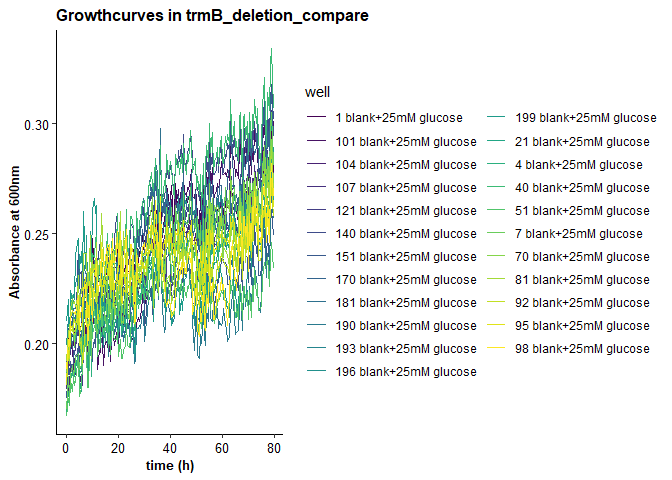
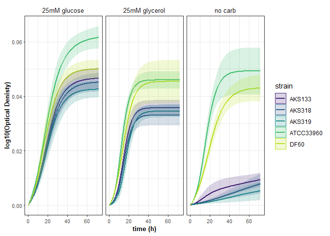
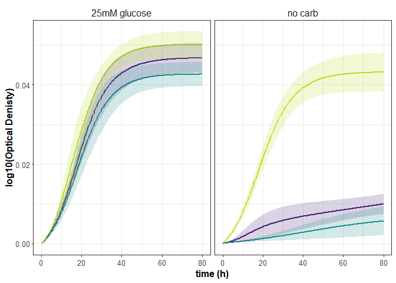

```r
# load required libraries
library(tidyverse)
```

```
## ── Attaching core tidyverse packages ──────────────────────── tidyverse 2.0.0 ──
## ✔ dplyr     1.1.2     ✔ readr     2.1.4
## ✔ forcats   1.0.0     ✔ stringr   1.5.0
## ✔ ggplot2   3.4.2     ✔ tibble    3.2.1
## ✔ lubridate 1.9.2     ✔ tidyr     1.3.0
## ✔ purrr     1.0.1     
## ── Conflicts ────────────────────────────────────────── tidyverse_conflicts() ──
## ✖ dplyr::filter() masks stats::filter()
## ✖ dplyr::lag()    masks stats::lag()
## ℹ Use the conflicted package (<http://conflicted.r-lib.org/>) to force all conflicts to become errors
```

```r
library(viridis)
```

```
## Loading required package: viridisLite
```

```r
library(growthcurver)
library(scales)
```

```
## 
## Attaching package: 'scales'
## 
## The following object is masked from 'package:viridis':
## 
##     viridis_pal
## 
## The following object is masked from 'package:purrr':
## 
##     discard
## 
## The following object is masked from 'package:readr':
## 
##     col_factor
```

```r
library(ggpubr)
library(rstatix)
```

```
## 
## Attaching package: 'rstatix'
## 
## The following object is masked from 'package:stats':
## 
##     filter
```

```r
# custom function, calculated the 95% Confidence interval
conf_int95 <- function(data) {
  n <- length(data)
  error <- qt(0.975, df = n - 1) * sd(data) / sqrt(n)
  return(error)
}
```

##This is where we load the raw data files from the bioscreen, and your plate layout file (called metafile)
Some code also removes rows and columns with data we don't need or that are empty. experiment #1.

```r
expt <- "trmB_deletion_compare"

# set path to files
data <- "raw_growth_data/20220227_hca_trmBs_data.csv"
meta <- "raw_growth_data/20220227_hca_trmBs_meta.csv"

## read in files
mt <- read.csv(meta, stringsAsFactors = F)
mt$expt <- rep(expt, nrow(mt))
dt <- read.csv(data)

# set well no as column names
colnames(dt) <- c("time", seq(1, ncol(dt) - 1))

# remove the first 3 hours, or 6 timepoints.
dt0 <- dt
dt0 <- dt0[-(1:6), ]
dt0$time <- seq(0, length.out = nrow(dt0), by = 0.5) # redo time points
dt0 <- dt0[complete.cases(dt0), ]
```


```r
unite(mt, "ID", c("strain", "condition"), sep = "+")$ID %>%
  str_replace_all(., "\\+$", "") -> ID

# Save new metafile as a different variable. This is good practice!
mt0 <- cbind("variable" = mt$well, ID, mt[-1], stringsAsFactors = F)
mt0 <- mt0 %>% arrange(variable)

## remove rows based on observation (input own row names!!)
mt0 <- mt0 %>% dplyr::slice(-c(10, 110, 20, 88))
dt0 <- dt0 %>% select(!c(`10`, `110`, `20`, `88`))
```


```r
# Convert data from wide to long format
m_dt <- reshape2::melt(dt0, id = "time")
mtdt <- merge(m_dt, mt0, by = "variable")
mtdt$environment <- paste(mtdt$media, mtdt$condition)
well <- paste(mtdt$variable, mtdt$ID, sep = " ")
mtdt <- cbind(well, mtdt)

# time cutoff - this is a usefull function for graphing and analysis. You might not need to look at the full length of the experiment.
t_mtdt <- mtdt[!(mtdt$time >= 80), ]

unique(t_mtdt$condition)
```

```
## [1] "25mM glucose"  "no carb"       "25mM glycerol"
```

```r
unique(t_mtdt$strain)
```

```
## [1] "blank"     "AKS319"    "ATCC33960" "AKS133"    "DF60"      "AKS318"
```

remove blank outliers and plot. external wells are more prone to evaporation and crystallization. 

```r
cond <- "25mM glucose"

filter(t_mtdt, strain == "blank" & condition == cond) %>%
  ggplot(., aes(x = time, y = value, color = well)) + # if you want to know the well number, change color = well
  ggtitle(paste("Growthcurves in", expt)) +
  xlab("time (h)") +
  ylab("Absorbance at 600nm") +
  geom_line() +
  scale_color_viridis(discrete = TRUE) +
  theme_classic() +
  theme( # legend.position = 'none',
    plot.title = element_text(face = "bold", color = "#000000", size = 12, angle = 0),
    axis.title.x = element_text(face = "bold", color = "#000000", size = 10, angle = 0),
    axis.title.y = element_text(face = "bold", color = "#000000", size = 10, angle = 90),
    axis.text.y = element_text(face = "plain", color = "#000000", size = 10, angle = 0),
    axis.text.x = element_text(face = "plain", color = "#000000", size = 10, angle = 0)
  )
```

<!-- -->

```r
filter(t_mtdt, strain == "DF60" & condition == cond) %>%
  ggplot(., aes(x = time, y = value, color = well)) + # if you want to know the well number, change color = well
  ggtitle(paste("Growthcurves in", expt)) +
  xlab("time (h)") +
  ylab("Absorbance at 600nm") +
  geom_line() +
  scale_color_viridis(discrete = TRUE) +
  theme_classic() +
  theme( # legend.position = 'none',
    plot.title = element_text(face = "bold", color = "#000000", size = 12, angle = 0),
    axis.title.x = element_text(face = "bold", color = "#000000", size = 10, angle = 0),
    axis.title.y = element_text(face = "bold", color = "#000000", size = 10, angle = 90),
    axis.text.y = element_text(face = "plain", color = "#000000", size = 10, angle = 0),
    axis.text.x = element_text(face = "plain", color = "#000000", size = 10, angle = 0)
  )
```

<!-- -->

```r
filter(t_mtdt, strain == "AKS133" & condition == cond) %>%
  ggplot(., aes(x = time, y = value, color = well)) + # if you want to know the well number, change color = well
  ggtitle(paste("Growthcurves in", expt)) +
  xlab("time (h)") +
  ylab("Absorbance at 600nm") +
  geom_line() +
  scale_color_viridis(discrete = TRUE) +
  theme_classic() +
  theme( # legend.position = 'none',
    plot.title = element_text(face = "bold", color = "#000000", size = 12, angle = 0),
    axis.title.x = element_text(face = "bold", color = "#000000", size = 10, angle = 0),
    axis.title.y = element_text(face = "bold", color = "#000000", size = 10, angle = 90),
    axis.text.y = element_text(face = "plain", color = "#000000", size = 10, angle = 0),
    axis.text.x = element_text(face = "plain", color = "#000000", size = 10, angle = 0)
  )
```

<!-- -->

```r
filter(t_mtdt, strain == "AKS319" & condition == cond) %>%
  ggplot(., aes(x = time, y = value, color = well)) + # if you want to know the well number, change color = well
  ggtitle(paste("Growthcurves in", expt)) +
  xlab("time (h)") +
  ylab("Absorbance at 600nm") +
  geom_line() +
  scale_color_viridis(discrete = TRUE) +
  theme_classic() +
  theme( # legend.position = 'none',
    plot.title = element_text(face = "bold", color = "#000000", size = 12, angle = 0),
    axis.title.x = element_text(face = "bold", color = "#000000", size = 10, angle = 0),
    axis.title.y = element_text(face = "bold", color = "#000000", size = 10, angle = 90),
    axis.text.y = element_text(face = "plain", color = "#000000", size = 10, angle = 0),
    axis.text.x = element_text(face = "plain", color = "#000000", size = 10, angle = 0)
  )
```

<!-- -->
difference btwn ATCC33960 bioreps (a grows to higher stat than b in glucose, no carb)

average blank wells

```r
filter(mt0, strain == "blank")$variable -> blanks
rowMeans(dt0[colnames(dt0) %in% blanks]) -> blank
dt <- cbind("blank" = blank, dt0[, !names(dt0) %in% blanks])

# subtract average blank from each well
d <- dt[-c(1, 2)] - dt$blank
d$time <- dt$time # add time column back
mins <- Rfast::colMins(as.matrix(d), value = T) # get column minimums
d <- sweep(d, 2, mins, "-") # subtract smallest value for each column
```

Growth curve modeling

```r
# Create an output data frame to store the results in.
num_analyses <- length(names(d)) - 1
d_gc <- data.frame(
  sample = character(num_analyses),
  k = numeric(num_analyses),
  n0 = numeric(num_analyses),
  r = numeric(num_analyses),
  t_mid = numeric(num_analyses),
  t_gen = numeric(num_analyses),
  auc_l = numeric(num_analyses),
  auc_e = numeric(num_analyses),
  sigma = numeric(num_analyses),
  stringsAsFactors = FALSE
)

# Truncate or trim the input data to observations occurring in the first 80 hours.
trim_at_time <- 80.5

# Loop through all of the columns in the data frame. For each column, run Growthcurver.
pdf(paste("figures/", expt, "_growthcurver_fits.pdf", sep = ""), height = 8.5, width = 11)
par(mfcol = c(8, 12))
par(mar = c(0.25, 0.25, 0.25, 0.25))
y_lim_max <- max(d[, setdiff(names(d), "time")], na.rm = T) - min(d[, setdiff(names(d), "time")], na.rm = T)

n <- 1 # keeps track of the current row in the output data frame
for (col_name in names(d)) {
  # Don't process the time column.
  if (col_name != "time") {
    # Create a temporary data frame that contains just the time and current col
    d_loop <- d[c("time", col_name)]

    # Now, call Growthcurver to calculate the metrics using SummarizeGrowth
    gc_fit <- SummarizeGrowth(
      data_t = d_loop$time,
      data_n = d_loop[col_name],
      t_trim = trim_at_time,
      bg_correct = "none"
    )

    if (gc_fit$vals[[16]] == "cannot fit data") {
      d_gc$sample[n] <- col_name
      n <- n + 1
    } else {
      d_gc$sample[n] <- col_name
      d_gc[n, 2:9] <- c(
        gc_fit$vals$k,
        gc_fit$vals$n0,
        gc_fit$vals$r,
        gc_fit$vals$t_mid,
        gc_fit$vals$t_gen,
        gc_fit$vals$auc_l,
        gc_fit$vals$auc_e,
        gc_fit$vals$sigma
      )

      n <- n + 1
      # Finally, plot the raw data and the fitted curve. print some of the data points to keep the file size smaller
      n_obs <- length(gc_fit$data$t)
      idx_to_plot <- 1:20 / 20 * n_obs
      plot(gc_fit$data$t[idx_to_plot], gc_fit$data$N[idx_to_plot],
        pch = 20,
        xlim = c(0, trim_at_time),
        ylim = c(0, y_lim_max),
        cex = 0.6, xaxt = "n", yaxt = "n"
      )
      text(x = trim_at_time / 4, y = y_lim_max, labels = col_name, pos = 1)
      lines(gc_fit$data$t, predict(gc_fit$model), col = "red")
    }
  }
}
dev.off()
```

```
## png 
##   2
```

graph fitted curves:

```r
fitted_curves <- list()

n <- 1 # keeps track of the current row in the output data frame
for (col_name in names(d)) {
  if (col_name != "time") {
    d_loop <- d[c("time", col_name)]
    gc_fit <- SummarizeGrowth(
      data_t = d_loop$time,
      data_n = d_loop[col_name],
      t_trim = trim_at_time,
      bg_correct = "none"
    )
    if (gc_fit$vals[[16]] == "cannot fit data") {
      d_gc$sample[n] <- col_name
      n <- n + 1
    } else {
      fitted_curves[[n]] <- predict(gc_fit$model)
      names(fitted_curves)[n] <- col_name
      n <- n + 1
    }
  }
}

tmp <- Filter(length, fitted_curves)
fits <- as.data.frame(tmp, col.names = names(tmp))
colnames(fits) <- names(tmp)
fits <- cbind("time" = d$time[d$time < trim_at_time], fits)

# re-zero lowest value
mins <- Rfast::colMins(as.matrix(fits), value = T) # get column minimums
fits <- sweep(fits, 2, mins, "-") # subtract smallest value for each column
```


```r
# Convert data from wide to long format
m_dt <- reshape2::melt(fits, id = "time")
mtdt <- merge(m_dt, mt0, by = "variable")
well <- paste(mtdt$variable, mtdt$ID, sep = " ")
mtdt <- cbind(well, mtdt)

t_mtdt2 <- mtdt[!(mtdt$ID == ""), ]

stats2 <- t_mtdt2 %>%
  group_by(ID, strain, condition, time) %>%
  summarise(
    reps = length(value),
    average = mean(value),
    CI95 = conf_int95(value)
  )
```

```
## `summarise()` has grouped output by 'ID', 'strain', 'condition'. You can
## override using the `.groups` argument.
```

```r
unique(stats2$strain)
```

```
## [1] "AKS133"    "AKS318"    "AKS319"    "ATCC33960" "DF60"
```

```r
stats2$average <- stats2$average + 1

# all conditions tested.
stats2 %>%
  ggplot(., aes(x = time, y = log10(average), color = strain)) +
  xlab("time (h)") +
  ylab("log10(Optical Denisty)") +
  geom_line(size = 1) +
  scale_x_continuous(limits = c(0, 72)) +
  geom_ribbon(aes(ymin = log10(average - CI95), ymax = log10(average + CI95), fill = strain, color = NULL), alpha = 0.2) +
  scale_fill_viridis("strain", discrete = TRUE, begin = 0.1, end = 0.9) +
  scale_color_viridis("strain", discrete = TRUE, begin = 0.1, end = 0.9) +
  theme_bw() +
  facet_wrap(~condition) +
  theme(
    axis.title.x = element_text(face = "bold", size = 10, angle = 0), axis.title.y = element_text(face = "bold", size = 10, angle = 90),
    axis.text.y = element_text(size = 8, angle = 0), axis.text.x = element_text(size = 8, angle = 0),
    axis.ticks.length.y.left = unit(.05, "cm"), strip.text = element_text(size = 10),
    strip.background = element_blank(), strip.placement = "outside"
  ) -> fitted.data
```

```
## Warning: Using `size` aesthetic for lines was deprecated in ggplot2 3.4.0.
## ℹ Please use `linewidth` instead.
## This warning is displayed once every 8 hours.
## Call `lifecycle::last_lifecycle_warnings()` to see where this warning was
## generated.
```

```r
plot(fitted.data)
```

```
## Warning: Removed 80 rows containing missing values (`geom_line()`).
```

<!-- -->

```r
stats3 <- t_mtdt2 %>%
  group_by(ID, strain, condition, time, expt) %>%
  summarise(
    reps = length(value),
    average = mean(value) + 1,
    CI95 = conf_int95(value)
  )
```

```
## `summarise()` has grouped output by 'ID', 'strain', 'condition', 'time'. You
## can override using the `.groups` argument.
```

```r
stats3 %>%
  filter(condition == "no carb" | condition == "25mM glucose") %>%
  filter(strain != "AKS318" & strain != "ATCC33960") %>%
  ggplot(., aes(x = time, y = log10(average), color = strain)) +
  xlab("time (h)") +
  ylab("log10(Optical Denisty)") +
  geom_line(size = 1) +
  scale_x_continuous(limits = c(0, 80)) +
  geom_ribbon(aes(ymin = log10(average - CI95), ymax = log10(average + CI95), fill = strain, color = NULL), alpha = 0.2) +
  scale_fill_viridis("strain", discrete = TRUE, begin = 0.1, end = 0.9) +
  scale_color_viridis("strain", discrete = TRUE, begin = 0.1, end = 0.9) +
  theme_bw() +
  facet_wrap(~condition) +
  theme(
    axis.title.x = element_text(face = "bold", size = 12),
    axis.title.y = element_text(face = "bold", size = 12, angle = 90),
    axis.text.y = element_text(size = 10),
    axis.text.x = element_text(size = 10),
    legend.position = "none",
    axis.ticks.length.y.left = unit(.05, "cm"),
    strip.text = element_text(size = 12),
    strip.background = element_blank(),
    strip.placement = "outside"
  ) -> fitted.data
plot(fitted.data)
```

<!-- -->

```r
pdf(paste("figures/", expt, "_fitcurves.pdf", sep = ""), height = 3, width = 4, bg = "transparent")
plot(fitted.data)
dev.off()
```

```
## png 
##   2
```

#TrmB normalized to WT (by condition)
normalize trmB to WT. take average of WT bioreps. calculate ratios of individual trmB bioreps. then average and calc SD/std err

```r
colnames(d_gc)[1] <- "variable"
d_gc[d_gc == 0] <- NA
d_gc <- d_gc[complete.cases(d_gc), ]
(merge(d_gc, mt0) -> tmp)
```

```
##     variable            k           n0           r       t_mid      t_gen
## 1        112 1.149275e-02 0.0132570884 0.059943692  -33.644218  11.563305
## 2        113 1.356223e-01 0.0070239803 0.170095917   17.092495   4.075037
## 3        114 8.262052e-02 0.0023220950 0.203855745   17.381312   3.400185
## 4        115 1.033843e-01 0.0015238553 0.294864879   14.251816   2.350728
## 5        116 1.493982e-01 0.0093946736 0.171605095   15.742684   4.039199
## 6        117 1.628475e-01 0.0110770678 0.149376132   17.522826   4.640281
## 7        118 8.227545e-02 0.0008663728 0.218446849   20.796485   3.173070
## 8        119 7.473195e-02 0.0015948385 0.280193098   13.653311   2.473820
## 9         12 1.547897e-01 0.0151340647 0.124640394   17.829143   5.561176
## 10       122 1.452758e-01 0.0089892897 0.158734506   17.127500   4.366708
## 11       123 1.962683e-02 0.0094455451 0.022797943    3.290127  30.403935
## 12       124 1.092578e-01 0.0057482829 0.100927566   28.641954   6.867769
## 13       125 8.378274e-02 0.0022570608 0.172346386   20.811894   4.021826
## 14       126 8.179459e-02 0.0033199887 0.201318499   15.710497   3.443038
## 15       127 6.100849e-02 0.0004822232 0.310085339   15.584180   2.235343
## 16       128 9.184590e-02 0.0004104342 0.303938103   17.787086   2.280554
## 17       129 1.386798e-01 0.0110452070 0.129636415   18.877219   5.346855
## 18        13 1.010180e-01 0.0038083417 0.192359063   16.841815   3.603403
## 19       132 1.370172e-01 0.0094060682 0.169295444   15.402854   4.094305
## 20       133 1.259783e-01 0.0169053022 0.075806049   24.594215   9.143692
## 21       134 9.425811e-02 0.0057916915 0.175441367   15.539087   3.950877
## 22       135 1.136730e-01 0.0044098819 0.223547653   14.358957   3.100669
## 23       136 2.670056e-02 0.0048416692 0.052267493   28.839113  13.261535
## 24       137 3.276935e-02 0.0027720117 0.059670934   39.911145  11.616161
## 25       138 8.070934e-02 0.0006653391 0.318550221   15.036985   2.175943
## 26       139 8.255430e-02 0.0008335104 0.360118340   12.733085   1.924776
## 27        14 9.824174e-02 0.0030721987 0.236066837   14.543620   2.936233
## 28       142 1.208072e-01 0.0123527214 0.120960484   17.960035   5.730361
## 29       143 9.842959e-02 0.0138016272 0.004360865  415.852834 158.947162
## 30       144 1.644203e-01 0.0202730788 0.104993710   18.682467   6.601797
## 31       145 1.275857e-01 0.0130073591 0.094280515   23.077338   7.351966
## 32       146 7.374679e-02 0.0010026901 0.237641979   18.028218   2.916771
## 33       147 9.097428e-02 0.0056402935 0.197234950   13.773607   3.514322
## 34       148 1.493286e-01 0.0139585332 0.142295317   15.966239   4.871188
## 35       149 1.586515e-01 0.0127947930 0.162183747   15.005119   4.273839
## 36        15 2.910505e-02 0.0052881080 0.039185644   38.405309  17.688804
## 37       152 1.361589e-01 0.0165389061 0.091480098   21.628801   7.577027
## 38       153 7.225253e-02 0.0031133356 0.216160593   14.343165   3.206631
## 39       154 2.326473e-02 0.0027984616 0.123394347   16.124794   5.617333
## 40       155 8.695063e-02 0.0009396518 0.272958011   16.547310   2.539391
## 41       156 3.203143e-02 0.0055120029 0.063295306   24.819368  10.951004
## 42       157 2.531459e-02 0.0053089372 0.046189055   28.721589  15.006741
## 43       158 1.064943e+04 0.0129713831 0.006919021 1968.236509 100.179951
## 44       159 9.985685e-02 0.0019680484 0.296881724   13.159415   2.334759
## 45        16 1.053552e-01 0.0031107613 0.329101259   10.612232   2.106182
## 46       162 1.206632e-01 0.0144617784 0.118201486   16.868047   5.864116
## 47       163 1.761986e-01 0.0177345716 0.125651550   17.429244   5.516424
## 48       164 1.983059e-01 0.0161773175 0.128784594   18.799632   5.382221
## 49       165 2.183382e-02 0.0040870732 0.044526121   32.977796  15.567203
## 50       166 8.339647e-02 0.0065374146 0.152628962   16.146553   4.541387
## 51       167 1.220815e-01 0.0117692086 0.137331520   16.295082   5.047255
## 52       168 1.340389e-01 0.0127841864 0.134503216   16.725878   5.153387
## 53       169 1.322355e-01 0.0072410259 0.237934726   11.971800   2.913182
## 54        17 4.846592e-02 0.0070917537 0.039419789   44.742094  17.583736
## 55       172 8.465311e-02 0.0034460002 0.233867598   13.511015   2.963844
## 56       173 1.268859e-01 0.0110662232 0.102296371   22.954251   6.775873
## 57       174 1.001305e-01 0.0079506646 0.116975882   20.948645   5.925556
## 58       175 9.573835e-02 0.0044545255 0.228737378   13.203146   3.030319
## 59       176 1.133987e-01 0.0091583724 0.134377421   18.098509   5.158212
## 60       177 9.375397e-02 0.0079221932 0.166152529   14.340565   4.171752
## 61       178 3.168575e-02 0.0018898310 0.176599506   15.616601   3.924967
## 62       179 1.214449e-01 0.0079525474 0.160026417   16.611278   4.331455
## 63        18 1.371796e-01 0.0080917884 0.195819947   14.143825   3.539717
## 64       182 9.851283e-02 0.0105149579 0.137089015   15.497331   5.056183
## 65       183 1.031746e-01 0.0102250760 0.115373912   19.130955   6.007833
## 66       184 1.101145e-01 0.0122282927 0.147799856   14.073444   4.689769
## 67       185 1.217946e-01 0.0081106513 0.142972411   18.466808   4.848118
## 68       186 1.073483e-01 0.0056852031 0.159185385   18.115971   4.354339
## 69       187 2.916888e-02 0.0021531166 0.251226996   10.068600   2.759047
## 70       188 1.381159e-01 0.0172885179 0.128061259   15.182735   5.412622
## 71       189 8.825878e-02 0.0047556800 0.239142337   11.982588   2.898471
## 72        19 1.274097e-01 0.0142692838 0.119174297   17.373881   5.816247
## 73        22 1.193098e-01 0.0119505785 0.132937095   16.514586   5.214099
## 74        23 7.379959e-02 0.0014276712 0.262390182   14.961588   2.641666
## 75        24 9.087394e+03 0.0094860349 0.016438809  837.808686  42.165292
## 76        25 8.719060e-02 0.0027294047 0.219130628   15.662843   3.163169
## 77        26 7.416070e-02 0.0062254962 0.030905498   77.329322  22.427957
## 78        27 1.225278e-01 0.0079918186 0.128971303   20.643898   5.374430
## 79        28 2.279555e-01 0.0416266950 0.059331724   25.260874  11.682573
## 80        29 1.677748e-01 0.0128750284 0.143921724   17.283623   4.816140
## 81        32 2.353281e-02 0.0076528377 0.030099925   24.251971  23.028203
## 82        33 1.240731e-01 0.0064011653 0.203361504   14.316477   3.408448
## 83        34 1.819735e-01 0.0302699474 0.074469199   21.643480   9.307837
## 84        35 1.422961e-01 0.0139722786 0.120679574   18.374953   5.743699
## 85        36 2.807171e+04 0.0050645329 0.020499606  757.478500  33.812707
## 86        37 1.003350e-01 0.0039507565 0.182953857   17.460337   3.788645
## 87        38 1.637568e-01 0.0123644707 0.152908849   16.382618   4.533074
## 88        39 8.865094e-02 0.0015916348 0.237372802   16.858831   2.920078
## 89        42 7.576540e-02 0.0003339298 0.350427603   15.466958   1.978004
## 90        43 1.149044e-01 0.0027767369 0.195481778   18.919212   3.545840
## 91        44 1.291322e-01 0.0145794709 0.086387590   23.862467   8.023689
## 92        45 1.354004e-01 0.0148130456 0.091057567   23.027920   7.612187
## 93        46 6.774540e+03 0.0069775371 0.013725216 1004.427551  50.501732
## 94        47 1.501996e-01 0.0090590159 0.141796906   19.365696   4.888310
## 95        48 3.141313e-02 0.0039531179 0.048257860   40.163952  14.363405
## 96        49 4.409320e-02 0.0041102571 0.047032443   48.370171  14.737639
## 97        52 1.080347e-01 0.0065376543 0.136274853   20.124415   5.086391
## 98        53 1.196423e-01 0.0038106767 0.219251591   15.572660   3.161424
## 99        54 8.341172e-02 0.0012340745 0.247578329   16.958520   2.799709
## 100       55 8.366207e-02 0.0021190744 0.221474040   16.481169   3.129699
## 101       56 8.766960e-02 0.0024558397 0.212867835   16.661485   3.256233
## 102       57 3.944162e-02 0.0055501076 0.035199271   51.402974  19.692089
## 103       58 1.230040e-01 0.0068613117 0.152461719   18.554956   4.546369
## 104       59 1.268936e-01 0.0030536131 0.319927832   11.573437   2.166574
## 105       62 1.132089e-01 0.0044039113 0.275358083   11.646885   2.517257
## 106       63 1.206194e-01 0.0060195003 0.170386155   17.292734   4.068096
## 107       64 1.303946e-01 0.0062569452 0.163226697   18.303986   4.246531
## 108       65 8.526156e-02 0.0014710150 0.246118447   16.424480   2.816315
## 109       66 9.264840e-02 0.0048101528 0.147818694   19.650885   4.689171
## 110       67 1.190217e-01 0.0046142918 0.175508011   18.293226   3.949376
## 111       68 1.531162e-01 0.0061948153 0.196555982   16.108311   3.526462
## 112       69 1.056705e-01 0.0022410055 0.301700080   12.701240   2.297471
## 113       72 1.462163e-01 0.0118281688 0.141765236   17.142767   4.889402
## 114       73 1.314952e-01 0.0075782173 0.231423811   12.074530   2.995142
## 115       74 1.458491e-01 0.0159908845 0.100638750   20.811310   6.887478
## 116       75 1.427414e-01 0.0125765637 0.115648102   20.207565   5.993589
## 117       76 1.314933e-01 0.0141802015 0.092356383   22.878759   7.505136
## 118       77 1.012235e-01 0.0025975725 0.272567038   13.342614   2.543034
## 119       78 1.197387e-01 0.0047872139 0.177245726   17.933080   3.910657
## 120       79 1.268428e-01 0.0176403826 0.114189227   15.964836   6.070163
## 121       82 9.818304e-02 0.0039471004 0.228195228   13.903974   3.037518
## 122       83 1.111722e-01 0.0051603916 0.219195062   13.789261   3.162239
## 123       84 2.176812e-02 0.0255961528 0.032742500  -58.031302  21.169647
## 124       85 1.067158e-01 0.0078028048 0.157542487   16.121092   4.399748
## 125       86 1.014520e-01 0.0090761343 0.138839043   16.711563   4.992451
## 126       87 1.751167e-01 0.0236233085 0.097754953   19.009864   7.090660
## 127       89 9.843671e-02 0.0015237036 0.433318677    9.583408   1.599625
##          auc_l      auc_e       sigma                      ID    strain
## 1    0.9523433  0.9443551 0.005079764          AKS319+no carb    AKS319
## 2    8.5570860  8.4587862 0.007018844       ATCC33960+no carb ATCC33960
## 3    5.2033461  5.1687862 0.007754180    AKS133+25mM glycerol    AKS133
## 4    6.8438137  6.8113551 0.009850471 ATCC33960+25mM glycerol ATCC33960
## 5    9.6180971  9.5250362 0.008614844      DF60+25mM glycerol      DF60
## 6   10.1789664 10.0800362 0.011423274  ATCC33960+25mM glucose ATCC33960
## 7    4.9081472  4.8844565 0.006096343    AKS319+25mM glycerol    AKS319
## 8    4.9898298  4.9601123 0.006743078    AKS133+25mM glycerol    AKS133
## 9    9.5735303  9.4577862 0.010085454       DF60+25mM glucose      DF60
## 10   9.1480687  9.0313551 0.011556901  ATCC33960+25mM glucose ATCC33960
## 11   1.0869741  1.0798732 0.006086245          AKS318+no carb    AKS318
## 12   5.6131478  5.5306739 0.005712298     AKS319+25mM glucose    AKS319
## 13   4.9875740  4.9521739 0.005415994    AKS319+25mM glycerol    AKS319
## 14   5.2825963  5.2400362 0.006481319    AKS133+25mM glycerol    AKS133
## 15   3.9588549  3.9474239 0.007815839    AKS318+25mM glycerol    AKS318
## 16   5.7585707  5.7509239 0.005547154    AKS319+25mM glycerol    AKS319
## 17   8.4574128  8.3503623 0.010191962       DF60+25mM glucose      DF60
## 18   6.4104416  6.3547862 0.007226540    AKS318+25mM glycerol    AKS318
## 19   8.8618859  8.7737862 0.007348886      DF60+25mM glycerol      DF60
## 20   6.8272771  6.7117862 0.012366535     AKS133+25mM glucose    AKS133
## 21   6.0890288  6.0337862 0.004601561      DF60+25mM glycerol      DF60
## 22   7.4983321  7.4476051 0.008373025 ATCC33960+25mM glycerol ATCC33960
## 23   1.3103876  1.3038732 0.004831937          AKS133+no carb    AKS133
## 24   1.3282261  1.3428732 0.006643733          AKS319+no carb    AKS319
## 25   5.2813791  5.2532029 0.006016557    AKS133+25mM glycerol    AKS133
## 26   5.5921241  5.5667355 0.005586150    AKS318+25mM glycerol    AKS318
## 27   6.4664474  6.4162862 0.005981274    AKS133+25mM glycerol    AKS133
## 28   7.4480693  7.3492862 0.011228025     AKS319+25mM glucose    AKS319
## 29   1.2932490  1.2849710 0.005507590          AKS319+no carb    AKS319
## 30   9.9603631  9.8462862 0.011415292  ATCC33960+25mM glucose ATCC33960
## 31   7.1868091  7.0697862 0.013183664     AKS318+25mM glucose    AKS318
## 32   4.6028454  4.5759239 0.005788811    AKS319+25mM glycerol    AKS319
## 33   6.0408649  5.9819239 0.006745599      DF60+25mM glycerol      DF60
## 34   9.5338547  9.4102862 0.012186023  ATCC33960+25mM glucose ATCC33960
## 35  10.3086317 10.1920362 0.010861397  ATCC33960+25mM glucose ATCC33960
## 36   1.2067772  1.1956667 0.005762665          AKS319+no carb    AKS319
## 37   7.8298934  7.7253623 0.010947739     AKS133+25mM glucose    AKS133
## 38   4.7652764  4.7409239 0.006229844    AKS318+25mM glycerol    AKS318
## 39   1.4735757  1.4701232 0.004498955          AKS133+no carb    AKS133
## 40   5.5572654  5.5210362 0.005467180    AKS319+25mM glycerol    AKS319
## 41   1.7026642  1.6844565 0.004501313          AKS133+no carb    AKS133
## 42   1.2297297  1.2154167 0.006765754          AKS318+no carb    AKS318
## 43   1.3974241  1.3869819 0.004310301          AKS133+no carb    AKS133
## 44   6.7177236  6.6739855 0.005362522    AKS133+25mM glycerol    AKS133
## 45   7.3534456  7.3262862 0.018380893 ATCC33960+25mM glycerol ATCC33960
## 46   7.5482625  7.4683551 0.007996712     AKS133+25mM glucose    AKS133
## 47  10.9647246 10.8567862 0.011022751  ATCC33960+25mM glucose ATCC33960
## 48  12.1050578 11.9982862 0.013606803  ATCC33960+25mM glucose ATCC33960
## 49   0.9917579  0.9895217 0.004253472          AKS319+no carb    AKS319
## 50   5.3222761  5.2651051 0.004822070            DF60+no carb      DF60
## 51   7.7482459  7.6558551 0.008955084     AKS319+25mM glucose    AKS319
## 52   8.4485093  8.3452862 0.008845349     AKS133+25mM glucose    AKS133
## 53   9.0305655  8.9432862 0.006699410      DF60+25mM glycerol      DF60
## 54   1.8072113  1.7881667 0.006593786          AKS318+no carb    AKS318
## 55   5.6557830  5.6320362 0.010633890       ATCC33960+no carb ATCC33960
## 56   7.1919914  7.1093551 0.009727101     AKS318+25mM glucose    AKS318
## 57   5.8928975  5.8154855 0.007662574     AKS319+25mM glucose    AKS319
## 58   6.4229475  6.3716051 0.005713515    AKS319+25mM glycerol    AKS319
## 59   7.0053786  6.9254855 0.009244650     AKS318+25mM glucose    AKS318
## 60   6.1529030  6.0870362 0.007157739      DF60+25mM glycerol      DF60
## 61   2.0448473  2.0366051 0.004482066          AKS133+no carb    AKS133
## 62   7.7075907  7.6216051 0.007808675     AKS318+25mM glucose    AKS318
## 63   9.0601225  8.9650362 0.009334154 ATCC33960+25mM glycerol ATCC33960
## 64   6.3225816  6.2611051 0.007183549     AKS319+25mM glucose    AKS319
## 65   6.2391462  6.1551413 0.007938517     AKS133+25mM glucose    AKS133
## 66   7.2268648  7.1496051 0.008693720     AKS318+25mM glucose    AKS318
## 67   7.4967221  7.4279783 0.009234275            DF60+no carb      DF60
## 68   6.6601594  6.5981739 0.009383559            DF60+no carb      DF60
## 69   2.0455017  2.0284239 0.003204627          AKS133+no carb    AKS133
## 70   8.8773725  8.7783551 0.007364032       DF60+25mM glucose      DF60
## 71   6.0268209  5.9657283 0.005412521      DF60+25mM glycerol      DF60
## 72   7.9164688  7.8052862 0.010147452            DF60+no carb      DF60
## 73   7.5395473  7.4584819 0.010035635     AKS319+25mM glucose    AKS319
## 74   4.8312136  4.8091522 0.006596963    AKS318+25mM glycerol    AKS318
## 75   1.5902849  1.5738732 0.004600064          AKS318+no carb    AKS318
## 76   5.6405364  5.6002862 0.005218005    AKS318+25mM glycerol    AKS318
## 77   1.5733253  1.5579565 0.005266267          AKS133+no carb    AKS133
## 78   7.2703773  7.1759855 0.010726726       DF60+25mM glucose      DF60
## 79  11.9596347 11.7885362 0.022074072  ATCC33960+25mM glucose ATCC33960
## 80  10.5131700 10.3743080 0.010143827       ATCC33960+no carb ATCC33960
## 81   1.1481741  1.1401232 0.005471219          AKS319+no carb    AKS319
## 82   8.1792760  8.1075362 0.009368015 ATCC33960+25mM glycerol ATCC33960
## 83  10.2960786 10.1530362 0.016938766  ATCC33960+25mM glucose ATCC33960
## 84   8.7189386  8.6167862 0.010334535       DF60+25mM glucose      DF60
## 85   1.0396364  1.0323732 0.004275004          AKS133+no carb    AKS133
## 86   6.3030612  6.2346051 0.006748524     AKS133+25mM glucose    AKS133
## 87  10.4156363 10.3017862 0.008426665      DF60+25mM glycerol      DF60
## 88   5.6350837  5.5899783 0.007437872    AKS318+25mM glycerol    AKS318
## 89   4.9262994  4.9149855 0.005306606    AKS319+25mM glycerol    AKS319
## 90   7.0615249  7.0404565 0.008006249       ATCC33960+no carb ATCC33960
## 91   7.1458214  7.0505362 0.008642738            DF60+no carb      DF60
## 92   7.6173736  7.5175362 0.010192289            DF60+no carb      DF60
## 93   1.0263349  1.0196232 0.006103011          AKS319+no carb    AKS319
## 94   9.1166334  9.0037862 0.007042195       ATCC33960+no carb ATCC33960
## 95   1.2664038  1.2626667 0.006283731          AKS318+no carb    AKS318
## 96   1.5118984  1.5006449 0.006039864          AKS318+no carb    AKS318
## 97   6.4733860  6.3845580 0.010335590     AKS319+25mM glucose    AKS319
## 98   7.7503909  7.6755362 0.008331501 ATCC33960+25mM glycerol ATCC33960
## 99   5.2950823  5.2917065 0.006734386    AKS319+25mM glycerol    AKS319
## 100  5.3462569  5.3142065 0.006055523    AKS318+25mM glycerol    AKS318
## 101  5.5849963  5.5572065 0.006707223    AKS133+25mM glycerol    AKS133
## 102  1.3214888  1.3091232 0.005912849          AKS318+no carb    AKS318
## 103  7.5732424  7.4760362 0.012024040       DF60+25mM glucose      DF60
## 104  8.7366764  8.6677862 0.009783827       DF60+25mM glucose      DF60
## 105  7.7784706  7.7348551 0.009877705 ATCC33960+25mM glycerol ATCC33960
## 106  7.5877953  7.4999565 0.010553650     AKS133+25mM glucose    AKS133
## 107  8.0707736  7.9744565 0.010973112     AKS318+25mM glucose    AKS318
## 108  5.4571501  5.4229565 0.006754375    AKS133+25mM glycerol    AKS133
## 109  5.6042350  5.5362065 0.005625296            DF60+no carb      DF60
## 110  7.3771555  7.2874565 0.011800769     AKS133+25mM glucose    AKS133
## 111  9.8272398  9.7191051 0.009349673       ATCC33960+no carb ATCC33960
## 112  7.1568178  7.1143080 0.008036977       ATCC33960+no carb ATCC33960
## 113  9.1769882  9.0751051 0.009943811     AKS133+25mM glucose    AKS133
## 114  8.9638930  8.8957862 0.008752011 ATCC33960+25mM glycerol ATCC33960
## 115  8.5408050  8.4231051 0.012372396       DF60+25mM glucose      DF60
## 116  8.4935421  8.3860362 0.009834411     AKS133+25mM glucose    AKS133
## 117  7.4212784  7.3108551 0.012834439     AKS318+25mM glucose    AKS318
## 118  6.7882507  6.7589819 0.008233115    AKS133+25mM glycerol    AKS133
## 119  7.4641302  7.3717029 0.008559656     AKS319+25mM glucose    AKS319
## 120  8.0201806  7.9153551 0.009801285            DF60+no carb      DF60
## 121  6.5209462  6.4859529 0.013074533       ATCC33960+no carb ATCC33960
## 122  7.3922724  7.3133551 0.006740325      DF60+25mM glycerol      DF60
## 123  1.8528687  1.7098080 0.009567967          AKS318+no carb    AKS318
## 124  6.8188385  6.7299855 0.007985522       DF60+25mM glucose      DF60
## 125  6.4030861  6.3154565 0.009001561     AKS318+25mM glucose    AKS318
## 126 10.5127479 10.3872862 0.013832234  ATCC33960+25mM glucose ATCC33960
## 127  6.9772518  6.9567862 0.011951786 ATCC33960+25mM glycerol ATCC33960
##         media     condition biorep techrep                  expt
## 1   Hh-CA+ura       no carb      b       1 trmB_deletion_compare
## 2   Hh-CA+ura       no carb      a       3 trmB_deletion_compare
## 3   Hh-CA+ura 25mM glycerol      b       3 trmB_deletion_compare
## 4   Hh-CA+ura 25mM glycerol      b       2 trmB_deletion_compare
## 5   Hh-CA+ura 25mM glycerol      a       4 trmB_deletion_compare
## 6   Hh-CA+ura  25mM glucose      b       5 trmB_deletion_compare
## 7   Hh-CA+ura 25mM glycerol      b       4 trmB_deletion_compare
## 8   Hh-CA+ura 25mM glycerol      a       5 trmB_deletion_compare
## 9   Hh-CA+ura  25mM glucose      a       2 trmB_deletion_compare
## 10  Hh-CA+ura  25mM glucose      b       2 trmB_deletion_compare
## 11  Hh-CA+ura       no carb      a       1 trmB_deletion_compare
## 12  Hh-CA+ura  25mM glucose      b       3 trmB_deletion_compare
## 13  Hh-CA+ura 25mM glycerol      a       4 trmB_deletion_compare
## 14  Hh-CA+ura 25mM glycerol      b       1 trmB_deletion_compare
## 15  Hh-CA+ura 25mM glycerol      a       3 trmB_deletion_compare
## 16  Hh-CA+ura 25mM glycerol      b       2 trmB_deletion_compare
## 17  Hh-CA+ura  25mM glucose      b       3 trmB_deletion_compare
## 18  Hh-CA+ura 25mM glycerol      b       3 trmB_deletion_compare
## 19  Hh-CA+ura 25mM glycerol      a       1 trmB_deletion_compare
## 20  Hh-CA+ura  25mM glucose      b       2 trmB_deletion_compare
## 21  Hh-CA+ura 25mM glycerol      b       5 trmB_deletion_compare
## 22  Hh-CA+ura 25mM glycerol      a       5 trmB_deletion_compare
## 23  Hh-CA+ura       no carb      b       3 trmB_deletion_compare
## 24  Hh-CA+ura       no carb      a       2 trmB_deletion_compare
## 25  Hh-CA+ura 25mM glycerol      a       1 trmB_deletion_compare
## 26  Hh-CA+ura 25mM glycerol      b       1 trmB_deletion_compare
## 27  Hh-CA+ura 25mM glycerol      b       4 trmB_deletion_compare
## 28  Hh-CA+ura  25mM glucose      a       2 trmB_deletion_compare
## 29  Hh-CA+ura       no carb      b       2 trmB_deletion_compare
## 30  Hh-CA+ura  25mM glucose      b       3 trmB_deletion_compare
## 31  Hh-CA+ura  25mM glucose      b       2 trmB_deletion_compare
## 32  Hh-CA+ura 25mM glycerol      b       1 trmB_deletion_compare
## 33  Hh-CA+ura 25mM glycerol      b       4 trmB_deletion_compare
## 34  Hh-CA+ura  25mM glucose      b       1 trmB_deletion_compare
## 35  Hh-CA+ura  25mM glucose      b       4 trmB_deletion_compare
## 36  Hh-CA+ura       no carb      a       4 trmB_deletion_compare
## 37  Hh-CA+ura  25mM glucose      b       3 trmB_deletion_compare
## 38  Hh-CA+ura 25mM glycerol      a       1 trmB_deletion_compare
## 39  Hh-CA+ura       no carb      b       2 trmB_deletion_compare
## 40  Hh-CA+ura 25mM glycerol      a       2 trmB_deletion_compare
## 41  Hh-CA+ura       no carb      a       1 trmB_deletion_compare
## 42  Hh-CA+ura       no carb      a       4 trmB_deletion_compare
## 43  Hh-CA+ura       no carb      a       4 trmB_deletion_compare
## 44  Hh-CA+ura 25mM glycerol      a       2 trmB_deletion_compare
## 45  Hh-CA+ura 25mM glycerol      a       1 trmB_deletion_compare
## 46  Hh-CA+ura  25mM glucose      a       4 trmB_deletion_compare
## 47  Hh-CA+ura  25mM glucose      a       1 trmB_deletion_compare
## 48  Hh-CA+ura  25mM glucose      a       3 trmB_deletion_compare
## 49  Hh-CA+ura       no carb      b       4 trmB_deletion_compare
## 50  Hh-CA+ura       no carb      b       3 trmB_deletion_compare
## 51  Hh-CA+ura  25mM glucose      a       3 trmB_deletion_compare
## 52  Hh-CA+ura  25mM glucose      b       1 trmB_deletion_compare
## 53  Hh-CA+ura 25mM glycerol      a       3 trmB_deletion_compare
## 54  Hh-CA+ura       no carb      a       3 trmB_deletion_compare
## 55  Hh-CA+ura       no carb      b       2 trmB_deletion_compare
## 56  Hh-CA+ura  25mM glucose      a       4 trmB_deletion_compare
## 57  Hh-CA+ura  25mM glucose      b       1 trmB_deletion_compare
## 58  Hh-CA+ura 25mM glycerol      a       3 trmB_deletion_compare
## 59  Hh-CA+ura  25mM glucose      a       1 trmB_deletion_compare
## 60  Hh-CA+ura 25mM glycerol      b       1 trmB_deletion_compare
## 61  Hh-CA+ura       no carb      b       1 trmB_deletion_compare
## 62  Hh-CA+ura  25mM glucose      b       4 trmB_deletion_compare
## 63  Hh-CA+ura 25mM glycerol      a       4 trmB_deletion_compare
## 64  Hh-CA+ura  25mM glucose      a       1 trmB_deletion_compare
## 65  Hh-CA+ura  25mM glucose      a       2 trmB_deletion_compare
## 66  Hh-CA+ura  25mM glucose      b       1 trmB_deletion_compare
## 67  Hh-CA+ura       no carb      b       2 trmB_deletion_compare
## 68  Hh-CA+ura       no carb      b       4 trmB_deletion_compare
## 69  Hh-CA+ura       no carb      a       3 trmB_deletion_compare
## 70  Hh-CA+ura  25mM glucose      a       1 trmB_deletion_compare
## 71  Hh-CA+ura 25mM glycerol      b       2 trmB_deletion_compare
## 72  Hh-CA+ura       no carb      a       4 trmB_deletion_compare
## 73  Hh-CA+ura  25mM glucose      a       4 trmB_deletion_compare
## 74  Hh-CA+ura 25mM glycerol      a       2 trmB_deletion_compare
## 75  Hh-CA+ura       no carb      b       1 trmB_deletion_compare
## 76  Hh-CA+ura 25mM glycerol      b       2 trmB_deletion_compare
## 77  Hh-CA+ura       no carb      b       4 trmB_deletion_compare
## 78  Hh-CA+ura  25mM glucose      b       4 trmB_deletion_compare
## 79  Hh-CA+ura  25mM glucose      a       4 trmB_deletion_compare
## 80  Hh-CA+ura       no carb      a       1 trmB_deletion_compare
## 81  Hh-CA+ura       no carb      b       3 trmB_deletion_compare
## 82  Hh-CA+ura 25mM glycerol      a       3 trmB_deletion_compare
## 83  Hh-CA+ura  25mM glucose      a       5 trmB_deletion_compare
## 84  Hh-CA+ura  25mM glucose      a       3 trmB_deletion_compare
## 85  Hh-CA+ura       no carb      a       2 trmB_deletion_compare
## 86  Hh-CA+ura  25mM glucose      a       3 trmB_deletion_compare
## 87  Hh-CA+ura 25mM glycerol      a       2 trmB_deletion_compare
## 88  Hh-CA+ura 25mM glycerol      a       4 trmB_deletion_compare
## 89  Hh-CA+ura 25mM glycerol      a       1 trmB_deletion_compare
## 90  Hh-CA+ura       no carb      b       3 trmB_deletion_compare
## 91  Hh-CA+ura       no carb      a       2 trmB_deletion_compare
## 92  Hh-CA+ura       no carb      a       1 trmB_deletion_compare
## 93  Hh-CA+ura       no carb      a       1 trmB_deletion_compare
## 94  Hh-CA+ura       no carb      a       2 trmB_deletion_compare
## 95  Hh-CA+ura       no carb      b       2 trmB_deletion_compare
## 96  Hh-CA+ura       no carb      b       3 trmB_deletion_compare
## 97  Hh-CA+ura  25mM glucose      b       4 trmB_deletion_compare
## 98  Hh-CA+ura 25mM glycerol      b       4 trmB_deletion_compare
## 99  Hh-CA+ura 25mM glycerol      b       3 trmB_deletion_compare
## 100 Hh-CA+ura 25mM glycerol      b       4 trmB_deletion_compare
## 101 Hh-CA+ura 25mM glycerol      a       3 trmB_deletion_compare
## 102 Hh-CA+ura       no carb      a       2 trmB_deletion_compare
## 103 Hh-CA+ura  25mM glucose      b       5 trmB_deletion_compare
## 104 Hh-CA+ura  25mM glucose      a       4 trmB_deletion_compare
## 105 Hh-CA+ura 25mM glycerol      b       1 trmB_deletion_compare
## 106 Hh-CA+ura  25mM glucose      a       5 trmB_deletion_compare
## 107 Hh-CA+ura  25mM glucose      b       3 trmB_deletion_compare
## 108 Hh-CA+ura 25mM glycerol      a       4 trmB_deletion_compare
## 109 Hh-CA+ura       no carb      b       1 trmB_deletion_compare
## 110 Hh-CA+ura  25mM glucose      a       1 trmB_deletion_compare
## 111 Hh-CA+ura       no carb      a       4 trmB_deletion_compare
## 112 Hh-CA+ura       no carb      b       4 trmB_deletion_compare
## 113 Hh-CA+ura  25mM glucose      b       5 trmB_deletion_compare
## 114 Hh-CA+ura 25mM glycerol      a       2 trmB_deletion_compare
## 115 Hh-CA+ura  25mM glucose      b       1 trmB_deletion_compare
## 116 Hh-CA+ura  25mM glucose      b       4 trmB_deletion_compare
## 117 Hh-CA+ura  25mM glucose      a       3 trmB_deletion_compare
## 118 Hh-CA+ura 25mM glycerol      b       2 trmB_deletion_compare
## 119 Hh-CA+ura  25mM glucose      b       2 trmB_deletion_compare
## 120 Hh-CA+ura       no carb      a       3 trmB_deletion_compare
## 121 Hh-CA+ura       no carb      b       1 trmB_deletion_compare
## 122 Hh-CA+ura 25mM glycerol      b       3 trmB_deletion_compare
## 123 Hh-CA+ura       no carb      b       4 trmB_deletion_compare
## 124 Hh-CA+ura  25mM glucose      b       2 trmB_deletion_compare
## 125 Hh-CA+ura  25mM glucose      a       2 trmB_deletion_compare
## 126 Hh-CA+ura  25mM glucose      a       2 trmB_deletion_compare
## 127 Hh-CA+ura 25mM glycerol      b       3 trmB_deletion_compare
```

```r
# t-test considering technical replicates distinct.
tmp %>%
  filter(condition != "25mM glycerol") %>%
  filter(strain != "AKS318" & strain != "ATCC33960") -> tmp2

vals <- tmp2 %>%
  group_by(condition) %>%
  t_test(auc_e ~ strain, comparisons = list(c("DF60", "AKS319"), c("DF60", "AKS133"), c("AKS319", "AKS133")), p.adjust.method = "fdr") %>%
  add_y_position(fun = "mean_sd")

ggboxplot(tmp2,
  x = "strain", y = "auc_e",
  fill = "strain", add = "jitter",
  facet.by = "condition", size = 0.8, ylab = "AUC"
) +
  stat_pvalue_manual(vals, label = "p.adj.signif", tip.length = 0.01) +
  scale_fill_viridis("x", discrete = TRUE, begin = 0.1, end = 0.9, alpha = 0.8) +
  ylim(0, 13) +
  theme_bw() +
  theme(
    axis.title.y = element_text(face = "bold", size = 12, angle = 90),
    axis.text.y = element_text(size = 10, angle = 0),
    axis.text.x = element_text(size = 10, angle = 0),
    axis.title.x = element_text(face = "bold", size = 12),
    axis.ticks.length.y.left = unit(.05, "cm"),
    strip.text = element_text(size = 12),
    strip.background = element_blank(),
    strip.placement = "outside",
    legend.position = "none"
  ) -> auc
plot(auc)
```

<!-- -->

```r
pdf(paste("figures/", expt, "_auc.pdf", sep = ""), height = 3, width = 4, bg = "transparent")
plot(auc)
dev.off()
```

```
## png 
##   2
```
